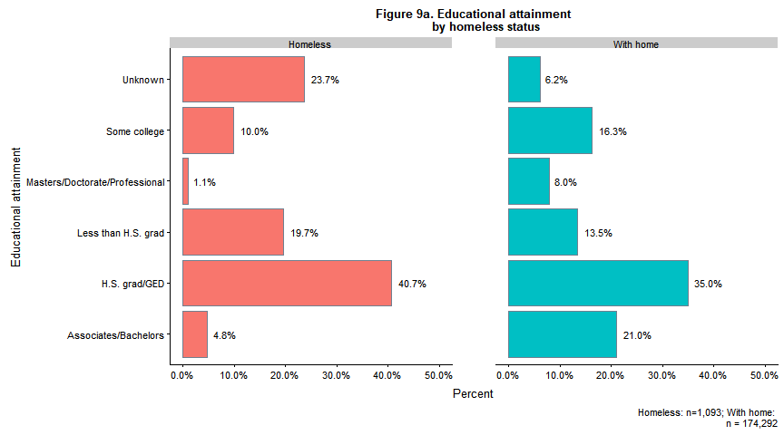
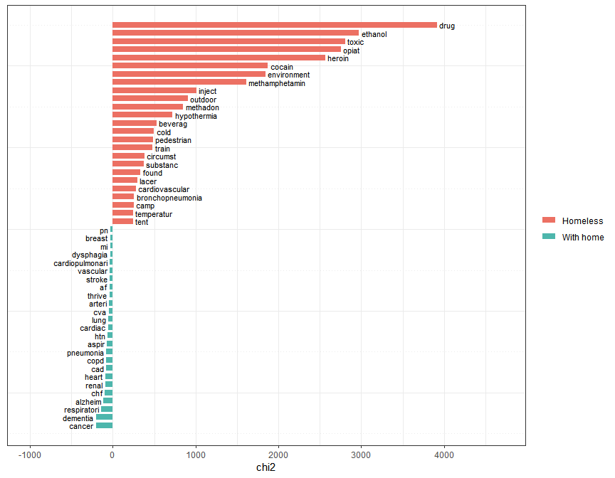
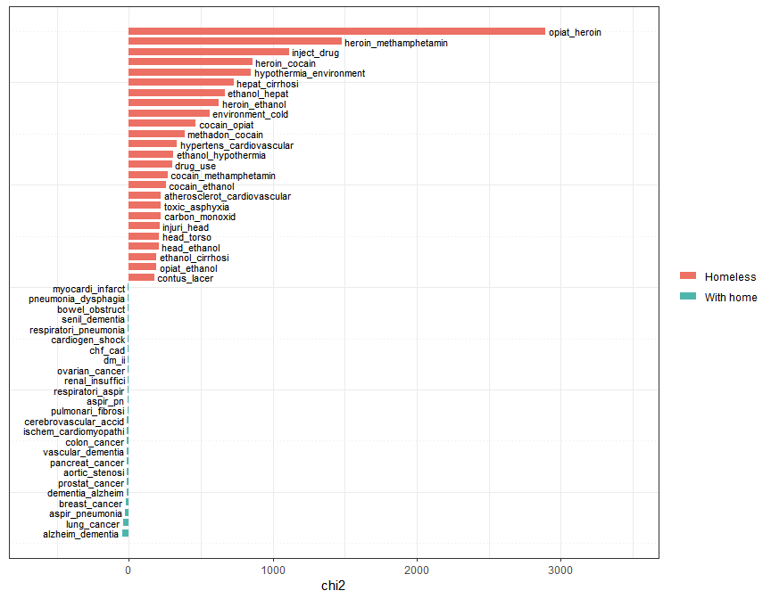

Classifying deaths in Washington State by homelessness status
================
Maya Bhat-Gregerson
Fall 2018

-   [I. Overview](#i.-overview)
-   [II. Data pre-processing](#ii.-data-pre-processing)
    -   [A. Overview](#a.-overview)
    -   [B. Washington State mortality data - pre-processing](#b.-washington-state-mortality-data---pre-processing)
    -   [C. King County Medical Examiner\`s Homeless Death Registry data - November 2003 to September 2017](#c.-king-county-medical-examiners-homeless-death-registry-data---november-2003-to-september-2017)
-   [III. EXPLORATORY DATA ANALYSIS](#iii.-exploratory-data-analysis)
    -   [A. Missing values](#a.-missing-values)
    -   [B. Distribution of key variables](#b.-distribution-of-key-variables)

I. Overview
-----------

The purpose of this project is to create a machine learning model that will classify deaths in Washington State according to the residential status of decedents at the time of death i.e. with permanent housing vs. homeless. Currently, there is no consistent and definitive way to identify homelessness among decedents (such as a checkbox on the death certificate). Understanding the differences in demographics (gender, race/ethnicity, agegroup etc.) and causes of death between decedents who were homeless and those who had permanent homes at the time of death will help validate qualitative data on these populations and provide direction for meeting the health needs of homeless individuals.

The data sets used for this project include Washington State final annual death files 2003-2017(including records for all deaths occurring within Washington State in a given calendar year) and the King County Medical Examiner Office\`s registry of deaths among homeless individuals who died in King County, Washington. This registry contains identification information and place of death for homeless individuals who died between 2003 through late 2017. However, the registry does not contain important features that will be necessary for exploratory data analysis and for machine learning. These additional features are available in the death certificate information for each of the decedents listed in the homeless death registry requiring a linkage of the registry and the death certificate data to have a complete data set.

II. Data pre-processing
-----------------------

### A. Overview

                                    INSERT DIAGRAM TO SHOW DATA PROCESSING FLOW

#### 1. Data cleaning and standardization

This step includes:

    a.  Limiting Washington annual mortality data sets (WAMD) for 2003 through 2017 to attributes that are likely to be relevant to training the machine learning model. 

    b.  Standardizing attribute names and formats by renaming attributes and coercing data types in both WAMD and King County Homeless Death Registry (HDR) data. Due to changes in data collection practices for WAMD over the years, attribute names and formats are inconsistent.

    c.  Limiting records in WAMD to decedents who were Washington State residents who died in Washington State.

    d.  Deriving new features that group the records by agegroup, leading causes of death etc. to allow exploratory data analysis and comparison with the homeless death data.

#### 2. Homeless decedents - linking homeless death data to their death certificates

This step will add the additional attributes from WAMD to each of the records in HDR so that they have the necessary attributes to train the model. In its raw form, HDR contains very limited information about the homeless individuals who died including their names, dates of birth, dates of death, and places (address) of death.

Due to the incomplete nature of HDR data the linkage will be performed in multiple iterations using different combinations of key variables to arrive at linked homeless-death certificate data sets that will then be merged. The key variables used are as follows: -iteration 1: last name, first name, date of birth -iteration 2 (starting with only unmatched records from iteration 1): social security number -iteration 3 (starting with only unmatched records from iteration 2): date of death and date of birth -iteration 4 (starting with only unmatched records from iteration 3): last name, first name, date of death

#### 3. Decedents with permanent homes - Creating a sample for machine learning model

This subset will be limited to approximately 1,200 randomly selected records from the 2016 WAMD data file for decedents who had permanent homes at the time of death (as indicated by the facility type and place of death variables). Only decedents who died in King County will be included to match the residence of the homeless decedents.

### B. Washington State mortality data - pre-processing

Washington State requires by law that all deaths occurring in the state must be registered with the Washington State Department of Health. This means we have almost 100% reporting of deaths occurring in the state (with the exception of occasional missing persons).

The size of each annual file has increased over the years, both in terms of number of records and in terms of attributes. Attribute names and data types have not been consistent over the years. By 2017 Washington State's death data set included over 58,000 unique observations (death certificate records) and over 250 attributes. Most of the attributes are not relevant to train the machine learning model for this project.

This section addresses cleaning and limiting the data sets (in terms of number of attributes).

#### 1. **Cleaning and standardizing WAMD annual data 2003-2017**

Read death certificate data in three groups as one combined dataset slowed R down too much. I created the three datasets using a SQL query in our vital statistics database and restricted the results to the desired features in the SQL query including:

last name, first name, middle name, social security number, death certificate number, date of death, date of birth, sex,type of death certifier (physician, Medical examiner, coroner etc), manner of death, cause of death (ICD 10 codes), residence street address, residence city, residence zipcode, residence state, residence county, death county, death zipcode, death state, type of place where death occurred (hospital, home, hospice etc), educational attainment, marital status, race, ethnicity, occupation code.

``` r
wa0307 <- fread("Data/WA2003_07.csv")
wa0812 <- fread("Data/WA2008_12.csv")
wa1317 <- fread("Data/WA2013_17.csv")

WA0317 <- rbind(wa0307, wa0812, wa1317)

WA0317 <-subset(WA0317, dstateFIPS=="WA")
```

I coerced specific features into factors and dates as they were read in as character strings by R. To prepare for record linkage later I standardized the last and first name fields by removing leading, trailing, and mid-name white spaces, removed all hyphenations. I also removed hyphens from the social security number charcter string. I left social security number as a string to avoid losing leading zeroes.

``` r
## COERCE VARIABLES TO FACTOR
facvars_wa <- c("dcounty", "dzip", "dcity", "attclass", "brgrace", "hispanic", "sex","manner", "rcounty", "rcity", "rstreet","rstateFIPS", "rzip", "dstateFIPS", "dplacelit", "dplacecode", "sex", "dthyr", "marital", "UCOD",  "educ", "MCOD", "occup")

WA0317 %<>% mutate_at(facvars_wa, funs(factor(.)))

## COERCE VARIABLES TO DATES

WA0317$dob <- as.Date(WA0317$dob, "%m/%d/%Y")
WA0317$dod <- as.Date(WA0317$dod, "%m/%d/%Y")

## REMOVE WHITESPACE, PUNCTUATION, AND SUFFIXES FROM NAMES AND HYPHENS FROM SSN

WA0317$lname <- str_replace_all(WA0317$lname, pattern = " ", replacement = "")
WA0317$lname <- str_replace_all(WA0317$lname, pattern = "-", replacement = "")
##WA0317$lname <- str_replace_all(WA0317$lname, pattern = ",JR.", replacement = "")
#WA0317$lname <- str_replace_all(WA0317$lname, pattern = "JR.", replacement = "")
#WA0317$lname <- str_replace_all(WA0317$lname, pattern = ",SR.", replacement = "")
#WA0317$lname <- str_replace_all(WA0317$lname, pattern = "SR.", replacement = "")
#WA0317$lname <- str_replace_all(WA0317$lname, pattern = ",II]", replacement = "")


WA0317$fname <- str_replace_all(WA0317$fname, pattern = " ", replacement = "")
WA0317$fname <- str_replace_all(WA0317$fname, pattern = "-", replacement = "")

WA0317$ssn <- str_replace_all(WA0317$ssn, pattern= "-", replacement = "")
```

#### 2. \_\_Deriving new features in preparation for exploratory data analysis

I created a few derived variables including calculated age (at time of death), 5-category age group, leading causes of death categories (by grouping codes in the "UCOD" feature which contains International Classification of Disease, 10th edition, codes indicating the underlying cause of death), race/ethnicity (applying U.S. Office of Management and Budget and Washington State Department of Health guidelines), resident status (Washington state vs. out of state resident), unintentional injury cause of death groups, and substance abuse related cause of death groups.

These added features will useful in conducting exploratory data analysis including comparing the characteristics of homeless decedents with those of decedents who had a permanent home at death.

``` r
## CALCULATED AGE AT DEATH

WA0317$age <- round(((WA0317$dod-WA0317$dob)/365), digits = 0)

attach(WA0317)

# AGE CATEGORIES

WA0317$age5cat[age<18] <- "<18yrs"
WA0317$age5cat[age>=18 & age<=29] <-"18-29yrs"
WA0317$age5cat[age>=30 & age<=44] <- "30-44yrs"
WA0317$age5cat[age>=45 & age<=64] <-"45-64yrs"
WA0317$age5cat[age>=65] <- "65+ yrs"


WA0317$UCOD <- str_replace_all(string = WA0317$UCOD, pattern = " ", replacement = "")

#LEADING CAUSES OF DEATH (per National Center for Health Statistics)

WA0317$LCOD <- "Other"

##MALIGNANT NEOPLASMS - C00-C97
MalignantNeoplasms <- "C[0-9][0-7][0-9]?"
WA0317$LCOD[grepl(MalignantNeoplasms, WA0317$UCOD)]<- "Cancer"

##DISEASES OF THE HEART - I00-I09,I11,I13,I20-I51
HeartDisease <- "I0[0-9][0-9]?|I11[0-9]?|I13[0-9]?|I[2-4][0-9][0-9]?|I50[0-9]?|I51[0-9]?"
WA0317$LCOD[grepl(HeartDisease, WA0317$UCOD)]<- "Heart Dis."

##ALZHEIMER'S DISEASE - G30
Alzheimers <- "G30[0-9]?"
WA0317$LCOD[grepl("G30", WA0317$UCOD)]<- "Alzheimers"

##ACCIDENTS - V01-X59,Y85-Y86
unintentionalinjury <- "V[0-9][0-9][0-9]?|W[0-9][0-9][0-9]?|X[0-5][0-9][0-9]?|Y8[5-6][0-9]?"
WA0317$LCOD[grepl(unintentionalinjury, WA0317$UCOD)]<- "Injury-unint."

##CHRONIC LOWER RESPIRATORY DISEASE - J40-J47
CLRD <- "J4[0-7][0-9]?"
WA0317$LCOD[grepl(CLRD, WA0317$UCOD)]<- "Chronic Lwr Resp Dis."

##CEREBROVASCULAR DISEASE - I60-69
CVD <- "I6[0-9][0-9]?"
WA0317$LCOD[grepl(CVD, WA0317$UCOD)]<- "Stroke"

##DIABETES MELLITUS - E10-E14
diabetes <- "E1[0-4][0-9]?"
WA0317$LCOD[grepl(diabetes, WA0317$UCOD)]<- "Diabetes"

#SUICIDE
allsuicides <- "U03[0-9]?|X[6-7][0-9][0-9]?|X8[0-4][0-9?]|Y870"
WA0317$LCOD[grepl(allsuicides, WA0317$UCOD)]<- "Suicide-all"

##CHRONIC LIVER DISEASE AND CIRRHOSIS - K70,K73-K74
liver <- "K70[0-9]?|K7[3-4][0-9]?"
WA0317$LCOD[grepl(liver, WA0317$UCOD)]<- "Chronic Liver dis./cirrh."

##INFLUENZA AND PNEUMONIA - J09-J18
flu <- "J09[0-9]?|J1[0-8][0-9]?"
WA0317$LCOD[grepl(flu, WA0317$UCOD)]<- "Flu"

####----------------------------------------
### NOT SURE WHY THESE NEXT TWO SECTIONS AREN'T WORKING - NOT CREATING CATEGORIES CORRECTLY
####-------------------------------------------

# UNINTENTIONAL INJURIES - SUBCATEGORIES OF:  V01-X59,Y85-Y86

WA0317$injury <- "No injury"

#Unintentional Poisoning - X40-49
poisoninjury <- "X4[0-9][0-9]?"
WA0317$injury[grepl(poisoninjury, WA0317$UCOD)] <- "Unintentional poisoning"

# Unintentional Firearm - W32-34
guninjury <- "W3[2-4][0-9]?"
WA0317$injury[grepl(guninjury, WA0317$UCOD)] <- "Unintentional firearm"

# Motor vehicle - pedestrian - (V02–V04[.1,.9],V09.2)
mvped <- "V0[2-3][0-9]?|V041|V049|V092"
WA0317$injury[grepl(mvped, WA0317$UCOD)] <- "MV crash-pedestrian"

# Unintentional Fall (W00–W19)
fall <- "W0[0-9][0-9]?|W1[0-9][0-9]?"
WA0317$injury[grepl(fall, WA0317$UCOD)] <- "Unintentional fall"

WA0317$injury[grepl(unintentionalinjury,WA0317$UCOD) & !grepl(fall,WA0317$UCOD) & !grepl(guninjury,WA0317$UCOD) & !grepl(poisoninjury,WA0317$UCOD) & !grepl(mvped, WA0317$UCOD)] <- "Other injury"

WA0317$injury <- as.factor(WA0317$injury)
summary(WA0317$injury)
```

    ##     MV crash-pedestrian               No injury            Other injury 
    ##                    1238                  704818                   15406 
    ##      Unintentional fall   Unintentional firearm Unintentional poisoning 
    ##                   11884                      98                   12491

``` r
#SUBSTANCE ABUSE
WA0317$substance <- "No Substance abuse"

#Alcohol-induced per NCHS - https://www.cdc.gov/nchs/data/nvsr/nvsr66/nvsr66_06.pdf
#excludes unintentional injuries, homicides, other causes indirectly related to alcohol use, newborn deaths due to maternal alcohol use

alcohol <- "E244|F10[0-9]?|G312|G621|G721|I426|K292|K70[0-9]?|K852|K860|R780|X45[0-9]?|X65[0-9]?|Y15[0-9]?"
WA0317$substance[grepl(alcohol, WA0317$UCOD)] <- "Alcohol-induced"


#Drug-induced per NCHS - https://www.cdc.gov/nchs/data/nvsr/nvsr66/nvsr66_06.pdf 
#Excludes unintentional injuries, homicides, other causes indirectly related to alcohol use, newborn deaths due to maternal drug use

druginduced <- "D521|D590|D592|D611|D642|E064|E160|E231|E242|E273|E661|F11[1–5]|F11[7–9]|F12[1-5]|F12[7–9]|F13[1–5]|F13[7-9]|F14[1–5]|F14[7–9]|F15[1–5]|F15[7–9]|F16[1–5]|F16[7–9]|F17[3–5]|F17[7–9]|F18[1–5]||F18[7–9]|F19[1–5]|F19[7–9]|G211|G240|G251|G254|G256|G444|G620|G720|I952|J702|J703|J704|K853|L105|L270|L271|M102|M320|M804|M814|M835|M871|R502|R781|R782|R783|R784|R785|X4[0-4][0-9]?|X6[0–4][0-9]?|X85|Y1[0–4][0-9]?"

WA0317$substance[grepl(druginduced, WA0317$UCOD)] <- "Drug-induced"

# DRUG OD
drugod <- "X4[0-4][0-9]?|X6[0-4][0-9]?|X85[0-9]?|Y1[0-4][0-9]?" #drug overdose - searching for any drug in UCOD only
WA0317$substance[grepl(drugod, WA0317$UCOD)] <-"Drug OD"

WA0317$substance <- as.factor(WA0317$substance)
summary(WA0317$substance)
```

    ## Drug-induced      Drug OD 
    ##       731422        14513

``` r
## RESIDENCE

WA0317$residence[rstateFIPS != "WA" & rstateFIPS !="ZZ"] <- "Out of state"
WA0317$residence[rstateFIPS == "WA"] <- "WA resident"

## RACE AND ETHNICITY
## remember that the original ethnicity variable was named "HISPNICNO" i.e. a "yes" means they are NOT hispanic
WA0317$raceethnic <- "Other"
WA0317$raceethnic[brgrace %in% c("01", "1") & hispanic=="Y"] <- "White NH"
WA0317$raceethnic[brgrace %in% c("02","2") & hispanic=="Y"] <- "Black NH"
WA0317$raceethnic[brgrace %in% c("03","3") & hispanic=="Y"] <- "AIAN NH"
WA0317$raceethnic[brgrace %in% c("04","4","05","5","06","6","07","7","08","8","09","9","10","11","12","13","15") & hispanic=="Y"] <- "Asian/PI NH"
WA0317$raceethnic[hispanic=="N"] <- "Hispanic"
WA0317$raceethnic[is.na(brgrace)] <- "Unknown"

WA0317$raceethnic <- as.factor(WA0317$raceethnic)

WA0317 %<>% mutate_at(c("age5cat", "residence", "LCOD", "injury", "substance", "raceethnic"), funs(factor(.)))


head(WA0317)
```

    ##       certno        dob        dod     lname   fname     mname sex
    ## 1 2003000001 1917-01-17 2003-01-01    HARRIS  VICTOR     ALLEN   M
    ## 2 2003000002 1912-04-06 2003-01-01 WELLSANDT MILDRED         M   F
    ## 3 2003000003 1962-12-11 2003-01-11   BUTCHER  THOMAS   CHARLES   M
    ## 4 2003000004 1904-01-18 2003-01-16 RASMUSSEN CRYRENE         N   F
    ## 5 2003000005 1930-08-23 2003-01-20   RAMIREZ  RAQUEL VILLICANA   F
    ## 6 2003000006 1922-10-11 2003-01-01   FRANCIS RICHARD    BENARD   M
    ##         ssn attclass brgrace hispanic manner rcounty     rcity
    ## 1 503127873        1    NULL        N      N   ADAMS   OTHELLO
    ## 2 539380620        1    NULL        N      N   ADAMS RITZVILLE
    ## 3 533726769        1    NULL        N      N   ADAMS   OTHELLO
    ## 4 531187976        1    NULL        N      N   ADAMS RITZVILLE
    ## 5 534466920        1    NULL        N      N   ADAMS   OTHELLO
    ## 6 531186019        1    NULL        N      N  BENTON KENNEWICK
    ##                          rstreet resmatchcode rstateFIPS  rzip dstreet
    ## 1                1035 E LARCH ST          100         WA 99344    NULL
    ## 2       406 S CASCADE ST APT 104          100         WA 99169    NULL
    ## 3                2702 W BENCH RD          100         WA 99344    NULL
    ## 4               506 S JACKSON ST          100         WA 99169    NULL
    ## 5                 1346 E PINE ST          100         WA 99344    NULL
    ## 6 7901 W CLEARWATER AVE UNIT 104          100         WA 99336    NULL
    ##       dcity dzip dcounty dstateFIPS                   dplacelit dplacecode
    ## 1   OTHELLO NULL   ADAMS         WA        Hospital (inpatient)          4
    ## 2 RITZVILLE NULL   ADAMS         WA        Hospital (inpatient)          4
    ## 3   OTHELLO NULL   ADAMS         WA        Hospital (inpatient)          4
    ## 4 RITZVILLE NULL   ADAMS         WA Nursing home/long term care          5
    ## 5   OTHELLO NULL   ADAMS         WA        Hospital (inpatient)          4
    ## 6 KENNEWICK NULL  BENTON         WA Nursing home/long term care          5
    ##   dthyr MEcasenum UCOD                          MCOD educ marital occup
    ## 1  2003      NULL C349 C349 F179 I251 I500 J189 J449    9       M   716
    ## 2  2003      NULL I219                     I219 I461    9       W   183
    ## 3  2003  AD200301 I251                     I251 I499    9       M   201
    ## 4  2003      NULL  I10             F03 G409 I10 I461    9       W   908
    ## 5  2003      NULL E149                     E149 I518    9       M   908
    ## 6  2003      NULL J449      E119 G473 I251 J449 J969    9       M   255
    ##       age  age5cat                  LCOD    injury    substance
    ## 1 86 days  65+ yrs                Cancer No injury Drug-induced
    ## 2 91 days  65+ yrs            Heart Dis. No injury Drug-induced
    ## 3 40 days 30-44yrs            Heart Dis. No injury Drug-induced
    ## 4 99 days  65+ yrs                 Other No injury Drug-induced
    ## 5 72 days  65+ yrs              Diabetes No injury Drug-induced
    ## 6 80 days  65+ yrs Chronic Lwr Resp Dis. No injury Drug-induced
    ##     residence raceethnic
    ## 1 WA resident   Hispanic
    ## 2 WA resident   Hispanic
    ## 3 WA resident   Hispanic
    ## 4 WA resident   Hispanic
    ## 5 WA resident   Hispanic
    ## 6 WA resident   Hispanic

#### 3. **Creating a training data set of decedents who had permanent homes at time of death**

I started by creating a subset of the Washington State data set that included only King County resident deaths where the decedent had a permanent home. The death data set contains a feature called "Place of Death Type", a factor with the following levels: 0 = Home 1 = Other Place 2 = In Transport 3 = Emergency Room 4 = Hospital (Inpatient) 5 = Nursing Home/Long Term Care 6 = Hospital 7 = Hospice Facility 8 = Other Person's Residence 9 = Unknown

I defined "permanent home" as decedents whose death certificates indicate that they died at a hospice, a nursing home/longterm care facility, or at their own home Additionally, I restricted the records to those where the address of the place of death could be verified through a geocoding process with 95% or greater accuracy. This criterion will exclude persons with incomplete or missing death addresses e.g. those who died on a street corner where the death certificate might list the death address as "Main street and King Blvd".

Another restriction on the sampling frame was that all decedents had to be King County deaths (i.e. deaths that occurred in King count regardless of place of residence) so that they matched the homeless decedents in this respect.

From this set of King County deaths among persons with permanent homes I selected a random sample of 1,200 records to match the size of the homeless death record data set.

``` r
KC0317<- subset(WA0317, dcounty=="KING")


KC1617wh <- subset(KC0317, (KC0317$dplacecode==0 | KC0317$dplacecode==5 | KC0317$dplacecode==7) & (dthyr=="2016"|dthyr=="2017") & KC0317$resmatchcode >=95)


KC1617wh <- select(KC1617wh, -"resmatchcode")

##RANDOMLY SELECT 1,200 persons from permhome

set.seed(1)
sample <- sample(1:nrow(KC1617wh), 1200)
KC1617whsample <- KC1617wh[sample, ]

head(KC1617whsample)
```

    ##            certno        dob        dod    lname    fname   mname sex
    ## 574919 2017021140 1927-06-17 2017-05-07  WATKINS   MARIAN       R   F
    ## 601177 2017026611 1920-11-10 2017-06-13    BLEHA BERNIECE  VIVIAN   F
    ## 649019 2017037675 1968-01-13 2017-08-21   MILLER  RICHARD   JAMES   M
    ## 725322 2017055584 1963-03-21 2017-12-05   BRIGGS   RONALD       L   M
    ## 555997 2017017416 1946-09-24 2017-04-11     ROSE MARGARET     ANN   F
    ## 722989 2017053486 1947-12-01 2017-12-02 LANGRELL    LINDA STATHES   F
    ##              ssn attclass brgrace hispanic manner rcounty   rcity
    ## 574919 537226706        1      01        Y      N    KING SEATTLE
    ## 601177 540180082        1      01        Y      N    KING SEATTLE
    ## 649019 531944713        2      01        Y      N    KING SEATTLE
    ## 725322 564533301        1      01        Y      N    KING    KENT
    ## 555997 532440096        1      01        Y      N    KING SEATTLE
    ## 722989 573766443        7      01        N      N    KING  RENTON
    ##                        rstreet rstateFIPS       rzip
    ## 574919   12505 GREENWOOD AVE N         WA 98133-8040
    ## 601177     4831 35TH AVENUE SW         WA      98126
    ## 649019          116 STEWART ST         WA      98101
    ## 725322       12640 SE 282ND ST         WA      98030
    ## 555997 8538 ASHWORTH AVE NORTH         WA      98103
    ## 722989      1906 EDMONDS DR SE         WA      98055
    ##                             dstreet   dcity  dzip dcounty dstateFIPS
    ## 574919         IDA CULVER BROADVIEW SEATTLE 98133    KING         WA
    ## 601177 PROVIDENCE MOUNT ST. VINCENT SEATTLE 98126    KING         WA
    ## 649019         116 STEWART ST. #712 SEATTLE 98101    KING         WA
    ## 725322            12640 SE 282ND ST    KENT 98030    KING         WA
    ## 555997      8538 ASHWORTH AVE NORTH SEATTLE 98103    KING         WA
    ## 722989           1906 EDMONDS DR SE  RENTON 98055    KING         WA
    ##                                   dplacelit dplacecode dthyr MEcasenum
    ## 574919 NURSING HOME/LONG TERM CARE FACILITY          5  2017      NULL
    ## 601177 NURSING HOME/LONG TERM CARE FACILITY          5  2017      NULL
    ## 649019                      DECEDENT'S HOME          0  2017   17-1655
    ## 725322                      DECEDENT'S HOME          0  2017      NULL
    ## 555997                      DECEDENT'S HOME          0  2017      NULL
    ## 722989                      DECEDENT'S HOME          0  2017      NULL
    ##        UCOD MCOD educ marital occup     age  age5cat       LCOD    injury
    ## 574919 G309 NULL    3       W   342 90 days  65+ yrs Alzheimers No injury
    ## 601177 C679 NULL    3       W   842 97 days  65+ yrs     Cancer No injury
    ## 649019 I250 NULL    2       S   982 50 days 45-64yrs Heart Dis. No injury
    ## 725322 C329 NULL    2       U   472 55 days 45-64yrs     Cancer No injury
    ## 555997  C64 NULL    5       W   674 71 days  65+ yrs     Cancer No injury
    ## 722989  I10 NULL    6       W   822 70 days  65+ yrs      Other No injury
    ##           substance   residence raceethnic
    ## 574919 Drug-induced WA resident   White NH
    ## 601177 Drug-induced WA resident   White NH
    ## 649019 Drug-induced WA resident   White NH
    ## 725322 Drug-induced WA resident   White NH
    ## 555997 Drug-induced WA resident   White NH
    ## 722989 Drug-induced WA resident   Hispanic

### C. King County Medical Examiner\`s Homeless Death Registry data - November 2003 to September 2017

This data set includes all deaths to homeless or transient individuals who died in King County, Washington State and for whom the death certifier (the person who submitted a death certificate to Washington State Department of Health) was the medical examiner for King County.

The King County Medical Examiner`s Office (KCMEO) established a given decedent`s homeless or transient status by gathering information from family members, acquaintances, social service agencies, and law enforcement (where available). In some situations, the medical examiner (ME) established homelessness based on his own assessment of the situation rather than what the family reported because the stigma associated with homelessness may have resulted in inaccurate reporting.

KCMEO defines `homelessness` based on the Chief Medical Examiner\`s criteria rather than standard federal Department of Housing and Urban Development (HUD) or Department of Social and Health Services (DSHS) criteria.

#### 1. **Cleaning KCMEO homeless registry**

I followed similar cleaning steps as with the Washington State annual death data sets including: - renaming variables, - coercing variables to specific data types (factors, dates, numeric), - cleaning the values in the first and last name fields by removing white spaces, punctuation marks, suffixes like "Jr.", "Sr.", "II" etc., - and making all values uppercase to match death certificate data.

Finally, I added the suffix ".h" to the variables in the homeless data set to identify easily the source of the features.

``` r
# Reading in and pre-processing homeless death registry data including cleaning and standardizing attribute names and data types

homeless <- read_csv("Data/HomelessRegistryKingCo.csv")


homeless <- rename(homeless, 
         lname = namelast,
         fname = namefirst,
         mname = namemiddle,
         dob = birthdate,
         dod = eventdate, 
         ssn = ssn,
         dzip = deathzip,
         married = maritalstatus,
         placeofdeath = deathplace)


# CHANGE VALUES TO UPPER CASE
homeless<- mutate_all(homeless, funs(toupper))


##THE FOLLOWING CHANGES TO THE TWO DATE FIELDS (DATE OF BIRTH AND DATE OF DEATH) HAVE BEEN IMPLEMENTED TO MAKE
## THEM CONSISTENT WITH THE FORMAT IN THE DEATH CERTIFICATE DATA SET.  

#REMOVE HYPHENS IN DATES OF BIRTH AND DEATH TO MAKE THEM CONSISTENT WITH DEATH DATA
#DATES ARE IN DDMMMYY FORMAT TO BEGIN WITH.
homeless$dob <- gsub("-", "", homeless$dob)
homeless$dod <- gsub("-", "", homeless$dod)

#PASTE LEADING 0 TO DAY WHEN DAY IS 1 TO 9 TO MAKE THEM ALL 2 DIGIT DAYS
homeless$dob <- ifelse((nchar(homeless$dob)) < 7, paste("0",homeless$dob, sep = ""), homeless$dob)
homeless$dod <- ifelse((nchar(homeless$dod)) < 7, paste("0",homeless$dod, sep = ""), homeless$dod)

homeless$dob <- as.Date(homeless$dob, "%d%b%y")

#The following command assures that 2 digit years in the date of birth field don't have "20" added as the prefix when it should be "19"
homeless$dob <-as.Date(ifelse((homeless$dob > "2019-01-01" | homeless$age > 16), format(homeless$dob, "19%y-%m-%d"), format(homeless$dob)))

#standardize date format
homeless$dob <- ymd(homeless$dob)
homeless$dod <- dmy(homeless$dod)

#change attributes to factor

homeless %<>% mutate_at(c("rescity", "married", "placeofdeath", "deathcity", "dzip","eventcity"), funs(factor(.)))

#limit and reorder attributes and add '.h' as suffix to clarify dataset to which these attributes belong.
homeless <- select(homeless, -casenum)
homeless <- select(homeless, ssn, lname, fname, mname, dob, dod, age, everything())
h.varnames <-c(colnames(homeless))
h.varnames <- paste(h.varnames, "h", sep = ".")
colnames(homeless)=h.varnames

#remove white spaces, hyphens, and various suffixes like "Jr", "Sr" etc. from name fields
homeless$lname.h <- str_replace_all(string = homeless$lname.h, pattern = " ", replacement = "")
homeless$lname.h <- str_replace_all(string = homeless$lname.h, pattern = "-", replacement = "")
homeless$lname.h <- str_replace_all(string = homeless$lname.h, pattern = ",JR.", replacement = "")
homeless$lname.h <- str_replace_all(string = homeless$lname.h, pattern = "JR.", replacement = "")

homeless$lname.h <- str_replace_all(string = homeless$lname.h, pattern = ",SR.", replacement = "")
homeless$lname.h <- str_replace_all(string = homeless$lname.h, pattern = "SR.", replacement = "")

homeless$lname.h <- str_replace_all(string = homeless$lname.h, pattern = ",II", replacement = "")
homeless$lname.h <- str_replace_all(string = homeless$lname.h, pattern = "II", replacement = "")
homeless$fname.h <- str_replace_all(string = homeless$fname.h, pattern = " ", replacement = "")

homeless$fname.h <- str_replace_all(string = homeless$fname.h, pattern = " ", replacement = "")
homeless$fname.h <- str_replace_all(string = homeless$fname.h, pattern = "-", replacement = "")

head(homeless)
```

    ## # A tibble: 6 x 16
    ##   ssn.h lname.h fname.h mname.h dob.h      dod.h      age.h resaddr.h
    ##   <chr> <chr>   <chr>   <chr>   <date>     <date>     <chr> <chr>    
    ## 1 5185~ POMME   FRANCIS XAVIER  1951-01-04 NA         51    NO PERMA~
    ## 2 3606~ PATTON  FRANKL~ DELANO  1961-07-21 2003-11-01 42    NO PERMA~
    ## 3 5438~ MANSFI~ JOHN    PATRICK 1962-04-17 2003-12-21 41    NO PERMA~
    ## 4 5376~ SPARKS  MARLOWE RADCLI~ 1959-05-19 2003-12-29 44    NO PERMA~
    ## 5 5438~ HATFIE~ JOSHUA  MICHAEL 1973-12-26 2003-12-30 30    NO PERMA~
    ## 6 <NA>  BRYANT  RYAN    MICHAEL 1980-09-17 2004-01-01 23    POSSIBLE~
    ## # ... with 8 more variables: rescity.h <fct>, married.h <fct>,
    ## #   placeofdeath.h <fct>, deathaddr.h <chr>, deathcity.h <fct>,
    ## #   dzip.h <fct>, eventaddr.h <chr>, eventcity.h <fct>

``` r
miss_var_summary(homeless)
```

    ## # A tibble: 16 x 3
    ##    variable       n_miss pct_miss
    ##    <chr>           <int>    <dbl>
    ##  1 rescity.h         613   54.2  
    ##  2 ssn.h             286   25.3  
    ##  3 married.h         155   13.7  
    ##  4 mname.h           137   12.1  
    ##  5 placeofdeath.h     94    8.31 
    ##  6 dod.h              63    5.57 
    ##  7 resaddr.h          63    5.57 
    ##  8 eventaddr.h        38    3.36 
    ##  9 eventcity.h        35    3.09 
    ## 10 dzip.h              6    0.531
    ## 11 fname.h             3    0.265
    ## 12 dob.h               3    0.265
    ## 13 deathaddr.h         2    0.177
    ## 14 deathcity.h         2    0.177
    ## 15 lname.h             0    0    
    ## 16 age.h               0    0

#### 2. **Cleaning King County death certification information prior to linking with homeless death registry data**

I added the suffix ".k" to the column names to identify easily the source data set for these features. This will be helpful in the next step when I merge homeless registry data with their corresponding death records.

This data set is the full King County 2003-17 data set rather than the King County sample data set.

``` r
KC <- KC0317

colnames(KC)<-c("certno.k", "dob.k", "dod.k", "lname.k", "fname.k", "mname.k", "sex.k","ssn.k", "attclass.k", "brgrace.k", "hispanic.k", "manner.k",  "rcounty.k", "rcity.k",  "rstreet.k","resmatchcode.k","rstateFIPS.k", "rzip.k",  "dstreet.k", "dcity.k", "dzip.k", "dcounty.k","dstateFIPS.k",  "dplacelit.k","dplacecode.k", "dthyr.k", "MEcasenum.k", "UCOD.k", "MCOD.k", "educ.k", "marital.k", "occup.k", "age.k", "age5cat.k", "LCOD.k", "injury.k", "substance.k", "residence.k", "raceethnic.k")

KC0317_wh <- subset(KC, (KC$dplacecode.k==0 | KC$dplacecode.k==5 | KC$dplacecode.k==7) & KC$resmatchcode.k >= 95)
```

#### 3. **Linking HDR with WAMD**

The HDR contains name, date of birth, date of death, place of death (address), and social security number. There is no additional information on cause of death, or other attributes that might be used in machine learning to classify persons as homeless or with a permanent home. For this reason, the HDR data must first be linked to full death certificate data to add the relevant attributes that can be found in the death certificate.

KCMEO is required by law to submit a death certificate for all deaths it investigates. For this reason, it is very likely that the decedents' last names, first names, and locations of death will be recorded in an identical manner in HDR as well as the death certificates (barring data entry error).

In this situation it is possible to use deterministic linkage to link HDR records with their complete death certificates. Using a derived attribute created by concatenating attributes in the HDR data set with low missing data ("namelast", "deathcity", "deathaddress", and "birthdate") and matching it with the same derived variable in the death data set should result in an accurate match and record linkage.

Pre-processing of the HDR and death data sets includes standardizing the values in the attributes to be used in the linkage, and creating the derived variable (concatenation of the above variables) in both data sets. The following steps use multiple combinations of key variables to link the homeless death registry records with their corresponding death certificates. The linking variables were selected based on the proportion that were missing values. Variables with low proportions of missing values were selected to complete the linkage.

``` r
## left join homeless data with King County death certificate data
## joining variables are last name, first name and date of birth of homeless decedents as these attributes have the least missing values.
miss_var_summary(homeless)
```

    ## # A tibble: 16 x 3
    ##    variable       n_miss pct_miss
    ##    <chr>           <int>    <dbl>
    ##  1 rescity.h         613   54.2  
    ##  2 ssn.h             286   25.3  
    ##  3 married.h         155   13.7  
    ##  4 mname.h           137   12.1  
    ##  5 placeofdeath.h     94    8.31 
    ##  6 dod.h              63    5.57 
    ##  7 resaddr.h          63    5.57 
    ##  8 eventaddr.h        38    3.36 
    ##  9 eventcity.h        35    3.09 
    ## 10 dzip.h              6    0.531
    ## 11 fname.h             3    0.265
    ## 12 dob.h               3    0.265
    ## 13 deathaddr.h         2    0.177
    ## 14 deathcity.h         2    0.177
    ## 15 lname.h             0    0    
    ## 16 age.h               0    0

``` r
homelessa <- merge(homeless, KC, by.x = c("lname.h", "fname.h", "dob.h"), by.y = c("lname.k", "fname.k", "dob.k"), all.x=TRUE)

#Remove duplicates
homelessa <- distinct(homelessa, lname.h, dob.h, .keep_all = TRUE)
miss_var_summary(homelessa)
```

    ## # A tibble: 52 x 3
    ##    variable    n_miss pct_miss
    ##    <chr>        <int>    <dbl>
    ##  1 rescity.h      613     54.2
    ##  2 ssn.h          286     25.3
    ##  3 residence.k    260     23.0
    ##  4 married.h      155     13.7
    ##  5 mname.h        136     12.0
    ##  6 certno.k       122     10.8
    ##  7 dod.k          122     10.8
    ##  8 mname.k        122     10.8
    ##  9 sex.k          122     10.8
    ## 10 ssn.k          122     10.8
    ## # ... with 42 more rows

``` r
# This first pass resulted in 1,008 homeless records being linked to their respective death certificate information.
# To try to match the remaining 121 records, split the homeless data sets into the linked set (n=1,010) and the set of decedent names (n=121) that did not have any associated death certificate numbers (which would have come from the King County death certificate data set).  Try linking the records with no death certificate numbers by social security number for this second pass.

homeless2 <- filter(homelessa, is.na(certno.k))
homelessa1 <- filter(homelessa, !is.na(certno.k))


#Linking by social security number
homeless2 <- select(homeless2, ends_with(".h"))
homelessb <- merge(homeless2, KC, by.x = "ssn.h", by.y = "ssn.k", all.x = TRUE)

#remove duplicates
homelessb <- distinct(homelessb, lname.h, dob.h, .keep_all = TRUE)
miss_var_summary(homelessb)
```

    ## # A tibble: 54 x 3
    ##    variable    n_miss pct_miss
    ##    <chr>        <int>    <dbl>
    ##  1 rescity.h       75     61.5
    ##  2 residence.k     71     58.2
    ##  3 certno.k        60     49.2
    ##  4 dob.k           60     49.2
    ##  5 dod.k           60     49.2
    ##  6 lname.k         60     49.2
    ##  7 fname.k         60     49.2
    ##  8 mname.k         60     49.2
    ##  9 sex.k           60     49.2
    ## 10 attclass.k      60     49.2
    ## # ... with 44 more rows

``` r
#This second link (with ssn) yielded an additional 61 linked records leaving 60 unmatched

homeless3 <-filter(homelessb, is.na(certno.k))
homelessb1 <- filter(homelessb, !is.na(certno.k))


# linking by first name, dob, dod
homeless3 <-select(homeless3, ends_with(".h"))
homelessc <- merge(homeless3, KC, by.x = c("dob.h", "dod.h"), by.y = c("dob.k", "dod.k"), all.x = TRUE)
homelessc <- distinct(homelessc, lname.h, dob.h, .keep_all = TRUE)
miss_var_summary(homelessc)
```

    ## # A tibble: 53 x 3
    ##    variable    n_miss pct_miss
    ##    <chr>        <int>    <dbl>
    ##  1 rescity.h       44     73.3
    ##  2 residence.k     43     71.7
    ##  3 age.k           42     70  
    ##  4 age5cat.k       42     70  
    ##  5 certno.k        41     68.3
    ##  6 lname.k         41     68.3
    ##  7 fname.k         41     68.3
    ##  8 mname.k         41     68.3
    ##  9 sex.k           41     68.3
    ## 10 ssn.k           41     68.3
    ## # ... with 43 more rows

``` r
homeless4 <-filter(homelessc, is.na(certno.k))
homelessc1 <- filter(homelessc, !is.na(certno.k))

# linking by first name, last name, dod
homeless4 <-select(homeless4, ends_with(".h"))
homelessd <- merge(homeless4, KC, by.x = c("dod.h", "fname.h", "lname.h"), by.y = c("dod.k", "fname.k", "lname.k"), all.x = TRUE)
homelessd <- distinct(homelessd, lname.h, dob.h, .keep_all = TRUE)
miss_var_summary(homelessd)
```

    ## # A tibble: 52 x 3
    ##    variable    n_miss pct_miss
    ##    <chr>        <int>    <dbl>
    ##  1 rescity.h       34     82.9
    ##  2 residence.k     26     63.4
    ##  3 dob.k           25     61.0
    ##  4 age.k           25     61.0
    ##  5 age5cat.k       25     61.0
    ##  6 certno.k        24     58.5
    ##  7 mname.k         24     58.5
    ##  8 sex.k           24     58.5
    ##  9 ssn.k           24     58.5
    ## 10 attclass.k      24     58.5
    ## # ... with 42 more rows

``` r
homeless5 <-filter(homelessd, is.na(certno.k))
homelessd1 <- filter(homelessd, !is.na(certno.k))

keepvar_h <- c("certno.k", "lname.h", "fname.h", "dob.h", "age.h", "mname.h", "dod.h", "placeofdeath.h", "deathaddr.h", "deathcity.h", "dzip.h", "eventaddr.h", "eventcity.h", "dcounty.k", "attclass.k", "sex.k","brgrace.k", "hispanic.k", "manner.k", "rcounty.k", "rcity.k", "rstreet.k", "rstateFIPS.k","rzip.k", "dcity.k","dplacelit.k", "dplacecode.k", "dthyr.k", "UCOD.k", "MCOD.k", "educ.k", "marital.k", "occup.k", "age.k", "age5cat.k", "LCOD.k", "injury.k", "substance.k", "residence.k", "raceethnic.k")

homelessa1 <- select(homelessa1, keepvar_h)
homelessb1 <- select(homelessb1, keepvar_h)
homelessc1 <- select(homelessc1, keepvar_h)
homelessd1 <- select(homelessd1, keepvar_h)

homelessfinal <- rbind(homelessa1, homelessb1, homelessc1, homelessd1)


homelessfinal %<>% mutate_at(c("placeofdeath.h", "deathcity.h", "dzip.h", "eventcity.h", "dcounty.k", "attclass.k", "sex.k","brgrace.k", "hispanic.k", "manner.k", "rcounty.k", "rcity.k","rstateFIPS.k","rzip.k", "dcity.k", "dplacecode.k", "dthyr.k", "UCOD.k", "MCOD.k", "educ.k", "marital.k", "occup.k","age5cat.k", "LCOD.k", "injury.k", "substance.k", "residence.k", "raceethnic.k"), funs(factor(.)))

homelessfinal$age.h <- as.integer(homelessfinal$age.h)

head(homelessfinal)
```

    ##     certno.k   lname.h     fname.h      dob.h age.h mname.h      dod.h
    ## 1 2017019289     ADAMS      DANIEL 1987-10-09    29      T. 2017-04-18
    ## 2 2014057047     ADLER CHRISTOPHER 1972-01-10    42      D. 2014-09-10
    ## 3 2017016040    ALANIS     RUPERTO 1968-07-14    48   FELIX 2017-04-02
    ## 4 2010070278   ALBERTE       LINDA 1958-05-07    52     SUE 2010-10-14
    ## 5 2016052688 ALEXANDER      GEORGE 1975-01-07    41   HENRY 2016-12-08
    ## 6 2015064867     ALGER         EVA 1983-03-14    32    FAYE 2015-03-16
    ##                placeofdeath.h                 deathaddr.h deathcity.h
    ## 1        MINERAL SPRINGS PARK      107TH AND NORTHGATE WY     SEATTLE
    ## 2                   KENT JAIL        1230 CENTRAL AVE. S.        KENT
    ## 3         RESIDENCE OF FRIEND     308 4TH AVE S, APT #502     SEATTLE
    ## 4          ISSAQUAH GUN RANGE          23605 SE EVANS ST.    ISSAQUAH
    ## 5 7500 BLOCK LAKE CITY WAY NE 7500 BLOCK LAKE CITY WAY NE     SEATTLE
    ## 6                   APARTMENT       11758 GREENWOOD AVE N     SEATTLE
    ##   dzip.h                 eventaddr.h eventcity.h dcounty.k attclass.k
    ## 1  98127      107TH AND NORTHGATE WY     SEATTLE      KING          2
    ## 2  98032        1230 CENTRAL AVE. S.        KENT      KING          2
    ## 3  98104     308 4TH AVE S, APT #502     SEATTLE      KING          2
    ## 4  98027          23605 SE EVANS ST.    ISSAQUAH      KING          2
    ## 5  98115 7500 BLOCK LAKE CITY WAY NE     SEATTLE      KING          2
    ## 6  98133       11758 GREENWOOD AVE N     SEATTLE      KING          2
    ##   sex.k brgrace.k hispanic.k manner.k rcounty.k           rcity.k
    ## 1     M        02          Y        A    YAKIMA            YAKIMA
    ## 2     M        01          Y        C      KING              KENT
    ## 3     M        01          N        A      KING           SEATTLE
    ## 4     F        01          Y        A   UNKNOWN           UNKNOWN
    ## 5     M        02          Y        A SNOHOMISH MOUNTLAKE TERRACE
    ## 6     F        08          Y        A      KING           SEATTLE
    ##                 rstreet.k rstateFIPS.k rzip.k  dcity.k
    ## 1            909 S 6TH ST           WA  98901  SEATTLE
    ## 2    NO PERMANENT ADDRESS           WA  98032     KENT
    ## 3 318 2ND AVE EXTENSION S           WA  98104  SEATTLE
    ## 4                 UNKNOWN           ZZ  99999 ISSAQUAH
    ## 5        4601 237TH PL SW           WA  98043  SEATTLE
    ## 6                 UNKNOWN           WA  99999  SEATTLE
    ##                dplacelit.k dplacecode.k dthyr.k UCOD.k
    ## 1                    OTHER            1    2017    X44
    ## 2              Other place            1    2014    R99
    ## 3 OTHER PERSON'S RESIDENCE            8    2017    X41
    ## 4              Other place            1    2010    X44
    ## 5              Other place            1    2016   V476
    ## 6                     Home            0    2015    X44
    ##                              MCOD.k educ.k marital.k occup.k   age.k
    ## 1                              NULL      3         S     015 30 days
    ## 2                               R99      9         U     999 43 days
    ## 3                              NULL      5         S     401 49 days
    ## 4 X44 I119 I250 I258 T436 T483 T509      9         D     999 52 days
    ## 5          V476 S029 S062 S066 S099      3         A     196 42 days
    ## 6      X44 T401 T406 T436 T449 T509      4         S     997 32 days
    ##   age5cat.k        LCOD.k                injury.k  substance.k residence.k
    ## 1  30-44yrs Injury-unint. Unintentional poisoning      Drug OD WA resident
    ## 2  30-44yrs         Other               No injury Drug-induced WA resident
    ## 3  45-64yrs Injury-unint. Unintentional poisoning      Drug OD WA resident
    ## 4  45-64yrs Injury-unint. Unintentional poisoning      Drug OD        <NA>
    ## 5  30-44yrs Injury-unint.            Other injury Drug-induced WA resident
    ## 6  30-44yrs Injury-unint. Unintentional poisoning      Drug OD WA resident
    ##   raceethnic.k
    ## 1     Black NH
    ## 2     White NH
    ## 3     Hispanic
    ## 4     White NH
    ## 5     Black NH
    ## 6  Asian/PI NH

``` r
miss_var_summary(homelessfinal)
```

    ## # A tibble: 40 x 3
    ##    variable       n_miss pct_miss
    ##    <chr>           <int>    <dbl>
    ##  1 residence.k       153   13.8  
    ##  2 mname.h           125   11.3  
    ##  3 placeofdeath.h     93    8.41 
    ##  4 dod.h              55    4.97 
    ##  5 eventaddr.h        34    3.07 
    ##  6 eventcity.h        31    2.80 
    ##  7 dzip.h              5    0.452
    ##  8 deathaddr.h         2    0.181
    ##  9 deathcity.h         2    0.181
    ## 10 age.k               2    0.181
    ## # ... with 30 more rows

#### 4. **Creating combined dataset for exploratory data analysis**

Here I remove all the suffixes I added earlier in the record linkage proces to standardize the column names for the final/linked homeless data set and the King County 2003-17 death data set containing records of all decedents with permanent homes. Note that this is not the sample data set that will be used to train the machine learning model later. For exploratory data analysis I chose to look at the full set of data of King County decedents with homes to compare with the homeless group.

I created a new feature to distinguish homeless from "with home" decedents and then merged the two data sets in preparation for exploratory data analysis.

``` r
h <- homelessfinal
wh <- KC0317_wh

## STANDARDIZE COLUMN NAMES AND MERGE FINAL HOMELESS AND KING COUNTY 2003-17 "WITH HOME" DEATH DATA 

keepvars_eda <- c("certno.k", "dcounty.k", "attclass.k", "sex.k","brgrace.k", "hispanic.k", "manner.k", "rcounty.k", "rcity.k", "rstateFIPS.k","rzip.k", "dcity.k", "dplacecode.k", "dthyr.k", "UCOD.k", "educ.k", "marital.k", "age.k", "age5cat.k", "LCOD.k", "injury.k", "substance.k", "residence.k", "raceethnic.k")

h %<>% select(keepvars_eda)
h$status <- "Homeless"

wh %<>% select(keepvars_eda)
wh$status <- "With home"

stdnames <- c("certno", "dcounty", "attclass", "sex","brgrace", "hispanic", "manner", "rcounty", "rcity", "rstateFIPS","rzip", "dcity", "dplacecode", "dthyr", "UCOD", "educ", "marital", "age", "age5cat", "LCOD", "injury", "substance", "residence", "raceethnic", "status")

colnames(h) <- stdnames
colnames(wh) <- stdnames

EDAdf<- rbind(h, wh)
```

III. EXPLORATORY DATA ANALYSIS
------------------------------

### A. Missing values

Missing values in any of the attributes in either HDR or death certificate data may be useful in the upcoming machine learning phase as it is very likely that a key distinction between decedents who were homeless vs. those who had permanent homes is that their records cannot be completed due to lack of information from family members or other "informants".

``` r
#homeless data
miss_var_summary(h)
```

    ## # A tibble: 25 x 3
    ##    variable  n_miss pct_miss
    ##    <chr>      <int>    <dbl>
    ##  1 residence    153   13.8  
    ##  2 age            2    0.181
    ##  3 age5cat        2    0.181
    ##  4 certno         0    0    
    ##  5 dcounty        0    0    
    ##  6 attclass       0    0    
    ##  7 sex            0    0    
    ##  8 brgrace        0    0    
    ##  9 hispanic       0    0    
    ## 10 manner         0    0    
    ## # ... with 15 more rows

``` r
#with home sample data
miss_var_summary(wh)
```

    ## # A tibble: 25 x 3
    ##    variable  n_miss pct_miss
    ##    <chr>      <int>    <dbl>
    ##  1 residence      2   0.0315
    ##  2 certno         0   0     
    ##  3 dcounty        0   0     
    ##  4 attclass       0   0     
    ##  5 sex            0   0     
    ##  6 brgrace        0   0     
    ##  7 hispanic       0   0     
    ##  8 manner         0   0     
    ##  9 rcounty        0   0     
    ## 10 rcity          0   0     
    ## # ... with 15 more rows

### B. Distribution of key variables

-   combine homeless registry and the with home sample into one data set to facilitate comparison. Add an attribute that indicates whether record is for homeless or with home.

#### 1.**Age group**

-   homeless die at younger ages with greatest proportion of deaths among the 45 to 64 year olds
-   those with permanent homes tend to be mostly 65

``` r
theme_set(theme_cowplot(font_size = 10))
plotage <- ggplot(EDAdf, aes(x=age5cat, group = status, fill = status)) +
  geom_bar(aes(y=..prop..), stat="count", color = "slategrey") +
  geom_text(aes(label = scales::percent(..prop..), y=..prop..), stat="count", vjust = -0.5, size=3) +
  labs(y="Percent", x = "Age groups", title = "Age distribution by homeless status") +
  facet_grid(.~status) + 
  scale_y_continuous(labels = scales::percent) +
  guides(fill=FALSE)

plotage
```


#### 2.**Gender**

-   Far more homeless men die than homeless women, whereas the deaths are more balanced between genders among decedents with homes

``` r
theme_set(theme_cowplot(font_size = 10))
plotsex <- ggplot(EDAdf, aes(x=sex, group = status, fill = status)) +
  geom_bar(aes(y=..prop..), stat="count", color = "slategrey") +
  geom_text(aes(label = scales::percent(..prop..), y=..prop..), stat="count", vjust = -0.5, size=3) +
  labs(y="Percent", x = "Gender", title = "Gender distribution by homeless status") +
  facet_grid(.~status) + 
  scale_y_continuous(labels = scales::percent) +
  guides(fill=FALSE)

plotsex
```


\#\#\#\#. 3.**Race**

``` r
theme_set(theme_cowplot(font_size = 10))
plotraceeth <- ggplot(EDAdf, aes(x=raceethnic, group = status, fill = status)) +
  geom_bar(aes(y=..prop..), stat="count", color = "slategrey") +
  geom_text(aes(label = scales::percent(..prop..), y=..prop..), stat="count", hjust = -0.5, size=3) +
  labs(y="Percent", x = "Race/Ethnicity", title = "Racial/Ethnic distribution by homeless status") +
  coord_flip() +
  facet_grid(.~status) + 
  scale_y_continuous(labels = scales::percent, limits = c(0,0.9)) +
  guides(fill=FALSE)

plotraceeth
```



\#\#\#\#. 4\_\_Manner of death\_\_

-   Over 45% of homeless deaths were accidental deaths compared to less than 5% of deaths to those with permanent homes. In contrast the vast majority of deaths among those with homes (almost 93%) were natural deaths.

-   5.6% of homeless deaths were homicides compared to almost 0% among the decedents with permanent homes.

``` r
theme_set(theme_cowplot(font_size = 10))
plotmanner <- ggplot(EDAdf, aes(x=manner, group = status, fill = status)) +
  geom_bar(aes(y=..prop..), stat="count", color = "slategrey") +
  geom_text(aes(label = scales::percent(..prop..), y=..prop..), stat="count", vjust = -0.5, size=3) +
  labs(y="Percent", x = "Manner of death", title = "Distribution of manner of death by homeless status") +
  facet_grid(.~status) + 
  scale_y_continuous(labels = scales::percent) +
  guides(fill=FALSE)

plotmanner
```


\#\#\#\#. **Leading causes of death**

``` r
theme_set(theme_cowplot(font_size = 10))
plotlcod <- ggplot(EDAdf, aes(x=LCOD, group = status, fill = status)) +
  geom_bar(aes(y=..prop..), stat="count", color = "slategrey") +
  geom_text(aes(label = scales::percent(..prop..), y=..prop..), stat="count", hjust = -0.25, size=3) +
  labs(y="Percent", x = "Leading Cause of Death", title = "Leading cause of death by homeless status") +
  facet_grid(.~status) + 
  scale_y_continuous(labels = scales::percent, limits = c(0,0.5)) +
  coord_flip() +
  guides(fill=FALSE)

plotlcod + theme(panel.spacing.x = unit(2.5, "lines"))
```



\#\#\#\#. **Unintentional injury sub-groups**

``` r
theme_set(theme_cowplot(font_size = 10))
plotinjury <- ggplot(EDAdf, aes(x=injury, group = status, fill=status)) +
  geom_bar(aes(y=..prop..), stat="count", color = "slategrey") +
  geom_text(aes(label = scales::percent(..prop..), y=..prop..), stat="count", hjust = -0.25, size=3) +
  labs(y="Percent", x = "Unintentional injury type", title = "Leading unintentional injury deaths by homeless status") +
  facet_grid(.~status) + 
  scale_y_continuous(labels = scales::percent, limits = c(0,0.4)) +
  coord_flip() +
  guides(fill=FALSE)

plotinjury + theme(panel.spacing.x = unit(2.5, "lines"))
```

    ## Warning: Removed 2 rows containing missing values (geom_bar).

    ## Warning: Removed 2 rows containing missing values (geom_text).


\#\#\#\#. **Substance abuse sub-groups**

``` r
theme_set(theme_cowplot(font_size = 10))
plotsubstance <- ggplot(EDAdf, aes(x=substance, group = status, fill = status)) +
  geom_bar(aes(y=..prop..), stat="count", color = "slategrey") +
  geom_text(aes(label = scales::percent(..prop..), y=..prop..), stat="count", hjust = -0.25, size=3) +
  labs(y="Percent", title = "Alcohol-related and drug-induced deaths by homeless status") +
  facet_grid(.~status) + 
  scale_y_continuous(labels = scales::percent, limits = c(0,0.5)) +
  coord_flip() +
  guides(fill=FALSE)

plotsubstance + theme(panel.spacing.x = unit(2.5, "lines"))
```

    ## Warning: Removed 2 rows containing missing values (geom_bar).

    ## Warning: Removed 2 rows containing missing values (geom_text).


\#\#\#\#. **By education**

``` r
theme_set(theme_cowplot(font_size = 10))
ploteduc <- ggplot(EDAdf, aes(x=educ, group = status, fill = status)) +
  geom_bar(aes(y=..prop..), stat="count", color = "slategrey") +
  geom_text(aes(label = scales::percent(..prop..), y=..prop..), stat="count", vjust = -0.5, size=3) +
  labs(y="Percent", x = "Educational attainment", title = "Educational attainment by homeless status") +
  facet_grid(.~status) + 
  scale_y_continuous(labels = scales::percent) +
  guides(fill=FALSE)

ploteduc
```



\#\#\#\#. **by residence status**

``` r
theme_set(theme_cowplot(font_size = 10))
plotresid <- ggplot(EDAdf, aes(x=residence, group = status, fill = status)) +
  geom_bar(aes(y=..prop..), stat="count", color = "slategrey") +
  geom_text(aes(label = scales::percent(..prop..), y=..prop..), stat="count", vjust = -0.5, size=3) +
  labs(y="Percent", x = "Resident status", title = "State of Residence by homeless status") +
  facet_grid(.~status) + 
  scale_y_continuous(labels = scales::percent) +
  guides(fill=FALSE)

plotresid
```


