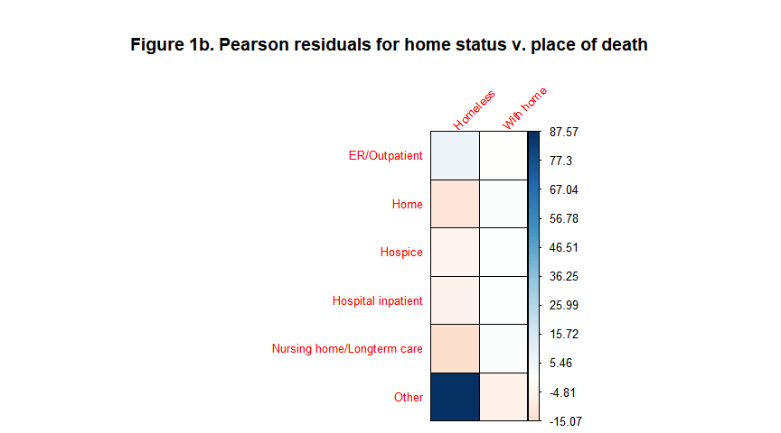
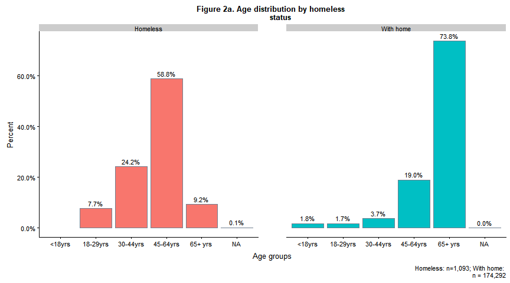
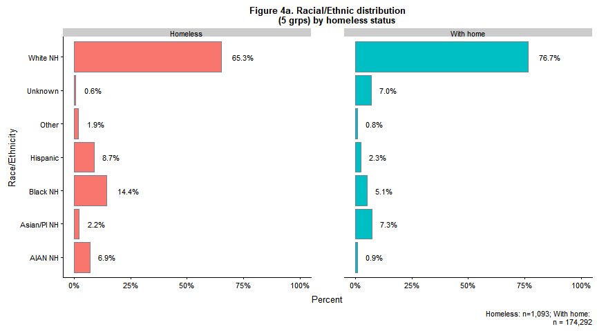
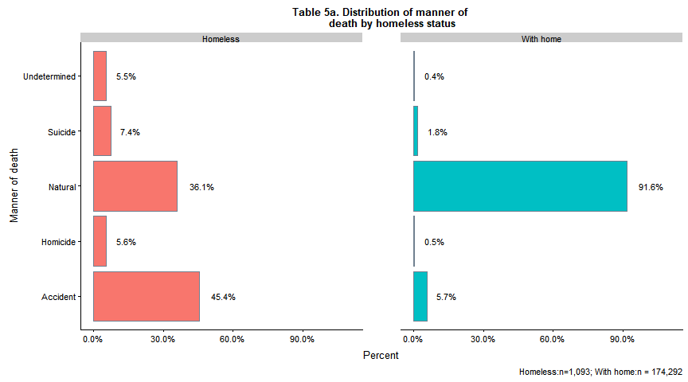
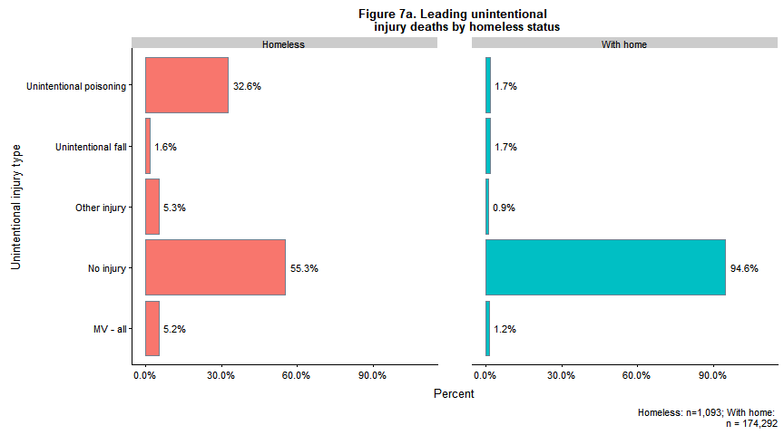
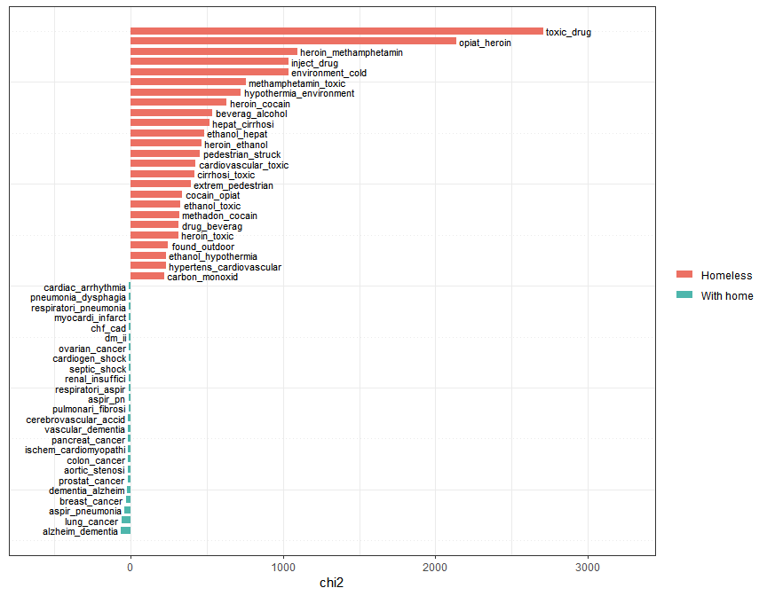

Classifying deaths in Washington State by homeless status
================
Maya Bhat-Gregerson
Fall 2018

-   [I. Overview](#i.-overview)
-   [II. Data pre-processing](#ii.-data-pre-processing)
    -   [A. Overview](#a.-overview)
        -   [**1. Data cleaning and standardization**](#data-cleaning-and-standardization)
        -   [**2. Homeless decedents - linking homeless death data to their death certificates**](#homeless-decedents---linking-homeless-death-data-to-their-death-certificates)
        -   [**3. Decedents with homes - creating a subset with King County deaths to decedents with permanent homes**](#decedents-with-homes---creating-a-subset-with-king-county-deaths-to-decedents-with-permanent-homes)
        -   [**4. Appending homeless and with home data sets**](#appending-homeless-and-with-home-data-sets)
    -   [B. Washington State mortality data - pre-processing](#b.-washington-state-mortality-data---pre-processing)
        -   [**1. Cleaning and standardizing WAMD annual data 2003-2017**](#cleaning-and-standardizing-wamd-annual-data-2003-2017)
        -   [**2. Deriving new features in preparation for exploratory data analysis**](#deriving-new-features-in-preparation-for-exploratory-data-analysis)
        -   [**3. Creating a training data set of decedents who had permanent homes at time of death**](#creating-a-training-data-set-of-decedents-who-had-permanent-homes-at-time-of-death)
    -   [C. King County Medical Examiner\`s Homeless Death Registry data - November 2003 to September 2017](#c.-king-county-medical-examiners-homeless-death-registry-data---november-2003-to-september-2017)
        -   [**1. Cleaning KCMEO homeless registry**](#cleaning-kcmeo-homeless-registry)
        -   [**3. Creating combined dataset for exploratory data analysis**](#creating-combined-dataset-for-exploratory-data-analysis)
-   [III. EXPLORATORY DATA ANALYSIS](#iii.-exploratory-data-analysis)
    -   [A. Missing values](#a.-missing-values)
    -   [B. Distribution of key variables](#b.-distribution-of-key-variables)
        -   [**1. By place of death type**](#by-place-of-death-type)
        -   [**2. By age group**](#by-age-group)
        -   [**3. By gender**](#by-gender)
        -   [**4a. By race/ethnicity - 5 groups with Hispanic as race**](#a.-by-raceethnicity---5-groups-with-hispanic-as-race)
        -   [**5. By manner of death**](#by-manner-of-death)
        -   [**6. By leading causes of death**](#by-leading-causes-of-death)
        -   [**7. By unintentional injury sub-groups**](#by-unintentional-injury-sub-groups)
        -   [**8. By substance abuse sub-groups**](#by-substance-abuse-sub-groups)
        -   [**9. By education**](#by-education)
        -   [**10. By military service**](#by-military-service)
    -   [C. Text analysis of cause of death text fields](#c.-text-analysis-of-cause-of-death-text-fields)

I. Overview
===========

The purpose of this project is twofold: (1) to conduct exploratory analysis comparing death data for known homeless decedents with data for those with permanent homes at the time of death, and (2) to use the findings to train a machine learning model to classify unlabeled deaths in Washington State by homeless status.

Currently, there is no consistent and definitive way to identify homelessness among decedents (such as a checkbox on the death certificate). Understanding the differences in demographics (gender, race/ethnicity, agegroup etc.) and causes of death between decedents who were homeless and those with permanent homes will validate our current understanding of the differences between these populations and provide direction for addressing the health needs of homeless individuals.

The data sets used for this project include Washington State final annual death certificate data for 2003-2017 and the King County Medical Examiner Office\`s registry of deaths among homeless individuals who died in King County, Washington. This registry contains name, birth date, death date, and place of death for homeless individuals who died between 2003 through late 2017. However, the registry does not contain important attributes that will be necessary for exploratory data analysis and for machine learning. These additional attributes are available in the death certificate information for each of the decedents listed in the homeless death registry requiring a linkage of the registry and the death certificate data to have a complete data set.

II. Data pre-processing
=======================

A. Overview
-----------

The following diagram provides an overview of the data pre-processing steps in preparation for exploratory data analysis and machine learning.

``` r
schematic <- "Data preprocessing schematic.png"
include_graphics(schematic)
```


### **1. Data cleaning and standardization**

This step includes:

1.  Limiting Washington annual mortality data sets (WAMD) for 2003 through 2017 to attributes that are likely to be relevant to training the machine learning model.

2.  Standardizing attribute names and formats by renaming attributes and coercing data types in both WAMD and King County Homeless Death Registry (HDR) data. Due to changes in data collection practices for WAMD over the years, attribute names and formats are inconsistent.

3.  Limiting records in WAMD to decedents who were Washington State residents who died in Washington State.

4.  Deriving new features that group the records by agegroup, leading causes of death etc. to allow exploratory data analysis and comparison with the homeless death data.

### **2. Homeless decedents - linking homeless death data to their death certificates**

This step will add the additional attributes from WAMD to each of the records in HDR so that they have the necessary attributes to train the model. In its raw form, HDR contains very limited information about the homeless individuals who died including their names, dates of birth, dates of death, and places (address) of death.

Due to the incomplete nature of HDR data the linkage will be performed in multiple iterations using different combinations of key variables to arrive at linked homeless-death certificate data sets that will then be merged. The key variables used are as follows: -iteration 1: last name, first name, date of birth -iteration 2 (starting with only unmatched records from iteration 1): social security number -iteration 3 (starting with only unmatched records from iteration 2): date of death, last name, first name -iteration 4 (starting with only unmatched records from iteration 3): date of death, date of birth, last name

### **3. Decedents with homes - creating a subset with King County deaths to decedents with permanent homes**

In this step the Washington annual mortality data set (2003-17 combined) is restricted to deaths occurring in King County with a residential geocode match score of at least 95% i.e. with a 95% or greater degree of certainty that the residential address provided on the death certificate matches a street address validated by the Census Bureau.

### **4. Appending homeless and with home data sets**

The final data preparation step involves appending the homeless and "with home" data sets with standardized features and feature names to allow exploratory data analysis and training a machine learning model.

B. Washington State mortality data - pre-processing
---------------------------------------------------

Washington State requires by law that all deaths occurring in the state must be registered with the Washington State Department of Health. This means we have almost 100% reporting of deaths occurring in the state (with the exception of occasional missing persons).

The size of each annual file has increased over the years, both in terms of number of records and in terms of attributes. Attribute names and data types have not been consistent over the years. By 2017 Washington State's death data set included over 58,000 unique observations (death certificate records) and over 250 attributes. Most of the attributes are not relevant to train the machine learning model for this project.

This section addresses cleaning and limiting the data sets (in terms of number of attributes).

### **1. Cleaning and standardizing WAMD annual data 2003-2017**

Read death certificate data in three groups as one combined dataset slowed R down too much. I created the three datasets using a SQL query in our vital statistics database and restricted the results to the desired features in the SQL query including:

last name, first name, middle name, social security number, death certificate number, date of death, date of birth, sex,type of death certifier (physician, Medical examiner, coroner etc), manner of death, cause of death (ICD 10 codes), residence street address, residence city, residence zipcode, residence state, residence county, death county, death zipcode, death state, type of place where death occurred (hospital, home, hospice etc), educational attainment, marital status, race, ethnicity, occupation code.

``` r
# Reading in WA death data 2003 through 2017 and appending into one data set

wa0307 <- fread("Data/WA2003_07.csv")
wa0812 <- fread("Data/WA2008_12.csv")
wa1317 <- fread("Data/WA2013_17.csv")

WA0317 <- rbind(wa0307, wa0812, wa1317)


WA0317 <-subset(WA0317, dstateFIPS=="WA")
str(WA0317)
```

    ## Classes 'data.table' and 'data.frame':   745935 obs. of  33 variables:
    ##  $ certno      : int  2003002743 2003003284 2003000755 2003003071 2003002215 2003000770 2003003282 2003000689 2003000782 2003000322 ...
    ##  $ dob         : chr  "06/04/1928" "05/30/1910" "08/22/1908" "05/26/1925" ...
    ##  $ dod         : chr  "01/01/2003" "01/01/2003" "01/01/2003" "01/01/2003" ...
    ##  $ lname       : chr  "LOVE" "CARLSON" "MCDONALD" "LINDBERG" ...
    ##  $ fname       : chr  "CHESTER" "HELEN" "MARGARET" "LUCILLE" ...
    ##  $ mname       : chr  "JAMES" "FRANCES" "MARIE" "RUTH" ...
    ##  $ sex         : chr  "M" "F" "F" "F" ...
    ##  $ ssn         : chr  "539-26-0170" "536-44-1312" "167-07-3319" "531-24-0169" ...
    ##  $ attclass    : chr  "1" "1" "1" "1" ...
    ##  $ brgrace     : chr  "NULL" "NULL" "NULL" "NULL" ...
    ##  $ hispanic    : chr  "N" "N" "N" "N" ...
    ##  $ manner      : chr  "N" "N" "N" "N" ...
    ##  $ rcounty     : chr  "SNOHOMISH" "THURSTON" "KING" "SPOKANE" ...
    ##  $ rcity       : chr  "EVERETT" "TUMWATER" "SEATTLE" "SPOKANE" ...
    ##  $ rstreet     : chr  "1915 HEWITT AVE APT 209" "1400 TROSPER RD SW" "7304 44TH AVE NE" "1816 E 13TH AVE" ...
    ##  $ resmatchcode: chr  "100" "100" "100" "100" ...
    ##  $ rstateFIPS  : chr  "WA" "WA" "WA" "WA" ...
    ##  $ rzip        : chr  "98201" "98512" "98115" "99202" ...
    ##  $ dstreet     : chr  "NULL" "NULL" "NULL" "NULL" ...
    ##  $ dcity       : chr  "SNOHOMISH" "TUMWATER" "SEATTLE" "SPOKANE" ...
    ##  $ dzip        : chr  "NULL" "NULL" "NULL" "NULL" ...
    ##  $ dcounty     : chr  "SNOHOMISH" "THURSTON" "KING" "SPOKANE" ...
    ##  $ dstateFIPS  : chr  "WA" "WA" "WA" "WA" ...
    ##  $ dplacelit   : chr  "Nursing home/long term care" "Nursing home/long term care" "Hospital (inpatient)" "Home" ...
    ##  $ dplacecode  : chr  "5" "5" "4" "0" ...
    ##  $ dthyr       : int  2003 2003 2003 2003 2003 2003 2003 2003 2003 2003 ...
    ##  $ UCOD        : chr  "G20" "G309" "C349" "I64" ...
    ##  $ MCOD        : chr  "G20" "G309" "C349 C782 C795 J969 Q211" "C349 I64" ...
    ##  $ educ        : chr  "9" "9" "8" "9" ...
    ##  $ marital     : chr  "M" "W" "W" "D" ...
    ##  $ occup       : chr  "425" "908" "908" "363" ...
    ##  $ military    : chr  "N" "N" "N" "N" ...
    ##  $ codlit      : chr  "PARKINSONS DISEASE    " "ALZHEIMERS DISEASE    " "RESPIRATORY FAILURE METASTATIC SMALL CELL CA TO BONE, LUNG, PLEURA PRIMARY LUNG  ATRIAL SEPTAL DEFECT WITH SHUNT" "STROKE WITH UNDERLYING LUNG CANCER    " ...
    ##  - attr(*, ".internal.selfref")=<externalptr>

I coerced specific features into factors and dates as they were read in as character strings by R. To prepare for record linkage later I standardized the last and first name fields by removing leading, trailing, and mid-name white spaces, removed all hyphenations. I also removed hyphens from the social security number charcter string. I left social security number as a string to avoid losing leading zeroes.

``` r
# Cleaning WA death data - standardizing values

## COERCE VARIABLES TO DATES

WA0317$dob <- as.Date(WA0317$dob, "%m/%d/%Y")
WA0317$dod <- as.Date(WA0317$dod, "%m/%d/%Y")

## REMOVE WHITESPACE, PUNCTUATION, AND SUFFIXES FROM NAMES AND HYPHENS FROM SSN

WA0317$lname <- str_replace_all(WA0317$lname, pattern = " ", replacement = "")
WA0317$lname <- str_replace_all(WA0317$lname, pattern = "-", replacement = "")

WA0317$fname <- str_replace_all(WA0317$fname, pattern = " ", replacement = "")
WA0317$fname <- str_replace_all(WA0317$fname, pattern = "-", replacement = "")

WA0317$ssn <- str_replace_all(WA0317$ssn, pattern= "-", replacement = "")

WA0317$UCOD <- ifelse((nchar(WA0317$UCOD)) < 4, paste(WA0317$UCOD, "0", sep = ""),
                      WA0317$UCOD)

WA0317$UCOD <- str_replace_all(string = WA0317$UCOD, pattern = " ", replacement = "")

## COERCE VARIABLES TO FACTOR
facvars_wa <- c("dcounty", "dzip", "dcity", "attclass", "brgrace", "hispanic", "sex",
                "manner", "rcounty", "rcity", "rstreet","rstateFIPS", "rzip", "dstateFIPS",
                "dplacelit", "dplacecode", "sex", "dthyr", "marital", "UCOD",  "educ",
                "MCOD", "occup", "military")

WA0317 %<>% mutate_at(facvars_wa, funs(factor(.)))

# convert character to numeric

WA0317$resmatchcode <- as.numeric(WA0317$resmatchcode)
```

    ## Warning: NAs introduced by coercion

``` r
summary(WA0317)
```

    ##      certno               dob                  dod            
    ##  Min.   :2.003e+09   Min.   :1893-05-27   Min.   :2003-01-01  
    ##  1st Qu.:2.007e+09   1st Qu.:1923-01-23   1st Qu.:2007-01-23  
    ##  Median :2.010e+09   Median :1932-05-26   Median :2010-12-07  
    ##  Mean   :2.010e+09   Mean   :1936-08-15   Mean   :2010-10-14  
    ##  3rd Qu.:2.014e+09   3rd Qu.:1947-01-16   3rd Qu.:2014-08-13  
    ##  Max.   :2.017e+09   Max.   :2017-12-31   Max.   :2017-12-31  
    ##                      NA's   :74                               
    ##     lname              fname              mname           sex       
    ##  Length:745935      Length:745935      Length:745935      F:369857  
    ##  Class :character   Class :character   Class :character   M:376069  
    ##  Mode  :character   Mode  :character   Mode  :character   U:     9  
    ##                                                                     
    ##                                                                     
    ##                                                                     
    ##                                                                     
    ##      ssn               attclass         brgrace       hispanic  
    ##  Length:745935      1      :555600   01     :628492   N: 65317  
    ##  Class :character   2      :107580   NULL   : 46218   Y:680618  
    ##  Mode  :character   7      : 42333   02     : 18751             
    ##                     3      : 30181   15     : 10363             
    ##                     6      :  8862   03     :  9900             
    ##                     NULL   :  1336   06     :  4928             
    ##                     (Other):    43   (Other): 27283             
    ##   manner            rcounty             rcity       
    ##  A   : 42454   KING     :178723   SEATTLE  : 64244  
    ##  C   :  2824   PIERCE   : 87204   SPOKANE  : 36951  
    ##  H   :  3602   SNOHOMISH: 69006   TACOMA   : 35351  
    ##  N   :682226   SPOKANE  : 59686   VANCOUVER: 30909  
    ##  NULL:    97   CLARK    : 40876   EVERETT  : 16875  
    ##  P   :    58   KITSAP   : 29177   (Other)  :561604  
    ##  S   : 14674   (Other)  :281263   NA's     :     1  
    ##                    rstreet        resmatchcode      rstateFIPS    
    ##  UNKNOWN               :  1759   Min.   :  0.00   WA     :727565  
    ##  7500 SEWARD PARK AVE S:   608   1st Qu.:100.00   OR     :  6428  
    ##  4831 35TH AVE SW      :   596   Median :100.00   ID     :  3251  
    ##  534 BOYER AVE         :   568   Mean   : 94.57   CA     :  1520  
    ##  13023 GREENWOOD AVE N :   545   3rd Qu.:100.00   AK     :  1213  
    ##  (Other)               :741855   Max.   :100.00   MT     :   893  
    ##  NA's                  :     4   NA's   :47637    (Other):  5065  
    ##       rzip          dstreet                dcity             dzip       
    ##  98632  :  8356   Length:745935      SEATTLE  : 91223   NULL   : 46049  
    ##  98133  :  7166   Class :character   SPOKANE  : 53196   98201  : 16625  
    ##  98902  :  6808   Mode  :character   TACOMA   : 38773   98405  : 15479  
    ##  99208  :  6420                      VANCOUVER: 37582   98122  : 13600  
    ##  98382  :  6354                      EVERETT  : 25553   98506  : 12579  
    ##  (Other):710830                      OLYMPIA  : 21902   99204  : 12567  
    ##  NA's   :     1                      (Other)  :477706   (Other):629036  
    ##       dcounty       dstateFIPS                        dplacelit     
    ##  KING     :200692   WA:745935   Home                       :220536  
    ##  PIERCE   : 90133               Hospital (inpatient)       :204310  
    ##  SPOKANE  : 67645               Nursing home/long term care:165922  
    ##  SNOHOMISH: 64035               Hospice                    : 36101  
    ##  CLARK    : 43746               Other place                : 34451  
    ##  THURSTON : 30863               Emergency room             : 22323  
    ##  (Other)  :248821               (Other)                    : 62292  
    ##    dplacecode         dthyr             UCOD               MCOD       
    ##  0      :237122   2017   : 56983   C349   : 46385   NULL     : 50570  
    ##  4      :218104   2016   : 54783   I251   : 44322   C349 F179: 12914  
    ##  5      :187867   2015   : 54651   G309   : 43577   G309     : 10676  
    ##  7      : 39535   2014   : 52074   I219   : 32710   C349     :  6624  
    ##  1      : 37523   2013   : 51261   J449   : 30481   C259     :  5855  
    ##  3      : 23853   2012   : 50161   I640   : 19975   C509     :  5679  
    ##  (Other):  1931   (Other):426022   (Other):528485   (Other)  :653617  
    ##       educ        marital        occup        military  
    ##  3      :275428   A:  2408   908    :126897   N:529287  
    ##  4      :120355   D:125506   183    : 19104   U:  4260  
    ##  6      : 83031   M:279432   290    : 15837   Y:212388  
    ##  2      : 65277   P:   877   NULL   : 14999             
    ##  1      : 60747   S: 75570   150    : 13582             
    ##  9      : 51411   U:  4135   396    : 13464             
    ##  (Other): 89686   W:258007   (Other):542052             
    ##     codlit         
    ##  Length:745935     
    ##  Class :character  
    ##  Mode  :character  
    ##                    
    ##                    
    ##                    
    ## 

``` r
str(WA0317)
```

    ## 'data.frame':    745935 obs. of  33 variables:
    ##  $ certno      : int  2003002743 2003003284 2003000755 2003003071 2003002215 2003000770 2003003282 2003000689 2003000782 2003000322 ...
    ##  $ dob         : Date, format: "1928-06-04" "1910-05-30" ...
    ##  $ dod         : Date, format: "2003-01-01" "2003-01-01" ...
    ##  $ lname       : chr  "LOVE" "CARLSON" "MCDONALD" "LINDBERG" ...
    ##  $ fname       : chr  "CHESTER" "HELEN" "MARGARET" "LUCILLE" ...
    ##  $ mname       : chr  "JAMES" "FRANCES" "MARIE" "RUTH" ...
    ##  $ sex         : Factor w/ 3 levels "F","M","U": 2 1 1 1 1 1 2 1 2 2 ...
    ##  $ ssn         : chr  "539260170" "536441312" "167073319" "531240169" ...
    ##  $ attclass    : Factor w/ 11 levels "0","1","2","3",..: 2 2 2 2 2 2 2 2 2 2 ...
    ##  $ brgrace     : Factor w/ 21 levels "01","02","03",..: 21 21 21 21 21 21 21 21 21 21 ...
    ##  $ hispanic    : Factor w/ 2 levels "N","Y": 1 1 1 1 1 1 1 1 1 1 ...
    ##  $ manner      : Factor w/ 7 levels "A","C","H","N",..: 4 4 4 4 4 4 4 7 4 4 ...
    ##  $ rcounty     : Factor w/ 1098 levels "ACADIA","ADA",..: 899 968 491 905 755 491 968 449 491 196 ...
    ##  $ rcity       : Factor w/ 3820 levels "4600 WELS","69006 LYON",..: 1040 3462 3039 3177 1211 1663 2451 447 3039 3523 ...
    ##  $ rstreet     : Factor w/ 555076 levels "#1 5TH AND MAIN ST.",..: 182254 99269 483366 169672 524002 250715 533278 326746 324661 309474 ...
    ##  $ resmatchcode: num  100 100 100 100 100 100 100 82 100 100 ...
    ##  $ rstateFIPS  : Factor w/ 67 levels "AB","AK","AL",..: 62 62 62 62 62 62 62 62 62 62 ...
    ##  $ rzip        : Factor w/ 15491 levels "00000","00077",..: 7917 11335 6834 13864 9364 5651 11366 8915 7235 12867 ...
    ##  $ dstreet     : chr  "NULL" "NULL" "NULL" "NULL" ...
    ##  $ dcity       : Factor w/ 748 levels "ABERDEEN","ACME",..: 621 680 596 634 244 558 489 84 596 696 ...
    ##  $ dzip        : Factor w/ 3810 levels "00000","03282",..: 3810 3810 3810 3810 3810 3810 3810 3810 3810 3810 ...
    ##  $ dcounty     : Factor w/ 41 levels "ADAMS","ASOTIN",..: 33 36 17 34 28 17 36 15 17 6 ...
    ##  $ dstateFIPS  : Factor w/ 1 level "WA": 1 1 1 1 1 1 1 1 1 1 ...
    ##  $ dplacelit   : Factor w/ 21 levels "DEAD ON ARRIVAL TO HOSPITAL IN TRANSPORT",..: 14 14 9 5 14 9 5 5 5 5 ...
    ##  $ dplacecode  : Factor w/ 10 levels "0","1","2","3",..: 6 6 5 1 6 5 1 1 1 1 ...
    ##  $ dthyr       : Factor w/ 15 levels "2003","2004",..: 1 1 1 1 1 1 1 1 1 1 ...
    ##  $ UCOD        : Factor w/ 3087 levels "A020","A021",..: 1000 1026 301 1325 757 1309 496 2960 1201 301 ...
    ##  $ MCOD        : Factor w/ 345267 levels "A020 A090 E86 I251 N170 N179",..: 133235 137042 34825 42628 99608 159740 72333 315393 185000 40287 ...
    ##  $ educ        : Factor w/ 9 levels "1","2","3","4",..: 9 9 8 9 9 9 9 9 8 9 ...
    ##  $ marital     : Factor w/ 7 levels "A","D","M","P",..: 3 7 7 2 7 7 3 3 7 7 ...
    ##  $ occup       : Factor w/ 431 levels "`","000","007",..: 212 407 407 170 396 407 173 407 264 236 ...
    ##  $ military    : Factor w/ 3 levels "N","U","Y": 1 1 1 1 1 1 3 1 1 3 ...
    ##  $ codlit      : chr  "PARKINSONS DISEASE    " "ALZHEIMERS DISEASE    " "RESPIRATORY FAILURE METASTATIC SMALL CELL CA TO BONE, LUNG, PLEURA PRIMARY LUNG  ATRIAL SEPTAL DEFECT WITH SHUNT" "STROKE WITH UNDERLYING LUNG CANCER    " ...

### **2. Deriving new features in preparation for exploratory data analysis**

I created a few derived variables including calculated age (at time of death), 5-category age group, leading causes of death categories (by grouping codes in the "UCOD" feature which contains International Classification of Disease, 10th edition, codes indicating the underlying cause of death), race/ethnicity (applying U.S. Office of Management and Budget and Washington State Department of Health guidelines), resident status (Washington state vs. out of state resident), unintentional injury cause of death groups, and substance abuse related cause of death groups.

These added features will useful in conducting exploratory data analysis including comparing the characteristics of homeless decedents with those of decedents who had a permanent home at death.

``` r
# Creating derived variables in WA death dataset

## CALCULATED AGE AT DEATH

WA0317$age <- year(WA0317$dod) - year(WA0317$dob)

attach(WA0317)

# AGE CATEGORIES

WA0317$age5cat[age<18] <- "<18yrs"
WA0317$age5cat[age>=18 & age<=29] <-"18-29yrs"
WA0317$age5cat[age>=30 & age<=44] <- "30-44yrs"
WA0317$age5cat[age>=45 & age<=64] <-"45-64yrs"
WA0317$age5cat[age>=65] <- "65+ yrs"

#LEADING CAUSES OF DEATH (per National Center for Health Statistics)

WA0317$LCOD <- "Other"

##MALIGNANT NEOPLASMS - C00-C97
MalignantNeoplasms <- "C[0-9][0-7][0-9]?"
WA0317$LCOD[grepl(MalignantNeoplasms, WA0317$UCOD)]<- "Cancer"

##DISEASES OF THE HEART - I00-I09,I11,I13,I20-I51
HeartDisease <- "I0[0-9][0-9]?|I11[0-9]?|I13[0-9]?|I[2-4][0-9][0-9]?|I50[0-9]?|I51[0-9]?"
WA0317$LCOD[grepl(HeartDisease, WA0317$UCOD)]<- "Heart Dis."

##ALZHEIMER'S DISEASE - G30
Alzheimers <- "G30[0-9]?"
WA0317$LCOD[grepl("G30", WA0317$UCOD)]<- "Alzheimers"

##ACCIDENTS - V01-X59,Y85-Y86
unintentionalinjury <- "V[0-9][0-9][0-9]?|W[0-9][0-9][0-9]?|X[0-5][0-9][0-9]?|Y8[5-6][0-9]?"
WA0317$LCOD[grepl(unintentionalinjury, WA0317$UCOD)]<- "Injury-unint."

##CHRONIC LOWER RESPIRATORY DISEASE - J40-J47
CLRD <- "J4[0-7][0-9]?"
WA0317$LCOD[grepl(CLRD, WA0317$UCOD)]<- "Chronic Lwr Resp Dis."

##CEREBROVASCULAR DISEASE - I60-69
CVD <- "I6[0-9][0-9]?"
WA0317$LCOD[grepl(CVD, WA0317$UCOD)]<- "Stroke"

##DIABETES MELLITUS - E10-E14
diabetes <- "E1[0-4][0-9]?"
WA0317$LCOD[grepl(diabetes, WA0317$UCOD)]<- "Diabetes"

#SUICIDE
allsuicides <- "U03[0-9]?|X[6-7][0-9][0-9]?|X8[0-4][0-9?]|Y870"
WA0317$LCOD[grepl(allsuicides, WA0317$UCOD)]<- "Suicide-all"

##CHRONIC LIVER DISEASE AND CIRRHOSIS - K70,K73-K74
liver <- "K70[0-9]?|K7[3-4][0-9]?"
WA0317$LCOD[grepl(liver, WA0317$UCOD)]<- "Chronic Liver dis./cirrh."

##INFLUENZA AND PNEUMONIA - J09-J18
flu <- "J09[0-9]?|J1[0-8][0-9]?"
WA0317$LCOD[grepl(flu, WA0317$UCOD)]<- "Flu"

# UNINTENTIONAL INJURIES - SELECT SUBCATEGORIES OF:  V01-X59,Y85-Y86

WA0317$injury <- "No injury"

##UNINTENTIONAL INJURY - V01-X59,Y85-Y86
unintinj <- "V[0-9][0-9][0-9]?|W[0-9][0-9][0-9]?|X[0-5][0-9][0-9]?|Y8[5-6]
              [0-9]?"
WA0317$LCOD[grepl(unintinj, WA0317$UCOD)]<- "All Unint.injury"

#Unintentional Poisoning - X40-49
poisoninjury <- "^X4[0-9][0-9]?"
WA0317$injury[grepl(poisoninjury, WA0317$UCOD)] <- "Unintentional poisoning"

# Unintentional Firearm - W32-34
guninjury <- "W3[2-4][0-9]?"
WA0317$injury[grepl(guninjury, WA0317$UCOD)] <- "Unintentional firearm"

# Motor vehicle - pedestrian - (V02–V04[.1,.9],V09.2)
mvped <- "V0[2-3][0-9]?|V041|V049|V092"
WA0317$injury[grepl(mvped, WA0317$UCOD)] <- "MV crash-pedestrian"

# Unintentional Fall (W00–W19)
fall <- "W0[0-9][0-9]|W1[0-9][0-9]"
WA0317$injury[grepl(fall, WA0317$UCOD)] <- "Unintentional fall"

#SUBSTANCE ABUSE
WA0317$substance <- "No Substance abuse"

#Alcohol-induced per NCHS - https://www.cdc.gov/nchs/data/nvsr/nvsr66/nvsr66_06.pdf
#excludes unintentional injuries, homicides, other causes indirectly related to alcohol
#use, newborn deaths due to maternal alcohol use.

alcohol <- "E244|F10[0-9]?|G312|G621|G721|I426|K292|K70[0-9]?|K852|K860|R780|X45[0-9]?|
            X65[0-9]?|Y15[0-9]?"
WA0317$substance[grepl(alcohol, WA0317$UCOD)] <- "Alcohol-induced"


#Drug-induced per NCHS - https://www.cdc.gov/nchs/data/nvsr/nvsr66/nvsr66_06.pdf 
#Excludes unintentional injuries, homicides, other causes indirectly related to drug
#use, newborn deaths due to maternal drug use

drug <- "D521|D590|D592|D611|D642|E064|E160|E231|E242|E273|E661|F11[1–5]|F11[7–9]|F12[1-5]|
F12[7–9]|F13[1–5]|F13[7-9]|F14[1–5]|F14[7–9]|F15[1–5]|F15[7–9]|F16[1–5]|F16[7–9]|F17[3–5]|
F17[7–9]|F18[1–5]|F18[7–9]|F19[1–5]|F19[7–9]|G211|G240|G251|G254|G256|G444|G620|G720|I952|
J702|J703|J704|K853|L105|L270|L271|M102|M320|M804|M814|M835|M871|R502|R781|R782|R783|R784|
R785|X4[0-4][0-9]|X6[0–4][0-9]|X85|Y1[0–4][0-9]"

WA0317$substance[grepl(drug, WA0317$UCOD)] <- "Drug-induced"

## RESIDENCE

WA0317$residence[rstateFIPS != "WA" & rstateFIPS !="ZZ"] <- "Out of state"
WA0317$residence[rstateFIPS == "WA"] <- "WA resident"

## RACE AND ETHNICITY
## remember that the original ethnicity variable was named "HISPANICNO" 
#(renamed "hispanic" in this data set) i.e. a "yes" means they are NOT hispanic

##5 groups with Hispanic as race
WA0317$raceethnic5 <- "Other"
WA0317$raceethnic5[brgrace %in% c("01", "1") & hispanic=="Y"] <- "White NH"
WA0317$raceethnic5[brgrace %in% c("02","2") & hispanic=="Y"] <- "Black NH"
WA0317$raceethnic5[brgrace %in% c("03","3") & hispanic=="Y"] <- "AIAN NH"
WA0317$raceethnic5[brgrace %in% c("04","4","05","5","06","6","07","7","08","8","09","9",
                                  "10","11","12","13","14","15") & 
                                   hispanic=="Y"] <- "Asian/PI NH"
WA0317$raceethnic5[hispanic=="N"] <- "Hispanic"
WA0317$raceethnic5[is.na(brgrace)] <- "Unknown"


## 6 groups with Hispanic as race and separating Asians and NHOPI
WA0317$raceethnic6 <- "Other"
WA0317$raceethnic6[brgrace %in% c("01", "1") & hispanic=="Y"] <- "White NH"
WA0317$raceethnic6[brgrace %in% c("02","2") & hispanic=="Y"] <- "Black NH"
WA0317$raceethnic6[brgrace %in% c("03","3") & hispanic=="Y"] <- "AIAN NH"
WA0317$raceethnic6[brgrace %in% c("04","4","05","5","06","6","07","7","08","8","09","9",
                                  "10") & hispanic=="Y"] <- "Asian"
WA0317$raceethnic6[brgrace %in% c("11","12","13","14","15") & hispanic=="Y"] <- "NHOPI"
WA0317$raceethnic6[hispanic=="N"] <- "Hispanic"
WA0317$raceethnic6[is.na(brgrace)] <- "Unknown"


WA0317 %<>% mutate_at(c("age5cat", "residence", "LCOD", "injury", "substance", 
                        "raceethnic5", "raceethnic6"), funs(factor(.)))

## Labeling manner of death

WA0317$manner <- factor(WA0317$manner,
                        levels = c("A", "C", "H", "N", "NULL", "P", "S"),
                        labels = c("Accident", "Undetermined", "Homicide", "Natural", 
                                   "Unk.","Pending", "Suicide"))

##Labeling educational attainment

WA0317$educ <- factor(WA0317$educ,
                        levels = c("1", "2", "3", "4", "5", "6", "7", "8", "9"),
                        labels = c("<=8th grade", "9-12th gr., no diploma", 
                                   "H.S. grad/GED", "Some college", "Associate's",
                                   "Bachelors", "Masters", "Doctorate/Professional", 
                                   "Unknown"))

detach(WA0317)
str(WA0317)
```

    ## 'data.frame':    745935 obs. of  41 variables:
    ##  $ certno      : int  2003002743 2003003284 2003000755 2003003071 2003002215 2003000770 2003003282 2003000689 2003000782 2003000322 ...
    ##  $ dob         : Date, format: "1928-06-04" "1910-05-30" ...
    ##  $ dod         : Date, format: "2003-01-01" "2003-01-01" ...
    ##  $ lname       : chr  "LOVE" "CARLSON" "MCDONALD" "LINDBERG" ...
    ##  $ fname       : chr  "CHESTER" "HELEN" "MARGARET" "LUCILLE" ...
    ##  $ mname       : chr  "JAMES" "FRANCES" "MARIE" "RUTH" ...
    ##  $ sex         : Factor w/ 3 levels "F","M","U": 2 1 1 1 1 1 2 1 2 2 ...
    ##  $ ssn         : chr  "539260170" "536441312" "167073319" "531240169" ...
    ##  $ attclass    : Factor w/ 11 levels "0","1","2","3",..: 2 2 2 2 2 2 2 2 2 2 ...
    ##  $ brgrace     : Factor w/ 21 levels "01","02","03",..: 21 21 21 21 21 21 21 21 21 21 ...
    ##  $ hispanic    : Factor w/ 2 levels "N","Y": 1 1 1 1 1 1 1 1 1 1 ...
    ##  $ manner      : Factor w/ 7 levels "Accident","Undetermined",..: 4 4 4 4 4 4 4 7 4 4 ...
    ##  $ rcounty     : Factor w/ 1098 levels "ACADIA","ADA",..: 899 968 491 905 755 491 968 449 491 196 ...
    ##  $ rcity       : Factor w/ 3820 levels "4600 WELS","69006 LYON",..: 1040 3462 3039 3177 1211 1663 2451 447 3039 3523 ...
    ##  $ rstreet     : Factor w/ 555076 levels "#1 5TH AND MAIN ST.",..: 182254 99269 483366 169672 524002 250715 533278 326746 324661 309474 ...
    ##  $ resmatchcode: num  100 100 100 100 100 100 100 82 100 100 ...
    ##  $ rstateFIPS  : Factor w/ 67 levels "AB","AK","AL",..: 62 62 62 62 62 62 62 62 62 62 ...
    ##  $ rzip        : Factor w/ 15491 levels "00000","00077",..: 7917 11335 6834 13864 9364 5651 11366 8915 7235 12867 ...
    ##  $ dstreet     : chr  "NULL" "NULL" "NULL" "NULL" ...
    ##  $ dcity       : Factor w/ 748 levels "ABERDEEN","ACME",..: 621 680 596 634 244 558 489 84 596 696 ...
    ##  $ dzip        : Factor w/ 3810 levels "00000","03282",..: 3810 3810 3810 3810 3810 3810 3810 3810 3810 3810 ...
    ##  $ dcounty     : Factor w/ 41 levels "ADAMS","ASOTIN",..: 33 36 17 34 28 17 36 15 17 6 ...
    ##  $ dstateFIPS  : Factor w/ 1 level "WA": 1 1 1 1 1 1 1 1 1 1 ...
    ##  $ dplacelit   : Factor w/ 21 levels "DEAD ON ARRIVAL TO HOSPITAL IN TRANSPORT",..: 14 14 9 5 14 9 5 5 5 5 ...
    ##  $ dplacecode  : Factor w/ 10 levels "0","1","2","3",..: 6 6 5 1 6 5 1 1 1 1 ...
    ##  $ dthyr       : Factor w/ 15 levels "2003","2004",..: 1 1 1 1 1 1 1 1 1 1 ...
    ##  $ UCOD        : Factor w/ 3087 levels "A020","A021",..: 1000 1026 301 1325 757 1309 496 2960 1201 301 ...
    ##  $ MCOD        : Factor w/ 345267 levels "A020 A090 E86 I251 N170 N179",..: 133235 137042 34825 42628 99608 159740 72333 315393 185000 40287 ...
    ##  $ educ        : Factor w/ 9 levels "<=8th grade",..: 9 9 8 9 9 9 9 9 8 9 ...
    ##  $ marital     : Factor w/ 7 levels "A","D","M","P",..: 3 7 7 2 7 7 3 3 7 7 ...
    ##  $ occup       : Factor w/ 431 levels "`","000","007",..: 212 407 407 170 396 407 173 407 264 236 ...
    ##  $ military    : Factor w/ 3 levels "N","U","Y": 1 1 1 1 1 1 3 1 1 3 ...
    ##  $ codlit      : chr  "PARKINSONS DISEASE    " "ALZHEIMERS DISEASE    " "RESPIRATORY FAILURE METASTATIC SMALL CELL CA TO BONE, LUNG, PLEURA PRIMARY LUNG  ATRIAL SEPTAL DEFECT WITH SHUNT" "STROKE WITH UNDERLYING LUNG CANCER    " ...
    ##  $ age         : num  75 93 95 78 80 76 85 64 95 86 ...
    ##  $ age5cat     : Factor w/ 5 levels "<18yrs","18-29yrs",..: 5 5 5 5 5 5 5 4 5 5 ...
    ##  $ LCOD        : Factor w/ 12 levels "All Unint.injury",..: 10 2 3 11 6 11 3 12 8 3 ...
    ##  $ injury      : Factor w/ 5 levels "MV crash-pedestrian",..: 2 2 2 2 2 2 2 2 2 2 ...
    ##  $ substance   : Factor w/ 3 levels "Alcohol-induced",..: 3 3 3 3 3 3 3 3 3 3 ...
    ##  $ residence   : Factor w/ 2 levels "Out of state",..: 2 2 2 2 2 2 2 2 2 2 ...
    ##  $ raceethnic5 : Factor w/ 6 levels "AIAN NH","Asian/PI NH",..: 4 4 4 4 4 4 4 4 4 4 ...
    ##  $ raceethnic6 : Factor w/ 7 levels "AIAN NH","Asian",..: 4 4 4 4 4 4 4 4 4 4 ...

``` r
summary(WA0317)
```

    ##      certno               dob                  dod            
    ##  Min.   :2.003e+09   Min.   :1893-05-27   Min.   :2003-01-01  
    ##  1st Qu.:2.007e+09   1st Qu.:1923-01-23   1st Qu.:2007-01-23  
    ##  Median :2.010e+09   Median :1932-05-26   Median :2010-12-07  
    ##  Mean   :2.010e+09   Mean   :1936-08-15   Mean   :2010-10-14  
    ##  3rd Qu.:2.014e+09   3rd Qu.:1947-01-16   3rd Qu.:2014-08-13  
    ##  Max.   :2.017e+09   Max.   :2017-12-31   Max.   :2017-12-31  
    ##                      NA's   :74                               
    ##     lname              fname              mname           sex       
    ##  Length:745935      Length:745935      Length:745935      F:369857  
    ##  Class :character   Class :character   Class :character   M:376069  
    ##  Mode  :character   Mode  :character   Mode  :character   U:     9  
    ##                                                                     
    ##                                                                     
    ##                                                                     
    ##                                                                     
    ##      ssn               attclass         brgrace       hispanic  
    ##  Length:745935      1      :555600   01     :628492   N: 65317  
    ##  Class :character   2      :107580   NULL   : 46218   Y:680618  
    ##  Mode  :character   7      : 42333   02     : 18751             
    ##                     3      : 30181   15     : 10363             
    ##                     6      :  8862   03     :  9900             
    ##                     NULL   :  1336   06     :  4928             
    ##                     (Other):    43   (Other): 27283             
    ##           manner            rcounty             rcity       
    ##  Accident    : 42454   KING     :178723   SEATTLE  : 64244  
    ##  Undetermined:  2824   PIERCE   : 87204   SPOKANE  : 36951  
    ##  Homicide    :  3602   SNOHOMISH: 69006   TACOMA   : 35351  
    ##  Natural     :682226   SPOKANE  : 59686   VANCOUVER: 30909  
    ##  Unk.        :    97   CLARK    : 40876   EVERETT  : 16875  
    ##  Pending     :    58   KITSAP   : 29177   (Other)  :561604  
    ##  Suicide     : 14674   (Other)  :281263   NA's     :     1  
    ##                    rstreet        resmatchcode      rstateFIPS    
    ##  UNKNOWN               :  1759   Min.   :  0.00   WA     :727565  
    ##  7500 SEWARD PARK AVE S:   608   1st Qu.:100.00   OR     :  6428  
    ##  4831 35TH AVE SW      :   596   Median :100.00   ID     :  3251  
    ##  534 BOYER AVE         :   568   Mean   : 94.57   CA     :  1520  
    ##  13023 GREENWOOD AVE N :   545   3rd Qu.:100.00   AK     :  1213  
    ##  (Other)               :741855   Max.   :100.00   MT     :   893  
    ##  NA's                  :     4   NA's   :47637    (Other):  5065  
    ##       rzip          dstreet                dcity             dzip       
    ##  98632  :  8356   Length:745935      SEATTLE  : 91223   NULL   : 46049  
    ##  98133  :  7166   Class :character   SPOKANE  : 53196   98201  : 16625  
    ##  98902  :  6808   Mode  :character   TACOMA   : 38773   98405  : 15479  
    ##  99208  :  6420                      VANCOUVER: 37582   98122  : 13600  
    ##  98382  :  6354                      EVERETT  : 25553   98506  : 12579  
    ##  (Other):710830                      OLYMPIA  : 21902   99204  : 12567  
    ##  NA's   :     1                      (Other)  :477706   (Other):629036  
    ##       dcounty       dstateFIPS                        dplacelit     
    ##  KING     :200692   WA:745935   Home                       :220536  
    ##  PIERCE   : 90133               Hospital (inpatient)       :204310  
    ##  SPOKANE  : 67645               Nursing home/long term care:165922  
    ##  SNOHOMISH: 64035               Hospice                    : 36101  
    ##  CLARK    : 43746               Other place                : 34451  
    ##  THURSTON : 30863               Emergency room             : 22323  
    ##  (Other)  :248821               (Other)                    : 62292  
    ##    dplacecode         dthyr             UCOD               MCOD       
    ##  0      :237122   2017   : 56983   C349   : 46385   NULL     : 50570  
    ##  4      :218104   2016   : 54783   I251   : 44322   C349 F179: 12914  
    ##  5      :187867   2015   : 54651   G309   : 43577   G309     : 10676  
    ##  7      : 39535   2014   : 52074   I219   : 32710   C349     :  6624  
    ##  1      : 37523   2013   : 51261   J449   : 30481   C259     :  5855  
    ##  3      : 23853   2012   : 50161   I640   : 19975   C509     :  5679  
    ##  (Other):  1931   (Other):426022   (Other):528485   (Other)  :653617  
    ##                      educ        marital        occup        military  
    ##  H.S. grad/GED         :275428   A:  2408   908    :126897   N:529287  
    ##  Some college          :120355   D:125506   183    : 19104   U:  4260  
    ##  Bachelors             : 83031   M:279432   290    : 15837   Y:212388  
    ##  9-12th gr., no diploma: 65277   P:   877   NULL   : 14999             
    ##  <=8th grade           : 60747   S: 75570   150    : 13582             
    ##  Unknown               : 51411   U:  4135   396    : 13464             
    ##  (Other)               : 89686   W:258007   (Other):542052             
    ##     codlit               age             age5cat      
    ##  Length:745935      Min.   :  0.00   <18yrs  :  9978  
    ##  Class :character   1st Qu.: 64.00   18-29yrs: 12482  
    ##  Mode  :character   Median : 79.00   30-44yrs: 25793  
    ##                     Mean   : 74.17   45-64yrs:138525  
    ##                     3rd Qu.: 87.00   65+ yrs :559083  
    ##                     Max.   :114.00   NA's    :    74  
    ##                     NA's   :74                        
    ##                     LCOD                            injury      
    ##  Other                :187543   MV crash-pedestrian    :  1238  
    ##  Cancer               :162623   No injury              :720224  
    ##  Heart Dis.           :161864   Unintentional fall     : 11884  
    ##  Alzheimers           : 44973   Unintentional firearm  :    98  
    ##  Chronic Lwr Resp Dis.: 43189   Unintentional poisoning: 12491  
    ##  Stroke               : 42143                                   
    ##  (Other)              :103600                                   
    ##               substance             residence           raceethnic5    
    ##  Alcohol-induced   : 12988   Out of state: 17807   AIAN NH    :  9549  
    ##  Drug-induced      : 14198   WA resident :727565   Asian/PI NH: 26014  
    ##  No Substance abuse:718749   NA's        :   563   Black NH   : 18492  
    ##                                                    Hispanic   : 65317  
    ##                                                    Other      :  5767  
    ##                                                    White NH   :620796  
    ##                                                                        
    ##    raceethnic6    
    ##  AIAN NH :  9549  
    ##  Asian   : 23119  
    ##  Black NH: 18492  
    ##  Hispanic: 65317  
    ##  NHOPI   :  2895  
    ##  Other   :  5767  
    ##  White NH:620796

### **3. Creating a training data set of decedents who had permanent homes at time of death**

I started by creating a subset of the Washington State data set that included only King County resident deaths where the decedent had a permanent home. The death data set contains a feature called "Place of Death Type", a factor with the following levels:

    - 0 = Home
    - 1 = Other Place
    - 2 = In Transport
    - 3 = Emergency Room
    - 4 = Hospital (Inpatient) 
    - 5 = Nursing Home/Long Term Care
    - 6 = Hospital
    - 7 = Hospice Facility
    - 8 = Other Person's Residence
    - 9 = Unknown

I defined "permanent home" as decedents whose residence address at time of death could be verified through a geocoding process with 95% or greater accuracy. This criterion will exclude persons with incomplete or missing death addresses e.g. those who died on a street corner where the death certificate might list the death address as "Main street and King Blvd".

Another restriction was to limit the deaths to those occurring in King County regardless of county of residence of the decedent to reduce the chance that county of death affects the characteristics of the death or information reported on the death certificate.

I added the suffix ".k" to the column names to identify easily the source data set for these features. This will be helpful in the next step when I merge homeless registry data with their corresponding death records.

From this set of King County deaths among persons with permanent homes I selected a random sample of 1,200 records to match the size of the homeless death record data set.

``` r
# Creating a subset comprised of deaths in King County among decedents with permanent homes

KC0317<- subset(WA0317, dcounty=="KING")

KC <- KC0317

colnames(KC)<-c("certno.k", "dob.k", "dod.k", "lname.k", "fname.k", "mname.k", "sex.k",
                "ssn.k", "attclass.k", "brgrace.k", "hispanic.k", "manner.k",  "rcounty.k", 
                "rcity.k",  "rstreet.k","resmatchcode.k","rstateFIPS.k", "rzip.k",  
                "dstreet.k", "dcity.k", "dzip.k", "dcounty.k","dstateFIPS.k",  "dplacelit.k",
                "dplacecode.k", "dthyr.k", "UCOD.k", "MCOD.k", "educ.k", "marital.k", 
                "occup.k", "military.k","codlit.k","age.k", "age5cat.k", "LCOD.k", "injury.k", 
                "substance.k", "residence.k", "raceethnic5.k", "raceethnic6.k")

KC0317_wh <- subset(KC, KC$resmatchcode.k >= 95)
str(KC)
```

    ## 'data.frame':    200692 obs. of  41 variables:
    ##  $ certno.k      : int  2003000755 2003000770 2003000782 2003000783 2003000772 2003000788 2003000781 2003000763 2003000787 2003000775 ...
    ##  $ dob.k         : Date, format: "1908-08-22" "1927-03-21" ...
    ##  $ dod.k         : Date, format: "2003-01-01" "2003-01-01" ...
    ##  $ lname.k       : chr  "MCDONALD" "VO" "MCCLAFLIN" "BUSH" ...
    ##  $ fname.k       : chr  "MARGARET" "NGOC" "LOUIS" "JOAN" ...
    ##  $ mname.k       : chr  "MARIE" "THI" "D" "SORKIN" ...
    ##  $ sex.k         : Factor w/ 3 levels "F","M","U": 1 1 2 1 2 1 1 2 1 2 ...
    ##  $ ssn.k         : chr  "167073319" "457578487" "502095788" "352422345" ...
    ##  $ attclass.k    : Factor w/ 11 levels "0","1","2","3",..: 2 2 2 2 2 2 2 2 8 2 ...
    ##  $ brgrace.k     : Factor w/ 21 levels "01","02","03",..: 21 21 21 21 21 21 21 21 21 21 ...
    ##  $ hispanic.k    : Factor w/ 2 levels "N","Y": 1 1 1 1 1 1 1 1 1 1 ...
    ##  $ manner.k      : Factor w/ 7 levels "Accident","Undetermined",..: 4 4 4 4 4 4 4 4 4 4 ...
    ##  $ rcounty.k     : Factor w/ 1098 levels "ACADIA","ADA",..: 491 491 491 495 491 899 458 491 491 220 ...
    ##  $ rcity.k       : Factor w/ 3820 levels "4600 WELS","69006 LYON",..: 3039 1663 3039 178 244 951 2680 3039 848 2973 ...
    ##  $ rstreet.k     : Factor w/ 555076 levels "#1 5TH AND MAIN ST.",..: 483366 250715 324661 408591 119701 526244 70711 452619 241234 277883 ...
    ##  $ resmatchcode.k: num  100 100 100 100 100 100 100 100 100 0 ...
    ##  $ rstateFIPS.k  : Factor w/ 67 levels "AB","AK","AL",..: 62 62 62 62 62 62 62 62 62 8 ...
    ##  $ rzip.k        : Factor w/ 15491 levels "00000","00077",..: 6834 5651 7235 6799 4942 5427 9496 6963 7831 3869 ...
    ##  $ dstreet.k     : chr  "NULL" "NULL" "NULL" "NULL" ...
    ##  $ dcity.k       : Factor w/ 748 levels "ABERDEEN","ACME",..: 596 558 596 596 42 596 596 596 168 42 ...
    ##  $ dzip.k        : Factor w/ 3810 levels "00000","03282",..: 3810 3810 3810 3810 3810 3810 3810 3810 3810 3810 ...
    ##  $ dcounty.k     : Factor w/ 41 levels "ADAMS","ASOTIN",..: 17 17 17 17 17 17 17 17 17 17 ...
    ##  $ dstateFIPS.k  : Factor w/ 1 level "WA": 1 1 1 1 1 1 1 1 1 1 ...
    ##  $ dplacelit.k   : Factor w/ 21 levels "DEAD ON ARRIVAL TO HOSPITAL IN TRANSPORT",..: 9 9 5 9 14 9 9 9 14 14 ...
    ##  $ dplacecode.k  : Factor w/ 10 levels "0","1","2","3",..: 5 5 1 5 6 5 5 5 6 6 ...
    ##  $ dthyr.k       : Factor w/ 15 levels "2003","2004",..: 1 1 1 1 1 1 1 1 1 1 ...
    ##  $ UCOD.k        : Factor w/ 3087 levels "A020","A021",..: 301 1309 1201 359 301 1195 1195 1180 1334 515 ...
    ##  $ MCOD.k        : Factor w/ 345267 levels "A020 A090 E86 I251 N170 N179",..: 34825 159740 185000 4905 42108 176480 177629 166436 109044 22192 ...
    ##  $ educ.k        : Factor w/ 9 levels "<=8th grade",..: 8 9 8 9 9 9 8 9 9 9 ...
    ##  $ marital.k     : Factor w/ 7 levels "A","D","M","P",..: 7 7 7 3 7 7 7 5 7 3 ...
    ##  $ occup.k       : Factor w/ 431 levels "`","000","007",..: 407 407 264 96 237 173 407 380 96 259 ...
    ##  $ military.k    : Factor w/ 3 levels "N","U","Y": 1 1 1 1 3 1 1 1 1 3 ...
    ##  $ codlit.k      : chr  "RESPIRATORY FAILURE METASTATIC SMALL CELL CA TO BONE, LUNG, PLEURA PRIMARY LUNG  ATRIAL SEPTAL DEFECT WITH SHUNT" "HYPOTENSION PONTINE HEMORRHAGE HTN  ARF, LIVER FAILURE" "CAD    " "SEPSIS METASTATIC BREAST CANCER   " ...
    ##  $ age.k         : num  95 76 95 57 71 82 90 42 96 75 ...
    ##  $ age5cat.k     : Factor w/ 5 levels "<18yrs","18-29yrs",..: 5 5 5 4 5 5 5 3 5 5 ...
    ##  $ LCOD.k        : Factor w/ 12 levels "All Unint.injury",..: 3 11 8 3 3 8 8 10 11 3 ...
    ##  $ injury.k      : Factor w/ 5 levels "MV crash-pedestrian",..: 2 2 2 2 2 2 2 2 2 2 ...
    ##  $ substance.k   : Factor w/ 3 levels "Alcohol-induced",..: 3 3 3 3 3 3 3 3 3 3 ...
    ##  $ residence.k   : Factor w/ 2 levels "Out of state",..: 2 2 2 2 2 2 2 2 2 1 ...
    ##  $ raceethnic5.k : Factor w/ 6 levels "AIAN NH","Asian/PI NH",..: 4 4 4 4 4 4 4 4 4 4 ...
    ##  $ raceethnic6.k : Factor w/ 7 levels "AIAN NH","Asian",..: 4 4 4 4 4 4 4 4 4 4 ...

``` r
str(KC0317_wh)
```

    ## 'data.frame':    174292 obs. of  41 variables:
    ##  $ certno.k      : int  2003000755 2003000770 2003000782 2003000783 2003000772 2003000788 2003000781 2003000763 2003000787 2003000759 ...
    ##  $ dob.k         : Date, format: "1908-08-22" "1927-03-21" ...
    ##  $ dod.k         : Date, format: "2003-01-01" "2003-01-01" ...
    ##  $ lname.k       : chr  "MCDONALD" "VO" "MCCLAFLIN" "BUSH" ...
    ##  $ fname.k       : chr  "MARGARET" "NGOC" "LOUIS" "JOAN" ...
    ##  $ mname.k       : chr  "MARIE" "THI" "D" "SORKIN" ...
    ##  $ sex.k         : Factor w/ 3 levels "F","M","U": 1 1 2 1 2 1 1 2 1 1 ...
    ##  $ ssn.k         : chr  "167073319" "457578487" "502095788" "352422345" ...
    ##  $ attclass.k    : Factor w/ 11 levels "0","1","2","3",..: 2 2 2 2 2 2 2 2 8 2 ...
    ##  $ brgrace.k     : Factor w/ 21 levels "01","02","03",..: 21 21 21 21 21 21 21 21 21 21 ...
    ##  $ hispanic.k    : Factor w/ 2 levels "N","Y": 1 1 1 1 1 1 1 1 1 1 ...
    ##  $ manner.k      : Factor w/ 7 levels "Accident","Undetermined",..: 4 4 4 4 4 4 4 4 4 4 ...
    ##  $ rcounty.k     : Factor w/ 1098 levels "ACADIA","ADA",..: 491 491 491 495 491 899 458 491 491 491 ...
    ##  $ rcity.k       : Factor w/ 3820 levels "4600 WELS","69006 LYON",..: 3039 1663 3039 178 244 951 2680 3039 848 3039 ...
    ##  $ rstreet.k     : Factor w/ 555076 levels "#1 5TH AND MAIN ST.",..: 483366 250715 324661 408591 119701 526244 70711 452619 241234 347882 ...
    ##  $ resmatchcode.k: num  100 100 100 100 100 100 100 100 100 100 ...
    ##  $ rstateFIPS.k  : Factor w/ 67 levels "AB","AK","AL",..: 62 62 62 62 62 62 62 62 62 62 ...
    ##  $ rzip.k        : Factor w/ 15491 levels "00000","00077",..: 6834 5651 7235 6799 4942 5427 9496 6963 7831 6898 ...
    ##  $ dstreet.k     : chr  "NULL" "NULL" "NULL" "NULL" ...
    ##  $ dcity.k       : Factor w/ 748 levels "ABERDEEN","ACME",..: 596 558 596 596 42 596 596 596 168 596 ...
    ##  $ dzip.k        : Factor w/ 3810 levels "00000","03282",..: 3810 3810 3810 3810 3810 3810 3810 3810 3810 3810 ...
    ##  $ dcounty.k     : Factor w/ 41 levels "ADAMS","ASOTIN",..: 17 17 17 17 17 17 17 17 17 17 ...
    ##  $ dstateFIPS.k  : Factor w/ 1 level "WA": 1 1 1 1 1 1 1 1 1 1 ...
    ##  $ dplacelit.k   : Factor w/ 21 levels "DEAD ON ARRIVAL TO HOSPITAL IN TRANSPORT",..: 9 9 5 9 14 9 9 9 14 5 ...
    ##  $ dplacecode.k  : Factor w/ 10 levels "0","1","2","3",..: 5 5 1 5 6 5 5 5 6 1 ...
    ##  $ dthyr.k       : Factor w/ 15 levels "2003","2004",..: 1 1 1 1 1 1 1 1 1 1 ...
    ##  $ UCOD.k        : Factor w/ 3087 levels "A020","A021",..: 301 1309 1201 359 301 1195 1195 1180 1334 1201 ...
    ##  $ MCOD.k        : Factor w/ 345267 levels "A020 A090 E86 I251 N170 N179",..: 34825 159740 185000 4905 42108 176480 177629 166436 109044 200575 ...
    ##  $ educ.k        : Factor w/ 9 levels "<=8th grade",..: 8 9 8 9 9 9 8 9 9 9 ...
    ##  $ marital.k     : Factor w/ 7 levels "A","D","M","P",..: 7 7 7 3 7 7 7 5 7 3 ...
    ##  $ occup.k       : Factor w/ 431 levels "`","000","007",..: 407 407 264 96 237 173 407 380 96 407 ...
    ##  $ military.k    : Factor w/ 3 levels "N","U","Y": 1 1 1 1 3 1 1 1 1 1 ...
    ##  $ codlit.k      : chr  "RESPIRATORY FAILURE METASTATIC SMALL CELL CA TO BONE, LUNG, PLEURA PRIMARY LUNG  ATRIAL SEPTAL DEFECT WITH SHUNT" "HYPOTENSION PONTINE HEMORRHAGE HTN  ARF, LIVER FAILURE" "CAD    " "SEPSIS METASTATIC BREAST CANCER   " ...
    ##  $ age.k         : num  95 76 95 57 71 82 90 42 96 78 ...
    ##  $ age5cat.k     : Factor w/ 5 levels "<18yrs","18-29yrs",..: 5 5 5 4 5 5 5 3 5 5 ...
    ##  $ LCOD.k        : Factor w/ 12 levels "All Unint.injury",..: 3 11 8 3 3 8 8 10 11 8 ...
    ##  $ injury.k      : Factor w/ 5 levels "MV crash-pedestrian",..: 2 2 2 2 2 2 2 2 2 2 ...
    ##  $ substance.k   : Factor w/ 3 levels "Alcohol-induced",..: 3 3 3 3 3 3 3 3 3 3 ...
    ##  $ residence.k   : Factor w/ 2 levels "Out of state",..: 2 2 2 2 2 2 2 2 2 2 ...
    ##  $ raceethnic5.k : Factor w/ 6 levels "AIAN NH","Asian/PI NH",..: 4 4 4 4 4 4 4 4 4 4 ...
    ##  $ raceethnic6.k : Factor w/ 7 levels "AIAN NH","Asian",..: 4 4 4 4 4 4 4 4 4 4 ...

``` r
summary(KC0317_wh)
```

    ##     certno.k             dob.k                dod.k           
    ##  Min.   :2.003e+09   Min.   :1893-12-12   Min.   :2003-01-01  
    ##  1st Qu.:2.006e+09   1st Qu.:1922-01-20   1st Qu.:2006-08-24  
    ##  Median :2.010e+09   Median :1931-03-14   Median :2010-03-20  
    ##  Mean   :2.010e+09   Mean   :1936-03-13   Mean   :2010-02-23  
    ##  3rd Qu.:2.013e+09   3rd Qu.:1947-02-02   3rd Qu.:2013-09-18  
    ##  Max.   :2.017e+09   Max.   :2017-08-08   Max.   :2017-08-20  
    ##                      NA's   :18                               
    ##    lname.k            fname.k            mname.k          sex.k    
    ##  Length:174292      Length:174292      Length:174292      F:87559  
    ##  Class :character   Class :character   Class :character   M:86729  
    ##  Mode  :character   Mode  :character   Mode  :character   U:    4  
    ##                                                                    
    ##                                                                    
    ##                                                                    
    ##                                                                    
    ##     ssn.k             attclass.k       brgrace.k      hispanic.k
    ##  Length:174292      1      :138165   01     :135175   N: 16157  
    ##  Class :character   2      : 23016   NULL   : 12170   Y:158135  
    ##  Mode  :character   7      :  9972   02     :  8936             
    ##                     3      :  2062   05     :  2820             
    ##                     6      :  1072   06     :  2328             
    ##                     4      :     2   07     :  2312             
    ##                     (Other):     3   (Other): 10551             
    ##          manner.k          rcounty.k             rcity.k     
    ##  Accident    :  9942   KING     :152527   SEATTLE    :56966  
    ##  Undetermined:   662   SNOHOMISH:  8322   BELLEVUE   :10342  
    ##  Homicide    :   921   PIERCE   :  4225   RENTON     : 9395  
    ##  Natural     :159566   KITSAP   :  1379   KENT       : 8735  
    ##  Unk.        :    22   CLALLAM  :   808   FEDERAL WAY: 7309  
    ##  Pending     :     1   SKAGIT   :   737   AUBURN     : 7110  
    ##  Suicide     :  3178   (Other)  :  6294   (Other)    :74435  
    ##                   rstreet.k      resmatchcode.k  rstateFIPS.k   
    ##  7500 SEWARD PARK AVE S:   584   Min.   : 95    WA     :174274  
    ##  4831 35TH AVE SW      :   573   1st Qu.:100    CA     :     5  
    ##  13023 GREENWOOD AVE N :   532   Median :100    AK     :     3  
    ##  19303 FREMONT AVE N   :   406   Mean   :100    NY     :     2  
    ##  1122 S 216TH ST       :   367   3rd Qu.:100    AZ     :     1  
    ##  4700 PHINNEY AVE N    :   307   Max.   :100    FL     :     1  
    ##  (Other)               :171523                  (Other):     6  
    ##      rzip.k        dstreet.k                dcity.k          dzip.k      
    ##  98133  :  6302   Length:174292      SEATTLE    :78718   NULL   : 12180  
    ##  98003  :  4533   Class :character   KIRKLAND   :12877   98122  : 11741  
    ##  98118  :  4487   Mode  :character   BELLEVUE   :12260   98034  : 10950  
    ##  98198  :  4398                      RENTON     :10635   98133  :  9532  
    ##  98125  :  3880                      FEDERAL WAY: 9098   98104  :  9417  
    ##  98155  :  3795                      AUBURN     : 7570   98003  :  7283  
    ##  (Other):146897                      (Other)    :43134   (Other):113189  
    ##    dcounty.k      dstateFIPS.k                      dplacelit.k   
    ##  KING   :174292   WA:174292    Hospital (inpatient)       :61569  
    ##  ADAMS  :     0                Home                       :49301  
    ##  ASOTIN :     0                Nursing home/long term care:44847  
    ##  BENTON :     0                Other place                : 6311  
    ##  CHELAN :     0                Hospice                    : 5979  
    ##  CLALLAM:     0                Emergency room             : 3175  
    ##  (Other):     0                (Other)                    : 3110  
    ##   dplacecode.k      dthyr.k          UCOD.k             MCOD.k      
    ##  4      :61708   2016   :13337   G309   : 10173   C349 F179:  2588  
    ##  0      :49393   2015   :13128   C349   :  9873   G309     :  2135  
    ##  5      :47536   2014   :13025   I251   :  9491   I250     :  1961  
    ##  1      : 6339   2013   :12757   I250   :  6112   C349     :  1635  
    ##  7      : 5996   2012   :12641   I219   :  6072   C259     :  1528  
    ##  3      : 3180   2011   :12427   J449   :  5412   C509     :  1429  
    ##  (Other):  140   (Other):96977   (Other):127159   (Other)  :163016  
    ##                     educ.k      marital.k    occup.k       military.k
    ##  H.S. grad/GED         :57247   A:  496   908    : 27766   N:127424  
    ##  Some college          :28394   D:28434   183    :  5111   U:  1271  
    ##  Bachelors             :26685   M:62437   557    :  5097   Y: 45597  
    ##  Unknown               :14555   P:  228   290    :  4310             
    ##  <=8th grade           :12388   S:22058   NULL   :  3790             
    ##  9-12th gr., no diploma:11173   U: 1278   150    :  3470             
    ##  (Other)               :23850   W:59361   (Other):124748             
    ##    codlit.k             age.k           age5cat.k     
    ##  Length:174292      Min.   :  0.00   <18yrs  :  3076  
    ##  Class :character   1st Qu.: 64.00   18-29yrs:  2999  
    ##  Mode  :character   Median : 79.00   30-44yrs:  6477  
    ##                     Mean   : 73.95   45-64yrs: 33062  
    ##                     3rd Qu.: 88.00   65+ yrs :128660  
    ##                     Max.   :113.00   NA's    :    18  
    ##                     NA's   :18                        
    ##               LCOD.k                         injury.k     
    ##  Other           :47410   MV crash-pedestrian    :   383  
    ##  Cancer          :38589   No injury              :168014  
    ##  Heart Dis.      :36218   Unintentional fall     :  2978  
    ##  Alzheimers      :10659   Unintentional firearm  :    12  
    ##  Stroke          :10358   Unintentional poisoning:  2905  
    ##  All Unint.injury: 9211                                   
    ##  (Other)         :21847                                   
    ##              substance.k           residence.k         raceethnic5.k   
    ##  Alcohol-induced   :  2740   Out of state:    18   AIAN NH    :  1493  
    ##  Drug-induced      :  3336   WA resident :174274   Asian/PI NH: 12714  
    ##  No Substance abuse:168216                         Black NH   :  8831  
    ##                                                    Hispanic   : 16157  
    ##                                                    Other      :  1502  
    ##                                                    White NH   :133595  
    ##                                                                        
    ##   raceethnic6.k   
    ##  AIAN NH :  1493  
    ##  Asian   : 11818  
    ##  Black NH:  8831  
    ##  Hispanic: 16157  
    ##  NHOPI   :   896  
    ##  Other   :  1502  
    ##  White NH:133595

C. King County Medical Examiner\`s Homeless Death Registry data - November 2003 to September 2017
-------------------------------------------------------------------------------------------------

This data set includes all deaths to homeless or transient individuals who died in King County, Washington State and for whom the death certifier (the person who submitted a death certificate to Washington State Department of Health) was the medical examiner for King County.

The King County Medical Examiner`s Office (KCMEO) established a given decedent`s homeless or transient status by gathering information from family members, acquaintances, social service agencies, and law enforcement (where available). In some situations, the medical examiner (ME) established homelessness based on his own assessment of the situation rather than what the family reported because the stigma associated with homelessness may have resulted in inaccurate reporting.

KCMEO defines `homelessness` based on the Chief Medical Examiner\`s criteria rather than standard federal Department of Housing and Urban Development (HUD) or Department of Social and Health Services (DSHS) criteria.

### **1. Cleaning KCMEO homeless registry**

I followed similar cleaning steps as with the Washington State annual death data sets including: - renaming variables, - coercing variables to specific data types (factors, dates, numeric), - cleaning the values in the first and last name fields by removing white spaces, punctuation marks, suffixes like "Jr.", "Sr.", "II" etc., - and making all values uppercase to match death certificate data.

Finally, I added the suffix ".h" to the variables in the homeless data set to identify easily the source of the features.

``` r
# Reading in and pre-processing homeless death registry data including cleaning and 
# standardizing attribute names and data types

homeless <- read_csv("Data/HomelessRegistryKingCo.csv")

homeless <- rename(homeless, 
         lname = namelast,
         fname = namefirst,
         mname = namemiddle,
         dob = birthdate,
         dod = eventdate, 
         ssn = ssn,
         dzip = deathzip,
         married = maritalstatus,
         placeofdeath = deathplace)


# CHANGE VALUES TO UPPER CASE
homeless<- mutate_all(homeless, funs(toupper))

# THE FOLLOWING CHANGES TO THE TWO DATE FIELDS (DATE OF BIRTH AND DATE OF DEATH) HAVE BEEN 
# IMPLEMENTED TO MAKE THEM CONSISTENT WITH THE FORMAT IN THE DEATH CERTIFICATE DATA SET.  

#REMOVE HYPHENS IN DATES OF BIRTH AND DEATH TO MAKE THEM CONSISTENT WITH DEATH DATA
#DATES ARE IN DDMMMYY FORMAT TO BEGIN WITH.
homeless$dob <- gsub("-", "", homeless$dob)
homeless$dod <- gsub("-", "", homeless$dod)

#PASTE LEADING 0 TO DAY WHEN DAY IS 1 TO 9 TO MAKE THEM ALL 2 DIGIT DAYS
homeless$dob <- ifelse((nchar(homeless$dob)) < 7, paste("0",homeless$dob, sep = ""), 
                       homeless$dob)
homeless$dod <- ifelse((nchar(homeless$dod)) < 7, paste("0",homeless$dod, sep = ""), 
                       homeless$dod)

homeless$dob <- as.Date(homeless$dob, "%d%b%y")

#The following command assures that 2 digit years in the date of birth field don't have 
#"20" added as the prefix when it should be "19"

homeless$dob <-as.Date(ifelse((homeless$dob > "2019-01-01" | homeless$age > 16), 
                              format(homeless$dob, "19%y-%m-%d"), format(homeless$dob)))

#standardize date format
homeless$dob <- ymd(homeless$dob)
homeless$dod <- dmy(homeless$dod)

#change attributes to factor

homeless %<>% mutate_at(c("rescity", "married", "placeofdeath", "deathcity", "dzip",
                          "eventcity"), funs(factor(.)))

# change 'age' to numeric
homeless$age <- as.integer(homeless$age)

# limit and reorder attributes and add '.h' as suffix to clarify dataset to which these 
# attributes belong.
homeless <- select(homeless, -casenum)
homeless <- select(homeless, ssn, lname, fname, mname, dob, dod, age, everything())
h.varnames <-c(colnames(homeless))
h.varnames <- paste(h.varnames, "h", sep = ".")
colnames(homeless)=h.varnames

#remove white spaces, hyphens, and various suffixes like "Jr", "Sr" etc. from name fields
homeless$lname.h <- str_replace_all(string = homeless$lname.h, pattern = " ", 
                                    replacement = "")
homeless$lname.h <- str_replace_all(string = homeless$lname.h, pattern = "-", 
                                    replacement = "")
homeless$lname.h <- str_replace_all(string = homeless$lname.h, pattern = ",JR.", 
                                    replacement = "")
homeless$lname.h <- str_replace_all(string = homeless$lname.h, pattern = "JR.", 
                                    replacement = "")
homeless$lname.h <- str_replace_all(string = homeless$lname.h, pattern = ",SR.", 
                                    replacement = "")
homeless$lname.h <- str_replace_all(string = homeless$lname.h, pattern = "SR.", 
                                    replacement = "")
homeless$lname.h <- str_replace_all(string = homeless$lname.h, pattern = ",II", 
                                    replacement = "")
homeless$lname.h <- str_replace_all(string = homeless$lname.h, pattern = "II", 
                                    replacement = "")
homeless$fname.h <- str_replace_all(string = homeless$fname.h, pattern = " ", 
                                    replacement = "")


homeless$fname.h <- str_replace_all(string = homeless$fname.h, pattern = " ", 
                                    replacement = "")
homeless$fname.h <- str_replace_all(string = homeless$fname.h, pattern = "-", 
                                    replacement = "")

summary(homeless)
```

    ##     ssn.h             lname.h            fname.h         
    ##  Length:1131        Length:1131        Length:1131       
    ##  Class :character   Class :character   Class :character  
    ##  Mode  :character   Mode  :character   Mode  :character  
    ##                                                          
    ##                                                          
    ##                                                          
    ##                                                          
    ##    mname.h              dob.h                dod.h           
    ##  Length:1131        Min.   :1913-02-27   Min.   :1991-09-01  
    ##  Class :character   1st Qu.:1953-06-20   1st Qu.:2006-12-17  
    ##  Mode  :character   Median :1960-08-27   Median :2010-07-01  
    ##                     Mean   :1961-11-10   Mean   :2010-11-27  
    ##                     3rd Qu.:1969-09-18   3rd Qu.:2014-12-13  
    ##                     Max.   :2017-08-14   Max.   :2063-01-01  
    ##                     NA's   :3            NA's   :63          
    ##      age.h        resaddr.h               rescity.h           married.h  
    ##  Min.   : 0.00   Length:1131        SEATTLE    :310   NEVER MARRIED:403  
    ##  1st Qu.:41.00   Class :character   KENT       : 23   DIVORCED     :300  
    ##  Median :50.00   Mode  :character   AUBURN     : 14   UNKNOWN      :189  
    ##  Mean   :48.39                      FEDERAL WAY: 11   MARRIED      : 56  
    ##  3rd Qu.:57.00                      RENTON     :  9   WIDOWED      : 20  
    ##  Max.   :93.00                      (Other)    :151   (Other)      :  8  
    ##                                     NA's       :613   NA's         :155  
    ##                    placeofdeath.h deathaddr.h             deathcity.h 
    ##  HARBORVIEW MEDICAL CENTER:172    Length:1131        SEATTLE    :851  
    ##  OUTDOORS                 :117    Class :character   RENTON     : 40  
    ##  RESIDENCE                : 52    Mode  :character   KENT       : 36  
    ##  VEHICLE                  : 40                       AUBURN     : 31  
    ##  SIDEWALK                 : 20                       FEDERAL WAY: 31  
    ##  (Other)                  :636                       (Other)    :140  
    ##  NA's                     : 94                       NA's       :  2  
    ##      dzip.h    eventaddr.h             eventcity.h 
    ##  98104  :308   Length:1131        SEATTLE    :771  
    ##  98133  : 65   Class :character   KENT       : 43  
    ##  98101  : 57   Mode  :character   RENTON     : 37  
    ##  98122  : 51                      FEDERAL WAY: 32  
    ##  98134  : 34                      AUBURN     : 31  
    ##  (Other):610                      (Other)    :182  
    ##  NA's   :  6                      NA's       : 35

``` r
str(homeless)
```

    ## Classes 'tbl_df', 'tbl' and 'data.frame':    1131 obs. of  16 variables:
    ##  $ ssn.h         : chr  "518575716" "360649148" "543824107" "537669254" ...
    ##  $ lname.h       : chr  "POMME" "PATTON" "MANSFIELD" "SPARKS" ...
    ##  $ fname.h       : chr  "FRANCIS" "FRANKLIN" "JOHN" "MARLOWE" ...
    ##  $ mname.h       : chr  "XAVIER" "DELANO" "PATRICK" "RADCLIFFE" ...
    ##  $ dob.h         : Date, format: "1951-01-04" "1961-07-21" ...
    ##  $ dod.h         : Date, format: NA "2003-11-01" ...
    ##  $ age.h         : int  51 42 41 44 30 23 35 54 57 0 ...
    ##  $ resaddr.h     : chr  "NO PERMANENT ADDRESS" "NO PERMANENT ADDRESS" "NO PERMANENT ADDRESS" "NO PERMANENT ADDRESS" ...
    ##  $ rescity.h     : Factor w/ 94 levels "ABERDEEN","ANCHORAGE",..: NA NA 73 73 NA 84 4 73 15 NA ...
    ##  $ married.h     : Factor w/ 7 levels "DIVORCED","MARRIED",..: 4 4 4 4 4 4 4 4 4 5 ...
    ##  $ placeofdeath.h: Factor w/ 349 levels "\"TENT CITY\"",..: 59 NA NA NA NA 123 NA NA NA NA ...
    ##  $ deathaddr.h   : chr  "MASSACHUSETTS STREET / INTERSTATE-5" "INTERSTATE 5 NEAR S. 320TH STREET" "ALLEY BEHIND UPTOWN CINEMA" "2400TH BLK NW MARKET ST." ...
    ##  $ deathcity.h   : Factor w/ 32 levels "AUBURN","BELLEVUE",..: 25 10 25 25 25 25 29 25 16 NA ...
    ##  $ dzip.h        : Factor w/ 74 levels "98001","98002",..: 58 3 50 48 36 38 66 38 22 NA ...
    ##  $ eventaddr.h   : chr  "MASSACHUSETTS STREET / INTERSTATE-5" "INTERSTATE 5 NEAR S. 320TH ST." "511 QUEEN ANN AVE N" "2400TH BLK NW MARKET ST." ...
    ##  $ eventcity.h   : Factor w/ 60 levels "ABERDEEN","ACME",..: 45 17 45 45 45 53 54 45 29 45 ...

``` r
#miss_var_summary(homeless)
```

#### **2. Linking King County Homeless Death Registry with Washington State Mortality Data**

The HDR contains name, date of birth, date of death, place of death (address), and social security number. There is no additional information on cause of death, or other attributes that might be used in machine learning to classify persons as homeless or with a permanent home. For this reason, the HDR data must first be linked to full death certificate data to add the relevant attributes that can be found in the death certificate.

KCMEO is required by law to submit a death certificate for all deaths it investigates. For this reason, it is very likely that the decedents' last names, first names, and locations of death will be recorded in an identical manner in HDR as well as the death certificates (barring data entry error).

In this situation it is possible to use deterministic linkage to link HDR records with their complete death certificates. Using a derived attribute created by concatenating attributes in the HDR data set with low missing data ("namelast", "deathcity", "deathaddress", and "birthdate") and matching it with the same derived variable in the death data set should result in an accurate match and record linkage.

Pre-processing of the HDR and death data sets includes standardizing the values in the attributes to be used in the linkage, and creating the derived variable (concatenation of the above variables) in both data sets. The following steps use multiple combinations of key variables to link the homeless death registry records with their corresponding death certificates. The linking variables were selected based on the proportion that were missing values. Variables with low proportions of missing values were selected to complete the linkage.

``` r
# 'homeless' data set contains all homeless decedents who died in King County between late 
#  2003 and late 2017 - n = 1,131
# 'KC' data set contains all persons who died in King County between 2003 and 2017 
# (inclusive) at the time of death and includes all place of death types. n = 200,692

## left join homeless data with King County death certificate data

## Round 1 joining variables: last name, first name and date of birth of homeless decedents

#miss_var_summary(homeless)
homelessa <- merge(homeless, KC, by.x = c("lname.h", "fname.h", "dob.h"), 
                   by.y = c("lname.k", "fname.k", "dob.k"), all.x=TRUE)

#Remove duplicates
homelessa <- distinct(homelessa, lname.h, dob.h, .keep_all = TRUE)
#miss_var_summary(homelessa)

# Linkage round 1 resulted in 1,008 homeless records being linked to their respective 
# death certificate information.

# To match the remaining 121 records, split the homeless data sets into the linked set 
# (n=1,008) and the set of decedent names (n=121) that did not have any associated death 
# certificate numbers (which would have come from the King County death certificate data 
# set).  Try linking the records with no death certificate numbers by social security 
# number for this second pass.

homeless2 <- filter(homelessa, is.na(certno.k))
homelessa1 <- filter(homelessa, !is.na(certno.k))


# Round 2 - Linking by social security number
homeless2 <- select(homeless2, ends_with(".h"))
homelessb <- merge(homeless2, KC, by.x = "ssn.h", by.y = "ssn.k", all.x = TRUE)

# remove duplicates
homelessb <- distinct(homelessb, lname.h, dob.h, .keep_all = TRUE)
#miss_var_summary(homelessb)

# Round 2 linkage (with ssn) yielded an additional 62 matched records leaving 60 unmatched

homeless3 <-filter(homelessb, is.na(certno.k))
homelessb1 <- filter(homelessb, !is.na(certno.k))


# Round 3 linkage - linking by dod, first name, last name
homeless3 <-select(homeless3, ends_with(".h"))
homelessc <- merge(homeless3, KC, by.x =  c("dod.h", "fname.h", "lname.h"), 
                   by.y = c("dod.k", "fname.k", "lname.k"), all.x = TRUE)
homelessc <- distinct(homelessc, lname.h, dob.h, .keep_all = TRUE)
#miss_var_summary(homelessc)

homeless4 <-filter(homelessc, is.na(certno.k))
homelessc1 <- filter(homelessc, !is.na(certno.k))

# Round 3 linkage yielded an additional 17 matched records

# Round 4 linkage: linking by last name, dod, dob
homeless4 <-select(homeless4, ends_with(".h"))
homelessd <- merge(homeless4, KC, by.x = c("dob.h", "dod.h", "lname.h"), 
                   by.y = c("dob.k", "dod.k","lname.k"), all.x = TRUE)
homelessd <- distinct(homelessd, lname.h, dob.h, .keep_all = TRUE)
# miss_var_summary(homelessd)

homeless5 <-filter(homelessd, is.na(certno.k))
homelessd1 <- filter(homelessd, !is.na(certno.k))

# Round 4 linkage yielded an additional 6 matched records 

# Total matched records after 4 rounds of linkage = 1,106 out of a possible 1,131 homeless decedents

keepvar_h <- c("certno.k", "lname.h", "fname.h", "dob.h", "age.h", "mname.h", "dod.h", 
               "placeofdeath.h", "deathaddr.h", "deathcity.h", "dzip.h", "eventaddr.h", 
               "eventcity.h", "dcounty.k", "attclass.k", "sex.k","brgrace.k", 
               "hispanic.k", "manner.k", "rcounty.k", "rcity.k", "rstreet.k", 
               "rstateFIPS.k","rzip.k", "dcity.k","dplacelit.k", "dplacecode.k", 
               "dthyr.k", "UCOD.k", "MCOD.k", "educ.k", "marital.k", "occup.k", 
               "age5cat.k", "LCOD.k", "injury.k", "substance.k", "residence.k", 
               "raceethnic5.k", "raceethnic6.k", "codlit.k", "military.k")

homelessa1 <- select(homelessa1, keepvar_h)
homelessb1 <- select(homelessb1, keepvar_h)
homelessc1 <- select(homelessc1, keepvar_h)
homelessd1 <- select(homelessd1, keepvar_h)

homelessfinal <- rbind(homelessa1, homelessb1, homelessc1, homelessd1)
homelessfinal <- distinct(homelessfinal, certno.k, .keep_all = TRUE)

# total linked = 1,104

summary(homelessfinal)
```

    ##     certno.k           lname.h            fname.h         
    ##  Min.   :2.003e+09   Length:1093        Length:1093       
    ##  1st Qu.:2.006e+09   Class :character   Class :character  
    ##  Median :2.010e+09   Mode  :character   Mode  :character  
    ##  Mean   :2.010e+09                                        
    ##  3rd Qu.:2.014e+09                                        
    ##  Max.   :2.017e+09                                        
    ##                                                           
    ##      dob.h                age.h         mname.h         
    ##  Min.   :1913-02-27   Min.   :17.00   Length:1093       
    ##  1st Qu.:1953-05-27   1st Qu.:41.00   Class :character  
    ##  Median :1960-07-18   Median :50.00   Mode  :character  
    ##  Mean   :1961-07-24   Mean   :48.77                     
    ##  3rd Qu.:1969-06-26   3rd Qu.:57.00                     
    ##  Max.   :1995-12-31   Max.   :93.00                     
    ##                                                         
    ##      dod.h                              placeofdeath.h deathaddr.h       
    ##  Min.   :1991-09-01   HARBORVIEW MEDICAL CENTER:166    Length:1093       
    ##  1st Qu.:2006-12-01   OUTDOORS                 :110    Class :character  
    ##  Median :2010-05-26   RESIDENCE                : 50    Mode  :character  
    ##  Mean   :2010-11-07   VEHICLE                  : 39                      
    ##  3rd Qu.:2014-11-20   SIDEWALK                 : 20                      
    ##  Max.   :2063-01-01   (Other)                  :616                      
    ##  NA's   :55           NA's                     : 92                      
    ##       deathcity.h      dzip.h    eventaddr.h             eventcity.h 
    ##  SEATTLE    :823   98104  :299   Length:1093        SEATTLE    :748  
    ##  RENTON     : 39   98133  : 65   Class :character   KENT       : 43  
    ##  KENT       : 36   98101  : 56   Mode  :character   RENTON     : 36  
    ##  AUBURN     : 31   98122  : 49                      AUBURN     : 31  
    ##  FEDERAL WAY: 30   98107  : 32                      FEDERAL WAY: 30  
    ##  (Other)    :133   (Other):588                      (Other)    :174  
    ##  NA's       :  1   NA's   :  4                      NA's       : 31  
    ##    dcounty.k      attclass.k  sex.k     brgrace.k   hispanic.k
    ##  KING   :1093   2      :974   F:178   01     :736   N:100     
    ##  ADAMS  :   0   1      :107   M:915   02     :164   Y:993     
    ##  ASOTIN :   0   7      :  7   U:  0   03     : 78             
    ##  BENTON :   0   3      :  2           15     : 49             
    ##  CHELAN :   0   NULL   :  2           99     : 16             
    ##  CLALLAM:   0   6      :  1           10     :  7             
    ##  (Other):   0   (Other):  0           (Other): 43             
    ##          manner.k       rcounty.k      rcity.k   
    ##  Accident    :496   KING     :735   SEATTLE:459  
    ##  Undetermined: 60   UNKNOWN  :142   UNKNOWN:198  
    ##  Homicide    : 61   NULL     : 35   KENT   : 33  
    ##  Natural     :394   SNOHOMISH: 29   NULL   : 32  
    ##  Unk.        :  1   PIERCE   : 28   RENTON : 23  
    ##  Pending     :  0   UNK      : 20   UNK    : 22  
    ##  Suicide     : 81   (Other)  :104   (Other):326  
    ##                        rstreet.k    rstateFIPS.k        rzip.k   
    ##  UNKNOWN                    :225   WA     :886   99999     :299  
    ##  HOMELESS                   : 50   ZZ     :151   98104     : 95  
    ##  NO PERMANENT ADDRESS       : 42   CA     : 13   98101     : 28  
    ##  77 S WASHINGTON ST         : 21   OR     :  8   99999-9999: 28  
    ##  TRANSIENT                  : 19   AK     :  4   98133     : 22  
    ##  NO PERMANENT PLACE OF ABODE: 17   ID     :  3   98134     : 21  
    ##  (Other)                    :719   (Other): 28   (Other)   :600  
    ##         dcity.k                         dplacelit.k   dplacecode.k
    ##  SEATTLE    :832   Other place                :572   1      :624  
    ##  RENTON     : 39   Hospital (inpatient)       :247   4      :272  
    ##  KENT       : 36   Home                       : 99   0      :100  
    ##  AUBURN     : 32   OTHER                      : 52   3      : 49  
    ##  FEDERAL WAY: 30   Emergency room             : 45   5      : 37  
    ##  BELLEVUE   : 21   Nursing home/long term care: 34   7      :  8  
    ##  (Other)    :103   (Other)                    : 44   (Other):  3  
    ##     dthyr.k        UCOD.k              MCOD.k   
    ##  2006   :108   X420   :153   NULL         : 91  
    ##  2017   : 94   X440   :140   R99          : 26  
    ##  2005   : 93   I250   : 80   I250         : 23  
    ##  2015   : 90   I119   : 38   I250 I119    : 19  
    ##  2007   : 89   K703   : 38   I119         : 15  
    ##  2016   : 86   X410   : 28   X95 T019 T141: 13  
    ##  (Other):533   (Other):616   (Other)      :906  
    ##                     educ.k    marital.k    occup.k       age5cat.k  
    ##  H.S. grad/GED         :398   A:  8     999    :269   <18yrs  :  0  
    ##  Unknown               :306   D:320     980    : 81   18-29yrs: 84  
    ##  9-12th gr., no diploma:179   M: 69     982    : 58   30-44yrs:264  
    ##  Some college          :109   P:  0     997    : 45   45-64yrs:643  
    ##  <=8th grade           : 36   S:486     998    : 34   65+ yrs :101  
    ##  Bachelors             : 28   U:188     NULL   : 30   NA's    :  1  
    ##  (Other)               : 37   W: 22     (Other):576                 
    ##                        LCOD.k                       injury.k  
    ##  All Unint.injury         :481   MV crash-pedestrian    : 34  
    ##  Other                    :228   No injury              :685  
    ##  Heart Dis.               :155   Unintentional fall     : 18  
    ##  Suicide-all              : 81   Unintentional firearm  :  0  
    ##  Chronic Liver dis./cirrh.: 58   Unintentional poisoning:356  
    ##  Cancer                   : 28                                
    ##  (Other)                  : 62                                
    ##              substance.k        residence.k      raceethnic5.k
    ##  Alcohol-induced   : 91   Out of state: 56   AIAN NH    : 75  
    ##  Drug-induced      :357   WA resident :886   Asian/PI NH: 24  
    ##  No Substance abuse:645   NA's        :151   Black NH   :157  
    ##                                              Hispanic   :100  
    ##                                              Other      : 23  
    ##                                              White NH   :714  
    ##                                                               
    ##   raceethnic6.k   codlit.k         military.k
    ##  AIAN NH : 75   Length:1093        N:778     
    ##  Asian   : 19   Class :character   U:121     
    ##  Black NH:157   Mode  :character   Y:194     
    ##  Hispanic:100                                
    ##  NHOPI   :  5                                
    ##  Other   : 23                                
    ##  White NH:714

``` r
str(homelessfinal)
```

    ## 'data.frame':    1093 obs. of  42 variables:
    ##  $ certno.k      : int  2017019289 2014057047 2017016040 2010070278 2016052688 2015064867 2011073979 2004023773 2013045577 2013065733 ...
    ##  $ lname.h       : chr  "ADAMS" "ADLER" "ALANIS" "ALBERTE" ...
    ##  $ fname.h       : chr  "DANIEL" "CHRISTOPHER" "RUPERTO" "LINDA" ...
    ##  $ dob.h         : Date, format: "1987-10-09" "1972-01-10" ...
    ##  $ age.h         : int  29 42 48 52 41 32 40 63 25 46 ...
    ##  $ mname.h       : chr  "T." "D." "FELIX" "SUE" ...
    ##  $ dod.h         : Date, format: "2017-04-18" "2014-09-10" ...
    ##  $ placeofdeath.h: Factor w/ 349 levels "\"TENT CITY\"",..: 192 163 257 154 20 37 225 NA 122 232 ...
    ##  $ deathaddr.h   : chr  "107TH AND NORTHGATE WY" "1230 CENTRAL AVE. S." "308 4TH AVE S, APT #502" "23605 SE EVANS ST." ...
    ##  $ deathcity.h   : Factor w/ 32 levels "AUBURN","BELLEVUE",..: 25 13 25 11 25 25 13 25 12 25 ...
    ##  $ dzip.h        : Factor w/ 74 levels "98001","98002",..: 56 18 38 14 46 57 18 38 15 43 ...
    ##  $ eventaddr.h   : chr  "107TH AND NORTHGATE WY" "1230 CENTRAL AVE. S." "308 4TH AVE S, APT #502" "23605 SE EVANS ST." ...
    ##  $ eventcity.h   : Factor w/ 60 levels "ABERDEEN","ACME",..: 45 24 45 20 45 45 24 45 23 45 ...
    ##  $ dcounty.k     : Factor w/ 41 levels "ADAMS","ASOTIN",..: 17 17 17 17 17 17 17 17 17 17 ...
    ##  $ attclass.k    : Factor w/ 11 levels "0","1","2","3",..: 3 3 3 3 3 3 3 2 3 3 ...
    ##  $ sex.k         : Factor w/ 3 levels "F","M","U": 2 2 2 1 2 1 2 2 2 2 ...
    ##  $ brgrace.k     : Factor w/ 21 levels "01","02","03",..: 2 1 1 1 2 8 1 1 15 15 ...
    ##  $ hispanic.k    : Factor w/ 2 levels "N","Y": 2 2 1 2 2 2 2 2 1 1 ...
    ##  $ manner.k      : Factor w/ 7 levels "Accident","Undetermined",..: 1 2 1 1 1 1 1 4 1 2 ...
    ##  $ rcounty.k     : Factor w/ 1098 levels "ACADIA","ADA",..: 1085 491 491 1001 899 491 60 491 491 690 ...
    ##  $ rcity.k       : Factor w/ 3820 levels "4600 WELS","69006 LYON",..: 3780 1663 3039 3498 2224 3039 263 3039 158 2398 ...
    ##  $ rstreet.k     : Factor w/ 555076 levels "#1 5TH AND MAIN ST.",..: 532485 553621 306597 554893 384044 554893 142053 553965 369806 554893 ...
    ##  $ rstateFIPS.k  : Factor w/ 67 levels "AB","AK","AL",..: 62 62 62 67 62 62 18 62 62 62 ...
    ##  $ rzip.k        : Factor w/ 15491 levels "00000","00077",..: 13178 5651 6586 15154 6019 15154 2646 7268 4793 15154 ...
    ##  $ dcity.k       : Factor w/ 748 levels "ABERDEEN","ACME",..: 596 319 596 304 596 596 319 596 317 596 ...
    ##  $ dplacelit.k   : Factor w/ 21 levels "DEAD ON ARRIVAL TO HOSPITAL IN TRANSPORT",..: 17 20 19 20 20 5 20 9 20 20 ...
    ##  $ dplacecode.k  : Factor w/ 10 levels "0","1","2","3",..: 2 2 9 2 2 1 2 5 2 2 ...
    ##  $ dthyr.k       : Factor w/ 15 levels "2003","2004",..: 15 12 15 8 14 13 9 2 11 11 ...
    ##  $ UCOD.k        : Factor w/ 3087 levels "A020","A021",..: 2935 2599 2932 2935 2700 2935 2927 1738 2891 2599 ...
    ##  $ MCOD.k        : Factor w/ 345267 levels "A020 A090 E86 I251 N170 N179",..: 311274 315361 311274 336971 321047 337787 333130 277005 331563 315361 ...
    ##  $ educ.k        : Factor w/ 9 levels "<=8th grade",..: 3 9 5 9 3 4 2 9 3 3 ...
    ##  $ marital.k     : Factor w/ 7 levels "A","D","M","P",..: 5 6 5 2 1 5 2 5 5 5 ...
    ##  $ occup.k       : Factor w/ 431 levels "`","000","007",..: 10 430 188 430 106 428 430 430 410 409 ...
    ##  $ age5cat.k     : Factor w/ 5 levels "<18yrs","18-29yrs",..: 3 3 4 4 3 3 3 4 2 4 ...
    ##  $ LCOD.k        : Factor w/ 12 levels "All Unint.injury",..: 1 10 1 1 1 1 1 4 1 10 ...
    ##  $ injury.k      : Factor w/ 5 levels "MV crash-pedestrian",..: 5 2 5 5 2 5 2 2 2 2 ...
    ##  $ substance.k   : Factor w/ 3 levels "Alcohol-induced",..: 2 3 2 2 3 2 3 1 3 3 ...
    ##  $ residence.k   : Factor w/ 2 levels "Out of state",..: 2 2 2 NA 2 2 1 2 2 2 ...
    ##  $ raceethnic5.k : Factor w/ 6 levels "AIAN NH","Asian/PI NH",..: 3 6 4 6 3 2 6 6 4 4 ...
    ##  $ raceethnic6.k : Factor w/ 7 levels "AIAN NH","Asian",..: 3 7 4 7 3 2 7 7 4 4 ...
    ##  $ codlit.k      : chr  "COMBINED OPIATE (HEROIN), METHAMPHETAMINE, AND DIPHENHYDRAMINE INTOXICATION    " "UNDETERMINED    " "ACUTE METHAMPHETAMINE INTOXICATION    HYPERTENSIVE AND ATHEROSCLEROTIC CARDIOVASCULAR DISEASE" "ACUTE COMBINED METHAMPHETAMINE AND DEXTROMETHORPHAN INTOXICATION    ATHEROSCLEROTIC AND HYPERTENSIVE CARDIOVASC"| __truncated__ ...
    ##  $ military.k    : Factor w/ 3 levels "N","U","Y": 1 2 1 1 1 1 1 2 1 1 ...

``` r
#miss_var_summary(homelessfinal)
```

### **3. Creating combined dataset for exploratory data analysis**

Here I remove all the suffixes I added earlier in the record linkage proces to standardize the column names for the final/linked homeless data set and the King County 2003-17 death data set containing records of all decedents with permanent homes. Note that this is not the sample data set that will be used to train the machine learning model later. For exploratory data analysis I chose to look at the full set of data of King County decedents with homes to compare with the homeless group.

I created a new feature to distinguish homeless from "with home" decedents and then merged the two data sets in preparation for exploratory data analysis.

``` r
# Combining linked homeless death data with 'with home' King County death data for exploratory 
# data analysis and beyond.

h <- homelessfinal
wh <- KC0317_wh

# Standardize column names and merge final homeless with King Co 2003-17 "with home" 
# death data 

keepvars_eda <- c("certno.k", "dcounty.k", "attclass.k", "sex.k","brgrace.k", 
                  "hispanic.k", "manner.k", "rcounty.k", "rcity.k", "rstateFIPS.k",
                  "rzip.k", "dcity.k", "dplacecode.k", "dthyr.k", "UCOD.k",
                  "educ.k", "marital.k", "occup.k", "age5cat.k", "LCOD.k",
                  "injury.k", "substance.k", "residence.k", "raceethnic5.k", 
                  "raceethnic6.k","codlit.k", "military.k")

h %<>% select(keepvars_eda)
h$status <- "Homeless"

wh %<>% select(keepvars_eda)
wh$status <- "With home"

stdnames <- c("certno", "dcounty", "attclass", "sex","brgrace", "hispanic", "manner", 
              "rcounty", "rcity", "rstateFIPS","rzip", "dcity", "dplacecode", "dthyr",
              "UCOD", "educ", "marital", "occupcode", "age5cat", "LCOD", 
              "injury", "substance", "residence", "raceethnic5", "raceethnic6",
              "CODliteral", "military","status")

colnames(h) <- stdnames
colnames(wh) <- stdnames

EDAdf<- rbind(h, wh)
EDAdf$status <- as.factor(EDAdf$status)
EDAdf$dplacecode <- factor(EDAdf$dplacecode,
                           levels = c("0", "1", "2", "3", "4", "5", "6", "7", "8", "9"),
                           labels = c("Home", "Other", "In transport", "ER", 
                                      "Hospital inpatient", "Nursing home/Longterm care", 
                                      "Hospital", "Hospice", "Other person's home", "Unknown"))
summary(EDAdf)
```

    ##      certno             dcounty          attclass      sex      
    ##  Min.   :2.003e+09   KING   :175385   1      :138272   F:87737  
    ##  1st Qu.:2.006e+09   ADAMS  :     0   2      : 23990   M:87644  
    ##  Median :2.010e+09   ASOTIN :     0   7      :  9979   U:    4  
    ##  Mean   :2.010e+09   BENTON :     0   3      :  2064            
    ##  3rd Qu.:2.013e+09   CHELAN :     0   6      :  1073            
    ##  Max.   :2.017e+09   CLALLAM:     0   4      :     2            
    ##                      (Other):     0   (Other):     5            
    ##     brgrace       hispanic            manner            rcounty      
    ##  01     :135911   N: 16257   Accident    : 10438   KING     :153262  
    ##  NULL   : 12177   Y:159128   Undetermined:   722   SNOHOMISH:  8351  
    ##  02     :  9100              Homicide    :   982   PIERCE   :  4253  
    ##  05     :  2820              Natural     :159960   KITSAP   :  1387  
    ##  06     :  2331              Unk.        :    23   CLALLAM  :   811  
    ##  07     :  2314              Pending     :     1   SKAGIT   :   740  
    ##  (Other): 10732              Suicide     :  3259   (Other)  :  6581  
    ##          rcity         rstateFIPS          rzip                dcity      
    ##  SEATTLE    :57425   WA     :175160   98133  :  6324   SEATTLE    :79550  
    ##  BELLEVUE   :10357   ZZ     :   151   98003  :  4543   KIRKLAND   :12891  
    ##  RENTON     : 9418   CA     :    18   98118  :  4502   BELLEVUE   :12281  
    ##  KENT       : 8768   OR     :     8   98198  :  4411   RENTON     :10674  
    ##  FEDERAL WAY: 7326   AK     :     7   98125  :  3892   FEDERAL WAY: 9128  
    ##  AUBURN     : 7131   TX     :     4   98155  :  3803   AUBURN     : 7602  
    ##  (Other)    :74960   (Other):    37   (Other):147910   (Other)    :43259  
    ##                       dplacecode        dthyr            UCOD       
    ##  Hospital inpatient        :61980   2016   :13423   G309   : 10173  
    ##  Home                      :49493   2015   :13218   C349   :  9886  
    ##  Nursing home/Longterm care:47573   2014   :13089   I251   :  9495  
    ##  Other                     : 6963   2013   :12840   I250   :  6192  
    ##  Hospice                   : 6004   2012   :12696   I219   :  6081  
    ##  ER                        : 3229   2008   :12488   J449   :  5416  
    ##  (Other)                   :  143   (Other):97631   (Other):128142  
    ##                      educ       marital     occupcode     
    ##  H.S. grad/GED         :57645   A:  504   908    : 27791  
    ##  Some college          :28503   D:28754   183    :  5112  
    ##  Bachelors             :26713   M:62506   557    :  5105  
    ##  Unknown               :14861   P:  228   290    :  4315  
    ##  <=8th grade           :12424   S:22544   NULL   :  3820  
    ##  9-12th gr., no diploma:11352   U: 1466   150    :  3470  
    ##  (Other)               :23887   W:59383   (Other):125772  
    ##      age5cat                     LCOD      
    ##  <18yrs  :  3076   Other           :47638  
    ##  18-29yrs:  3083   Cancer          :38617  
    ##  30-44yrs:  6741   Heart Dis.      :36373  
    ##  45-64yrs: 33705   Alzheimers      :10659  
    ##  65+ yrs :128761   Stroke          :10368  
    ##  NA's    :    19   All Unint.injury: 9692  
    ##                    (Other)         :22038  
    ##                      injury                    substance     
    ##  MV crash-pedestrian    :   417   Alcohol-induced   :  2831  
    ##  No injury              :168699   Drug-induced      :  3693  
    ##  Unintentional fall     :  2996   No Substance abuse:168861  
    ##  Unintentional firearm  :    12                              
    ##  Unintentional poisoning:  3261                              
    ##                                                              
    ##                                                              
    ##         residence           raceethnic5       raceethnic6    
    ##  Out of state:    74   AIAN NH    :  1568   AIAN NH :  1568  
    ##  WA resident :175160   Asian/PI NH: 12738   Asian   : 11837  
    ##  NA's        :   151   Black NH   :  8988   Black NH:  8988  
    ##                        Hispanic   : 16257   Hispanic: 16257  
    ##                        Other      :  1525   NHOPI   :   901  
    ##                        White NH   :134309   Other   :  1525  
    ##                                             White NH:134309  
    ##   CODliteral        military         status      
    ##  Length:175385      N:128202   Homeless :  1093  
    ##  Class :character   U:  1392   With home:174292  
    ##  Mode  :character   Y: 45791                     
    ##                                                  
    ##                                                  
    ##                                                  
    ## 

``` r
table (EDAdf$status)
```

    ## 
    ##  Homeless With home 
    ##      1093    174292

III. EXPLORATORY DATA ANALYSIS
==============================

A. Missing values
-----------------

Missing values in any of the attributes in either HDR or death certificate data may be useful in the upcoming machine learning phase as it is very likely that a key distinction between decedents who were homeless vs. those who had permanent homes is that their records cannot be completed due to lack of information from family members or other "informants".

``` r
#homeless data
miss_var_summary(h)
```

    ## # A tibble: 28 x 3
    ##    variable  n_miss pct_miss
    ##    <chr>      <int>    <dbl>
    ##  1 residence    151  13.8   
    ##  2 age5cat        1   0.0915
    ##  3 certno         0   0     
    ##  4 dcounty        0   0     
    ##  5 attclass       0   0     
    ##  6 sex            0   0     
    ##  7 brgrace        0   0     
    ##  8 hispanic       0   0     
    ##  9 manner         0   0     
    ## 10 rcounty        0   0     
    ## # ... with 18 more rows

``` r
str(h)
```

    ## 'data.frame':    1093 obs. of  28 variables:
    ##  $ certno     : int  2017019289 2014057047 2017016040 2010070278 2016052688 2015064867 2011073979 2004023773 2013045577 2013065733 ...
    ##  $ dcounty    : Factor w/ 41 levels "ADAMS","ASOTIN",..: 17 17 17 17 17 17 17 17 17 17 ...
    ##  $ attclass   : Factor w/ 11 levels "0","1","2","3",..: 3 3 3 3 3 3 3 2 3 3 ...
    ##  $ sex        : Factor w/ 3 levels "F","M","U": 2 2 2 1 2 1 2 2 2 2 ...
    ##  $ brgrace    : Factor w/ 21 levels "01","02","03",..: 2 1 1 1 2 8 1 1 15 15 ...
    ##  $ hispanic   : Factor w/ 2 levels "N","Y": 2 2 1 2 2 2 2 2 1 1 ...
    ##  $ manner     : Factor w/ 7 levels "Accident","Undetermined",..: 1 2 1 1 1 1 1 4 1 2 ...
    ##  $ rcounty    : Factor w/ 1098 levels "ACADIA","ADA",..: 1085 491 491 1001 899 491 60 491 491 690 ...
    ##  $ rcity      : Factor w/ 3820 levels "4600 WELS","69006 LYON",..: 3780 1663 3039 3498 2224 3039 263 3039 158 2398 ...
    ##  $ rstateFIPS : Factor w/ 67 levels "AB","AK","AL",..: 62 62 62 67 62 62 18 62 62 62 ...
    ##  $ rzip       : Factor w/ 15491 levels "00000","00077",..: 13178 5651 6586 15154 6019 15154 2646 7268 4793 15154 ...
    ##  $ dcity      : Factor w/ 748 levels "ABERDEEN","ACME",..: 596 319 596 304 596 596 319 596 317 596 ...
    ##  $ dplacecode : Factor w/ 10 levels "0","1","2","3",..: 2 2 9 2 2 1 2 5 2 2 ...
    ##  $ dthyr      : Factor w/ 15 levels "2003","2004",..: 15 12 15 8 14 13 9 2 11 11 ...
    ##  $ UCOD       : Factor w/ 3087 levels "A020","A021",..: 2935 2599 2932 2935 2700 2935 2927 1738 2891 2599 ...
    ##  $ educ       : Factor w/ 9 levels "<=8th grade",..: 3 9 5 9 3 4 2 9 3 3 ...
    ##  $ marital    : Factor w/ 7 levels "A","D","M","P",..: 5 6 5 2 1 5 2 5 5 5 ...
    ##  $ occupcode  : Factor w/ 431 levels "`","000","007",..: 10 430 188 430 106 428 430 430 410 409 ...
    ##  $ age5cat    : Factor w/ 5 levels "<18yrs","18-29yrs",..: 3 3 4 4 3 3 3 4 2 4 ...
    ##  $ LCOD       : Factor w/ 12 levels "All Unint.injury",..: 1 10 1 1 1 1 1 4 1 10 ...
    ##  $ injury     : Factor w/ 5 levels "MV crash-pedestrian",..: 5 2 5 5 2 5 2 2 2 2 ...
    ##  $ substance  : Factor w/ 3 levels "Alcohol-induced",..: 2 3 2 2 3 2 3 1 3 3 ...
    ##  $ residence  : Factor w/ 2 levels "Out of state",..: 2 2 2 NA 2 2 1 2 2 2 ...
    ##  $ raceethnic5: Factor w/ 6 levels "AIAN NH","Asian/PI NH",..: 3 6 4 6 3 2 6 6 4 4 ...
    ##  $ raceethnic6: Factor w/ 7 levels "AIAN NH","Asian",..: 3 7 4 7 3 2 7 7 4 4 ...
    ##  $ CODliteral : chr  "COMBINED OPIATE (HEROIN), METHAMPHETAMINE, AND DIPHENHYDRAMINE INTOXICATION    " "UNDETERMINED    " "ACUTE METHAMPHETAMINE INTOXICATION    HYPERTENSIVE AND ATHEROSCLEROTIC CARDIOVASCULAR DISEASE" "ACUTE COMBINED METHAMPHETAMINE AND DEXTROMETHORPHAN INTOXICATION    ATHEROSCLEROTIC AND HYPERTENSIVE CARDIOVASC"| __truncated__ ...
    ##  $ military   : Factor w/ 3 levels "N","U","Y": 1 2 1 1 1 1 1 2 1 1 ...
    ##  $ status     : chr  "Homeless" "Homeless" "Homeless" "Homeless" ...

``` r
#with home sample data
miss_var_summary(wh)
```

    ## # A tibble: 28 x 3
    ##    variable n_miss pct_miss
    ##    <chr>     <int>    <dbl>
    ##  1 age5cat      18   0.0103
    ##  2 certno        0   0     
    ##  3 dcounty       0   0     
    ##  4 attclass      0   0     
    ##  5 sex           0   0     
    ##  6 brgrace       0   0     
    ##  7 hispanic      0   0     
    ##  8 manner        0   0     
    ##  9 rcounty       0   0     
    ## 10 rcity         0   0     
    ## # ... with 18 more rows

``` r
str(wh)
```

    ## 'data.frame':    174292 obs. of  28 variables:
    ##  $ certno     : int  2003000755 2003000770 2003000782 2003000783 2003000772 2003000788 2003000781 2003000763 2003000787 2003000759 ...
    ##  $ dcounty    : Factor w/ 41 levels "ADAMS","ASOTIN",..: 17 17 17 17 17 17 17 17 17 17 ...
    ##  $ attclass   : Factor w/ 11 levels "0","1","2","3",..: 2 2 2 2 2 2 2 2 8 2 ...
    ##  $ sex        : Factor w/ 3 levels "F","M","U": 1 1 2 1 2 1 1 2 1 1 ...
    ##  $ brgrace    : Factor w/ 21 levels "01","02","03",..: 21 21 21 21 21 21 21 21 21 21 ...
    ##  $ hispanic   : Factor w/ 2 levels "N","Y": 1 1 1 1 1 1 1 1 1 1 ...
    ##  $ manner     : Factor w/ 7 levels "Accident","Undetermined",..: 4 4 4 4 4 4 4 4 4 4 ...
    ##  $ rcounty    : Factor w/ 1098 levels "ACADIA","ADA",..: 491 491 491 495 491 899 458 491 491 491 ...
    ##  $ rcity      : Factor w/ 3820 levels "4600 WELS","69006 LYON",..: 3039 1663 3039 178 244 951 2680 3039 848 3039 ...
    ##  $ rstateFIPS : Factor w/ 67 levels "AB","AK","AL",..: 62 62 62 62 62 62 62 62 62 62 ...
    ##  $ rzip       : Factor w/ 15491 levels "00000","00077",..: 6834 5651 7235 6799 4942 5427 9496 6963 7831 6898 ...
    ##  $ dcity      : Factor w/ 748 levels "ABERDEEN","ACME",..: 596 558 596 596 42 596 596 596 168 596 ...
    ##  $ dplacecode : Factor w/ 10 levels "0","1","2","3",..: 5 5 1 5 6 5 5 5 6 1 ...
    ##  $ dthyr      : Factor w/ 15 levels "2003","2004",..: 1 1 1 1 1 1 1 1 1 1 ...
    ##  $ UCOD       : Factor w/ 3087 levels "A020","A021",..: 301 1309 1201 359 301 1195 1195 1180 1334 1201 ...
    ##  $ educ       : Factor w/ 9 levels "<=8th grade",..: 8 9 8 9 9 9 8 9 9 9 ...
    ##  $ marital    : Factor w/ 7 levels "A","D","M","P",..: 7 7 7 3 7 7 7 5 7 3 ...
    ##  $ occupcode  : Factor w/ 431 levels "`","000","007",..: 407 407 264 96 237 173 407 380 96 407 ...
    ##  $ age5cat    : Factor w/ 5 levels "<18yrs","18-29yrs",..: 5 5 5 4 5 5 5 3 5 5 ...
    ##  $ LCOD       : Factor w/ 12 levels "All Unint.injury",..: 3 11 8 3 3 8 8 10 11 8 ...
    ##  $ injury     : Factor w/ 5 levels "MV crash-pedestrian",..: 2 2 2 2 2 2 2 2 2 2 ...
    ##  $ substance  : Factor w/ 3 levels "Alcohol-induced",..: 3 3 3 3 3 3 3 3 3 3 ...
    ##  $ residence  : Factor w/ 2 levels "Out of state",..: 2 2 2 2 2 2 2 2 2 2 ...
    ##  $ raceethnic5: Factor w/ 6 levels "AIAN NH","Asian/PI NH",..: 4 4 4 4 4 4 4 4 4 4 ...
    ##  $ raceethnic6: Factor w/ 7 levels "AIAN NH","Asian",..: 4 4 4 4 4 4 4 4 4 4 ...
    ##  $ CODliteral : chr  "RESPIRATORY FAILURE METASTATIC SMALL CELL CA TO BONE, LUNG, PLEURA PRIMARY LUNG  ATRIAL SEPTAL DEFECT WITH SHUNT" "HYPOTENSION PONTINE HEMORRHAGE HTN  ARF, LIVER FAILURE" "CAD    " "SEPSIS METASTATIC BREAST CANCER   " ...
    ##  $ military   : Factor w/ 3 levels "N","U","Y": 1 1 1 1 3 1 1 1 1 1 ...
    ##  $ status     : chr  "With home" "With home" "With home" "With home" ...

B. Distribution of key variables
--------------------------------

-   combine homeless registry and the with home sample into one data set to facilitate comparison. Add an attribute that indicates whether record is for homeless or with home.

### **1. By place of death type**

Figure 1a below shows that homeless individuals were more likely to die in places marked as "other" on the death certificate or in emergency rooms compared with decedents who had permanent homes. Decedents with permanent homes were more likely to die in their own homes, or in long term care/nursing home facilities. Death certifiers who report "other" in the place of death variable have the option of entering literal text to provide additional details about the location. Analysis of this text field may shed some light on why a large proportion of homeless decedents have place of death marked as "other".

There is a statistically significant association between homeless status and place of death type (p &lt; 0.05).

``` r
# Chi square - checking # of expected values in each cell

placetable <-table(EDAdf$dplacecode, EDAdf$status)
placechi<-chisq.test(placetable)
```

    ## Warning in chisq.test(placetable): Chi-squared approximation may be
    ## incorrect

``` r
placechi$expected
```

    ##                             
    ##                                  Homeless    With home
    ##   Home                       308.44056789 49184.559432
    ##   Other                       43.39344300  6919.606557
    ##   In transport                 0.49232831    78.507672
    ##   ER                          20.12314052  3208.876859
    ##   Hospital inpatient         386.25960031 61593.740400
    ##   Nursing home/Longterm care 296.47512045 47276.524880
    ##   Hospital                     0.29290418    46.707096
    ##   Hospice                     37.41695128  5966.583049
    ##   Other person's home          0.04985603     7.950144
    ##   Unknown                      0.05608803     8.943912

``` r
# recode to remove cells (in homeless status vs. place of death type contingency table) with expected count <=5
# small cells recoded as 

EDAdf$dplace2 <- NA
EDAdf$dplace2 <- ifelse(EDAdf$dplacecode=="Home", "Home", 
                        ifelse(EDAdf$dplacecode=="Other", "Other",
                               ifelse(EDAdf$dplacecode=="ER", "ER/Outpatient", 
                                      ifelse(EDAdf$dplacecode=="Hospital inpatient", "Hospital inpatient",
                                             ifelse(EDAdf$dplacecode=="Nursing home/Longterm care","Nursing home/Longterm care",
                                                    ifelse(EDAdf$dplacecode== "Hospice", "Hospice", "Other"))))))

EDAdf$dplace2 <- as.factor(EDAdf$dplace2)

placetable2 <- table(EDAdf$dplace2, EDAdf$status)
p <- addmargins(placetable2)
p
```

    ##                             
    ##                              Homeless With home    Sum
    ##   ER/Outpatient                    49      3180   3229
    ##   Home                            100     49393  49493
    ##   Hospice                           8      5996   6004
    ##   Hospital inpatient              272     61708  61980
    ##   Nursing home/Longterm care       37     47536  47573
    ##   Other                           627      6479   7106
    ##   Sum                            1093    174292 175385

``` r
placechi2 <- chisq.test(placetable2)
placechi2$expected
```

    ##                             
    ##                               Homeless With home
    ##   ER/Outpatient               20.12314  3208.877
    ##   Home                       308.44057 49184.559
    ##   Hospice                     37.41695  5966.583
    ##   Hospital inpatient         386.25960 61593.740
    ##   Nursing home/Longterm care 296.47512 47276.525
    ##   Other                       44.28462  7061.715

``` r
# bar plot of recoded place of death vs. homeless status
theme_set(theme_cowplot(font_size = 10))
plotplace <- ggplot(subset(EDAdf, !is.na(dplace2)), aes(x=dplace2, group = status, fill = status)) +
  geom_bar(aes(y=..prop..), stat="count", color = "slategrey") +
  geom_text(aes(label = scales::percent(..prop..), y=..prop..), stat="count", 
            hjust = -0.5, size=3) +
  labs(y="Percent", x = "Place of death type 2", title = "Figure 1a. Place of death type by 
       homeless status", caption = "Homeless: n=1,104; With home: 
       n = 174,292") +
  facet_grid(.~status) + 
  scale_y_continuous(labels = scales::percent, limits = c(0.0, 1.0)) +
  coord_flip() +
  guides(fill=FALSE)

plotplace + theme(panel.spacing.x = unit(2.5, "lines"))
```


``` r
#Chi square test 

placechi2
```

    ## 
    ##  Pearson's Chi-squared test
    ## 
    ## data:  placetable2
    ## X-squared = 8184.9, df = 5, p-value < 2.2e-16

``` r
# Plot of Pearson residuals - Color intensity is proportional to the correlation coefficients. 
place2.res<-round(placechi2$residuals, 3)

corrplot::corrplot(place2.res, title = "Figure 1b. Pearson residuals for home status v. place of death", method = "color", cl.pos = "r", cl.align = "l", cl.ratio = 0.75, tl.srt=45,outline = TRUE, tl.cex = 0.8, mar=c(0,0,5,0),is.corr = FALSE)
```



### **2. By age group**

Homeless decedents died at younger ages compared with decedents with homes. Almost 75% of decedents with homes were 65 years or older compared with almost 10% of the homeless decedent population. In contrast the highest proportion of deaths among homeless (almost 59%) occurred in the 45 to 64 year old population.

There is a statistically significant association between homeless status and age at death (p &lt; 0.05). Figure 2b is a plot of the Pearson chi square residuals for each age and homeless status category. Homeless deaths were most strongly positively associated with being 30-44 years and most strongly negatively associated with being 65 years or older.

``` r
agegrptble <- table(EDAdf$age5cat, EDAdf$status)

# Chi square - checking # of expected values in each cell
agegrpchi<-chisq.test(agegrptble)
agegrpchi$expected
```

    ##           
    ##             Homeless  With home
    ##   <18yrs    19.15418   3056.846
    ##   18-29yrs  19.19777   3063.802
    ##   30-44yrs  41.97605   6699.024
    ##   45-64yrs 209.88025  33495.120
    ##   65+ yrs  801.79175 127959.208

``` r
# Bar Graph
theme_set(theme_cowplot(font_size = 10))
plotage <- ggplot(EDAdf, aes(x=age5cat, group = status, fill = status)) +
  geom_bar(aes(y=..prop..), stat="count", color = "slategrey") +
  geom_text(aes(label = scales::percent(..prop..), y=..prop..), stat="count", 
            vjust = -0.5, size=3) +
  labs(y="Percent", x = "Age groups", title = "Figure 2a. Age distribution by homeless 
       status", caption = "Homeless: n=1,093; With home: 
       n = 174,292") +
  facet_grid(.~status) + 
  scale_y_continuous(labels = scales::percent) +
  guides(fill=FALSE)

plotage + theme(panel.spacing.x = unit(2.5, "lines"))
```



``` r
# Plot of Pearson residuals - Color intensity is proportional to the correlation coefficients. 

agegrpchi
```

    ## 
    ##  Pearson's Chi-squared test
    ## 
    ## data:  agegrptble
    ## X-squared = 2936.9, df = 4, p-value < 2.2e-16

``` r
agegrp.res<-round(agegrpchi$residuals, 3)

corrplot::corrplot(agegrp.res, title = "Figure 2b. Pearson residuals for home status and age group", method = "color", cl.pos = "r", cl.align = "l", cl.ratio = 0.75, tl.srt=45,outline = TRUE, tl.cex = 0.8, mar=c(0,0,5,0),is.corr = FALSE)
```


### **3. By gender**

Far more homeless men die than homeless women, whereas the deaths are more balanced between genders among decedents with homes. There is a statistically significant association between gender and homeless status (p &lt;0.05). It is possible that homeless shelters tend to prioritize women in providing temporary housing resulting in lower proportions of women in the homeless population, and consequently, deaths among homeless.

``` r
gendertable <- table(EDAdf$sex, EDAdf$status)

# Chi square - checking # of expected values in each cell
genderchi<-chisq.test(gendertable)
```

    ## Warning in chisq.test(gendertable): Chi-squared approximation may be
    ## incorrect

``` r
genderchi$expected
```

    ##    
    ##         Homeless    With home
    ##   F 546.77732417 87190.222676
    ##   M 546.19774781 87097.802252
    ##   U   0.02492802     3.975072

``` r
EDAdf$sex2 <- NA
EDAdf$sex2 <- ifelse(EDAdf$sex=="M", "Male", 
                        ifelse(EDAdf$sex=="F", "Female", NA))


theme_set(theme_cowplot(font_size = 10))
plotsex2 <- ggplot(subset(EDAdf, !is.na(sex2)), aes(x=sex2, group = status, fill = status)) +
  geom_bar(aes(y=..prop..), stat="count", color = "slategrey") +
  geom_text(aes(label = scales::percent(..prop..), y=..prop..), stat="count", 
            vjust = -0.5, size=3) +
  labs(y="Percent", x = "Gender", title = "Figure 3a. Gender distribution by homeless 
       status", caption = "Homeless: n=1,093; With home: 
       n = 174,292") +
  facet_grid(.~status) + 
  scale_y_continuous(labels = scales::percent) +
  guides(fill=FALSE)

plotsex2 + theme(panel.spacing.x = unit(2.5, "lines"))
```


``` r
# Chi square test of independence 
gendertable2 <- table(EDAdf$sex2, EDAdf$status)
genderchi2<-chisq.test(gendertable2)
genderchi2
```

    ## 
    ##  Pearson's Chi-squared test with Yates' continuity correction
    ## 
    ## data:  gendertable2
    ## X-squared = 499.5, df = 1, p-value < 2.2e-16

``` r
# Plot of Pearson residuals - Color intensity is proportional to the correlation coefficients. 
gender.res2<-round(genderchi2$residuals, 3)

corrplot::corrplot(gender.res2, title = "Figure 3b. Pearson residuals for home status and gender", method = "color", cl.pos = "r", cl.align = "l", cl.ratio = 0.75, tl.srt=45,outline = TRUE, tl.cex = 0.8, mar=c(0,0,5,0),is.corr = FALSE)
```


### **4a. By race/ethnicity - 5 groups with Hispanic as race**

Homeless status among King County decedents is statistically significantly associated with race and ethnicity (p &lt; 0.05) with larger proportions of non-Hispanic Black and American Indian/American Native among homeless decedents compared with those who had permanent homes. Conversely, a smaller proportion of homeless decedents were non-Hispanic Asians or non-Hispanic Whites. The proportion of Hispanic deaths was the same regardless of homeless status.

Estimates from 2017 show that White non Hispanics made up 61% of the total population of King County while Asians and Pacific Islander/Native Hawaiians contributed 18%, Black non-Hispanics made up 6%, Hispanics contributed 10%, and multiracial groups contributed the remaining 5%. The American Indian/American Native population overall in King County was approximately 1%.

Figure 4b. shows the contributions of the various race/ethnicity by homeless status cells to the overall chi square statistic. Of note is the strong positive correlation between homeless at death and being either American Indian or Black non-Hispanic. Conversely, being Asian was strongly negatively correlated with homelessness at death.

``` r
# Chi square - checking expected values of cells

raceth5table <- table(EDAdf$raceethnic5, EDAdf$status)
raceth5chi<-chisq.test(raceth5table)
raceth5chi$expected
```

    ##              
    ##                 Homeless  With home
    ##   AIAN NH       9.771782   1558.228
    ##   Asian/PI NH  79.383265  12658.617
    ##   Black NH     56.013251   8931.987
    ##   Hispanic    101.313687  16155.686
    ##   Other         9.503806   1515.496
    ##   White NH    837.014209 133471.986

``` r
# bar plot
theme_set(theme_cowplot(font_size = 10))
plotraceeth5 <- ggplot(EDAdf, aes(x=raceethnic5, group = status, fill = status)) +
  geom_bar(aes(y=..prop..), stat="count", color = "slategrey") +
  geom_text(aes(label = scales::percent(..prop..), y=..prop..), stat="count", 
            hjust = -0.5, size=3) +
  labs(y="Percent", x = "Race/Ethnicity", title = "Figure 4a. Racial/Ethnic distribution
       (5 grps) by homeless status", caption = "Homeless: n=1,093; With home: 
       n = 174,292") +
  coord_flip() +
  facet_grid(.~status) + 
  scale_y_continuous(labels = scales::percent, limits = c(0,1.0)) +
  guides(fill=FALSE)

plotraceeth5 + theme(panel.spacing.x = unit(2.5, "lines"))
```



``` r
# Chi square test of independence
raceth5chi
```

    ## 
    ##  Pearson's Chi-squared test
    ## 
    ## data:  raceth5table
    ## X-squared = 697.73, df = 5, p-value < 2.2e-16

``` r
# Plot of Pearson residuals - Color intensity is proportional to the correlation coefficients. 
raceth5.res<-round(raceth5chi$residuals, 3)

corrplot::corrplot(raceth5.res, title = "Figure 4b. Pearson residuals for home status and Race/Ethnicity (5 grps)", method = "color", cl.pos = "r", cl.align = "l", cl.ratio = 0.75, tl.srt=45,outline = TRUE, tl.cex = 0.8, mar=c(0,0,5,0),is.corr = FALSE)
```


### **5. By manner of death**

Manner of death refers to whether a person died as a result of natural causes, homicide, suicide, or an accident. In some instances where there is insufficient circumstantial evidence of intent the manner of death is marked as 'undetermined'. Manner of death is reported by medical providers completing death certificates via a check box with mutually exclusive options.

Over 45% of homeless deaths were accidental deaths compared to less than 6% of deaths to those with permanent homes. In contrast the vast majority of deaths among those with homes (almost 92%) were natural deaths. 5.6% of homeless deaths were homicides compared to almost 0% among the decedents with permanent homes. Over 7% of homeless deaths were by suicide and another 5.8% were due to homicide compared with 2% and 0.5% respectively among decedents with homes.

Unsurprisingly, manner of death is statistically significantly associated with homeless status (p &lt; 0.05).

``` r
# Chi square - checking expected counts
mannertable <- table(EDAdf$manner, EDAdf$status)
mannerchi<-chisq.test(mannertable)
```

    ## Warning in chisq.test(mannertable): Chi-squared approximation may be
    ## incorrect

``` r
mannerchi$expected
```

    ##               
    ##                    Homeless    With home
    ##   Accident     6.504966e+01 1.037295e+04
    ##   Undetermined 4.499507e+00 7.175005e+02
    ##   Homicide     6.119828e+00 9.758802e+02
    ##   Natural      9.968713e+02 1.589631e+05
    ##   Unk.         1.433361e-01 2.285666e+01
    ##   Pending      6.232004e-03 9.937680e-01
    ##   Suicide      2.031010e+01 3.238690e+03

``` r
# recode to remove cells with expected count less than 5

EDAdf$manner2 <- NA
EDAdf$manner2 <- ifelse(EDAdf$manner=="Accident", "Accident", 
                        ifelse(EDAdf$manner=="Undetermined", "Undetermined",
                               ifelse(EDAdf$manner=="Homicide", "Homicide", 
                                      ifelse(EDAdf$manner=="Natural", "Natural",
                                             ifelse(EDAdf$manner=="Suicide","Suicide",NA)))))


#bar plot
theme_set(theme_cowplot(font_size = 10))
plotmanner2 <- ggplot(subset(EDAdf, !is.na(manner2)), aes(x=manner2, group = status, fill = status)) +
  geom_bar(aes(y=..prop..), stat="count", color = "slategrey") +
  geom_text(aes(label = scales::percent(..prop..), y=..prop..), stat="count", 
            hjust = -0.5, size=3) +
  labs(y="Percent", x = "Manner of death", 
title = "Table 5a. Distribution of manner of 
       death by homeless status", 
caption = "Homeless:n=1,093; With home:n = 174,292") +
  facet_grid(.~status) + 
  scale_y_continuous(labels = scales::percent, limits = c(0.0, 1.1)) +
  coord_flip() +
  guides(fill=FALSE)

plotmanner2 + theme(panel.spacing.x = unit(2.5, "lines"))
```



``` r
# Chi square - test of independence
mannertable2 <- table(EDAdf$manner2, EDAdf$status)
mannerchi2<-chisq.test(mannertable2)
```

    ## Warning in chisq.test(mannertable2): Chi-squared approximation may be
    ## incorrect

``` r
mannerchi2
```

    ## 
    ##  Pearson's Chi-squared test
    ## 
    ## data:  mannertable2
    ## X-squared = 4610, df = 4, p-value < 2.2e-16

``` r
# Plot of Pearson residuals - Color intensity is proportional to the correlation coefficients. 
manner.res2<-round(mannerchi2$residuals, 3)

corrplot::corrplot(manner.res2, title = "Table 5b. Pearson residuals for home status and manner of death", method = "color", cl.pos = "r", cl.align = "l", cl.ratio = 0.75, tl.srt=45,outline = TRUE, tl.cex = 0.8, mar=c(0,0,5,0),is.corr = FALSE)
```


### **6. By leading causes of death**

There are clear differences in leading causes of death between decedents who were homeless and those with homes at the time of death. As we saw above, homeless decedents were more likely to die of accidental causes of death. Figure 6a. also indicates that homeless decedents were also more likely than decedents with homes to die of chronic liver disease/cirrhosis and suicide. Fewer homeless decedents had a chronic disease as the underlying cause of death compared to decedents with homes. As the majority of homeless decedents died at younger ages the relatively low proportions of death due to chronic illness (which tend to manifest and affect people in older age groups) is not surprising.

Unintended injury deaths, suicides, and chronic liver disease had the strongest positive associations with homeless status and contributed to a statistically significant association between the two variables (p &lt;0.05).

``` r
# Chi square  - checking for expected cell size counts of < 5
lcodtable<- table(EDAdf$LCOD, EDAdf$status)
lcodchi<-chisq.test(lcodtable)
```

    ## Warning in chisq.test(lcodtable): Chi-squared approximation may be
    ## incorrect

``` r
lcodchi$expected
```

    ##                            
    ##                               Homeless  With home
    ##   All Unint.injury           60.400582  9631.5994
    ##   Alzheimers                 66.426929 10592.5731
    ##   Cancer                    240.661294 38376.3387
    ##   Chronic Liver dis./cirrh.  17.169171  2737.8308
    ##   Chronic Lwr Resp Dis.      49.170511  7840.8295
    ##   Diabetes                   31.166251  4969.8337
    ##   Flu                        18.272235  2913.7278
    ##   Heart Dis.                226.676677 36146.3233
    ##   Injury-unint.               1.265097   201.7349
    ##   Other                     296.880201 47341.1198
    ##   Stroke                     64.613416 10303.3866
    ##   Suicide-all                20.297637  3236.7024

``` r
#bar plot
theme_set(theme_cowplot(font_size = 10))
plotlcod <- ggplot(EDAdf, aes(x=LCOD, group = status, fill = status)) +
  geom_bar(aes(y=..prop..), stat="count", color = "slategrey") +
  geom_text(aes(label = scales::percent(..prop..), y=..prop..), stat="count",
            hjust = -0.25, size=3) +
  labs(y="Percent", x = "Leading Cause of Death", title = "Leading cause of death
       by homeless status", caption = "Homeless: n=1,093; With home: 
       n = 174,292") +
  facet_grid(.~status) + 
  scale_y_continuous(labels = scales::percent, limits = c(0,0.5)) +
  coord_flip() +
  guides(fill=FALSE)

plotlcod + theme(panel.spacing.x = unit(2.5, "lines"))
```


``` r
#Chi square test
lcodchi
```

    ## 
    ##  Pearson's Chi-squared test
    ## 
    ## data:  lcodtable
    ## X-squared = 3627.2, df = 11, p-value < 2.2e-16

``` r
# Plot of Pearson residuals - Color intensity is proportional to the correlation coefficients. 
lcod.res<-round(lcodchi$residuals, 3)

corrplot::corrplot(lcod.res, title = "Pearson residuals for home status and 10 leading causes of death", method = "color", cl.pos = "r", cl.align = "l", cl.ratio = 0.75, tl.srt=45,outline = TRUE, tl.cex = 0.8, mar=c(0,0,5,0),is.corr = FALSE)
```


### **7. By unintentional injury sub-groups**

``` r
theme_set(theme_cowplot(font_size = 10))
plotinjury <- ggplot(EDAdf, aes(x=injury, group = status, fill=status)) +
  geom_bar(aes(y=..prop..), stat="count", color = "slategrey") +
  geom_text(aes(label = scales::percent(..prop..), y=..prop..), stat="count", 
            hjust = -0.20, size=3) +
  labs(y="Percent", x = "Unintentional injury type", title = "Leading unintentional 
       injury deaths by homeless status", caption = "Homeless: n=1,093; With home: 
       n = 174,292") +
  facet_grid(.~status) + 
  scale_y_continuous(labels = scales::percent, limits = c(0,1.1)) +
  coord_flip() +
  guides(fill=FALSE)

plotinjury + theme(panel.spacing.x = unit(2.0, "lines"))
```



``` r
injurytable <- table(EDAdf$injury, EDAdf$status)

# Chi square test of independence 
injurychi<-chisq.test(injurytable)
```

    ## Warning in chisq.test(injurytable): Chi-squared approximation may be
    ## incorrect

``` r
injurychi$expected
```

    ##                          
    ##                               Homeless    With home
    ##   MV crash-pedestrian     2.598746e+00    414.40125
    ##   No injury               1.051333e+03 167647.66718
    ##   Unintentional fall      1.867108e+01   2977.32892
    ##   Unintentional firearm   7.478405e-02     11.92522
    ##   Unintentional poisoning 2.032256e+01   3240.67744

``` r
# Plot of Pearson residuals - Color intensity is proportional to the correlation coefficients. 
injury.res<-round(injurychi$residuals, 3)

corrplot::corrplot(injury.res, title = "Pearson residuals for home status and type of unintentional injury death", method = "color", cl.pos = "r", cl.align = "l", cl.ratio = 0.75, tl.srt=45,outline = TRUE, tl.cex = 0.8, mar=c(0,0,5,0),is.corr = FALSE)
```


### **8. By substance abuse sub-groups**

``` r
theme_set(theme_cowplot(font_size = 10))
plotsubstance <- ggplot(EDAdf, aes(x=substance, group = status, fill = status)) +
  geom_bar(aes(y=..prop..), stat="count", color = "slategrey") +
  geom_text(aes(label = scales::percent(..prop..), y=..prop..), stat="count",
            hjust = -0.25, size=3) +
  labs(y="Percent", title = "Alcohol-related and drug-induced deaths by homeless
       status", caption = "Homeless: n=1,093; With home: 
       n = 174,292") +
  facet_grid(.~status) + 
  scale_y_continuous(labels = scales::percent, limits = c(0,1.1)) +
  coord_flip() +
  guides(fill=FALSE)

plotsubstance + theme(panel.spacing.x = unit(2.5, "lines"))
```


``` r
substtable <- table(EDAdf$substance, EDAdf$status)

# Chi square test of independence 
substchi<-chisq.test(substtable)
substchi$expected
```

    ##                     
    ##                        Homeless  With home
    ##   Alcohol-induced      17.64280   2813.357
    ##   Drug-induced         23.01479   3669.985
    ##   No Substance abuse 1052.34241 167808.658

``` r
# Plot of Pearson residuals - Color intensity is proportional to the correlation coefficients. 
subst.res<-round(substchi$residuals, 3)

corrplot::corrplot(subst.res, title = "Pearson residuals for home status and type of unintentional subst death", method = "color", cl.pos = "r", cl.align = "l", cl.ratio = 0.75, tl.srt=45,outline = TRUE, tl.cex = 0.8, mar=c(0,0,5,0),is.corr = FALSE)
```


### **9. By education**

``` r
theme_set(theme_cowplot(font_size = 10))
ploteduc <- ggplot(EDAdf, aes(x=educ, group = status, fill = status)) +
  geom_bar(aes(y=..prop..), stat="count", color = "slategrey") +
  geom_text(aes(label = scales::percent(..prop..), y=..prop..), stat="count",
            hjust = -0.25, size=3) +
  labs(y="Percent", x = "Educational attainment", title = "Educational attainment
       by homeless status", caption = "Homeless: n=1,093; With home: 
       n = 174,292") +
  facet_grid(.~status) + 
  scale_y_continuous(labels = scales::percent, limits = c(0,0.5)) +
  coord_flip() +
  guides(fill=FALSE)

ploteduc + theme(panel.spacing.x = unit(2.5, "lines"))
```


``` r
eductable <- table(EDAdf$educ, EDAdf$status)

# Chi square test of independence 
educchi<-chisq.test(eductable)
educchi
```

    ## 
    ##  Pearson's Chi-squared test
    ## 
    ## data:  eductable
    ## X-squared = 917.82, df = 8, p-value < 2.2e-16

``` r
# Plot of Pearson residuals - Color intensity is proportional to the correlation coefficients. 
educ.res<-round(educchi$residuals, 3)

corrplot::corrplot(educ.res, title = "Pearson residuals for home status and educational attainment", method = "color", cl.pos = "r", cl.align = "l", cl.ratio = 0.75, tl.srt=45,outline = TRUE, tl.cex = 0.8, mar=c(0,0,5,0),is.corr = FALSE)
```



### **10. By military service**

``` r
theme_set(theme_cowplot(font_size = 10))
plotmilitary <- ggplot(EDAdf, aes(x=military, group = status, fill = status)) +
  geom_bar(aes(y=..prop..), stat="count", color = "slategrey") +
  geom_text(aes(label = scales::percent(..prop..), y=..prop..), stat="count",
            vjust = -0.5, size=3) +
  labs(y="Percent", x = "Armed Forces participation", title = "Armed Forces 
       participation by homeless status", caption = "Homeless: n=1,093; With home: 
       n = 174,292") +
  facet_grid(.~status) + 
  scale_y_continuous(labels = scales::percent) +
  guides(fill=FALSE)

plotmilitary + theme(panel.spacing.x = unit(2.5, "lines"))
```


C. Text analysis of cause of death text fields
----------------------------------------------

Examining literal fields in death certificates may provide some insight into whether death certifiers used these fields to identify homeless individuals or whether there are certain recurring themes that are not captured by the underlying cause of death ICD 10 codes. I'm specifically interested in place of death street address and in cause of death literals (concatenating four part 1 lines and the part 2 contributing causes fields).

This part is looking at concatenated cause of death fields.

Method - bag of words.

The keyness plot below compares relative frequence of cause of death terms for decedents with homes vs. without homes. The chi square test shows the strength of the relationship between home status and dying of a particular cause of death.

The first plot looks at the differences between homeless and with home decedents by the 25 most commonly used individual words in the cause of death fields.

``` r
T <- EDAdf

T$doc_id <-as.character(T$certno)
T$text <- T$CODliteral

CODstop <- c("disease", "combination", "an", "the", "a", "of", "effects", "combined", "due", "to", "by", "acute", "chronic", "and", "failure", "intoxication", "type", "stage", "end", "natural", "on", "unspecified", "blunt", "force", "metastatic", "cell", "mellitus", "arrest", "atrial", "fibrilation", "coronary", "congestive", "history", "diastolic", "advanced", "probable", "with", "hemorrhage", "multiple", "small", "non", "event" ,"advanced" ,  "asymptomatic" ,  "autoimmune" ,  "benign"  ,  "clinical" ,  "communicable" ,"congenital" ,  "degenerative" ,  "febrile" ,  "first-degree" ,  "foca" ,  "fungal" ,  "generalized" ,  "inactive" ,  "infectious" , "inflammatory" ,  "invasive" ,  "local" ,  "malignant" ,  "morbid" ,"multiple" ,  "neurodegenerative" ,  "noninvasive" ,  "nonspecific" ,  "opportunistic" ,  "parasitic" , " pathological" ,  "perforated" ,  "primary" ,  "psychiatric" ,  "rheumatic" ,  "second-degree" ,  "self-induced" ,  "self-inflicted" ,  "severe" ,  "sporadic" ,  "suspected" ,  "systemic" ,  "terminal" ,  "third-degree" , " unresponsive ",  "untreated" ,  "viral" ,  "virulent" ,  "wasting", "exposure", "abuse" )


T <- select(T, doc_id, text, everything())

T$text <- tolower(T$text)
T$text <- removeWords(T$text, CODstop)
  
T.corpus <- corpus(T)

T.dtm <- dfm(T.corpus, 
           tolower = TRUE, 
           remove = stopwords("english"),
           stem = TRUE, 
           remove_punct=TRUE, 
           groups = "status", 
           remove_numbers = TRUE)


T.keyness = textstat_keyness(T.dtm, target = "Homeless")
textplot_keyness(T.keyness, margin = 0.1, labelcolor = "black", labelsize = 3, n=25L,
                 color = c("#EC7063","#4DB6AC"))
```


In the following plot, I repeat the above text analysis and plot two word combinations that show up most frequently by homeless status i.e. ngrams=2

Interesting to see that there are so many deaths due to environmental exposure/hypothermia and substance use among the homeless compared with mostly chronic illness among the 'with home' decedents.

Need to compare month of death for homeless vs. with home to understand when the environmental exposure deaths occurred.

``` r
T <- EDAdf

T$doc_id <-as.character(T$certno)
T$text <- T$CODliteral

CODstop <- c("disease", "combination", "an", "the", "a", "of", "effects", "combined", "due", "to", "by", "acute", "chronic", "and", "failure", "intoxication", "type", "stage", "end", "natural", "on", "unspecified", "blunt", "force", "metastatic", "cell", "mellitus", "arrest", "atrial", "fibrilation", "coronary", "congestive", "history", "diastolic", "advanced", "probable", "with", "hemorrhage", "multiple", "small", "non", "event" ,"advanced" ,  "asymptomatic" ,  "autoimmune" ,  "benign"  ,  "clinical" ,  "communicable" ,"congenital" ,  "degenerative" ,  "febrile" ,  "first-degree" ,  "foca" ,  "fungal" ,  "generalized" ,  "inactive" ,  "infectious" , "inflammatory" ,  "invasive" ,  "local" ,  "malignant" ,  "morbid" ,"multiple" ,  "neurodegenerative" ,  "noninvasive" ,  "nonspecific" ,  "opportunistic" ,  "parasitic" , " pathological" ,  "perforated" ,  "primary" ,  "psychiatric" ,  "rheumatic" ,  "second-degree" ,  "self-induced" ,  "self-inflicted" ,  "severe" ,  "sporadic" ,  "suspected" ,  "systemic" ,  "terminal" ,  "third-degree" , " unresponsive ",  "untreated" ,  "viral" ,  "virulent" ,  "wasting", "exposure", "abuse", "unknown", "if", "cause", "death" )


T <- select(T, doc_id, text, everything())

T$text <- tolower(T$text)
T$text <- removeWords(T$text, CODstop)
  
T.corpus <- corpus(T)

T.dtm3 <- dfm(T.corpus, 
           tolower = TRUE, 
           remove = stopwords("english"),
           stem = TRUE, 
           remove_punct=TRUE, 
           groups = "status", 
           remove_numbers = TRUE,
           ngrams=2)


T.keyness3 = textstat_keyness(T.dtm3, target = "Homeless")
textplot_keyness(T.keyness3, margin = 0.1, labelcolor = "black", labelsize = 3, n=25L,
                 color = c("#EC7063","#4DB6AC"))
```


