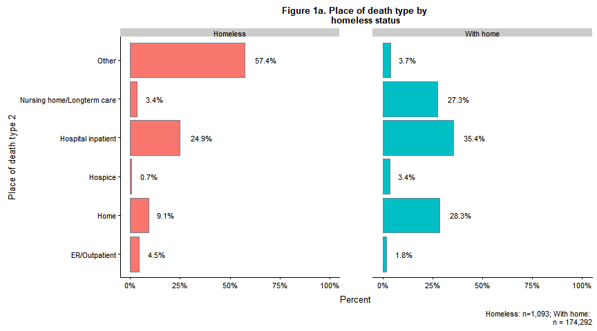
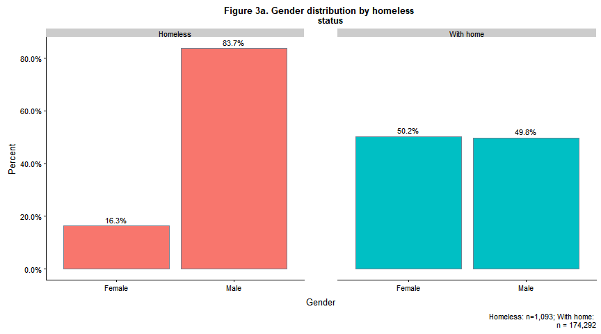
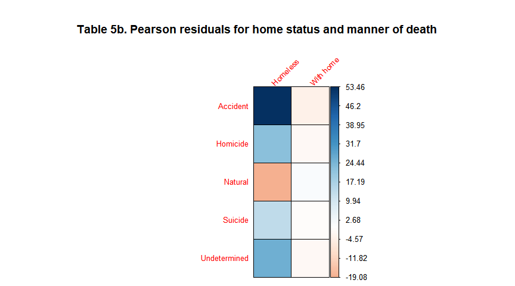
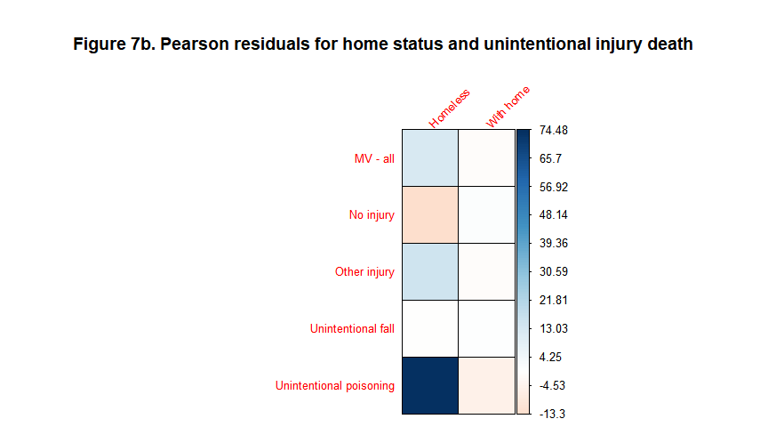

Classifying deaths in Washington State by homeless status
================
Maya Bhat-Gregerson
Fall 2018

-   [I. Overview](#i.-overview)
-   [II. Data pre-processing](#ii.-data-pre-processing)
    -   [A. Overview](#a.-overview)
        -   [1. Data cleaning and standardization](#data-cleaning-and-standardization)
        -   [2. Homeless decedents - linking homeless death data to their death certificates](#homeless-decedents---linking-homeless-death-data-to-their-death-certificates)
        -   [3. Decedents with homes - creating a subset with King County deaths to decedents with permanent homes](#decedents-with-homes---creating-a-subset-with-king-county-deaths-to-decedents-with-permanent-homes)
        -   [4. Appending homeless and with home data sets](#appending-homeless-and-with-home-data-sets)
    -   [B. Washington State mortality data - pre-processing](#b.-washington-state-mortality-data---pre-processing)
        -   [1. Cleaning and standardizing WAMD annual data 2003-2017](#cleaning-and-standardizing-wamd-annual-data-2003-2017)
        -   [2. Deriving new features in preparation for exploratory data analysis](#deriving-new-features-in-preparation-for-exploratory-data-analysis)
        -   [3. Creating a training data set of decedents who had permanent homes at time of death](#creating-a-training-data-set-of-decedents-who-had-permanent-homes-at-time-of-death)
    -   [C. King County Medical Examiner\`s Homeless Death Registry data - November 2003 to September 2017](#c.-king-county-medical-examiners-homeless-death-registry-data---november-2003-to-september-2017)
        -   [1. Cleaning KCMEO homeless registry](#cleaning-kcmeo-homeless-registry)
        -   [3. Creating combined dataset for exploratory data analysis](#creating-combined-dataset-for-exploratory-data-analysis)
-   [III. EXPLORATORY DATA ANALYSIS](#iii.-exploratory-data-analysis)
    -   [A. Missing values](#a.-missing-values)
    -   [B. Analysis of select variables](#b.-analysis-of-select-variables)
        -   [1. Place of death type](#place-of-death-type)
        -   [2. Age group](#age-group)
        -   [3. Gender](#gender)
        -   [4a. Race/ethnicity - 5 groups with Hispanic as race](#a.-raceethnicity---5-groups-with-hispanic-as-race)
        -   [5. Manner of death](#manner-of-death)
        -   [6. Leading causes of death](#leading-causes-of-death)
        -   [7. Unintentional injury sub-groups](#unintentional-injury-sub-groups)
        -   [8. Drug and alcohol induced causes of death](#drug-and-alcohol-induced-causes-of-death)
        -   [9. Educational attainment](#educational-attainment)
        -   [10. Military service](#military-service)
    -   [C. Text analysis of cause of death text fields](#c.-text-analysis-of-cause-of-death-text-fields)
    -   [D. Discussion of findings from exploratory data analysis](#d.-discussion-of-findings-from-exploratory-data-analysis)
    -   [APPENDICES](#appendices)
        -   [Appendix A - Data dictionary for Washington State Mortality Data](#appendix-a---data-dictionary-for-washington-state-mortality-data)

I. Overview
===========

The purpose of this project is twofold: (1) to conduct exploratory analysis comparing death data for known homeless decedents with data for those with permanent homes at the time of death, and (2) to use the findings to train a machine learning model to classify unlabeled deaths in Washington State by homeless status.

Currently, there is no consistent and definitive way to identify homelessness among decedents (such as a checkbox on the death certificate). Understanding the differences in demographics (gender, race/ethnicity, age group etc.) and causes of death between decedents who were homeless and those with permanent homes will validate our current understanding of the differences between these populations and provide direction for addressing the health needs of homeless individuals.

The data sets used for this project include Washington State final annual death certificate data for 2003-2017 and the King County Medical Examiner Office\`s registry of deaths among homeless individuals who died in King County, Washington. This registry contains name, birth date, death date, and place of death for homeless individuals who died between 2003 through late 2017. However, the registry does not contain important attributes that will be necessary for exploratory data analysis and for machine learning. These additional attributes are available in the death certificate information for each of the decedents listed in the homeless death registry requiring a linkage of the registry and the death certificate data to have a complete data set.

II. Data pre-processing
=======================

A. Overview
-----------

The following diagram provides an overview of the data pre-processing steps in preparation for exploratory data analysis and machine learning.


### 1. Data cleaning and standardization

This step includes:

1.  Limiting Washington annual mortality data sets (WAMD) for 2003 through 2017 to attributes that are likely to be relevant to training the machine learning model e.g. removing administrative variables (such as date of death certificate filing, amendments to death certificate), name and relationship to decedent of person who reported the death etc.

2.  Standardizing attribute names and formats by renaming attributes and coercing data types in both WAMD and King County Homeless Death Registry (HDR) data. Due to changes in data collection practices for WAMD over the years, attribute names and formats are inconsistent.

3.  Limiting records in WAMD to decedents who were Washington State residents who died in Washington State.

4.  Deriving new features that group the records by age group, leading causes of death etc. to allow exploratory data analysis and comparison with the homeless death data.

### 2. Homeless decedents - linking homeless death data to their death certificates

This step will add the additional attributes from WAMD to each of the records in HDR so that they have the necessary attributes to train the model. In its raw form, HDR contains very limited information about the homeless individuals who died including their names, dates of birth, dates of death, and places (address) of death.

Due to the incomplete nature of HDR data the linkage will be performed in multiple iterations using different combinations of key variables to arrive at linked homeless-death certificate data sets that will then be merged. The key variables used are as follows: -iteration 1: last name, first name, date of birth -iteration 2 (starting with only unmatched records from iteration 1): social security number -iteration 3 (starting with only unmatched records from iteration 2): date of death, last name, first name -iteration 4 (starting with only unmatched records from iteration 3): date of death, date of birth, last name

### 3. Decedents with homes - creating a subset with King County deaths to decedents with permanent homes

In this step the Washington annual mortality data set (2003-17 combined) is restricted to deaths occurring in King County with a residential geocode match score of at least 95% i.e. with a 95% or greater degree of certainty that the residential address provided on the death certificate matches a street address validated by the Census Bureau.

### 4. Appending homeless and with home data sets

The final data preparation step involves appending the homeless and "with home" data sets with standardized features and feature names to allow exploratory data analysis and training a machine learning model.

B. Washington State mortality data - pre-processing
---------------------------------------------------

Washington State requires by law that all deaths occurring in the state must be registered with the Washington State Department of Health. This means we have almost 100% reporting of deaths occurring in the state (with the exception of occasional missing persons).

The size of each annual file has increased over the years, both in terms of number of records and in terms of attributes. Attribute names and data types have not been consistent over the years. By 2017 Washington State's death data set included over 58,000 unique observations (death certificate records) and over 250 attributes. Most of the attributes are not relevant to train the machine learning model for this project.

This section addresses cleaning and limiting the data sets (in terms of number of attributes).

### 1. Cleaning and standardizing WAMD annual data 2003-2017

I created the dataset by connecting my R session to WA Department of Health's vital statistics SQL data base, selecting relevant features (variables), and renaming them for ease of use. The resulting data set consists of the following features:

last name, first name, middle name, social security number, death certificate number, date of death, date of birth, sex,type of death certifier (physician, Medical examiner, coroner etc), manner of death, cause of death (ICD 10 codes), residence street address, residence city, residence zipcode, residence state, residence county, death county, death zipcode, death state, type of place where death occurred (hospital, home, hospice etc), educational attainment, marital status, race, ethnicity, occupation code, and military service.

A description of these features and their values is provided in the data dictionary found in Appendix A.

``` r
library(RODBC)

wls <- odbcDriverConnect(connection ="Driver={ODBC Driver 13 for SQL Server};server=DOH01DBTUMP10,9799;
                            database=WA_DB_DQSS;trusted_connection=yes;")

WA0317 <- sqlQuery(wls,"SELECT SFN_NUM as 'certno', 
    DOB as 'dob',
    DOD as 'dod',
    LNAME as 'lname',
    GNAME as 'fname',
    MNAME as 'mname',
    SEX as 'sex',
    SSN as 'ssn', 
    CERT_DESIG as 'attclass',
    RACE_NCHS_CD as 'brgrace',
    DETHNIC_NO as 'hispanic',
    MANNER as 'manner',
    RES_COUNTY as 'rcounty',
    RES_CITY as 'rcity', 
    RES_ADDR1 as 'rstreet',  
    RES_MATCH_CODE as 'resmatchcode', 
    RES_STATE_FIPS_CD as 'rstateFIPS', 
    RES_ZIP as 'rzip',
    DADDR1 as 'dstreet', 
    --DNAME_FIPS_CD as 'dcityFIPS',
    DNAME_CITY as 'dcity',
    DZIP9 as 'dzip',
    DCOUNTY as 'dcounty', 
    DSTATEL_FIPS_CD as 'dstateFIPS',
    DPLACEL as 'dplacelit',
    DPLACE as 'dplacecode', 
    DATE_DEATH_YEAR as'dthyr',
    --ME_CASE_NUM as 'MEcasenum', 
    TRX_CAUSE_ACME as 'UCOD', 
    TRX_REC_AXIS_CD as 'MCOD', 
    DEDUC as 'educ', 
    MARITAL as 'marital', 
    OCCUP_MILHAM as 'occup',
    ARMED as 'military',
CODIA_QUERY+ ' ' + ISNULL(CODIB_QUERY, '') + ' ' + ISNULL(CODIC_QUERY, '') + ' ' + ISNULL(CODID_QUERY, '') + ' ' + ISNULL(CONDII_QUERY, '') + ' ' + ISNULL(INJRY_L_QUERY, '') as 'codlit'

                   FROM [wa_vrvweb_events].[VRV_DEATH_TBL]
                   WHERE SFN_NUM BETWEEN '2003000001' AND '2017089999'
                   AND FL_VOIDED = '0'
                   AND FL_CURRENT = '1'
                   AND VRV_REGISTERED_FLAG = '1'")

odbcClose(wls)


WA0317 <-subset(WA0317, dstateFIPS=="WA")
str(WA0317)
```

    ## 'data.frame':    745940 obs. of  33 variables:
    ##  $ certno      : int  2017012363 2017019356 2017019357 2017019358 2017019359 2017026057 2017019361 2017019363 2017019367 2017019368 ...
    ##  $ dob         : Factor w/ 39167 levels "01/01/1900","01/01/1902",..: 11211 13118 38661 28345 29099 23295 3684 21388 490 3463 ...
    ##  $ dod         : Factor w/ 5480 levels "00/00/2016","01/01/2003",..: 935 1715 1715 1700 1700 2360 1640 1700 1745 1745 ...
    ##  $ lname       : Factor w/ 123176 levels "A'ALONA-MOUNTS",..: 113287 15001 6225 51473 107797 45435 15457 36512 37315 69673 ...
    ##  $ fname       : Factor w/ 38249 levels "'NONE'","'O",..: 33096 9031 31799 36830 34007 16346 29848 29741 8393 9306 ...
    ##  $ mname       : Factor w/ 46681 levels "-","--","---",..: 7844 NA 12394 24147 NA 14621 28104 17257 12869 21797 ...
    ##  $ sex         : Factor w/ 3 levels "F","M","U": 1 2 1 2 1 1 1 2 1 2 ...
    ##  $ ssn         : Factor w/ 744513 levels "000-00-0005",..: 516050 53912 580348 686098 18834 77731 149648 111489 564044 92640 ...
    ##  $ attclass    : int  7 1 1 2 1 1 1 2 1 1 ...
    ##  $ brgrace     : int  1 1 1 1 1 1 1 1 1 1 ...
    ##  $ hispanic    : Factor w/ 2 levels "N","Y": 2 2 2 2 2 2 2 2 2 2 ...
    ##  $ manner      : Factor w/ 6 levels "A","C","H","N",..: 4 4 4 1 4 4 4 4 4 4 ...
    ##  $ rcounty     : Factor w/ 1110 levels "-","ACADIA","ADA",..: 497 547 547 908 762 198 497 454 179 199 ...
    ##  $ rcity       : Factor w/ 3849 levels "4600 WELS","69006 LYON",..: 418 565 539 2060 1222 3082 1674 1825 2026 3551 ...
    ##  $ rstreet     : Factor w/ 565792 levels "- BLDG 3764 C STRYKER AVENUE",..: 58753 10789 273747 96690 17620 444874 224105 417482 171057 495873 ...
    ##  $ resmatchcode: int  100 100 100 100 100 NA 100 100 100 100 ...
    ##  $ rstateFIPS  : Factor w/ 66 levels "AB","AK","AL",..: 61 61 61 61 61 61 61 61 61 61 ...
    ##  $ rzip        : Factor w/ 15555 levels "00000","00077",..: 7661 11656 11579 8784 9437 10089 5680 8652 13121 12785 ...
    ##  $ dstreet     : Factor w/ 266441 levels "-- ENTER OTHER RESIDENCE ADDRESS AT",..: 257570 4823 NA 254060 245789 NA 263975 179608 73341 264018 ...
    ##  $ dcity       : Factor w/ 2614 levels "171 M.3 T.MAE NA RUE A.MUANG",..: 2068 390 376 1374 848 2081 1602 1217 1354 2414 ...
    ##  $ dzip        : Factor w/ 4998 levels "00000","01027",..: 2236 3614 3595 2589 2808 3017 2305 2560 4167 3993 ...
    ##  $ dcounty     : Factor w/ 885 levels "A MUANG","ACADIA",..: 395 434 434 727 595 161 395 361 147 162 ...
    ##  $ dstateFIPS  : Factor w/ 105 levels "53","AF","AK",..: 98 98 98 98 98 98 98 98 98 98 ...
    ##  $ dplacelit   : Factor w/ 21 levels "DEAD ON ARRIVAL TO HOSPITAL IN TRANSPORT",..: 16 16 13 16 16 16 17 3 3 7 ...
    ##  $ dplacecode  : int  5 5 4 5 5 5 1 0 0 7 ...
    ##  $ dthyr       : int  2017 2017 2017 2017 2017 2017 2017 2017 2017 2017 ...
    ##  $ UCOD        : Factor w/ 3133 levels ".","000","0000",..: 1188 1306 1057 1510 1299 1297 1211 1211 417 1290 ...
    ##  $ MCOD        : Factor w/ 351268 levels ".","A020 A090 E86 I251 N170 N179",..: NA NA NA NA NA NA NA NA NA NA ...
    ##  $ educ        : int  4 3 6 6 3 3 4 4 4 1 ...
    ##  $ marital     : Factor w/ 7 levels "A","D","M","P",..: 2 7 7 3 7 7 7 5 3 7 ...
    ##  $ occup       : Factor w/ 430 levels "`","000","007",..: 407 237 137 97 407 165 169 144 186 348 ...
    ##  $ military    : Factor w/ 3 levels "N","U","Y": 1 1 1 3 1 1 1 1 1 3 ...
    ##  $ codlit      : Factor w/ 551452 levels "-- GASTROINTESTINAL BLEEDING-- METASTATIC CHOLANGIOCARCINOMA, PRIMARY SITE IS THE LIVER DUCTS METASTATIC TO THE"| __truncated__,..: 173260 165190 519898 450424 528728 407828 224188 165129 276514 208464 ...

I coerced specific features into factors and dates as they were read in as character strings by R. To prepare for record linkage later I standardized the last and first name fields by removing leading, trailing, and mid-name white spaces, removed all hyphenations. I also removed hyphens from the social security number charcter string. I left social security number as a string to avoid losing leading zeroes.

``` r
# Cleaning WA death data - standardizing values

## COERCE VARIABLES TO DATES

WA0317$dob <- as.Date(WA0317$dob, "%m/%d/%Y")
WA0317$dod <- as.Date(WA0317$dod, "%m/%d/%Y")

## REMOVE WHITESPACE, PUNCTUATION, AND SUFFIXES FROM NAMES AND HYPHENS FROM SSN

WA0317$lname <- str_replace_all(WA0317$lname, pattern = " ", replacement = "")
WA0317$lname <- str_replace_all(WA0317$lname, pattern = "-", replacement = "")

WA0317$fname <- str_replace_all(WA0317$fname, pattern = " ", replacement = "")
WA0317$fname <- str_replace_all(WA0317$fname, pattern = "-", replacement = "")

WA0317$ssn <- str_replace_all(WA0317$ssn, pattern= "-", replacement = "")

WA0317$UCOD <- as.character(WA0317$UCOD)

WA0317$UCOD <- ifelse((nchar(WA0317$UCOD)) < 4, paste(WA0317$UCOD, "0", sep = ""),
                      WA0317$UCOD)

WA0317$UCOD <- str_replace_all(string = WA0317$UCOD, pattern = " ", replacement = "")

## COERCE VARIABLES TO FACTOR
facvars_wa <- c("dcounty", "dzip", "dcity", "attclass", "brgrace", "hispanic", "sex",
                "manner", "rcounty", "rcity", "rstreet","rstateFIPS", "rzip", "dstateFIPS",
                "dplacelit", "dplacecode", "sex", "dthyr", "marital", "UCOD",  "educ",
                "MCOD", "occup", "military")

WA0317 %<>% mutate_at(facvars_wa, funs(factor(.)))

# convert character to numeric

WA0317$resmatchcode <- as.numeric(WA0317$resmatchcode)

summary(WA0317)
```

    ##      certno               dob                  dod            
    ##  Min.   :2.003e+09   Min.   :1893-05-27   Min.   :2003-01-01  
    ##  1st Qu.:2.007e+09   1st Qu.:1923-01-23   1st Qu.:2007-01-23  
    ##  Median :2.010e+09   Median :1932-05-26   Median :2010-12-07  
    ##  Mean   :2.010e+09   Mean   :1936-08-15   Mean   :2010-10-14  
    ##  3rd Qu.:2.014e+09   3rd Qu.:1947-01-16   3rd Qu.:2014-08-13  
    ##  Max.   :2.017e+09   Max.   :2017-12-31   Max.   :2017-12-31  
    ##                      NA's   :74                               
    ##     lname              fname               mname        sex       
    ##  Length:745940      Length:745940      LEE    : 17386   F:369857  
    ##  Class :character   Class :character   ANN    : 16544   M:376074  
    ##  Mode  :character   Mode  :character   MARIE  : 16416   U:     9  
    ##                                        JEAN   : 10791             
    ##                                        M      : 10107             
    ##                                        (Other):610339             
    ##                                        NA's   : 64357             
    ##      ssn               attclass         brgrace       hispanic  
    ##  Length:745940      1      :555602   1      :628492   N: 65318  
    ##  Class :character   2      :107583   2      : 18751   Y:680622  
    ##  Mode  :character   7      : 42333   15     : 10363             
    ##                     3      : 30181   3      :  9900             
    ##                     6      :  8862   6      :  4928             
    ##                     (Other):    43   (Other): 27283             
    ##                     NA's   :  1336   NA's   : 46223             
    ##   manner            rcounty             rcity       
    ##  A   : 42454   KING     :178725   SEATTLE  : 64245  
    ##  C   :  2826   PIERCE   : 87204   SPOKANE  : 36951  
    ##  H   :  3603   SNOHOMISH: 69007   TACOMA   : 35351  
    ##  N   :682229   SPOKANE  : 59687   VANCOUVER: 30909  
    ##  P   :    57   CLARK    : 40876   EVERETT  : 16875  
    ##  S   : 14674   (Other)  :309645   (Other)  :561412  
    ##  NA's:    97   NA's     :   796   NA's     :   197  
    ##                    rstreet        resmatchcode      rstateFIPS    
    ##  UNKNOWN               :  1759   Min.   :  0.00   WA     :727568  
    ##  7500 SEWARD PARK AVE S:   608   1st Qu.:100.00   OR     :  6428  
    ##  4831 35TH AVE SW      :   596   Median :100.00   ID     :  3251  
    ##  534 BOYER AVE         :   568   Mean   : 94.57   CA     :  1520  
    ##  13023 GREENWOOD AVE N :   545   3rd Qu.:100.00   AK     :  1213  
    ##  (Other)               :741824   Max.   :100.00   (Other):  5959  
    ##  NA's                  :    40   NA's   :47629    NA's   :     1  
    ##       rzip                                       dstreet      
    ##  98632  :  8356   FRANCISCAN HOSPICE HOUSE           :  5246  
    ##  98133  :  7166   COTTAGE IN THE MEADOW              :  1760  
    ##  98902  :  6808   TRI-CITIES CHAPLAINCY HOSPICE HOUSE:  1212  
    ##  99208  :  6420   12822 124TH LANE NE                :  1072  
    ##  98382  :  6354   HOSPICE OF SPOKANE HOSPICE HOUSE   :   961  
    ##  (Other):710599   (Other)                            :339320  
    ##  NA's   :   237   NA's                               :396369  
    ##        dcity             dzip             dcounty       dstateFIPS 
    ##  SEATTLE  : 91224   98201  : 16625   KING     :200694   WA:745940  
    ##  SPOKANE  : 53197   98405  : 15479   PIERCE   : 90133              
    ##  TACOMA   : 38773   98122  : 13600   SPOKANE  : 67646              
    ##  VANCOUVER: 37582   98506  : 12579   SNOHOMISH: 64035              
    ##  EVERETT  : 25553   99204  : 12567   CLARK    : 43746              
    ##  (Other)  :499517   (Other):629041   (Other)  :279682              
    ##  NA's     :    94   NA's   : 46049   NA's     :     4              
    ##                        dplacelit        dplacecode         dthyr       
    ##  Home                       :220536   0      :237123   2017   : 56986  
    ##  Hospital (inpatient)       :204310   4      :218105   2016   : 54783  
    ##  Nursing home/long term care:165922   5      :187867   2015   : 54651  
    ##  Hospice                    : 36101   7      : 39535   2014   : 52074  
    ##  Other place                : 34453   1      : 37526   2013   : 51261  
    ##  Emergency room             : 22323   3      : 23853   2012   : 50161  
    ##  (Other)                    : 62295   (Other):  1931   (Other):426024  
    ##       UCOD               MCOD             educ        marital   
    ##  C349   : 46385   C349 F179: 12914   3      :275429   A:  2408  
    ##  I251   : 44322   G309     : 10676   4      :120355   D:125505  
    ##  G309   : 43577   C349     :  6624   6      : 83031   M:279434  
    ##  I219   : 32710   C259     :  5855   2      : 65277   P:   877  
    ##  J449   : 30481   C509     :  5679   1      : 60747   S: 75571  
    ##  (Other):548195   (Other)  :653617   9      : 51414   U:  4138  
    ##  NA's   :   270   NA's     : 50575   (Other): 89687   W:258007  
    ##      occup        military                             codlit      
    ##  908    :126897   N:529289   LUNG CANCER                  :  5731  
    ##  183    : 19104   U:  4263   PANCREATIC CANCER            :  3184  
    ##  290    : 15837   Y:212388   ALZHEIMERS DEMENTIA          :  2833  
    ##  150    : 13582              METASTATIC BREAST CANCER     :  2743  
    ##  396    : 13464              METASTATIC LUNG CANCER       :  2380  
    ##  (Other):542052              (Other)                      :728924  
    ##  NA's   : 15004              NA's                         :   145

``` r
str(WA0317)
```

    ## 'data.frame':    745940 obs. of  33 variables:
    ##  $ certno      : int  2017012363 2017019356 2017019357 2017019358 2017019359 2017026057 2017019361 2017019363 2017019367 2017019368 ...
    ##  $ dob         : Date, format: "1945-04-15" "1918-05-03" ...
    ##  $ dod         : Date, format: "2017-03-03" "2017-04-24" ...
    ##  $ lname       : chr  "VANRY" "BYERS" "BASKIN" "JOHNSON" ...
    ##  $ fname       : chr  "SYLVIA" "DOUGLAS" "SHIRLEY" "WILLARD" ...
    ##  $ mname       : Factor w/ 46681 levels "-","--","---",..: 7844 NA 12394 24147 NA 14621 28104 17257 12869 21797 ...
    ##  $ sex         : Factor w/ 3 levels "F","M","U": 1 2 1 2 1 1 1 2 1 2 ...
    ##  $ ssn         : chr  "537446055" "258429171" "539181252" "559307744" ...
    ##  $ attclass    : Factor w/ 10 levels "0","1","2","3",..: 8 2 2 3 2 2 2 3 2 2 ...
    ##  $ brgrace     : Factor w/ 20 levels "1","2","3","4",..: 1 1 1 1 1 1 1 1 1 1 ...
    ##  $ hispanic    : Factor w/ 2 levels "N","Y": 2 2 2 2 2 2 2 2 2 2 ...
    ##  $ manner      : Factor w/ 6 levels "A","C","H","N",..: 4 4 4 1 4 4 4 4 4 4 ...
    ##  $ rcounty     : Factor w/ 1097 levels "ACADIA","ADA",..: 491 541 541 898 754 195 491 449 176 196 ...
    ##  $ rcity       : Factor w/ 3819 levels "4600 WELS","69006 LYON",..: 415 560 534 2045 1211 3059 1663 1812 2011 3522 ...
    ##  $ rstreet     : Factor w/ 555079 levels "#1 5TH AND MAIN ST.",..: 57600 10570 268421 94779 17238 436377 219748 409453 167666 486464 ...
    ##  $ resmatchcode: num  100 100 100 100 100 NA 100 100 100 100 ...
    ##  $ rstateFIPS  : Factor w/ 66 levels "AB","AK","AL",..: 61 61 61 61 61 61 61 61 61 61 ...
    ##  $ rzip        : Factor w/ 15491 levels "00000","00077",..: 7625 11606 11529 8744 9396 10046 5651 8612 13065 12733 ...
    ##  $ dstreet     : Factor w/ 266441 levels "-- ENTER OTHER RESIDENCE ADDRESS AT",..: 257570 4823 NA 254060 245789 NA 263975 179608 73341 264018 ...
    ##  $ dcity       : Factor w/ 747 levels "ABERDEEN","ACME",..: 595 102 100 404 244 600 467 356 395 695 ...
    ##  $ dzip        : Factor w/ 3809 levels "00000","03282",..: 1086 2463 2444 1438 1657 1866 1155 1409 3016 2842 ...
    ##  $ dcounty     : Factor w/ 40 levels "ADAMS","ASOTIN",..: 17 21 21 32 27 5 17 15 4 6 ...
    ##  $ dstateFIPS  : Factor w/ 1 level "WA": 1 1 1 1 1 1 1 1 1 1 ...
    ##  $ dplacelit   : Factor w/ 21 levels "DEAD ON ARRIVAL TO HOSPITAL IN TRANSPORT",..: 16 16 13 16 16 16 17 3 3 7 ...
    ##  $ dplacecode  : Factor w/ 10 levels "0","1","2","3",..: 6 6 5 6 6 6 2 1 1 8 ...
    ##  $ dthyr       : Factor w/ 15 levels "2003","2004",..: 15 15 15 15 15 15 15 15 15 15 ...
    ##  $ UCOD        : Factor w/ 3086 levels "A020","A021",..: 1178 1296 1049 1500 1289 1287 1201 1201 412 1280 ...
    ##  $ MCOD        : Factor w/ 345266 levels "A020 A090 E86 I251 N170 N179",..: NA NA NA NA NA NA NA NA NA NA ...
    ##  $ educ        : Factor w/ 9 levels "1","2","3","4",..: 4 3 6 6 3 3 4 4 4 1 ...
    ##  $ marital     : Factor w/ 7 levels "A","D","M","P",..: 2 7 7 3 7 7 7 5 3 7 ...
    ##  $ occup       : Factor w/ 430 levels "`","000","007",..: 407 237 137 97 407 165 169 144 186 348 ...
    ##  $ military    : Factor w/ 3 levels "N","U","Y": 1 1 1 3 1 1 1 1 1 3 ...
    ##  $ codlit      : Factor w/ 551452 levels "-- GASTROINTESTINAL BLEEDING-- METASTATIC CHOLANGIOCARCINOMA, PRIMARY SITE IS THE LIVER DUCTS METASTATIC TO THE"| __truncated__,..: 173260 165190 519898 450424 528728 407828 224188 165129 276514 208464 ...

The summary of the features shown above indicates that some have missing values e.g. "brgrace" (calculated race variable), "rstreet" (residential street address), "MCOD" (multiple cause of death). Some of these variables routinely have missing values for acceptable reasons, for example not all deaths have multiple causes of death as these are optional fields and the health care provider completing the death certificate may only report a single underlying cause of death. Race is also a feature that routinely has substantial proportion of records with missing values as funeral homes (which typically report demographic information for decedents) may not be able to obtain this information. Further in the data processing when the data set is limited to deaths occurring in King County, WA, fewer variables have large numbers of missing variables and, where they exist, they are not necessary for linkage with the list of homeless decedents.

### 2. Deriving new features in preparation for exploratory data analysis

I created a few derived variables including calculated age (at time of death), 5-category age group, leading causes of death categories (by grouping codes in the "UCOD" feature which contains International Classification of Disease, 10th edition, codes indicating the underlying cause of death), race/ethnicity (applying U.S. Office of Management and Budget and Washington State Department of Health guidelines), resident status (Washington state vs. out of state resident), unintentional injury cause of death groups, and substance abuse related cause of death groups.

These added features will useful in conducting exploratory data analysis including comparing the characteristics of homeless decedents with those of decedents who had a permanent home at death.

``` r
# Creating derived variables in WA death dataset

## CALCULATED AGE AT DEATH

WA0317$age <- year(WA0317$dod) - year(WA0317$dob)

attach(WA0317)

# AGE CATEGORIES

WA0317$age5cat[age<18] <- "<18yrs"
WA0317$age5cat[age>=18 & age<=29] <-"18-29yrs"
WA0317$age5cat[age>=30 & age<=44] <- "30-44yrs"
WA0317$age5cat[age>=45 & age<=64] <-"45-64yrs"
WA0317$age5cat[age>=65] <- "65+ yrs"

#LEADING CAUSES OF DEATH (per National Center for Health Statistics)

WA0317$LCOD <- "Other"

##MALIGNANT NEOPLASMS - C00-C97
MalignantNeoplasms <- "C[0-9][0-7][0-9]?"
WA0317$LCOD[grepl(MalignantNeoplasms, WA0317$UCOD)]<- "Cancer"

##DISEASES OF THE HEART - I00-I09,I11,I13,I20-I51
HeartDisease <- "I0[0-9][0-9]?|I11[0-9]?|I13[0-9]?|I[2-4][0-9][0-9]?|I50[0-9]?|I51[0-9]?"
WA0317$LCOD[grepl(HeartDisease, WA0317$UCOD)]<- "Heart Dis."

##ALZHEIMER'S DISEASE - G30
Alzheimers <- "G30[0-9]?"
WA0317$LCOD[grepl("G30", WA0317$UCOD)]<- "Alzheimers"

##ACCIDENTS - V01-X59,Y85-Y86
unintentionalinjury <- "V[0-9][0-9][0-9]?|W[0-9][0-9][0-9]?|X[0-5][0-9][0-9]?|Y8[5-6][0-9]?"
WA0317$LCOD[grepl(unintentionalinjury, WA0317$UCOD)]<- "Injury-unintentional"

##CHRONIC LOWER RESPIRATORY DISEASE - J40-J47
CLRD <- "J4[0-7][0-9]?"
WA0317$LCOD[grepl(CLRD, WA0317$UCOD)]<- "Chronic Lwr Resp Dis."

##CEREBROVASCULAR DISEASE - I60-69
CVD <- "I6[0-9][0-9]?"
WA0317$LCOD[grepl(CVD, WA0317$UCOD)]<- "Stroke"

##DIABETES MELLITUS - E10-E14
diabetes <- "E1[0-4][0-9]?"
WA0317$LCOD[grepl(diabetes, WA0317$UCOD)]<- "Diabetes"

#SUICIDE
allsuicides <- "U03[0-9]?|X[6-7][0-9][0-9]?|X8[0-4][0-9?]|Y870"
WA0317$LCOD[grepl(allsuicides, WA0317$UCOD)]<- "Suicide-all"

##CHRONIC LIVER DISEASE AND CIRRHOSIS - K70,K73-K74
liver <- "K70[0-9]?|K7[3-4][0-9]?"
WA0317$LCOD[grepl(liver, WA0317$UCOD)]<- "Chronic Liver dis./cirrh."

##INFLUENZA AND PNEUMONIA - J09-J18
flu <- "J09[0-9]?|J1[0-8][0-9]?"
WA0317$LCOD[grepl(flu, WA0317$UCOD)]<- "Flu"


### UNINTENTIONAL INJURIES - SELECT SUBCATEGORIES OF:  V01-X59,Y85-Y86

WA0317$injury <- "No injury"

#Unintentional Poisoning - X40-49
poisoninjury <- "^X4[0-9][0-9]?"
WA0317$injury[grepl(poisoninjury, WA0317$UCOD)] <- "Unintentional poisoning"

# Unintentional Firearm - W32-34
#guninjury <- "W3[2-4][0-9]?"
#WA0317$injury[grepl(guninjury, WA0317$UCOD)] <- "Unintentional firearm"

# Motor vehicle - pedestrian - (V01-V99, X82, Y03, Y32, Y36.1, *U01.1 )
mvall <- "V[0-9][1-9][0-9]?|X82[0-9]?|Y03[0-9]?|Y32[0-9]?|Y361|U011"
WA0317$injury[grepl(mvall, WA0317$UCOD)] <- "MV - all"

# Motor vehicle - pedestrian - (V02–V04[.1,.9],V09.2)
#mvped <- "V021|V029|V031|V039|V041|V049|V092"
#WA0317$injury[grepl(mvped, WA0317$UCOD)] <- "MV crash-pedestrian"

# Motor Vehicle - bicycle - V12-V14 (.3-.9) , V19 (.4-.6)
#mvbike <- "V1[2-4][3-9]?|V19[4-6]?"
#WA0317$injury[grepl(mvbike, WA0317$UCOD)] <- "MV crash-bicyclist"

# Unintentional Fall (W00–W19)
fall <- "W0[0-9][0-9]|W1[0-9][0-9]"
WA0317$injury[grepl(fall, WA0317$UCOD)] <- "Unintentional fall"

#Other injury
WA0317$injury[grepl(unintentionalinjury, WA0317$UCOD) & !grepl(poisoninjury, WA0317$UCOD) & !grepl(mvall, WA0317$UCOD) & !grepl(fall, WA0317$UCOD)] <- "Other injury"


#SUBSTANCE ABUSE
WA0317$substance <- "No Substance abuse"

#Alcohol-induced per NCHS - https://www.cdc.gov/nchs/data/nvsr/nvsr66/nvsr66_06.pdf
#excludes unintentional injuries, homicides, other causes indirectly related to alcohol
#use, newborn deaths due to maternal alcohol use.

alcohol <- "E244|F10[0-9]?|G312|G621|G721|I426|K292|K70[0-9]?|K852|K860|R780|X45[0-9]?|
            X65[0-9]?|Y15[0-9]?"
WA0317$substance[grepl(alcohol, WA0317$UCOD)] <- "Alcohol-induced"


#Drug-induced per NCHS - https://www.cdc.gov/nchs/data/nvsr/nvsr66/nvsr66_06.pdf 
#Excludes unintentional injuries, homicides, other causes indirectly related to drug
#use, newborn deaths due to maternal drug use

drug <- "D521|D590|D592|D611|D642|E064|E160|E231|E242|E273|E661|F11[1–5]|F11[7–9]|F12[1-5]|
F12[7–9]|F13[1–5]|F13[7-9]|F14[1–5]|F14[7–9]|F15[1–5]|F15[7–9]|F16[1–5]|F16[7–9]|F17[3–5]|
F17[7–9]|F18[1–5]|F18[7–9]|F19[1–5]|F19[7–9]|G211|G240|G251|G254|G256|G444|G620|G720|I952|
J702|J703|J704|K853|L105|L270|L271|M102|M320|M804|M814|M835|M871|R502|R781|R782|R783|R784|
R785|X4[0-4][0-9]|X6[0–4][0-9]|X85|Y1[0–4][0-9]"

WA0317$substance[grepl(drug, WA0317$UCOD)] <- "Drug-induced"

## RESIDENCE

WA0317$residence[rstateFIPS != "WA" & rstateFIPS !="ZZ"] <- "Out of state"
WA0317$residence[rstateFIPS == "WA"] <- "WA resident"

## RACE AND ETHNICITY
## remember that the original ethnicity variable was named "HISPANICNO" 
#(renamed "hispanic" in this data set) i.e. a "yes" means they are NOT hispanic

##5 groups with Hispanic as race
WA0317$raceethnic5 <- "Other"
WA0317$raceethnic5[brgrace %in% c("01", "1") & hispanic=="Y"] <- "White NH"
WA0317$raceethnic5[brgrace %in% c("02","2") & hispanic=="Y"] <- "Black NH"
WA0317$raceethnic5[brgrace %in% c("03","3") & hispanic=="Y"] <- "AIAN NH"
WA0317$raceethnic5[brgrace %in% c("04","4","05","5","06","6","07","7","08","8","09","9",
                                  "10","11","12","13","14","15") & 
                                   hispanic=="Y"] <- "Asian/PI NH"
WA0317$raceethnic5[hispanic=="N"] <- "Hispanic"
WA0317$raceethnic5[is.na(brgrace)] <- "Unknown"


## 6 groups with Hispanic as race and separating Asians and NHOPI
WA0317$raceethnic6 <- "Other"
WA0317$raceethnic6[brgrace %in% c("01", "1") & hispanic=="Y"] <- "White NH"
WA0317$raceethnic6[brgrace %in% c("02","2") & hispanic=="Y"] <- "Black NH"
WA0317$raceethnic6[brgrace %in% c("03","3") & hispanic=="Y"] <- "AIAN NH"
WA0317$raceethnic6[brgrace %in% c("04","4","05","5","06","6","07","7","08","8","09","9",
                                  "10") & hispanic=="Y"] <- "Asian"
WA0317$raceethnic6[brgrace %in% c("11","12","13","14","15") & hispanic=="Y"] <- "NHOPI"
WA0317$raceethnic6[hispanic=="N"] <- "Hispanic"
WA0317$raceethnic6[is.na(brgrace)] <- "Unknown"


WA0317 %<>% mutate_at(c("age5cat", "residence", "LCOD", "injury", "substance", 
                        "raceethnic5", "raceethnic6"), funs(factor(.)))

## Labeling manner of death

WA0317$manner <- factor(WA0317$manner,
                        levels = c("A", "C", "H", "N", "NULL", "P", "S"),
                        labels = c("Accident", "Undetermined", "Homicide", "Natural", 
                                   "Unk.","Pending", "Suicide"))

##Labeling educational attainment

WA0317$educ <- factor(WA0317$educ,
                        levels = c("1", "2", "3", "4", "5", "6", "7", "8", "9"),
                        labels = c("<=8th grade", "9-12th gr., no diploma", 
                                   "H.S. grad/GED", "Some college", "Associate's",
                                   "Bachelors", "Masters", "Doctorate/Professional", 
                                   "Unknown"))

detach(WA0317)
str(WA0317)
```

    ## 'data.frame':    745940 obs. of  41 variables:
    ##  $ certno      : int  2017012363 2017019356 2017019357 2017019358 2017019359 2017026057 2017019361 2017019363 2017019367 2017019368 ...
    ##  $ dob         : Date, format: "1945-04-15" "1918-05-03" ...
    ##  $ dod         : Date, format: "2017-03-03" "2017-04-24" ...
    ##  $ lname       : chr  "VANRY" "BYERS" "BASKIN" "JOHNSON" ...
    ##  $ fname       : chr  "SYLVIA" "DOUGLAS" "SHIRLEY" "WILLARD" ...
    ##  $ mname       : Factor w/ 46681 levels "-","--","---",..: 7844 NA 12394 24147 NA 14621 28104 17257 12869 21797 ...
    ##  $ sex         : Factor w/ 3 levels "F","M","U": 1 2 1 2 1 1 1 2 1 2 ...
    ##  $ ssn         : chr  "537446055" "258429171" "539181252" "559307744" ...
    ##  $ attclass    : Factor w/ 10 levels "0","1","2","3",..: 8 2 2 3 2 2 2 3 2 2 ...
    ##  $ brgrace     : Factor w/ 20 levels "1","2","3","4",..: 1 1 1 1 1 1 1 1 1 1 ...
    ##  $ hispanic    : Factor w/ 2 levels "N","Y": 2 2 2 2 2 2 2 2 2 2 ...
    ##  $ manner      : Factor w/ 7 levels "Accident","Undetermined",..: 4 4 4 1 4 4 4 4 4 4 ...
    ##  $ rcounty     : Factor w/ 1097 levels "ACADIA","ADA",..: 491 541 541 898 754 195 491 449 176 196 ...
    ##  $ rcity       : Factor w/ 3819 levels "4600 WELS","69006 LYON",..: 415 560 534 2045 1211 3059 1663 1812 2011 3522 ...
    ##  $ rstreet     : Factor w/ 555079 levels "#1 5TH AND MAIN ST.",..: 57600 10570 268421 94779 17238 436377 219748 409453 167666 486464 ...
    ##  $ resmatchcode: num  100 100 100 100 100 NA 100 100 100 100 ...
    ##  $ rstateFIPS  : Factor w/ 66 levels "AB","AK","AL",..: 61 61 61 61 61 61 61 61 61 61 ...
    ##  $ rzip        : Factor w/ 15491 levels "00000","00077",..: 7625 11606 11529 8744 9396 10046 5651 8612 13065 12733 ...
    ##  $ dstreet     : Factor w/ 266441 levels "-- ENTER OTHER RESIDENCE ADDRESS AT",..: 257570 4823 NA 254060 245789 NA 263975 179608 73341 264018 ...
    ##  $ dcity       : Factor w/ 747 levels "ABERDEEN","ACME",..: 595 102 100 404 244 600 467 356 395 695 ...
    ##  $ dzip        : Factor w/ 3809 levels "00000","03282",..: 1086 2463 2444 1438 1657 1866 1155 1409 3016 2842 ...
    ##  $ dcounty     : Factor w/ 40 levels "ADAMS","ASOTIN",..: 17 21 21 32 27 5 17 15 4 6 ...
    ##  $ dstateFIPS  : Factor w/ 1 level "WA": 1 1 1 1 1 1 1 1 1 1 ...
    ##  $ dplacelit   : Factor w/ 21 levels "DEAD ON ARRIVAL TO HOSPITAL IN TRANSPORT",..: 16 16 13 16 16 16 17 3 3 7 ...
    ##  $ dplacecode  : Factor w/ 10 levels "0","1","2","3",..: 6 6 5 6 6 6 2 1 1 8 ...
    ##  $ dthyr       : Factor w/ 15 levels "2003","2004",..: 15 15 15 15 15 15 15 15 15 15 ...
    ##  $ UCOD        : Factor w/ 3086 levels "A020","A021",..: 1178 1296 1049 1500 1289 1287 1201 1201 412 1280 ...
    ##  $ MCOD        : Factor w/ 345266 levels "A020 A090 E86 I251 N170 N179",..: NA NA NA NA NA NA NA NA NA NA ...
    ##  $ educ        : Factor w/ 9 levels "<=8th grade",..: 4 3 6 6 3 3 4 4 4 1 ...
    ##  $ marital     : Factor w/ 7 levels "A","D","M","P",..: 2 7 7 3 7 7 7 5 3 7 ...
    ##  $ occup       : Factor w/ 430 levels "`","000","007",..: 407 237 137 97 407 165 169 144 186 348 ...
    ##  $ military    : Factor w/ 3 levels "N","U","Y": 1 1 1 3 1 1 1 1 1 3 ...
    ##  $ codlit      : Factor w/ 551452 levels "-- GASTROINTESTINAL BLEEDING-- METASTATIC CHOLANGIOCARCINOMA, PRIMARY SITE IS THE LIVER DUCTS METASTATIC TO THE"| __truncated__,..: 173260 165190 519898 450424 528728 407828 224188 165129 276514 208464 ...
    ##  $ age         : num  72 99 91 90 91 89 89 47 64 96 ...
    ##  $ age5cat     : Factor w/ 5 levels "<18yrs","18-29yrs",..: 5 5 5 5 5 5 5 4 4 5 ...
    ##  $ LCOD        : Factor w/ 11 levels "Alzheimers","Cancer",..: 7 7 9 4 7 7 7 7 2 7 ...
    ##  $ injury      : Factor w/ 5 levels "MV - all","No injury",..: 2 2 2 2 2 2 2 2 2 2 ...
    ##  $ substance   : Factor w/ 3 levels "Alcohol-induced",..: 3 3 3 3 3 3 3 3 3 3 ...
    ##  $ residence   : Factor w/ 2 levels "Out of state",..: 2 2 2 2 2 2 2 2 2 2 ...
    ##  $ raceethnic5 : Factor w/ 7 levels "AIAN NH","Asian/PI NH",..: 7 7 7 7 7 7 7 7 7 7 ...
    ##  $ raceethnic6 : Factor w/ 8 levels "AIAN NH","Asian",..: 8 8 8 8 8 8 8 8 8 8 ...

``` r
summary(WA0317)
```

    ##      certno               dob                  dod            
    ##  Min.   :2.003e+09   Min.   :1893-05-27   Min.   :2003-01-01  
    ##  1st Qu.:2.007e+09   1st Qu.:1923-01-23   1st Qu.:2007-01-23  
    ##  Median :2.010e+09   Median :1932-05-26   Median :2010-12-07  
    ##  Mean   :2.010e+09   Mean   :1936-08-15   Mean   :2010-10-14  
    ##  3rd Qu.:2.014e+09   3rd Qu.:1947-01-16   3rd Qu.:2014-08-13  
    ##  Max.   :2.017e+09   Max.   :2017-12-31   Max.   :2017-12-31  
    ##                      NA's   :74                               
    ##     lname              fname               mname        sex       
    ##  Length:745940      Length:745940      LEE    : 17386   F:369857  
    ##  Class :character   Class :character   ANN    : 16544   M:376074  
    ##  Mode  :character   Mode  :character   MARIE  : 16416   U:     9  
    ##                                        JEAN   : 10791             
    ##                                        M      : 10107             
    ##                                        (Other):610339             
    ##                                        NA's   : 64357             
    ##      ssn               attclass         brgrace       hispanic  
    ##  Length:745940      1      :555602   1      :628492   N: 65318  
    ##  Class :character   2      :107583   2      : 18751   Y:680622  
    ##  Mode  :character   7      : 42333   15     : 10363             
    ##                     3      : 30181   3      :  9900             
    ##                     6      :  8862   6      :  4928             
    ##                     (Other):    43   (Other): 27283             
    ##                     NA's   :  1336   NA's   : 46223             
    ##           manner            rcounty             rcity       
    ##  Natural     :682229   KING     :178725   SEATTLE  : 64245  
    ##  Accident    : 42454   PIERCE   : 87204   SPOKANE  : 36951  
    ##  Suicide     : 14674   SNOHOMISH: 69007   TACOMA   : 35351  
    ##  Homicide    :  3603   SPOKANE  : 59687   VANCOUVER: 30909  
    ##  Undetermined:  2826   CLARK    : 40876   EVERETT  : 16875  
    ##  (Other)     :    57   (Other)  :309645   (Other)  :561412  
    ##  NA's        :    97   NA's     :   796   NA's     :   197  
    ##                    rstreet        resmatchcode      rstateFIPS    
    ##  UNKNOWN               :  1759   Min.   :  0.00   WA     :727568  
    ##  7500 SEWARD PARK AVE S:   608   1st Qu.:100.00   OR     :  6428  
    ##  4831 35TH AVE SW      :   596   Median :100.00   ID     :  3251  
    ##  534 BOYER AVE         :   568   Mean   : 94.57   CA     :  1520  
    ##  13023 GREENWOOD AVE N :   545   3rd Qu.:100.00   AK     :  1213  
    ##  (Other)               :741824   Max.   :100.00   (Other):  5959  
    ##  NA's                  :    40   NA's   :47629    NA's   :     1  
    ##       rzip                                       dstreet      
    ##  98632  :  8356   FRANCISCAN HOSPICE HOUSE           :  5246  
    ##  98133  :  7166   COTTAGE IN THE MEADOW              :  1760  
    ##  98902  :  6808   TRI-CITIES CHAPLAINCY HOSPICE HOUSE:  1212  
    ##  99208  :  6420   12822 124TH LANE NE                :  1072  
    ##  98382  :  6354   HOSPICE OF SPOKANE HOSPICE HOUSE   :   961  
    ##  (Other):710599   (Other)                            :339320  
    ##  NA's   :   237   NA's                               :396369  
    ##        dcity             dzip             dcounty       dstateFIPS 
    ##  SEATTLE  : 91224   98201  : 16625   KING     :200694   WA:745940  
    ##  SPOKANE  : 53197   98405  : 15479   PIERCE   : 90133              
    ##  TACOMA   : 38773   98122  : 13600   SPOKANE  : 67646              
    ##  VANCOUVER: 37582   98506  : 12579   SNOHOMISH: 64035              
    ##  EVERETT  : 25553   99204  : 12567   CLARK    : 43746              
    ##  (Other)  :499517   (Other):629041   (Other)  :279682              
    ##  NA's     :    94   NA's   : 46049   NA's     :     4              
    ##                        dplacelit        dplacecode         dthyr       
    ##  Home                       :220536   0      :237123   2017   : 56986  
    ##  Hospital (inpatient)       :204310   4      :218105   2016   : 54783  
    ##  Nursing home/long term care:165922   5      :187867   2015   : 54651  
    ##  Hospice                    : 36101   7      : 39535   2014   : 52074  
    ##  Other place                : 34453   1      : 37526   2013   : 51261  
    ##  Emergency room             : 22323   3      : 23853   2012   : 50161  
    ##  (Other)                    : 62295   (Other):  1931   (Other):426024  
    ##       UCOD               MCOD                            educ       
    ##  C349   : 46385   C349 F179: 12914   H.S. grad/GED         :275429  
    ##  I251   : 44322   G309     : 10676   Some college          :120355  
    ##  G309   : 43577   C349     :  6624   Bachelors             : 83031  
    ##  I219   : 32710   C259     :  5855   9-12th gr., no diploma: 65277  
    ##  J449   : 30481   C509     :  5679   <=8th grade           : 60747  
    ##  (Other):548195   (Other)  :653617   Unknown               : 51414  
    ##  NA's   :   270   NA's     : 50575   (Other)               : 89687  
    ##  marital        occup        military  
    ##  A:  2408   908    :126897   N:529289  
    ##  D:125505   183    : 19104   U:  4263  
    ##  M:279434   290    : 15837   Y:212388  
    ##  P:   877   150    : 13582             
    ##  S: 75571   396    : 13464             
    ##  U:  4138   (Other):542052             
    ##  W:258007   NA's   : 15004             
    ##                            codlit            age             age5cat      
    ##  LUNG CANCER                  :  5731   Min.   :  0.00   <18yrs  :  9978  
    ##  PANCREATIC CANCER            :  3184   1st Qu.: 64.00   18-29yrs: 12483  
    ##  ALZHEIMERS DEMENTIA          :  2833   Median : 79.00   30-44yrs: 25793  
    ##  METASTATIC BREAST CANCER     :  2743   Mean   : 74.17   45-64yrs:138528  
    ##  METASTATIC LUNG CANCER       :  2380   3rd Qu.: 87.00   65+ yrs :559084  
    ##  (Other)                      :728924   Max.   :114.00   NA's    :    74  
    ##  NA's                         :   145   NA's   :74                        
    ##                     LCOD                            injury      
    ##  Other                :187548   MV - all               :  9533  
    ##  Cancer               :162623   No injury              :704739  
    ##  Heart Dis.           :161864   Other injury           :  7293  
    ##  Alzheimers           : 44973   Unintentional fall     : 11884  
    ##  Chronic Lwr Resp Dis.: 43189   Unintentional poisoning: 12491  
    ##  Stroke               : 42143                                   
    ##  (Other)              :103600                                   
    ##               substance             residence           raceethnic5    
    ##  Alcohol-induced   : 12988   Out of state: 17806   AIAN NH    :  9549  
    ##  Drug-induced      : 14198   WA resident :727568   Asian/PI NH: 26014  
    ##  No Substance abuse:718754   NA's        :   566   Black NH   : 18492  
    ##                                                    Hispanic   : 19352  
    ##                                                    Other      :  5513  
    ##                                                    Unknown    : 46223  
    ##                                                    White NH   :620797  
    ##    raceethnic6    
    ##  White NH:620797  
    ##  Unknown : 46223  
    ##  Asian   : 23119  
    ##  Hispanic: 19352  
    ##  Black NH: 18492  
    ##  AIAN NH :  9549  
    ##  (Other) :  8408

### 3. Creating a training data set of decedents who had permanent homes at time of death

I started by creating a subset of the Washington State data set that included only King County resident deaths where the decedent had a permanent home. The death data set contains a feature called "Place of Death Type", a factor with the following levels:

    - 0 = Home
    - 1 = Other Place
    - 2 = In Transport
    - 3 = Emergency Room
    - 4 = Hospital (Inpatient) 
    - 5 = Nursing Home/Long Term Care
    - 6 = Hospital
    - 7 = Hospice Facility
    - 8 = Other Person's Residence
    - 9 = Unknown

I defined "permanent home" as decedents whose residence address at time of death could be verified through a geocoding process with 95% or greater accuracy. This criterion will exclude persons with incomplete or missing death addresses e.g. those who died on a street corner where the death certificate might list the death address as "Main street and King Blvd".

Another restriction was to limit the deaths to those occurring in King County regardless of county of residence of the decedent to reduce the chance that county of death affects the characteristics of the death or information reported on the death certificate.

I added the suffix ".k" to the column names to identify easily the source data set for these features. This will be helpful in the next step when I merge homeless registry data with their corresponding death records.

From this set of King County deaths among persons with permanent homes I selected a random sample of 1,200 records to match the size of the homeless death record data set.

``` r
# Creating a subset comprised of deaths in King County among decedents with permanent homes

KC0317<- subset(WA0317, dcounty=="KING")

KC <- KC0317

colnames(KC)<-c("certno.k", "dob.k", "dod.k", "lname.k", "fname.k", "mname.k", "sex.k",
                "ssn.k", "attclass.k", "brgrace.k", "hispanic.k", "manner.k",  "rcounty.k", 
                "rcity.k",  "rstreet.k","resmatchcode.k","rstateFIPS.k", "rzip.k",  
                "dstreet.k", "dcity.k", "dzip.k", "dcounty.k","dstateFIPS.k",  "dplacelit.k",
                "dplacecode.k", "dthyr.k", "UCOD.k", "MCOD.k", "educ.k", "marital.k", 
                "occup.k", "military.k","codlit.k","age.k", "age5cat.k", "LCOD.k", "injury.k", 
                "substance.k", "residence.k", "raceethnic5.k", "raceethnic6.k")

KC0317_wh <- subset(KC, KC$resmatchcode.k >= 95)
str(KC)
```

    ## 'data.frame':    200694 obs. of  41 variables:
    ##  $ certno.k      : int  2017012363 2017019361 2017025187 2017025188 2017025189 2017025190 2017025192 2017025196 2017025197 2017007506 ...
    ##  $ dob.k         : Date, format: "1945-04-15" "1928-02-04" ...
    ##  $ dod.k         : Date, format: "2017-03-03" "2017-04-19" ...
    ##  $ lname.k       : chr  "VANRY" "CALLERY" "BURNETT" "LEE" ...
    ##  $ fname.k       : chr  "SYLVIA" "ROSALIE" "CHARLES" "DOUGLAS" ...
    ##  $ mname.k       : Factor w/ 46681 levels "-","--","---",..: 7844 28104 43459 21330 NA 37632 1079 34669 44195 35250 ...
    ##  $ sex.k         : Factor w/ 3 levels "F","M","U": 1 1 2 2 1 1 2 1 2 1 ...
    ##  $ ssn.k         : chr  "537446055" "476289831" "527366846" "019488823" ...
    ##  $ attclass.k    : Factor w/ 10 levels "0","1","2","3",..: 8 2 2 8 2 2 2 2 2 3 ...
    ##  $ brgrace.k     : Factor w/ 20 levels "1","2","3","4",..: 1 1 1 1 10 1 1 1 5 1 ...
    ##  $ hispanic.k    : Factor w/ 2 levels "N","Y": 2 2 2 2 2 2 2 2 2 2 ...
    ##  $ manner.k      : Factor w/ 7 levels "Accident","Undetermined",..: 4 4 4 4 4 4 4 4 4 4 ...
    ##  $ rcounty.k     : Factor w/ 1097 levels "ACADIA","ADA",..: 491 491 491 491 898 491 491 491 491 491 ...
    ##  $ rcity.k       : Factor w/ 3819 levels "4600 WELS","69006 LYON",..: 415 1663 3752 2801 1964 244 848 3038 1663 2097 ...
    ##  $ rstreet.k     : Factor w/ 555079 levels "#1 5TH AND MAIN ST.",..: 57600 219748 165576 259794 187796 248195 58903 259487 81121 285252 ...
    ##  $ resmatchcode.k: num  100 100 100 100 100 100 100 100 100 100 ...
    ##  $ rstateFIPS.k  : Factor w/ 66 levels "AB","AK","AL",..: 61 61 61 61 61 61 61 61 61 61 ...
    ##  $ rzip.k        : Factor w/ 15491 levels "00000","00077",..: 7625 5651 6328 6095 5800 4995 7831 7884 5613 5928 ...
    ##  $ dstreet.k     : Factor w/ 266441 levels "-- ENTER OTHER RESIDENCE ADDRESS AT",..: 257570 263975 NA 33444 NA 254623 NA NA 35286 125530 ...
    ##  $ dcity.k       : Factor w/ 747 levels "ABERDEEN","ACME",..: 595 467 326 326 595 42 78 595 319 421 ...
    ##  $ dzip.k        : Factor w/ 3809 levels "00000","03282",..: 1086 1155 509 509 987 309 1079 938 474 558 ...
    ##  $ dcounty.k     : Factor w/ 40 levels "ADAMS","ASOTIN",..: 17 17 17 17 17 17 17 17 17 17 ...
    ##  $ dstateFIPS.k  : Factor w/ 1 level "WA": 1 1 1 1 1 1 1 1 1 1 ...
    ##  $ dplacelit.k   : Factor w/ 21 levels "DEAD ON ARRIVAL TO HOSPITAL IN TRANSPORT",..: 16 17 13 7 13 16 13 13 3 5 ...
    ##  $ dplacecode.k  : Factor w/ 10 levels "0","1","2","3",..: 6 2 5 8 5 6 5 5 1 1 ...
    ##  $ dthyr.k       : Factor w/ 15 levels "2003","2004",..: 15 15 15 15 15 15 15 15 15 15 ...
    ##  $ UCOD.k        : Factor w/ 3086 levels "A020","A021",..: 1178 1201 1529 1325 466 858 301 1321 241 1619 ...
    ##  $ MCOD.k        : Factor w/ 345266 levels "A020 A090 E86 I251 N170 N179",..: NA NA NA NA NA NA NA NA NA NA ...
    ##  $ educ.k        : Factor w/ 9 levels "<=8th grade",..: 4 4 8 1 5 7 6 7 3 6 ...
    ##  $ marital.k     : Factor w/ 7 levels "A","D","M","P",..: 2 7 3 2 3 2 3 3 3 5 ...
    ##  $ occup.k       : Factor w/ 430 levels "`","000","007",..: 407 169 79 134 407 96 292 66 381 134 ...
    ##  $ military.k    : Factor w/ 3 levels "N","U","Y": 1 1 3 3 1 1 3 1 1 1 ...
    ##  $ codlit.k      : Factor w/ 551452 levels "-- GASTROINTESTINAL BLEEDING-- METASTATIC CHOLANGIOCARCINOMA, PRIMARY SITE IS THE LIVER DUCTS METASTATIC TO THE"| __truncated__,..: 173260 224188 49087 19496 478880 36212 326063 50849 345109 390224 ...
    ##  $ age.k         : num  72 89 85 59 70 86 71 63 65 55 ...
    ##  $ age5cat.k     : Factor w/ 5 levels "<18yrs","18-29yrs",..: 5 5 5 4 5 5 5 4 5 4 ...
    ##  $ LCOD.k        : Factor w/ 11 levels "Alzheimers","Cancer",..: 7 7 9 10 2 9 2 10 2 9 ...
    ##  $ injury.k      : Factor w/ 5 levels "MV - all","No injury",..: 2 2 2 2 2 2 2 2 2 2 ...
    ##  $ substance.k   : Factor w/ 3 levels "Alcohol-induced",..: 3 3 3 3 3 3 3 3 3 3 ...
    ##  $ residence.k   : Factor w/ 2 levels "Out of state",..: 2 2 2 2 2 2 2 2 2 2 ...
    ##  $ raceethnic5.k : Factor w/ 7 levels "AIAN NH","Asian/PI NH",..: 7 7 7 7 2 7 7 7 2 7 ...
    ##  $ raceethnic6.k : Factor w/ 8 levels "AIAN NH","Asian",..: 8 8 8 8 2 8 8 8 2 8 ...

``` r
str(KC0317_wh)
```

    ## 'data.frame':    174298 obs. of  41 variables:
    ##  $ certno.k      : int  2017012363 2017019361 2017025187 2017025188 2017025189 2017025190 2017025192 2017025196 2017025197 2017007506 ...
    ##  $ dob.k         : Date, format: "1945-04-15" "1928-02-04" ...
    ##  $ dod.k         : Date, format: "2017-03-03" "2017-04-19" ...
    ##  $ lname.k       : chr  "VANRY" "CALLERY" "BURNETT" "LEE" ...
    ##  $ fname.k       : chr  "SYLVIA" "ROSALIE" "CHARLES" "DOUGLAS" ...
    ##  $ mname.k       : Factor w/ 46681 levels "-","--","---",..: 7844 28104 43459 21330 NA 37632 1079 34669 44195 35250 ...
    ##  $ sex.k         : Factor w/ 3 levels "F","M","U": 1 1 2 2 1 1 2 1 2 1 ...
    ##  $ ssn.k         : chr  "537446055" "476289831" "527366846" "019488823" ...
    ##  $ attclass.k    : Factor w/ 10 levels "0","1","2","3",..: 8 2 2 8 2 2 2 2 2 3 ...
    ##  $ brgrace.k     : Factor w/ 20 levels "1","2","3","4",..: 1 1 1 1 10 1 1 1 5 1 ...
    ##  $ hispanic.k    : Factor w/ 2 levels "N","Y": 2 2 2 2 2 2 2 2 2 2 ...
    ##  $ manner.k      : Factor w/ 7 levels "Accident","Undetermined",..: 4 4 4 4 4 4 4 4 4 4 ...
    ##  $ rcounty.k     : Factor w/ 1097 levels "ACADIA","ADA",..: 491 491 491 491 898 491 491 491 491 491 ...
    ##  $ rcity.k       : Factor w/ 3819 levels "4600 WELS","69006 LYON",..: 415 1663 3752 2801 1964 244 848 3038 1663 2097 ...
    ##  $ rstreet.k     : Factor w/ 555079 levels "#1 5TH AND MAIN ST.",..: 57600 219748 165576 259794 187796 248195 58903 259487 81121 285252 ...
    ##  $ resmatchcode.k: num  100 100 100 100 100 100 100 100 100 100 ...
    ##  $ rstateFIPS.k  : Factor w/ 66 levels "AB","AK","AL",..: 61 61 61 61 61 61 61 61 61 61 ...
    ##  $ rzip.k        : Factor w/ 15491 levels "00000","00077",..: 7625 5651 6328 6095 5800 4995 7831 7884 5613 5928 ...
    ##  $ dstreet.k     : Factor w/ 266441 levels "-- ENTER OTHER RESIDENCE ADDRESS AT",..: 257570 263975 NA 33444 NA 254623 NA NA 35286 125530 ...
    ##  $ dcity.k       : Factor w/ 747 levels "ABERDEEN","ACME",..: 595 467 326 326 595 42 78 595 319 421 ...
    ##  $ dzip.k        : Factor w/ 3809 levels "00000","03282",..: 1086 1155 509 509 987 309 1079 938 474 558 ...
    ##  $ dcounty.k     : Factor w/ 40 levels "ADAMS","ASOTIN",..: 17 17 17 17 17 17 17 17 17 17 ...
    ##  $ dstateFIPS.k  : Factor w/ 1 level "WA": 1 1 1 1 1 1 1 1 1 1 ...
    ##  $ dplacelit.k   : Factor w/ 21 levels "DEAD ON ARRIVAL TO HOSPITAL IN TRANSPORT",..: 16 17 13 7 13 16 13 13 3 5 ...
    ##  $ dplacecode.k  : Factor w/ 10 levels "0","1","2","3",..: 6 2 5 8 5 6 5 5 1 1 ...
    ##  $ dthyr.k       : Factor w/ 15 levels "2003","2004",..: 15 15 15 15 15 15 15 15 15 15 ...
    ##  $ UCOD.k        : Factor w/ 3086 levels "A020","A021",..: 1178 1201 1529 1325 466 858 301 1321 241 1619 ...
    ##  $ MCOD.k        : Factor w/ 345266 levels "A020 A090 E86 I251 N170 N179",..: NA NA NA NA NA NA NA NA NA NA ...
    ##  $ educ.k        : Factor w/ 9 levels "<=8th grade",..: 4 4 8 1 5 7 6 7 3 6 ...
    ##  $ marital.k     : Factor w/ 7 levels "A","D","M","P",..: 2 7 3 2 3 2 3 3 3 5 ...
    ##  $ occup.k       : Factor w/ 430 levels "`","000","007",..: 407 169 79 134 407 96 292 66 381 134 ...
    ##  $ military.k    : Factor w/ 3 levels "N","U","Y": 1 1 3 3 1 1 3 1 1 1 ...
    ##  $ codlit.k      : Factor w/ 551452 levels "-- GASTROINTESTINAL BLEEDING-- METASTATIC CHOLANGIOCARCINOMA, PRIMARY SITE IS THE LIVER DUCTS METASTATIC TO THE"| __truncated__,..: 173260 224188 49087 19496 478880 36212 326063 50849 345109 390224 ...
    ##  $ age.k         : num  72 89 85 59 70 86 71 63 65 55 ...
    ##  $ age5cat.k     : Factor w/ 5 levels "<18yrs","18-29yrs",..: 5 5 5 4 5 5 5 4 5 4 ...
    ##  $ LCOD.k        : Factor w/ 11 levels "Alzheimers","Cancer",..: 7 7 9 10 2 9 2 10 2 9 ...
    ##  $ injury.k      : Factor w/ 5 levels "MV - all","No injury",..: 2 2 2 2 2 2 2 2 2 2 ...
    ##  $ substance.k   : Factor w/ 3 levels "Alcohol-induced",..: 3 3 3 3 3 3 3 3 3 3 ...
    ##  $ residence.k   : Factor w/ 2 levels "Out of state",..: 2 2 2 2 2 2 2 2 2 2 ...
    ##  $ raceethnic5.k : Factor w/ 7 levels "AIAN NH","Asian/PI NH",..: 7 7 7 7 2 7 7 7 2 7 ...
    ##  $ raceethnic6.k : Factor w/ 8 levels "AIAN NH","Asian",..: 8 8 8 8 2 8 8 8 2 8 ...

``` r
KC0317_wh$injury.k <- factor(KC0317_wh$injury.k)
summary(KC0317_wh)
```

    ##     certno.k             dob.k                dod.k           
    ##  Min.   :2.003e+09   Min.   :1893-12-12   Min.   :2003-01-01  
    ##  1st Qu.:2.006e+09   1st Qu.:1922-01-20   1st Qu.:2006-08-24  
    ##  Median :2.010e+09   Median :1931-03-14   Median :2010-03-20  
    ##  Mean   :2.010e+09   Mean   :1936-03-13   Mean   :2010-02-23  
    ##  3rd Qu.:2.013e+09   3rd Qu.:1947-02-02   3rd Qu.:2013-09-18  
    ##  Max.   :2.017e+09   Max.   :2017-08-08   Max.   :2017-08-20  
    ##                      NA's   :18                               
    ##    lname.k            fname.k             mname.k       sex.k    
    ##  Length:174298      Length:174298      ANN    :  3438   F:87563  
    ##  Class :character   Class :character   MARIE  :  3396   M:86731  
    ##  Mode  :character   Mode  :character   LEE    :  3134   U:    4  
    ##                                        M      :  3005            
    ##                                        A      :  2494            
    ##                                        (Other):139251            
    ##                                        NA's   : 19580            
    ##     ssn.k             attclass.k       brgrace.k      hispanic.k
    ##  Length:174298      1      :138170   1      :135183   N: 16157  
    ##  Class :character   2      : 23017   2      :  8936   Y:158141  
    ##  Mode  :character   7      :  9972   5      :  2820             
    ##                     3      :  2062   6      :  2328             
    ##                     6      :  1072   7      :  2312             
    ##                     4      :     2   (Other): 10549             
    ##                     (Other):     3   NA's   : 12170             
    ##          manner.k          rcounty.k             rcity.k     
    ##  Natural     :159571   KING     :152532   SEATTLE    :56966  
    ##  Accident    :  9943   SNOHOMISH:  8323   BELLEVUE   :10343  
    ##  Suicide     :  3178   PIERCE   :  4225   RENTON     : 9395  
    ##  Homicide    :   921   KITSAP   :  1379   KENT       : 8735  
    ##  Undetermined:   662   CLALLAM  :   809   FEDERAL WAY: 7309  
    ##  (Other)     :     1   SKAGIT   :   737   AUBURN     : 7110  
    ##  NA's        :    22   (Other)  :  6293   (Other)    :74440  
    ##                   rstreet.k      resmatchcode.k  rstateFIPS.k   
    ##  7500 SEWARD PARK AVE S:   584   Min.   : 95    WA     :174282  
    ##  4831 35TH AVE SW      :   573   1st Qu.:100    CA     :     4  
    ##  13023 GREENWOOD AVE N :   532   Median :100    AK     :     2  
    ##  19303 FREMONT AVE N   :   406   Mean   :100    NY     :     2  
    ##  1122 S 216TH ST       :   367   3rd Qu.:100    AZ     :     1  
    ##  4700 PHINNEY AVE N    :   307   Max.   :100    FL     :     1  
    ##  (Other)               :171529                  (Other):     6  
    ##      rzip.k                                     dstreet.k     
    ##  98133  :  6302   12822 124TH LANE NE                :  1015  
    ##  98003  :  4533   12822 124TH LN NE                  :   407  
    ##  98118  :  4487   EVERGREEN HOSPICE                  :   280  
    ##  98198  :  4398   EVERGREEN HOSPICE, 12822 124TH LANE:    95  
    ##  98125  :  3880   2424 156TH AVE NE                  :    85  
    ##  98155  :  3796   (Other)                            : 63124  
    ##  (Other):146902   NA's                               :109292  
    ##         dcity.k          dzip.k         dcounty.k      dstateFIPS.k
    ##  SEATTLE    :78720   98122  : 11743   KING   :174298   WA:174298   
    ##  KIRKLAND   :12878   98034  : 10951   ADAMS  :     0               
    ##  BELLEVUE   :12261   98133  :  9533   ASOTIN :     0               
    ##  RENTON     :10635   98104  :  9416   BENTON :     0               
    ##  FEDERAL WAY: 9098   98003  :  7283   CHELAN :     0               
    ##  (Other)    :50690   (Other):113192   CLALLAM:     0               
    ##  NA's       :   16   NA's   : 12180   (Other):     0               
    ##                       dplacelit.k     dplacecode.k      dthyr.k     
    ##  Hospital (inpatient)       :61570   4      :61711   2016   :13337  
    ##  Home                       :49301   0      :49395   2015   :13128  
    ##  Nursing home/long term care:44847   5      :47537   2014   :13025  
    ##  Other place                : 6311   1      : 6339   2013   :12757  
    ##  Hospice                    : 5979   7      : 5997   2012   :12641  
    ##  Emergency room             : 3175   3      : 3179   2011   :12427  
    ##  (Other)                    : 3115   (Other):  140   (Other):96983  
    ##      UCOD.k             MCOD.k                          educ.k     
    ##  G309   : 10173   C349 F179:  2588   H.S. grad/GED         :57248  
    ##  C349   :  9873   G309     :  2135   Some college          :28396  
    ##  I251   :  9492   I250     :  1961   Bachelors             :26685  
    ##  I250   :  6112   C349     :  1635   Unknown               :14555  
    ##  I219   :  6072   C259     :  1528   <=8th grade           :12388  
    ##  (Other):132534   (Other)  :164045   9-12th gr., no diploma:11174  
    ##  NA's   :    42   NA's     :   406   (Other)               :23852  
    ##  marital.k    occup.k       military.k
    ##  A:  496   908    : 27768   N:127428  
    ##  D:28434   183    :  5111   U:  1271  
    ##  M:62439   557    :  5096   Y: 45599  
    ##  P:  228   290    :  4310             
    ##  S:22059   150    :  3470             
    ##  U: 1278   (Other):124752             
    ##  W:59364   NA's   :  3791             
    ##                             codlit.k          age.k       
    ##  LUNG CANCER                    :  1053   Min.   :  0.00  
    ##  PANCREATIC CANCER              :   739   1st Qu.: 64.00  
    ##  ALZHEIMERS DEMENTIA            :   704   Median : 79.00  
    ##  METASTATIC BREAST CANCER       :   650   Mean   : 73.95  
    ##  NON SMALL CELL LUNG CANCER     :   518   3rd Qu.: 88.00  
    ##  (Other)                        :170576   Max.   :113.00  
    ##  NA's                           :    58   NA's   :18      
    ##     age5cat.k                       LCOD.k     
    ##  <18yrs  :  3076   Other               :47413  
    ##  18-29yrs:  2999   Cancer              :38590  
    ##  30-44yrs:  6478   Heart Dis.          :36220  
    ##  45-64yrs: 33061   Alzheimers          :10659  
    ##  65+ yrs :128666   Stroke              :10358  
    ##  NA's    :    18   Injury-unintentional: 9408  
    ##                    (Other)             :21650  
    ##                     injury.k                  substance.k    
    ##  MV - all               :  2022   Alcohol-induced   :  2740  
    ##  No injury              :164880   Drug-induced      :  3335  
    ##  Other injury           :  1513   No Substance abuse:168223  
    ##  Unintentional fall     :  2979                              
    ##  Unintentional poisoning:  2904                              
    ##                                                              
    ##                                                              
    ##        residence.k         raceethnic5.k     raceethnic6.k   
    ##  Out of state:    16   AIAN NH    :  1491   White NH:133603  
    ##  WA resident :174282   Asian/PI NH: 12714   Unknown : 12170  
    ##                        Black NH   :  8831   Asian   : 11818  
    ##                        Hispanic   :  4022   Black NH:  8831  
    ##                        Other      :  1467   Hispanic:  4022  
    ##                        Unknown    : 12170   AIAN NH :  1491  
    ##                        White NH   :133603   (Other) :  2363

C. King County Medical Examiner\`s Homeless Death Registry data - November 2003 to September 2017
-------------------------------------------------------------------------------------------------

This data set includes all deaths to homeless or transient individuals who died in King County, Washington State and for whom the death certifier (the person who submitted a death certificate to Washington State Department of Health) was the medical examiner for King County.

The King County Medical Examiner`s Office (KCMEO) established a given decedent`s homeless or transient status by gathering information from family members, acquaintances, social service agencies, and law enforcement (where available). In some situations, the medical examiner (ME) established homelessness based on his own assessment of the situation rather than what the family reported because the stigma associated with homelessness may have resulted in inaccurate reporting.

KCMEO defines `homelessness` based on the Chief Medical Examiner\`s criteria rather than standard federal Department of Housing and Urban Development (HUD) or Department of Social and Health Services (DSHS) criteria.

### 1. Cleaning KCMEO homeless registry

I followed similar cleaning steps as with the Washington State annual death data sets including: - renaming variables, - coercing variables to specific data types (factors, dates, numeric), - cleaning the values in the first and last name fields by removing white spaces, punctuation marks, suffixes like "Jr.", "Sr.", "II" etc., - and making all values uppercase to match death certificate data.

Finally, I added the suffix ".h" to the variables in the homeless data set to identify easily the source of the features.

``` r
# Reading in and pre-processing homeless death registry data including cleaning and 
# standardizing attribute names and data types

homeless <- read_csv("Data/HomelessRegistryKingCo.csv")

homeless <- rename(homeless, 
         lname = namelast,
         fname = namefirst,
         mname = namemiddle,
         dob = birthdate,
         dod = eventdate, 
         ssn = ssn,
         dzip = deathzip,
         married = maritalstatus,
         placeofdeath = deathplace)


# CHANGE VALUES TO UPPER CASE
homeless<- mutate_all(homeless, funs(toupper))

# THE FOLLOWING CHANGES TO THE TWO DATE FIELDS (DATE OF BIRTH AND DATE OF DEATH) HAVE BEEN 
# IMPLEMENTED TO MAKE THEM CONSISTENT WITH THE FORMAT IN THE DEATH CERTIFICATE DATA SET.  

#REMOVE HYPHENS IN DATES OF BIRTH AND DEATH TO MAKE THEM CONSISTENT WITH DEATH DATA
#DATES ARE IN DDMMMYY FORMAT TO BEGIN WITH.
homeless$dob <- gsub("-", "", homeless$dob)
homeless$dod <- gsub("-", "", homeless$dod)

#PASTE LEADING 0 TO DAY WHEN DAY IS 1 TO 9 TO MAKE THEM ALL 2 DIGIT DAYS
homeless$dob <- ifelse((nchar(homeless$dob)) < 7, paste("0",homeless$dob, sep = ""), 
                       homeless$dob)
homeless$dod <- ifelse((nchar(homeless$dod)) < 7, paste("0",homeless$dod, sep = ""), 
                       homeless$dod)

homeless$dob <- as.Date(homeless$dob, "%d%b%y")

#The following command assures that 2 digit years in the date of birth field don't have 
#"20" added as the prefix when it should be "19"

homeless$dob <-as.Date(ifelse((homeless$dob > "2019-01-01" | homeless$age > 16), 
                              format(homeless$dob, "19%y-%m-%d"), format(homeless$dob)))

#standardize date format
homeless$dob <- ymd(homeless$dob)
homeless$dod <- dmy(homeless$dod)

#change attributes to factor

homeless %<>% mutate_at(c("rescity", "married", "placeofdeath", "deathcity", "dzip",
                          "eventcity"), funs(factor(.)))

# change 'age' to numeric
homeless$age <- as.integer(homeless$age)

# limit and reorder attributes and add '.h' as suffix to clarify dataset to which these 
# attributes belong.
homeless <- select(homeless, -casenum)
homeless <- select(homeless, ssn, lname, fname, mname, dob, dod, age, everything())
h.varnames <-c(colnames(homeless))
h.varnames <- paste(h.varnames, "h", sep = ".")
colnames(homeless)=h.varnames

#remove white spaces, hyphens, and various suffixes like "Jr", "Sr" etc. from name fields
homeless$lname.h <- str_replace_all(string = homeless$lname.h, pattern = " ", 
                                    replacement = "")
homeless$lname.h <- str_replace_all(string = homeless$lname.h, pattern = "-", 
                                    replacement = "")
homeless$lname.h <- str_replace_all(string = homeless$lname.h, pattern = ",JR.", 
                                    replacement = "")
homeless$lname.h <- str_replace_all(string = homeless$lname.h, pattern = "JR.", 
                                    replacement = "")
homeless$lname.h <- str_replace_all(string = homeless$lname.h, pattern = ",SR.", 
                                    replacement = "")
homeless$lname.h <- str_replace_all(string = homeless$lname.h, pattern = "SR.", 
                                    replacement = "")
homeless$lname.h <- str_replace_all(string = homeless$lname.h, pattern = ",II", 
                                    replacement = "")
homeless$lname.h <- str_replace_all(string = homeless$lname.h, pattern = "II", 
                                    replacement = "")
homeless$fname.h <- str_replace_all(string = homeless$fname.h, pattern = " ", 
                                    replacement = "")


homeless$fname.h <- str_replace_all(string = homeless$fname.h, pattern = " ", 
                                    replacement = "")
homeless$fname.h <- str_replace_all(string = homeless$fname.h, pattern = "-", 
                                    replacement = "")

summary(homeless)
```

    ##     ssn.h             lname.h            fname.h         
    ##  Length:1131        Length:1131        Length:1131       
    ##  Class :character   Class :character   Class :character  
    ##  Mode  :character   Mode  :character   Mode  :character  
    ##                                                          
    ##                                                          
    ##                                                          
    ##                                                          
    ##    mname.h              dob.h                dod.h           
    ##  Length:1131        Min.   :1913-02-27   Min.   :1991-09-01  
    ##  Class :character   1st Qu.:1953-06-20   1st Qu.:2006-12-17  
    ##  Mode  :character   Median :1960-08-27   Median :2010-07-01  
    ##                     Mean   :1961-11-10   Mean   :2010-11-27  
    ##                     3rd Qu.:1969-09-18   3rd Qu.:2014-12-13  
    ##                     Max.   :2017-08-14   Max.   :2063-01-01  
    ##                     NA's   :3            NA's   :63          
    ##      age.h        resaddr.h               rescity.h           married.h  
    ##  Min.   : 0.00   Length:1131        SEATTLE    :310   NEVER MARRIED:403  
    ##  1st Qu.:41.00   Class :character   KENT       : 23   DIVORCED     :300  
    ##  Median :50.00   Mode  :character   AUBURN     : 14   UNKNOWN      :189  
    ##  Mean   :48.39                      FEDERAL WAY: 11   MARRIED      : 56  
    ##  3rd Qu.:57.00                      RENTON     :  9   WIDOWED      : 20  
    ##  Max.   :93.00                      (Other)    :151   (Other)      :  8  
    ##                                     NA's       :613   NA's         :155  
    ##                    placeofdeath.h deathaddr.h             deathcity.h 
    ##  HARBORVIEW MEDICAL CENTER:172    Length:1131        SEATTLE    :851  
    ##  OUTDOORS                 :117    Class :character   RENTON     : 40  
    ##  RESIDENCE                : 52    Mode  :character   KENT       : 36  
    ##  VEHICLE                  : 40                       AUBURN     : 31  
    ##  SIDEWALK                 : 20                       FEDERAL WAY: 31  
    ##  (Other)                  :636                       (Other)    :140  
    ##  NA's                     : 94                       NA's       :  2  
    ##      dzip.h    eventaddr.h             eventcity.h 
    ##  98104  :308   Length:1131        SEATTLE    :771  
    ##  98133  : 65   Class :character   KENT       : 43  
    ##  98101  : 57   Mode  :character   RENTON     : 37  
    ##  98122  : 51                      FEDERAL WAY: 32  
    ##  98134  : 34                      AUBURN     : 31  
    ##  (Other):610                      (Other)    :182  
    ##  NA's   :  6                      NA's       : 35

``` r
str(homeless)
```

    ## Classes 'tbl_df', 'tbl' and 'data.frame':    1131 obs. of  16 variables:
    ##  $ ssn.h         : chr  "518575716" "360649148" "543824107" "537669254" ...
    ##  $ lname.h       : chr  "POMME" "PATTON" "MANSFIELD" "SPARKS" ...
    ##  $ fname.h       : chr  "FRANCIS" "FRANKLIN" "JOHN" "MARLOWE" ...
    ##  $ mname.h       : chr  "XAVIER" "DELANO" "PATRICK" "RADCLIFFE" ...
    ##  $ dob.h         : Date, format: "1951-01-04" "1961-07-21" ...
    ##  $ dod.h         : Date, format: NA "2003-11-01" ...
    ##  $ age.h         : int  51 42 41 44 30 23 35 54 57 0 ...
    ##  $ resaddr.h     : chr  "NO PERMANENT ADDRESS" "NO PERMANENT ADDRESS" "NO PERMANENT ADDRESS" "NO PERMANENT ADDRESS" ...
    ##  $ rescity.h     : Factor w/ 94 levels "ABERDEEN","ANCHORAGE",..: NA NA 73 73 NA 84 4 73 15 NA ...
    ##  $ married.h     : Factor w/ 7 levels "DIVORCED","MARRIED",..: 4 4 4 4 4 4 4 4 4 5 ...
    ##  $ placeofdeath.h: Factor w/ 349 levels "\"TENT CITY\"",..: 59 NA NA NA NA 123 NA NA NA NA ...
    ##  $ deathaddr.h   : chr  "MASSACHUSETTS STREET / INTERSTATE-5" "INTERSTATE 5 NEAR S. 320TH STREET" "ALLEY BEHIND UPTOWN CINEMA" "2400TH BLK NW MARKET ST." ...
    ##  $ deathcity.h   : Factor w/ 32 levels "AUBURN","BELLEVUE",..: 25 10 25 25 25 25 29 25 16 NA ...
    ##  $ dzip.h        : Factor w/ 74 levels "98001","98002",..: 58 3 50 48 36 38 66 38 22 NA ...
    ##  $ eventaddr.h   : chr  "MASSACHUSETTS STREET / INTERSTATE-5" "INTERSTATE 5 NEAR S. 320TH ST." "511 QUEEN ANN AVE N" "2400TH BLK NW MARKET ST." ...
    ##  $ eventcity.h   : Factor w/ 60 levels "ABERDEEN","ACME",..: 45 17 45 45 45 53 54 45 29 45 ...

``` r
#miss_var_summary(homeless)
```

#### 2. Linking King County Homeless Death Registry with Washington State Mortality Data

The HDR contains name, date of birth, date of death, place of death (address), and social security number. There is no additional information on cause of death, or other attributes that might be used in machine learning to classify persons as homeless or with a permanent home. For this reason, the HDR data must first be linked to full death certificate data to add the relevant attributes that can be found in the death certificate.

KCMEO is required by law to submit a death certificate for all deaths it investigates. For this reason, it is very likely that the decedents' last names, first names, and locations of death will be recorded in an identical manner in HDR as well as the death certificates (barring data entry error).

In this situation it is possible to use iterative deterministic linkage to link HDR records with their complete death certificates. Using a derived attribute created by concatenating attributes in the HDR data set with low missing data ("namelast", "deathcity", "deathaddress", and "birthdate") and matching it with the same derived variable in the death data set should result in an accurate match and record linkage.

Pre-processing of the HDR and death data sets includes standardizing the values in the attributes to be used in the linkage, and creating the derived variable (concatenation of the above variables) in both data sets. The following steps use multiple combinations of key variables to link the homeless death registry records with their corresponding death certificates. The linking variables were selected based on the proportion that were missing values. Variables with low proportions of missing values were selected to complete the linkage. The four stage linkage process and the results of each round include:

-iteration 1: last name, first name, date of birth - 89% (n=1,008) identification -iteration 2 (starting with only unmatched records from iteration 1): social security number - 5.5% (n=62) identification -iteration 3 (starting with only unmatched records from iteration 2): date of death, last name, first name - 1.5% (n=17) identification -iteration 4 (starting with only unmatched records from iteration 3): date of death, date of birth, last name - 0.5% (n=6) identification

Conducting the linkage steps listed above in reverse order yields the same number (1,093 out of 1,131) of linked records.

``` r
# 'homeless' data set contains all homeless decedents who died in King County between late 
#  2003 and late 2017 - n = 1,131
# 'KC' data set contains all persons who died in King County between 2003 and 2017 
# (inclusive) at the time of death and includes all place of death types. n = 200,692

## left join homeless data with King County death certificate data

## Round 1 joining variables: last name, first name and date of birth of homeless decedents

#miss_var_summary(homeless)
homelessa <- merge(homeless, KC, by.x = c("lname.h", "fname.h", "dob.h"), 
                   by.y = c("lname.k", "fname.k", "dob.k"), all.x=TRUE)

#Remove duplicates
homelessa <- distinct(homelessa, lname.h, dob.h, .keep_all = TRUE)
#miss_var_summary(homelessa)

# Linkage round 1 resulted in 1,008 homeless records being linked to their respective 
# death certificate information.

# To match the remaining 121 records, split the homeless data sets into the linked set 
# (n=1,008) and the set of decedent names (n=121) that did not have any associated death 
# certificate numbers (which would have come from the King County death certificate data 
# set).  Try linking the records with no death certificate numbers by social security 
# number for this second pass.

homeless2 <- filter(homelessa, is.na(certno.k))
homelessa1 <- filter(homelessa, !is.na(certno.k))


# Round 2 - Linking by social security number
homeless2 <- select(homeless2, ends_with(".h"))
homelessb <- merge(homeless2, KC, by.x = "ssn.h", by.y = "ssn.k", all.x = TRUE)

# remove duplicates
homelessb <- distinct(homelessb, lname.h, dob.h, .keep_all = TRUE)
#miss_var_summary(homelessb)

# Round 2 linkage (with ssn) yielded an additional 62 matched records leaving 60 unmatched

homeless3 <-filter(homelessb, is.na(certno.k))
homelessb1 <- filter(homelessb, !is.na(certno.k))


# Round 3 linkage - linking by dod, first name, last name
homeless3 <-select(homeless3, ends_with(".h"))
homelessc <- merge(homeless3, KC, by.x =  c("dod.h", "fname.h", "lname.h"), 
                   by.y = c("dod.k", "fname.k", "lname.k"), all.x = TRUE)
homelessc <- distinct(homelessc, lname.h, dob.h, .keep_all = TRUE)
#miss_var_summary(homelessc)

homeless4 <-filter(homelessc, is.na(certno.k))
homelessc1 <- filter(homelessc, !is.na(certno.k))

# Round 3 linkage yielded an additional 17 matched records

# Round 4 linkage: linking by last name, dod, dob
homeless4 <-select(homeless4, ends_with(".h"))
homelessd <- merge(homeless4, KC, by.x = c("dob.h", "dod.h", "lname.h"), 
                   by.y = c("dob.k", "dod.k","lname.k"), all.x = TRUE)
homelessd <- distinct(homelessd, lname.h, dob.h, .keep_all = TRUE)
# miss_var_summary(homelessd)

homeless5 <-filter(homelessd, is.na(certno.k))
homelessd1 <- filter(homelessd, !is.na(certno.k))

# Round 4 linkage yielded an additional 6 matched records 

# Total matched records after 4 rounds of linkage = 1,093 out of a possible 1,131 homeless decedents


#################################
## Implementing linking steps in reverse also yields 1,093 linked records###############

homelessw <- merge(homeless, KC,by.x = c("dob.h", "dod.h", "lname.h"), 
                   by.y = c("dob.k", "dod.k","lname.k"), all.x = TRUE)
homelessw <- distinct(homelessw, lname.h, dob.h, .keep_all = TRUE)
homelessw1 <- filter(homelessw, !is.na(certno.k))

homeless10 <-filter(homelessw, is.na(certno.k))

##790 linked in first round

homeless10 <- select(homeless10, ends_with(".h"))
homelessx <- merge(homeless10, KC, by.x =  c("dod.h", "fname.h", "lname.h"), 
                   by.y = c("dod.k", "fname.k", "lname.k"), all.x = TRUE)
homelessx <- distinct(homelessx, lname.h, dob.h, .keep_all = TRUE)
homeless11 <-filter(homelessx, is.na(certno.k))
homelessx1 <- filter(homelessx, !is.na(certno.k))

##37 linked in second round

homeless11 <- select(homeless11, ends_with(".h"))
homelessy <- merge(homeless11, KC, by.x = "ssn.h", by.y = "ssn.k", all.x = TRUE)
homelessy <- distinct(homelessy, lname.h, dob.h, .keep_all = TRUE)
homeless12 <-filter(homelessy, is.na(certno.k))
homelessy1 <- filter(homelessy, !is.na(certno.k))

#165 linked in third round

homeless12 <- select(homeless12, ends_with(".h"))
homelessz <- merge(homeless12, KC, by.x = c("lname.h", "fname.h", "dob.h"), 
                   by.y = c("lname.k", "fname.k", "dob.k"), all.x=TRUE)
homelessz <- distinct(homelessz, lname.h, dob.h, .keep_all = TRUE)
homeless13 <- filter(homelessz, is.na(certno.k))
homelessz1 <- filter(homelessz, !is.na(certno.k))

#101 linked in fourth round

############################

keepvar_h <- c("certno.k", "lname.h", "fname.h", "dob.h", "age.h", "mname.h", "dod.h", 
               "placeofdeath.h", "deathaddr.h", "deathcity.h", "dzip.h", "eventaddr.h", 
               "eventcity.h", "dcounty.k", "attclass.k", "sex.k","brgrace.k", 
               "hispanic.k", "manner.k", "rcounty.k", "rcity.k", "rstreet.k", 
               "rstateFIPS.k","rzip.k", "dcity.k","dplacelit.k", "dplacecode.k", 
               "dthyr.k", "UCOD.k", "MCOD.k", "educ.k", "marital.k", "occup.k", 
               "age5cat.k", "LCOD.k", "injury.k", "substance.k", "residence.k", 
               "raceethnic5.k", "raceethnic6.k", "codlit.k", "military.k")

homelessa1 <- select(homelessa1, keepvar_h)
homelessb1 <- select(homelessb1, keepvar_h)
homelessc1 <- select(homelessc1, keepvar_h)
homelessd1 <- select(homelessd1, keepvar_h)

homelessfinal <- rbind(homelessa1, homelessb1, homelessc1, homelessd1)
homelessfinal <- distinct(homelessfinal, certno.k, .keep_all = TRUE)

homelessfinal$injury.k <- factor(homelessfinal$injury.k)

# total linked = 1,093

summary(homelessfinal)
```

    ##     certno.k           lname.h            fname.h         
    ##  Min.   :2.003e+09   Length:1093        Length:1093       
    ##  1st Qu.:2.006e+09   Class :character   Class :character  
    ##  Median :2.010e+09   Mode  :character   Mode  :character  
    ##  Mean   :2.010e+09                                        
    ##  3rd Qu.:2.014e+09                                        
    ##  Max.   :2.017e+09                                        
    ##                                                           
    ##      dob.h                age.h         mname.h         
    ##  Min.   :1913-02-27   Min.   :17.00   Length:1093       
    ##  1st Qu.:1953-05-27   1st Qu.:41.00   Class :character  
    ##  Median :1960-07-18   Median :50.00   Mode  :character  
    ##  Mean   :1961-07-24   Mean   :48.77                     
    ##  3rd Qu.:1969-06-26   3rd Qu.:57.00                     
    ##  Max.   :1995-12-31   Max.   :93.00                     
    ##                                                         
    ##      dod.h                              placeofdeath.h deathaddr.h       
    ##  Min.   :1991-09-01   HARBORVIEW MEDICAL CENTER:166    Length:1093       
    ##  1st Qu.:2006-12-01   OUTDOORS                 :110    Class :character  
    ##  Median :2010-05-26   RESIDENCE                : 50    Mode  :character  
    ##  Mean   :2010-11-07   VEHICLE                  : 39                      
    ##  3rd Qu.:2014-11-20   SIDEWALK                 : 20                      
    ##  Max.   :2063-01-01   (Other)                  :616                      
    ##  NA's   :55           NA's                     : 92                      
    ##       deathcity.h      dzip.h    eventaddr.h             eventcity.h 
    ##  SEATTLE    :823   98104  :299   Length:1093        SEATTLE    :748  
    ##  RENTON     : 39   98133  : 65   Class :character   KENT       : 43  
    ##  KENT       : 36   98101  : 56   Mode  :character   RENTON     : 36  
    ##  AUBURN     : 31   98122  : 49                      AUBURN     : 31  
    ##  FEDERAL WAY: 30   98107  : 32                      FEDERAL WAY: 30  
    ##  (Other)    :133   (Other):588                      (Other)    :174  
    ##  NA's       :  1   NA's   :  4                      NA's       : 31  
    ##    dcounty.k      attclass.k  sex.k     brgrace.k   hispanic.k
    ##  KING   :1093   2      :974   F:178   1      :736   N:100     
    ##  ADAMS  :   0   1      :107   M:915   2      :164   Y:993     
    ##  ASOTIN :   0   7      :  7   U:  0   3      : 78             
    ##  BENTON :   0   3      :  2           15     : 49             
    ##  CHELAN :   0   6      :  1           99     : 16             
    ##  CLALLAM:   0   (Other):  0           (Other): 43             
    ##  (Other):   0   NA's   :  2           NA's   :  7             
    ##          manner.k       rcounty.k      rcity.k   
    ##  Accident    :496   KING     :735   SEATTLE:459  
    ##  Natural     :394   UNKNOWN  :142   UNKNOWN:198  
    ##  Suicide     : 81   SNOHOMISH: 29   KENT   : 33  
    ##  Homicide    : 61   PIERCE   : 28   RENTON : 23  
    ##  Undetermined: 60   UNK      : 20   UNK    : 22  
    ##  (Other)     :  0   (Other)  :104   (Other):326  
    ##  NA's        :  1   NA's     : 35   NA's   : 32  
    ##                 rstreet.k    rstateFIPS.k        rzip.k   
    ##  UNKNOWN             :225   WA     :886   99999     :299  
    ##  HOMELESS            : 50   ZZ     :151   98104     : 95  
    ##  NO PERMANENT ADDRESS: 42   CA     : 13   98101     : 28  
    ##  77 S WASHINGTON ST  : 21   OR     :  8   99999-9999: 28  
    ##  TRANSIENT           : 19   AK     :  4   98133     : 22  
    ##  (Other)             :734   ID     :  3   (Other)   :616  
    ##  NA's                :  2   (Other): 28   NA's      :  5  
    ##         dcity.k                         dplacelit.k   dplacecode.k
    ##  SEATTLE    :832   Other place                :572   1      :624  
    ##  RENTON     : 39   Hospital (inpatient)       :247   4      :272  
    ##  KENT       : 36   Home                       : 99   0      :100  
    ##  AUBURN     : 32   OTHER                      : 52   3      : 49  
    ##  FEDERAL WAY: 30   Emergency room             : 45   5      : 37  
    ##  BELLEVUE   : 21   Nursing home/long term care: 34   7      :  8  
    ##  (Other)    :103   (Other)                    : 44   (Other):  3  
    ##     dthyr.k        UCOD.k              MCOD.k   
    ##  2006   :108   X420   :153   R99          : 26  
    ##  2017   : 94   X440   :140   I250         : 23  
    ##  2005   : 93   I250   : 80   I250 I119    : 19  
    ##  2015   : 90   I119   : 38   I119         : 15  
    ##  2007   : 89   K703   : 38   X95 T019 T141: 13  
    ##  2016   : 86   (Other):642   (Other)      :906  
    ##  (Other):533   NA's   :  2   NA's         : 91  
    ##                     educ.k    marital.k    occup.k       age5cat.k  
    ##  H.S. grad/GED         :398   A:  8     999    :269   <18yrs  :  0  
    ##  Unknown               :306   D:320     980    : 81   18-29yrs: 84  
    ##  9-12th gr., no diploma:179   M: 69     982    : 58   30-44yrs:264  
    ##  Some college          :109   P:  0     997    : 45   45-64yrs:643  
    ##  <=8th grade           : 36   S:486     998    : 34   65+ yrs :101  
    ##  Bachelors             : 28   U:188     (Other):576   NA's    :  1  
    ##  (Other)               : 37   W: 22     NA's   : 30                 
    ##                        LCOD.k                       injury.k  
    ##  Injury-unintentional     :487   MV - all               : 57  
    ##  Other                    :228   No injury              :604  
    ##  Heart Dis.               :155   Other injury           : 58  
    ##  Suicide-all              : 81   Unintentional fall     : 18  
    ##  Chronic Liver dis./cirrh.: 58   Unintentional poisoning:356  
    ##  Cancer                   : 28                                
    ##  (Other)                  : 56                                
    ##              substance.k        residence.k      raceethnic5.k
    ##  Alcohol-induced   : 91   Out of state: 56   AIAN NH    : 75  
    ##  Drug-induced      :357   WA resident :886   Asian/PI NH: 24  
    ##  No Substance abuse:645   NA's        :151   Black NH   :157  
    ##                                              Hispanic   : 95  
    ##                                              Other      : 21  
    ##                                              Unknown    :  7  
    ##                                              White NH   :714  
    ##   raceethnic6.k
    ##  White NH:714  
    ##  Black NH:157  
    ##  Hispanic: 95  
    ##  AIAN NH : 75  
    ##  Other   : 21  
    ##  Asian   : 19  
    ##  (Other) : 12  
    ##                                                          codlit.k   
    ##  HYPERTENSIVE AND ATHEROSCLEROTIC CARDIOVASCULAR DISEASE     :  18  
    ##  HYPERTENSIVE CARDIOVASCULAR DISEASE                         :   9  
    ##  ASCVD                                                       :   8  
    ##  MULTIPLE GUNSHOT WOUNDS     SHOT BY OTHER                   :   8  
    ##  HYPERTENSIVE AND ASCVD                                      :   7  
    ##  (Other)                                                     :1042  
    ##  NA's                                                        :   1  
    ##  military.k
    ##  N:778     
    ##  U:121     
    ##  Y:194     
    ##            
    ##            
    ##            
    ## 

``` r
str(homelessfinal)
```

    ## 'data.frame':    1093 obs. of  42 variables:
    ##  $ certno.k      : int  2017019289 2014057047 2017016040 2010070278 2016052688 2015064867 2011073979 2004023773 2013045577 2013065733 ...
    ##  $ lname.h       : chr  "ADAMS" "ADLER" "ALANIS" "ALBERTE" ...
    ##  $ fname.h       : chr  "DANIEL" "CHRISTOPHER" "RUPERTO" "LINDA" ...
    ##  $ dob.h         : Date, format: "1987-10-09" "1972-01-10" ...
    ##  $ age.h         : int  29 42 48 52 41 32 40 63 25 46 ...
    ##  $ mname.h       : chr  "T." "D." "FELIX" "SUE" ...
    ##  $ dod.h         : Date, format: "2017-04-18" "2014-09-10" ...
    ##  $ placeofdeath.h: Factor w/ 349 levels "\"TENT CITY\"",..: 192 163 257 154 20 37 225 NA 122 232 ...
    ##  $ deathaddr.h   : chr  "107TH AND NORTHGATE WY" "1230 CENTRAL AVE. S." "308 4TH AVE S, APT #502" "23605 SE EVANS ST." ...
    ##  $ deathcity.h   : Factor w/ 32 levels "AUBURN","BELLEVUE",..: 25 13 25 11 25 25 13 25 12 25 ...
    ##  $ dzip.h        : Factor w/ 74 levels "98001","98002",..: 56 18 38 14 46 57 18 38 15 43 ...
    ##  $ eventaddr.h   : chr  "107TH AND NORTHGATE WY" "1230 CENTRAL AVE. S." "308 4TH AVE S, APT #502" "23605 SE EVANS ST." ...
    ##  $ eventcity.h   : Factor w/ 60 levels "ABERDEEN","ACME",..: 45 24 45 20 45 45 24 45 23 45 ...
    ##  $ dcounty.k     : Factor w/ 40 levels "ADAMS","ASOTIN",..: 17 17 17 17 17 17 17 17 17 17 ...
    ##  $ attclass.k    : Factor w/ 10 levels "0","1","2","3",..: 3 3 3 3 3 3 3 2 3 3 ...
    ##  $ sex.k         : Factor w/ 3 levels "F","M","U": 2 2 2 1 2 1 2 2 2 2 ...
    ##  $ brgrace.k     : Factor w/ 20 levels "1","2","3","4",..: 2 1 1 1 2 8 1 1 15 15 ...
    ##  $ hispanic.k    : Factor w/ 2 levels "N","Y": 2 2 1 2 2 2 2 2 1 1 ...
    ##  $ manner.k      : Factor w/ 7 levels "Accident","Undetermined",..: 1 2 1 1 1 1 1 4 1 2 ...
    ##  $ rcounty.k     : Factor w/ 1097 levels "ACADIA","ADA",..: 1084 491 491 1000 898 491 60 491 491 NA ...
    ##  $ rcity.k       : Factor w/ 3819 levels "4600 WELS","69006 LYON",..: 3779 1663 3038 3497 2224 3038 263 3038 158 NA ...
    ##  $ rstreet.k     : Factor w/ 555079 levels "#1 5TH AND MAIN ST.",..: 532489 553625 306598 554896 384045 554896 142053 553968 369807 554896 ...
    ##  $ rstateFIPS.k  : Factor w/ 66 levels "AB","AK","AL",..: 61 61 61 66 61 61 18 61 61 61 ...
    ##  $ rzip.k        : Factor w/ 15491 levels "00000","00077",..: 13178 5651 6586 15155 6019 15155 2646 7268 4793 15155 ...
    ##  $ dcity.k       : Factor w/ 747 levels "ABERDEEN","ACME",..: 595 319 595 304 595 595 319 595 317 595 ...
    ##  $ dplacelit.k   : Factor w/ 21 levels "DEAD ON ARRIVAL TO HOSPITAL IN TRANSPORT",..: 17 20 19 20 20 5 20 9 20 20 ...
    ##  $ dplacecode.k  : Factor w/ 10 levels "0","1","2","3",..: 2 2 9 2 2 1 2 5 2 2 ...
    ##  $ dthyr.k       : Factor w/ 15 levels "2003","2004",..: 15 12 15 8 14 13 9 2 11 11 ...
    ##  $ UCOD.k        : Factor w/ 3086 levels "A020","A021",..: 2934 2598 2931 2934 2699 2934 2926 1738 2890 2598 ...
    ##  $ MCOD.k        : Factor w/ 345266 levels "A020 A090 E86 I251 N170 N179",..: NA 315360 NA 336970 321046 337786 333129 277005 331562 315360 ...
    ##  $ educ.k        : Factor w/ 9 levels "<=8th grade",..: 3 9 5 9 3 4 2 9 3 3 ...
    ##  $ marital.k     : Factor w/ 7 levels "A","D","M","P",..: 5 6 5 2 1 5 2 5 5 5 ...
    ##  $ occup.k       : Factor w/ 430 levels "`","000","007",..: 10 430 188 430 106 428 430 430 410 409 ...
    ##  $ age5cat.k     : Factor w/ 5 levels "<18yrs","18-29yrs",..: 3 3 4 4 3 3 3 4 2 4 ...
    ##  $ LCOD.k        : Factor w/ 11 levels "Alzheimers","Cancer",..: 8 9 8 8 8 8 8 3 8 9 ...
    ##  $ injury.k      : Factor w/ 5 levels "MV - all","No injury",..: 5 2 5 5 1 5 3 2 3 2 ...
    ##  $ substance.k   : Factor w/ 3 levels "Alcohol-induced",..: 2 3 2 2 3 2 3 1 3 3 ...
    ##  $ residence.k   : Factor w/ 2 levels "Out of state",..: 2 2 2 NA 2 2 1 2 2 2 ...
    ##  $ raceethnic5.k : Factor w/ 7 levels "AIAN NH","Asian/PI NH",..: 3 7 4 7 3 2 7 7 4 4 ...
    ##  $ raceethnic6.k : Factor w/ 8 levels "AIAN NH","Asian",..: 3 8 4 8 3 2 8 8 4 4 ...
    ##  $ codlit.k      : Factor w/ 551452 levels "-- GASTROINTESTINAL BLEEDING-- METASTATIC CHOLANGIOCARCINOMA, PRIMARY SITE IS THE LIVER DUCTS METASTATIC TO THE"| __truncated__,..: 199479 536384 21735 8845 512628 9115 296594 93915 243599 379110 ...
    ##  $ military.k    : Factor w/ 3 levels "N","U","Y": 1 2 1 1 1 1 1 2 1 1 ...

``` r
a <- table(homelessfinal$injury.k)
a
```

    ## 
    ##                MV - all               No injury            Other injury 
    ##                      57                     604                      58 
    ##      Unintentional fall Unintentional poisoning 
    ##                      18                     356

``` r
#miss_var_summary(homelessfinal)
```

### 3. Creating combined dataset for exploratory data analysis

Here I remove all the suffixes I added earlier in the record linkage proces to standardize the column names for the final/linked homeless data set and the King County 2003-17 death data set containing records of all decedents with permanent homes. Note that this is not the sample data set that will be used to train the machine learning model later. For exploratory data analysis I chose to look at the full set of data of King County decedents with homes to compare with the homeless group.

I created a new feature to distinguish homeless from "with home" decedents and then merged the two data sets in preparation for exploratory data analysis.

``` r
# Combining linked homeless death data with 'with home' King County death data for exploratory 
# data analysis and beyond.

h <- homelessfinal
wh <- KC0317_wh


# Standardize column names and merge final homeless with King Co 2003-17 "with home" 
# death data 

keepvars_eda <- c("certno.k", "dcounty.k", "attclass.k", "sex.k","brgrace.k", 
                  "hispanic.k", "manner.k", "rcounty.k", "rcity.k", "rstateFIPS.k",
                  "rzip.k", "dcity.k", "dplacecode.k", "dthyr.k", "UCOD.k",
                  "educ.k", "marital.k", "occup.k", "age5cat.k", "LCOD.k",
                  "injury.k", "substance.k", "residence.k", "raceethnic5.k", 
                  "raceethnic6.k","codlit.k", "military.k")

h %<>% select(keepvars_eda)
h$status <- "Homeless"

wh %<>% select(keepvars_eda)
wh$status <- "With home"

stdnames <- c("certno", "dcounty", "attclass", "sex","brgrace", "hispanic", "manner", 
              "rcounty", "rcity", "rstateFIPS","rzip", "dcity", "dplacecode", "dthyr",
              "UCOD", "educ", "marital", "occupcode", "age5cat", "LCOD", 
              "injury", "substance", "residence", "raceethnic5", "raceethnic6",
              "CODliteral", "military","status")

colnames(h) <- stdnames
colnames(wh) <- stdnames

EDAdf<- rbind(h, wh)
EDAdf$status <- as.factor(EDAdf$status)
EDAdf$dplacecode <- factor(EDAdf$dplacecode,
                           levels = c("0", "1", "2", "3", "4", "5", "6", "7", "8", "9"),
                           labels = c("Home", "Other", "In transport", "ER", 
                                      "Hospital inpatient", "Nursing home/Longterm care", 
                                      "Hospital", "Hospice", "Other person's home", "Unknown"))
summary(EDAdf)
```

    ##      certno             dcounty          attclass      sex      
    ##  Min.   :2.003e+09   KING   :175391   1      :138277   F:87741  
    ##  1st Qu.:2.006e+09   ADAMS  :     0   2      : 23991   M:87646  
    ##  Median :2.010e+09   ASOTIN :     0   7      :  9979   U:    4  
    ##  Mean   :2.010e+09   BENTON :     0   3      :  2064            
    ##  3rd Qu.:2.013e+09   CHELAN :     0   6      :  1073            
    ##  Max.   :2.017e+09   CLALLAM:     0   (Other):     5            
    ##                      (Other):     0   NA's   :     2            
    ##     brgrace       hispanic            manner            rcounty      
    ##  1      :135919   N: 16257   Natural     :159965   KING     :153267  
    ##  2      :  9100   Y:159134   Accident    : 10439   SNOHOMISH:  8352  
    ##  5      :  2820              Suicide     :  3259   PIERCE   :  4253  
    ##  6      :  2331              Homicide    :   982   KITSAP   :  1387  
    ##  7      :  2314              Undetermined:   722   CLALLAM  :   812  
    ##  (Other): 10730              (Other)     :     1   (Other)  :  7285  
    ##  NA's   : 12177              NA's        :    23   NA's     :    35  
    ##          rcity         rstateFIPS          rzip                dcity      
    ##  SEATTLE    :57425   WA     :175168   98133  :  6324   SEATTLE    :79552  
    ##  BELLEVUE   :10358   ZZ     :   151   98003  :  4543   KIRKLAND   :12892  
    ##  RENTON     : 9418   CA     :    17   98118  :  4502   BELLEVUE   :12282  
    ##  KENT       : 8768   OR     :     8   98198  :  4411   RENTON     :10674  
    ##  FEDERAL WAY: 7326   AK     :     6   98125  :  3892   FEDERAL WAY: 9128  
    ##  (Other)    :82064   TX     :     4   (Other):151714   (Other)    :50847  
    ##  NA's       :   32   (Other):    37   NA's   :     5   NA's       :   16  
    ##                       dplacecode        dthyr            UCOD       
    ##  Hospital inpatient        :61983   2016   :13423   G309   : 10173  
    ##  Home                      :49495   2015   :13218   C349   :  9886  
    ##  Nursing home/Longterm care:47574   2014   :13089   I251   :  9496  
    ##  Other                     : 6963   2013   :12840   I250   :  6192  
    ##  Hospice                   : 6005   2012   :12696   I219   :  6081  
    ##  ER                        : 3228   2008   :12488   (Other):133519  
    ##  (Other)                   :  143   (Other):97637   NA's   :    44  
    ##                      educ       marital     occupcode     
    ##  H.S. grad/GED         :57646   A:  504   908    : 27793  
    ##  Some college          :28505   D:28754   183    :  5112  
    ##  Bachelors             :26713   M:62508   557    :  5104  
    ##  Unknown               :14861   P:  228   290    :  4315  
    ##  <=8th grade           :12424   S:22545   150    :  3470  
    ##  9-12th gr., no diploma:11353   U: 1466   (Other):125776  
    ##  (Other)               :23889   W:59386   NA's   :  3821  
    ##      age5cat                         LCOD      
    ##  <18yrs  :  3076   Other               :47641  
    ##  18-29yrs:  3083   Cancer              :38618  
    ##  30-44yrs:  6742   Heart Dis.          :36375  
    ##  45-64yrs: 33704   Alzheimers          :10659  
    ##  65+ yrs :128767   Stroke              :10368  
    ##  NA's    :    19   Injury-unintentional: 9895  
    ##                    (Other)             :21835  
    ##                      injury                    substance     
    ##  MV - all               :  2079   Alcohol-induced   :  2831  
    ##  No injury              :165484   Drug-induced      :  3692  
    ##  Other injury           :  1571   No Substance abuse:168868  
    ##  Unintentional fall     :  2997                              
    ##  Unintentional poisoning:  3260                              
    ##                                                              
    ##                                                              
    ##         residence           raceethnic5       raceethnic6    
    ##  Out of state:    72   AIAN NH    :  1566   White NH:134317  
    ##  WA resident :175168   Asian/PI NH: 12738   Unknown : 12177  
    ##  NA's        :   151   Black NH   :  8988   Asian   : 11837  
    ##                        Hispanic   :  4117   Black NH:  8988  
    ##                        Other      :  1488   Hispanic:  4117  
    ##                        Unknown    : 12177   AIAN NH :  1566  
    ##                        White NH   :134317   (Other) :  2389  
    ##                                                 CODliteral     military  
    ##  LUNG CANCER                                         :  1053   N:128206  
    ##  PANCREATIC CANCER                                   :   739   U:  1392  
    ##  ALZHEIMERS DEMENTIA                                 :   704   Y: 45793  
    ##  METASTATIC BREAST CANCER                            :   650             
    ##  PROBABLE ATHEROSCLEROTIC CARDIOVASCULAR DISEASE     :   521             
    ##  (Other)                                             :171665             
    ##  NA's                                                :    59             
    ##        status      
    ##  Homeless :  1093  
    ##  With home:174298  
    ##                    
    ##                    
    ##                    
    ##                    
    ## 

``` r
write.csv(EDAdf, file = "HomelessFinal.csv")
```

III. EXPLORATORY DATA ANALYSIS
==============================

A. Missing values
-----------------

Missing values in any of the attributes in either HDR or death certificate data may be useful in the upcoming machine learning phase as it is very likely that a key distinction between decedents who were homeless vs. those who had permanent homes is that their records cannot be completed due to lack of information from family members or other "informants".

``` r
#homeless data
miss_var_summary(h)
```

    ## # A tibble: 28 x 3
    ##    variable  n_miss pct_miss
    ##    <chr>      <int>    <dbl>
    ##  1 residence    151  13.8   
    ##  2 rcounty       35   3.20  
    ##  3 rcity         32   2.93  
    ##  4 occupcode     30   2.74  
    ##  5 brgrace        7   0.640 
    ##  6 rzip           5   0.457 
    ##  7 attclass       2   0.183 
    ##  8 UCOD           2   0.183 
    ##  9 manner         1   0.0915
    ## 10 age5cat        1   0.0915
    ## # ... with 18 more rows

``` r
str(h)
```

    ## 'data.frame':    1093 obs. of  28 variables:
    ##  $ certno     : int  2017019289 2014057047 2017016040 2010070278 2016052688 2015064867 2011073979 2004023773 2013045577 2013065733 ...
    ##  $ dcounty    : Factor w/ 40 levels "ADAMS","ASOTIN",..: 17 17 17 17 17 17 17 17 17 17 ...
    ##  $ attclass   : Factor w/ 10 levels "0","1","2","3",..: 3 3 3 3 3 3 3 2 3 3 ...
    ##  $ sex        : Factor w/ 3 levels "F","M","U": 2 2 2 1 2 1 2 2 2 2 ...
    ##  $ brgrace    : Factor w/ 20 levels "1","2","3","4",..: 2 1 1 1 2 8 1 1 15 15 ...
    ##  $ hispanic   : Factor w/ 2 levels "N","Y": 2 2 1 2 2 2 2 2 1 1 ...
    ##  $ manner     : Factor w/ 7 levels "Accident","Undetermined",..: 1 2 1 1 1 1 1 4 1 2 ...
    ##  $ rcounty    : Factor w/ 1097 levels "ACADIA","ADA",..: 1084 491 491 1000 898 491 60 491 491 NA ...
    ##  $ rcity      : Factor w/ 3819 levels "4600 WELS","69006 LYON",..: 3779 1663 3038 3497 2224 3038 263 3038 158 NA ...
    ##  $ rstateFIPS : Factor w/ 66 levels "AB","AK","AL",..: 61 61 61 66 61 61 18 61 61 61 ...
    ##  $ rzip       : Factor w/ 15491 levels "00000","00077",..: 13178 5651 6586 15155 6019 15155 2646 7268 4793 15155 ...
    ##  $ dcity      : Factor w/ 747 levels "ABERDEEN","ACME",..: 595 319 595 304 595 595 319 595 317 595 ...
    ##  $ dplacecode : Factor w/ 10 levels "0","1","2","3",..: 2 2 9 2 2 1 2 5 2 2 ...
    ##  $ dthyr      : Factor w/ 15 levels "2003","2004",..: 15 12 15 8 14 13 9 2 11 11 ...
    ##  $ UCOD       : Factor w/ 3086 levels "A020","A021",..: 2934 2598 2931 2934 2699 2934 2926 1738 2890 2598 ...
    ##  $ educ       : Factor w/ 9 levels "<=8th grade",..: 3 9 5 9 3 4 2 9 3 3 ...
    ##  $ marital    : Factor w/ 7 levels "A","D","M","P",..: 5 6 5 2 1 5 2 5 5 5 ...
    ##  $ occupcode  : Factor w/ 430 levels "`","000","007",..: 10 430 188 430 106 428 430 430 410 409 ...
    ##  $ age5cat    : Factor w/ 5 levels "<18yrs","18-29yrs",..: 3 3 4 4 3 3 3 4 2 4 ...
    ##  $ LCOD       : Factor w/ 11 levels "Alzheimers","Cancer",..: 8 9 8 8 8 8 8 3 8 9 ...
    ##  $ injury     : Factor w/ 5 levels "MV - all","No injury",..: 5 2 5 5 1 5 3 2 3 2 ...
    ##  $ substance  : Factor w/ 3 levels "Alcohol-induced",..: 2 3 2 2 3 2 3 1 3 3 ...
    ##  $ residence  : Factor w/ 2 levels "Out of state",..: 2 2 2 NA 2 2 1 2 2 2 ...
    ##  $ raceethnic5: Factor w/ 7 levels "AIAN NH","Asian/PI NH",..: 3 7 4 7 3 2 7 7 4 4 ...
    ##  $ raceethnic6: Factor w/ 8 levels "AIAN NH","Asian",..: 3 8 4 8 3 2 8 8 4 4 ...
    ##  $ CODliteral : Factor w/ 551452 levels "-- GASTROINTESTINAL BLEEDING-- METASTATIC CHOLANGIOCARCINOMA, PRIMARY SITE IS THE LIVER DUCTS METASTATIC TO THE"| __truncated__,..: 199479 536384 21735 8845 512628 9115 296594 93915 243599 379110 ...
    ##  $ military   : Factor w/ 3 levels "N","U","Y": 1 2 1 1 1 1 1 2 1 1 ...
    ##  $ status     : chr  "Homeless" "Homeless" "Homeless" "Homeless" ...

``` r
#with home sample data
miss_var_summary(wh)
```

    ## # A tibble: 28 x 3
    ##    variable   n_miss pct_miss
    ##    <chr>       <int>    <dbl>
    ##  1 brgrace     12170  6.98   
    ##  2 occupcode    3791  2.18   
    ##  3 CODliteral     58  0.0333 
    ##  4 UCOD           42  0.0241 
    ##  5 manner         22  0.0126 
    ##  6 age5cat        18  0.0103 
    ##  7 dcity          16  0.00918
    ##  8 certno          0  0      
    ##  9 dcounty         0  0      
    ## 10 attclass        0  0      
    ## # ... with 18 more rows

``` r
str(wh)
```

    ## 'data.frame':    174298 obs. of  28 variables:
    ##  $ certno     : int  2017012363 2017019361 2017025187 2017025188 2017025189 2017025190 2017025192 2017025196 2017025197 2017007506 ...
    ##  $ dcounty    : Factor w/ 40 levels "ADAMS","ASOTIN",..: 17 17 17 17 17 17 17 17 17 17 ...
    ##  $ attclass   : Factor w/ 10 levels "0","1","2","3",..: 8 2 2 8 2 2 2 2 2 3 ...
    ##  $ sex        : Factor w/ 3 levels "F","M","U": 1 1 2 2 1 1 2 1 2 1 ...
    ##  $ brgrace    : Factor w/ 20 levels "1","2","3","4",..: 1 1 1 1 10 1 1 1 5 1 ...
    ##  $ hispanic   : Factor w/ 2 levels "N","Y": 2 2 2 2 2 2 2 2 2 2 ...
    ##  $ manner     : Factor w/ 7 levels "Accident","Undetermined",..: 4 4 4 4 4 4 4 4 4 4 ...
    ##  $ rcounty    : Factor w/ 1097 levels "ACADIA","ADA",..: 491 491 491 491 898 491 491 491 491 491 ...
    ##  $ rcity      : Factor w/ 3819 levels "4600 WELS","69006 LYON",..: 415 1663 3752 2801 1964 244 848 3038 1663 2097 ...
    ##  $ rstateFIPS : Factor w/ 66 levels "AB","AK","AL",..: 61 61 61 61 61 61 61 61 61 61 ...
    ##  $ rzip       : Factor w/ 15491 levels "00000","00077",..: 7625 5651 6328 6095 5800 4995 7831 7884 5613 5928 ...
    ##  $ dcity      : Factor w/ 747 levels "ABERDEEN","ACME",..: 595 467 326 326 595 42 78 595 319 421 ...
    ##  $ dplacecode : Factor w/ 10 levels "0","1","2","3",..: 6 2 5 8 5 6 5 5 1 1 ...
    ##  $ dthyr      : Factor w/ 15 levels "2003","2004",..: 15 15 15 15 15 15 15 15 15 15 ...
    ##  $ UCOD       : Factor w/ 3086 levels "A020","A021",..: 1178 1201 1529 1325 466 858 301 1321 241 1619 ...
    ##  $ educ       : Factor w/ 9 levels "<=8th grade",..: 4 4 8 1 5 7 6 7 3 6 ...
    ##  $ marital    : Factor w/ 7 levels "A","D","M","P",..: 2 7 3 2 3 2 3 3 3 5 ...
    ##  $ occupcode  : Factor w/ 430 levels "`","000","007",..: 407 169 79 134 407 96 292 66 381 134 ...
    ##  $ age5cat    : Factor w/ 5 levels "<18yrs","18-29yrs",..: 5 5 5 4 5 5 5 4 5 4 ...
    ##  $ LCOD       : Factor w/ 11 levels "Alzheimers","Cancer",..: 7 7 9 10 2 9 2 10 2 9 ...
    ##  $ injury     : Factor w/ 5 levels "MV - all","No injury",..: 2 2 2 2 2 2 2 2 2 2 ...
    ##  $ substance  : Factor w/ 3 levels "Alcohol-induced",..: 3 3 3 3 3 3 3 3 3 3 ...
    ##  $ residence  : Factor w/ 2 levels "Out of state",..: 2 2 2 2 2 2 2 2 2 2 ...
    ##  $ raceethnic5: Factor w/ 7 levels "AIAN NH","Asian/PI NH",..: 7 7 7 7 2 7 7 7 2 7 ...
    ##  $ raceethnic6: Factor w/ 8 levels "AIAN NH","Asian",..: 8 8 8 8 2 8 8 8 2 8 ...
    ##  $ CODliteral : Factor w/ 551452 levels "-- GASTROINTESTINAL BLEEDING-- METASTATIC CHOLANGIOCARCINOMA, PRIMARY SITE IS THE LIVER DUCTS METASTATIC TO THE"| __truncated__,..: 173260 224188 49087 19496 478880 36212 326063 50849 345109 390224 ...
    ##  $ military   : Factor w/ 3 levels "N","U","Y": 1 1 3 3 1 1 3 1 1 1 ...
    ##  $ status     : chr  "With home" "With home" "With home" "With home" ...

B. Analysis of select variables
-------------------------------

To conduct exploratory data analysis I appended the homeless and 'with home' death records after adding a new variable to the two data sets indicating the homeless status of each death.

### 1. Place of death type

Figure 1a below shows that homeless individuals were more likely to die in places marked as "other" on the death certificate or in emergency rooms compared with decedents who had permanent homes. Decedents with permanent homes were more likely to die in their own homes, or in long term care/nursing home facilities. Death certifiers who report "other" in the place of death variable have the option of entering literal text to provide additional details about the location. Analysis of this text field may shed some light on why a large proportion of homeless decedents have place of death marked as "other".

There is a statistically significant association between homeless status and place of death type (p &lt; 0.05).

``` r
# Chi square - checking # of expected values in each cell

placetable <-table(EDAdf$dplacecode, EDAdf$status)
placechi<-chisq.test(placetable)
```

    ## Warning in chisq.test(placetable): Chi-squared approximation may be
    ## incorrect

``` r
placechi$expected
```

    ##                             
    ##                                  Homeless    With home
    ##   Home                       308.44247994 49186.557520
    ##   Other                       43.39195854  6919.608041
    ##   In transport                 0.49231146    78.507689
    ##   ER                          20.11622033  3207.883780
    ##   Hospital inpatient         386.26508202 61596.734918
    ##   Nursing home/Longterm care 296.47121004 47277.528790
    ##   Hospital                     0.29289416    46.707106
    ##   Hospice                     37.42190306  5967.578097
    ##   Other person's home          0.04985433     7.950146
    ##   Unknown                      0.05608612     8.943914

``` r
# recode to remove cells (in homeless status vs. place of death type contingency table) with expected count <=5
# small cells recoded as 

EDAdf$dplace2 <- NA
EDAdf$dplace2 <- ifelse(EDAdf$dplacecode=="Home", "Home", 
                        ifelse(EDAdf$dplacecode=="Other", "Other",
                               ifelse(EDAdf$dplacecode=="ER", "ER/Outpatient", 
                                      ifelse(EDAdf$dplacecode=="Hospital inpatient", "Hospital inpatient",
                                             ifelse(EDAdf$dplacecode=="Nursing home/Longterm care","Nursing home/Longterm care",
                                                    ifelse(EDAdf$dplacecode== "Hospice", "Hospice", "Other"))))))

EDAdf$dplace2 <-factor(EDAdf$dplace2)

placetable2 <- table(EDAdf$dplace2, EDAdf$status)
p <- addmargins(placetable2)
p
```

    ##                             
    ##                              Homeless With home    Sum
    ##   ER/Outpatient                    49      3179   3228
    ##   Home                            100     49395  49495
    ##   Hospice                           8      5997   6005
    ##   Hospital inpatient              272     61711  61983
    ##   Nursing home/Longterm care       37     47537  47574
    ##   Other                           627      6479   7106
    ##   Sum                            1093    174298 175391

``` r
placechi2 <- chisq.test(placetable2)
placechi2$expected
```

    ##                             
    ##                               Homeless With home
    ##   ER/Outpatient               20.11622  3207.884
    ##   Home                       308.44248 49186.558
    ##   Hospice                     37.42190  5967.578
    ##   Hospital inpatient         386.26508 61596.735
    ##   Nursing home/Longterm care 296.47121 47277.529
    ##   Other                       44.28310  7061.717

``` r
# bar plot of recoded place of death vs. homeless status
theme_set(theme_cowplot(font_size = 10))
plotplace <- ggplot(subset(EDAdf, !is.na(dplace2)), aes(x=dplace2, group = status, fill = status)) +
  geom_bar(aes(y=..prop..), stat="count", color = "slategrey") +
  geom_text(aes(label = scales::percent(..prop..), y=..prop..), stat="count", 
            hjust = -0.5, size=3) +
  labs(y="Percent", x = "Place of death type 2", title = "Figure 1a. Place of death type by 
       homeless status", caption = "Homeless: n=1,093; With home: 
       n = 174,292") +
  facet_grid(.~status) + 
  scale_y_continuous(labels = scales::percent, limits = c(0.0, 1.0)) +
  coord_flip() +
  guides(fill=FALSE)

plotplace + theme(panel.spacing.x = unit(2.5, "lines"))
```



``` r
#Chi square test 

placechi2
```

    ## 
    ##  Pearson's Chi-squared test
    ## 
    ## data:  placetable2
    ## X-squared = 8185.3, df = 5, p-value < 2.2e-16

``` r
# Plot of Pearson residuals - Color intensity is proportional to the correlation coefficients. 
place2.res<-round(placechi2$residuals, 3)

corrplot::corrplot(place2.res, title = "Figure 1b. Pearson residuals for home status v. place of death", method = "color", cl.pos = "r", cl.align = "l", cl.ratio = 0.75, tl.srt=45,outline = TRUE, tl.cex = 0.8, mar=c(0,0,5,0),is.corr = FALSE)
```


### 2. Age group

Homeless decedents died at younger ages compared with decedents with homes. Almost 75% of decedents with homes were 65 years or older compared with almost 10% of the homeless decedent population. In contrast the highest proportion of deaths among homeless (almost 59%) occurred in the 45 to 64 year old population.

There is a statistically significant association between homeless status and age at death (p &lt; 0.05). Figure 2b is a plot of the Pearson chi square residuals for each age and homeless status category. Homeless deaths were most strongly positively associated with being 30-44 years and most strongly negatively associated with being 65 years or older.

``` r
agegrptble <- table(EDAdf$age5cat, EDAdf$status)

# Chi square - checking # of expected values in each cell
agegrpchi<-chisq.test(agegrptble)
agegrpchi$expected
```

    ##           
    ##             Homeless  With home
    ##   <18yrs    19.15353   3056.846
    ##   18-29yrs  19.19711   3063.803
    ##   30-44yrs  41.98084   6700.019
    ##   45-64yrs 209.86684  33494.133
    ##   65+ yrs  801.80168 127965.198

``` r
# Bar Graph
theme_set(theme_cowplot(font_size = 10))
plotage <- ggplot(EDAdf, aes(x=age5cat, group = status, fill = status)) +
  geom_bar(aes(y=..prop..), stat="count", color = "slategrey") +
  geom_text(aes(label = scales::percent(..prop..), y=..prop..), stat="count", 
            vjust = -0.5, size=3) +
  labs(y="Percent", x = "Age groups", title = "Figure 2a. Age distribution by homeless 
       status", caption = "Homeless: n=1,093; With home: 
       n = 174,292") +
  facet_grid(.~status) + 
  scale_y_continuous(labels = scales::percent) +
  guides(fill=FALSE)

plotage + theme(panel.spacing.x = unit(2.5, "lines"))
```


``` r
# Plot of Pearson residuals - Color intensity is proportional to the correlation coefficients. 

agegrpchi
```

    ## 
    ##  Pearson's Chi-squared test
    ## 
    ## data:  agegrptble
    ## X-squared = 2936.8, df = 4, p-value < 2.2e-16

``` r
agegrp.res<-round(agegrpchi$residuals, 3)

corrplot::corrplot(agegrp.res, title = "Figure 2b. Pearson residuals for home status and age group", method = "color", cl.pos = "r", cl.align = "l", cl.ratio = 0.75, tl.srt=45,outline = TRUE, tl.cex = 0.8, mar=c(0,0,5,0),is.corr = FALSE)
```


### 3. Gender

Far more homeless men die than homeless women, whereas the deaths are more balanced between genders among decedents with homes. There is a statistically significant association between gender and homeless status (p &lt;0.05). It is possible that homeless shelters tend to prioritize women in providing temporary housing resulting in lower proportions of women in the homeless population, and consequently, deaths among homeless.

``` r
gendertable <- table(EDAdf$sex, EDAdf$status)

# Chi square - checking # of expected values in each cell
genderchi<-chisq.test(gendertable)
```

    ## Warning in chisq.test(gendertable): Chi-squared approximation may be
    ## incorrect

``` r
genderchi$expected
```

    ##    
    ##         Homeless    With home
    ##   F 546.78354648 87194.216454
    ##   M 546.19152636 87099.808474
    ##   U   0.02492716     3.975073

``` r
EDAdf$sex2 <- NA
EDAdf$sex2 <- ifelse(EDAdf$sex=="M", "Male", 
                        ifelse(EDAdf$sex=="F", "Female", NA))
EDAdf <- mutate_at(EDAdf, vars(sex2), as.factor)

theme_set(theme_cowplot(font_size = 10))
plotsex2 <- ggplot(subset(EDAdf, !is.na(sex2)), aes(x=sex2, group = status, fill = status)) +
  geom_bar(aes(y=..prop..), stat="count", color = "slategrey") +
  geom_text(aes(label = scales::percent(..prop..), y=..prop..), stat="count", 
            vjust = -0.5, size=3) +
  labs(y="Percent", x = "Gender", title = "Figure 3a. Gender distribution by homeless 
       status", caption = "Homeless: n=1,093; With home: 
       n = 174,292") +
  facet_grid(.~status) + 
  scale_y_continuous(labels = scales::percent) +
  guides(fill=FALSE)

plotsex2 + theme(panel.spacing.x = unit(2.5, "lines"))
```



``` r
# Chi square test of independence 
gendertable2 <- table(EDAdf$sex2, EDAdf$status)
genderchi2<-chisq.test(gendertable2)
genderchi2
```

    ## 
    ##  Pearson's Chi-squared test with Yates' continuity correction
    ## 
    ## data:  gendertable2
    ## X-squared = 499.52, df = 1, p-value < 2.2e-16

``` r
# Plot of Pearson residuals - Color intensity is proportional to the correlation coefficients. 
gender.res2<-round(genderchi2$residuals, 3)

corrplot::corrplot(gender.res2, title = "Figure 3b. Pearson residuals for home status and gender", method = "color", cl.pos = "r", cl.align = "l", cl.ratio = 0.75, tl.srt=45,outline = TRUE, tl.cex = 0.8, mar=c(0,0,5,0),is.corr = FALSE)
```


### 4a. Race/ethnicity - 5 groups with Hispanic as race

Homeless status among King County decedents is statistically significantly associated with race and ethnicity (p &lt; 0.05) with larger proportions of non-Hispanic Black and American Indian/American Native among homeless decedents compared with those who had permanent homes. Conversely, a smaller proportion of homeless decedents were non-Hispanic Asians or non-Hispanic Whites. The proportion of Hispanic deaths was the same regardless of homeless status.

Estimates from 2017 show that White non Hispanics made up 61% of the total population of King County while Asians and Pacific Islander/Native Hawaiians contributed 18%, Black non-Hispanics made up 6%, Hispanics contributed 10%, and multiracial groups contributed the remaining 5%. The American Indian/American Native population overall in King County was approximately 1%.

Figure 4b. shows the contributions of the various race/ethnicity by homeless status cells to the overall chi square statistic. Of note is the strong positive correlation between homeless at death and being either American Indian or Black non-Hispanic. Conversely, being Asian was strongly negatively correlated with homelessness at death.

``` r
# Chi square - checking expected values of cells

raceth5table <- table(EDAdf$raceethnic5, EDAdf$status)
raceth5chi<-chisq.test(raceth5table)
raceth5chi$expected
```

    ##              
    ##                 Homeless  With home
    ##   AIAN NH       9.758984   1556.241
    ##   Asian/PI NH  79.380550  12658.619
    ##   Black NH     56.011335   8931.989
    ##   Hispanic     25.656282   4091.344
    ##   Other         9.272905   1478.727
    ##   Unknown      75.884515  12101.115
    ##   White NH    837.035429 133479.965

``` r
# bar plot
theme_set(theme_cowplot(font_size = 10))
plotraceeth5 <- ggplot(EDAdf, aes(x=raceethnic5, group = status, fill = status)) +
  geom_bar(aes(y=..prop..), stat="count", color = "slategrey") +
  geom_text(aes(label = scales::percent(..prop..), y=..prop..), stat="count", 
            hjust = -0.5, size=3) +
  labs(y="Percent", x = "Race/Ethnicity", title = "Figure 4a. Racial/Ethnic distribution
       (5 grps) by homeless status", caption = "Homeless: n=1,093; With home: 
       n = 174,292") +
  coord_flip() +
  facet_grid(.~status) + 
  scale_y_continuous(labels = scales::percent, limits = c(0,1.0)) +
  guides(fill=FALSE)

plotraceeth5 + theme(panel.spacing.x = unit(2.5, "lines"))
```


``` r
# Chi square test of independence
raceth5chi
```

    ## 
    ##  Pearson's Chi-squared test
    ## 
    ## data:  raceth5table
    ## X-squared = 945.63, df = 6, p-value < 2.2e-16

``` r
# Plot of Pearson residuals - Color intensity is proportional to the correlation coefficients. 
raceth5.res<-round(raceth5chi$residuals, 3)

corrplot::corrplot(raceth5.res, title = "Figure 4b. Pearson residuals for home status and Race/Ethnicity (5 grps)", method = "color", cl.pos = "r", cl.align = "l", cl.ratio = 0.75, tl.srt=45,outline = TRUE, tl.cex = 0.8, mar=c(0,0,5,0),is.corr = FALSE)
```


### 5. Manner of death

Manner of death refers to whether a person died as a result of natural causes, homicide, suicide, or an accident. In some instances where there is insufficient circumstantial evidence of intent the manner of death is marked as 'undetermined'. Manner of death is reported by medical providers completing death certificates via a check box with mutually exclusive options.

Over 45% of homeless deaths were accidental deaths compared to less than 6% of deaths to those with permanent homes. In contrast the vast majority of deaths among those with homes (almost 92%) were natural deaths. 5.6% of homeless deaths were homicides compared to almost 0% among the decedents with permanent homes. Over 7% of homeless deaths were by suicide and another 5.8% were due to homicide compared with 2% and 0.5% respectively among decedents with homes.

Manner of death is statistically significantly associated with homeless status (p &lt; 0.05).

``` r
# Chi square - checking expected counts
mannertable <- table(EDAdf$manner, EDAdf$status)
mannertable
```

    ##               
    ##                Homeless With home
    ##   Accident          496      9943
    ##   Undetermined       60       662
    ##   Homicide           61       921
    ##   Natural           394    159571
    ##   Unk.                0         0
    ##   Pending             0         1
    ##   Suicide            81      3178

``` r
mannerchi<-chisq.test(mannertable)
```

    ## Warning in chisq.test(mannertable): Chi-squared approximation may be
    ## incorrect

``` r
mannerchi$expected
```

    ##               
    ##                    Homeless    With home
    ##   Accident     6.500267e+01 1.037400e+04
    ##   Undetermined 4.495826e+00 7.175042e+02
    ##   Homicide     6.114821e+00 9.758852e+02
    ##   Natural      9.960870e+02 1.589689e+05
    ##   Unk.         0.000000e+00 0.000000e+00
    ##   Pending      6.226906e-03 9.937731e-01
    ##   Suicide      2.029349e+01 3.238707e+03

``` r
# recode to remove cells with expected count less than 5

EDAdf$manner2 <- NA
EDAdf$manner2 <- ifelse(EDAdf$manner=="Accident", "Accident", 
                        ifelse(EDAdf$manner=="Undetermined", "Undetermined",
                               ifelse(EDAdf$manner=="Homicide", "Homicide", 
                                      ifelse(EDAdf$manner=="Natural", "Natural",
                                             ifelse(EDAdf$manner=="Suicide","Suicide",NA)))))

EDAdf <- mutate_at(EDAdf, vars(manner2), as.factor)

#bar plot
theme_set(theme_cowplot(font_size = 10))
plotmanner2 <- ggplot(subset(EDAdf, !is.na(manner2)), aes(x=manner2, group = status, fill = status)) +
  geom_bar(aes(y=..prop..), stat="count", color = "slategrey") +
  geom_text(aes(label = scales::percent(..prop..), y=..prop..), stat="count", 
            hjust = -0.5, size=3) +
  labs(y="Percent", x = "Manner of death", 
title = "Table 5a. Distribution of manner of 
       death by homeless status", 
caption = "Homeless:n=1,093; With home:n = 174,292") +
  facet_grid(.~status) + 
  scale_y_continuous(labels = scales::percent, limits = c(0.0, 1.1)) +
  coord_flip() +
  guides(fill=FALSE)

plotmanner2 + theme(panel.spacing.x = unit(2.5, "lines"))
```


``` r
# Chi square - test of independence
mannertable2 <- table(EDAdf$manner2, EDAdf$status)
mannerchi2<-chisq.test(mannertable2)
```

    ## Warning in chisq.test(mannertable2): Chi-squared approximation may be
    ## incorrect

``` r
mannerchi2$expected
```

    ##               
    ##                  Homeless   With home
    ##   Accident      65.003039  10373.9970
    ##   Homicide       6.114856    975.8851
    ##   Natural      996.092651 158968.9073
    ##   Suicide       20.293601   3238.7064
    ##   Undetermined   4.495852    717.5041

``` r
mannerchi2
```

    ## 
    ##  Pearson's Chi-squared test
    ## 
    ## data:  mannertable2
    ## X-squared = 4609.8, df = 4, p-value < 2.2e-16

``` r
# Plot of Pearson residuals - Color intensity is proportional to the correlation coefficients. 
manner.res2<-round(mannerchi2$residuals, 3)

corrplot::corrplot(manner.res2, title = "Table 5b. Pearson residuals for home status and manner of death", method = "color", cl.pos = "r", cl.align = "l", cl.ratio = 0.75, tl.srt=45,outline = TRUE, tl.cex = 0.8, mar=c(0,0,5,0),is.corr = FALSE)
```



### 6. Leading causes of death

There are clear differences in leading causes of death between decedents who were homeless and those with homes at the time of death. As we saw above in Figure 5a., homeless decedents were more likely to die of accidental manner of death. Figure 6a. shows that over 44% of homeless deaths were due to unintentional injury. The bar plot also indicates that homeless decedents were also more likely than decedents with homes to die of chronic liver disease/cirrhosis (5.3% vs. 1.5% respectively) and suicide (7.4% vs. 1.8% respectively). Fewer homeless decedents had a chronic disease as the underlying cause of death compared to decedents with homes. As the majority of homeless decedents died at younger ages the relatively low proportions of death due to chronic illness (which tend to manifest and affect people in older age groups) is not surprising.

Unintended injury deaths, suicides, and chronic liver disease had the strongest positive associations with homeless status and contributed to a statistically significant association between the two variables (p &lt;0.05).

``` r
# Chi square  - checking for expected cell size counts of < 5

lcodtable<- table(EDAdf$LCOD, EDAdf$status)
lcodchi<-chisq.test(lcodtable)
lcodchi$expected
```

    ##                            
    ##                              Homeless With home
    ##   Alzheimers                 66.42466 10592.575
    ##   Cancer                    240.65929 38377.341
    ##   Chronic Liver dis./cirrh.  17.16858  2737.831
    ##   Chronic Lwr Resp Dis.      49.16883  7840.831
    ##   Diabetes                   31.16519  4969.835
    ##   Flu                        18.27161  2913.728
    ##   Heart Dis.                226.68139 36148.319
    ##   Injury-unintentional       61.66357  9833.336
    ##   Other                     296.88874 47344.111
    ##   Stroke                     64.61121 10303.389
    ##   Suicide-all                20.29694  3236.703

``` r
#bar plot
theme_set(theme_cowplot(font_size = 10))
plotlcod <- ggplot(EDAdf, aes(x=LCOD, group = status, fill = status)) +
  geom_bar(aes(y=..prop..), stat="count", color = "slategrey") +
  geom_text(aes(label = scales::percent(..prop..), y=..prop..), stat="count",
            hjust = -0.25, size=3) +
  labs(y="Percent", x = "Leading Cause of Death", title = "Leading cause of death
       by homeless status", caption = "Homeless: n=1,093; With home: 
       n = 174,292") +
  facet_grid(.~status) + 
  scale_y_continuous(labels = scales::percent, limits = c(0,0.5)) +
  coord_flip() +
  guides(fill=FALSE)

plotlcod + theme(panel.spacing.x = unit(2.5, "lines"))
```


``` r
#Chi square test
lcodchi
```

    ## 
    ##  Pearson's Chi-squared test
    ## 
    ## data:  lcodtable
    ## X-squared = 3614.4, df = 10, p-value < 2.2e-16

``` r
# Plot of Pearson residuals - Color intensity is proportional to the correlation coefficients. 
lcod.res<-round(lcodchi$residuals, 3)

corrplot::corrplot(lcod.res, title = "Pearson residuals for home status and 10 leading causes of death", method = "color", cl.pos = "r", cl.align = "l", cl.ratio = 0.75, tl.srt=45,outline = TRUE, tl.cex = 0.8, mar=c(0,0,5,0),is.corr = FALSE)
```


### 7. Unintentional injury sub-groups

A closer examination of unintentional injury deaths reveals that unintentional poisioning accounted for 32.6% of homeless deaths and motor vehicle related causes resulted in an additional 5.2% homeless deaths in King County. These proportions are far greater among the homeless compared with decedents with permanent homes. In stark contrast, relatively few decedents with permanent homes died of any unintended injury (5.4%).

Unintentional injury and homeless status are statistically signficantly associations (p &lt; 0.05) with unintentional poisoning having a strong positive correlation with homeless status.

``` r
# Chi square  - checking if expected cell size counts are < 5
injurytable <- table(EDAdf$injury, EDAdf$status)
injurychi<-chisq.test(injurytable)
injurychi$observed
```

    ##                          
    ##                           Homeless With home
    ##   MV - all                      57      2022
    ##   No injury                    604    164880
    ##   Other injury                  58      1513
    ##   Unintentional fall            18      2979
    ##   Unintentional poisoning      356      2904

``` r
injurychi$expected
```

    ##                          
    ##                              Homeless  With home
    ##   MV - all                  12.955893   2066.044
    ##   No injury               1031.261650 164452.738
    ##   Other injury               9.790143   1561.210
    ##   Unintentional fall        18.676677   2978.323
    ##   Unintentional poisoning   20.315638   3239.684

``` r
#bar plot
theme_set(theme_cowplot(font_size = 10))
plotinjury <- ggplot(EDAdf, aes(x=injury, group = status, fill=status)) +
  geom_bar(aes(y=..prop..), stat="count", color = "slategrey") +
  geom_text(aes(label = scales::percent(..prop..), y=..prop..), stat="count", 
            hjust = -0.20, size=3) +
  labs(y="Percent", x = "Unintentional injury type", title = "Figure 7a. Leading unintentional 
       injury deaths by homeless status", caption = "Homeless: n=1,093; With home: 
       n = 174,292") +
  facet_grid(.~status) + 
  scale_y_continuous(labels = scales::percent, limits = c(0,1.1)) +
  coord_flip() +
  guides(fill=FALSE)

plotinjury + theme(panel.spacing.x = unit(2.0, "lines"))
```


``` r
# Chi square test of independence
injurychi
```

    ## 
    ##  Pearson's Chi-squared test
    ## 
    ## data:  injurytable
    ## X-squared = 6149.2, df = 4, p-value < 2.2e-16

``` r
# Plot of Pearson residuals - Color intensity is proportional to the correlation coefficients. 
injury.res<-round(injurychi$residuals, 3)

corrplot::corrplot(injury.res, title = "Figure 7b. Pearson residuals for home status and unintentional injury death", method = "color", cl.pos = "r", cl.align = "l", cl.ratio = 0.75, tl.srt=45,outline = TRUE, tl.cex = 0.8, mar=c(0,0,5,0),is.corr = FALSE)
```



### 8. Drug and alcohol induced causes of death

Unintentional poisoning is often associated with substance abuse and alcohol or drug-related deaths. Figure 8a shows more details about specific causes that contributed to unintentional poisoning deaths among homeless decedents. Drug-induced causes contributed over 32% of homeless deaths (compared with 1.9% of deaths to decedents with homes). In addition, alcohol-induced causes contributed over 8% of homeless deaths compared with 1.6% of deaths among decedents with homes. Drug and alcohol induced deaths were statistically significantly associated with homeless status (p &lt; 0.05) with drug-induced causes of death having the strongest positive correlation with homeless status.

``` r
# Chi square  - checking if expected cell size counts are < 5
satable <- table(EDAdf$substance, EDAdf$status)
sachi<-chisq.test(satable)
sachi$observed
```

    ##                     
    ##                      Homeless With home
    ##   Alcohol-induced          91      2740
    ##   Drug-induced            357      3335
    ##   No Substance abuse      645    168223

``` r
sachi$expected
```

    ##                     
    ##                        Homeless  With home
    ##   Alcohol-induced      17.64220   2813.358
    ##   Drug-induced         23.00777   3668.992
    ##   No Substance abuse 1052.35003 167815.650

``` r
#bar plot
theme_set(theme_cowplot(font_size = 10))
plotsubstance <- ggplot(EDAdf, aes(x=substance, group = status, fill = status)) +
  geom_bar(aes(y=..prop..), stat="count", color = "slategrey") +
  geom_text(aes(label = scales::percent(..prop..), y=..prop..), stat="count",
            hjust = -0.25, size=3) +
  labs(y="Percent", title = "Table 8a. Alcohol-related and drug-induced deaths by homeless
       status", caption = "Homeless: n=1,093; With home: 
       n = 174,292") +
  facet_grid(.~status) + 
  scale_y_continuous(labels = scales::percent, limits = c(0,1.1)) +
  coord_flip() +
  guides(fill=FALSE)

plotsubstance + theme(panel.spacing.x = unit(2.5, "lines"))
```


``` r
# Chi square test of independence 

sachi
```

    ## 
    ##  Pearson's Chi-squared test
    ## 
    ## data:  satable
    ## X-squared = 5344.4, df = 2, p-value < 2.2e-16

``` r
# Plot of Pearson residuals - Color intensity is proportional to the correlation coefficients. 
sa.res<-round(sachi$residuals, 3)

corrplot::corrplot(sa.res, title = "Table 8b. Pearson residuals for home status and type of unintentional subst death", method = "color", cl.pos = "r", cl.align = "l", cl.ratio = 0.75, tl.srt=45,outline = TRUE, tl.cex = 0.8, mar=c(0,0,5,0),is.corr = FALSE)
```


### 9. Educational attainment

The educational attainment of almost 24% of homeless decedents could not be ascertained and this may not be surprising as many details about this population may be difficult to verify. Among homeless decedents for whom educational attainment could be ascertained over 60% had a high school diploma, GED, or less education. In comparison, decedents with permanent homes tended to have more formal education with a larger proportion having an Associates or Bachelors degree or higher compared with homeless decedents. Educational attainment is also statistically significantly associated with homeless status (p &lt; 0.05). As figure 9b indicates having less than a high school education was strongly positively correlated with being homeless while having an associates or bachelors degree was strongly negatively correlated with being homeless.

``` r
# Chi square  - checking for expected counts < 5
eductable <- table(EDAdf$educ, EDAdf$status)
educchi<-chisq.test(eductable)
educchi$expected
```

    ##                         
    ##                           Homeless With home
    ##   <=8th grade             77.42377 12346.576
    ##   9-12th gr., no diploma  70.74952 11282.250
    ##   H.S. grad/GED          359.23781 57286.762
    ##   Some college           177.63719 28327.363
    ##   Associate's             62.41138  9952.589
    ##   Bachelors              166.46982 26546.530
    ##   Masters                 57.56305  9179.437
    ##   Doctorate/Professional  28.89681  4608.103
    ##   Unknown                 92.61064 14768.389

``` r
#recoding unknown educational status among homeless based on armed forces participation,
#collapsing individual groups
EDAdf$educ2 <- NA
EDAdf$educ2 <- ifelse(EDAdf$educ=="<=8th grade", "Less than H.S. grad", 
  ifelse(EDAdf$educ=="9-12th gr., no diploma", "Less than H.S. grad",
   ifelse(EDAdf$educ=="H.S. grad/GED", "H.S. grad/GED", 
     ifelse(EDAdf$educ=="Unknown" & EDAdf$military=="Y", "H.S. grad/GED",
        ifelse(EDAdf$educ=="Some college","Some college",
          ifelse(EDAdf$educ=="Associate's","Associates/Bachelors",
            ifelse(EDAdf$educ=="Bachelors","Associates/Bachelors",
              ifelse(EDAdf$educ=="Masters","Masters/Doctorate/Professional",
                ifelse(EDAdf$educ=="Doctorate/Professional","Masters/Doctorate/Professional",
                  ifelse(EDAdf$educ=="Unknown","Unknown", NA))))))))))

#barplot
theme_set(theme_cowplot(font_size = 10))
ploteduc2 <- ggplot(EDAdf, aes(x=educ2, group = status, fill = status)) +
  geom_bar(aes(y=..prop..), stat="count", color = "slategrey") +
  geom_text(aes(label = scales::percent(..prop..), y=..prop..), stat="count",
            hjust = -0.25, size=3) +
  labs(y="Percent", x = "Educational attainment", title = "Figure 9a. Educational attainment
       by homeless status", caption = "Homeless: n=1,093; With home: 
       n = 174,292") +
  facet_grid(.~status) + 
  scale_y_continuous(labels = scales::percent, limits = c(0,0.5)) +
  coord_flip() +
  guides(fill=FALSE)

ploteduc2 + theme(panel.spacing.x = unit(2.5, "lines"))
```


``` r
#Chi Square test of independence
eductable2 <- table(EDAdf$educ2, EDAdf$status)
educchi2<-chisq.test(eductable2)
educchi2
```

    ## 
    ##  Pearson's Chi-squared test
    ## 
    ## data:  eductable2
    ## X-squared = 790.93, df = 5, p-value < 2.2e-16

``` r
# Plot of Pearson residuals - Color intensity is proportional to the correlation coefficients. 
educ.res2<-round(educchi2$residuals, 3)

corrplot::corrplot(educ.res2, title = "Figure 9b. Pearson residuals for home status and educational attainment", method = "color", cl.pos = "r", cl.align = "l", cl.ratio = 0.75, tl.srt=45,outline = TRUE, tl.cex = 0.8, mar=c(0,0,5,0),is.corr = FALSE)
```


### 10. Military service

Armed forces participation was difficult to ascertain for over 11% of homeless decedents. Among those for whom military service information was available, homeless status was negatively correlated with armed forces participation (p &lt; 0.05).

``` r
# Chi square  - checking for expected counts < 5
miltable <- table(EDAdf$military, EDAdf$status)
milchi<-chisq.test(miltable)
milchi$expected
```

    ##    
    ##       Homeless  With home
    ##   N 798.952957 127407.047
    ##   U   8.674653   1383.325
    ##   Y 285.372391  45507.628

``` r
#bar plot
theme_set(theme_cowplot(font_size = 10))
plotmilitary <- ggplot(EDAdf, aes(x=military, group = status, fill = status)) +
  geom_bar(aes(y=..prop..), stat="count", color = "slategrey") +
  geom_text(aes(label = scales::percent(..prop..), y=..prop..), stat="count",
            vjust = -0.5, size=3) +
  labs(y="Percent", x = "Armed Forces participation", title = "Figure 10a. Armed Forces 
       participation by homeless status", caption = "Homeless: n=1,093; With home: 
       n = 174,292") +
  facet_grid(.~status) + 
  scale_y_continuous(labels = scales::percent) +
  guides(fill=FALSE)

plotmilitary + theme(panel.spacing.x = unit(2.5, "lines"))
```


``` r
#Chi Square test of independence
milchi
```

    ## 
    ##  Pearson's Chi-squared test
    ## 
    ## data:  miltable
    ## X-squared = 1493.6, df = 2, p-value < 2.2e-16

``` r
# Plot of Pearson residuals - Color intensity is proportional to the correlation coefficients. 
mil.res<-round(milchi$residuals, 3)

corrplot::corrplot(mil.res, title = "Figure 10b. Pearson residuals: homeless status by armed forces participation", method = "color", cl.pos = "r", cl.align = "l", cl.ratio = 0.75, tl.srt=45,outline = TRUE, tl.cex = 0.8, mar=c(0,0,5,0),is.corr = FALSE)
```


C. Text analysis of cause of death text fields
----------------------------------------------

Examining literal fields in death certificates may provide some insight into whether death certifiers used these fields to identify homeless individuals or whether there are certain recurring themes that are not captured by the underlying cause of death ICD 10 codes. The text fields contain the raw, unprcessed cause of death information For this part of the analysis I examine cause of death literals (concatenating the four part 1 lines and the part 2 contributing causes fields where medical certifiers can enter free text to describe what decease or injury caused a decedent's death).

I used the bag of words method to analyse the concatenated text fields. In addition to creating tokens consisting of single word stems, I also created a customized dictionary of "stop words" to remove commonly used words that do not contribute to an overall understanding of causes and context of death.

The keyness plot below compares relative frequence of cause of death terms for decedents with homes vs. without homes. The chi square test shows the strength of the relationship between home status and dying of a particular cause of death.

The first plot looks at the differences between homeless and with home decedents by the 25 most commonly used individual words in the cause of death fields.

``` r
T <- EDAdf

T$doc_id <-as.character(T$certno)
T$text <- T$CODliteral

CODstop <- c("disease", "combination", "an", "the", "a", "of", "effects", "combined", "due", "to", "by", "acute", "chronic", "and", "failure", "intoxication", "type", "stage", "end", "natural", "on", "unspecified", "blunt", "force", "metastatic", "cell", "mellitus", "arrest", "atrial", "fibrilation", "coronary", "congestive", "history", "diastolic", "advanced", "probable", "with", "hemorrhage", "multiple", "small", "non", "event" ,"advanced" ,  "asymptomatic" ,  "autoimmune" ,  "benign"  ,  "clinical" ,  "communicable" ,"congenital" ,  "degenerative" ,  "febrile" ,  "first-degree" ,  "foca" ,  "fungal" ,  "generalized" ,  "inactive" ,  "infectious" , "inflammatory" ,  "invasive" ,  "local" ,  "malignant" ,  "morbid" ,"multiple" ,  "neurodegenerative" ,  "noninvasive" ,  "nonspecific" ,  "opportunistic" ,  "parasitic" , " pathological" ,  "perforated" ,  "primary" ,  "psychiatric" ,  "rheumatic" ,  "second-degree" ,  "self-induced" ,  "self-inflicted" ,  "severe" ,  "sporadic" ,  "suspected" ,  "systemic" ,  "terminal" ,  "third-degree" , " unresponsive ",  "untreated" ,  "viral" ,  "virulent" ,  "wasting", "exposure", "abuse", "use")


T <- select(T, doc_id, text, everything())

T$text <- tolower(T$text)
T$text <- removeWords(T$text, CODstop)
  
T.corpus <- corpus(T)

T.dtm <- dfm(T.corpus, 
           tolower = TRUE, 
           remove = stopwords("english"),
           stem = TRUE, 
           remove_punct=TRUE, 
           groups = "status", 
           remove_numbers = TRUE)


T.keyness = textstat_keyness(T.dtm, target = "Homeless")
textplot_keyness(T.keyness, margin = 0.1, labelcolor = "black", labelsize = 3, n=25L,
                 color = c("#EC7063","#4DB6AC"))
```


In the following plot, I repeat the above text analysis and plot two word combinations that show up most frequently by homeless status i.e. ngrams=2

Drug and alcohol use are most strongly correlated with homeless deaths as are deaths deaths due to environmental exposure/hypothermia. In comparison deaths to 'with home' decedents are most strongly associated with chronic diseases such as lung cancer and dementia, or conditions associated with old age such as aspirational pneumonia.

``` r
T <- EDAdf

T$doc_id <-as.character(T$certno)
T$text <- T$CODliteral

CODstop <- c("disease", "combination", "an", "the", "a", "of", "effects", "combined", "due", "to", "by", "acute", "chronic", "and", "failure", "intoxication", "type", "stage", "end", "natural", "on", "unspecified", "blunt", "force", "metastatic", "cell", "mellitus", "arrest", "atrial", "fibrilation", "coronary", "congestive", "history", "diastolic", "advanced", "probable", "with", "hemorrhage", "multiple", "small", "non", "event" ,"advanced" ,  "asymptomatic" ,  "autoimmune" ,  "benign"  ,  "clinical" ,  "communicable" ,"congenital" ,  "degenerative" ,  "febrile" ,  "first-degree" ,  "foca" ,  "fungal" ,  "generalized" ,  "inactive" ,  "infectious" , "inflammatory" ,  "invasive" ,  "local" ,  "malignant" ,  "morbid" ,"multiple" ,  "neurodegenerative" ,  "noninvasive" ,  "nonspecific" ,  "opportunistic" ,  "parasitic" , " pathological" ,  "perforated" ,  "primary" ,  "psychiatric" ,  "rheumatic" ,  "second-degree" ,  "self-induced" ,  "self-inflicted" ,  "severe" ,  "sporadic" ,  "suspected" ,  "systemic" ,  "terminal" ,  "third-degree" , " unresponsive ",  "untreated" ,  "viral" ,  "virulent" ,  "wasting", "exposure", "abuse", "unknown", "if", "cause", "death", "use", "in")


T <- select(T, doc_id, text, everything())

T$text <- tolower(T$text)
T$text <- removeWords(T$text, CODstop)
  
T.corpus <- corpus(T)

T.dtm3 <- dfm(T.corpus, 
           tolower = TRUE, 
           remove = stopwords("english"),
           stem = TRUE, 
           remove_punct=TRUE, 
           groups = "status", 
           remove_numbers = TRUE,
           ngrams=2)


T.keyness3 <- textstat_keyness(T.dtm3, target = "Homeless")
textplot_keyness(T.keyness3, margin = 0.1, labelcolor = "black", labelsize = 3, n=25L,
                 color = c("#EC7063","#4DB6AC"))
```


D. Discussion of findings from exploratory data analysis
--------------------------------------------------------

Based on the exploratory data analysis above the features that are statistically significantly associated with homeless statust include age, gender, manner of death (i.e. natural, suicide, homicide, or accidental), leading cause of death (broad groupings of ICD-10 codes for the diseases or injuries that account for the greatest number of deaths), educational attainment, race/ethnicity, and military service. Among causes of death, unintended injuries, primarily unintentional poisoning by drugs accounts for a large proportion of homeless deaths.

Analysis of raw text in the cause of death text fields reinforced findings from earlier analysis and also provided some additional insight into circumstances of death that was not apparent by simply analyzing a single underlying cause of death code for each death. Cause of death classification results in an oversimplification of the events leading to death and valuable details may be lost by analyzing ICD 10 codes alone. The two keyness plots above (particularly the second one) indicate that multiple illicit drugs were detected in the numerous drug overdose deaths or that there was a combination of both alcohol and illicit drugs present in the body at the time of death. Another new piece of information is that in many of the homeless deaths a key contributor to death was exposure to environmental cold resulting in hypothermia or leading to carbon monoxide poisoning (perhaps due to unsafe heating sources. The keyness plots also show the contrast between the types of deaths among homeless decedents and those with permanent homes. Decedents with homes were much more likely to die of chronic diseases characteristic of older age compared with accidents and injuries that led to the majority of homeless deaths.

APPENDICES
----------

### Appendix A - Data dictionary for Washington State Mortality Data

``` r
dd <- read.csv("DthDataDictionary.csv")
library(kableExtra)

dd %>%
  kable() %>%
  kable_styling(full_width = F, font_size = 10) %>%
  column_spec(2, width = "15em") %>%
  column_spec(3, width = "40em")
```

<table class="table" style="font-size: 10px; width: auto !important; margin-left: auto; margin-right: auto;">
<thead>
<tr>
<th style="text-align:left;">
Feature.name
</th>
<th style="text-align:left;">
Description
</th>
<th style="text-align:left;">
Values
</th>
</tr>
</thead>
<tbody>
<tr>
<td style="text-align:left;">
CERTNO
</td>
<td style="text-align:left;width: 15em; ">
Death Certificate Number
</td>
<td style="text-align:left;width: 40em; ">
Character; YYYY\#\#\#\#\#\#
</td>
</tr>
<tr>
<td style="text-align:left;">
SEX
</td>
<td style="text-align:left;width: 15em; ">
Sex
</td>
<td style="text-align:left;width: 40em; ">
Character; Max Length = 1; M = Male; F = Female; U = Undetermined
</td>
</tr>
<tr>
<td style="text-align:left;">
DOB
</td>
<td style="text-align:left;width: 15em; ">
Date of Birth
</td>
<td style="text-align:left;width: 40em; ">
Date; Max Length = 10; MM/DD/YYYY
</td>
</tr>
<tr>
<td style="text-align:left;">
DOD
</td>
<td style="text-align:left;width: 15em; ">
Date of Death
</td>
<td style="text-align:left;width: 40em; ">
Date; Max Length = 10; MM/DD/YYYY
</td>
</tr>
<tr>
<td style="text-align:left;">
DTHYR
</td>
<td style="text-align:left;width: 15em; ">
Date of Death - Year
</td>
<td style="text-align:left;width: 40em; ">
Numeric; Max length = 4
</td>
</tr>
<tr>
<td style="text-align:left;">
LNAME
</td>
<td style="text-align:left;width: 15em; ">
Decedent's last name
</td>
<td style="text-align:left;width: 40em; ">
Character; Max Length = 112
</td>
</tr>
<tr>
<td style="text-align:left;">
FNAME
</td>
<td style="text-align:left;width: 15em; ">
Decedent's first name
</td>
<td style="text-align:left;width: 40em; ">
Character; Max Length = 112
</td>
</tr>
<tr>
<td style="text-align:left;">
MNAME
</td>
<td style="text-align:left;width: 15em; ">
Decedent's middle name
</td>
<td style="text-align:left;width: 40em; ">
Character; Max Length = 112
</td>
</tr>
<tr>
<td style="text-align:left;">
SSN
</td>
<td style="text-align:left;width: 15em; ">
Decedent's social security number
</td>
<td style="text-align:left;width: 40em; ">
Character; Max Length = 112
</td>
</tr>
<tr>
<td style="text-align:left;">
DCITY
</td>
<td style="text-align:left;width: 15em; ">
Death Location City - Literal
</td>
<td style="text-align:left;width: 40em; ">
Character; Max Length = 112
</td>
</tr>
<tr>
<td style="text-align:left;">
DCOUNTY
</td>
<td style="text-align:left;width: 15em; ">
Death Location County
</td>
<td style="text-align:left;width: 40em; ">
Character; Max Length = 112
</td>
</tr>
<tr>
<td style="text-align:left;">
DSTATEFIPS
</td>
<td style="text-align:left;width: 15em; ">
Death Location State Name
</td>
<td style="text-align:left;width: 40em; ">
Character; Max Length = 112
</td>
</tr>
<tr>
<td style="text-align:left;">
DZIP
</td>
<td style="text-align:left;width: 15em; ">
Zip Code of Death Occurrence
</td>
<td style="text-align:left;width: 40em; ">
Character; Max Length = 5 XXXXX
</td>
</tr>
<tr>
<td style="text-align:left;">
DPLACECODE
</td>
<td style="text-align:left;width: 15em; ">
Facility Type for Place of Death
</td>
<td style="text-align:left;width: 40em; ">
Numeric; Max Length = 1; 0 = Home; 1 = Other Place; 2 = In Transport; 3 = Emergency Room; 4 = Hospital (Inpatient) ; 5 = Nursing Home/Long Term Care; 6 = Hospital; 7 = Hospice Facility; 8 = Other Person's Residence; 9 = Unknown;
</td>
</tr>
<tr>
<td style="text-align:left;">
DPLACELIT
</td>
<td style="text-align:left;width: 15em; ">
Type of death literal
</td>
<td style="text-align:left;width: 40em; ">
</td>
</tr>
<tr>
<td style="text-align:left;">
MILITARY
</td>
<td style="text-align:left;width: 15em; ">
Decedent ever served in Armed Forces?
</td>
<td style="text-align:left;width: 40em; ">
Character; Max Length = 1 Y = Yes; N = No; U = Unknown
</td>
</tr>
<tr>
<td style="text-align:left;">
MARITAL
</td>
<td style="text-align:left;width: 15em; ">
Marital Status
</td>
<td style="text-align:left;width: 40em; ">
Character; Max Length = 1 S = Never Married; M = Married; P = Domestic Partner; D = Divorced; W = Widowed; A = Married but separated; U = Unknown
</td>
</tr>
<tr>
<td style="text-align:left;">
EDUC
</td>
<td style="text-align:left;width: 15em; ">
Decedent's Education Level
</td>
<td style="text-align:left;width: 40em; ">
Numeric; Max Length = 1; 1 = 8th grade or less; 2 = No diploma 9th - 12th grade; 3 = High school graduate or GED completed; 4 = Some college credit but no degree; 5 = Associate degree; 6 = Bachelors degree; 7 = Masters degree; 8 = Doctorate or professional degree; 9 = Unknown
</td>
</tr>
<tr>
<td style="text-align:left;">
OCCUP
</td>
<td style="text-align:left;width: 15em; ">
Usual Occupation - Milham's Code
</td>
<td style="text-align:left;width: 40em; ">
Character; Max Length = 3
</td>
</tr>
<tr>
<td style="text-align:left;">
BRGRACE
</td>
<td style="text-align:left;width: 15em; ">
Decedent's NCHS Bridged Race

Based on all races reported the NCHS bridged race variable bridges multiple-race reporting back to one of four race categories (White, Black, American Indian/Alaska Native, and Asian/Pacific Islander) and includes single race reporting. This variable allows estimation of race-specific statistics based on the four race categories used in the 1977 OMB standards of four race categories.
</td>
<td style="text-align:left;width: 40em; ">
Character; Max Length = 2; --Single race specified: 01 – White; 02 – Black; 03 – American Indian/Alaska Native (AI/AN); 04 – Asian Indian; 05 – Chinese; 06 - Filipino; 07 - Japanese; 08 - Korean; 09 - Vietnamese; 10 – Other Asian; 11 – Native Hawaiian; 12 – Guamanian or Chamorro; 13 - Samoan; 14 – Other Pacific Islander; 15 - Other;

--Bridged multiple specified race: 21 – White; 22 – Black; 23 – AIAN; 24 – Asian or Pacific Islander
</td>
</tr>
<tr>
<td style="text-align:left;">
HISPANIC
</td>
<td style="text-align:left;width: 15em; ">
Decedent's Hispanic Origin, Not Hispanic
</td>
<td style="text-align:left;width: 40em; ">
Character; Max Length = 1 Y = Yes N = No U = Unknown
</td>
</tr>
<tr>
<td style="text-align:left;">
RSTREET
</td>
<td style="text-align:left;width: 15em; ">
Decedent's residential street adrees
</td>
<td style="text-align:left;width: 40em; ">
Character
</td>
</tr>
<tr>
<td style="text-align:left;">
RCITY
</td>
<td style="text-align:left;width: 15em; ">
Decedent's Residence City literal
</td>
<td style="text-align:left;width: 40em; ">
Character;
</td>
</tr>
<tr>
<td style="text-align:left;">
RCOUNTY
</td>
<td style="text-align:left;width: 15em; ">
Decedent's Residence County Name
</td>
<td style="text-align:left;width: 40em; ">
Character; Max Length = 112
</td>
</tr>
<tr>
<td style="text-align:left;">
RSTATEFIPS
</td>
<td style="text-align:left;width: 15em; ">
Decedent's Residence State FIPS Code
</td>
<td style="text-align:left;width: 40em; ">
Character; Max Length = 2 AL - Alabama; AK - Alaska; AZ - Arizona; AR - Arkansas; CA - California;

-- etc. --

WA - Washington
</td>
</tr>
<tr>
<td style="text-align:left;">
RZIP
</td>
<td style="text-align:left;width: 15em; ">
Decedent's ZIP Code of Residence based on decedent resident address.
</td>
<td style="text-align:left;width: 40em; ">
Character; Max Length = 5 XXXXX
</td>
</tr>
<tr>
<td style="text-align:left;">
ATTCLASS
</td>
<td style="text-align:left;width: 15em; ">
Classification of Certifier of Death
</td>
<td style="text-align:left;width: 40em; ">
Numeric; Max Length = 1; 1 = Physician; 2 = Coroner/ME; 3 = DO; 4 = Chiropractor; 5 = Sanipractor; 6 = Physician Assistant; 7 = ARNP; 8 = Not Applicable; 9 = Unknown
</td>
</tr>
<tr>
<td style="text-align:left;">
RESMATCHCODE
</td>
<td style="text-align:left;width: 15em; ">
Match score for geocoded residential address (validated against Census Tiger file). Ranges from 1 through 100 with 100 indicating highest confidence of valid residential address.
</td>
<td style="text-align:left;width: 40em; ">
Character: Max Length = 3
</td>
</tr>
<tr>
<td style="text-align:left;">
UCOD
</td>
<td style="text-align:left;width: 15em; ">
Underlying cause of death - ICD 10 code
</td>
<td style="text-align:left;width: 40em; ">
Character; Max Length=4
</td>
</tr>
<tr>
<td style="text-align:left;">
MCOD
</td>
<td style="text-align:left;width: 15em; ">
Concatenated field containing all multiple cause or contributing cause ICD-10 codes
</td>
<td style="text-align:left;width: 40em; ">
Character
</td>
</tr>
<tr>
<td style="text-align:left;">
CODLIT
</td>
<td style="text-align:left;width: 15em; ">
Concatenated field containing text fields for cause of death lines a through d, contributing causes, and injury literal fields.
</td>
<td style="text-align:left;width: 40em; ">
Character
</td>
</tr>
<tr>
<td style="text-align:left;">
MANNER
</td>
<td style="text-align:left;width: 15em; ">
Reported Manner of Death
</td>
<td style="text-align:left;width: 40em; ">
Character; Max Length = 1; N = Natural; A = Accident; S = Suicide; H = Homicide; C = Undetermined; P = Pending
</td>
</tr>
</tbody>
</table>
