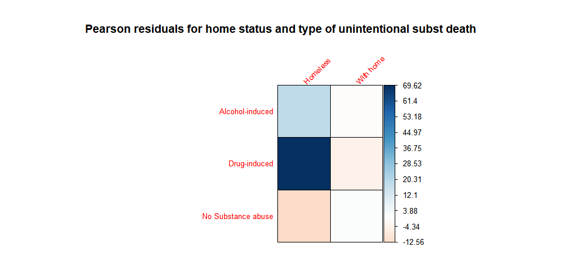
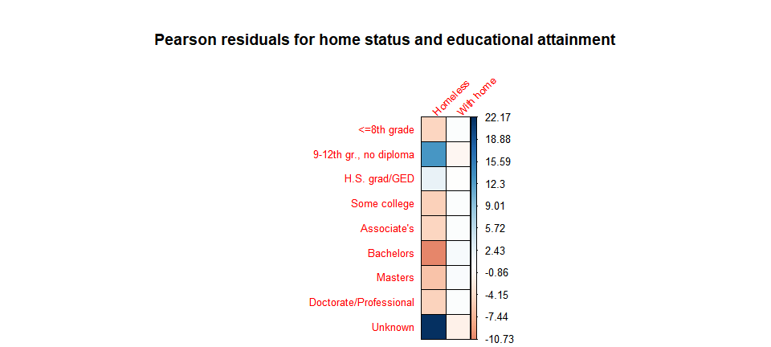

Classifying deaths in Washington State by homelessness status
================
Maya Bhat-Gregerson
Fall 2018

-   [I. Overview](#i.-overview)
-   [II. Data pre-processing](#ii.-data-pre-processing)
    -   [A. Overview](#a.-overview)
    -   [B. Washington State mortality data - pre-processing](#b.-washington-state-mortality-data---pre-processing)
    -   [C. King County Medical Examiner\`s Homeless Death Registry data - November 2003 to September 2017](#c.-king-county-medical-examiners-homeless-death-registry-data---november-2003-to-september-2017)
-   [III. EXPLORATORY DATA ANALYSIS](#iii.-exploratory-data-analysis)
    -   [A. Missing values](#a.-missing-values)
    -   [B. Distribution of key variables](#b.-distribution-of-key-variables)

I. Overview
-----------

The purpose of this project is to create a machine learning model that will classify deaths in Washington State according to the residential status of decedents at the time of death i.e. with permanent housing vs. homeless. Currently, there is no consistent and definitive way to identify homelessness among decedents (such as a checkbox on the death certificate). Understanding the differences in demographics (gender, race/ethnicity, agegroup etc.) and causes of death between decedents who were homeless and those who had permanent homes at the time of death will help validate qualitative data on these populations and provide direction for meeting the health needs of homeless individuals.

The data sets used for this project include Washington State final annual death files 2003-2017(including records for all deaths occurring within Washington State in a given calendar year) and the King County Medical Examiner Office\`s registry of deaths among homeless individuals who died in King County, Washington. This registry contains identification information and place of death for homeless individuals who died between 2003 through late 2017. However, the registry does not contain important features that will be necessary for exploratory data analysis and for machine learning. These additional features are available in the death certificate information for each of the decedents listed in the homeless death registry requiring a linkage of the registry and the death certificate data to have a complete data set.

II. Data pre-processing
-----------------------

### A. Overview

The following diagram provides an overview of the data pre-processing steps.

<!--html_preserve-->

<script type="application/json" data-for="htmlwidget-49bb32fdde3f0093854a">{"x":{"diagram":"\n        graph TD\n        A(WA DEATH DATA 2003-17)-->B(CLEAN )\n        B-->C(DERIVE VARIABLES)\n        C-->D(TEXT ANALYSIS ID frequent terms in COD*, address fields)\n        D-->E(SUBSET DEATHS OCCURRING IN KING CO.)\n        E-->F(SAMPLE SELECTION  random, n=1,200)\n        G(HOMELESS DEATH 2003-17)-->H(CLEAN )\n        H-->I(LINK HOMELESS & DEATH CERTS. add death cert. variables to homeless reg. data)\n        E-->I\n        I-->J(APPEND 'HOMELESS' & 'WITH HOME' including variable with homeless status of each record)\n        E-->J\n        J-->K{EDA}\n\nstyle A font-size: 50px\n        "},"evals":[],"jsHooks":[]}</script>
<!--/html_preserve-->
#### \_\_ 1. Data cleaning and standardization \_\_

This step includes:

    a.  Limiting Washington annual mortality data sets (WAMD) for 2003 through 2017 to attributes that are likely to be relevant to training the machine learning model. 

    b.  Standardizing attribute names and formats by renaming attributes and coercing data types in both WAMD and King County Homeless Death Registry (HDR) data. Due to changes in data collection practices for WAMD over the years, attribute names and formats are inconsistent.

    c.  Limiting records in WAMD to decedents who were Washington State residents who died in Washington State.

    d.  Deriving new features that group the records by agegroup, leading causes of death etc. to allow exploratory data analysis and comparison with the homeless death data.

#### \_\_ 2. Homeless decedents - linking homeless death data to their death certificates \_\_

This step will add the additional attributes from WAMD to each of the records in HDR so that they have the necessary attributes to train the model. In its raw form, HDR contains very limited information about the homeless individuals who died including their names, dates of birth, dates of death, and places (address) of death.

Due to the incomplete nature of HDR data the linkage will be performed in multiple iterations using different combinations of key variables to arrive at linked homeless-death certificate data sets that will then be merged. The key variables used are as follows: -iteration 1: last name, first name, date of birth -iteration 2 (starting with only unmatched records from iteration 1): social security number -iteration 3 (starting with only unmatched records from iteration 2): date of death and date of birth -iteration 4 (starting with only unmatched records from iteration 3): last name, first name, date of death

#### 3. Decedents with permanent homes - Creating a sample for machine learning model

This subset will be limited to approximately 1,200 randomly selected records from the 2016 WAMD data file for decedents who had permanent homes at the time of death (as indicated by the facility type and place of death variables). Only decedents who died in King County will be included to match the residence of the homeless decedents.

### B. Washington State mortality data - pre-processing

Washington State requires by law that all deaths occurring in the state must be registered with the Washington State Department of Health. This means we have almost 100% reporting of deaths occurring in the state (with the exception of occasional missing persons).

The size of each annual file has increased over the years, both in terms of number of records and in terms of attributes. Attribute names and data types have not been consistent over the years. By 2017 Washington State's death data set included over 58,000 unique observations (death certificate records) and over 250 attributes. Most of the attributes are not relevant to train the machine learning model for this project.

This section addresses cleaning and limiting the data sets (in terms of number of attributes).

#### 1. **Cleaning and standardizing WAMD annual data 2003-2017**

Read death certificate data in three groups as one combined dataset slowed R down too much. I created the three datasets using a SQL query in our vital statistics database and restricted the results to the desired features in the SQL query including:

last name, first name, middle name, social security number, death certificate number, date of death, date of birth, sex,type of death certifier (physician, Medical examiner, coroner etc), manner of death, cause of death (ICD 10 codes), residence street address, residence city, residence zipcode, residence state, residence county, death county, death zipcode, death state, type of place where death occurred (hospital, home, hospice etc), educational attainment, marital status, race, ethnicity, occupation code.

``` r
wa0307 <- fread("Data/WA2003_07.csv")
wa0812 <- fread("Data/WA2008_12.csv")
wa1317 <- fread("Data/WA2013_17.csv")

WA0317 <- rbind(wa0307, wa0812, wa1317)

WA0317 <-subset(WA0317, dstateFIPS=="WA")
```

I coerced specific features into factors and dates as they were read in as character strings by R. To prepare for record linkage later I standardized the last and first name fields by removing leading, trailing, and mid-name white spaces, removed all hyphenations. I also removed hyphens from the social security number charcter string. I left social security number as a string to avoid losing leading zeroes.

``` r
## COERCE VARIABLES TO DATES

WA0317$dob <- as.Date(WA0317$dob, "%m/%d/%Y")
WA0317$dod <- as.Date(WA0317$dod, "%m/%d/%Y")

## REMOVE WHITESPACE, PUNCTUATION, AND SUFFIXES FROM NAMES AND HYPHENS FROM SSN

WA0317$lname <- str_replace_all(WA0317$lname, pattern = " ", replacement = "")
WA0317$lname <- str_replace_all(WA0317$lname, pattern = "-", replacement = "")
##WA0317$lname <- str_replace_all(WA0317$lname, pattern = ",JR.", replacement = "")
#WA0317$lname <- str_replace_all(WA0317$lname, pattern = "JR.", replacement = "")
#WA0317$lname <- str_replace_all(WA0317$lname, pattern = ",SR.", replacement = "")
#WA0317$lname <- str_replace_all(WA0317$lname, pattern = "SR.", replacement = "")
#WA0317$lname <- str_replace_all(WA0317$lname, pattern = ",II]", replacement = "")


WA0317$fname <- str_replace_all(WA0317$fname, pattern = " ", replacement = "")
WA0317$fname <- str_replace_all(WA0317$fname, pattern = "-", replacement = "")

WA0317$ssn <- str_replace_all(WA0317$ssn, pattern= "-", replacement = "")

WA0317$UCOD <- ifelse((nchar(WA0317$UCOD)) < 4, paste(WA0317$UCOD, "0", sep = ""), WA0317$UCOD)
WA0317$UCOD <- str_replace_all(string = WA0317$UCOD, pattern = " ", replacement = "")

## COERCE VARIABLES TO FACTOR
facvars_wa <- c("dcounty", "dzip", "dcity", "attclass", "brgrace", "hispanic", "sex","manner", "rcounty", "rcity", "rstreet","rstateFIPS", "rzip", "dstateFIPS", "dplacelit", "dplacecode", "sex", "dthyr", "marital", "UCOD",  "educ", "MCOD", "occup", "military")

WA0317 %<>% mutate_at(facvars_wa, funs(factor(.)))
summary(WA0317$manner)
```

    ##      A      C      H      N   NULL      P      S 
    ##  42454   2824   3602 682226     97     58  14674

#### 2. \_\_Deriving new features in preparation for exploratory data analysis

I created a few derived variables including calculated age (at time of death), 5-category age group, leading causes of death categories (by grouping codes in the "UCOD" feature which contains International Classification of Disease, 10th edition, codes indicating the underlying cause of death), race/ethnicity (applying U.S. Office of Management and Budget and Washington State Department of Health guidelines), resident status (Washington state vs. out of state resident), unintentional injury cause of death groups, and substance abuse related cause of death groups.

These added features will useful in conducting exploratory data analysis including comparing the characteristics of homeless decedents with those of decedents who had a permanent home at death.

``` r
## CALCULATED AGE AT DEATH

WA0317$age <- round(((WA0317$dod-WA0317$dob)/365), digits = 0)

attach(WA0317)

# AGE CATEGORIES

WA0317$age5cat[age<18] <- "<18yrs"
WA0317$age5cat[age>=18 & age<=29] <-"18-29yrs"
WA0317$age5cat[age>=30 & age<=44] <- "30-44yrs"
WA0317$age5cat[age>=45 & age<=64] <-"45-64yrs"
WA0317$age5cat[age>=65] <- "65+ yrs"

#LEADING CAUSES OF DEATH (per National Center for Health Statistics)

WA0317$LCOD <- "Other"

##MALIGNANT NEOPLASMS - C00-C97
MalignantNeoplasms <- "C[0-9][0-7][0-9]?"
WA0317$LCOD[grepl(MalignantNeoplasms, WA0317$UCOD)]<- "Cancer"

##DISEASES OF THE HEART - I00-I09,I11,I13,I20-I51
HeartDisease <- "I0[0-9][0-9]?|I11[0-9]?|I13[0-9]?|I[2-4][0-9][0-9]?|I50[0-9]?|I51[0-9]?"
WA0317$LCOD[grepl(HeartDisease, WA0317$UCOD)]<- "Heart Dis."

##ALZHEIMER'S DISEASE - G30
Alzheimers <- "G30[0-9]?"
WA0317$LCOD[grepl("G30", WA0317$UCOD)]<- "Alzheimers"

##ACCIDENTS - V01-X59,Y85-Y86
unintentionalinjury <- "V[0-9][0-9][0-9]?|W[0-9][0-9][0-9]?|X[0-5][0-9][0-9]?|Y8[5-6][0-9]?"
WA0317$LCOD[grepl(unintentionalinjury, WA0317$UCOD)]<- "Injury-unint."

##CHRONIC LOWER RESPIRATORY DISEASE - J40-J47
CLRD <- "J4[0-7][0-9]?"
WA0317$LCOD[grepl(CLRD, WA0317$UCOD)]<- "Chronic Lwr Resp Dis."

##CEREBROVASCULAR DISEASE - I60-69
CVD <- "I6[0-9][0-9]?"
WA0317$LCOD[grepl(CVD, WA0317$UCOD)]<- "Stroke"

##DIABETES MELLITUS - E10-E14
diabetes <- "E1[0-4][0-9]?"
WA0317$LCOD[grepl(diabetes, WA0317$UCOD)]<- "Diabetes"

#SUICIDE
allsuicides <- "U03[0-9]?|X[6-7][0-9][0-9]?|X8[0-4][0-9?]|Y870"
WA0317$LCOD[grepl(allsuicides, WA0317$UCOD)]<- "Suicide-all"

##CHRONIC LIVER DISEASE AND CIRRHOSIS - K70,K73-K74
liver <- "K70[0-9]?|K7[3-4][0-9]?"
WA0317$LCOD[grepl(liver, WA0317$UCOD)]<- "Chronic Liver dis./cirrh."

##INFLUENZA AND PNEUMONIA - J09-J18
flu <- "J09[0-9]?|J1[0-8][0-9]?"
WA0317$LCOD[grepl(flu, WA0317$UCOD)]<- "Flu"

# UNINTENTIONAL INJURIES - SELECT SUBCATEGORIES OF:  V01-X59,Y85-Y86

WA0317$injury <- "No injury"

##ACCIDENTS - V01-X59,Y85-Y86
unintinj <- "V[0-9][0-9][0-9]?|W[0-9][0-9][0-9]?|X[0-5][0-9][0-9]?|Y8[5-6][0-9]?"
WA0317$LCOD[grepl(unintinj, WA0317$UCOD)]<- "Other unint.injury"

#Unintentional Poisoning - X40-49
poisoninjury <- "^X4[0-9][0-9]?"
WA0317$injury[grepl(poisoninjury, WA0317$UCOD)] <- "Unintentional poisoning"

# Unintentional Firearm - W32-34
guninjury <- "W3[2-4][0-9]?"
WA0317$injury[grepl(guninjury, WA0317$UCOD)] <- "Unintentional firearm"

# Motor vehicle - pedestrian - (V02–V04[.1,.9],V09.2)
mvped <- "V0[2-3][0-9]?|V041|V049|V092"
WA0317$injury[grepl(mvped, WA0317$UCOD)] <- "MV crash-pedestrian"

# Unintentional Fall (W00–W19)
fall <- "W0[0-9][0-9]|W1[0-9][0-9]"
WA0317$injury[grepl(fall, WA0317$UCOD)] <- "Unintentional fall"

##WA0317$injury[grepl(unintentionalinjury,WA0317$UCOD) & !grepl(fall,WA0317$UCOD) & !grepl(guninjury,WA0317$UCOD) & !grepl(poisoninjury,WA0317$UCOD) & !grepl(mvped, WA0317$UCOD)] <- "Other injury"

WA0317$injury <- as.factor(WA0317$injury)

#SUBSTANCE ABUSE
WA0317$substance <- "No Substance abuse"

#Alcohol-induced per NCHS - https://www.cdc.gov/nchs/data/nvsr/nvsr66/nvsr66_06.pdf
#excludes unintentional injuries, homicides, other causes indirectly related to alcohol use, newborn deaths due to maternal alcohol use

alcohol <- "E244|F10[0-9]?|G312|G621|G721|I426|K292|K70[0-9]?|K852|K860|R780|X45[0-9]?|X65[0-9]?|Y15[0-9]?"
WA0317$substance[grepl(alcohol, WA0317$UCOD)] <- "Alcohol-induced"


#Drug-induced per NCHS - https://www.cdc.gov/nchs/data/nvsr/nvsr66/nvsr66_06.pdf 
#Excludes unintentional injuries, homicides, other causes indirectly related to alcohol use, newborn deaths due to maternal drug use

drug <- "D521|D590|D592|D611|D642|E064|E160|E231|E242|E273|E661|F11[1–5]|F11[7–9]|F12[1-5]|F12[7–9]|F13[1–5]|F13[7-9]|F14[1–5]|F14[7–9]|F15[1–5]|F15[7–9]|F16[1–5]|F16[7–9]|F17[3–5]|F17[7–9]|F18[1–5]|F18[7–9]|F19[1–5]|F19[7–9]|G211|G240|G251|G254|G256|G444|G620|G720|I952|J702|J703|J704|K853|L105|L270|L271|M102|M320|M804|M814|M835|M871|R502|R781|R782|R783|R784|R785|X4[0-4][0-9]|X6[0–4][0-9]|X85|Y1[0–4][0-9]"

WA0317$substance[grepl(drug, WA0317$UCOD)] <- "Drug-induced"

# DRUG OD
#drugod <- "X4[0-4][0-9]?|X6[0-4][0-9]?|X85[0-9]?|Y1[0-4][0-9]?" #drug overdose - searching for any drug in UCOD only
#WA0317$substance[grepl(drugod, WA0317$UCOD)] <-"Drug OD"

WA0317$substance <- as.factor(WA0317$substance)

## RESIDENCE

WA0317$residence[rstateFIPS != "WA" & rstateFIPS !="ZZ"] <- "Out of state"
WA0317$residence[rstateFIPS == "WA"] <- "WA resident"

## RACE AND ETHNICITY
## remember that the original ethnicity variable was named "HISPNICNO" i.e. a "yes" means they are NOT hispanic

##5 groups with Hispanic as race
WA0317$raceethnic5 <- "Other"
WA0317$raceethnic5[brgrace %in% c("01", "1") & hispanic=="Y"] <- "White NH"
WA0317$raceethnic5[brgrace %in% c("02","2") & hispanic=="Y"] <- "Black NH"
WA0317$raceethnic5[brgrace %in% c("03","3") & hispanic=="Y"] <- "AIAN NH"
WA0317$raceethnic5[brgrace %in% c("04","4","05","5","06","6","07","7","08","8","09","9","10","11","12","13","14","15") & hispanic=="Y"] <- "Asian/PI NH"
WA0317$raceethnic5[hispanic=="N"] <- "Hispanic"
WA0317$raceethnic5[is.na(brgrace)] <- "Unknown"

WA0317$raceethnic5 <- as.factor(WA0317$raceethnic5)

## 6 groups with Hispanic as race and separating Asians and NHOPI
WA0317$raceethnic6 <- "Other"
WA0317$raceethnic6[brgrace %in% c("01", "1") & hispanic=="Y"] <- "White NH"
WA0317$raceethnic6[brgrace %in% c("02","2") & hispanic=="Y"] <- "Black NH"
WA0317$raceethnic6[brgrace %in% c("03","3") & hispanic=="Y"] <- "AIAN NH"
WA0317$raceethnic6[brgrace %in% c("04","4","05","5","06","6","07","7","08","8","09","9","10") & hispanic=="Y"] <- "Asian"
WA0317$raceethnic6[brgrace %in% c("11","12","13","14","15") & hispanic=="Y"] <- "NHOPI"
WA0317$raceethnic6[hispanic=="N"] <- "Hispanic"
WA0317$raceethnic6[is.na(brgrace)] <- "Unknown"

WA0317$raceethnic6 <- as.factor(WA0317$raceethnic6)


WA0317 %<>% mutate_at(c("age5cat", "residence", "LCOD", "injury", "substance", "raceethnic5", "raceethnic6"), funs(factor(.)))

## Labeling manner of death

WA0317$manner <- factor(WA0317$manner,
                        levels = c("A", "C", "H", "N", "NULL", "P", "S"),
                        labels = c("Accident", "Undetermined", "Homicide", "Natural", "Unk.","Pending", "Suicide"))

##Labeling educational attainment

WA0317$educ <- factor(WA0317$educ,
                        levels = c("1", "2", "3", "4", "5", "6", "7", "8", "9"),
                        labels = c("<=8th grade", "9-12th gr., no diploma", "H.S. grad/GED", "Some college", "Associate's","Bachelors", "Masters", "Doctorate/Professional", "Unknown"))

detach(WA0317)

head(WA0317)
```

    ##       certno        dob        dod    lname    fname   mname sex       ssn
    ## 1 2003002743 1928-06-04 2003-01-01     LOVE  CHESTER   JAMES   M 539260170
    ## 2 2003003284 1910-05-30 2003-01-01  CARLSON    HELEN FRANCES   F 536441312
    ## 3 2003000755 1908-08-22 2003-01-01 MCDONALD MARGARET   MARIE   F 167073319
    ## 4 2003003071 1925-05-26 2003-01-01 LINDBERG  LUCILLE    RUTH   F 531240169
    ## 5 2003002215 1923-07-03 2003-01-01   BAGLEY MARCELLA   MARIE   F 534240660
    ## 6 2003000770 1927-03-21 2003-01-01       VO     NGOC     THI   F 457578487
    ##   attclass brgrace hispanic  manner   rcounty      rcity
    ## 1        1    NULL        N Natural SNOHOMISH    EVERETT
    ## 2        1    NULL        N Natural  THURSTON   TUMWATER
    ## 3        1    NULL        N Natural      KING    SEATTLE
    ## 4        1    NULL        N Natural   SPOKANE    SPOKANE
    ## 5        1    NULL        N Natural    PIERCE GIG HARBOR
    ## 6        1    NULL        N Natural      KING       KENT
    ##                    rstreet resmatchcode rstateFIPS  rzip dstreet
    ## 1  1915 HEWITT AVE APT 209          100         WA 98201    NULL
    ## 2       1400 TROSPER RD SW          100         WA 98512    NULL
    ## 3         7304 44TH AVE NE          100         WA 98115    NULL
    ## 4          1816 E 13TH AVE          100         WA 99202    NULL
    ## 5      8807 DANFORTH ST NW          100         WA 98329    NULL
    ## 6 24510 64TH AVE S APT 133          100         WA 98032    NULL
    ##        dcity dzip   dcounty dstateFIPS                   dplacelit
    ## 1  SNOHOMISH NULL SNOHOMISH         WA Nursing home/long term care
    ## 2   TUMWATER NULL  THURSTON         WA Nursing home/long term care
    ## 3    SEATTLE NULL      KING         WA        Hospital (inpatient)
    ## 4    SPOKANE NULL   SPOKANE         WA                        Home
    ## 5 GIG HARBOR NULL    PIERCE         WA Nursing home/long term care
    ## 6     RENTON NULL      KING         WA        Hospital (inpatient)
    ##   dplacecode dthyr UCOD                     MCOD                   educ
    ## 1          5  2003 G200                      G20                Unknown
    ## 2          5  2003 G309                     G309                Unknown
    ## 3          4  2003 C349 C349 C782 C795 J969 Q211 Doctorate/Professional
    ## 4          0  2003 I640                 C349 I64                Unknown
    ## 5          5  2003 E149           E149 I251 N189                Unknown
    ## 6          4  2003 I613  I10 I613 I959 J960 K729                Unknown
    ##   marital occup military
    ## 1       M   425        N
    ## 2       W   908        N
    ## 3       W   908        N
    ## 4       D   363        N
    ## 5       W   875        N
    ## 6       W   908        N
    ##                                                                                                             codlit
    ## 1                                                                                           PARKINSONS DISEASE    
    ## 2                                                                                           ALZHEIMERS DISEASE    
    ## 3 RESPIRATORY FAILURE METASTATIC SMALL CELL CA TO BONE, LUNG, PLEURA PRIMARY LUNG  ATRIAL SEPTAL DEFECT WITH SHUNT
    ## 4                                                                           STROKE WITH UNDERLYING LUNG CANCER    
    ## 5                                                                                   CHRONIC RENAL FAILURE DM   CAD
    ## 6                                                           HYPOTENSION PONTINE HEMORRHAGE HTN  ARF, LIVER FAILURE
    ##       age age5cat       LCOD    injury          substance   residence
    ## 1 75 days 65+ yrs      Other No injury No Substance abuse WA resident
    ## 2 93 days 65+ yrs Alzheimers No injury No Substance abuse WA resident
    ## 3 94 days 65+ yrs     Cancer No injury No Substance abuse WA resident
    ## 4 78 days 65+ yrs     Stroke No injury No Substance abuse WA resident
    ## 5 80 days 65+ yrs   Diabetes No injury No Substance abuse WA resident
    ## 6 76 days 65+ yrs     Stroke No injury No Substance abuse WA resident
    ##   raceethnic5 raceethnic6
    ## 1    Hispanic    Hispanic
    ## 2    Hispanic    Hispanic
    ## 3    Hispanic    Hispanic
    ## 4    Hispanic    Hispanic
    ## 5    Hispanic    Hispanic
    ## 6    Hispanic    Hispanic

``` r
summary(WA0317$substance)
```

    ##    Alcohol-induced       Drug-induced No Substance abuse 
    ##              13004              14427             718504

#### 3. **Creating a training data set of decedents who had permanent homes at time of death**

I started by creating a subset of the Washington State data set that included only King County resident deaths where the decedent had a permanent home. The death data set contains a feature called "Place of Death Type", a factor with the following levels: 0 = Home 1 = Other Place 2 = In Transport 3 = Emergency Room 4 = Hospital (Inpatient) 5 = Nursing Home/Long Term Care 6 = Hospital 7 = Hospice Facility 8 = Other Person's Residence 9 = Unknown

I defined "permanent home" as decedents whose death certificates indicate that they died at a hospice, a nursing home/longterm care facility, or at their own home Additionally, I restricted the records to those where the address of the place of death could be verified through a geocoding process with 95% or greater accuracy. This criterion will exclude persons with incomplete or missing death addresses e.g. those who died on a street corner where the death certificate might list the death address as "Main street and King Blvd".

Another restriction on the sampling frame was that all decedents had to be King County deaths (i.e. deaths that occurred in King count regardless of place of residence) so that they matched the homeless decedents in this respect.

I added the suffix ".k" to the column names to identify easily the source data set for these features. This will be helpful in the next step when I merge homeless registry data with their corresponding death records.

From this set of King County deaths among persons with permanent homes I selected a random sample of 1,200 records to match the size of the homeless death record data set.

``` r
KC0317<- subset(WA0317, dcounty=="KING")

KC <- KC0317

colnames(KC)<-c("certno.k", "dob.k", "dod.k", "lname.k", "fname.k", "mname.k", "sex.k","ssn.k", "attclass.k", "brgrace.k", "hispanic.k", "manner.k",  "rcounty.k", "rcity.k",  "rstreet.k","resmatchcode.k","rstateFIPS.k", "rzip.k",  "dstreet.k", "dcity.k", "dzip.k", "dcounty.k","dstateFIPS.k",  "dplacelit.k","dplacecode.k", "dthyr.k", "UCOD.k", "MCOD.k", "educ.k", "marital.k", "occup.k", "military.k","codlit.k","age.k", "age5cat.k", "LCOD.k", "injury.k", "substance.k", "residence.k", "raceethnic5.k", "raceethnic6.k")

KC0317_wh <- subset(KC, (KC$dplacecode.k==0 | KC$dplacecode.k==5 | KC$dplacecode.k==7) & KC$resmatchcode.k >= 95)


##RANDOMLY SELECT 1,200 persons from permhome

set.seed(1)
sample <- sample(1:nrow(KC0317_wh), 1200)
KC0317whsample <- KC0317_wh[sample, ]

head(KC0317whsample)
```

    ##          certno.k      dob.k      dod.k   lname.k fname.k   mname.k sex.k
    ## 574919 2017021394 1947-03-25 2017-05-07       DAY    RORY    STEVEN     M
    ## 601167 2017026700 1929-09-10 2017-06-13       LIU SHUHWEN      NULL     M
    ## 649011 2017037182 1934-03-01 2017-08-21   NYQUIST  DONALD    IRVING     M
    ## 725340 2017052644 1931-01-06 2017-12-05 TOLLEFSON  LOUISE ELIZABETH     F
    ## 556027 2017017664 1920-06-10 2017-04-11      HUFF  VIVIAN       MAE     F
    ## 722968 2017052972 1939-08-01 2017-12-02   KORESKI CHARLES    ARTHUR     M
    ##            ssn.k attclass.k brgrace.k hispanic.k manner.k rcounty.k
    ## 574919 531440792          1        01          Y  Natural      KING
    ## 601167 534824636          1        05          Y  Natural      KING
    ## 649011 516369255          1        01          Y  Natural      KING
    ## 725340 534320933          1        01          Y  Natural      KING
    ## 556027 574105788          1        01          Y  Natural      KING
    ## 722968 537344709          2        01          Y  Natural      KING
    ##            rcity.k              rstreet.k resmatchcode.k rstateFIPS.k
    ## 574919    BELLEVUE      1836 155TH AVE SE           NULL           WA
    ## 601167      RENTON   64 MONTEREY PLACE NE           NULL           WA
    ## 649011 WOODINVILLE      12915 NE 146TH PL           NULL           WA
    ## 725340     SEATTLE 5311 PHINNEY AVENUE N.           NULL           WA
    ## 556027 WOODINVILLE   23310 NE 152ND PLACE           NULL           WA
    ## 722968    KIRKLAND   12234 NE 73RD STREET           NULL           WA
    ##            rzip.k                              dstreet.k     dcity.k
    ## 574919      98007                      1836 155TH AVE SE    BELLEVUE
    ## 601167      98056                   64 MONTEREY PLACE NE      RENTON
    ## 649011 98072-4632            LAWRENCE AND MICHELLE'S AFH WOODINVILLE
    ## 725340      98103          RICHMOND BEACH REHABILITATION   SHORELINE
    ## 556027      98077                   23310 NE 152ND PLACE WOODINVILLE
    ## 722968      98033 EVERGREEN HOSPICE, 12822 124TH LANE NE    KIRKLAND
    ##        dzip.k dcounty.k dstateFIPS.k                          dplacelit.k
    ## 574919  98007      KING           WA                      DECEDENT'S HOME
    ## 601167  98056      KING           WA                      DECEDENT'S HOME
    ## 649011  98072      KING           WA NURSING HOME/LONG TERM CARE FACILITY
    ## 725340  98177      KING           WA NURSING HOME/LONG TERM CARE FACILITY
    ## 556027  98077      KING           WA                      DECEDENT'S HOME
    ## 722968  98034      KING           WA                     HOSPICE FACILITY
    ##        dplacecode.k dthyr.k UCOD.k MCOD.k        educ.k marital.k occup.k
    ## 574919            0    2017   C189   NULL  Some college         M     177
    ## 601167            0    2017   C189   NULL     Bachelors         M     890
    ## 649011            5    2017   G200   NULL     Bachelors         M     393
    ## 725340            5    2017   I100   NULL  Some college         D     370
    ## 556027            0    2017   G309   NULL H.S. grad/GED         W     908
    ## 722968            7    2017   M628   NULL     Bachelors         M     393
    ##        military.k
    ## 574919          N
    ## 601167          N
    ## 649011          Y
    ## 725340          Y
    ## 556027          N
    ## 722968          N
    ##                                                                                                                                           codlit.k
    ## 574919                                                                                                                 METASTATIC COLON CANCER    
    ## 601167                                                                                                                            COLON CANCER    
    ## 649011                                                                       RESPIRATORY ARREST PARKINSON'S DISEASE   PARKINSON'S DISEASE DEMENTIA
    ## 725340                                        CARDIORESPIRATORY FAILURE SECONDARY TO HYPERTENSION CONGESTIVE HEART FAILURE ATRIAL FIBRILLATION    
    ## 556027                                                              INANITION ALZHEIMER'S DEMENTIA   CHRONIC ASPIRATION, GASTROINTESTINAL BLEEDING
    ## 722968 RHABDOMYOLYSIS PROLONGED IMMOBILITY AFTER NONTRAUMATIC COLLAPSE MYELOFIBROSIS AND GENERAL DEBILITY  DEMENTIA; HISTORY OF CHRONIC ALCOHOLISM
    ##          age.k age5cat.k     LCOD.k  injury.k        substance.k
    ## 574919 70 days   65+ yrs      Other No injury No Substance abuse
    ## 601167 88 days   65+ yrs      Other No injury No Substance abuse
    ## 649011 84 days   65+ yrs      Other No injury No Substance abuse
    ## 725340 87 days   65+ yrs      Other No injury No Substance abuse
    ## 556027 97 days   65+ yrs Alzheimers No injury No Substance abuse
    ## 722968 78 days   65+ yrs      Other No injury No Substance abuse
    ##        residence.k raceethnic5.k raceethnic6.k
    ## 574919 WA resident      White NH      White NH
    ## 601167 WA resident   Asian/PI NH         Asian
    ## 649011 WA resident      White NH      White NH
    ## 725340 WA resident      White NH      White NH
    ## 556027 WA resident      White NH      White NH
    ## 722968 WA resident      White NH      White NH

### C. King County Medical Examiner\`s Homeless Death Registry data - November 2003 to September 2017

This data set includes all deaths to homeless or transient individuals who died in King County, Washington State and for whom the death certifier (the person who submitted a death certificate to Washington State Department of Health) was the medical examiner for King County.

The King County Medical Examiner`s Office (KCMEO) established a given decedent`s homeless or transient status by gathering information from family members, acquaintances, social service agencies, and law enforcement (where available). In some situations, the medical examiner (ME) established homelessness based on his own assessment of the situation rather than what the family reported because the stigma associated with homelessness may have resulted in inaccurate reporting.

KCMEO defines `homelessness` based on the Chief Medical Examiner\`s criteria rather than standard federal Department of Housing and Urban Development (HUD) or Department of Social and Health Services (DSHS) criteria.

#### 1. **Cleaning KCMEO homeless registry**

I followed similar cleaning steps as with the Washington State annual death data sets including: - renaming variables, - coercing variables to specific data types (factors, dates, numeric), - cleaning the values in the first and last name fields by removing white spaces, punctuation marks, suffixes like "Jr.", "Sr.", "II" etc., - and making all values uppercase to match death certificate data.

Finally, I added the suffix ".h" to the variables in the homeless data set to identify easily the source of the features.

``` r
# Reading in and pre-processing homeless death registry data including cleaning and standardizing attribute names and data types

homeless <- read_csv("Data/HomelessRegistryKingCo.csv")


homeless <- rename(homeless, 
         lname = namelast,
         fname = namefirst,
         mname = namemiddle,
         dob = birthdate,
         dod = eventdate, 
         ssn = ssn,
         dzip = deathzip,
         married = maritalstatus,
         placeofdeath = deathplace)


# CHANGE VALUES TO UPPER CASE
homeless<- mutate_all(homeless, funs(toupper))


##THE FOLLOWING CHANGES TO THE TWO DATE FIELDS (DATE OF BIRTH AND DATE OF DEATH) HAVE BEEN IMPLEMENTED TO MAKE
## THEM CONSISTENT WITH THE FORMAT IN THE DEATH CERTIFICATE DATA SET.  

#REMOVE HYPHENS IN DATES OF BIRTH AND DEATH TO MAKE THEM CONSISTENT WITH DEATH DATA
#DATES ARE IN DDMMMYY FORMAT TO BEGIN WITH.
homeless$dob <- gsub("-", "", homeless$dob)
homeless$dod <- gsub("-", "", homeless$dod)

#PASTE LEADING 0 TO DAY WHEN DAY IS 1 TO 9 TO MAKE THEM ALL 2 DIGIT DAYS
homeless$dob <- ifelse((nchar(homeless$dob)) < 7, paste("0",homeless$dob, sep = ""), homeless$dob)
homeless$dod <- ifelse((nchar(homeless$dod)) < 7, paste("0",homeless$dod, sep = ""), homeless$dod)

homeless$dob <- as.Date(homeless$dob, "%d%b%y")

#The following command assures that 2 digit years in the date of birth field don't have "20" added as the prefix when it should be "19"
homeless$dob <-as.Date(ifelse((homeless$dob > "2019-01-01" | homeless$age > 16), format(homeless$dob, "19%y-%m-%d"), format(homeless$dob)))

#standardize date format
homeless$dob <- ymd(homeless$dob)
homeless$dod <- dmy(homeless$dod)

#change attributes to factor

homeless %<>% mutate_at(c("rescity", "married", "placeofdeath", "deathcity", "dzip","eventcity"), funs(factor(.)))

#limit and reorder attributes and add '.h' as suffix to clarify dataset to which these attributes belong.
homeless <- select(homeless, -casenum)
homeless <- select(homeless, ssn, lname, fname, mname, dob, dod, age, everything())
h.varnames <-c(colnames(homeless))
h.varnames <- paste(h.varnames, "h", sep = ".")
colnames(homeless)=h.varnames

#remove white spaces, hyphens, and various suffixes like "Jr", "Sr" etc. from name fields
homeless$lname.h <- str_replace_all(string = homeless$lname.h, pattern = " ", replacement = "")
homeless$lname.h <- str_replace_all(string = homeless$lname.h, pattern = "-", replacement = "")
homeless$lname.h <- str_replace_all(string = homeless$lname.h, pattern = ",JR.", replacement = "")
homeless$lname.h <- str_replace_all(string = homeless$lname.h, pattern = "JR.", replacement = "")

homeless$lname.h <- str_replace_all(string = homeless$lname.h, pattern = ",SR.", replacement = "")
homeless$lname.h <- str_replace_all(string = homeless$lname.h, pattern = "SR.", replacement = "")

homeless$lname.h <- str_replace_all(string = homeless$lname.h, pattern = ",II", replacement = "")
homeless$lname.h <- str_replace_all(string = homeless$lname.h, pattern = "II", replacement = "")
homeless$fname.h <- str_replace_all(string = homeless$fname.h, pattern = " ", replacement = "")

homeless$fname.h <- str_replace_all(string = homeless$fname.h, pattern = " ", replacement = "")
homeless$fname.h <- str_replace_all(string = homeless$fname.h, pattern = "-", replacement = "")

head(homeless)
```

    ## # A tibble: 6 x 16
    ##   ssn.h lname.h fname.h mname.h dob.h      dod.h      age.h resaddr.h
    ##   <chr> <chr>   <chr>   <chr>   <date>     <date>     <chr> <chr>    
    ## 1 5185~ POMME   FRANCIS XAVIER  1951-01-04 NA         51    NO PERMA~
    ## 2 3606~ PATTON  FRANKL~ DELANO  1961-07-21 2003-11-01 42    NO PERMA~
    ## 3 5438~ MANSFI~ JOHN    PATRICK 1962-04-17 2003-12-21 41    NO PERMA~
    ## 4 5376~ SPARKS  MARLOWE RADCLI~ 1959-05-19 2003-12-29 44    NO PERMA~
    ## 5 5438~ HATFIE~ JOSHUA  MICHAEL 1973-12-26 2003-12-30 30    NO PERMA~
    ## 6 <NA>  BRYANT  RYAN    MICHAEL 1980-09-17 2004-01-01 23    POSSIBLE~
    ## # ... with 8 more variables: rescity.h <fct>, married.h <fct>,
    ## #   placeofdeath.h <fct>, deathaddr.h <chr>, deathcity.h <fct>,
    ## #   dzip.h <fct>, eventaddr.h <chr>, eventcity.h <fct>

``` r
miss_var_summary(homeless)
```

    ## # A tibble: 16 x 3
    ##    variable       n_miss pct_miss
    ##    <chr>           <int>    <dbl>
    ##  1 rescity.h         613   54.2  
    ##  2 ssn.h             286   25.3  
    ##  3 married.h         155   13.7  
    ##  4 mname.h           137   12.1  
    ##  5 placeofdeath.h     94    8.31 
    ##  6 dod.h              63    5.57 
    ##  7 resaddr.h          63    5.57 
    ##  8 eventaddr.h        38    3.36 
    ##  9 eventcity.h        35    3.09 
    ## 10 dzip.h              6    0.531
    ## 11 fname.h             3    0.265
    ## 12 dob.h               3    0.265
    ## 13 deathaddr.h         2    0.177
    ## 14 deathcity.h         2    0.177
    ## 15 lname.h             0    0    
    ## 16 age.h               0    0

#### 2. **Linking HDR with WAMD**

The HDR contains name, date of birth, date of death, place of death (address), and social security number. There is no additional information on cause of death, or other attributes that might be used in machine learning to classify persons as homeless or with a permanent home. For this reason, the HDR data must first be linked to full death certificate data to add the relevant attributes that can be found in the death certificate.

KCMEO is required by law to submit a death certificate for all deaths it investigates. For this reason, it is very likely that the decedents' last names, first names, and locations of death will be recorded in an identical manner in HDR as well as the death certificates (barring data entry error).

In this situation it is possible to use deterministic linkage to link HDR records with their complete death certificates. Using a derived attribute created by concatenating attributes in the HDR data set with low missing data ("namelast", "deathcity", "deathaddress", and "birthdate") and matching it with the same derived variable in the death data set should result in an accurate match and record linkage.

Pre-processing of the HDR and death data sets includes standardizing the values in the attributes to be used in the linkage, and creating the derived variable (concatenation of the above variables) in both data sets. The following steps use multiple combinations of key variables to link the homeless death registry records with their corresponding death certificates. The linking variables were selected based on the proportion that were missing values. Variables with low proportions of missing values were selected to complete the linkage.

``` r
# 'homeless' data set contains all homeless decedents who died in King County between late 2003 and late 2017.
# 'KC' data set contains all persons who died in King County between 2003 and 2017 (inclusive) at the time of death and includes all place of death types.

## left join homeless data with King County death certificate data
## joining variables are last name, first name and date of birth of homeless decedents as these attributes have the least missing values.
miss_var_summary(homeless)
```

    ## # A tibble: 16 x 3
    ##    variable       n_miss pct_miss
    ##    <chr>           <int>    <dbl>
    ##  1 rescity.h         613   54.2  
    ##  2 ssn.h             286   25.3  
    ##  3 married.h         155   13.7  
    ##  4 mname.h           137   12.1  
    ##  5 placeofdeath.h     94    8.31 
    ##  6 dod.h              63    5.57 
    ##  7 resaddr.h          63    5.57 
    ##  8 eventaddr.h        38    3.36 
    ##  9 eventcity.h        35    3.09 
    ## 10 dzip.h              6    0.531
    ## 11 fname.h             3    0.265
    ## 12 dob.h               3    0.265
    ## 13 deathaddr.h         2    0.177
    ## 14 deathcity.h         2    0.177
    ## 15 lname.h             0    0    
    ## 16 age.h               0    0

``` r
homelessa <- merge(homeless, KC, by.x = c("lname.h", "fname.h", "dob.h"), by.y = c("lname.k", "fname.k", "dob.k"), all.x=TRUE)

#Remove duplicates
homelessa <- distinct(homelessa, lname.h, dob.h, .keep_all = TRUE)
miss_var_summary(homelessa)
```

    ## # A tibble: 54 x 3
    ##    variable    n_miss pct_miss
    ##    <chr>        <int>    <dbl>
    ##  1 rescity.h      613     54.2
    ##  2 ssn.h          286     25.3
    ##  3 residence.k    260     23.0
    ##  4 married.h      155     13.7
    ##  5 mname.h        136     12.0
    ##  6 certno.k       122     10.8
    ##  7 dod.k          122     10.8
    ##  8 mname.k        122     10.8
    ##  9 sex.k          122     10.8
    ## 10 ssn.k          122     10.8
    ## # ... with 44 more rows

``` r
# This first pass resulted in 1,008 homeless records being linked to their respective death certificate information.
# To try to match the remaining 121 records, split the homeless data sets into the linked set (n=1,010) and the set of decedent names (n=121) that did not have any associated death certificate numbers (which would have come from the King County death certificate data set).  Try linking the records with no death certificate numbers by social security number for this second pass.

homeless2 <- filter(homelessa, is.na(certno.k))
homelessa1 <- filter(homelessa, !is.na(certno.k))


#Linking by social security number
homeless2 <- select(homeless2, ends_with(".h"))
homelessb <- merge(homeless2, KC, by.x = "ssn.h", by.y = "ssn.k", all.x = TRUE)

#remove duplicates
homelessb <- distinct(homelessb, lname.h, dob.h, .keep_all = TRUE)
miss_var_summary(homelessb)
```

    ## # A tibble: 56 x 3
    ##    variable    n_miss pct_miss
    ##    <chr>        <int>    <dbl>
    ##  1 rescity.h       75     61.5
    ##  2 residence.k     71     58.2
    ##  3 certno.k        60     49.2
    ##  4 dob.k           60     49.2
    ##  5 dod.k           60     49.2
    ##  6 lname.k         60     49.2
    ##  7 fname.k         60     49.2
    ##  8 mname.k         60     49.2
    ##  9 sex.k           60     49.2
    ## 10 attclass.k      60     49.2
    ## # ... with 46 more rows

``` r
#This second link (with ssn) yielded an additional 61 linked records leaving 60 unmatched

homeless3 <-filter(homelessb, is.na(certno.k))
homelessb1 <- filter(homelessb, !is.na(certno.k))


# linking by first name, dob, dod
homeless3 <-select(homeless3, ends_with(".h"))
homelessc <- merge(homeless3, KC, by.x = c("dob.h", "dod.h"), by.y = c("dob.k", "dod.k"), all.x = TRUE)
homelessc <- distinct(homelessc, lname.h, dob.h, .keep_all = TRUE)
miss_var_summary(homelessc)
```

    ## # A tibble: 55 x 3
    ##    variable    n_miss pct_miss
    ##    <chr>        <int>    <dbl>
    ##  1 rescity.h       44     73.3
    ##  2 residence.k     43     71.7
    ##  3 age.k           42     70  
    ##  4 age5cat.k       42     70  
    ##  5 certno.k        41     68.3
    ##  6 lname.k         41     68.3
    ##  7 fname.k         41     68.3
    ##  8 mname.k         41     68.3
    ##  9 sex.k           41     68.3
    ## 10 ssn.k           41     68.3
    ## # ... with 45 more rows

``` r
homeless4 <-filter(homelessc, is.na(certno.k))
homelessc1 <- filter(homelessc, !is.na(certno.k))

# linking by first name, last name, dod
homeless4 <-select(homeless4, ends_with(".h"))
homelessd <- merge(homeless4, KC, by.x = c("dod.h", "fname.h", "lname.h"), by.y = c("dod.k", "fname.k", "lname.k"), all.x = TRUE)
homelessd <- distinct(homelessd, lname.h, dob.h, .keep_all = TRUE)
miss_var_summary(homelessd)
```

    ## # A tibble: 54 x 3
    ##    variable    n_miss pct_miss
    ##    <chr>        <int>    <dbl>
    ##  1 rescity.h       34     82.9
    ##  2 residence.k     26     63.4
    ##  3 dob.k           25     61.0
    ##  4 age.k           25     61.0
    ##  5 age5cat.k       25     61.0
    ##  6 certno.k        24     58.5
    ##  7 mname.k         24     58.5
    ##  8 sex.k           24     58.5
    ##  9 ssn.k           24     58.5
    ## 10 attclass.k      24     58.5
    ## # ... with 44 more rows

``` r
homeless5 <-filter(homelessd, is.na(certno.k))
homelessd1 <- filter(homelessd, !is.na(certno.k))

keepvar_h <- c("certno.k", "lname.h", "fname.h", "dob.h", "age.h", "mname.h", "dod.h", "placeofdeath.h", "deathaddr.h", "deathcity.h", "dzip.h", "eventaddr.h", "eventcity.h", "dcounty.k", "attclass.k", "sex.k","brgrace.k", "hispanic.k", "manner.k", "rcounty.k", "rcity.k", "rstreet.k", "rstateFIPS.k","rzip.k", "dcity.k","dplacelit.k", "dplacecode.k", "dthyr.k", "UCOD.k", "MCOD.k", "educ.k", "marital.k", "occup.k", "age.k", "age5cat.k", "LCOD.k", "injury.k", "substance.k", "residence.k", "raceethnic5.k", "raceethnic6.k", "codlit.k", "military.k")

homelessa1 <- select(homelessa1, keepvar_h)
homelessb1 <- select(homelessb1, keepvar_h)
homelessc1 <- select(homelessc1, keepvar_h)
homelessd1 <- select(homelessd1, keepvar_h)

homelessfinal <- rbind(homelessa1, homelessb1, homelessc1, homelessd1)

homelessfinal$age.h <- as.integer(homelessfinal$age.h)

head(homelessfinal)
```

    ##     certno.k   lname.h     fname.h      dob.h age.h mname.h      dod.h
    ## 1 2017019289     ADAMS      DANIEL 1987-10-09    29      T. 2017-04-18
    ## 2 2014057047     ADLER CHRISTOPHER 1972-01-10    42      D. 2014-09-10
    ## 3 2017016040    ALANIS     RUPERTO 1968-07-14    48   FELIX 2017-04-02
    ## 4 2010070278   ALBERTE       LINDA 1958-05-07    52     SUE 2010-10-14
    ## 5 2016052688 ALEXANDER      GEORGE 1975-01-07    41   HENRY 2016-12-08
    ## 6 2015064867     ALGER         EVA 1983-03-14    32    FAYE 2015-03-16
    ##                placeofdeath.h                 deathaddr.h deathcity.h
    ## 1        MINERAL SPRINGS PARK      107TH AND NORTHGATE WY     SEATTLE
    ## 2                   KENT JAIL        1230 CENTRAL AVE. S.        KENT
    ## 3         RESIDENCE OF FRIEND     308 4TH AVE S, APT #502     SEATTLE
    ## 4          ISSAQUAH GUN RANGE          23605 SE EVANS ST.    ISSAQUAH
    ## 5 7500 BLOCK LAKE CITY WAY NE 7500 BLOCK LAKE CITY WAY NE     SEATTLE
    ## 6                   APARTMENT       11758 GREENWOOD AVE N     SEATTLE
    ##   dzip.h                 eventaddr.h eventcity.h dcounty.k attclass.k
    ## 1  98127      107TH AND NORTHGATE WY     SEATTLE      KING          2
    ## 2  98032        1230 CENTRAL AVE. S.        KENT      KING          2
    ## 3  98104     308 4TH AVE S, APT #502     SEATTLE      KING          2
    ## 4  98027          23605 SE EVANS ST.    ISSAQUAH      KING          2
    ## 5  98115 7500 BLOCK LAKE CITY WAY NE     SEATTLE      KING          2
    ## 6  98133       11758 GREENWOOD AVE N     SEATTLE      KING          2
    ##   sex.k brgrace.k hispanic.k     manner.k rcounty.k           rcity.k
    ## 1     M        02          Y     Accident    YAKIMA            YAKIMA
    ## 2     M        01          Y Undetermined      KING              KENT
    ## 3     M        01          N     Accident      KING           SEATTLE
    ## 4     F        01          Y     Accident   UNKNOWN           UNKNOWN
    ## 5     M        02          Y     Accident SNOHOMISH MOUNTLAKE TERRACE
    ## 6     F        08          Y     Accident      KING           SEATTLE
    ##                 rstreet.k rstateFIPS.k rzip.k  dcity.k
    ## 1            909 S 6TH ST           WA  98901  SEATTLE
    ## 2    NO PERMANENT ADDRESS           WA  98032     KENT
    ## 3 318 2ND AVE EXTENSION S           WA  98104  SEATTLE
    ## 4                 UNKNOWN           ZZ  99999 ISSAQUAH
    ## 5        4601 237TH PL SW           WA  98043  SEATTLE
    ## 6                 UNKNOWN           WA  99999  SEATTLE
    ##                dplacelit.k dplacecode.k dthyr.k UCOD.k
    ## 1                    OTHER            1    2017   X440
    ## 2              Other place            1    2014   R990
    ## 3 OTHER PERSON'S RESIDENCE            8    2017   X410
    ## 4              Other place            1    2010   X440
    ## 5              Other place            1    2016   V476
    ## 6                     Home            0    2015   X440
    ##                              MCOD.k        educ.k marital.k occup.k
    ## 1                              NULL H.S. grad/GED         S     015
    ## 2                               R99       Unknown         U     999
    ## 3                              NULL   Associate's         S     401
    ## 4 X44 I119 I250 I258 T436 T483 T509       Unknown         D     999
    ## 5          V476 S029 S062 S066 S099 H.S. grad/GED         A     196
    ## 6      X44 T401 T406 T436 T449 T509  Some college         S     997
    ##     age.k age5cat.k             LCOD.k                injury.k
    ## 1 30 days  30-44yrs Other unint.injury Unintentional poisoning
    ## 2 43 days  30-44yrs              Other               No injury
    ## 3 49 days  45-64yrs Other unint.injury Unintentional poisoning
    ## 4 52 days  45-64yrs Other unint.injury Unintentional poisoning
    ## 5 42 days  30-44yrs Other unint.injury               No injury
    ## 6 32 days  30-44yrs Other unint.injury Unintentional poisoning
    ##          substance.k residence.k raceethnic5.k raceethnic6.k
    ## 1       Drug-induced WA resident      Black NH      Black NH
    ## 2 No Substance abuse WA resident      White NH      White NH
    ## 3       Drug-induced WA resident      Hispanic      Hispanic
    ## 4       Drug-induced        <NA>      White NH      White NH
    ## 5 No Substance abuse WA resident      Black NH      Black NH
    ## 6       Drug-induced WA resident   Asian/PI NH         Asian
    ##                                                                                                                                      codlit.k
    ## 1                                                             COMBINED OPIATE (HEROIN), METHAMPHETAMINE, AND DIPHENHYDRAMINE INTOXICATION    
    ## 2                                                                                                                            UNDETERMINED    
    ## 3                                               ACUTE METHAMPHETAMINE INTOXICATION    HYPERTENSIVE AND ATHEROSCLEROTIC CARDIOVASCULAR DISEASE
    ## 4 ACUTE COMBINED METHAMPHETAMINE AND DEXTROMETHORPHAN INTOXICATION    ATHEROSCLEROTIC AND HYPERTENSIVE CARDIOVASCULAR DISEASE WITH SCARRED MI
    ## 5                                          SKULL FRACTURES, SUBARACHNOID HEMORRHAGE AND CEREBRAL CONTUSIONS BLUNT FORCE INJURY OF THE HEAD   
    ## 6                                              ACUTE COMBINED OPIATE (PROBABLE HEROIN), METHAMPHETAMINE, AND PSEUDOEPHEDRINE INTOXICATION    
    ##   military.k
    ## 1          N
    ## 2          U
    ## 3          N
    ## 4          N
    ## 5          N
    ## 6          N

``` r
miss_var_summary(homelessfinal)
```

    ## # A tibble: 43 x 3
    ##    variable       n_miss pct_miss
    ##    <chr>           <int>    <dbl>
    ##  1 residence.k       153   13.8  
    ##  2 mname.h           125   11.3  
    ##  3 placeofdeath.h     93    8.41 
    ##  4 dod.h              55    4.97 
    ##  5 eventaddr.h        34    3.07 
    ##  6 eventcity.h        31    2.80 
    ##  7 dzip.h              5    0.452
    ##  8 deathaddr.h         2    0.181
    ##  9 deathcity.h         2    0.181
    ## 10 age.k               2    0.181
    ## # ... with 33 more rows

#### 4. **Creating combined dataset for exploratory data analysis**

Here I remove all the suffixes I added earlier in the record linkage proces to standardize the column names for the final/linked homeless data set and the King County 2003-17 death data set containing records of all decedents with permanent homes. Note that this is not the sample data set that will be used to train the machine learning model later. For exploratory data analysis I chose to look at the full set of data of King County decedents with homes to compare with the homeless group.

I created a new feature to distinguish homeless from "with home" decedents and then merged the two data sets in preparation for exploratory data analysis.

``` r
h <- homelessfinal
wh <- KC0317_wh

## STANDARDIZE COLUMN NAMES AND MERGE FINAL HOMELESS AND KING COUNTY 2003-17 "WITH HOME" DEATH DATA 

keepvars_eda <- c("certno.k", "dcounty.k", "attclass.k", "sex.k","brgrace.k", "hispanic.k", "manner.k", "rcounty.k", "rcity.k", "rstateFIPS.k","rzip.k", "dcity.k", "dplacecode.k", "dthyr.k", "UCOD.k", "educ.k", "marital.k", "age.k", "age5cat.k", "LCOD.k", "injury.k", "substance.k", "residence.k", "raceethnic5.k", "raceethnic6.k", "military.k")

h %<>% select(keepvars_eda)
h$status <- "Homeless"

wh %<>% select(keepvars_eda)
wh$status <- "With home"

stdnames <- c("certno", "dcounty", "attclass", "sex","brgrace", "hispanic", "manner", "rcounty", "rcity", "rstateFIPS","rzip", "dcity", "dplacecode", "dthyr", "UCOD", "educ", "marital", "age", "age5cat", "LCOD", "injury", "substance", "residence", "raceethnic5", "raceethnic6", "military","status")

colnames(h) <- stdnames
colnames(wh) <- stdnames

EDAdf<- rbind(h, wh)
EDAdf$status <- as.factor(EDAdf$status)
EDAdf$dplacecode <- factor(EDAdf$dplacecode,
                           levels = c("0", "1", "2", "3", "4", "5", "6", "7", "8", "9"),
                           labels = c("Home", "Other", "In transport", "ER", "Hospital inpatient", "Nursing home/Longterm care", "Hospital", "Hospice", "Other person's home", "Unknown"))
```

III. EXPLORATORY DATA ANALYSIS
------------------------------

### A. Missing values

Missing values in any of the attributes in either HDR or death certificate data may be useful in the upcoming machine learning phase as it is very likely that a key distinction between decedents who were homeless vs. those who had permanent homes is that their records cannot be completed due to lack of information from family members or other "informants".

``` r
#homeless data
miss_var_summary(h)
```

    ## # A tibble: 27 x 3
    ##    variable  n_miss pct_miss
    ##    <chr>      <int>    <dbl>
    ##  1 residence    153   13.8  
    ##  2 age            2    0.181
    ##  3 age5cat        2    0.181
    ##  4 certno         0    0    
    ##  5 dcounty        0    0    
    ##  6 attclass       0    0    
    ##  7 sex            0    0    
    ##  8 brgrace        0    0    
    ##  9 hispanic       0    0    
    ## 10 manner         0    0    
    ## # ... with 17 more rows

``` r
#with home sample data
miss_var_summary(wh)
```

    ## # A tibble: 27 x 3
    ##    variable  n_miss pct_miss
    ##    <chr>      <int>    <dbl>
    ##  1 residence      2   0.0315
    ##  2 certno         0   0     
    ##  3 dcounty        0   0     
    ##  4 attclass       0   0     
    ##  5 sex            0   0     
    ##  6 brgrace        0   0     
    ##  7 hispanic       0   0     
    ##  8 manner         0   0     
    ##  9 rcounty        0   0     
    ## 10 rcity          0   0     
    ## # ... with 17 more rows

### B. Distribution of key variables

-   combine homeless registry and the with home sample into one data set to facilitate comparison. Add an attribute that indicates whether record is for homeless or with home.

#### **By place of death type**

This plot shows that, for the majority of cases, homeless individuals died in different locations compared with decedents who died with a permanent home. Homeless decedents were more likely to die in hospital inpatient setting, ER, or "other" location. The "with home" group was previously restricted to those who died in their own homes, in a nursing home/longterm care facility, or in a hospice facility. Interestingly, about 9% of those classfied as "homeless" by the King County Medical Examiner's office are also reported to have died "at home" on their death certificate. I will need to investigate the reason for this.

``` r
theme_set(theme_cowplot(font_size = 10))
plotplace <- ggplot(EDAdf, aes(x=dplacecode, group = status, fill = status)) +
  geom_bar(aes(y=..prop..), stat="count", color = "slategrey") +
  geom_text(aes(label = scales::percent(..prop..), y=..prop..), stat="count", hjust = -0.5, size=3) +
  labs(y="Percent", x = "Place of death type", title = "Place of death type by homeless status", caption = "Homeless: n=1,106; With permanent home: n = 6,350") +
  facet_grid(.~status) + 
  scale_y_continuous(labels = scales::percent, limits = c(0.0, 1.0)) +
  coord_flip() +
  guides(fill=FALSE)

plotplace + theme(panel.spacing.x = unit(2.5, "lines"))
```


#### 1.**Age group**

-   homeless die at younger ages with greatest proportion of deaths among the 45 to 64 year olds
-   those with permanent homes tend to be mostly 65

``` r
theme_set(theme_cowplot(font_size = 10))
plotage <- ggplot(EDAdf, aes(x=age5cat, group = status, fill = status)) +
  geom_bar(aes(y=..prop..), stat="count", color = "slategrey") +
  geom_text(aes(label = scales::percent(..prop..), y=..prop..), stat="count", vjust = -0.5, size=3) +
  labs(y="Percent", x = "Age groups", title = "Age distribution by homeless status", caption = "Homeless: n=1,106; With permanent home: n = 6,350") +
  facet_grid(.~status) + 
  scale_y_continuous(labels = scales::percent) +
  guides(fill=FALSE)

plotage + theme(panel.spacing.x = unit(2.5, "lines"))
```


#### 2.**Gender**

-   Far more homeless men die than homeless women, whereas the deaths are more balanced between genders among decedents with homes

``` r
theme_set(theme_cowplot(font_size = 10))
plotsex <- ggplot(EDAdf, aes(x=sex, group = status, fill = status)) +
  geom_bar(aes(y=..prop..), stat="count", color = "slategrey") +
  geom_text(aes(label = scales::percent(..prop..), y=..prop..), stat="count", vjust = -0.5, size=3) +
  labs(y="Percent", x = "Gender", title = "Gender distribution by homeless status", caption = "Homeless: n=1,106; With permanent home: n = 6,350") +
  facet_grid(.~status) + 
  scale_y_continuous(labels = scales::percent) +
  guides(fill=FALSE)

plotsex + theme(panel.spacing.x = unit(2.5, "lines"))
```


#### 3a.**Race - 5 grps**

``` r
theme_set(theme_cowplot(font_size = 10))
plotraceeth <- ggplot(EDAdf, aes(x=raceethnic5, group = status, fill = status)) +
  geom_bar(aes(y=..prop..), stat="count", color = "slategrey") +
  geom_text(aes(label = scales::percent(..prop..), y=..prop..), stat="count", hjust = -0.5, size=3) +
  labs(y="Percent", x = "Race/Ethnicity", title = "Racial/Ethnic distribution (5 grps) by homeless status", caption = "Homeless: n=1,106; With permanent home: n = 6,350") +
  coord_flip() +
  facet_grid(.~status) + 
  scale_y_continuous(labels = scales::percent, limits = c(0,0.9)) +
  guides(fill=FALSE)

plotraceeth + theme(panel.spacing.x = unit(2.5, "lines"))
```


#### 3b.**Race - 6 grps**

``` r
theme_set(theme_cowplot(font_size = 10))
plotraceeth <- ggplot(EDAdf, aes(x=raceethnic6, group = status, fill = status)) +
  geom_bar(aes(y=..prop..), stat="count", color = "slategrey") +
  geom_text(aes(label = scales::percent(..prop..), y=..prop..), stat="count", hjust = -0.5, size=3) +
  labs(y="Percent", x = "Race/Ethnicity", title = "Racial/Ethnic distribution (6 grps) by homeless status", caption = "Homeless: n=1,106; With permanent home: n = 6,350") +
  coord_flip() +
  facet_grid(.~status) + 
  scale_y_continuous(labels = scales::percent, limits = c(0,0.9)) +
  guides(fill=FALSE)

plotraceeth + theme(panel.spacing.x = unit(2.5, "lines"))
```


#### 4.**Manner of death**

-   Over 45% of homeless deaths were accidental deaths compared to less than 5% of deaths to those with permanent homes. In contrast the vast majority of deaths among those with homes (almost 93%) were natural deaths.

-   5.6% of homeless deaths were homicides compared to almost 0% among the decedents with permanent homes.

``` r
theme_set(theme_cowplot(font_size = 10))
plotmanner <- ggplot(EDAdf, aes(x=manner, group = status, fill = status)) +
  geom_bar(aes(y=..prop..), stat="count", color = "slategrey") +
  geom_text(aes(label = scales::percent(..prop..), y=..prop..), stat="count", hjust = -0.5, size=3) +
  labs(y="Percent", x = "Manner of death", title = "Distribution of manner of death by homeless status", caption = "Homeless: n=1,106; With permanent home: n = 6,350") +
  facet_grid(.~status) + 
  scale_y_continuous(labels = scales::percent, limits = c(0.0, 1.1)) +
  coord_flip() +
  guides(fill=FALSE)

plotmanner + theme(panel.spacing.x = unit(2.5, "lines"))
```


#### 5.**Leading causes of death**

``` r
theme_set(theme_cowplot(font_size = 10))
plotlcod <- ggplot(EDAdf, aes(x=LCOD, group = status, fill = status)) +
  geom_bar(aes(y=..prop..), stat="count", color = "slategrey") +
  geom_text(aes(label = scales::percent(..prop..), y=..prop..), stat="count", hjust = -0.25, size=3) +
  labs(y="Percent", x = "Leading Cause of Death", title = "Leading cause of death by homeless status", caption = "Homeless: n=1,106; With permanent home: n = 6,350") +
  facet_grid(.~status) + 
  scale_y_continuous(labels = scales::percent, limits = c(0,0.5)) +
  coord_flip() +
  guides(fill=FALSE)

plotlcod + theme(panel.spacing.x = unit(2.5, "lines"))
```


#### 6.**Unintentional injury sub-groups**

``` r
theme_set(theme_cowplot(font_size = 10))
plotinjury <- ggplot(EDAdf, aes(x=injury, group = status, fill=status)) +
  geom_bar(aes(y=..prop..), stat="count", color = "slategrey") +
  geom_text(aes(label = scales::percent(..prop..), y=..prop..), stat="count", hjust = -0.20, size=3) +
  labs(y="Percent", x = "Unintentional injury type", title = "Leading unintentional injury deaths by homeless status", caption = "Homeless: n=1,106; With permanent home: n = 6,350") +
  facet_grid(.~status) + 
  scale_y_continuous(labels = scales::percent, limits = c(0,1.1)) +
  coord_flip() +
  guides(fill=FALSE)

plotinjury + theme(panel.spacing.x = unit(2.0, "lines"))
```


#### 7.**Substance abuse sub-groups**

``` r
theme_set(theme_cowplot(font_size = 10))
plotsubstance <- ggplot(EDAdf, aes(x=substance, group = status, fill = status)) +
  geom_bar(aes(y=..prop..), stat="count", color = "slategrey") +
  geom_text(aes(label = scales::percent(..prop..), y=..prop..), stat="count", hjust = -0.25, size=3) +
  labs(y="Percent", title = "Alcohol-related and drug-induced deaths by homeless status", caption = "Homeless: n=1,106; With permanent home: n = 6,350") +
  facet_grid(.~status) + 
  scale_y_continuous(labels = scales::percent, limits = c(0,1.1)) +
  coord_flip() +
  guides(fill=FALSE)

plotsubstance + theme(panel.spacing.x = unit(2.5, "lines"))
```



#### 8.**By education**

``` r
theme_set(theme_cowplot(font_size = 10))
ploteduc <- ggplot(EDAdf, aes(x=educ, group = status, fill = status)) +
  geom_bar(aes(y=..prop..), stat="count", color = "slategrey") +
  geom_text(aes(label = scales::percent(..prop..), y=..prop..), stat="count", hjust = -0.25, size=3) +
  labs(y="Percent", x = "Educational attainment", title = "Educational attainment by homeless status", caption = "Homeless: n=1,106; With permanent home: n = 6,350") +
  facet_grid(.~status) + 
  scale_y_continuous(labels = scales::percent, limits = c(0,0.5)) +
  coord_flip() +
  guides(fill=FALSE)

ploteduc + theme(panel.spacing.x = unit(2.5, "lines"))
```


#### 10.**by residence status**

``` r
theme_set(theme_cowplot(font_size = 10))
plotresid <- ggplot(EDAdf, aes(x=residence, group = status, fill = status)) +
  geom_bar(aes(y=..prop..), stat="count", color = "slategrey") +
  geom_text(aes(label = scales::percent(..prop..), y=..prop..), stat="count", vjust = -0.5, size=3) +
  labs(y="Percent", x = "Resident status", title = "State of Residence by homeless status", caption = "Homeless: n=1,106; With permanent home: n = 6,350") +
  facet_grid(.~status) + 
  scale_y_continuous(labels = scales::percent) +
  guides(fill=FALSE)

plotresid + theme(panel.spacing.x = unit(2.5, "lines"))
```


#### 11.**by military service**

``` r
theme_set(theme_cowplot(font_size = 10))
plotmilitary <- ggplot(EDAdf, aes(x=military, group = status, fill = status)) +
  geom_bar(aes(y=..prop..), stat="count", color = "slategrey") +
  geom_text(aes(label = scales::percent(..prop..), y=..prop..), stat="count", vjust = -0.5, size=3) +
  labs(y="Percent", x = "Armed Forces participation", title = "Armed Forces participation by homeless status", caption = "Homeless: n=1,106; With permanent home: n = 6,350") +
  facet_grid(.~status) + 
  scale_y_continuous(labels = scales::percent) +
  guides(fill=FALSE)

plotmilitary + theme(panel.spacing.x = unit(2.5, "lines"))
```


