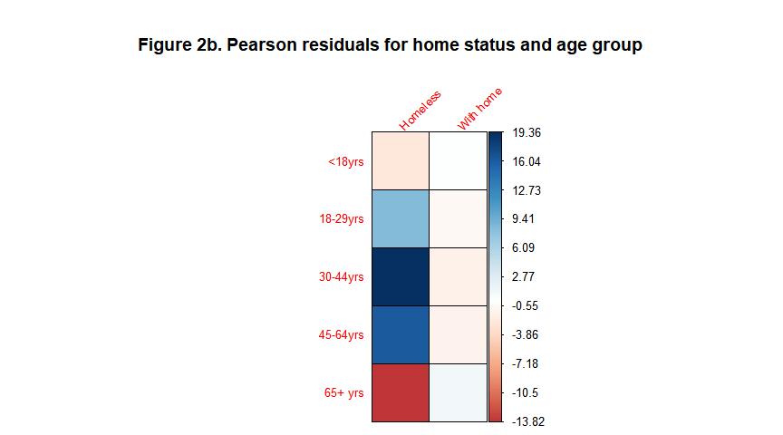
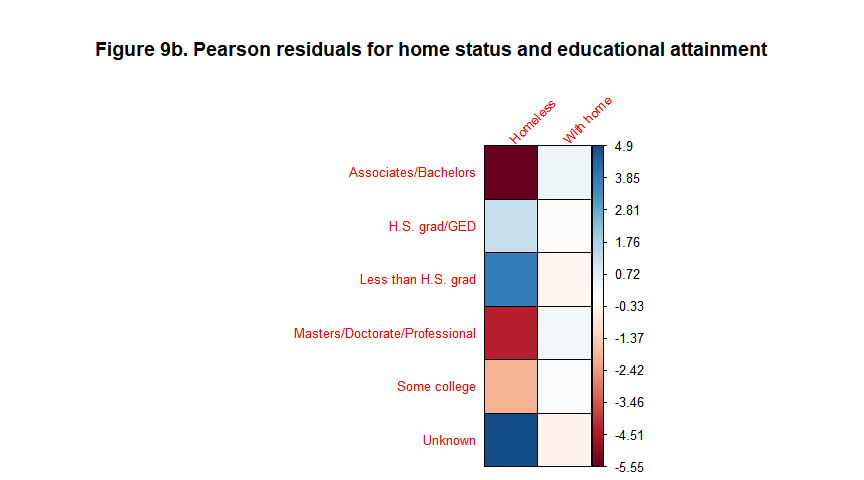
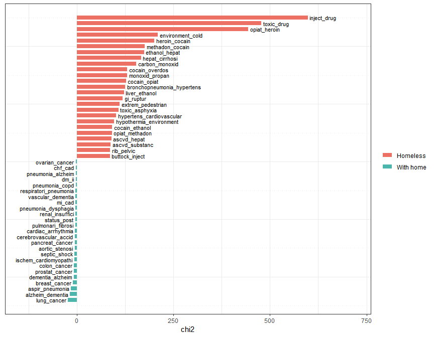

Part 2 - Classification of Homeless Deaths: exploratory data analysis
================
Maya Bhat-Gregerson
February 26, 2019

-   [EXPLORATORY DATA ANALYSIS](#exploratory-data-analysis)
    -   [A. Missing values](#a.-missing-values)
    -   [B. Analysis of select variables](#b.-analysis-of-select-variables)
        -   [1. Place of death type](#place-of-death-type)
        -   [2. Age group](#age-group)
        -   [3. Gender](#gender)
        -   [4a. Race/ethnicity - 5 groups with Hispanic as race](#a.-raceethnicity---5-groups-with-hispanic-as-race)
        -   [5. Manner of death](#manner-of-death)
        -   [6. Leading causes of death](#leading-causes-of-death)
        -   [7. Unintentional injury sub-groups](#unintentional-injury-sub-groups)
        -   [8. Drug and alcohol induced causes of death](#drug-and-alcohol-induced-causes-of-death)
        -   [9. Educational attainment](#educational-attainment)
        -   [10. Military service](#military-service)
    -   [C. Text analysis of cause of death text fields](#c.-text-analysis-of-cause-of-death-text-fields)
    -   [D. Discussion of findings from exploratory data analysis](#d.-discussion-of-findings-from-exploratory-data-analysis)
    -   [APPENDICES](#appendices)
        -   [Appendix A - Data dictionary for Washington State Mortality Data](#appendix-a---data-dictionary-for-washington-state-mortality-data)

``` r
library(magrittr)
library(tidyverse)
library(stringr)
library(knitr)
library(naniar)
library(data.table)
library(lubridate)
library(stringr)
library(scales)
library(cowplot)
library(quanteda)
library(tm)
library(tinytex)
library(here)

knitr::opts_chunk$set(message = FALSE, error=FALSE, warning = FALSE, echo = TRUE, tidy = TRUE, fig.width = 9, fig.align = "center")
```

EXPLORATORY DATA ANALYSIS
=========================

A. Missing values
-----------------

Missing values in any of the attributes in either HDR or death certificate data may be useful in the upcoming machine learning phase as it is very likely that a key distinction between decedents who were homeless vs. those who had permanent homes is that their records cannot be completed due to lack of information from family members or other "informants".

``` r
# homeless data
h <- read_csv("h.csv")
miss_var_summary(h)
```

    ## # A tibble: 28 x 3
    ##    variable   n_miss pct_miss
    ##    <chr>       <int>    <dbl>
    ##  1 residence      60   17.9  
    ##  2 rcounty        11    3.28 
    ##  3 rcity          11    3.28 
    ##  4 occupcode      10    2.99 
    ##  5 brgrace         6    1.79 
    ##  6 manner          1    0.299
    ##  7 UCOD            1    0.299
    ##  8 age5cat         1    0.299
    ##  9 CODliteral      1    0.299
    ## 10 certno          0    0    
    ## # ... with 18 more rows

``` r
str(h)
```

    ## Classes 'spec_tbl_df', 'tbl_df', 'tbl' and 'data.frame': 335 obs. of  28 variables:
    ##  $ certno     : num  2.00e+09 2.01e+09 2.01e+09 2.00e+09 2.01e+09 ...
    ##  $ dcounty    : chr  "KING" "KING" "KING" "KING" ...
    ##  $ attclass   : num  1 2 2 2 1 2 1 1 2 2 ...
    ##  $ sex        : chr  "M" "M" "M" "M" ...
    ##  $ brgrace    : num  1 2 3 1 1 1 1 1 1 1 ...
    ##  $ hispanic   : chr  "Y" "Y" "Y" "Y" ...
    ##  $ manner     : chr  "Natural" "Homicide" "Accident" "Accident" ...
    ##  $ rcounty    : chr  "KING" "KING" "ANCHORAGE" "THURSTON" ...
    ##  $ rcity      : chr  "SEATTLE" "FEDERAL WAY" "ANCHORAGE" "OLYMPIA" ...
    ##  $ rstateFIPS : chr  "WA" "WA" "AK" "WA" ...
    ##  $ rzip       : chr  "98127" "98023" "99508" "98513" ...
    ##  $ dcity      : chr  "SEATTLE" "FEDERAL WAY" "SEATTLE" "SEATTLE" ...
    ##  $ dplacecode : num  4 1 4 1 4 1 4 4 1 4 ...
    ##  $ dthyr      : num  2004 2005 2005 2004 2006 ...
    ##  $ UCOD       : chr  "K703" "X950" "W100" "X440" ...
    ##  $ educ       : chr  "Unknown" "H.S. grad/GED" "9-12th gr., no diploma" "9-12th gr., no diploma" ...
    ##  $ marital    : chr  "S" "S" "S" "S" ...
    ##  $ occupcode  : chr  "999" "825" "825" NA ...
    ##  $ age5cat    : chr  "45-64yrs" "18-29yrs" "30-44yrs" "45-64yrs" ...
    ##  $ LCOD       : chr  "Chronic Liver dis./cirrh." "Other" "Injury-unintentional" "Injury-unintentional" ...
    ##  $ injury     : chr  "No injury" "No injury" "Unintentional fall" "Unintentional poisoning" ...
    ##  $ substance  : chr  "Alcohol-induced" "No Substance abuse" "No Substance abuse" "Drug-induced" ...
    ##  $ residence  : chr  "WA resident" "WA resident" "Out of state" "WA resident" ...
    ##  $ raceethnic5: chr  "White NH" "Black NH" "AIAN NH" "White NH" ...
    ##  $ raceethnic6: chr  "White NH" "Black NH" "AIAN NH" "White NH" ...
    ##  $ CODliteral : chr  "ASPIRATION PNEUMONIA UPPER GI BLEED END STAGE LIVER DISEASE, CIRRHOSIS ETOH ABUSE" "GUNSHOT WOUNDS OF THE TRUNK     SHOT BY ASSAILANT" "CEREBRAL AD SPINAL CORD CONTUSIONS AND SUBDURAL HEMATOMA WITH SKULL AND VERTEBRAL FRACTURES BLUNT FORCE INJURY "| __truncated__ "ACUTE INTOXICATION COMBINED EFFECTS OF OPIATES, HEROIN, COCAINE, ETHANOL, CODEINE, AND DIPHENHYDRAMINE    TOXIC USE OF DRUGS" ...
    ##  $ military   : chr  "U" "N" "N" "N" ...
    ##  $ status     : chr  "Homeless" "Homeless" "Homeless" "Homeless" ...
    ##  - attr(*, "spec")=
    ##   .. cols(
    ##   ..   certno = col_double(),
    ##   ..   dcounty = col_character(),
    ##   ..   attclass = col_double(),
    ##   ..   sex = col_character(),
    ##   ..   brgrace = col_double(),
    ##   ..   hispanic = col_character(),
    ##   ..   manner = col_character(),
    ##   ..   rcounty = col_character(),
    ##   ..   rcity = col_character(),
    ##   ..   rstateFIPS = col_character(),
    ##   ..   rzip = col_character(),
    ##   ..   dcity = col_character(),
    ##   ..   dplacecode = col_double(),
    ##   ..   dthyr = col_double(),
    ##   ..   UCOD = col_character(),
    ##   ..   educ = col_character(),
    ##   ..   marital = col_character(),
    ##   ..   occupcode = col_character(),
    ##   ..   age5cat = col_character(),
    ##   ..   LCOD = col_character(),
    ##   ..   injury = col_character(),
    ##   ..   substance = col_character(),
    ##   ..   residence = col_character(),
    ##   ..   raceethnic5 = col_character(),
    ##   ..   raceethnic6 = col_character(),
    ##   ..   CODliteral = col_character(),
    ##   ..   military = col_character(),
    ##   ..   status = col_character()
    ##   .. )

``` r
wh <- read_csv("wh.csv")
# with home sample data
miss_var_summary(wh)
```

    ## # A tibble: 28 x 3
    ##    variable   n_miss pct_miss
    ##    <chr>       <int>    <dbl>
    ##  1 brgrace     12158  20.7   
    ##  2 occupcode    1384   2.35  
    ##  3 UCOD           29   0.0493
    ##  4 CODliteral     27   0.0459
    ##  5 manner         19   0.0323
    ##  6 dcity          12   0.0204
    ##  7 age5cat         9   0.0153
    ##  8 certno          0   0     
    ##  9 dcounty         0   0     
    ## 10 attclass        0   0     
    ## # ... with 18 more rows

``` r
str(wh)
```

    ## Classes 'spec_tbl_df', 'tbl_df', 'tbl' and 'data.frame': 58862 obs. of  28 variables:
    ##  $ certno     : num  2.02e+09 2.02e+09 2.02e+09 2.02e+09 2.02e+09 ...
    ##  $ dcounty    : chr  "KING" "KING" "KING" "KING" ...
    ##  $ attclass   : num  7 1 1 7 1 1 1 1 1 2 ...
    ##  $ sex        : chr  "F" "F" "M" "M" ...
    ##  $ brgrace    : num  1 1 1 1 10 1 1 1 5 1 ...
    ##  $ hispanic   : chr  "Y" "Y" "Y" "Y" ...
    ##  $ manner     : chr  "Natural" "Natural" "Natural" "Natural" ...
    ##  $ rcounty    : chr  "KING" "KING" "KING" "KING" ...
    ##  $ rcity      : chr  "BURIEN" "KENT" "WOODINVILLE" "REDMOND" ...
    ##  $ rstateFIPS : chr  "WA" "WA" "WA" "WA" ...
    ##  $ rzip       : chr  "98168" "98032" "98072" "98052" ...
    ##  $ dcity      : chr  "SEATTLE" "NORMANDY PARK" "KIRKLAND" "KIRKLAND" ...
    ##  $ dplacecode : num  5 1 4 7 4 5 4 4 0 0 ...
    ##  $ dthyr      : num  2017 2017 2017 2017 2017 ...
    ##  $ UCOD       : chr  "I110" "I251" "J841" "I640" ...
    ##  $ educ       : chr  "Some college" "Some college" "Doctorate/Professional" "<=8th grade" ...
    ##  $ marital    : chr  "D" "W" "M" "D" ...
    ##  $ occupcode  : chr  "908" "362" "160" "290" ...
    ##  $ age5cat    : chr  "65+ yrs" "65+ yrs" "65+ yrs" "45-64yrs" ...
    ##  $ LCOD       : chr  "Heart Dis." "Heart Dis." "Other" "Stroke" ...
    ##  $ injury     : chr  "No injury" "No injury" "No injury" "No injury" ...
    ##  $ substance  : chr  "No Substance abuse" "No Substance abuse" "No Substance abuse" "No Substance abuse" ...
    ##  $ residence  : chr  "WA resident" "WA resident" "WA resident" "WA resident" ...
    ##  $ raceethnic5: chr  "White NH" "White NH" "White NH" "White NH" ...
    ##  $ raceethnic6: chr  "White NH" "White NH" "White NH" "White NH" ...
    ##  $ CODliteral : chr  "CEREBROVASCULAR ACCIDENT DEMENTIA VASCULAR CONGESTIVE HEART FAILURE HYPERTENSIVE HEART DISEASE" "CORONARY ARTERY DISEASE CONGESTIVE HEART FAILURE   CHRONIC KIDNEY DISEASE, HYPERTENSION, ATRIAL MYXOMA" "ACUTE RESPIRATORY FAILURE WITH HYPOXIA ASPIRATION PNEUMONIA PULMONARY EMBOLISM IDIOPATHIC PULMONARY FIBROSIS AT"| __truncated__ "ACUTE ISCHEMIC CEREBRAL VASCULAR ACCIDENT" ...
    ##  $ military   : chr  "N" "N" "Y" "Y" ...
    ##  $ status     : chr  "With home" "With home" "With home" "With home" ...
    ##  - attr(*, "spec")=
    ##   .. cols(
    ##   ..   certno = col_double(),
    ##   ..   dcounty = col_character(),
    ##   ..   attclass = col_double(),
    ##   ..   sex = col_character(),
    ##   ..   brgrace = col_double(),
    ##   ..   hispanic = col_character(),
    ##   ..   manner = col_character(),
    ##   ..   rcounty = col_character(),
    ##   ..   rcity = col_character(),
    ##   ..   rstateFIPS = col_character(),
    ##   ..   rzip = col_character(),
    ##   ..   dcity = col_character(),
    ##   ..   dplacecode = col_double(),
    ##   ..   dthyr = col_double(),
    ##   ..   UCOD = col_character(),
    ##   ..   educ = col_character(),
    ##   ..   marital = col_character(),
    ##   ..   occupcode = col_character(),
    ##   ..   age5cat = col_character(),
    ##   ..   LCOD = col_character(),
    ##   ..   injury = col_character(),
    ##   ..   substance = col_character(),
    ##   ..   residence = col_character(),
    ##   ..   raceethnic5 = col_character(),
    ##   ..   raceethnic6 = col_character(),
    ##   ..   CODliteral = col_character(),
    ##   ..   military = col_character(),
    ##   ..   status = col_character()
    ##   .. )

B. Analysis of select variables
-------------------------------

To conduct exploratory data analysis I appended the homeless and 'with home' death records after adding a new variable to the two data sets indicating the homeless status of each death.

### 1. Place of death type

Figure 1a below shows that homeless individuals were more likely to die in places marked as "other" on the death certificate or in emergency rooms compared with decedents who had permanent homes. Decedents with permanent homes were more likely to die in their own homes, or in long term care/nursing home facilities. Death certifiers who report "other" in the place of death variable have the option of entering literal text to provide additional details about the location. Analysis of this text field may shed some light on why a large proportion of homeless decedents have place of death marked as "other".

There is a statistically significant association between homeless status and place of death type (p &lt; 0.05).

``` r
# Chi square - checking # of expected values in each cell

EDAdf <- read_csv("HomelessFinal.csv")
placetable <- table(EDAdf$dplacecode, EDAdf$status)
placechi <- chisq.test(placetable)
placechi$expected
```

    ##                             
    ##                                  Homeless    With home
    ##   ER                           5.30254912   931.697451
    ##   Home                        87.87404767 15440.125952
    ##   Hospice                      9.00358126  1581.996419
    ##   Hospital inpatient         125.28616315 22013.713837
    ##   In transport                 0.18674933    32.813251
    ##   Nursing home/Longterm care  93.16527865 16369.834721
    ##   Other                       14.14767640  2485.852324
    ##   Other person's home          0.01697721     2.983023
    ##   Unknown                      0.01697721     2.983023

``` r
# recode to remove cells (in homeless status vs. place of death type
# contingency table) with expected count <=5 small cells recoded as

EDAdf$dplace2 <- NA
EDAdf$dplace2 <- ifelse(EDAdf$dplacecode == "Home", "Home", ifelse(EDAdf$dplacecode == 
    "Other", "Other", ifelse(EDAdf$dplacecode == "ER", "ER/Outpatient", ifelse(EDAdf$dplacecode == 
    "Hospital inpatient", "Hospital inpatient", ifelse(EDAdf$dplacecode == "Nursing home/Longterm care", 
    "Nursing home/Longterm care", ifelse(EDAdf$dplacecode == "Hospice", "Hospice", 
        "Other"))))))

EDAdf$dplace2 <- factor(EDAdf$dplace2)

placetable2 <- table(EDAdf$dplace2, EDAdf$status)
p <- addmargins(placetable2)
p
```

    ##                             
    ##                              Homeless With home   Sum
    ##   ER/Outpatient                    16       921   937
    ##   Home                             27     15501 15528
    ##   Hospice                           2      1589  1591
    ##   Hospital inpatient               89     22050 22139
    ##   Nursing home/Longterm care        9     16454 16463
    ##   Other                           192      2347  2539
    ##   Sum                             335     58862 59197

``` r
placechi2 <- chisq.test(placetable2)
placechi2$expected
```

    ##                             
    ##                                Homeless  With home
    ##   ER/Outpatient                5.302549   931.6975
    ##   Home                        87.874048 15440.1260
    ##   Hospice                      9.003581  1581.9964
    ##   Hospital inpatient         125.286163 22013.7138
    ##   Nursing home/Longterm care  93.165279 16369.8347
    ##   Other                       14.368380  2524.6316

``` r
# bar plot of recoded place of death vs. homeless status
theme_set(theme_cowplot(font_size = 10))
plotplace <- ggplot(subset(EDAdf, !is.na(dplace2)), aes(x = dplace2, group = status, 
    fill = status)) + geom_bar(aes(y = ..prop..), stat = "count", color = "slategrey") + 
    geom_text(aes(label = scales::percent(..prop..), y = ..prop..), stat = "count", 
        hjust = -0.5, size = 3) + labs(y = "Percent", x = "Place of death type 2", 
    title = "Figure 1a. Place of death type by 
       homeless status", caption = "Homeless: n=1,093; With home: 
       n = 174,292") + 
    facet_grid(. ~ status) + scale_y_continuous(labels = scales::percent, limits = c(0, 
    1)) + coord_flip() + guides(fill = FALSE)

plotplace + theme(panel.spacing.x = unit(2.5, "lines"))
```


``` r
# Chi square test

placechi2
```

    ## 
    ##  Pearson's Chi-squared test
    ## 
    ## data:  placetable2
    ## X-squared = 2365.1, df = 5, p-value < 2.2e-16

``` r
# Plot of Pearson residuals - Color intensity is proportional to the
# correlation coefficients.
place2.res <- round(placechi2$residuals, 3)

corrplot::corrplot(place2.res, title = "Figure 1b. Pearson residuals for home status v. place of death", 
    method = "color", cl.pos = "r", cl.align = "l", cl.ratio = 0.75, tl.srt = 45, 
    outline = TRUE, tl.cex = 0.8, mar = c(0, 0, 5, 0), is.corr = FALSE)
```


### 2. Age group

Homeless decedents died at younger ages compared with decedents with homes. Almost 75% of decedents with homes were 65 years or older compared with almost 10% of the homeless decedent population. In contrast the highest proportion of deaths among homeless (almost 59%) occurred in the 45 to 64 year old population.

There is a statistically significant association between homeless status and age at death (p &lt; 0.05). Figure 2b is a plot of the Pearson chi square residuals for each age and homeless status category. Homeless deaths were most strongly positively associated with being 30-44 years and most strongly negatively associated with being 65 years or older.

``` r
agegrptble <- table(EDAdf$age5cat, EDAdf$status)

# Chi square - checking # of expected values in each cell
agegrpchi <- chisq.test(agegrptble)
agegrpchi$expected
```

    ##           
    ##              Homeless With home
    ##   <18yrs     6.184872  1089.815
    ##   18-29yrs   6.151013  1083.849
    ##   30-44yrs  13.599946  2396.400
    ##   45-64yrs  64.342981 11337.657
    ##   65+ yrs  243.721189 42945.279

``` r
# Bar Graph
theme_set(theme_cowplot(font_size = 10))
plotage <- ggplot(EDAdf, aes(x = age5cat, group = status, fill = status)) + 
    geom_bar(aes(y = ..prop..), stat = "count", color = "slategrey") + geom_text(aes(label = scales::percent(..prop..), 
    y = ..prop..), stat = "count", vjust = -0.5, size = 3) + labs(y = "Percent", 
    x = "Age groups", title = "Figure 2a. Age distribution by homeless 
       status", 
    caption = "Homeless: n=1,093; With home: 
       n = 174,292") + facet_grid(. ~ 
    status) + scale_y_continuous(labels = scales::percent) + guides(fill = FALSE)

plotage + theme(panel.spacing.x = unit(2.5, "lines"))
```


``` r
# Plot of Pearson residuals - Color intensity is proportional to the
# correlation coefficients.

agegrpchi
```

    ## 
    ##  Pearson's Chi-squared test
    ## 
    ## data:  agegrptble
    ## X-squared = 909.04, df = 4, p-value < 2.2e-16

``` r
agegrp.res <- round(agegrpchi$residuals, 3)

corrplot::corrplot(agegrp.res, title = "Figure 2b. Pearson residuals for home status and age group", 
    method = "color", cl.pos = "r", cl.align = "l", cl.ratio = 0.75, tl.srt = 45, 
    outline = TRUE, tl.cex = 0.8, mar = c(0, 0, 5, 0), is.corr = FALSE)
```



### 3. Gender

Far more homeless men die than homeless women, whereas the deaths are more balanced between genders among decedents with homes. There is a statistically significant association between gender and homeless status (p &lt;0.05). It is possible that homeless shelters tend to prioritize women in providing temporary housing resulting in lower proportions of women in the homeless population, and consequently, deaths among homeless.

``` r
gendertable <- table(EDAdf$sex, EDAdf$status)

# Chi square - checking # of expected values in each cell
genderchi <- chisq.test(gendertable)
genderchi$expected
```

    ##    
    ##     Homeless With home
    ##   F 169.7665  29829.23
    ##   M 165.2335  29032.77

``` r
EDAdf$sex2 <- NA
EDAdf$sex2 <- ifelse(EDAdf$sex == "M", "Male", ifelse(EDAdf$sex == "F", "Female", 
    NA))
EDAdf <- mutate_at(EDAdf, vars(sex2), as.factor)

theme_set(theme_cowplot(font_size = 10))
plotsex2 <- ggplot(subset(EDAdf, !is.na(sex2)), aes(x = sex2, group = status, 
    fill = status)) + geom_bar(aes(y = ..prop..), stat = "count", color = "slategrey") + 
    geom_text(aes(label = scales::percent(..prop..), y = ..prop..), stat = "count", 
        vjust = -0.5, size = 3) + labs(y = "Percent", x = "Gender", title = "Figure 3a. Gender distribution by homeless 
       status", 
    caption = "Homeless: n=1,093; With home: 
       n = 174,292") + facet_grid(. ~ 
    status) + scale_y_continuous(labels = scales::percent) + guides(fill = FALSE)

plotsex2 + theme(panel.spacing.x = unit(2.5, "lines"))
```


``` r
# Chi square test of independence
gendertable2 <- table(EDAdf$sex2, EDAdf$status)
genderchi2 <- chisq.test(gendertable2)
genderchi2
```

    ## 
    ##  Pearson's Chi-squared test with Yates' continuity correction
    ## 
    ## data:  gendertable2
    ## X-squared = 146.03, df = 1, p-value < 2.2e-16

``` r
# Plot of Pearson residuals - Color intensity is proportional to the
# correlation coefficients.
gender.res2 <- round(genderchi2$residuals, 3)

corrplot::corrplot(gender.res2, title = "Figure 3b. Pearson residuals for home status and gender", 
    method = "color", cl.pos = "r", cl.align = "l", cl.ratio = 0.75, tl.srt = 45, 
    outline = TRUE, tl.cex = 0.8, mar = c(0, 0, 5, 0), is.corr = FALSE)
```


### 4a. Race/ethnicity - 5 groups with Hispanic as race

Homeless status among King County decedents is statistically significantly associated with race and ethnicity (p &lt; 0.05) with larger proportions of non-Hispanic Black and American Indian/American Native among homeless decedents compared with those who had permanent homes. Conversely, a smaller proportion of homeless decedents were non-Hispanic Asians or non-Hispanic Whites. The proportion of Hispanic deaths was the same regardless of homeless status.

Estimates from 2017 show that White non Hispanics made up 61% of the total population of King County while Asians and Pacific Islander/Native Hawaiians contributed 18%, Black non-Hispanics made up 6%, Hispanics contributed 10%, and multiracial groups contributed the remaining 5%. The American Indian/American Native population overall in King County was approximately 1%.

Figure 4b. shows the contributions of the various race/ethnicity by homeless status cells to the overall chi square statistic. Of note is the strong positive correlation between homeless at death and being either American Indian or Black non-Hispanic. Conversely, being Asian was strongly negatively correlated with homelessness at death.

``` r
# Chi square - checking expected values of cells

raceth5table <- table(EDAdf$raceethnic5, EDAdf$status)
raceth5chi <- chisq.test(raceth5table)
raceth5chi$expected
```

    ##              
    ##                 Homeless  With home
    ##   AIAN NH       2.478673   435.5213
    ##   Asian/PI NH  18.703228  3286.2968
    ##   Black NH     14.436289  2536.5637
    ##   Hispanic      5.845820  1027.1542
    ##   Other         2.224015   390.7760
    ##   Unknown      68.836934 12095.1631
    ##   White NH    222.475041 39090.5250

``` r
# bar plot
theme_set(theme_cowplot(font_size = 10))
plotraceeth5 <- ggplot(EDAdf, aes(x = raceethnic5, group = status, fill = status)) + 
    geom_bar(aes(y = ..prop..), stat = "count", color = "slategrey") + geom_text(aes(label = scales::percent(..prop..), 
    y = ..prop..), stat = "count", hjust = -0.5, size = 3) + labs(y = "Percent", 
    x = "Race/Ethnicity", title = "Figure 4a. Racial/Ethnic distribution
       (5 grps) by homeless status", 
    caption = "Homeless: n=1,093; With home: 
       n = 174,292") + coord_flip() + 
    facet_grid(. ~ status) + scale_y_continuous(labels = scales::percent, limits = c(0, 
    1)) + guides(fill = FALSE)

plotraceeth5 + theme(panel.spacing.x = unit(2.5, "lines"))
```


``` r
# Chi square test of independence
raceth5chi
```

    ## 
    ##  Pearson's Chi-squared test
    ## 
    ## data:  raceth5table
    ## X-squared = 470.55, df = 6, p-value < 2.2e-16

``` r
# Plot of Pearson residuals - Color intensity is proportional to the
# correlation coefficients.
raceth5.res <- round(raceth5chi$residuals, 3)

corrplot::corrplot(raceth5.res, title = "Figure 4b. Pearson residuals for home status and Race/Ethnicity (5 grps)", 
    method = "color", cl.pos = "r", cl.align = "l", cl.ratio = 0.75, tl.srt = 45, 
    outline = TRUE, tl.cex = 0.8, mar = c(0, 0, 5, 0), is.corr = FALSE)
```


### 5. Manner of death

Manner of death refers to whether a person died as a result of natural causes, homicide, suicide, or an accident. In some instances where there is insufficient circumstantial evidence of intent the manner of death is marked as 'undetermined'. Manner of death is reported by medical providers completing death certificates via a check box with mutually exclusive options.

Over 45% of homeless deaths were accidental deaths compared to less than 6% of deaths to those with permanent homes. In contrast the vast majority of deaths among those with homes (almost 92%) were natural deaths. 5.6% of homeless deaths were homicides compared to almost 0% among the decedents with permanent homes. Over 7% of homeless deaths were by suicide and another 5.8% were due to homicide compared with 2% and 0.5% respectively among decedents with homes.

Manner of death is statistically significantly associated with homeless status (p &lt; 0.05).

``` r
# Chi square - checking expected counts
mannertable <- table(EDAdf$manner, EDAdf$status)
mannertable
```

    ##               
    ##                Homeless With home
    ##   Accident          138      3302
    ##   Homicide           19       330
    ##   Natural           138     54014
    ##   Suicide            23       996
    ##   Undetermined       16       201

``` r
mannerchi <- chisq.test(mannertable)
mannerchi$expected
```

    ##               
    ##                  Homeless  With home
    ##   Accident      19.415651  3420.5843
    ##   Homicide       1.969786   347.0302
    ##   Natural      305.638474 53846.3615
    ##   Suicide        5.751322  1013.2487
    ##   Undetermined   1.224766   215.7752

``` r
# recode to remove cells with expected count less than 5

EDAdf$manner2 <- NA
EDAdf$manner2 <- ifelse(EDAdf$manner == "Accident", "Accident", ifelse(EDAdf$manner == 
    "Undetermined", "Undetermined", ifelse(EDAdf$manner == "Homicide", "Homicide", 
    ifelse(EDAdf$manner == "Natural", "Natural", ifelse(EDAdf$manner == "Suicide", 
        "Suicide", NA)))))

EDAdf <- mutate_at(EDAdf, vars(manner2), as.factor)

# bar plot
theme_set(theme_cowplot(font_size = 10))
plotmanner2 <- ggplot(subset(EDAdf, !is.na(manner2)), aes(x = manner2, group = status, 
    fill = status)) + geom_bar(aes(y = ..prop..), stat = "count", color = "slategrey") + 
    geom_text(aes(label = scales::percent(..prop..), y = ..prop..), stat = "count", 
        hjust = -0.5, size = 3) + labs(y = "Percent", x = "Manner of death", 
    title = "Table 5a. Distribution of manner of 
       death by homeless status", 
    caption = "Homeless:n=1,093; With home:n = 174,292") + facet_grid(. ~ status) + 
    scale_y_continuous(labels = scales::percent, limits = c(0, 1.1)) + coord_flip() + 
    guides(fill = FALSE)

plotmanner2 + theme(panel.spacing.x = unit(2.5, "lines"))
```


``` r
# Chi square - test of independence
mannertable2 <- table(EDAdf$manner2, EDAdf$status)
mannerchi2 <- chisq.test(mannertable2)
mannerchi2$expected
```

    ##               
    ##                  Homeless  With home
    ##   Accident      19.415651  3420.5843
    ##   Homicide       1.969786   347.0302
    ##   Natural      305.638474 53846.3615
    ##   Suicide        5.751322  1013.2487
    ##   Undetermined   1.224766   215.7752

``` r
mannerchi2
```

    ## 
    ##  Pearson's Chi-squared test
    ## 
    ## data:  mannertable2
    ## X-squared = 1200.2, df = 4, p-value < 2.2e-16

``` r
# Plot of Pearson residuals - Color intensity is proportional to the
# correlation coefficients.
manner.res2 <- round(mannerchi2$residuals, 3)

corrplot::corrplot(manner.res2, title = "Table 5b. Pearson residuals for home status and manner of death", 
    method = "color", cl.pos = "r", cl.align = "l", cl.ratio = 0.75, tl.srt = 45, 
    outline = TRUE, tl.cex = 0.8, mar = c(0, 0, 5, 0), is.corr = FALSE)
```


### 6. Leading causes of death

There are clear differences in leading causes of death between decedents who were homeless and those with homes at the time of death. As we saw above in Figure 5a., homeless decedents were more likely to die of accidental manner of death. Figure 6a. shows that over 44% of homeless deaths were due to unintentional injury. The bar plot also indicates that homeless decedents were also more likely than decedents with homes to die of chronic liver disease/cirrhosis (5.3% vs. 1.5% respectively) and suicide (7.4% vs. 1.8% respectively). Fewer homeless decedents had a chronic disease as the underlying cause of death compared to decedents with homes. As the majority of homeless decedents died at younger ages the relatively low proportions of death due to chronic illness (which tend to manifest and affect people in older age groups) is not surprising.

Unintended injury deaths, suicides, and chronic liver disease had the strongest positive associations with homeless status and contributed to a statistically significant association between the two variables (p &lt;0.05).

``` r
# Chi square - checking for expected cell size counts of < 5

lcodtable <- table(EDAdf$LCOD, EDAdf$status)
lcodchi <- chisq.test(lcodtable)
lcodchi$expected
```

    ##                            
    ##                              Homeless  With home
    ##   Alzheimers                18.527797  3255.4722
    ##   Cancer                    74.620504 13111.3795
    ##   Chronic Liver dis./cirrh.  4.357484   765.6425
    ##   Chronic Lwr Resp Dis.     15.483217  2720.5168
    ##   Diabetes                   9.761897  1715.2381
    ##   Flu                        6.524908  1146.4751
    ##   Heart Dis.                72.373853 12716.6261
    ##   Injury-unintentional      18.324070  3219.6759
    ##   Other                     85.972600 15106.0274
    ##   Stroke                    23.287075  4091.7129
    ##   Suicide-all                5.766593  1013.2334

``` r
# bar plot
theme_set(theme_cowplot(font_size = 10))
plotlcod <- ggplot(EDAdf, aes(x = LCOD, group = status, fill = status)) + geom_bar(aes(y = ..prop..), 
    stat = "count", color = "slategrey") + geom_text(aes(label = scales::percent(..prop..), 
    y = ..prop..), stat = "count", hjust = -0.25, size = 3) + labs(y = "Percent", 
    x = "Leading Cause of Death", title = "Leading cause of death
       by homeless status", 
    caption = "Homeless: n=1,093; With home: 
       n = 174,292") + facet_grid(. ~ 
    status) + scale_y_continuous(labels = scales::percent, limits = c(0, 0.5)) + 
    coord_flip() + guides(fill = FALSE)

plotlcod + theme(panel.spacing.x = unit(2.5, "lines"))
```


``` r
# Chi square test
lcodchi
```

    ## 
    ##  Pearson's Chi-squared test
    ## 
    ## data:  lcodtable
    ## X-squared = 950.59, df = 10, p-value < 2.2e-16

``` r
# Plot of Pearson residuals - Color intensity is proportional to the
# correlation coefficients.
lcod.res <- round(lcodchi$residuals, 3)

corrplot::corrplot(lcod.res, title = "Pearson residuals for home status and 10 leading causes of death", 
    method = "color", cl.pos = "r", cl.align = "l", cl.ratio = 0.75, tl.srt = 45, 
    outline = TRUE, tl.cex = 0.8, mar = c(0, 0, 5, 0), is.corr = FALSE)
```


### 7. Unintentional injury sub-groups

A closer examination of unintentional injury deaths reveals that unintentional poisioning accounted for 32.6% of homeless deaths and motor vehicle related causes resulted in an additional 5.2% homeless deaths in King County. These proportions are far greater among the homeless compared with decedents with permanent homes. In stark contrast, relatively few decedents with permanent homes died of any unintended injury (5.4%).

Unintentional injury and homeless status are statistically signficantly associations (p &lt; 0.05) with unintentional poisoning having a strong positive correlation with homeless status.

``` r
# Chi square - checking if expected cell size counts are < 5
injurytable <- table(EDAdf$injury, EDAdf$status)
injurychi <- chisq.test(injurytable)
injurychi$observed
```

    ##                          
    ##                           Homeless With home
    ##   MV - all                      18       802
    ##   No injury                    200     55749
    ##   Other injury                  13       503
    ##   Unintentional fall             8       926
    ##   Unintentional poisoning       96       882

``` r
injurychi$expected
```

    ##                          
    ##                             Homeless  With home
    ##   MV - all                  4.640438   815.3596
    ##   No injury               316.619339 55632.3807
    ##   Other injury              2.920080   513.0799
    ##   Unintentional fall        5.285572   928.7144
    ##   Unintentional poisoning   5.534571   972.4654

``` r
# bar plot
theme_set(theme_cowplot(font_size = 10))
plotinjury <- ggplot(EDAdf, aes(x = injury, group = status, fill = status)) + 
    geom_bar(aes(y = ..prop..), stat = "count", color = "slategrey") + geom_text(aes(label = scales::percent(..prop..), 
    y = ..prop..), stat = "count", hjust = -0.2, size = 3) + labs(y = "Percent", 
    x = "Unintentional injury type", title = "Figure 7a. Leading unintentional 
       injury deaths by homeless status", 
    caption = "Homeless: n=1,093; With home: 
       n = 174,292") + facet_grid(. ~ 
    status) + scale_y_continuous(labels = scales::percent, limits = c(0, 1.1)) + 
    coord_flip() + guides(fill = FALSE)

plotinjury + theme(panel.spacing.x = unit(2, "lines"))
```


``` r
# Chi square test of independence
injurychi
```

    ## 
    ##  Pearson's Chi-squared test
    ## 
    ## data:  injurytable
    ## X-squared = 1605.4, df = 4, p-value < 2.2e-16

``` r
# Plot of Pearson residuals - Color intensity is proportional to the
# correlation coefficients.
injury.res <- round(injurychi$residuals, 3)

corrplot::corrplot(injury.res, title = "Figure 7b. Pearson residuals for home status and unintentional injury death", 
    method = "color", cl.pos = "r", cl.align = "l", cl.ratio = 0.75, tl.srt = 45, 
    outline = TRUE, tl.cex = 0.8, mar = c(0, 0, 5, 0), is.corr = FALSE)
```


### 8. Drug and alcohol induced causes of death

Unintentional poisoning is often associated with substance abuse and alcohol or drug-related deaths. Figure 8a shows more details about specific causes that contributed to unintentional poisoning deaths among homeless decedents. Drug-induced causes contributed over 32% of homeless deaths (compared with 1.9% of deaths to decedents with homes). In addition, alcohol-induced causes contributed over 8% of homeless deaths compared with 1.6% of deaths among decedents with homes. Drug and alcohol induced deaths were statistically significantly associated with homeless status (p &lt; 0.05) with drug-induced causes of death having the strongest positive correlation with homeless status.

``` r
# Chi square - checking if expected cell size counts are < 5
satable <- table(EDAdf$substance, EDAdf$status)
sachi <- chisq.test(satable)
sachi$observed
```

    ##                     
    ##                      Homeless With home
    ##   Alcohol-induced          29       791
    ##   Drug-induced            100      1034
    ##   No Substance abuse      206     57037

``` r
sachi$expected
```

    ##                     
    ##                        Homeless  With home
    ##   Alcohol-induced      4.640438   815.3596
    ##   Drug-induced         6.417386  1127.5826
    ##   No Substance abuse 323.942176 56919.0578

``` r
# bar plot
theme_set(theme_cowplot(font_size = 10))
plotsubstance <- ggplot(EDAdf, aes(x = substance, group = status, fill = status)) + 
    geom_bar(aes(y = ..prop..), stat = "count", color = "slategrey") + geom_text(aes(label = scales::percent(..prop..), 
    y = ..prop..), stat = "count", hjust = -0.25, size = 3) + labs(y = "Percent", 
    title = "Table 8a. Alcohol-related and drug-induced deaths by homeless
       status", 
    caption = "Homeless: n=1,093; With home: 
       n = 174,292") + facet_grid(. ~ 
    status) + scale_y_continuous(labels = scales::percent, limits = c(0, 1.1)) + 
    coord_flip() + guides(fill = FALSE)

plotsubstance + theme(panel.spacing.x = unit(2.5, "lines"))
```


``` r
# Chi square test of independence

sachi
```

    ## 
    ##  Pearson's Chi-squared test
    ## 
    ## data:  satable
    ## X-squared = 1544.2, df = 2, p-value < 2.2e-16

``` r
# Plot of Pearson residuals - Color intensity is proportional to the
# correlation coefficients.
sa.res <- round(sachi$residuals, 3)

corrplot::corrplot(sa.res, title = "Table 8b. Pearson residuals for home status and type of unintentional subst death", 
    method = "color", cl.pos = "r", cl.align = "l", cl.ratio = 0.75, tl.srt = 45, 
    outline = TRUE, tl.cex = 0.8, mar = c(0, 0, 5, 0), is.corr = FALSE)
```


### 9. Educational attainment

The educational attainment of almost 24% of homeless decedents could not be ascertained and this may not be surprising as many details about this population may be difficult to verify. Among homeless decedents for whom educational attainment could be ascertained over 60% had a high school diploma, GED, or less education. In comparison, decedents with permanent homes tended to have more formal education with a larger proportion having an Associates or Bachelors degree or higher compared with homeless decedents. Educational attainment is also statistically significantly associated with homeless status (p &lt; 0.05). As figure 9b indicates having less than a high school education was strongly positively correlated with being homeless while having an associates or bachelors degree was strongly negatively correlated with being homeless.

``` r
# Chi square - checking for expected counts < 5
eductable <- table(EDAdf$educ, EDAdf$status)
educchi <- chisq.test(eductable)
educchi$expected
```

    ##                         
    ##                           Homeless With home
    ##   <=8th grade            23.117303  4061.883
    ##   9-12th gr., no diploma 21.283764  3739.716
    ##   Associate's            15.652989  2750.347
    ##   Bachelors              39.653107  6967.347
    ##   Doctorate/Professional  8.980945  1578.019
    ##   H.S. grad/GED          97.132287 17066.868
    ##   Masters                13.479906  2368.520
    ##   Some college           45.849790  8056.150
    ##   Unknown                69.849908 12273.150

``` r
# recoding unknown educational status among homeless based on armed forces
# participation, collapsing individual groups
EDAdf$educ2 <- NA
EDAdf$educ2 <- ifelse(EDAdf$educ == "<=8th grade", "Less than H.S. grad", ifelse(EDAdf$educ == 
    "9-12th gr., no diploma", "Less than H.S. grad", ifelse(EDAdf$educ == "H.S. grad/GED", 
    "H.S. grad/GED", ifelse(EDAdf$educ == "Unknown" & EDAdf$military == "Y", 
        "H.S. grad/GED", ifelse(EDAdf$educ == "Some college", "Some college", 
            ifelse(EDAdf$educ == "Associate's", "Associates/Bachelors", ifelse(EDAdf$educ == 
                "Bachelors", "Associates/Bachelors", ifelse(EDAdf$educ == "Masters", 
                "Masters/Doctorate/Professional", ifelse(EDAdf$educ == "Doctorate/Professional", 
                  "Masters/Doctorate/Professional", ifelse(EDAdf$educ == "Unknown", 
                    "Unknown", NA))))))))))

# barplot
theme_set(theme_cowplot(font_size = 10))
ploteduc2 <- ggplot(EDAdf, aes(x = educ2, group = status, fill = status)) + 
    geom_bar(aes(y = ..prop..), stat = "count", color = "slategrey") + geom_text(aes(label = scales::percent(..prop..), 
    y = ..prop..), stat = "count", hjust = -0.25, size = 3) + labs(y = "Percent", 
    x = "Educational attainment", title = "Figure 9a. Educational attainment
       by homeless status", 
    caption = "Homeless: n=1,093; With home: 
       n = 174,292") + facet_grid(. ~ 
    status) + scale_y_continuous(labels = scales::percent, limits = c(0, 0.5)) + 
    coord_flip() + guides(fill = FALSE)

ploteduc2 + theme(panel.spacing.x = unit(2.5, "lines"))
```


``` r
# Chi Square test of independence
eductable2 <- table(EDAdf$educ2, EDAdf$status)
educchi2 <- chisq.test(eductable2)
educchi2
```

    ## 
    ##  Pearson's Chi-squared test
    ## 
    ## data:  eductable2
    ## X-squared = 94.087, df = 5, p-value < 2.2e-16

``` r
# Plot of Pearson residuals - Color intensity is proportional to the
# correlation coefficients.
educ.res2 <- round(educchi2$residuals, 3)

corrplot::corrplot(educ.res2, title = "Figure 9b. Pearson residuals for home status and educational attainment", 
    method = "color", cl.pos = "r", cl.align = "l", cl.ratio = 0.75, tl.srt = 45, 
    outline = TRUE, tl.cex = 0.8, mar = c(0, 0, 5, 0), is.corr = FALSE)
```



### 10. Military service

Armed forces participation was difficult to ascertain for over 11% of homeless decedents. Among those for whom military service information was available, homeless status was negatively correlated with armed forces participation (p &lt; 0.05).

``` r
# Chi square - checking for expected counts < 5
miltable <- table(EDAdf$military, EDAdf$status)
milchi <- chisq.test(miltable)
milchi$expected
```

    ##    
    ##       Homeless  With home
    ##   N 242.632650 42632.3673
    ##   U   2.580536   453.4195
    ##   Y  89.786814 15776.2132

``` r
# bar plot
theme_set(theme_cowplot(font_size = 10))
plotmilitary <- ggplot(EDAdf, aes(x = military, group = status, fill = status)) + 
    geom_bar(aes(y = ..prop..), stat = "count", color = "slategrey") + geom_text(aes(label = scales::percent(..prop..), 
    y = ..prop..), stat = "count", vjust = -0.5, size = 3) + labs(y = "Percent", 
    x = "Armed Forces participation", title = "Figure 10a. Armed Forces 
       participation by homeless status", 
    caption = "Homeless: n=1,093; With home: 
       n = 174,292") + facet_grid(. ~ 
    status) + scale_y_continuous(labels = scales::percent) + guides(fill = FALSE)

plotmilitary + theme(panel.spacing.x = unit(2.5, "lines"))
```


``` r
# Chi Square test of independence
milchi
```

    ## 
    ##  Pearson's Chi-squared test
    ## 
    ## data:  miltable
    ## X-squared = 523.12, df = 2, p-value < 2.2e-16

``` r
# Plot of Pearson residuals - Color intensity is proportional to the
# correlation coefficients.
mil.res <- round(milchi$residuals, 3)

corrplot::corrplot(mil.res, title = "Figure 10b. Pearson residuals: homeless status by armed forces participation", 
    method = "color", cl.pos = "r", cl.align = "l", cl.ratio = 0.75, tl.srt = 45, 
    outline = TRUE, tl.cex = 0.8, mar = c(0, 0, 5, 0), is.corr = FALSE)
```


C. Text analysis of cause of death text fields
----------------------------------------------

Examining literal fields in death certificates may provide some insight into whether death certifiers used these fields to identify homeless individuals or whether there are certain recurring themes that are not captured by the underlying cause of death ICD 10 codes. The text fields contain the raw, unprcessed cause of death information For this part of the analysis I examine cause of death literals (concatenating the four part 1 lines and the part 2 contributing causes fields where medical certifiers can enter free text to describe what decease or injury caused a decedent's death).

I used the bag of words method to analyse the concatenated text fields. In addition to creating tokens consisting of single word stems, I also created a customized dictionary of "stop words" to remove commonly used words that do not contribute to an overall understanding of causes and context of death.

The keyness plot below compares relative frequence of cause of death terms for decedents with homes vs. without homes. The chi square test shows the strength of the relationship between home status and dying of a particular cause of death.

The first plot looks at the differences between homeless and with home decedents by the 25 most commonly used individual words in the cause of death fields.

``` r
T <- EDAdf

T$doc_id <- as.character(T$certno)
T$text <- T$CODliteral

CODstop <- c("disease", "combination", "an", "the", "a", "of", "effects", "combined", 
    "due", "to", "by", "acute", "chronic", "and", "failure", "intoxication", 
    "type", "stage", "end", "natural", "on", "unspecified", "blunt", "force", 
    "metastatic", "cell", "mellitus", "arrest", "atrial", "fibrilation", "coronary", 
    "congestive", "history", "diastolic", "advanced", "probable", "with", "hemorrhage", 
    "multiple", "small", "non", "event", "advanced", "asymptomatic", "autoimmune", 
    "benign", "clinical", "communicable", "congenital", "degenerative", "febrile", 
    "first-degree", "foca", "fungal", "generalized", "inactive", "infectious", 
    "inflammatory", "invasive", "local", "malignant", "morbid", "multiple", 
    "neurodegenerative", "noninvasive", "nonspecific", "opportunistic", "parasitic", 
    " pathological", "perforated", "primary", "psychiatric", "rheumatic", "second-degree", 
    "self-induced", "self-inflicted", "severe", "sporadic", "suspected", "systemic", 
    "terminal", "third-degree", " unresponsive ", "untreated", "viral", "virulent", 
    "wasting", "exposure", "abuse", "use")


T <- select(T, doc_id, text, everything())

T$text <- tolower(T$text)
T$text <- removeWords(T$text, CODstop)

T.corpus <- corpus(T)

T.dtm <- dfm(T.corpus, tolower = TRUE, remove = stopwords("english"), stem = TRUE, 
    remove_punct = TRUE, groups = "status", remove_numbers = TRUE)


T.keyness = textstat_keyness(T.dtm, target = "Homeless")
textplot_keyness(T.keyness, margin = 0.1, labelcolor = "black", labelsize = 3, 
    n = 25L, color = c("#EC7063", "#4DB6AC"))
```


In the following plot, I repeat the above text analysis and plot two word combinations that show up most frequently by homeless status i.e. ngrams=2

Drug and alcohol use are most strongly correlated with homeless deaths as are deaths deaths due to environmental exposure/hypothermia. In comparison deaths to 'with home' decedents are most strongly associated with chronic diseases such as lung cancer and dementia, or conditions associated with old age such as aspirational pneumonia.

``` r
T <- EDAdf

T$doc_id <- as.character(T$certno)
T$text <- T$CODliteral

CODstop <- c("disease", "combination", "an", "the", "a", "of", "effects", "combined", 
    "due", "to", "by", "acute", "chronic", "and", "failure", "intoxication", 
    "type", "stage", "end", "natural", "on", "unspecified", "blunt", "force", 
    "metastatic", "cell", "mellitus", "arrest", "atrial", "fibrilation", "coronary", 
    "congestive", "history", "diastolic", "advanced", "probable", "with", "hemorrhage", 
    "multiple", "small", "non", "event", "advanced", "asymptomatic", "autoimmune", 
    "benign", "clinical", "communicable", "congenital", "degenerative", "febrile", 
    "first-degree", "foca", "fungal", "generalized", "inactive", "infectious", 
    "inflammatory", "invasive", "local", "malignant", "morbid", "multiple", 
    "neurodegenerative", "noninvasive", "nonspecific", "opportunistic", "parasitic", 
    " pathological", "perforated", "primary", "psychiatric", "rheumatic", "second-degree", 
    "self-induced", "self-inflicted", "severe", "sporadic", "suspected", "systemic", 
    "terminal", "third-degree", " unresponsive ", "untreated", "viral", "virulent", 
    "wasting", "exposure", "abuse", "unknown", "if", "cause", "death", "use", 
    "in")


T <- select(T, doc_id, text, everything())

T$text <- tolower(T$text)
T$text <- removeWords(T$text, CODstop)

T.corpus <- corpus(T)

T.dtm3 <- dfm(T.corpus, tolower = TRUE, remove = stopwords("english"), stem = TRUE, 
    remove_punct = TRUE, groups = "status", remove_numbers = TRUE, ngrams = 2)


T.keyness3 <- textstat_keyness(T.dtm3, target = "Homeless")
textplot_keyness(T.keyness3, margin = 0.1, labelcolor = "black", labelsize = 3, 
    n = 25L, color = c("#EC7063", "#4DB6AC"))
```



D. Discussion of findings from exploratory data analysis
--------------------------------------------------------

Based on the exploratory data analysis above the features that are statistically significantly associated with homeless statust include age, gender, manner of death (i.e. natural, suicide, homicide, or accidental), leading cause of death (broad groupings of ICD-10 codes for the diseases or injuries that account for the greatest number of deaths), educational attainment, race/ethnicity, and military service. Among causes of death, unintended injuries, primarily unintentional poisoning by drugs accounts for a large proportion of homeless deaths.

Analysis of raw text in the cause of death text fields reinforced findings from earlier analysis and also provided some additional insight into circumstances of death that was not apparent by simply analyzing a single underlying cause of death code for each death. Cause of death classification results in an oversimplification of the events leading to death and valuable details may be lost by analyzing ICD 10 codes alone. The two keyness plots above (particularly the second one) indicate that multiple illicit drugs were detected in the numerous drug overdose deaths or that there was a combination of both alcohol and illicit drugs present in the body at the time of death. Another new piece of information is that in many of the homeless deaths a key contributor to death was exposure to environmental cold resulting in hypothermia or leading to carbon monoxide poisoning (perhaps due to unsafe heating sources. The keyness plots also show the contrast between the types of deaths among homeless decedents and those with permanent homes. Decedents with homes were much more likely to die of chronic diseases characteristic of older age compared with accidents and injuries that led to the majority of homeless deaths.

In the next and final section of this project I will use features that are highly correlated with the outcome variable to train machine learning models using different methods to classify deaths by homeless status.

APPENDICES
----------

### Appendix A - Data dictionary for Washington State Mortality Data

``` r
dd <- read.csv("DthDataDictionary.csv")
library(kableExtra)

dd %>% kable() %>% kable_styling(full_width = F, font_size = 10) %>% column_spec(2, 
    width = "15em") %>% column_spec(3, width = "40em")
```

<table class="table" style="font-size: 10px; width: auto !important; margin-left: auto; margin-right: auto;">
<thead>
<tr>
<th style="text-align:left;">
Feature.name
</th>
<th style="text-align:left;">
Description
</th>
<th style="text-align:left;">
Values
</th>
</tr>
</thead>
<tbody>
<tr>
<td style="text-align:left;">
CERTNO
</td>
<td style="text-align:left;width: 15em; ">
Death Certificate Number
</td>
<td style="text-align:left;width: 40em; ">
Character; YYYY\#\#\#\#\#\#
</td>
</tr>
<tr>
<td style="text-align:left;">
SEX
</td>
<td style="text-align:left;width: 15em; ">
Sex
</td>
<td style="text-align:left;width: 40em; ">
Character; Max Length = 1; M = Male; F = Female; U = Undetermined
</td>
</tr>
<tr>
<td style="text-align:left;">
DOB
</td>
<td style="text-align:left;width: 15em; ">
Date of Birth
</td>
<td style="text-align:left;width: 40em; ">
Date; Max Length = 10; MM/DD/YYYY
</td>
</tr>
<tr>
<td style="text-align:left;">
DOD
</td>
<td style="text-align:left;width: 15em; ">
Date of Death
</td>
<td style="text-align:left;width: 40em; ">
Date; Max Length = 10; MM/DD/YYYY
</td>
</tr>
<tr>
<td style="text-align:left;">
DTHYR
</td>
<td style="text-align:left;width: 15em; ">
Date of Death - Year
</td>
<td style="text-align:left;width: 40em; ">
Numeric; Max length = 4
</td>
</tr>
<tr>
<td style="text-align:left;">
LNAME
</td>
<td style="text-align:left;width: 15em; ">
Decedent's last name
</td>
<td style="text-align:left;width: 40em; ">
Character; Max Length = 112
</td>
</tr>
<tr>
<td style="text-align:left;">
FNAME
</td>
<td style="text-align:left;width: 15em; ">
Decedent's first name
</td>
<td style="text-align:left;width: 40em; ">
Character; Max Length = 112
</td>
</tr>
<tr>
<td style="text-align:left;">
MNAME
</td>
<td style="text-align:left;width: 15em; ">
Decedent's middle name
</td>
<td style="text-align:left;width: 40em; ">
Character; Max Length = 112
</td>
</tr>
<tr>
<td style="text-align:left;">
SSN
</td>
<td style="text-align:left;width: 15em; ">
Decedent's social security number
</td>
<td style="text-align:left;width: 40em; ">
Character; Max Length = 112
</td>
</tr>
<tr>
<td style="text-align:left;">
DCITY
</td>
<td style="text-align:left;width: 15em; ">
Death Location City - Literal
</td>
<td style="text-align:left;width: 40em; ">
Character; Max Length = 112
</td>
</tr>
<tr>
<td style="text-align:left;">
DCOUNTY
</td>
<td style="text-align:left;width: 15em; ">
Death Location County
</td>
<td style="text-align:left;width: 40em; ">
Character; Max Length = 112
</td>
</tr>
<tr>
<td style="text-align:left;">
DSTATEFIPS
</td>
<td style="text-align:left;width: 15em; ">
Death Location State Name
</td>
<td style="text-align:left;width: 40em; ">
Character; Max Length = 112
</td>
</tr>
<tr>
<td style="text-align:left;">
DZIP
</td>
<td style="text-align:left;width: 15em; ">
Zip Code of Death Occurrence
</td>
<td style="text-align:left;width: 40em; ">
Character; Max Length = 5 XXXXX
</td>
</tr>
<tr>
<td style="text-align:left;">
DPLACECODE
</td>
<td style="text-align:left;width: 15em; ">
Facility Type for Place of Death
</td>
<td style="text-align:left;width: 40em; ">
Numeric; Max Length = 1; 0 = Home; 1 = Other Place; 2 = In Transport; 3 = Emergency Room; 4 = Hospital (Inpatient) ; 5 = Nursing Home/Long Term Care; 6 = Hospital; 7 = Hospice Facility; 8 = Other Person's Residence; 9 = Unknown;
</td>
</tr>
<tr>
<td style="text-align:left;">
DPLACELIT
</td>
<td style="text-align:left;width: 15em; ">
Type of death literal
</td>
<td style="text-align:left;width: 40em; ">
</td>
</tr>
<tr>
<td style="text-align:left;">
MILITARY
</td>
<td style="text-align:left;width: 15em; ">
Decedent ever served in Armed Forces?
</td>
<td style="text-align:left;width: 40em; ">
Character; Max Length = 1 Y = Yes; N = No; U = Unknown
</td>
</tr>
<tr>
<td style="text-align:left;">
MARITAL
</td>
<td style="text-align:left;width: 15em; ">
Marital Status
</td>
<td style="text-align:left;width: 40em; ">
Character; Max Length = 1 S = Never Married; M = Married; P = Domestic Partner; D = Divorced; W = Widowed; A = Married but separated; U = Unknown
</td>
</tr>
<tr>
<td style="text-align:left;">
EDUC
</td>
<td style="text-align:left;width: 15em; ">
Decedent's Education Level
</td>
<td style="text-align:left;width: 40em; ">
Numeric; Max Length = 1; 1 = 8th grade or less; 2 = No diploma 9th - 12th grade; 3 = High school graduate or GED completed; 4 = Some college credit but no degree; 5 = Associate degree; 6 = Bachelors degree; 7 = Masters degree; 8 = Doctorate or professional degree; 9 = Unknown
</td>
</tr>
<tr>
<td style="text-align:left;">
OCCUP
</td>
<td style="text-align:left;width: 15em; ">
Usual Occupation - Milham's Code
</td>
<td style="text-align:left;width: 40em; ">
Character; Max Length = 3
</td>
</tr>
<tr>
<td style="text-align:left;">
BRGRACE
</td>
<td style="text-align:left;width: 15em; ">
Decedent's NCHS Bridged Race

Based on all races reported the NCHS bridged race variable bridges multiple-race reporting back to one of four race categories (White, Black, American Indian/Alaska Native, and Asian/Pacific Islander) and includes single race reporting. This variable allows estimation of race-specific statistics based on the four race categories used in the 1977 OMB standards of four race categories.
</td>
<td style="text-align:left;width: 40em; ">
Character; Max Length = 2; --Single race specified: 01  White; 02  Black; 03  American Indian/Alaska Native (AI/AN); 04  Asian Indian; 05  Chinese; 06 - Filipino; 07 - Japanese; 08 - Korean; 09 - Vietnamese; 10  Other Asian; 11  Native Hawaiian; 12  Guamanian or Chamorro; 13 - Samoan; 14  Other Pacific Islander; 15 - Other;

--Bridged multiple specified race: 21  White; 22  Black; 23  AIAN; 24  Asian or Pacific Islander
</td>
</tr>
<tr>
<td style="text-align:left;">
HISPANIC
</td>
<td style="text-align:left;width: 15em; ">
Decedent's Hispanic Origin, Not Hispanic
</td>
<td style="text-align:left;width: 40em; ">
Character; Max Length = 1 Y = Yes N = No U = Unknown
</td>
</tr>
<tr>
<td style="text-align:left;">
RSTREET
</td>
<td style="text-align:left;width: 15em; ">
Decedent's residential street adrees
</td>
<td style="text-align:left;width: 40em; ">
Character
</td>
</tr>
<tr>
<td style="text-align:left;">
RCITY
</td>
<td style="text-align:left;width: 15em; ">
Decedent's Residence City literal
</td>
<td style="text-align:left;width: 40em; ">
Character;
</td>
</tr>
<tr>
<td style="text-align:left;">
RCOUNTY
</td>
<td style="text-align:left;width: 15em; ">
Decedent's Residence County Name
</td>
<td style="text-align:left;width: 40em; ">
Character; Max Length = 112
</td>
</tr>
<tr>
<td style="text-align:left;">
RSTATEFIPS
</td>
<td style="text-align:left;width: 15em; ">
Decedent's Residence State FIPS Code
</td>
<td style="text-align:left;width: 40em; ">
Character; Max Length = 2 AL - Alabama; AK - Alaska; AZ - Arizona; AR - Arkansas; CA - California;

-- etc. --

WA - Washington
</td>
</tr>
<tr>
<td style="text-align:left;">
RZIP
</td>
<td style="text-align:left;width: 15em; ">
Decedent's ZIP Code of Residence based on decedent resident address.
</td>
<td style="text-align:left;width: 40em; ">
Character; Max Length = 5 XXXXX
</td>
</tr>
<tr>
<td style="text-align:left;">
ATTCLASS
</td>
<td style="text-align:left;width: 15em; ">
Classification of Certifier of Death
</td>
<td style="text-align:left;width: 40em; ">
Numeric; Max Length = 1; 1 = Physician; 2 = Coroner/ME; 3 = DO; 4 = Chiropractor; 5 = Sanipractor; 6 = Physician Assistant; 7 = ARNP; 8 = Not Applicable; 9 = Unknown
</td>
</tr>
<tr>
<td style="text-align:left;">
RESMATCHCODE
</td>
<td style="text-align:left;width: 15em; ">
Match score for geocoded residential address (validated against Census Tiger file). Ranges from 1 through 100 with 100 indicating highest confidence of valid residential address.
</td>
<td style="text-align:left;width: 40em; ">
Character: Max Length = 3
</td>
</tr>
<tr>
<td style="text-align:left;">
UCOD
</td>
<td style="text-align:left;width: 15em; ">
Underlying cause of death - ICD 10 code
</td>
<td style="text-align:left;width: 40em; ">
Character; Max Length=4
</td>
</tr>
<tr>
<td style="text-align:left;">
MCOD
</td>
<td style="text-align:left;width: 15em; ">
Concatenated field containing all multiple cause or contributing cause ICD-10 codes
</td>
<td style="text-align:left;width: 40em; ">
Character
</td>
</tr>
<tr>
<td style="text-align:left;">
CODLIT
</td>
<td style="text-align:left;width: 15em; ">
Concatenated field containing text fields for cause of death lines a through d, contributing causes, and injury literal fields.
</td>
<td style="text-align:left;width: 40em; ">
Character
</td>
</tr>
<tr>
<td style="text-align:left;">
MANNER
</td>
<td style="text-align:left;width: 15em; ">
Reported Manner of Death
</td>
<td style="text-align:left;width: 40em; ">
Character; Max Length = 1; N = Natural; A = Accident; S = Suicide; H = Homicide; C = Undetermined; P = Pending
</td>
</tr>
</tbody>
</table>
