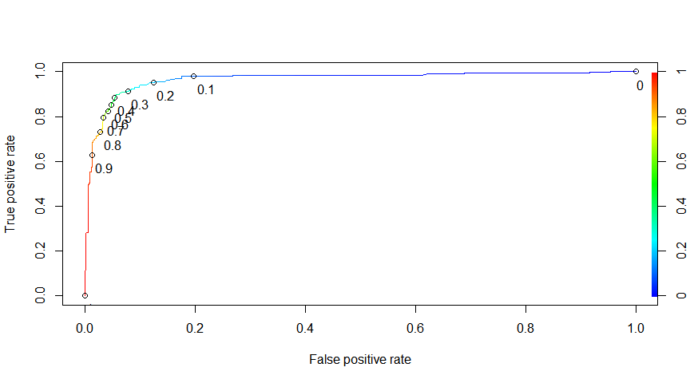
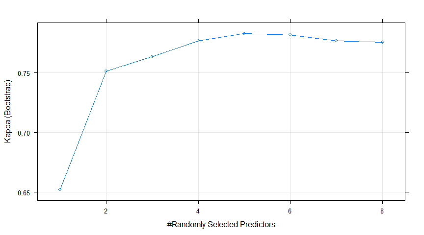

1.  Classification of Homeless Deaths: training machine learning models
================
Maya Bhat-Gregerson
February 26, 2019

-   [INTRODUCTION](#introduction)
-   [I. LOGISTIC REGRESSION MODEL](#i.-logistic-regression-model)
    -   [A. Read, subset, and prepare data](#a.-read-subset-and-prepare-data)
    -   [B. Split data into training and testing subsets and specify reference level for factor predictors](#b.-split-data-into-training-and-testing-subsets-and-specify-reference-level-for-factor-predictors)
    -   [C. Train and evaluate models](#c.-train-and-evaluate-models)
        -   [1a. Model 1: train logistic regression model using package e1071](#a.-model-1-train-logistic-regression-model-using-package-e1071)
        -   [1b. Model 1: evaluate model 1 performance on test data](#b.-model-1-evaluate-model-1-performance-on-test-data)
        -   [2a. Model 2: train logistic regression model with crossvalidation in Caret package](#a.-model-2-train-logistic-regression-model-with-crossvalidation-in-caret-package)
        -   [2b. Model 2: evaluate logistic regression model 2 using test data](#b.-model-2-evaluate-logistic-regression-model-2-using-test-data)
-   [II. NAIVE BAYES CLASSIFIER](#ii.-naive-bayes-classifier)
    -   [Prepare data for text analysis](#prepare-data-for-text-analysis)
    -   [Creating training and test datasets](#creating-training-and-test-datasets)
    -   [Transform sparse matrix into data structure to train model](#transform-sparse-matrix-into-data-structure-to-train-model)
    -   [(A) Naive Bayes model 1](#a-naive-bayes-model-1)
    -   [(B) Naive Bayes classfier 2](#b-naive-bayes-classfier-2)
    -   [(C) Comparison of accuracy of the two Naive Bayes classfiers](#c-comparison-of-accuracy-of-the-two-naive-bayes-classfiers)
-   [III. RANDOM FORESTS](#iii.-random-forests)
    -   [A. Split data into training and testing data sets](#a.-split-data-into-training-and-testing-data-sets)
    -   [B. Training preliminary Random Forest models using caret package](#b.-training-preliminary-random-forest-models-using-caret-package)
        -   [1. Identifying optimal number of variables to use in decision trees](#identifying-optimal-number-of-variables-to-use-in-decision-trees)
        -   [2. Identifying optimal number of decision trees to grow](#identifying-optimal-number-of-decision-trees-to-grow)
    -   [C. Final Random Forests model](#c.-final-random-forests-model)
        -   [1. Training the final model](#training-the-final-model)
        -   [2. Evaluating accuracy of Random Forests model 1 (final) with test data](#evaluating-accuracy-of-random-forests-model-1-final-with-test-data)
-   [IV. Discussion](#iv.-discussion)
    -   [A. Comparing model performance](#a.-comparing-model-performance)
    -   [B. Importance of predictors to models](#b.-importance-of-predictors-to-models)
    -   [C. Next steps](#c.-next-steps)

``` r
library(caTools)
library(magrittr)
library(tidyverse)
library(knitr)
library(epiDisplay)
library(ROCR)
library(tm)
library(SnowballC)
library(wordcloud)
library(e1071)
library(gmodels)
library(randomForest)
library(caret)
library(klaR)
library(plyr)
library(doParallel)

#cls <- makeCluster(4)
#registerDoParallel(cls)

knitr::opts_chunk$set(fig.width = 9, fig.align = "center", message = FALSE, warning = FALSE, echo = TRUE, tidy = TRUE)
```

INTRODUCTION
------------

This is the third and final section of this project in which I train machine learning models that can classify deaths by homeless status.

In the exploratory data analysis phase I was able to identify a number of independent variables that are strongly associated with homelessness. These features include sex, race and ethnicity (5 groups including Hispanic as race), place of death (e.g. home, hospital, hospice, etc), manner of death (natural, homicide, suicide, accident, or undetermined), leading cause of death (groupings of ICD 10 codes), educational attainment, age group, type of injury involved in death (no injury, motor vehicle injury, fall, poisoning), and whether underlying cause of death was due to drug or alcohol use. All predictors are categorical variables.

I. LOGISTIC REGRESSION MODEL
----------------------------

### A. Read, subset, and prepare data

I trained a number of logistic regression models and made modifications with each iteration to improve performance as measured by the relative AIC of the models. Some of the changes I made from one attempt to the next include:

-   removing predictors that did not add information to the model (as indicated by the AIC value in the summary statistics),
-   removing predictors that were not strongly correlated with the outcome in the model (as indicated by the asterisks in the summary statistics),
-   aggregating levels within predictor variables to achieve a minimum cell size of 10 when the predictor was tabulated against the outcome,
-   addressing data imbalance by reducing the number of observations. I included all deaths to homeless individuals (n = 1,090) and undersampled deaths among persons with home reducing this number from roughly 174,000 observations to 1,500 randomly selected deaths.

``` r
# READ FINAL HOMELESS FILE (CREATED AT THE END OF DATA WRANGLING PHASE)

homeless <- read.csv("HomelessFinal.csv")
h1 <- subset(homeless, select = c("sex", "raceethnic5", "manner", "dplacecode", 
    "educ", "age5cat", "LCOD", "status", "injury", "substance"))

# CONVERT 'STATUS' VARIABLE (HOMELESS STATUS) TO NUMERIC VARIABLE AND CREATE
# A DUPLICATE VARIABLE CALLED 'HOMELESS' THAT IS THEN RECODED FROM VALUES 1
# = HOMELESS, 2 = WITH HOME TO 0 = WITH HOME AND 1 = HOMELESS FOR USE IN
# LOGISTIC REGRESSION MODEL
str(h1$status)
```

    ##  Factor w/ 2 levels "Homeless","With home": 1 1 1 1 1 1 1 1 1 1 ...

``` r
table(h1$status)
```

    ## 
    ##  Homeless With home 
    ##      1093    174298

``` r
table(as.numeric(h1$status))
```

    ## 
    ##      1      2 
    ##   1093 174298

``` r
h1$status <- relevel(h1$status, ref = "With home")


h1$homeless <- h1$status
h1$homeless <- as.numeric(h1$homeless)
table(h1$homeless)
```

    ## 
    ##      1      2 
    ## 174298   1093

``` r
h1$homeless[h1$homeless == 1] <- 0
h1$homeless[h1$homeless == 2] <- 1
str(h1$status)
```

    ##  Factor w/ 2 levels "With home","Homeless": 2 2 2 2 2 2 2 2 2 2 ...

``` r
str(h1$homeless)
```

    ##  num [1:175391] 1 1 1 1 1 1 1 1 1 1 ...

``` r
table(h1$status, h1$homeless)
```

    ##            
    ##                  0      1
    ##   With home 174298      0
    ##   Homeless       0   1093

``` r
# TO CREATE A BALANCED DATASET LIMIT OBSERVATIONS TO ALL HOMELESS AND 1,500
# DECEDENTS WITH HOME.

withhome <- subset(h1, status == "With home")
homeless <- subset(h1, status == "Homeless")
withhome_sample <- sample_n(withhome, 1500)
h1 <- rbind(withhome_sample, homeless)
table(h1$status, h1$homeless)
```

    ##            
    ##                0    1
    ##   With home 1500    0
    ##   Homeless     0 1093

``` r
# RENAME 'STATUS' TO 'HOMELESSFAC' (HOMELESS STATUS AS FACTOR)
names(h1)[names(h1) == "status"] <- "homelessFac"
str(h1$homeless)
```

    ##  num [1:2593] 0 0 0 0 0 0 0 0 0 0 ...

``` r
str(h1$homelessFac)
```

    ##  Factor w/ 2 levels "With home","Homeless": 1 1 1 1 1 1 1 1 1 1 ...

``` r
table(h1$homeless, h1$homelessFac)
```

    ##    
    ##     With home Homeless
    ##   0      1500        0
    ##   1         0     1093

``` r
# CREATE A COPY OF THE FINAL DATA SET JUST IN CASE...
h2 <- h1

# SET SEED TO REPLICATE MODEL OUTCOMES
set.seed(1234)

# RANDOMIZE ROWS
h2 <- h2[sample(nrow(h2)), ]
head(h2$homelessFac, n = 20)
```

    ##  [1] With home Homeless  Homeless  Homeless  Homeless  Homeless  With home
    ##  [8] With home Homeless  With home Homeless  With home With home Homeless 
    ## [15] With home Homeless  With home With home With home With home
    ## Levels: With home Homeless

``` r
# RUN CROSSTABULATIONS WITH OUTCOME VARIABLE x EACH OF THE PREDICTOR
# VARIABLES CHECK CELL SIZE FOR n<10 - AGGREGATE LEVELS TO GET LARGER CELL
# SIZE WHEN n <10

# ALSO CHECK FOR MISSING VALUES AND CODETHESE AS NA

# SEX
table(h2$sex)
```

    ## 
    ##    F    M    U 
    ##  924 1669    0

``` r
# replacE 'unknown' values from predictors with NA
levels(h2$sex)[levels(h2$sex) == "U"] <- NA

# LEADING CAUSES OF DEATH
table(h2$homeless, h2$LCOD)
```

    ##    
    ##     Alzheimers Cancer Chronic Liver dis./cirrh. Chronic Lwr Resp Dis.
    ##   0         80    326                        21                    68
    ##   1          0     28                        58                     8
    ##    
    ##     Diabetes Flu Heart Dis. Injury-unintentional Other Stroke Suicide-all
    ##   0       40  20        314                   83   441     81          26
    ##   1       18  20        155                  487   228     10          81

``` r
# create new variable with aggregated levels reduce from 10 to 3 levels:
# chronic, external cause (injury), and other leading causes of death
h2$LCOD3cat <- fct_collapse(h2$LCOD, LCOD.Chronic = c("Alzheimers", "Cancer", 
    "Heart Dis.", "Chronic Lwr Resp Dis.", "Stroke", "Diabetes", "Chronic Liver dis./cirrh."), 
    LCOD.ExtCause = c("Injury-unintentional", "Suicide-all"), LCOD.Other = c("Flu", 
        "Other"))

table(h2$homeless, h2$LCOD3cat)
```

    ##    
    ##     LCOD.Chronic LCOD.Other LCOD.ExtCause
    ##   0          930        461           109
    ##   1          277        248           568

``` r
# DEATH PLACE CODE
table(h2$homeless, h2$dplacecode)
```

    ##    
    ##      ER Home Hospice Hospital Hospital inpatient In transport
    ##   0  28  412      55        0                556            1
    ##   1  49  100       8        0                272            1
    ##    
    ##     Nursing home/Longterm care Other Other person's home Unknown
    ##   0                        399    49                   0       0
    ##   1                         37   624                   2       0

``` r
# create new variable with 5 instead of 10 levels
h2$dplace5cat <- fct_collapse(h2$dplacecode, ER = c("ER", "In transport"), Hospital = c("Hospital", 
    "Hospital inpatient"), Home = "Home", Hospice.LngTrmCare = c("Hospice", 
    "Nursing home/Longterm care"), Other = c("Other", "Unknown", "Other person's home"))

table(h2$dplacecode, h2$dplace5cat)
```

    ##                             
    ##                               ER Home Hospice.LngTrmCare Hospital Other
    ##   ER                          77    0                  0        0     0
    ##   Home                         0  512                  0        0     0
    ##   Hospice                      0    0                 63        0     0
    ##   Hospital                     0    0                  0        0     0
    ##   Hospital inpatient           0    0                  0      828     0
    ##   In transport                 2    0                  0        0     0
    ##   Nursing home/Longterm care   0    0                436        0     0
    ##   Other                        0    0                  0        0   673
    ##   Other person's home          0    0                  0        0     2
    ##   Unknown                      0    0                  0        0     0

``` r
# EDUCATIONAL ATTAINMENT
table(h2$homeless, h2$educ)
```

    ##    
    ##     <=8th grade 9-12th gr., no diploma Associate's Bachelors
    ##   0         120                    104          73       231
    ##   1          36                    179          25        28
    ##    
    ##     Doctorate/Professional H.S. grad/GED Masters Some college Unknown
    ##   0                     38           508      62          244     120
    ##   1                      2           398      10          109     306

``` r
# create new variable with 4 instead of 10 levels
h2$educ4cat <- fct_collapse(h2$educ, NoHSDiploma = c("<=8th grade", "9-12th gr., no diploma"), 
    HSGrad.GED = "H.S. grad/GED", HSDipl.OrMore = c("Associate's", "Bachelors", 
        "Some college", "Masters", "Doctorate/Professional"), Unknown = "Unknown")

table(h2$educ, h2$educ4cat)
```

    ##                         
    ##                          NoHSDiploma HSDipl.OrMore HSGrad.GED Unknown
    ##   <=8th grade                    156             0          0       0
    ##   9-12th gr., no diploma         283             0          0       0
    ##   Associate's                      0            98          0       0
    ##   Bachelors                        0           259          0       0
    ##   Doctorate/Professional           0            40          0       0
    ##   H.S. grad/GED                    0             0        906       0
    ##   Masters                          0            72          0       0
    ##   Some college                     0           353          0       0
    ##   Unknown                          0             0          0     426

``` r
# RACE/ETHNICITY
table(h2$homeless, h2$raceethnic5)
```

    ##    
    ##     AIAN NH Asian/PI NH Black NH Hispanic Other Unknown White NH
    ##   0      12         101       65       42    10     101     1169
    ##   1      75          24      157       95    21       7      714

``` r
# collapse 'other' and 'unknown' levels into one

h2$race6cat <- fct_collapse(h2$raceethnic5, AIAN.NH = "AIAN NH", AsianPI.NH = "Asian/PI NH", 
    Black.NH = "Black NH", Hispanic = "Hispanic", White.NH = "White NH", Other.Unk = c("Other", 
        "Unknown"))

table(h2$raceethnic5, h2$race6cat)
```

    ##              
    ##               AIAN.NH AsianPI.NH Black.NH Hispanic Other.Unk White.NH
    ##   AIAN NH          87          0        0        0         0        0
    ##   Asian/PI NH       0        125        0        0         0        0
    ##   Black NH          0          0      222        0         0        0
    ##   Hispanic          0          0        0      137         0        0
    ##   Other             0          0        0        0        31        0
    ##   Unknown           0          0        0        0       108        0
    ##   White NH          0          0        0        0         0     1883

``` r
# MANNER OF DEATH
table(h2$homeless, h2$manner)
```

    ##    
    ##     Accident Homicide Natural Pending Suicide Undetermined
    ##   0       89        7    1370       0      26            8
    ##   1      496       61     394       0      81           60

``` r
# collapsing factors to get rid of pendings (n= 0)

h2$manner <- fct_collapse(h2$manner, Accident = "Accident", Homicide = "Homicide", 
    Natural = "Natural", Suicide = "Suicide", Undet.Pending = c("Undetermined", 
        "Pending"))

# AGE GROUP
table(h2$homeless, h2$age5cat)
```

    ##    
    ##     <18yrs 18-29yrs 30-44yrs 45-64yrs 65+ yrs
    ##   0     31       35       65      272    1097
    ##   1      0       84      264      643     101

``` r
# collapse factors to get rid of empty cells

h2$age4cat <- fct_collapse(h2$age5cat, `<29yrs` = c("<18yrs", "18-29yrs"), `30to44yrs` = "30-44yrs", 
    `45to64yrs` = "45-64yrs", `65+yrs` = "65+ yrs")

table(h2$age5cat, h2$age4cat)
```

    ##           
    ##            <29yrs 30to44yrs 45to64yrs 65+yrs
    ##   <18yrs       31         0         0      0
    ##   18-29yrs    119         0         0      0
    ##   30-44yrs      0       329         0      0
    ##   45-64yrs      0         0       915      0
    ##   65+ yrs       0         0         0   1198

``` r
# SUBSTANCE USE
table(h2$homeless, h2$substance)
```

    ##    
    ##     Alcohol-induced Drug-induced No Substance abuse
    ##   0              23           39               1438
    ##   1              91          357                645

``` r
# OMIT OBSERVATIONS WITH NA VALUES
h2 <- na.omit(h2)
str(h2)
```

    ## 'data.frame':    2591 obs. of  16 variables:
    ##  $ sex        : Factor w/ 2 levels "F","M": 1 2 2 2 2 2 1 1 2 2 ...
    ##  $ raceethnic5: Factor w/ 7 levels "AIAN NH","Asian/PI NH",..: 3 2 7 7 7 3 7 7 7 2 ...
    ##  $ manner     : Factor w/ 5 levels "Accident","Homicide",..: 3 4 1 3 1 3 3 3 2 3 ...
    ##  $ dplacecode : Factor w/ 10 levels "ER","Home","Hospice",..: 5 5 8 8 8 8 5 2 8 2 ...
    ##  $ educ       : Factor w/ 9 levels "<=8th grade",..: 3 6 8 6 9 6 2 6 6 4 ...
    ##  $ age5cat    : Factor w/ 5 levels "<18yrs","18-29yrs",..: 5 2 3 4 4 4 5 5 4 5 ...
    ##  $ LCOD       : Factor w/ 11 levels "Alzheimers","Cancer",..: 7 9 8 7 8 7 2 9 9 2 ...
    ##  $ homelessFac: Factor w/ 2 levels "With home","Homeless": 1 2 2 2 2 2 1 1 2 1 ...
    ##  $ injury     : Factor w/ 5 levels "MV - all","No injury",..: 2 2 5 2 5 2 2 2 2 2 ...
    ##  $ substance  : Factor w/ 3 levels "Alcohol-induced",..: 3 3 2 3 2 3 3 3 3 3 ...
    ##  $ homeless   : num  0 1 1 1 1 1 0 0 1 0 ...
    ##  $ LCOD3cat   : Factor w/ 3 levels "LCOD.Chronic",..: 1 2 3 1 3 1 1 2 2 1 ...
    ##  $ dplace5cat : Factor w/ 5 levels "ER","Home","Hospice.LngTrmCare",..: 4 4 5 5 5 5 4 2 5 2 ...
    ##  $ educ4cat   : Factor w/ 4 levels "NoHSDiploma",..: 2 3 2 3 4 3 1 3 3 2 ...
    ##  $ race6cat   : Factor w/ 6 levels "AIAN.NH","AsianPI.NH",..: 3 2 6 6 6 3 6 6 6 2 ...
    ##  $ age4cat    : Factor w/ 4 levels "<29yrs","30to44yrs",..: 4 1 2 3 3 3 4 4 3 4 ...
    ##  - attr(*, "na.action")= 'omit' Named int  1810 2446
    ##   ..- attr(*, "names")= chr  "1077" "963"

``` r
# SAVE ALL CHANGES TO DATAFRAME 'h3' AS BACKUP
h3 <- h2
h2 <- h3
# DROP VARIABLES THAT WERE RECODED TO NEW VARIABLES WITH DIFFERENT LEVELS
# (SEE ABOVE)
h2 <- h2[, c(-2, -4, -5, -6, -7)]

str(h2)
```

    ## 'data.frame':    2591 obs. of  11 variables:
    ##  $ sex        : Factor w/ 2 levels "F","M": 1 2 2 2 2 2 1 1 2 2 ...
    ##  $ manner     : Factor w/ 5 levels "Accident","Homicide",..: 3 4 1 3 1 3 3 3 2 3 ...
    ##  $ homelessFac: Factor w/ 2 levels "With home","Homeless": 1 2 2 2 2 2 1 1 2 1 ...
    ##  $ injury     : Factor w/ 5 levels "MV - all","No injury",..: 2 2 5 2 5 2 2 2 2 2 ...
    ##  $ substance  : Factor w/ 3 levels "Alcohol-induced",..: 3 3 2 3 2 3 3 3 3 3 ...
    ##  $ homeless   : num  0 1 1 1 1 1 0 0 1 0 ...
    ##  $ LCOD3cat   : Factor w/ 3 levels "LCOD.Chronic",..: 1 2 3 1 3 1 1 2 2 1 ...
    ##  $ dplace5cat : Factor w/ 5 levels "ER","Home","Hospice.LngTrmCare",..: 4 4 5 5 5 5 4 2 5 2 ...
    ##  $ educ4cat   : Factor w/ 4 levels "NoHSDiploma",..: 2 3 2 3 4 3 1 3 3 2 ...
    ##  $ race6cat   : Factor w/ 6 levels "AIAN.NH","AsianPI.NH",..: 3 2 6 6 6 3 6 6 6 2 ...
    ##  $ age4cat    : Factor w/ 4 levels "<29yrs","30to44yrs",..: 4 1 2 3 3 3 4 4 3 4 ...

### B. Split data into training and testing subsets and specify reference level for factor predictors

``` r
set.seed(1234)
split = sample.split(h2$homeless, SplitRatio = 0.65)
HTrain = subset(h2, split == TRUE)
HTest = subset(h2, split == FALSE)

# set reference levels for each dummy variable to be created
HTrain$sex <- relevel(HTrain$sex, ref = "F")
HTrain$race6cat <- relevel(HTrain$race6cat, ref = "White.NH")
HTrain$manner <- relevel(HTrain$manner, ref = "Natural")
HTrain$dplace5cat <- relevel(HTrain$dplace5cat, ref = "Home")
HTrain$educ4cat <- relevel(HTrain$educ4cat, ref = "HSDipl.OrMore")
HTrain$age4cat <- relevel(HTrain$age4cat, ref = "65+yrs")
HTrain$injury <- relevel(HTrain$injury, ref = "No injury")
HTrain$substance <- relevel(HTrain$substance, ref = "No Substance abuse")
HTrain$LCOD3cat <- relevel(HTrain$LCOD3cat, ref = "LCOD.Chronic")
HTrain$homelessFac <- relevel(HTrain$homelessFac, ref = "With home")
```

### C. Train and evaluate models

#### 1a. Model 1: train logistic regression model using package e1071

I trained the first logistic regression model using all predictors except 'injury' (whether the death was caused by homicide, suicide or unintentional injury) because of the high likelihood of multicollinearity with dummy variable manner:suicide and dummy variable injury: suicide.

``` r
model.LR1 <- glm(homelessFac ~ sex + race6cat + dplace5cat + educ4cat + age4cat + 
    manner + substance + LCOD3cat, data = HTrain, family = "binomial")
```

**Table 1 - Summary of logistic regression model 1**

``` r
summary(model.LR1)
```

    ## 
    ## Call:
    ## glm(formula = homelessFac ~ sex + race6cat + dplace5cat + educ4cat + 
    ##     age4cat + manner + substance + LCOD3cat, family = "binomial", 
    ##     data = HTrain)
    ## 
    ## Deviance Residuals: 
    ##     Min       1Q   Median       3Q      Max  
    ## -3.5241  -0.2459  -0.1239   0.2083   3.0622  
    ## 
    ## Coefficients:
    ##                              Estimate Std. Error z value Pr(>|z|)    
    ## (Intercept)                   -5.8019     0.4062 -14.284  < 2e-16 ***
    ## sexM                           0.9483     0.2248   4.219 2.46e-05 ***
    ## race6catAIAN.NH                2.4657     0.6415   3.843 0.000121 ***
    ## race6catAsianPI.NH            -1.5971     0.5297  -3.015 0.002571 ** 
    ## race6catBlack.NH               0.7897     0.3401   2.322 0.020219 *  
    ## race6catHispanic               0.7278     0.4233   1.719 0.085546 .  
    ## race6catOther.Unk             -3.5688     0.4892  -7.295 2.99e-13 ***
    ## dplace5catER                   2.0611     0.5181   3.978 6.96e-05 ***
    ## dplace5catHospice.LngTrmCare   0.8058     0.3550   2.270 0.023218 *  
    ## dplace5catHospital             0.9361     0.2726   3.434 0.000595 ***
    ## dplace5catOther                3.6031     0.3262  11.047  < 2e-16 ***
    ## educ4catNoHSDiploma            1.1366     0.2906   3.911 9.19e-05 ***
    ## educ4catHSGrad.GED             1.2489     0.2519   4.958 7.13e-07 ***
    ## educ4catUnknown                3.9134     0.3534  11.074  < 2e-16 ***
    ## age4cat<29yrs                  0.2272     0.4028   0.564 0.572773    
    ## age4cat30to44yrs               2.3507     0.3365   6.985 2.84e-12 ***
    ## age4cat45to64yrs               2.3445     0.2444   9.592  < 2e-16 ***
    ## mannerAccident                 1.8005     0.9167   1.964 0.049516 *  
    ## mannerHomicide                 2.2751     0.7434   3.060 0.002211 ** 
    ## mannerUndet.Pending            3.0024     0.7065   4.250 2.14e-05 ***
    ## mannerSuicide                  2.0199     1.0201   1.980 0.047701 *  
    ## substanceAlcohol-induced       1.2467     0.4116   3.029 0.002453 ** 
    ## substanceDrug-induced          1.7017     0.3729   4.564 5.03e-06 ***
    ## LCOD3catLCOD.Other             0.1557     0.2507   0.621 0.534559    
    ## LCOD3catLCOD.ExtCause         -0.3212     0.9476  -0.339 0.734643    
    ## ---
    ## Signif. codes:  0 '***' 0.001 '**' 0.01 '*' 0.05 '.' 0.1 ' ' 1
    ## 
    ## (Dispersion parameter for binomial family taken to be 1)
    ## 
    ##     Null deviance: 2292.33  on 1683  degrees of freedom
    ## Residual deviance:  747.11  on 1659  degrees of freedom
    ## AIC: 797.11
    ## 
    ## Number of Fisher Scoring iterations: 6

The summary of model 1 in Table 1 above shows:

1.  A number of the predictors are statistically significantly positively associated with being homelessness at death. Many of these make sense given the relationship between homeless status at death and these independent variables as seen in the exploratory data anlaysis phase. These include:
    -   being male,
    -   being American Indian/Native American non-Hispanic,
    -   being African American and non-Hispanic,
    -   dying in a location designated by the death certifier as "other", "hospital", or "ER",
    -   having a high school diploma/GED or less (compared with having some college or higher education),
    -   being between 30 and 64 years old at the time of death,
    -   manner of death being homicide or undetermined,
    -   dying of drug induced causes,
    -   dying of alcohol induced causes.
2.  Being non-Hispanic Asian or Pacific Islander is significantly negatively associated with being homeless at death.

**Table 2 - Logistic regression model 1 odds ratios and confidence intervals**

``` r
library(Publish)
publish(model.LR1)
```

    ##    Variable              Units OddsRatio          CI.95     p-value 
    ##         sex                  F       Ref                            
    ##                              M      2.58    [1.66;4.01]     < 1e-04 
    ##    race6cat           White.NH       Ref                            
    ##                        AIAN.NH     11.77   [3.35;41.39]   0.0001213 
    ##                     AsianPI.NH      0.20    [0.07;0.57]   0.0025711 
    ##                       Black.NH      2.20    [1.13;4.29]   0.0202186 
    ##                       Hispanic      2.07    [0.90;4.75]   0.0855459 
    ##                      Other.Unk      0.03    [0.01;0.07]     < 1e-04 
    ##  dplace5cat               Home       Ref                            
    ##                             ER      7.85   [2.84;21.68]     < 1e-04 
    ##             Hospice.LngTrmCare      2.24    [1.12;4.49]   0.0232183 
    ##                       Hospital      2.55    [1.49;4.35]   0.0005951 
    ##                          Other     36.71  [19.37;69.57]     < 1e-04 
    ##    educ4cat      HSDipl.OrMore       Ref                            
    ##                    NoHSDiploma      3.12    [1.76;5.51]     < 1e-04 
    ##                     HSGrad.GED      3.49    [2.13;5.71]     < 1e-04 
    ##                        Unknown     50.07 [25.05;100.08]     < 1e-04 
    ##     age4cat             65+yrs       Ref                            
    ##                         <29yrs      1.26    [0.57;2.76]   0.5727731 
    ##                      30to44yrs     10.49   [5.43;20.29]     < 1e-04 
    ##                      45to64yrs     10.43   [6.46;16.84]     < 1e-04 
    ##      manner            Natural       Ref                            
    ##                       Accident      6.05   [1.00;36.50]   0.0495159 
    ##                       Homicide      9.73   [2.27;41.77]   0.0022106 
    ##                  Undet.Pending     20.13   [5.04;80.41]     < 1e-04 
    ##                        Suicide      7.54   [1.02;55.66]   0.0477013 
    ##   substance No Substance abuse       Ref                            
    ##                Alcohol-induced      3.48    [1.55;7.79]   0.0024526 
    ##                   Drug-induced      5.48   [2.64;11.39]     < 1e-04 
    ##    LCOD3cat       LCOD.Chronic       Ref                            
    ##                     LCOD.Other      1.17    [0.71;1.91]   0.5345591 
    ##                  LCOD.ExtCause      0.73    [0.11;4.65]   0.7346430

Table 2 above converts the coefficients in the model summary above into odds ratios with 95% confidence intervals. The odds ratio values indicate the odds of having the characteristic for a person who died homeless compared to someone who had a permanent home at the time of death. For most of the predictors odds ratios confirm the association with the outcome seen in Table 1.

**Table 3 - Relative importance of predictors to logistic regression model 1**

``` r
varImp(model.LR1)
```

    ##                                 Overall
    ## sexM                          4.2187728
    ## race6catAIAN.NH               3.8434368
    ## race6catAsianPI.NH            3.0148500
    ## race6catBlack.NH              2.3222658
    ## race6catHispanic              1.7193760
    ## race6catOther.Unk             7.2946736
    ## dplace5catER                  3.9777854
    ## dplace5catHospice.LngTrmCare  2.2698231
    ## dplace5catHospital            3.4338479
    ## dplace5catOther              11.0472828
    ## educ4catNoHSDiploma           3.9111534
    ## educ4catHSGrad.GED            4.9577926
    ## educ4catUnknown              11.0744347
    ## age4cat<29yrs                 0.5639721
    ## age4cat30to44yrs              6.9853070
    ## age4cat45to64yrs              9.5917697
    ## mannerAccident                1.9641220
    ## mannerHomicide                3.0603760
    ## mannerUndet.Pending           4.2495589
    ## mannerSuicide                 1.9800201
    ## substanceAlcohol-induced      3.0291301
    ## substanceDrug-induced         4.5636896
    ## LCOD3catLCOD.Other            0.6210616
    ## LCOD3catLCOD.ExtCause         0.3389558

Table 3 indicates that place of death is reported as "other", race/ethnicity reported as "other", being 45 to 64 years old at death, being 30 to 44 years old at death, and having a cause of death related to substance use were some of the most important predictors contributing to the model. These results reaffirm the results shown in Table 1 as those same variables had higher coefficients and were flagged as being highly statistically signficantly associated with the outcome. On the other hand, there were some predictors in the model 1 summary table (Table 1) that also had higher coefficient values and were highly statistically signficant that did not appear to contribute as much to the model as the predictors mentioned above.

#### 1b. Model 1: evaluate model 1 performance on test data

I set the threshold probability level at 0.5 i.e. if the model predicts that there's a greater than 0.5 probability that the observation is homeless then it is classified as a homeless death. Tabulating the predicted values against the actual recorded ones gives the confusion matrix.

``` r
predict.LR1 <- predict(model.LR1, type = "response", newdata = HTest)

tbl.LR1 <- table(predict.LR1 > 0.5, HTest$homeless)
tbl.LR1
```

    ##        
    ##           0   1
    ##   FALSE 490  58
    ##   TRUE   35 324

``` r
accuracy_LR1 <- round(((tbl.LR1["FALSE", "0"] + tbl.LR1["TRUE", "1"])/(tbl.LR1["FALSE", 
    "0"] + tbl.LR1["TRUE", "1"] + tbl.LR1["FALSE", "1"] + tbl.LR1["TRUE", "0"])) * 
    100, 1)

accuracy_LR1
```

    ## [1] 89.7

The accuracy of logistic regression model 1 is 89.7.

Logistic regression model 1 has a sensitivity of 90.3 and specificity of 89.4

The baseline accuracy is 1500/(1500+1091) = 58% i.e. if all outcomes were predicted as the most common value (in this case '0' or "With home") my baseline prediction would be accurate for 58% of the observations.

Compared to the baseline accuracy logistic regression model 1 is considerably more accurate.

**Figure 1. ROC curve for logistic regression model 1**

``` r
library(ROCR)

ROCpred_LR1 <- prediction(predict.LR1, HTest$homeless)

table(HTest$homeless, HTest$homelessFac)
```

    ##    
    ##     With home Homeless
    ##   0       525        0
    ##   1         0      382

``` r
ROCcurve.LR1 <- performance(ROCpred_LR1, "tpr", "fpr")
ROCauc_LR1 <- performance(ROCpred_LR1, measure = "auc")

plot(ROCcurve.LR1, colorize = TRUE, print.cutoffs.at = seq(0, 1, by = 0.1), 
    text.adj = c(-0.2, 1.7))
```



``` r
print(ROCauc_LR1@y.values)
```

    ## [[1]]
    ## [1] 0.9577612

The area under the curve (AUC) is 0.9577612

Based on the ROC curve in Figure 1 a 0.5 probability threshold for classifying deaths as homeless vs. with home achieved the highest sensitivity (true positive rate) but decreased the specificity (1-False positive rate). I will need to check with program staff to see if it is more important to them to achieve a higher specificity (reduce false positives as much as possible) in which case I will rase the threshold to 0.8.

#### 2a. Model 2: train logistic regression model with crossvalidation in Caret package

I created my second logistic regression model using the Caret package. The package allowed me to specify tuning parameter values such as using ten-fold crossvalidation to get an average of the model run 10 times.

``` r
ctrl.LR2 <- trainControl(method = "repeatedcv", number = 10, savePredictions = TRUE)

model.lr2 <- train(homelessFac ~ sex + race6cat + dplace5cat + educ4cat + age4cat + 
    manner + substance + LCOD3cat, data = HTrain, family = "binomial", method = "glm", 
    trControl = ctrl.LR2, tuneLength = 5)
# allowParallel = TRUE)
varImp(model.lr2)
```

    ## glm variable importance
    ## 
    ##   only 20 most important variables shown (out of 24)
    ## 
    ##                              Overall
    ## educ4catUnknown               100.00
    ## dplace5catOther                99.75
    ## age4cat45to64yrs               86.19
    ## race6catOther.Unk              64.79
    ## age4cat30to44yrs               61.91
    ## educ4catHSGrad.GED             43.02
    ## `substanceDrug-induced`        39.35
    ## mannerUndet.Pending            36.43
    ## sexM                           36.14
    ## dplace5catER                   33.90
    ## educ4catNoHSDiploma            33.27
    ## race6catAIAN.NH                32.64
    ## dplace5catHospital             28.83
    ## mannerHomicide                 25.35
    ## `substanceAlcohol-induced`     25.06
    ## race6catAsianPI.NH             24.93
    ## race6catBlack.NH               18.47
    ## dplace5catHospice.LngTrmCare   17.99
    ## mannerSuicide                  15.29
    ## mannerAccident                 15.14

#### 2b. Model 2: evaluate logistic regression model 2 using test data

``` r
predict.lr2 <- predict(model.lr2, newdata = HTest)

str(predict.lr2)
```

    ##  Factor w/ 2 levels "With home","Homeless": 2 2 2 1 1 1 1 1 1 2 ...

``` r
cmlr2 <- confusionMatrix(data = predict.lr2, HTest$homelessFac, positive = "Homeless")
cmlr2
```

    ## Confusion Matrix and Statistics
    ## 
    ##            Reference
    ## Prediction  With home Homeless
    ##   With home       490       58
    ##   Homeless         35      324
    ##                                           
    ##                Accuracy : 0.8975          
    ##                  95% CI : (0.8759, 0.9164)
    ##     No Information Rate : 0.5788          
    ##     P-Value [Acc > NIR] : < 2e-16         
    ##                                           
    ##                   Kappa : 0.788           
    ##  Mcnemar's Test P-Value : 0.02253         
    ##                                           
    ##             Sensitivity : 0.8482          
    ##             Specificity : 0.9333          
    ##          Pos Pred Value : 0.9025          
    ##          Neg Pred Value : 0.8942          
    ##              Prevalence : 0.4212          
    ##          Detection Rate : 0.3572          
    ##    Detection Prevalence : 0.3958          
    ##       Balanced Accuracy : 0.8908          
    ##                                           
    ##        'Positive' Class : Homeless        
    ## 

The accuracy of the logistic regression model 2 is almost identical to that of the first logistic regression model. However, the sensitivity for logistic regression model 2 is 84.8 which is lower than the sensitivity of model 1 (90.3) while the specificity of model 2 is 93.3 which is higher than the specificity for model 1 (89.4).

II. NAIVE BAYES CLASSIFIER
--------------------------

In this section, I train two Naive Bayes classifiers using the text fields that contain cause of death information. The two models are differnt only in the packages used to create them.

I begin by reading in the data and selecting only the homeless status of the decedent and the feature that contains a concatenation of cause of death lines a, b, c, d, other significant conditions contributing to death, and injury description fields on the death certificate. I also reduced the number of "with home" decedents to a random sample 1,500 deaths to avoid problems associated with data imbalance.

``` r
# get data and restrict to only literal fields the literal field in this
# dataset is called 'CODliteral' and contains Cause of death lines a-d,
# other significant conditions line, and injury occurrance literal field.

literal <- read.csv("HomelessFinal.csv", stringsAsFactors = FALSE)
literal <- subset(literal, select = c(status, CODliteral))
str(literal)
```

    ## 'data.frame':    175391 obs. of  2 variables:
    ##  $ status    : chr  "Homeless" "Homeless" "Homeless" "Homeless" ...
    ##  $ CODliteral: chr  "COMBINED OPIATE (HEROIN), METHAMPHETAMINE, AND DIPHENHYDRAMINE INTOXICATION     TOXIC USE OF DRUGS" "UNDETERMINED     FOUND DEAD IN JAIL CELL." "ACUTE METHAMPHETAMINE INTOXICATION    HYPERTENSIVE AND ATHEROSCLEROTIC CARDIOVASCULAR DISEASE TOXIC USE OF A DRUG" "ACUTE COMBINED METHAMPHETAMINE AND DEXTROMETHORPHAN INTOXICATION    ATHEROSCLEROTIC AND HYPERTENSIVE CARDIOVASC"| __truncated__ ...

``` r
# set 'status' to factor

literal$status <- factor(literal$status)
str(literal$status)
```

    ##  Factor w/ 2 levels "Homeless","With home": 1 1 1 1 1 1 1 1 1 1 ...

``` r
table(literal$status)
```

    ## 
    ##  Homeless With home 
    ##      1093    174298

``` r
# to remove the problem of unbalanced data I will restrict the 'with home'
# class to about 7,500 randomly selected records

h <- subset(literal, status == "Homeless")
wh <- subset(literal, status == "With home")
summary(h)
```

    ##        status      CODliteral       
    ##  Homeless :1093   Length:1093       
    ##  With home:   0   Class :character  
    ##                   Mode  :character

``` r
summary(wh)
```

    ##        status        CODliteral       
    ##  Homeless :     0   Length:174298     
    ##  With home:174298   Class :character  
    ##                     Mode  :character

``` r
wh_sample <- sample_n(wh, 1500)

literal2 <- rbind(wh_sample, h)
literal2 <- literal2[sample(nrow(literal2)), ]  #randomize order of rows so rows aren't ordered by class
str(literal2)
```

    ## 'data.frame':    2593 obs. of  2 variables:
    ##  $ status    : Factor w/ 2 levels "Homeless","With home": 2 1 1 2 2 2 1 1 2 1 ...
    ##  $ CODliteral: chr  "ALZHEIMERS DEMENTIA    CVA W/ RESIDUAL PARTIAL PARESIS.  BREAST CANCER W/ SOME METASTASIS. " "ACUTE ETHANOL INTOXICATION    CHRONIC ETHANOLISM CONSUMED EXCESS OF ETHANOL" "COMBINED METHADONE, COCAINE AND CLONAZEPAM INTOXICATION     TOXIC USE OF DRUGS" "ELECTROLYTE DISTURBANCES DYSPHAGIA ADULT FAILURE TO THRIVE SEVERE DEMENTIA HTN, CHF, COPD " ...

``` r
table(literal2$status)
```

    ## 
    ##  Homeless With home 
    ##      1093      1500

### Prepare data for text analysis

The variable containg cause of death literals is processed to remove common words that do not contribute useful infomration that may distinguish between homeless and with home status among decedents but that occur frequently. In addition to this words appearing on the cause of death fields are standardized by removing capital letters, punctuation marks, numbers, extra white space, and finally, by limiting them to their word roots.

``` r
library(tm)
h_corpus <- VCorpus(VectorSource(literal2$CODliteral))
print(h_corpus)
```

    ## <<VCorpus>>
    ## Metadata:  corpus specific: 0, document level (indexed): 0
    ## Content:  documents: 2593

``` r
# CODstop <- c('disease', 'combination', 'an', 'the', 'a', 'of', 'effects',
# 'combined', 'due', 'to', 'by', 'and', 'failure', 'type', 'stage', 'end',
# 'natural', 'on', 'unspecified', 'arrest', 'atrial', 'fibrilation',
# 'congestive', 'history', 'diastolic', 'probable', 'with', 'multiple',
# 'small', 'non', 'event' ,'advanced' , 'asymptomatic' , 'autoimmune' ,
# 'benign' , 'clinical' , 'communicable' ,'congenital' , 'degenerative' ,
# 'febrile' , 'first-degree' , 'foca' , 'fungal' , 'generalized' ,
# 'inactive' , 'infectious' , 'inflammatory' , 'invasive' , 'local',
# 'morbid' ,'multiple' , 'noninvasive' , 'nonspecific' , 'parasitic' , '
# pathological' , 'perforated' , 'primary', 'rheumatic' , 'second-degree' ,
# 'severe' , 'sporadic' , 'suspected' , 'systemic' , 'terminal' ,
# 'third-degree' , ' unresponsive ', 'untreated' , 'viral' , 'virulent' ,
# 'wasting', 'abuse', 'unknown', 'if', 'cause', 'death', 'use', 'in',
# 'with')

CODstop <- c("disease", "combination", "an", "the", "a", "of", "effects", "combined", 
    "due", "to", "by", "and", "failure", "intoxication", "type", "stage", "end", 
    "natural", "on", "unspecified", "arrest", "atrial", "fibrilation", "coronary", 
    "congestive", "history", "diastolic", "probable", "with", "multiple", "small", 
    "non", "event", "advanced", "asymptomatic", "autoimmune", "benign", "clinical", 
    "communicable", "congenital", "degenerative", "febrile", "first-degree", 
    "foca", "fungal", "generalized", "inactive", "infectious", "inflammatory", 
    "invasive", "local", "morbid", "multiple", "noninvasive", "nonspecific", 
    "parasitic", " pathological", "perforated", "primary", "psychiatric", "rheumatic", 
    "second-degree", "severe", "sporadic", "suspected", "systemic", "terminal", 
    "third-degree", " unresponsive ", "untreated", "viral", "virulent", "wasting", 
    "abuse", "unknown", "if", "cause", "death", "use", "in", "with")

# standardize all content

h_corpus_clean <- h_corpus %>% tm_map(content_transformer(tolower)) %>% tm_map(removeNumbers) %>% 
    tm_map(removePunctuation) %>% tm_map(removeWords, stopwords()) %>% tm_map(removeWords, 
    CODstop) %>% tm_map(wordStem, language = "eng") %>% tm_map(stripWhitespace)

h_corpus_clean <- tm_map(h_corpus_clean, PlainTextDocument)  # this line puts the corpus back into the correct data type
h_dtm <- DocumentTermMatrix(h_corpus_clean)
h_dtm
```

    ## <<DocumentTermMatrix (documents: 2593, terms: 1962)>>
    ## Non-/sparse entries: 17505/5069961
    ## Sparsity           : 100%
    ## Maximal term length: 29
    ## Weighting          : term frequency (tf)

### Creating training and test datasets

The training data set consists of 70% of the total data set.

``` r
split <- sample.split(literal2$status, SplitRatio = 0.7)  # creating training:testing data sets 70:30

h.raw.train <- literal2[split, ]
h.raw.test <- literal2[-split, ]

prop.table(table(h.raw.train$status))
```

    ## 
    ##  Homeless With home 
    ## 0.4214876 0.5785124

``` r
prop.table(table(h.raw.test$status))
```

    ## 
    ##  Homeless With home 
    ## 0.4216821 0.5783179

``` r
h.cleancorpus.train <- h_corpus_clean[split]
h.cleancorpus.test <- h_corpus_clean[-split]

set.seed(1234)
h.dtm.train <- h_dtm[split, ]
h.dtm.test <- h_dtm[-split, ]
```

### Transform sparse matrix into data structure to train model

Eliminate words appearing in fewer than 5 records.

``` r
freqWords <- findFreqTerms(h.dtm.train, 5)  #keeps words that appear at least 5 times


# filter DTM to keep only terms appearing 5 times or more
htrain.filtered <- h.dtm.train[, freqWords]
htest.filtered <- h.dtm.test[, freqWords]


# Create function to convert counts to Yes/No variable indicating
# presence/absence of word

convertCounts <- function(x) {
    x <- ifelse(x > 0, "Present", "Absent")
    x <- factor(x)
}

h.train.final <- apply(htrain.filtered, MARGIN = 2, convertCounts)  #Margin = 2: apply filter to columns
h.test.final <- apply(htest.filtered, MARGIN = 2, convertCounts)
```

### (A) Naive Bayes model 1

For the first Naive Bayes model I used the R package e1071 to train the classifier. I added ten-fold crossvalidation to the model so that an average of all 10 models can be used as the final classifier.

``` r
# train model

h.model.nb1 <- naiveBayes(h.train.final, h.raw.train$status, laplace = 1, trainControl(method = "cv", 
    number = 10))

# use model to predict with test data

h.predict.nb1 <- predict(h.model.nb1, h.test.final)

# Evaluate accuracy of model by crosstabulating with raw data

# CrossTable(h.predict.nb1, h.raw.test$status, prop.chisq = FALSE, prop.t =
# FALSE, prop.r = FALSE, dnn = c('predicted', 'actual'))

cmnb1 <- confusionMatrix(h.predict.nb1, h.raw.test$status, positive = "Homeless")  # positive argument sets the level that is considered 'positive' or indicates the presence of the attribute of interest
cmnb1
```

    ## Confusion Matrix and Statistics
    ## 
    ##            Reference
    ## Prediction  Homeless With home
    ##   Homeless       887       129
    ##   With home      206      1370
    ##                                           
    ##                Accuracy : 0.8708          
    ##                  95% CI : (0.8572, 0.8834)
    ##     No Information Rate : 0.5783          
    ##     P-Value [Acc > NIR] : < 2.2e-16       
    ##                                           
    ##                   Kappa : 0.7325          
    ##  Mcnemar's Test P-Value : 3.291e-05       
    ##                                           
    ##             Sensitivity : 0.8115          
    ##             Specificity : 0.9139          
    ##          Pos Pred Value : 0.8730          
    ##          Neg Pred Value : 0.8693          
    ##              Prevalence : 0.4217          
    ##          Detection Rate : 0.3422          
    ##    Detection Prevalence : 0.3920          
    ##       Balanced Accuracy : 0.8627          
    ##                                           
    ##        'Positive' Class : Homeless        
    ## 

### (B) Naive Bayes classfier 2

For the second version of a Naive Bayes model I used packages caret and klaR. Once again, I incorporated ten-fold cross validation in the method.

``` r
ctrl <- trainControl(method = "cv", number = 10)
grid <- data.frame(fL = 1, usekernel = FALSE, adjust = 0)  # fL = 1 sets the Laplace correction to 1

h.model.nb2 = train(h.train.final, h.raw.train$status, method = "nb", tuneGrid = grid, 
    trControl = ctrl)

h.model.nb2
```

    ## Naive Bayes 
    ## 
    ## 1815 samples
    ##  405 predictor
    ##    2 classes: 'Homeless', 'With home' 
    ## 
    ## No pre-processing
    ## Resampling: Cross-Validated (10 fold) 
    ## Summary of sample sizes: 1634, 1634, 1634, 1633, 1634, 1633, ... 
    ## Resampling results:
    ## 
    ##   Accuracy   Kappa    
    ##   0.8721693  0.7357374
    ## 
    ## Tuning parameter 'fL' was held constant at a value of 1
    ## Tuning
    ##  parameter 'usekernel' was held constant at a value of FALSE
    ## 
    ## Tuning parameter 'adjust' was held constant at a value of 0

``` r
h.predict.nb2 = predict(h.model.nb2, h.test.final)

cmnb2 <- confusionMatrix(h.predict.nb2, h.raw.test$status, positive = "Homeless")
cmnb2
```

    ## Confusion Matrix and Statistics
    ## 
    ##            Reference
    ## Prediction  Homeless With home
    ##   Homeless       903       138
    ##   With home      190      1361
    ##                                        
    ##                Accuracy : 0.8735       
    ##                  95% CI : (0.86, 0.886)
    ##     No Information Rate : 0.5783       
    ##     P-Value [Acc > NIR] : < 2.2e-16    
    ##                                        
    ##                   Kappa : 0.7389       
    ##  Mcnemar's Test P-Value : 0.004863     
    ##                                        
    ##             Sensitivity : 0.8262       
    ##             Specificity : 0.9079       
    ##          Pos Pred Value : 0.8674       
    ##          Neg Pred Value : 0.8775       
    ##              Prevalence : 0.4217       
    ##          Detection Rate : 0.3484       
    ##    Detection Prevalence : 0.4016       
    ##       Balanced Accuracy : 0.8671       
    ##                                        
    ##        'Positive' Class : Homeless     
    ## 

### (C) Comparison of accuracy of the two Naive Bayes classfiers

The table below compares the accuracy of the two Naive Bayes models. The two models are nearly identical in terms of overall accuracy, Kappa statistic, sensitivity, and specificity.

``` r
Accuracy <- c(paste(round(cmnb1$overall[1] * 100), "%"), paste(round(cmnb2$overall[1] * 
    100), "%"))
Kappa <- c(paste(round(cmnb1$overall[2] * 100), "%"), paste(round(cmnb2$overall[2] * 
    100), "%"))
Sensitivity <- c(paste(round(cmnb1$byClass[1] * 100), "%"), paste(round(cmnb2$byClass[1] * 
    100), "%"))
Specificity <- c(paste(round(cmnb1$byClass[2] * 100), "%"), paste(round(cmnb2$byClass[2] * 
    100), "%"))

nbcompare <- rbind(Accuracy, Kappa, Sensitivity, Specificity)
nbcompare <- data.frame(nbcompare)
names(nbcompare) <- c("Naive Bayes <br> Model 1", "Naive Bayes <br> Model 2")

formattable::formattable(nbcompare)
```

<table class="table table-condensed">
<thead>
<tr>
<th style="text-align:left;">
</th>
<th style="text-align:right;">
Naive Bayes <br> Model 1
</th>
<th style="text-align:right;">
Naive Bayes <br> Model 2
</th>
</tr>
</thead>
<tbody>
<tr>
<td style="text-align:left;">
Accuracy
</td>
<td style="text-align:right;">
87 %
</td>
<td style="text-align:right;">
87 %
</td>
</tr>
<tr>
<td style="text-align:left;">
Kappa
</td>
<td style="text-align:right;">
73 %
</td>
<td style="text-align:right;">
74 %
</td>
</tr>
<tr>
<td style="text-align:left;">
Sensitivity
</td>
<td style="text-align:right;">
81 %
</td>
<td style="text-align:right;">
83 %
</td>
</tr>
<tr>
<td style="text-align:left;">
Specificity
</td>
<td style="text-align:right;">
91 %
</td>
<td style="text-align:right;">
91 %
</td>
</tr>
</tbody>
</table>
III. RANDOM FORESTS
-------------------

Random forests classifier is an ensemble method that uses the prediction information generated by multiple individual models into a more accurate, single model. One advantage of using this method is that the biases of individual models do not carry disproportionate weight. Another benefit is that this type of classifier operates more efficiently than individual models because each model in the random forests ensemble is fed a random subset of the training data rather than the entire training data set as with individual models.

Random forests models predict the class of an observation by using a decision tree or flow-chart method where each successive split in a branch of the decision tree is designed to separate data into increasingly homogeneous classes based on the attributes of the observations. The target classes are the homeless status of the decedent as with the logistic regression and Naive Bayes classifiers, and the attributes of the decedents are the same features used in the logistic regression models i.e. sex, age, place of death, race/ethnicity, educational attainment, whether or not the underlying cause of death was substance-related, whether the underlying cause of death was chronic, injury-related, or other.

In this section I will train a final random forests model after training preliminary models to identify the best values for tuning parameters.

### A. Split data into training and testing data sets

``` r
## 
library(randomForest)
library(caTools)
# use h2 data set created for logistic regression

# Split into training and testing sets 70:30 (random)

split2 = sample.split(h2$homelessFac, SplitRatio = 0.7)
train.rf = subset(h2, split2 == TRUE)
test.rf = subset(h2, split2 == FALSE)

prop.table(table(train.rf$homelessFac))
```

    ## 
    ## With home  Homeless 
    ## 0.5788313 0.4211687

``` r
prop.table(table(test.rf$homelessFac))
```

    ## 
    ## With home  Homeless 
    ## 0.5791506 0.4208494

### B. Training preliminary Random Forest models using caret package

#### 1. Identifying optimal number of variables to use in decision trees

I used the caret package to identify the best values for tuning parameters mtry and ntrees. In the first step below, I tuned the 'mtry' option to search for the number of variables (from 1 to the maximum of 8) the model will use at each split to further subdivide the data. For this first round I left the number of trees (individual decision trees created) at the default value of 500. In the next step I will explore how many trees to grow to yield the most accurate results. I also included ten-fold crossvalidation to improve the performance.

``` r
library(randomForest)
library(caTools)

# create a random forest model with default parameters
controlrf <- trainControl(method = "repeatedcv", number = 10, repeats = 3, search = "grid")
set.seed(1234)
mtry = c(1:8)
tunegrid = expand.grid(.mtry = mtry)
model.rf1 <- train(homelessFac ~ sex + race6cat + manner + educ4cat + LCOD3cat + 
    age4cat + substance + injury, data = train.rf, importance = TRUE, metric = "Kappa", 
    tuneGrid = tunegrid, method = "rf", na.action = na.roughfix)

model.rf1
```

    ## Random Forest 
    ## 
    ## 1814 samples
    ##    8 predictor
    ##    2 classes: 'With home', 'Homeless' 
    ## 
    ## No pre-processing
    ## Resampling: Bootstrapped (25 reps) 
    ## Summary of sample sizes: 1814, 1814, 1814, 1814, 1814, 1814, ... 
    ## Resampling results across tuning parameters:
    ## 
    ##   mtry  Accuracy   Kappa    
    ##   1     0.8330969  0.6469951
    ##   2     0.8770664  0.7479671
    ##   3     0.8803849  0.7558175
    ##   4     0.8852585  0.7664508
    ##   5     0.8847890  0.7657168
    ##   6     0.8816931  0.7593235
    ##   7     0.8790969  0.7536595
    ##   8     0.8767279  0.7488104
    ## 
    ## Kappa was used to select the optimal model using the largest value.
    ## The final value used for the model was mtry = 4.

``` r
plot(model.rf1)
```



After trying a range of values of mtry from 1 to 8 - the number of predictors to randomly selected as candidates at each split - the plot above indicates that using 5 predictors gives the greatest Kappa (accuracy) value.

#### 2. Identifying optimal number of decision trees to grow

Using the same caret random forest model I will identify the number of trees to grow (ntrees) to get the most accurate model. I look at the differences between creating 500, 1000, 1500, and 2000 trees in terms of model accuracy in classifying deaths. While caret does not have a tuning option for the ntree parameter it is possible to try different values for this parameter using a for loop.

``` r
control <- trainControl(method = "repeatedcv", number = 10, repeats = 3, search = "grid")
tunegrid <- expand.grid(.mtry = 5)
modelrf1.list <- list()
for (ntree in c(500, 1000, 1500, 2000)) {
    set.seed(1234)
    fit <- train(homelessFac ~ sex + race6cat + manner + educ4cat + LCOD3cat + 
        age4cat + substance + injury, data = train.rf, method = "rf", metric = "Kappa", 
        tuneGrid = tunegrid, trControl = control, ntree = ntree)
    key <- toString(ntree)
    modelrf1.list[[key]] <- fit
}


# compare results
results <- resamples(modelrf1.list)
summary(results)
```

    ## 
    ## Call:
    ## summary.resamples(object = results)
    ## 
    ## Models: 500, 1000, 1500, 2000 
    ## Number of resamples: 30 
    ## 
    ## Accuracy 
    ##           Min.   1st Qu.    Median      Mean   3rd Qu.      Max. NA's
    ## 500  0.8453039 0.8748330 0.8950276 0.8908617 0.9009623 0.9281768    0
    ## 1000 0.8453039 0.8731027 0.8950276 0.8899429 0.9005525 0.9281768    0
    ## 1500 0.8453039 0.8748330 0.8950276 0.8904954 0.9005525 0.9281768    0
    ## 2000 0.8453039 0.8748330 0.8950276 0.8908627 0.9048327 0.9281768    0
    ## 
    ## Kappa 
    ##           Min.   1st Qu.   Median      Mean   3rd Qu.      Max. NA's
    ## 500  0.6870163 0.7488570 0.786847 0.7786422 0.8010220 0.8533682    0
    ## 1000 0.6870163 0.7438129 0.786847 0.7768221 0.8000425 0.8533682    0
    ## 1500 0.6870163 0.7476232 0.786847 0.7779546 0.8000425 0.8544206    0
    ## 2000 0.6870163 0.7476232 0.786847 0.7787339 0.8060481 0.8544206    0

``` r
lattice::dotplot(results)
```


While the mean value of the Kappa statistic is almost identical regardless of how many trees are used in the model, the maximum accuracy was obtained using 1,500 trees. Using mtry of 5 and ntree of 1,500 I will run a final random forests model.

### C. Final Random Forests model

#### 1. Training the final model

Based on the exploration above I selected tuning options of mtry = 5 (number of features to select at each split of the decision trees) and ntree = 1,500 (number of decision trees to create in the ensemble). In this final model I used the randomForest package to train the final model. Using the randomForest package for this final version of the model allows me to specify both mtry and ntree. In this instance, it may not be necessary to specify ntree because of the similarities in the accuracy obtained between the best value of 1,500 and the caret default value of 500 trees.

``` r
## ntree = 1500 and mtry = 5


model.rf1.fin <- randomForest(homelessFac ~ sex + race6cat + manner + educ4cat + 
    LCOD3cat + age4cat + substance + injury, data = train.rf, importance = TRUE, 
    mtry = 5, ntree = 1500, na.action = na.roughfix)

model.rf1.fin
```

    ## 
    ## Call:
    ##  randomForest(formula = homelessFac ~ sex + race6cat + manner +      educ4cat + LCOD3cat + age4cat + substance + injury, data = train.rf,      importance = TRUE, mtry = 5, ntree = 1500, na.action = na.roughfix) 
    ##                Type of random forest: classification
    ##                      Number of trees: 1500
    ## No. of variables tried at each split: 5
    ## 
    ##         OOB estimate of  error rate: 11.41%
    ## Confusion matrix:
    ##           With home Homeless class.error
    ## With home       925      125   0.1190476
    ## Homeless         82      682   0.1073298

``` r
varImp(model.rf1.fin)
```

    ##           With home  Homeless
    ## sex        40.53121  40.53121
    ## race6cat   54.80827  54.80827
    ## manner     57.24380  57.24380
    ## educ4cat  112.81222 112.81222
    ## LCOD3cat   11.68764  11.68764
    ## age4cat    99.24220  99.24220
    ## substance  32.88450  32.88450
    ## injury     19.72395  19.72395

The table above shows that the features that were most important in classifying deaths by homeless atatus were sex, race/ethnicity, educational status, age group, and substance use related cause of death.

#### 2. Evaluating accuracy of Random Forests model 1 (final) with test data

``` r
## predictive accuracy of final random forest model on test data

predictrf.final <- predict(model.rf1.fin, test.rf, type = "response")

# check classification accuracy - using test/validation data

tbl.RF2 <- table(predictrf.final, test.rf$homelessFac)

cmrf_1 <- confusionMatrix(data = predictrf.final, test.rf$homelessFac)
cmrf_1
```

    ## Confusion Matrix and Statistics
    ## 
    ##            Reference
    ## Prediction  With home Homeless
    ##   With home       405       38
    ##   Homeless         45      289
    ##                                          
    ##                Accuracy : 0.8932         
    ##                  95% CI : (0.8693, 0.914)
    ##     No Information Rate : 0.5792         
    ##     P-Value [Acc > NIR] : <2e-16         
    ##                                          
    ##                   Kappa : 0.7815         
    ##  Mcnemar's Test P-Value : 0.5102         
    ##                                          
    ##             Sensitivity : 0.9000         
    ##             Specificity : 0.8838         
    ##          Pos Pred Value : 0.9142         
    ##          Neg Pred Value : 0.8653         
    ##              Prevalence : 0.5792         
    ##          Detection Rate : 0.5212         
    ##    Detection Prevalence : 0.5701         
    ##       Balanced Accuracy : 0.8919         
    ##                                          
    ##        'Positive' Class : With home      
    ## 

Accuracy of random forests model 1 (using randomForests package) on test data set is 89.3% and Kappa statistic is 78.2%.

IV. Discussion
--------------

### A. Comparing model performance

The three methods for classifying deaths by homeless status that I tried were logistic regression, Naive Bayes classification, and random forests. The three methods achieved accuracy levels ranging from the low 70% to the low 80% range. The table below shows a comparison of the overall accuracy, Kappa statistic, and sensitivity and specificity. The Kappa statistic is a measure of accuracy that takes into account the possibility that agreement between actual and predicted classes occurred by chance. It is useful when data are imbalanced. In this project I achieved balance between the two classes by undersampling the "with home" decedents.

``` r
# insert comparison table of 3 models
```

### B. Importance of predictors to models

The relative importance of features in the logistic regression model and the random forests model are similar.

-   describe similarities and differences

### C. Next steps

The accuracy of the models depends on the amount of information used to train the models both in terms of the number of observations and also in terms of the number of relevant predictors. Additional labeled records for decedents who died homeless in King County, WA will be useful in validating the accuracy of the models trained in this project.

To improve the logistic regression and random forests models I will examine two predictors (leading causes of death and substance abuse-related cause of death) to check further for multicollinearity. Specifically, I will recode the leading cause of death variable to exclude any ICD-10 code that also appears in the substance-use related cause of death variable in order to keep them independent of each other.

To improve the Naive Bayes classifier I will include the text field that captures the residential street address of the decedent as well as the field capturing location of injury (which is completed if the death was caused by injury). It is possible that death certifiers use some type of convention to indicate homelessness e.g. reporting a street corner where decedent was found if the death occurred on a street. This text in combination with the cause of death text may be useful in creating an even more accurate classifier.

Finally, I will apply these models to labeled death data from another county in Washington State to evaluate the accuracy of the model in classifying deaths occurring outside of King County where the modeled data were obtained.
