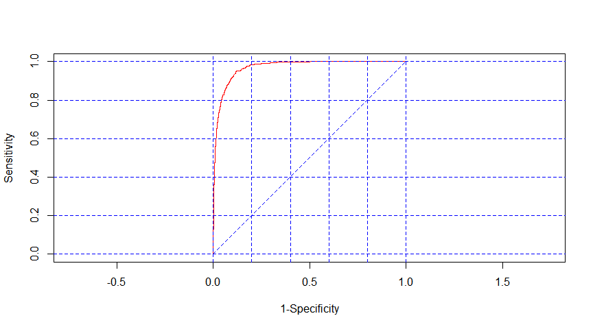

Classification of Homeless Deaths with Machine Learning
================
MBG
December 29, 2018

-   [READ AND SUBSET DATA](#read-and-subset-data)
-   [SPLIT DATA INTO TRAINING AND TESTING SUBSETS](#split-data-into-training-and-testing-subsets)
-   [CREATE MODEL](#create-model)
-   [APPLY MODEL 1 TO THE TEST DATA SET TO EVALUATE MODEL](#apply-model-1-to-the-test-data-set-to-evaluate-model)
-   [Out of sample AUC](#out-of-sample-auc)

    ## Warning: package 'epiDisplay' was built under R version 3.5.2

### READ AND SUBSET DATA

I created two versions of the dataset containing my dependent and independent variables. The first one includes "unknown" values as valid levels in factor variables and the second one recodes them to NAs.

``` r
homeless <- read.csv("HomelessFinal.csv")
str(homeless)
```

    ## 'data.frame':    175391 obs. of  29 variables:
    ##  $ X          : int  1 2 3 4 5 6 7 8 9 10 ...
    ##  $ certno     : int  2017019289 2014057047 2017016040 2010070278 2016052688 2015064867 2011073979 2004023773 2013045577 2013065733 ...
    ##  $ dcounty    : Factor w/ 1 level "KING": 1 1 1 1 1 1 1 1 1 1 ...
    ##  $ attclass   : int  2 2 2 2 2 2 2 1 2 2 ...
    ##  $ sex        : Factor w/ 3 levels "F","M","U": 2 2 2 1 2 1 2 2 2 2 ...
    ##  $ brgrace    : int  2 1 1 1 2 8 1 1 15 15 ...
    ##  $ hispanic   : Factor w/ 2 levels "N","Y": 2 2 1 2 2 2 2 2 1 1 ...
    ##  $ manner     : Factor w/ 6 levels "Accident","Homicide",..: 1 6 1 1 1 1 1 3 1 6 ...
    ##  $ rcounty    : Factor w/ 103 levels "ADAMS","ALAMEDA",..: 102 39 39 92 81 39 7 39 39 NA ...
    ##  $ rcity      : Factor w/ 468 levels "ABERDEEN","ACME",..: 464 188 369 430 265 369 25 369 13 NA ...
    ##  $ rstateFIPS : Factor w/ 29 levels "AK","AL","AZ",..: 26 26 26 29 26 26 8 26 26 26 ...
    ##  $ rzip       : Factor w/ 658 levels "00000","02574",..: 527 102 161 656 123 656 29 207 59 656 ...
    ##  $ dcity      : Factor w/ 67 levels "ALGONA","AUBURN",..: 54 29 54 27 54 54 29 54 28 54 ...
    ##  $ dplacecode : Factor w/ 10 levels "ER","Home","Hospice",..: 8 8 9 8 8 2 8 5 8 8 ...
    ##  $ dthyr      : int  2017 2014 2017 2010 2016 2015 2011 2004 2013 2013 ...
    ##  $ UCOD       : Factor w/ 2257 levels "A020","A021",..: 2148 1940 2145 2148 2001 2148 2142 1334 2111 1940 ...
    ##  $ educ       : Factor w/ 9 levels "<=8th grade",..: 6 9 3 9 6 8 2 9 6 6 ...
    ##  $ marital    : Factor w/ 7 levels "A","D","M","P",..: 5 6 5 2 1 5 2 5 5 5 ...
    ##  $ occupcode  : num  15 999 401 999 196 997 999 999 964 962 ...
    ##  $ age5cat    : Factor w/ 5 levels "<18yrs","18-29yrs",..: 3 3 4 4 3 3 3 4 2 4 ...
    ##  $ LCOD       : Factor w/ 11 levels "Alzheimers","Cancer",..: 8 9 8 8 8 8 8 3 8 9 ...
    ##  $ injury     : Factor w/ 5 levels "MV - all","No injury",..: 5 2 5 5 1 5 3 2 3 2 ...
    ##  $ substance  : Factor w/ 3 levels "Alcohol-induced",..: 2 3 2 2 3 2 3 1 3 3 ...
    ##  $ residence  : Factor w/ 2 levels "Out of state",..: 2 2 2 NA 2 2 1 2 2 2 ...
    ##  $ raceethnic5: Factor w/ 7 levels "AIAN NH","Asian/PI NH",..: 3 7 4 7 3 2 7 7 4 4 ...
    ##  $ raceethnic6: Factor w/ 8 levels "AIAN NH","Asian",..: 3 8 4 8 3 2 8 8 4 4 ...
    ##  $ CODliteral : Factor w/ 135171 levels "\"PRIMARY PNEUMONIA\" ADVANCED DEMENTIA    ",..: 47991 131641 4884 2044 125309 2238 69746 22060 57053 89066 ...
    ##  $ military   : Factor w/ 3 levels "N","U","Y": 1 2 1 1 1 1 1 2 1 1 ...
    ##  $ status     : Factor w/ 2 levels "Homeless","With home": 1 1 1 1 1 1 1 1 1 1 ...

``` r
h1 <- subset(homeless, select= c("sex", "raceethnic5", "manner", "dplacecode", "educ", "age5cat", "LCOD", "status", "injury", "substance"))
summary(h1)
```

    ##  sex            raceethnic5              manner      
    ##  F:87741   AIAN NH    :  1566   Accident    : 10439  
    ##  M:87646   Asian/PI NH: 12738   Homicide    :   982  
    ##  U:    4   Black NH   :  8988   Natural     :159965  
    ##            Hispanic   :  4117   Pending     :     1  
    ##            Other      :  1488   Suicide     :  3259  
    ##            Unknown    : 12177   Undetermined:   722  
    ##            White NH   :134317   NA's        :    23  
    ##                       dplacecode                        educ      
    ##  Hospital inpatient        :61983   H.S. grad/GED         :57646  
    ##  Home                      :49495   Some college          :28505  
    ##  Nursing home/Longterm care:47574   Bachelors             :26713  
    ##  Other                     : 6963   Unknown               :14861  
    ##  Hospice                   : 6005   <=8th grade           :12424  
    ##  ER                        : 3228   9-12th gr., no diploma:11353  
    ##  (Other)                   :  143   (Other)               :23889  
    ##      age5cat                         LCOD             status      
    ##  <18yrs  :  3076   Other               :47641   Homeless :  1093  
    ##  18-29yrs:  3083   Cancer              :38618   With home:174298  
    ##  30-44yrs:  6742   Heart Dis.          :36375                     
    ##  45-64yrs: 33704   Alzheimers          :10659                     
    ##  65+ yrs :128767   Stroke              :10368                     
    ##  NA's    :    19   Injury-unintentional: 9895                     
    ##                    (Other)             :21835                     
    ##                      injury                    substance     
    ##  MV - all               :  2079   Alcohol-induced   :  2831  
    ##  No injury              :165484   Drug-induced      :  3692  
    ##  Other injury           :  1571   No Substance abuse:168868  
    ##  Unintentional fall     :  2997                              
    ##  Unintentional poisoning:  3260                              
    ##                                                              
    ## 

``` r
h1$homeless[h1$status=="Homeless"] <- 1
h1$homeless[h1$status=="With home"] <- 0

h1$homeless <- factor(h1$homeless)

h2 <- h1

levels(h2$sex)[levels(h2$sex)=="U"] <- NA
levels(h2$raceethnic5)[6] <- NA
levels(h2$manner)[4] <- NA
levels(h2$educ)[4] <- NA
summary(h2)
```

    ##    sex             raceethnic5              manner      
    ##  F   :87741   AIAN NH    :  1566   Accident    : 10439  
    ##  M   :87646   Asian/PI NH: 12738   Homicide    :   982  
    ##  NA's:    4   Black NH   :  8988   Natural     :159965  
    ##               Hispanic   :  4117   Suicide     :  3259  
    ##               Other      :  1488   Undetermined:   722  
    ##               White NH   :134317   NA's        :    24  
    ##               NA's       : 12177                        
    ##                       dplacecode                        educ      
    ##  Hospital inpatient        :61983   H.S. grad/GED         :57646  
    ##  Home                      :49495   Some college          :28505  
    ##  Nursing home/Longterm care:47574   Unknown               :14861  
    ##  Other                     : 6963   <=8th grade           :12424  
    ##  Hospice                   : 6005   9-12th gr., no diploma:11353  
    ##  ER                        : 3228   (Other)               :23889  
    ##  (Other)                   :  143   NA's                  :26713  
    ##      age5cat                         LCOD             status      
    ##  <18yrs  :  3076   Other               :47641   Homeless :  1093  
    ##  18-29yrs:  3083   Cancer              :38618   With home:174298  
    ##  30-44yrs:  6742   Heart Dis.          :36375                     
    ##  45-64yrs: 33704   Alzheimers          :10659                     
    ##  65+ yrs :128767   Stroke              :10368                     
    ##  NA's    :    19   Injury-unintentional: 9895                     
    ##                    (Other)             :21835                     
    ##                      injury                    substance      homeless  
    ##  MV - all               :  2079   Alcohol-induced   :  2831   0:174298  
    ##  No injury              :165484   Drug-induced      :  3692   1:  1093  
    ##  Other injury           :  1571   No Substance abuse:168868             
    ##  Unintentional fall     :  2997                                         
    ##  Unintentional poisoning:  3260                                         
    ##                                                                         
    ## 

### SPLIT DATA INTO TRAINING AND TESTING SUBSETS

``` r
split = sample.split(h2$homeless, SplitRatio = 0.65)
HTrain = subset(h2, split==TRUE)
HTest = subset(h2, split==FALSE)
```

### CREATE MODEL

In this attempt I use the dataset that does not retain "unknown" values as valid levels in factor variables.

I specified the reference categories in each factor variable within the model.

``` r
HTrain$sex <- relevel(HTrain$sex, ref = "F")
HTrain$raceethnic5 <-relevel(HTrain$raceethnic5, ref = "White NH")
HTrain$manner <- relevel(HTrain$manner, ref = "Natural")
HTrain$dplacecode <- relevel(HTrain$dplacecode, ref = "Home")
HTrain$edu <- relevel(HTrain$educ, ref =  "<=8th grade")
HTrain$age5cat <- relevel(HTrain$age5cat, ref = "65+ yrs")
HTrain$injury <- relevel(HTrain$injury, ref = "No injury")
HTrain$substance <- relevel(HTrain$substance, ref = "No Substance abuse")
HTrain$LCOD <- relevel(HTrain$LCOD, ref = "Other")

## model 1 with all independent variables included
LR1 <- glm(homeless ~ sex + raceethnic5 + manner + dplacecode + educ + age5cat + injury + substance + LCOD, data = HTrain, family = "binomial")
```

    ## Warning: glm.fit: fitted probabilities numerically 0 or 1 occurred

``` r
summary(LR1)
```

    ## 
    ## Call:
    ## glm(formula = homeless ~ sex + raceethnic5 + manner + dplacecode + 
    ##     educ + age5cat + injury + substance + LCOD, family = "binomial", 
    ##     data = HTrain)
    ## 
    ## Deviance Residuals: 
    ##     Min       1Q   Median       3Q      Max  
    ## -2.0912  -0.0589  -0.0320  -0.0190   3.8927  
    ## 
    ## Coefficients:
    ##                                        Estimate Std. Error z value
    ## (Intercept)                            -8.52076    0.31800 -26.795
    ## sexM                                    0.65687    0.11320   5.803
    ## raceethnic5AIAN NH                      1.06605    0.19336   5.513
    ## raceethnic5Asian/PI NH                 -0.94556    0.28691  -3.296
    ## raceethnic5Black NH                     0.34253    0.13169   2.601
    ## raceethnic5Hispanic                     0.23594    0.16741   1.409
    ## raceethnic5Other                        0.48289    0.30106   1.604
    ## mannerAccident                          0.73534    0.36839   1.996
    ## mannerHomicide                          1.14017    0.24684   4.619
    ## mannerSuicide                           2.11853    3.71992   0.570
    ## mannerUndetermined                      1.25251    0.26365   4.751
    ## dplacecodeER                            1.88343    0.25571   7.366
    ## dplacecodeHospice                       0.93426    0.53055   1.761
    ## dplacecodeHospital                    -13.09072 2876.59449  -0.005
    ## dplacecodeHospital inpatient            1.43041    0.16383   8.731
    ## dplacecodeIn transport                -15.29841 2427.70493  -0.006
    ## dplacecodeNursing home/Longterm care    0.89064    0.25620   3.476
    ## dplacecodeOther                         3.27985    0.15477  21.192
    ## dplacecodeOther person's home         -10.88029 9619.19593  -0.001
    ## dplacecodeUnknown                     -17.36734 7988.58410  -0.002
    ## educ9-12th gr., no diploma              0.43357    0.24545   1.766
    ## educAssociate's                        -0.94765    0.33013  -2.871
    ## educDoctorate/Professional             -2.04846    1.02968  -1.989
    ## educH.S. grad/GED                      -0.08155    0.23449  -0.348
    ## educMasters                            -1.38016    0.47193  -2.924
    ## educSome college                       -0.60298    0.25594  -2.356
    ## educUnknown                             2.14720    0.24415   8.795
    ## age5cat<18yrs                         -14.48359  387.11955  -0.037
    ## age5cat18-29yrs                         1.22640    0.22943   5.345
    ## age5cat30-44yrs                         2.03903    0.18360  11.106
    ## age5cat45-64yrs                         2.01046    0.15819  12.709
    ## injuryMV - all                          1.98913    0.92443   2.152
    ## injuryOther injury                      2.72473    0.96535   2.823
    ## injuryUnintentional fall                2.11896    1.00462   2.109
    ## injuryUnintentional poisoning           2.85730    0.96898   2.949
    ## substanceAlcohol-induced                1.25079    0.29573   4.230
    ## substanceDrug-induced                   0.82347    0.25157   3.273
    ## LCODAlzheimers                        -13.28576  227.59893  -0.058
    ## LCODCancer                             -0.80632    0.25398  -3.175
    ## LCODChronic Liver dis./cirrh.          -0.17774    0.33371  -0.533
    ## LCODChronic Lwr Resp Dis.              -0.92468    0.52611  -1.758
    ## LCODDiabetes                            0.22505    0.34236   0.657
    ## LCODFlu                                 1.18525    0.31127   3.808
    ## LCODHeart Dis.                          0.36935    0.16958   2.178
    ## LCODInjury-unintentional               -2.29338    1.00783  -2.276
    ## LCODStroke                             -0.67217    0.42950  -1.565
    ## LCODSuicide-all                        -1.39239    3.71951  -0.374
    ##                                      Pr(>|z|)    
    ## (Intercept)                           < 2e-16 ***
    ## sexM                                 6.52e-09 ***
    ## raceethnic5AIAN NH                   3.52e-08 ***
    ## raceethnic5Asian/PI NH               0.000982 ***
    ## raceethnic5Black NH                  0.009293 ** 
    ## raceethnic5Hispanic                  0.158741    
    ## raceethnic5Other                     0.108716    
    ## mannerAccident                       0.045927 *  
    ## mannerHomicide                       3.86e-06 ***
    ## mannerSuicide                        0.569011    
    ## mannerUndetermined                   2.03e-06 ***
    ## dplacecodeER                         1.76e-13 ***
    ## dplacecodeHospice                    0.078250 .  
    ## dplacecodeHospital                   0.996369    
    ## dplacecodeHospital inpatient          < 2e-16 ***
    ## dplacecodeIn transport               0.994972    
    ## dplacecodeNursing home/Longterm care 0.000508 ***
    ## dplacecodeOther                       < 2e-16 ***
    ## dplacecodeOther person's home        0.999098    
    ## dplacecodeUnknown                    0.998265    
    ## educ9-12th gr., no diploma           0.077325 .  
    ## educAssociate's                      0.004098 ** 
    ## educDoctorate/Professional           0.046655 *  
    ## educH.S. grad/GED                    0.728001    
    ## educMasters                          0.003450 ** 
    ## educSome college                     0.018474 *  
    ## educUnknown                           < 2e-16 ***
    ## age5cat<18yrs                        0.970155    
    ## age5cat18-29yrs                      9.02e-08 ***
    ## age5cat30-44yrs                       < 2e-16 ***
    ## age5cat45-64yrs                       < 2e-16 ***
    ## injuryMV - all                       0.031419 *  
    ## injuryOther injury                   0.004765 ** 
    ## injuryUnintentional fall             0.034926 *  
    ## injuryUnintentional poisoning        0.003190 ** 
    ## substanceAlcohol-induced             2.34e-05 ***
    ## substanceDrug-induced                0.001063 ** 
    ## LCODAlzheimers                       0.953451    
    ## LCODCancer                           0.001500 ** 
    ## LCODChronic Liver dis./cirrh.        0.594307    
    ## LCODChronic Lwr Resp Dis.            0.078821 .  
    ## LCODDiabetes                         0.510965    
    ## LCODFlu                              0.000140 ***
    ## LCODHeart Dis.                       0.029407 *  
    ## LCODInjury-unintentional             0.022873 *  
    ## LCODStroke                           0.117584    
    ## LCODSuicide-all                      0.708146    
    ## ---
    ## Signif. codes:  0 '***' 0.001 '**' 0.01 '*' 0.05 '.' 0.1 ' ' 1
    ## 
    ## (Dispersion parameter for binomial family taken to be 1)
    ## 
    ##     Null deviance: 7999.3  on 88741  degrees of freedom
    ## Residual deviance: 4403.5  on 88695  degrees of freedom
    ##   (25262 observations deleted due to missingness)
    ## AIC: 4497.5
    ## 
    ## Number of Fisher Scoring iterations: 19

``` r
LR1tab <- coef(summary(LR1))
LR1tab[, "Estimate"] <- exp(coef(LR1))
LR1tab
```

    ##                                          Estimate   Std. Error
    ## (Intercept)                          1.992875e-04    0.3179974
    ## sexM                                 1.928743e+00    0.1131966
    ## raceethnic5AIAN NH                   2.903894e+00    0.1933552
    ## raceethnic5Asian/PI NH               3.884636e-01    0.2869124
    ## raceethnic5Black NH                  1.408511e+00    0.1316880
    ## raceethnic5Hispanic                  1.266094e+00    0.1674120
    ## raceethnic5Other                     1.620755e+00    0.3010567
    ## mannerAccident                       2.086185e+00    0.3683940
    ## mannerHomicide                       3.127293e+00    0.2468411
    ## mannerSuicide                        8.318895e+00    3.7199217
    ## mannerUndetermined                   3.499130e+00    0.2636486
    ## dplacecodeER                         6.576027e+00    0.2557057
    ## dplacecodeHospice                    2.545329e+00    0.5305485
    ## dplacecodeHospital                   2.064292e-06 2876.5944859
    ## dplacecodeHospital inpatient         4.180395e+00    0.1638335
    ## dplacecodeIn transport               2.269793e-07 2427.7049275
    ## dplacecodeNursing home/Longterm care 2.436687e+00    0.2562008
    ## dplacecodeOther                      2.657182e+01    0.1547713
    ## dplacecodeOther person's home        1.882572e-05 9619.1959274
    ## dplacecodeUnknown                    2.867221e-08 7988.5841007
    ## educ9-12th gr., no diploma           1.542753e+00    0.2454503
    ## educAssociate's                      3.876519e-01    0.3301273
    ## educDoctorate/Professional           1.289334e-01    1.0296758
    ## educH.S. grad/GED                    9.216832e-01    0.2344942
    ## educMasters                          2.515391e-01    0.4719342
    ## educSome college                     5.471771e-01    0.2559382
    ## educUnknown                          8.560818e+00    0.2441493
    ## age5cat<18yrs                        5.126947e-07  387.1195544
    ## age5cat18-29yrs                      3.408942e+00    0.2294276
    ## age5cat30-44yrs                      7.683124e+00    0.1836033
    ## age5cat45-64yrs                      7.466784e+00    0.1581926
    ## injuryMV - all                       7.309137e+00    0.9244337
    ## injuryOther injury                   1.525223e+01    0.9653467
    ## injuryUnintentional fall             8.322477e+00    1.0046200
    ## injuryUnintentional poisoning        1.741437e+01    0.9689771
    ## substanceAlcohol-induced             3.493111e+00    0.2957252
    ## substanceDrug-induced                2.278402e+00    0.2515739
    ## LCODAlzheimers                       1.698507e-06  227.5989313
    ## LCODCancer                           4.465001e-01    0.2539773
    ## LCODChronic Liver dis./cirrh.        8.371621e-01    0.3337141
    ## LCODChronic Lwr Resp Dis.            3.966589e-01    0.5261123
    ## LCODDiabetes                         1.252381e+00    0.3423610
    ## LCODFlu                              3.271493e+00    0.3112672
    ## LCODHeart Dis.                       1.446798e+00    0.1695844
    ## LCODInjury-unintentional             1.009246e-01    1.0078348
    ## LCODStroke                           5.106011e-01    0.4295010
    ## LCODSuicide-all                      2.484804e-01    3.7195125
    ##                                            z value      Pr(>|z|)
    ## (Intercept)                          -26.795071887 3.688090e-158
    ## sexM                                   5.802901584  6.517705e-09
    ## raceethnic5AIAN NH                     5.513440065  3.518869e-08
    ## raceethnic5Asian/PI NH                -3.295625839  9.820271e-04
    ## raceethnic5Black NH                    2.601096245  9.292638e-03
    ## raceethnic5Hispanic                    1.409317025  1.587414e-01
    ## raceethnic5Other                       1.603990586  1.087161e-01
    ## mannerAccident                         1.996062184  4.592715e-02
    ## mannerHomicide                         4.619035186  3.855285e-06
    ## mannerSuicide                          0.569509139  5.690107e-01
    ## mannerUndetermined                     4.750697079  2.027166e-06
    ## dplacecodeER                           7.365620562  1.763247e-13
    ## dplacecodeHospice                      1.760932185  7.824988e-02
    ## dplacecodeHospital                    -0.004550771  9.963690e-01
    ## dplacecodeHospital inpatient           8.730852087  2.527611e-18
    ## dplacecodeIn transport                -0.006301592  9.949721e-01
    ## dplacecodeNursing home/Longterm care   3.476333220  5.083203e-04
    ## dplacecodeOther                       21.191592600  1.141697e-99
    ## dplacecodeOther person's home         -0.001131101  9.990975e-01
    ## dplacecodeUnknown                     -0.002174019  9.982654e-01
    ## educ9-12th gr., no diploma             1.766420126  7.732539e-02
    ## educAssociate's                       -2.870551200  4.097568e-03
    ## educDoctorate/Professional            -1.989421931  4.665465e-02
    ## educH.S. grad/GED                     -0.347785694  7.280011e-01
    ## educMasters                           -2.924468653  3.450448e-03
    ## educSome college                      -2.355970578  1.847438e-02
    ## educUnknown                            8.794602087  1.435558e-18
    ## age5cat<18yrs                         -0.037413727  9.701551e-01
    ## age5cat18-29yrs                        5.345486943  9.017430e-08
    ## age5cat30-44yrs                       11.105606533  1.178147e-28
    ## age5cat45-64yrs                       12.708967347  5.272610e-37
    ## injuryMV - all                         2.151722838  3.141919e-02
    ## injuryOther injury                     2.822535835  4.764550e-03
    ## injuryUnintentional fall               2.109215391  3.492599e-02
    ## injuryUnintentional poisoning          2.948775305  3.190358e-03
    ## substanceAlcohol-induced               4.229577644  2.341305e-05
    ## substanceDrug-induced                  3.273289896  1.063034e-03
    ## LCODAlzheimers                        -0.058373565  9.534511e-01
    ## LCODCancer                            -3.174755201  1.499630e-03
    ## LCODChronic Liver dis./cirrh.         -0.532604357  5.943075e-01
    ## LCODChronic Lwr Resp Dis.             -1.757568774  7.882091e-02
    ## LCODDiabetes                           0.657336127  5.109648e-01
    ## LCODFlu                                3.807810089  1.402029e-04
    ## LCODHeart Dis.                         2.177989801  2.940680e-02
    ## LCODInjury-unintentional              -2.275553075  2.287277e-02
    ## LCODStroke                            -1.564994192  1.175843e-01
    ## LCODSuicide-all                       -0.374347763  7.081456e-01

``` r
## ROC curve for model 1
lroc(LR1)
```



    ## $model.description
    ## [1] "homeless ~ sex + raceethnic5 + manner + dplacecode + educ + age5cat + "
    ## [2] "    injury + substance + LCOD"                                         
    ## 
    ## $auc
    ## [1] 0.9701931
    ## 
    ## $predicted.table
    ##  predicted.prob Non-diseased Diseased
    ##          2.2204            2        0
    ##          1.1378            1        0
    ##          1.2637            1        0
    ##          1.7535            1        0
    ##          1.7721            1        0
    ##          1.8615            1        0
    ##          1.9008            1        0
    ##          2.3431            1        0
    ##          3.1750            1        0
    ##          3.1896            1        0
    ##          3.2699            2        0
    ##          3.3075            4        0
    ##          3.9690            7        0
    ##          4.1310            1        0
    ##          4.1691            1        0
    ##          4.3642            2        0
    ##          4.5620           10        0
    ##          4.8931            2        0
    ##          5.0972            2        0
    ##          5.1934            1        0
    ##          5.7759            2        0
    ##          6.3793            5        0
    ##          6.4159            2        0
    ##          6.9067            3        0
    ##          7.0381            2        0
    ##          7.1949            1        0
    ##          7.6553            7        0
    ##          7.9677            1        0
    ##          8.0412            1        0
    ##          8.0594            3        0
    ##          8.3230            1        0
    ##          8.4175           14        0
    ##          8.4187            1        0
    ##          8.4720            1        0
    ##          8.4960            1        0
    ##          8.5143           25        0
    ##          8.7990            6        0
    ##          8.9109            1        0
    ##          1.0096            1        0
    ##          1.0217           33        0
    ##          1.0634           25        0
    ##          1.1075            1        0
    ##          1.1429            1        0
    ##          1.1485            1        0
    ##          1.1493            1        0
    ##          1.1634            1        0
    ##          1.1898            1        0
    ##          1.1992            2        0
    ##          1.2119           16        0
    ##          1.2393            2        0
    ##          1.2420            7        0
    ##          1.2657            2        0
    ##          1.2693            1        0
    ##          1.2796            1        0
    ##          1.2936            5        0
    ##          1.3121           38        0
    ##          1.3149           14        0
    ##          1.3574            3        0
    ##          1.3877            3        0
    ##          1.3888            1        0
    ##          1.4156            1        0
    ##          1.4261            1        0
    ##          1.4289            8        0
    ##          1.4391           10        0
    ##          1.4801            1        0
    ##          1.4978            2        0
    ##          1.5544            2        0
    ##          1.5727            2        0
    ##          1.5762            2        0
    ##          1.5947            1        0
    ##          1.6422           24        0
    ##          1.6559            7        0
    ##          1.6592           52        0
    ##          1.6621            1        0
    ##          1.6865            1        0
    ##          1.6929            1        0
    ##          1.6942            1        0
    ##          1.7531           14        0
    ##          1.8132            1        0
    ##          1.8482            3        0
    ##          1.8521          100        0
    ##          1.9071            7        0
    ##          1.9149            2        0
    ##          1.9473            2        0
    ##          1.9706           35        0
    ##          1.9968            1        0
    ##          2.0127            1        0
    ##          2.0285            4        0
    ##          2.0511           76        0
    ##          2.0746          168        0
    ##          2.1120            1        0
    ##          2.1425            4        0
    ##          2.1598            1        0
    ##          2.1671            6        0
    ##          2.1809            1        0
    ##          2.2254            1        0
    ##          2.3130            1        0
    ##          2.3375            6        0
    ##          2.3449            1        0
    ##          2.3707            1        0
    ##          2.3955            3        0
    ##          2.4005            3        0
    ##          2.4145            7        0
    ##          2.4412            1        0
    ##          2.4583            1        0
    ##          2.4896            2        0
    ##          2.4950            7        0
    ##          2.5024            1        0
    ##          2.5044            1        0
    ##          2.5147            1        0
    ##          2.5209            1        0
    ##          2.5308            9        0
    ##          2.5361            3        0
    ##          2.5629            1        0
    ##          2.5635            1        0
    ##          2.6030            1        0
    ##          2.6087            6        0
    ##          2.6100            3        0
    ##          2.6267            1        0
    ##          2.6786            2        0
    ##          2.6861            1        0
    ##          2.7612            1        0
    ##          2.7757            8        0
    ##          2.8511            1        0
    ##          2.8874            1        0
    ##          2.9244            1        0
    ##          2.9422            1        0
    ##          2.9531           46        0
    ##          2.9670            2        0
    ##          2.9792            1        0
    ##          3.0334            1        0
    ##          3.0402            1        0
    ##          3.0718            1        0
    ##          3.0909            3        0
    ##          3.1198          236        0
    ##          3.1939            4        0
    ##          3.1952            1        0
    ##          3.1973          206        0
    ##          3.2002           59        0
    ##          3.2040           26        0
    ##          3.2567            1        0
    ##          3.2583            1        0
    ##          3.2587            1        0
    ##          3.2653            1        0
    ##          3.2811            3        0
    ##          3.3398            7        0
    ##          3.3426            2        0
    ##          3.3468            3        0
    ##          3.3625            1        0
    ##          3.3646            1        0
    ##          3.3814            1        0
    ##          3.3849           23        0
    ##          3.3902            1        0
    ##          3.3978            1        0
    ##          3.4725            1        0
    ##          3.5188            8        0
    ##          3.5321            1        0
    ##          3.5593            6        0
    ##          3.5647            1        0
    ##          3.5723           62        0
    ##          3.5751            5        0
    ##          3.6783           15        0
    ##          3.7251            3        0
    ##          3.7341            1        0
    ##          3.7916            1        0
    ##          3.8521            1        0
    ##          3.9126            1        0
    ##          3.9499            2        0
    ##          3.9702            1        0
    ##          4.0015          115        0
    ##          4.0158            1        0
    ##          4.0455            1        0
    ##          4.0481            3        0
    ##          4.0735            4        0
    ##          4.1253            1        0
    ##          4.1372            2        0
    ##          4.1799            9        0
    ##          4.2064            8        0
    ##          4.2407            1        0
    ##          4.2599            1        0
    ##          4.2712          227        0
    ##          4.2856            1        0
    ##          4.3416            2        0
    ##          4.3942           14        0
    ##          4.5005            2        0
    ##          4.5034            5        0
    ##          4.5131          489        0
    ##          4.5228            1        0
    ##          4.5265            2        0
    ##          4.5272            1        0
    ##          4.5885            1        0
    ##          4.5893            1        0
    ##          4.6026            1        0
    ##          4.6214            4        0
    ##          4.6571            7        0
    ##          4.7080            1        0
    ##          4.7143           11        0
    ##          4.7676           12        0
    ##          4.8019            1        0
    ##          4.9248            2        0
    ##          4.9430            4        0
    ##          5.0316            1        0
    ##          5.0341            3        0
    ##          5.0356            5        0
    ##          5.0564            2        0
    ##          5.0663            3        0
    ##          5.1571            2        0
    ##          5.1787            1        0
    ##          5.1809            4        0
    ##          5.1821            1        0
    ##          5.2220           42        0
    ##          5.2809            1        0
    ##          5.3257            2        0
    ##          5.4078          120        0
    ##          5.4853            9        0
    ##          5.4858            2        0
    ##          5.4968            2        0
    ##          5.6076            2        0
    ##          5.6362            1        0
    ##          5.6747            4        0
    ##          5.6957           19        0
    ##          5.7140            6        0
    ##          5.7376            1        0
    ##          5.7862            1        0
    ##          5.7945            3        0
    ##          5.8011            3        0
    ##          5.8058            1        0
    ##          5.9616            1        0
    ##          6.0161           52        0
    ##          6.0173           62        0
    ##          6.1152            1        0
    ##          6.1628            2        0
    ##          6.1668           48        0
    ##          6.1796            3        0
    ##          6.1797            3        0
    ##          6.2844            7        0
    ##          6.3284            5        0
    ##          6.3567           15        0
    ##          6.4418            1        0
    ##          6.4470            2        0
    ##          6.4552            1        0
    ##          6.4937            1        0
    ##          6.5085            1        0
    ##          6.5286           21        0
    ##          6.5731            3        0
    ##          6.5895            7        0
    ##          6.6116            1        0
    ##          6.6225            1        0
    ##          6.6702            1        0
    ##          6.7189            4        0
    ##          6.8650           11        0
    ##          6.8956            9        0
    ##          6.9226           42        0
    ##          6.9450            1        0
    ##          7.0615            1        0
    ##          7.1847            1        0
    ##          7.2834            1        0
    ##          7.3131            1        0
    ##          7.3553            2        0
    ##          7.4081            1        0
    ##          7.5326            1        0
    ##          7.6020         1297        0
    ##          7.6184            1        0
    ##          7.7427           39        0
    ##          7.8027            2        0
    ##          7.8078            2        0
    ##          7.8240            2        0
    ##          7.9409           62        0
    ##          7.9567            1        0
    ##          8.1624            1        0
    ##          8.2381          293        0
    ##          8.2479          174        0
    ##          8.3222            3        0
    ##          8.3429            3        0
    ##          8.3479            1        0
    ##          8.3817            1        0
    ##          8.4754            1        0
    ##          8.5068            2        0
    ##          8.5542            1        0
    ##          8.6157            2        0
    ##          8.6288            1        0
    ##          8.6860            4        0
    ##          8.6887            1        0
    ##          8.7041            2        0
    ##          8.7046          181        0
    ##          8.7116            1        0
    ##          8.7305            2        0
    ##          8.7469            1        0
    ##          8.8290            1        0
    ##          8.8808            1        0
    ##          8.9136            1        0
    ##          9.0596            1        0
    ##          9.0807            1        0
    ##          9.0927           12        0
    ##          9.1329            1        0
    ##          9.2583            1        0
    ##          9.2787            1        0
    ##          9.4817            1        0
    ##          9.5280            1        0
    ##          9.5336            1        0
    ##          9.5338            7        0
    ##          9.5370            1        0
    ##          9.6248           13        0
    ##          9.6695            1        0
    ##          9.7125            3        0
    ##          9.7717            4        0
    ##          9.7976            1        0
    ##          9.8029            1        0
    ##          1.0015            1        0
    ##          1.0054            1        0
    ##          1.0072           10        0
    ##          1.0140            1        0
    ##          1.0185            2        0
    ##          1.0256            2        0
    ##          1.0276            1        0
    ##          1.0339            1        0
    ##          1.0430          141        0
    ##          1.0442            9        0
    ##          1.0449            1        0
    ##          1.0579            5        0
    ##          1.0580            1        0
    ##          1.0602            1        0
    ##          1.0618            1        0
    ##          1.0656            1        0
    ##          1.0681            1        0
    ##          1.0707           29        0
    ##          1.0799            1        0
    ##          1.0810            1        0
    ##          1.0889            1        0
    ##          1.0894            2        0
    ##          1.0905            1        0
    ##          1.1020            3        0
    ##          1.1074            1        0
    ##          1.1176            4        0
    ##          1.1178            2        0
    ##          1.1184            1        0
    ##          1.1256            3        0
    ##          1.1281            2        0
    ##          1.1443            1        0
    ##          1.1603           54        0
    ##          1.1617           13        0
    ##          1.1890            1        0
    ##          1.1907            1        0
    ##          1.1918            5        0
    ##          1.2122            1        0
    ##          1.2179            2        0
    ##          1.2260            6        0
    ##          1.2320            1        0
    ##          1.2321            4        0
    ##          1.2403            8        0
    ##          1.2593            1        0
    ##          1.2677            8        0
    ##          1.2709            8        0
    ##          1.2724          184        0
    ##          1.2839            1        0
    ##          1.2870            1        0
    ##          1.2959            6        0
    ##          1.3042           88        0
    ##          1.3105            4        0
    ##          1.3291            2        0
    ##          1.3352           55        0
    ##          1.3357            3        0
    ##          1.3367            2        0
    ##          1.3621            2        0
    ##          1.3716            9        0
    ##          1.3751            1        0
    ##          1.3973            1        0
    ##          1.4108            1        0
    ##          1.4150            8        0
    ##          1.4186            2        0
    ##          1.4204            1        0
    ##          1.4435            1        0
    ##          1.4441            1        0
    ##          1.4662          347        0
    ##          1.4718            1        0
    ##          1.4901            1        0
    ##          1.4909            1        0
    ##          1.4933           32        0
    ##          1.4945            2        0
    ##          1.5090            2        0
    ##          1.5164            1        0
    ##          1.5315            2        0
    ##          1.5316           15        0
    ##          1.5439            1        0
    ##          1.5491            1        0
    ##          1.5695            1        0
    ##          1.5755            1        0
    ##          1.5859            5        0
    ##          1.5908           72        0
    ##          1.6091            2        0
    ##          1.6110            3        0
    ##          1.6230            1        0
    ##          1.6407            2        0
    ##          1.6462            1        0
    ##          1.6566            1        0
    ##          1.6583            2        0
    ##          1.6617            4        0
    ##          1.6758            1        0
    ##          1.6788            1        0
    ##          1.6911            2        0
    ##          1.7366            3        0
    ##          1.7453            1        0
    ##          1.7681            1        0
    ##          1.7710            1        0
    ##          1.7856            2        0
    ##          1.7861            1        0
    ##          1.7915            1        0
    ##          1.7922            7        0
    ##          1.8066            1        0
    ##          1.8159            1        0
    ##          1.8253            2        0
    ##          1.8369            2        0
    ##          1.8388            1        0
    ##          1.8563            6        0
    ##          1.8907            1        0
    ##          1.8922            4        0
    ##          1.9185            1        0
    ##          1.9319            2        0
    ##          1.9391            1        0
    ##          1.9558            7        0
    ##          1.9840            1        0
    ##          1.9891            1        0
    ##          1.9930            2        0
    ##          1.9943            1        0
    ##          1.9992            2        0
    ##          2.0024            1        0
    ##          2.0093            1        0
    ##          2.0141            3        0
    ##          2.0341            2        0
    ##          2.0515            4        0
    ##          2.0623            1        0
    ##          2.0652           17        0
    ##          2.1034            1        0
    ##          2.1160            1        0
    ##          2.1359            1        0
    ##          2.1560            1        0
    ##          2.1576            2        0
    ##          2.1711            1        0
    ##          2.1719            1        0
    ##          2.1785            1        0
    ##          2.1830           11        0
    ##          2.2075            6        0
    ##          2.2259            1        0
    ##          2.2270            1        0
    ##          2.2367            2        0
    ##          2.2406           10        0
    ##          2.2624            6        0
    ##          2.3294            2        0
    ##          2.3405            2        0
    ##          2.3764            1        0
    ##          2.3873            2        0
    ##          2.3922           10        0
    ##          2.4542           60        0
    ##          2.4763            1        0
    ##          2.5154           58        0
    ##          2.5249            1        0
    ##          2.5277            3        0
    ##          2.5397            2        0
    ##          2.5577            1        0
    ##          2.5636            2        0
    ##          2.5763            4        0
    ##          2.5783            1        0
    ##          2.6243            1        0
    ##          2.6271            5        0
    ##          2.6408            1        0
    ##          2.6455           12        0
    ##          2.6576            2        0
    ##          2.6603            2        0
    ##          2.6951            2        0
    ##          2.7149            4        0
    ##          2.7208            2        0
    ##          2.7292            9        0
    ##          2.7318            1        0
    ##          2.7396            2        0
    ##          2.7429            1        0
    ##          2.7729            1        0
    ##          2.7854            1        0
    ##          2.7944            1        0
    ##          2.8826            5        0
    ##          2.8977            5        0
    ##          2.9025            1        0
    ##          2.9447            1        0
    ##          2.9595            1        0
    ##          2.9878            3        0
    ##          3.0399            1        0
    ##          3.0588            2        0
    ##          3.0767            1        0
    ##          3.1073            1        0
    ##          3.1104            1        0
    ##          3.1489            2        0
    ##          3.2203            3        0
    ##          3.2331            1        0
    ##          3.2418            1        0
    ##          3.2618            3        0
    ##          3.3187            1        0
    ##          3.3494            2        0
    ##          3.3632            1        0
    ##          3.3698            5        0
    ##          3.4122            1        0
    ##          3.4340            3        0
    ##          3.4554            1        0
    ##          3.4568            4        0
    ##          3.4611            1        0
    ##          3.4866            7        0
    ##          3.4872            1        0
    ##          3.5200            1        0
    ##          3.5381            1        0
    ##          3.5430            1        0
    ##          3.6287            2        0
    ##          3.6496            2        0
    ##          3.6565            6        0
    ##          3.6688            1        0
    ##          3.6950            1        0
    ##          3.7262            3        0
    ##          3.8240            1        0
    ##          3.8788            1        0
    ##          3.9746            1        0
    ##          3.9830            1        0
    ##          4.0602            3        0
    ##          4.0814            4        0
    ##          4.1163            2        0
    ##          4.1615            4        0
    ##          4.1780            3        0
    ##          4.2105            5        0
    ##          4.2224            1        0
    ##          4.2577            4        0
    ##          4.2877            2        0
    ##          4.3636            8        0
    ##          4.3681            1        0
    ##          4.4144            1        0
    ##          4.4472            1        0
    ##          4.5345            1        0
    ##          4.6195            1        0
    ##          4.6295            1        0
    ##          4.8294            1        0
    ##          4.9214           18        0
    ##          5.0322            2        0
    ##          5.1336            1        0
    ##          5.1502            1        0
    ##          5.1674            1        0
    ##          5.2364            5        0
    ##          5.2689            1        0
    ##          5.2903            1        0
    ##          5.3482            1        0
    ##          5.5890            1        0
    ##          5.5982            1        0
    ##          5.6120            1        0
    ##          5.6762            6        0
    ##          5.6779            1        0
    ##          5.6796            1        0
    ##          5.7487            2        0
    ##          5.9227            1        0
    ##          5.9305            1        0
    ##          6.1462            1        0
    ##          6.3870            1        0
    ##          6.4331            1        0
    ##          6.4336            1        0
    ##          6.4418            1        0
    ##          6.4457            1        0
    ##          6.4995            2        0
    ##          6.6149            1        0
    ##          6.6298            2        0
    ##          6.7248            2        0
    ##          6.7449            1        0
    ##          6.9319            1        0
    ##          7.0525            3        0
    ##          7.0609           39        0
    ##          7.3293            1        0
    ##          7.3757            1        0
    ##          8.0584            5        0
    ##          8.2899           68        0
    ##          8.3708            1        0
    ##          8.5143            1        0
    ##          8.6579            2        0
    ##          8.7979            1        0
    ##          8.9398            2        0
    ##          8.9943            5        0
    ##          9.1546            1        0
    ##          9.4922           10        0
    ##          9.5011            1        0
    ##          9.7382            1        0
    ##          9.9335            2        0
    ##          9.9454            9        0
    ##          1.0124            1        0
    ##          1.0426            1        0
    ##          1.0495            1        0
    ##          1.0565            1        0
    ##          1.0617            1        0
    ##          1.0825            1        0
    ##          1.0948            2        0
    ##          1.1350            1        0
    ##          1.1387            1        0
    ##          1.1430            1        0
    ##          1.1435            1        0
    ##          1.1541            1        0
    ##          1.1878            1        0
    ##          1.2002            1        0
    ##          1.2113            2        0
    ##          1.2432            8        0
    ##          1.2794            1        0
    ##          1.3060            1        0
    ##          1.3224            1        0
    ##          1.3369            1        0
    ##          1.3618           17        0
    ##          1.3876            3        0
    ##          1.4130            1        0
    ##          1.4155            1        0
    ##          1.4712            1        0
    ##          1.5420            1        0
    ##          1.5740            1        0
    ##          1.5989            9        0
    ##          1.6698            3        0
    ##          1.6815            2        0
    ##          1.7294            1        0
    ##          1.7347            2        0
    ##          1.7510            2        0
    ##          1.8322            2        0
    ##          1.8717            1        0
    ##          1.9182            1        0
    ##          2.0378            1        0
    ##          2.1689            1        0
    ##          2.2520            1        0
    ##          2.3065            2        0
    ##          2.3198            1        0
    ##          2.3364            2        0
    ##          2.3685            2        0
    ##          2.4503            1        0
    ##          2.5263            2        0
    ##          2.5914            1        0
    ##          2.6763            3        0
    ##          2.9696            1        0
    ##          3.1986            2        0
    ##          3.2582            1        0
    ##          3.2908            1        0
    ##          3.6753            1        0
    ##          3.9183            1        0
    ##          4.6588            1        0
    ##          5.2722            1        0
    ##          5.5073            1        0
    ##          6.7158            1        0
    ##          1.8802            1        0
    ##          2.9529            1        0
    ##          4.4567            2        0
    ##          7.6363            1        0
    ##          7.7241            1        0
    ##          8.5958           10        0
    ##          8.6946            6        0
    ##          9.8298            2        0
    ##          9.9813            1        0
    ##          1.0191            4        0
    ##          1.0859            2        0
    ##          1.1343            2        0
    ##          1.1472           34        0
    ##          1.1903            5        0
    ##          1.2418            1        0
    ##          1.3119            6        0
    ##          1.3399           17        0
    ##          1.4441            7        0
    ##          1.5323            3        0
    ##          1.6116            1        0
    ##          1.6159            2        0
    ##          1.6518            1        0
    ##          1.6550            1        0
    ##          1.6769           17        0
    ##          1.8630            2        0
    ##          1.8913           30        0
    ##          1.9177            3        0
    ##          1.9251            7        0
    ##          1.9472            4        0
    ##          1.9657           10        0
    ##          1.9883           21        0
    ##          2.0945            8        0
    ##          2.1185            4        0
    ##          2.1305            1        0
    ##          2.1628            5        0
    ##          2.1878            1        0
    ##          2.2127          186        0
    ##          2.2130            5        0
    ##          2.2381          193        0
    ##          2.2959            1        0
    ##          2.3933            1        0
    ##          2.3951            5        0
    ##          2.4109            1        0
    ##          2.4227            3        0
    ##          2.4321            6        0
    ##          2.4387            2        0
    ##          2.4834            4        0
    ##          2.5304           11        0
    ##          2.5595           16        0
    ##          2.5694           16        0
    ##          2.5843           20        0
    ##          2.7687            1        0
    ##          2.7852            7        0
    ##          2.7954           24        0
    ##          2.8005            2        0
    ##          2.8015            4        0
    ##          2.8172            5        0
    ##          2.8301            7        0
    ##          2.8337            1        0
    ##          2.9005            1        0
    ##          2.9201            6        0
    ##          2.9553            1        0
    ##          3.0009            7        0
    ##          3.0459            2        0
    ##          3.0642           36        0
    ##          3.0706           18        0
    ##          3.1166            3        0
    ##          3.1524            7        0
    ##          3.1858           84        0
    ##          3.1966            1        0
    ##          3.1967            5        0
    ##          3.2178            4        0
    ##          3.2289            1        0
    ##          3.2406            4        0
    ##          3.2649           12        0
    ##          3.3276            2        0
    ##          3.3314            1        0
    ##          3.4105            2        0
    ##          3.4240            1        0
    ##          3.4492          212        0
    ##          3.4565           79        0
    ##          3.5187            3        0
    ##          3.5640            1        0
    ##          3.5862            1        0
    ##          3.5932           13        0
    ##          3.6190            1        0
    ##          3.6275            1        0
    ##          3.6300            1        0
    ##          3.6346            5        0
    ##          3.6431           15        0
    ##          3.6478           30        0
    ##          3.7173           18        0
    ##          3.7336            8        0
    ##          3.7557           13        0
    ##          3.7583            3        0
    ##          3.7918            1        0
    ##          3.8349           21        0
    ##          3.9001            1        0
    ##          3.9374            1        0
    ##          3.9444           21        0
    ##          3.9527           18        0
    ##          3.9793            2        0
    ##          4.0861            5        0
    ##          4.0940            2        0
    ##          4.1091            8        0
    ##          4.1129            1        0
    ##          4.1479            1        0
    ##          4.1486            3        0
    ##          4.1563            3        0
    ##          4.1715            1        0
    ##          4.1724            2        0
    ##          4.1964            1        0
    ##          4.2358           15        0
    ##          4.2605            3        0
    ##          4.2683            1        0
    ##          4.3159            2        0
    ##          4.3168          264        0
    ##          4.3252           87        0
    ##          4.3417            4        0
    ##          4.3670            5        0
    ##          4.5022            1        0
    ##          4.5026            1        0
    ##          4.5323            1        0
    ##          4.6085           10        0
    ##          4.6727            4        0
    ##          4.6908            8        0
    ##          4.7035            6        0
    ##          4.7447            9        0
    ##          4.7897           12        0
    ##          4.7958           13        0
    ##          4.8139            1        0
    ##          4.8448           24        0
    ##          4.8582           14        0
    ##          4.8686          547        0
    ##          4.8810            1        0
    ##          4.8999            5        0
    ##          4.9365           17        0
    ##          4.9556          120        0
    ##          4.9760            1        0
    ##          5.0033            4        0
    ##          5.0126           97        0
    ##          5.0608            2        0
    ##          5.2358            1        0
    ##          5.2700            6        0
    ##          5.3048            3        0
    ##          5.3110            4        0
    ##          5.3324            8        0
    ##          5.3916           95        0
    ##          5.4336           15        0
    ##          5.4535          132        0
    ##          5.4585           15        0
    ##          5.4654            2        0
    ##          5.4760            2        0
    ##          5.4842            5        0
    ##          5.5557            1        0
    ##          5.5675           55        0
    ##          5.6012           15        0
    ##          5.6319           27        0
    ##          5.6967           25        0
    ##          5.7879           11        0
    ##          5.8436            1        0
    ##          5.8746            2        0
    ##          5.9100           20        0
    ##          5.9223           11        0
    ##          5.9730            1        0
    ##          6.0248            1        0
    ##          6.0801            5        0
    ##          6.0919            2        0
    ##          6.0979            4        0
    ##          6.1282           16        0
    ##          6.1444           80        0
    ##          6.1640            3        0
    ##          6.1655           32        0
    ##          6.2062           12        0
    ##          6.2071            1        0
    ##          6.2275            2        0
    ##          6.2364           52        0
    ##          6.2606           26        0
    ##          6.2742            3        0
    ##          6.2776           13        0
    ##          6.2971           10        0
    ##          6.3463            3        0
    ##          6.3924            1        0
    ##          6.4053            9        0
    ##          6.4179            4        0
    ##          6.4404            7        0
    ##          6.4670            3        0
    ##          6.4805            3        0
    ##          6.4884            1        0
    ##          6.4917           12        0
    ##          6.4991            1        0
    ##          6.5145            5        0
    ##          6.5397            1        0
    ##          6.5778            6        0
    ##          6.6039            1        0
    ##          6.6525          138        0
    ##          6.6664           38        0
    ##          6.6798            3        0
    ##          6.7548            1        0
    ##          6.7865            6        0
    ##          6.8239            1        0
    ##          6.8574           17        0
    ##          6.8645            5        0
    ##          6.8960            6        0
    ##          6.9046            2        0
    ##          6.9529            1        0
    ##          6.9799            2        0
    ##          7.0099            1        0
    ##          7.0100           13        0
    ##          7.0236            3        0
    ##          7.0264            9        0
    ##          7.0330            1        0
    ##          7.0489            1        0
    ##          7.0601            4        0
    ##          7.1347           59        0
    ##          7.1696           99        0
    ##          7.2010            1        0
    ##          7.2124            1        0
    ##          7.2485            6        0
    ##          7.2520          103        0
    ##          7.2852          261        0
    ##          7.3120           15        0
    ##          7.4524            1        0
    ##          7.4663           40        0
    ##          7.4819            9        0
    ##          7.5939            1        0
    ##          7.6075            5        0
    ##          7.6096            1        0
    ##          7.6234            3        0
    ##          7.6261            1        0
    ##          7.6281            1        0
    ##          7.6812            8        0
    ##          7.7248           97        0
    ##          7.7409           73        0
    ##          7.7624           55        0
    ##          7.7991            5        0
    ##          7.8060            1        0
    ##          7.8155            1        0
    ##          7.8405            2        0
    ##          7.8418            3        0
    ##          7.8575            1        0
    ##          7.8906            3        0
    ##          7.8961            1        0
    ##          7.9042           28        0
    ##          7.9061           12        0
    ##          7.9325            1        0
    ##          8.0163            6        0
    ##          8.0473           11        0
    ##          8.1080            1        0
    ##          8.1085            8        0
    ##          8.1239            1        0
    ##          8.1398            8        0
    ##          8.1695           18        0
    ##          8.2006         1074        0
    ##          8.2171           12        0
    ##          8.2193            1        0
    ##          8.2507            1        0
    ##          8.3115           21        0
    ##          8.3418           77        0
    ##          8.3737            8        0
    ##          8.4044          131        0
    ##          8.4219           42        0
    ##          8.4226            2        0
    ##          8.4695            1        0
    ##          8.5657           34        0
    ##          8.6832            4        0
    ##          8.6840            1        0
    ##          8.7022            1        0
    ##          8.7413            2        0
    ##          8.7790           40        0
    ##          8.7839            1        0
    ##          8.7974            6        0
    ##          8.8138            2        0
    ##          8.8179            1        0
    ##          8.8418            1        0
    ##          8.8767           29        0
    ##          8.8882           13        0
    ##          8.8973          100        0
    ##          8.8977            1        0
    ##          8.9353           21        0
    ##          8.9915            1        0
    ##          9.0052            1        0
    ##          9.0410           15        0
    ##          9.0576           16        0
    ##          9.0772            1        0
    ##          9.1280            4        0
    ##          9.1364            3        0
    ##          9.1510           11        0
    ##          9.2495          101        0
    ##          9.2725            3        0
    ##          9.2844            3        0
    ##          9.3440           18        0
    ##          9.3558           96        0
    ##          9.3699           10        0
    ##          9.3778          143        0
    ##          9.3899          485        0
    ##          9.4528            1        0
    ##          9.4614            1        0
    ##          9.4956            1        0
    ##          9.5970            1        0
    ##          9.6108           74        0
    ##          9.6309           22        0
    ##          9.6316            1        0
    ##          9.6368            1        0
    ##          9.6675          144        0
    ##          9.6742           22        0
    ##          9.6944           29        0
    ##          9.7606            9        0
    ##          9.7801            3        0
    ##          9.7953            1        0
    ##          9.9975            1        0
    ##          0.0001            4        0
    ##          0.0001            6        0
    ##          0.0001            2        0
    ##          0.0001            2        0
    ##          0.0001            2        0
    ##          0.0001            1        0
    ##          0.0001            2        0
    ##          0.0001            7        0
    ##          0.0001           27        0
    ##          0.0001            2        0
    ##          0.0001            6        0
    ##          0.0001            5        0
    ##          0.0001            8        0
    ##          0.0001           19        0
    ##          0.0001            3        0
    ##          0.0001           27        0
    ##          0.0001           74        0
    ##          0.0001            1        0
    ##          0.0001           12        0
    ##          0.0001          120        0
    ##          0.0001          141        0
    ##          0.0001           43        0
    ##          0.0001            4        0
    ##          0.0001            1        0
    ##          0.0001           46        0
    ##          0.0001            1        0
    ##          0.0001           42        0
    ##          0.0001           20        0
    ##          0.0001            3        0
    ##          0.0001            2        0
    ##          0.0001           11        0
    ##          0.0001            1        0
    ##          0.0001           10        0
    ##          0.0001          295        0
    ##          0.0001            1        0
    ##          0.0001           37        0
    ##          0.0001           16        0
    ##          0.0001            1        0
    ##          0.0001            1        0
    ##          0.0001            1        0
    ##          0.0001          122        0
    ##          0.0001           68        0
    ##          0.0001           10        0
    ##          0.0001            1        0
    ##          0.0001            2        0
    ##          0.0001            1        0
    ##          0.0001            1        0
    ##          0.0001           42        0
    ##          0.0001            1        0
    ##          0.0001            1        0
    ##          0.0001            7        0
    ##          0.0001            2        0
    ##          0.0001            1        0
    ##          0.0001            3        0
    ##          0.0001            2        0
    ##          0.0001            4        0
    ##          0.0001            1        0
    ##          0.0001           27        0
    ##          0.0001           17        0
    ##          0.0001            8        0
    ##          0.0001            1        0
    ##          0.0001          344        0
    ##          0.0001            8        0
    ##          0.0001            1        0
    ##          0.0001           20        0
    ##          0.0001            1        0
    ##          0.0001           40        0
    ##          0.0001            1        0
    ##          0.0001          126        0
    ##          0.0001           25        0
    ##          0.0001           47        0
    ##          0.0001          188        0
    ##          0.0001            1        0
    ##          0.0001            1        0
    ##          0.0001            8        0
    ##          0.0001            3        0
    ##          0.0001            1        0
    ##          0.0001          102        0
    ##          0.0001            1        0
    ##          0.0001            2        0
    ##          0.0001            1        0
    ##          0.0001            2        0
    ##          0.0001            8        0
    ##          0.0001           20        0
    ##          0.0001           11        0
    ##          0.0001            2        0
    ##          0.0001            2        0
    ##          0.0001           20        0
    ##          0.0001            1        0
    ##          0.0001           10        0
    ##          0.0001            1        0
    ##          0.0001            1        0
    ##          0.0001           43        0
    ##          0.0001            1        0
    ##          0.0001            1        0
    ##          0.0001            6        0
    ##          0.0001            1        0
    ##          0.0001            2        0
    ##          0.0001           10        0
    ##          0.0001            1        0
    ##          0.0001            1        0
    ##          0.0001            4        0
    ##          0.0001            7        0
    ##          0.0001           24        0
    ##          0.0001            2        0
    ##          0.0001            8        0
    ##          0.0001            7        0
    ##          0.0001            1        0
    ##          0.0001           49        0
    ##          0.0001            1        0
    ##          0.0001            2        0
    ##          0.0001            3        0
    ##          0.0001            4        0
    ##          0.0001            5        0
    ##          0.0001            2        0
    ##          0.0001          215        0
    ##          0.0001            1        0
    ##          0.0001            4        0
    ##          0.0001            1        0
    ##          0.0001           51        0
    ##          0.0001            1        0
    ##          0.0001          149        0
    ##          0.0001           53        0
    ##          0.0001            5        0
    ##          0.0001            1        0
    ##          0.0001            3        0
    ##          0.0001          187        0
    ##          0.0001          171        0
    ##          0.0001            1        0
    ##          0.0001            2        0
    ##          0.0001            9        0
    ##          0.0001           20        0
    ##          0.0001            2        0
    ##          0.0001            1        0
    ##          0.0001           29        0
    ##          0.0001            1        0
    ##          0.0001            2        0
    ##          0.0001            1        0
    ##          0.0001            1        0
    ##          0.0001            4        0
    ##          0.0001            1        0
    ##          0.0001           11        0
    ##          0.0001          101        0
    ##          0.0001            3        0
    ##          0.0001            7        0
    ##          0.0001           45        0
    ##          0.0001            2        0
    ##          0.0001            3        0
    ##          0.0001            1        0
    ##          0.0001            1        0
    ##          0.0001            1        0
    ##          0.0001            1        0
    ##          0.0001            3        0
    ##          0.0001            3        0
    ##          0.0001            1        0
    ##          0.0001            4        0
    ##          0.0001            4        0
    ##          0.0001            1        0
    ##          0.0001            2        0
    ##          0.0001            9        0
    ##          0.0001            2        0
    ##          0.0001           64        0
    ##          0.0001           22        0
    ##          0.0001           17        0
    ##          0.0001            4        0
    ##          0.0001           45        0
    ##          0.0001            4        0
    ##          0.0001            3        0
    ##          0.0001            1        0
    ##          0.0001            1        0
    ##          0.0001           16        0
    ##          0.0001            1        0
    ##          0.0001            2        0
    ##          0.0001            2        0
    ##          0.0001            6        0
    ##          0.0001           50        0
    ##          0.0001           40        0
    ##          0.0001           27        0
    ##          0.0001            2        0
    ##          0.0001           12        0
    ##          0.0001            1        0
    ##          0.0001           14        0
    ##          0.0001            8        0
    ##          0.0001            2        0
    ##          0.0001            5        0
    ##          0.0001            2        0
    ##          0.0001            1        0
    ##          0.0001           19        0
    ##          0.0001            1        0
    ##          0.0001            5        0
    ##          0.0001            1        0
    ##          0.0001            1        0
    ##          0.0001           22        0
    ##          0.0001           18        0
    ##          0.0001            1        0
    ##          0.0001            7        0
    ##          0.0001          354        0
    ##          0.0001            1        0
    ##          0.0001            3        0
    ##          0.0001            1        0
    ##          0.0001          781        0
    ##          0.0001            1        0
    ##          0.0001            1        0
    ##          0.0001            2        0
    ##          0.0001            2        0
    ##          0.0001            2        0
    ##          0.0001            1        0
    ##          0.0001            2        0
    ##          0.0001            1        0
    ##          0.0001           18        0
    ##          0.0001            1        0
    ##          0.0001            3        0
    ##          0.0001            1        0
    ##          0.0001            1        0
    ##          0.0001           59        0
    ##          0.0001            5        0
    ##          0.0001           17        0
    ##          0.0001            1        0
    ##          0.0001           60        0
    ##          0.0001           28        0
    ##          0.0001           57        0
    ##          0.0001            1        0
    ##          0.0001            1        0
    ##          0.0001            2        0
    ##          0.0001            1        0
    ##          0.0001            1        0
    ##          0.0001            1        0
    ##          0.0001           16        0
    ##          0.0001          106        0
    ##          0.0001            5        0
    ##          0.0001            2        0
    ##          0.0001            1        0
    ##          0.0001           29        0
    ##          0.0001            3        0
    ##          0.0001            2        0
    ##          0.0001            3        0
    ##          0.0001            3        0
    ##          0.0001            1        0
    ##          0.0001            1        0
    ##          0.0001            2        0
    ##          0.0001            3        0
    ##          0.0001            1        0
    ##          0.0001           23        0
    ##          0.0001          128        0
    ##          0.0001            1        0
    ##          0.0001            5        0
    ##          0.0001            1        0
    ##          0.0001           11        0
    ##          0.0001            6        0
    ##          0.0001           14        0
    ##          0.0001            7        0
    ##          0.0001            2        0
    ##          0.0001            2        0
    ##          0.0001            6        0
    ##          0.0001           77        0
    ##          0.0001           16        0
    ##          0.0001            5        0
    ##          0.0001          111        0
    ##          0.0001            1        0
    ##          0.0001            2        0
    ##          0.0001            1        0
    ##          0.0001            1        0
    ##          0.0001          144        0
    ##          0.0001            2        0
    ##          0.0001           33        0
    ##          0.0001            2        0
    ##          0.0001          324        0
    ##          0.0001            1        0
    ##          0.0001            1        0
    ##          0.0001            1        0
    ##          0.0001          150        0
    ##          0.0001          125        0
    ##          0.0001            1        0
    ##          0.0001           55        0
    ##          0.0001           13        0
    ##          0.0001           11        0
    ##          0.0001            8        0
    ##          0.0001            1        0
    ##          0.0001            1        0
    ##          0.0001            3        0
    ##          0.0001          712        0
    ##          0.0001           10        0
    ##          0.0001            1        0
    ##          0.0001           15        0
    ##          0.0001           35        0
    ##          0.0001           12        0
    ##          0.0001            1        0
    ##          0.0001           24        0
    ##          0.0001            6        0
    ##          0.0001            1        0
    ##          0.0001          237        0
    ##          0.0001           63        0
    ##          0.0001            3        0
    ##          0.0001            1        0
    ##          0.0001            1        0
    ##          0.0001            2        0
    ##          0.0001           10        0
    ##          0.0001            5        0
    ##          0.0001            3        0
    ##          0.0001           10        0
    ##          0.0001            1        0
    ##          0.0001            5        0
    ##          0.0001           42        0
    ##          0.0001            6        0
    ##          0.0001            1        0
    ##          0.0001            1        0
    ##          0.0001            2        0
    ##          0.0001           13        0
    ##          0.0001            2        0
    ##          0.0001            4        0
    ##          0.0001            1        0
    ##          0.0001            1        0
    ##          0.0001            1        0
    ##          0.0001           20        0
    ##          0.0001           17        0
    ##          0.0001            3        0
    ##          0.0001            3        0
    ##          0.0001            1        0
    ##          0.0001            1        0
    ##          0.0001            2        0
    ##          0.0001            3        0
    ##          0.0001           13        0
    ##          0.0001            1        0
    ##          0.0001            1        0
    ##          0.0001            3        0
    ##          0.0001           10        0
    ##          0.0001           67        0
    ##          0.0001           85        0
    ##          0.0001            6        0
    ##          0.0001          776        0
    ##          0.0001           11        0
    ##          0.0002           14        0
    ##          0.0002            1        0
    ##          0.0002            3        0
    ##          0.0002            1        0
    ##          0.0002            1        0
    ##          0.0002            1        0
    ##          0.0002            6        0
    ##          0.0002           72        0
    ##          0.0002          273        0
    ##          0.0002            8        0
    ##          0.0002            1        0
    ##          0.0002            1        0
    ##          0.0002           53        0
    ##          0.0002            1        0
    ##          0.0002          157        0
    ##          0.0002            4        0
    ##          0.0002            1        0
    ##          0.0002            2        0
    ##          0.0002          212        0
    ##          0.0002            1        0
    ##          0.0002            2        0
    ##          0.0002            2        0
    ##          0.0002          149        0
    ##          0.0002            1        0
    ##          0.0002          254        0
    ##          0.0002            1        0
    ##          0.0002            1        0
    ##          0.0002            3        0
    ##          0.0002            1        0
    ##          0.0002            3        0
    ##          0.0002            1        0
    ##          0.0002            6        0
    ##          0.0002            1        0
    ##          0.0002            7        0
    ##          0.0002            9        0
    ##          0.0002            1        0
    ##          0.0002            1        0
    ##          0.0002            4        0
    ##          0.0002            1        0
    ##          0.0002            2        0
    ##          0.0002          102        0
    ##          0.0002           29        0
    ##          0.0002           81        0
    ##          0.0002           13        0
    ##          0.0002            2        0
    ##          0.0002           17        0
    ##          0.0002            4        0
    ##          0.0002            1        0
    ##          0.0002            1        0
    ##          0.0002            2        0
    ##          0.0002            1        0
    ##          0.0002            1        0
    ##          0.0002            1        0
    ##          0.0002            2        0
    ##          0.0002            1        0
    ##          0.0002            4        0
    ##          0.0002           22        0
    ##          0.0002            6        0
    ##          0.0002            2        0
    ##          0.0002            1        0
    ##          0.0002           44        0
    ##          0.0002           11        0
    ##          0.0002            1        0
    ##          0.0002            1        0
    ##          0.0002            4        0
    ##          0.0002            2        0
    ##          0.0002            6        0
    ##          0.0002            2        0
    ##          0.0002            2        0
    ##          0.0002            9        0
    ##          0.0002            2        0
    ##          0.0002           10        0
    ##          0.0002            1        0
    ##          0.0002            1        0
    ##          0.0002            4        0
    ##          0.0002           20        0
    ##          0.0002            2        0
    ##          0.0002            2        0
    ##          0.0002            1        0
    ##          0.0002          469        0
    ##          0.0002            9        0
    ##          0.0002          264        0
    ##          0.0002            2        0
    ##          0.0002            2        0
    ##          0.0002            1        0
    ##          0.0002          104        0
    ##          0.0002           12        0
    ##          0.0002            1        0
    ##          0.0002            6        0
    ##          0.0002            1        0
    ##          0.0002           13        0
    ##          0.0002          176        0
    ##          0.0002            2        0
    ##          0.0002            1        0
    ##          0.0002            2        0
    ##          0.0002            1        0
    ##          0.0002            1        0
    ##          0.0002            1        0
    ##          0.0002           45        0
    ##          0.0002            3        0
    ##          0.0002          229        0
    ##          0.0002           23        0
    ##          0.0002            4        0
    ##          0.0002           13        0
    ##          0.0002            1        0
    ##          0.0002           31        0
    ##          0.0002           10        0
    ##          0.0002            1        0
    ##          0.0002            3        0
    ##          0.0002            2        0
    ##          0.0002           48        0
    ##          0.0002            1        0
    ##          0.0002            1        0
    ##          0.0002           92        0
    ##          0.0002            1        0
    ##          0.0002            1        0
    ##          0.0002            1        0
    ##          0.0002           16        0
    ##          0.0002           25        0
    ##          0.0002            1        0
    ##          0.0002            2        0
    ##          0.0002            3        0
    ##          0.0002            4        0
    ##          0.0002            6        0
    ##          0.0002            2        0
    ##          0.0002           31        0
    ##          0.0002            1        0
    ##          0.0002            1        0
    ##          0.0002           19        0
    ##          0.0002           12        0
    ##          0.0002           69        0
    ##          0.0002            1        0
    ##          0.0002            1        0
    ##          0.0002            1        0
    ##          0.0002            2        0
    ##          0.0002            1        0
    ##          0.0002            2        0
    ##          0.0002           17        0
    ##          0.0002            1        0
    ##          0.0002            4        0
    ##          0.0002            1        0
    ##          0.0002            7        0
    ##          0.0002           55        0
    ##          0.0002            1        0
    ##          0.0002            5        0
    ##          0.0002            4        0
    ##          0.0002            9        0
    ##          0.0002            2        0
    ##          0.0002            1        0
    ##          0.0002            9        0
    ##          0.0002            2        0
    ##          0.0002            2        0
    ##          0.0002            5        0
    ##          0.0002            3        0
    ##          0.0002            8        0
    ##          0.0002           11        0
    ##          0.0002            3        0
    ##          0.0002           69        0
    ##          0.0002            1        0
    ##          0.0002            1        0
    ##          0.0002           88        0
    ##          0.0002           12        0
    ##          0.0002            2        0
    ##          0.0002           31        0
    ##          0.0002            9        0
    ##          0.0002            1        0
    ##          0.0002            6        0
    ##          0.0002            1        0
    ##          0.0002            6        0
    ##          0.0002            1        0
    ##          0.0002            1        0
    ##          0.0002            1        0
    ##          0.0002           94        0
    ##          0.0002            1        0
    ##          0.0002            3        0
    ##          0.0002            3        0
    ##          0.0002           11        0
    ##          0.0002            1        0
    ##          0.0002            3        0
    ##          0.0002            3        0
    ##          0.0002            3        0
    ##          0.0002           63        0
    ##          0.0002            5        0
    ##          0.0002            1        0
    ##          0.0002          162        0
    ##          0.0002            8        0
    ##          0.0002           13        0
    ##          0.0002            1        0
    ##          0.0002          674        0
    ##          0.0002          974        0
    ##          0.0002            5        0
    ##          0.0002            2        0
    ##          0.0002            1        0
    ##          0.0002            1        0
    ##          0.0002            1        0
    ##          0.0002            1        0
    ##          0.0002            2        0
    ##          0.0002            1        0
    ##          0.0002            4        0
    ##          0.0002            1        0
    ##          0.0002            1        0
    ##          0.0002            1        0
    ##          0.0002            7        0
    ##          0.0002            1        0
    ##          0.0002            1        0
    ##          0.0002            2        0
    ##          0.0002          253        0
    ##          0.0002           18        0
    ##          0.0002           63        0
    ##          0.0002            3        0
    ##          0.0002           12        0
    ##          0.0002            1        0
    ##          0.0002            3        0
    ##          0.0002            2        0
    ##          0.0002            3        0
    ##          0.0002            3        0
    ##          0.0002           90        0
    ##          0.0002            4        0
    ##          0.0002          104        0
    ##          0.0002            1        0
    ##          0.0002            1        0
    ##          0.0002           31        0
    ##          0.0002            1        0
    ##          0.0002            2        0
    ##          0.0002            1        0
    ##          0.0002            3        0
    ##          0.0002            3        0
    ##          0.0002            1        0
    ##          0.0002           20        0
    ##          0.0002            1        0
    ##          0.0002            1        0
    ##          0.0002           32        0
    ##          0.0002            1        0
    ##          0.0002            5        0
    ##          0.0002            3        0
    ##          0.0002            1        0
    ##          0.0002            1        0
    ##          0.0002            2        0
    ##          0.0002            5        0
    ##          0.0002            4        0
    ##          0.0002           11        0
    ##          0.0002            1        0
    ##          0.0002            1        0
    ##          0.0002            1        0
    ##          0.0002            3        0
    ##          0.0002            3        0
    ##          0.0002           19        0
    ##          0.0002            3        0
    ##          0.0002            1        0
    ##          0.0002           11        0
    ##          0.0002          140        0
    ##          0.0002            3        0
    ##          0.0002            2        0
    ##          0.0002            2        0
    ##          0.0002            1        0
    ##          0.0002            4        0
    ##          0.0002           20        0
    ##          0.0002            3        0
    ##          0.0002            1        0
    ##          0.0002            2        0
    ##          0.0002            1        0
    ##          0.0002           30        0
    ##          0.0002            1        0
    ##          0.0002            1        0
    ##          0.0002           17        0
    ##          0.0002            3        0
    ##          0.0002            1        0
    ##          0.0002            5        0
    ##          0.0002           13        0
    ##          0.0002            4        0
    ##          0.0002           52        0
    ##          0.0002            4        0
    ##          0.0002            1        0
    ##          0.0002          116        0
    ##          0.0002            1        0
    ##          0.0002            1        0
    ##          0.0002          109        0
    ##          0.0003            1        0
    ##          0.0003            1        0
    ##          0.0003           10        0
    ##          0.0003            1        0
    ##          0.0003           86        0
    ##          0.0003            8        0
    ##          0.0003            1        0
    ##          0.0003            2        0
    ##          0.0003          406        0
    ##          0.0003          327        0
    ##          0.0003            2        0
    ##          0.0003            1        0
    ##          0.0003            8        0
    ##          0.0003            1        0
    ##          0.0003            1        0
    ##          0.0003           91        0
    ##          0.0003            8        0
    ##          0.0003            1        0
    ##          0.0003            1        0
    ##          0.0003            2        0
    ##          0.0003            1        0
    ##          0.0003            1        0
    ##          0.0003            5        0
    ##          0.0003            2        0
    ##          0.0003            1        0
    ##          0.0003            1        0
    ##          0.0003            1        0
    ##          0.0003            3        0
    ##          0.0003            1        0
    ##          0.0003            2        0
    ##          0.0003            3        0
    ##          0.0003            3        0
    ##          0.0003            1        0
    ##          0.0003           37        0
    ##          0.0003            1        0
    ##          0.0003            1        0
    ##          0.0003            3        0
    ##          0.0003            1        0
    ##          0.0003           25        0
    ##          0.0003            4        0
    ##          0.0003            2        0
    ##          0.0003            5        0
    ##          0.0003            1        0
    ##          0.0003            1        0
    ##          0.0003            5        0
    ##          0.0003            8        0
    ##          0.0003            1        0
    ##          0.0003           18        0
    ##          0.0003           15        0
    ##          0.0003           11        0
    ##          0.0003           88        0
    ##          0.0003            3        0
    ##          0.0003            1        0
    ##          0.0003          221        0
    ##          0.0003           13        0
    ##          0.0003            2        0
    ##          0.0003          125        0
    ##          0.0003            2        0
    ##          0.0003            5        0
    ##          0.0003           18        0
    ##          0.0003            1        0
    ##          0.0003            3        0
    ##          0.0003            2        0
    ##          0.0003            1        0
    ##          0.0003           10        0
    ##          0.0003            4        0
    ##          0.0003            1        0
    ##          0.0003            6        0
    ##          0.0003            1        0
    ##          0.0003            8        0
    ##          0.0003            5        0
    ##          0.0003            1        0
    ##          0.0003            1        0
    ##          0.0003           36        0
    ##          0.0003            2        0
    ##          0.0003            6        0
    ##          0.0003            1        0
    ##          0.0003            4        0
    ##          0.0003            1        0
    ##          0.0003            6        0
    ##          0.0003            1        0
    ##          0.0003           52        0
    ##          0.0003            9        0
    ##          0.0003            1        0
    ##          0.0003            1        0
    ##          0.0003           97        0
    ##          0.0003            5        0
    ##          0.0003           67        0
    ##          0.0003            2        0
    ##          0.0003            1        0
    ##          0.0003            4        0
    ##          0.0003            6        0
    ##          0.0003            1        0
    ##          0.0003            2        0
    ##          0.0003            2        0
    ##          0.0003            3        0
    ##          0.0003            1        0
    ##          0.0003            1        0
    ##          0.0003            2        0
    ##          0.0003          150        0
    ##          0.0003            3        0
    ##          0.0003           38        0
    ##          0.0003          181        0
    ##          0.0003          576        0
    ##          0.0003            5        0
    ##          0.0003            3        0
    ##          0.0003            2        0
    ##          0.0003            6        0
    ##          0.0003            1        0
    ##          0.0003           96        0
    ##          0.0003            1        0
    ##          0.0003            2        0
    ##          0.0003            6        0
    ##          0.0003            1        0
    ##          0.0003           19        0
    ##          0.0003            6        0
    ##          0.0003            6        0
    ##          0.0003            1        0
    ##          0.0003            3        0
    ##          0.0003            1        0
    ##          0.0003            1        0
    ##          0.0003            2        0
    ##          0.0003            3        0
    ##          0.0003            4        0
    ##          0.0003            2        0
    ##          0.0003            1        0
    ##          0.0003            1        0
    ##          0.0003          441        0
    ##          0.0003           12        0
    ##          0.0003            1        0
    ##          0.0003            1        0
    ##          0.0003           28        0
    ##          0.0003           15        0
    ##          0.0003            1        0
    ##          0.0003            1        0
    ##          0.0003            2        0
    ##          0.0003            1        0
    ##          0.0003            9        0
    ##          0.0003           19        0
    ##          0.0003           90        0
    ##          0.0003          185        0
    ##          0.0003           22        0
    ##          0.0003            1        0
    ##          0.0003            2        0
    ##          0.0003            1        0
    ##          0.0003           14        0
    ##          0.0003            2        0
    ##          0.0003            1        0
    ##          0.0003           12        0
    ##          0.0003           24        0
    ##          0.0003            1        0
    ##          0.0003           10        0
    ##          0.0003            2        0
    ##          0.0003            7        0
    ##          0.0003            1        0
    ##          0.0003           25        0
    ##          0.0003            1        0
    ##          0.0003            1        0
    ##          0.0003            2        0
    ##          0.0003            2        0
    ##          0.0003            1        0
    ##          0.0003            4        0
    ##          0.0003           33        0
    ##          0.0003            6        0
    ##          0.0003           41        0
    ##          0.0003            1        0
    ##          0.0003            1        0
    ##          0.0003            1        0
    ##          0.0003           19        0
    ##          0.0003            2        0
    ##          0.0003           10        0
    ##          0.0003           14        0
    ##          0.0003           25        0
    ##          0.0003           25        0
    ##          0.0003           37        0
    ##          0.0003            7        0
    ##          0.0003            2        0
    ##          0.0003            6        0
    ##          0.0003            1        0
    ##          0.0003            1        0
    ##          0.0003           15        0
    ##          0.0003            1        0
    ##          0.0003            8        0
    ##          0.0003            1        0
    ##          0.0003            2        0
    ##          0.0003            2        0
    ##          0.0003            1        0
    ##          0.0003            3        0
    ##          0.0003            1        0
    ##          0.0003            5        0
    ##          0.0003            1        0
    ##          0.0003            3        0
    ##          0.0003           62        0
    ##          0.0003            5        0
    ##          0.0003            1        0
    ##          0.0003            4        0
    ##          0.0003            2        0
    ##          0.0003            1        0
    ##          0.0003           66        0
    ##          0.0003          522        0
    ##          0.0003            1        0
    ##          0.0003           15        0
    ##          0.0003            3        0
    ##          0.0003            4        0
    ##          0.0003          503        0
    ##          0.0003            1        0
    ##          0.0003            2        0
    ##          0.0003            1        0
    ##          0.0003            7        0
    ##          0.0003            1        0
    ##          0.0003            2        0
    ##          0.0003            1        0
    ##          0.0003            1        0
    ##          0.0003           11        0
    ##          0.0003          421        0
    ##          0.0003          338        0
    ##          0.0003            1        0
    ##          0.0003            3        0
    ##          0.0003            1        0
    ##          0.0003            2        0
    ##          0.0003           10        0
    ##          0.0003            2        0
    ##          0.0003            6        0
    ##          0.0003            4        0
    ##          0.0003            6        0
    ##          0.0003           10        0
    ##          0.0004           34        0
    ##          0.0004            1        0
    ##          0.0004            1        0
    ##          0.0004            4        0
    ##          0.0004          133        0
    ##          0.0004            1        0
    ##          0.0004            1        0
    ##          0.0004            3        0
    ##          0.0004            3        0
    ##          0.0004          240        0
    ##          0.0004            7        0
    ##          0.0004           12        0
    ##          0.0004           15        0
    ##          0.0004            1        0
    ##          0.0004            2        0
    ##          0.0004            1        0
    ##          0.0004            1        0
    ##          0.0004           24        0
    ##          0.0004            1        0
    ##          0.0004            1        0
    ##          0.0004            2        0
    ##          0.0004            2        0
    ##          0.0004            1        0
    ##          0.0004            6        0
    ##          0.0004            3        0
    ##          0.0004            1        0
    ##          0.0004            1        0
    ##          0.0004            4        0
    ##          0.0004            1        0
    ##          0.0004            9        0
    ##          0.0004            1        0
    ##          0.0004            1        0
    ##          0.0004            1        0
    ##          0.0004            1        0
    ##          0.0004            1        0
    ##          0.0004            4        0
    ##          0.0004            2        0
    ##          0.0004            1        0
    ##          0.0004            2        0
    ##          0.0004            1        0
    ##          0.0004           93        0
    ##          0.0004           10        0
    ##          0.0004            1        0
    ##          0.0004            1        0
    ##          0.0004            1        0
    ##          0.0004            3        0
    ##          0.0004            1        0
    ##          0.0004            1        0
    ##          0.0004           12        0
    ##          0.0004            5        0
    ##          0.0004           17        0
    ##          0.0004            3        0
    ##          0.0004            1        0
    ##          0.0004            2        0
    ##          0.0004            1        0
    ##          0.0004            2        0
    ##          0.0004           49        0
    ##          0.0004           28        0
    ##          0.0004            1        0
    ##          0.0004            1        0
    ##          0.0004            2        0
    ##          0.0004            3        0
    ##          0.0004            1        0
    ##          0.0004            3        0
    ##          0.0004            1        0
    ##          0.0004            1        0
    ##          0.0004           21        0
    ##          0.0004            1        0
    ##          0.0004           10        0
    ##          0.0004            2        0
    ##          0.0004            2        0
    ##          0.0004           14        0
    ##          0.0004            3        0
    ##          0.0004            1        0
    ##          0.0004            1        0
    ##          0.0004            3        0
    ##          0.0004            5        0
    ##          0.0004            3        0
    ##          0.0004            1        0
    ##          0.0004           73        0
    ##          0.0004            3        0
    ##          0.0004            1        0
    ##          0.0004            1        0
    ##          0.0004            8        0
    ##          0.0004            1        0
    ##          0.0004            9        0
    ##          0.0004           34        0
    ##          0.0004            1        0
    ##          0.0004           11        0
    ##          0.0004            3        0
    ##          0.0004            3        0
    ##          0.0004            1        0
    ##          0.0004            2        0
    ##          0.0004            1        0
    ##          0.0004          176        0
    ##          0.0004            8        0
    ##          0.0004            2        0
    ##          0.0004            1        0
    ##          0.0004            1        0
    ##          0.0004            1        0
    ##          0.0004            1        0
    ##          0.0004          103        0
    ##          0.0004            1        0
    ##          0.0004          135        0
    ##          0.0004         1730        0
    ##          0.0004            3        0
    ##          0.0004            1        0
    ##          0.0004            6        0
    ##          0.0004          147        0
    ##          0.0004            1        0
    ##          0.0004            1        0
    ##          0.0004            2        0
    ##          0.0004            1        0
    ##          0.0004            1        0
    ##          0.0004            2        0
    ##          0.0004            1        0
    ##          0.0004            3        0
    ##          0.0004           12        0
    ##          0.0004            1        0
    ##          0.0004           15        0
    ##          0.0004            4        0
    ##          0.0004            2        0
    ##          0.0004            5        0
    ##          0.0004          626        0
    ##          0.0004            1        0
    ##          0.0004            2        0
    ##          0.0004            3        0
    ##          0.0004           25        0
    ##          0.0004            2        0
    ##          0.0004            2        0
    ##          0.0004            5        0
    ##          0.0004            2        0
    ##          0.0004            6        0
    ##          0.0004           27        0
    ##          0.0004            1        0
    ##          0.0004            1        0
    ##          0.0004            4        0
    ##          0.0004            1        0
    ##          0.0004            2        0
    ##          0.0004           27        0
    ##          0.0004            2        0
    ##          0.0004            1        0
    ##          0.0004          111        0
    ##          0.0004            1        0
    ##          0.0004          164        0
    ##          0.0004            1        0
    ##          0.0004            1        0
    ##          0.0004           61        0
    ##          0.0004            8        0
    ##          0.0004            2        0
    ##          0.0004            6        0
    ##          0.0004            6        0
    ##          0.0004            2        0
    ##          0.0004            1        0
    ##          0.0004            8        0
    ##          0.0004           10        0
    ##          0.0004           14        0
    ##          0.0004            2        0
    ##          0.0004            1        0
    ##          0.0004            1        0
    ##          0.0004           11        0
    ##          0.0004           35        0
    ##          0.0004            3        0
    ##          0.0004            1        0
    ##          0.0004            1        0
    ##          0.0004            7        0
    ##          0.0004            2        0
    ##          0.0004            1        0
    ##          0.0004           16        0
    ##          0.0004            2        0
    ##          0.0004            2        0
    ##          0.0004            3        0
    ##          0.0004            1        0
    ##          0.0004           30        0
    ##          0.0004            1        0
    ##          0.0004           49        0
    ##          0.0004            1        0
    ##          0.0004          210        0
    ##          0.0004            1        0
    ##          0.0004           14        0
    ##          0.0004            7        0
    ##          0.0004            6        0
    ##          0.0004            3        0
    ##          0.0004            1        0
    ##          0.0004            7        0
    ##          0.0004            3        0
    ##          0.0004            1        0
    ##          0.0004            3        0
    ##          0.0004            1        0
    ##          0.0004            1        0
    ##          0.0004            1        0
    ##          0.0004            9        0
    ##          0.0004            2        0
    ##          0.0004            4        0
    ##          0.0004            1        0
    ##          0.0004           17        0
    ##          0.0004            1        0
    ##          0.0004           14        0
    ##          0.0004           80        0
    ##          0.0004            4        0
    ##          0.0004            4        0
    ##          0.0004            2        0
    ##          0.0004            9        0
    ##          0.0004            1        0
    ##          0.0004            5        0
    ##          0.0004            3        0
    ##          0.0004            2        0
    ##          0.0004           27        0
    ##          0.0004           40        0
    ##          0.0004            2        0
    ##          0.0005            2        0
    ##          0.0005            1        0
    ##          0.0005            1        0
    ##          0.0005            1        0
    ##          0.0005            4        0
    ##          0.0005            1        0
    ##          0.0005            1        0
    ##          0.0005            1        0
    ##          0.0005           17        0
    ##          0.0005            2        0
    ##          0.0005            1        0
    ##          0.0005           18        0
    ##          0.0005            1        0
    ##          0.0005            8        0
    ##          0.0005            5        0
    ##          0.0005            1        0
    ##          0.0005           71        0
    ##          0.0005            2        0
    ##          0.0005           10        0
    ##          0.0005            4        0
    ##          0.0005            1        0
    ##          0.0005            4        0
    ##          0.0005           13        0
    ##          0.0005            1        0
    ##          0.0005          377        0
    ##          0.0005          711        2
    ##          0.0005            2        0
    ##          0.0005            1        0
    ##          0.0005            1        0
    ##          0.0005            1        0
    ##          0.0005            1        0
    ##          0.0005            1        0
    ##          0.0005            1        0
    ##          0.0005            1        0
    ##          0.0005            1        0
    ##          0.0005            1        0
    ##          0.0005            6        0
    ##          0.0005            1        0
    ##          0.0005            1        0
    ##          0.0005            2        0
    ##          0.0005            1        0
    ##          0.0005            8        0
    ##          0.0005            1        0
    ##          0.0005            2        0
    ##          0.0005            1        0
    ##          0.0005            7        0
    ##          0.0005            9        0
    ##          0.0005            1        0
    ##          0.0005            1        0
    ##          0.0005            1        0
    ##          0.0005            7        0
    ##          0.0005           53        0
    ##          0.0005            1        0
    ##          0.0005           19        0
    ##          0.0005            1        0
    ##          0.0005            2        0
    ##          0.0005            1        0
    ##          0.0005            6        0
    ##          0.0005            1        0
    ##          0.0005           15        0
    ##          0.0005            4        0
    ##          0.0005           60        0
    ##          0.0005           37        0
    ##          0.0005            1        0
    ##          0.0005           14        0
    ##          0.0005            2        0
    ##          0.0005            1        0
    ##          0.0005            3        0
    ##          0.0005           12        0
    ##          0.0005            1        0
    ##          0.0005            2        0
    ##          0.0005            7        0
    ##          0.0005            5        0
    ##          0.0005            4        0
    ##          0.0005           18        0
    ##          0.0005            4        0
    ##          0.0005            9        0
    ##          0.0005            8        0
    ##          0.0005            9        0
    ##          0.0005            1        0
    ##          0.0005            1        0
    ##          0.0005            3        0
    ##          0.0005            1        0
    ##          0.0005           30        0
    ##          0.0005           41        0
    ##          0.0005            3        0
    ##          0.0005            1        0
    ##          0.0005            2        0
    ##          0.0005            1        0
    ##          0.0005            5        0
    ##          0.0005            2        0
    ##          0.0005            2        0
    ##          0.0005            1        0
    ##          0.0005            3        0
    ##          0.0005            1        0
    ##          0.0005           11        0
    ##          0.0005           21        0
    ##          0.0005            1        0
    ##          0.0005            6        0
    ##          0.0005            6        0
    ##          0.0005            5        0
    ##          0.0005          140        0
    ##          0.0005            1        0
    ##          0.0005            2        0
    ##          0.0005            3        0
    ##          0.0005            1        0
    ##          0.0005            1        0
    ##          0.0005          165        0
    ##          0.0005           13        0
    ##          0.0005            1        0
    ##          0.0005            1        0
    ##          0.0005            1        0
    ##          0.0005            1        0
    ##          0.0005            1        0
    ##          0.0005            1        0
    ##          0.0005           30        0
    ##          0.0005            9        0
    ##          0.0005           13        0
    ##          0.0005            3        0
    ##          0.0005            2        0
    ##          0.0005            4        0
    ##          0.0005            1        0
    ##          0.0005            6        0
    ##          0.0005           10        0
    ##          0.0005            3        0
    ##          0.0005            2        0
    ##          0.0005            6        0
    ##          0.0005           19        0
    ##          0.0005           39        0
    ##          0.0005           85        0
    ##          0.0005            3        0
    ##          0.0005            4        0
    ##          0.0005            1        0
    ##          0.0005           96        0
    ##          0.0005            3        0
    ##          0.0005           37        0
    ##          0.0005            7        0
    ##          0.0005            2        0
    ##          0.0005            2        0
    ##          0.0005            1        0
    ##          0.0005            2        0
    ##          0.0005            2        0
    ##          0.0005            1        0
    ##          0.0005           10        0
    ##          0.0005            2        0
    ##          0.0005            1        0
    ##          0.0005            5        0
    ##          0.0005            1        0
    ##          0.0005            1        0
    ##          0.0005          173        0
    ##          0.0005            1        0
    ##          0.0005            1        0
    ##          0.0005            8        0
    ##          0.0005            1        0
    ##          0.0005            1        0
    ##          0.0005          224        0
    ##          0.0005            6        0
    ##          0.0005            1        0
    ##          0.0005            3        0
    ##          0.0005            1        0
    ##          0.0005           15        0
    ##          0.0005            1        0
    ##          0.0005            1        0
    ##          0.0005            2        0
    ##          0.0005            8        0
    ##          0.0005            4        0
    ##          0.0005           10        0
    ##          0.0005            5        0
    ##          0.0005            2        0
    ##          0.0005            1        0
    ##          0.0005            1        0
    ##          0.0005            1        0
    ##          0.0005            1        0
    ##          0.0005           85        0
    ##          0.0005            6        0
    ##          0.0005            5        0
    ##          0.0005            1        0
    ##          0.0005            1        0
    ##          0.0005            3        0
    ##          0.0005            3        0
    ##          0.0005            1        0
    ##          0.0005            4        0
    ##          0.0005            8        0
    ##          0.0005            1        0
    ##          0.0006           16        0
    ##          0.0006            2        0
    ##          0.0006            1        0
    ##          0.0006            1        0
    ##          0.0006            3        0
    ##          0.0006            3        0
    ##          0.0006            4        0
    ##          0.0006            1        0
    ##          0.0006            3        0
    ##          0.0006            2        0
    ##          0.0006            4        0
    ##          0.0006           19        0
    ##          0.0006            6        0
    ##          0.0006           15        0
    ##          0.0006            1        0
    ##          0.0006            1        0
    ##          0.0006          262        0
    ##          0.0006            1        0
    ##          0.0006            8        0
    ##          0.0006            9        0
    ##          0.0006            2        0
    ##          0.0006           20        0
    ##          0.0006           17        0
    ##          0.0006            4        0
    ##          0.0006            8        0
    ##          0.0006            1        0
    ##          0.0006           15        0
    ##          0.0006           14        0
    ##          0.0006            8        0
    ##          0.0006            2        0
    ##          0.0006          151        0
    ##          0.0006           19        0
    ##          0.0006            2        0
    ##          0.0006            5        0
    ##          0.0006           51        0
    ##          0.0006            3        0
    ##          0.0006           17        0
    ##          0.0006            1        0
    ##          0.0006            4        0
    ##          0.0006            1        0
    ##          0.0006            1        0
    ##          0.0006            5        0
    ##          0.0006           13        0
    ##          0.0006           25        0
    ##          0.0006            1        0
    ##          0.0006            4        0
    ##          0.0006            6        0
    ##          0.0006            5        0
    ##          0.0006            2        0
    ##          0.0006           13        0
    ##          0.0006           50        0
    ##          0.0006            7        0
    ##          0.0006            1        0
    ##          0.0006            2        0
    ##          0.0006            2        0
    ##          0.0006            3        0
    ##          0.0006            2        0
    ##          0.0006            8        0
    ##          0.0006            1        0
    ##          0.0006            2        0
    ##          0.0006            2        0
    ##          0.0006           36        0
    ##          0.0006            1        0
    ##          0.0006            1        0
    ##          0.0006            2        0
    ##          0.0006            3        0
    ##          0.0006            1        0
    ##          0.0006            1        0
    ##          0.0006            4        0
    ##          0.0006           53        0
    ##          0.0006           30        0
    ##          0.0006            4        0
    ##          0.0006           15        0
    ##          0.0006            1        0
    ##          0.0006            1        0
    ##          0.0006            9        0
    ##          0.0006           95        0
    ##          0.0006            1        0
    ##          0.0006            1        0
    ##          0.0006            1        0
    ##          0.0006         1450        0
    ##          0.0006            1        0
    ##          0.0006            4        0
    ##          0.0006           10        0
    ##          0.0006            1        0
    ##          0.0006            5        0
    ##          0.0006            1        0
    ##          0.0006           18        0
    ##          0.0006            2        0
    ##          0.0006           58        0
    ##          0.0006            1        0
    ##          0.0006            2        0
    ##          0.0006           12        0
    ##          0.0006            1        0
    ##          0.0006            2        0
    ##          0.0006            1        0
    ##          0.0006          358        0
    ##          0.0006            1        0
    ##          0.0006          560        0
    ##          0.0006            7        0
    ##          0.0006            2        0
    ##          0.0006            3        0
    ##          0.0006            7        0
    ##          0.0006            1        0
    ##          0.0006            2        0
    ##          0.0006            5        0
    ##          0.0006            2        0
    ##          0.0006            1        0
    ##          0.0006            1        0
    ##          0.0006            2        0
    ##          0.0006            1        0
    ##          0.0006            1        0
    ##          0.0006            1        0
    ##          0.0006            3        0
    ##          0.0006            4        0
    ##          0.0006            4        0
    ##          0.0006           27        0
    ##          0.0006            3        0
    ##          0.0006            5        0
    ##          0.0006            1        0
    ##          0.0006            4        0
    ##          0.0006            2        0
    ##          0.0006            1        0
    ##          0.0006            1        0
    ##          0.0006          112        0
    ##          0.0006            6        0
    ##          0.0006           19        0
    ##          0.0006            1        0
    ##          0.0006            3        0
    ##          0.0006            4        0
    ##          0.0006            1        0
    ##          0.0006            1        0
    ##          0.0006            2        0
    ##          0.0006            1        0
    ##          0.0006            1        0
    ##          0.0006            1        0
    ##          0.0006            1        0
    ##          0.0006           28        0
    ##          0.0006            1        0
    ##          0.0006           21        0
    ##          0.0006            1        0
    ##          0.0006            1        0
    ##          0.0006           11        0
    ##          0.0006            1        0
    ##          0.0006           11        0
    ##          0.0006            1        0
    ##          0.0006            1        0
    ##          0.0006            1        0
    ##          0.0006           32        0
    ##          0.0006            1        0
    ##          0.0006            1        0
    ##          0.0006            6        0
    ##          0.0006            7        0
    ##          0.0006            1        0
    ##          0.0006            1        0
    ##          0.0006            1        0
    ##          0.0006            1        0
    ##          0.0006           76        0
    ##          0.0006            1        0
    ##          0.0006           11        0
    ##          0.0006            1        0
    ##          0.0006            8        0
    ##          0.0007          191        0
    ##          0.0007           17        0
    ##          0.0007            3        0
    ##          0.0007          224        0
    ##          0.0007            6        0
    ##          0.0007            6        0
    ##          0.0007           38        0
    ##          0.0007            3        0
    ##          0.0007            1        0
    ##          0.0007            1        0
    ##          0.0007            2        0
    ##          0.0007            1        0
    ##          0.0007            2        0
    ##          0.0007            1        0
    ##          0.0007            1        0
    ##          0.0007            5        0
    ##          0.0007            1        0
    ##          0.0007            1        0
    ##          0.0007            6        0
    ##          0.0007           30        0
    ##          0.0007           83        0
    ##          0.0007            1        0
    ##          0.0007            1        0
    ##          0.0007            8        0
    ##          0.0007            9        0
    ##          0.0007            1        0
    ##          0.0007            1        0
    ##          0.0007            1        0
    ##          0.0007            4        0
    ##          0.0007            1        0
    ##          0.0007            1        0
    ##          0.0007            4        0
    ##          0.0007            1        0
    ##          0.0007           15        0
    ##          0.0007            9        0
    ##          0.0007           32        0
    ##          0.0007           47        0
    ##          0.0007           13        0
    ##          0.0007           11        0
    ##          0.0007            4        0
    ##          0.0007            1        0
    ##          0.0007            3        0
    ##          0.0007            2        0
    ##          0.0007            2        0
    ##          0.0007            1        0
    ##          0.0007           57        0
    ##          0.0007            1        0
    ##          0.0007           12        0
    ##          0.0007            2        0
    ##          0.0007            5        0
    ##          0.0007            1        0
    ##          0.0007            4        0
    ##          0.0007            8        0
    ##          0.0007           42        0
    ##          0.0007            1        0
    ##          0.0007            4        0
    ##          0.0007            1        0
    ##          0.0007            1        0
    ##          0.0007            1        0
    ##          0.0007            1        0
    ##          0.0007          350        0
    ##          0.0007           24        0
    ##          0.0007            1        0
    ##          0.0007            2        0
    ##          0.0007            1        0
    ##          0.0007            1        0
    ##          0.0007            1        0
    ##          0.0007            2        0
    ##          0.0007          218        0
    ##          0.0007            4        0
    ##          0.0007            1        0
    ##          0.0007            1        0
    ##          0.0007            2        0
    ##          0.0007            2        0
    ##          0.0007            1        0
    ##          0.0007          201        0
    ##          0.0007            1        0
    ##          0.0007            1        0
    ##          0.0007            2        0
    ##          0.0007            1        0
    ##          0.0007           18        0
    ##          0.0007            3        0
    ##          0.0007            3        0
    ##          0.0007            1        0
    ##          0.0007            7        0
    ##          0.0007            1        0
    ##          0.0007            6        0
    ##          0.0007         1531        0
    ##          0.0007            6        0
    ##          0.0007            6        0
    ##          0.0007            2        0
    ##          0.0007            2        0
    ##          0.0007            3        0
    ##          0.0007            1        0
    ##          0.0007           11        0
    ##          0.0007            7        0
    ##          0.0007            3        0
    ##          0.0007            1        0
    ##          0.0007            7        0
    ##          0.0007           33        0
    ##          0.0007            4        0
    ##          0.0007            1        0
    ##          0.0007            5        0
    ##          0.0007            1        0
    ##          0.0007            9        0
    ##          0.0007            1        0
    ##          0.0007            1        0
    ##          0.0007            1        0
    ##          0.0007           22        0
    ##          0.0007           22        0
    ##          0.0007            1        0
    ##          0.0007            1        0
    ##          0.0007           56        0
    ##          0.0007            1        0
    ##          0.0007           16        0
    ##          0.0007            1        0
    ##          0.0007            3        0
    ##          0.0007            2        0
    ##          0.0007            2        0
    ##          0.0007            1        0
    ##          0.0007            1        0
    ##          0.0007            2        0
    ##          0.0007            2        0
    ##          0.0007           16        0
    ##          0.0007            3        0
    ##          0.0007            1        0
    ##          0.0007            1        0
    ##          0.0007            1        0
    ##          0.0007            7        0
    ##          0.0007            2        0
    ##          0.0007            5        0
    ##          0.0007            1        0
    ##          0.0007            4        0
    ##          0.0007            2        0
    ##          0.0007           69        0
    ##          0.0007            7        0
    ##          0.0007            1        0
    ##          0.0008            1        0
    ##          0.0008           10        0
    ##          0.0008            3        0
    ##          0.0008            3        0
    ##          0.0008            7        0
    ##          0.0008            1        0
    ##          0.0008            3        0
    ##          0.0008            1        0
    ##          0.0008            1        0
    ##          0.0008            2        0
    ##          0.0008            1        0
    ##          0.0008           11        0
    ##          0.0008            1        0
    ##          0.0008            1        0
    ##          0.0008            2        0
    ##          0.0008            2        0
    ##          0.0008            1        0
    ##          0.0008            1        0
    ##          0.0008            6        0
    ##          0.0008            2        0
    ##          0.0008            6        0
    ##          0.0008            3        0
    ##          0.0008            1        0
    ##          0.0008            1        0
    ##          0.0008           68        0
    ##          0.0008            1        0
    ##          0.0008            2        0
    ##          0.0008            3        0
    ##          0.0008            1        0
    ##          0.0008           11        0
    ##          0.0008            9        0
    ##          0.0008           43        0
    ##          0.0008           24        0
    ##          0.0008            2        0
    ##          0.0008            1        0
    ##          0.0008            2        0
    ##          0.0008            4        0
    ##          0.0008            1        0
    ##          0.0008            3        0
    ##          0.0008            2        0
    ##          0.0008            6        0
    ##          0.0008            1        0
    ##          0.0008           13        0
    ##          0.0008            2        0
    ##          0.0008            1        0
    ##          0.0008            2        0
    ##          0.0008            1        0
    ##          0.0008            1        0
    ##          0.0008            3        0
    ##          0.0008           81        0
    ##          0.0008          165        0
    ##          0.0008           28        0
    ##          0.0008            6        0
    ##          0.0008           12        0
    ##          0.0008            1        0
    ##          0.0008           10        0
    ##          0.0008            6        0
    ##          0.0008            8        0
    ##          0.0008            4        0
    ##          0.0008            3        0
    ##          0.0008            2        0
    ##          0.0008            1        0
    ##          0.0008            4        0
    ##          0.0008            1        0
    ##          0.0008            5        0
    ##          0.0008            1        0
    ##          0.0008            1        0
    ##          0.0008            1        0
    ##          0.0008            5        0
    ##          0.0008            1        0
    ##          0.0008            5        0
    ##          0.0008            1        0
    ##          0.0008            1        0
    ##          0.0008          138        0
    ##          0.0008            5        0
    ##          0.0008            1        0
    ##          0.0008           19        0
    ##          0.0008          673        0
    ##          0.0008            4        0
    ##          0.0008            1        0
    ##          0.0008            1        0
    ##          0.0008           49        0
    ##          0.0008            1        0
    ##          0.0008            1        0
    ##          0.0008            2        0
    ##          0.0008            1        0
    ##          0.0008            1        0
    ##          0.0008            1        0
    ##          0.0008            4        0
    ##          0.0008            2        0
    ##          0.0008           16        0
    ##          0.0008            1        0
    ##          0.0008            1        0
    ##          0.0008          591        0
    ##          0.0008            1        0
    ##          0.0008            3        0
    ##          0.0008           17        0
    ##          0.0008            2        0
    ##          0.0008            1        0
    ##          0.0008            2        0
    ##          0.0008            2        0
    ##          0.0008            1        0
    ##          0.0008            2        0
    ##          0.0008            2        0
    ##          0.0008            2        0
    ##          0.0008           64        0
    ##          0.0008            1        0
    ##          0.0008            2        0
    ##          0.0008            3        0
    ##          0.0008            1        0
    ##          0.0008            7        0
    ##          0.0008            6        0
    ##          0.0008            2        0
    ##          0.0008            2        0
    ##          0.0008            1        0
    ##          0.0008            2        0
    ##          0.0008            4        0
    ##          0.0008           17        0
    ##          0.0008            3        0
    ##          0.0008            1        0
    ##          0.0008            1        0
    ##          0.0009          114        0
    ##          0.0009            2        0
    ##          0.0009           77        0
    ##          0.0009            1        0
    ##          0.0009            2        0
    ##          0.0009           21        0
    ##          0.0009            7        0
    ##          0.0009            4        0
    ##          0.0009            3        0
    ##          0.0009            1        0
    ##          0.0009            2        0
    ##          0.0009            2        0
    ##          0.0009            2        0
    ##          0.0009            2        0
    ##          0.0009            4        0
    ##          0.0009            6        0
    ##          0.0009            1        0
    ##          0.0009            1        0
    ##          0.0009            6        0
    ##          0.0009            4        0
    ##          0.0009            2        0
    ##          0.0009            7        0
    ##          0.0009           41        0
    ##          0.0009            3        0
    ##          0.0009            6        0
    ##          0.0009            4        0
    ##          0.0009            2        0
    ##          0.0009           15        0
    ##          0.0009            1        0
    ##          0.0009            6        0
    ##          0.0009           15        0
    ##          0.0009            4        0
    ##          0.0009            1        0
    ##          0.0009           51        0
    ##          0.0009            1        0
    ##          0.0009            4        0
    ##          0.0009           19        0
    ##          0.0009            1        0
    ##          0.0009            2        0
    ##          0.0009            1        0
    ##          0.0009           58        0
    ##          0.0009           18        0
    ##          0.0009            1        0
    ##          0.0009            1        0
    ##          0.0009            2        0
    ##          0.0009          120        0
    ##          0.0009            6        0
    ##          0.0009            2        0
    ##          0.0009            6        0
    ##          0.0009           21        0
    ##          0.0009            1        0
    ##          0.0009            3        0
    ##          0.0009            1        0
    ##          0.0009            1        0
    ##          0.0009            3        0
    ##          0.0009            1        0
    ##          0.0009            7        0
    ##          0.0009            3        0
    ##          0.0009            4        0
    ##          0.0009            2        0
    ##          0.0009            1        0
    ##          0.0009            1        0
    ##          0.0009            6        0
    ##          0.0009            2        0
    ##          0.0009            3        0
    ##          0.0009            2        0
    ##          0.0009            4        0
    ##          0.0009            2        0
    ##          0.0009           13        0
    ##          0.0009            4        0
    ##          0.0009            3        0
    ##          0.0009            1        0
    ##          0.0009            3        0
    ##          0.0009            2        0
    ##          0.0009           11        0
    ##          0.0009            1        0
    ##          0.0009            1        0
    ##          0.0009            1        0
    ##          0.0009            1        0
    ##          0.0009           64        0
    ##          0.0009            1        0
    ##          0.0009           19        0
    ##          0.0009            1        0
    ##          0.0009            4        0
    ##          0.0009            2        0
    ##          0.0009            1        0
    ##          0.0009            1        0
    ##          0.0009            3        0
    ##          0.0009            1        0
    ##          0.0009            2        0
    ##          0.0009            2        0
    ##          0.0009            1        0
    ##          0.0009           10        0
    ##          0.0009            4        0
    ##          0.0009            1        0
    ##          0.0009            1        0
    ##          0.0009            1        0
    ##          0.0009            6        0
    ##          0.0009            2        0
    ##          0.0009           11        0
    ##          0.0009            1        0
    ##          0.0009           10        0
    ##          0.0009            1        0
    ##          0.0009            1        0
    ##          0.0009            1        0
    ##          0.0009            2        0
    ##          0.0009            1        0
    ##          0.0009           57        0
    ##          0.0009            1        0
    ##          0.0009            8        0
    ##          0.0009            1        0
    ##          0.0009            1        0
    ##          0.0009            2        0
    ##          0.0009            2        0
    ##          0.0009           19        0
    ##          0.0009            2        0
    ##          0.0009            2        0
    ##          0.0009           22        0
    ##          0.0009            2        0
    ##          0.0009            2        0
    ##          0.0009            2        0
    ##          0.0009            3        0
    ##          0.0009            1        0
    ##          0.0009           31        0
    ##          0.0009            1        0
    ##          0.0009            3        0
    ##          0.0009            1        0
    ##          0.0010            2        0
    ##          0.0010            1        0
    ##          0.0010            1        0
    ##          0.0010            2        0
    ##          0.0010           19        0
    ##          0.0010            1        0
    ##          0.0010            1        0
    ##          0.0010           13        0
    ##          0.0010            1        0
    ##          0.0010            1        0
    ##          0.0010            7        0
    ##          0.0010            2        0
    ##          0.0010            2        0
    ##          0.0010            1        0
    ##          0.0010            2        0
    ##          0.0010            3        0
    ##          0.0010            2        0
    ##          0.0010            6        0
    ##          0.0010            1        0
    ##          0.0010            1        0
    ##          0.0010           25        0
    ##          0.0010            1        0
    ##          0.0010            4        0
    ##          0.0010            1        0
    ##          0.0010           30        0
    ##          0.0010           16        0
    ##          0.0010            2        0
    ##          0.0010            1        0
    ##          0.0010            2        0
    ##          0.0010            1        0
    ##          0.0010            1        0
    ##          0.0010            2        0
    ##          0.0010           12        0
    ##          0.0010            3        0
    ##          0.0010            2        0
    ##          0.0010           37        0
    ##          0.0010            1        0
    ##          0.0010            2        0
    ##          0.0010            3        0
    ##          0.0010            4        0
    ##          0.0010           13        0
    ##          0.0010           13        0
    ##          0.0010            5        0
    ##          0.0010           47        0
    ##          0.0010            1        0
    ##          0.0010            4        0
    ##          0.0010            1        0
    ##          0.0010            4        0
    ##          0.0010           40        0
    ##          0.0010            3        0
    ##          0.0010            8        0
    ##          0.0010            1        0
    ##          0.0010            1        0
    ##          0.0010            1        0
    ##          0.0010            5        0
    ##          0.0010           22        0
    ##          0.0010           19        0
    ##          0.0010            1        0
    ##          0.0010           17        0
    ##          0.0010            2        0
    ##          0.0010            4        0
    ##          0.0010            2        0
    ##          0.0010           19        0
    ##          0.0010            2        0
    ##          0.0010            1        0
    ##          0.0010            1        0
    ##          0.0010            1        0
    ##          0.0010            1        0
    ##          0.0010           11        0
    ##          0.0010            3        0
    ##          0.0010            1        0
    ##          0.0010            4        0
    ##          0.0010            4        0
    ##          0.0010            7        0
    ##          0.0010            5        0
    ##          0.0010            1        0
    ##          0.0010            4        0
    ##          0.0010            1        0
    ##          0.0010            7        0
    ##          0.0010           74        0
    ##          0.0010            1        0
    ##          0.0010            1        0
    ##          0.0010           10        0
    ##          0.0010            2        0
    ##          0.0010           86        0
    ##          0.0010           61        0
    ##          0.0010            2        0
    ##          0.0010          231        0
    ##          0.0010            1        0
    ##          0.0010            1        0
    ##          0.0010            1        0
    ##          0.0010            3        0
    ##          0.0010            1        0
    ##          0.0010            1        0
    ##          0.0010           24        0
    ##          0.0010           11        0
    ##          0.0010            4        0
    ##          0.0010            3        0
    ##          0.0010            1        0
    ##          0.0010            1        0
    ##          0.0010            3        0
    ##          0.0010            4        0
    ##          0.0010            5        0
    ##          0.0010            1        0
    ##          0.0010            1        0
    ##          0.0010           37        0
    ##          0.0011            2        0
    ##          0.0011            1        0
    ##          0.0011            2        0
    ##          0.0011            1        0
    ##          0.0011          110        0
    ##          0.0011           12        0
    ##          0.0011            2        0
    ##          0.0011          922        0
    ##          0.0011            1        0
    ##          0.0011           50        0
    ##          0.0011            8        1
    ##          0.0011            2        0
    ##          0.0011            2        0
    ##          0.0011            1        0
    ##          0.0011            2        0
    ##          0.0011            1        0
    ##          0.0011            1        0
    ##          0.0011            1        0
    ##          0.0011            6        0
    ##          0.0011           10        0
    ##          0.0011            1        0
    ##          0.0011            4        0
    ##          0.0011            1        0
    ##          0.0011            2        0
    ##          0.0011            1        0
    ##          0.0011            2        0
    ##          0.0011            1        0
    ##          0.0011            1        0
    ##          0.0011            1        0
    ##          0.0011            3        0
    ##          0.0011            2        0
    ##          0.0011            1        0
    ##          0.0011            1        0
    ##          0.0011            1        0
    ##          0.0011           18        0
    ##          0.0011            1        0
    ##          0.0011            1        0
    ##          0.0011            2        0
    ##          0.0011            3        0
    ##          0.0011            1        0
    ##          0.0011           13        0
    ##          0.0011            4        0
    ##          0.0011            5        0
    ##          0.0011            5        0
    ##          0.0011           33        0
    ##          0.0011            2        0
    ##          0.0011            2        0
    ##          0.0011            1        0
    ##          0.0011            1        0
    ##          0.0011            1        0
    ##          0.0011            1        0
    ##          0.0011            1        0
    ##          0.0011            6        0
    ##          0.0011            1        0
    ##          0.0011            1        0
    ##          0.0011           11        0
    ##          0.0011            6        0
    ##          0.0011            2        0
    ##          0.0011            5        0
    ##          0.0011            1        0
    ##          0.0011            1        0
    ##          0.0011            1        0
    ##          0.0011            2        0
    ##          0.0011            1        0
    ##          0.0011           13        0
    ##          0.0011            1        0
    ##          0.0011            1        0
    ##          0.0011            3        0
    ##          0.0011            1        0
    ##          0.0011            3        0
    ##          0.0011            5        0
    ##          0.0011            8        0
    ##          0.0011            1        0
    ##          0.0011            1        0
    ##          0.0011            1        0
    ##          0.0011            3        0
    ##          0.0011            1        0
    ##          0.0011            3        0
    ##          0.0011            3        0
    ##          0.0011            1        0
    ##          0.0011            6        0
    ##          0.0011           22        0
    ##          0.0011            1        0
    ##          0.0011           21        0
    ##          0.0011            1        0
    ##          0.0011            2        0
    ##          0.0011            1        0
    ##          0.0011           65        0
    ##          0.0011            8        1
    ##          0.0011          298        0
    ##          0.0011           23        0
    ##          0.0011            6        0
    ##          0.0011           19        0
    ##          0.0011            4        0
    ##          0.0011            1        0
    ##          0.0011            1        0
    ##          0.0011            1        0
    ##          0.0011            9        0
    ##          0.0011            1        0
    ##          0.0011            1        0
    ##          0.0011            6        0
    ##          0.0011            1        0
    ##          0.0011            2        0
    ##          0.0011            3        0
    ##          0.0011            1        0
    ##          0.0011            1        0
    ##          0.0012            1        0
    ##          0.0012            2        0
    ##          0.0012            2        0
    ##          0.0012          106        0
    ##          0.0012            1        0
    ##          0.0012            1        0
    ##          0.0012           11        0
    ##          0.0012           55        0
    ##          0.0012           12        0
    ##          0.0012            1        0
    ##          0.0012            1        0
    ##          0.0012           17        0
    ##          0.0012            1        0
    ##          0.0012            2        0
    ##          0.0012            1        0
    ##          0.0012           12        0
    ##          0.0012           31        0
    ##          0.0012            1        0
    ##          0.0012            1        0
    ##          0.0012            4        0
    ##          0.0012            3        0
    ##          0.0012            8        0
    ##          0.0012            2        0
    ##          0.0012            1        0
    ##          0.0012           15        0
    ##          0.0012            4        0
    ##          0.0012            1        0
    ##          0.0012            2        0
    ##          0.0012            4        0
    ##          0.0012            2        0
    ##          0.0012            1        0
    ##          0.0012            6        0
    ##          0.0012           31        0
    ##          0.0012           16        0
    ##          0.0012            1        0
    ##          0.0012           11        0
    ##          0.0012            1        0
    ##          0.0012            1        0
    ##          0.0012            1        0
    ##          0.0012            4        0
    ##          0.0012          590        0
    ##          0.0012            1        0
    ##          0.0012            3        0
    ##          0.0012            1        0
    ##          0.0012           17        0
    ##          0.0012            1        0
    ##          0.0012            2        0
    ##          0.0012           47        0
    ##          0.0012            1        0
    ##          0.0012            9        0
    ##          0.0012          422        0
    ##          0.0012            1        0
    ##          0.0012            1        0
    ##          0.0012            3        0
    ##          0.0012            2        0
    ##          0.0012            1        0
    ##          0.0012            3        0
    ##          0.0012            1        0
    ##          0.0012            3        0
    ##          0.0012            7        0
    ##          0.0012            2        0
    ##          0.0012            1        0
    ##          0.0012            1        0
    ##          0.0012          190        0
    ##          0.0012            9        0
    ##          0.0012            2        0
    ##          0.0012            1        0
    ##          0.0012            1        0
    ##          0.0012            1        0
    ##          0.0012            4        0
    ##          0.0012            2        0
    ##          0.0012           23        0
    ##          0.0012            8        0
    ##          0.0012            1        0
    ##          0.0012            1        0
    ##          0.0012            2        0
    ##          0.0012            3        0
    ##          0.0012            7        0
    ##          0.0012            5        0
    ##          0.0012            5        0
    ##          0.0012            4        0
    ##          0.0012            2        0
    ##          0.0012            1        0
    ##          0.0013            9        0
    ##          0.0013            2        0
    ##          0.0013            1        0
    ##          0.0013            1        0
    ##          0.0013            3        0
    ##          0.0013           66        0
    ##          0.0013           10        0
    ##          0.0013            1        0
    ##          0.0013           10        0
    ##          0.0013           11        0
    ##          0.0013            1        0
    ##          0.0013            1        0
    ##          0.0013            1        0
    ##          0.0013            7        0
    ##          0.0013            1        0
    ##          0.0013            1        0
    ##          0.0013            3        0
    ##          0.0013            2        0
    ##          0.0013            5        0
    ##          0.0013           13        0
    ##          0.0013            1        0
    ##          0.0013            2        0
    ##          0.0013            7        0
    ##          0.0013           12        0
    ##          0.0013           24        0
    ##          0.0013            1        0
    ##          0.0013            1        0
    ##          0.0013           12        0
    ##          0.0013            1        0
    ##          0.0013            1        0
    ##          0.0013            2        0
    ##          0.0013           10        0
    ##          0.0013            1        0
    ##          0.0013            1        0
    ##          0.0013           10        0
    ##          0.0013            3        0
    ##          0.0013            1        0
    ##          0.0013            1        0
    ##          0.0013            2        0
    ##          0.0013           12        0
    ##          0.0013            2        0
    ##          0.0013            1        0
    ##          0.0013            1        0
    ##          0.0013          151        0
    ##          0.0013            4        0
    ##          0.0013           75        0
    ##          0.0013           12        0
    ##          0.0013            2        0
    ##          0.0013            1        0
    ##          0.0013            7        0
    ##          0.0013           10        0
    ##          0.0013            1        0
    ##          0.0013           15        1
    ##          0.0013           14        0
    ##          0.0013            7        0
    ##          0.0013          143        0
    ##          0.0013            5        0
    ##          0.0013            3        0
    ##          0.0013            1        0
    ##          0.0013            1        0
    ##          0.0013            2        0
    ##          0.0013            1        0
    ##          0.0013            1        0
    ##          0.0013            2        0
    ##          0.0013            1        0
    ##          0.0013            2        0
    ##          0.0013           87        0
    ##          0.0013            2        0
    ##          0.0013            1        0
    ##          0.0013            1        0
    ##          0.0013            9        0
    ##          0.0013            1        0
    ##          0.0013            2        0
    ##          0.0013            1        0
    ##          0.0013           24        0
    ##          0.0013            1        0
    ##          0.0013            5        0
    ##          0.0013            7        0
    ##          0.0013            3        0
    ##          0.0013            1        0
    ##          0.0013            5        0
    ##          0.0013           12        0
    ##          0.0013           13        0
    ##          0.0013            1        0
    ##          0.0013            2        0
    ##          0.0013            4        0
    ##          0.0013            1        0
    ##          0.0013            4        0
    ##          0.0014            1        0
    ##          0.0014            1        0
    ##          0.0014            1        0
    ##          0.0014           15        0
    ##          0.0014            6        0
    ##          0.0014            1        0
    ##          0.0014            2        0
    ##          0.0014            1        0
    ##          0.0014            1        0
    ##          0.0014            1        0
    ##          0.0014           17        0
    ##          0.0014            3        0
    ##          0.0014            3        0
    ##          0.0014            8        0
    ##          0.0014            2        0
    ##          0.0014            7        0
    ##          0.0014            5        0
    ##          0.0014            1        0
    ##          0.0014            3        0
    ##          0.0014            1        0
    ##          0.0014            1        0
    ##          0.0014            3        0
    ##          0.0014            1        0
    ##          0.0014            1        0
    ##          0.0014            9        0
    ##          0.0014            4        0
    ##          0.0014            1        0
    ##          0.0014            2        0
    ##          0.0014            8        0
    ##          0.0014            1        0
    ##          0.0014          154        0
    ##          0.0014            1        0
    ##          0.0014            1        0
    ##          0.0014            1        0
    ##          0.0014            1        0
    ##          0.0014            1        0
    ##          0.0014           15        0
    ##          0.0014            5        0
    ##          0.0014            2        0
    ##          0.0014            2        0
    ##          0.0014            1        0
    ##          0.0014            9        0
    ##          0.0014           85        0
    ##          0.0014            1        0
    ##          0.0014            1        0
    ##          0.0014            2        0
    ##          0.0014            2        0
    ##          0.0014            1        0
    ##          0.0014            1        0
    ##          0.0014            8        0
    ##          0.0014           21        0
    ##          0.0014            4        0
    ##          0.0014            8        0
    ##          0.0014            2        0
    ##          0.0014            2        0
    ##          0.0014            1        0
    ##          0.0014            2        0
    ##          0.0014            1        0
    ##          0.0014            8        0
    ##          0.0014            1        0
    ##          0.0014            1        0
    ##          0.0014            1        0
    ##          0.0014         1099        0
    ##          0.0014            1        0
    ##          0.0014           29        0
    ##          0.0014            1        0
    ##          0.0014            2        0
    ##          0.0014            1        0
    ##          0.0014            1        0
    ##          0.0014           23        0
    ##          0.0014            6        0
    ##          0.0014            1        0
    ##          0.0014            6        0
    ##          0.0014            1        0
    ##          0.0014           60        0
    ##          0.0014            1        0
    ##          0.0014            1        0
    ##          0.0014          102        0
    ##          0.0014           13        0
    ##          0.0014            1        0
    ##          0.0014            2        0
    ##          0.0014            1        0
    ##          0.0014            9        0
    ##          0.0014            1        0
    ##          0.0015            1        0
    ##          0.0015            1        0
    ##          0.0015            1        0
    ##          0.0015           13        0
    ##          0.0015            1        0
    ##          0.0015           24        0
    ##          0.0015           10        0
    ##          0.0015            1        0
    ##          0.0015           10        0
    ##          0.0015            2        0
    ##          0.0015          173        0
    ##          0.0015            1        0
    ##          0.0015           11        0
    ##          0.0015            3        0
    ##          0.0015            1        0
    ##          0.0015            1        0
    ##          0.0015            6        0
    ##          0.0015            9        0
    ##          0.0015            1        0
    ##          0.0015            1        0
    ##          0.0015            2        0
    ##          0.0015            6        0
    ##          0.0015            1        0
    ##          0.0015            1        0
    ##          0.0015            1        0
    ##          0.0015            3        0
    ##          0.0015            5        0
    ##          0.0015            8        0
    ##          0.0015            1        0
    ##          0.0015            3        0
    ##          0.0015           84        0
    ##          0.0015           10        0
    ##          0.0015            2        0
    ##          0.0015            2        0
    ##          0.0015           15        1
    ##          0.0015            2        0
    ##          0.0015            2        0
    ##          0.0015            1        0
    ##          0.0015           15        0
    ##          0.0015           61        0
    ##          0.0015           15        0
    ##          0.0015            1        1
    ##          0.0015            1        0
    ##          0.0015            1        0
    ##          0.0015            3        0
    ##          0.0015            8        0
    ##          0.0015           19        0
    ##          0.0015            3        0
    ##          0.0015            1        0
    ##          0.0015           43        0
    ##          0.0015           39        0
    ##          0.0015            2        0
    ##          0.0015            1        0
    ##          0.0015            5        0
    ##          0.0015          126        0
    ##          0.0015            2        0
    ##          0.0015            3        0
    ##          0.0015            4        0
    ##          0.0015            5        0
    ##          0.0015            1        0
    ##          0.0015            1        0
    ##          0.0015            1        0
    ##          0.0015           10        0
    ##          0.0015            4        0
    ##          0.0015            2        0
    ##          0.0015            1        0
    ##          0.0015            2        0
    ##          0.0015            1        0
    ##          0.0015            1        0
    ##          0.0015           22        0
    ##          0.0016            2        0
    ##          0.0016            4        0
    ##          0.0016            1        0
    ##          0.0016            5        0
    ##          0.0016            1        0
    ##          0.0016          167        0
    ##          0.0016           12        0
    ##          0.0016           74        0
    ##          0.0016            8        0
    ##          0.0016            3        0
    ##          0.0016            1        0
    ##          0.0016            6        0
    ##          0.0016            2        0
    ##          0.0016            9        0
    ##          0.0016           13        0
    ##          0.0016            3        0
    ##          0.0016            1        0
    ##          0.0016            8        0
    ##          0.0016            8        0
    ##          0.0016            2        0
    ##          0.0016            1        0
    ##          0.0016            1        0
    ##          0.0016            1        0
    ##          0.0016            1        0
    ##          0.0016            4        0
    ##          0.0016            3        0
    ##          0.0016            1        0
    ##          0.0016            1        0
    ##          0.0016            4        0
    ##          0.0016            2        0
    ##          0.0016            1        0
    ##          0.0016            1        0
    ##          0.0016            3        0
    ##          0.0016            2        0
    ##          0.0016            7        0
    ##          0.0016            1        0
    ##          0.0016            1        0
    ##          0.0016            1        0
    ##          0.0016            2        0
    ##          0.0016            1        0
    ##          0.0016            2        0
    ##          0.0016            9        0
    ##          0.0016            1        0
    ##          0.0016           13        0
    ##          0.0016            2        0
    ##          0.0016            1        0
    ##          0.0016            3        0
    ##          0.0016            1        0
    ##          0.0016            1        0
    ##          0.0016           26        0
    ##          0.0016            1        0
    ##          0.0016            4        0
    ##          0.0016            2        0
    ##          0.0016            1        0
    ##          0.0016            1        0
    ##          0.0016            2        0
    ##          0.0016            2        0
    ##          0.0016            1        0
    ##          0.0016            1        0
    ##          0.0016            1        0
    ##          0.0016            1        0
    ##          0.0016           26        0
    ##          0.0016            1        0
    ##          0.0016            1        0
    ##          0.0016           17        0
    ##          0.0016            1        0
    ##          0.0016           11        0
    ##          0.0016            6        0
    ##          0.0016            1        0
    ##          0.0016            1        0
    ##          0.0016            1        0
    ##          0.0016            3        0
    ##          0.0016            1        0
    ##          0.0016            2        0
    ##          0.0016            1        0
    ##          0.0016            1        0
    ##          0.0016            1        0
    ##          0.0016            1        0
    ##          0.0016           13        0
    ##          0.0016            1        0
    ##          0.0016            5        0
    ##          0.0016            2        0
    ##          0.0016            1        0
    ##          0.0016            2        0
    ##          0.0017            2        0
    ##          0.0017            2        0
    ##          0.0017            3        0
    ##          0.0017            5        0
    ##          0.0017            1        0
    ##          0.0017           23        0
    ##          0.0017            4        0
    ##          0.0017            5        0
    ##          0.0017            1        0
    ##          0.0017           57        0
    ##          0.0017            1        0
    ##          0.0017            1        0
    ##          0.0017            1        0
    ##          0.0017            1        0
    ##          0.0017            1        0
    ##          0.0017            7        0
    ##          0.0017            1        0
    ##          0.0017            1        0
    ##          0.0017           31        0
    ##          0.0017            1        0
    ##          0.0017            1        0
    ##          0.0017            1        0
    ##          0.0017            2        0
    ##          0.0017            1        0
    ##          0.0017            2        0
    ##          0.0017            8        0
    ##          0.0017            4        0
    ##          0.0017            1        0
    ##          0.0017            1        0
    ##          0.0017            7        0
    ##          0.0017            4        0
    ##          0.0017            1        0
    ##          0.0017           33        0
    ##          0.0017            1        0
    ##          0.0017            4        0
    ##          0.0017            1        0
    ##          0.0017            1        0
    ##          0.0017            1        0
    ##          0.0017            2        0
    ##          0.0017           78        0
    ##          0.0017            4        0
    ##          0.0017            1        0
    ##          0.0017            1        0
    ##          0.0017            1        0
    ##          0.0017            1        0
    ##          0.0017           14        0
    ##          0.0017            2        0
    ##          0.0017            9        0
    ##          0.0017           18        0
    ##          0.0017            1        0
    ##          0.0017            1        0
    ##          0.0017            1        0
    ##          0.0017            2        0
    ##          0.0017            2        0
    ##          0.0017            2        0
    ##          0.0017            6        0
    ##          0.0017            1        0
    ##          0.0017            2        0
    ##          0.0017            1        0
    ##          0.0017            1        0
    ##          0.0017            3        0
    ##          0.0017            3        0
    ##          0.0017            1        0
    ##          0.0017            3        0
    ##          0.0017            2        1
    ##          0.0017           52        0
    ##          0.0017            1        0
    ##          0.0017            4        0
    ##          0.0017            1        0
    ##          0.0017            1        0
    ##          0.0017            4        0
    ##          0.0017            2        0
    ##          0.0017            1        0
    ##          0.0017            2        0
    ##          0.0017           17        0
    ##          0.0017            4        0
    ##          0.0017            2        0
    ##          0.0017            1        0
    ##          0.0017            2        0
    ##          0.0017            1        0
    ##          0.0017            1        0
    ##          0.0017            1        0
    ##          0.0017            5        0
    ##          0.0017            5        0
    ##          0.0017            1        0
    ##          0.0018            2        0
    ##          0.0018           13        0
    ##          0.0018            1        0
    ##          0.0018            4        0
    ##          0.0018           17        0
    ##          0.0018            1        0
    ##          0.0018           22        0
    ##          0.0018            1        0
    ##          0.0018            2        0
    ##          0.0018            4        0
    ##          0.0018            1        0
    ##          0.0018            2        0
    ##          0.0018            1        0
    ##          0.0018            1        0
    ##          0.0018            1        0
    ##          0.0018            2        0
    ##          0.0018            6        0
    ##          0.0018            1        0
    ##          0.0018            1        0
    ##          0.0018            7        0
    ##          0.0018            1        0
    ##          0.0018            1        0
    ##          0.0018            9        0
    ##          0.0018            2        0
    ##          0.0018            2        0
    ##          0.0018            2        0
    ##          0.0018            1        0
    ##          0.0018            1        0
    ##          0.0018            5        0
    ##          0.0018            1        0
    ##          0.0018            2        0
    ##          0.0018            1        0
    ##          0.0018            1        0
    ##          0.0018            1        0
    ##          0.0018           55        0
    ##          0.0018            1        0
    ##          0.0018           17        0
    ##          0.0018            1        0
    ##          0.0018            1        0
    ##          0.0018            1        0
    ##          0.0018            1        0
    ##          0.0018            4        0
    ##          0.0018            2        0
    ##          0.0018            2        0
    ##          0.0018          150        0
    ##          0.0018            7        0
    ##          0.0018            1        0
    ##          0.0018            1        0
    ##          0.0018            3        0
    ##          0.0018            1        0
    ##          0.0018            1        0
    ##          0.0018            2        0
    ##          0.0018            1        0
    ##          0.0018            3        0
    ##          0.0018            1        0
    ##          0.0018           24        0
    ##          0.0018            1        0
    ##          0.0018            3        0
    ##          0.0018            1        0
    ##          0.0018            1        0
    ##          0.0018            3        0
    ##          0.0018            3        0
    ##          0.0018           18        0
    ##          0.0018            3        0
    ##          0.0018            1        0
    ##          0.0018            1        0
    ##          0.0018            1        0
    ##          0.0018            1        0
    ##          0.0018            2        0
    ##          0.0018            1        0
    ##          0.0018            2        0
    ##          0.0018            3        0
    ##          0.0018           12        0
    ##          0.0018            1        0
    ##          0.0018            8        0
    ##          0.0018            1        0
    ##          0.0018            2        0
    ##          0.0018            2        0
    ##          0.0018            1        0
    ##          0.0019            2        0
    ##          0.0019           12        0
    ##          0.0019            8        0
    ##          0.0019            6        0
    ##          0.0019            4        0
    ##          0.0019            1        0
    ##          0.0019            5        0
    ##          0.0019            1        0
    ##          0.0019            1        0
    ##          0.0019           45        0
    ##          0.0019            3        0
    ##          0.0019            5        0
    ##          0.0019            1        0
    ##          0.0019           10        0
    ##          0.0019           16        0
    ##          0.0019           12        0
    ##          0.0019            1        0
    ##          0.0019            1        0
    ##          0.0019            2        0
    ##          0.0019            2        0
    ##          0.0019            1        0
    ##          0.0019            1        0
    ##          0.0019            1        0
    ##          0.0019            1        0
    ##          0.0019            2        0
    ##          0.0019            1        0
    ##          0.0019            1        0
    ##          0.0019            4        0
    ##          0.0019            1        0
    ##          0.0019            5        0
    ##          0.0019            1        0
    ##          0.0019            3        0
    ##          0.0019            1        0
    ##          0.0019            1        0
    ##          0.0019            2        0
    ##          0.0019            2        0
    ##          0.0019            1        0
    ##          0.0019            1        0
    ##          0.0019            1        0
    ##          0.0019            3        0
    ##          0.0019            1        0
    ##          0.0019           38        0
    ##          0.0019            1        0
    ##          0.0019            2        0
    ##          0.0019            1        0
    ##          0.0019            1        0
    ##          0.0019            6        0
    ##          0.0019           45        0
    ##          0.0019            5        0
    ##          0.0019            4        0
    ##          0.0019            3        0
    ##          0.0019            5        0
    ##          0.0019            2        0
    ##          0.0019           27        0
    ##          0.0019           77        0
    ##          0.0019            8        0
    ##          0.0019            3        0
    ##          0.0019            1        0
    ##          0.0019            1        0
    ##          0.0019            1        0
    ##          0.0019            1        0
    ##          0.0019            2        0
    ##          0.0019            4        0
    ##          0.0019           40        0
    ##          0.0019            1        0
    ##          0.0020            1        0
    ##          0.0020            1        0
    ##          0.0020            1        0
    ##          0.0020            2        0
    ##          0.0020            8        0
    ##          0.0020            1        0
    ##          0.0020            4        0
    ##          0.0020            2        0
    ##          0.0020            2        0
    ##          0.0020            1        0
    ##          0.0020           15        0
    ##          0.0020            1        0
    ##          0.0020            4        0
    ##          0.0020            1        0
    ##          0.0020            1        0
    ##          0.0020            5        0
    ##          0.0020            3        0
    ##          0.0020            5        0
    ##          0.0020           26        0
    ##          0.0020            1        0
    ##          0.0020           11        0
    ##          0.0020            3        0
    ##          0.0020            1        0
    ##          0.0020            8        0
    ##          0.0020            1        0
    ##          0.0020            4        0
    ##          0.0020            2        0
    ##          0.0020            3        0
    ##          0.0020            9        0
    ##          0.0020            5        0
    ##          0.0020            1        0
    ##          0.0020            2        0
    ##          0.0020            1        0
    ##          0.0020            1        0
    ##          0.0020            2        0
    ##          0.0020            1        0
    ##          0.0020           14        0
    ##          0.0020            1        0
    ##          0.0020            5        0
    ##          0.0020            2        0
    ##          0.0020            6        0
    ##          0.0020            1        0
    ##          0.0020           10        0
    ##          0.0020            1        0
    ##          0.0020            2        0
    ##          0.0020           92        0
    ##          0.0020            2        0
    ##          0.0020            1        0
    ##          0.0020            1        0
    ##          0.0020            8        0
    ##          0.0020            2        0
    ##          0.0020            2        0
    ##          0.0020            1        0
    ##          0.0020           71        0
    ##          0.0020          141        0
    ##          0.0020            2        0
    ##          0.0020            1        0
    ##          0.0020            4        0
    ##          0.0020           10        0
    ##          0.0021            1        0
    ##          0.0021           10        0
    ##          0.0021            1        0
    ##          0.0021            1        0
    ##          0.0021            1        0
    ##          0.0021            5        0
    ##          0.0021            1        0
    ##          0.0021            2        0
    ##          0.0021           19        0
    ##          0.0021            2        0
    ##          0.0021            3        0
    ##          0.0021            2        0
    ##          0.0021            4        0
    ##          0.0021            1        0
    ##          0.0021            1        0
    ##          0.0021            2        0
    ##          0.0021            3        0
    ##          0.0021           13        0
    ##          0.0021           22        0
    ##          0.0021          705        0
    ##          0.0021            1        0
    ##          0.0021            1        0
    ##          0.0021            1        0
    ##          0.0021            1        0
    ##          0.0021            7        0
    ##          0.0021            1        0
    ##          0.0021            2        0
    ##          0.0021            1        0
    ##          0.0021            4        0
    ##          0.0021            1        0
    ##          0.0021            0        1
    ##          0.0021            2        0
    ##          0.0021            3        0
    ##          0.0021            2        0
    ##          0.0021            1        0
    ##          0.0021            3        0
    ##          0.0021            3        0
    ##          0.0021            1        0
    ##          0.0021            7        0
    ##          0.0021           58        0
    ##          0.0021            1        0
    ##          0.0021            1        0
    ##          0.0021            6        0
    ##          0.0021            3        0
    ##          0.0021            5        0
    ##          0.0021            2        0
    ##          0.0021            1        0
    ##          0.0021            1        0
    ##          0.0021            1        0
    ##          0.0021           14        0
    ##          0.0021            1        0
    ##          0.0021            3        0
    ##          0.0021            1        0
    ##          0.0021            2        0
    ##          0.0021            1        0
    ##          0.0021            2        0
    ##          0.0021            4        0
    ##          0.0021            2        0
    ##          0.0021            6        0
    ##          0.0022            1        0
    ##          0.0022            2        0
    ##          0.0022           11        0
    ##          0.0022            1        0
    ##          0.0022            2        0
    ##          0.0022            6        0
    ##          0.0022            1        0
    ##          0.0022            3        0
    ##          0.0022            2        0
    ##          0.0022            4        0
    ##          0.0022            2        0
    ##          0.0022           24        0
    ##          0.0022           15        0
    ##          0.0022            1        0
    ##          0.0022            6        0
    ##          0.0022            1        0
    ##          0.0022           14        0
    ##          0.0022            1        0
    ##          0.0022            1        0
    ##          0.0022           24        0
    ##          0.0022           21        0
    ##          0.0022            4        0
    ##          0.0022            1        0
    ##          0.0022            2        0
    ##          0.0022            3        0
    ##          0.0022            2        0
    ##          0.0022           32        0
    ##          0.0022            8        0
    ##          0.0022            6        0
    ##          0.0022           10        0
    ##          0.0022            2        0
    ##          0.0022            1        0
    ##          0.0022          214        0
    ##          0.0022           34        0
    ##          0.0022            4        0
    ##          0.0022            1        0
    ##          0.0022           34        0
    ##          0.0022           17        0
    ##          0.0022            4        0
    ##          0.0022            1        0
    ##          0.0022            1        0
    ##          0.0022            4        0
    ##          0.0022            6        0
    ##          0.0022           20        0
    ##          0.0022            1        0
    ##          0.0022            1        0
    ##          0.0022           21        0
    ##          0.0022            1        0
    ##          0.0022            1        0
    ##          0.0022            1        0
    ##          0.0023            1        0
    ##          0.0023            1        0
    ##          0.0023            9        0
    ##          0.0023            1        0
    ##          0.0023            1        0
    ##          0.0023            3        0
    ##          0.0023            2        0
    ##          0.0023          113        0
    ##          0.0023            1        0
    ##          0.0023           30        0
    ##          0.0023            1        0
    ##          0.0023            3        0
    ##          0.0023            1        0
    ##          0.0023           20        0
    ##          0.0023            3        0
    ##          0.0023            3        0
    ##          0.0023            1        0
    ##          0.0023            3        0
    ##          0.0023            1        0
    ##          0.0023            3        0
    ##          0.0023            1        0
    ##          0.0023            1        0
    ##          0.0023            1        0
    ##          0.0023            1        0
    ##          0.0023            7        1
    ##          0.0023            1        0
    ##          0.0023            9        0
    ##          0.0023           20        0
    ##          0.0023            1        0
    ##          0.0023            1        0
    ##          0.0023            1        0
    ##          0.0023            1        0
    ##          0.0023           19        0
    ##          0.0023            8        0
    ##          0.0023           15        0
    ##          0.0023            2        0
    ##          0.0023            3        0
    ##          0.0023            1        0
    ##          0.0023            2        0
    ##          0.0023            5        0
    ##          0.0023            1        0
    ##          0.0023            1        0
    ##          0.0023            6        0
    ##          0.0023            1        0
    ##          0.0023            8        0
    ##          0.0023            1        0
    ##          0.0023            1        0
    ##          0.0023            5        0
    ##          0.0023            3        0
    ##          0.0024            1        0
    ##          0.0024            6        0
    ##          0.0024            5        0
    ##          0.0024            1        0
    ##          0.0024           87        0
    ##          0.0024           13        0
    ##          0.0024            2        0
    ##          0.0024            1        0
    ##          0.0024            1        0
    ##          0.0024           10        0
    ##          0.0024            8        0
    ##          0.0024            2        0
    ##          0.0024            2        0
    ##          0.0024            1        0
    ##          0.0024            1        0
    ##          0.0024            1        0
    ##          0.0024            1        0
    ##          0.0024            1        0
    ##          0.0024            2        0
    ##          0.0024            2        0
    ##          0.0024            1        0
    ##          0.0024            9        0
    ##          0.0024            1        0
    ##          0.0024            3        0
    ##          0.0024            8        0
    ##          0.0024            1        0
    ##          0.0024            1        0
    ##          0.0024            3        0
    ##          0.0024            4        0
    ##          0.0024            1        0
    ##          0.0024           20        0
    ##          0.0024            5        0
    ##          0.0024           39        0
    ##          0.0024            3        0
    ##          0.0024            2        0
    ##          0.0024            2        0
    ##          0.0024            1        0
    ##          0.0024            1        0
    ##          0.0024            2        0
    ##          0.0024          200        0
    ##          0.0024           14        0
    ##          0.0024            1        0
    ##          0.0024            2        0
    ##          0.0024            2        0
    ##          0.0024            1        0
    ##          0.0024            6        0
    ##          0.0024            3        0
    ##          0.0024            3        0
    ##          0.0024            3        0
    ##          0.0024           12        0
    ##          0.0024           24        0
    ##          0.0024           33        0
    ##          0.0024           11        0
    ##          0.0024            2        0
    ##          0.0024            7        0
    ##          0.0025            1        0
    ##          0.0025            1        0
    ##          0.0025            1        0
    ##          0.0025            2        0
    ##          0.0025            1        0
    ##          0.0025            1        0
    ##          0.0025          184        0
    ##          0.0025            3        0
    ##          0.0025            4        0
    ##          0.0025            4        0
    ##          0.0025            1        0
    ##          0.0025            3        0
    ##          0.0025           17        0
    ##          0.0025            1        0
    ##          0.0025            6        0
    ##          0.0025            3        0
    ##          0.0025            2        0
    ##          0.0025            1        0
    ##          0.0025            1        1
    ##          0.0025            1        0
    ##          0.0025            1        0
    ##          0.0025            2        0
    ##          0.0025            4        0
    ##          0.0025           26        0
    ##          0.0025            6        0
    ##          0.0025            1        0
    ##          0.0025            8        0
    ##          0.0025          284        0
    ##          0.0025            2        0
    ##          0.0025            7        0
    ##          0.0025            1        0
    ##          0.0025            1        0
    ##          0.0025            3        0
    ##          0.0025           11        0
    ##          0.0025            1        0
    ##          0.0025            2        0
    ##          0.0025            1        0
    ##          0.0025            2        0
    ##          0.0025            1        0
    ##          0.0025          136        0
    ##          0.0025            1        0
    ##          0.0025            1        0
    ##          0.0025            1        0
    ##          0.0025           12        0
    ##          0.0025            4        0
    ##          0.0025            4        0
    ##          0.0026            1        0
    ##          0.0026            8        0
    ##          0.0026            1        0
    ##          0.0026            9        0
    ##          0.0026            7        0
    ##          0.0026            1        0
    ##          0.0026            4        0
    ##          0.0026            1        0
    ##          0.0026           20        0
    ##          0.0026            1        0
    ##          0.0026           11        0
    ##          0.0026            1        0
    ##          0.0026            1        0
    ##          0.0026            1        0
    ##          0.0026            1        0
    ##          0.0026            2        0
    ##          0.0026            2        0
    ##          0.0026           25        0
    ##          0.0026            2        0
    ##          0.0026            1        0
    ##          0.0026            1        0
    ##          0.0026            2        0
    ##          0.0026            2        0
    ##          0.0026          148        0
    ##          0.0026            4        0
    ##          0.0026            3        0
    ##          0.0026            1        0
    ##          0.0026            1        0
    ##          0.0026            2        0
    ##          0.0026            1        0
    ##          0.0026            1        0
    ##          0.0026            3        0
    ##          0.0026            1        0
    ##          0.0026            1        0
    ##          0.0026            1        0
    ##          0.0026            6        0
    ##          0.0026            3        0
    ##          0.0026            3        0
    ##          0.0026            2        0
    ##          0.0026            2        1
    ##          0.0026            1        0
    ##          0.0026            1        0
    ##          0.0026            1        0
    ##          0.0026            1        0
    ##          0.0026            1        0
    ##          0.0027            1        0
    ##          0.0027            1        0
    ##          0.0027           10        0
    ##          0.0027           17        0
    ##          0.0027            2        0
    ##          0.0027            4        0
    ##          0.0027            0        1
    ##          0.0027            1        0
    ##          0.0027            1        0
    ##          0.0027           26        0
    ##          0.0027            4        0
    ##          0.0027           18        0
    ##          0.0027            5        0
    ##          0.0027            1        0
    ##          0.0027            2        0
    ##          0.0027            1        0
    ##          0.0027            2        0
    ##          0.0027            1        0
    ##          0.0027            1        0
    ##          0.0027            2        0
    ##          0.0027            4        0
    ##          0.0027            1        0
    ##          0.0027            1        0
    ##          0.0027            5        0
    ##          0.0027            1        0
    ##          0.0027            2        0
    ##          0.0027            1        0
    ##          0.0027            1        0
    ##          0.0027            2        0
    ##          0.0027            5        0
    ##          0.0027           14        0
    ##          0.0027            3        1
    ##          0.0027            1        0
    ##          0.0027            8        0
    ##          0.0027            1        0
    ##          0.0027            1        0
    ##          0.0027            2        0
    ##          0.0027            1        0
    ##          0.0027            9        0
    ##          0.0027            3        0
    ##          0.0027            1        0
    ##          0.0027            8        0
    ##          0.0027           24        0
    ##          0.0027            1        0
    ##          0.0027            4        0
    ##          0.0027            1        0
    ##          0.0028           17        0
    ##          0.0028            1        0
    ##          0.0028            1        0
    ##          0.0028            9        0
    ##          0.0028           33        0
    ##          0.0028            9        0
    ##          0.0028            1        0
    ##          0.0028            3        0
    ##          0.0028            1        0
    ##          0.0028            5        0
    ##          0.0028           17        0
    ##          0.0028            1        0
    ##          0.0028            1        0
    ##          0.0028            1        0
    ##          0.0028            2        0
    ##          0.0028            1        0
    ##          0.0028            3        0
    ##          0.0028            9        0
    ##          0.0028            1        0
    ##          0.0028            1        1
    ##          0.0028            5        0
    ##          0.0028            3        0
    ##          0.0028            2        0
    ##          0.0028            1        1
    ##          0.0028            1        0
    ##          0.0028            2        0
    ##          0.0028            1        0
    ##          0.0028            9        0
    ##          0.0028            2        0
    ##          0.0028            7        0
    ##          0.0028            1        0
    ##          0.0028            5        0
    ##          0.0028            1        0
    ##          0.0028           57        0
    ##          0.0028            3        0
    ##          0.0028          116        1
    ##          0.0028            1        0
    ##          0.0028            1        0
    ##          0.0028            1        0
    ##          0.0028            2        0
    ##          0.0028           32        0
    ##          0.0028            2        0
    ##          0.0028            1        0
    ##          0.0028            1        0
    ##          0.0028            1        0
    ##          0.0029            1        0
    ##          0.0029            2        0
    ##          0.0029            9        0
    ##          0.0029            5        0
    ##          0.0029            3        0
    ##          0.0029            1        0
    ##          0.0029            4        0
    ##          0.0029           14        0
    ##          0.0029            1        0
    ##          0.0029           70        0
    ##          0.0029          189        0
    ##          0.0029            2        0
    ##          0.0029            1        0
    ##          0.0029            1        0
    ##          0.0029            1        0
    ##          0.0029            8        0
    ##          0.0029            8        0
    ##          0.0029            3        0
    ##          0.0029            1        0
    ##          0.0029            1        0
    ##          0.0029            2        0
    ##          0.0029            3        0
    ##          0.0029            7        0
    ##          0.0029            1        0
    ##          0.0029            6        0
    ##          0.0029           12        0
    ##          0.0029            1        0
    ##          0.0029            1        0
    ##          0.0029            1        0
    ##          0.0029            1        0
    ##          0.0029            1        0
    ##          0.0029            1        0
    ##          0.0029            2        0
    ##          0.0029            1        0
    ##          0.0029            1        0
    ##          0.0029            1        0
    ##          0.0029            1        0
    ##          0.0029            1        0
    ##          0.0029            9        0
    ##          0.0029            1        0
    ##          0.0029            2        0
    ##          0.0029            4        0
    ##          0.0029           60        0
    ##          0.0029            1        0
    ##          0.0030            1        0
    ##          0.0030            9        0
    ##          0.0030            2        0
    ##          0.0030            6        0
    ##          0.0030           12        0
    ##          0.0030            3        0
    ##          0.0030           50        0
    ##          0.0030           42        0
    ##          0.0030            3        0
    ##          0.0030            8        0
    ##          0.0030            1        0
    ##          0.0030            3        0
    ##          0.0030            1        0
    ##          0.0030            1        0
    ##          0.0030            2        0
    ##          0.0030            6        0
    ##          0.0030            1        0
    ##          0.0030            9        0
    ##          0.0030            1        0
    ##          0.0030            9        0
    ##          0.0030            2        0
    ##          0.0030            1        0
    ##          0.0030            3        0
    ##          0.0030            5        0
    ##          0.0030            3        0
    ##          0.0030            1        0
    ##          0.0030            1        0
    ##          0.0030            1        0
    ##          0.0030            9        0
    ##          0.0030            3        0
    ##          0.0030            1        0
    ##          0.0030            4        0
    ##          0.0030            1        0
    ##          0.0030           15        0
    ##          0.0030            1        0
    ##          0.0030            2        0
    ##          0.0030            7        0
    ##          0.0030            2        0
    ##          0.0031            1        0
    ##          0.0031            1        0
    ##          0.0031            8        0
    ##          0.0031            1        0
    ##          0.0031            1        0
    ##          0.0031            1        0
    ##          0.0031            8        0
    ##          0.0031            1        0
    ##          0.0031            1        0
    ##          0.0031            4        0
    ##          0.0031            3        0
    ##          0.0031            2        0
    ##          0.0031            1        0
    ##          0.0031            2        0
    ##          0.0031            4        0
    ##          0.0031            2        0
    ##          0.0031            1        0
    ##          0.0031            1        0
    ##          0.0031            4        0
    ##          0.0031            1        0
    ##          0.0031            1        0
    ##          0.0031            5        0
    ##          0.0031            3        0
    ##          0.0031            1        0
    ##          0.0031            1        0
    ##          0.0031            2        0
    ##          0.0031            1        0
    ##          0.0031            2        0
    ##          0.0031           16        0
    ##          0.0031            1        0
    ##          0.0031            1        0
    ##          0.0031           17        0
    ##          0.0031            4        0
    ##          0.0031            2        0
    ##          0.0031            1        0
    ##          0.0031            1        0
    ##          0.0031           24        0
    ##          0.0031            1        0
    ##          0.0031            6        0
    ##          0.0031            1        0
    ##          0.0032            6        0
    ##          0.0032            2        0
    ##          0.0032            1        0
    ##          0.0032            2        0
    ##          0.0032            4        0
    ##          0.0032            1        0
    ##          0.0032            1        0
    ##          0.0032            1        0
    ##          0.0032            3        0
    ##          0.0032           12        0
    ##          0.0032           10        0
    ##          0.0032            1        0
    ##          0.0032            2        0
    ##          0.0032            2        0
    ##          0.0032            2        0
    ##          0.0032            1        0
    ##          0.0032           12        0
    ##          0.0032            1        0
    ##          0.0032            1        0
    ##          0.0032           50        0
    ##          0.0032           12        0
    ##          0.0032            1        0
    ##          0.0032            1        0
    ##          0.0032            1        0
    ##          0.0032            1        0
    ##          0.0032            6        0
    ##          0.0032            1        0
    ##          0.0032            1        0
    ##          0.0032           15        0
    ##          0.0032            1        0
    ##          0.0032            1        0
    ##          0.0032            3        0
    ##          0.0032           11        0
    ##          0.0032            2        0
    ##          0.0032            3        0
    ##          0.0032            1        0
    ##          0.0032            2        0
    ##          0.0032            1        0
    ##          0.0032            2        0
    ##          0.0032            1        0
    ##          0.0032            2        0
    ##          0.0033           75        0
    ##          0.0033            1        0
    ##          0.0033            2        0
    ##          0.0033            1        0
    ##          0.0033           23        1
    ##          0.0033            3        0
    ##          0.0033            2        0
    ##          0.0033            1        0
    ##          0.0033            3        0
    ##          0.0033            1        0
    ##          0.0033           26        1
    ##          0.0033           43        0
    ##          0.0033            1        0
    ##          0.0033            6        0
    ##          0.0033            3        0
    ##          0.0033            1        0
    ##          0.0033           51        0
    ##          0.0033            2        0
    ##          0.0033            1        0
    ##          0.0033            1        0
    ##          0.0033            1        0
    ##          0.0033            1        0
    ##          0.0033            1        0
    ##          0.0033            1        0
    ##          0.0033           66        0
    ##          0.0033            1        0
    ##          0.0033            1        0
    ##          0.0033            1        0
    ##          0.0033            2        0
    ##          0.0033            1        0
    ##          0.0033            1        0
    ##          0.0033           12        0
    ##          0.0033            2        0
    ##          0.0033          179        0
    ##          0.0033            1        0
    ##          0.0033            5        0
    ##          0.0034            2        0
    ##          0.0034            1        0
    ##          0.0034            0        1
    ##          0.0034            4        0
    ##          0.0034            1        0
    ##          0.0034            1        0
    ##          0.0034            1        0
    ##          0.0034            2        0
    ##          0.0034            1        0
    ##          0.0034            2        0
    ##          0.0034            1        0
    ##          0.0034            1        0
    ##          0.0034            3        0
    ##          0.0034            1        0
    ##          0.0034            4        0
    ##          0.0034            1        0
    ##          0.0034            4        0
    ##          0.0034            2        0
    ##          0.0034            1        0
    ##          0.0034            1        0
    ##          0.0034           21        0
    ##          0.0034           14        0
    ##          0.0034           14        0
    ##          0.0034            5        0
    ##          0.0034            1        0
    ##          0.0034            1        0
    ##          0.0034            2        0
    ##          0.0034           24        0
    ##          0.0034            1        0
    ##          0.0034            1        0
    ##          0.0034            1        0
    ##          0.0034            1        0
    ##          0.0035            1        0
    ##          0.0035            1        0
    ##          0.0035            4        0
    ##          0.0035            7        0
    ##          0.0035            1        0
    ##          0.0035            2        0
    ##          0.0035            2        0
    ##          0.0035            1        0
    ##          0.0035            1        0
    ##          0.0035            5        0
    ##          0.0035            1        0
    ##          0.0035            1        0
    ##          0.0035            1        0
    ##          0.0035            1        0
    ##          0.0035            2        0
    ##          0.0035            1        0
    ##          0.0035            2        0
    ##          0.0035            1        0
    ##          0.0035            1        0
    ##          0.0035            2        0
    ##          0.0035            1        0
    ##          0.0035           39        3
    ##          0.0035            1        0
    ##          0.0035            3        0
    ##          0.0035          152        0
    ##          0.0035            1        0
    ##          0.0035            2        0
    ##          0.0035            1        0
    ##          0.0035            2        0
    ##          0.0035            1        0
    ##          0.0035            4        0
    ##          0.0035            1        0
    ##          0.0035            1        0
    ##          0.0035            1        0
    ##          0.0035            1        0
    ##          0.0035           32        0
    ##          0.0036            2        0
    ##          0.0036            2        0
    ##          0.0036            1        0
    ##          0.0036           15        0
    ##          0.0036            2        0
    ##          0.0036            3        0
    ##          0.0036            5        0
    ##          0.0036            1        0
    ##          0.0036            2        0
    ##          0.0036            5        0
    ##          0.0036            5        0
    ##          0.0036            1        0
    ##          0.0036            4        0
    ##          0.0036            1        0
    ##          0.0036            3        0
    ##          0.0036           11        0
    ##          0.0036            1        0
    ##          0.0036            1        0
    ##          0.0036            2        0
    ##          0.0036            3        0
    ##          0.0036            1        0
    ##          0.0036            1        0
    ##          0.0036            1        0
    ##          0.0036            5        0
    ##          0.0036            2        0
    ##          0.0036            1        0
    ##          0.0036            9        0
    ##          0.0036            3        0
    ##          0.0036            2        0
    ##          0.0036            2        0
    ##          0.0036            6        0
    ##          0.0036            6        0
    ##          0.0036            4        0
    ##          0.0037            2        0
    ##          0.0037           12        0
    ##          0.0037            2        0
    ##          0.0037            1        0
    ##          0.0037           27        0
    ##          0.0037            2        0
    ##          0.0037            1        0
    ##          0.0037            7        0
    ##          0.0037            1        0
    ##          0.0037            2        0
    ##          0.0037            8        0
    ##          0.0037            5        0
    ##          0.0037            1        0
    ##          0.0037            4        0
    ##          0.0037            1        0
    ##          0.0037            1        0
    ##          0.0037            1        0
    ##          0.0037            3        0
    ##          0.0037            1        0
    ##          0.0037            1        0
    ##          0.0037            1        0
    ##          0.0037            3        0
    ##          0.0037            1        0
    ##          0.0037            9        0
    ##          0.0037            1        0
    ##          0.0037            1        0
    ##          0.0037            2        0
    ##          0.0037            1        0
    ##          0.0037            1        0
    ##          0.0037            1        0
    ##          0.0037            1        0
    ##          0.0037            1        0
    ##          0.0037            3        0
    ##          0.0037            1        0
    ##          0.0037            1        0
    ##          0.0037            1        0
    ##          0.0037            1        0
    ##          0.0037            6        0
    ##          0.0037            3        0
    ##          0.0037            1        0
    ##          0.0037            1        0
    ##          0.0037            4        0
    ##          0.0037           12        0
    ##          0.0037            1        0
    ##          0.0038            3        0
    ##          0.0038            2        0
    ##          0.0038            1        0
    ##          0.0038            1        0
    ##          0.0038            1        0
    ##          0.0038            1        0
    ##          0.0038            1        0
    ##          0.0038            2        0
    ##          0.0038            1        0
    ##          0.0038           46        0
    ##          0.0038          313        1
    ##          0.0038            8        1
    ##          0.0038            9        0
    ##          0.0038            1        0
    ##          0.0038            1        0
    ##          0.0038            1        0
    ##          0.0038            1        0
    ##          0.0038            1        0
    ##          0.0038            1        0
    ##          0.0038            1        0
    ##          0.0038            2        0
    ##          0.0038            1        0
    ##          0.0038            1        0
    ##          0.0038            2        0
    ##          0.0038            1        0
    ##          0.0038            9        0
    ##          0.0038            1        0
    ##          0.0038            8        0
    ##          0.0038            1        0
    ##          0.0038            1        0
    ##          0.0038            2        0
    ##          0.0038            2        0
    ##          0.0038            2        0
    ##          0.0039            0        1
    ##          0.0039            2        0
    ##          0.0039            1        0
    ##          0.0039            5        0
    ##          0.0039            1        0
    ##          0.0039            1        0
    ##          0.0039            1        0
    ##          0.0039            1        0
    ##          0.0039            1        0
    ##          0.0039            2        0
    ##          0.0039           33        0
    ##          0.0039            1        0
    ##          0.0039            4        0
    ##          0.0039            2        0
    ##          0.0039            3        0
    ##          0.0039            3        0
    ##          0.0039            1        0
    ##          0.0039            2        0
    ##          0.0039            1        0
    ##          0.0039            1        0
    ##          0.0039            1        0
    ##          0.0039            2        0
    ##          0.0039            1        0
    ##          0.0039            1        0
    ##          0.0039            1        0
    ##          0.0039           18        0
    ##          0.0039            1        0
    ##          0.0039            1        0
    ##          0.0039            1        0
    ##          0.0039            1        0
    ##          0.0039            1        0
    ##          0.0039            4        0
    ##          0.0039           25        0
    ##          0.0040            3        0
    ##          0.0040            1        0
    ##          0.0040            7        0
    ##          0.0040            1        0
    ##          0.0040            2        0
    ##          0.0040            5        0
    ##          0.0040            7        0
    ##          0.0040            1        0
    ##          0.0040            1        0
    ##          0.0040            1        0
    ##          0.0040            1        0
    ##          0.0040            3        0
    ##          0.0040            1        0
    ##          0.0040            1        0
    ##          0.0040            1        0
    ##          0.0040            2        0
    ##          0.0040            4        0
    ##          0.0040            1        0
    ##          0.0040           19        0
    ##          0.0040            2        0
    ##          0.0040            1        0
    ##          0.0040            1        0
    ##          0.0040            1        0
    ##          0.0040            1        0
    ##          0.0040            1        0
    ##          0.0040            1        0
    ##          0.0040           10        0
    ##          0.0040            1        0
    ##          0.0040            1        0
    ##          0.0040            1        0
    ##          0.0040            1        0
    ##          0.0040            2        0
    ##          0.0040            2        0
    ##          0.0040            1        0
    ##          0.0040            1        0
    ##          0.0040            1        0
    ##          0.0041            1        0
    ##          0.0041            2        0
    ##          0.0041            6        0
    ##          0.0041            7        0
    ##          0.0041            6        0
    ##          0.0041            3        0
    ##          0.0041           26        0
    ##          0.0041            1        0
    ##          0.0041            3        0
    ##          0.0041            1        0
    ##          0.0041            4        0
    ##          0.0041           16        0
    ##          0.0041           44        0
    ##          0.0041            4        0
    ##          0.0041            1        0
    ##          0.0041            2        0
    ##          0.0041            1        0
    ##          0.0041            1        0
    ##          0.0041            6        0
    ##          0.0041            1        0
    ##          0.0041            1        0
    ##          0.0041            6        0
    ##          0.0041           29        0
    ##          0.0041            3        0
    ##          0.0041            3        0
    ##          0.0041           27        0
    ##          0.0041           28        0
    ##          0.0041            1        0
    ##          0.0041            1        0
    ##          0.0042            1        0
    ##          0.0042            1        0
    ##          0.0042            3        0
    ##          0.0042            2        0
    ##          0.0042            4        0
    ##          0.0042            1        0
    ##          0.0042            1        0
    ##          0.0042            1        0
    ##          0.0042            3        0
    ##          0.0042            2        0
    ##          0.0042            1        0
    ##          0.0042            2        0
    ##          0.0042            1        0
    ##          0.0042            6        0
    ##          0.0042            2        0
    ##          0.0042            1        0
    ##          0.0042            6        0
    ##          0.0042            1        0
    ##          0.0042            3        0
    ##          0.0042            1        0
    ##          0.0042            1        0
    ##          0.0042            9        0
    ##          0.0042            1        0
    ##          0.0042            1        0
    ##          0.0042            1        0
    ##          0.0042            1        0
    ##          0.0042            6        0
    ##          0.0042           34        0
    ##          0.0042            3        0
    ##          0.0042            1        0
    ##          0.0042           37        0
    ##          0.0042           12        0
    ##          0.0042            3        0
    ##          0.0042            1        0
    ##          0.0043            1        0
    ##          0.0043            1        0
    ##          0.0043           32        0
    ##          0.0043            1        0
    ##          0.0043            1        0
    ##          0.0043           37        0
    ##          0.0043            1        0
    ##          0.0043            1        0
    ##          0.0043            2        0
    ##          0.0043            4        0
    ##          0.0043           26        0
    ##          0.0043            2        0
    ##          0.0043            1        0
    ##          0.0043            1        0
    ##          0.0043            1        0
    ##          0.0043            1        0
    ##          0.0043           12        0
    ##          0.0043            1        0
    ##          0.0043           44        0
    ##          0.0043            2        0
    ##          0.0043            4        0
    ##          0.0043            6        0
    ##          0.0043            5        0
    ##          0.0043            1        0
    ##          0.0043            2        0
    ##          0.0043            2        0
    ##          0.0043            1        0
    ##          0.0044            4        0
    ##          0.0044           30        1
    ##          0.0044            2        0
    ##          0.0044            4        1
    ##          0.0044            2        0
    ##          0.0044            1        0
    ##          0.0044            1        0
    ##          0.0044            1        0
    ##          0.0044            1        0
    ##          0.0044            1        0
    ##          0.0044            1        0
    ##          0.0044            3        0
    ##          0.0044            2        0
    ##          0.0044           13        0
    ##          0.0044            0        1
    ##          0.0044            1        0
    ##          0.0044            1        0
    ##          0.0044            2        0
    ##          0.0044            1        0
    ##          0.0044            2        0
    ##          0.0044            2        0
    ##          0.0044            1        0
    ##          0.0044            2        0
    ##          0.0044            2        0
    ##          0.0045            2        0
    ##          0.0045            1        0
    ##          0.0045            2        0
    ##          0.0045            1        0
    ##          0.0045            2        1
    ##          0.0045            1        0
    ##          0.0045            6        0
    ##          0.0045            1        0
    ##          0.0045            1        0
    ##          0.0045            6        0
    ##          0.0045            2        0
    ##          0.0045            5        0
    ##          0.0045            1        0
    ##          0.0045            4        0
    ##          0.0045            8        0
    ##          0.0045            1        0
    ##          0.0045           28        1
    ##          0.0045            1        0
    ##          0.0045            1        0
    ##          0.0045            1        0
    ##          0.0045            2        0
    ##          0.0045            1        0
    ##          0.0045            6        0
    ##          0.0045           16        0
    ##          0.0045            1        0
    ##          0.0045            1        0
    ##          0.0045            1        0
    ##          0.0045            1        0
    ##          0.0046            1        0
    ##          0.0046            1        0
    ##          0.0046            2        0
    ##          0.0046            6        0
    ##          0.0046            3        0
    ##          0.0046            1        0
    ##          0.0046            6        0
    ##          0.0046          113        0
    ##          0.0046            6        0
    ##          0.0046            4        0
    ##          0.0046            3        0
    ##          0.0046           15        0
    ##          0.0046            1        0
    ##          0.0046            1        0
    ##          0.0046            1        0
    ##          0.0046            3        0
    ##          0.0046            1        0
    ##          0.0046            1        0
    ##          0.0046            4        0
    ##          0.0046           11        0
    ##          0.0046            2        0
    ##          0.0046            8        0
    ##          0.0047            1        0
    ##          0.0047            1        0
    ##          0.0047            8        0
    ##          0.0047            8        0
    ##          0.0047            1        0
    ##          0.0047            1        0
    ##          0.0047            2        0
    ##          0.0047            1        0
    ##          0.0047            2        0
    ##          0.0047            1        0
    ##          0.0047            2        0
    ##          0.0047            3        0
    ##          0.0047            1        0
    ##          0.0047            5        0
    ##          0.0047           26        0
    ##          0.0047            1        0
    ##          0.0047           92        1
    ##          0.0047            1        0
    ##          0.0047            2        0
    ##          0.0047            3        0
    ##          0.0047            1        0
    ##          0.0047           10        0
    ##          0.0047            2        0
    ##          0.0047            4        0
    ##          0.0047            2        0
    ##          0.0047           26        0
    ##          0.0047            1        0
    ##          0.0047            3        0
    ##          0.0047            1        0
    ##          0.0047           14        0
    ##          0.0047            3        0
    ##          0.0047            5        0
    ##          0.0047            1        0
    ##          0.0047            4        0
    ##          0.0047            1        0
    ##          0.0047           28        1
    ##          0.0047           18        0
    ##          0.0048           17        0
    ##          0.0048            1        0
    ##          0.0048            3        0
    ##          0.0048            1        0
    ##          0.0048           98        0
    ##          0.0048           14        0
    ##          0.0048            5        0
    ##          0.0048            1        0
    ##          0.0048            1        0
    ##          0.0048            1        0
    ##          0.0048            1        0
    ##          0.0048            1        0
    ##          0.0048            1        0
    ##          0.0048           61        0
    ##          0.0048            1        0
    ##          0.0048            2        0
    ##          0.0048            2        0
    ##          0.0048            1        0
    ##          0.0048           11        0
    ##          0.0048            1        0
    ##          0.0048            5        0
    ##          0.0048            4        0
    ##          0.0048            1        0
    ##          0.0049           38        0
    ##          0.0049            2        0
    ##          0.0049            1        0
    ##          0.0049            1        0
    ##          0.0049            1        0
    ##          0.0049           11        0
    ##          0.0049          320        0
    ##          0.0049            1        0
    ##          0.0049            1        0
    ##          0.0049            1        0
    ##          0.0049            1        0
    ##          0.0049            1        0
    ##          0.0049            2        0
    ##          0.0049            9        0
    ##          0.0049            1        0
    ##          0.0049            1        0
    ##          0.0049            1        0
    ##          0.0049            1        0
    ##          0.0049            1        0
    ##          0.0049            2        0
    ##          0.0049            4        0
    ##          0.0049            1        0
    ##          0.0049            1        0
    ##          0.0049            3        0
    ##          0.0049            1        0
    ##          0.0050            1        0
    ##          0.0050           12        0
    ##          0.0050            0        1
    ##          0.0050            1        0
    ##          0.0050            1        0
    ##          0.0050            7        0
    ##          0.0050            1        0
    ##          0.0050            6        0
    ##          0.0050            1        0
    ##          0.0050           22        0
    ##          0.0050           22        0
    ##          0.0050            1        0
    ##          0.0050            1        0
    ##          0.0050            3        0
    ##          0.0050            2        0
    ##          0.0050            8        0
    ##          0.0050            1        0
    ##          0.0050            1        0
    ##          0.0050            2        0
    ##          0.0050            3        0
    ##          0.0050           26        0
    ##          0.0050            1        0
    ##          0.0050            1        0
    ##          0.0050            1        0
    ##          0.0050            3        0
    ##          0.0050            1        0
    ##          0.0050            1        0
    ##          0.0050            2        0
    ##          0.0050            3        0
    ##          0.0051            1        0
    ##          0.0051            8        0
    ##          0.0051            3        0
    ##          0.0051            1        0
    ##          0.0051            9        0
    ##          0.0051            2        0
    ##          0.0051            7        0
    ##          0.0051            1        0
    ##          0.0051            1        0
    ##          0.0051            1        0
    ##          0.0051            1        0
    ##          0.0051            1        0
    ##          0.0051            1        0
    ##          0.0051            3        0
    ##          0.0051            3        0
    ##          0.0052           12        0
    ##          0.0052            8        0
    ##          0.0052            1        0
    ##          0.0052            1        0
    ##          0.0052            2        0
    ##          0.0052            3        0
    ##          0.0052            3        0
    ##          0.0052            1        0
    ##          0.0052           29        0
    ##          0.0052            4        0
    ##          0.0052            2        0
    ##          0.0052            1        0
    ##          0.0052            2        0
    ##          0.0052            1        0
    ##          0.0052            2        0
    ##          0.0052            1        0
    ##          0.0052            1        0
    ##          0.0052            1        0
    ##          0.0052            1        0
    ##          0.0052            5        0
    ##          0.0052            1        0
    ##          0.0052           15        0
    ##          0.0052            3        0
    ##          0.0052            2        0
    ##          0.0052            4        0
    ##          0.0052            1        0
    ##          0.0052            1        0
    ##          0.0053            2        0
    ##          0.0053            5        0
    ##          0.0053            6        0
    ##          0.0053           19        0
    ##          0.0053            1        0
    ##          0.0053            3        0
    ##          0.0053            3        0
    ##          0.0053            2        0
    ##          0.0053            1        0
    ##          0.0053            5        0
    ##          0.0053            7        0
    ##          0.0053           36        0
    ##          0.0053            1        0
    ##          0.0053            1        0
    ##          0.0053            2        0
    ##          0.0053            1        0
    ##          0.0053            1        0
    ##          0.0053            2        0
    ##          0.0053            1        0
    ##          0.0053            1        0
    ##          0.0053            1        0
    ##          0.0053            6        0
    ##          0.0053            1        0
    ##          0.0054            1        0
    ##          0.0054            1        0
    ##          0.0054           15        0
    ##          0.0054            1        0
    ##          0.0054            1        0
    ##          0.0054           67        0
    ##          0.0054            1        0
    ##          0.0054            1        0
    ##          0.0054            7        0
    ##          0.0054            2        0
    ##          0.0054            2        0
    ##          0.0054            1        0
    ##          0.0054            1        0
    ##          0.0054            3        0
    ##          0.0054           12        0
    ##          0.0054            1        0
    ##          0.0054            2        0
    ##          0.0054            1        0
    ##          0.0054            2        0
    ##          0.0054            1        0
    ##          0.0054            1        0
    ##          0.0055            2        0
    ##          0.0055            1        0
    ##          0.0055           14        0
    ##          0.0055            9        0
    ##          0.0055            2        0
    ##          0.0055            6        0
    ##          0.0055            2        0
    ##          0.0055            1        0
    ##          0.0055            1        0
    ##          0.0055            1        0
    ##          0.0055            3        0
    ##          0.0055            1        0
    ##          0.0055            1        0
    ##          0.0055           19        0
    ##          0.0055           12        0
    ##          0.0055            3        0
    ##          0.0055            1        0
    ##          0.0055           33        0
    ##          0.0055            2        0
    ##          0.0056            1        0
    ##          0.0056           14        0
    ##          0.0056            1        0
    ##          0.0056            4        0
    ##          0.0056           81        0
    ##          0.0056            1        0
    ##          0.0056            3        0
    ##          0.0056            1        0
    ##          0.0056            2        0
    ##          0.0056            1        0
    ##          0.0056            1        0
    ##          0.0056            3        0
    ##          0.0056            3        0
    ##          0.0056            1        0
    ##          0.0056            1        0
    ##          0.0056            8        0
    ##          0.0057          335        0
    ##          0.0057            2        0
    ##          0.0057            1        0
    ##          0.0057            1        0
    ##          0.0057            1        0
    ##          0.0057            1        0
    ##          0.0057            2        0
    ##          0.0057            1        0
    ##          0.0057            1        0
    ##          0.0057            3        0
    ##          0.0057            4        0
    ##          0.0057            1        0
    ##          0.0057            3        0
    ##          0.0057            1        0
    ##          0.0057            1        0
    ##          0.0057            1        0
    ##          0.0057            6        0
    ##          0.0057            1        0
    ##          0.0057            1        0
    ##          0.0057            1        0
    ##          0.0057            6        0
    ##          0.0057            2        0
    ##          0.0057            1        0
    ##          0.0057            7        0
    ##          0.0057            1        0
    ##          0.0058            1        0
    ##          0.0058            2        0
    ##          0.0058            1        0
    ##          0.0058            1        0
    ##          0.0058            1        0
    ##          0.0058            6        1
    ##          0.0058            1        0
    ##          0.0058            1        0
    ##          0.0058            1        0
    ##          0.0058            1        0
    ##          0.0058            3        0
    ##          0.0058            1        0
    ##          0.0058            1        0
    ##          0.0058            4        0
    ##          0.0058           47        1
    ##          0.0058            1        0
    ##          0.0058            1        0
    ##          0.0058            2        0
    ##          0.0058            1        0
    ##          0.0058            2        0
    ##          0.0058            1        0
    ##          0.0058            1        0
    ##          0.0059            1        0
    ##          0.0059            1        0
    ##          0.0059            1        0
    ##          0.0059            2        0
    ##          0.0059            8        0
    ##          0.0059            2        0
    ##          0.0059            2        0
    ##          0.0059            0        1
    ##          0.0059            1        0
    ##          0.0059            1        0
    ##          0.0059           32        1
    ##          0.0059            2        0
    ##          0.0059            1        0
    ##          0.0059            1        0
    ##          0.0059            6        0
    ##          0.0059            1        0
    ##          0.0059            1        0
    ##          0.0059           36        0
    ##          0.0059            1        0
    ##          0.0059            1        1
    ##          0.0059            4        0
    ##          0.0059            2        0
    ##          0.0059            2        0
    ##          0.0059            7        0
    ##          0.0059            7        0
    ##          0.0060            1        0
    ##          0.0060            4        0
    ##          0.0060            3        0
    ##          0.0060            1        0
    ##          0.0060            3        0
    ##          0.0060            1        0
    ##          0.0060            1        0
    ##          0.0060            1        0
    ##          0.0060            2        0
    ##          0.0060            1        0
    ##          0.0060            5        0
    ##          0.0060            3        0
    ##          0.0060            1        0
    ##          0.0060            1        0
    ##          0.0060            3        0
    ##          0.0060            1        0
    ##          0.0060            2        0
    ##          0.0060            1        0
    ##          0.0061            2        0
    ##          0.0061           32        2
    ##          0.0061            1        0
    ##          0.0061            2        0
    ##          0.0061            1        0
    ##          0.0061            8        0
    ##          0.0061            1        0
    ##          0.0061            4        0
    ##          0.0061            1        0
    ##          0.0061            1        0
    ##          0.0061            1        0
    ##          0.0061            1        0
    ##          0.0061            1        0
    ##          0.0061            4        0
    ##          0.0061           22        0
    ##          0.0061            1        0
    ##          0.0061           21        0
    ##          0.0061            3        0
    ##          0.0061            3        0
    ##          0.0061            1        0
    ##          0.0061            9        0
    ##          0.0061            1        0
    ##          0.0062           17        0
    ##          0.0062            1        0
    ##          0.0062            1        0
    ##          0.0062            1        0
    ##          0.0062            3        0
    ##          0.0062            1        0
    ##          0.0062            1        0
    ##          0.0062            1        0
    ##          0.0062            1        0
    ##          0.0062            4        1
    ##          0.0062            1        0
    ##          0.0063            1        0
    ##          0.0063            1        0
    ##          0.0063            1        0
    ##          0.0063            1        0
    ##          0.0063            3        0
    ##          0.0063            1        0
    ##          0.0063            1        0
    ##          0.0063            1        0
    ##          0.0063            3        0
    ##          0.0063            6        0
    ##          0.0063            2        0
    ##          0.0063            4        0
    ##          0.0063           57        0
    ##          0.0063            1        0
    ##          0.0063            1        0
    ##          0.0063            2        0
    ##          0.0063            2        0
    ##          0.0064           61        1
    ##          0.0064           14        0
    ##          0.0064            3        0
    ##          0.0064            1        0
    ##          0.0064            2        0
    ##          0.0064            4        0
    ##          0.0064            1        0
    ##          0.0064            1        0
    ##          0.0064            1        0
    ##          0.0064            1        0
    ##          0.0065            1        0
    ##          0.0065           12        0
    ##          0.0065          242        1
    ##          0.0065            5        0
    ##          0.0065            1        0
    ##          0.0065            3        0
    ##          0.0065            2        0
    ##          0.0065            4        1
    ##          0.0065            1        0
    ##          0.0065            1        0
    ##          0.0065            1        0
    ##          0.0065            6        0
    ##          0.0066            5        0
    ##          0.0066            2        0
    ##          0.0066            1        0
    ##          0.0066            1        0
    ##          0.0066            3        0
    ##          0.0066            2        0
    ##          0.0066            1        0
    ##          0.0066            1        0
    ##          0.0066           11        0
    ##          0.0066            1        0
    ##          0.0066            2        0
    ##          0.0066            1        0
    ##          0.0066           37        0
    ##          0.0066           24        0
    ##          0.0066            1        0
    ##          0.0066            2        0
    ##          0.0066            3        0
    ##          0.0066           11        0
    ##          0.0067            2        0
    ##          0.0067           43        0
    ##          0.0067            1        0
    ##          0.0067            2        0
    ##          0.0067            1        0
    ##          0.0067            4        0
    ##          0.0067            8        1
    ##          0.0067            3        0
    ##          0.0067            1        0
    ##          0.0067            1        0
    ##          0.0067            1        0
    ##          0.0067           47        2
    ##          0.0067            1        0
    ##          0.0067            4        0
    ##          0.0067            1        0
    ##          0.0067            1        0
    ##          0.0067            6        0
    ##          0.0067            1        0
    ##          0.0067            2        0
    ##          0.0067            1        0
    ##          0.0068            1        0
    ##          0.0068            1        0
    ##          0.0068            1        1
    ##          0.0068            4        0
    ##          0.0068            1        0
    ##          0.0068            1        0
    ##          0.0068            1        0
    ##          0.0068            1        0
    ##          0.0068            2        0
    ##          0.0068            2        0
    ##          0.0068            1        0
    ##          0.0068            1        0
    ##          0.0068            1        0
    ##          0.0068            2        0
    ##          0.0068            3        0
    ##          0.0068            2        0
    ##          0.0068            2        0
    ##          0.0068           12        0
    ##          0.0068            1        0
    ##          0.0069            1        0
    ##          0.0069           50        0
    ##          0.0069            1        0
    ##          0.0069            1        0
    ##          0.0069            1        0
    ##          0.0069            1        0
    ##          0.0069            2        0
    ##          0.0069            9        0
    ##          0.0069           16        0
    ##          0.0069            5        0
    ##          0.0069            1        0
    ##          0.0069            4        0
    ##          0.0069           14        1
    ##          0.0069            0        1
    ##          0.0069            1        0
    ##          0.0069            6        1
    ##          0.0069            4        0
    ##          0.0069            1        0
    ##          0.0069            1        0
    ##          0.0070            9        0
    ##          0.0070           75        0
    ##          0.0070            2        0
    ##          0.0070            3        0
    ##          0.0070            1        0
    ##          0.0070            1        0
    ##          0.0070            1        0
    ##          0.0070            1        0
    ##          0.0070            8        0
    ##          0.0070            1        0
    ##          0.0070            1        0
    ##          0.0070            2        0
    ##          0.0070           40        0
    ##          0.0070            1        0
    ##          0.0070            1        0
    ##          0.0070            4        0
    ##          0.0071            7        0
    ##          0.0071            7        0
    ##          0.0071            1        0
    ##          0.0071            1        0
    ##          0.0071            1        0
    ##          0.0071            1        0
    ##          0.0071            1        0
    ##          0.0071            1        0
    ##          0.0071           19        0
    ##          0.0071            1        0
    ##          0.0071            7        0
    ##          0.0071            1        0
    ##          0.0071            5        0
    ##          0.0071            1        0
    ##          0.0071            1        0
    ##          0.0071            1        0
    ##          0.0071            3        0
    ##          0.0071            6        0
    ##          0.0071            1        0
    ##          0.0072            3        0
    ##          0.0072            3        0
    ##          0.0072            8        0
    ##          0.0072            0        1
    ##          0.0072            1        0
    ##          0.0072            1        0
    ##          0.0072            1        0
    ##          0.0072            2        0
    ##          0.0072            1        0
    ##          0.0072            3        0
    ##          0.0072            1        0
    ##          0.0072            3        0
    ##          0.0072            1        0
    ##          0.0072            2        0
    ##          0.0072            1        0
    ##          0.0072            1        0
    ##          0.0072            1        0
    ##          0.0072           18        0
    ##          0.0072            2        0
    ##          0.0072            1        0
    ##          0.0073            1        0
    ##          0.0073            1        0
    ##          0.0073            1        0
    ##          0.0073            1        0
    ##          0.0073            1        0
    ##          0.0073            2        0
    ##          0.0073            1        0
    ##          0.0073            3        0
    ##          0.0073            2        1
    ##          0.0073            1        0
    ##          0.0073            1        0
    ##          0.0073            6        0
    ##          0.0074            1        0
    ##          0.0074            4        0
    ##          0.0074            1        0
    ##          0.0074            3        0
    ##          0.0074            1        0
    ##          0.0074            2        0
    ##          0.0074            2        0
    ##          0.0074            1        0
    ##          0.0074            7        0
    ##          0.0074            1        0
    ##          0.0074            1        0
    ##          0.0074            1        0
    ##          0.0074            1        0
    ##          0.0074            1        0
    ##          0.0075            1        0
    ##          0.0075            2        0
    ##          0.0075            1        0
    ##          0.0075            2        0
    ##          0.0075            3        0
    ##          0.0075            7        0
    ##          0.0075            1        0
    ##          0.0075            1        0
    ##          0.0076           12        0
    ##          0.0076            4        0
    ##          0.0076            1        0
    ##          0.0076            1        0
    ##          0.0076            1        0
    ##          0.0076            1        0
    ##          0.0076            1        0
    ##          0.0076            1        0
    ##          0.0076            6        0
    ##          0.0076           77        0
    ##          0.0076            1        0
    ##          0.0076            2        0
    ##          0.0076            2        0
    ##          0.0076            5        0
    ##          0.0076            1        0
    ##          0.0076            1        0
    ##          0.0076           11        0
    ##          0.0076            1        0
    ##          0.0076            1        0
    ##          0.0077            2        0
    ##          0.0077            5        0
    ##          0.0077           25        0
    ##          0.0077            4        0
    ##          0.0077            7        0
    ##          0.0077            1        0
    ##          0.0077            1        0
    ##          0.0077            3        0
    ##          0.0077            1        0
    ##          0.0077            1        0
    ##          0.0077            1        0
    ##          0.0078            1        0
    ##          0.0078           11        0
    ##          0.0078            5        0
    ##          0.0078            1        0
    ##          0.0078            4        0
    ##          0.0078            2        0
    ##          0.0078            1        0
    ##          0.0078            4        0
    ##          0.0078           13        0
    ##          0.0078           10        0
    ##          0.0078            7        0
    ##          0.0079            2        0
    ##          0.0079            2        0
    ##          0.0079            2        0
    ##          0.0079            1        0
    ##          0.0079            1        0
    ##          0.0079            1        0
    ##          0.0079            3        0
    ##          0.0079            8        1
    ##          0.0079            1        0
    ##          0.0079            2        0
    ##          0.0079           44        1
    ##          0.0079            1        0
    ##          0.0079            1        0
    ##          0.0079            2        0
    ##          0.0079            2        0
    ##          0.0079            1        0
    ##          0.0079            1        0
    ##          0.0079            1        0
    ##          0.0079            1        0
    ##          0.0079            1        0
    ##          0.0079            1        0
    ##          0.0080            2        0
    ##          0.0080           16        0
    ##          0.0080           21        0
    ##          0.0080           36        2
    ##          0.0080            9        0
    ##          0.0080            4        0
    ##          0.0080            1        0
    ##          0.0080           18        0
    ##          0.0080            2        0
    ##          0.0080            9        0
    ##          0.0080            6        1
    ##          0.0081            1        0
    ##          0.0081            9        0
    ##          0.0081            2        0
    ##          0.0081            1        0
    ##          0.0081            1        0
    ##          0.0081            1        0
    ##          0.0081           15        0
    ##          0.0081            2        0
    ##          0.0081            1        0
    ##          0.0081            2        0
    ##          0.0081           64        0
    ##          0.0082            8        0
    ##          0.0082            1        0
    ##          0.0082            1        0
    ##          0.0082           89        0
    ##          0.0082           10        0
    ##          0.0082           10        0
    ##          0.0082            1        0
    ##          0.0082            2        0
    ##          0.0082            1        0
    ##          0.0082            1        0
    ##          0.0083            5        0
    ##          0.0083            2        0
    ##          0.0083            1        0
    ##          0.0083            1        0
    ##          0.0083            1        0
    ##          0.0083            2        0
    ##          0.0083            1        0
    ##          0.0083            1        0
    ##          0.0083            2        0
    ##          0.0083            1        0
    ##          0.0083            1        0
    ##          0.0083            2        0
    ##          0.0083           12        0
    ##          0.0083            3        0
    ##          0.0083            1        0
    ##          0.0084            3        0
    ##          0.0084            2        0
    ##          0.0084           12        0
    ##          0.0084            1        0
    ##          0.0084            1        0
    ##          0.0084            9        0
    ##          0.0084            3        0
    ##          0.0084            6        0
    ##          0.0084            1        0
    ##          0.0084            2        0
    ##          0.0084            1        0
    ##          0.0084            1        0
    ##          0.0084            8        0
    ##          0.0084            2        0
    ##          0.0084            1        0
    ##          0.0084            4        0
    ##          0.0084            1        0
    ##          0.0084            5        0
    ##          0.0085            1        0
    ##          0.0085            1        0
    ##          0.0085            1        0
    ##          0.0085            4        0
    ##          0.0085            1        0
    ##          0.0085            1        0
    ##          0.0085            1        0
    ##          0.0085            1        1
    ##          0.0085            7        2
    ##          0.0085            7        0
    ##          0.0085            1        0
    ##          0.0085            1        0
    ##          0.0085            1        0
    ##          0.0086            1        0
    ##          0.0086            1        0
    ##          0.0086            3        0
    ##          0.0086            2        0
    ##          0.0086            1        0
    ##          0.0086            9        1
    ##          0.0086            1        0
    ##          0.0086            3        0
    ##          0.0086            1        0
    ##          0.0086            1        0
    ##          0.0087            1        0
    ##          0.0087            3        0
    ##          0.0087            6        0
    ##          0.0087            6        0
    ##          0.0087            2        0
    ##          0.0087            2        0
    ##          0.0087            1        0
    ##          0.0087            1        0
    ##          0.0087            1        0
    ##          0.0088            3        0
    ##          0.0088            3        0
    ##          0.0088            2        0
    ##          0.0088            1        0
    ##          0.0088            1        0
    ##          0.0088            3        0
    ##          0.0088            1        0
    ##          0.0088            1        0
    ##          0.0088            1        0
    ##          0.0089            1        0
    ##          0.0089            1        0
    ##          0.0089            2        0
    ##          0.0089            1        0
    ##          0.0089            1        0
    ##          0.0089            2        0
    ##          0.0089           10        0
    ##          0.0089           10        0
    ##          0.0089            1        0
    ##          0.0089            1        0
    ##          0.0089            1        0
    ##          0.0089            2        0
    ##          0.0089            1        0
    ##          0.0089            1        0
    ##          0.0089            8        0
    ##          0.0089            4        0
    ##          0.0089            2        0
    ##          0.0090            2        0
    ##          0.0090            1        0
    ##          0.0090            1        0
    ##          0.0090            2        0
    ##          0.0090            1        0
    ##          0.0090            1        0
    ##          0.0090           11        0
    ##          0.0090            1        0
    ##          0.0090            1        0
    ##          0.0090            1        0
    ##          0.0091            2        0
    ##          0.0091           17        0
    ##          0.0091           37        1
    ##          0.0091            1        0
    ##          0.0091            5        0
    ##          0.0091           14        0
    ##          0.0091            1        0
    ##          0.0091            1        0
    ##          0.0091            4        0
    ##          0.0092            1        0
    ##          0.0092            4        0
    ##          0.0092           21        0
    ##          0.0092            1        0
    ##          0.0092            1        0
    ##          0.0092           21        0
    ##          0.0092            0        1
    ##          0.0092            1        0
    ##          0.0092            1        0
    ##          0.0092            2        0
    ##          0.0092            1        0
    ##          0.0092            2        0
    ##          0.0093           32        1
    ##          0.0093            6        0
    ##          0.0093            1        0
    ##          0.0093            2        0
    ##          0.0093            1        0
    ##          0.0093            1        0
    ##          0.0093            1        0
    ##          0.0093            0        1
    ##          0.0093           16        0
    ##          0.0093            8        0
    ##          0.0093            2        0
    ##          0.0093            2        0
    ##          0.0094          120        1
    ##          0.0094            2        0
    ##          0.0094            1        0
    ##          0.0094            5        0
    ##          0.0094            2        0
    ##          0.0094            1        0
    ##          0.0094            1        1
    ##          0.0094           13        0
    ##          0.0094            2        0
    ##          0.0094            4        0
    ##          0.0095            3        0
    ##          0.0095           45        0
    ##          0.0095            1        0
    ##          0.0095            1        0
    ##          0.0095            5        1
    ##          0.0095            4        0
    ##          0.0095            4        0
    ##          0.0095            1        0
    ##          0.0095            3        1
    ##          0.0095            4        0
    ##          0.0095            7        0
    ##          0.0095            1        0
    ##          0.0096            3        0
    ##          0.0096            1        0
    ##          0.0096            1        0
    ##          0.0096            3        0
    ##          0.0096            5        0
    ##          0.0096            4        0
    ##          0.0096            3        0
    ##          0.0096            1        0
    ##          0.0096            5        0
    ##          0.0096            9        0
    ##          0.0096            3        0
    ##          0.0096            1        0
    ##          0.0096            3        0
    ##          0.0096            1        0
    ##          0.0097            1        0
    ##          0.0097            1        0
    ##          0.0097            1        0
    ##          0.0097            1        0
    ##          0.0097            2        0
    ##          0.0097            1        0
    ##          0.0097            2        0
    ##          0.0097            3        0
    ##          0.0097            4        1
    ##          0.0097            5        0
    ##          0.0097            2        0
    ##          0.0097            1        0
    ##          0.0098            1        0
    ##          0.0098            1        0
    ##          0.0098            1        0
    ##          0.0098            1        0
    ##          0.0098            2        0
    ##          0.0098            1        0
    ##          0.0098            1        0
    ##          0.0098            2        0
    ##          0.0098            1        0
    ##          0.0098           25        0
    ##          0.0098            3        0
    ##          0.0098            1        0
    ##          0.0098            3        1
    ##          0.0098            1        0
    ##          0.0099            1        0
    ##          0.0099            1        0
    ##          0.0099            1        0
    ##          0.0099            8        0
    ##          0.0099            1        0
    ##          0.0099            4        0
    ##          0.0099            8        0
    ##          0.0099            1        0
    ##          0.0099            3        0
    ##          0.0099            1        0
    ##          0.0099            1        0
    ##          0.0099            1        0
    ##          0.0099           40        0
    ##          0.0100           19        1
    ##          0.0100            1        0
    ##          0.0100            5        0
    ##          0.0100            3        0
    ##          0.0100            1        0
    ##          0.0100            1        0
    ##          0.0101            1        0
    ##          0.0101            1        0
    ##          0.0101            6        0
    ##          0.0101            2        0
    ##          0.0101            1        0
    ##          0.0101           10        0
    ##          0.0101            1        0
    ##          0.0102           19        0
    ##          0.0102            9        0
    ##          0.0102            2        0
    ##          0.0102            2        0
    ##          0.0102            1        0
    ##          0.0102            1        0
    ##          0.0102            2        0
    ##          0.0102            1        0
    ##          0.0102            8        0
    ##          0.0102            1        0
    ##          0.0102            4        0
    ##          0.0103            1        0
    ##          0.0103            2        0
    ##          0.0103            1        0
    ##          0.0103           14        1
    ##          0.0103            2        0
    ##          0.0103            5        0
    ##          0.0103            2        0
    ##          0.0103            2        0
    ##          0.0103            3        0
    ##          0.0104            1        0
    ##          0.0104            2        0
    ##          0.0104            1        1
    ##          0.0104            1        0
    ##          0.0104            5        0
    ##          0.0104            1        0
    ##          0.0104            1        0
    ##          0.0105            2        0
    ##          0.0105            2        0
    ##          0.0105            2        0
    ##          0.0105            1        0
    ##          0.0105            3        0
    ##          0.0105            2        0
    ##          0.0106            1        0
    ##          0.0106            2        0
    ##          0.0106            3        0
    ##          0.0106            1        0
    ##          0.0106            1        0
    ##          0.0106            2        0
    ##          0.0106           15        0
    ##          0.0106            2        0
    ##          0.0106            1        0
    ##          0.0106            1        0
    ##          0.0107            1        0
    ##          0.0107            1        0
    ##          0.0107            1        0
    ##          0.0107            3        0
    ##          0.0107            1        0
    ##          0.0107            1        0
    ##          0.0107            1        0
    ##          0.0108            1        0
    ##          0.0108            5        0
    ##          0.0108            1        1
    ##          0.0108            3        0
    ##          0.0108            2        0
    ##          0.0108            1        0
    ##          0.0108            1        0
    ##          0.0108            1        0
    ##          0.0108            9        1
    ##          0.0108            1        0
    ##          0.0109            1        0
    ##          0.0109            2        0
    ##          0.0109            2        0
    ##          0.0109          394        2
    ##          0.0109            1        0
    ##          0.0109            1        0
    ##          0.0109            1        0
    ##          0.0109            1        0
    ##          0.0109            3        0
    ##          0.0109            1        0
    ##          0.0109            2        0
    ##          0.0109            7        0
    ##          0.0109            1        0
    ##          0.0110            7        1
    ##          0.0110            1        0
    ##          0.0110            1        0
    ##          0.0110            1        0
    ##          0.0110            4        0
    ##          0.0110            1        0
    ##          0.0110            1        0
    ##          0.0110            1        0
    ##          0.0110            2        0
    ##          0.0111            1        0
    ##          0.0111            1        0
    ##          0.0111            1        0
    ##          0.0111            5        0
    ##          0.0111            5        0
    ##          0.0111            1        0
    ##          0.0111            7        0
    ##          0.0111            1        0
    ##          0.0111            1        0
    ##          0.0112            2        0
    ##          0.0112            1        0
    ##          0.0112            2        0
    ##          0.0112           55        0
    ##          0.0112            2        0
    ##          0.0112            1        0
    ##          0.0112            5        0
    ##          0.0112            3        0
    ##          0.0112            3        0
    ##          0.0112            2        0
    ##          0.0113            2        0
    ##          0.0113            1        0
    ##          0.0113           57        0
    ##          0.0113            4        0
    ##          0.0113            1        0
    ##          0.0113            3        0
    ##          0.0113            1        0
    ##          0.0113            0        1
    ##          0.0113           26        0
    ##          0.0113            2        0
    ##          0.0113            2        0
    ##          0.0114            1        0
    ##          0.0114            9        0
    ##          0.0114            2        0
    ##          0.0114            1        0
    ##          0.0114           33        0
    ##          0.0115           15        0
    ##          0.0115            1        0
    ##          0.0115            2        0
    ##          0.0115            1        0
    ##          0.0115            1        0
    ##          0.0115            1        0
    ##          0.0115           16        0
    ##          0.0115            5        0
    ##          0.0115            1        0
    ##          0.0115            1        0
    ##          0.0115            1        0
    ##          0.0115            1        0
    ##          0.0115            1        0
    ##          0.0116            1        0
    ##          0.0116            1        0
    ##          0.0116            2        0
    ##          0.0116            1        0
    ##          0.0116           15        1
    ##          0.0116            6        0
    ##          0.0116            1        0
    ##          0.0116           10        0
    ##          0.0116            1        0
    ##          0.0116            4        0
    ##          0.0117            3        0
    ##          0.0117            1        0
    ##          0.0117            2        0
    ##          0.0118            1        0
    ##          0.0118            1        0
    ##          0.0118            1        0
    ##          0.0118            6        0
    ##          0.0118            1        0
    ##          0.0118            2        0
    ##          0.0118            1        0
    ##          0.0118            1        0
    ##          0.0118            1        0
    ##          0.0118            1        0
    ##          0.0118            1        0
    ##          0.0118            1        0
    ##          0.0118            2        0
    ##          0.0118           22        0
    ##          0.0118            6        0
    ##          0.0118            4        0
    ##          0.0118            4        0
    ##          0.0119            1        0
    ##          0.0119            1        0
    ##          0.0119            1        0
    ##          0.0119            1        0
    ##          0.0120           12        0
    ##          0.0120            1        0
    ##          0.0120            1        0
    ##          0.0120            1        0
    ##          0.0120            1        0
    ##          0.0120            1        0
    ##          0.0120            1        0
    ##          0.0120            8        0
    ##          0.0120            2        0
    ##          0.0121            1        0
    ##          0.0121            1        0
    ##          0.0121            1        0
    ##          0.0121            1        0
    ##          0.0121            1        0
    ##          0.0121            3        0
    ##          0.0121            1        0
    ##          0.0121            1        0
    ##          0.0121            2        0
    ##          0.0121            2        0
    ##          0.0122            1        0
    ##          0.0122            3        0
    ##          0.0122            1        0
    ##          0.0122            1        0
    ##          0.0122            1        0
    ##          0.0122            1        0
    ##          0.0123           11        0
    ##          0.0123            1        0
    ##          0.0123            1        0
    ##          0.0123            3        0
    ##          0.0123            1        0
    ##          0.0123            4        0
    ##          0.0123            1        0
    ##          0.0123            1        0
    ##          0.0123            1        0
    ##          0.0123            1        0
    ##          0.0124            1        0
    ##          0.0124            1        0
    ##          0.0124            1        0
    ##          0.0124            1        0
    ##          0.0124            1        0
    ##          0.0124            2        0
    ##          0.0125            1        0
    ##          0.0125            1        0
    ##          0.0125            1        0
    ##          0.0125            1        0
    ##          0.0125            1        0
    ##          0.0125            1        0
    ##          0.0125            1        0
    ##          0.0125            3        0
    ##          0.0125            1        0
    ##          0.0126            1        0
    ##          0.0126            5        0
    ##          0.0126            1        0
    ##          0.0126            1        0
    ##          0.0126            2        0
    ##          0.0126            1        0
    ##          0.0126            1        0
    ##          0.0126            1        0
    ##          0.0126            6        0
    ##          0.0126            2        0
    ##          0.0126            1        0
    ##          0.0127            1        0
    ##          0.0127            1        0
    ##          0.0127            1        0
    ##          0.0127            1        0
    ##          0.0127            4        0
    ##          0.0127           11        1
    ##          0.0128            1        0
    ##          0.0128            5        0
    ##          0.0128            1        0
    ##          0.0128           10        0
    ##          0.0128            4        0
    ##          0.0128            1        0
    ##          0.0128            2        0
    ##          0.0128            1        0
    ##          0.0128           11        0
    ##          0.0128            4        0
    ##          0.0128            4        2
    ##          0.0129            2        0
    ##          0.0129            1        0
    ##          0.0129            3        0
    ##          0.0129            1        0
    ##          0.0129           35        1
    ##          0.0129            7        0
    ##          0.0129            1        0
    ##          0.0130            1        0
    ##          0.0130            3        1
    ##          0.0130            1        0
    ##          0.0130            5        0
    ##          0.0130            2        0
    ##          0.0130            3        0
    ##          0.0131            1        0
    ##          0.0131            1        0
    ##          0.0131            3        0
    ##          0.0131            1        0
    ##          0.0131            5        0
    ##          0.0131            1        0
    ##          0.0131            1        0
    ##          0.0131            1        0
    ##          0.0131            1        0
    ##          0.0131            1        0
    ##          0.0131            2        0
    ##          0.0131            2        0
    ##          0.0131            0        1
    ##          0.0132           19        0
    ##          0.0132            2        0
    ##          0.0132            1        0
    ##          0.0132            1        0
    ##          0.0132            2        0
    ##          0.0132            2        0
    ##          0.0132            1        2
    ##          0.0132            1        0
    ##          0.0132            1        0
    ##          0.0133           32        0
    ##          0.0133            2        0
    ##          0.0133            9        0
    ##          0.0133            1        0
    ##          0.0133            1        1
    ##          0.0133            3        0
    ##          0.0134           27        0
    ##          0.0134           72        3
    ##          0.0134            1        0
    ##          0.0134            1        0
    ##          0.0134            2        0
    ##          0.0135            2        0
    ##          0.0135            1        0
    ##          0.0135            1        0
    ##          0.0135            1        0
    ##          0.0135            2        0
    ##          0.0135            1        0
    ##          0.0135           41        1
    ##          0.0135            1        0
    ##          0.0135            3        0
    ##          0.0136            1        0
    ##          0.0136            1        0
    ##          0.0136            5        0
    ##          0.0136            1        0
    ##          0.0136            3        0
    ##          0.0136            1        0
    ##          0.0136            1        0
    ##          0.0136            1        0
    ##          0.0136           29        0
    ##          0.0136            1        0
    ##          0.0136            7        0
    ##          0.0136            3        0
    ##          0.0136           19        0
    ##          0.0137            1        0
    ##          0.0137            1        0
    ##          0.0137            3        0
    ##          0.0137            1        0
    ##          0.0137            5        0
    ##          0.0137            1        0
    ##          0.0137            1        0
    ##          0.0137            1        0
    ##          0.0138            1        0
    ##          0.0138            2        0
    ##          0.0138           31        1
    ##          0.0138            1        0
    ##          0.0138            4        0
    ##          0.0138            1        0
    ##          0.0138            1        0
    ##          0.0139            1        0
    ##          0.0139            3        0
    ##          0.0139            1        0
    ##          0.0139            1        0
    ##          0.0139            1        0
    ##          0.0139            0        1
    ##          0.0139            2        0
    ##          0.0140            3        0
    ##          0.0140            1        0
    ##          0.0140            2        0
    ##          0.0140            1        0
    ##          0.0140            2        0
    ##          0.0140            1        0
    ##          0.0140            3        0
    ##          0.0140            1        0
    ##          0.0140            2        0
    ##          0.0140            1        0
    ##          0.0140            3        0
    ##          0.0141            1        0
    ##          0.0141            5        0
    ##          0.0141            1        0
    ##          0.0142           13        0
    ##          0.0142            1        0
    ##          0.0142            1        0
    ##          0.0142            2        0
    ##          0.0142            2        1
    ##          0.0142            0        1
    ##          0.0142            6        0
    ##          0.0142            1        0
    ##          0.0143            1        0
    ##          0.0143            2        0
    ##          0.0143            1        0
    ##          0.0144            1        0
    ##          0.0144            1        0
    ##          0.0144            1        0
    ##          0.0144            1        0
    ##          0.0144            1        0
    ##          0.0144            3        0
    ##          0.0144            1        0
    ##          0.0145            2        0
    ##          0.0145            1        0
    ##          0.0145            1        0
    ##          0.0145            4        0
    ##          0.0145            1        0
    ##          0.0145           11        0
    ##          0.0145            3        0
    ##          0.0145            1        0
    ##          0.0146            2        0
    ##          0.0146            1        0
    ##          0.0146            1        0
    ##          0.0146            1        0
    ##          0.0147            2        1
    ##          0.0147           21        0
    ##          0.0147            2        0
    ##          0.0147            3        0
    ##          0.0147            1        0
    ##          0.0148            1        0
    ##          0.0148            1        0
    ##          0.0148            1        0
    ##          0.0148            1        0
    ##          0.0148            1        0
    ##          0.0148            3        0
    ##          0.0149            3        0
    ##          0.0149            1        0
    ##          0.0149            1        0
    ##          0.0149           13        0
    ##          0.0149            6        0
    ##          0.0149            2        0
    ##          0.0149           12        0
    ##          0.0149            8        0
    ##          0.0150            2        0
    ##          0.0150            1        0
    ##          0.0150            1        0
    ##          0.0150            9        0
    ##          0.0150            1        0
    ##          0.0150            3        0
    ##          0.0151            3        0
    ##          0.0151            1        0
    ##          0.0151            3        0
    ##          0.0151            1        0
    ##          0.0152            2        0
    ##          0.0152            1        0
    ##          0.0152            2        0
    ##          0.0152            1        0
    ##          0.0152            1        0
    ##          0.0152            3        0
    ##          0.0152            1        0
    ##          0.0152            1        0
    ##          0.0153            5        0
    ##          0.0153            2        0
    ##          0.0153            1        0
    ##          0.0153           65        0
    ##          0.0153            1        0
    ##          0.0153            1        0
    ##          0.0153            4        0
    ##          0.0153            2        0
    ##          0.0154            1        0
    ##          0.0154            1        0
    ##          0.0154            2        0
    ##          0.0154            4        0
    ##          0.0154            0        1
    ##          0.0155            2        0
    ##          0.0155            3        0
    ##          0.0155            4        0
    ##          0.0155            1        0
    ##          0.0155            1        0
    ##          0.0155            1        0
    ##          0.0156            2        0
    ##          0.0156            1        0
    ##          0.0156            3        0
    ##          0.0156            1        0
    ##          0.0156            1        0
    ##          0.0156            1        0
    ##          0.0157            1        0
    ##          0.0157            3        0
    ##          0.0157            1        0
    ##          0.0157            1        0
    ##          0.0157          188        4
    ##          0.0157           13        0
    ##          0.0158            1        0
    ##          0.0158            1        0
    ##          0.0158           12        0
    ##          0.0158            1        0
    ##          0.0158            3        0
    ##          0.0159            2        0
    ##          0.0159            6        1
    ##          0.0159            3        0
    ##          0.0159            1        0
    ##          0.0159            1        0
    ##          0.0159            1        0
    ##          0.0160           12        0
    ##          0.0160            1        0
    ##          0.0160            2        0
    ##          0.0160            3        0
    ##          0.0160            4        0
    ##          0.0160            6        0
    ##          0.0160            4        0
    ##          0.0160            4        0
    ##          0.0161            3        0
    ##          0.0161            3        0
    ##          0.0161            1        0
    ##          0.0161            3        0
    ##          0.0161           24        0
    ##          0.0161            1        0
    ##          0.0162            2        0
    ##          0.0162            1        0
    ##          0.0162            1        0
    ##          0.0163            1        0
    ##          0.0163            1        0
    ##          0.0163            8        0
    ##          0.0163            1        0
    ##          0.0163            1        1
    ##          0.0163            2        0
    ##          0.0163            9        0
    ##          0.0164            1        0
    ##          0.0164            1        0
    ##          0.0164            1        0
    ##          0.0164            1        0
    ##          0.0164           52        0
    ##          0.0165            3        0
    ##          0.0165            1        0
    ##          0.0165            2        0
    ##          0.0165            1        0
    ##          0.0166           15        1
    ##          0.0166            6        0
    ##          0.0166            1        0
    ##          0.0166            1        0
    ##          0.0166            1        0
    ##          0.0166            1        0
    ##          0.0166            1        0
    ##          0.0167           33        1
    ##          0.0167            5        0
    ##          0.0167            1        0
    ##          0.0167            0        1
    ##          0.0167            1        0
    ##          0.0168            3        0
    ##          0.0168            1        0
    ##          0.0169            2        0
    ##          0.0169            1        0
    ##          0.0169            6        1
    ##          0.0169            1        0
    ##          0.0169            2        1
    ##          0.0169            2        0
    ##          0.0169            1        0
    ##          0.0169           11        0
    ##          0.0170            2        0
    ##          0.0170            1        0
    ##          0.0170            2        0
    ##          0.0170            1        0
    ##          0.0170            1        0
    ##          0.0170            5        0
    ##          0.0170            1        0
    ##          0.0170            1        0
    ##          0.0170            1        0
    ##          0.0170           18        0
    ##          0.0171            9        1
    ##          0.0171            2        0
    ##          0.0171            1        0
    ##          0.0171            4        0
    ##          0.0171            3        0
    ##          0.0172            1        0
    ##          0.0172           27        3
    ##          0.0172            3        0
    ##          0.0172            4        0
    ##          0.0172            2        0
    ##          0.0173            1        0
    ##          0.0173            1        0
    ##          0.0173            1        0
    ##          0.0173            1        0
    ##          0.0174            2        0
    ##          0.0174            1        0
    ##          0.0174            1        0
    ##          0.0175            1        0
    ##          0.0175            1        0
    ##          0.0175            1        0
    ##          0.0176           10        0
    ##          0.0176            1        0
    ##          0.0176            1        0
    ##          0.0176            1        0
    ##          0.0176            1        0
    ##          0.0176            1        0
    ##          0.0176            1        0
    ##          0.0177            1        0
    ##          0.0177            1        0
    ##          0.0177            2        0
    ##          0.0177            1        0
    ##          0.0177            1        0
    ##          0.0177            2        0
    ##          0.0177            1        0
    ##          0.0178            1        0
    ##          0.0178            1        0
    ##          0.0179            1        0
    ##          0.0179            1        0
    ##          0.0179            1        0
    ##          0.0180            1        0
    ##          0.0180            2        0
    ##          0.0180            1        0
    ##          0.0180            1        0
    ##          0.0180            6        0
    ##          0.0180           12        0
    ##          0.0181            3        0
    ##          0.0181            2        0
    ##          0.0181            1        0
    ##          0.0181            9        0
    ##          0.0181           74        1
    ##          0.0182            1        0
    ##          0.0182            1        0
    ##          0.0182            1        0
    ##          0.0182            4        0
    ##          0.0182            5        0
    ##          0.0182           10        0
    ##          0.0183            1        0
    ##          0.0183            1        0
    ##          0.0183            1        0
    ##          0.0183            1        0
    ##          0.0184           22        0
    ##          0.0184            1        0
    ##          0.0184            1        0
    ##          0.0184            1        0
    ##          0.0185           20        0
    ##          0.0185            1        0
    ##          0.0185            1        0
    ##          0.0185            1        0
    ##          0.0185            2        0
    ##          0.0185            3        0
    ##          0.0186            2        0
    ##          0.0186            2        0
    ##          0.0186            2        0
    ##          0.0186            1        0
    ##          0.0186            1        0
    ##          0.0186           13        0
    ##          0.0187            3        0
    ##          0.0187            3        0
    ##          0.0187            1        0
    ##          0.0188            1        0
    ##          0.0188           17        1
    ##          0.0188            3        0
    ##          0.0188            1        0
    ##          0.0188            1        0
    ##          0.0188           44        0
    ##          0.0188            1        0
    ##          0.0188            2        0
    ##          0.0189            1        0
    ##          0.0189            1        0
    ##          0.0189            2        0
    ##          0.0189            5        0
    ##          0.0190            3        0
    ##          0.0190           33        1
    ##          0.0190            1        0
    ##          0.0190            8        0
    ##          0.0191            1        0
    ##          0.0191            1        0
    ##          0.0191            8        0
    ##          0.0191            1        0
    ##          0.0191            1        0
    ##          0.0191            6        0
    ##          0.0192            1        0
    ##          0.0192            1        0
    ##          0.0193            4        0
    ##          0.0193           11        0
    ##          0.0193            5        0
    ##          0.0194            1        0
    ##          0.0194            1        0
    ##          0.0194            1        0
    ##          0.0194            0        1
    ##          0.0195           34        0
    ##          0.0195            3        0
    ##          0.0195            1        0
    ##          0.0196            1        0
    ##          0.0196            6        0
    ##          0.0196            1        0
    ##          0.0196            0        1
    ##          0.0196            1        0
    ##          0.0197            2        0
    ##          0.0197            2        0
    ##          0.0197            1        0
    ##          0.0198            1        0
    ##          0.0198            1        0
    ##          0.0198            6        0
    ##          0.0199            1        0
    ##          0.0199            1        0
    ##          0.0199            4        0
    ##          0.0199            1        0
    ##          0.0199            1        0
    ##          0.0199            5        0
    ##          0.0199            1        0
    ##          0.0199            2        0
    ##          0.0200            6        0
    ##          0.0200            3        0
    ##          0.0200            1        0
    ##          0.0201            1        0
    ##          0.0201            4        0
    ##          0.0201            3        0
    ##          0.0201            2        0
    ##          0.0202            1        0
    ##          0.0202            2        0
    ##          0.0202            1        0
    ##          0.0202            1        0
    ##          0.0202            3        0
    ##          0.0202            3        0
    ##          0.0203            2        0
    ##          0.0203            1        1
    ##          0.0203            1        0
    ##          0.0203            1        0
    ##          0.0203            2        0
    ##          0.0203            1        0
    ##          0.0204            1        0
    ##          0.0204            1        0
    ##          0.0204            4        0
    ##          0.0204            1        0
    ##          0.0204            1        0
    ##          0.0204            1        0
    ##          0.0205            1        0
    ##          0.0205            2        0
    ##          0.0205            1        0
    ##          0.0206            5        0
    ##          0.0206            1        0
    ##          0.0206            1        0
    ##          0.0206            9        0
    ##          0.0206            3        0
    ##          0.0206            4        0
    ##          0.0206            1        0
    ##          0.0206            4        0
    ##          0.0206            2        0
    ##          0.0207            1        0
    ##          0.0207            1        0
    ##          0.0207            1        0
    ##          0.0207            1        0
    ##          0.0207            1        0
    ##          0.0208            1        0
    ##          0.0208            1        0
    ##          0.0208            1        0
    ##          0.0209            3        0
    ##          0.0209            0        1
    ##          0.0209            1        0
    ##          0.0210            1        0
    ##          0.0210           13        0
    ##          0.0210            2        1
    ##          0.0211            1        0
    ##          0.0211            1        0
    ##          0.0211            0        1
    ##          0.0211            2        0
    ##          0.0211            3        0
    ##          0.0212            5        0
    ##          0.0212            1        0
    ##          0.0212            1        0
    ##          0.0212            1        0
    ##          0.0213            4        0
    ##          0.0213            1        0
    ##          0.0213            2        0
    ##          0.0213            1        0
    ##          0.0213            1        0
    ##          0.0213            1        0
    ##          0.0213            3        0
    ##          0.0213            5        0
    ##          0.0214            1        0
    ##          0.0214            4        0
    ##          0.0215            4        0
    ##          0.0215            2        0
    ##          0.0215            1        0
    ##          0.0215            1        0
    ##          0.0216          116        3
    ##          0.0216            1        0
    ##          0.0216            1        0
    ##          0.0216            1        0
    ##          0.0216            3        0
    ##          0.0216            1        0
    ##          0.0217            1        0
    ##          0.0217            1        0
    ##          0.0217            9        0
    ##          0.0217            1        0
    ##          0.0217            2        0
    ##          0.0218            1        0
    ##          0.0219            2        0
    ##          0.0219            1        0
    ##          0.0219            1        0
    ##          0.0219            3        0
    ##          0.0219            3        0
    ##          0.0219            1        0
    ##          0.0220            1        0
    ##          0.0220            2        0
    ##          0.0220           13        1
    ##          0.0220            1        0
    ##          0.0220            1        0
    ##          0.0220            2        0
    ##          0.0221            1        0
    ##          0.0221            1        0
    ##          0.0221            1        0
    ##          0.0221            1        1
    ##          0.0221            1        0
    ##          0.0221            1        0
    ##          0.0222            1        0
    ##          0.0222           66        2
    ##          0.0222            7        0
    ##          0.0223            1        0
    ##          0.0223           18        2
    ##          0.0223            1        0
    ##          0.0223            1        0
    ##          0.0224            1        0
    ##          0.0224            4        0
    ##          0.0224            1        0
    ##          0.0224            4        0
    ##          0.0224            1        0
    ##          0.0225            1        0
    ##          0.0225            1        0
    ##          0.0225            8        0
    ##          0.0225            1        0
    ##          0.0225            1        0
    ##          0.0226            1        1
    ##          0.0226            9        0
    ##          0.0227            1        0
    ##          0.0228            8        1
    ##          0.0228            1        0
    ##          0.0228            1        0
    ##          0.0228            1        0
    ##          0.0228           16        0
    ##          0.0229            2        0
    ##          0.0229            1        0
    ##          0.0229           12        0
    ##          0.0230            2        0
    ##          0.0230            4        0
    ##          0.0230            4        0
    ##          0.0231            1        0
    ##          0.0231            1        0
    ##          0.0231            1        0
    ##          0.0231            1        0
    ##          0.0231            3        0
    ##          0.0232            2        0
    ##          0.0232            1        0
    ##          0.0232            1        0
    ##          0.0232           10        0
    ##          0.0232            1        1
    ##          0.0233            1        0
    ##          0.0234            4        1
    ##          0.0234            6        0
    ##          0.0234            1        0
    ##          0.0234            1        0
    ##          0.0235            4        0
    ##          0.0235            4        1
    ##          0.0235            3        0
    ##          0.0235            1        0
    ##          0.0236            1        1
    ##          0.0236            1        0
    ##          0.0236            1        0
    ##          0.0236            2        0
    ##          0.0236            1        0
    ##          0.0236            1        0
    ##          0.0237            1        0
    ##          0.0237            1        0
    ##          0.0237            3        0
    ##          0.0237            1        0
    ##          0.0238            1        0
    ##          0.0238            1        0
    ##          0.0238            1        0
    ##          0.0239            1        0
    ##          0.0239            1        0
    ##          0.0239            4        0
    ##          0.0239            2        0
    ##          0.0239            1        0
    ##          0.0239           22        0
    ##          0.0240            1        0
    ##          0.0240            1        0
    ##          0.0240            1        0
    ##          0.0240            1        0
    ##          0.0240            1        0
    ##          0.0240            1        0
    ##          0.0240            1        0
    ##          0.0241            1        0
    ##          0.0241            1        0
    ##          0.0243            1        0
    ##          0.0243            1        0
    ##          0.0243            4        0
    ##          0.0244            5        0
    ##          0.0244            1        0
    ##          0.0244            1        0
    ##          0.0245           26        0
    ##          0.0245            1        0
    ##          0.0245            2        1
    ##          0.0245            5        0
    ##          0.0245            2        0
    ##          0.0246            1        0
    ##          0.0246            1        0
    ##          0.0248            1        1
    ##          0.0248            1        0
    ##          0.0249            9        0
    ##          0.0249            1        1
    ##          0.0250            2        0
    ##          0.0251            4        0
    ##          0.0251            1        0
    ##          0.0251            1        0
    ##          0.0252            1        0
    ##          0.0252            7        0
    ##          0.0252            4        0
    ##          0.0252            3        0
    ##          0.0253            1        1
    ##          0.0253            1        0
    ##          0.0254           12        0
    ##          0.0255            1        0
    ##          0.0255            1        0
    ##          0.0255            1        0
    ##          0.0255            1        0
    ##          0.0255            1        0
    ##          0.0256            2        0
    ##          0.0256            2        0
    ##          0.0256            2        0
    ##          0.0257            1        0
    ##          0.0257            2        0
    ##          0.0257            1        0
    ##          0.0257            4        0
    ##          0.0258            1        0
    ##          0.0259            1        0
    ##          0.0259            1        0
    ##          0.0259            1        0
    ##          0.0260            1        0
    ##          0.0260           15        0
    ##          0.0260            5        0
    ##          0.0260           42        0
    ##          0.0261            2        0
    ##          0.0261            1        0
    ##          0.0261            2        0
    ##          0.0262            1        0
    ##          0.0262            1        0
    ##          0.0263            1        0
    ##          0.0263            1        0
    ##          0.0263            1        0
    ##          0.0263            4        0
    ##          0.0263            5        0
    ##          0.0264            1        0
    ##          0.0264            2        1
    ##          0.0264            1        0
    ##          0.0264            1        0
    ##          0.0264            4        1
    ##          0.0264            1        0
    ##          0.0265            2        0
    ##          0.0265            1        0
    ##          0.0265            1        0
    ##          0.0265            1        0
    ##          0.0266            1        0
    ##          0.0266            1        0
    ##          0.0266            1        0
    ##          0.0266            1        0
    ##          0.0267            1        0
    ##          0.0267            3        0
    ##          0.0267            1        0
    ##          0.0268            5        0
    ##          0.0268            5        0
    ##          0.0268            2        0
    ##          0.0268            2        0
    ##          0.0268            3        0
    ##          0.0268            1        0
    ##          0.0269            3        0
    ##          0.0269            1        0
    ##          0.0270           11        0
    ##          0.0270            2        0
    ##          0.0270            1        0
    ##          0.0270            1        0
    ##          0.0271            8        0
    ##          0.0271            2        1
    ##          0.0271            2        0
    ##          0.0271            1        0
    ##          0.0271            1        0
    ##          0.0271            0        1
    ##          0.0271            2        0
    ##          0.0271            3        1
    ##          0.0272            1        0
    ##          0.0272            3        0
    ##          0.0272            1        0
    ##          0.0272            4        0
    ##          0.0272           14        1
    ##          0.0273            1        0
    ##          0.0273            1        0
    ##          0.0274            1        0
    ##          0.0274            1        0
    ##          0.0275            1        0
    ##          0.0275            1        0
    ##          0.0276            1        1
    ##          0.0276            2        0
    ##          0.0276           10        1
    ##          0.0276            5        1
    ##          0.0277            2        0
    ##          0.0278            2        0
    ##          0.0278            1        0
    ##          0.0278            2        1
    ##          0.0279            1        0
    ##          0.0279            4        0
    ##          0.0280            2        0
    ##          0.0280            0        1
    ##          0.0280            4        0
    ##          0.0281            1        0
    ##          0.0281            1        0
    ##          0.0282            1        0
    ##          0.0282            1        0
    ##          0.0282            1        0
    ##          0.0282            2        1
    ##          0.0283            1        0
    ##          0.0283            1        0
    ##          0.0283            1        0
    ##          0.0283            1        0
    ##          0.0283            1        0
    ##          0.0284            1        0
    ##          0.0284            4        0
    ##          0.0284            1        0
    ##          0.0284           10        0
    ##          0.0284           22        0
    ##          0.0285            1        0
    ##          0.0285            0        1
    ##          0.0286            1        0
    ##          0.0286            3        0
    ##          0.0287            1        1
    ##          0.0288            2        0
    ##          0.0289            1        0
    ##          0.0289            1        0
    ##          0.0289            1        0
    ##          0.0289            2        0
    ##          0.0290            1        0
    ##          0.0290            1        0
    ##          0.0290            2        0
    ##          0.0290            1        0
    ##          0.0290            1        0
    ##          0.0291            1        0
    ##          0.0291            2        0
    ##          0.0291            1        0
    ##          0.0291            1        0
    ##          0.0292            1        0
    ##          0.0293            1        0
    ##          0.0293            1        0
    ##          0.0293            5        0
    ##          0.0293            1        0
    ##          0.0294            1        0
    ##          0.0294            1        0
    ##          0.0294            2        0
    ##          0.0294            1        0
    ##          0.0294            3        0
    ##          0.0295            1        0
    ##          0.0295            1        0
    ##          0.0295            2        0
    ##          0.0297            2        0
    ##          0.0298            1        0
    ##          0.0298            1        0
    ##          0.0298            6        1
    ##          0.0298            1        0
    ##          0.0298            1        0
    ##          0.0299            2        0
    ##          0.0299            2        0
    ##          0.0299            1        0
    ##          0.0301            2        0
    ##          0.0301            1        0
    ##          0.0301            1        0
    ##          0.0301           15        2
    ##          0.0302            1        0
    ##          0.0303            4        0
    ##          0.0303            6        0
    ##          0.0303            1        0
    ##          0.0303            1        0
    ##          0.0304            3        0
    ##          0.0304           21        2
    ##          0.0304            6        0
    ##          0.0304            0        1
    ##          0.0305            2        0
    ##          0.0305            7        0
    ##          0.0306            1        0
    ##          0.0307            2        0
    ##          0.0307            1        0
    ##          0.0307            1        0
    ##          0.0307            1        0
    ##          0.0307            1        0
    ##          0.0307            1        0
    ##          0.0307            2        0
    ##          0.0307            1        0
    ##          0.0308            1        0
    ##          0.0308            1        1
    ##          0.0308            2        0
    ##          0.0309            1        0
    ##          0.0309            1        0
    ##          0.0309            1        0
    ##          0.0309            3        0
    ##          0.0309            2        0
    ##          0.0309            2        0
    ##          0.0310            4        0
    ##          0.0310            1        0
    ##          0.0311            2        0
    ##          0.0311            1        0
    ##          0.0311           12        1
    ##          0.0311            1        0
    ##          0.0311            1        0
    ##          0.0312            1        0
    ##          0.0312            1        0
    ##          0.0312            1        0
    ##          0.0312            1        1
    ##          0.0313           86        0
    ##          0.0314            1        0
    ##          0.0314            3        0
    ##          0.0314            1        0
    ##          0.0314            1        0
    ##          0.0315            1        0
    ##          0.0316            1        0
    ##          0.0316            3        0
    ##          0.0316            1        0
    ##          0.0318            1        1
    ##          0.0319            3        0
    ##          0.0319            1        0
    ##          0.0319            2        0
    ##          0.0320            1        1
    ##          0.0320            1        0
    ##          0.0321            2        0
    ##          0.0321            1        0
    ##          0.0321            2        0
    ##          0.0322           17        0
    ##          0.0322            3        0
    ##          0.0322            1        0
    ##          0.0322            6        0
    ##          0.0323            2        0
    ##          0.0323            1        0
    ##          0.0323            1        0
    ##          0.0323            1        0
    ##          0.0323            2        0
    ##          0.0323            6        0
    ##          0.0324            1        0
    ##          0.0324            1        0
    ##          0.0324            1        0
    ##          0.0324            1        0
    ##          0.0325            2        0
    ##          0.0326            1        0
    ##          0.0327            3        0
    ##          0.0327            1        0
    ##          0.0327            2        0
    ##          0.0327            0        1
    ##          0.0327            2        0
    ##          0.0329            1        0
    ##          0.0329            2        0
    ##          0.0329            1        0
    ##          0.0330            1        0
    ##          0.0331            2        0
    ##          0.0331            5        0
    ##          0.0332            3        0
    ##          0.0332            1        0
    ##          0.0332            1        0
    ##          0.0333            1        0
    ##          0.0333            1        0
    ##          0.0334            1        0
    ##          0.0334            1        0
    ##          0.0334            8        1
    ##          0.0334            5        0
    ##          0.0334            1        0
    ##          0.0335            1        0
    ##          0.0335            1        0
    ##          0.0336            1        1
    ##          0.0336            1        0
    ##          0.0336            2        0
    ##          0.0336            4        0
    ##          0.0337            2        0
    ##          0.0337            5        0
    ##          0.0338            1        0
    ##          0.0340            1        0
    ##          0.0341            1        0
    ##          0.0341            1        0
    ##          0.0341            1        1
    ##          0.0342            6        1
    ##          0.0342            2        0
    ##          0.0342           11        0
    ##          0.0343           62        0
    ##          0.0343           10        0
    ##          0.0343            2        0
    ##          0.0345            1        0
    ##          0.0345            1        0
    ##          0.0345            1        0
    ##          0.0346            1        0
    ##          0.0347            5        0
    ##          0.0348            3        0
    ##          0.0348            1        0
    ##          0.0349           21        0
    ##          0.0349            0        1
    ##          0.0349            1        0
    ##          0.0351            1        1
    ##          0.0351            6        0
    ##          0.0351            2        0
    ##          0.0352            8        0
    ##          0.0352            1        0
    ##          0.0352            1        1
    ##          0.0353            2        0
    ##          0.0353            1        0
    ##          0.0353            1        0
    ##          0.0355            3        0
    ##          0.0356            1        0
    ##          0.0356           31        2
    ##          0.0356            2        0
    ##          0.0356            1        0
    ##          0.0357            2        0
    ##          0.0357            3        0
    ##          0.0357            3        0
    ##          0.0358            1        1
    ##          0.0358            6        0
    ##          0.0359            3        0
    ##          0.0359            1        0
    ##          0.0360            1        0
    ##          0.0360            1        0
    ##          0.0361            1        0
    ##          0.0361            1        0
    ##          0.0362            1        0
    ##          0.0362            5        1
    ##          0.0363            5        0
    ##          0.0363            1        0
    ##          0.0365            1        0
    ##          0.0366           21        0
    ##          0.0366            2        0
    ##          0.0366            1        0
    ##          0.0367            1        0
    ##          0.0368            4        0
    ##          0.0368            1        0
    ##          0.0370            1        0
    ##          0.0370            3        0
    ##          0.0371            1        0
    ##          0.0371           11        0
    ##          0.0372            4        0
    ##          0.0372            2        0
    ##          0.0373            2        0
    ##          0.0373            1        1
    ##          0.0374            2        0
    ##          0.0374            2        0
    ##          0.0374            2        0
    ##          0.0375            7        0
    ##          0.0375            1        0
    ##          0.0376            2        1
    ##          0.0377            3        0
    ##          0.0377            4        0
    ##          0.0378            1        0
    ##          0.0378            1        0
    ##          0.0378            1        0
    ##          0.0378            4        0
    ##          0.0378           15        0
    ##          0.0378            1        0
    ##          0.0380           10        0
    ##          0.0380            2        0
    ##          0.0380            2        0
    ##          0.0381            1        0
    ##          0.0381            1        0
    ##          0.0381           11        0
    ##          0.0382            1        0
    ##          0.0382            2        0
    ##          0.0382            1        0
    ##          0.0382            2        0
    ##          0.0383            1        0
    ##          0.0383            2        1
    ##          0.0384            1        0
    ##          0.0384            2        1
    ##          0.0385            2        0
    ##          0.0386            1        0
    ##          0.0388            1        0
    ##          0.0388            1        0
    ##          0.0389            1        0
    ##          0.0390            1        0
    ##          0.0391            4        0
    ##          0.0391            1        0
    ##          0.0391            1        0
    ##          0.0392            5        1
    ##          0.0393            2        0
    ##          0.0393            7        1
    ##          0.0394            2        0
    ##          0.0396            2        0
    ##          0.0396            1        0
    ##          0.0398            1        0
    ##          0.0399            3        0
    ##          0.0399            1        0
    ##          0.0400            7        1
    ##          0.0402            1        0
    ##          0.0402            1        0
    ##          0.0403            1        0
    ##          0.0404            7        0
    ##          0.0404            1        0
    ##          0.0404            1        0
    ##          0.0404            3        1
    ##          0.0404           17        1
    ##          0.0406            1        0
    ##          0.0410           11        0
    ##          0.0410            1        0
    ##          0.0410            2        0
    ##          0.0410            2        1
    ##          0.0411            1        0
    ##          0.0411            2        0
    ##          0.0412            1        0
    ##          0.0413            3        1
    ##          0.0414            1        0
    ##          0.0415            2        0
    ##          0.0415            1        2
    ##          0.0416            1        0
    ##          0.0416            2        0
    ##          0.0417            1        0
    ##          0.0417            2        0
    ##          0.0421            2        0
    ##          0.0422            1        0
    ##          0.0422            1        0
    ##          0.0422            1        0
    ##          0.0422            1        0
    ##          0.0423            5        0
    ##          0.0423            0        1
    ##          0.0424            1        0
    ##          0.0425            2        0
    ##          0.0426            2        0
    ##          0.0426            1        0
    ##          0.0428            8        0
    ##          0.0428            2        0
    ##          0.0428            1        0
    ##          0.0429            1        0
    ##          0.0430            7        1
    ##          0.0430            3        0
    ##          0.0431            1        0
    ##          0.0432            1        0
    ##          0.0432            1        0
    ##          0.0433            2        0
    ##          0.0435            1        0
    ##          0.0435            3        0
    ##          0.0435            5        0
    ##          0.0435            2        0
    ##          0.0436            1        1
    ##          0.0436            1        0
    ##          0.0437            2        0
    ##          0.0438            1        0
    ##          0.0438           20        0
    ##          0.0438            2        0
    ##          0.0439            4        0
    ##          0.0440            1        0
    ##          0.0440            1        0
    ##          0.0441            1        0
    ##          0.0442            1        0
    ##          0.0442            1        0
    ##          0.0443            4        0
    ##          0.0444            1        0
    ##          0.0447            1        0
    ##          0.0447            6        0
    ##          0.0447            2        0
    ##          0.0447            1        0
    ##          0.0447            2        0
    ##          0.0447            1        0
    ##          0.0448            1        0
    ##          0.0448            1        0
    ##          0.0449            1        0
    ##          0.0449            1        0
    ##          0.0450            2        0
    ##          0.0450            1        0
    ##          0.0450            2        0
    ##          0.0451            0        1
    ##          0.0453            1        0
    ##          0.0453            1        0
    ##          0.0456            3        0
    ##          0.0457           17        2
    ##          0.0457            1        0
    ##          0.0458            1        0
    ##          0.0458            2        0
    ##          0.0459            1        0
    ##          0.0459            2        0
    ##          0.0459            1        0
    ##          0.0461            1        0
    ##          0.0463            1        0
    ##          0.0463            1        1
    ##          0.0464            2        1
    ##          0.0464            5        0
    ##          0.0465            1        0
    ##          0.0465            1        0
    ##          0.0467            1        0
    ##          0.0467            1        0
    ##          0.0468            1        0
    ##          0.0469           13        1
    ##          0.0470            1        0
    ##          0.0470           22        0
    ##          0.0470            1        0
    ##          0.0471            1        0
    ##          0.0473            1        0
    ##          0.0473            1        0
    ##          0.0474            1        0
    ##          0.0476            4        0
    ##          0.0476            1        0
    ##          0.0476            9        1
    ##          0.0477            1        0
    ##          0.0477            7        0
    ##          0.0477            1        0
    ##          0.0479            1        0
    ##          0.0480            1        0
    ##          0.0481            1        0
    ##          0.0482            1        0
    ##          0.0482            1        1
    ##          0.0483           10        0
    ##          0.0483            2        0
    ##          0.0484            1        1
    ##          0.0484            1        0
    ##          0.0484            2        0
    ##          0.0484            1        0
    ##          0.0486            1        0
    ##          0.0487            1        0
    ##          0.0488            2        0
    ##          0.0493            1        0
    ##          0.0494            1        0
    ##          0.0495            1        0
    ##          0.0495            5        0
    ##          0.0496            3        0
    ##          0.0496            2        0
    ##          0.0497            1        0
    ##          0.0497            1        0
    ##          0.0497            1        0
    ##          0.0498            1        0
    ##          0.0498            9        1
    ##          0.0499            4        0
    ##          0.0500            2        0
    ##          0.0500            6        0
    ##          0.0501            0        1
    ##          0.0505           14        0
    ##          0.0506            1        0
    ##          0.0506            2        0
    ##          0.0507            1        1
    ##          0.0508            1        0
    ##          0.0508            4        0
    ##          0.0510            4        0
    ##          0.0510            1        1
    ##          0.0510            2        2
    ##          0.0512            1        0
    ##          0.0513            2        0
    ##          0.0513           23        0
    ##          0.0515            1        0
    ##          0.0515            1        0
    ##          0.0516            1        0
    ##          0.0516            1        0
    ##          0.0516            1        0
    ##          0.0518            1        1
    ##          0.0518            1        0
    ##          0.0518            1        0
    ##          0.0519            3        0
    ##          0.0519            9        1
    ##          0.0523            1        0
    ##          0.0524            1        0
    ##          0.0524            1        0
    ##          0.0525            1        0
    ##          0.0525            3        0
    ##          0.0527            1        0
    ##          0.0527            1        0
    ##          0.0527            6        0
    ##          0.0527            1        0
    ##          0.0528            1        0
    ##          0.0529            5        0
    ##          0.0529            1        0
    ##          0.0529            2        0
    ##          0.0529            1        0
    ##          0.0530            5        0
    ##          0.0530            1        0
    ##          0.0530            1        0
    ##          0.0531           10        0
    ##          0.0532            2        0
    ##          0.0532            1        0
    ##          0.0532            3        0
    ##          0.0533            1        0
    ##          0.0534           12        1
    ##          0.0534            4        0
    ##          0.0536            1        0
    ##          0.0537            1        0
    ##          0.0537            1        0
    ##          0.0539            3        0
    ##          0.0540            1        0
    ##          0.0541            3        0
    ##          0.0542            1        0
    ##          0.0542            2        0
    ##          0.0543            2        0
    ##          0.0543            1        0
    ##          0.0543            1        0
    ##          0.0544            1        0
    ##          0.0544            1        0
    ##          0.0545            2        1
    ##          0.0545            1        0
    ##          0.0546            1        0
    ##          0.0546            1        0
    ##          0.0547            2        1
    ##          0.0547            1        0
    ##          0.0548            2        0
    ##          0.0548            1        0
    ##          0.0550            1        0
    ##          0.0551            1        0
    ##          0.0551            1        0
    ##          0.0552            1        0
    ##          0.0553            4        0
    ##          0.0555            1        0
    ##          0.0557            1        0
    ##          0.0558            2        0
    ##          0.0559            1        0
    ##          0.0559            1        0
    ##          0.0559            1        0
    ##          0.0560            1        0
    ##          0.0560            3        0
    ##          0.0560            1        0
    ##          0.0561            6        0
    ##          0.0561            1        0
    ##          0.0562            4        1
    ##          0.0564           12        0
    ##          0.0565            2        0
    ##          0.0565            1        0
    ##          0.0565            2        0
    ##          0.0566            2        0
    ##          0.0567            1        0
    ##          0.0569            1        0
    ##          0.0569            1        0
    ##          0.0569           29        6
    ##          0.0570            1        1
    ##          0.0570            6        0
    ##          0.0571            1        0
    ##          0.0574            2        0
    ##          0.0575            6        0
    ##          0.0576            2        0
    ##          0.0576            5        0
    ##          0.0576            1        0
    ##          0.0578            0        1
    ##          0.0580            1        1
    ##          0.0580            3        0
    ##          0.0581            2        0
    ##          0.0582            2        0
    ##          0.0582            1        0
    ##          0.0583            1        0
    ##          0.0584            4        0
    ##          0.0586            1        0
    ##          0.0587            1        0
    ##          0.0587            1        0
    ##          0.0588            8        0
    ##          0.0588            3        1
    ##          0.0589            1        0
    ##          0.0590            1        0
    ##          0.0591           11        0
    ##          0.0596            1        0
    ##          0.0597            1        0
    ##          0.0597            1        0
    ##          0.0598            1        0
    ##          0.0600            2        1
    ##          0.0603            1        0
    ##          0.0603            1        0
    ##          0.0603           13        1
    ##          0.0604            1        0
    ##          0.0605            1        0
    ##          0.0606            1        0
    ##          0.0606            4        0
    ##          0.0607            1        0
    ##          0.0608            1        0
    ##          0.0608            1        0
    ##          0.0611            1        0
    ##          0.0612            5        0
    ##          0.0613            1        0
    ##          0.0615            3        0
    ##          0.0616            1        0
    ##          0.0619            1        0
    ##          0.0619            8        0
    ##          0.0620            1        0
    ##          0.0620            1        0
    ##          0.0622           25        1
    ##          0.0622            1        0
    ##          0.0622            2        1
    ##          0.0623            1        0
    ##          0.0624            1        0
    ##          0.0624            2        0
    ##          0.0625            2        0
    ##          0.0627            1        0
    ##          0.0627            1        0
    ##          0.0627            1        0
    ##          0.0627            2        0
    ##          0.0630            1        1
    ##          0.0631            1        0
    ##          0.0631            1        0
    ##          0.0631            3        0
    ##          0.0634            1        0
    ##          0.0635            4        0
    ##          0.0635            1        0
    ##          0.0637            1        0
    ##          0.0639            0        1
    ##          0.0641            7        0
    ##          0.0642            1        0
    ##          0.0642            1        0
    ##          0.0648            1        0
    ##          0.0649            1        0
    ##          0.0649            0        1
    ##          0.0650            5        0
    ##          0.0650            2        0
    ##          0.0650            1        0
    ##          0.0653            1        0
    ##          0.0656            1        0
    ##          0.0656            6        4
    ##          0.0657            1        0
    ##          0.0657            1        0
    ##          0.0657            0        1
    ##          0.0659            5        0
    ##          0.0660            1        0
    ##          0.0661            1        0
    ##          0.0666            1        1
    ##          0.0669            1        0
    ##          0.0670           11        0
    ##          0.0673            2        0
    ##          0.0673            1        0
    ##          0.0674            4        1
    ##          0.0675            1        0
    ##          0.0680            2        0
    ##          0.0681            1        0
    ##          0.0681            1        0
    ##          0.0681            0        1
    ##          0.0685            1        0
    ##          0.0687            2        0
    ##          0.0688            3        1
    ##          0.0688            1        0
    ##          0.0688            2        0
    ##          0.0689            1        1
    ##          0.0689            1        0
    ##          0.0691            1        0
    ##          0.0694            1        0
    ##          0.0697            3        0
    ##          0.0697            3        0
    ##          0.0699            1        0
    ##          0.0699            1        0
    ##          0.0700            4        0
    ##          0.0700            2        0
    ##          0.0701            2        1
    ##          0.0703            1        0
    ##          0.0704            1        0
    ##          0.0707            2        0
    ##          0.0708            1        1
    ##          0.0708            2        0
    ##          0.0710            1        0
    ##          0.0710            1        0
    ##          0.0711            3        1
    ##          0.0712            1        0
    ##          0.0714            1        0
    ##          0.0715            2        0
    ##          0.0716            1        0
    ##          0.0716            1        0
    ##          0.0717            1        0
    ##          0.0718            1        0
    ##          0.0718            1        0
    ##          0.0719            2        0
    ##          0.0721            1        1
    ##          0.0721            1        0
    ##          0.0723            1        0
    ##          0.0723            1        0
    ##          0.0727            1        0
    ##          0.0728            1        0
    ##          0.0728            2        0
    ##          0.0729            3        0
    ##          0.0729            1        0
    ##          0.0730            3        0
    ##          0.0731            1        0
    ##          0.0731            1        0
    ##          0.0733            2        0
    ##          0.0733            1        0
    ##          0.0734            1        0
    ##          0.0736            2        0
    ##          0.0739            1        1
    ##          0.0740            1        0
    ##          0.0742            1        0
    ##          0.0743            2        0
    ##          0.0745            1        0
    ##          0.0750            1        0
    ##          0.0750            1        0
    ##          0.0751            1        0
    ##          0.0751            1        0
    ##          0.0752            1        0
    ##          0.0753            3        0
    ##          0.0753            0        1
    ##          0.0754            1        0
    ##          0.0757            1        0
    ##          0.0762            4        1
    ##          0.0762            2        0
    ##          0.0762            2        0
    ##          0.0763           10        1
    ##          0.0763            3        0
    ##          0.0772            1        1
    ##          0.0773            1        0
    ##          0.0774            2        0
    ##          0.0774            7        0
    ##          0.0774            1        0
    ##          0.0777            2        1
    ##          0.0778            2        0
    ##          0.0783            0        1
    ##          0.0783            7        1
    ##          0.0784            1        0
    ##          0.0785            1        0
    ##          0.0786            1        0
    ##          0.0788            1        0
    ##          0.0790            3        0
    ##          0.0791            1        0
    ##          0.0791            2        0
    ##          0.0793            1        0
    ##          0.0794           18        2
    ##          0.0795            1        0
    ##          0.0795            1        0
    ##          0.0797            4        0
    ##          0.0804            2        1
    ##          0.0804            1        0
    ##          0.0805            1        0
    ##          0.0807            1        0
    ##          0.0809            5        0
    ##          0.0809            1        0
    ##          0.0809            1        0
    ##          0.0810            1        0
    ##          0.0810            1        0
    ##          0.0811            1        0
    ##          0.0812            1        0
    ##          0.0815           23        2
    ##          0.0820            1        0
    ##          0.0826            1        0
    ##          0.0827            1        0
    ##          0.0829            1        0
    ##          0.0830            0        1
    ##          0.0830            1        1
    ##          0.0831            0        1
    ##          0.0833            1        0
    ##          0.0833            1        0
    ##          0.0834            2        0
    ##          0.0835            2        0
    ##          0.0837            1        0
    ##          0.0838            1        0
    ##          0.0845           21        2
    ##          0.0846            3        0
    ##          0.0847            1        0
    ##          0.0851            2        0
    ##          0.0854            2        0
    ##          0.0854            1        0
    ##          0.0855            1        0
    ##          0.0856            2        0
    ##          0.0856            1        0
    ##          0.0856            1        0
    ##          0.0857            1        0
    ##          0.0858            1        0
    ##          0.0858            1        0
    ##          0.0858            1        0
    ##          0.0858            5        0
    ##          0.0860            1        0
    ##          0.0864            0        1
    ##          0.0865            0        1
    ##          0.0867            1        1
    ##          0.0868           19        3
    ##          0.0868            1        0
    ##          0.0868            1        0
    ##          0.0870            1        0
    ##          0.0880            2        0
    ##          0.0881            2        0
    ##          0.0881            0        1
    ##          0.0883            0        1
    ##          0.0884            1        0
    ##          0.0885            2        1
    ##          0.0889            2        0
    ##          0.0893            1        0
    ##          0.0896            1        0
    ##          0.0900            2        0
    ##          0.0904            1        1
    ##          0.0908            1        0
    ##          0.0912           11        0
    ##          0.0918            1        0
    ##          0.0921            1        0
    ##          0.0921            1        0
    ##          0.0921            2        0
    ##          0.0922            1        0
    ##          0.0923           64        7
    ##          0.0924            1        0
    ##          0.0924            2        0
    ##          0.0931           42        5
    ##          0.0934            4        0
    ##          0.0934            1        1
    ##          0.0935            2        0
    ##          0.0939            1        0
    ##          0.0943            1        0
    ##          0.0947            5        1
    ##          0.0947            8        0
    ##          0.0948            1        1
    ##          0.0949            1        0
    ##          0.0955            2        1
    ##          0.0957            1        0
    ##          0.0959            1        0
    ##          0.0959            2        0
    ##          0.0961           16        1
    ##          0.0966            1        0
    ##          0.0967            1        0
    ##          0.0969            2        0
    ##          0.0970            2        0
    ##          0.0975            1        1
    ##          0.0976           20        1
    ##          0.0980            1        0
    ##          0.0980            1        0
    ##          0.0981            2        0
    ##          0.0981            1        1
    ##          0.0982            1        0
    ##          0.0984            1        0
    ##          0.0984            1        1
    ##          0.0984            1        0
    ##          0.0986            4        0
    ##          0.0986            1        0
    ##          0.0987            1        0
    ##          0.0988            2        0
    ##          0.0988            1        0
    ##          0.0991            1        0
    ##          0.0993            1        0
    ##          0.0995            1        0
    ##          0.0997            2        0
    ##          0.0997            2        0
    ##          0.0999            6        1
    ##          0.0999            1        1
    ##          0.1000            1        0
    ##          0.1001           21        0
    ##          0.1004            1        0
    ##          0.1009            3        0
    ##          0.1010            2        0
    ##          0.1010            2        0
    ##          0.1010            1        0
    ##          0.1013            2        0
    ##          0.1014            1        0
    ##          0.1017            1        0
    ##          0.1017            1        0
    ##          0.1023            1        0
    ##          0.1034            1        0
    ##          0.1036            1        0
    ##          0.1037            3        0
    ##          0.1040            1        0
    ##          0.1042            2        0
    ##          0.1044            1        0
    ##          0.1044            2        0
    ##          0.1047            1        0
    ##          0.1047            1        0
    ##          0.1047            3        0
    ##          0.1049            1        0
    ##          0.1049            1        0
    ##          0.1050            1        1
    ##          0.1052            0        1
    ##          0.1052            1        0
    ##          0.1060            1        0
    ##          0.1061            1        0
    ##          0.1064            1        0
    ##          0.1073            1        0
    ##          0.1074            2        0
    ##          0.1074            1        0
    ##          0.1079            1        1
    ##          0.1080            1        0
    ##          0.1080            0        1
    ##          0.1083            1        0
    ##          0.1083            3        0
    ##          0.1083            1        0
    ##          0.1083            1        0
    ##          0.1086            1        0
    ##          0.1087            2        0
    ##          0.1091            1        0
    ##          0.1096            2        0
    ##          0.1103            1        0
    ##          0.1109            1        0
    ##          0.1111            1        0
    ##          0.1111            1        0
    ##          0.1119            1        0
    ##          0.1119            1        0
    ##          0.1122            5        3
    ##          0.1124            1        0
    ##          0.1126            1        0
    ##          0.1127            3        0
    ##          0.1129            1        1
    ##          0.1130            3        0
    ##          0.1135            2        0
    ##          0.1139            1        0
    ##          0.1140            1        0
    ##          0.1148            1        0
    ##          0.1150            8        1
    ##          0.1151            3        1
    ##          0.1152            1        0
    ##          0.1154            4        1
    ##          0.1154            6        0
    ##          0.1154            1        0
    ##          0.1158            1        0
    ##          0.1164            3        1
    ##          0.1165            2        1
    ##          0.1167            1        0
    ##          0.1168            1        0
    ##          0.1171            1        0
    ##          0.1175            1        0
    ##          0.1178            1        0
    ##          0.1179            1        0
    ##          0.1179            2        1
    ##          0.1180            3        1
    ##          0.1180            1        0
    ##          0.1181            2        0
    ##          0.1181            4        0
    ##          0.1181            3        1
    ##          0.1183            0        1
    ##          0.1185            0        1
    ##          0.1187            2        0
    ##          0.1193            1        0
    ##          0.1193            1        0
    ##          0.1193            1        0
    ##          0.1195            1        0
    ##          0.1196            1        0
    ##          0.1201            0        1
    ##          0.1204            2        0
    ##          0.1208            0        2
    ##          0.1211            1        0
    ##          0.1211            4        0
    ##          0.1212            1        0
    ##          0.1213            1        1
    ##          0.1216            1        0
    ##          0.1217            0        1
    ##          0.1220            2        2
    ##          0.1222            1        0
    ##          0.1225            1        0
    ##          0.1226            1        0
    ##          0.1232            2        0
    ##          0.1235            3        0
    ##          0.1236            1        1
    ##          0.1238           18        3
    ##          0.1240            2        0
    ##          0.1240            3        1
    ##          0.1252            6        3
    ##          0.1253            1        0
    ##          0.1256            2        0
    ##          0.1257            2        0
    ##          0.1263           14        0
    ##          0.1265            1        0
    ##          0.1267            1        0
    ##          0.1268           37        6
    ##          0.1274            1        0
    ##          0.1282            1        0
    ##          0.1284            2        0
    ##          0.1284            2        0
    ##          0.1292            1        1
    ##          0.1293            2        0
    ##          0.1293           13        8
    ##          0.1295            2        0
    ##          0.1300           23        3
    ##          0.1300            1        0
    ##          0.1302            0        1
    ##          0.1303            1        0
    ##          0.1306            4        0
    ##          0.1311            1        0
    ##          0.1312            1        0
    ##          0.1322            3        1
    ##          0.1326            2        0
    ##          0.1326            1        1
    ##          0.1326            1        1
    ##          0.1339            5        1
    ##          0.1345            1        0
    ##          0.1346            1        0
    ##          0.1347            1        0
    ##          0.1355            7        1
    ##          0.1358            4        0
    ##          0.1360            1        0
    ##          0.1364            1        0
    ##          0.1365            1        0
    ##          0.1369            1        0
    ##          0.1372            9        0
    ##          0.1373            5        1
    ##          0.1381            1        0
    ##          0.1390            2        0
    ##          0.1392            3        0
    ##          0.1395            1        0
    ##          0.1398            1        1
    ##          0.1398            1        0
    ##          0.1400            1        0
    ##          0.1401            1        0
    ##          0.1413            1        0
    ##          0.1415            1        1
    ##          0.1438            5        1
    ##          0.1450            1        0
    ##          0.1454           11        5
    ##          0.1464            2        1
    ##          0.1471            1        0
    ##          0.1471            2        0
    ##          0.1472            2        1
    ##          0.1481            1        0
    ##          0.1483            2        0
    ##          0.1487            1        0
    ##          0.1489            2        0
    ##          0.1490            2        1
    ##          0.1491            0        1
    ##          0.1491            0        1
    ##          0.1494            1        0
    ##          0.1496            2        0
    ##          0.1500            0        1
    ##          0.1512            1        1
    ##          0.1525            3        3
    ##          0.1527            1        2
    ##          0.1530            1        0
    ##          0.1530            2        0
    ##          0.1530            3        1
    ##          0.1533            6        1
    ##          0.1533            1        0
    ##          0.1541            1        0
    ##          0.1552            2        1
    ##          0.1553            0        1
    ##          0.1562            0        1
    ##          0.1568            6        1
    ##          0.1569            1        0
    ##          0.1570            7        0
    ##          0.1583            7        1
    ##          0.1587            1        0
    ##          0.1590            3        0
    ##          0.1592            1        0
    ##          0.1606            1        0
    ##          0.1609            1        0
    ##          0.1615            1        0
    ##          0.1621            1        0
    ##          0.1640            1        0
    ##          0.1645            1        0
    ##          0.1676            2        0
    ##          0.1677            1        0
    ##          0.1677            1        0
    ##          0.1682            2        0
    ##          0.1682            1        0
    ##          0.1690            0        1
    ##          0.1698            0        2
    ##          0.1701            1        0
    ##          0.1702           34        3
    ##          0.1703            0        1
    ##          0.1705            6        5
    ##          0.1707            1        0
    ##          0.1709            1        0
    ##          0.1712            1        0
    ##          0.1726            2        0
    ##          0.1729            1        0
    ##          0.1730            4        0
    ##          0.1739            3        0
    ##          0.1739            1        0
    ##          0.1741            1        0
    ##          0.1743            5        1
    ##          0.1745            2        0
    ##          0.1750            1        0
    ##          0.1753            7        0
    ##          0.1756            1        1
    ##          0.1771            1        0
    ##          0.1772            1        0
    ##          0.1788            1        0
    ##          0.1792            2        0
    ##          0.1802            5        1
    ##          0.1813            1        0
    ##          0.1814            1        0
    ##          0.1828            1        0
    ##          0.1830            2        2
    ##          0.1831            1        0
    ##          0.1835            1        0
    ##          0.1841           11        2
    ##          0.1844            9        0
    ##          0.1853            2        1
    ##          0.1855            1        0
    ##          0.1857            1        0
    ##          0.1864            1        0
    ##          0.1869            2        1
    ##          0.1884            5        1
    ##          0.1887            1        0
    ##          0.1892            1        0
    ##          0.1896            1        0
    ##          0.1905            1        0
    ##          0.1908            3        0
    ##          0.1913            6        0
    ##          0.1916            2        2
    ##          0.1932            0        2
    ##          0.1933            1        2
    ##          0.1935            3        0
    ##          0.1940            1        0
    ##          0.1950            1        1
    ##          0.1954            1        0
    ##          0.1956            7        1
    ##          0.1956            1        0
    ##          0.1958            1        0
    ##          0.1961            1        1
    ##          0.1971            2        1
    ##          0.1974            5        1
    ##          0.1978            1        0
    ##          0.1980            2        1
    ##          0.1990            0        1
    ##          0.1991            1        1
    ##          0.2001            3        2
    ##          0.2003            1        0
    ##          0.2012            1        0
    ##          0.2019            8        3
    ##          0.2026            2        0
    ##          0.2027            1        0
    ##          0.2029            0        1
    ##          0.2029            0        1
    ##          0.2032            1        1
    ##          0.2049            0        1
    ##          0.2049            1        0
    ##          0.2056            1        2
    ##          0.2075            1        0
    ##          0.2088            1        0
    ##          0.2093            1        0
    ##          0.2093            1        0
    ##          0.2095            0        1
    ##          0.2109            1        0
    ##          0.2114            7        0
    ##          0.2115            2        1
    ##          0.2132            1        0
    ##          0.2138            1        0
    ##          0.2162            1        0
    ##          0.2169            1        0
    ##          0.2177            0        1
    ##          0.2187            1        0
    ##          0.2194            1        0
    ##          0.2204            1        1
    ##          0.2218            2        0
    ##          0.2224            0        1
    ##          0.2234            0        1
    ##          0.2242            4        0
    ##          0.2256            1        0
    ##          0.2257            2        0
    ##          0.2272            1        0
    ##          0.2279            2        2
    ##          0.2283            1        0
    ##          0.2285            1        0
    ##          0.2292            1        0
    ##          0.2295            1        0
    ##          0.2297            1        0
    ##          0.2309           10        5
    ##          0.2333            5        0
    ##          0.2336            1        0
    ##          0.2342            1        1
    ##          0.2353            0        1
    ##          0.2354            1        0
    ##          0.2360            1        0
    ##          0.2360            1        0
    ##          0.2363            1        0
    ##          0.2364            1        2
    ##          0.2370            4        1
    ##          0.2374            0        1
    ##          0.2385            6        5
    ##          0.2390            1        1
    ##          0.2406            1        0
    ##          0.2412            1        0
    ##          0.2416            8        0
    ##          0.2418            1        0
    ##          0.2434            1        0
    ##          0.2465            3        0
    ##          0.2477            1        0
    ##          0.2479            0        1
    ##          0.2480            2        1
    ##          0.2482            1        0
    ##          0.2487            1        0
    ##          0.2496            1        0
    ##          0.2503            0        1
    ##          0.2514            0        1
    ##          0.2515            1        0
    ##          0.2525            0        1
    ##          0.2536            1        0
    ##          0.2540            0        1
    ##          0.2557            0        2
    ##          0.2559            0        3
    ##          0.2569            1        0
    ##          0.2572            3        0
    ##          0.2579            1        0
    ##          0.2584           12        3
    ##          0.2590            1        0
    ##          0.2591            1        0
    ##          0.2606            2        0
    ##          0.2606            1        0
    ##          0.2620            2        0
    ##          0.2621            1        0
    ##          0.2635            1        0
    ##          0.2640           16        2
    ##          0.2643            2        1
    ##          0.2680            0        1
    ##          0.2697            0        1
    ##          0.2740            1        0
    ##          0.2742            1        2
    ##          0.2746            2        1
    ##          0.2755            1        1
    ##          0.2782            1        0
    ##          0.2792            0        1
    ##          0.2799            2        1
    ##          0.2805            1        0
    ##          0.2827            1        1
    ##          0.2859            1        0
    ##          0.2875            2        0
    ##          0.2906            0        1
    ##          0.2908            1        1
    ##          0.2912            0        1
    ##          0.2975            4        0
    ##          0.2979            1        0
    ##          0.2984            2        2
    ##          0.3001            8        3
    ##          0.3001            0        1
    ##          0.3011            0        1
    ##          0.3013            1        0
    ##          0.3027            1        0
    ##          0.3028            1        0
    ##          0.3031            1        0
    ##          0.3039            0        1
    ##          0.3078            1        0
    ##          0.3089            0        1
    ##          0.3097            4        3
    ##          0.3139            0        1
    ##          0.3140            1        0
    ##          0.3175            1        0
    ##          0.3199            1        0
    ##          0.3262            1        0
    ##          0.3274            1        0
    ##          0.3287            1        0
    ##          0.3293            1        1
    ##          0.3298            1        0
    ##          0.3307            0        1
    ##          0.3335            2        0
    ##          0.3359            1        0
    ##          0.3375            4        2
    ##          0.3413            2        1
    ##          0.3417            1        0
    ##          0.3424            1        0
    ##          0.3426            2        0
    ##          0.3439            2        3
    ##          0.3477            1        0
    ##          0.3489            1        0
    ##          0.3515            2        2
    ##          0.3515            1        0
    ##          0.3548            0        1
    ##          0.3565            2        0
    ##          0.3591            1        0
    ##          0.3597            1        0
    ##          0.3603            0        1
    ##          0.3631            2        0
    ##          0.3699           27       20
    ##          0.3766           22        8
    ##          0.3812            0        1
    ##          0.3827            0        1
    ##          0.3852            1        0
    ##          0.3891            1        1
    ##          0.3894            0        1
    ##          0.3896            2        0
    ##          0.3924            0        1
    ##          0.3949            1        2
    ##          0.3959            2        1
    ##          0.3989            1        0
    ##          0.4027            1        0
    ##          0.4075            0        1
    ##          0.4082            3        0
    ##          0.4116            0        1
    ##          0.4116            1        0
    ##          0.4161            1        0
    ##          0.4178            2        0
    ##          0.4208            1        0
    ##          0.4210            1        0
    ##          0.4221            1        0
    ##          0.4222            1        0
    ##          0.4258            1        0
    ##          0.4264            5        0
    ##          0.4334            0        1
    ##          0.4377            1        0
    ##          0.4419            0        1
    ##          0.4424            0        1
    ##          0.4488            0        1
    ##          0.4498            1        1
    ##          0.4526            7        6
    ##          0.4535            1        0
    ##          0.4594            0        1
    ##          0.4597            2        1
    ##          0.4617            4        1
    ##          0.4689            0        2
    ##          0.4692            2        2
    ##          0.4701            1        0
    ##          0.4737            0        2
    ##          0.4790            1        1
    ##          0.4857           11       10
    ##          0.4876            1        0
    ##          0.4895            0        1
    ##          0.4928            0        1
    ##          0.4956            5        4
    ##          0.5028           10        5
    ##          0.5030            1        1
    ##          0.5106            1        0
    ##          0.5142            1        0
    ##          0.5151            1        0
    ##          0.5206            0        1
    ##          0.5208            1        1
    ##          0.5326            0        1
    ##          0.5335            2        1
    ##          0.5423            0        1
    ##          0.5446            0        2
    ##          0.5472            2        1
    ##          0.5499            1        0
    ##          0.5542            1        1
    ##          0.5544            3        1
    ##          0.5598            2        0
    ##          0.5614            3        0
    ##          0.5636            1        0
    ##          0.5708            3        4
    ##          0.5743            7        0
    ##          0.5806            1        1
    ##          0.5813            3        1
    ##          0.5859            1        0
    ##          0.5875            1        2
    ##          0.6010            1        1
    ##          0.6079            1        0
    ##          0.6143            1        0
    ##          0.6163            1        0
    ##          0.6210            1        0
    ##          0.6303            0        2
    ##          0.6308            0        1
    ##          0.6369            1        1
    ##          0.6374            1        0
    ##          0.6395            0        1
    ##          0.6491            1        0
    ##          0.6552            0        1
    ##          0.6553            1        0
    ##          0.6562            1        2
    ##          0.6611            0        1
    ##          0.6626            0        1
    ##          0.6633            1        0
    ##          0.6712            0        1
    ##          0.6770            2        5
    ##          0.6832            1        0
    ##          0.6862            0        1
    ##          0.6951            2        1
    ##          0.6955            1        4
    ##          0.7015            0        1
    ##          0.7132            0        1
    ##          0.7134            1        1
    ##          0.7233            0        1
    ##          0.7263            1        3
    ##          0.7289            1        0
    ##          0.7387            2        3
    ##          0.7405            1        4
    ##          0.7442            1        0
    ##          0.7459            1        1
    ##          0.7571            0        1
    ##          0.7629            0        1
    ##          0.7712            0        1
    ##          0.7894            1        0
    ##          0.8125            1        1
    ##          0.8182            1        0
    ##          0.8426            1        1
    ##          0.8450            8       18
    ##          0.8487            1        2
    ##          0.8589            0        1
    ##          0.8690            1        0
    ##          0.8735            1        2
    ##          0.8848            1        2
    ##          0.8876            1        1
    ##          0.9406            0        1
    ##          0.9604            0        1
    ## 
    ## $diagnostic.table
    ##    1-Specificity Sensitivity
    ##     1.000000e+00 1.000000000
    ## >   9.999773e-01 1.000000000
    ## >   9.999659e-01 1.000000000
    ## >   9.999546e-01 1.000000000
    ## >   9.999432e-01 1.000000000
    ## >   9.999319e-01 1.000000000
    ## >   9.999205e-01 1.000000000
    ## >   9.999092e-01 1.000000000
    ## >   9.998978e-01 1.000000000
    ## >   9.998864e-01 1.000000000
    ## >   9.998751e-01 1.000000000
    ## >   9.998524e-01 1.000000000
    ## >   9.998069e-01 1.000000000
    ## >   9.997275e-01 1.000000000
    ## >   9.997161e-01 1.000000000
    ## >   9.997047e-01 1.000000000
    ## >   9.996820e-01 1.000000000
    ## >   9.995685e-01 1.000000000
    ## >   9.995458e-01 1.000000000
    ## >   9.995231e-01 1.000000000
    ## >   9.995117e-01 1.000000000
    ## >   9.994890e-01 1.000000000
    ## >   9.994322e-01 1.000000000
    ## >   9.994095e-01 1.000000000
    ## >   9.993754e-01 1.000000000
    ## >   9.993527e-01 1.000000000
    ## >   9.993414e-01 1.000000000
    ## >   9.992619e-01 1.000000000
    ## >   9.992505e-01 1.000000000
    ## >   9.992392e-01 1.000000000
    ## >   9.992051e-01 1.000000000
    ## >   9.991937e-01 1.000000000
    ## >   9.990347e-01 1.000000000
    ## >   9.990234e-01 1.000000000
    ## >   9.990120e-01 1.000000000
    ## >   9.990007e-01 1.000000000
    ## >   9.987168e-01 1.000000000
    ## >   9.986486e-01 1.000000000
    ## >   9.986373e-01 1.000000000
    ## >   9.986259e-01 1.000000000
    ## >   9.982512e-01 1.000000000
    ## >   9.979673e-01 1.000000000
    ## >   9.979559e-01 1.000000000
    ## >   9.979446e-01 1.000000000
    ## >   9.979332e-01 1.000000000
    ## >   9.979219e-01 1.000000000
    ## >   9.979105e-01 1.000000000
    ## >   9.978992e-01 1.000000000
    ## >   9.978764e-01 1.000000000
    ## >   9.976948e-01 1.000000000
    ## >   9.976720e-01 1.000000000
    ## >   9.975926e-01 1.000000000
    ## >   9.975698e-01 1.000000000
    ## >   9.975585e-01 1.000000000
    ## >   9.975471e-01 1.000000000
    ## >   9.974903e-01 1.000000000
    ## >   9.970588e-01 1.000000000
    ## >   9.968998e-01 1.000000000
    ## >   9.968658e-01 1.000000000
    ## >   9.968317e-01 1.000000000
    ## >   9.968203e-01 1.000000000
    ## >   9.968090e-01 1.000000000
    ## >   9.967976e-01 1.000000000
    ## >   9.967068e-01 1.000000000
    ## >   9.965932e-01 1.000000000
    ## >   9.965819e-01 1.000000000
    ## >   9.965592e-01 1.000000000
    ## >   9.965365e-01 1.000000000
    ## >   9.965137e-01 1.000000000
    ## >   9.964910e-01 1.000000000
    ## >   9.964797e-01 1.000000000
    ## >   9.962071e-01 1.000000000
    ## >   9.961276e-01 1.000000000
    ## >   9.955371e-01 1.000000000
    ## >   9.955258e-01 1.000000000
    ## >   9.955144e-01 1.000000000
    ## >   9.955031e-01 1.000000000
    ## >   9.954917e-01 1.000000000
    ## >   9.953327e-01 1.000000000
    ## >   9.953214e-01 1.000000000
    ## >   9.952873e-01 1.000000000
    ## >   9.941517e-01 1.000000000
    ## >   9.940722e-01 1.000000000
    ## >   9.940495e-01 1.000000000
    ## >   9.940268e-01 1.000000000
    ## >   9.936293e-01 1.000000000
    ## >   9.936180e-01 1.000000000
    ## >   9.936066e-01 1.000000000
    ## >   9.935612e-01 1.000000000
    ## >   9.926982e-01 1.000000000
    ## >   9.907904e-01 1.000000000
    ## >   9.907790e-01 1.000000000
    ## >   9.907336e-01 1.000000000
    ## >   9.907222e-01 1.000000000
    ## >   9.906541e-01 1.000000000
    ## >   9.906427e-01 1.000000000
    ## >   9.906314e-01 1.000000000
    ## >   9.906200e-01 1.000000000
    ## >   9.905519e-01 1.000000000
    ## >   9.905405e-01 1.000000000
    ## >   9.905292e-01 1.000000000
    ## >   9.904951e-01 1.000000000
    ## >   9.904610e-01 1.000000000
    ## >   9.903816e-01 1.000000000
    ## >   9.903702e-01 1.000000000
    ## >   9.903588e-01 1.000000000
    ## >   9.903361e-01 1.000000000
    ## >   9.902566e-01 1.000000000
    ## >   9.902453e-01 1.000000000
    ## >   9.902339e-01 1.000000000
    ## >   9.902226e-01 1.000000000
    ## >   9.902112e-01 1.000000000
    ## >   9.901090e-01 1.000000000
    ## >   9.900749e-01 1.000000000
    ## >   9.900636e-01 1.000000000
    ## >   9.900522e-01 1.000000000
    ## >   9.900409e-01 1.000000000
    ## >   9.899727e-01 1.000000000
    ## >   9.899387e-01 1.000000000
    ## >   9.899273e-01 1.000000000
    ## >   9.899046e-01 1.000000000
    ## >   9.898933e-01 1.000000000
    ## >   9.898819e-01 1.000000000
    ## >   9.897911e-01 1.000000000
    ## >   9.897797e-01 1.000000000
    ## >   9.897683e-01 1.000000000
    ## >   9.897570e-01 1.000000000
    ## >   9.897456e-01 1.000000000
    ## >   9.892233e-01 1.000000000
    ## >   9.892005e-01 1.000000000
    ## >   9.891892e-01 1.000000000
    ## >   9.891778e-01 1.000000000
    ## >   9.891665e-01 1.000000000
    ## >   9.891551e-01 1.000000000
    ## >   9.891211e-01 1.000000000
    ## >   9.864411e-01 1.000000000
    ## >   9.863956e-01 1.000000000
    ## >   9.863843e-01 1.000000000
    ## >   9.840450e-01 1.000000000
    ## >   9.833750e-01 1.000000000
    ## >   9.830797e-01 1.000000000
    ## >   9.830684e-01 1.000000000
    ## >   9.830570e-01 1.000000000
    ## >   9.830457e-01 1.000000000
    ## >   9.830343e-01 1.000000000
    ## >   9.830002e-01 1.000000000
    ## >   9.829207e-01 1.000000000
    ## >   9.828980e-01 1.000000000
    ## >   9.828640e-01 1.000000000
    ## >   9.828526e-01 1.000000000
    ## >   9.828412e-01 1.000000000
    ## >   9.828299e-01 1.000000000
    ## >   9.825687e-01 1.000000000
    ## >   9.825573e-01 1.000000000
    ## >   9.825460e-01 1.000000000
    ## >   9.825346e-01 1.000000000
    ## >   9.824438e-01 1.000000000
    ## >   9.824324e-01 1.000000000
    ## >   9.823643e-01 1.000000000
    ## >   9.823529e-01 1.000000000
    ## >   9.816489e-01 1.000000000
    ## >   9.815921e-01 1.000000000
    ## >   9.814218e-01 1.000000000
    ## >   9.813877e-01 1.000000000
    ## >   9.813763e-01 1.000000000
    ## >   9.813650e-01 1.000000000
    ## >   9.813536e-01 1.000000000
    ## >   9.813423e-01 1.000000000
    ## >   9.813196e-01 1.000000000
    ## >   9.813082e-01 1.000000000
    ## >   9.800023e-01 1.000000000
    ## >   9.799909e-01 1.000000000
    ## >   9.799796e-01 1.000000000
    ## >   9.799455e-01 1.000000000
    ## >   9.799001e-01 1.000000000
    ## >   9.798887e-01 1.000000000
    ## >   9.798660e-01 1.000000000
    ## >   9.797638e-01 1.000000000
    ## >   9.796730e-01 1.000000000
    ## >   9.796616e-01 1.000000000
    ## >   9.796502e-01 1.000000000
    ## >   9.770725e-01 1.000000000
    ## >   9.770611e-01 1.000000000
    ## >   9.770384e-01 1.000000000
    ## >   9.768794e-01 1.000000000
    ## >   9.768567e-01 1.000000000
    ## >   9.767999e-01 1.000000000
    ## >   9.712469e-01 1.000000000
    ## >   9.712355e-01 1.000000000
    ## >   9.712128e-01 1.000000000
    ## >   9.712015e-01 1.000000000
    ## >   9.711901e-01 1.000000000
    ## >   9.711787e-01 1.000000000
    ## >   9.711674e-01 1.000000000
    ## >   9.711220e-01 1.000000000
    ## >   9.710425e-01 1.000000000
    ## >   9.710311e-01 1.000000000
    ## >   9.709062e-01 1.000000000
    ## >   9.707699e-01 1.000000000
    ## >   9.707586e-01 1.000000000
    ## >   9.707359e-01 1.000000000
    ## >   9.706904e-01 1.000000000
    ## >   9.706791e-01 1.000000000
    ## >   9.706450e-01 1.000000000
    ## >   9.705882e-01 1.000000000
    ## >   9.705655e-01 1.000000000
    ## >   9.705315e-01 1.000000000
    ## >   9.705087e-01 1.000000000
    ## >   9.704974e-01 1.000000000
    ## >   9.704520e-01 1.000000000
    ## >   9.704406e-01 1.000000000
    ## >   9.699637e-01 1.000000000
    ## >   9.699523e-01 1.000000000
    ## >   9.699296e-01 1.000000000
    ## >   9.685669e-01 1.000000000
    ## >   9.684647e-01 1.000000000
    ## >   9.684420e-01 1.000000000
    ## >   9.684193e-01 1.000000000
    ## >   9.683965e-01 1.000000000
    ## >   9.683852e-01 1.000000000
    ## >   9.683398e-01 1.000000000
    ## >   9.681240e-01 1.000000000
    ## >   9.680559e-01 1.000000000
    ## >   9.680445e-01 1.000000000
    ## >   9.680332e-01 1.000000000
    ## >   9.679991e-01 1.000000000
    ## >   9.679650e-01 1.000000000
    ## >   9.679537e-01 1.000000000
    ## >   9.679423e-01 1.000000000
    ## >   9.673518e-01 1.000000000
    ## >   9.666477e-01 1.000000000
    ## >   9.666364e-01 1.000000000
    ## >   9.666137e-01 1.000000000
    ## >   9.660686e-01 1.000000000
    ## >   9.660345e-01 1.000000000
    ## >   9.660005e-01 1.000000000
    ## >   9.659210e-01 1.000000000
    ## >   9.658642e-01 1.000000000
    ## >   9.656938e-01 1.000000000
    ## >   9.656825e-01 1.000000000
    ## >   9.656598e-01 1.000000000
    ## >   9.656484e-01 1.000000000
    ## >   9.656371e-01 1.000000000
    ## >   9.656257e-01 1.000000000
    ## >   9.653872e-01 1.000000000
    ## >   9.653532e-01 1.000000000
    ## >   9.652737e-01 1.000000000
    ## >   9.652623e-01 1.000000000
    ## >   9.652510e-01 1.000000000
    ## >   9.652396e-01 1.000000000
    ## >   9.651942e-01 1.000000000
    ## >   9.650693e-01 1.000000000
    ## >   9.649671e-01 1.000000000
    ## >   9.644901e-01 1.000000000
    ## >   9.644788e-01 1.000000000
    ## >   9.644674e-01 1.000000000
    ## >   9.644561e-01 1.000000000
    ## >   9.644447e-01 1.000000000
    ## >   9.644333e-01 1.000000000
    ## >   9.644106e-01 1.000000000
    ## >   9.643993e-01 1.000000000
    ## >   9.643879e-01 1.000000000
    ## >   9.496593e-01 1.000000000
    ## >   9.496480e-01 1.000000000
    ## >   9.492051e-01 1.000000000
    ## >   9.491824e-01 1.000000000
    ## >   9.491597e-01 1.000000000
    ## >   9.491370e-01 1.000000000
    ## >   9.484329e-01 1.000000000
    ## >   9.484215e-01 1.000000000
    ## >   9.484102e-01 1.000000000
    ## >   9.450829e-01 1.000000000
    ## >   9.431070e-01 1.000000000
    ## >   9.430729e-01 1.000000000
    ## >   9.430388e-01 1.000000000
    ## >   9.430275e-01 1.000000000
    ## >   9.430161e-01 1.000000000
    ## >   9.430048e-01 1.000000000
    ## >   9.429821e-01 1.000000000
    ## >   9.429707e-01 1.000000000
    ## >   9.429480e-01 1.000000000
    ## >   9.429366e-01 1.000000000
    ## >   9.428912e-01 1.000000000
    ## >   9.428799e-01 1.000000000
    ## >   9.428571e-01 1.000000000
    ## >   9.408017e-01 1.000000000
    ## >   9.407904e-01 1.000000000
    ## >   9.407677e-01 1.000000000
    ## >   9.407563e-01 1.000000000
    ## >   9.407449e-01 1.000000000
    ## >   9.407336e-01 1.000000000
    ## >   9.407222e-01 1.000000000
    ## >   9.407109e-01 1.000000000
    ## >   9.406995e-01 1.000000000
    ## >   9.405633e-01 1.000000000
    ## >   9.405519e-01 1.000000000
    ## >   9.405405e-01 1.000000000
    ## >   9.405292e-01 1.000000000
    ## >   9.405178e-01 1.000000000
    ## >   9.405065e-01 1.000000000
    ## >   9.404951e-01 1.000000000
    ## >   9.404156e-01 1.000000000
    ## >   9.404043e-01 1.000000000
    ## >   9.402566e-01 1.000000000
    ## >   9.402453e-01 1.000000000
    ## >   9.402112e-01 1.000000000
    ## >   9.401658e-01 1.000000000
    ## >   9.401544e-01 1.000000000
    ## >   9.401431e-01 1.000000000
    ## >   9.401317e-01 1.000000000
    ## >   9.401204e-01 1.000000000
    ## >   9.400068e-01 1.000000000
    ## >   9.399955e-01 1.000000000
    ## >   9.399727e-01 1.000000000
    ## >   9.399500e-01 1.000000000
    ## >   9.399387e-01 1.000000000
    ## >   9.399273e-01 1.000000000
    ## >   9.383261e-01 1.000000000
    ## >   9.382239e-01 1.000000000
    ## >   9.382126e-01 1.000000000
    ## >   9.381558e-01 1.000000000
    ## >   9.381444e-01 1.000000000
    ## >   9.381331e-01 1.000000000
    ## >   9.381217e-01 1.000000000
    ## >   9.381104e-01 1.000000000
    ## >   9.380990e-01 1.000000000
    ## >   9.377697e-01 1.000000000
    ## >   9.377583e-01 1.000000000
    ## >   9.377470e-01 1.000000000
    ## >   9.377356e-01 1.000000000
    ## >   9.377129e-01 1.000000000
    ## >   9.377016e-01 1.000000000
    ## >   9.376675e-01 1.000000000
    ## >   9.376561e-01 1.000000000
    ## >   9.376107e-01 1.000000000
    ## >   9.375880e-01 1.000000000
    ## >   9.375767e-01 1.000000000
    ## >   9.375426e-01 1.000000000
    ## >   9.375199e-01 1.000000000
    ## >   9.375085e-01 1.000000000
    ## >   9.368953e-01 1.000000000
    ## >   9.367477e-01 1.000000000
    ## >   9.367363e-01 1.000000000
    ## >   9.367250e-01 1.000000000
    ## >   9.366682e-01 1.000000000
    ## >   9.366568e-01 1.000000000
    ## >   9.366341e-01 1.000000000
    ## >   9.365660e-01 1.000000000
    ## >   9.365546e-01 1.000000000
    ## >   9.365092e-01 1.000000000
    ## >   9.364184e-01 1.000000000
    ## >   9.364070e-01 1.000000000
    ## >   9.363161e-01 1.000000000
    ## >   9.362253e-01 1.000000000
    ## >   9.341358e-01 1.000000000
    ## >   9.341245e-01 1.000000000
    ## >   9.341131e-01 1.000000000
    ## >   9.340450e-01 1.000000000
    ## >   9.330457e-01 1.000000000
    ## >   9.330002e-01 1.000000000
    ## >   9.329775e-01 1.000000000
    ## >   9.323529e-01 1.000000000
    ## >   9.323189e-01 1.000000000
    ## >   9.322962e-01 1.000000000
    ## >   9.322734e-01 1.000000000
    ## >   9.321712e-01 1.000000000
    ## >   9.321599e-01 1.000000000
    ## >   9.321485e-01 1.000000000
    ## >   9.321372e-01 1.000000000
    ## >   9.320463e-01 1.000000000
    ## >   9.320236e-01 1.000000000
    ## >   9.320123e-01 1.000000000
    ## >   9.320009e-01 1.000000000
    ## >   9.319896e-01 1.000000000
    ## >   9.280491e-01 1.000000000
    ## >   9.280377e-01 1.000000000
    ## >   9.280263e-01 1.000000000
    ## >   9.280150e-01 1.000000000
    ## >   9.276516e-01 1.000000000
    ## >   9.276289e-01 1.000000000
    ## >   9.276062e-01 1.000000000
    ## >   9.275948e-01 1.000000000
    ## >   9.275721e-01 1.000000000
    ## >   9.274018e-01 1.000000000
    ## >   9.273904e-01 1.000000000
    ## >   9.273791e-01 1.000000000
    ## >   9.273677e-01 1.000000000
    ## >   9.273563e-01 1.000000000
    ## >   9.272996e-01 1.000000000
    ## >   9.264819e-01 1.000000000
    ## >   9.264592e-01 1.000000000
    ## >   9.264252e-01 1.000000000
    ## >   9.264138e-01 1.000000000
    ## >   9.263911e-01 1.000000000
    ## >   9.263797e-01 1.000000000
    ## >   9.263684e-01 1.000000000
    ## >   9.263457e-01 1.000000000
    ## >   9.263002e-01 1.000000000
    ## >   9.262889e-01 1.000000000
    ## >   9.262775e-01 1.000000000
    ## >   9.262548e-01 1.000000000
    ## >   9.262208e-01 1.000000000
    ## >   9.262094e-01 1.000000000
    ## >   9.261980e-01 1.000000000
    ## >   9.261867e-01 1.000000000
    ## >   9.261640e-01 1.000000000
    ## >   9.261526e-01 1.000000000
    ## >   9.261413e-01 1.000000000
    ## >   9.260618e-01 1.000000000
    ## >   9.260504e-01 1.000000000
    ## >   9.260391e-01 1.000000000
    ## >   9.260164e-01 1.000000000
    ## >   9.259936e-01 1.000000000
    ## >   9.259823e-01 1.000000000
    ## >   9.259141e-01 1.000000000
    ## >   9.259028e-01 1.000000000
    ## >   9.258574e-01 1.000000000
    ## >   9.258460e-01 1.000000000
    ## >   9.258233e-01 1.000000000
    ## >   9.258119e-01 1.000000000
    ## >   9.257325e-01 1.000000000
    ## >   9.257211e-01 1.000000000
    ## >   9.257097e-01 1.000000000
    ## >   9.256870e-01 1.000000000
    ## >   9.256757e-01 1.000000000
    ## >   9.256530e-01 1.000000000
    ## >   9.256416e-01 1.000000000
    ## >   9.256303e-01 1.000000000
    ## >   9.255962e-01 1.000000000
    ## >   9.255735e-01 1.000000000
    ## >   9.255280e-01 1.000000000
    ## >   9.255167e-01 1.000000000
    ## >   9.253236e-01 1.000000000
    ## >   9.253123e-01 1.000000000
    ## >   9.253009e-01 1.000000000
    ## >   9.252896e-01 1.000000000
    ## >   9.252782e-01 1.000000000
    ## >   9.252555e-01 1.000000000
    ## >   9.252442e-01 1.000000000
    ## >   9.252328e-01 1.000000000
    ## >   9.252214e-01 1.000000000
    ## >   9.250965e-01 1.000000000
    ## >   9.250284e-01 1.000000000
    ## >   9.250170e-01 1.000000000
    ## >   9.250057e-01 1.000000000
    ## >   9.249830e-01 1.000000000
    ## >   9.248694e-01 1.000000000
    ## >   9.248013e-01 1.000000000
    ## >   9.247786e-01 1.000000000
    ## >   9.247558e-01 1.000000000
    ## >   9.247445e-01 1.000000000
    ## >   9.247218e-01 1.000000000
    ## >   9.246082e-01 1.000000000
    ## >   9.239269e-01 1.000000000
    ## >   9.239155e-01 1.000000000
    ## >   9.232569e-01 1.000000000
    ## >   9.232455e-01 1.000000000
    ## >   9.232114e-01 1.000000000
    ## >   9.231887e-01 1.000000000
    ## >   9.231774e-01 1.000000000
    ## >   9.231547e-01 1.000000000
    ## >   9.231092e-01 1.000000000
    ## >   9.230979e-01 1.000000000
    ## >   9.230865e-01 1.000000000
    ## >   9.230298e-01 1.000000000
    ## >   9.230184e-01 1.000000000
    ## >   9.228821e-01 1.000000000
    ## >   9.228594e-01 1.000000000
    ## >   9.228367e-01 1.000000000
    ## >   9.228140e-01 1.000000000
    ## >   9.227686e-01 1.000000000
    ## >   9.227459e-01 1.000000000
    ## >   9.226437e-01 1.000000000
    ## >   9.226323e-01 1.000000000
    ## >   9.226096e-01 1.000000000
    ## >   9.225982e-01 1.000000000
    ## >   9.225869e-01 1.000000000
    ## >   9.225755e-01 1.000000000
    ## >   9.225642e-01 1.000000000
    ## >   9.225074e-01 1.000000000
    ## >   9.224506e-01 1.000000000
    ## >   9.224392e-01 1.000000000
    ## >   9.224279e-01 1.000000000
    ## >   9.224165e-01 1.000000000
    ## >   9.223825e-01 1.000000000
    ## >   9.223711e-01 1.000000000
    ## >   9.223484e-01 1.000000000
    ## >   9.223370e-01 1.000000000
    ## >   9.223257e-01 1.000000000
    ## >   9.223143e-01 1.000000000
    ## >   9.222916e-01 1.000000000
    ## >   9.222576e-01 1.000000000
    ## >   9.222462e-01 1.000000000
    ## >   9.222348e-01 1.000000000
    ## >   9.222008e-01 1.000000000
    ## >   9.221894e-01 1.000000000
    ## >   9.221667e-01 1.000000000
    ## >   9.221553e-01 1.000000000
    ## >   9.220986e-01 1.000000000
    ## >   9.220872e-01 1.000000000
    ## >   9.220531e-01 1.000000000
    ## >   9.220418e-01 1.000000000
    ## >   9.219964e-01 1.000000000
    ## >   9.219850e-01 1.000000000
    ## >   9.219055e-01 1.000000000
    ## >   9.218942e-01 1.000000000
    ## >   9.218828e-01 1.000000000
    ## >   9.218715e-01 1.000000000
    ## >   9.218601e-01 1.000000000
    ## >   9.218374e-01 1.000000000
    ## >   9.218147e-01 1.000000000
    ## >   9.217465e-01 1.000000000
    ## >   9.217352e-01 1.000000000
    ## >   9.217238e-01 1.000000000
    ## >   9.216898e-01 1.000000000
    ## >   9.216784e-01 1.000000000
    ## >   9.216670e-01 1.000000000
    ## >   9.216557e-01 1.000000000
    ## >   9.216443e-01 1.000000000
    ## >   9.216103e-01 1.000000000
    ## >   9.215648e-01 1.000000000
    ## >   9.215421e-01 1.000000000
    ## >   9.214967e-01 1.000000000
    ## >   9.214626e-01 1.000000000
    ## >   9.214059e-01 1.000000000
    ## >   9.213945e-01 1.000000000
    ## >   9.213491e-01 1.000000000
    ## >   9.213264e-01 1.000000000
    ## >   9.212355e-01 1.000000000
    ## >   9.212242e-01 1.000000000
    ## >   9.212128e-01 1.000000000
    ## >   9.212015e-01 1.000000000
    ## >   9.211901e-01 1.000000000
    ## >   9.211787e-01 1.000000000
    ## >   9.211674e-01 1.000000000
    ## >   9.211560e-01 1.000000000
    ## >   9.209516e-01 1.000000000
    ## >   9.209289e-01 1.000000000
    ## >   9.209176e-01 1.000000000
    ## >   9.209062e-01 1.000000000
    ## >   9.208948e-01 1.000000000
    ## >   9.208381e-01 1.000000000
    ## >   9.208267e-01 1.000000000
    ## >   9.208154e-01 1.000000000
    ## >   9.208040e-01 1.000000000
    ## >   9.207926e-01 1.000000000
    ## >   9.207813e-01 1.000000000
    ## >   9.207699e-01 1.000000000
    ## >   9.207018e-01 1.000000000
    ## >   9.206904e-01 1.000000000
    ## >   9.206791e-01 1.000000000
    ## >   9.206564e-01 1.000000000
    ## >   9.206450e-01 1.000000000
    ## >   9.206337e-01 1.000000000
    ## >   9.206223e-01 1.000000000
    ## >   9.206109e-01 1.000000000
    ## >   9.205996e-01 1.000000000
    ## >   9.205882e-01 1.000000000
    ## >   9.205769e-01 1.000000000
    ## >   9.205655e-01 1.000000000
    ## >   9.205428e-01 1.000000000
    ## >   9.205315e-01 1.000000000
    ## >   9.205087e-01 1.000000000
    ## >   9.204860e-01 1.000000000
    ## >   9.204747e-01 1.000000000
    ## >   9.204633e-01 1.000000000
    ## >   9.204293e-01 1.000000000
    ## >   9.199864e-01 1.000000000
    ## >   9.199750e-01 1.000000000
    ## >   9.199637e-01 1.000000000
    ## >   9.199069e-01 1.000000000
    ## >   9.191347e-01 1.000000000
    ## >   9.191233e-01 1.000000000
    ## >   9.191120e-01 1.000000000
    ## >   9.190893e-01 1.000000000
    ## >   9.190779e-01 1.000000000
    ## >   9.190552e-01 1.000000000
    ## >   9.189984e-01 1.000000000
    ## >   9.189871e-01 1.000000000
    ## >   9.188735e-01 1.000000000
    ## >   9.188621e-01 1.000000000
    ## >   9.188508e-01 1.000000000
    ## >   9.188281e-01 1.000000000
    ## >   9.187259e-01 1.000000000
    ## >   9.187145e-01 1.000000000
    ## >   9.187032e-01 1.000000000
    ## >   9.186918e-01 1.000000000
    ## >   9.186804e-01 1.000000000
    ## >   9.186691e-01 1.000000000
    ## >   9.186577e-01 1.000000000
    ## >   9.186350e-01 1.000000000
    ## >   9.186237e-01 1.000000000
    ## >   9.186123e-01 1.000000000
    ## >   9.186010e-01 1.000000000
    ## >   9.185896e-01 1.000000000
    ## >   9.185782e-01 1.000000000
    ## >   9.185669e-01 1.000000000
    ## >   9.185555e-01 1.000000000
    ## >   9.185328e-01 1.000000000
    ## >   9.184420e-01 1.000000000
    ## >   9.184306e-01 1.000000000
    ## >   9.184193e-01 1.000000000
    ## >   9.184079e-01 1.000000000
    ## >   9.183965e-01 1.000000000
    ## >   9.182035e-01 1.000000000
    ## >   9.181694e-01 1.000000000
    ## >   9.181581e-01 1.000000000
    ## >   9.181467e-01 1.000000000
    ## >   9.181354e-01 1.000000000
    ## >   9.181240e-01 1.000000000
    ## >   9.181127e-01 1.000000000
    ## >   9.180104e-01 1.000000000
    ## >   9.179764e-01 1.000000000
    ## >   9.179537e-01 1.000000000
    ## >   9.179423e-01 1.000000000
    ## >   9.179196e-01 1.000000000
    ## >   9.178969e-01 1.000000000
    ## >   9.178742e-01 1.000000000
    ## >   9.178628e-01 1.000000000
    ## >   9.178515e-01 1.000000000
    ## >   9.178401e-01 1.000000000
    ## >   9.178288e-01 1.000000000
    ## >   9.178174e-01 1.000000000
    ## >   9.177947e-01 1.000000000
    ## >   9.177833e-01 1.000000000
    ## >   9.177606e-01 1.000000000
    ## >   9.177379e-01 1.000000000
    ## >   9.177266e-01 1.000000000
    ## >   9.177038e-01 1.000000000
    ## >   9.176925e-01 1.000000000
    ## >   9.176584e-01 1.000000000
    ## >   9.176471e-01 1.000000000
    ## >   9.176243e-01 1.000000000
    ## >   9.176130e-01 1.000000000
    ## >   9.176016e-01 1.000000000
    ## >   9.175903e-01 1.000000000
    ## >   9.175789e-01 1.000000000
    ## >   9.175676e-01 1.000000000
    ## >   9.175562e-01 1.000000000
    ## >   9.175449e-01 1.000000000
    ## >   9.175335e-01 1.000000000
    ## >   9.175221e-01 1.000000000
    ## >   9.175108e-01 1.000000000
    ## >   9.174881e-01 1.000000000
    ## >   9.174767e-01 1.000000000
    ## >   9.174654e-01 1.000000000
    ## >   9.173518e-01 1.000000000
    ## >   9.172837e-01 1.000000000
    ## >   9.172610e-01 1.000000000
    ## >   9.172496e-01 1.000000000
    ## >   9.172042e-01 1.000000000
    ## >   9.171815e-01 1.000000000
    ## >   9.171588e-01 1.000000000
    ## >   9.167727e-01 1.000000000
    ## >   9.167159e-01 1.000000000
    ## >   9.167045e-01 1.000000000
    ## >   9.166364e-01 1.000000000
    ## >   9.164433e-01 1.000000000
    ## >   9.163638e-01 1.000000000
    ## >   9.163298e-01 1.000000000
    ## >   9.163184e-01 1.000000000
    ## >   9.162957e-01 1.000000000
    ## >   9.162844e-01 1.000000000
    ## >   9.162730e-01 1.000000000
    ## >   9.160799e-01 1.000000000
    ## >   9.160572e-01 1.000000000
    ## >   9.157166e-01 1.000000000
    ## >   9.156825e-01 1.000000000
    ## >   9.156030e-01 1.000000000
    ## >   9.155576e-01 1.000000000
    ## >   9.154440e-01 1.000000000
    ## >   9.152055e-01 1.000000000
    ## >   9.151147e-01 1.000000000
    ## >   9.150693e-01 1.000000000
    ## >   9.150579e-01 1.000000000
    ## >   9.150011e-01 1.000000000
    ## >   9.149898e-01 1.000000000
    ## >   9.128776e-01 1.000000000
    ## >   9.128208e-01 1.000000000
    ## >   9.106291e-01 1.000000000
    ## >   9.106178e-01 1.000000000
    ## >   9.106064e-01 1.000000000
    ## >   9.105496e-01 1.000000000
    ## >   9.105383e-01 1.000000000
    ## >   9.105042e-01 1.000000000
    ## >   9.104361e-01 1.000000000
    ## >   9.104134e-01 1.000000000
    ## >   9.103679e-01 1.000000000
    ## >   9.102430e-01 1.000000000
    ## >   9.100613e-01 1.000000000
    ## >   9.098796e-01 1.000000000
    ## >   9.096525e-01 1.000000000
    ## >   9.096412e-01 1.000000000
    ## >   9.095617e-01 1.000000000
    ## >   9.092891e-01 1.000000000
    ## >   9.092664e-01 1.000000000
    ## >   9.092210e-01 1.000000000
    ## >   9.091642e-01 1.000000000
    ## >   9.090847e-01 1.000000000
    ## >   9.090734e-01 1.000000000
    ## >   9.090620e-01 1.000000000
    ## >   9.089939e-01 1.000000000
    ## >   9.089825e-01 1.000000000
    ## >   9.089030e-01 1.000000000
    ## >   9.088803e-01 1.000000000
    ## >   9.084715e-01 1.000000000
    ## >   9.082671e-01 1.000000000
    ## >   9.082330e-01 1.000000000
    ## >   9.081535e-01 1.000000000
    ## >   9.071996e-01 1.000000000
    ## >   9.071883e-01 1.000000000
    ## >   9.071315e-01 1.000000000
    ## >   9.070861e-01 1.000000000
    ## >   9.070747e-01 1.000000000
    ## >   9.070293e-01 1.000000000
    ## >   9.068930e-01 1.000000000
    ## >   9.068703e-01 1.000000000
    ## >   9.068590e-01 1.000000000
    ## >   9.068362e-01 1.000000000
    ## >   9.068249e-01 1.000000000
    ## >   9.044174e-01 1.000000000
    ## >   9.035203e-01 1.000000000
    ## >   9.034863e-01 1.000000000
    ## >   9.034749e-01 1.000000000
    ## >   9.034635e-01 1.000000000
    ## >   9.033159e-01 1.000000000
    ## >   9.033046e-01 1.000000000
    ## >   9.032932e-01 1.000000000
    ## >   9.032819e-01 1.000000000
    ## >   9.032251e-01 1.000000000
    ## >   9.030547e-01 1.000000000
    ## >   9.027141e-01 1.000000000
    ## >   9.025097e-01 1.000000000
    ## >   9.024188e-01 1.000000000
    ## >   9.022712e-01 1.000000000
    ## >   9.022371e-01 1.000000000
    ## >   9.022258e-01 1.000000000
    ## >   9.019873e-01 1.000000000
    ## >   9.019759e-01 1.000000000
    ## >   9.019646e-01 1.000000000
    ## >   9.017261e-01 1.000000000
    ## >   9.015217e-01 1.000000000
    ## >   9.014990e-01 1.000000000
    ## >   9.014422e-01 1.000000000
    ## >   9.014195e-01 1.000000000
    ## >   9.013286e-01 1.000000000
    ## >   9.013173e-01 1.000000000
    ## >   9.013059e-01 1.000000000
    ## >   9.012719e-01 1.000000000
    ## >   9.012378e-01 1.000000000
    ## >   9.012264e-01 1.000000000
    ## >   9.012037e-01 1.000000000
    ## >   9.011924e-01 1.000000000
    ## >   9.010220e-01 1.000000000
    ## >   9.009880e-01 1.000000000
    ## >   9.009766e-01 1.000000000
    ## >   9.009539e-01 1.000000000
    ## >   8.979559e-01 1.000000000
    ## >   8.969680e-01 1.000000000
    ## >   8.969226e-01 1.000000000
    ## >   8.968658e-01 1.000000000
    ## >   8.968544e-01 1.000000000
    ## >   8.968431e-01 1.000000000
    ## >   8.968317e-01 1.000000000
    ## >   8.967181e-01 1.000000000
    ## >   8.966727e-01 1.000000000
    ## >   8.965819e-01 1.000000000
    ## >   8.965137e-01 1.000000000
    ## >   8.964115e-01 1.000000000
    ## >   8.962753e-01 1.000000000
    ## >   8.961276e-01 1.000000000
    ## >   8.961163e-01 1.000000000
    ## >   8.958437e-01 1.000000000
    ## >   8.956848e-01 1.000000000
    ## >   8.894731e-01 1.000000000
    ## >   8.894617e-01 1.000000000
    ## >   8.894050e-01 1.000000000
    ## >   8.892119e-01 1.000000000
    ## >   8.878492e-01 1.000000000
    ## >   8.878378e-01 1.000000000
    ## >   8.877924e-01 1.000000000
    ## >   8.866909e-01 1.000000000
    ## >   8.866682e-01 1.000000000
    ## >   8.866568e-01 1.000000000
    ## >   8.865887e-01 1.000000000
    ## >   8.865546e-01 1.000000000
    ## >   8.865092e-01 1.000000000
    ## >   8.864184e-01 1.000000000
    ## >   8.853395e-01 1.000000000
    ## >   8.851692e-01 1.000000000
    ## >   8.836702e-01 1.000000000
    ## >   8.834999e-01 1.000000000
    ## >   8.834772e-01 1.000000000
    ## >   8.834545e-01 1.000000000
    ## >   8.833977e-01 1.000000000
    ## >   8.833863e-01 1.000000000
    ## >   8.827618e-01 1.000000000
    ## >   8.825914e-01 1.000000000
    ## >   8.822848e-01 1.000000000
    ## >   8.820009e-01 1.000000000
    ## >   8.818760e-01 1.000000000
    ## >   8.818646e-01 1.000000000
    ## >   8.818419e-01 1.000000000
    ## >   8.816148e-01 1.000000000
    ## >   8.814899e-01 1.000000000
    ## >   8.814785e-01 1.000000000
    ## >   8.814672e-01 1.000000000
    ## >   8.814104e-01 1.000000000
    ## >   8.813877e-01 1.000000000
    ## >   8.813423e-01 1.000000000
    ## >   8.811606e-01 1.000000000
    ## >   8.802521e-01 1.000000000
    ## >   8.802180e-01 1.000000000
    ## >   8.798546e-01 1.000000000
    ## >   8.797184e-01 1.000000000
    ## >   8.797070e-01 1.000000000
    ## >   8.796843e-01 1.000000000
    ## >   8.790938e-01 1.000000000
    ## >   8.787985e-01 1.000000000
    ## >   8.787645e-01 1.000000000
    ## >   8.786169e-01 1.000000000
    ## >   8.785033e-01 1.000000000
    ## >   8.784692e-01 1.000000000
    ## >   8.784579e-01 1.000000000
    ## >   8.783557e-01 1.000000000
    ## >   8.783102e-01 1.000000000
    ## >   8.782308e-01 1.000000000
    ## >   8.781967e-01 1.000000000
    ## >   8.781626e-01 1.000000000
    ## >   8.781513e-01 1.000000000
    ## >   8.780150e-01 1.000000000
    ## >   8.780036e-01 1.000000000
    ## >   8.779469e-01 1.000000000
    ## >   8.779355e-01 1.000000000
    ## >   8.778674e-01 1.000000000
    ## >   8.778560e-01 1.000000000
    ## >   8.762889e-01 1.000000000
    ## >   8.758574e-01 1.000000000
    ## >   8.758233e-01 1.000000000
    ## >   8.758119e-01 1.000000000
    ## >   8.757438e-01 1.000000000
    ## >   8.757325e-01 1.000000000
    ## >   8.755394e-01 1.000000000
    ## >   8.754826e-01 1.000000000
    ## >   8.754145e-01 1.000000000
    ## >   8.753918e-01 1.000000000
    ## >   8.753804e-01 1.000000000
    ## >   8.753577e-01 1.000000000
    ## >   8.753464e-01 1.000000000
    ## >   8.751987e-01 1.000000000
    ## >   8.751647e-01 1.000000000
    ## >   8.750625e-01 1.000000000
    ## >   8.750511e-01 1.000000000
    ## >   8.750397e-01 1.000000000
    ## >   8.749943e-01 1.000000000
    ## >   8.743243e-01 1.000000000
    ## >   8.732001e-01 1.000000000
    ## >   8.731887e-01 1.000000000
    ## >   8.731774e-01 1.000000000
    ## >   8.731092e-01 1.000000000
    ## >   8.719396e-01 1.000000000
    ## >   8.689757e-01 1.000000000
    ## >   8.688054e-01 1.000000000
    ## >   8.687940e-01 1.000000000
    ## >   8.683398e-01 1.000000000
    ## >   8.682376e-01 1.000000000
    ## >   8.682262e-01 1.000000000
    ## >   8.681694e-01 1.000000000
    ## >   8.681581e-01 1.000000000
    ## >   8.681240e-01 1.000000000
    ## >   8.681127e-01 1.000000000
    ## >   8.681013e-01 1.000000000
    ## >   8.680104e-01 1.000000000
    ## >   8.669089e-01 1.000000000
    ## >   8.660799e-01 1.000000000
    ## >   8.654554e-01 1.000000000
    ## >   8.653986e-01 1.000000000
    ## >   8.653872e-01 1.000000000
    ## >   8.653759e-01 1.000000000
    ## >   8.653532e-01 1.000000000
    ## >   8.653191e-01 1.000000000
    ## >   8.653077e-01 1.000000000
    ## >   8.652737e-01 1.000000000
    ## >   8.652623e-01 1.000000000
    ## >   8.649444e-01 1.000000000
    ## >   8.648081e-01 1.000000000
    ## >   8.647967e-01 1.000000000
    ## >   8.647286e-01 1.000000000
    ## >   8.646037e-01 1.000000000
    ## >   8.645923e-01 1.000000000
    ## >   8.645015e-01 1.000000000
    ## >   8.644901e-01 1.000000000
    ## >   8.643993e-01 1.000000000
    ## >   8.641949e-01 1.000000000
    ## >   8.519986e-01 1.000000000
    ## >   8.518624e-01 1.000000000
    ## >   8.518510e-01 1.000000000
    ## >   8.518397e-01 1.000000000
    ## >   8.516012e-01 1.000000000
    ## >   8.507268e-01 1.000000000
    ## >   8.506359e-01 1.000000000
    ## >   8.491483e-01 1.000000000
    ## >   8.486714e-01 1.000000000
    ## >   8.486486e-01 1.000000000
    ## >   8.486373e-01 1.000000000
    ## >   8.482512e-01 1.000000000
    ## >   8.482058e-01 1.000000000
    ## >   8.481944e-01 1.000000000
    ## >   8.481831e-01 1.000000000
    ## >   8.481603e-01 1.000000000
    ## >   8.477061e-01 1.000000000
    ## >   8.476948e-01 1.000000000
    ## >   8.476266e-01 1.000000000
    ## >   8.476039e-01 1.000000000
    ## >   8.475926e-01 1.000000000
    ## >   8.475812e-01 1.000000000
    ## >   8.472519e-01 1.000000000
    ## >   8.471042e-01 1.000000000
    ## >   8.459687e-01 1.000000000
    ## >   8.459573e-01 1.000000000
    ## >   8.457188e-01 1.000000000
    ## >   8.457075e-01 1.000000000
    ## >   8.456961e-01 1.000000000
    ## >   8.455258e-01 1.000000000
    ## >   8.453441e-01 1.000000000
    ## >   8.453327e-01 1.000000000
    ## >   8.452873e-01 1.000000000
    ## >   8.452532e-01 1.000000000
    ## >   8.451283e-01 1.000000000
    ## >   8.439814e-01 1.000000000
    ## >   8.439473e-01 1.000000000
    ## >   8.439132e-01 1.000000000
    ## >   8.437088e-01 1.000000000
    ## >   8.426187e-01 1.000000000
    ## >   8.425051e-01 1.000000000
    ## >   8.408812e-01 1.000000000
    ## >   8.353736e-01 1.000000000
    ## >   8.353623e-01 1.000000000
    ## >   8.353509e-01 1.000000000
    ## >   8.353395e-01 1.000000000
    ## >   8.353282e-01 1.000000000
    ## >   8.344878e-01 1.000000000
    ## >   8.342380e-01 1.000000000
    ## >   8.342267e-01 1.000000000
    ## >   8.342153e-01 1.000000000
    ## >   8.325801e-01 1.000000000
    ## >   8.323302e-01 1.000000000
    ## >   8.320009e-01 1.000000000
    ## >   8.318987e-01 1.000000000
    ## >   8.318646e-01 1.000000000
    ## >   8.318533e-01 1.000000000
    ## >   8.318419e-01 1.000000000
    ## >   8.317965e-01 1.000000000
    ## >   8.317284e-01 1.000000000
    ## >   8.317057e-01 1.000000000
    ## >   8.316829e-01 1.000000000
    ## >   8.316602e-01 1.000000000
    ## >   8.316489e-01 1.000000000
    ## >   8.316262e-01 1.000000000
    ## >   8.315467e-01 1.000000000
    ## >   8.312401e-01 1.000000000
    ## >   8.312174e-01 1.000000000
    ## >   8.311492e-01 1.000000000
    ## >   8.310924e-01 1.000000000
    ## >   8.310016e-01 1.000000000
    ## >   8.307858e-01 1.000000000
    ## >   8.307518e-01 1.000000000
    ## >   8.304452e-01 1.000000000
    ## >   8.296048e-01 1.000000000
    ## >   8.295935e-01 1.000000000
    ## >   8.294572e-01 1.000000000
    ## >   8.280945e-01 1.000000000
    ## >   8.264933e-01 1.000000000
    ## >   8.260050e-01 1.000000000
    ## >   8.259596e-01 1.000000000
    ## >   8.259482e-01 1.000000000
    ## >   8.254258e-01 1.000000000
    ## >   8.254145e-01 1.000000000
    ## >   8.249375e-01 1.000000000
    ## >   8.247104e-01 1.000000000
    ## >   8.246764e-01 1.000000000
    ## >   8.246536e-01 1.000000000
    ## >   8.245287e-01 1.000000000
    ## >   8.245174e-01 1.000000000
    ## >   8.244038e-01 1.000000000
    ## >   8.210538e-01 1.000000000
    ## >   8.210425e-01 1.000000000
    ## >   8.206223e-01 1.000000000
    ## >   8.204406e-01 1.000000000
    ## >   8.204293e-01 1.000000000
    ## >   8.204179e-01 1.000000000
    ## >   8.204065e-01 1.000000000
    ## >   8.190211e-01 1.000000000
    ## >   8.182489e-01 1.000000000
    ## >   8.181354e-01 1.000000000
    ## >   8.181240e-01 1.000000000
    ## >   8.181013e-01 1.000000000
    ## >   8.180899e-01 1.000000000
    ## >   8.180786e-01 1.000000000
    ## >   8.176016e-01 1.000000000
    ## >   8.175903e-01 1.000000000
    ## >   8.175789e-01 1.000000000
    ## >   8.174994e-01 1.000000000
    ## >   8.174767e-01 1.000000000
    ## >   8.174654e-01 1.000000000
    ## >   8.174313e-01 1.000000000
    ## >   8.174086e-01 1.000000000
    ## >   8.173632e-01 1.000000000
    ## >   8.173518e-01 1.000000000
    ## >   8.170452e-01 1.000000000
    ## >   8.168521e-01 1.000000000
    ## >   8.167613e-01 1.000000000
    ## >   8.167499e-01 1.000000000
    ## >   8.128435e-01 1.000000000
    ## >   8.127527e-01 1.000000000
    ## >   8.127413e-01 1.000000000
    ## >   8.125142e-01 1.000000000
    ## >   8.125028e-01 1.000000000
    ## >   8.120486e-01 1.000000000
    ## >   8.120372e-01 1.000000000
    ## >   8.106064e-01 1.000000000
    ## >   8.103225e-01 1.000000000
    ## >   8.097888e-01 1.000000000
    ## >   8.076539e-01 1.000000000
    ## >   8.076425e-01 1.000000000
    ## >   8.076312e-01 1.000000000
    ## >   8.075403e-01 1.000000000
    ## >   8.075062e-01 1.000000000
    ## >   8.074949e-01 1.000000000
    ## >   8.063366e-01 1.000000000
    ## >   8.063252e-01 1.000000000
    ## >   8.063025e-01 1.000000000
    ## >   8.062912e-01 1.000000000
    ## >   8.062685e-01 1.000000000
    ## >   8.061776e-01 1.000000000
    ## >   8.059505e-01 1.000000000
    ## >   8.058256e-01 1.000000000
    ## >   8.058029e-01 1.000000000
    ## >   8.057801e-01 1.000000000
    ## >   8.055530e-01 1.000000000
    ## >   8.055417e-01 1.000000000
    ## >   8.054281e-01 1.000000000
    ## >   8.054168e-01 1.000000000
    ## >   8.054054e-01 1.000000000
    ## >   8.049171e-01 1.000000000
    ## >   8.049057e-01 1.000000000
    ## >   8.048944e-01 1.000000000
    ## >   8.048263e-01 1.000000000
    ## >   8.048149e-01 1.000000000
    ## >   8.047922e-01 1.000000000
    ## >   8.046786e-01 1.000000000
    ## >   8.046673e-01 1.000000000
    ## >   8.046559e-01 1.000000000
    ## >   8.046105e-01 1.000000000
    ## >   8.045310e-01 1.000000000
    ## >   8.042585e-01 1.000000000
    ## >   8.042357e-01 1.000000000
    ## >   8.041449e-01 1.000000000
    ## >   8.040654e-01 1.000000000
    ## >   8.040541e-01 1.000000000
    ## >   8.034976e-01 1.000000000
    ## >   8.034863e-01 1.000000000
    ## >   8.034635e-01 1.000000000
    ## >   8.034295e-01 1.000000000
    ## >   8.033841e-01 1.000000000
    ## >   8.033273e-01 1.000000000
    ## >   8.033046e-01 1.000000000
    ## >   8.008630e-01 1.000000000
    ## >   8.008517e-01 1.000000000
    ## >   8.008063e-01 1.000000000
    ## >   8.007949e-01 1.000000000
    ## >   8.002158e-01 1.000000000
    ## >   8.002044e-01 1.000000000
    ## >   7.985124e-01 1.000000000
    ## >   7.979105e-01 1.000000000
    ## >   7.978537e-01 1.000000000
    ## >   7.978424e-01 1.000000000
    ## >   7.978083e-01 1.000000000
    ## >   7.956848e-01 1.000000000
    ## >   7.937429e-01 1.000000000
    ## >   7.937315e-01 1.000000000
    ## >   7.937088e-01 1.000000000
    ## >   7.936066e-01 1.000000000
    ## >   7.933795e-01 1.000000000
    ## >   7.933568e-01 1.000000000
    ## >   7.933454e-01 1.000000000
    ## >   7.930161e-01 1.000000000
    ## >   7.930048e-01 1.000000000
    ## >   7.929821e-01 1.000000000
    ## >   7.929707e-01 1.000000000
    ## >   7.929593e-01 1.000000000
    ## >   7.929139e-01 1.000000000
    ## >   7.929026e-01 1.000000000
    ## >   7.927777e-01 1.000000000
    ## >   7.916307e-01 1.000000000
    ## >   7.915966e-01 1.000000000
    ## >   7.915171e-01 1.000000000
    ## >   7.910061e-01 1.000000000
    ## >   7.909834e-01 1.000000000
    ## >   7.909494e-01 1.000000000
    ## >   7.909380e-01 1.000000000
    ## >   7.909266e-01 1.000000000
    ## >   7.909153e-01 1.000000000
    ## >   7.909039e-01 1.000000000
    ## >   7.908699e-01 1.000000000
    ## >   7.908358e-01 1.000000000
    ## >   7.908244e-01 1.000000000
    ## >   7.907790e-01 1.000000000
    ## >   7.907336e-01 1.000000000
    ## >   7.907222e-01 1.000000000
    ## >   7.906995e-01 1.000000000
    ## >   7.905973e-01 1.000000000
    ## >   7.905746e-01 1.000000000
    ## >   7.898478e-01 1.000000000
    ## >   7.895980e-01 1.000000000
    ## >   7.894050e-01 1.000000000
    ## >   7.893595e-01 1.000000000
    ## >   7.888485e-01 1.000000000
    ## >   7.888031e-01 1.000000000
    ## >   7.887690e-01 1.000000000
    ## >   7.887577e-01 1.000000000
    ## >   7.887463e-01 1.000000000
    ## >   7.885646e-01 1.000000000
    ## >   7.885533e-01 1.000000000
    ## >   7.885305e-01 1.000000000
    ## >   7.885078e-01 1.000000000
    ## >   7.884397e-01 1.000000000
    ## >   7.878719e-01 1.000000000
    ## >   7.874177e-01 1.000000000
    ## >   7.871111e-01 1.000000000
    ## >   7.870883e-01 1.000000000
    ## >   7.869521e-01 1.000000000
    ## >   7.869407e-01 1.000000000
    ## >   7.867817e-01 1.000000000
    ## >   7.866909e-01 1.000000000
    ## >   7.866682e-01 1.000000000
    ## >   7.866114e-01 1.000000000
    ## >   7.865887e-01 1.000000000
    ## >   7.865773e-01 1.000000000
    ## >   7.863616e-01 1.000000000
    ## >   7.863502e-01 1.000000000
    ## >   7.862934e-01 1.000000000
    ## >   7.862821e-01 1.000000000
    ## >   7.862707e-01 1.000000000
    ## >   7.860209e-01 1.000000000
    ## >   7.858165e-01 1.000000000
    ## >   7.858051e-01 1.000000000
    ## >   7.857256e-01 1.000000000
    ## >   7.817057e-01 1.000000000
    ## >   7.816943e-01 1.000000000
    ## >   7.816602e-01 1.000000000
    ## >   7.816489e-01 1.000000000
    ## >   7.727799e-01 1.000000000
    ## >   7.727686e-01 1.000000000
    ## >   7.727572e-01 1.000000000
    ## >   7.727345e-01 1.000000000
    ## >   7.727118e-01 1.000000000
    ## >   7.726891e-01 1.000000000
    ## >   7.726777e-01 1.000000000
    ## >   7.726550e-01 1.000000000
    ## >   7.726437e-01 1.000000000
    ## >   7.724392e-01 1.000000000
    ## >   7.724279e-01 1.000000000
    ## >   7.723938e-01 1.000000000
    ## >   7.723825e-01 1.000000000
    ## >   7.723711e-01 1.000000000
    ## >   7.717011e-01 1.000000000
    ## >   7.716443e-01 1.000000000
    ## >   7.714513e-01 1.000000000
    ## >   7.714399e-01 1.000000000
    ## >   7.707586e-01 1.000000000
    ## >   7.704406e-01 1.000000000
    ## >   7.697933e-01 1.000000000
    ## >   7.697820e-01 1.000000000
    ## >   7.697706e-01 1.000000000
    ## >   7.697479e-01 1.000000000
    ## >   7.697365e-01 1.000000000
    ## >   7.697252e-01 1.000000000
    ## >   7.697138e-01 1.000000000
    ## >   7.695321e-01 1.000000000
    ## >   7.683284e-01 1.000000000
    ## >   7.682716e-01 1.000000000
    ## >   7.682489e-01 1.000000000
    ## >   7.682376e-01 1.000000000
    ## >   7.679082e-01 1.000000000
    ## >   7.678742e-01 1.000000000
    ## >   7.678515e-01 1.000000000
    ## >   7.678174e-01 1.000000000
    ## >   7.677833e-01 1.000000000
    ## >   7.677720e-01 1.000000000
    ## >   7.677606e-01 1.000000000
    ## >   7.677379e-01 1.000000000
    ## >   7.677038e-01 1.000000000
    ## >   7.676925e-01 1.000000000
    ## >   7.674313e-01 1.000000000
    ## >   7.659777e-01 1.000000000
    ## >   7.659664e-01 1.000000000
    ## >   7.659096e-01 1.000000000
    ## >   7.658983e-01 1.000000000
    ## >   7.657733e-01 1.000000000
    ## >   7.657052e-01 1.000000000
    ## >   7.655462e-01 1.000000000
    ## >   7.654667e-01 1.000000000
    ## >   7.654440e-01 1.000000000
    ## >   7.654213e-01 1.000000000
    ## >   7.653532e-01 1.000000000
    ## >   7.644788e-01 1.000000000
    ## >   7.642971e-01 1.000000000
    ## >   7.642403e-01 1.000000000
    ## >   7.629798e-01 1.000000000
    ## >   7.629684e-01 1.000000000
    ## >   7.629457e-01 1.000000000
    ## >   7.629344e-01 1.000000000
    ## >   7.629230e-01 1.000000000
    ## >   7.612878e-01 1.000000000
    ## >   7.612650e-01 1.000000000
    ## >   7.608903e-01 1.000000000
    ## >   7.608676e-01 1.000000000
    ## >   7.571883e-01 1.000000000
    ## >   7.571769e-01 1.000000000
    ## >   7.571656e-01 1.000000000
    ## >   7.571542e-01 1.000000000
    ## >   7.554508e-01 1.000000000
    ## >   7.540313e-01 1.000000000
    ## >   7.540200e-01 1.000000000
    ## >   7.533954e-01 1.000000000
    ## >   7.532478e-01 1.000000000
    ## >   7.531229e-01 1.000000000
    ## >   7.530320e-01 1.000000000
    ## >   7.530207e-01 1.000000000
    ## >   7.530093e-01 1.000000000
    ## >   7.529752e-01 1.000000000
    ## >   7.448898e-01 1.000000000
    ## >   7.447763e-01 1.000000000
    ## >   7.447649e-01 1.000000000
    ## >   7.445946e-01 1.000000000
    ## >   7.441971e-01 1.000000000
    ## >   7.440609e-01 1.000000000
    ## >   7.440495e-01 1.000000000
    ## >   7.437770e-01 1.000000000
    ## >   7.437088e-01 1.000000000
    ## >   7.436975e-01 1.000000000
    ## >   7.410061e-01 1.000000000
    ## >   7.402907e-01 1.000000000
    ## >   7.402566e-01 1.000000000
    ## >   7.402453e-01 1.000000000
    ## >   7.402339e-01 1.000000000
    ## >   7.402112e-01 1.000000000
    ## >   7.400977e-01 1.000000000
    ## >   7.400409e-01 1.000000000
    ## >   7.400068e-01 1.000000000
    ## >   7.398933e-01 1.000000000
    ## >   7.398819e-01 1.000000000
    ## >   7.398251e-01 1.000000000
    ## >   7.393482e-01 1.000000000
    ## >   7.392800e-01 1.000000000
    ## >   7.392687e-01 1.000000000
    ## >   7.392573e-01 1.000000000
    ## >   7.392346e-01 1.000000000
    ## >   7.390870e-01 1.000000000
    ## >   7.390643e-01 1.000000000
    ## >   7.390189e-01 1.000000000
    ## >   7.390075e-01 1.000000000
    ## >   7.389961e-01 1.000000000
    ## >   7.389848e-01 1.000000000
    ## >   7.387577e-01 1.000000000
    ## >   7.385646e-01 1.000000000
    ## >   7.385305e-01 1.000000000
    ## >   7.384965e-01 1.000000000
    ## >   7.384851e-01 1.000000000
    ## >   7.384738e-01 1.000000000
    ## >   7.384511e-01 1.000000000
    ## >   7.384170e-01 1.000000000
    ## >   7.382694e-01 1.000000000
    ## >   7.382580e-01 1.000000000
    ## >   7.382467e-01 1.000000000
    ## >   7.382126e-01 1.000000000
    ## >   7.380990e-01 1.000000000
    ## >   7.373382e-01 1.000000000
    ## >   7.363729e-01 1.000000000
    ## >   7.363048e-01 1.000000000
    ## >   7.274926e-01 1.000000000
    ## >   7.273677e-01 1.000000000
    ## >   7.272087e-01 1.000000000
    ## >   7.271974e-01 1.000000000
    ## >   7.271633e-01 1.000000000
    ## >   7.271519e-01 1.000000000
    ## >   7.271406e-01 1.000000000
    ## >   7.271292e-01 1.000000000
    ## >   7.270611e-01 1.000000000
    ## >   7.262435e-01 1.000000000
    ## >   7.231433e-01 1.000000000
    ## >   7.230525e-01 1.000000000
    ## >   7.230411e-01 1.000000000
    ## >   7.230298e-01 1.000000000
    ## >   7.224279e-01 1.000000000
    ## >   7.224165e-01 1.000000000
    ## >   7.206337e-01 1.000000000
    ## >   7.205882e-01 1.000000000
    ## >   7.205769e-01 1.000000000
    ## >   7.205542e-01 1.000000000
    ## >   7.181467e-01 1.000000000
    ## >   7.181354e-01 1.000000000
    ## >   7.181127e-01 1.000000000
    ## >   7.180899e-01 1.000000000
    ## >   7.163979e-01 1.000000000
    ## >   7.163866e-01 1.000000000
    ## >   7.135022e-01 1.000000000
    ## >   7.134908e-01 1.000000000
    ## >   7.134794e-01 1.000000000
    ## >   7.134454e-01 1.000000000
    ## >   7.134340e-01 1.000000000
    ## >   7.134000e-01 1.000000000
    ## >   7.133886e-01 1.000000000
    ## >   7.133205e-01 1.000000000
    ## >   7.133091e-01 1.000000000
    ## >   7.132296e-01 1.000000000
    ## >   7.131274e-01 1.000000000
    ## >   7.131161e-01 1.000000000
    ## >   7.131047e-01 1.000000000
    ## >   7.130593e-01 1.000000000
    ## >   7.130479e-01 1.000000000
    ## >   7.130252e-01 1.000000000
    ## >   7.118669e-01 1.000000000
    ## >   7.115376e-01 1.000000000
    ## >   7.106178e-01 1.000000000
    ## >   7.104701e-01 1.000000000
    ## >   7.104474e-01 1.000000000
    ## >   7.102544e-01 1.000000000
    ## >   7.102089e-01 1.000000000
    ## >   7.101976e-01 1.000000000
    ## >   7.101862e-01 1.000000000
    ## >   7.101635e-01 1.000000000
    ## >   7.101522e-01 1.000000000
    ## >   7.101408e-01 1.000000000
    ## >   7.101295e-01 1.000000000
    ## >   7.101067e-01 1.000000000
    ## >   7.100954e-01 1.000000000
    ## >   7.100500e-01 1.000000000
    ## >   7.098001e-01 1.000000000
    ## >   7.097320e-01 1.000000000
    ## >   7.097093e-01 1.000000000
    ## >   7.096979e-01 1.000000000
    ## >   7.091983e-01 1.000000000
    ## >   7.090734e-01 1.000000000
    ## >   7.090620e-01 1.000000000
    ## >   7.090506e-01 1.000000000
    ## >   7.090052e-01 1.000000000
    ## >   7.089825e-01 1.000000000
    ## >   7.089144e-01 1.000000000
    ## >   7.088917e-01 1.000000000
    ## >   7.088690e-01 1.000000000
    ## >   7.087667e-01 1.000000000
    ## >   7.087440e-01 1.000000000
    ## >   7.086305e-01 1.000000000
    ## >   7.086191e-01 1.000000000
    ## >   7.086078e-01 1.000000000
    ## >   7.085623e-01 1.000000000
    ## >   7.083352e-01 1.000000000
    ## >   7.083125e-01 1.000000000
    ## >   7.082898e-01 1.000000000
    ## >   7.082784e-01 1.000000000
    ## >   7.029525e-01 1.000000000
    ## >   7.028503e-01 1.000000000
    ## >   6.998524e-01 1.000000000
    ## >   6.998297e-01 1.000000000
    ## >   6.998069e-01 1.000000000
    ## >   6.997956e-01 1.000000000
    ## >   6.986146e-01 1.000000000
    ## >   6.984783e-01 1.000000000
    ## >   6.984670e-01 1.000000000
    ## >   6.983988e-01 1.000000000
    ## >   6.983875e-01 1.000000000
    ## >   6.982398e-01 1.000000000
    ## >   6.962412e-01 1.000000000
    ## >   6.962185e-01 1.000000000
    ## >   6.962071e-01 1.000000000
    ## >   6.961844e-01 1.000000000
    ## >   6.961731e-01 1.000000000
    ## >   6.961617e-01 1.000000000
    ## >   6.961504e-01 1.000000000
    ## >   6.956393e-01 1.000000000
    ## >   6.956053e-01 1.000000000
    ## >   6.930048e-01 1.000000000
    ## >   6.927436e-01 1.000000000
    ## >   6.926982e-01 1.000000000
    ## >   6.925505e-01 1.000000000
    ## >   6.925392e-01 1.000000000
    ## >   6.921871e-01 1.000000000
    ## >   6.920736e-01 1.000000000
    ## >   6.920622e-01 1.000000000
    ## >   6.920282e-01 1.000000000
    ## >   6.920055e-01 1.000000000
    ## >   6.914604e-01 1.000000000
    ## >   6.914490e-01 1.000000000
    ## >   6.914377e-01 1.000000000
    ## >   6.903929e-01 1.000000000
    ## >   6.903816e-01 1.000000000
    ## >   6.903702e-01 1.000000000
    ## >   6.903588e-01 1.000000000
    ## >   6.901772e-01 1.000000000
    ## >   6.898933e-01 1.000000000
    ## >   6.898819e-01 1.000000000
    ## >   6.898592e-01 1.000000000
    ## >   6.898251e-01 1.000000000
    ## >   6.897797e-01 1.000000000
    ## >   6.897116e-01 1.000000000
    ## >   6.896888e-01 1.000000000
    ## >   6.893368e-01 1.000000000
    ## >   6.893255e-01 1.000000000
    ## >   6.893141e-01 1.000000000
    ## >   6.890983e-01 1.000000000
    ## >   6.889621e-01 1.000000000
    ## >   6.881785e-01 1.000000000
    ## >   6.881672e-01 1.000000000
    ## >   6.881558e-01 1.000000000
    ## >   6.881444e-01 1.000000000
    ## >   6.881217e-01 1.000000000
    ## >   6.881104e-01 1.000000000
    ## >   6.880877e-01 1.000000000
    ## >   6.878946e-01 1.000000000
    ## >   6.878833e-01 1.000000000
    ## >   6.878378e-01 1.000000000
    ## >   6.878265e-01 1.000000000
    ## >   6.877470e-01 1.000000000
    ## >   6.871224e-01 1.000000000
    ## >   6.871111e-01 1.000000000
    ## >   6.870543e-01 1.000000000
    ## >   6.870089e-01 1.000000000
    ## >   6.869067e-01 1.000000000
    ## >   6.868839e-01 1.000000000
    ## >   6.868726e-01 1.000000000
    ## >   6.867704e-01 1.000000000
    ## >   6.867477e-01 1.000000000
    ## >   6.867250e-01 1.000000000
    ## >   6.866682e-01 1.000000000
    ## >   6.866341e-01 1.000000000
    ## >   6.865433e-01 1.000000000
    ## >   6.864184e-01 1.000000000
    ## >   6.863843e-01 1.000000000
    ## >   6.856007e-01 1.000000000
    ## >   6.855894e-01 1.000000000
    ## >   6.855780e-01 1.000000000
    ## >   6.845787e-01 1.000000000
    ## >   6.844424e-01 1.000000000
    ## >   6.844197e-01 1.000000000
    ## >   6.840677e-01 1.000000000
    ## >   6.839655e-01 1.000000000
    ## >   6.839541e-01 1.000000000
    ## >   6.838860e-01 1.000000000
    ## >   6.838746e-01 1.000000000
    ## >   6.838065e-01 1.000000000
    ## >   6.837951e-01 1.000000000
    ## >   6.837838e-01 1.000000000
    ## >   6.837724e-01 1.000000000
    ## >   6.827050e-01 1.000000000
    ## >   6.826936e-01 1.000000000
    ## >   6.826596e-01 1.000000000
    ## >   6.826255e-01 1.000000000
    ## >   6.825006e-01 1.000000000
    ## >   6.824892e-01 1.000000000
    ## >   6.824551e-01 1.000000000
    ## >   6.824211e-01 1.000000000
    ## >   6.823870e-01 1.000000000
    ## >   6.816716e-01 1.000000000
    ## >   6.816148e-01 1.000000000
    ## >   6.816035e-01 1.000000000
    ## >   6.797638e-01 1.000000000
    ## >   6.796730e-01 1.000000000
    ## >   6.795253e-01 1.000000000
    ## >   6.795140e-01 1.000000000
    ## >   6.718601e-01 1.000000000
    ## >   6.607995e-01 1.000000000
    ## >   6.607427e-01 1.000000000
    ## >   6.607200e-01 1.000000000
    ## >   6.607086e-01 1.000000000
    ## >   6.606973e-01 1.000000000
    ## >   6.606859e-01 1.000000000
    ## >   6.606745e-01 1.000000000
    ## >   6.606518e-01 1.000000000
    ## >   6.606405e-01 1.000000000
    ## >   6.605950e-01 1.000000000
    ## >   6.605837e-01 1.000000000
    ## >   6.605723e-01 1.000000000
    ## >   6.605610e-01 1.000000000
    ## >   6.604815e-01 1.000000000
    ## >   6.604701e-01 1.000000000
    ## >   6.604588e-01 1.000000000
    ## >   6.604361e-01 1.000000000
    ## >   6.575630e-01 1.000000000
    ## >   6.573586e-01 1.000000000
    ## >   6.566432e-01 1.000000000
    ## >   6.566091e-01 1.000000000
    ## >   6.564729e-01 1.000000000
    ## >   6.564615e-01 1.000000000
    ## >   6.564274e-01 1.000000000
    ## >   6.564047e-01 1.000000000
    ## >   6.563707e-01 1.000000000
    ## >   6.563366e-01 1.000000000
    ## >   6.553146e-01 1.000000000
    ## >   6.552691e-01 1.000000000
    ## >   6.540881e-01 1.000000000
    ## >   6.540768e-01 1.000000000
    ## >   6.540654e-01 1.000000000
    ## >   6.537134e-01 1.000000000
    ## >   6.537020e-01 1.000000000
    ## >   6.536793e-01 1.000000000
    ## >   6.536680e-01 1.000000000
    ## >   6.536339e-01 1.000000000
    ## >   6.535998e-01 1.000000000
    ## >   6.535885e-01 1.000000000
    ## >   6.533613e-01 1.000000000
    ## >   6.533500e-01 1.000000000
    ## >   6.533386e-01 1.000000000
    ## >   6.529752e-01 1.000000000
    ## >   6.529639e-01 1.000000000
    ## >   6.529071e-01 1.000000000
    ## >   6.528730e-01 1.000000000
    ## >   6.528617e-01 1.000000000
    ## >   6.528503e-01 1.000000000
    ## >   6.528276e-01 1.000000000
    ## >   6.527708e-01 1.000000000
    ## >   6.527254e-01 1.000000000
    ## >   6.526005e-01 1.000000000
    ## >   6.525891e-01 1.000000000
    ## >   6.525778e-01 1.000000000
    ## >   6.525664e-01 1.000000000
    ## >   6.525324e-01 1.000000000
    ## >   6.524983e-01 1.000000000
    ## >   6.522825e-01 1.000000000
    ## >   6.522485e-01 1.000000000
    ## >   6.522371e-01 1.000000000
    ## >   6.521122e-01 1.000000000
    ## >   6.505224e-01 1.000000000
    ## >   6.504883e-01 1.000000000
    ## >   6.504656e-01 1.000000000
    ## >   6.504429e-01 1.000000000
    ## >   6.504315e-01 1.000000000
    ## >   6.503861e-01 1.000000000
    ## >   6.501590e-01 1.000000000
    ## >   6.501249e-01 1.000000000
    ## >   6.501136e-01 1.000000000
    ## >   6.500908e-01 1.000000000
    ## >   6.500795e-01 1.000000000
    ## >   6.497388e-01 1.000000000
    ## >   6.497275e-01 1.000000000
    ## >   6.497161e-01 1.000000000
    ## >   6.495231e-01 1.000000000
    ## >   6.494890e-01 1.000000000
    ## >   6.494776e-01 1.000000000
    ## >   6.494208e-01 1.000000000
    ## >   6.492732e-01 1.000000000
    ## >   6.492278e-01 1.000000000
    ## >   6.486373e-01 1.000000000
    ## >   6.485919e-01 1.000000000
    ## >   6.485805e-01 1.000000000
    ## >   6.472632e-01 1.000000000
    ## >   6.472519e-01 1.000000000
    ## >   6.472405e-01 1.000000000
    ## >   6.460027e-01 1.000000000
    ## >   6.459914e-01 1.000000000
    ## >   6.459800e-01 1.000000000
    ## >   6.458665e-01 1.000000000
    ## >   6.458551e-01 1.000000000
    ## >   6.448785e-01 1.000000000
    ## >   6.447876e-01 1.000000000
    ## >   6.447763e-01 1.000000000
    ## >   6.447536e-01 1.000000000
    ## >   6.401431e-01 1.000000000
    ## >   6.364297e-01 1.000000000
    ## >   6.364070e-01 1.000000000
    ## >   6.363956e-01 1.000000000
    ## >   6.363048e-01 1.000000000
    ## >   6.362934e-01 1.000000000
    ## >   6.362821e-01 1.000000000
    ## >   6.352487e-01 1.000000000
    ## >   6.351578e-01 1.000000000
    ## >   6.351465e-01 1.000000000
    ## >   6.351351e-01 1.000000000
    ## >   6.351124e-01 1.000000000
    ## >   6.351011e-01 1.000000000
    ## >   6.350897e-01 1.000000000
    ## >   6.350329e-01 1.000000000
    ## >   6.350102e-01 1.000000000
    ## >   6.349989e-01 1.000000000
    ## >   6.349875e-01 1.000000000
    ## >   6.349762e-01 1.000000000
    ## >   6.349421e-01 1.000000000
    ## >   6.349307e-01 1.000000000
    ## >   6.349080e-01 1.000000000
    ## >   6.348739e-01 1.000000000
    ## >   6.348399e-01 1.000000000
    ## >   6.348285e-01 1.000000000
    ## >   6.344084e-01 1.000000000
    ## >   6.343970e-01 1.000000000
    ## >   6.343856e-01 1.000000000
    ## >   6.343516e-01 1.000000000
    ## >   6.343402e-01 1.000000000
    ## >   6.340563e-01 1.000000000
    ## >   6.340109e-01 1.000000000
    ## >   6.339882e-01 1.000000000
    ## >   6.339314e-01 1.000000000
    ## >   6.339201e-01 1.000000000
    ## >   6.339087e-01 1.000000000
    ## >   6.338519e-01 1.000000000
    ## >   6.337611e-01 1.000000000
    ## >   6.337497e-01 1.000000000
    ## >   6.335453e-01 1.000000000
    ## >   6.333750e-01 1.000000000
    ## >   6.332501e-01 1.000000000
    ## >   6.322507e-01 1.000000000
    ## >   6.322167e-01 1.000000000
    ## >   6.322053e-01 1.000000000
    ## >   6.296957e-01 1.000000000
    ## >   6.295480e-01 1.000000000
    ## >   6.295253e-01 1.000000000
    ## >   6.281058e-01 1.000000000
    ## >   6.280831e-01 1.000000000
    ## >   6.280263e-01 1.000000000
    ## >   6.278219e-01 1.000000000
    ## >   6.278106e-01 1.000000000
    ## >   6.277765e-01 1.000000000
    ## >   6.277538e-01 1.000000000
    ## >   6.277424e-01 1.000000000
    ## >   6.276289e-01 1.000000000
    ## >   6.275835e-01 1.000000000
    ## >   6.275721e-01 1.000000000
    ## >   6.275040e-01 1.000000000
    ## >   6.274926e-01 1.000000000
    ## >   6.274018e-01 1.000000000
    ## >   6.273450e-01 1.000000000
    ## >   6.273336e-01 1.000000000
    ## >   6.273223e-01 1.000000000
    ## >   6.269135e-01 1.000000000
    ## >   6.268908e-01 1.000000000
    ## >   6.268226e-01 1.000000000
    ## >   6.268113e-01 1.000000000
    ## >   6.267658e-01 1.000000000
    ## >   6.267545e-01 1.000000000
    ## >   6.266864e-01 1.000000000
    ## >   6.266750e-01 1.000000000
    ## >   6.260845e-01 1.000000000
    ## >   6.259823e-01 1.000000000
    ## >   6.259709e-01 1.000000000
    ## >   6.259596e-01 1.000000000
    ## >   6.248581e-01 1.000000000
    ## >   6.248013e-01 1.000000000
    ## >   6.240404e-01 1.000000000
    ## >   6.240177e-01 1.000000000
    ## >   6.240064e-01 1.000000000
    ## >   6.239609e-01 1.000000000
    ## >   6.238928e-01 1.000000000
    ## >   6.238814e-01 1.000000000
    ## >   6.238587e-01 1.000000000
    ## >   6.238360e-01 1.000000000
    ## >   6.238020e-01 1.000000000
    ## >   6.237906e-01 1.000000000
    ## >   6.237792e-01 1.000000000
    ## >   6.237565e-01 1.000000000
    ## >   6.220531e-01 1.000000000
    ## >   6.220191e-01 1.000000000
    ## >   6.215876e-01 1.000000000
    ## >   6.195321e-01 1.000000000
    ## >   6.129911e-01 1.000000000
    ## >   6.129344e-01 1.000000000
    ## >   6.129003e-01 1.000000000
    ## >   6.128776e-01 1.000000000
    ## >   6.128094e-01 1.000000000
    ## >   6.127981e-01 1.000000000
    ## >   6.117079e-01 1.000000000
    ## >   6.116966e-01 1.000000000
    ## >   6.116739e-01 1.000000000
    ## >   6.116057e-01 1.000000000
    ## >   6.115944e-01 1.000000000
    ## >   6.113786e-01 1.000000000
    ## >   6.113105e-01 1.000000000
    ## >   6.112423e-01 1.000000000
    ## >   6.112310e-01 1.000000000
    ## >   6.111969e-01 1.000000000
    ## >   6.111856e-01 1.000000000
    ## >   6.111742e-01 1.000000000
    ## >   6.111515e-01 1.000000000
    ## >   6.111174e-01 1.000000000
    ## >   6.110720e-01 1.000000000
    ## >   6.110493e-01 1.000000000
    ## >   6.110379e-01 1.000000000
    ## >   6.110266e-01 1.000000000
    ## >   6.060186e-01 1.000000000
    ## >   6.058824e-01 1.000000000
    ## >   6.058710e-01 1.000000000
    ## >   6.058596e-01 1.000000000
    ## >   6.055417e-01 1.000000000
    ## >   6.053713e-01 1.000000000
    ## >   6.053600e-01 1.000000000
    ## >   6.053486e-01 1.000000000
    ## >   6.053259e-01 1.000000000
    ## >   6.053146e-01 1.000000000
    ## >   6.052124e-01 1.000000000
    ## >   6.049966e-01 1.000000000
    ## >   6.039746e-01 1.000000000
    ## >   6.018737e-01 1.000000000
    ## >   6.016239e-01 1.000000000
    ## >   6.016125e-01 1.000000000
    ## >   6.015898e-01 1.000000000
    ## >   6.015785e-01 1.000000000
    ## >   6.014195e-01 1.000000000
    ## >   6.013968e-01 1.000000000
    ## >   6.013854e-01 1.000000000
    ## >   6.012491e-01 1.000000000
    ## >   6.009766e-01 1.000000000
    ## >   6.009653e-01 1.000000000
    ## >   6.008517e-01 1.000000000
    ## >   6.008290e-01 1.000000000
    ## >   6.007495e-01 1.000000000
    ## >   6.007381e-01 1.000000000
    ## >   6.004542e-01 1.000000000
    ## >   6.004429e-01 1.000000000
    ## >   6.004315e-01 1.000000000
    ## >   6.004088e-01 1.000000000
    ## >   6.003861e-01 1.000000000
    ## >   6.003747e-01 1.000000000
    ## >   6.003293e-01 1.000000000
    ## >   5.999546e-01 1.000000000
    ## >   5.998864e-01 1.000000000
    ## >   5.994208e-01 1.000000000
    ## >   5.994095e-01 1.000000000
    ## >   5.993981e-01 1.000000000
    ## >   5.993868e-01 1.000000000
    ## >   5.991710e-01 1.000000000
    ## >   5.991483e-01 1.000000000
    ## >   5.990347e-01 1.000000000
    ## >   5.988758e-01 1.000000000
    ## >   5.985919e-01 1.000000000
    ## >   5.983080e-01 1.000000000
    ## >   5.978878e-01 1.000000000
    ## >   5.978083e-01 1.000000000
    ## >   5.977856e-01 1.000000000
    ## >   5.977175e-01 1.000000000
    ## >   5.977061e-01 1.000000000
    ## >   5.976948e-01 1.000000000
    ## >   5.975244e-01 1.000000000
    ## >   5.975131e-01 1.000000000
    ## >   5.974222e-01 1.000000000
    ## >   5.974109e-01 1.000000000
    ## >   5.973881e-01 1.000000000
    ## >   5.973654e-01 1.000000000
    ## >   5.973541e-01 1.000000000
    ## >   5.973200e-01 1.000000000
    ## >   5.973087e-01 1.000000000
    ## >   5.972519e-01 1.000000000
    ## >   5.972405e-01 1.000000000
    ## >   5.972065e-01 1.000000000
    ## >   5.965024e-01 1.000000000
    ## >   5.964456e-01 1.000000000
    ## >   5.964342e-01 1.000000000
    ## >   5.963888e-01 1.000000000
    ## >   5.963661e-01 1.000000000
    ## >   5.963548e-01 1.000000000
    ## >   5.956053e-01 1.000000000
    ## >   5.896775e-01 1.000000000
    ## >   5.896661e-01 1.000000000
    ## >   5.894958e-01 1.000000000
    ## >   5.894617e-01 1.000000000
    ## >   5.894163e-01 1.000000000
    ## >   5.837043e-01 1.000000000
    ## >   5.836929e-01 1.000000000
    ## >   5.836702e-01 1.000000000
    ## >   5.836589e-01 1.000000000
    ## >   5.835794e-01 1.000000000
    ## >   5.835680e-01 1.000000000
    ## >   5.835453e-01 1.000000000
    ## >   5.835340e-01 1.000000000
    ## >   5.835226e-01 1.000000000
    ## >   5.833977e-01 1.000000000
    ## >   5.786169e-01 1.000000000
    ## >   5.747786e-01 1.000000000
    ## >   5.747672e-01 1.000000000
    ## >   5.747331e-01 1.000000000
    ## >   5.747218e-01 1.000000000
    ## >   5.746991e-01 1.000000000
    ## >   5.745855e-01 1.000000000
    ## >   5.745628e-01 1.000000000
    ## >   5.744947e-01 1.000000000
    ## >   5.744492e-01 1.000000000
    ## >   5.743811e-01 1.000000000
    ## >   5.742675e-01 1.000000000
    ## >   5.738814e-01 1.000000000
    ## >   5.738701e-01 1.000000000
    ## >   5.738587e-01 1.000000000
    ## >   5.738133e-01 1.000000000
    ## >   5.723030e-01 1.000000000
    ## >   5.722916e-01 1.000000000
    ## >   5.722803e-01 1.000000000
    ## >   5.722462e-01 1.000000000
    ## >   5.722121e-01 1.000000000
    ## >   5.694867e-01 1.000000000
    ## >   5.694072e-01 1.000000000
    ## >   5.692710e-01 1.000000000
    ## >   5.691006e-01 1.000000000
    ## >   5.690893e-01 1.000000000
    ## >   5.690665e-01 1.000000000
    ## >   5.690552e-01 1.000000000
    ## >   5.690438e-01 1.000000000
    ## >   5.687713e-01 1.000000000
    ## >   5.687599e-01 1.000000000
    ## >   5.687486e-01 1.000000000
    ## >   5.687259e-01 1.000000000
    ## >   5.687032e-01 1.000000000
    ## >   5.686918e-01 1.000000000
    ## >   5.686237e-01 1.000000000
    ## >   5.685896e-01 1.000000000
    ## >   5.685782e-01 1.000000000
    ## >   5.685669e-01 1.000000000
    ## >   5.685215e-01 1.000000000
    ## >   5.685101e-01 1.000000000
    ## >   5.684079e-01 1.000000000
    ## >   5.683965e-01 1.000000000
    ## >   5.683852e-01 1.000000000
    ## >   5.683738e-01 1.000000000
    ## >   5.683625e-01 1.000000000
    ## >   5.683511e-01 1.000000000
    ## >   5.683057e-01 1.000000000
    ## >   5.682830e-01 1.000000000
    ## >   5.682716e-01 1.000000000
    ## >   5.682489e-01 1.000000000
    ## >   5.682376e-01 1.000000000
    ## >   5.671815e-01 1.000000000
    ## >   5.670679e-01 1.000000000
    ## >   5.670566e-01 1.000000000
    ## >   5.670452e-01 1.000000000
    ## >   5.670338e-01 1.000000000
    ## >   5.669998e-01 1.000000000
    ## >   5.669884e-01 1.000000000
    ## >   5.669771e-01 1.000000000
    ## >   5.668408e-01 1.000000000
    ## >   5.667840e-01 1.000000000
    ## >   5.665910e-01 1.000000000
    ## >   5.665569e-01 1.000000000
    ## >   5.665455e-01 1.000000000
    ## >   5.665228e-01 1.000000000
    ## >   5.665115e-01 1.000000000
    ## >   5.664888e-01 1.000000000
    ## >   5.659323e-01 1.000000000
    ## >   5.656144e-01 1.000000000
    ## >   5.656030e-01 1.000000000
    ## >   5.655916e-01 1.000000000
    ## >   5.655689e-01 1.000000000
    ## >   5.655349e-01 1.000000000
    ## >   5.655235e-01 1.000000000
    ## >   5.654894e-01 1.000000000
    ## >   5.654781e-01 1.000000000
    ## >   5.654667e-01 1.000000000
    ## >   5.652283e-01 1.000000000
    ## >   5.652169e-01 1.000000000
    ## >   5.651033e-01 1.000000000
    ## >   5.650806e-01 1.000000000
    ## >   5.650579e-01 1.000000000
    ## >   5.648989e-01 1.000000000
    ## >   5.648649e-01 1.000000000
    ## >   5.648535e-01 1.000000000
    ## >   5.648422e-01 1.000000000
    ## >   5.648081e-01 1.000000000
    ## >   5.647513e-01 1.000000000
    ## >   5.647172e-01 1.000000000
    ## >   5.647059e-01 1.000000000
    ## >   5.638769e-01 1.000000000
    ## >   5.638428e-01 1.000000000
    ## >   5.638315e-01 1.000000000
    ## >   5.638201e-01 1.000000000
    ## >   5.637293e-01 1.000000000
    ## >   5.637179e-01 1.000000000
    ## >   5.636157e-01 1.000000000
    ## >   5.632296e-01 1.000000000
    ## >   5.632183e-01 1.000000000
    ## >   5.630933e-01 1.000000000
    ## >   5.630593e-01 1.000000000
    ## >   5.630252e-01 1.000000000
    ## >   5.630139e-01 1.000000000
    ## >   5.629911e-01 1.000000000
    ## >   5.629798e-01 1.000000000
    ## >   5.609811e-01 1.000000000
    ## >   5.608903e-01 1.000000000
    ## >   5.608676e-01 1.000000000
    ## >   5.608562e-01 1.000000000
    ## >   5.608449e-01 1.000000000
    ## >   5.608335e-01 1.000000000
    ## >   5.608222e-01 1.000000000
    ## >   5.596525e-01 1.000000000
    ## >   5.596412e-01 1.000000000
    ## >   5.581081e-01 1.000000000
    ## >   5.384624e-01 1.000000000
    ## >   5.384283e-01 1.000000000
    ## >   5.384170e-01 1.000000000
    ## >   5.383489e-01 1.000000000
    ## >   5.366795e-01 1.000000000
    ## >   5.366682e-01 1.000000000
    ## >   5.366568e-01 1.000000000
    ## >   5.366341e-01 1.000000000
    ## >   5.366228e-01 1.000000000
    ## >   5.366114e-01 1.000000000
    ## >   5.365887e-01 1.000000000
    ## >   5.365773e-01 1.000000000
    ## >   5.365433e-01 1.000000000
    ## >   5.364070e-01 1.000000000
    ## >   5.363956e-01 1.000000000
    ## >   5.362253e-01 1.000000000
    ## >   5.361799e-01 1.000000000
    ## >   5.361572e-01 1.000000000
    ## >   5.361004e-01 1.000000000
    ## >   5.289916e-01 1.000000000
    ## >   5.289802e-01 1.000000000
    ## >   5.289575e-01 1.000000000
    ## >   5.289235e-01 1.000000000
    ## >   5.286396e-01 1.000000000
    ## >   5.286169e-01 1.000000000
    ## >   5.285941e-01 1.000000000
    ## >   5.285374e-01 1.000000000
    ## >   5.285146e-01 1.000000000
    ## >   5.284465e-01 1.000000000
    ## >   5.281399e-01 1.000000000
    ## >   5.281285e-01 1.000000000
    ## >   5.281172e-01 1.000000000
    ## >   5.280718e-01 1.000000000
    ## >   5.280604e-01 1.000000000
    ## >   5.280377e-01 1.000000000
    ## >   5.277311e-01 1.000000000
    ## >   5.277084e-01 1.000000000
    ## >   5.276970e-01 1.000000000
    ## >   5.264365e-01 1.000000000
    ## >   5.264252e-01 1.000000000
    ## >   5.245628e-01 1.000000000
    ## >   5.245514e-01 1.000000000
    ## >   5.245401e-01 1.000000000
    ## >   5.238474e-01 1.000000000
    ## >   5.237565e-01 1.000000000
    ## >   5.237338e-01 1.000000000
    ## >   5.236657e-01 1.000000000
    ## >   5.235975e-01 1.000000000
    ## >   5.235748e-01 1.000000000
    ## >   5.235635e-01 1.000000000
    ## >   5.234726e-01 1.000000000
    ## >   5.233591e-01 1.000000000
    ## >   5.232001e-01 1.000000000
    ## >   5.231774e-01 1.000000000
    ## >   5.231660e-01 1.000000000
    ## >   5.231547e-01 1.000000000
    ## >   5.230298e-01 1.000000000
    ## >   5.226323e-01 1.000000000
    ## >   5.225982e-01 1.000000000
    ## >   5.225869e-01 1.000000000
    ## >   5.225755e-01 1.000000000
    ## >   5.224960e-01 1.000000000
    ## >   5.224733e-01 1.000000000
    ## >   5.224620e-01 1.000000000
    ## >   5.222803e-01 1.000000000
    ## >   5.222576e-01 1.000000000
    ## >   5.222348e-01 1.000000000
    ## >   5.222008e-01 1.000000000
    ## >   5.221894e-01 1.000000000
    ## >   5.218487e-01 1.000000000
    ## >   5.218374e-01 1.000000000
    ## >   5.212809e-01 1.000000000
    ## >   5.212696e-01 1.000000000
    ## >   5.188849e-01 1.000000000
    ## >   5.188735e-01 1.000000000
    ## >   5.187145e-01 1.000000000
    ## >   5.186350e-01 1.000000000
    ## >   5.185669e-01 1.000000000
    ## >   5.185328e-01 1.000000000
    ## >   5.185215e-01 1.000000000
    ## >   5.184420e-01 1.000000000
    ## >   5.184079e-01 1.000000000
    ## >   5.183965e-01 1.000000000
    ## >   5.183625e-01 1.000000000
    ## >   5.183511e-01 1.000000000
    ## >   5.183398e-01 1.000000000
    ## >   5.183284e-01 1.000000000
    ## >   5.182262e-01 1.000000000
    ## >   5.182035e-01 1.000000000
    ## >   5.181581e-01 1.000000000
    ## >   5.181467e-01 1.000000000
    ## >   5.179537e-01 1.000000000
    ## >   5.179423e-01 1.000000000
    ## >   5.177833e-01 1.000000000
    ## >   5.168749e-01 1.000000000
    ## >   5.168294e-01 1.000000000
    ## >   5.167840e-01 1.000000000
    ## >   5.167613e-01 1.000000000
    ## >   5.166591e-01 1.000000000
    ## >   5.166477e-01 1.000000000
    ## >   5.165910e-01 1.000000000
    ## >   5.165569e-01 1.000000000
    ## >   5.165342e-01 1.000000000
    ## >   5.162276e-01 1.000000000
    ## >   5.157733e-01 1.000000000
    ## >   5.157506e-01 1.000000000
    ## >   5.157279e-01 1.000000000
    ## >   5.157166e-01 1.000000000
    ## >   5.157052e-01 1.000000000
    ## >   5.156938e-01 1.000000000
    ## >   5.156484e-01 1.000000000
    ## >   5.156371e-01 1.000000000
    ## >   5.156257e-01 1.000000000
    ## >   5.156144e-01 1.000000000
    ## >   5.154213e-01 1.000000000
    ## >   5.153986e-01 1.000000000
    ## >   5.153872e-01 1.000000000
    ## >   5.151828e-01 1.000000000
    ## >   5.151715e-01 1.000000000
    ## >   5.150806e-01 1.000000000
    ## >   5.150238e-01 1.000000000
    ## >   5.150125e-01 1.000000000
    ## >   5.142062e-01 1.000000000
    ## >   5.141835e-01 1.000000000
    ## >   5.140700e-01 1.000000000
    ## >   5.140245e-01 1.000000000
    ## >   5.140132e-01 1.000000000
    ## >   5.139677e-01 1.000000000
    ## >   5.138201e-01 1.000000000
    ## >   5.138088e-01 1.000000000
    ## >   5.095276e-01 1.000000000
    ## >   5.014536e-01 0.997067449
    ## >   5.014308e-01 0.997067449
    ## >   5.014195e-01 0.997067449
    ## >   5.014081e-01 0.997067449
    ## >   5.013968e-01 0.997067449
    ## >   5.013854e-01 0.997067449
    ## >   5.013741e-01 0.997067449
    ## >   5.013627e-01 0.997067449
    ## >   5.013514e-01 0.997067449
    ## >   5.013400e-01 0.997067449
    ## >   5.013286e-01 0.997067449
    ## >   5.012605e-01 0.997067449
    ## >   5.012491e-01 0.997067449
    ## >   5.012378e-01 0.997067449
    ## >   5.012151e-01 0.997067449
    ## >   5.012037e-01 0.997067449
    ## >   5.011129e-01 0.997067449
    ## >   5.011015e-01 0.997067449
    ## >   5.010788e-01 0.997067449
    ## >   5.010675e-01 0.997067449
    ## >   5.009880e-01 0.997067449
    ## >   5.008858e-01 0.997067449
    ## >   5.008744e-01 0.997067449
    ## >   5.008630e-01 0.997067449
    ## >   5.008517e-01 0.997067449
    ## >   5.007722e-01 0.997067449
    ## >   5.001703e-01 0.997067449
    ## >   5.001590e-01 0.997067449
    ## >   4.999432e-01 0.997067449
    ## >   4.999319e-01 0.997067449
    ## >   4.999092e-01 0.997067449
    ## >   4.998978e-01 0.997067449
    ## >   4.998297e-01 0.997067449
    ## >   4.998183e-01 0.997067449
    ## >   4.996480e-01 0.997067449
    ## >   4.996025e-01 0.997067449
    ## >   4.989212e-01 0.997067449
    ## >   4.985010e-01 0.997067449
    ## >   4.984897e-01 0.997067449
    ## >   4.983307e-01 0.997067449
    ## >   4.983080e-01 0.997067449
    ## >   4.982966e-01 0.997067449
    ## >   4.982625e-01 0.997067449
    ## >   4.981263e-01 0.997067449
    ## >   4.981149e-01 0.997067449
    ## >   4.980922e-01 0.997067449
    ## >   4.980127e-01 0.997067449
    ## >   4.979559e-01 0.997067449
    ## >   4.979105e-01 0.997067449
    ## >   4.977061e-01 0.997067449
    ## >   4.976607e-01 0.997067449
    ## >   4.975585e-01 0.997067449
    ## >   4.974676e-01 0.997067449
    ## >   4.973654e-01 0.997067449
    ## >   4.973541e-01 0.997067449
    ## >   4.973427e-01 0.997067449
    ## >   4.973087e-01 0.997067449
    ## >   4.972973e-01 0.997067449
    ## >   4.969566e-01 0.997067449
    ## >   4.964910e-01 0.997067449
    ## >   4.964570e-01 0.997067449
    ## >   4.964456e-01 0.997067449
    ## >   4.964229e-01 0.997067449
    ## >   4.964115e-01 0.997067449
    ## >   4.963548e-01 0.997067449
    ## >   4.963320e-01 0.997067449
    ## >   4.963093e-01 0.997067449
    ## >   4.962980e-01 0.997067449
    ## >   4.962639e-01 0.997067449
    ## >   4.962526e-01 0.997067449
    ## >   4.961276e-01 0.997067449
    ## >   4.958892e-01 0.997067449
    ## >   4.958778e-01 0.997067449
    ## >   4.958097e-01 0.997067449
    ## >   4.957415e-01 0.997067449
    ## >   4.956848e-01 0.997067449
    ## >   4.940949e-01 0.997067449
    ## >   4.940836e-01 0.997067449
    ## >   4.940609e-01 0.997067449
    ## >   4.940268e-01 0.997067449
    ## >   4.940154e-01 0.997067449
    ## >   4.940041e-01 0.997067449
    ## >   4.921304e-01 0.997067449
    ## >   4.919827e-01 0.997067449
    ## >   4.919714e-01 0.997067449
    ## >   4.919600e-01 0.997067449
    ## >   4.919487e-01 0.997067449
    ## >   4.919373e-01 0.997067449
    ## >   4.919260e-01 0.997067449
    ## >   4.919146e-01 0.997067449
    ## >   4.915739e-01 0.997067449
    ## >   4.914717e-01 0.997067449
    ## >   4.913241e-01 0.997067449
    ## >   4.912900e-01 0.997067449
    ## >   4.912673e-01 0.997067449
    ## >   4.912219e-01 0.997067449
    ## >   4.912105e-01 0.997067449
    ## >   4.911424e-01 0.997067449
    ## >   4.910288e-01 0.997067449
    ## >   4.909948e-01 0.997067449
    ## >   4.909721e-01 0.997067449
    ## >   4.909039e-01 0.997067449
    ## >   4.906882e-01 0.997067449
    ## >   4.902453e-01 0.997067449
    ## >   4.892800e-01 0.997067449
    ## >   4.892460e-01 0.997067449
    ## >   4.892005e-01 0.997067449
    ## >   4.891892e-01 0.997067449
    ## >   4.880990e-01 0.997067449
    ## >   4.880650e-01 0.997067449
    ## >   4.876448e-01 0.997067449
    ## >   4.875653e-01 0.997067449
    ## >   4.875426e-01 0.997067449
    ## >   4.875199e-01 0.997067449
    ## >   4.875085e-01 0.997067449
    ## >   4.874858e-01 0.997067449
    ## >   4.874631e-01 0.997067449
    ## >   4.874517e-01 0.997067449
    ## >   4.873382e-01 0.997067449
    ## >   4.873155e-01 0.997067449
    ## >   4.873041e-01 0.997067449
    ## >   4.872473e-01 0.997067449
    ## >   4.872360e-01 0.997067449
    ## >   4.872246e-01 0.997067449
    ## >   4.852600e-01 0.997067449
    ## >   4.852487e-01 0.997067449
    ## >   4.852373e-01 0.997067449
    ## >   4.851465e-01 0.997067449
    ## >   4.851351e-01 0.997067449
    ## >   4.851238e-01 0.997067449
    ## >   4.825801e-01 0.997067449
    ## >   4.825119e-01 0.997067449
    ## >   4.825006e-01 0.997067449
    ## >   4.824665e-01 0.997067449
    ## >   4.824551e-01 0.997067449
    ## >   4.822848e-01 0.997067449
    ## >   4.822734e-01 0.997067449
    ## >   4.822621e-01 0.997067449
    ## >   4.822394e-01 0.997067449
    ## >   4.821485e-01 0.997067449
    ## >   4.821031e-01 0.997067449
    ## >   4.819896e-01 0.997067449
    ## >   4.819328e-01 0.997067449
    ## >   4.819101e-01 0.997067449
    ## >   4.818987e-01 0.997067449
    ## >   4.818873e-01 0.997067449
    ## >   4.818760e-01 0.997067449
    ## >   4.818646e-01 0.997067449
    ## >   4.808994e-01 0.997067449
    ## >   4.808313e-01 0.997067449
    ## >   4.807745e-01 0.997067449
    ## >   4.807631e-01 0.997067449
    ## >   4.807518e-01 0.997067449
    ## >   4.807177e-01 0.997067449
    ## >   4.806836e-01 0.997067449
    ## >   4.806723e-01 0.997067449
    ## >   4.806268e-01 0.997067449
    ## >   4.805360e-01 0.997067449
    ## >   4.805246e-01 0.997067449
    ## >   4.803429e-01 0.997067449
    ## >   4.803202e-01 0.997067449
    ## >   4.803089e-01 0.997067449
    ## >   4.802975e-01 0.997067449
    ## >   4.802635e-01 0.997067449
    ## >   4.802294e-01 0.997067449
    ## >   4.801840e-01 0.997067449
    ## >   4.801726e-01 0.997067449
    ## >   4.801385e-01 0.997067449
    ## >   4.801158e-01 0.997067449
    ## >   4.800704e-01 0.997067449
    ## >   4.798546e-01 0.997067449
    ## >   4.797865e-01 0.997067449
    ## >   4.796162e-01 0.997067449
    ## >   4.796048e-01 0.997067449
    ## >   4.795935e-01 0.997067449
    ## >   4.766182e-01 0.997067449
    ## >   4.766069e-01 0.997067449
    ## >   4.765160e-01 0.997067449
    ## >   4.764138e-01 0.997067449
    ## >   4.763911e-01 0.997067449
    ## >   4.761640e-01 0.997067449
    ## >   4.759709e-01 0.997067449
    ## >   4.759255e-01 0.997067449
    ## >   4.758347e-01 0.997067449
    ## >   4.758233e-01 0.997067449
    ## >   4.756530e-01 0.997067449
    ## >   4.754940e-01 0.997067449
    ## >   4.754031e-01 0.997067449
    ## >   4.753804e-01 0.997067449
    ## >   4.736657e-01 0.997067449
    ## >   4.734499e-01 0.997067449
    ## >   4.734272e-01 0.997067449
    ## >   4.733704e-01 0.997067449
    ## >   4.727913e-01 0.997067449
    ## >   4.727572e-01 0.997067449
    ## >   4.725642e-01 0.997067449
    ## >   4.725528e-01 0.997067449
    ## >   4.725074e-01 0.997067449
    ## >   4.724960e-01 0.997067449
    ## >   4.724847e-01 0.997067449
    ## >   4.724279e-01 0.997067449
    ## >   4.722803e-01 0.997067449
    ## >   4.719964e-01 0.997067449
    ## >   4.719850e-01 0.997067449
    ## >   4.719396e-01 0.997067449
    ## >   4.718715e-01 0.997067449
    ## >   4.718147e-01 0.997067449
    ## >   4.717920e-01 0.997067449
    ## >   4.716443e-01 0.997067449
    ## >   4.710765e-01 0.997067449
    ## >   4.709970e-01 0.997067449
    ## >   4.709857e-01 0.997067449
    ## >   4.709630e-01 0.997067449
    ## >   4.709403e-01 0.997067449
    ## >   4.709062e-01 0.997067449
    ## >   4.708835e-01 0.997067449
    ## >   4.707926e-01 0.997067449
    ## >   4.707813e-01 0.997067449
    ## >   4.707586e-01 0.997067449
    ## >   4.707359e-01 0.997067449
    ## >   4.703270e-01 0.997067449
    ## >   4.703157e-01 0.997067449
    ## >   4.703043e-01 0.997067449
    ## >   4.702816e-01 0.997067449
    ## >   4.702476e-01 0.997067449
    ## >   4.702362e-01 0.997067449
    ## >   4.702248e-01 0.997067449
    ## >   4.701794e-01 0.997067449
    ## >   4.695776e-01 0.997067449
    ## >   4.692369e-01 0.997067449
    ## >   4.691915e-01 0.997067449
    ## >   4.690211e-01 0.997067449
    ## >   4.690098e-01 0.997067449
    ## >   4.689984e-01 0.997067449
    ## >   4.688962e-01 0.997067449
    ## >   4.678174e-01 0.997067449
    ## >   4.678060e-01 0.997067449
    ## >   4.677947e-01 0.997067449
    ## >   4.677833e-01 0.997067449
    ## >   4.513173e-01 0.997067449
    ## >   4.513059e-01 0.997067449
    ## >   4.512605e-01 0.997067449
    ## >   4.511469e-01 0.997067449
    ## >   4.511356e-01 0.997067449
    ## >   4.510788e-01 0.997067449
    ## >   4.510675e-01 0.997067449
    ## >   4.508630e-01 0.997067449
    ## >   4.508403e-01 0.997067449
    ## >   4.501817e-01 0.997067449
    ## >   4.501703e-01 0.997067449
    ## >   4.501476e-01 0.997067449
    ## >   4.500114e-01 0.997067449
    ## >   4.500000e-01 0.997067449
    ## >   4.499773e-01 0.997067449
    ## >   4.499659e-01 0.997067449
    ## >   4.459005e-01 0.997067449
    ## >   4.458892e-01 0.997067449
    ## >   4.395299e-01 0.997067449
    ## >   4.394504e-01 0.997067449
    ## >   4.394277e-01 0.997067449
    ## >   4.393936e-01 0.997067449
    ## >   4.393141e-01 0.997067449
    ## >   4.393027e-01 0.997067449
    ## >   4.392800e-01 0.997067449
    ## >   4.392233e-01 0.997067449
    ## >   4.392005e-01 0.997067449
    ## >   4.391892e-01 0.997067449
    ## >   4.391778e-01 0.997067449
    ## >   4.391551e-01 0.997067449
    ## >   4.391438e-01 0.997067449
    ## >   4.391324e-01 0.997067449
    ## >   4.391211e-01 0.997067449
    ## >   4.390870e-01 0.997067449
    ## >   4.390416e-01 0.997067449
    ## >   4.389961e-01 0.997067449
    ## >   4.386895e-01 0.997067449
    ## >   4.386555e-01 0.997067449
    ## >   4.385987e-01 0.997067449
    ## >   4.385873e-01 0.997067449
    ## >   4.385419e-01 0.997067449
    ## >   4.385192e-01 0.997067449
    ## >   4.385078e-01 0.997067449
    ## >   4.384965e-01 0.997067449
    ## >   4.372246e-01 0.997067449
    ## >   4.371565e-01 0.997067449
    ## >   4.369407e-01 0.997067449
    ## >   4.369294e-01 0.997067449
    ## >   4.368953e-01 0.997067449
    ## >   4.368499e-01 0.997067449
    ## >   4.368385e-01 0.997067449
    ## >   4.368272e-01 0.997067449
    ## >   4.368045e-01 0.997067449
    ## >   4.367931e-01 0.997067449
    ## >   4.367817e-01 0.997067449
    ## >   4.367704e-01 0.997067449
    ## >   4.367590e-01 0.997067449
    ## >   4.364411e-01 0.997067449
    ## >   4.364297e-01 0.997067449
    ## >   4.361912e-01 0.997067449
    ## >   4.361799e-01 0.997067449
    ## >   4.361685e-01 0.997067449
    ## >   4.360436e-01 0.997067449
    ## >   4.360323e-01 0.997067449
    ## >   4.359073e-01 0.997067449
    ## >   4.358960e-01 0.997067449
    ## >   4.358846e-01 0.997067449
    ## >   4.358733e-01 0.997067449
    ## >   4.355099e-01 0.997067449
    ## >   4.354985e-01 0.997067449
    ## >   4.354872e-01 0.997067449
    ## >   4.354190e-01 0.997067449
    ## >   4.353395e-01 0.997067449
    ## >   4.353282e-01 0.997067449
    ## >   4.353168e-01 0.997067449
    ## >   4.353055e-01 0.997067449
    ## >   4.352941e-01 0.997067449
    ## >   4.344311e-01 0.997067449
    ## >   4.344197e-01 0.997067449
    ## >   4.342948e-01 0.997067449
    ## >   4.342834e-01 0.997067449
    ## >   4.341926e-01 0.997067449
    ## >   4.320236e-01 0.997067449
    ## >   4.318306e-01 0.997067449
    ## >   4.317965e-01 0.997067449
    ## >   4.292528e-01 0.997067449
    ## >   4.291846e-01 0.997067449
    ## >   4.291165e-01 0.997067449
    ## >   4.286850e-01 0.997067449
    ## >   4.286509e-01 0.997067449
    ## >   4.286396e-01 0.997067449
    ## >   4.286282e-01 0.997067449
    ## >   4.286055e-01 0.997067449
    ## >   4.285941e-01 0.997067449
    ## >   4.285714e-01 0.997067449
    ## >   4.285601e-01 0.997067449
    ## >   4.285487e-01 0.997067449
    ## >   4.284919e-01 0.997067449
    ## >   4.284806e-01 0.997067449
    ## >   4.284692e-01 0.997067449
    ## >   4.284011e-01 0.997067449
    ## >   4.280604e-01 0.997067449
    ## >   4.271179e-01 0.997067449
    ## >   4.271065e-01 0.997067449
    ## >   4.270952e-01 0.997067449
    ## >   4.270043e-01 0.997067449
    ## >   4.269021e-01 0.997067449
    ## >   4.268908e-01 0.997067449
    ## >   4.268794e-01 0.997067449
    ## >   4.268680e-01 0.997067449
    ## >   4.268226e-01 0.997067449
    ## >   4.268113e-01 0.997067449
    ## >   4.267999e-01 0.997067449
    ## >   4.267545e-01 0.997067449
    ## >   4.267431e-01 0.997067449
    ## >   4.265728e-01 0.997067449
    ## >   4.264706e-01 0.997067449
    ## >   4.261072e-01 0.997067449
    ## >   4.255735e-01 0.997067449
    ## >   4.254258e-01 0.997067449
    ## >   4.253009e-01 0.997067449
    ## >   4.252555e-01 0.997067449
    ## >   4.252442e-01 0.997067449
    ## >   4.252101e-01 0.997067449
    ## >   4.251874e-01 0.997067449
    ## >   4.251647e-01 0.997067449
    ## >   4.251533e-01 0.997067449
    ## >   4.245060e-01 0.997067449
    ## >   4.244947e-01 0.997067449
    ## >   4.243584e-01 0.997067449
    ## >   4.243357e-01 0.997067449
    ## >   4.242789e-01 0.997067449
    ## >   4.242675e-01 0.997067449
    ## >   4.242221e-01 0.997067449
    ## >   4.241313e-01 0.997067449
    ## >   4.236543e-01 0.997067449
    ## >   4.236430e-01 0.997067449
    ## >   4.235975e-01 0.997067449
    ## >   4.235862e-01 0.997067449
    ## >   4.235748e-01 0.997067449
    ## >   4.235635e-01 0.997067449
    ## >   4.235521e-01 0.997067449
    ## >   4.195776e-01 0.997067449
    ## >   4.193050e-01 0.997067449
    ## >   4.192937e-01 0.997067449
    ## >   4.192710e-01 0.997067449
    ## >   4.192596e-01 0.997067449
    ## >   4.192482e-01 0.997067449
    ## >   4.192369e-01 0.997067449
    ## >   4.192142e-01 0.997067449
    ## >   4.167386e-01 0.997067449
    ## >   4.166932e-01 0.997067449
    ## >   4.166818e-01 0.997067449
    ## >   4.166705e-01 0.997067449
    ## >   4.166477e-01 0.997067449
    ## >   4.166250e-01 0.997067449
    ## >   4.166137e-01 0.997067449
    ## >   4.143311e-01 0.997067449
    ## >   4.143198e-01 0.997067449
    ## >   4.143084e-01 0.997067449
    ## >   4.142857e-01 0.997067449
    ## >   4.142744e-01 0.997067449
    ## >   4.140700e-01 0.997067449
    ## >   4.140359e-01 0.997067449
    ## >   4.140018e-01 0.997067449
    ## >   4.139905e-01 0.997067449
    ## >   4.139110e-01 0.997067449
    ## >   4.138996e-01 0.997067449
    ## >   4.138315e-01 0.997067449
    ## >   3.964456e-01 0.997067449
    ## >   3.963775e-01 0.997067449
    ## >   3.963093e-01 0.997067449
    ## >   3.962866e-01 0.997067449
    ## >   3.962639e-01 0.997067449
    ## >   3.962298e-01 0.997067449
    ## >   3.962185e-01 0.997067449
    ## >   3.960936e-01 0.997067449
    ## >   3.960141e-01 0.997067449
    ## >   3.959800e-01 0.997067449
    ## >   3.959687e-01 0.997067449
    ## >   3.958892e-01 0.997067449
    ## >   3.955144e-01 0.997067449
    ## >   3.954690e-01 0.997067449
    ## >   3.954576e-01 0.997067449
    ## >   3.954009e-01 0.997067449
    ## >   3.953895e-01 0.997067449
    ## >   3.952873e-01 0.997067449
    ## >   3.952759e-01 0.997067449
    ## >   3.952646e-01 0.997067449
    ## >   3.952532e-01 0.997067449
    ## >   3.950034e-01 0.997067449
    ## >   3.947536e-01 0.997067449
    ## >   3.947422e-01 0.997067449
    ## >   3.947309e-01 0.997067449
    ## >   3.940949e-01 0.997067449
    ## >   3.940836e-01 0.997067449
    ## >   3.939019e-01 0.997067449
    ## >   3.938905e-01 0.997067449
    ## >   3.938565e-01 0.997067449
    ## >   3.938337e-01 0.997067449
    ## >   3.938110e-01 0.997067449
    ## >   3.937997e-01 0.997067449
    ## >   3.937883e-01 0.997067449
    ## >   3.937656e-01 0.997067449
    ## >   3.937429e-01 0.997067449
    ## >   3.935612e-01 0.997067449
    ## >   3.935271e-01 0.997067449
    ## >   3.935158e-01 0.997067449
    ## >   3.935044e-01 0.997067449
    ## >   3.934931e-01 0.997067449
    ## >   3.934136e-01 0.997067449
    ## >   3.933909e-01 0.997067449
    ## >   3.933341e-01 0.997067449
    ## >   3.933227e-01 0.997067449
    ## >   3.932773e-01 0.997067449
    ## >   3.932546e-01 0.997067449
    ## >   3.924710e-01 0.997067449
    ## >   3.923916e-01 0.997067449
    ## >   3.923802e-01 0.997067449
    ## >   3.923688e-01 0.997067449
    ## >   3.922553e-01 0.997067449
    ## >   3.922212e-01 0.997067449
    ## >   3.921871e-01 0.997067449
    ## >   3.921077e-01 0.997067449
    ## >   3.920963e-01 0.997067449
    ## >   3.920622e-01 0.997067449
    ## >   3.920509e-01 0.997067449
    ## >   3.920395e-01 0.997067449
    ## >   3.920168e-01 0.997067449
    ## >   3.920055e-01 0.997067449
    ## >   3.918805e-01 0.997067449
    ## >   3.918692e-01 0.997067449
    ## >   3.918578e-01 0.997067449
    ## >   3.918351e-01 0.997067449
    ## >   3.918124e-01 0.997067449
    ## >   3.918010e-01 0.997067449
    ## >   3.917897e-01 0.997067449
    ## >   3.917216e-01 0.997067449
    ## >   3.916988e-01 0.997067449
    ## >   3.916307e-01 0.997067449
    ## >   3.915966e-01 0.997067449
    ## >   3.915853e-01 0.997067449
    ## >   3.915739e-01 0.997067449
    ## >   3.908017e-01 0.997067449
    ## >   3.907904e-01 0.997067449
    ## >   3.907677e-01 0.997067449
    ## >   3.907336e-01 0.997067449
    ## >   3.907222e-01 0.997067449
    ## >   3.905973e-01 0.997067449
    ## >   3.904951e-01 0.997067449
    ## >   3.900068e-01 0.997067449
    ## >   3.897343e-01 0.997067449
    ## >   3.897116e-01 0.997067449
    ## >   3.897002e-01 0.997067449
    ## >   3.896775e-01 0.997067449
    ## >   3.896321e-01 0.997067449
    ## >   3.896207e-01 0.997067449
    ## >   3.895866e-01 0.997067449
    ## >   3.895639e-01 0.997067449
    ## >   3.894958e-01 0.997067449
    ## >   3.894844e-01 0.997067449
    ## >   3.893368e-01 0.997067449
    ## >   3.893141e-01 0.997067449
    ## >   3.893027e-01 0.997067449
    ## >   3.892800e-01 0.997067449
    ## >   3.892687e-01 0.997067449
    ## >   3.892573e-01 0.997067449
    ## >   3.892233e-01 0.997067449
    ## >   3.883034e-01 0.997067449
    ## >   3.864297e-01 0.997067449
    ## >   3.861117e-01 0.997067449
    ## >   3.860436e-01 0.997067449
    ## >   3.859073e-01 0.997067449
    ## >   3.858960e-01 0.997067449
    ## >   3.857824e-01 0.997067449
    ## >   3.857143e-01 0.997067449
    ## >   3.856234e-01 0.997067449
    ## >   3.855780e-01 0.997067449
    ## >   3.855439e-01 0.997067449
    ## >   3.855212e-01 0.997067449
    ## >   3.855099e-01 0.997067449
    ## >   3.854645e-01 0.997067449
    ## >   3.854531e-01 0.997067449
    ## >   3.853963e-01 0.997067449
    ## >   3.853850e-01 0.997067449
    ## >   3.853736e-01 0.997067449
    ## >   3.853623e-01 0.997067449
    ## >   3.853055e-01 0.997067449
    ## >   3.852941e-01 0.997067449
    ## >   3.852373e-01 0.997067449
    ## >   3.852260e-01 0.997067449
    ## >   3.852146e-01 0.997067449
    ## >   3.836475e-01 0.997067449
    ## >   3.835907e-01 0.997067449
    ## >   3.835794e-01 0.997067449
    ## >   3.833636e-01 0.997067449
    ## >   3.757211e-01 0.997067449
    ## >   3.756757e-01 0.997067449
    ## >   3.756643e-01 0.997067449
    ## >   3.756530e-01 0.997067449
    ## >   3.750965e-01 0.997067449
    ## >   3.750852e-01 0.997067449
    ## >   3.750738e-01 0.997067449
    ## >   3.750511e-01 0.997067449
    ## >   3.750397e-01 0.997067449
    ## >   3.750284e-01 0.997067449
    ## >   3.750170e-01 0.997067449
    ## >   3.749716e-01 0.997067449
    ## >   3.749489e-01 0.997067449
    ## >   3.747672e-01 0.997067449
    ## >   3.747558e-01 0.997067449
    ## >   3.747445e-01 0.997067449
    ## >   3.680332e-01 0.997067449
    ## >   3.680218e-01 0.997067449
    ## >   3.679877e-01 0.997067449
    ## >   3.677947e-01 0.997067449
    ## >   3.677720e-01 0.997067449
    ## >   3.677606e-01 0.997067449
    ## >   3.677379e-01 0.997067449
    ## >   3.677152e-01 0.997067449
    ## >   3.677038e-01 0.997067449
    ## >   3.676811e-01 0.997067449
    ## >   3.676584e-01 0.997067449
    ## >   3.676357e-01 0.997067449
    ## >   3.669089e-01 0.997067449
    ## >   3.668976e-01 0.997067449
    ## >   3.668749e-01 0.997067449
    ## >   3.668408e-01 0.997067449
    ## >   3.668294e-01 0.997067449
    ## >   3.667499e-01 0.997067449
    ## >   3.666818e-01 0.997067449
    ## >   3.666591e-01 0.997067449
    ## >   3.666364e-01 0.997067449
    ## >   3.666250e-01 0.997067449
    ## >   3.666023e-01 0.997067449
    ## >   3.665569e-01 0.997067449
    ## >   3.663638e-01 0.997067449
    ## >   3.663298e-01 0.997067449
    ## >   3.663184e-01 0.997067449
    ## >   3.663071e-01 0.997067449
    ## >   3.650125e-01 0.997067449
    ## >   3.649898e-01 0.997067449
    ## >   3.641154e-01 0.997067449
    ## >   3.641040e-01 0.997067449
    ## >   3.640813e-01 0.997067449
    ## >   3.638428e-01 0.997067449
    ## >   3.637633e-01 0.997067449
    ## >   3.637179e-01 0.997067449
    ## >   3.636839e-01 0.997067449
    ## >   3.636725e-01 0.997067449
    ## >   3.636498e-01 0.997067449
    ## >   3.636271e-01 0.997067449
    ## >   3.636044e-01 0.997067449
    ## >   3.635816e-01 0.997067449
    ## >   3.635362e-01 0.997067449
    ## >   3.634681e-01 0.997067449
    ## >   3.634567e-01 0.997067449
    ## >   3.634454e-01 0.997067449
    ## >   3.633772e-01 0.997067449
    ## >   3.633318e-01 0.997067449
    ## >   3.633091e-01 0.997067449
    ## >   3.632296e-01 0.997067449
    ## >   3.627640e-01 0.997067449
    ## >   3.627300e-01 0.997067449
    ## >   3.626618e-01 0.997067449
    ## >   3.626164e-01 0.997067449
    ## >   3.625937e-01 0.997067449
    ## >   3.624233e-01 0.997067449
    ## >   3.624120e-01 0.997067449
    ## >   3.623439e-01 0.997067449
    ## >   3.621735e-01 0.997067449
    ## >   3.621281e-01 0.997067449
    ## >   3.621167e-01 0.997067449
    ## >   3.615376e-01 0.997067449
    ## >   3.615262e-01 0.997067449
    ## >   3.614808e-01 0.997067449
    ## >   3.612650e-01 0.997067449
    ## >   3.612537e-01 0.997067449
    ## >   3.612310e-01 0.997067449
    ## >   3.612196e-01 0.997067449
    ## >   3.605610e-01 0.997067449
    ## >   3.603566e-01 0.997067449
    ## >   3.603452e-01 0.997067449
    ## >   3.603339e-01 0.997067449
    ## >   3.603112e-01 0.997067449
    ## >   3.589484e-01 0.997067449
    ## >   3.588803e-01 0.997067449
    ## >   3.588576e-01 0.997067449
    ## >   3.587895e-01 0.997067449
    ## >   3.585510e-01 0.997067449
    ## >   3.585396e-01 0.997067449
    ## >   3.585056e-01 0.997067449
    ## >   3.584942e-01 0.997067449
    ## >   3.584829e-01 0.997067449
    ## >   3.584488e-01 0.997067449
    ## >   3.584374e-01 0.997067449
    ## >   3.583579e-01 0.997067449
    ## >   3.583239e-01 0.997067449
    ## >   3.582784e-01 0.997067449
    ## >   3.582557e-01 0.997067449
    ## >   3.582444e-01 0.997067449
    ## >   3.582330e-01 0.997067449
    ## >   3.581649e-01 0.997067449
    ## >   3.581422e-01 0.997067449
    ## >   3.581081e-01 0.997067449
    ## >   3.580854e-01 0.997067449
    ## >   3.580400e-01 0.997067449
    ## >   3.580173e-01 0.997067449
    ## >   3.578696e-01 0.997067449
    ## >   3.578242e-01 0.997067449
    ## >   3.577901e-01 0.997067449
    ## >   3.577788e-01 0.997067449
    ## >   3.577447e-01 0.997067449
    ## >   3.577220e-01 0.997067449
    ## >   3.575971e-01 0.997067449
    ## >   3.575857e-01 0.997067449
    ## >   3.575744e-01 0.997067449
    ## >   3.575630e-01 0.997067449
    ## >   3.575517e-01 0.997067449
    ## >   3.568249e-01 0.997067449
    ## >   3.568135e-01 0.997067449
    ## >   3.565978e-01 0.997067449
    ## >   3.565864e-01 0.997067449
    ## >   3.565410e-01 0.997067449
    ## >   3.565183e-01 0.997067449
    ## >   3.565069e-01 0.997067449
    ## >   3.564956e-01 0.997067449
    ## >   3.564615e-01 0.997067449
    ## >   3.564501e-01 0.997067449
    ## >   3.564274e-01 0.997067449
    ## >   3.564047e-01 0.997067449
    ## >   3.563934e-01 0.997067449
    ## >   3.562798e-01 0.997067449
    ## >   3.562344e-01 0.997067449
    ## >   3.562230e-01 0.997067449
    ## >   3.562117e-01 0.997067449
    ## >   3.562003e-01 0.997067449
    ## >   3.561322e-01 0.997067449
    ## >   3.561095e-01 0.997067449
    ## >   3.559846e-01 0.997067449
    ## >   3.559732e-01 0.997067449
    ## >   3.558596e-01 0.997067449
    ## >   3.558483e-01 0.997067449
    ## >   3.558369e-01 0.997067449
    ## >   3.558256e-01 0.997067449
    ## >   3.558029e-01 0.997067449
    ## >   3.557915e-01 0.997067449
    ## >   3.551442e-01 0.997067449
    ## >   3.551329e-01 0.997067449
    ## >   3.550420e-01 0.997067449
    ## >   3.550307e-01 0.997067449
    ## >   3.550193e-01 0.997067449
    ## >   3.549966e-01 0.997067449
    ## >   3.549739e-01 0.997067449
    ## >   3.547581e-01 0.997067449
    ## >   3.547354e-01 0.997067449
    ## >   3.547127e-01 0.997067449
    ## >   3.544629e-01 0.997067449
    ## >   3.544402e-01 0.997067449
    ## >   3.544174e-01 0.997067449
    ## >   3.543947e-01 0.997067449
    ## >   3.543607e-01 0.997067449
    ## >   3.543493e-01 0.997067449
    ## >   3.539973e-01 0.997067449
    ## >   3.539859e-01 0.997067449
    ## >   3.539519e-01 0.997067449
    ## >   3.539405e-01 0.997067449
    ## >   3.539178e-01 0.997067449
    ## >   3.539064e-01 0.997067449
    ## >   3.538951e-01 0.997067449
    ## >   3.538724e-01 0.997067449
    ## >   3.536566e-01 0.997067449
    ## >   3.536452e-01 0.997067449
    ## >   3.536339e-01 0.997067449
    ## >   3.534863e-01 0.997067449
    ## >   3.534749e-01 0.997067449
    ## >   3.534635e-01 0.997067449
    ## >   3.533841e-01 0.997067449
    ## >   3.533613e-01 0.997067449
    ## >   3.533386e-01 0.997067449
    ## >   3.533273e-01 0.997067449
    ## >   3.533046e-01 0.997067449
    ## >   3.532705e-01 0.997067449
    ## >   3.532478e-01 0.997067449
    ## >   3.531797e-01 0.997067449
    ## >   3.531683e-01 0.997067449
    ## >   3.531569e-01 0.997067449
    ## >   3.528730e-01 0.997067449
    ## >   3.528617e-01 0.997067449
    ## >   3.528163e-01 0.997067449
    ## >   3.528049e-01 0.997067449
    ## >   3.524642e-01 0.997067449
    ## >   3.522825e-01 0.997067449
    ## >   3.522598e-01 0.997067449
    ## >   3.522485e-01 0.997067449
    ## >   3.522258e-01 0.997067449
    ## >   3.522144e-01 0.997067449
    ## >   3.522030e-01 0.997067449
    ## >   3.521803e-01 0.997067449
    ## >   3.520441e-01 0.997067449
    ## >   3.520100e-01 0.997067449
    ## >   3.519873e-01 0.997067449
    ## >   3.515671e-01 0.997067449
    ## >   3.515558e-01 0.997067449
    ## >   3.515330e-01 0.997067449
    ## >   3.514990e-01 0.997067449
    ## >   3.514536e-01 0.997067449
    ## >   3.513059e-01 0.997067449
    ## >   3.511583e-01 0.997067449
    ## >   3.511015e-01 0.997067449
    ## >   3.505678e-01 0.997067449
    ## >   3.505564e-01 0.997067449
    ## >   3.505110e-01 0.997067449
    ## >   3.504997e-01 0.997067449
    ## >   3.504542e-01 0.997067449
    ## >   3.500000e-01 0.997067449
    ## >   3.499659e-01 0.997067449
    ## >   3.498751e-01 0.997067449
    ## >   3.498637e-01 0.997067449
    ## >   3.498524e-01 0.997067449
    ## >   3.498410e-01 0.997067449
    ## >   3.497842e-01 0.997067449
    ## >   3.495344e-01 0.997067449
    ## >   3.493186e-01 0.997067449
    ## >   3.493073e-01 0.997067449
    ## >   3.491142e-01 0.997067449
    ## >   3.490915e-01 0.997067449
    ## >   3.490461e-01 0.997067449
    ## >   3.490234e-01 0.997067449
    ## >   3.488076e-01 0.997067449
    ## >   3.487849e-01 0.997067449
    ## >   3.487736e-01 0.997067449
    ## >   3.487622e-01 0.997067449
    ## >   3.487509e-01 0.997067449
    ## >   3.487395e-01 0.997067449
    ## >   3.486146e-01 0.997067449
    ## >   3.485805e-01 0.997067449
    ## >   3.485692e-01 0.997067449
    ## >   3.485237e-01 0.997067449
    ## >   3.484783e-01 0.997067449
    ## >   3.483988e-01 0.997067449
    ## >   3.483420e-01 0.997067449
    ## >   3.483307e-01 0.997067449
    ## >   3.482853e-01 0.997067449
    ## >   3.482739e-01 0.997067449
    ## >   3.481944e-01 0.997067449
    ## >   3.473541e-01 0.997067449
    ## >   3.473427e-01 0.997067449
    ## >   3.473314e-01 0.997067449
    ## >   3.472178e-01 0.997067449
    ## >   3.471951e-01 0.997067449
    ## >   3.462185e-01 0.997067449
    ## >   3.455258e-01 0.997067449
    ## >   3.455031e-01 0.997067449
    ## >   3.428799e-01 0.997067449
    ## >   3.428685e-01 0.997067449
    ## >   3.428571e-01 0.997067449
    ## >   3.428458e-01 0.997067449
    ## >   3.428117e-01 0.997067449
    ## >   3.428004e-01 0.997067449
    ## >   3.427890e-01 0.997067449
    ## >   3.425165e-01 0.997067449
    ## >   3.423916e-01 0.997067449
    ## >   3.423461e-01 0.997067449
    ## >   3.423121e-01 0.997067449
    ## >   3.423007e-01 0.997067449
    ## >   3.422893e-01 0.997067449
    ## >   3.422553e-01 0.997067449
    ## >   3.422099e-01 0.997067449
    ## >   3.421531e-01 0.997067449
    ## >   3.421417e-01 0.997067449
    ## >   3.421304e-01 0.997067449
    ## >   3.417102e-01 0.997067449
    ## >   3.416875e-01 0.997067449
    ## >   3.416761e-01 0.997067449
    ## >   3.416534e-01 0.997067449
    ## >   3.416421e-01 0.997067449
    ## >   3.403929e-01 0.997067449
    ## >   3.402566e-01 0.997067449
    ## >   3.402339e-01 0.997067449
    ## >   3.297638e-01 0.997067449
    ## >   3.297524e-01 0.997067449
    ## >   3.291846e-01 0.997067449
    ## >   3.290938e-01 0.995601173
    ## >   3.290711e-01 0.995601173
    ## >   3.290484e-01 0.995601173
    ## >   3.290370e-01 0.995601173
    ## >   3.290143e-01 0.995601173
    ## >   3.290030e-01 0.995601173
    ## >   3.289916e-01 0.995601173
    ## >   3.289802e-01 0.995601173
    ## >   3.289121e-01 0.995601173
    ## >   3.287985e-01 0.995601173
    ## >   3.287872e-01 0.995601173
    ## >   3.287418e-01 0.995601173
    ## >   3.287304e-01 0.995601173
    ## >   3.287077e-01 0.995601173
    ## >   3.286963e-01 0.995601173
    ## >   3.286736e-01 0.995601173
    ## >   3.286623e-01 0.995601173
    ## >   3.286509e-01 0.995601173
    ## >   3.286396e-01 0.995601173
    ## >   3.286055e-01 0.995601173
    ## >   3.285828e-01 0.995601173
    ## >   3.285714e-01 0.995601173
    ## >   3.285601e-01 0.995601173
    ## >   3.285487e-01 0.995601173
    ## >   3.283443e-01 0.995601173
    ## >   3.283330e-01 0.995601173
    ## >   3.283216e-01 0.995601173
    ## >   3.282989e-01 0.995601173
    ## >   3.282648e-01 0.995601173
    ## >   3.282535e-01 0.995601173
    ## >   3.281058e-01 0.995601173
    ## >   3.280604e-01 0.995601173
    ## >   3.280036e-01 0.995601173
    ## >   3.279469e-01 0.995601173
    ## >   3.275721e-01 0.995601173
    ## >   3.275494e-01 0.995601173
    ## >   3.275267e-01 0.995601173
    ## >   3.275153e-01 0.995601173
    ## >   3.275040e-01 0.995601173
    ## >   3.274926e-01 0.995601173
    ## >   3.274813e-01 0.995601173
    ## >   3.274699e-01 0.995601173
    ## >   3.274018e-01 0.995601173
    ## >   3.273904e-01 0.995601173
    ## >   3.273791e-01 0.995601173
    ## >   3.272541e-01 0.995601173
    ## >   3.271860e-01 0.995601173
    ## >   3.271633e-01 0.995601173
    ## >   3.271065e-01 0.995601173
    ## >   3.270952e-01 0.995601173
    ## >   3.270838e-01 0.995601173
    ## >   3.270725e-01 0.995601173
    ## >   3.270497e-01 0.995601173
    ## >   3.270384e-01 0.995601173
    ## >   3.268908e-01 0.995601173
    ## >   3.268794e-01 0.995601173
    ## >   3.268680e-01 0.995601173
    ## >   3.268340e-01 0.995601173
    ## >   3.268226e-01 0.995601173
    ## >   3.267886e-01 0.995601173
    ## >   3.267318e-01 0.995601173
    ## >   3.266409e-01 0.995601173
    ## >   3.266296e-01 0.995601173
    ## >   3.266182e-01 0.995601173
    ## >   3.266069e-01 0.995601173
    ## >   3.265728e-01 0.995601173
    ## >   3.265614e-01 0.995601173
    ## >   3.265274e-01 0.995601173
    ## >   3.264933e-01 0.995601173
    ## >   3.264819e-01 0.995601173
    ## >   3.264138e-01 0.995601173
    ## >   3.261640e-01 0.995601173
    ## >   3.261526e-01 0.995601173
    ## >   3.259141e-01 0.995601173
    ## >   3.259028e-01 0.995601173
    ## >   3.258801e-01 0.995601173
    ## >   3.258687e-01 0.995601173
    ## >   3.251306e-01 0.995601173
    ## >   3.250397e-01 0.994134897
    ## >   3.216557e-01 0.994134897
    ## >   3.213945e-01 0.994134897
    ## >   3.213264e-01 0.994134897
    ## >   3.211106e-01 0.994134897
    ## >   3.210652e-01 0.994134897
    ## >   3.210538e-01 0.994134897
    ## >   3.210425e-01 0.994134897
    ## >   3.210311e-01 0.994134897
    ## >   3.209289e-01 0.994134897
    ## >   3.209176e-01 0.994134897
    ## >   3.209062e-01 0.994134897
    ## >   3.208381e-01 0.994134897
    ## >   3.208267e-01 0.994134897
    ## >   3.208040e-01 0.994134897
    ## >   3.207699e-01 0.994134897
    ## >   3.207586e-01 0.994134897
    ## >   3.207472e-01 0.994134897
    ## >   3.207359e-01 0.994134897
    ## >   3.207132e-01 0.994134897
    ## >   3.206904e-01 0.994134897
    ## >   3.194867e-01 0.994134897
    ## >   3.194754e-01 0.994134897
    ## >   3.194640e-01 0.994134897
    ## >   3.193391e-01 0.994134897
    ## >   3.187145e-01 0.994134897
    ## >   3.185782e-01 0.994134897
    ## >   3.185669e-01 0.994134897
    ## >   3.185555e-01 0.994134897
    ## >   3.183625e-01 0.994134897
    ## >   3.183511e-01 0.994134897
    ## >   3.183284e-01 0.994134897
    ## >   3.183171e-01 0.994134897
    ## >   3.181808e-01 0.994134897
    ## >   3.178288e-01 0.994134897
    ## >   3.178174e-01 0.994134897
    ## >   3.178060e-01 0.994134897
    ## >   3.177606e-01 0.994134897
    ## >   3.177266e-01 0.994134897
    ## >   3.176357e-01 0.994134897
    ## >   3.176130e-01 0.994134897
    ## >   3.176016e-01 0.994134897
    ## >   3.174313e-01 0.994134897
    ## >   3.173859e-01 0.994134897
    ## >   3.173745e-01 0.994134897
    ## >   3.173518e-01 0.994134897
    ## >   3.173064e-01 0.994134897
    ## >   3.172837e-01 0.994134897
    ## >   3.172723e-01 0.994134897
    ## >   3.172042e-01 0.994134897
    ## >   3.168521e-01 0.994134897
    ## >   3.166705e-01 0.994134897
    ## >   3.166591e-01 0.994134897
    ## >   3.165342e-01 0.994134897
    ## >   3.165228e-01 0.994134897
    ## >   3.165115e-01 0.994134897
    ## >   3.165001e-01 0.994134897
    ## >   3.164547e-01 0.994134897
    ## >   3.097547e-01 0.994134897
    ## >   3.097434e-01 0.994134897
    ## >   3.097093e-01 0.994134897
    ## >   3.096979e-01 0.994134897
    ## >   3.095049e-01 0.994134897
    ## >   3.094935e-01 0.994134897
    ## >   3.094708e-01 0.994134897
    ## >   3.089371e-01 0.994134897
    ## >   3.089257e-01 0.994134897
    ## >   3.088235e-01 0.994134897
    ## >   3.040313e-01 0.994134897
    ## >   3.040200e-01 0.994134897
    ## >   3.040086e-01 0.994134897
    ## >   3.039746e-01 0.994134897
    ## >   3.039519e-01 0.994134897
    ## >   3.039405e-01 0.994134897
    ## >   3.039064e-01 0.994134897
    ## >   3.038951e-01 0.994134897
    ## >   3.038610e-01 0.994134897
    ## >   3.037815e-01 0.994134897
    ## >   3.037588e-01 0.994134897
    ## >   3.037474e-01 0.994134897
    ## >   3.037361e-01 0.994134897
    ## >   3.015785e-01 0.994134897
    ## >   3.014763e-01 0.994134897
    ## >   3.014536e-01 0.994134897
    ## >   3.014422e-01 0.994134897
    ## >   3.014308e-01 0.994134897
    ## >   3.014195e-01 0.994134897
    ## >   3.013741e-01 0.994134897
    ## >   3.013514e-01 0.994134897
    ## >   3.010902e-01 0.994134897
    ## >   3.009993e-01 0.994134897
    ## >   3.009880e-01 0.994134897
    ## >   3.009766e-01 0.994134897
    ## >   3.009539e-01 0.994134897
    ## >   3.009198e-01 0.994134897
    ## >   3.008403e-01 0.994134897
    ## >   3.007836e-01 0.994134897
    ## >   3.007268e-01 0.994134897
    ## >   3.006814e-01 0.994134897
    ## >   3.006586e-01 0.994134897
    ## >   3.006473e-01 0.994134897
    ## >   3.005451e-01 0.994134897
    ## >   3.005224e-01 0.994134897
    ## >   3.005110e-01 0.994134897
    ## >   3.004997e-01 0.994134897
    ## >   3.004656e-01 0.994134897
    ## >   2.997161e-01 0.994134897
    ## >   2.996025e-01 0.994134897
    ## >   2.995912e-01 0.994134897
    ## >   2.994776e-01 0.994134897
    ## >   2.993527e-01 0.994134897
    ## >   2.993414e-01 0.994134897
    ## >   2.993300e-01 0.994134897
    ## >   2.993186e-01 0.994134897
    ## >   2.992392e-01 0.994134897
    ## >   2.992278e-01 0.994134897
    ## >   2.992164e-01 0.994134897
    ## >   2.991824e-01 0.994134897
    ## >   2.991597e-01 0.994134897
    ## >   2.991029e-01 0.994134897
    ## >   2.989553e-01 0.994134897
    ## >   2.989439e-01 0.994134897
    ## >   2.989212e-01 0.994134897
    ## >   2.988417e-01 0.994134897
    ## >   2.987054e-01 0.994134897
    ## >   2.984329e-01 0.994134897
    ## >   2.984215e-01 0.994134897
    ## >   2.984102e-01 0.994134897
    ## >   2.982739e-01 0.994134897
    ## >   2.982625e-01 0.994134897
    ## >   2.982512e-01 0.994134897
    ## >   2.982285e-01 0.994134897
    ## >   2.981149e-01 0.994134897
    ## >   2.981036e-01 0.994134897
    ## >   2.980922e-01 0.994134897
    ## >   2.979787e-01 0.994134897
    ## >   2.979446e-01 0.994134897
    ## >   2.979332e-01 0.994134897
    ## >   2.979219e-01 0.994134897
    ## >   2.978992e-01 0.994134897
    ## >   2.977629e-01 0.994134897
    ## >   2.977402e-01 0.994134897
    ## >   2.977288e-01 0.994134897
    ## >   2.977175e-01 0.994134897
    ## >   2.960027e-01 0.994134897
    ## >   2.959573e-01 0.994134897
    ## >   2.951056e-01 0.994134897
    ## >   2.949693e-01 0.994134897
    ## >   2.949466e-01 0.994134897
    ## >   2.949353e-01 0.994134897
    ## >   2.948558e-01 0.994134897
    ## >   2.947422e-01 0.994134897
    ## >   2.947309e-01 0.994134897
    ## >   2.945605e-01 0.992668622
    ## >   2.944015e-01 0.992668622
    ## >   2.943221e-01 0.992668622
    ## >   2.926982e-01 0.992668622
    ## >   2.926414e-01 0.992668622
    ## >   2.926073e-01 0.992668622
    ## >   2.925960e-01 0.992668622
    ## >   2.925846e-01 0.992668622
    ## >   2.925619e-01 0.992668622
    ## >   2.925505e-01 0.992668622
    ## >   2.925392e-01 0.992668622
    ## >   2.925165e-01 0.992668622
    ## >   2.925051e-01 0.992668622
    ## >   2.924824e-01 0.992668622
    ## >   2.914944e-01 0.992668622
    ## >   2.914717e-01 0.992668622
    ## >   2.914604e-01 0.992668622
    ## >   2.914490e-01 0.992668622
    ## >   2.913468e-01 0.992668622
    ## >   2.913355e-01 0.992668622
    ## >   2.913127e-01 0.992668622
    ## >   2.913014e-01 0.992668622
    ## >   2.910288e-01 0.992668622
    ## >   2.910175e-01 0.992668622
    ## >   2.909607e-01 0.992668622
    ## >   2.908812e-01 0.992668622
    ## >   2.908471e-01 0.992668622
    ## >   2.908358e-01 0.992668622
    ## >   2.907790e-01 0.992668622
    ## >   2.906427e-01 0.992668622
    ## >   2.904951e-01 0.992668622
    ## >   2.904838e-01 0.992668622
    ## >   2.904610e-01 0.992668622
    ## >   2.904156e-01 0.992668622
    ## >   2.904043e-01 0.992668622
    ## >   2.903588e-01 0.992668622
    ## >   2.903475e-01 0.992668622
    ## >   2.903361e-01 0.992668622
    ## >   2.903248e-01 0.992668622
    ## >   2.901544e-01 0.992668622
    ## >   2.900863e-01 0.992668622
    ## >   2.900749e-01 0.992668622
    ## >   2.900522e-01 0.992668622
    ## >   2.900409e-01 0.992668622
    ## >   2.900295e-01 0.992668622
    ## >   2.900182e-01 0.992668622
    ## >   2.898251e-01 0.992668622
    ## >   2.897911e-01 0.992668622
    ## >   2.897570e-01 0.992668622
    ## >   2.896661e-01 0.992668622
    ## >   2.896434e-01 0.992668622
    ## >   2.895639e-01 0.992668622
    ## >   2.895072e-01 0.992668622
    ## >   2.894958e-01 0.992668622
    ## >   2.894617e-01 0.992668622
    ## >   2.894504e-01 0.992668622
    ## >   2.894390e-01 0.992668622
    ## >   2.894050e-01 0.992668622
    ## >   2.893936e-01 0.992668622
    ## >   2.893822e-01 0.992668622
    ## >   2.892800e-01 0.992668622
    ## >   2.892346e-01 0.992668622
    ## >   2.892233e-01 0.992668622
    ## >   2.892005e-01 0.992668622
    ## >   2.891097e-01 0.992668622
    ## >   2.890983e-01 0.992668622
    ## >   2.873495e-01 0.992668622
    ## >   2.873382e-01 0.992668622
    ## >   2.873268e-01 0.992668622
    ## >   2.873155e-01 0.992668622
    ## >   2.873041e-01 0.992668622
    ## >   2.872928e-01 0.992668622
    ## >   2.871224e-01 0.992668622
    ## >   2.870656e-01 0.992668622
    ## >   2.870429e-01 0.992668622
    ## >   2.870202e-01 0.992668622
    ## >   2.870089e-01 0.992668622
    ## >   2.869067e-01 0.992668622
    ## >   2.859414e-01 0.992668622
    ## >   2.859300e-01 0.992668622
    ## >   2.859187e-01 0.992668622
    ## >   2.858960e-01 0.992668622
    ## >   2.858733e-01 0.992668622
    ## >   2.858619e-01 0.992668622
    ## >   2.858506e-01 0.992668622
    ## >   2.857597e-01 0.992668622
    ## >   2.855212e-01 0.992668622
    ## >   2.854758e-01 0.992668622
    ## >   2.853850e-01 0.992668622
    ## >   2.853623e-01 0.992668622
    ## >   2.853395e-01 0.992668622
    ## >   2.853282e-01 0.992668622
    ## >   2.853055e-01 0.992668622
    ## >   2.852941e-01 0.992668622
    ## >   2.852033e-01 0.992668622
    ## >   2.851919e-01 0.992668622
    ## >   2.851806e-01 0.992668622
    ## >   2.851692e-01 0.992668622
    ## >   2.726891e-01 0.992668622
    ## >   2.726777e-01 0.992668622
    ## >   2.723484e-01 0.992668622
    ## >   2.723370e-01 0.992668622
    ## >   2.723143e-01 0.992668622
    ## >   2.723030e-01 0.992668622
    ## >   2.722916e-01 0.992668622
    ## >   2.720304e-01 0.992668622
    ## >   2.719623e-01 0.992668622
    ## >   2.719509e-01 0.992668622
    ## >   2.718828e-01 0.992668622
    ## >   2.718715e-01 0.992668622
    ## >   2.711901e-01 0.992668622
    ## >   2.711787e-01 0.992668622
    ## >   2.711674e-01 0.992668622
    ## >   2.700091e-01 0.992668622
    ## >   2.698615e-01 0.992668622
    ## >   2.698501e-01 0.992668622
    ## >   2.698274e-01 0.992668622
    ## >   2.698160e-01 0.992668622
    ## >   2.697138e-01 0.992668622
    ## >   2.697025e-01 0.992668622
    ## >   2.696911e-01 0.992668622
    ## >   2.696798e-01 0.992668622
    ## >   2.696684e-01 0.992668622
    ## >   2.695208e-01 0.992668622
    ## >   2.695094e-01 0.992668622
    ## >   2.692369e-01 0.992668622
    ## >   2.691233e-01 0.992668622
    ## >   2.691120e-01 0.992668622
    ## >   2.689984e-01 0.992668622
    ## >   2.689757e-01 0.992668622
    ## >   2.670111e-01 0.992668622
    ## >   2.669998e-01 0.992668622
    ## >   2.668749e-01 0.992668622
    ## >   2.668408e-01 0.992668622
    ## >   2.668294e-01 0.992668622
    ## >   2.668181e-01 0.992668622
    ## >   2.667499e-01 0.992668622
    ## >   2.666477e-01 0.992668622
    ## >   2.666364e-01 0.992668622
    ## >   2.666250e-01 0.992668622
    ## >   2.666023e-01 0.992668622
    ## >   2.665342e-01 0.992668622
    ## >   2.665228e-01 0.992668622
    ## >   2.665115e-01 0.992668622
    ## >   2.665001e-01 0.992668622
    ## >   2.664660e-01 0.992668622
    ## >   2.664093e-01 0.992668622
    ## >   2.663184e-01 0.992668622
    ## >   2.663071e-01 0.992668622
    ## >   2.662730e-01 0.992668622
    ## >   2.653191e-01 0.992668622
    ## >   2.652055e-01 0.992668622
    ## >   2.651828e-01 0.992668622
    ## >   2.651601e-01 0.992668622
    ## >   2.649898e-01 0.991202346
    ## >   2.649671e-01 0.991202346
    ## >   2.649444e-01 0.991202346
    ## >   2.649330e-01 0.991202346
    ## >   2.647627e-01 0.991202346
    ## >   2.640700e-01 0.991202346
    ## >   2.638996e-01 0.991202346
    ## >   2.638883e-01 0.989736070
    ## >   2.638769e-01 0.989736070
    ## >   2.638655e-01 0.989736070
    ## >   2.638315e-01 0.989736070
    ## >   2.637406e-01 0.989736070
    ## >   2.635249e-01 0.989736070
    ## >   2.634908e-01 0.989736070
    ## >   2.634794e-01 0.989736070
    ## >   2.629911e-01 0.989736070
    ## >   2.625483e-01 0.989736070
    ## >   2.625256e-01 0.989736070
    ## >   2.625142e-01 0.989736070
    ## >   2.624574e-01 0.989736070
    ## >   2.610266e-01 0.989736070
    ## >   2.610039e-01 0.989736070
    ## >   2.609698e-01 0.989736070
    ## >   2.609244e-01 0.989736070
    ## >   2.608676e-01 0.989736070
    ## >   2.608562e-01 0.989736070
    ## >   2.608449e-01 0.989736070
    ## >   2.608335e-01 0.989736070
    ## >   2.607200e-01 0.989736070
    ## >   2.606745e-01 0.989736070
    ## >   2.606518e-01 0.989736070
    ## >   2.606405e-01 0.989736070
    ## >   2.606178e-01 0.989736070
    ## >   2.606064e-01 0.989736070
    ## >   2.605950e-01 0.989736070
    ## >   2.603452e-01 0.989736070
    ## >   2.603225e-01 0.989736070
    ## >   2.602771e-01 0.989736070
    ## >   2.602657e-01 0.989736070
    ## >   2.602089e-01 0.989736070
    ## >   2.601976e-01 0.989736070
    ## >   2.583012e-01 0.989736070
    ## >   2.581649e-01 0.989736070
    ## >   2.573246e-01 0.989736070
    ## >   2.572337e-01 0.989736070
    ## >   2.571996e-01 0.989736070
    ## >   2.571883e-01 0.989736070
    ## >   2.571201e-01 0.989736070
    ## >   2.570974e-01 0.989736070
    ## >   2.569952e-01 0.989736070
    ## >   2.568476e-01 0.989736070
    ## >   2.568135e-01 0.989736070
    ## >   2.568022e-01 0.989736070
    ## >   2.567113e-01 0.989736070
    ## >   2.566205e-01 0.989736070
    ## >   2.565978e-01 0.989736070
    ## >   2.565864e-01 0.989736070
    ## >   2.565751e-01 0.989736070
    ## >   2.565637e-01 0.989736070
    ## >   2.565524e-01 0.989736070
    ## >   2.565069e-01 0.989736070
    ## >   2.564729e-01 0.989736070
    ## >   2.564615e-01 0.989736070
    ## >   2.564501e-01 0.989736070
    ## >   2.564047e-01 0.989736070
    ## >   2.563820e-01 0.989736070
    ## >   2.563707e-01 0.989736070
    ## >   2.563593e-01 0.989736070
    ## >   2.563252e-01 0.989736070
    ## >   2.563025e-01 0.989736070
    ## >   2.562230e-01 0.989736070
    ## >   2.562117e-01 0.989736070
    ## >   2.562003e-01 0.989736070
    ## >   2.561890e-01 0.989736070
    ## >   2.561663e-01 0.989736070
    ## >   2.561549e-01 0.989736070
    ## >   2.561322e-01 0.989736070
    ## >   2.560300e-01 0.989736070
    ## >   2.560186e-01 0.989736070
    ## >   2.558710e-01 0.989736070
    ## >   2.558483e-01 0.989736070
    ## >   2.558369e-01 0.989736070
    ## >   2.558029e-01 0.989736070
    ## >   2.557915e-01 0.989736070
    ## >   2.557801e-01 0.989736070
    ## >   2.554849e-01 0.989736070
    ## >   2.554735e-01 0.989736070
    ## >   2.554281e-01 0.989736070
    ## >   2.554054e-01 0.989736070
    ## >   2.553940e-01 0.989736070
    ## >   2.553827e-01 0.989736070
    ## >   2.553600e-01 0.989736070
    ## >   2.553373e-01 0.989736070
    ## >   2.553259e-01 0.989736070
    ## >   2.553146e-01 0.989736070
    ## >   2.553032e-01 0.989736070
    ## >   2.552918e-01 0.989736070
    ## >   2.549966e-01 0.989736070
    ## >   2.549852e-01 0.989736070
    ## >   2.549739e-01 0.989736070
    ## >   2.547808e-01 0.989736070
    ## >   2.547695e-01 0.989736070
    ## >   2.546446e-01 0.989736070
    ## >   2.545764e-01 0.989736070
    ## >   2.545651e-01 0.989736070
    ## >   2.545537e-01 0.989736070
    ## >   2.545424e-01 0.989736070
    ## >   2.545083e-01 0.989736070
    ## >   2.544969e-01 0.989736070
    ## >   2.544742e-01 0.989736070
    ## >   2.544629e-01 0.989736070
    ## >   2.544515e-01 0.989736070
    ## >   2.544402e-01 0.989736070
    ## >   2.544288e-01 0.989736070
    ## >   2.542812e-01 0.989736070
    ## >   2.542698e-01 0.989736070
    ## >   2.542130e-01 0.989736070
    ## >   2.541903e-01 0.989736070
    ## >   2.541790e-01 0.989736070
    ## >   2.541563e-01 0.989736070
    ## >   2.541335e-01 0.989736070
    ## >   2.541108e-01 0.989736070
    ## >   2.540768e-01 0.989736070
    ## >   2.540200e-01 0.989736070
    ## >   2.540086e-01 0.989736070
    ## >   2.537474e-01 0.989736070
    ## >   2.537020e-01 0.989736070
    ## >   2.536452e-01 0.989736070
    ## >   2.536339e-01 0.989736070
    ## >   2.529866e-01 0.989736070
    ## >   2.529752e-01 0.989736070
    ## >   2.529639e-01 0.989736070
    ## >   2.529525e-01 0.989736070
    ## >   2.529412e-01 0.989736070
    ## >   2.529298e-01 0.989736070
    ## >   2.528503e-01 0.989736070
    ## >   2.528390e-01 0.989736070
    ## >   2.528276e-01 0.989736070
    ## >   2.524756e-01 0.989736070
    ## >   2.524642e-01 0.989736070
    ## >   2.524529e-01 0.989736070
    ## >   2.524415e-01 0.989736070
    ## >   2.524188e-01 0.989736070
    ## >   2.524074e-01 0.989736070
    ## >   2.523847e-01 0.989736070
    ## >   2.522939e-01 0.989736070
    ## >   2.522485e-01 0.989736070
    ## >   2.522371e-01 0.989736070
    ## >   2.522258e-01 0.989736070
    ## >   2.521463e-01 0.989736070
    ## >   2.521008e-01 0.989736070
    ## >   2.520895e-01 0.989736070
    ## >   2.517147e-01 0.989736070
    ## >   2.517034e-01 0.989736070
    ## >   2.516580e-01 0.989736070
    ## >   2.516466e-01 0.989736070
    ## >   2.516352e-01 0.989736070
    ## >   2.516239e-01 0.989736070
    ## >   2.516012e-01 0.989736070
    ## >   2.507154e-01 0.989736070
    ## >   2.506700e-01 0.989736070
    ## >   2.506586e-01 0.989736070
    ## >   2.506473e-01 0.989736070
    ## >   2.506359e-01 0.989736070
    ## >   2.506246e-01 0.989736070
    ## >   2.504656e-01 0.989736070
    ## >   2.504429e-01 0.989736070
    ## >   2.503407e-01 0.989736070
    ## >   2.501363e-01 0.989736070
    ## >   2.501249e-01 0.989736070
    ## >   2.501136e-01 0.989736070
    ## >   2.501022e-01 0.989736070
    ## >   2.500795e-01 0.989736070
    ## >   2.500568e-01 0.989736070
    ## >   2.500341e-01 0.989736070
    ## >   2.499659e-01 0.989736070
    ## >   2.499546e-01 0.989736070
    ## >   2.499319e-01 0.989736070
    ## >   2.499205e-01 0.989736070
    ## >   2.499092e-01 0.989736070
    ## >   2.498751e-01 0.989736070
    ## >   2.498410e-01 0.989736070
    ## >   2.498297e-01 0.989736070
    ## >   2.497956e-01 0.989736070
    ## >   2.497729e-01 0.988269795
    ## >   2.491824e-01 0.988269795
    ## >   2.491710e-01 0.988269795
    ## >   2.491256e-01 0.988269795
    ## >   2.491142e-01 0.988269795
    ## >   2.491029e-01 0.988269795
    ## >   2.490575e-01 0.988269795
    ## >   2.490347e-01 0.988269795
    ## >   2.490234e-01 0.988269795
    ## >   2.490007e-01 0.988269795
    ## >   2.488076e-01 0.988269795
    ## >   2.487622e-01 0.988269795
    ## >   2.487395e-01 0.988269795
    ## >   2.487281e-01 0.988269795
    ## >   2.487054e-01 0.988269795
    ## >   2.486941e-01 0.988269795
    ## >   2.486827e-01 0.988269795
    ## >   2.486714e-01 0.988269795
    ## >   2.486146e-01 0.988269795
    ## >   2.485578e-01 0.988269795
    ## >   2.485464e-01 0.988269795
    ## >   2.485237e-01 0.988269795
    ## >   2.483761e-01 0.988269795
    ## >   2.483648e-01 0.988269795
    ## >   2.483193e-01 0.988269795
    ## >   2.481263e-01 0.988269795
    ## >   2.481149e-01 0.988269795
    ## >   2.478651e-01 0.988269795
    ## >   2.478537e-01 0.988269795
    ## >   2.478310e-01 0.988269795
    ## >   2.477856e-01 0.988269795
    ## >   2.477742e-01 0.988269795
    ## >   2.477515e-01 0.988269795
    ## >   2.477402e-01 0.988269795
    ## >   2.477288e-01 0.988269795
    ## >   2.477175e-01 0.988269795
    ## >   2.476948e-01 0.988269795
    ## >   2.476266e-01 0.988269795
    ## >   2.476153e-01 0.988269795
    ## >   2.476039e-01 0.988269795
    ## >   2.475244e-01 0.988269795
    ## >   2.475131e-01 0.988269795
    ## >   2.475017e-01 0.988269795
    ## >   2.473995e-01 0.988269795
    ## >   2.473768e-01 0.988269795
    ## >   2.473541e-01 0.988269795
    ## >   2.473314e-01 0.988269795
    ## >   2.473200e-01 0.988269795
    ## >   2.473087e-01 0.988269795
    ## >   2.472519e-01 0.988269795
    ## >   2.472405e-01 0.988269795
    ## >   2.472178e-01 0.988269795
    ## >   2.472065e-01 0.988269795
    ## >   2.471951e-01 0.988269795
    ## >   2.471837e-01 0.988269795
    ## >   2.465592e-01 0.988269795
    ## >   2.465478e-01 0.988269795
    ## >   2.463548e-01 0.988269795
    ## >   2.463434e-01 0.988269795
    ## >   2.463320e-01 0.988269795
    ## >   2.463207e-01 0.988269795
    ## >   2.463093e-01 0.988269795
    ## >   2.462639e-01 0.988269795
    ## >   2.462412e-01 0.988269795
    ## >   2.462185e-01 0.988269795
    ## >   2.445151e-01 0.988269795
    ## >   2.444356e-01 0.988269795
    ## >   2.444243e-01 0.988269795
    ## >   2.444129e-01 0.988269795
    ## >   2.443788e-01 0.988269795
    ## >   2.443675e-01 0.988269795
    ## >   2.443561e-01 0.988269795
    ## >   2.443334e-01 0.988269795
    ## >   2.443221e-01 0.988269795
    ## >   2.442880e-01 0.988269795
    ## >   2.442766e-01 0.988269795
    ## >   2.440041e-01 0.988269795
    ## >   2.439927e-01 0.988269795
    ## >   2.439587e-01 0.988269795
    ## >   2.439473e-01 0.988269795
    ## >   2.439360e-01 0.988269795
    ## >   2.439019e-01 0.988269795
    ## >   2.438678e-01 0.988269795
    ## >   2.436634e-01 0.988269795
    ## >   2.436293e-01 0.988269795
    ## >   2.436180e-01 0.988269795
    ## >   2.436066e-01 0.988269795
    ## >   2.435953e-01 0.988269795
    ## >   2.435839e-01 0.988269795
    ## >   2.435612e-01 0.988269795
    ## >   2.435499e-01 0.988269795
    ## >   2.435271e-01 0.988269795
    ## >   2.434931e-01 0.988269795
    ## >   2.433568e-01 0.988269795
    ## >   2.433454e-01 0.988269795
    ## >   2.432546e-01 0.988269795
    ## >   2.432432e-01 0.988269795
    ## >   2.432205e-01 0.988269795
    ## >   2.431978e-01 0.988269795
    ## >   2.431865e-01 0.988269795
    ## >   2.431638e-01 0.988269795
    ## >   2.430275e-01 0.988269795
    ## >   2.429366e-01 0.988269795
    ## >   2.428685e-01 0.988269795
    ## >   2.428231e-01 0.988269795
    ## >   2.428117e-01 0.988269795
    ## >   2.427549e-01 0.988269795
    ## >   2.427436e-01 0.988269795
    ## >   2.427322e-01 0.988269795
    ## >   2.422212e-01 0.988269795
    ## >   2.421871e-01 0.988269795
    ## >   2.421304e-01 0.988269795
    ## >   2.421190e-01 0.988269795
    ## >   2.420055e-01 0.988269795
    ## >   2.418238e-01 0.988269795
    ## >   2.416875e-01 0.988269795
    ## >   2.416761e-01 0.988269795
    ## >   2.416648e-01 0.988269795
    ## >   2.416421e-01 0.988269795
    ## >   2.416194e-01 0.988269795
    ## >   2.416080e-01 0.988269795
    ## >   2.415966e-01 0.988269795
    ## >   2.415853e-01 0.988269795
    ## >   2.415739e-01 0.988269795
    ## >   2.415512e-01 0.988269795
    ## >   2.415399e-01 0.988269795
    ## >   2.415285e-01 0.988269795
    ## >   2.414831e-01 0.988269795
    ## >   2.414717e-01 0.988269795
    ## >   2.414149e-01 0.988269795
    ## >   2.414036e-01 0.988269795
    ## >   2.413695e-01 0.988269795
    ## >   2.413582e-01 0.988269795
    ## >   2.413468e-01 0.988269795
    ## >   2.413241e-01 0.988269795
    ## >   2.413014e-01 0.988269795
    ## >   2.412900e-01 0.988269795
    ## >   2.412787e-01 0.988269795
    ## >   2.412673e-01 0.988269795
    ## >   2.412333e-01 0.988269795
    ## >   2.412219e-01 0.988269795
    ## >   2.407904e-01 0.988269795
    ## >   2.407790e-01 0.988269795
    ## >   2.407563e-01 0.988269795
    ## >   2.407449e-01 0.988269795
    ## >   2.407336e-01 0.988269795
    ## >   2.406655e-01 0.988269795
    ## >   2.401544e-01 0.988269795
    ## >   2.400977e-01 0.988269795
    ## >   2.400522e-01 0.988269795
    ## >   2.400182e-01 0.988269795
    ## >   2.399614e-01 0.988269795
    ## >   2.399387e-01 0.988269795
    ## >   2.396321e-01 0.988269795
    ## >   2.387577e-01 0.988269795
    ## >   2.386668e-01 0.988269795
    ## >   2.386328e-01 0.988269795
    ## >   2.386214e-01 0.988269795
    ## >   2.386100e-01 0.988269795
    ## >   2.385987e-01 0.988269795
    ## >   2.385873e-01 0.988269795
    ## >   2.385646e-01 0.988269795
    ## >   2.385192e-01 0.988269795
    ## >   2.380650e-01 0.988269795
    ## >   2.380536e-01 0.988269795
    ## >   2.380422e-01 0.988269795
    ## >   2.380309e-01 0.988269795
    ## >   2.380195e-01 0.988269795
    ## >   2.379968e-01 0.988269795
    ## >   2.379060e-01 0.988269795
    ## >   2.378946e-01 0.988269795
    ## >   2.378492e-01 0.988269795
    ## >   2.378265e-01 0.988269795
    ## >   2.378038e-01 0.988269795
    ## >   2.377924e-01 0.988269795
    ## >   2.376221e-01 0.988269795
    ## >   2.376107e-01 0.988269795
    ## >   2.375653e-01 0.988269795
    ## >   2.375539e-01 0.988269795
    ## >   2.375426e-01 0.988269795
    ## >   2.374858e-01 0.988269795
    ## >   2.374517e-01 0.988269795
    ## >   2.373950e-01 0.988269795
    ## >   2.370997e-01 0.988269795
    ## >   2.370883e-01 0.988269795
    ## >   2.369634e-01 0.988269795
    ## >   2.369294e-01 0.988269795
    ## >   2.369180e-01 0.988269795
    ## >   2.368272e-01 0.988269795
    ## >   2.368158e-01 0.988269795
    ## >   2.367704e-01 0.988269795
    ## >   2.367477e-01 0.988269795
    ## >   2.367136e-01 0.988269795
    ## >   2.366114e-01 0.988269795
    ## >   2.365546e-01 0.988269795
    ## >   2.365433e-01 0.988269795
    ## >   2.365206e-01 0.988269795
    ## >   2.365092e-01 0.988269795
    ## >   2.364978e-01 0.988269795
    ## >   2.364751e-01 0.988269795
    ## >   2.364638e-01 0.988269795
    ## >   2.363048e-01 0.988269795
    ## >   2.362934e-01 0.988269795
    ## >   2.362367e-01 0.988269795
    ## >   2.362139e-01 0.988269795
    ## >   2.361458e-01 0.988269795
    ## >   2.361345e-01 0.988269795
    ## >   2.360209e-01 0.988269795
    ## >   2.360095e-01 0.988269795
    ## >   2.359868e-01 0.988269795
    ## >   2.349421e-01 0.988269795
    ## >   2.349194e-01 0.988269795
    ## >   2.349080e-01 0.988269795
    ## >   2.348967e-01 0.988269795
    ## >   2.348058e-01 0.988269795
    ## >   2.347831e-01 0.988269795
    ## >   2.347604e-01 0.988269795
    ## >   2.347490e-01 0.988269795
    ## >   2.339428e-01 0.988269795
    ## >   2.323416e-01 0.988269795
    ## >   2.323189e-01 0.988269795
    ## >   2.323075e-01 0.988269795
    ## >   2.322621e-01 0.988269795
    ## >   2.321485e-01 0.988269795
    ## >   2.321372e-01 0.988269795
    ## >   2.320236e-01 0.988269795
    ## >   2.320123e-01 0.988269795
    ## >   2.320009e-01 0.988269795
    ## >   2.319896e-01 0.988269795
    ## >   2.319328e-01 0.988269795
    ## >   2.319214e-01 0.988269795
    ## >   2.318987e-01 0.988269795
    ## >   2.316829e-01 0.988269795
    ## >   2.316602e-01 0.988269795
    ## >   2.316262e-01 0.988269795
    ## >   2.316035e-01 0.988269795
    ## >   2.315580e-01 0.988269795
    ## >   2.315467e-01 0.988269795
    ## >   2.315353e-01 0.988269795
    ## >   2.315126e-01 0.988269795
    ## >   2.314785e-01 0.988269795
    ## >   2.313309e-01 0.988269795
    ## >   2.310811e-01 0.988269795
    ## >   2.230752e-01 0.988269795
    ## >   2.230638e-01 0.988269795
    ## >   2.230525e-01 0.988269795
    ## >   2.230411e-01 0.988269795
    ## >   2.230298e-01 0.988269795
    ## >   2.229503e-01 0.988269795
    ## >   2.229389e-01 0.988269795
    ## >   2.229162e-01 0.988269795
    ## >   2.229048e-01 0.988269795
    ## >   2.228594e-01 0.988269795
    ## >   2.228481e-01 0.988269795
    ## >   2.228481e-01 0.986803519
    ## >   2.228253e-01 0.986803519
    ## >   2.227913e-01 0.986803519
    ## >   2.227686e-01 0.986803519
    ## >   2.227572e-01 0.986803519
    ## >   2.227231e-01 0.986803519
    ## >   2.226891e-01 0.986803519
    ## >   2.226777e-01 0.986803519
    ## >   2.225982e-01 0.986803519
    ## >   2.219396e-01 0.986803519
    ## >   2.219282e-01 0.986803519
    ## >   2.219169e-01 0.986803519
    ## >   2.218487e-01 0.986803519
    ## >   2.218147e-01 0.986803519
    ## >   2.217579e-01 0.986803519
    ## >   2.217352e-01 0.986803519
    ## >   2.217238e-01 0.986803519
    ## >   2.217125e-01 0.986803519
    ## >   2.217011e-01 0.986803519
    ## >   2.215421e-01 0.986803519
    ## >   2.215308e-01 0.986803519
    ## >   2.214967e-01 0.986803519
    ## >   2.214854e-01 0.986803519
    ## >   2.214626e-01 0.986803519
    ## >   2.214513e-01 0.986803519
    ## >   2.214286e-01 0.986803519
    ## >   2.213831e-01 0.986803519
    ## >   2.213604e-01 0.986803519
    ## >   2.212923e-01 0.986803519
    ## >   2.212809e-01 0.986803519
    ## >   2.212582e-01 0.986803519
    ## >   2.211333e-01 0.986803519
    ## >   2.211220e-01 0.986803519
    ## >   2.210993e-01 0.986803519
    ## >   2.210311e-01 0.986803519
    ## >   2.210198e-01 0.986803519
    ## >   2.209857e-01 0.986803519
    ## >   2.209630e-01 0.986803519
    ## >   2.209176e-01 0.986803519
    ## >   2.208948e-01 0.986803519
    ## >   2.206223e-01 0.986803519
    ## >   2.204520e-01 0.986803519
    ## >   2.204406e-01 0.986803519
    ## >   2.203725e-01 0.986803519
    ## >   2.203611e-01 0.986803519
    ## >   2.202021e-01 0.986803519
    ## >   2.201908e-01 0.986803519
    ## >   2.201794e-01 0.986803519
    ## >   2.199069e-01 0.986803519
    ## >   2.196684e-01 0.986803519
    ## >   2.196230e-01 0.986803519
    ## >   2.196116e-01 0.986803519
    ## >   2.195889e-01 0.986803519
    ## >   2.195548e-01 0.986803519
    ## >   2.195321e-01 0.986803519
    ## >   2.191687e-01 0.986803519
    ## >   2.190779e-01 0.986803519
    ## >   2.190098e-01 0.986803519
    ## >   2.188962e-01 0.986803519
    ## >   2.188735e-01 0.986803519
    ## >   2.188621e-01 0.986803519
    ## >   2.164320e-01 0.986803519
    ## >   2.160459e-01 0.986803519
    ## >   2.160005e-01 0.986803519
    ## >   2.159891e-01 0.986803519
    ## >   2.156030e-01 0.986803519
    ## >   2.154099e-01 0.986803519
    ## >   2.153645e-01 0.986803519
    ## >   2.153532e-01 0.986803519
    ## >   2.153418e-01 0.986803519
    ## >   2.152964e-01 0.986803519
    ## >   2.152283e-01 0.986803519
    ## >   2.150011e-01 0.986803519
    ## >   2.149898e-01 0.986803519
    ## >   2.149784e-01 0.986803519
    ## >   2.147400e-01 0.986803519
    ## >   2.147286e-01 0.986803519
    ## >   2.147172e-01 0.986803519
    ## >   2.147059e-01 0.986803519
    ## >   2.146945e-01 0.986803519
    ## >   2.146832e-01 0.986803519
    ## >   2.145810e-01 0.986803519
    ## >   2.145696e-01 0.986803519
    ## >   2.145583e-01 0.986803519
    ## >   2.145242e-01 0.986803519
    ## >   2.145015e-01 0.986803519
    ## >   2.132183e-01 0.986803519
    ## >   2.132069e-01 0.986803519
    ## >   2.128662e-01 0.986803519
    ## >   2.128549e-01 0.986803519
    ## >   2.128208e-01 0.986803519
    ## >   2.128094e-01 0.986803519
    ## >   2.125823e-01 0.986803519
    ## >   2.125483e-01 0.986803519
    ## >   2.125142e-01 0.986803519
    ## >   2.125028e-01 0.986803519
    ## >   2.124688e-01 0.986803519
    ## >   2.124574e-01 0.986803519
    ## >   2.124233e-01 0.986803519
    ## >   2.124120e-01 0.986803519
    ## >   2.124006e-01 0.986803519
    ## >   2.123893e-01 0.986803519
    ## >   2.123779e-01 0.986803519
    ## >   2.122984e-01 0.985337243
    ## >   2.122871e-01 0.985337243
    ## >   2.121849e-01 0.985337243
    ## >   2.119578e-01 0.985337243
    ## >   2.119464e-01 0.985337243
    ## >   2.119350e-01 0.985337243
    ## >   2.119237e-01 0.985337243
    ## >   2.119123e-01 0.985337243
    ## >   2.116966e-01 0.985337243
    ## >   2.116057e-01 0.985337243
    ## >   2.114354e-01 0.985337243
    ## >   2.114127e-01 0.985337243
    ## >   2.113786e-01 0.985337243
    ## >   2.113672e-01 0.985337243
    ## >   2.113445e-01 0.985337243
    ## >   2.112878e-01 0.985337243
    ## >   2.112764e-01 0.985337243
    ## >   2.112650e-01 0.985337243
    ## >   2.111969e-01 0.985337243
    ## >   2.111856e-01 0.985337243
    ## >   2.110947e-01 0.985337243
    ## >   2.110834e-01 0.985337243
    ## >   2.110720e-01 0.985337243
    ## >   2.110152e-01 0.985337243
    ## >   2.109811e-01 0.985337243
    ## >   2.109698e-01 0.985337243
    ## >   2.109017e-01 0.985337243
    ## >   2.108449e-01 0.985337243
    ## >   2.108335e-01 0.985337243
    ## >   2.098456e-01 0.985337243
    ## >   2.096979e-01 0.985337243
    ## >   2.096752e-01 0.985337243
    ## >   2.096639e-01 0.985337243
    ## >   2.096525e-01 0.985337243
    ## >   2.095390e-01 0.985337243
    ## >   2.094481e-01 0.985337243
    ## >   2.094254e-01 0.985337243
    ## >   2.094027e-01 0.985337243
    ## >   2.093913e-01 0.985337243
    ## >   2.093800e-01 0.985337243
    ## >   2.093686e-01 0.985337243
    ## >   2.093573e-01 0.985337243
    ## >   2.093459e-01 0.985337243
    ## >   2.093232e-01 0.985337243
    ## >   2.093005e-01 0.985337243
    ## >   2.092891e-01 0.985337243
    ## >   2.091869e-01 0.985337243
    ## >   2.091756e-01 0.985337243
    ## >   2.091415e-01 0.985337243
    ## >   2.090506e-01 0.985337243
    ## >   2.090393e-01 0.985337243
    ## >   2.090279e-01 0.985337243
    ## >   2.089939e-01 0.985337243
    ## >   2.089484e-01 0.985337243
    ## >   2.089371e-01 0.985337243
    ## >   2.087100e-01 0.985337243
    ## >   2.086532e-01 0.985337243
    ## >   2.082103e-01 0.985337243
    ## >   2.081762e-01 0.985337243
    ## >   2.081535e-01 0.985337243
    ## >   2.081308e-01 0.985337243
    ## >   2.081195e-01 0.985337243
    ## >   2.081081e-01 0.985337243
    ## >   2.080854e-01 0.985337243
    ## >   2.058142e-01 0.985337243
    ## >   2.056552e-01 0.985337243
    ## >   2.056439e-01 0.985337243
    ## >   2.056212e-01 0.985337243
    ## >   2.055985e-01 0.985337243
    ## >   2.055871e-01 0.985337243
    ## >   2.055190e-01 0.985337243
    ## >   2.054849e-01 0.985337243
    ## >   2.054508e-01 0.985337243
    ## >   2.054168e-01 0.985337243
    ## >   2.052805e-01 0.985337243
    ## >   2.050079e-01 0.985337243
    ## >   2.046332e-01 0.985337243
    ## >   2.045083e-01 0.985337243
    ## >   2.044856e-01 0.985337243
    ## >   2.044061e-01 0.985337243
    ## >   2.043947e-01 0.985337243
    ## >   2.043834e-01 0.985337243
    ## >   2.043720e-01 0.985337243
    ## >   2.043493e-01 0.985337243
    ## >   2.043380e-01 0.985337243
    ## >   2.043266e-01 0.985337243
    ## >   2.022371e-01 0.985337243
    ## >   2.022030e-01 0.985337243
    ## >   2.021576e-01 0.985337243
    ## >   2.021122e-01 0.985337243
    ## >   2.021008e-01 0.985337243
    ## >   2.020668e-01 0.985337243
    ## >   2.018737e-01 0.985337243
    ## >   2.018624e-01 0.985337243
    ## >   2.017942e-01 0.985337243
    ## >   2.017602e-01 0.985337243
    ## >   2.017375e-01 0.985337243
    ## >   2.017261e-01 0.985337243
    ## >   2.017147e-01 0.983870968
    ## >   2.017034e-01 0.983870968
    ## >   2.016920e-01 0.983870968
    ## >   2.016693e-01 0.983870968
    ## >   2.016239e-01 0.983870968
    ## >   2.013286e-01 0.983870968
    ## >   2.012605e-01 0.983870968
    ## >   2.012491e-01 0.983870968
    ## >   2.011583e-01 0.983870968
    ## >   1.979332e-01 0.983870968
    ## >   1.979105e-01 0.983870968
    ## >   1.978310e-01 0.983870968
    ## >   1.978197e-01 0.983870968
    ## >   1.978083e-01 0.983870968
    ## >   1.977742e-01 0.983870968
    ## >   1.976493e-01 0.983870968
    ## >   1.976380e-01 0.983870968
    ## >   1.976153e-01 0.983870968
    ## >   1.976039e-01 0.983870968
    ## >   1.975812e-01 0.983870968
    ## >   1.975698e-01 0.983870968
    ## >   1.960254e-01 0.983870968
    ## >   1.960141e-01 0.983870968
    ## >   1.960027e-01 0.983870968
    ## >   1.959914e-01 0.983870968
    ## >   1.958551e-01 0.983870968
    ## >   1.958097e-01 0.983870968
    ## >   1.957643e-01 0.983870968
    ## >   1.957529e-01 0.983870968
    ## >   1.956620e-01 0.983870968
    ## >   1.956507e-01 0.983870968
    ## >   1.955485e-01 0.983870968
    ## >   1.954690e-01 0.983870968
    ## >   1.954576e-01 0.983870968
    ## >   1.954122e-01 0.983870968
    ## >   1.954009e-01 0.983870968
    ## >   1.951737e-01 0.983870968
    ## >   1.951624e-01 0.983870968
    ## >   1.950375e-01 0.983870968
    ## >   1.950261e-01 0.983870968
    ## >   1.950148e-01 0.983870968
    ## >   1.950034e-01 0.983870968
    ## >   1.949921e-01 0.983870968
    ## >   1.949693e-01 0.983870968
    ## >   1.949466e-01 0.983870968
    ## >   1.946627e-01 0.983870968
    ## >   1.946400e-01 0.983870968
    ## >   1.946287e-01 0.983870968
    ## >   1.946173e-01 0.983870968
    ## >   1.945946e-01 0.983870968
    ## >   1.945719e-01 0.983870968
    ## >   1.928912e-01 0.983870968
    ## >   1.928458e-01 0.983870968
    ## >   1.928117e-01 0.983870968
    ## >   1.928004e-01 0.983870968
    ## >   1.927890e-01 0.983870968
    ## >   1.927663e-01 0.983870968
    ## >   1.927549e-01 0.983870968
    ## >   1.927436e-01 0.983870968
    ## >   1.927095e-01 0.983870968
    ## >   1.926982e-01 0.983870968
    ## >   1.926868e-01 0.983870968
    ## >   1.926754e-01 0.983870968
    ## >   1.926073e-01 0.983870968
    ## >   1.925732e-01 0.983870968
    ## >   1.925392e-01 0.983870968
    ## >   1.925165e-01 0.983870968
    ## >   1.924938e-01 0.982404692
    ## >   1.924824e-01 0.982404692
    ## >   1.924710e-01 0.982404692
    ## >   1.924597e-01 0.982404692
    ## >   1.924483e-01 0.982404692
    ## >   1.924370e-01 0.982404692
    ## >   1.924256e-01 0.982404692
    ## >   1.924143e-01 0.982404692
    ## >   1.923007e-01 0.982404692
    ## >   1.921077e-01 0.982404692
    ## >   1.920849e-01 0.982404692
    ## >   1.920395e-01 0.982404692
    ## >   1.920395e-01 0.980938416
    ## >   1.920282e-01 0.980938416
    ## >   1.920168e-01 0.980938416
    ## >   1.917216e-01 0.980938416
    ## >   1.916761e-01 0.980938416
    ## >   1.914717e-01 0.980938416
    ## >   1.914149e-01 0.980938416
    ## >   1.914036e-01 0.980938416
    ## >   1.913809e-01 0.980938416
    ## >   1.913695e-01 0.980938416
    ## >   1.913468e-01 0.980938416
    ## >   1.913355e-01 0.980938416
    ## >   1.913241e-01 0.980938416
    ## >   1.913014e-01 0.980938416
    ## >   1.912560e-01 0.980938416
    ## >   1.912446e-01 0.980938416
    ## >   1.912333e-01 0.980938416
    ## >   1.911765e-01 0.980938416
    ## >   1.911651e-01 0.980938416
    ## >   1.911424e-01 0.980938416
    ## >   1.911310e-01 0.980938416
    ## >   1.911197e-01 0.980938416
    ## >   1.910970e-01 0.980938416
    ## >   1.910402e-01 0.980938416
    ## >   1.908812e-01 0.980938416
    ## >   1.908471e-01 0.979472141
    ## >   1.908358e-01 0.979472141
    ## >   1.907449e-01 0.979472141
    ## >   1.907336e-01 0.979472141
    ## >   1.907222e-01 0.979472141
    ## >   1.906995e-01 0.979472141
    ## >   1.906882e-01 0.979472141
    ## >   1.905860e-01 0.979472141
    ## >   1.905519e-01 0.979472141
    ## >   1.905405e-01 0.979472141
    ## >   1.904497e-01 0.979472141
    ## >   1.901772e-01 0.979472141
    ## >   1.901658e-01 0.979472141
    ## >   1.901204e-01 0.979472141
    ## >   1.901090e-01 0.979472141
    ## >   1.899160e-01 0.979472141
    ## >   1.899046e-01 0.979472141
    ## >   1.898933e-01 0.979472141
    ## >   1.897911e-01 0.979472141
    ## >   1.894163e-01 0.979472141
    ## >   1.893141e-01 0.979472141
    ## >   1.893027e-01 0.979472141
    ## >   1.892687e-01 0.979472141
    ## >   1.892573e-01 0.979472141
    ## >   1.892005e-01 0.979472141
    ## >   1.890075e-01 0.979472141
    ## >   1.889961e-01 0.979472141
    ## >   1.889848e-01 0.979472141
    ## >   1.889734e-01 0.979472141
    ## >   1.889507e-01 0.979472141
    ## >   1.889394e-01 0.979472141
    ## >   1.889053e-01 0.979472141
    ## >   1.888031e-01 0.979472141
    ## >   1.887917e-01 0.979472141
    ## >   1.887804e-01 0.978005865
    ## >   1.887236e-01 0.978005865
    ## >   1.886895e-01 0.978005865
    ## >   1.886668e-01 0.978005865
    ## >   1.886555e-01 0.976539589
    ## >   1.886441e-01 0.976539589
    ## >   1.886214e-01 0.976539589
    ## >   1.886100e-01 0.976539589
    ## >   1.885078e-01 0.976539589
    ## >   1.884851e-01 0.976539589
    ## >   1.884056e-01 0.976539589
    ## >   1.883943e-01 0.976539589
    ## >   1.883375e-01 0.976539589
    ## >   1.883261e-01 0.976539589
    ## >   1.876789e-01 0.976539589
    ## >   1.876448e-01 0.976539589
    ## >   1.863275e-01 0.975073314
    ## >   1.863161e-01 0.975073314
    ## >   1.863048e-01 0.975073314
    ## >   1.862934e-01 0.975073314
    ## >   1.862707e-01 0.975073314
    ## >   1.859073e-01 0.975073314
    ## >   1.858846e-01 0.975073314
    ## >   1.858733e-01 0.975073314
    ## >   1.858619e-01 0.975073314
    ## >   1.858506e-01 0.975073314
    ## >   1.858392e-01 0.975073314
    ## >   1.858165e-01 0.975073314
    ## >   1.857143e-01 0.975073314
    ## >   1.856575e-01 0.975073314
    ## >   1.856234e-01 0.975073314
    ## >   1.856121e-01 0.975073314
    ## >   1.855667e-01 0.975073314
    ## >   1.854077e-01 0.975073314
    ## >   1.853963e-01 0.975073314
    ## >   1.846014e-01 0.975073314
    ## >   1.824551e-01 0.975073314
    ## >   1.824324e-01 0.975073314
    ## >   1.824211e-01 0.975073314
    ## >   1.824097e-01 0.975073314
    ## >   1.823984e-01 0.975073314
    ## >   1.823075e-01 0.975073314
    ## >   1.822167e-01 0.975073314
    ## >   1.821826e-01 0.975073314
    ## >   1.821712e-01 0.975073314
    ## >   1.821599e-01 0.975073314
    ## >   1.821372e-01 0.975073314
    ## >   1.821031e-01 0.975073314
    ## >   1.820236e-01 0.975073314
    ## >   1.820123e-01 0.975073314
    ## >   1.819441e-01 0.975073314
    ## >   1.818079e-01 0.975073314
    ## >   1.817965e-01 0.975073314
    ## >   1.817851e-01 0.975073314
    ## >   1.817738e-01 0.975073314
    ## >   1.817624e-01 0.975073314
    ## >   1.817511e-01 0.975073314
    ## >   1.817397e-01 0.975073314
    ## >   1.817170e-01 0.975073314
    ## >   1.817057e-01 0.975073314
    ## >   1.816943e-01 0.975073314
    ## >   1.816829e-01 0.975073314
    ## >   1.816716e-01 0.975073314
    ## >   1.816602e-01 0.975073314
    ## >   1.815580e-01 0.975073314
    ## >   1.815467e-01 0.975073314
    ## >   1.815240e-01 0.975073314
    ## >   1.814785e-01 0.975073314
    ## >   1.807972e-01 0.975073314
    ## >   1.807858e-01 0.975073314
    ## >   1.807745e-01 0.975073314
    ## >   1.806723e-01 0.975073314
    ## >   1.806496e-01 0.975073314
    ## >   1.805814e-01 0.975073314
    ## >   1.804452e-01 0.975073314
    ## >   1.804111e-01 0.975073314
    ## >   1.798433e-01 0.975073314
    ## >   1.793663e-01 0.975073314
    ## >   1.793323e-01 0.975073314
    ## >   1.792414e-01 0.975073314
    ## >   1.792301e-01 0.975073314
    ## >   1.791960e-01 0.975073314
    ## >   1.791846e-01 0.975073314
    ## >   1.791733e-01 0.975073314
    ## >   1.791506e-01 0.975073314
    ## >   1.790824e-01 0.975073314
    ## >   1.790711e-01 0.975073314
    ## >   1.789689e-01 0.975073314
    ## >   1.789575e-01 0.975073314
    ## >   1.788553e-01 0.975073314
    ## >   1.788326e-01 0.975073314
    ## >   1.788213e-01 0.975073314
    ## >   1.787872e-01 0.975073314
    ## >   1.787304e-01 0.975073314
    ## >   1.786963e-01 0.975073314
    ## >   1.786850e-01 0.975073314
    ## >   1.786736e-01 0.975073314
    ## >   1.786623e-01 0.975073314
    ## >   1.785601e-01 0.975073314
    ## >   1.785260e-01 0.975073314
    ## >   1.785146e-01 0.975073314
    ## >   1.784692e-01 0.975073314
    ## >   1.784579e-01 0.975073314
    ## >   1.782875e-01 0.975073314
    ## >   1.782762e-01 0.975073314
    ## >   1.782535e-01 0.975073314
    ## >   1.781740e-01 0.975073314
    ## >   1.781513e-01 0.975073314
    ## >   1.781399e-01 0.975073314
    ## >   1.781285e-01 0.975073314
    ## >   1.780377e-01 0.975073314
    ## >   1.780263e-01 0.975073314
    ## >   1.780150e-01 0.975073314
    ## >   1.780036e-01 0.975073314
    ## >   1.779128e-01 0.975073314
    ## >   1.779014e-01 0.975073314
    ## >   1.778901e-01 0.975073314
    ## >   1.778447e-01 0.975073314
    ## >   1.778106e-01 0.975073314
    ## >   1.777879e-01 0.975073314
    ## >   1.777765e-01 0.975073314
    ## >   1.777538e-01 0.975073314
    ## >   1.777084e-01 0.975073314
    ## >   1.776857e-01 0.975073314
    ## >   1.776743e-01 0.975073314
    ## >   1.776630e-01 0.975073314
    ## >   1.776175e-01 0.975073314
    ## >   1.776062e-01 0.975073314
    ## >   1.775948e-01 0.975073314
    ## >   1.775380e-01 0.975073314
    ## >   1.775040e-01 0.975073314
    ## >   1.774926e-01 0.975073314
    ## >   1.774813e-01 0.975073314
    ## >   1.774586e-01 0.975073314
    ## >   1.774472e-01 0.975073314
    ## >   1.774245e-01 0.975073314
    ## >   1.772428e-01 0.975073314
    ## >   1.772314e-01 0.975073314
    ## >   1.772201e-01 0.975073314
    ## >   1.770270e-01 0.975073314
    ## >   1.769816e-01 0.975073314
    ## >   1.769589e-01 0.975073314
    ## >   1.769475e-01 0.975073314
    ## >   1.769362e-01 0.975073314
    ## >   1.766636e-01 0.975073314
    ## >   1.766523e-01 0.975073314
    ## >   1.765841e-01 0.975073314
    ## >   1.765728e-01 0.975073314
    ## >   1.765047e-01 0.975073314
    ## >   1.764819e-01 0.975073314
    ## >   1.764706e-01 0.975073314
    ## >   1.764479e-01 0.975073314
    ## >   1.764025e-01 0.975073314
    ## >   1.763911e-01 0.975073314
    ## >   1.763797e-01 0.975073314
    ## >   1.763684e-01 0.975073314
    ## >   1.763343e-01 0.975073314
    ## >   1.761980e-01 0.975073314
    ## >   1.760845e-01 0.975073314
    ## >   1.760731e-01 0.975073314
    ## >   1.760504e-01 0.975073314
    ## >   1.760277e-01 0.975073314
    ## >   1.760050e-01 0.975073314
    ## >   1.759936e-01 0.975073314
    ## >   1.758574e-01 0.975073314
    ## >   1.758460e-01 0.975073314
    ## >   1.758347e-01 0.975073314
    ## >   1.752669e-01 0.975073314
    ## >   1.751306e-01 0.975073314
    ## >   1.751192e-01 0.975073314
    ## >   1.751079e-01 0.975073314
    ## >   1.750965e-01 0.975073314
    ## >   1.750852e-01 0.975073314
    ## >   1.750170e-01 0.975073314
    ## >   1.750057e-01 0.975073314
    ## >   1.749943e-01 0.975073314
    ## >   1.748240e-01 0.975073314
    ## >   1.748126e-01 0.975073314
    ## >   1.748013e-01 0.975073314
    ## >   1.747672e-01 0.975073314
    ## >   1.746423e-01 0.975073314
    ## >   1.746196e-01 0.975073314
    ## >   1.745855e-01 0.975073314
    ## >   1.745742e-01 0.975073314
    ## >   1.745514e-01 0.975073314
    ## >   1.745401e-01 0.975073314
    ## >   1.745174e-01 0.975073314
    ## >   1.745060e-01 0.975073314
    ## >   1.744833e-01 0.975073314
    ## >   1.736316e-01 0.975073314
    ## >   1.736203e-01 0.975073314
    ## >   1.735975e-01 0.975073314
    ## >   1.735862e-01 0.975073314
    ## >   1.733250e-01 0.973607038
    ## >   1.732909e-01 0.973607038
    ## >   1.732682e-01 0.973607038
    ## >   1.732569e-01 0.973607038
    ## >   1.732228e-01 0.973607038
    ## >   1.732114e-01 0.973607038
    ## >   1.729162e-01 0.972140762
    ## >   1.724279e-01 0.972140762
    ## >   1.724165e-01 0.972140762
    ## >   1.723484e-01 0.972140762
    ## >   1.723143e-01 0.972140762
    ## >   1.723030e-01 0.972140762
    ## >   1.717238e-01 0.972140762
    ## >   1.717011e-01 0.972140762
    ## >   1.716898e-01 0.972140762
    ## >   1.716784e-01 0.972140762
    ## >   1.716670e-01 0.972140762
    ## >   1.716557e-01 0.972140762
    ## >   1.716443e-01 0.972140762
    ## >   1.716330e-01 0.972140762
    ## >   1.708835e-01 0.972140762
    ## >   1.708721e-01 0.972140762
    ## >   1.708608e-01 0.972140762
    ## >   1.708494e-01 0.972140762
    ## >   1.708267e-01 0.972140762
    ## >   1.708154e-01 0.972140762
    ## >   1.708040e-01 0.972140762
    ## >   1.706677e-01 0.972140762
    ## >   1.706450e-01 0.972140762
    ## >   1.686123e-01 0.972140762
    ## >   1.686010e-01 0.972140762
    ## >   1.685442e-01 0.972140762
    ## >   1.685215e-01 0.972140762
    ## >   1.685101e-01 0.972140762
    ## >   1.685101e-01 0.970674487
    ## >   1.684647e-01 0.970674487
    ## >   1.684533e-01 0.970674487
    ## >   1.684420e-01 0.970674487
    ## >   1.684306e-01 0.970674487
    ## >   1.684079e-01 0.970674487
    ## >   1.683965e-01 0.970674487
    ## >   1.683738e-01 0.970674487
    ## >   1.683625e-01 0.970674487
    ## >   1.683511e-01 0.970674487
    ## >   1.683171e-01 0.970674487
    ## >   1.683057e-01 0.970674487
    ## >   1.682603e-01 0.970674487
    ## >   1.682489e-01 0.970674487
    ## >   1.682035e-01 0.970674487
    ## >   1.681808e-01 0.970674487
    ## >   1.681694e-01 0.970674487
    ## >   1.681581e-01 0.970674487
    ## >   1.679196e-01 0.970674487
    ## >   1.677606e-01 0.970674487
    ## >   1.676016e-01 0.970674487
    ## >   1.675449e-01 0.970674487
    ## >   1.675335e-01 0.970674487
    ## >   1.675221e-01 0.970674487
    ## >   1.674994e-01 0.970674487
    ## >   1.672269e-01 0.970674487
    ## >   1.672155e-01 0.970674487
    ## >   1.672042e-01 0.970674487
    ## >   1.671928e-01 0.970674487
    ## >   1.671815e-01 0.970674487
    ## >   1.671701e-01 0.970674487
    ## >   1.671588e-01 0.970674487
    ## >   1.671133e-01 0.970674487
    ## >   1.670338e-01 0.970674487
    ## >   1.670225e-01 0.970674487
    ## >   1.669998e-01 0.970674487
    ## >   1.669771e-01 0.970674487
    ## >   1.669657e-01 0.970674487
    ## >   1.669543e-01 0.970674487
    ## >   1.668976e-01 0.970674487
    ## >   1.668862e-01 0.970674487
    ## >   1.668749e-01 0.970674487
    ## >   1.668635e-01 0.970674487
    ## >   1.668521e-01 0.970674487
    ## >   1.668294e-01 0.970674487
    ## >   1.668181e-01 0.970674487
    ## >   1.667954e-01 0.970674487
    ## >   1.667840e-01 0.970674487
    ## >   1.667727e-01 0.970674487
    ## >   1.667499e-01 0.970674487
    ## >   1.667386e-01 0.970674487
    ## >   1.662957e-01 0.966275660
    ## >   1.662844e-01 0.966275660
    ## >   1.662503e-01 0.966275660
    ## >   1.645242e-01 0.966275660
    ## >   1.645128e-01 0.966275660
    ## >   1.644901e-01 0.966275660
    ## >   1.644788e-01 0.966275660
    ## >   1.644561e-01 0.966275660
    ## >   1.644447e-01 0.966275660
    ## >   1.643993e-01 0.966275660
    ## >   1.643879e-01 0.966275660
    ## >   1.643766e-01 0.966275660
    ## >   1.643652e-01 0.966275660
    ## >   1.643538e-01 0.966275660
    ## >   1.639905e-01 0.966275660
    ## >   1.639677e-01 0.966275660
    ## >   1.639450e-01 0.966275660
    ## >   1.639337e-01 0.966275660
    ## >   1.637633e-01 0.966275660
    ## >   1.637406e-01 0.966275660
    ## >   1.637066e-01 0.966275660
    ## >   1.636498e-01 0.966275660
    ## >   1.636384e-01 0.966275660
    ## >   1.636157e-01 0.966275660
    ## >   1.635589e-01 0.966275660
    ## >   1.635022e-01 0.966275660
    ## >   1.634908e-01 0.966275660
    ## >   1.634454e-01 0.966275660
    ## >   1.634340e-01 0.966275660
    ## >   1.634000e-01 0.966275660
    ## >   1.632750e-01 0.966275660
    ## >   1.632637e-01 0.966275660
    ## >   1.632523e-01 0.966275660
    ## >   1.632296e-01 0.966275660
    ## >   1.631955e-01 0.966275660
    ## >   1.631842e-01 0.966275660
    ## >   1.631728e-01 0.966275660
    ## >   1.631615e-01 0.966275660
    ## >   1.631047e-01 0.966275660
    ## >   1.630820e-01 0.966275660
    ## >   1.630706e-01 0.966275660
    ## >   1.629684e-01 0.966275660
    ## >   1.629344e-01 0.966275660
    ## >   1.629117e-01 0.966275660
    ## >   1.628889e-01 0.966275660
    ## >   1.628208e-01 0.966275660
    ## >   1.627527e-01 0.966275660
    ## >   1.627072e-01 0.966275660
    ## >   1.626845e-01 0.966275660
    ## >   1.625483e-01 0.966275660
    ## >   1.625256e-01 0.966275660
    ## >   1.625142e-01 0.966275660
    ## >   1.622076e-01 0.966275660
    ## >   1.621849e-01 0.966275660
    ## >   1.621735e-01 0.966275660
    ## >   1.620940e-01 0.966275660
    ## >   1.620827e-01 0.966275660
    ## >   1.620600e-01 0.966275660
    ## >   1.619691e-01 0.966275660
    ## >   1.619123e-01 0.966275660
    ## >   1.619010e-01 0.966275660
    ## >   1.618556e-01 0.966275660
    ## >   1.618442e-01 0.966275660
    ## >   1.618328e-01 0.966275660
    ## >   1.618215e-01 0.966275660
    ## >   1.617874e-01 0.966275660
    ## >   1.617761e-01 0.966275660
    ## >   1.617647e-01 0.966275660
    ## >   1.617533e-01 0.966275660
    ## >   1.617193e-01 0.966275660
    ## >   1.617079e-01 0.966275660
    ## >   1.616057e-01 0.966275660
    ## >   1.615944e-01 0.966275660
    ## >   1.615830e-01 0.966275660
    ## >   1.615603e-01 0.966275660
    ## >   1.615489e-01 0.966275660
    ## >   1.615376e-01 0.966275660
    ## >   1.615262e-01 0.966275660
    ## >   1.615149e-01 0.966275660
    ## >   1.615035e-01 0.966275660
    ## >   1.614695e-01 0.966275660
    ## >   1.614581e-01 0.966275660
    ## >   1.614467e-01 0.966275660
    ## >   1.614354e-01 0.966275660
    ## >   1.614240e-01 0.966275660
    ## >   1.613559e-01 0.966275660
    ## >   1.613218e-01 0.966275660
    ## >   1.613105e-01 0.966275660
    ## >   1.612991e-01 0.966275660
    ## >   1.612537e-01 0.966275660
    ## >   1.611174e-01 0.966275660
    ## >   1.611061e-01 0.966275660
    ## >   1.610720e-01 0.966275660
    ## >   1.610493e-01 0.966275660
    ## >   1.610379e-01 0.966275660
    ## >   1.610266e-01 0.966275660
    ## >   1.610152e-01 0.966275660
    ## >   1.610039e-01 0.966275660
    ## >   1.609925e-01 0.966275660
    ## >   1.609698e-01 0.966275660
    ## >   1.609584e-01 0.966275660
    ## >   1.604361e-01 0.966275660
    ## >   1.568817e-01 0.964809384
    ## >   1.567908e-01 0.963343109
    ## >   1.566886e-01 0.963343109
    ## >   1.566773e-01 0.963343109
    ## >   1.566659e-01 0.963343109
    ## >   1.566546e-01 0.963343109
    ## >   1.566432e-01 0.963343109
    ## >   1.566318e-01 0.963343109
    ## >   1.566205e-01 0.963343109
    ## >   1.566091e-01 0.963343109
    ## >   1.565864e-01 0.963343109
    ## >   1.565751e-01 0.963343109
    ## >   1.565637e-01 0.963343109
    ## >   1.565410e-01 0.963343109
    ## >   1.565296e-01 0.963343109
    ## >   1.564274e-01 0.963343109
    ## >   1.564161e-01 0.963343109
    ## >   1.563252e-01 0.963343109
    ## >   1.563139e-01 0.963343109
    ## >   1.563025e-01 0.963343109
    ## >   1.562798e-01 0.963343109
    ## >   1.562571e-01 0.963343109
    ## >   1.562344e-01 0.963343109
    ## >   1.562344e-01 0.961876833
    ## >   1.562117e-01 0.961876833
    ## >   1.562003e-01 0.961876833
    ## >   1.561435e-01 0.961876833
    ## >   1.561322e-01 0.961876833
    ## >   1.561208e-01 0.961876833
    ## >   1.561095e-01 0.961876833
    ## >   1.560981e-01 0.961876833
    ## >   1.560868e-01 0.961876833
    ## >   1.560640e-01 0.961876833
    ## >   1.556893e-01 0.961876833
    ## >   1.556779e-01 0.961876833
    ## >   1.556325e-01 0.961876833
    ## >   1.556098e-01 0.961876833
    ## >   1.555757e-01 0.961876833
    ## >   1.555417e-01 0.961876833
    ## >   1.555303e-01 0.961876833
    ## >   1.555076e-01 0.961876833
    ## >   1.554963e-01 0.961876833
    ## >   1.554849e-01 0.961876833
    ## >   1.554735e-01 0.961876833
    ## >   1.554508e-01 0.961876833
    ## >   1.554395e-01 0.961876833
    ## >   1.554281e-01 0.961876833
    ## >   1.554168e-01 0.961876833
    ## >   1.552124e-01 0.961876833
    ## >   1.552010e-01 0.961876833
    ## >   1.551896e-01 0.961876833
    ## >   1.551783e-01 0.961876833
    ## >   1.551669e-01 0.961876833
    ## >   1.551556e-01 0.961876833
    ## >   1.551102e-01 0.961876833
    ## >   1.548263e-01 0.961876833
    ## >   1.547922e-01 0.961876833
    ## >   1.547808e-01 0.961876833
    ## >   1.547013e-01 0.961876833
    ## >   1.546900e-01 0.961876833
    ## >   1.546673e-01 0.961876833
    ## >   1.546105e-01 0.961876833
    ## >   1.545310e-01 0.961876833
    ## >   1.545196e-01 0.961876833
    ## >   1.545083e-01 0.961876833
    ## >   1.544969e-01 0.961876833
    ## >   1.544856e-01 0.961876833
    ## >   1.544515e-01 0.961876833
    ## >   1.544402e-01 0.961876833
    ## >   1.544288e-01 0.961876833
    ## >   1.544174e-01 0.961876833
    ## >   1.543947e-01 0.961876833
    ## >   1.543493e-01 0.961876833
    ## >   1.543380e-01 0.961876833
    ## >   1.541222e-01 0.961876833
    ## >   1.540995e-01 0.961876833
    ## >   1.540881e-01 0.961876833
    ## >   1.540768e-01 0.961876833
    ## >   1.540654e-01 0.961876833
    ## >   1.540541e-01 0.961876833
    ## >   1.540427e-01 0.961876833
    ## >   1.540313e-01 0.961876833
    ## >   1.539178e-01 0.961876833
    ## >   1.539064e-01 0.961876833
    ## >   1.538951e-01 0.961876833
    ## >   1.538837e-01 0.961876833
    ## >   1.538724e-01 0.961876833
    ## >   1.538496e-01 0.961876833
    ## >   1.538269e-01 0.961876833
    ## >   1.538156e-01 0.961876833
    ## >   1.538042e-01 0.961876833
    ## >   1.537929e-01 0.961876833
    ## >   1.537815e-01 0.961876833
    ## >   1.537588e-01 0.961876833
    ## >   1.536907e-01 0.961876833
    ## >   1.536112e-01 0.961876833
    ## >   1.535430e-01 0.961876833
    ## >   1.535090e-01 0.961876833
    ## >   1.532137e-01 0.961876833
    ## >   1.532024e-01 0.961876833
    ## >   1.531683e-01 0.961876833
    ## >   1.531569e-01 0.961876833
    ## >   1.531115e-01 0.961876833
    ## >   1.529298e-01 0.961876833
    ## >   1.524302e-01 0.961876833
    ## >   1.523847e-01 0.961876833
    ## >   1.523734e-01 0.961876833
    ## >   1.523507e-01 0.961876833
    ## >   1.523393e-01 0.961876833
    ## >   1.523280e-01 0.961876833
    ## >   1.522598e-01 0.961876833
    ## >   1.522485e-01 0.961876833
    ## >   1.522371e-01 0.961876833
    ## >   1.521690e-01 0.961876833
    ## >   1.518397e-01 0.961876833
    ## >   1.518056e-01 0.961876833
    ## >   1.517715e-01 0.961876833
    ## >   1.514649e-01 0.961876833
    ## >   1.511469e-01 0.961876833
    ## >   1.511356e-01 0.961876833
    ## >   1.511242e-01 0.961876833
    ## >   1.511129e-01 0.961876833
    ## >   1.511015e-01 0.961876833
    ## >   1.510675e-01 0.961876833
    ## >   1.510447e-01 0.961876833
    ## >   1.509993e-01 0.961876833
    ## >   1.509880e-01 0.961876833
    ## >   1.509766e-01 0.961876833
    ## >   1.509653e-01 0.961876833
    ## >   1.509312e-01 0.961876833
    ## >   1.509085e-01 0.961876833
    ## >   1.508971e-01 0.961876833
    ## >   1.508744e-01 0.961876833
    ## >   1.508630e-01 0.961876833
    ## >   1.507949e-01 0.961876833
    ## >   1.507722e-01 0.961876833
    ## >   1.507608e-01 0.961876833
    ## >   1.506927e-01 0.961876833
    ## >   1.506814e-01 0.961876833
    ## >   1.506473e-01 0.961876833
    ## >   1.506359e-01 0.961876833
    ## >   1.506246e-01 0.961876833
    ## >   1.505224e-01 0.961876833
    ## >   1.505110e-01 0.961876833
    ## >   1.504997e-01 0.961876833
    ## >   1.504883e-01 0.961876833
    ## >   1.504769e-01 0.961876833
    ## >   1.504088e-01 0.961876833
    ## >   1.500227e-01 0.961876833
    ## >   1.499886e-01 0.961876833
    ## >   1.499773e-01 0.961876833
    ## >   1.495571e-01 0.961876833
    ## >   1.494208e-01 0.961876833
    ## >   1.493868e-01 0.961876833
    ## >   1.493754e-01 0.961876833
    ## >   1.493641e-01 0.961876833
    ## >   1.493527e-01 0.961876833
    ## >   1.489893e-01 0.961876833
    ## >   1.489780e-01 0.961876833
    ## >   1.489666e-01 0.961876833
    ## >   1.485464e-01 0.961876833
    ## >   1.485351e-01 0.961876833
    ## >   1.485237e-01 0.961876833
    ## >   1.485010e-01 0.961876833
    ## >   1.484556e-01 0.961876833
    ## >   1.481603e-01 0.961876833
    ## >   1.481376e-01 0.961876833
    ## >   1.481263e-01 0.961876833
    ## >   1.481149e-01 0.961876833
    ## >   1.481036e-01 0.961876833
    ## >   1.480922e-01 0.961876833
    ## >   1.479559e-01 0.961876833
    ## >   1.479446e-01 0.961876833
    ## >   1.474449e-01 0.961876833
    ## >   1.474222e-01 0.961876833
    ## >   1.473768e-01 0.961876833
    ## >   1.473087e-01 0.961876833
    ## >   1.472519e-01 0.961876833
    ## >   1.472405e-01 0.961876833
    ## >   1.472178e-01 0.961876833
    ## >   1.471951e-01 0.961876833
    ## >   1.471837e-01 0.961876833
    ## >   1.471383e-01 0.961876833
    ## >   1.467976e-01 0.960410557
    ## >   1.467749e-01 0.960410557
    ## >   1.467295e-01 0.958944282
    ## >   1.467068e-01 0.958944282
    ## >   1.466954e-01 0.958944282
    ## >   1.466841e-01 0.958944282
    ## >   1.466727e-01 0.958944282
    ## >   1.466614e-01 0.958944282
    ## >   1.466500e-01 0.958944282
    ## >   1.466387e-01 0.958944282
    ## >   1.466046e-01 0.958944282
    ## >   1.465819e-01 0.958944282
    ## >   1.464342e-01 0.958944282
    ## >   1.464342e-01 0.957478006
    ## >   1.464229e-01 0.957478006
    ## >   1.464115e-01 0.957478006
    ## >   1.463888e-01 0.957478006
    ## >   1.463775e-01 0.957478006
    ## >   1.463548e-01 0.957478006
    ## >   1.463320e-01 0.957478006
    ## >   1.463207e-01 0.957478006
    ## >   1.462980e-01 0.957478006
    ## >   1.462753e-01 0.957478006
    ## >   1.462526e-01 0.957478006
    ## >   1.462412e-01 0.957478006
    ## >   1.462185e-01 0.957478006
    ## >   1.462071e-01 0.957478006
    ## >   1.461844e-01 0.956011730
    ## >   1.461731e-01 0.956011730
    ## >   1.461049e-01 0.956011730
    ## >   1.460936e-01 0.956011730
    ## >   1.460822e-01 0.956011730
    ## >   1.460141e-01 0.956011730
    ## >   1.459914e-01 0.956011730
    ## >   1.459346e-01 0.956011730
    ## >   1.459232e-01 0.956011730
    ## >   1.458778e-01 0.956011730
    ## >   1.457870e-01 0.956011730
    ## >   1.457756e-01 0.956011730
    ## >   1.454576e-01 0.954545455
    ## >   1.454463e-01 0.954545455
    ## >   1.454349e-01 0.954545455
    ## >   1.454236e-01 0.954545455
    ## >   1.454009e-01 0.954545455
    ## >   1.453895e-01 0.954545455
    ## >   1.453214e-01 0.954545455
    ## >   1.451397e-01 0.954545455
    ## >   1.451283e-01 0.954545455
    ## >   1.451170e-01 0.954545455
    ## >   1.451056e-01 0.954545455
    ## >   1.450943e-01 0.954545455
    ## >   1.450829e-01 0.954545455
    ## >   1.450715e-01 0.954545455
    ## >   1.450488e-01 0.954545455
    ## >   1.449807e-01 0.954545455
    ## >   1.449466e-01 0.954545455
    ## >   1.449353e-01 0.954545455
    ## >   1.448671e-01 0.954545455
    ## >   1.435839e-01 0.954545455
    ## >   1.435158e-01 0.954545455
    ## >   1.434704e-01 0.954545455
    ## >   1.434363e-01 0.954545455
    ## >   1.432660e-01 0.954545455
    ## >   1.432546e-01 0.954545455
    ## >   1.432432e-01 0.954545455
    ## >   1.432319e-01 0.954545455
    ## >   1.431978e-01 0.954545455
    ## >   1.431865e-01 0.954545455
    ## >   1.431751e-01 0.954545455
    ## >   1.431297e-01 0.954545455
    ## >   1.430048e-01 0.954545455
    ## >   1.429821e-01 0.954545455
    ## >   1.428912e-01 0.954545455
    ## >   1.428799e-01 0.954545455
    ## >   1.428685e-01 0.954545455
    ## >   1.427777e-01 0.954545455
    ## >   1.426868e-01 0.954545455
    ## >   1.426754e-01 0.954545455
    ## >   1.426641e-01 0.954545455
    ## >   1.426414e-01 0.954545455
    ## >   1.426300e-01 0.954545455
    ## >   1.426073e-01 0.954545455
    ## >   1.425960e-01 0.954545455
    ## >   1.425732e-01 0.954545455
    ## >   1.425392e-01 0.954545455
    ## >   1.425278e-01 0.954545455
    ## >   1.424710e-01 0.954545455
    ## >   1.421758e-01 0.954545455
    ## >   1.421644e-01 0.954545455
    ## >   1.411197e-01 0.953079179
    ## >   1.411083e-01 0.953079179
    ## >   1.410856e-01 0.953079179
    ## >   1.410516e-01 0.953079179
    ## >   1.410402e-01 0.953079179
    ## >   1.409266e-01 0.953079179
    ## >   1.409039e-01 0.953079179
    ## >   1.408585e-01 0.953079179
    ## >   1.408358e-01 0.953079179
    ## >   1.405405e-01 0.953079179
    ## >   1.405292e-01 0.953079179
    ## >   1.404951e-01 0.953079179
    ## >   1.404838e-01 0.953079179
    ## >   1.403248e-01 0.953079179
    ## >   1.402907e-01 0.953079179
    ## >   1.402339e-01 0.953079179
    ## >   1.402226e-01 0.953079179
    ## >   1.401772e-01 0.953079179
    ## >   1.401658e-01 0.953079179
    ## >   1.398478e-01 0.951612903
    ## >   1.396434e-01 0.951612903
    ## >   1.394504e-01 0.951612903
    ## >   1.394390e-01 0.951612903
    ## >   1.394050e-01 0.951612903
    ## >   1.393936e-01 0.951612903
    ## >   1.382807e-01 0.951612903
    ## >   1.381217e-01 0.951612903
    ## >   1.380650e-01 0.951612903
    ## >   1.380536e-01 0.951612903
    ## >   1.380422e-01 0.951612903
    ## >   1.380309e-01 0.951612903
    ## >   1.380195e-01 0.951612903
    ## >   1.380082e-01 0.951612903
    ## >   1.379968e-01 0.951612903
    ## >   1.373041e-01 0.951612903
    ## >   1.372928e-01 0.951612903
    ## >   1.372700e-01 0.951612903
    ## >   1.372473e-01 0.951612903
    ## >   1.372360e-01 0.951612903
    ## >   1.371111e-01 0.951612903
    ## >   1.370997e-01 0.951612903
    ## >   1.370429e-01 0.951612903
    ## >   1.369975e-01 0.951612903
    ## >   1.369861e-01 0.951612903
    ## >   1.365546e-01 0.951612903
    ## >   1.365319e-01 0.951612903
    ## >   1.365206e-01 0.951612903
    ## >   1.365092e-01 0.951612903
    ## >   1.364978e-01 0.951612903
    ## >   1.363729e-01 0.951612903
    ## >   1.327390e-01 0.951612903
    ## >   1.327277e-01 0.951612903
    ## >   1.327163e-01 0.951612903
    ## >   1.327050e-01 0.951612903
    ## >   1.326936e-01 0.951612903
    ## >   1.326823e-01 0.951612903
    ## >   1.326596e-01 0.951612903
    ## >   1.325573e-01 0.951612903
    ## >   1.325460e-01 0.951612903
    ## >   1.325346e-01 0.951612903
    ## >   1.325233e-01 0.951612903
    ## >   1.325119e-01 0.951612903
    ## >   1.325006e-01 0.951612903
    ## >   1.324779e-01 0.951612903
    ## >   1.324324e-01 0.951612903
    ## >   1.324211e-01 0.951612903
    ## >   1.324097e-01 0.951612903
    ## >   1.323757e-01 0.951612903
    ## >   1.323643e-01 0.951612903
    ## >   1.323529e-01 0.951612903
    ## >   1.322167e-01 0.951612903
    ## >   1.322167e-01 0.950146628
    ## >   1.322053e-01 0.950146628
    ## >   1.321940e-01 0.950146628
    ## >   1.321145e-01 0.950146628
    ## >   1.321031e-01 0.950146628
    ## >   1.320350e-01 0.950146628
    ## >   1.320236e-01 0.950146628
    ## >   1.317738e-01 0.950146628
    ## >   1.315240e-01 0.950146628
    ## >   1.315126e-01 0.950146628
    ## >   1.315012e-01 0.950146628
    ## >   1.314672e-01 0.950146628
    ## >   1.314445e-01 0.950146628
    ## >   1.313536e-01 0.950146628
    ## >   1.313423e-01 0.950146628
    ## >   1.313309e-01 0.950146628
    ## >   1.313082e-01 0.950146628
    ## >   1.312741e-01 0.950146628
    ## >   1.309789e-01 0.950146628
    ## >   1.309675e-01 0.950146628
    ## >   1.309562e-01 0.950146628
    ## >   1.309448e-01 0.950146628
    ## >   1.309107e-01 0.950146628
    ## >   1.308994e-01 0.950146628
    ## >   1.308880e-01 0.950146628
    ## >   1.308653e-01 0.950146628
    ## >   1.308313e-01 0.950146628
    ## >   1.308199e-01 0.950146628
    ## >   1.307290e-01 0.950146628
    ## >   1.306950e-01 0.950146628
    ## >   1.306836e-01 0.950146628
    ## >   1.305814e-01 0.950146628
    ## >   1.305587e-01 0.950146628
    ## >   1.304792e-01 0.950146628
    ## >   1.304679e-01 0.950146628
    ## >   1.304565e-01 0.950146628
    ## >   1.304452e-01 0.950146628
    ## >   1.304338e-01 0.950146628
    ## >   1.304224e-01 0.950146628
    ## >   1.304111e-01 0.950146628
    ## >   1.303770e-01 0.950146628
    ## >   1.303429e-01 0.950146628
    ## >   1.302067e-01 0.950146628
    ## >   1.301158e-01 0.950146628
    ## >   1.301045e-01 0.950146628
    ## >   1.300931e-01 0.950146628
    ## >   1.300704e-01 0.950146628
    ## >   1.300363e-01 0.950146628
    ## >   1.300023e-01 0.950146628
    ## >   1.299909e-01 0.950146628
    ## >   1.296616e-01 0.950146628
    ## >   1.296162e-01 0.950146628
    ## >   1.295935e-01 0.950146628
    ## >   1.295821e-01 0.950146628
    ## >   1.295594e-01 0.950146628
    ## >   1.295480e-01 0.950146628
    ## >   1.295253e-01 0.950146628
    ## >   1.295140e-01 0.950146628
    ## >   1.295026e-01 0.950146628
    ## >   1.294913e-01 0.950146628
    ## >   1.294799e-01 0.950146628
    ## >   1.294231e-01 0.950146628
    ## >   1.294118e-01 0.950146628
    ## >   1.292414e-01 0.950146628
    ## >   1.292074e-01 0.950146628
    ## >   1.291846e-01 0.950146628
    ## >   1.291392e-01 0.950146628
    ## >   1.291279e-01 0.950146628
    ## >   1.291165e-01 0.950146628
    ## >   1.290938e-01 0.950146628
    ## >   1.290370e-01 0.950146628
    ## >   1.289689e-01 0.950146628
    ## >   1.287531e-01 0.950146628
    ## >   1.287418e-01 0.950146628
    ## >   1.287077e-01 0.950146628
    ## >   1.286736e-01 0.950146628
    ## >   1.286509e-01 0.950146628
    ## >   1.286396e-01 0.950146628
    ## >   1.285828e-01 0.950146628
    ## >   1.285033e-01 0.950146628
    ## >   1.280945e-01 0.950146628
    ## >   1.280831e-01 0.950146628
    ## >   1.280718e-01 0.950146628
    ## >   1.280491e-01 0.950146628
    ## >   1.280377e-01 0.950146628
    ## >   1.280263e-01 0.950146628
    ## >   1.280036e-01 0.950146628
    ## >   1.279923e-01 0.950146628
    ## >   1.279809e-01 0.950146628
    ## >   1.279696e-01 0.950146628
    ## >   1.279014e-01 0.950146628
    ## >   1.278901e-01 0.950146628
    ## >   1.278787e-01 0.950146628
    ## >   1.278674e-01 0.950146628
    ## >   1.276970e-01 0.950146628
    ## >   1.276857e-01 0.950146628
    ## >   1.276743e-01 0.950146628
    ## >   1.269135e-01 0.950146628
    ## >   1.269021e-01 0.950146628
    ## >   1.268908e-01 0.950146628
    ## >   1.268113e-01 0.950146628
    ## >   1.267886e-01 0.950146628
    ## >   1.267658e-01 0.950146628
    ## >   1.267545e-01 0.950146628
    ## >   1.267431e-01 0.950146628
    ## >   1.267091e-01 0.950146628
    ## >   1.265728e-01 0.950146628
    ## >   1.265614e-01 0.950146628
    ## >   1.265387e-01 0.950146628
    ## >   1.265274e-01 0.950146628
    ## >   1.265047e-01 0.950146628
    ## >   1.264933e-01 0.950146628
    ## >   1.264819e-01 0.950146628
    ## >   1.264592e-01 0.950146628
    ## >   1.264479e-01 0.950146628
    ## >   1.262889e-01 0.950146628
    ## >   1.261867e-01 0.950146628
    ## >   1.261640e-01 0.950146628
    ## >   1.260958e-01 0.950146628
    ## >   1.260731e-01 0.950146628
    ## >   1.260618e-01 0.950146628
    ## >   1.260504e-01 0.950146628
    ## >   1.260391e-01 0.950146628
    ## >   1.260050e-01 0.950146628
    ## >   1.259936e-01 0.950146628
    ## >   1.259823e-01 0.950146628
    ## >   1.257665e-01 0.950146628
    ## >   1.256303e-01 0.950146628
    ## >   1.255962e-01 0.950146628
    ## >   1.255848e-01 0.950146628
    ## >   1.252101e-01 0.950146628
    ## >   1.251874e-01 0.950146628
    ## >   1.251760e-01 0.950146628
    ## >   1.250170e-01 0.950146628
    ## >   1.250057e-01 0.950146628
    ## >   1.249603e-01 0.950146628
    ## >   1.240404e-01 0.950146628
    ## >   1.240291e-01 0.950146628
    ## >   1.239950e-01 0.950146628
    ## >   1.239836e-01 0.950146628
    ## >   1.239609e-01 0.950146628
    ## >   1.239496e-01 0.950146628
    ## >   1.239382e-01 0.950146628
    ## >   1.239042e-01 0.950146628
    ## >   1.238701e-01 0.950146628
    ## >   1.238587e-01 0.950146628
    ## >   1.238474e-01 0.950146628
    ## >   1.237565e-01 0.950146628
    ## >   1.199523e-01 0.950146628
    ## >   1.199296e-01 0.950146628
    ## >   1.199182e-01 0.950146628
    ## >   1.199069e-01 0.950146628
    ## >   1.198955e-01 0.950146628
    ## >   1.198842e-01 0.950146628
    ## >   1.198615e-01 0.950146628
    ## >   1.198501e-01 0.950146628
    ## >   1.198387e-01 0.950146628
    ## >   1.198047e-01 0.950146628
    ## >   1.197593e-01 0.950146628
    ## >   1.197479e-01 0.950146628
    ## >   1.197138e-01 0.950146628
    ## >   1.197025e-01 0.950146628
    ## >   1.196911e-01 0.950146628
    ## >   1.196798e-01 0.950146628
    ## >   1.196116e-01 0.950146628
    ## >   1.196003e-01 0.950146628
    ## >   1.195889e-01 0.950146628
    ## >   1.195776e-01 0.950146628
    ## >   1.195094e-01 0.950146628
    ## >   1.194867e-01 0.950146628
    ## >   1.194754e-01 0.950146628
    ## >   1.193959e-01 0.950146628
    ## >   1.193845e-01 0.950146628
    ## >   1.193732e-01 0.950146628
    ## >   1.193504e-01 0.950146628
    ## >   1.193391e-01 0.950146628
    ## >   1.193277e-01 0.950146628
    ## >   1.193164e-01 0.950146628
    ## >   1.192482e-01 0.948680352
    ## >   1.192369e-01 0.948680352
    ## >   1.192255e-01 0.948680352
    ## >   1.192142e-01 0.948680352
    ## >   1.192028e-01 0.948680352
    ## >   1.191687e-01 0.948680352
    ## >   1.191574e-01 0.948680352
    ## >   1.191460e-01 0.948680352
    ## >   1.191006e-01 0.948680352
    ## >   1.185669e-01 0.947214076
    ## >   1.185555e-01 0.947214076
    ## >   1.185442e-01 0.947214076
    ## >   1.185215e-01 0.947214076
    ## >   1.185101e-01 0.947214076
    ## >   1.184874e-01 0.947214076
    ## >   1.184760e-01 0.947214076
    ## >   1.184647e-01 0.947214076
    ## >   1.184533e-01 0.947214076
    ## >   1.184420e-01 0.947214076
    ## >   1.184306e-01 0.947214076
    ## >   1.184079e-01 0.947214076
    ## >   1.183171e-01 0.947214076
    ## >   1.182943e-01 0.947214076
    ## >   1.182716e-01 0.947214076
    ## >   1.182716e-01 0.945747801
    ## >   1.182603e-01 0.945747801
    ## >   1.182489e-01 0.945747801
    ## >   1.178855e-01 0.944281525
    ## >   1.178628e-01 0.944281525
    ## >   1.178515e-01 0.944281525
    ## >   1.178401e-01 0.944281525
    ## >   1.177720e-01 0.944281525
    ## >   1.177606e-01 0.944281525
    ## >   1.177493e-01 0.944281525
    ## >   1.173404e-01 0.944281525
    ## >   1.173291e-01 0.944281525
    ## >   1.173177e-01 0.942815249
    ## >   1.172723e-01 0.942815249
    ## >   1.172496e-01 0.942815249
    ## >   1.172269e-01 0.942815249
    ## >   1.171474e-01 0.942815249
    ## >   1.170679e-01 0.942815249
    ## >   1.170566e-01 0.942815249
    ## >   1.170111e-01 0.942815249
    ## >   1.169771e-01 0.942815249
    ## >   1.169657e-01 0.942815249
    ## >   1.169316e-01 0.942815249
    ## >   1.169203e-01 0.942815249
    ## >   1.169089e-01 0.942815249
    ## >   1.168976e-01 0.942815249
    ## >   1.168749e-01 0.942815249
    ## >   1.168635e-01 0.942815249
    ## >   1.168067e-01 0.942815249
    ## >   1.167727e-01 0.942815249
    ## >   1.167613e-01 0.942815249
    ## >   1.167499e-01 0.942815249
    ## >   1.167159e-01 0.942815249
    ## >   1.167045e-01 0.942815249
    ## >   1.166818e-01 0.942815249
    ## >   1.166705e-01 0.942815249
    ## >   1.166477e-01 0.942815249
    ## >   1.162844e-01 0.939882698
    ## >   1.162730e-01 0.939882698
    ## >   1.162503e-01 0.939882698
    ## >   1.162389e-01 0.939882698
    ## >   1.161481e-01 0.939882698
    ## >   1.161367e-01 0.939882698
    ## >   1.160913e-01 0.939882698
    ## >   1.160799e-01 0.939882698
    ## >   1.160686e-01 0.939882698
    ## >   1.160572e-01 0.939882698
    ## >   1.160459e-01 0.939882698
    ## >   1.160345e-01 0.939882698
    ## >   1.159891e-01 0.939882698
    ## >   1.157393e-01 0.939882698
    ## >   1.157279e-01 0.939882698
    ## >   1.154894e-01 0.939882698
    ## >   1.154554e-01 0.939882698
    ## >   1.154213e-01 0.939882698
    ## >   1.154099e-01 0.939882698
    ## >   1.153077e-01 0.939882698
    ## >   1.152964e-01 0.939882698
    ## >   1.151033e-01 0.939882698
    ## >   1.150920e-01 0.939882698
    ## >   1.150806e-01 0.939882698
    ## >   1.150693e-01 0.939882698
    ## >   1.150352e-01 0.939882698
    ## >   1.150238e-01 0.939882698
    ## >   1.150125e-01 0.939882698
    ## >   1.150011e-01 0.939882698
    ## >   1.149898e-01 0.939882698
    ## >   1.149444e-01 0.938416422
    ## >   1.149330e-01 0.938416422
    ## >   1.149216e-01 0.938416422
    ## >   1.149103e-01 0.938416422
    ## >   1.148989e-01 0.938416422
    ## >   1.148876e-01 0.938416422
    ## >   1.148535e-01 0.938416422
    ## >   1.148422e-01 0.938416422
    ## >   1.148308e-01 0.938416422
    ## >   1.148194e-01 0.938416422
    ## >   1.147854e-01 0.938416422
    ## >   1.147172e-01 0.938416422
    ## >   1.146945e-01 0.938416422
    ## >   1.146491e-01 0.938416422
    ## >   1.140018e-01 0.938416422
    ## >   1.139905e-01 0.938416422
    ## >   1.139791e-01 0.938416422
    ## >   1.139564e-01 0.938416422
    ## >   1.139337e-01 0.938416422
    ## >   1.132410e-01 0.936950147
    ## >   1.130820e-01 0.936950147
    ## >   1.130479e-01 0.936950147
    ## >   1.130366e-01 0.936950147
    ## >   1.130139e-01 0.936950147
    ## >   1.129684e-01 0.936950147
    ## >   1.129571e-01 0.936950147
    ## >   1.129457e-01 0.936950147
    ## >   1.129344e-01 0.936950147
    ## >   1.129230e-01 0.936950147
    ## >   1.129117e-01 0.936950147
    ## >   1.127754e-01 0.936950147
    ## >   1.100273e-01 0.935483871
    ## >   1.099705e-01 0.935483871
    ## >   1.099591e-01 0.935483871
    ## >   1.099251e-01 0.935483871
    ## >   1.099023e-01 0.935483871
    ## >   1.098569e-01 0.934017595
    ## >   1.098456e-01 0.934017595
    ## >   1.098342e-01 0.934017595
    ## >   1.098228e-01 0.934017595
    ## >   1.097547e-01 0.934017595
    ## >   1.096979e-01 0.934017595
    ## >   1.096752e-01 0.934017595
    ## >   1.096639e-01 0.934017595
    ## >   1.096525e-01 0.934017595
    ## >   1.096184e-01 0.934017595
    ## >   1.095957e-01 0.934017595
    ## >   1.095844e-01 0.934017595
    ## >   1.095730e-01 0.934017595
    ## >   1.094481e-01 0.934017595
    ## >   1.094367e-01 0.934017595
    ## >   1.094140e-01 0.934017595
    ## >   1.094027e-01 0.934017595
    ## >   1.089825e-01 0.934017595
    ## >   1.087100e-01 0.934017595
    ## >   1.086986e-01 0.934017595
    ## >   1.086759e-01 0.934017595
    ## >   1.086418e-01 0.934017595
    ## >   1.085169e-01 0.934017595
    ## >   1.084942e-01 0.934017595
    ## >   1.080059e-01 0.934017595
    ## >   1.079945e-01 0.934017595
    ## >   1.079718e-01 0.934017595
    ## >   1.079605e-01 0.934017595
    ## >   1.079151e-01 0.934017595
    ## >   1.078242e-01 0.932551320
    ## >   1.077901e-01 0.932551320
    ## >   1.077788e-01 0.932551320
    ## >   1.077674e-01 0.932551320
    ## >   1.077561e-01 0.932551320
    ## >   1.072223e-01 0.929618768
    ## >   1.072110e-01 0.929618768
    ## >   1.071656e-01 0.929618768
    ## >   1.071542e-01 0.929618768
    ## >   1.071429e-01 0.929618768
    ## >   1.070747e-01 0.929618768
    ## >   1.070634e-01 0.929618768
    ## >   1.070407e-01 0.929618768
    ## >   1.070293e-01 0.929618768
    ## >   1.070179e-01 0.929618768
    ## >   1.070066e-01 0.929618768
    ## >   1.069952e-01 0.928152493
    ## >   1.069498e-01 0.928152493
    ## >   1.069385e-01 0.928152493
    ## >   1.069271e-01 0.928152493
    ## >   1.069157e-01 0.928152493
    ## >   1.069044e-01 0.928152493
    ## >   1.068817e-01 0.928152493
    ## >   1.068590e-01 0.928152493
    ## >   1.068476e-01 0.928152493
    ## >   1.068362e-01 0.928152493
    ## >   1.068249e-01 0.928152493
    ## >   1.068022e-01 0.928152493
    ## >   1.067681e-01 0.928152493
    ## >   1.067454e-01 0.928152493
    ## >   1.067227e-01 0.928152493
    ## >   1.065864e-01 0.928152493
    ## >   1.065751e-01 0.928152493
    ## >   1.065637e-01 0.928152493
    ## >   1.059959e-01 0.928152493
    ## >   1.059846e-01 0.928152493
    ## >   1.059732e-01 0.928152493
    ## >   1.059618e-01 0.928152493
    ## >   1.059505e-01 0.928152493
    ## >   1.059278e-01 0.928152493
    ## >   1.058256e-01 0.928152493
    ## >   1.056439e-01 0.928152493
    ## >   1.055871e-01 0.928152493
    ## >   1.055757e-01 0.928152493
    ## >   1.055303e-01 0.928152493
    ## >   1.053713e-01 0.926686217
    ## >   1.053713e-01 0.925219941
    ## >   1.053600e-01 0.925219941
    ## >   1.052918e-01 0.923753666
    ## >   1.052464e-01 0.923753666
    ## >   1.052351e-01 0.923753666
    ## >   1.052237e-01 0.923753666
    ## >   1.051215e-01 0.923753666
    ## >   1.042698e-01 0.923753666
    ## >   1.042471e-01 0.923753666
    ## >   1.042130e-01 0.923753666
    ## >   1.042017e-01 0.923753666
    ## >   1.041903e-01 0.923753666
    ## >   1.041790e-01 0.923753666
    ## >   1.041676e-01 0.923753666
    ## >   1.040768e-01 0.923753666
    ## >   1.040654e-01 0.923753666
    ## >   1.040541e-01 0.923753666
    ## >   1.040313e-01 0.923753666
    ## >   1.035771e-01 0.923753666
    ## >   1.035658e-01 0.923753666
    ## >   1.035544e-01 0.923753666
    ## >   1.035090e-01 0.923753666
    ## >   1.034295e-01 0.923753666
    ## >   1.033500e-01 0.923753666
    ## >   1.033386e-01 0.923753666
    ## >   1.033273e-01 0.923753666
    ## >   1.033159e-01 0.923753666
    ## >   1.033046e-01 0.923753666
    ## >   1.032932e-01 0.923753666
    ## >   1.032819e-01 0.923753666
    ## >   1.030661e-01 0.923753666
    ## >   1.030547e-01 0.923753666
    ## >   1.029752e-01 0.923753666
    ## >   1.029639e-01 0.923753666
    ## >   1.029071e-01 0.923753666
    ## >   1.028958e-01 0.923753666
    ## >   1.028844e-01 0.923753666
    ## >   1.028730e-01 0.923753666
    ## >   1.028390e-01 0.923753666
    ## >   1.027708e-01 0.923753666
    ## >   1.027595e-01 0.923753666
    ## >   1.027254e-01 0.923753666
    ## >   1.026913e-01 0.923753666
    ## >   1.026005e-01 0.923753666
    ## >   1.026005e-01 0.922287390
    ## >   1.025891e-01 0.922287390
    ## >   1.025778e-01 0.922287390
    ## >   1.025664e-01 0.922287390
    ## >   1.025437e-01 0.922287390
    ## >   1.025324e-01 0.922287390
    ## >   1.024983e-01 0.922287390
    ## >   1.024869e-01 0.922287390
    ## >   1.024529e-01 0.922287390
    ## >   1.024415e-01 0.922287390
    ## >   1.024188e-01 0.922287390
    ## >   1.024074e-01 0.922287390
    ## >   1.023961e-01 0.922287390
    ## >   1.023847e-01 0.922287390
    ## >   1.021803e-01 0.922287390
    ## >   1.021576e-01 0.922287390
    ## >   1.021463e-01 0.922287390
    ## >   1.021349e-01 0.922287390
    ## >   1.021236e-01 0.922287390
    ## >   1.021122e-01 0.922287390
    ## >   1.021008e-01 0.922287390
    ## >   1.020895e-01 0.922287390
    ## >   1.020668e-01 0.922287390
    ## >   1.020554e-01 0.922287390
    ## >   1.020213e-01 0.922287390
    ## >   1.019986e-01 0.920821114
    ## >   1.019873e-01 0.920821114
    ## >   1.019759e-01 0.920821114
    ## >   1.019078e-01 0.920821114
    ## >   1.018964e-01 0.920821114
    ## >   1.018510e-01 0.920821114
    ## >   1.018397e-01 0.920821114
    ## >   1.018056e-01 0.920821114
    ## >   1.017942e-01 0.920821114
    ## >   1.017715e-01 0.920821114
    ## >   1.017488e-01 0.920821114
    ## >   1.017375e-01 0.920821114
    ## >   1.016580e-01 0.920821114
    ## >   1.016466e-01 0.920821114
    ## >   1.016352e-01 0.920821114
    ## >   1.016239e-01 0.920821114
    ## >   1.016125e-01 0.920821114
    ## >   1.016012e-01 0.920821114
    ## >   1.015898e-01 0.920821114
    ## >   1.015671e-01 0.920821114
    ## >   1.015558e-01 0.920821114
    ## >   1.015330e-01 0.920821114
    ## >   1.014990e-01 0.920821114
    ## >   1.014195e-01 0.920821114
    ## >   1.014081e-01 0.920821114
    ## >   1.013968e-01 0.920821114
    ## >   1.012605e-01 0.920821114
    ## >   1.012151e-01 0.920821114
    ## >   1.012037e-01 0.920821114
    ## >   1.011924e-01 0.920821114
    ## >   1.011810e-01 0.920821114
    ## >   1.011697e-01 0.920821114
    ## >   1.011583e-01 0.920821114
    ## >   1.011469e-01 0.920821114
    ## >   1.010788e-01 0.920821114
    ## >   1.002044e-01 0.920821114
    ## >   1.001931e-01 0.920821114
    ## >   1.001703e-01 0.920821114
    ## >   1.001476e-01 0.920821114
    ## >   1.000908e-01 0.920821114
    ## >   1.000795e-01 0.920821114
    ## >   1.000681e-01 0.920821114
    ## >   9.994322e-02 0.920821114
    ## >   9.993186e-02 0.920821114
    ## >   9.992051e-02 0.920821114
    ## >   9.989780e-02 0.920821114
    ## >   9.984102e-02 0.920821114
    ## >   9.955712e-02 0.920821114
    ## >   9.951170e-02 0.920821114
    ## >   9.943221e-02 0.920821114
    ## >   9.942085e-02 0.920821114
    ## >   9.940949e-02 0.920821114
    ## >   9.937543e-02 0.920821114
    ## >   9.936407e-02 0.920821114
    ## >   9.935271e-02 0.920821114
    ## >   9.934136e-02 0.920821114
    ## >   9.933000e-02 0.920821114
    ## >   9.920509e-02 0.920821114
    ## >   9.914831e-02 0.920821114
    ## >   9.913695e-02 0.920821114
    ## >   9.909153e-02 0.920821114
    ## >   9.906882e-02 0.920821114
    ## >   9.905746e-02 0.920821114
    ## >   9.901204e-02 0.920821114
    ## >   9.886441e-02 0.920821114
    ## >   9.875085e-02 0.920821114
    ## >   9.867136e-02 0.920821114
    ## >   9.864865e-02 0.920821114
    ## >   9.862594e-02 0.920821114
    ## >   9.860323e-02 0.920821114
    ## >   9.859187e-02 0.920821114
    ## >   9.858051e-02 0.920821114
    ## >   9.856916e-02 0.920821114
    ## >   9.853509e-02 0.920821114
    ## >   9.844424e-02 0.919354839
    ## >   9.843289e-02 0.919354839
    ## >   9.841017e-02 0.919354839
    ## >   9.791052e-02 0.917888563
    ## >   9.789916e-02 0.917888563
    ## >   9.788780e-02 0.917888563
    ## >   9.786509e-02 0.917888563
    ## >   9.784238e-02 0.917888563
    ## >   9.783102e-02 0.917888563
    ## >   9.781967e-02 0.917888563
    ## >   9.780831e-02 0.917888563
    ## >   9.779696e-02 0.917888563
    ## >   9.778560e-02 0.917888563
    ## >   9.777424e-02 0.917888563
    ## >   9.775153e-02 0.917888563
    ## >   9.756984e-02 0.917888563
    ## >   9.733136e-02 0.917888563
    ## >   9.692255e-02 0.914956012
    ## >   9.682035e-02 0.914956012
    ## >   9.677493e-02 0.914956012
    ## >   9.676357e-02 0.914956012
    ## >   9.655916e-02 0.914956012
    ## >   9.653645e-02 0.914956012
    ## >   9.643425e-02 0.914956012
    ## >   9.636611e-02 0.913489736
    ## >   9.635476e-02 0.913489736
    ## >   9.625256e-02 0.913489736
    ## >   9.622984e-02 0.913489736
    ## >   9.621849e-02 0.913489736
    ## >   9.620713e-02 0.913489736
    ## >   9.619578e-02 0.913489736
    ## >   9.602544e-02 0.913489736
    ## >   9.600273e-02 0.913489736
    ## >   9.599137e-02 0.913489736
    ## >   9.596866e-02 0.913489736
    ## >   9.524188e-02 0.913489736
    ## >   9.515103e-02 0.913489736
    ## >   9.513968e-02 0.913489736
    ## >   9.512832e-02 0.913489736
    ## >   9.411765e-02 0.913489736
    ## >   9.400409e-02 0.913489736
    ## >   9.389053e-02 0.913489736
    ## >   9.387917e-02 0.913489736
    ## >   9.385646e-02 0.913489736
    ## >   9.384511e-02 0.913489736
    ## >   9.383375e-02 0.913489736
    ## >   9.377697e-02 0.913489736
    ## >   9.375426e-02 0.913489736
    ## >   9.374290e-02 0.913489736
    ## >   9.373155e-02 0.913489736
    ## >   9.372019e-02 0.913489736
    ## >   9.369748e-02 0.913489736
    ## >   9.368612e-02 0.913489736
    ## >   9.367477e-02 0.913489736
    ## >   9.365206e-02 0.913489736
    ## >   9.364070e-02 0.913489736
    ## >   9.362934e-02 0.913489736
    ## >   9.360663e-02 0.913489736
    ## >   9.347036e-02 0.913489736
    ## >   9.343629e-02 0.913489736
    ## >   9.342494e-02 0.913489736
    ## >   9.339087e-02 0.913489736
    ## >   9.336816e-02 0.913489736
    ## >   9.323189e-02 0.913489736
    ## >   9.322053e-02 0.913489736
    ## >   9.320918e-02 0.913489736
    ## >   9.310697e-02 0.913489736
    ## >   9.307290e-02 0.913489736
    ## >   9.300477e-02 0.913489736
    ## >   9.299341e-02 0.913489736
    ## >   9.297070e-02 0.913489736
    ## >   9.295935e-02 0.913489736
    ## >   9.294799e-02 0.913489736
    ## >   9.285714e-02 0.913489736
    ## >   9.283443e-02 0.913489736
    ## >   9.282308e-02 0.913489736
    ## >   9.277765e-02 0.913489736
    ## >   9.276630e-02 0.913489736
    ## >   9.270952e-02 0.913489736
    ## >   9.269816e-02 0.913489736
    ## >   9.268680e-02 0.913489736
    ## >   9.267545e-02 0.913489736
    ## >   9.263002e-02 0.913489736
    ## >   9.261867e-02 0.913489736
    ## >   9.260731e-02 0.913489736
    ## >   9.259596e-02 0.913489736
    ## >   9.258460e-02 0.912023460
    ## >   9.250511e-02 0.909090909
    ## >   9.242562e-02 0.909090909
    ## >   9.241426e-02 0.909090909
    ## >   9.240291e-02 0.909090909
    ## >   9.239155e-02 0.909090909
    ## >   9.238020e-02 0.909090909
    ## >   9.236884e-02 0.909090909
    ## >   9.233477e-02 0.909090909
    ## >   9.231206e-02 0.909090909
    ## >   9.230070e-02 0.909090909
    ## >   9.219850e-02 0.907624633
    ## >   9.218715e-02 0.907624633
    ## >   9.215308e-02 0.907624633
    ## >   9.214172e-02 0.907624633
    ## >   9.213037e-02 0.907624633
    ## >   9.211901e-02 0.907624633
    ## >   9.208494e-02 0.907624633
    ## >   9.201681e-02 0.907624633
    ## >   9.194867e-02 0.907624633
    ## >   9.192596e-02 0.907624633
    ## >   9.190325e-02 0.907624633
    ## >   9.189189e-02 0.907624633
    ## >   9.188054e-02 0.907624633
    ## >   9.186918e-02 0.907624633
    ## >   9.183511e-02 0.907624633
    ## >   9.180104e-02 0.907624633
    ## >   9.177833e-02 0.907624633
    ## >   9.176698e-02 0.907624633
    ## >   9.175562e-02 0.907624633
    ## >   9.172155e-02 0.907624633
    ## >   9.171020e-02 0.907624633
    ## >   9.169884e-02 0.907624633
    ## >   9.168749e-02 0.907624633
    ## >   9.167613e-02 0.907624633
    ## >   9.166477e-02 0.907624633
    ## >   9.164206e-02 0.907624633
    ## >   9.163071e-02 0.907624633
    ## >   9.161935e-02 0.907624633
    ## >   9.159664e-02 0.907624633
    ## >   9.148308e-02 0.907624633
    ## >   9.136952e-02 0.907624633
    ## >   9.135816e-02 0.907624633
    ## >   9.134681e-02 0.907624633
    ## >   9.133545e-02 0.907624633
    ## >   9.131274e-02 0.907624633
    ## >   9.130139e-02 0.907624633
    ## >   9.129003e-02 0.907624633
    ## >   9.119918e-02 0.907624633
    ## >   9.115376e-02 0.907624633
    ## >   9.113105e-02 0.907624633
    ## >   9.110834e-02 0.907624633
    ## >   9.109698e-02 0.907624633
    ## >   9.108562e-02 0.907624633
    ## >   9.106291e-02 0.907624633
    ## >   9.105156e-02 0.907624633
    ## >   9.104020e-02 0.907624633
    ## >   9.091529e-02 0.907624633
    ## >   9.090393e-02 0.907624633
    ## >   9.089257e-02 0.907624633
    ## >   9.088122e-02 0.907624633
    ## >   9.085851e-02 0.907624633
    ## >   9.066546e-02 0.907624633
    ## >   9.024529e-02 0.906158358
    ## >   9.023393e-02 0.906158358
    ## >   9.017715e-02 0.906158358
    ## >   9.001817e-02 0.906158358
    ## >   9.000681e-02 0.906158358
    ## >   8.999546e-02 0.906158358
    ## >   8.995003e-02 0.906158358
    ## >   8.993868e-02 0.906158358
    ## >   8.989325e-02 0.906158358
    ## >   8.965478e-02 0.906158358
    ## >   8.964342e-02 0.906158358
    ## >   8.963207e-02 0.906158358
    ## >   8.939360e-02 0.906158358
    ## >   8.939360e-02 0.904692082
    ## >   8.938224e-02 0.904692082
    ## >   8.937088e-02 0.904692082
    ## >   8.934817e-02 0.904692082
    ## >   8.933682e-02 0.904692082
    ## >   8.931410e-02 0.904692082
    ## >   8.895072e-02 0.903225806
    ## >   8.888258e-02 0.903225806
    ## >   8.887122e-02 0.903225806
    ## >   8.884851e-02 0.903225806
    ## >   8.883716e-02 0.903225806
    ## >   8.882580e-02 0.903225806
    ## >   8.881444e-02 0.903225806
    ## >   8.881444e-02 0.901759531
    ## >   8.863275e-02 0.901759531
    ## >   8.854190e-02 0.901759531
    ## >   8.851919e-02 0.901759531
    ## >   8.849648e-02 0.901759531
    ## >   8.713377e-02 0.900293255
    ## >   8.711106e-02 0.900293255
    ## >   8.709970e-02 0.900293255
    ## >   8.704293e-02 0.900293255
    ## >   8.702021e-02 0.900293255
    ## >   8.700886e-02 0.900293255
    ## >   8.699750e-02 0.898826979
    ## >   8.684988e-02 0.898826979
    ## >   8.682716e-02 0.898826979
    ## >   8.678174e-02 0.898826979
    ## >   8.674767e-02 0.898826979
    ## >   8.623666e-02 0.898826979
    ## >   8.622530e-02 0.898826979
    ## >   8.621395e-02 0.898826979
    ## >   8.615717e-02 0.897360704
    ## >   8.611174e-02 0.897360704
    ## >   8.606632e-02 0.897360704
    ## >   8.605496e-02 0.897360704
    ## >   8.602089e-02 0.895894428
    ## >   8.597547e-02 0.895894428
    ## >   8.589598e-02 0.895894428
    ## >   8.588462e-02 0.895894428
    ## >   8.585056e-02 0.895894428
    ## >   8.583920e-02 0.895894428
    ## >   8.582784e-02 0.895894428
    ## >   8.579378e-02 0.895894428
    ## >   8.573700e-02 0.895894428
    ## >   8.569157e-02 0.895894428
    ## >   8.565751e-02 0.895894428
    ## >   8.564615e-02 0.895894428
    ## >   8.558937e-02 0.895894428
    ## >   8.548717e-02 0.895894428
    ## >   8.545310e-02 0.895894428
    ## >   8.544174e-02 0.895894428
    ## >   8.540768e-02 0.895894428
    ## >   8.539632e-02 0.895894428
    ## >   8.538496e-02 0.895894428
    ## >   8.537361e-02 0.895894428
    ## >   8.536225e-02 0.895894428
    ## >   8.535090e-02 0.895894428
    ## >   8.532819e-02 0.895894428
    ## >   8.531683e-02 0.895894428
    ## >   8.529412e-02 0.895894428
    ## >   8.526005e-02 0.895894428
    ## >   8.521463e-02 0.894428152
    ## >   8.515785e-02 0.894428152
    ## >   8.513514e-02 0.894428152
    ## >   8.512378e-02 0.894428152
    ## >   8.511242e-02 0.894428152
    ## >   8.510107e-02 0.894428152
    ## >   8.508971e-02 0.894428152
    ## >   8.507836e-02 0.894428152
    ## >   8.505564e-02 0.894428152
    ## >   8.504429e-02 0.894428152
    ## >   8.503293e-02 0.894428152
    ## >   8.501022e-02 0.894428152
    ## >   8.499886e-02 0.894428152
    ## >   8.471497e-02 0.894428152
    ## >   8.468090e-02 0.894428152
    ## >   8.466954e-02 0.894428152
    ## >   8.463548e-02 0.892961877
    ## >   8.462412e-02 0.892961877
    ## >   8.461276e-02 0.892961877
    ## >   8.460141e-02 0.892961877
    ## >   8.459005e-02 0.892961877
    ## >   8.449921e-02 0.892961877
    ## >   8.448785e-02 0.892961877
    ## >   8.444243e-02 0.892961877
    ## >   8.435158e-02 0.892961877
    ## >   8.434022e-02 0.892961877
    ## >   8.430615e-02 0.892961877
    ## >   8.429480e-02 0.892961877
    ## >   8.428344e-02 0.892961877
    ## >   8.427209e-02 0.892961877
    ## >   8.381785e-02 0.892961877
    ## >   8.360209e-02 0.891495601
    ## >   8.359073e-02 0.891495601
    ## >   8.353395e-02 0.891495601
    ## >   8.349989e-02 0.891495601
    ## >   8.348853e-02 0.891495601
    ## >   8.347717e-02 0.891495601
    ## >   8.346582e-02 0.891495601
    ## >   8.345446e-02 0.891495601
    ## >   8.338633e-02 0.891495601
    ## >   8.336362e-02 0.891495601
    ## >   8.335226e-02 0.891495601
    ## >   8.323870e-02 0.891495601
    ## >   8.322734e-02 0.891495601
    ## >   8.301158e-02 0.891495601
    ## >   8.290938e-02 0.891495601
    ## >   8.288667e-02 0.891495601
    ## >   8.286396e-02 0.891495601
    ## >   8.285260e-02 0.891495601
    ## >   8.284124e-02 0.891495601
    ## >   8.281853e-02 0.891495601
    ## >   8.280718e-02 0.891495601
    ## >   8.271633e-02 0.891495601
    ## >   8.270497e-02 0.891495601
    ## >   8.265955e-02 0.891495601
    ## >   8.264819e-02 0.891495601
    ## >   8.262548e-02 0.891495601
    ## >   8.261413e-02 0.891495601
    ## >   8.245514e-02 0.890029326
    ## >   8.243243e-02 0.890029326
    ## >   8.237565e-02 0.890029326
    ## >   8.235294e-02 0.890029326
    ## >   8.233023e-02 0.890029326
    ## >   8.229616e-02 0.890029326
    ## >   8.228481e-02 0.890029326
    ## >   8.226209e-02 0.890029326
    ## >   8.225074e-02 0.888563050
    ## >   8.223938e-02 0.888563050
    ## >   8.218260e-02 0.888563050
    ## >   8.217125e-02 0.888563050
    ## >   8.215989e-02 0.888563050
    ## >   8.213718e-02 0.888563050
    ## >   8.211447e-02 0.888563050
    ## >   8.209176e-02 0.888563050
    ## >   8.208040e-02 0.888563050
    ## >   8.204633e-02 0.888563050
    ## >   8.202362e-02 0.888563050
    ## >   8.201226e-02 0.888563050
    ## >   8.198955e-02 0.888563050
    ## >   8.195548e-02 0.888563050
    ## >   8.194413e-02 0.888563050
    ## >   8.193277e-02 0.888563050
    ## >   8.191006e-02 0.888563050
    ## >   8.173972e-02 0.888563050
    ## >   8.171701e-02 0.888563050
    ## >   8.170566e-02 0.888563050
    ## >   8.169430e-02 0.888563050
    ## >   8.168294e-02 0.888563050
    ## >   8.167159e-02 0.888563050
    ## >   8.166023e-02 0.888563050
    ## >   8.162616e-02 0.888563050
    ## >   8.161481e-02 0.888563050
    ## >   8.160345e-02 0.888563050
    ## >   8.159210e-02 0.888563050
    ## >   8.158074e-02 0.888563050
    ## >   8.152396e-02 0.888563050
    ## >   8.151261e-02 0.887096774
    ## >   8.147854e-02 0.887096774
    ## >   8.145583e-02 0.887096774
    ## >   8.144447e-02 0.887096774
    ## >   8.143311e-02 0.887096774
    ## >   8.142176e-02 0.887096774
    ## >   8.131955e-02 0.885630499
    ## >   8.130820e-02 0.885630499
    ## >   8.129684e-02 0.885630499
    ## >   8.127413e-02 0.885630499
    ## >   8.125142e-02 0.885630499
    ## >   7.677720e-02 0.882697947
    ## >   7.676584e-02 0.882697947
    ## >   7.675449e-02 0.882697947
    ## >   7.674313e-02 0.882697947
    ## >   7.673177e-02 0.882697947
    ## >   7.669771e-02 0.882697947
    ## >   7.668635e-02 0.882697947
    ## >   7.666364e-02 0.882697947
    ## >   7.658415e-02 0.882697947
    ## >   7.657279e-02 0.882697947
    ## >   7.649330e-02 0.881231672
    ## >   7.648194e-02 0.881231672
    ## >   7.647059e-02 0.881231672
    ## >   7.645923e-02 0.881231672
    ## >   7.641381e-02 0.881231672
    ## >   7.640245e-02 0.881231672
    ## >   7.639110e-02 0.881231672
    ## >   7.637974e-02 0.881231672
    ## >   7.635703e-02 0.881231672
    ## >   7.634567e-02 0.881231672
    ## >   7.633432e-02 0.881231672
    ## >   7.632296e-02 0.881231672
    ## >   7.626618e-02 0.881231672
    ## >   7.620940e-02 0.881231672
    ## >   7.619805e-02 0.881231672
    ## >   7.611856e-02 0.881231672
    ## >   7.610720e-02 0.881231672
    ## >   7.609584e-02 0.881231672
    ## >   7.607313e-02 0.881231672
    ## >   7.606178e-02 0.881231672
    ## >   7.603906e-02 0.881231672
    ## >   7.541449e-02 0.881231672
    ## >   7.539178e-02 0.881231672
    ## >   7.538042e-02 0.881231672
    ## >   7.532364e-02 0.881231672
    ## >   7.528958e-02 0.881231672
    ## >   7.525551e-02 0.881231672
    ## >   7.523280e-02 0.881231672
    ## >   7.521008e-02 0.881231672
    ## >   7.519873e-02 0.881231672
    ## >   7.455144e-02 0.881231672
    ## >   7.450602e-02 0.881231672
    ## >   7.449466e-02 0.881231672
    ## >   7.446060e-02 0.881231672
    ## >   7.444924e-02 0.881231672
    ## >   7.444924e-02 0.879765396
    ## >   7.415399e-02 0.879765396
    ## >   7.413127e-02 0.879765396
    ## >   7.410856e-02 0.879765396
    ## >   7.409721e-02 0.879765396
    ## >   7.399500e-02 0.879765396
    ## >   7.397229e-02 0.879765396
    ## >   7.396094e-02 0.879765396
    ## >   7.358619e-02 0.879765396
    ## >   7.341585e-02 0.879765396
    ## >   7.340450e-02 0.879765396
    ## >   7.338179e-02 0.879765396
    ## >   7.337043e-02 0.879765396
    ## >   7.335907e-02 0.879765396
    ## >   7.334772e-02 0.879765396
    ## >   7.316602e-02 0.879765396
    ## >   7.310924e-02 0.879765396
    ## >   7.309789e-02 0.879765396
    ## >   7.308653e-02 0.879765396
    ## >   7.307518e-02 0.879765396
    ## >   7.306382e-02 0.879765396
    ## >   7.305246e-02 0.879765396
    ## >   7.304111e-02 0.879765396
    ## >   7.302975e-02 0.879765396
    ## >   7.300704e-02 0.879765396
    ## >   7.299568e-02 0.879765396
    ## >   7.282535e-02 0.878299120
    ## >   7.275721e-02 0.878299120
    ## >   7.274586e-02 0.878299120
    ## >   7.263230e-02 0.878299120
    ## >   7.262094e-02 0.878299120
    ## >   7.257552e-02 0.878299120
    ## >   7.254145e-02 0.878299120
    ## >   7.253009e-02 0.878299120
    ## >   7.250738e-02 0.878299120
    ## >   7.249603e-02 0.878299120
    ## >   7.248467e-02 0.878299120
    ## >   7.247331e-02 0.878299120
    ## >   7.240518e-02 0.878299120
    ## >   7.239382e-02 0.878299120
    ## >   7.237111e-02 0.878299120
    ## >   7.235975e-02 0.878299120
    ## >   7.234840e-02 0.878299120
    ## >   7.233704e-02 0.878299120
    ## >   7.232569e-02 0.878299120
    ## >   7.231433e-02 0.878299120
    ## >   7.230298e-02 0.878299120
    ## >   7.228026e-02 0.878299120
    ## >   7.203043e-02 0.878299120
    ## >   7.196230e-02 0.878299120
    ## >   7.191687e-02 0.878299120
    ## >   7.187145e-02 0.878299120
    ## >   7.186010e-02 0.878299120
    ## >   7.184874e-02 0.878299120
    ## >   7.183738e-02 0.878299120
    ## >   7.182603e-02 0.878299120
    ## >   7.168976e-02 0.878299120
    ## >   7.167840e-02 0.878299120
    ## >   7.166705e-02 0.878299120
    ## >   7.165569e-02 0.878299120
    ## >   7.164433e-02 0.878299120
    ## >   7.163298e-02 0.878299120
    ## >   7.162162e-02 0.878299120
    ## >   7.153077e-02 0.878299120
    ## >   7.150806e-02 0.878299120
    ## >   7.149671e-02 0.878299120
    ## >   7.148535e-02 0.878299120
    ## >   7.147400e-02 0.878299120
    ## >   7.146264e-02 0.878299120
    ## >   7.145128e-02 0.878299120
    ## >   7.141722e-02 0.878299120
    ## >   7.140586e-02 0.878299120
    ## >   7.139450e-02 0.878299120
    ## >   7.137179e-02 0.878299120
    ## >   7.134908e-02 0.878299120
    ## >   7.133772e-02 0.878299120
    ## >   7.130366e-02 0.878299120
    ## >   7.129230e-02 0.878299120
    ## >   7.128094e-02 0.878299120
    ## >   7.126959e-02 0.878299120
    ## >   7.125823e-02 0.878299120
    ## >   7.113332e-02 0.878299120
    ## >   7.112196e-02 0.878299120
    ## >   7.111061e-02 0.878299120
    ## >   7.107654e-02 0.878299120
    ## >   7.106518e-02 0.878299120
    ## >   7.101976e-02 0.878299120
    ## >   7.100840e-02 0.878299120
    ## >   7.099705e-02 0.878299120
    ## >   7.098569e-02 0.878299120
    ## >   7.097434e-02 0.878299120
    ## >   7.096298e-02 0.878299120
    ## >   7.095162e-02 0.878299120
    ## >   7.094027e-02 0.878299120
    ## >   7.092891e-02 0.878299120
    ## >   7.091756e-02 0.878299120
    ## >   7.089484e-02 0.878299120
    ## >   7.088349e-02 0.878299120
    ## >   7.087213e-02 0.878299120
    ## >   7.086078e-02 0.878299120
    ## >   7.084942e-02 0.878299120
    ## >   7.083806e-02 0.878299120
    ## >   7.082671e-02 0.878299120
    ## >   7.081535e-02 0.878299120
    ## >   7.078129e-02 0.878299120
    ## >   7.076993e-02 0.878299120
    ## >   7.075857e-02 0.878299120
    ## >   7.070179e-02 0.878299120
    ## >   7.069044e-02 0.878299120
    ## >   7.067908e-02 0.878299120
    ## >   7.065637e-02 0.878299120
    ## >   7.064501e-02 0.878299120
    ## >   7.063366e-02 0.878299120
    ## >   7.062230e-02 0.878299120
    ## >   7.055417e-02 0.878299120
    ## >   7.053146e-02 0.878299120
    ## >   7.052010e-02 0.878299120
    ## >   7.050874e-02 0.878299120
    ## >   7.049739e-02 0.878299120
    ## >   7.048603e-02 0.878299120
    ## >   7.047468e-02 0.878299120
    ## >   7.042925e-02 0.878299120
    ## >   7.030434e-02 0.876832845
    ## >   7.029298e-02 0.876832845
    ## >   7.023620e-02 0.876832845
    ## >   7.022485e-02 0.876832845
    ## >   7.011129e-02 0.876832845
    ## >   7.006586e-02 0.876832845
    ## >   7.005451e-02 0.876832845
    ## >   7.003180e-02 0.876832845
    ## >   7.002044e-02 0.876832845
    ## >   6.989553e-02 0.876832845
    ## >   6.985010e-02 0.876832845
    ## >   6.980468e-02 0.873900293
    ## >   6.978197e-02 0.873900293
    ## >   6.977061e-02 0.873900293
    ## >   6.973654e-02 0.873900293
    ## >   6.972519e-02 0.873900293
    ## >   6.932773e-02 0.872434018
    ## >   6.924824e-02 0.872434018
    ## >   6.923688e-02 0.872434018
    ## >   6.922553e-02 0.872434018
    ## >   6.919146e-02 0.870967742
    ## >   6.918010e-02 0.870967742
    ## >   6.912333e-02 0.870967742
    ## >   6.910061e-02 0.870967742
    ## >   6.906655e-02 0.870967742
    ## >   6.905519e-02 0.870967742
    ## >   6.904383e-02 0.870967742
    ## >   6.900977e-02 0.870967742
    ## >   6.899841e-02 0.870967742
    ## >   6.894163e-02 0.870967742
    ## >   6.893027e-02 0.870967742
    ## >   6.891892e-02 0.870967742
    ## >   6.890756e-02 0.870967742
    ## >   6.889621e-02 0.870967742
    ## >   6.888485e-02 0.870967742
    ## >   6.886214e-02 0.870967742
    ## >   6.883943e-02 0.870967742
    ## >   6.883943e-02 0.869501466
    ## >   6.862367e-02 0.869501466
    ## >   6.860095e-02 0.869501466
    ## >   6.858960e-02 0.869501466
    ## >   6.857824e-02 0.869501466
    ## >   6.855553e-02 0.869501466
    ## >   6.853282e-02 0.869501466
    ## >   6.852146e-02 0.866568915
    ## >   6.851011e-02 0.866568915
    ## >   6.849875e-02 0.866568915
    ## >   6.813536e-02 0.866568915
    ## >   6.811265e-02 0.866568915
    ## >   6.801045e-02 0.866568915
    ## >   6.799909e-02 0.866568915
    ## >   6.798774e-02 0.865102639
    ## >   6.795367e-02 0.865102639
    ## >   6.764706e-02 0.865102639
    ## >   6.682943e-02 0.860703812
    ## >   6.681808e-02 0.860703812
    ## >   6.680672e-02 0.860703812
    ## >   6.678401e-02 0.860703812
    ## >   6.676130e-02 0.860703812
    ## >   6.674994e-02 0.860703812
    ## >   6.673859e-02 0.860703812
    ## >   6.672723e-02 0.860703812
    ## >   6.670452e-02 0.860703812
    ## >   6.669316e-02 0.860703812
    ## >   6.622757e-02 0.859237537
    ## >   6.621622e-02 0.859237537
    ## >   6.618215e-02 0.859237537
    ## >   6.617079e-02 0.859237537
    ## >   6.615944e-02 0.859237537
    ## >   6.610266e-02 0.859237537
    ## >   6.609130e-02 0.859237537
    ## >   6.605723e-02 0.859237537
    ## >   6.604588e-02 0.859237537
    ## >   6.603452e-02 0.859237537
    ## >   6.602317e-02 0.859237537
    ## >   6.569385e-02 0.859237537
    ## >   6.568249e-02 0.859237537
    ## >   6.560300e-02 0.859237537
    ## >   6.556893e-02 0.859237537
    ## >   6.535317e-02 0.859237537
    ## >   6.534181e-02 0.859237537
    ## >   6.533046e-02 0.859237537
    ## >   6.529639e-02 0.859237537
    ## >   6.528503e-02 0.859237537
    ## >   6.522825e-02 0.859237537
    ## >   6.521690e-02 0.859237537
    ## >   6.520554e-02 0.859237537
    ## >   6.519419e-02 0.859237537
    ## >   6.518283e-02 0.859237537
    ## >   6.516012e-02 0.859237537
    ## >   6.480809e-02 0.857771261
    ## >   6.479673e-02 0.857771261
    ## >   6.475131e-02 0.857771261
    ## >   6.473995e-02 0.857771261
    ## >   6.472859e-02 0.857771261
    ## >   6.471724e-02 0.857771261
    ## >   6.468317e-02 0.857771261
    ## >   6.467181e-02 0.857771261
    ## >   6.466046e-02 0.857771261
    ## >   6.464910e-02 0.857771261
    ## >   6.464910e-02 0.856304985
    ## >   6.462639e-02 0.856304985
    ## >   6.459232e-02 0.856304985
    ## >   6.458097e-02 0.856304985
    ## >   6.455826e-02 0.856304985
    ## >   6.454690e-02 0.856304985
    ## >   6.452419e-02 0.856304985
    ## >   6.451283e-02 0.856304985
    ## >   6.447876e-02 0.856304985
    ## >   6.446741e-02 0.856304985
    ## >   6.444470e-02 0.856304985
    ## >   6.443334e-02 0.856304985
    ## >   6.439927e-02 0.856304985
    ## >   6.438792e-02 0.856304985
    ## >   6.433114e-02 0.856304985
    ## >   6.431978e-02 0.856304985
    ## >   6.417216e-02 0.856304985
    ## >   6.416080e-02 0.856304985
    ## >   6.414944e-02 0.856304985
    ## >   6.412673e-02 0.856304985
    ## >   6.410402e-02 0.854838710
    ## >   6.410402e-02 0.853372434
    ## >   6.403588e-02 0.853372434
    ## >   6.402453e-02 0.853372434
    ## >   6.401317e-02 0.853372434
    ## >   6.399046e-02 0.853372434
    ## >   6.397911e-02 0.853372434
    ## >   6.396775e-02 0.853372434
    ## >   6.395639e-02 0.853372434
    ## >   6.394504e-02 0.853372434
    ## >   6.393368e-02 0.853372434
    ## >   6.392233e-02 0.853372434
    ## >   6.388826e-02 0.853372434
    ## >   6.387690e-02 0.853372434
    ## >   6.385419e-02 0.853372434
    ## >   6.384283e-02 0.853372434
    ## >   6.383148e-02 0.853372434
    ## >   6.378605e-02 0.853372434
    ## >   6.377470e-02 0.853372434
    ## >   6.364978e-02 0.853372434
    ## >   6.361572e-02 0.853372434
    ## >   6.360436e-02 0.853372434
    ## >   6.358165e-02 0.853372434
    ## >   6.357029e-02 0.853372434
    ## >   6.355894e-02 0.853372434
    ## >   6.354758e-02 0.853372434
    ## >   6.352487e-02 0.851906158
    ## >   6.328640e-02 0.851906158
    ## >   6.326368e-02 0.851906158
    ## >   6.322962e-02 0.851906158
    ## >   6.321826e-02 0.851906158
    ## >   6.320690e-02 0.851906158
    ## >   6.319555e-02 0.851906158
    ## >   6.318419e-02 0.851906158
    ## >   6.317284e-02 0.851906158
    ## >   6.316148e-02 0.851906158
    ## >   6.312741e-02 0.851906158
    ## >   6.309335e-02 0.851906158
    ## >   6.308199e-02 0.851906158
    ## >   6.307063e-02 0.851906158
    ## >   6.292301e-02 0.851906158
    ## >   6.285487e-02 0.851906158
    ## >   6.283216e-02 0.851906158
    ## >   6.269589e-02 0.851906158
    ## >   6.260504e-02 0.851906158
    ## >   6.258233e-02 0.851906158
    ## >   6.257097e-02 0.851906158
    ## >   6.255962e-02 0.851906158
    ## >   6.245742e-02 0.851906158
    ## >   6.244606e-02 0.851906158
    ## >   6.241199e-02 0.851906158
    ## >   6.237792e-02 0.851906158
    ## >   6.236657e-02 0.851906158
    ## >   6.233250e-02 0.851906158
    ## >   6.232114e-02 0.851906158
    ## >   6.229843e-02 0.851906158
    ## >   6.228708e-02 0.851906158
    ## >   6.226437e-02 0.851906158
    ## >   6.225301e-02 0.851906158
    ## >   6.224165e-02 0.851906158
    ## >   6.220759e-02 0.851906158
    ## >   6.219623e-02 0.851906158
    ## >   6.218487e-02 0.851906158
    ## >   6.212809e-02 0.851906158
    ## >   6.210538e-02 0.851906158
    ## >   6.209403e-02 0.851906158
    ## >   6.135589e-02 0.851906158
    ## >   6.134454e-02 0.851906158
    ## >   6.133318e-02 0.851906158
    ## >   6.128776e-02 0.851906158
    ## >   6.126505e-02 0.851906158
    ## >   6.125369e-02 0.851906158
    ## >   6.124233e-02 0.851906158
    ## >   6.121962e-02 0.851906158
    ## >   6.117420e-02 0.851906158
    ## >   6.117420e-02 0.850439883
    ## >   6.115149e-02 0.850439883
    ## >   6.111742e-02 0.850439883
    ## >   6.107200e-02 0.850439883
    ## >   6.106064e-02 0.850439883
    ## >   6.104928e-02 0.850439883
    ## >   6.103793e-02 0.850439883
    ## >   6.101522e-02 0.850439883
    ## >   6.100386e-02 0.850439883
    ## >   6.096979e-02 0.850439883
    ## >   6.095844e-02 0.850439883
    ## >   6.094708e-02 0.850439883
    ## >   6.093573e-02 0.850439883
    ## >   6.092437e-02 0.850439883
    ## >   6.089030e-02 0.850439883
    ## >   6.087895e-02 0.850439883
    ## >   6.086759e-02 0.850439883
    ## >   5.873268e-02 0.844574780
    ## >   5.858506e-02 0.844574780
    ## >   5.857370e-02 0.844574780
    ## >   5.856234e-02 0.844574780
    ## >   5.842607e-02 0.844574780
    ## >   5.841472e-02 0.844574780
    ## >   5.838065e-02 0.844574780
    ## >   5.835794e-02 0.844574780
    ## >   5.828980e-02 0.843108504
    ## >   5.825573e-02 0.843108504
    ## >   5.824438e-02 0.843108504
    ## >   5.823302e-02 0.843108504
    ## >   5.822167e-02 0.843108504
    ## >   5.808540e-02 0.843108504
    ## >   5.807404e-02 0.843108504
    ## >   5.805133e-02 0.843108504
    ## >   5.801726e-02 0.843108504
    ## >   5.797184e-02 0.843108504
    ## >   5.790370e-02 0.843108504
    ## >   5.785828e-02 0.843108504
    ## >   5.781285e-02 0.843108504
    ## >   5.777879e-02 0.843108504
    ## >   5.774472e-02 0.843108504
    ## >   5.773336e-02 0.843108504
    ## >   5.769930e-02 0.843108504
    ## >   5.742675e-02 0.843108504
    ## >   5.741540e-02 0.843108504
    ## >   5.739269e-02 0.843108504
    ## >   5.738133e-02 0.843108504
    ## >   5.736998e-02 0.843108504
    ## >   5.735862e-02 0.843108504
    ## >   5.734726e-02 0.843108504
    ## >   5.725642e-02 0.843108504
    ## >   5.724506e-02 0.843108504
    ## >   5.723370e-02 0.841642229
    ## >   5.721099e-02 0.841642229
    ## >   5.710879e-02 0.841642229
    ## >   5.709743e-02 0.841642229
    ## >   5.708608e-02 0.841642229
    ## >   5.707472e-02 0.841642229
    ## >   5.706337e-02 0.841642229
    ## >   5.647286e-02 0.841642229
    ## >   5.643879e-02 0.841642229
    ## >   5.642744e-02 0.841642229
    ## >   5.640472e-02 0.841642229
    ## >   5.639337e-02 0.841642229
    ## >   5.622303e-02 0.840175953
    ## >   5.615489e-02 0.840175953
    ## >   5.614354e-02 0.840175953
    ## >   5.613218e-02 0.840175953
    ## >   5.612083e-02 0.840175953
    ## >   5.610947e-02 0.840175953
    ## >   5.609811e-02 0.840175953
    ## >   5.572337e-02 0.838709677
    ## >   5.566659e-02 0.838709677
    ## >   5.565524e-02 0.838709677
    ## >   5.565524e-02 0.837243402
    ## >   5.564388e-02 0.837243402
    ## >   5.560981e-02 0.837243402
    ## >   5.559846e-02 0.837243402
    ## >   5.557574e-02 0.837243402
    ## >   5.556439e-02 0.837243402
    ## >   5.549625e-02 0.835777126
    ## >   5.548490e-02 0.835777126
    ## >   5.546218e-02 0.834310850
    ## >   5.543947e-02 0.834310850
    ## >   5.542812e-02 0.834310850
    ## >   5.530320e-02 0.834310850
    ## >   5.528049e-02 0.834310850
    ## >   5.526913e-02 0.834310850
    ## >   5.524642e-02 0.834310850
    ## >   5.523507e-02 0.834310850
    ## >   5.522371e-02 0.834310850
    ## >   5.516693e-02 0.834310850
    ## >   5.515558e-02 0.834310850
    ## >   5.514422e-02 0.834310850
    ## >   5.513286e-02 0.834310850
    ## >   5.492846e-02 0.834310850
    ## >   5.482625e-02 0.832844575
    ## >   5.480354e-02 0.832844575
    ## >   5.479219e-02 0.832844575
    ## >   5.474676e-02 0.832844575
    ## >   5.471270e-02 0.832844575
    ## >   5.470134e-02 0.832844575
    ## >   5.439473e-02 0.828445748
    ## >   5.436066e-02 0.828445748
    ## >   5.431524e-02 0.828445748
    ## >   5.429253e-02 0.828445748
    ## >   5.428117e-02 0.828445748
    ## >   5.426982e-02 0.828445748
    ## >   5.425846e-02 0.828445748
    ## >   5.424710e-02 0.828445748
    ## >   5.422439e-02 0.828445748
    ## >   5.421304e-02 0.828445748
    ## >   5.420168e-02 0.828445748
    ## >   5.419032e-02 0.828445748
    ## >   5.417897e-02 0.828445748
    ## >   5.416761e-02 0.828445748
    ## >   5.405405e-02 0.828445748
    ## >   5.404270e-02 0.828445748
    ## >   5.403134e-02 0.828445748
    ## >   5.401999e-02 0.828445748
    ## >   5.400863e-02 0.828445748
    ## >   5.399727e-02 0.828445748
    ## >   5.398592e-02 0.828445748
    ## >   5.397456e-02 0.828445748
    ## >   5.396321e-02 0.828445748
    ## >   5.394050e-02 0.828445748
    ## >   5.392914e-02 0.828445748
    ## >   5.391778e-02 0.828445748
    ## >   5.389507e-02 0.828445748
    ## >   5.388372e-02 0.828445748
    ## >   5.387236e-02 0.828445748
    ## >   5.386100e-02 0.828445748
    ## >   5.384965e-02 0.828445748
    ## >   5.383829e-02 0.828445748
    ## >   5.382694e-02 0.828445748
    ## >   5.381558e-02 0.828445748
    ## >   5.379287e-02 0.828445748
    ## >   5.378151e-02 0.828445748
    ## >   5.377016e-02 0.828445748
    ## >   5.370202e-02 0.828445748
    ## >   5.356575e-02 0.828445748
    ## >   5.353168e-02 0.828445748
    ## >   5.350897e-02 0.828445748
    ## >   5.349762e-02 0.828445748
    ## >   5.339541e-02 0.828445748
    ## >   5.255508e-02 0.826979472
    ## >   5.254372e-02 0.826979472
    ## >   5.253236e-02 0.826979472
    ## >   5.252101e-02 0.826979472
    ## >   5.247558e-02 0.826979472
    ## >   5.241881e-02 0.826979472
    ## >   5.230525e-02 0.826979472
    ## >   5.229389e-02 0.826979472
    ## >   5.228253e-02 0.826979472
    ## >   5.227118e-02 0.826979472
    ## >   5.225982e-02 0.826979472
    ## >   5.200999e-02 0.826979472
    ## >   5.199864e-02 0.826979472
    ## >   5.198728e-02 0.826979472
    ## >   5.197593e-02 0.826979472
    ## >   5.174881e-02 0.826979472
    ## >   5.173745e-02 0.826979472
    ## >   5.172610e-02 0.826979472
    ## >   5.171474e-02 0.826979472
    ## >   5.169203e-02 0.826979472
    ## >   5.165796e-02 0.826979472
    ## >   5.163525e-02 0.826979472
    ## >   5.161254e-02 0.826979472
    ## >   5.158983e-02 0.826979472
    ## >   5.157847e-02 0.826979472
    ## >   5.156711e-02 0.826979472
    ## >   5.141949e-02 0.826979472
    ## >   5.138542e-02 0.826979472
    ## >   5.135135e-02 0.826979472
    ## >   5.134000e-02 0.826979472
    ## >   5.132864e-02 0.826979472
    ## >   5.113559e-02 0.825513196
    ## >   5.110152e-02 0.825513196
    ## >   5.109017e-02 0.825513196
    ## >   5.107881e-02 0.825513196
    ## >   5.057915e-02 0.825513196
    ## >   5.056779e-02 0.825513196
    ## >   5.054508e-02 0.825513196
    ## >   5.053373e-02 0.825513196
    ## >   5.052237e-02 0.825513196
    ## >   5.049966e-02 0.825513196
    ## >   5.044288e-02 0.825513196
    ## >   5.040881e-02 0.825513196
    ## >   5.003407e-02 0.824046921
    ## >   5.002271e-02 0.824046921
    ## >   4.993186e-02 0.824046921
    ## >   4.992051e-02 0.824046921
    ## >   4.990915e-02 0.824046921
    ## >   4.981831e-02 0.824046921
    ## >   4.980695e-02 0.824046921
    ## >   4.979559e-02 0.824046921
    ## >   4.972746e-02 0.824046921
    ## >   4.971610e-02 0.824046921
    ## >   4.970475e-02 0.824046921
    ## >   4.965932e-02 0.824046921
    ## >   4.953441e-02 0.824046921
    ## >   4.947763e-02 0.824046921
    ## >   4.946627e-02 0.824046921
    ## >   4.945492e-02 0.824046921
    ## >   4.944356e-02 0.824046921
    ## >   4.944356e-02 0.822580645
    ## >   4.905746e-02 0.822580645
    ## >   4.902339e-02 0.822580645
    ## >   4.901204e-02 0.822580645
    ## >   4.900068e-02 0.822580645
    ## >   4.893255e-02 0.822580645
    ## >   4.892119e-02 0.822580645
    ## >   4.892119e-02 0.821114370
    ## >   4.890983e-02 0.821114370
    ## >   4.888712e-02 0.821114370
    ## >   4.886441e-02 0.821114370
    ## >   4.885305e-02 0.821114370
    ## >   4.884170e-02 0.821114370
    ## >   4.883034e-02 0.821114370
    ## >   4.876221e-02 0.821114370
    ## >   4.875085e-02 0.821114370
    ## >   4.873950e-02 0.821114370
    ## >   4.869407e-02 0.821114370
    ## >   4.868272e-02 0.821114370
    ## >   4.867136e-02 0.821114370
    ## >   4.861458e-02 0.821114370
    ## >   4.860323e-02 0.821114370
    ## >   4.858051e-02 0.821114370
    ## >   4.851238e-02 0.821114370
    ## >   4.847831e-02 0.821114370
    ## >   4.846695e-02 0.821114370
    ## >   4.845560e-02 0.821114370
    ## >   4.841017e-02 0.821114370
    ## >   4.837611e-02 0.821114370
    ## >   4.835340e-02 0.821114370
    ## >   4.834204e-02 0.821114370
    ## >   4.831933e-02 0.821114370
    ## >   4.830797e-02 0.821114370
    ## >   4.829662e-02 0.821114370
    ## >   4.826255e-02 0.821114370
    ## >   4.822848e-02 0.821114370
    ## >   4.820577e-02 0.821114370
    ## >   4.819441e-02 0.819648094
    ## >   4.818306e-02 0.819648094
    ## >   4.817170e-02 0.819648094
    ## >   4.814899e-02 0.819648094
    ## >   4.813763e-02 0.819648094
    ## >   4.812628e-02 0.819648094
    ## >   4.811492e-02 0.819648094
    ## >   4.806950e-02 0.819648094
    ## >   4.805814e-02 0.819648094
    ## >   4.804679e-02 0.819648094
    ## >   4.803543e-02 0.819648094
    ## >   4.802407e-02 0.819648094
    ## >   4.800136e-02 0.819648094
    ## >   4.799001e-02 0.819648094
    ## >   4.793323e-02 0.819648094
    ## >   4.792187e-02 0.819648094
    ## >   4.791052e-02 0.819648094
    ## >   4.780831e-02 0.819648094
    ## >   4.777424e-02 0.819648094
    ## >   4.772882e-02 0.819648094
    ## >   4.771747e-02 0.819648094
    ## >   4.767204e-02 0.819648094
    ## >   4.764933e-02 0.819648094
    ## >   4.763797e-02 0.819648094
    ## >   4.762662e-02 0.819648094
    ## >   4.761526e-02 0.819648094
    ## >   4.760391e-02 0.819648094
    ## >   4.759255e-02 0.819648094
    ## >   4.758119e-02 0.819648094
    ## >   4.756984e-02 0.819648094
    ## >   4.755848e-02 0.819648094
    ## >   4.752442e-02 0.819648094
    ## >   4.752442e-02 0.818181818
    ## >   4.751306e-02 0.818181818
    ## >   4.750170e-02 0.818181818
    ## >   4.735408e-02 0.818181818
    ## >   4.733136e-02 0.816715543
    ## >   4.732001e-02 0.816715543
    ## >   4.730865e-02 0.816715543
    ## >   4.730865e-02 0.815249267
    ## >   4.728594e-02 0.815249267
    ## >   4.725187e-02 0.815249267
    ## >   4.719509e-02 0.815249267
    ## >   4.718374e-02 0.815249267
    ## >   4.717238e-02 0.815249267
    ## >   4.716103e-02 0.815249267
    ## >   4.711560e-02 0.815249267
    ## >   4.710425e-02 0.815249267
    ## >   4.708154e-02 0.815249267
    ## >   4.707018e-02 0.815249267
    ## >   4.705882e-02 0.815249267
    ## >   4.704747e-02 0.815249267
    ## >   4.701340e-02 0.815249267
    ## >   4.695662e-02 0.815249267
    ## >   4.694526e-02 0.815249267
    ## >   4.689984e-02 0.815249267
    ## >   4.685442e-02 0.815249267
    ## >   4.683171e-02 0.815249267
    ## >   4.682035e-02 0.815249267
    ## >   4.680899e-02 0.815249267
    ## >   4.549171e-02 0.810850440
    ## >   4.548035e-02 0.810850440
    ## >   4.546900e-02 0.810850440
    ## >   4.545764e-02 0.810850440
    ## >   4.542357e-02 0.810850440
    ## >   4.541222e-02 0.810850440
    ## >   4.540086e-02 0.810850440
    ## >   4.538951e-02 0.810850440
    ## >   4.528730e-02 0.810850440
    ## >   4.527595e-02 0.810850440
    ## >   4.525324e-02 0.810850440
    ## >   4.524188e-02 0.810850440
    ## >   4.521917e-02 0.810850440
    ## >   4.520781e-02 0.810850440
    ## >   4.519646e-02 0.810850440
    ## >   4.516239e-02 0.810850440
    ## >   4.512832e-02 0.810850440
    ## >   4.511697e-02 0.810850440
    ## >   4.510561e-02 0.810850440
    ## >   4.508290e-02 0.810850440
    ## >   4.493527e-02 0.809384164
    ## >   4.492392e-02 0.809384164
    ## >   4.491256e-02 0.809384164
    ## >   4.488985e-02 0.809384164
    ## >   4.487849e-02 0.809384164
    ## >   4.486714e-02 0.809384164
    ## >   4.485578e-02 0.809384164
    ## >   4.484442e-02 0.807917889
    ## >   4.483307e-02 0.807917889
    ## >   4.482171e-02 0.807917889
    ## >   4.481036e-02 0.807917889
    ## >   4.406087e-02 0.804985337
    ## >   4.398138e-02 0.804985337
    ## >   4.397002e-02 0.804985337
    ## >   4.376561e-02 0.802052786
    ## >   4.375426e-02 0.802052786
    ## >   4.374290e-02 0.802052786
    ## >   4.373155e-02 0.802052786
    ## >   4.368612e-02 0.802052786
    ## >   4.367477e-02 0.802052786
    ## >   4.362934e-02 0.802052786
    ## >   4.361799e-02 0.802052786
    ## >   4.360663e-02 0.802052786
    ## >   4.359528e-02 0.802052786
    ## >   4.350443e-02 0.802052786
    ## >   4.349307e-02 0.802052786
    ## >   4.348172e-02 0.802052786
    ## >   4.347036e-02 0.800586510
    ## >   4.336816e-02 0.800586510
    ## >   4.335680e-02 0.800586510
    ## >   4.326596e-02 0.799120235
    ## >   4.325460e-02 0.799120235
    ## >   4.324324e-02 0.799120235
    ## >   4.323189e-02 0.799120235
    ## >   4.305019e-02 0.799120235
    ## >   4.302748e-02 0.799120235
    ## >   4.301613e-02 0.799120235
    ## >   4.287985e-02 0.799120235
    ## >   4.285714e-02 0.799120235
    ## >   4.281172e-02 0.799120235
    ## >   4.276630e-02 0.799120235
    ## >   4.275494e-02 0.799120235
    ## >   4.274358e-02 0.799120235
    ## >   4.273223e-02 0.799120235
    ## >   4.272087e-02 0.799120235
    ## >   4.268680e-02 0.799120235
    ## >   4.266409e-02 0.799120235
    ## >   4.265274e-02 0.799120235
    ## >   4.264138e-02 0.799120235
    ## >   4.252782e-02 0.799120235
    ## >   4.251647e-02 0.797653959
    ## >   4.250511e-02 0.797653959
    ## >   4.245969e-02 0.796187683
    ## >   4.239155e-02 0.796187683
    ## >   4.238020e-02 0.796187683
    ## >   4.236884e-02 0.796187683
    ## >   4.232342e-02 0.796187683
    ## >   4.227799e-02 0.794721408
    ## >   4.224392e-02 0.794721408
    ## >   4.223257e-02 0.794721408
    ## >   4.222121e-02 0.793255132
    ## >   4.220986e-02 0.793255132
    ## >   4.219850e-02 0.793255132
    ## >   4.217579e-02 0.793255132
    ## >   4.216443e-02 0.793255132
    ## >   4.215308e-02 0.793255132
    ## >   4.214172e-02 0.793255132
    ## >   4.213037e-02 0.793255132
    ## >   4.209630e-02 0.793255132
    ## >   4.208494e-02 0.793255132
    ## >   4.207359e-02 0.793255132
    ## >   4.206223e-02 0.793255132
    ## >   4.205087e-02 0.793255132
    ## >   4.203952e-02 0.793255132
    ## >   4.202816e-02 0.793255132
    ## >   4.198274e-02 0.793255132
    ## >   4.196003e-02 0.793255132
    ## >   4.194867e-02 0.793255132
    ## >   4.169884e-02 0.793255132
    ## >   4.168749e-02 0.793255132
    ## >   4.167613e-02 0.793255132
    ## >   4.166477e-02 0.793255132
    ## >   4.165342e-02 0.793255132
    ## >   4.164206e-02 0.793255132
    ## >   4.163071e-02 0.793255132
    ## >   4.161935e-02 0.793255132
    ## >   4.160799e-02 0.793255132
    ## >   4.159664e-02 0.793255132
    ## >   4.158528e-02 0.793255132
    ## >   4.157393e-02 0.793255132
    ## >   4.152850e-02 0.793255132
    ## >   4.147172e-02 0.793255132
    ## >   4.146037e-02 0.793255132
    ## >   4.144901e-02 0.793255132
    ## >   4.115376e-02 0.793255132
    ## >   4.114240e-02 0.793255132
    ## >   4.111969e-02 0.791788856
    ## >   4.106291e-02 0.791788856
    ## >   4.104020e-02 0.791788856
    ## >   4.102884e-02 0.791788856
    ## >   4.101749e-02 0.791788856
    ## >   4.100613e-02 0.790322581
    ## >   4.099478e-02 0.790322581
    ## >   4.089257e-02 0.790322581
    ## >   4.088122e-02 0.788856305
    ## >   4.085851e-02 0.788856305
    ## >   4.081308e-02 0.788856305
    ## >   4.080173e-02 0.788856305
    ## >   4.079037e-02 0.788856305
    ## >   4.077901e-02 0.788856305
    ## >   4.069952e-02 0.788856305
    ## >   4.065410e-02 0.788856305
    ## >   4.062003e-02 0.788856305
    ## >   4.060868e-02 0.787390029
    ## >   4.059732e-02 0.787390029
    ## >   4.046105e-02 0.787390029
    ## >   4.044969e-02 0.787390029
    ## >   4.043834e-02 0.787390029
    ## >   4.042698e-02 0.787390029
    ## >   4.041563e-02 0.787390029
    ## >   4.040427e-02 0.787390029
    ## >   4.038156e-02 0.787390029
    ## >   4.035885e-02 0.787390029
    ## >   4.033613e-02 0.787390029
    ## >   4.032478e-02 0.787390029
    ## >   4.030207e-02 0.787390029
    ## >   4.029071e-02 0.787390029
    ## >   4.024529e-02 0.787390029
    ## >   4.023393e-02 0.787390029
    ## >   4.022258e-02 0.787390029
    ## >   4.021122e-02 0.787390029
    ## >   4.019986e-02 0.787390029
    ## >   4.018851e-02 0.787390029
    ## >   4.001817e-02 0.787390029
    ## >   3.996139e-02 0.787390029
    ## >   3.948444e-02 0.787390029
    ## >   3.946173e-02 0.787390029
    ## >   3.945037e-02 0.787390029
    ## >   3.942766e-02 0.787390029
    ## >   3.941631e-02 0.787390029
    ## >   3.940495e-02 0.787390029
    ## >   3.939360e-02 0.787390029
    ## >   3.938224e-02 0.787390029
    ## >   3.937088e-02 0.787390029
    ## >   3.932546e-02 0.787390029
    ## >   3.926868e-02 0.787390029
    ## >   3.925732e-02 0.787390029
    ## >   3.923461e-02 0.785923754
    ## >   3.922326e-02 0.785923754
    ## >   3.921190e-02 0.785923754
    ## >   3.916648e-02 0.784457478
    ## >   3.915512e-02 0.784457478
    ## >   3.913241e-02 0.784457478
    ## >   3.912105e-02 0.784457478
    ## >   3.910970e-02 0.784457478
    ## >   3.909834e-02 0.784457478
    ## >   3.908699e-02 0.784457478
    ## >   3.907563e-02 0.784457478
    ## >   3.906427e-02 0.784457478
    ## >   3.905292e-02 0.784457478
    ## >   3.904156e-02 0.784457478
    ## >   3.900749e-02 0.784457478
    ## >   3.899614e-02 0.784457478
    ## >   3.893936e-02 0.784457478
    ## >   3.888258e-02 0.784457478
    ## >   3.885987e-02 0.784457478
    ## >   3.883716e-02 0.784457478
    ## >   3.880309e-02 0.784457478
    ## >   3.879173e-02 0.784457478
    ## >   3.875767e-02 0.784457478
    ## >   3.874631e-02 0.784457478
    ## >   3.862139e-02 0.784457478
    ## >   3.859868e-02 0.784457478
    ## >   3.858733e-02 0.784457478
    ## >   3.857597e-02 0.784457478
    ## >   3.848512e-02 0.784457478
    ## >   3.846241e-02 0.782991202
    ## >   3.843970e-02 0.782991202
    ## >   3.842834e-02 0.782991202
    ## >   3.841699e-02 0.782991202
    ## >   3.841699e-02 0.781524927
    ## >   3.839428e-02 0.781524927
    ## >   3.836021e-02 0.780058651
    ## >   3.834885e-02 0.780058651
    ## >   3.831479e-02 0.780058651
    ## >   3.830343e-02 0.780058651
    ## >   3.825801e-02 0.780058651
    ## >   3.809902e-02 0.778592375
    ## >   3.808767e-02 0.778592375
    ## >   3.807631e-02 0.778592375
    ## >   3.806496e-02 0.778592375
    ## >   3.805360e-02 0.778592375
    ## >   3.804224e-02 0.778592375
    ## >   3.803089e-02 0.778592375
    ## >   3.801953e-02 0.777126100
    ## >   3.799682e-02 0.777126100
    ## >   3.788326e-02 0.775659824
    ## >   3.782648e-02 0.774193548
    ## >   3.780377e-02 0.774193548
    ## >   3.778106e-02 0.774193548
    ## >   3.776970e-02 0.774193548
    ## >   3.774699e-02 0.772727273
    ## >   3.773563e-02 0.772727273
    ## >   3.769021e-02 0.772727273
    ## >   3.766750e-02 0.772727273
    ## >   3.766750e-02 0.771260997
    ## >   3.762208e-02 0.771260997
    ## >   3.761072e-02 0.771260997
    ## >   3.759936e-02 0.771260997
    ## >   3.758801e-02 0.771260997
    ## >   3.757665e-02 0.771260997
    ## >   3.756530e-02 0.771260997
    ## >   3.754258e-02 0.769794721
    ## >   3.753123e-02 0.769794721
    ## >   3.751987e-02 0.769794721
    ## >   3.750852e-02 0.769794721
    ## >   3.749716e-02 0.769794721
    ## >   3.748581e-02 0.769794721
    ## >   3.747445e-02 0.769794721
    ## >   3.742903e-02 0.769794721
    ## >   3.741767e-02 0.769794721
    ## >   3.730411e-02 0.769794721
    ## >   3.705428e-02 0.769794721
    ## >   3.704293e-02 0.769794721
    ## >   3.704293e-02 0.768328446
    ## >   3.703157e-02 0.768328446
    ## >   3.699750e-02 0.768328446
    ## >   3.698615e-02 0.766862170
    ## >   3.696343e-02 0.766862170
    ## >   3.695208e-02 0.766862170
    ## >   3.694072e-02 0.766862170
    ## >   3.692937e-02 0.766862170
    ## >   3.690665e-02 0.766862170
    ## >   3.689530e-02 0.766862170
    ## >   3.688394e-02 0.766862170
    ## >   3.686123e-02 0.766862170
    ## >   3.684988e-02 0.766862170
    ## >   3.683852e-02 0.766862170
    ## >   3.682716e-02 0.766862170
    ## >   3.680445e-02 0.766862170
    ## >   3.679310e-02 0.766862170
    ## >   3.678174e-02 0.766862170
    ## >   3.677038e-02 0.766862170
    ## >   3.675903e-02 0.766862170
    ## >   3.674767e-02 0.766862170
    ## >   3.669089e-02 0.766862170
    ## >   3.667954e-02 0.766862170
    ## >   3.666818e-02 0.766862170
    ## >   3.665682e-02 0.766862170
    ## >   3.663411e-02 0.766862170
    ## >   3.662276e-02 0.766862170
    ## >   3.658869e-02 0.766862170
    ## >   3.657733e-02 0.766862170
    ## >   3.656598e-02 0.766862170
    ## >   3.654327e-02 0.766862170
    ## >   3.652055e-02 0.766862170
    ## >   3.650920e-02 0.766862170
    ## >   3.649784e-02 0.766862170
    ## >   3.642971e-02 0.765395894
    ## >   3.641835e-02 0.765395894
    ## >   3.640700e-02 0.765395894
    ## >   3.638428e-02 0.765395894
    ## >   3.636157e-02 0.765395894
    ## >   3.635022e-02 0.765395894
    ## >   3.632750e-02 0.765395894
    ## >   3.631615e-02 0.765395894
    ## >   3.630479e-02 0.765395894
    ## >   3.613445e-02 0.762463343
    ## >   3.612310e-02 0.762463343
    ## >   3.607767e-02 0.762463343
    ## >   3.600954e-02 0.762463343
    ## >   3.599818e-02 0.762463343
    ## >   3.598683e-02 0.762463343
    ## >   3.595276e-02 0.762463343
    ## >   3.571429e-02 0.759530792
    ## >   3.564615e-02 0.759530792
    ## >   3.564615e-02 0.758064516
    ## >   3.562344e-02 0.758064516
    ## >   3.554395e-02 0.758064516
    ## >   3.553259e-02 0.758064516
    ## >   3.550988e-02 0.758064516
    ## >   3.549852e-02 0.758064516
    ## >   3.548717e-02 0.758064516
    ## >   3.547581e-02 0.758064516
    ## >   3.546446e-02 0.758064516
    ## >   3.545310e-02 0.758064516
    ## >   3.543039e-02 0.758064516
    ## >   3.541903e-02 0.758064516
    ## >   3.540768e-02 0.758064516
    ## >   3.539632e-02 0.756598240
    ## >   3.537361e-02 0.756598240
    ## >   3.536225e-02 0.756598240
    ## >   3.535090e-02 0.756598240
    ## >   3.533954e-02 0.756598240
    ## >   3.530547e-02 0.756598240
    ## >   3.528276e-02 0.756598240
    ## >   3.526005e-02 0.756598240
    ## >   3.521463e-02 0.756598240
    ## >   3.520327e-02 0.756598240
    ## >   3.518056e-02 0.756598240
    ## >   3.516920e-02 0.756598240
    ## >   3.503293e-02 0.755131965
    ## >   3.502158e-02 0.755131965
    ## >   3.501022e-02 0.755131965
    ## >   3.499886e-02 0.755131965
    ## >   3.498751e-02 0.755131965
    ## >   3.497615e-02 0.755131965
    ## >   3.496480e-02 0.753665689
    ## >   3.398819e-02 0.753665689
    ## >   3.397683e-02 0.753665689
    ## >   3.394277e-02 0.753665689
    ## >   3.393141e-02 0.753665689
    ## >   3.392005e-02 0.753665689
    ## >   3.390870e-02 0.753665689
    ## >   3.389734e-02 0.753665689
    ## >   3.386328e-02 0.753665689
    ## >   3.385192e-02 0.753665689
    ## >   3.384056e-02 0.752199413
    ## >   3.380650e-02 0.752199413
    ## >   3.379514e-02 0.752199413
    ## >   3.377243e-02 0.752199413
    ## >   3.376107e-02 0.750733138
    ## >   3.374972e-02 0.750733138
    ## >   3.372700e-02 0.750733138
    ## >   3.371565e-02 0.750733138
    ## >   3.369294e-02 0.750733138
    ## >   3.349989e-02 0.750733138
    ## >   3.346582e-02 0.750733138
    ## >   3.345446e-02 0.750733138
    ## >   3.338633e-02 0.750733138
    ## >   3.336362e-02 0.750733138
    ## >   3.335226e-02 0.750733138
    ## >   3.334090e-02 0.750733138
    ## >   3.332955e-02 0.750733138
    ## >   3.330684e-02 0.750733138
    ## >   3.323870e-02 0.750733138
    ## >   3.322734e-02 0.750733138
    ## >   3.321599e-02 0.750733138
    ## >   3.320463e-02 0.750733138
    ## >   3.319328e-02 0.750733138
    ## >   3.317057e-02 0.750733138
    ## >   3.315921e-02 0.750733138
    ## >   3.312514e-02 0.750733138
    ## >   3.311379e-02 0.750733138
    ## >   3.309107e-02 0.750733138
    ## >   3.309107e-02 0.749266862
    ## >   3.306836e-02 0.749266862
    ## >   3.305701e-02 0.749266862
    ## >   3.303429e-02 0.749266862
    ## >   3.302294e-02 0.749266862
    ## >   3.301158e-02 0.749266862
    ## >   3.298887e-02 0.749266862
    ## >   3.293209e-02 0.749266862
    ## >   3.289802e-02 0.749266862
    ## >   3.288667e-02 0.749266862
    ## >   3.287531e-02 0.749266862
    ## >   3.286396e-02 0.749266862
    ## >   3.285260e-02 0.749266862
    ## >   3.284124e-02 0.749266862
    ## >   3.282989e-02 0.749266862
    ## >   3.273904e-02 0.747800587
    ## >   3.268226e-02 0.747800587
    ## >   3.267091e-02 0.747800587
    ## >   3.265955e-02 0.747800587
    ## >   3.264819e-02 0.747800587
    ## >   3.263684e-02 0.746334311
    ## >   3.262548e-02 0.746334311
    ## >   3.260277e-02 0.746334311
    ## >   3.255735e-02 0.746334311
    ## >   3.253464e-02 0.746334311
    ## >   3.247786e-02 0.746334311
    ## >   3.246650e-02 0.746334311
    ## >   3.245514e-02 0.746334311
    ## >   3.244379e-02 0.746334311
    ## >   3.243243e-02 0.746334311
    ## >   3.242108e-02 0.744868035
    ## >   3.235294e-02 0.743401760
    ## >   3.233023e-02 0.743401760
    ## >   3.220531e-02 0.743401760
    ## >   3.150125e-02 0.743401760
    ## >   3.138769e-02 0.743401760
    ## >   3.136498e-02 0.743401760
    ## >   3.135362e-02 0.743401760
    ## >   3.134227e-02 0.743401760
    ## >   3.133091e-02 0.743401760
    ## >   3.131955e-02 0.743401760
    ## >   3.126278e-02 0.743401760
    ## >   3.122871e-02 0.743401760
    ## >   3.121735e-02 0.743401760
    ## >   3.097888e-02 0.743401760
    ## >   3.097888e-02 0.741935484
    ## >   3.096752e-02 0.741935484
    ## >   3.095617e-02 0.740469208
    ## >   3.088803e-02 0.740469208
    ## >   3.086532e-02 0.740469208
    ## >   3.077447e-02 0.740469208
    ## >   3.076312e-02 0.740469208
    ## >   3.075176e-02 0.739002933
    ## >   3.072905e-02 0.739002933
    ## >   3.071769e-02 0.739002933
    ## >   3.070634e-02 0.739002933
    ## >   3.067227e-02 0.739002933
    ## >   3.066091e-02 0.739002933
    ## >   3.030888e-02 0.736070381
    ## >   3.028617e-02 0.736070381
    ## >   3.027481e-02 0.736070381
    ## >   3.025210e-02 0.736070381
    ## >   3.021803e-02 0.736070381
    ## >   3.018397e-02 0.736070381
    ## >   3.017261e-02 0.734604106
    ## >   3.010447e-02 0.734604106
    ## >   3.007041e-02 0.734604106
    ## >   3.005905e-02 0.734604106
    ## >   3.004769e-02 0.734604106
    ## >   3.003634e-02 0.734604106
    ## >   3.002498e-02 0.734604106
    ## >   3.001363e-02 0.734604106
    ## >   3.000227e-02 0.734604106
    ## >   2.994549e-02 0.733137830
    ## >   2.988871e-02 0.733137830
    ## >   2.987736e-02 0.733137830
    ## >   2.986600e-02 0.733137830
    ## >   2.962753e-02 0.733137830
    ## >   2.960481e-02 0.733137830
    ## >   2.959346e-02 0.733137830
    ## >   2.958210e-02 0.733137830
    ## >   2.953668e-02 0.733137830
    ## >   2.952532e-02 0.733137830
    ## >   2.951397e-02 0.733137830
    ## >   2.947990e-02 0.733137830
    ## >   2.946854e-02 0.733137830
    ## >   2.934363e-02 0.733137830
    ## >   2.929821e-02 0.733137830
    ## >   2.927549e-02 0.733137830
    ## >   2.925278e-02 0.733137830
    ## >   2.924143e-02 0.731671554
    ## >   2.921871e-02 0.731671554
    ## >   2.919600e-02 0.731671554
    ## >   2.917329e-02 0.731671554
    ## >   2.909380e-02 0.731671554
    ## >   2.908244e-02 0.731671554
    ## >   2.905973e-02 0.730205279
    ## >   2.902566e-02 0.730205279
    ## >   2.898024e-02 0.730205279
    ## >   2.896888e-02 0.730205279
    ## >   2.895753e-02 0.730205279
    ## >   2.894617e-02 0.730205279
    ## >   2.890075e-02 0.730205279
    ## >   2.873041e-02 0.730205279
    ## >   2.871906e-02 0.730205279
    ## >   2.860550e-02 0.730205279
    ## >   2.858278e-02 0.730205279
    ## >   2.856007e-02 0.730205279
    ## >   2.854872e-02 0.730205279
    ## >   2.853736e-02 0.730205279
    ## >   2.841245e-02 0.730205279
    ## >   2.840109e-02 0.730205279
    ## >   2.837838e-02 0.730205279
    ## >   2.836702e-02 0.730205279
    ## >   2.834431e-02 0.730205279
    ## >   2.833295e-02 0.730205279
    ## >   2.831024e-02 0.728739003
    ## >   2.829889e-02 0.728739003
    ## >   2.827618e-02 0.727272727
    ## >   2.825346e-02 0.727272727
    ## >   2.824211e-02 0.727272727
    ## >   2.823075e-02 0.727272727
    ## >   2.821940e-02 0.727272727
    ## >   2.820804e-02 0.727272727
    ## >   2.819668e-02 0.727272727
    ## >   2.815126e-02 0.727272727
    ## >   2.813990e-02 0.727272727
    ## >   2.812855e-02 0.727272727
    ## >   2.807177e-02 0.725806452
    ## >   2.804906e-02 0.725806452
    ## >   2.796957e-02 0.724340176
    ## >   2.794685e-02 0.724340176
    ## >   2.792414e-02 0.724340176
    ## >   2.791279e-02 0.724340176
    ## >   2.790143e-02 0.724340176
    ## >   2.786736e-02 0.724340176
    ## >   2.785601e-02 0.724340176
    ## >   2.777652e-02 0.722873900
    ## >   2.776516e-02 0.722873900
    ## >   2.775380e-02 0.722873900
    ## >   2.774245e-02 0.722873900
    ## >   2.766296e-02 0.722873900
    ## >   2.765160e-02 0.722873900
    ## >   2.764025e-02 0.722873900
    ## >   2.760618e-02 0.721407625
    ## >   2.741313e-02 0.719941349
    ## >   2.740177e-02 0.719941349
    ## >   2.727686e-02 0.719941349
    ## >   2.726550e-02 0.719941349
    ## >   2.724279e-02 0.719941349
    ## >   2.722008e-02 0.718475073
    ## >   2.720872e-02 0.718475073
    ## >   2.718601e-02 0.718475073
    ## >   2.717465e-02 0.718475073
    ## >   2.714059e-02 0.717008798
    ## >   2.712923e-02 0.717008798
    ## >   2.710652e-02 0.717008798
    ## >   2.709516e-02 0.714076246
    ## >   2.708381e-02 0.714076246
    ## >   2.706109e-02 0.714076246
    ## >   2.704974e-02 0.714076246
    ## >   2.702703e-02 0.714076246
    ## >   2.700432e-02 0.714076246
    ## >   2.699296e-02 0.714076246
    ## >   2.698160e-02 0.714076246
    ## >   2.697025e-02 0.714076246
    ## >   2.695889e-02 0.714076246
    ## >   2.690211e-02 0.714076246
    ## >   2.690211e-02 0.712609971
    ## >   2.689076e-02 0.712609971
    ## >   2.686804e-02 0.712609971
    ## >   2.684533e-02 0.712609971
    ## >   2.683398e-02 0.712609971
    ## >   2.674313e-02 0.712609971
    ## >   2.672042e-02 0.712609971
    ## >   2.670906e-02 0.712609971
    ## >   2.669771e-02 0.712609971
    ## >   2.661821e-02 0.711143695
    ## >   2.658415e-02 0.711143695
    ## >   2.657279e-02 0.711143695
    ## >   2.656144e-02 0.711143695
    ## >   2.655008e-02 0.711143695
    ## >   2.652737e-02 0.711143695
    ## >   2.651601e-02 0.711143695
    ## >   2.648194e-02 0.711143695
    ## >   2.642516e-02 0.711143695
    ## >   2.640245e-02 0.711143695
    ## >   2.639110e-02 0.709677419
    ## >   2.637974e-02 0.709677419
    ## >   2.635703e-02 0.709677419
    ## >   2.634567e-02 0.709677419
    ## >   2.611856e-02 0.709677419
    ## >   2.609584e-02 0.709677419
    ## >   2.605042e-02 0.709677419
    ## >   2.603906e-02 0.709677419
    ## >   2.602771e-02 0.709677419
    ## >   2.601635e-02 0.709677419
    ## >   2.600500e-02 0.709677419
    ## >   2.599364e-02 0.709677419
    ## >   2.594822e-02 0.709677419
    ## >   2.593686e-02 0.709677419
    ## >   2.592551e-02 0.709677419
    ## >   2.585737e-02 0.709677419
    ## >   2.583466e-02 0.709677419
    ## >   2.582330e-02 0.709677419
    ## >   2.580059e-02 0.709677419
    ## >   2.578923e-02 0.709677419
    ## >   2.577788e-02 0.709677419
    ## >   2.576652e-02 0.709677419
    ## >   2.575517e-02 0.709677419
    ## >   2.574381e-02 0.709677419
    ## >   2.572110e-02 0.709677419
    ## >   2.570974e-02 0.709677419
    ## >   2.568703e-02 0.709677419
    ## >   2.568703e-02 0.708211144
    ## >   2.567568e-02 0.708211144
    ## >   2.566432e-02 0.708211144
    ## >   2.563025e-02 0.708211144
    ## >   2.543720e-02 0.705278592
    ## >   2.542585e-02 0.705278592
    ## >   2.541449e-02 0.705278592
    ## >   2.539178e-02 0.705278592
    ## >   2.538042e-02 0.705278592
    ## >   2.535771e-02 0.705278592
    ## >   2.534635e-02 0.705278592
    ## >   2.533500e-02 0.705278592
    ## >   2.532364e-02 0.705278592
    ## >   2.531229e-02 0.703812317
    ## >   2.528958e-02 0.702346041
    ## >   2.523280e-02 0.702346041
    ## >   2.522144e-02 0.702346041
    ## >   2.521008e-02 0.702346041
    ## >   2.519873e-02 0.702346041
    ## >   2.518737e-02 0.702346041
    ## >   2.517602e-02 0.702346041
    ## >   2.502839e-02 0.700879765
    ## >   2.501703e-02 0.700879765
    ## >   2.476720e-02 0.700879765
    ## >   2.475585e-02 0.700879765
    ## >   2.474449e-02 0.700879765
    ## >   2.473314e-02 0.700879765
    ## >   2.472178e-02 0.700879765
    ## >   2.471042e-02 0.700879765
    ## >   2.466500e-02 0.700879765
    ## >   2.465365e-02 0.700879765
    ## >   2.455144e-02 0.699413490
    ## >   2.454009e-02 0.699413490
    ## >   2.446060e-02 0.699413490
    ## >   2.444924e-02 0.699413490
    ## >   2.443788e-02 0.699413490
    ## >   2.442653e-02 0.699413490
    ## >   2.441517e-02 0.699413490
    ## >   2.440382e-02 0.699413490
    ## >   2.439246e-02 0.697947214
    ## >   2.427890e-02 0.697947214
    ## >   2.425619e-02 0.697947214
    ## >   2.424483e-02 0.696480938
    ## >   2.423348e-02 0.696480938
    ## >   2.421077e-02 0.696480938
    ## >   2.419941e-02 0.696480938
    ## >   2.418805e-02 0.696480938
    ## >   2.417670e-02 0.696480938
    ## >   2.415399e-02 0.696480938
    ## >   2.414263e-02 0.696480938
    ## >   2.413127e-02 0.696480938
    ## >   2.411992e-02 0.696480938
    ## >   2.406314e-02 0.696480938
    ## >   2.402907e-02 0.696480938
    ## >   2.400636e-02 0.696480938
    ## >   2.399500e-02 0.696480938
    ## >   2.398365e-02 0.696480938
    ## >   2.397229e-02 0.696480938
    ## >   2.396094e-02 0.696480938
    ## >   2.385873e-02 0.695014663
    ## >   2.381331e-02 0.695014663
    ## >   2.379060e-02 0.695014663
    ## >   2.372246e-02 0.695014663
    ## >   2.372246e-02 0.693548387
    ## >   2.356348e-02 0.693548387
    ## >   2.355212e-02 0.693548387
    ## >   2.352941e-02 0.693548387
    ## >   2.351806e-02 0.692082111
    ## >   2.350670e-02 0.692082111
    ## >   2.346128e-02 0.692082111
    ## >   2.341585e-02 0.692082111
    ## >   2.340450e-02 0.690615836
    ## >   2.338179e-02 0.687683284
    ## >   2.337043e-02 0.687683284
    ## >   2.334772e-02 0.687683284
    ## >   2.308653e-02 0.687683284
    ## >   2.307518e-02 0.687683284
    ## >   2.306382e-02 0.687683284
    ## >   2.305246e-02 0.687683284
    ## >   2.304111e-02 0.687683284
    ## >   2.302975e-02 0.687683284
    ## >   2.301840e-02 0.686217009
    ## >   2.300704e-02 0.686217009
    ## >   2.299568e-02 0.686217009
    ## >   2.296162e-02 0.686217009
    ## >   2.285941e-02 0.684750733
    ## >   2.284806e-02 0.684750733
    ## >   2.283670e-02 0.684750733
    ## >   2.282535e-02 0.684750733
    ## >   2.281399e-02 0.684750733
    ## >   2.277992e-02 0.684750733
    ## >   2.276857e-02 0.684750733
    ## >   2.275721e-02 0.684750733
    ## >   2.268908e-02 0.684750733
    ## >   2.267772e-02 0.684750733
    ## >   2.266636e-02 0.684750733
    ## >   2.260958e-02 0.684750733
    ## >   2.259823e-02 0.684750733
    ## >   2.257552e-02 0.684750733
    ## >   2.256416e-02 0.684750733
    ## >   2.250738e-02 0.684750733
    ## >   2.249603e-02 0.684750733
    ## >   2.248467e-02 0.684750733
    ## >   2.237111e-02 0.684750733
    ## >   2.234840e-02 0.684750733
    ## >   2.233704e-02 0.684750733
    ## >   2.230298e-02 0.684750733
    ## >   2.229162e-02 0.684750733
    ## >   2.215535e-02 0.683284457
    ## >   2.210993e-02 0.683284457
    ## >   2.209857e-02 0.683284457
    ## >   2.208721e-02 0.683284457
    ## >   2.207586e-02 0.683284457
    ## >   2.204179e-02 0.683284457
    ## >   2.203043e-02 0.683284457
    ## >   2.199637e-02 0.683284457
    ## >   2.198501e-02 0.683284457
    ## >   2.196230e-02 0.683284457
    ## >   2.193959e-02 0.683284457
    ## >   2.192823e-02 0.683284457
    ## >   2.191687e-02 0.683284457
    ## >   2.190552e-02 0.683284457
    ## >   2.189416e-02 0.683284457
    ## >   2.187145e-02 0.681818182
    ## >   2.186010e-02 0.681818182
    ## >   2.184874e-02 0.681818182
    ## >   2.183738e-02 0.681818182
    ## >   2.181467e-02 0.680351906
    ## >   2.180332e-02 0.680351906
    ## >   2.178060e-02 0.680351906
    ## >   2.176925e-02 0.680351906
    ## >   2.175789e-02 0.680351906
    ## >   2.174654e-02 0.680351906
    ## >   2.173518e-02 0.680351906
    ## >   2.172382e-02 0.680351906
    ## >   2.167840e-02 0.680351906
    ## >   2.166705e-02 0.680351906
    ## >   2.165569e-02 0.680351906
    ## >   2.163298e-02 0.680351906
    ## >   2.162162e-02 0.680351906
    ## >   2.161027e-02 0.680351906
    ## >   2.159891e-02 0.680351906
    ## >   2.158755e-02 0.680351906
    ## >   2.155349e-02 0.680351906
    ## >   2.154213e-02 0.680351906
    ## >   2.147400e-02 0.680351906
    ## >   2.146264e-02 0.680351906
    ## >   2.141722e-02 0.678885630
    ## >   2.128094e-02 0.678885630
    ## >   2.125823e-02 0.678885630
    ## >   2.124688e-02 0.678885630
    ## >   2.122417e-02 0.678885630
    ## >   2.120145e-02 0.678885630
    ## >   2.119010e-02 0.678885630
    ## >   2.117874e-02 0.678885630
    ## >   2.116739e-02 0.678885630
    ## >   2.083806e-02 0.670087977
    ## >   2.082671e-02 0.668621701
    ## >   2.075857e-02 0.668621701
    ## >   2.074722e-02 0.668621701
    ## >   2.072451e-02 0.668621701
    ## >   2.065637e-02 0.668621701
    ## >   2.063366e-02 0.668621701
    ## >   2.057688e-02 0.668621701
    ## >   2.056552e-02 0.668621701
    ## >   2.056552e-02 0.667155425
    ## >   2.055417e-02 0.665689150
    ## >   2.052010e-02 0.665689150
    ## >   2.049739e-02 0.665689150
    ## >   2.047468e-02 0.665689150
    ## >   2.046332e-02 0.665689150
    ## >   2.045196e-02 0.665689150
    ## >   2.040654e-02 0.665689150
    ## >   2.039519e-02 0.665689150
    ## >   2.038383e-02 0.665689150
    ## >   2.037247e-02 0.665689150
    ## >   2.028163e-02 0.665689150
    ## >   2.024756e-02 0.664222874
    ## >   2.023620e-02 0.664222874
    ## >   2.022485e-02 0.664222874
    ## >   2.009993e-02 0.664222874
    ## >   2.008858e-02 0.664222874
    ## >   2.007722e-02 0.664222874
    ## >   2.006586e-02 0.664222874
    ## >   2.005451e-02 0.664222874
    ## >   2.003180e-02 0.662756598
    ## >   2.002044e-02 0.662756598
    ## >   2.000908e-02 0.662756598
    ## >   1.986146e-02 0.661290323
    ## >   1.985010e-02 0.661290323
    ## >   1.983875e-02 0.661290323
    ## >   1.982739e-02 0.661290323
    ## >   1.978197e-02 0.661290323
    ## >   1.977061e-02 0.661290323
    ## >   1.975926e-02 0.661290323
    ## >   1.974790e-02 0.661290323
    ## >   1.973654e-02 0.661290323
    ## >   1.967976e-02 0.661290323
    ## >   1.966841e-02 0.661290323
    ## >   1.963434e-02 0.661290323
    ## >   1.962298e-02 0.661290323
    ## >   1.961163e-02 0.661290323
    ## >   1.952078e-02 0.661290323
    ## >   1.950943e-02 0.661290323
    ## >   1.949807e-02 0.661290323
    ## >   1.921417e-02 0.659824047
    ## >   1.920282e-02 0.659824047
    ## >   1.918010e-02 0.658357771
    ## >   1.916875e-02 0.658357771
    ## >   1.915739e-02 0.658357771
    ## >   1.913468e-02 0.658357771
    ## >   1.911197e-02 0.658357771
    ## >   1.910061e-02 0.658357771
    ## >   1.908926e-02 0.658357771
    ## >   1.907790e-02 0.658357771
    ## >   1.905519e-02 0.658357771
    ## >   1.904383e-02 0.656891496
    ## >   1.903248e-02 0.656891496
    ## >   1.902112e-02 0.656891496
    ## >   1.898705e-02 0.656891496
    ## >   1.897570e-02 0.656891496
    ## >   1.893027e-02 0.656891496
    ## >   1.891892e-02 0.656891496
    ## >   1.890756e-02 0.656891496
    ## >   1.890756e-02 0.655425220
    ## >   1.882807e-02 0.655425220
    ## >   1.881672e-02 0.655425220
    ## >   1.880536e-02 0.655425220
    ## >   1.879400e-02 0.655425220
    ## >   1.878265e-02 0.655425220
    ## >   1.878265e-02 0.653958944
    ## >   1.872587e-02 0.653958944
    ## >   1.870316e-02 0.653958944
    ## >   1.869180e-02 0.653958944
    ## >   1.868045e-02 0.653958944
    ## >   1.866909e-02 0.653958944
    ## >   1.860095e-02 0.648093842
    ## >   1.858960e-02 0.648093842
    ## >   1.857824e-02 0.648093842
    ## >   1.857824e-02 0.646627566
    ## >   1.852146e-02 0.646627566
    ## >   1.851011e-02 0.646627566
    ## >   1.849875e-02 0.646627566
    ## >   1.848739e-02 0.645161290
    ## >   1.847604e-02 0.645161290
    ## >   1.835112e-02 0.645161290
    ## >   1.832841e-02 0.645161290
    ## >   1.831706e-02 0.645161290
    ## >   1.827163e-02 0.643695015
    ## >   1.826028e-02 0.643695015
    ## >   1.823757e-02 0.643695015
    ## >   1.822621e-02 0.643695015
    ## >   1.821485e-02 0.643695015
    ## >   1.821485e-02 0.642228739
    ## >   1.820350e-02 0.642228739
    ## >   1.818079e-02 0.642228739
    ## >   1.814672e-02 0.640762463
    ## >   1.813536e-02 0.640762463
    ## >   1.811265e-02 0.640762463
    ## >   1.810129e-02 0.639296188
    ## >   1.808994e-02 0.639296188
    ## >   1.807858e-02 0.639296188
    ## >   1.806723e-02 0.639296188
    ## >   1.803316e-02 0.639296188
    ## >   1.799909e-02 0.639296188
    ## >   1.798774e-02 0.639296188
    ## >   1.797638e-02 0.639296188
    ## >   1.793096e-02 0.639296188
    ## >   1.790824e-02 0.639296188
    ## >   1.788553e-02 0.637829912
    ## >   1.787418e-02 0.637829912
    ## >   1.786282e-02 0.637829912
    ## >   1.784011e-02 0.637829912
    ## >   1.782875e-02 0.636363636
    ## >   1.780604e-02 0.636363636
    ## >   1.779469e-02 0.636363636
    ## >   1.778333e-02 0.636363636
    ## >   1.774926e-02 0.634897361
    ## >   1.773791e-02 0.634897361
    ## >   1.772655e-02 0.634897361
    ## >   1.770384e-02 0.634897361
    ## >   1.769248e-02 0.634897361
    ## >   1.768113e-02 0.634897361
    ## >   1.766977e-02 0.634897361
    ## >   1.765841e-02 0.634897361
    ## >   1.764706e-02 0.634897361
    ## >   1.762435e-02 0.634897361
    ## >   1.761299e-02 0.633431085
    ## >   1.760164e-02 0.633431085
    ## >   1.759028e-02 0.633431085
    ## >   1.757892e-02 0.633431085
    ## >   1.756757e-02 0.633431085
    ## >   1.755621e-02 0.633431085
    ## >   1.753350e-02 0.633431085
    ## >   1.749943e-02 0.633431085
    ## >   1.748808e-02 0.633431085
    ## >   1.745401e-02 0.633431085
    ## >   1.744265e-02 0.633431085
    ## >   1.743130e-02 0.633431085
    ## >   1.740859e-02 0.633431085
    ## >   1.739723e-02 0.633431085
    ## >   1.738587e-02 0.633431085
    ## >   1.736316e-02 0.633431085
    ## >   1.735181e-02 0.631964809
    ## >   1.734045e-02 0.631964809
    ## >   1.732909e-02 0.631964809
    ## >   1.730638e-02 0.631964809
    ## >   1.729503e-02 0.631964809
    ## >   1.728367e-02 0.631964809
    ## >   1.727231e-02 0.631964809
    ## >   1.726096e-02 0.631964809
    ## >   1.724960e-02 0.631964809
    ## >   1.723825e-02 0.631964809
    ## >   1.720418e-02 0.631964809
    ## >   1.720418e-02 0.630498534
    ## >   1.719282e-02 0.630498534
    ## >   1.718147e-02 0.630498534
    ## >   1.713604e-02 0.629032258
    ## >   1.711333e-02 0.629032258
    ## >   1.709062e-02 0.629032258
    ## >   1.697706e-02 0.627565982
    ## >   1.694299e-02 0.627565982
    ## >   1.693164e-02 0.626099707
    ## >   1.692028e-02 0.626099707
    ## >   1.689757e-02 0.626099707
    ## >   1.681808e-02 0.626099707
    ## >   1.680672e-02 0.626099707
    ## >   1.678401e-02 0.624633431
    ## >   1.676130e-02 0.624633431
    ## >   1.676130e-02 0.623167155
    ## >   1.668181e-02 0.621700880
    ## >   1.667045e-02 0.621700880
    ## >   1.665910e-02 0.621700880
    ## >   1.664774e-02 0.621700880
    ## >   1.663638e-02 0.621700880
    ## >   1.660232e-02 0.621700880
    ## >   1.659096e-02 0.621700880
    ## >   1.656825e-02 0.621700880
    ## >   1.655689e-02 0.621700880
    ## >   1.635249e-02 0.618768328
    ## >   1.634113e-02 0.618768328
    ## >   1.632978e-02 0.618768328
    ## >   1.628435e-02 0.618768328
    ## >   1.626164e-02 0.617302053
    ## >   1.625028e-02 0.617302053
    ## >   1.623893e-02 0.617302053
    ## >   1.622757e-02 0.617302053
    ## >   1.617079e-02 0.617302053
    ## >   1.615944e-02 0.617302053
    ## >   1.614808e-02 0.617302053
    ## >   1.613672e-02 0.617302053
    ## >   1.612537e-02 0.617302053
    ## >   1.611401e-02 0.617302053
    ## >   1.610266e-02 0.617302053
    ## >   1.584147e-02 0.614369501
    ## >   1.583012e-02 0.614369501
    ## >   1.581876e-02 0.614369501
    ## >   1.580740e-02 0.614369501
    ## >   1.579605e-02 0.614369501
    ## >   1.579605e-02 0.612903226
    ## >   1.578469e-02 0.611436950
    ## >   1.578469e-02 0.609970674
    ## >   1.577334e-02 0.609970674
    ## >   1.576198e-02 0.609970674
    ## >   1.573927e-02 0.609970674
    ## >   1.571656e-02 0.609970674
    ## >   1.570520e-02 0.609970674
    ## >   1.569385e-02 0.609970674
    ## >   1.545537e-02 0.607038123
    ## >   1.542130e-02 0.607038123
    ## >   1.540995e-02 0.607038123
    ## >   1.538724e-02 0.607038123
    ## >   1.536452e-02 0.607038123
    ## >   1.535317e-02 0.607038123
    ## >   1.534181e-02 0.607038123
    ## >   1.531910e-02 0.607038123
    ## >   1.530774e-02 0.607038123
    ## >   1.529639e-02 0.607038123
    ## >   1.528503e-02 0.607038123
    ## >   1.527368e-02 0.607038123
    ## >   1.526232e-02 0.607038123
    ## >   1.525097e-02 0.607038123
    ## >   1.519419e-02 0.607038123
    ## >   1.518283e-02 0.607038123
    ## >   1.518283e-02 0.605571848
    ## >   1.518283e-02 0.604105572
    ## >   1.517147e-02 0.602639296
    ## >   1.495571e-02 0.598240469
    ## >   1.494436e-02 0.598240469
    ## >   1.493300e-02 0.598240469
    ## >   1.492164e-02 0.598240469
    ## >   1.489893e-02 0.598240469
    ## >   1.487622e-02 0.598240469
    ## >   1.487622e-02 0.596774194
    ## >   1.487622e-02 0.595307918
    ## >   1.486486e-02 0.595307918
    ## >   1.484215e-02 0.593841642
    ## >   1.481944e-02 0.593841642
    ## >   1.480809e-02 0.593841642
    ## >   1.479673e-02 0.593841642
    ## >   1.477402e-02 0.593841642
    ## >   1.476266e-02 0.592375367
    ## >   1.475131e-02 0.592375367
    ## >   1.462639e-02 0.592375367
    ## >   1.461504e-02 0.592375367
    ## >   1.460368e-02 0.592375367
    ## >   1.459232e-02 0.592375367
    ## >   1.456961e-02 0.592375367
    ## >   1.455826e-02 0.592375367
    ## >   1.383148e-02 0.582111437
    ## >   1.382012e-02 0.582111437
    ## >   1.379741e-02 0.582111437
    ## >   1.332046e-02 0.574780059
    ## >   1.327504e-02 0.574780059
    ## >   1.326368e-02 0.573313783
    ## >   1.324097e-02 0.573313783
    ## >   1.322962e-02 0.573313783
    ## >   1.321826e-02 0.573313783
    ## >   1.316148e-02 0.571847507
    ## >   1.307063e-02 0.571847507
    ## >   1.305928e-02 0.570381232
    ## >   1.304792e-02 0.570381232
    ## >   1.302521e-02 0.568914956
    ## >   1.301385e-02 0.568914956
    ## >   1.300250e-02 0.568914956
    ## >   1.297979e-02 0.568914956
    ## >   1.279809e-02 0.567448680
    ## >   1.278674e-02 0.567448680
    ## >   1.277538e-02 0.567448680
    ## >   1.275267e-02 0.567448680
    ## >   1.272996e-02 0.567448680
    ## >   1.271860e-02 0.565982405
    ## >   1.249148e-02 0.564516129
    ## >   1.248013e-02 0.564516129
    ## >   1.246877e-02 0.564516129
    ## >   1.244606e-02 0.564516129
    ## >   1.243470e-02 0.563049853
    ## >   1.242335e-02 0.563049853
    ## >   1.241199e-02 0.563049853
    ## >   1.240064e-02 0.561583578
    ## >   1.238928e-02 0.561583578
    ## >   1.234386e-02 0.561583578
    ## >   1.233250e-02 0.561583578
    ## >   1.232114e-02 0.561583578
    ## >   1.229843e-02 0.561583578
    ## >   1.228708e-02 0.561583578
    ## >   1.227572e-02 0.561583578
    ## >   1.226437e-02 0.561583578
    ## >   1.225301e-02 0.561583578
    ## >   1.223030e-02 0.561583578
    ## >   1.220759e-02 0.561583578
    ## >   1.213945e-02 0.560117302
    ## >   1.212809e-02 0.558651026
    ## >   1.211674e-02 0.558651026
    ## >   1.187826e-02 0.558651026
    ## >   1.186691e-02 0.558651026
    ## >   1.183284e-02 0.558651026
    ## >   1.181013e-02 0.558651026
    ## >   1.178742e-02 0.558651026
    ## >   1.177606e-02 0.558651026
    ## >   1.175335e-02 0.558651026
    ## >   1.174199e-02 0.558651026
    ## >   1.173064e-02 0.558651026
    ## >   1.171928e-02 0.558651026
    ## >   1.170793e-02 0.558651026
    ## >   1.169657e-02 0.558651026
    ## >   1.168521e-02 0.558651026
    ## >   1.165115e-02 0.558651026
    ## >   1.163979e-02 0.558651026
    ## >   1.161708e-02 0.558651026
    ## >   1.160572e-02 0.558651026
    ## >   1.158301e-02 0.558651026
    ## >   1.157166e-02 0.558651026
    ## >   1.156030e-02 0.558651026
    ## >   1.152623e-02 0.558651026
    ## >   1.151488e-02 0.558651026
    ## >   1.150352e-02 0.558651026
    ## >   1.149216e-02 0.557184751
    ## >   1.149216e-02 0.555718475
    ## >   1.148081e-02 0.555718475
    ## >   1.146945e-02 0.555718475
    ## >   1.145810e-02 0.555718475
    ## >   1.144674e-02 0.555718475
    ## >   1.143538e-02 0.555718475
    ## >   1.141267e-02 0.555718475
    ## >   1.140132e-02 0.555718475
    ## >   1.138996e-02 0.554252199
    ## >   1.137861e-02 0.554252199
    ## >   1.137861e-02 0.552785924
    ## >   1.136725e-02 0.552785924
    ## >   1.133318e-02 0.552785924
    ## >   1.132183e-02 0.552785924
    ## >   1.131047e-02 0.552785924
    ## >   1.129911e-02 0.552785924
    ## >   1.127640e-02 0.552785924
    ## >   1.126505e-02 0.552785924
    ## >   1.124233e-02 0.552785924
    ## >   1.123098e-02 0.552785924
    ## >   1.121962e-02 0.552785924
    ## >   1.120827e-02 0.552785924
    ## >   1.119691e-02 0.552785924
    ## >   1.118556e-02 0.552785924
    ## >   1.117420e-02 0.552785924
    ## >   1.111742e-02 0.548387097
    ## >   1.110606e-02 0.548387097
    ## >   1.109471e-02 0.548387097
    ## >   1.106064e-02 0.548387097
    ## >   1.104928e-02 0.546920821
    ## >   1.101522e-02 0.546920821
    ## >   1.099251e-02 0.546920821
    ## >   1.098115e-02 0.546920821
    ## >   1.096979e-02 0.546920821
    ## >   1.095844e-02 0.546920821
    ## >   1.086759e-02 0.545454545
    ## >   1.083352e-02 0.543988270
    ## >   1.082217e-02 0.543988270
    ## >   1.077674e-02 0.542521994
    ## >   1.070861e-02 0.542521994
    ## >   1.069725e-02 0.542521994
    ## >   1.068590e-02 0.542521994
    ## >   1.065183e-02 0.541055718
    ## >   1.062912e-02 0.539589443
    ## >   1.061776e-02 0.539589443
    ## >   1.060640e-02 0.539589443
    ## >   1.059505e-02 0.539589443
    ## >   1.058369e-02 0.539589443
    ## >   1.057234e-02 0.539589443
    ## >   1.056098e-02 0.539589443
    ## >   1.053827e-02 0.538123167
    ## >   1.050420e-02 0.536656891
    ## >   1.049285e-02 0.536656891
    ## >   1.047013e-02 0.536656891
    ## >   1.042471e-02 0.536656891
    ## >   1.039064e-02 0.535190616
    ## >   1.039064e-02 0.533724340
    ## >   1.039064e-02 0.532258065
    ## >   1.036793e-02 0.532258065
    ## >   1.035658e-02 0.532258065
    ## >   1.034522e-02 0.532258065
    ## >   1.033386e-02 0.532258065
    ## >   1.032251e-02 0.532258065
    ## >   1.031115e-02 0.532258065
    ## >   1.031115e-02 0.530791789
    ## >   1.028844e-02 0.530791789
    ## >   1.028844e-02 0.527859238
    ## >   1.027708e-02 0.527859238
    ## >   1.023166e-02 0.527859238
    ## >   1.022030e-02 0.527859238
    ## >   1.020895e-02 0.526392962
    ## >   1.019759e-02 0.526392962
    ## >   1.019759e-02 0.524926686
    ## >   1.017488e-02 0.521994135
    ## >   1.016352e-02 0.521994135
    ## >   1.015217e-02 0.521994135
    ## >   1.014081e-02 0.521994135
    ## >   1.011810e-02 0.521994135
    ## >   1.008403e-02 0.521994135
    ## >   1.007268e-02 0.520527859
    ## >   9.868272e-03 0.516129032
    ## >   9.845560e-03 0.516129032
    ## >   9.811492e-03 0.514662757
    ## >   9.743357e-03 0.510263930
    ## >   9.732001e-03 0.510263930
    ## >   9.709289e-03 0.510263930
    ## >   9.686577e-03 0.510263930
    ## >   9.527595e-03 0.510263930
    ## >   9.516239e-03 0.510263930
    ## >   9.504883e-03 0.510263930
    ## >   9.084715e-03 0.501466276
    ## >   9.073359e-03 0.501466276
    ## >   9.062003e-03 0.501466276
    ## >   9.039291e-03 0.501466276
    ## >   9.016580e-03 0.501466276
    ## >   9.005224e-03 0.500000000
    ## >   8.982512e-03 0.500000000
    ## >   8.834885e-03 0.488269795
    ## >   8.812174e-03 0.488269795
    ## >   8.550988e-03 0.483870968
    ## >   8.539632e-03 0.483870968
    ## >   8.539632e-03 0.482404692
    ## >   8.528276e-03 0.482404692
    ## >   8.482853e-03 0.482404692
    ## >   8.471497e-03 0.482404692
    ## >   8.460141e-03 0.482404692
    ## >   8.426073e-03 0.480938416
    ## >   8.403361e-03 0.480938416
    ## >   8.392005e-03 0.479472141
    ## >   8.380650e-03 0.478005865
    ## >   8.323870e-03 0.476539589
    ## >   8.312514e-03 0.476539589
    ## >   8.301158e-03 0.476539589
    ## >   8.289802e-03 0.476539589
    ## >   8.210311e-03 0.475073314
    ## >   8.164888e-03 0.475073314
    ## >   8.153532e-03 0.475073314
    ## >   8.142176e-03 0.475073314
    ## >   8.130820e-03 0.475073314
    ## >   8.119464e-03 0.475073314
    ## >   8.017261e-03 0.475073314
    ## >   7.960481e-03 0.473607038
    ## >   7.949126e-03 0.473607038
    ## >   7.926414e-03 0.473607038
    ## >   7.892346e-03 0.473607038
    ## >   7.880990e-03 0.473607038
    ## >   7.869634e-03 0.472140762
    ## >   7.858278e-03 0.472140762
    ## >   7.846923e-03 0.472140762
    ## >   7.835567e-03 0.472140762
    ## >   7.824211e-03 0.472140762
    ## >   7.812855e-03 0.470674487
    ## >   7.756075e-03 0.469208211
    ## >   7.744720e-03 0.469208211
    ## >   7.619805e-03 0.461876833
    ## >   7.597093e-03 0.460410557
    ## >   7.585737e-03 0.460410557
    ## >   7.563025e-03 0.460410557
    ## >   7.540313e-03 0.458944282
    ## >   7.528958e-03 0.458944282
    ## >   7.506246e-03 0.458944282
    ## >   7.494890e-03 0.458944282
    ## >   7.472178e-03 0.458944282
    ## >   7.449466e-03 0.457478006
    ## >   7.449466e-03 0.456011730
    ## >   7.449466e-03 0.454545455
    ## >   7.438110e-03 0.454545455
    ## >   7.415399e-03 0.454545455
    ## >   7.415399e-03 0.453079179
    ## >   7.404043e-03 0.451612903
    ## >   7.369975e-03 0.447214076
    ## >   7.358619e-03 0.444281525
    ## >   7.347263e-03 0.444281525
    ## >   7.324551e-03 0.444281525
    ## >   7.290484e-03 0.442815249
    ## >   7.222348e-03 0.441348974
    ## >   7.210993e-03 0.441348974
    ## >   7.199637e-03 0.441348974
    ## >   7.176925e-03 0.439882698
    ## >   7.176925e-03 0.438416422
    ## >   7.176925e-03 0.436950147
    ## >   7.108789e-03 0.435483871
    ## >   7.097434e-03 0.435483871
    ## >   7.017942e-03 0.435483871
    ## >   6.938451e-03 0.434017595
    ## >   6.927095e-03 0.434017595
    ## >   6.893027e-03 0.434017595
    ## >   6.881672e-03 0.434017595
    ## >   6.870316e-03 0.434017595
    ## >   6.858960e-03 0.434017595
    ## >   6.847604e-03 0.434017595
    ## >   6.836248e-03 0.434017595
    ## >   6.824892e-03 0.434017595
    ## >   6.813536e-03 0.434017595
    ## >   6.790824e-03 0.434017595
    ## >   6.779469e-03 0.434017595
    ## >   6.768113e-03 0.434017595
    ## >   6.745401e-03 0.434017595
    ## >   6.734045e-03 0.434017595
    ## >   6.734045e-03 0.432551320
    ## >   6.734045e-03 0.429618768
    ## >   6.722689e-03 0.429618768
    ## >   6.336589e-03 0.425219941
    ## >   6.336589e-03 0.423753666
    ## >   6.268453e-03 0.416422287
    ## >   6.257097e-03 0.416422287
    ## >   6.245742e-03 0.416422287
    ## >   6.234386e-03 0.416422287
    ## >   6.211674e-03 0.416422287
    ## >   6.200318e-03 0.416422287
    ## >   6.154894e-03 0.416422287
    ## >   6.120827e-03 0.416422287
    ## >   6.109471e-03 0.416422287
    ## >   6.098115e-03 0.416422287
    ## >   6.041335e-03 0.414956012
    ## >   6.018624e-03 0.414956012
    ## >   6.007268e-03 0.414956012
    ## >   5.927777e-03 0.414956012
    ## >   5.916421e-03 0.413489736
    ## >   5.905065e-03 0.413489736
    ## >   5.893709e-03 0.413489736
    ## >   5.882353e-03 0.413489736
    ## >   5.859641e-03 0.413489736
    ## >   5.802862e-03 0.412023460
    ## >   5.791506e-03 0.412023460
    ## >   5.780150e-03 0.412023460
    ## >   5.768794e-03 0.412023460
    ## >   5.746082e-03 0.409090909
    ## >   5.734726e-03 0.409090909
    ## >   5.723370e-03 0.409090909
    ## >   5.598456e-03 0.406158358
    ## >   5.496253e-03 0.406158358
    ## >   5.473541e-03 0.404692082
    ## >   5.462185e-03 0.404692082
    ## >   5.450829e-03 0.404692082
    ## >   5.439473e-03 0.404692082
    ## >   5.416761e-03 0.403225806
    ## >   5.359982e-03 0.401759531
    ## >   5.348626e-03 0.401759531
    ## >   5.337270e-03 0.401759531
    ## >   5.325914e-03 0.401759531
    ## >   5.314558e-03 0.401759531
    ## >   5.280491e-03 0.401759531
    ## >   5.212355e-03 0.401759531
    ## >   5.189643e-03 0.398826979
    ## >   5.189643e-03 0.395894428
    ## >   5.178288e-03 0.392961877
    ## >   5.144220e-03 0.392961877
    ## >   5.132864e-03 0.392961877
    ## >   5.121508e-03 0.391495601
    ## >   5.110152e-03 0.391495601
    ## >   5.030661e-03 0.390029326
    ## >   5.019305e-03 0.390029326
    ## >   5.007949e-03 0.390029326
    ## >   4.996593e-03 0.388563050
    ## >   4.973881e-03 0.387096774
    ## >   4.917102e-03 0.385630499
    ## >   4.905746e-03 0.385630499
    ## >   4.883034e-03 0.384164223
    ## >   4.883034e-03 0.382697947
    ## >   4.871678e-03 0.381231672
    ## >   4.837611e-03 0.378299120
    ## >   4.826255e-03 0.378299120
    ## >   4.814899e-03 0.378299120
    ## >   4.724052e-03 0.373900293
    ## >   4.701340e-03 0.373900293
    ## >   4.689984e-03 0.373900293
    ## >   4.689984e-03 0.372434018
    ## >   4.689984e-03 0.370967742
    ## >   4.678628e-03 0.369501466
    ## >   4.678628e-03 0.368035191
    ## >   4.667272e-03 0.368035191
    ## >   4.655916e-03 0.365102639
    ## >   4.644561e-03 0.365102639
    ## >   4.633205e-03 0.365102639
    ## >   4.621849e-03 0.365102639
    ## >   4.610493e-03 0.365102639
    ## >   4.610493e-03 0.363636364
    ## >   4.599137e-03 0.363636364
    ## >   4.519646e-03 0.363636364
    ## >   4.496934e-03 0.362170088
    ## >   4.485578e-03 0.362170088
    ## >   4.474222e-03 0.362170088
    ## >   4.462866e-03 0.362170088
    ## >   4.451510e-03 0.362170088
    ## >   4.451510e-03 0.360703812
    ## >   4.440154e-03 0.360703812
    ## >   4.428799e-03 0.360703812
    ## >   4.417443e-03 0.359237537
    ## >   4.394731e-03 0.359237537
    ## >   4.394731e-03 0.357771261
    ## >   4.394731e-03 0.356304985
    ## >   4.349307e-03 0.356304985
    ## >   4.337951e-03 0.356304985
    ## >   4.315240e-03 0.356304985
    ## >   4.303884e-03 0.356304985
    ## >   4.281172e-03 0.353372434
    ## >   4.269816e-03 0.353372434
    ## >   4.258460e-03 0.353372434
    ## >   4.247104e-03 0.353372434
    ## >   4.235748e-03 0.353372434
    ## >   4.224392e-03 0.353372434
    ## >   4.110834e-03 0.346041056
    ## >   4.054054e-03 0.346041056
    ## >   4.042698e-03 0.346041056
    ## >   4.031342e-03 0.344574780
    ## >   4.031342e-03 0.343108504
    ## >   4.019986e-03 0.343108504
    ## >   4.008630e-03 0.343108504
    ## >   3.997275e-03 0.343108504
    ## >   3.985919e-03 0.343108504
    ## >   3.974563e-03 0.340175953
    ## >   3.929139e-03 0.338709677
    ## >   3.929139e-03 0.337243402
    ## >   3.861004e-03 0.329912023
    ## >   3.849648e-03 0.328445748
    ## >   3.838292e-03 0.328445748
    ## >   3.826936e-03 0.328445748
    ## >   3.736089e-03 0.328445748
    ## >   3.724733e-03 0.328445748
    ## >   3.713377e-03 0.328445748
    ## >   3.679310e-03 0.328445748
    ## >   3.667954e-03 0.328445748
    ## >   3.667954e-03 0.326979472
    ## >   3.645242e-03 0.325513196
    ## >   3.633886e-03 0.325513196
    ## >   3.622530e-03 0.325513196
    ## >   3.611174e-03 0.325513196
    ## >   3.611174e-03 0.324046921
    ## >   3.611174e-03 0.322580645
    ## >   3.599818e-03 0.322580645
    ## >   3.599818e-03 0.321114370
    ## >   3.588462e-03 0.321114370
    ## >   3.588462e-03 0.319648094
    ## >   3.588462e-03 0.316715543
    ## >   3.588462e-03 0.312316716
    ## >   3.577107e-03 0.312316716
    ## >   3.543039e-03 0.312316716
    ## >   3.531683e-03 0.312316716
    ## >   3.395412e-03 0.307917889
    ## >   3.384056e-03 0.307917889
    ## >   3.372700e-03 0.307917889
    ## >   3.349989e-03 0.307917889
    ## >   3.338633e-03 0.307917889
    ## >   3.315921e-03 0.307917889
    ## >   3.304565e-03 0.307917889
    ## >   3.293209e-03 0.307917889
    ## >   3.111515e-03 0.304985337
    ## >   3.088803e-03 0.303519062
    ## >   3.088803e-03 0.302052786
    ## >   3.088803e-03 0.300586510
    ## >   3.077447e-03 0.300586510
    ## >   3.066091e-03 0.297653959
    ## >   3.043380e-03 0.296187683
    ## >   3.032024e-03 0.294721408
    ## >   3.020668e-03 0.294721408
    ## >   3.020668e-03 0.293255132
    ## >   2.997956e-03 0.291788856
    ## >   2.986600e-03 0.291788856
    ## >   2.975244e-03 0.290322581
    ## >   2.963888e-03 0.290322581
    ## >   2.941176e-03 0.290322581
    ## >   2.941176e-03 0.288856305
    ## >   2.929821e-03 0.287390029
    ## >   2.929821e-03 0.285923754
    ## >   2.884397e-03 0.285923754
    ## >   2.873041e-03 0.285923754
    ## >   2.850329e-03 0.282991202
    ## >   2.759482e-03 0.278592375
    ## >   2.759482e-03 0.277126100
    ## >   2.759482e-03 0.275659824
    ## >   2.748126e-03 0.275659824
    ## >   2.736770e-03 0.275659824
    ## >   2.725414e-03 0.275659824
    ## >   2.714059e-03 0.275659824
    ## >   2.714059e-03 0.274193548
    ## >   2.702703e-03 0.274193548
    ## >   2.702703e-03 0.272727273
    ## >   2.657279e-03 0.268328446
    ## >   2.657279e-03 0.266862170
    ## >   2.645923e-03 0.266862170
    ## >   2.634567e-03 0.266862170
    ## >   2.623211e-03 0.266862170
    ## >   2.611856e-03 0.266862170
    ## >   2.600500e-03 0.266862170
    ## >   2.589144e-03 0.266862170
    ## >   2.577788e-03 0.265395894
    ## >   2.566432e-03 0.265395894
    ## >   2.566432e-03 0.263929619
    ## >   2.543720e-03 0.263929619
    ## >   2.532364e-03 0.263929619
    ## >   2.486941e-03 0.260997067
    ## >   2.464229e-03 0.259530792
    ## >   2.452873e-03 0.259530792
    ## >   2.441517e-03 0.259530792
    ## >   2.418805e-03 0.259530792
    ## >   2.396094e-03 0.255131965
    ## >   2.384738e-03 0.255131965
    ## >   2.373382e-03 0.255131965
    ## >   2.350670e-03 0.252199413
    ## >   2.339314e-03 0.252199413
    ## >   2.339314e-03 0.250733138
    ## >   2.316602e-03 0.250733138
    ## >   2.305246e-03 0.250733138
    ## >   2.293891e-03 0.250733138
    ## >   2.293891e-03 0.249266862
    ## >   2.271179e-03 0.249266862
    ## >   1.964570e-03 0.219941349
    ## >   1.714740e-03 0.208211144
    ## >   1.714740e-03 0.206744868
    ## >   1.714740e-03 0.205278592
    ## >   1.703384e-03 0.205278592
    ## >   1.692028e-03 0.203812317
    ## >   1.692028e-03 0.202346041
    ## >   1.669316e-03 0.202346041
    ## >   1.669316e-03 0.200879765
    ## >   1.657960e-03 0.197947214
    ## >   1.635249e-03 0.196480938
    ## >   1.623893e-03 0.196480938
    ## >   1.612537e-03 0.196480938
    ## >   1.612537e-03 0.195014663
    ## >   1.578469e-03 0.195014663
    ## >   1.578469e-03 0.193548387
    ## >   1.567113e-03 0.193548387
    ## >   1.555757e-03 0.193548387
    ## >   1.533046e-03 0.193548387
    ## >   1.521690e-03 0.193548387
    ## >   1.510334e-03 0.193548387
    ## >   1.498978e-03 0.193548387
    ## >   1.487622e-03 0.193548387
    ## >   1.476266e-03 0.193548387
    ## >   1.419487e-03 0.193548387
    ## >   1.419487e-03 0.192082111
    ## >   1.408131e-03 0.192082111
    ## >   1.408131e-03 0.190615836
    ## >   1.408131e-03 0.189149560
    ## >   1.408131e-03 0.187683284
    ## >   1.396775e-03 0.186217009
    ## >   1.317284e-03 0.177419355
    ## >   1.305928e-03 0.177419355
    ## >   1.305928e-03 0.175953079
    ## >   1.283216e-03 0.174486804
    ## >   1.237792e-03 0.173020528
    ## >   1.237792e-03 0.170087977
    ## >   1.215081e-03 0.167155425
    ## >   1.203725e-03 0.167155425
    ## >   1.203725e-03 0.164222874
    ## >   1.192369e-03 0.162756598
    ## >   1.067454e-03 0.148093842
    ## >   1.056098e-03 0.148093842
    ## >   1.056098e-03 0.146627566
    ## >   1.056098e-03 0.145161290
    ## >   9.993186e-04 0.139296188
    ## >   8.857597e-04 0.131964809
    ## >   8.744038e-04 0.130498534
    ## >   8.630479e-04 0.130498534
    ## >   8.516920e-04 0.130498534
    ## >   8.403361e-04 0.130498534
    ## >   8.403361e-04 0.129032258
    ## >   8.289802e-04 0.127565982
    ## >   8.289802e-04 0.126099707
    ## >   8.062685e-04 0.124633431
    ## >   8.062685e-04 0.123167155
    ## >   8.062685e-04 0.120234604
    ## >   7.835567e-04 0.118768328
    ## >   7.722008e-04 0.118768328
    ## >   7.608449e-04 0.117302053
    ## >   7.267772e-04 0.115835777
    ## >   7.040654e-04 0.115835777
    ## >   6.699977e-04 0.115835777
    ## >   6.586418e-04 0.115835777
    ## >   6.245742e-04 0.109970674
    ## >   5.450829e-04 0.109970674
    ## >   5.337270e-04 0.108504399
    ## >   4.996593e-04 0.107038123
    ## >   4.883034e-04 0.107038123
    ## >   4.769475e-04 0.104105572
    ## >   4.655916e-04 0.102639296
    ## >   4.542357e-04 0.102639296
    ## >   4.428799e-04 0.102639296
    ## >   4.315240e-04 0.102639296
    ## >   4.201681e-04 0.102639296
    ## >   4.201681e-04 0.099706745
    ## >   4.201681e-04 0.098240469
    ## >   4.088122e-04 0.096774194
    ## >   3.974563e-04 0.096774194
    ## >   3.974563e-04 0.095307918
    ## >   3.861004e-04 0.095307918
    ## >   3.861004e-04 0.093841642
    ## >   3.747445e-04 0.093841642
    ## >   3.633886e-04 0.090909091
    ## >   3.633886e-04 0.089442815
    ## >   3.633886e-04 0.087976540
    ## >   3.520327e-04 0.087976540
    ## >   3.520327e-04 0.086510264
    ## >   3.293209e-04 0.079178886
    ## >   3.179650e-04 0.079178886
    ## >   3.179650e-04 0.077712610
    ## >   2.952532e-04 0.076246334
    ## >   2.838973e-04 0.070381232
    ## >   2.838973e-04 0.068914956
    ## >   2.838973e-04 0.067448680
    ## >   2.725414e-04 0.065982405
    ## >   2.725414e-04 0.064516129
    ## >   2.611856e-04 0.060117302
    ## >   2.498297e-04 0.060117302
    ## >   2.271179e-04 0.055718475
    ## >   2.157620e-04 0.049853372
    ## >   2.044061e-04 0.049853372
    ## >   1.930502e-04 0.048387097
    ## >   1.930502e-04 0.046920821
    ## >   1.930502e-04 0.045454545
    ## >   1.930502e-04 0.043988270
    ## >   1.816943e-04 0.043988270
    ## >   1.703384e-04 0.042521994
    ## >   1.589825e-04 0.042521994
    ## >   1.476266e-04 0.041055718
    ## >   5.677947e-05 0.014662757
    ## >   4.542357e-05 0.011730205
    ## >   4.542357e-05 0.010263930
    ## >   3.406768e-05 0.010263930
    ## >   2.271179e-05 0.007331378
    ## >   1.135589e-05 0.004398827
    ## >   0.000000e+00 0.002932551
    ## >   0.000000e+00 0.001466276
    ## >   0.000000e+00 0.000000000

#### Evaluating logistic regression model 1 performance

1.  Residuals - 50% of the errors in predictions (between 1st and 3rd quartiles) are within an odds ratio of 0.95 to 0.98 away from the true value.
2.  A number of independent variables are statistically significantly positively associated with the dependent variable (homelessness at death). Many of these make sense given the relationship between homeless status at death and these independent variables as seen in the exploratory data anlaysis phase. These include:
    -   being male,
    -   being American Indian/Native American non-Hispanic,
    -   being Hispanic,
    -   dying from an accidental cause, an undetermined cause, or homicide (manner of death),
    -   dying in a location designated by the death certifier as "other" or "other person's home",
    -   age at death from 18 to 64 years old,
    -   dying of alcohol or drug induced causes,
    -   dying of influenza or heart disease.
3.  The ROC curve indicates an AUC of almost 97% indicating that the model has high sensitivity and specificity.

### APPLY MODEL 1 TO THE TEST DATA SET TO EVALUATE MODEL

I set the threshold probability level at 0.5 i.e. if the model predicts that there's a greater than 0.5 probability that the observation is homeless then it is classified as a homeless death. Tabulating the predicted values against the actual recorded ones gives the confusion matrix.

``` r
predict1 <- predict(LR1, type = "response", newdata = HTest)
table(HTest$homeless, predict1 > 0.5)
```

    ##    
    ##     FALSE  TRUE
    ##   0 47450    43
    ##   1   334    41

Accuracy of model = accurate predictions/total \# observations

``` r
## model accuracy
(47391+52)/(47391+50+315+52)
```

    ## [1] 0.9923653

``` r
## baseline accuracy - if baseline predicted all outcomes as 0
(47391+50)/(47391+50+315+52)
```

    ## [1] 0.9923235

While the accuracy is 99% the model predicts the homeless deaths correctly 52 times out of 315 actual homeless deaths.

### Out of sample AUC

``` r
ROCRpred1 = prediction(predict1, HTest$homeless)
as.numeric(performance(ROCRpred1, "auc")@y.values)
```

    ## [1] 0.9606422

It looks like the model has a high out of sample accuracy of 97% as well.

OK - this seems too good to be true. What am I missing?
