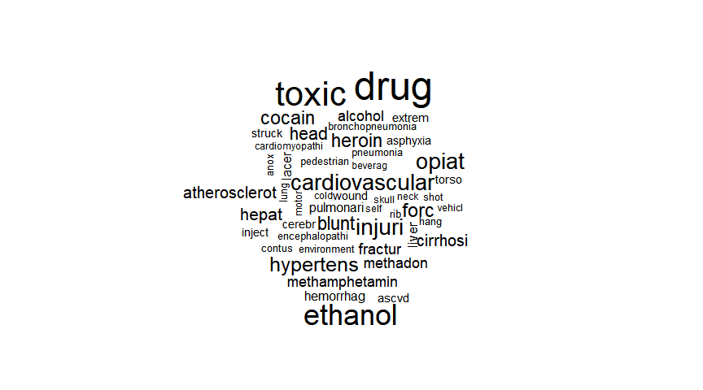

Classification of Homeless Deaths with Machine Learning
================
MBG
December 29, 2018

-   [I. LOGISTIC REGRESSION](#i.-logistic-regression)
    -   [READ AND SUBSET DATA](#read-and-subset-data)
    -   [SPLIT DATA INTO TRAINING AND TESTING SUBSETS](#split-data-into-training-and-testing-subsets)
    -   [CREATE MODEL](#create-model)
    -   [APPLY MODEL 1 TO THE TEST DATA SET TO EVALUATE MODEL](#apply-model-1-to-the-test-data-set-to-evaluate-model)
    -   [Out of sample AUC](#out-of-sample-auc)
    -   [Create corpus and prepare data](#create-corpus-and-prepare-data)
    -   [Stemming words](#stemming-words)
    -   [Create document term matrix](#create-document-term-matrix)
    -   [Creating training and test datasets](#creating-training-and-test-datasets)
    -   [Create word cloud](#create-word-cloud)
    -   [Transform sparse matrix into data structure to train model](#transform-sparse-matrix-into-data-structure-to-train-model)
    -   [Train Naive Bayes model](#train-naive-bayes-model)
-   [NEXT STEPS:](#next-steps)

I. LOGISTIC REGRESSION
----------------------

### READ AND SUBSET DATA

I created two versions of the dataset containing my dependent and independent variables. The first one includes "unknown" values as valid levels in factor variables and the second one recodes them to NAs.

``` r
homeless <- read.csv("HomelessFinal.csv")
str(homeless)
```

    ## 'data.frame':    175391 obs. of  29 variables:
    ##  $ X          : int  1 2 3 4 5 6 7 8 9 10 ...
    ##  $ certno     : int  2017019289 2014057047 2017016040 2010070278 2016052688 2015064867 2011073979 2004023773 2013045577 2013065733 ...
    ##  $ dcounty    : Factor w/ 1 level "KING": 1 1 1 1 1 1 1 1 1 1 ...
    ##  $ attclass   : int  2 2 2 2 2 2 2 1 2 2 ...
    ##  $ sex        : Factor w/ 3 levels "F","M","U": 2 2 2 1 2 1 2 2 2 2 ...
    ##  $ brgrace    : int  2 1 1 1 2 8 1 1 15 15 ...
    ##  $ hispanic   : Factor w/ 2 levels "N","Y": 2 2 1 2 2 2 2 2 1 1 ...
    ##  $ manner     : Factor w/ 6 levels "Accident","Homicide",..: 1 6 1 1 1 1 1 3 1 6 ...
    ##  $ rcounty    : Factor w/ 103 levels "ADAMS","ALAMEDA",..: 102 39 39 92 81 39 7 39 39 NA ...
    ##  $ rcity      : Factor w/ 468 levels "ABERDEEN","ACME",..: 464 188 369 430 265 369 25 369 13 NA ...
    ##  $ rstateFIPS : Factor w/ 29 levels "AK","AL","AZ",..: 26 26 26 29 26 26 8 26 26 26 ...
    ##  $ rzip       : Factor w/ 658 levels "00000","02574",..: 527 102 161 656 123 656 29 207 59 656 ...
    ##  $ dcity      : Factor w/ 67 levels "ALGONA","AUBURN",..: 54 29 54 27 54 54 29 54 28 54 ...
    ##  $ dplacecode : Factor w/ 10 levels "ER","Home","Hospice",..: 8 8 9 8 8 2 8 5 8 8 ...
    ##  $ dthyr      : int  2017 2014 2017 2010 2016 2015 2011 2004 2013 2013 ...
    ##  $ UCOD       : Factor w/ 2257 levels "A020","A021",..: 2148 1940 2145 2148 2001 2148 2142 1334 2111 1940 ...
    ##  $ educ       : Factor w/ 9 levels "<=8th grade",..: 6 9 3 9 6 8 2 9 6 6 ...
    ##  $ marital    : Factor w/ 7 levels "A","D","M","P",..: 5 6 5 2 1 5 2 5 5 5 ...
    ##  $ occupcode  : num  15 999 401 999 196 997 999 999 964 962 ...
    ##  $ age5cat    : Factor w/ 5 levels "<18yrs","18-29yrs",..: 3 3 4 4 3 3 3 4 2 4 ...
    ##  $ LCOD       : Factor w/ 11 levels "Alzheimers","Cancer",..: 8 9 8 8 8 8 8 3 8 9 ...
    ##  $ injury     : Factor w/ 5 levels "MV - all","No injury",..: 5 2 5 5 1 5 3 2 3 2 ...
    ##  $ substance  : Factor w/ 3 levels "Alcohol-induced",..: 2 3 2 2 3 2 3 1 3 3 ...
    ##  $ residence  : Factor w/ 2 levels "Out of state",..: 2 2 2 NA 2 2 1 2 2 2 ...
    ##  $ raceethnic5: Factor w/ 7 levels "AIAN NH","Asian/PI NH",..: 3 7 4 7 3 2 7 7 4 4 ...
    ##  $ raceethnic6: Factor w/ 8 levels "AIAN NH","Asian",..: 3 8 4 8 3 2 8 8 4 4 ...
    ##  $ CODliteral : Factor w/ 135171 levels "\"PRIMARY PNEUMONIA\" ADVANCED DEMENTIA    ",..: 47991 131641 4884 2044 125309 2238 69746 22060 57053 89066 ...
    ##  $ military   : Factor w/ 3 levels "N","U","Y": 1 2 1 1 1 1 1 2 1 1 ...
    ##  $ status     : Factor w/ 2 levels "Homeless","With home": 1 1 1 1 1 1 1 1 1 1 ...

``` r
h1 <- subset(homeless, select= c("sex", "raceethnic5", "manner", "dplacecode", "educ", "age5cat", "LCOD", "status", "injury", "substance"))
summary(h1)
```

    ##  sex            raceethnic5              manner      
    ##  F:87741   AIAN NH    :  1566   Accident    : 10439  
    ##  M:87646   Asian/PI NH: 12738   Homicide    :   982  
    ##  U:    4   Black NH   :  8988   Natural     :159965  
    ##            Hispanic   :  4117   Pending     :     1  
    ##            Other      :  1488   Suicide     :  3259  
    ##            Unknown    : 12177   Undetermined:   722  
    ##            White NH   :134317   NA's        :    23  
    ##                       dplacecode                        educ      
    ##  Hospital inpatient        :61983   H.S. grad/GED         :57646  
    ##  Home                      :49495   Some college          :28505  
    ##  Nursing home/Longterm care:47574   Bachelors             :26713  
    ##  Other                     : 6963   Unknown               :14861  
    ##  Hospice                   : 6005   <=8th grade           :12424  
    ##  ER                        : 3228   9-12th gr., no diploma:11353  
    ##  (Other)                   :  143   (Other)               :23889  
    ##      age5cat                         LCOD             status      
    ##  <18yrs  :  3076   Other               :47641   Homeless :  1093  
    ##  18-29yrs:  3083   Cancer              :38618   With home:174298  
    ##  30-44yrs:  6742   Heart Dis.          :36375                     
    ##  45-64yrs: 33704   Alzheimers          :10659                     
    ##  65+ yrs :128767   Stroke              :10368                     
    ##  NA's    :    19   Injury-unintentional: 9895                     
    ##                    (Other)             :21835                     
    ##                      injury                    substance     
    ##  MV - all               :  2079   Alcohol-induced   :  2831  
    ##  No injury              :165484   Drug-induced      :  3692  
    ##  Other injury           :  1571   No Substance abuse:168868  
    ##  Unintentional fall     :  2997                              
    ##  Unintentional poisoning:  3260                              
    ##                                                              
    ## 

``` r
#limit dataset to random sample of 2,200 with home and all homeless deaths

withhome <- subset(h1, status=="With home")
homeless <- subset(h1, status=="Homeless")
whsample <- sample_n(withhome, 2200)
h1 <- rbind(whsample, homeless)

h1$homeless[h1$status=="Homeless"] <- 1
h1$homeless[h1$status=="With home"] <- 0

h1$homeless <- factor(h1$homeless)

h2 <- h1

levels(h2$sex)[levels(h2$sex)=="U"] <- NA
levels(h2$raceethnic5)[6] <- NA
levels(h2$manner)[4] <- NA
levels(h2$educ)[4] <- NA
summary(h2)
```

    ##  sex           raceethnic5            manner    
    ##  F:1253   AIAN NH    :  96   Accident    : 624  
    ##  M:2040   Asian/PI NH: 189   Homicide    :  71  
    ##           Black NH   : 277   Natural     :2410  
    ##           Hispanic   : 148   Suicide     : 116  
    ##           Other      :  40   Undetermined:  71  
    ##           White NH   :2377   NA's        :   1  
    ##           NA's       : 166                      
    ##                       dplacecode                       educ     
    ##  Hospital inpatient        :1037   H.S. grad/GED         :1106  
    ##  Home                      : 733   Unknown               : 502  
    ##  Other                     : 697   Some college          : 457  
    ##  Nursing home/Longterm care: 655   9-12th gr., no diploma: 309  
    ##  ER                        :  85   <=8th grade           : 210  
    ##  Hospice                   :  82   (Other)               : 357  
    ##  (Other)                   :   4   NA's                  : 352  
    ##      age5cat                       LCOD           status    
    ##  <18yrs  :  43   Other               :855   Homeless :1093  
    ##  18-29yrs: 127   Injury-unintentional:608   With home:2200  
    ##  30-44yrs: 341   Heart Dis.          :603                   
    ##  45-64yrs:1062   Cancer              :518                   
    ##  65+ yrs :1719   Alzheimers          :136                   
    ##  NA's    :   1   Stroke              :116                   
    ##                  (Other)             :457                   
    ##                      injury                  substance    homeless
    ##  MV - all               :  89   Alcohol-induced   : 125   0:2200  
    ##  No injury              :2683   Drug-induced      : 398   1:1093  
    ##  Other injury           :  79   No Substance abuse:2770           
    ##  Unintentional fall     :  54                                     
    ##  Unintentional poisoning: 388                                     
    ##                                                                   
    ## 

### SPLIT DATA INTO TRAINING AND TESTING SUBSETS

``` r
split = sample.split(h2$homeless, SplitRatio = 0.65)
HTrain = subset(h2, split==TRUE)
HTest = subset(h2, split==FALSE)
```

### CREATE MODEL

In this attempt I use the dataset that does not retain "unknown" values as valid levels in factor variables.

I specified the reference categories in each factor variable within the model.

``` r
HTrain$sex <- relevel(HTrain$sex, ref = "F")
HTrain$raceethnic5 <-relevel(HTrain$raceethnic5, ref = "White NH")
HTrain$manner <- relevel(HTrain$manner, ref = "Natural")
HTrain$dplacecode <- relevel(HTrain$dplacecode, ref = "Home")
HTrain$edu <- relevel(HTrain$educ, ref =  "<=8th grade")
HTrain$age5cat <- relevel(HTrain$age5cat, ref = "65+ yrs")
HTrain$injury <- relevel(HTrain$injury, ref = "No injury")
HTrain$substance <- relevel(HTrain$substance, ref = "No Substance abuse")
HTrain$LCOD <- relevel(HTrain$LCOD, ref = "Other")

## model 1 with all independent variables included
LR1 <- glm(homeless ~ sex + raceethnic5 + manner + dplacecode + educ + age5cat + injury + substance + LCOD, data = HTrain, family = "binomial")
```

    ## Warning: glm.fit: fitted probabilities numerically 0 or 1 occurred

``` r
summary(LR1)
```

    ## 
    ## Call:
    ## glm(formula = homeless ~ sex + raceethnic5 + manner + dplacecode + 
    ##     educ + age5cat + injury + substance + LCOD, family = "binomial", 
    ##     data = HTrain)
    ## 
    ## Deviance Residuals: 
    ##     Min       1Q   Median       3Q      Max  
    ## -3.2628  -0.2236  -0.0725   0.1833   2.8581  
    ## 
    ## Coefficients: (1 not defined because of singularities)
    ##                                       Estimate Std. Error z value Pr(>|z|)
    ## (Intercept)                            -5.4047     0.6192  -8.728  < 2e-16
    ## sexM                                    1.2946     0.2342   5.527 3.25e-08
    ## raceethnic5AIAN NH                      1.8351     0.4713   3.893 9.88e-05
    ## raceethnic5Asian/PI NH                 -0.7824     0.4931  -1.587  0.11260
    ## raceethnic5Black NH                     0.5637     0.3034   1.858  0.06317
    ## raceethnic5Hispanic                     1.1701     0.4506   2.597  0.00941
    ## raceethnic5Other                        1.8820     0.7470   2.519  0.01175
    ## mannerAccident                          1.4620     0.7342   1.991  0.04645
    ## mannerHomicide                          1.4805     0.6000   2.467  0.01361
    ## mannerSuicide                           1.9757     0.4801   4.115 3.87e-05
    ## mannerUndetermined                      1.7611     0.6546   2.690  0.00714
    ## dplacecodeER                            1.6751     0.5191   3.227  0.00125
    ## dplacecodeHospice                       0.7458     0.7054   1.057  0.29038
    ## dplacecodeHospital inpatient            0.9196     0.2946   3.121  0.00180
    ## dplacecodeIn transport                -14.5986  6522.6386  -0.002  0.99821
    ## dplacecodeNursing home/Longterm care    0.8227     0.3867   2.127  0.03341
    ## dplacecodeOther                         3.3885     0.3315  10.221  < 2e-16
    ## dplacecodeOther person's home          20.0681  6522.6386   0.003  0.99755
    ## educ9-12th gr., no diploma              1.1089     0.5363   2.067  0.03869
    ## educAssociate's                        -0.7026     0.6663  -1.054  0.29166
    ## educDoctorate/Professional            -16.6781   853.8809  -0.020  0.98442
    ## educH.S. grad/GED                       0.3521     0.4856   0.725  0.46847
    ## educMasters                            -1.3758     0.7015  -1.961  0.04987
    ## educSome college                       -0.3121     0.5189  -0.601  0.54752
    ## educUnknown                             3.3812     0.5487   6.163 7.15e-10
    ## age5cat<18yrs                         -16.0703  1077.7105  -0.015  0.98810
    ## age5cat18-29yrs                         0.8217     0.4735   1.735  0.08267
    ## age5cat30-44yrs                         2.8025     0.3504   7.999 1.26e-15
    ## age5cat45-64yrs                         2.0736     0.2560   8.100 5.48e-16
    ## injuryMV - all                         15.9498  6522.6394   0.002  0.99805
    ## injuryOther injury                     16.2332  6522.6394   0.002  0.99801
    ## injuryUnintentional fall               15.9900  6522.6394   0.002  0.99804
    ## injuryUnintentional poisoning          16.7141  6522.6394   0.003  0.99796
    ## substanceAlcohol-induced                1.3104     0.7679   1.706  0.08794
    ## substanceDrug-induced                   1.0446     0.5078   2.057  0.03968
    ## LCODAlzheimers                        -14.6166   750.9081  -0.019  0.98447
    ## LCODCancer                             -1.0315     0.3931  -2.624  0.00869
    ## LCODChronic Liver dis./cirrh.          -0.1571     0.8341  -0.188  0.85066
    ## LCODChronic Lwr Resp Dis.              -0.6552     0.7743  -0.846  0.39744
    ## LCODDiabetes                           -0.6167     0.6118  -1.008  0.31351
    ## LCODFlu                                 1.4312     0.7718   1.854  0.06367
    ## LCODHeart Dis.                          0.1824     0.3220   0.566  0.57106
    ## LCODInjury-unintentional              -16.3267  6522.6394  -0.003  0.99800
    ## LCODStroke                             -0.1259     0.6711  -0.188  0.85115
    ## LCODSuicide-all                             NA         NA      NA       NA
    ##                                         
    ## (Intercept)                          ***
    ## sexM                                 ***
    ## raceethnic5AIAN NH                   ***
    ## raceethnic5Asian/PI NH                  
    ## raceethnic5Black NH                  .  
    ## raceethnic5Hispanic                  ** 
    ## raceethnic5Other                     *  
    ## mannerAccident                       *  
    ## mannerHomicide                       *  
    ## mannerSuicide                        ***
    ## mannerUndetermined                   ** 
    ## dplacecodeER                         ** 
    ## dplacecodeHospice                       
    ## dplacecodeHospital inpatient         ** 
    ## dplacecodeIn transport                  
    ## dplacecodeNursing home/Longterm care *  
    ## dplacecodeOther                      ***
    ## dplacecodeOther person's home           
    ## educ9-12th gr., no diploma           *  
    ## educAssociate's                         
    ## educDoctorate/Professional              
    ## educH.S. grad/GED                       
    ## educMasters                          *  
    ## educSome college                        
    ## educUnknown                          ***
    ## age5cat<18yrs                           
    ## age5cat18-29yrs                      .  
    ## age5cat30-44yrs                      ***
    ## age5cat45-64yrs                      ***
    ## injuryMV - all                          
    ## injuryOther injury                      
    ## injuryUnintentional fall                
    ## injuryUnintentional poisoning           
    ## substanceAlcohol-induced             .  
    ## substanceDrug-induced                *  
    ## LCODAlzheimers                          
    ## LCODCancer                           ** 
    ## LCODChronic Liver dis./cirrh.           
    ## LCODChronic Lwr Resp Dis.               
    ## LCODDiabetes                            
    ## LCODFlu                              .  
    ## LCODHeart Dis.                          
    ## LCODInjury-unintentional                
    ## LCODStroke                              
    ## LCODSuicide-all                         
    ## ---
    ## Signif. codes:  0 '***' 0.001 '**' 0.01 '*' 0.05 '.' 0.1 ' ' 1
    ## 
    ## (Dispersion parameter for binomial family taken to be 1)
    ## 
    ##     Null deviance: 2383.87  on 1788  degrees of freedom
    ## Residual deviance:  720.46  on 1745  degrees of freedom
    ##   (351 observations deleted due to missingness)
    ## AIC: 808.46
    ## 
    ## Number of Fisher Scoring iterations: 17

``` r
LR1tab <- coef(summary(LR1))
#LR1tab[,2] <- exp(coef(LR1))
LR1tab
```

    ##                                         Estimate   Std. Error      z value
    ## (Intercept)                           -5.4046636    0.6192030 -8.728419386
    ## sexM                                   1.2945826    0.2342201  5.527206374
    ## raceethnic5AIAN NH                     1.8350684    0.4713201  3.893464741
    ## raceethnic5Asian/PI NH                -0.7824111    0.4931329 -1.586613152
    ## raceethnic5Black NH                    0.5637190    0.3034071  1.857962355
    ## raceethnic5Hispanic                    1.1701244    0.4505958  2.596838446
    ## raceethnic5Other                       1.8819838    0.7469748  2.519474070
    ## mannerAccident                         1.4619897    0.7341822  1.991317418
    ## mannerHomicide                         1.4804951    0.6000331  2.467355687
    ## mannerSuicide                          1.9756738    0.4801044  4.115091948
    ## mannerUndetermined                     1.7610926    0.6546377  2.690179079
    ## dplacecodeER                           1.6750751    0.5190867  3.226965921
    ## dplacecodeHospice                      0.7458070    0.7053942  1.057291120
    ## dplacecodeHospital inpatient           0.9195988    0.2946326  3.121171527
    ## dplacecodeIn transport               -14.5985887 6522.6386300 -0.002238142
    ## dplacecodeNursing home/Longterm care   0.8226743    0.3867445  2.127177838
    ## dplacecodeOther                        3.3884923    0.3315283 10.220823490
    ## dplacecodeOther person's home         20.0680719 6522.6386168  0.003076680
    ## educ9-12th gr., no diploma             1.1088525    0.5363313  2.067476614
    ## educAssociate's                       -0.7026257    0.6663172 -1.054491183
    ## educDoctorate/Professional           -16.6781369  853.8809294 -0.019532158
    ## educH.S. grad/GED                      0.3520728    0.4856410  0.724965082
    ## educMasters                           -1.3757772    0.7015308 -1.961107471
    ## educSome college                      -0.3121255    0.5189248 -0.601485112
    ## educUnknown                            3.3812061    0.5486579  6.162685724
    ## age5cat<18yrs                        -16.0703226 1077.7104760 -0.014911540
    ## age5cat18-29yrs                        0.8216961    0.4734950  1.735384847
    ## age5cat30-44yrs                        2.8024936    0.3503723  7.998615077
    ## age5cat45-64yrs                        2.0736095    0.2559891  8.100381285
    ## injuryMV - all                        15.9498018 6522.6393805  0.002445299
    ## injuryOther injury                    16.2332189 6522.6394093  0.002488750
    ## injuryUnintentional fall              15.9900245 6522.6394171  0.002451465
    ## injuryUnintentional poisoning         16.7141181 6522.6394039  0.002562478
    ## substanceAlcohol-induced               1.3103785    0.7679343  1.706367902
    ## substanceDrug-induced                  1.0446142    0.5078099  2.057096862
    ## LCODAlzheimers                       -14.6166337  750.9081368 -0.019465275
    ## LCODCancer                            -1.0315445    0.3931008 -2.624121826
    ## LCODChronic Liver dis./cirrh.         -0.1570544    0.8341490 -0.188280978
    ## LCODChronic Lwr Resp Dis.             -0.6552307    0.7743114 -0.846210807
    ## LCODDiabetes                          -0.6166707    0.6118495 -1.007879750
    ## LCODFlu                                1.4312277    0.7717762  1.854459501
    ## LCODHeart Dis.                         0.1823953    0.3219733  0.566491951
    ## LCODInjury-unintentional             -16.3266806 6522.6394278 -0.002503079
    ## LCODStroke                            -0.1259362    0.6710972 -0.187657186
    ##                                          Pr(>|z|)
    ## (Intercept)                          2.582564e-18
    ## sexM                                 3.253701e-08
    ## raceethnic5AIAN NH                   9.882257e-05
    ## raceethnic5Asian/PI NH               1.126003e-01
    ## raceethnic5Black NH                  6.317436e-02
    ## raceethnic5Hispanic                  9.408616e-03
    ## raceethnic5Other                     1.175303e-02
    ## mannerAccident                       4.644600e-02
    ## mannerHomicide                       1.361151e-02
    ## mannerSuicide                        3.870251e-05
    ## mannerUndetermined                   7.141369e-03
    ## dplacecodeER                         1.251104e-03
    ## dplacecodeHospice                    2.903787e-01
    ## dplacecodeHospital inpatient         1.801331e-03
    ## dplacecodeIn transport               9.982142e-01
    ## dplacecodeNursing home/Longterm care 3.340531e-02
    ## dplacecodeOther                      1.599760e-24
    ## dplacecodeOther person's home        9.975452e-01
    ## educ9-12th gr., no diploma           3.868927e-02
    ## educAssociate's                      2.916581e-01
    ## educDoctorate/Professional           9.844166e-01
    ## educH.S. grad/GED                    4.684735e-01
    ## educMasters                          4.986649e-02
    ## educSome college                     5.475169e-01
    ## educUnknown                          7.152137e-10
    ## age5cat<18yrs                        9.881028e-01
    ## age5cat18-29yrs                      8.267266e-02
    ## age5cat30-44yrs                      1.258264e-15
    ## age5cat45-64yrs                      5.478720e-16
    ## injuryMV - all                       9.980489e-01
    ## injuryOther injury                   9.980143e-01
    ## injuryUnintentional fall             9.980440e-01
    ## injuryUnintentional poisoning        9.979554e-01
    ## substanceAlcohol-induced             8.793960e-02
    ## substanceDrug-induced                3.967691e-02
    ## LCODAlzheimers                       9.844699e-01
    ## LCODCancer                           8.687271e-03
    ## LCODChronic Liver dis./cirrh.        8.506564e-01
    ## LCODChronic Lwr Resp Dis.            3.974352e-01
    ## LCODDiabetes                         3.135122e-01
    ## LCODFlu                              6.367345e-02
    ## LCODHeart Dis.                       5.710594e-01
    ## LCODInjury-unintentional             9.980028e-01
    ## LCODStroke                           8.511454e-01

``` r
#exp(coef(LR1))

## ROC curve for model 1
#lroc(LR1)
```

#### Evaluating logistic regression model 1 performance

1.  Residuals - 50% of the errors in predictions (between 1st and 3rd quartiles) are within an odds ratio of 0.95 to 0.98 away from the true value.
2.  A number of independent variables are statistically significantly positively associated with the dependent variable (homelessness at death). Many of these make sense given the relationship between homeless status at death and these independent variables as seen in the exploratory data anlaysis phase. These include:
    -   being male,
    -   being American Indian/Native American non-Hispanic,
    -   being Hispanic,
    -   dying from an accidental cause, an undetermined cause, or homicide (manner of death),
    -   dying in a location designated by the death certifier as "other" or "other person's home",
    -   age at death from 18 to 64 years old,
    -   dying of alcohol or drug induced causes,
    -   dying of influenza or heart disease.
3.  The ROC curve indicates an AUC of almost 97% indicating that the model has high sensitivity and specificity.

### APPLY MODEL 1 TO THE TEST DATA SET TO EVALUATE MODEL

I set the threshold probability level at 0.5 i.e. if the model predicts that there's a greater than 0.5 probability that the observation is homeless then it is classified as a homeless death. Tabulating the predicted values against the actual recorded ones gives the confusion matrix.

``` r
predict1 <- predict(LR1, type = "response", newdata = HTest)
```

    ## Warning in predict.lm(object, newdata, se.fit, scale = 1, type =
    ## ifelse(type == : prediction from a rank-deficient fit may be misleading

``` r
table(HTest$homeless, predict1 > 0.5)
```

    ##    
    ##     FALSE TRUE
    ##   0   577   41
    ##   1    60  309

Accuracy of model = accurate predictions/total \# observations

``` r
## model accuracy
(561+333)/(561+333+45+41)
```

    ## [1] 0.9122449

``` r
## baseline accuracy - if baseline predicted all outcomes as 0
(561+45)/(561+333+45+41)
```

    ## [1] 0.6183673

The model accuracy is 91% - the model predicts the homeless deaths correctly 333 times out of 374 actual homeless deaths. Baseline accuracy is 62% so the model prediction accuracy is better than baseline.

### Out of sample AUC

``` r
ROCRpred1 = prediction(predict1, HTest$homeless)
as.numeric(performance(ROCRpred1, "auc")@y.values)
```

    ## [1] 0.9576372

``` r
ROCRperf1 = performance(ROCRpred1, measure = "tpr",x.measure = "fpr")
plot(ROCRperf1, col = rainbow(10))
```


It looks like the model has a high out of sample accuracy of 96% as well.

OK - this STILL seems too good to be true even after creating a 1/3, 2/3 split between homeless and with home data. What am I missing?

1.  NAIVE BAYES CLASSIFIER

``` r
# get data and restrict to only literal fields
#the literal field in this dataset is called "CODliteral" and contains 
#Cause of death lines a-d, other significant conditions line, and injury
#occurrance literal field.

literal <- read.csv("HomelessFinal.csv", stringsAsFactors = FALSE)
literal <- subset(literal, select = c(status, CODliteral))
str(literal)
```

    ## 'data.frame':    175391 obs. of  2 variables:
    ##  $ status    : chr  "Homeless" "Homeless" "Homeless" "Homeless" ...
    ##  $ CODliteral: chr  "COMBINED OPIATE (HEROIN), METHAMPHETAMINE, AND DIPHENHYDRAMINE INTOXICATION     TOXIC USE OF DRUGS" "UNDETERMINED     FOUND DEAD IN JAIL CELL." "ACUTE METHAMPHETAMINE INTOXICATION    HYPERTENSIVE AND ATHEROSCLEROTIC CARDIOVASCULAR DISEASE TOXIC USE OF A DRUG" "ACUTE COMBINED METHAMPHETAMINE AND DEXTROMETHORPHAN INTOXICATION    ATHEROSCLEROTIC AND HYPERTENSIVE CARDIOVASC"| __truncated__ ...

``` r
# set "status" to factor

literal$status <- factor(literal$status)
str(literal$status)
```

    ##  Factor w/ 2 levels "Homeless","With home": 1 1 1 1 1 1 1 1 1 1 ...

``` r
table(literal$status)
```

    ## 
    ##  Homeless With home 
    ##      1093    174298

``` r
# to remove the problem of unbalanced data I will restrict the "with home" class to about 7,500 randomly selected records

h <- subset(literal, status=="Homeless")
wh <- subset(literal, status=="With home")
summary(h)
```

    ##        status      CODliteral       
    ##  Homeless :1093   Length:1093       
    ##  With home:   0   Class :character  
    ##                   Mode  :character

``` r
summary(wh)
```

    ##        status        CODliteral       
    ##  Homeless :     0   Length:174298     
    ##  With home:174298   Class :character  
    ##                     Mode  :character

``` r
wh_sample <- sample_n(wh, 7500)

literal2 <- rbind(wh_sample, h)
literal2 <- literal2[sample(nrow(literal2)), ] #randomize order of rows so rows aren't ordered by class
summary(literal2)
```

    ##        status      CODliteral       
    ##  Homeless :1093   Length:8593       
    ##  With home:7500   Class :character  
    ##                   Mode  :character

### Create corpus and prepare data

``` r
h_corpus <- VCorpus(VectorSource(literal2$CODliteral))
print(h_corpus)
```

    ## <<VCorpus>>
    ## Metadata:  corpus specific: 0, document level (indexed): 0
    ## Content:  documents: 8593

``` r
lapply(h_corpus[1:3], as.character)
```

    ## $`1`
    ## [1] "MULTI ORGAN FAILURE NON Q WAVE MI ASPIRATION PNEUMONIA ENDOCARDITIS WITH METHICILLIN SENSITIVE STAPHYLOCOCCUS AORTIC VALVE REPLACEMENT, A FIB, DM "
    ## 
    ## $`2`
    ## [1] "RESPIRATORY FAILURE PNEUMONIA   AF "
    ## 
    ## $`3`
    ## [1] "METASTATIC RENAL CELL CANCER    ACUTE RENAL FAILURE "

``` r
X <- h_corpus

#standardize all content

X <- tm_map(X, content_transformer(tolower))

X <- tm_map(X, removeNumbers)

X <- tm_map(X, removePunctuation)

CODstop <- c("disease", "combination", "an", "the", "a", "of", "effects", "combined", "due", "to", "by", "acute", "chronic", "and", "failure", "intoxication", "type", "stage", "end", "natural", "on", "unspecified", "arrest", "atrial", "fibrilation", "coronary", "congestive", "history", "diastolic", "advanced", "probable", "with", "multiple", "small", "non", "event" ,"advanced" ,  "asymptomatic" ,  "autoimmune" ,  "benign"  ,  "clinical" ,  "communicable" ,"congenital" ,  "degenerative" ,  "febrile" ,  "first-degree" ,  "foca" ,  "fungal" ,  "generalized" ,  "inactive" ,  "infectious" , "inflammatory" ,  "invasive" ,  "local",  "morbid" ,"multiple" ,  "noninvasive" ,  "nonspecific" ,   "parasitic" , " pathological" ,  "perforated" ,  "primary" ,  "psychiatric" ,  "rheumatic" ,  "second-degree" ,  "severe" ,  "sporadic" ,  "suspected" ,  "systemic" ,  "terminal" ,  "third-degree" , " unresponsive ",  "untreated" ,  "viral" ,  "virulent" ,  "wasting", "exposure", "abuse", "unknown", "if", "cause", "death", "use", "in", "with")

X <- tm_map(X, removeWords, stopwords())
X <- tm_map(X, removeWords, CODstop)

lapply(X[1:3], as.character)
```

    ## $`1`
    ## [1] "multi organ   q wave mi aspiration pneumonia endocarditis  methicillin sensitive staphylococcus aortic valve replacement  fib dm "
    ## 
    ## $`2`
    ## [1] "respiratory  pneumonia   af "
    ## 
    ## $`3`
    ## [1] "metastatic renal cell cancer     renal  "

### Stemming words

``` r
#Stemming

X <- tm_map(X, wordStem, language = "eng")
X<- tm_map(X, PlainTextDocument)
lapply(X[1:3], as.character)
```

    ## $`character(0)`
    ## [1] "multi organ   q wave mi aspiration pneumonia endocarditis  methicillin sensitive staphylococcus aortic valve replacement  fib dm "
    ## 
    ## $`character(0)`
    ## [1] "respiratory  pneumonia   af "
    ## 
    ## $`character(0)`
    ## [1] "metastatic renal cell cancer     renal  "

``` r
# remove extra whitespace
X <- tm_map(X, stripWhitespace)
#X<- tm_map(X, PlainTextDocument)
#X <- tm_map(X, trimws)

as.character(X[[2]])
```

    ## [1] "respiratory pneumonia af "

### Create document term matrix

``` r
X_DTM <- DocumentTermMatrix(X)
X_DTM
```

    ## <<DocumentTermMatrix (documents: 8593, terms: 3484)>>
    ## Non-/sparse entries: 50399/29887613
    ## Sparsity           : 100%
    ## Maximal term length: 55
    ## Weighting          : term frequency (tf)

### Creating training and test datasets

``` r
TrainData <- X_DTM[1:6444, ]
TestData <- X_DTM[6445:8593, ]

# create vector of labels for later use

HTrainLabels <- literal2[1:6444, ]$status
HTestLabels <- literal2[6445:8593, ]$status

#confirm equal proportions of homeless and with home in each dataset

prop.table(table(HTrainLabels))
```

    ## HTrainLabels
    ##  Homeless With home 
    ## 0.1275605 0.8724395

``` r
prop.table(table(HTestLabels))
```

    ## HTestLabels
    ##  Homeless With home 
    ## 0.1261052 0.8738948

### Create word cloud

``` r
homeless <- subset(literal2, status=="Homeless")
whome <- subset(literal2, status =="With home")

wordcloud(homeless$CODliteral, max.words = 40, scale = c(3, 0.5))
```

    ## Warning in tm_map.SimpleCorpus(corpus, tm::removePunctuation):
    ## transformation drops documents

    ## Warning in tm_map.SimpleCorpus(corpus, function(x) tm::removeWords(x,
    ## tm::stopwords())): transformation drops documents



``` r
wordcloud(whome$CODliteral, max.words = 40, scale = c(3, 0.5))
```

    ## Warning in tm_map.SimpleCorpus(corpus, tm::removePunctuation):
    ## transformation drops documents

    ## Warning in tm_map.SimpleCorpus(corpus, tm::removePunctuation):
    ## transformation drops documents


### Transform sparse matrix into data structure to train model

Eliminate words appearing in fewer than 5 records.

``` r
freqWords <- findFreqTerms(TrainData, 5) #keeps words that appear at least 5 times
str(freqWords)
```

    ##  chr [1:878] "abdomen" "abdominal" "abscess" "accident" ...

``` r
#filter DTM to keep only terms appearing 5 times or more

TrainData_filtered <- TrainData[ ,freqWords]
TestData_filtered <- TestData[ ,freqWords]

#Create function to convert counts to Yes/No variable indicating presence/absence of word

convertCounts <- function(x) {
  x <- ifelse(x>0, "Yes", "No")
}

Train_final <- apply(TrainData_filtered, MARGIN = 2, convertCounts) #Margin = 2: apply filter to columns
Test_final <- apply(TestData_filtered, MARGIN = 2, convertCounts)
```

### Train Naive Bayes model

``` r
#train model

H_classifier <- naiveBayes(Train_final, HTrainLabels, laplace = 1)

#use model to predict with test data

H_predict <- predict(H_classifier, Test_final)

#Evaluate accuracy of model by crosstabulating with raw data

CrossTable(H_predict, HTestLabels, 
           prop.chisq = FALSE,
           prop.t = FALSE,
           prop.r = FALSE,
           dnn = c("predicted", "actual"))
```

    ## 
    ##  
    ##    Cell Contents
    ## |-------------------------|
    ## |                       N |
    ## |           N / Col Total |
    ## |-------------------------|
    ## 
    ##  
    ## Total Observations in Table:  2149 
    ## 
    ##  
    ##              | actual 
    ##    predicted |  Homeless | With home | Row Total | 
    ## -------------|-----------|-----------|-----------|
    ##     Homeless |       185 |       164 |       349 | 
    ##              |     0.683 |     0.087 |           | 
    ## -------------|-----------|-----------|-----------|
    ##    With home |        86 |      1714 |      1800 | 
    ##              |     0.317 |     0.913 |           | 
    ## -------------|-----------|-----------|-----------|
    ## Column Total |       271 |      1878 |      2149 | 
    ##              |     0.126 |     0.874 |           | 
    ## -------------|-----------|-----------|-----------|
    ## 
    ## 

Accuracy = (199+1890)/199+164+60+1726 = 97.2%

Sensitivity/recall = true positive/true positive + false negative = 199/259 = 77% Specificity = true negatives/true negatives + false positives = 1,726/1890 = 91%

NEXT STEPS:
-----------

1.  what other ways are there to "balance" the data between homeless and with home that doesn't require random selection of a subset of with home records? Is there a weighting technique that would allow me to keep all records?

2.  How do I tweak the model to give me better accuracy?
