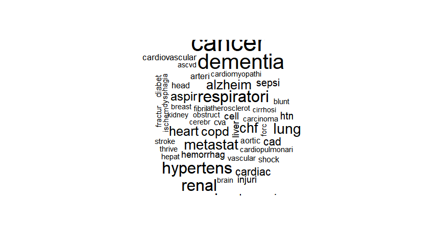

Classification of Homeless Deaths with Machine Learning
================
MBG
December 29, 2018

-   [I. LOGISTIC REGRESSION](#i.-logistic-regression)
    -   [READ AND SUBSET DATA](#read-and-subset-data)
    -   [SPLIT DATA INTO TRAINING AND TESTING SUBSETS](#split-data-into-training-and-testing-subsets)
    -   [CREATE MODEL](#create-model)
    -   [APPLY MODEL 1 TO THE TEST DATA SET TO EVALUATE MODEL](#apply-model-1-to-the-test-data-set-to-evaluate-model)
    -   [Out of sample AUC](#out-of-sample-auc)
    -   [Create corpus and prepare data](#create-corpus-and-prepare-data)
    -   [Stemming words](#stemming-words)
    -   [Create document term matrix](#create-document-term-matrix)
    -   [Creating training and test datasets](#creating-training-and-test-datasets)
    -   [Create word cloud](#create-word-cloud)
    -   [Transform sparse matrix into data structure to train model](#transform-sparse-matrix-into-data-structure-to-train-model)
    -   [Train Naive Bayes model with 10-fold crossvalidation](#train-naive-bayes-model-with-10-fold-crossvalidation)
-   [II. (B) NAIVE BAYES CLASSIFIER - using packages caret and klaR](#ii.-b-naive-bayes-classifier---using-packages-caret-and-klar)
-   [III. RANDOM FORESTS](#iii.-random-forests)

I. LOGISTIC REGRESSION
----------------------

### READ AND SUBSET DATA

I created two versions of the dataset containing my dependent and independent variables. The first one includes "unknown" values as valid levels in factor variables and the second one recodes them to NAs.

``` r
homeless <- read.csv("HomelessFinal.csv")
str(homeless)
```

    ## 'data.frame':    175391 obs. of  29 variables:
    ##  $ X          : int  1 2 3 4 5 6 7 8 9 10 ...
    ##  $ certno     : int  2017019289 2014057047 2017016040 2010070278 2016052688 2015064867 2011073979 2004023773 2013045577 2013065733 ...
    ##  $ dcounty    : Factor w/ 1 level "KING": 1 1 1 1 1 1 1 1 1 1 ...
    ##  $ attclass   : int  2 2 2 2 2 2 2 1 2 2 ...
    ##  $ sex        : Factor w/ 3 levels "F","M","U": 2 2 2 1 2 1 2 2 2 2 ...
    ##  $ brgrace    : int  2 1 1 1 2 8 1 1 15 15 ...
    ##  $ hispanic   : Factor w/ 2 levels "N","Y": 2 2 1 2 2 2 2 2 1 1 ...
    ##  $ manner     : Factor w/ 6 levels "Accident","Homicide",..: 1 6 1 1 1 1 1 3 1 6 ...
    ##  $ rcounty    : Factor w/ 103 levels "ADAMS","ALAMEDA",..: 102 39 39 92 81 39 7 39 39 NA ...
    ##  $ rcity      : Factor w/ 468 levels "ABERDEEN","ACME",..: 464 188 369 430 265 369 25 369 13 NA ...
    ##  $ rstateFIPS : Factor w/ 29 levels "AK","AL","AZ",..: 26 26 26 29 26 26 8 26 26 26 ...
    ##  $ rzip       : Factor w/ 658 levels "00000","02574",..: 527 102 161 656 123 656 29 207 59 656 ...
    ##  $ dcity      : Factor w/ 67 levels "ALGONA","AUBURN",..: 54 29 54 27 54 54 29 54 28 54 ...
    ##  $ dplacecode : Factor w/ 10 levels "ER","Home","Hospice",..: 8 8 9 8 8 2 8 5 8 8 ...
    ##  $ dthyr      : int  2017 2014 2017 2010 2016 2015 2011 2004 2013 2013 ...
    ##  $ UCOD       : Factor w/ 2257 levels "A020","A021",..: 2148 1940 2145 2148 2001 2148 2142 1334 2111 1940 ...
    ##  $ educ       : Factor w/ 9 levels "<=8th grade",..: 6 9 3 9 6 8 2 9 6 6 ...
    ##  $ marital    : Factor w/ 7 levels "A","D","M","P",..: 5 6 5 2 1 5 2 5 5 5 ...
    ##  $ occupcode  : num  15 999 401 999 196 997 999 999 964 962 ...
    ##  $ age5cat    : Factor w/ 5 levels "<18yrs","18-29yrs",..: 3 3 4 4 3 3 3 4 2 4 ...
    ##  $ LCOD       : Factor w/ 11 levels "Alzheimers","Cancer",..: 8 9 8 8 8 8 8 3 8 9 ...
    ##  $ injury     : Factor w/ 5 levels "MV - all","No injury",..: 5 2 5 5 1 5 3 2 3 2 ...
    ##  $ substance  : Factor w/ 3 levels "Alcohol-induced",..: 2 3 2 2 3 2 3 1 3 3 ...
    ##  $ residence  : Factor w/ 2 levels "Out of state",..: 2 2 2 NA 2 2 1 2 2 2 ...
    ##  $ raceethnic5: Factor w/ 7 levels "AIAN NH","Asian/PI NH",..: 3 7 4 7 3 2 7 7 4 4 ...
    ##  $ raceethnic6: Factor w/ 8 levels "AIAN NH","Asian",..: 3 8 4 8 3 2 8 8 4 4 ...
    ##  $ CODliteral : Factor w/ 135171 levels "\"PRIMARY PNEUMONIA\" ADVANCED DEMENTIA    ",..: 47991 131641 4884 2044 125309 2238 69746 22060 57053 89066 ...
    ##  $ military   : Factor w/ 3 levels "N","U","Y": 1 2 1 1 1 1 1 2 1 1 ...
    ##  $ status     : Factor w/ 2 levels "Homeless","With home": 1 1 1 1 1 1 1 1 1 1 ...

``` r
h1 <- subset(homeless, select= c("sex", "raceethnic5", "manner", "dplacecode", "educ", "age5cat", "LCOD", "status", "injury", "substance"))
summary(h1)
```

    ##  sex            raceethnic5              manner      
    ##  F:87741   AIAN NH    :  1566   Accident    : 10439  
    ##  M:87646   Asian/PI NH: 12738   Homicide    :   982  
    ##  U:    4   Black NH   :  8988   Natural     :159965  
    ##            Hispanic   :  4117   Pending     :     1  
    ##            Other      :  1488   Suicide     :  3259  
    ##            Unknown    : 12177   Undetermined:   722  
    ##            White NH   :134317   NA's        :    23  
    ##                       dplacecode                        educ      
    ##  Hospital inpatient        :61983   H.S. grad/GED         :57646  
    ##  Home                      :49495   Some college          :28505  
    ##  Nursing home/Longterm care:47574   Bachelors             :26713  
    ##  Other                     : 6963   Unknown               :14861  
    ##  Hospice                   : 6005   <=8th grade           :12424  
    ##  ER                        : 3228   9-12th gr., no diploma:11353  
    ##  (Other)                   :  143   (Other)               :23889  
    ##      age5cat                         LCOD             status      
    ##  <18yrs  :  3076   Other               :47641   Homeless :  1093  
    ##  18-29yrs:  3083   Cancer              :38618   With home:174298  
    ##  30-44yrs:  6742   Heart Dis.          :36375                     
    ##  45-64yrs: 33704   Alzheimers          :10659                     
    ##  65+ yrs :128767   Stroke              :10368                     
    ##  NA's    :    19   Injury-unintentional: 9895                     
    ##                    (Other)             :21835                     
    ##                      injury                    substance     
    ##  MV - all               :  2079   Alcohol-induced   :  2831  
    ##  No injury              :165484   Drug-induced      :  3692  
    ##  Other injury           :  1571   No Substance abuse:168868  
    ##  Unintentional fall     :  2997                              
    ##  Unintentional poisoning:  3260                              
    ##                                                              
    ## 

``` r
#limit dataset to random sample of 2,200 with home and all homeless deaths

withhome <- subset(h1, status=="With home")
homeless <- subset(h1, status=="Homeless")
whsample <- sample_n(withhome, 2200)
h1 <- rbind(whsample, homeless)

h1$homeless[h1$status=="Homeless"] <- 1
h1$homeless[h1$status=="With home"] <- 0

h1$homeless <- factor(h1$homeless)

h2 <- h1

levels(h2$sex)[levels(h2$sex)=="U"] <- NA
levels(h2$raceethnic5)[6] <- NA
levels(h2$manner)[4] <- NA
levels(h2$educ)[4] <- NA
summary(h2)
```

    ##  sex           raceethnic5            manner    
    ##  F:1306   AIAN NH    :  93   Accident    : 622  
    ##  M:1987   Asian/PI NH: 196   Homicide    :  67  
    ##           Black NH   : 290   Natural     :2408  
    ##           Hispanic   : 148   Suicide     : 123  
    ##           Other      :  45   Undetermined:  72  
    ##           White NH   :2336   NA's        :   1  
    ##           NA's       : 185                      
    ##                       dplacecode                       educ     
    ##  Hospital inpatient        :1012   H.S. grad/GED         :1091  
    ##  Home                      : 722   Unknown               : 510  
    ##  Other                     : 708   Some college          : 470  
    ##  Nursing home/Longterm care: 670   9-12th gr., no diploma: 320  
    ##  ER                        :  89   <=8th grade           : 189  
    ##  Hospice                   :  86   (Other)               : 374  
    ##  (Other)                   :   6   NA's                  : 339  
    ##      age5cat                       LCOD           status    
    ##  <18yrs  :  31   Other               :822   Homeless :1093  
    ##  18-29yrs: 120   Heart Dis.          :613   With home:2200  
    ##  30-44yrs: 366   Injury-unintentional:608                   
    ##  45-64yrs:1060   Cancer              :495                   
    ##  65+ yrs :1715   Stroke              :144                   
    ##  NA's    :   1   Alzheimers          :139                   
    ##                  (Other)             :472                   
    ##                      injury                  substance    homeless
    ##  MV - all               :  84   Alcohol-induced   : 135   0:2200  
    ##  No injury              :2683   Drug-induced      : 400   1:1093  
    ##  Other injury           :  85   No Substance abuse:2758           
    ##  Unintentional fall     :  51                                     
    ##  Unintentional poisoning: 390                                     
    ##                                                                   
    ## 

### SPLIT DATA INTO TRAINING AND TESTING SUBSETS

``` r
split = sample.split(h2$homeless, SplitRatio = 0.65)
HTrain = subset(h2, split==TRUE)
HTest = subset(h2, split==FALSE)
```

### CREATE MODEL

In this attempt I use the dataset that does not retain "unknown" values as valid levels in factor variables.

I specified the reference categories in each factor variable within the model.

``` r
HTrain$sex <- relevel(HTrain$sex, ref = "F")
HTrain$raceethnic5 <-relevel(HTrain$raceethnic5, ref = "White NH")
HTrain$manner <- relevel(HTrain$manner, ref = "Natural")
HTrain$dplacecode <- relevel(HTrain$dplacecode, ref = "Home")
HTrain$edu <- relevel(HTrain$educ, ref =  "<=8th grade")
HTrain$age5cat <- relevel(HTrain$age5cat, ref = "65+ yrs")
HTrain$injury <- relevel(HTrain$injury, ref = "No injury")
HTrain$substance <- relevel(HTrain$substance, ref = "No Substance abuse")
HTrain$LCOD <- relevel(HTrain$LCOD, ref = "Other")

## model 1 with all independent variables included
LR1 <- glm(homeless ~ sex + raceethnic5 + manner + dplacecode + educ + age5cat + injury + substance + LCOD, data = HTrain, family = "binomial")

summary(LR1)
```

    ## 
    ## Call:
    ## glm(formula = homeless ~ sex + raceethnic5 + manner + dplacecode + 
    ##     educ + age5cat + injury + substance + LCOD, family = "binomial", 
    ##     data = HTrain)
    ## 
    ## Deviance Residuals: 
    ##     Min       1Q   Median       3Q      Max  
    ## -3.5105  -0.2051  -0.0725   0.1689   3.2319  
    ## 
    ## Coefficients: (1 not defined because of singularities)
    ##                                        Estimate Std. Error z value
    ## (Intercept)                            -5.52684    0.61831  -8.939
    ## sexM                                    0.88575    0.22469   3.942
    ## raceethnic5AIAN NH                      1.28851    0.51231   2.515
    ## raceethnic5Asian/PI NH                 -1.09960    0.50461  -2.179
    ## raceethnic5Black NH                    -0.02346    0.31508  -0.074
    ## raceethnic5Hispanic                    -0.53732    0.43717  -1.229
    ## raceethnic5Other                       -0.56531    0.66354  -0.852
    ## mannerAccident                          2.26951    0.69258   3.277
    ## mannerHomicide                          2.82996    0.84616   3.344
    ## mannerSuicide                           0.50027    0.46329   1.080
    ## mannerUndetermined                      3.22556    0.79611   4.052
    ## dplacecodeER                            1.89128    0.53881   3.510
    ## dplacecodeHospice                      -0.54472    1.04784  -0.520
    ## dplacecodeHospital inpatient            1.25080    0.28926   4.324
    ## dplacecodeIn transport                -16.75495 3942.68141  -0.004
    ## dplacecodeNursing home/Longterm care    0.85637    0.39517   2.167
    ## dplacecodeOther                         3.51312    0.33691  10.428
    ## dplacecodeOther person's home           4.59861    4.11354   1.118
    ## educ9-12th gr., no diploma              1.14551    0.53373   2.146
    ## educAssociate's                        -1.67775    0.65359  -2.567
    ## educDoctorate/Professional             -1.72762    1.19040  -1.451
    ## educH.S. grad/GED                       0.26478    0.48623   0.545
    ## educMasters                            -0.96971    0.71012  -1.366
    ## educSome college                       -0.63561    0.52427  -1.212
    ## educUnknown                             3.67138    0.56785   6.465
    ## age5cat<18yrs                         -15.85640 1482.34153  -0.011
    ## age5cat18-29yrs                         2.06181    0.49538   4.162
    ## age5cat30-44yrs                         3.05940    0.35865   8.530
    ## age5cat45-64yrs                         2.87443    0.27835  10.327
    ## injuryMV - all                         16.21479 4388.72059   0.004
    ## injuryOther injury                     17.96717 4388.72065   0.004
    ## injuryUnintentional fall               15.97450 4388.72070   0.004
    ## injuryUnintentional poisoning          16.49256 4388.72063   0.004
    ## substanceAlcohol-induced                1.00446    0.73667   1.364
    ## substanceDrug-induced                   1.61198    0.51957   3.103
    ## LCODAlzheimers                        -16.13112  660.16578  -0.024
    ## LCODCancer                             -0.77341    0.38464  -2.011
    ## LCODChronic Liver dis./cirrh.           0.56502    0.81870   0.690
    ## LCODChronic Lwr Resp Dis.               0.16232    0.87597   0.185
    ## LCODDiabetes                           -0.82249    0.54982  -1.496
    ## LCODFlu                                 2.00839    0.74922   2.681
    ## LCODHeart Dis.                          0.42281    0.31948   1.323
    ## LCODInjury-unintentional              -17.56167 4388.72067  -0.004
    ## LCODStroke                             -0.60867    0.65635  -0.927
    ## LCODSuicide-all                              NA         NA      NA
    ##                                      Pr(>|z|)    
    ## (Intercept)                           < 2e-16 ***
    ## sexM                                 8.08e-05 ***
    ## raceethnic5AIAN NH                   0.011900 *  
    ## raceethnic5Asian/PI NH               0.029325 *  
    ## raceethnic5Black NH                  0.940655    
    ## raceethnic5Hispanic                  0.219042    
    ## raceethnic5Other                     0.394237    
    ## mannerAccident                       0.001050 ** 
    ## mannerHomicide                       0.000824 ***
    ## mannerSuicide                        0.280223    
    ## mannerUndetermined                   5.09e-05 ***
    ## dplacecodeER                         0.000448 ***
    ## dplacecodeHospice                    0.603169    
    ## dplacecodeHospital inpatient         1.53e-05 ***
    ## dplacecodeIn transport               0.996609    
    ## dplacecodeNursing home/Longterm care 0.030229 *  
    ## dplacecodeOther                       < 2e-16 ***
    ## dplacecodeOther person's home        0.263602    
    ## educ9-12th gr., no diploma           0.031854 *  
    ## educAssociate's                      0.010259 *  
    ## educDoctorate/Professional           0.146699    
    ## educH.S. grad/GED                    0.586053    
    ## educMasters                          0.172079    
    ## educSome college                     0.225373    
    ## educUnknown                          1.01e-10 ***
    ## age5cat<18yrs                        0.991465    
    ## age5cat18-29yrs                      3.15e-05 ***
    ## age5cat30-44yrs                       < 2e-16 ***
    ## age5cat45-64yrs                       < 2e-16 ***
    ## injuryMV - all                       0.997052    
    ## injuryOther injury                   0.996734    
    ## injuryUnintentional fall             0.997096    
    ## injuryUnintentional poisoning        0.997002    
    ## substanceAlcohol-induced             0.172720    
    ## substanceDrug-induced                0.001919 ** 
    ## LCODAlzheimers                       0.980506    
    ## LCODCancer                           0.044354 *  
    ## LCODChronic Liver dis./cirrh.        0.490099    
    ## LCODChronic Lwr Resp Dis.            0.852993    
    ## LCODDiabetes                         0.134674    
    ## LCODFlu                              0.007348 ** 
    ## LCODHeart Dis.                       0.185695    
    ## LCODInjury-unintentional             0.996807    
    ## LCODStroke                           0.353740    
    ## LCODSuicide-all                            NA    
    ## ---
    ## Signif. codes:  0 '***' 0.001 '**' 0.01 '*' 0.05 '.' 0.1 ' ' 1
    ## 
    ## (Dispersion parameter for binomial family taken to be 1)
    ## 
    ##     Null deviance: 2403.89  on 1814  degrees of freedom
    ## Residual deviance:  711.21  on 1771  degrees of freedom
    ##   (325 observations deleted due to missingness)
    ## AIC: 799.21
    ## 
    ## Number of Fisher Scoring iterations: 17

``` r
LR1tab <- coef(summary(LR1))
#LR1tab[,2] <- exp(coef(LR1))
LR1tab
```

    ##                                          Estimate   Std. Error
    ## (Intercept)                           -5.52683621    0.6183096
    ## sexM                                   0.88574729    0.2246864
    ## raceethnic5AIAN NH                     1.28850648    0.5123115
    ## raceethnic5Asian/PI NH                -1.09959778    0.5046131
    ## raceethnic5Black NH                   -0.02345692    0.3150813
    ## raceethnic5Hispanic                   -0.53731835    0.4371714
    ## raceethnic5Other                      -0.56530660    0.6635381
    ## mannerAccident                         2.26950833    0.6925832
    ## mannerHomicide                         2.82995845    0.8461628
    ## mannerSuicide                          0.50026739    0.4632883
    ## mannerUndetermined                     3.22556347    0.7961121
    ## dplacecodeER                           1.89128342    0.5388146
    ## dplacecodeHospice                     -0.54472020    1.0478441
    ## dplacecodeHospital inpatient           1.25079941    0.2892619
    ## dplacecodeIn transport               -16.75494952 3942.6814119
    ## dplacecodeNursing home/Longterm care   0.85637027    0.3951740
    ## dplacecodeOther                        3.51312297    0.3369083
    ## dplacecodeOther person's home          4.59860772    4.1135431
    ## educ9-12th gr., no diploma             1.14551144    0.5337301
    ## educAssociate's                       -1.67775464    0.6535908
    ## educDoctorate/Professional            -1.72762249    1.1904039
    ## educH.S. grad/GED                      0.26478346    0.4862294
    ## educMasters                           -0.96970802    0.7101198
    ## educSome college                      -0.63560840    0.5242721
    ## educUnknown                            3.67137649    0.5678499
    ## age5cat<18yrs                        -15.85640028 1482.3415340
    ## age5cat18-29yrs                        2.06181308    0.4953839
    ## age5cat30-44yrs                        3.05939982    0.3586519
    ## age5cat45-64yrs                        2.87443184    0.2783497
    ## injuryMV - all                        16.21478532 4388.7205936
    ## injuryOther injury                    17.96717485 4388.7206536
    ## injuryUnintentional fall              15.97449641 4388.7207001
    ## injuryUnintentional poisoning         16.49256370 4388.7206323
    ## substanceAlcohol-induced               1.00445653    0.7366664
    ## substanceDrug-induced                  1.61198275    0.5195704
    ## LCODAlzheimers                       -16.13112227  660.1657839
    ## LCODCancer                            -0.77340784    0.3846397
    ## LCODChronic Liver dis./cirrh.          0.56502458    0.8186966
    ## LCODChronic Lwr Resp Dis.              0.16231849    0.8759703
    ## LCODDiabetes                          -0.82249417    0.5498244
    ## LCODFlu                                2.00839114    0.7492225
    ## LCODHeart Dis.                         0.42281293    0.3194846
    ## LCODInjury-unintentional             -17.56167362 4388.7206651
    ## LCODStroke                            -0.60867182    0.6563501
    ##                                           z value     Pr(>|z|)
    ## (Intercept)                          -8.938622725 3.940507e-19
    ## sexM                                  3.942149499 8.075461e-05
    ## raceethnic5AIAN NH                    2.515083994 1.190040e-02
    ## raceethnic5Asian/PI NH               -2.179090774 2.932493e-02
    ## raceethnic5Black NH                  -0.074447224 9.406545e-01
    ## raceethnic5Hispanic                  -1.229079377 2.190420e-01
    ## raceethnic5Other                     -0.851957980 3.942374e-01
    ## mannerAccident                        3.276874875 1.049629e-03
    ## mannerHomicide                        3.344461028 8.244261e-04
    ## mannerSuicide                         1.079818791 2.802229e-01
    ## mannerUndetermined                    4.051644949 5.085880e-05
    ## dplacecodeER                          3.510082008 4.479685e-04
    ## dplacecodeHospice                    -0.519848516 6.031692e-01
    ## dplacecodeHospital inpatient          4.324106735 1.531511e-05
    ## dplacecodeIn transport               -0.004249633 9.966093e-01
    ## dplacecodeNursing home/Longterm care  2.167071495 3.022940e-02
    ## dplacecodeOther                      10.427535230 1.856413e-25
    ## dplacecodeOther person's home         1.117918937 2.636016e-01
    ## educ9-12th gr., no diploma            2.146237425 3.185404e-02
    ## educAssociate's                      -2.566980111 1.025885e-02
    ## educDoctorate/Professional           -1.451291054 1.466988e-01
    ## educH.S. grad/GED                     0.544564871 5.860528e-01
    ## educMasters                          -1.365555430 1.720785e-01
    ## educSome college                     -1.212363564 2.253732e-01
    ## educUnknown                           6.465399115 1.010318e-10
    ## age5cat<18yrs                        -0.010696860 9.914653e-01
    ## age5cat18-29yrs                       4.162051457 3.154013e-05
    ## age5cat30-44yrs                       8.530277364 1.459972e-17
    ## age5cat45-64yrs                      10.326693111 5.336882e-25
    ## injuryMV - all                        0.003694650 9.970521e-01
    ## injuryOther injury                    0.004093944 9.967335e-01
    ## injuryUnintentional fall              0.003639898 9.970958e-01
    ## injuryUnintentional poisoning         0.003757943 9.970016e-01
    ## substanceAlcohol-induced              1.363516175 1.727199e-01
    ## substanceDrug-induced                 3.102529983 1.918741e-03
    ## LCODAlzheimers                       -0.024434957 9.805057e-01
    ## LCODCancer                           -2.010733357 4.435363e-02
    ## LCODChronic Liver dis./cirrh.         0.690151389 4.900990e-01
    ## LCODChronic Lwr Resp Dis.             0.185301366 8.529927e-01
    ## LCODDiabetes                         -1.495921485 1.346741e-01
    ## LCODFlu                               2.680633768 7.348289e-03
    ## LCODHeart Dis.                        1.323421874 1.856951e-01
    ## LCODInjury-unintentional             -0.004001547 9.968072e-01
    ## LCODStroke                           -0.927358504 3.537404e-01

``` r
#exp(coef(LR1))

## ROC curve for model 1
#lroc(LR1)
```

#### Evaluating logistic regression model 1 performance

1.  Residuals - 50% of the errors in predictions (between 1st and 3rd quartiles) are within an odds ratio of 0.95 to 0.98 away from the true value.
2.  A number of independent variables are statistically significantly positively associated with the dependent variable (homelessness at death). Many of these make sense given the relationship between homeless status at death and these independent variables as seen in the exploratory data anlaysis phase. These include:
    -   being male,
    -   being American Indian/Native American non-Hispanic,
    -   being Hispanic,
    -   dying from an accidental cause, an undetermined cause, or homicide (manner of death),
    -   dying in a location designated by the death certifier as "other" or "other person's home",
    -   age at death from 18 to 64 years old,
    -   dying of alcohol or drug induced causes,
    -   dying of influenza or heart disease.
3.  The ROC curve indicates an AUC of almost 97% indicating that the model has high sensitivity and specificity.

### APPLY MODEL 1 TO THE TEST DATA SET TO EVALUATE MODEL

I set the threshold probability level at 0.5 i.e. if the model predicts that there's a greater than 0.5 probability that the observation is homeless then it is classified as a homeless death. Tabulating the predicted values against the actual recorded ones gives the confusion matrix.

``` r
predict1 <- predict(LR1, type = "response", newdata = HTest)
```

    ## Warning in predict.lm(object, newdata, se.fit, scale = 1, type =
    ## ifelse(type == : prediction from a rank-deficient fit may be misleading

``` r
table(HTest$homeless, predict1 > 0.5)
```

    ##    
    ##     FALSE TRUE
    ##   0   535   46
    ##   1    49  325

Accuracy of model = accurate predictions/total \# observations

``` r
## model accuracy
(561+333)/(561+333+45+41)
```

    ## [1] 0.9122449

``` r
## baseline accuracy - if baseline predicted all outcomes as 0
(561+45)/(561+333+45+41)
```

    ## [1] 0.6183673

The model accuracy is 91% - the model predicts the homeless deaths correctly 333 times out of 374 actual homeless deaths. Baseline accuracy is 62% so the model prediction accuracy is better than baseline.

### Out of sample AUC

``` r
ROCRpred1 = prediction(predict1, HTest$homeless)
as.numeric(performance(ROCRpred1, "auc")@y.values)
```

    ## [1] 0.9621343

``` r
ROCRperf1 = performance(ROCRpred1, measure = "tpr",x.measure = "fpr")
plot(ROCRperf1, col = rainbow(10))
```


It looks like the model has a high out of sample accuracy of 96% as well.

OK - this STILL seems too good to be true even after creating a 1/3, 2/3 split between homeless and with home data. What am I missing?

1.  1.  NAIVE BAYES CLASSIFIER - using package e1071

``` r
# get data and restrict to only literal fields
#the literal field in this dataset is called "CODliteral" and contains 
#Cause of death lines a-d, other significant conditions line, and injury
#occurrance literal field.

literal <- read.csv("HomelessFinal.csv", stringsAsFactors = FALSE)
literal <- subset(literal, select = c(status, CODliteral))
str(literal)
```

    ## 'data.frame':    175391 obs. of  2 variables:
    ##  $ status    : chr  "Homeless" "Homeless" "Homeless" "Homeless" ...
    ##  $ CODliteral: chr  "COMBINED OPIATE (HEROIN), METHAMPHETAMINE, AND DIPHENHYDRAMINE INTOXICATION     TOXIC USE OF DRUGS" "UNDETERMINED     FOUND DEAD IN JAIL CELL." "ACUTE METHAMPHETAMINE INTOXICATION    HYPERTENSIVE AND ATHEROSCLEROTIC CARDIOVASCULAR DISEASE TOXIC USE OF A DRUG" "ACUTE COMBINED METHAMPHETAMINE AND DEXTROMETHORPHAN INTOXICATION    ATHEROSCLEROTIC AND HYPERTENSIVE CARDIOVASC"| __truncated__ ...

``` r
# set "status" to factor

literal$status <- factor(literal$status)
str(literal$status)
```

    ##  Factor w/ 2 levels "Homeless","With home": 1 1 1 1 1 1 1 1 1 1 ...

``` r
table(literal$status)
```

    ## 
    ##  Homeless With home 
    ##      1093    174298

``` r
# to remove the problem of unbalanced data I will restrict the "with home" class to about 7,500 randomly selected records

h <- subset(literal, status=="Homeless")
wh <- subset(literal, status=="With home")
summary(h)
```

    ##        status      CODliteral       
    ##  Homeless :1093   Length:1093       
    ##  With home:   0   Class :character  
    ##                   Mode  :character

``` r
summary(wh)
```

    ##        status        CODliteral       
    ##  Homeless :     0   Length:174298     
    ##  With home:174298   Class :character  
    ##                     Mode  :character

``` r
wh_sample <- sample_n(wh, 7500)

literal2 <- rbind(wh_sample, h)
literal2 <- literal2[sample(nrow(literal2)), ] #randomize order of rows so rows aren't ordered by class
summary(literal2)
```

    ##        status      CODliteral       
    ##  Homeless :1093   Length:8593       
    ##  With home:7500   Class :character  
    ##                   Mode  :character

### Create corpus and prepare data

``` r
h_corpus <- VCorpus(VectorSource(literal2$CODliteral))
print(h_corpus)
```

    ## <<VCorpus>>
    ## Metadata:  corpus specific: 0, document level (indexed): 0
    ## Content:  documents: 8593

``` r
lapply(h_corpus[1:3], as.character)
```

    ## $`1`
    ## [1] "CARDIOPULMONARY ARREST METASTATIC NON SMALL CELL LUNG CANCER    "
    ## 
    ## $`2`
    ## [1] "RENAL FAILURE CONGESTIVE HEART FAILURE CORONARY ARTERY DISEASE  HYPERTENSION, RENOVASCULAR DISEASE, DIABETES "
    ## 
    ## $`3`
    ## [1] "HYPERCARBIC RESPIRATORY FAILURE END STAGE CHRONIC OBSTRUCTIVE PULMONARY DISEASE (OXYGEN DEPENDENT) LONG TERM TOBACCO USE  HX) CAD S/P STENT, TYPE 2 DIABETES MELLITUS, HTN, "

``` r
X <- h_corpus

#standardize all content

X <- tm_map(X, content_transformer(tolower))

X <- tm_map(X, removeNumbers)

X <- tm_map(X, removePunctuation)

CODstop <- c("disease", "combination", "an", "the", "a", "of", "effects", "combined", "due", "to", "by", "acute", "chronic", "and", "failure", "intoxication", "type", "stage", "end", "natural", "on", "unspecified", "arrest", "atrial", "fibrilation", "coronary", "congestive", "history", "diastolic", "advanced", "probable", "with", "multiple", "small", "non", "event" ,"advanced" ,  "asymptomatic" ,  "autoimmune" ,  "benign"  ,  "clinical" ,  "communicable" ,"congenital" ,  "degenerative" ,  "febrile" ,  "first-degree" ,  "foca" ,  "fungal" ,  "generalized" ,  "inactive" ,  "infectious" , "inflammatory" ,  "invasive" ,  "local",  "morbid" ,"multiple" ,  "noninvasive" ,  "nonspecific" ,   "parasitic" , " pathological" ,  "perforated" ,  "primary" ,  "psychiatric" ,  "rheumatic" ,  "second-degree" ,  "severe" ,  "sporadic" ,  "suspected" ,  "systemic" ,  "terminal" ,  "third-degree" , " unresponsive ",  "untreated" ,  "viral" ,  "virulent" ,  "wasting", "exposure", "abuse", "unknown", "if", "cause", "death", "use", "in", "with")

X <- tm_map(X, removeWords, stopwords())
X <- tm_map(X, removeWords, CODstop)

lapply(X[1:3], as.character)
```

    ## $`1`
    ## [1] "cardiopulmonary  metastatic   cell lung cancer    "
    ## 
    ## $`2`
    ## [1] "renal   heart   artery   hypertension renovascular  diabetes "
    ## 
    ## $`3`
    ## [1] "hypercarbic respiratory     obstructive pulmonary  oxygen dependent long term tobacco   hx cad sp stent   diabetes mellitus htn "

### Stemming words

``` r
#Stemming

X <- tm_map(X, wordStem, language = "eng")
X<- tm_map(X, PlainTextDocument)
lapply(X[1:3], as.character)
```

    ## $`character(0)`
    ## [1] "cardiopulmonary  metastatic   cell lung cancer    "
    ## 
    ## $`character(0)`
    ## [1] "renal   heart   artery   hypertension renovascular  diabetes "
    ## 
    ## $`character(0)`
    ## [1] "hypercarbic respiratory     obstructive pulmonary  oxygen dependent long term tobacco   hx cad sp stent   diabetes mellitus htn "

``` r
# remove extra whitespace
X <- tm_map(X, stripWhitespace)
#X<- tm_map(X, PlainTextDocument)
#X <- tm_map(X, trimws)

as.character(X[[2]])
```

    ## [1] "renal heart artery hypertension renovascular diabetes "

### Create document term matrix

``` r
X_DTM <- DocumentTermMatrix(X)
X_DTM
```

    ## <<DocumentTermMatrix (documents: 8593, terms: 3513)>>
    ## Non-/sparse entries: 49565/30137644
    ## Sparsity           : 100%
    ## Maximal term length: 37
    ## Weighting          : term frequency (tf)

### Creating training and test datasets

``` r
TrainData <- X_DTM[1:6444, ]
TestData <- X_DTM[6445:8593, ]

# create vector of labels for later use

HTrainLabels <- literal2[1:6444, ]$status
HTestLabels <- literal2[6445:8593, ]$status

#confirm equal proportions of homeless and with home in each dataset

prop.table(table(HTrainLabels))
```

    ## HTrainLabels
    ##  Homeless With home 
    ##  0.125388  0.874612

``` r
prop.table(table(HTestLabels))
```

    ## HTestLabels
    ##  Homeless With home 
    ## 0.1326198 0.8673802

### Create word cloud

``` r
CODstop <- c("disease", "combination", "an", "the", "a", "of", "effects", "combined", "due", "to", "by", "acute", "chronic", "and", "failure", "intoxication", "type", "stage", "end", "natural", "on", "unspecified", "arrest", "atrial", "fibrilation", "coronary", "congestive", "history", "diastolic", "advanced", "probable", "with", "multiple", "small", "non", "event" ,"advanced" ,  "asymptomatic" ,  "autoimmune" ,  "benign"  ,  "clinical" ,  "communicable" ,"congenital" ,  "degenerative" ,  "febrile" ,  "first-degree" ,  "foca" ,  "fungal" ,  "generalized" ,  "inactive" ,  "infectious" , "inflammatory" ,  "invasive" ,  "local",  "morbid" ,"multiple" ,  "noninvasive" ,  "nonspecific" ,   "parasitic" , " pathological" ,  "perforated" ,  "primary" ,  "psychiatric" ,  "rheumatic" ,  "second-degree" ,  "severe" ,  "sporadic" ,  "suspected" ,  "systemic" ,  "terminal" ,  "third-degree" , " unresponsive ",  "untreated" ,  "viral" ,  "virulent" ,  "wasting", "exposure", "abuse", "unknown", "if", "cause", "death", "use", "in", "with", "other", "found")

hcloud <-data.frame(h$CODliteral)
names(hcloud) <- "lit"
hcloud.corpus <- Corpus((VectorSource(hcloud$lit)))
hcorp <- tm_map(hcloud.corpus, removePunctuation)
```

    ## Warning in tm_map.SimpleCorpus(hcloud.corpus, removePunctuation):
    ## transformation drops documents

``` r
hcorp <- tm_map(hcorp, removeNumbers)
```

    ## Warning in tm_map.SimpleCorpus(hcorp, removeNumbers): transformation drops
    ## documents

``` r
hcorp <- tm_map(hcorp, content_transformer(tolower))
```

    ## Warning in tm_map.SimpleCorpus(hcorp, content_transformer(tolower)):
    ## transformation drops documents

``` r
hcorp <- tm_map(hcorp, removeWords, CODstop)
```

    ## Warning in tm_map.SimpleCorpus(hcorp, removeWords, CODstop): transformation
    ## drops documents

``` r
hcorp <- tm_map(hcorp, stripWhitespace)
```

    ## Warning in tm_map.SimpleCorpus(hcorp, stripWhitespace): transformation
    ## drops documents

``` r
hcorp <- tm_map(hcorp, stemDocument)
```

    ## Warning in tm_map.SimpleCorpus(hcorp, stemDocument): transformation drops
    ## documents

``` r
htdm <- TermDocumentMatrix(hcorp)
hm <- as.matrix(htdm)
hv <- sort(rowSums(hm), decreasing = TRUE)
hd <- data.frame(word = names(hv), freq = hv, stringsAsFactors = FALSE)
head(hd, 10)
```

    ##                          word freq
    ## drug                     drug  366
    ## toxic                   toxic  313
    ## ethanol               ethanol  259
    ## opiat                   opiat  182
    ## injuri                 injuri  182
    ## cardiovascular cardiovascular  180
    ## hypertens           hypertens  153
    ## forc                     forc  144
    ## heroin                 heroin  141
    ## blunt                   blunt  141

``` r
whcloud <-wh_sample$CODliteral
whcloud <- data.frame(whcloud)
colnames(whcloud)<- "lit"
whcloud.corpus <- Corpus((VectorSource(whcloud$lit)))
whcorp <- tm_map(whcloud.corpus, removePunctuation)
```

    ## Warning in tm_map.SimpleCorpus(whcloud.corpus, removePunctuation):
    ## transformation drops documents

``` r
whcorp <- tm_map(whcorp, removeNumbers)
```

    ## Warning in tm_map.SimpleCorpus(whcorp, removeNumbers): transformation drops
    ## documents

``` r
whcorp <- tm_map(whcorp, content_transformer(tolower))
```

    ## Warning in tm_map.SimpleCorpus(whcorp, content_transformer(tolower)):
    ## transformation drops documents

``` r
whcorp <- tm_map(whcorp, removeWords, CODstop)
```

    ## Warning in tm_map.SimpleCorpus(whcorp, removeWords, CODstop):
    ## transformation drops documents

``` r
whcorp <- tm_map(whcorp, stripWhitespace)
```

    ## Warning in tm_map.SimpleCorpus(whcorp, stripWhitespace): transformation
    ## drops documents

``` r
whcorp <- tm_map(whcorp, stemDocument)
```

    ## Warning in tm_map.SimpleCorpus(whcorp, stemDocument): transformation drops
    ## documents

``` r
whtdm <- TermDocumentMatrix(whcorp)
whm <- as.matrix(whtdm)
whv <- sort(rowSums(whm), decreasing = TRUE)
whd <- data.frame(word = names(whv), freq = whv, stringsAsFactors = FALSE)
head(whd, 10)
```

    ##                    word freq
    ## cancer           cancer 1272
    ## dementia       dementia 1039
    ## respiratori respiratori  777
    ## pneumonia     pneumonia  773
    ## renal             renal  771
    ## hypertens     hypertens  759
    ## lung               lung  660
    ## metastat       metastat  651
    ## chf                 chf  592
    ## heart             heart  581

``` r
wordcloud::wordcloud(words = hd$word, freq = hd$freq, min.freq =25, max.words = 50, scale = c(3, 0.5))
```


``` r
wordcloud::wordcloud(words = whd$word, freq = whd$freq, min.freq =25, max.words = 50, scale = c(3, 0.5))
```



### Transform sparse matrix into data structure to train model

Eliminate words appearing in fewer than 5 records.

``` r
freqWords <- findFreqTerms(TrainData, 5) #keeps words that appear at least 5 times
str(freqWords)
```

    ##  chr [1:861] "abdomen" "abdominal" "abscess" "accident" "acidosis" ...

``` r
#filter DTM to keep only terms appearing 5 times or more

TrainData_filtered <- TrainData[ ,freqWords]
TestData_filtered <- TestData[ ,freqWords]

#Create function to convert counts to Yes/No variable indicating presence/absence of word

convertCounts <- function(x) {
  x <- ifelse(x>0, "Yes", "No")
}

Train_final <- apply(TrainData_filtered, MARGIN = 2, convertCounts) #Margin = 2: apply filter to columns
Test_final <- apply(TestData_filtered, MARGIN = 2, convertCounts)
```

### Train Naive Bayes model with 10-fold crossvalidation

``` r
#train model

H_classifier <- naiveBayes(Train_final, HTrainLabels, laplace = 1, trainControl(method = 'cv', number = 10))

#use model to predict with test data

H_predict <- predict(H_classifier, Test_final)

#Evaluate accuracy of model by crosstabulating with raw data

CrossTable(H_predict, HTestLabels, 
           prop.chisq = FALSE,
           prop.t = FALSE,
           prop.r = FALSE,
           dnn = c("predicted", "actual"))
```

    ## 
    ##  
    ##    Cell Contents
    ## |-------------------------|
    ## |                       N |
    ## |           N / Col Total |
    ## |-------------------------|
    ## 
    ##  
    ## Total Observations in Table:  2149 
    ## 
    ##  
    ##              | actual 
    ##    predicted |  Homeless | With home | Row Total | 
    ## -------------|-----------|-----------|-----------|
    ##     Homeless |       211 |       157 |       368 | 
    ##              |     0.740 |     0.084 |           | 
    ## -------------|-----------|-----------|-----------|
    ##    With home |        74 |      1707 |      1781 | 
    ##              |     0.260 |     0.916 |           | 
    ## -------------|-----------|-----------|-----------|
    ## Column Total |       285 |      1864 |      2149 | 
    ##              |     0.133 |     0.867 |           | 
    ## -------------|-----------|-----------|-----------|
    ## 
    ## 

``` r
confusionMatrix(H_predict, HTestLabels, positive = "Homeless")
```

    ## Confusion Matrix and Statistics
    ## 
    ##            Reference
    ## Prediction  Homeless With home
    ##   Homeless       211       157
    ##   With home       74      1707
    ##                                           
    ##                Accuracy : 0.8925          
    ##                  95% CI : (0.8786, 0.9053)
    ##     No Information Rate : 0.8674          
    ##     P-Value [Acc > NIR] : 0.0002387       
    ##                                           
    ##                   Kappa : 0.5841          
    ##  Mcnemar's Test P-Value : 6.845e-08       
    ##                                           
    ##             Sensitivity : 0.74035         
    ##             Specificity : 0.91577         
    ##          Pos Pred Value : 0.57337         
    ##          Neg Pred Value : 0.95845         
    ##              Prevalence : 0.13262         
    ##          Detection Rate : 0.09819         
    ##    Detection Prevalence : 0.17124         
    ##       Balanced Accuracy : 0.82806         
    ##                                           
    ##        'Positive' Class : Homeless        
    ## 

NEXT STEPS:

1.  what other ways are there to "balance" the data between homeless and with home that doesn't require random selection of a subset of with home records? Is there a weighting technique that would allow me to keep all records?

2.  How do I tweak the model to give me better accuracy?

II. (B) NAIVE BAYES CLASSIFIER - using packages caret and klaR
--------------------------------------------------------------

``` r
# start with data set h2 which contains the predictors most strongly associated with the outcome "status"
# as seen in the exploratory data analysis section

str(h2)
```

    ## 'data.frame':    3293 obs. of  11 variables:
    ##  $ sex        : Factor w/ 2 levels "F","M": 2 2 2 1 1 2 2 2 1 2 ...
    ##  $ raceethnic5: Factor w/ 6 levels "AIAN NH","Asian/PI NH",..: 6 6 6 5 6 6 6 6 6 6 ...
    ##  $ manner     : Factor w/ 5 levels "Accident","Homicide",..: 3 3 3 3 3 3 3 3 3 3 ...
    ##  $ dplacecode : Factor w/ 10 levels "ER","Home","Hospice",..: 5 3 5 3 2 1 2 2 5 5 ...
    ##  $ educ       : Factor w/ 8 levels "<=8th grade",..: 5 5 5 5 5 6 5 1 7 7 ...
    ##  $ age5cat    : Factor w/ 5 levels "<18yrs","18-29yrs",..: 5 5 5 5 5 5 5 4 4 5 ...
    ##  $ LCOD       : Factor w/ 11 levels "Alzheimers","Cancer",..: 9 4 2 2 7 7 2 7 2 2 ...
    ##  $ status     : Factor w/ 2 levels "Homeless","With home": 2 2 2 2 2 2 2 2 2 2 ...
    ##  $ injury     : Factor w/ 5 levels "MV - all","No injury",..: 2 2 2 2 2 2 2 2 2 2 ...
    ##  $ substance  : Factor w/ 3 levels "Alcohol-induced",..: 3 3 3 3 3 3 3 3 3 3 ...
    ##  $ homeless   : Factor w/ 2 levels "0","1": 1 1 1 1 1 1 1 1 1 1 ...

``` r
split = sample.split(h2$homeless, SplitRatio = 0.70)# create a 70:30 train: test data split
train.nb2 = subset(h2, split==TRUE)
test.nb2 = subset(h2, split==FALSE)

prop.table(table(train.nb2$status))
```

    ## 
    ##  Homeless With home 
    ## 0.3318872 0.6681128

``` r
prop.table(table(test.nb2$status))
```

    ## 
    ##  Homeless With home 
    ## 0.3319838 0.6680162

``` r
xtrain = train.nb2[,-11]
ytrain = train.nb2$status

xtest = test.nb2[, -11]
ytest = test.nb2$status

model.nb2 = train(xtrain, ytrain, 'nb', trControl=trainControl(method = 'cv', number = 10))
```

    ## Warning in FUN(X[[i]], ...): Numerical 0 probability for all classes with
    ## observation 35

    ## Warning in FUN(X[[i]], ...): Numerical 0 probability for all classes with
    ## observation 47

    ## Warning in FUN(X[[i]], ...): Numerical 0 probability for all classes with
    ## observation 67

    ## Warning in FUN(X[[i]], ...): Numerical 0 probability for all classes with
    ## observation 106

    ## Warning in FUN(X[[i]], ...): Numerical 0 probability for all classes with
    ## observation 109

    ## Warning in FUN(X[[i]], ...): Numerical 0 probability for all classes with
    ## observation 130

    ## Warning in FUN(X[[i]], ...): Numerical 0 probability for all classes with
    ## observation 142

    ## Warning in FUN(X[[i]], ...): Numerical 0 probability for all classes with
    ## observation 145

    ## Warning in FUN(X[[i]], ...): Numerical 0 probability for all classes with
    ## observation 185

    ## Warning in FUN(X[[i]], ...): Numerical 0 probability for all classes with
    ## observation 35

    ## Warning in FUN(X[[i]], ...): Numerical 0 probability for all classes with
    ## observation 47

    ## Warning in FUN(X[[i]], ...): Numerical 0 probability for all classes with
    ## observation 67

    ## Warning in FUN(X[[i]], ...): Numerical 0 probability for all classes with
    ## observation 106

    ## Warning in FUN(X[[i]], ...): Numerical 0 probability for all classes with
    ## observation 109

    ## Warning in FUN(X[[i]], ...): Numerical 0 probability for all classes with
    ## observation 130

    ## Warning in FUN(X[[i]], ...): Numerical 0 probability for all classes with
    ## observation 142

    ## Warning in FUN(X[[i]], ...): Numerical 0 probability for all classes with
    ## observation 145

    ## Warning in FUN(X[[i]], ...): Numerical 0 probability for all classes with
    ## observation 185

    ## Warning in FUN(X[[i]], ...): Numerical 0 probability for all classes with
    ## observation 24

    ## Warning in FUN(X[[i]], ...): Numerical 0 probability for all classes with
    ## observation 32

    ## Warning in FUN(X[[i]], ...): Numerical 0 probability for all classes with
    ## observation 113

    ## Warning in FUN(X[[i]], ...): Numerical 0 probability for all classes with
    ## observation 177

    ## Warning in FUN(X[[i]], ...): Numerical 0 probability for all classes with
    ## observation 24

    ## Warning in FUN(X[[i]], ...): Numerical 0 probability for all classes with
    ## observation 32

    ## Warning in FUN(X[[i]], ...): Numerical 0 probability for all classes with
    ## observation 113

    ## Warning in FUN(X[[i]], ...): Numerical 0 probability for all classes with
    ## observation 177

    ## Warning in FUN(X[[i]], ...): Numerical 0 probability for all classes with
    ## observation 8

    ## Warning in FUN(X[[i]], ...): Numerical 0 probability for all classes with
    ## observation 34

    ## Warning in FUN(X[[i]], ...): Numerical 0 probability for all classes with
    ## observation 135

    ## Warning in FUN(X[[i]], ...): Numerical 0 probability for all classes with
    ## observation 145

    ## Warning in FUN(X[[i]], ...): Numerical 0 probability for all classes with
    ## observation 150

    ## Warning in FUN(X[[i]], ...): Numerical 0 probability for all classes with
    ## observation 8

    ## Warning in FUN(X[[i]], ...): Numerical 0 probability for all classes with
    ## observation 34

    ## Warning in FUN(X[[i]], ...): Numerical 0 probability for all classes with
    ## observation 135

    ## Warning in FUN(X[[i]], ...): Numerical 0 probability for all classes with
    ## observation 145

    ## Warning in FUN(X[[i]], ...): Numerical 0 probability for all classes with
    ## observation 150

    ## Warning in FUN(X[[i]], ...): Numerical 0 probability for all classes with
    ## observation 17

    ## Warning in FUN(X[[i]], ...): Numerical 0 probability for all classes with
    ## observation 32

    ## Warning in FUN(X[[i]], ...): Numerical 0 probability for all classes with
    ## observation 219

    ## Warning in FUN(X[[i]], ...): Numerical 0 probability for all classes with
    ## observation 17

    ## Warning in FUN(X[[i]], ...): Numerical 0 probability for all classes with
    ## observation 32

    ## Warning in FUN(X[[i]], ...): Numerical 0 probability for all classes with
    ## observation 219

    ## Warning in FUN(X[[i]], ...): Numerical 0 probability for all classes with
    ## observation 4

    ## Warning in FUN(X[[i]], ...): Numerical 0 probability for all classes with
    ## observation 7

    ## Warning in FUN(X[[i]], ...): Numerical 0 probability for all classes with
    ## observation 16

    ## Warning in FUN(X[[i]], ...): Numerical 0 probability for all classes with
    ## observation 133

    ## Warning in FUN(X[[i]], ...): Numerical 0 probability for all classes with
    ## observation 4

    ## Warning in FUN(X[[i]], ...): Numerical 0 probability for all classes with
    ## observation 7

    ## Warning in FUN(X[[i]], ...): Numerical 0 probability for all classes with
    ## observation 16

    ## Warning in FUN(X[[i]], ...): Numerical 0 probability for all classes with
    ## observation 133

    ## Warning in FUN(X[[i]], ...): Numerical 0 probability for all classes with
    ## observation 116

    ## Warning in FUN(X[[i]], ...): Numerical 0 probability for all classes with
    ## observation 119

    ## Warning in FUN(X[[i]], ...): Numerical 0 probability for all classes with
    ## observation 184

    ## Warning in FUN(X[[i]], ...): Numerical 0 probability for all classes with
    ## observation 116

    ## Warning in FUN(X[[i]], ...): Numerical 0 probability for all classes with
    ## observation 119

    ## Warning in FUN(X[[i]], ...): Numerical 0 probability for all classes with
    ## observation 184

    ## Warning in FUN(X[[i]], ...): Numerical 0 probability for all classes with
    ## observation 7

    ## Warning in FUN(X[[i]], ...): Numerical 0 probability for all classes with
    ## observation 47

    ## Warning in FUN(X[[i]], ...): Numerical 0 probability for all classes with
    ## observation 82

    ## Warning in FUN(X[[i]], ...): Numerical 0 probability for all classes with
    ## observation 86

    ## Warning in FUN(X[[i]], ...): Numerical 0 probability for all classes with
    ## observation 152

    ## Warning in FUN(X[[i]], ...): Numerical 0 probability for all classes with
    ## observation 7

    ## Warning in FUN(X[[i]], ...): Numerical 0 probability for all classes with
    ## observation 47

    ## Warning in FUN(X[[i]], ...): Numerical 0 probability for all classes with
    ## observation 82

    ## Warning in FUN(X[[i]], ...): Numerical 0 probability for all classes with
    ## observation 86

    ## Warning in FUN(X[[i]], ...): Numerical 0 probability for all classes with
    ## observation 152

    ## Warning in FUN(X[[i]], ...): Numerical 0 probability for all classes with
    ## observation 8

    ## Warning in FUN(X[[i]], ...): Numerical 0 probability for all classes with
    ## observation 22

    ## Warning in FUN(X[[i]], ...): Numerical 0 probability for all classes with
    ## observation 153

    ## Warning in FUN(X[[i]], ...): Numerical 0 probability for all classes with
    ## observation 8

    ## Warning in FUN(X[[i]], ...): Numerical 0 probability for all classes with
    ## observation 22

    ## Warning in FUN(X[[i]], ...): Numerical 0 probability for all classes with
    ## observation 153

    ## Warning in FUN(X[[i]], ...): Numerical 0 probability for all classes with
    ## observation 10

    ## Warning in FUN(X[[i]], ...): Numerical 0 probability for all classes with
    ## observation 13

    ## Warning in FUN(X[[i]], ...): Numerical 0 probability for all classes with
    ## observation 37

    ## Warning in FUN(X[[i]], ...): Numerical 0 probability for all classes with
    ## observation 123

    ## Warning in FUN(X[[i]], ...): Numerical 0 probability for all classes with
    ## observation 152

    ## Warning in FUN(X[[i]], ...): Numerical 0 probability for all classes with
    ## observation 155

    ## Warning in FUN(X[[i]], ...): Numerical 0 probability for all classes with
    ## observation 209

    ## Warning in FUN(X[[i]], ...): Numerical 0 probability for all classes with
    ## observation 225

    ## Warning in FUN(X[[i]], ...): Numerical 0 probability for all classes with
    ## observation 10

    ## Warning in FUN(X[[i]], ...): Numerical 0 probability for all classes with
    ## observation 13

    ## Warning in FUN(X[[i]], ...): Numerical 0 probability for all classes with
    ## observation 37

    ## Warning in FUN(X[[i]], ...): Numerical 0 probability for all classes with
    ## observation 123

    ## Warning in FUN(X[[i]], ...): Numerical 0 probability for all classes with
    ## observation 152

    ## Warning in FUN(X[[i]], ...): Numerical 0 probability for all classes with
    ## observation 155

    ## Warning in FUN(X[[i]], ...): Numerical 0 probability for all classes with
    ## observation 209

    ## Warning in FUN(X[[i]], ...): Numerical 0 probability for all classes with
    ## observation 225

    ## Warning in FUN(X[[i]], ...): Numerical 0 probability for all classes with
    ## observation 4

    ## Warning in FUN(X[[i]], ...): Numerical 0 probability for all classes with
    ## observation 9

    ## Warning in FUN(X[[i]], ...): Numerical 0 probability for all classes with
    ## observation 23

    ## Warning in FUN(X[[i]], ...): Numerical 0 probability for all classes with
    ## observation 27

    ## Warning in FUN(X[[i]], ...): Numerical 0 probability for all classes with
    ## observation 43

    ## Warning in FUN(X[[i]], ...): Numerical 0 probability for all classes with
    ## observation 64

    ## Warning in FUN(X[[i]], ...): Numerical 0 probability for all classes with
    ## observation 70

    ## Warning in FUN(X[[i]], ...): Numerical 0 probability for all classes with
    ## observation 86

    ## Warning in FUN(X[[i]], ...): Numerical 0 probability for all classes with
    ## observation 142

    ## Warning in FUN(X[[i]], ...): Numerical 0 probability for all classes with
    ## observation 4

    ## Warning in FUN(X[[i]], ...): Numerical 0 probability for all classes with
    ## observation 9

    ## Warning in FUN(X[[i]], ...): Numerical 0 probability for all classes with
    ## observation 23

    ## Warning in FUN(X[[i]], ...): Numerical 0 probability for all classes with
    ## observation 27

    ## Warning in FUN(X[[i]], ...): Numerical 0 probability for all classes with
    ## observation 43

    ## Warning in FUN(X[[i]], ...): Numerical 0 probability for all classes with
    ## observation 64

    ## Warning in FUN(X[[i]], ...): Numerical 0 probability for all classes with
    ## observation 70

    ## Warning in FUN(X[[i]], ...): Numerical 0 probability for all classes with
    ## observation 86

    ## Warning in FUN(X[[i]], ...): Numerical 0 probability for all classes with
    ## observation 142

``` r
model.nb2
```

    ## Naive Bayes 
    ## 
    ## 2305 samples
    ##   10 predictor
    ##    2 classes: 'Homeless', 'With home' 
    ## 
    ## No pre-processing
    ## Resampling: Cross-Validated (10 fold) 
    ## Summary of sample sizes: 2075, 2075, 2074, 2074, 2075, 2075, ... 
    ## Resampling results across tuning parameters:
    ## 
    ##   usekernel  Accuracy   Kappa    
    ##   FALSE      0.9830849  0.9624091
    ##    TRUE      0.9830849  0.9624091
    ## 
    ## Tuning parameter 'fL' was held constant at a value of 0
    ## Tuning
    ##  parameter 'adjust' was held constant at a value of 1
    ## Accuracy was used to select the optimal model using the largest value.
    ## The final values used for the model were fL = 0, usekernel = FALSE
    ##  and adjust = 1.

``` r
predict.nb2 = predict(model.nb2$finalModel, xtest)
```

    ## Warning in FUN(X[[i]], ...): Numerical 0 probability for all classes with
    ## observation 8

    ## Warning in FUN(X[[i]], ...): Numerical 0 probability for all classes with
    ## observation 18

    ## Warning in FUN(X[[i]], ...): Numerical 0 probability for all classes with
    ## observation 55

    ## Warning in FUN(X[[i]], ...): Numerical 0 probability for all classes with
    ## observation 61

    ## Warning in FUN(X[[i]], ...): Numerical 0 probability for all classes with
    ## observation 95

    ## Warning in FUN(X[[i]], ...): Numerical 0 probability for all classes with
    ## observation 153

    ## Warning in FUN(X[[i]], ...): Numerical 0 probability for all classes with
    ## observation 168

    ## Warning in FUN(X[[i]], ...): Numerical 0 probability for all classes with
    ## observation 180

    ## Warning in FUN(X[[i]], ...): Numerical 0 probability for all classes with
    ## observation 185

    ## Warning in FUN(X[[i]], ...): Numerical 0 probability for all classes with
    ## observation 210

    ## Warning in FUN(X[[i]], ...): Numerical 0 probability for all classes with
    ## observation 225

    ## Warning in FUN(X[[i]], ...): Numerical 0 probability for all classes with
    ## observation 235

    ## Warning in FUN(X[[i]], ...): Numerical 0 probability for all classes with
    ## observation 265

    ## Warning in FUN(X[[i]], ...): Numerical 0 probability for all classes with
    ## observation 291

    ## Warning in FUN(X[[i]], ...): Numerical 0 probability for all classes with
    ## observation 296

    ## Warning in FUN(X[[i]], ...): Numerical 0 probability for all classes with
    ## observation 301

    ## Warning in FUN(X[[i]], ...): Numerical 0 probability for all classes with
    ## observation 332

    ## Warning in FUN(X[[i]], ...): Numerical 0 probability for all classes with
    ## observation 503

    ## Warning in FUN(X[[i]], ...): Numerical 0 probability for all classes with
    ## observation 537

    ## Warning in FUN(X[[i]], ...): Numerical 0 probability for all classes with
    ## observation 549

    ## Warning in FUN(X[[i]], ...): Numerical 0 probability for all classes with
    ## observation 581

    ## Warning in FUN(X[[i]], ...): Numerical 0 probability for all classes with
    ## observation 636

    ## Warning in FUN(X[[i]], ...): Numerical 0 probability for all classes with
    ## observation 640

    ## Warning in FUN(X[[i]], ...): Numerical 0 probability for all classes with
    ## observation 649

    ## Warning in FUN(X[[i]], ...): Numerical 0 probability for all classes with
    ## observation 742

    ## Warning in FUN(X[[i]], ...): Numerical 0 probability for all classes with
    ## observation 988

``` r
predict.nb2
```

    ## $class
    ##     81790     42073    104907    125190    110636    102245     59957 
    ## With home With home With home With home With home With home With home 
    ##     43635     43546    138676    121424    121447      2146    111659 
    ## With home With home With home With home With home With home With home 
    ##    135003     90985     20509    167782     74859    158459     38320 
    ## With home With home With home With home With home With home With home 
    ##    104290    154796     99760    131634    158173     93246     32751 
    ##  Homeless With home With home With home With home With home With home 
    ##     80372      7001     99786     73962    137975     75356    168022 
    ## With home With home With home With home With home With home With home 
    ##    132786    122393     31307     59369     26296     19630     69994 
    ## With home With home With home With home With home With home With home 
    ##    144150     31841     47305     97686     94008    122097    153425 
    ## With home With home With home With home With home With home With home 
    ##     55830     52372     17986     76599      5667     74618     15498 
    ## With home With home With home With home With home  Homeless With home 
    ##     96378     17438     26635     94272      4079    169780     37722 
    ## With home With home With home With home  Homeless With home With home 
    ##     28204    130956     26163     28883     67969     53387     80817 
    ## With home With home With home With home With home With home With home 
    ##     56550     90610    167651    174378    161835     73385      4455 
    ## With home With home With home With home With home With home With home 
    ##     19496    135267     87289     61620    132085     54300    111808 
    ## With home With home With home With home With home With home With home 
    ##     20498    130987     79707     39703     22256     18939     53212 
    ## With home With home With home With home With home With home With home 
    ##     20627      2217    153852    174984     75575    100458     35763 
    ## With home With home With home  Homeless With home With home With home 
    ##    161925     11102    139115     21481     22858     30699    104521 
    ## With home With home With home With home With home With home With home 
    ##     83915      6384    118877    169535    119683    153841     50204 
    ## With home With home With home With home With home With home With home 
    ##    159296     71701     42688    135722     15626     54223     50816 
    ## With home With home With home With home With home With home With home 
    ##    106169     23944     76383    172826    135821     57481     77722 
    ## With home With home With home With home With home With home With home 
    ##    167661    128531     14013    109311      6574     45759    116797 
    ## With home With home With home With home With home With home With home 
    ##     28536     65622     58942    121082    171288      8592     86394 
    ## With home With home With home With home With home With home With home 
    ##     36971    121631     88014    125640     52122    160921    171624 
    ## With home With home With home With home With home With home With home 
    ##     71545    170260     69784     35960     40711    166242    127589 
    ## With home With home With home With home With home With home With home 
    ##     25588     80346     18436    155132     68520     43004    153888 
    ## With home With home With home With home With home With home With home 
    ##     46348     66442     27287    147654    156855    106545    145408 
    ## With home  Homeless With home With home With home With home With home 
    ##     96731     10345     21285    129018    168526     32588     97904 
    ## With home With home With home With home With home With home With home 
    ##    151778    100103     29127     78754     50374     86302     43866 
    ## With home With home With home With home  Homeless With home With home 
    ##    161790     75677     69653     98503    118990    160770    107006 
    ## With home With home  Homeless With home With home With home With home 
    ##     30067     10156    125344     91802      7625     21265     50271 
    ## With home With home With home With home With home With home With home 
    ##    154784     29232      1665     86278    135017    102994    108781 
    ## With home With home With home With home With home With home With home 
    ##    137183    136087    122291     21174      7929     21608    165656 
    ## With home With home With home With home With home With home With home 
    ##     52399     15452    157113     36229     17596     53697    166554 
    ## With home With home With home With home  Homeless With home With home 
    ##     61448    109002      6054     77043     42817     37257     51208 
    ## With home With home With home With home With home With home With home 
    ##    158412     30761     63853    100453    167595    158686     26972 
    ## With home With home With home With home With home With home With home 
    ##     43672     67112     32233      9145    151870     67897     17771 
    ## With home With home With home With home With home With home With home 
    ##    105776     17964     32378     83800      2459     35642    164354 
    ## With home With home With home With home With home With home With home 
    ##    112241    166869     22151      5460      2127     58572     97774 
    ## With home With home With home With home With home With home With home 
    ##     46748    149678     63878    122717    151210     49498    100440 
    ## With home With home With home With home With home With home With home 
    ##    154093     76381    122414    159810    151429     84552     39671 
    ## With home With home With home With home  Homeless With home With home 
    ##     28745     48690    166953    171524     63714    105564     43678 
    ## With home With home With home With home With home With home With home 
    ##     52775    110443    147325    111816     31499    128993    119839 
    ## With home With home With home With home With home With home With home 
    ##    116629     69733    156801     79002     24098    130741     45545 
    ## With home With home With home With home With home With home With home 
    ##    144458     70450     80486    143561    165588     76195      3885 
    ## With home With home With home  Homeless With home With home With home 
    ##    168589    155886     50556     62449     19726    135005     97526 
    ## With home With home With home With home With home With home With home 
    ##     96757    151865     79579      2604     86360    129642     80361 
    ## With home With home With home With home With home With home With home 
    ##    125018    133971     67718    142943    145354    108516     71127 
    ## With home With home With home With home With home With home With home 
    ##     96284    112247    137603    142289    132569     58249     17301 
    ## With home With home With home With home With home With home With home 
    ##     96851     68869      3817    143023    170292     46408    113268 
    ## With home With home With home With home With home With home With home 
    ##    124035    137246    105187     27156     63821     76905    133905 
    ## With home With home With home With home With home With home With home 
    ##    139125    154359     99552    113090      7328    149921     14527 
    ## With home With home With home With home With home With home With home 
    ##     93715     43209    104595     11060    119226     35288     67947 
    ## With home With home With home With home With home With home With home 
    ##     72255      7070    123280     70949    137062    161036    111282 
    ## With home With home With home With home With home With home With home 
    ##     98360     76475     98199    166295     47080    107684     23879 
    ## With home With home With home With home With home With home With home 
    ##     77613    109544    119627     66252     40405     59494    166351 
    ## With home With home With home With home With home With home With home 
    ##    166640     49921    140854    138063     42412     40807      9815 
    ## With home With home With home With home With home With home With home 
    ##     48367    145015     99415     73288    125604    113136     22073 
    ## With home With home With home With home With home With home With home 
    ##    164823     58135     42234    107071     81372     29732     63835 
    ## With home With home With home With home With home  Homeless With home 
    ##     11783    165882     21295    114972    164874     31383     50491 
    ## With home With home  Homeless With home With home With home With home 
    ##      1263     86090     80686     85943    134318      5988     33998 
    ## With home With home With home With home With home With home With home 
    ##     97376     73289     47334     29827    144736    111430    110668 
    ## With home With home With home With home With home With home With home 
    ##    166007     25289     51165    127596    157824    158613     92139 
    ## With home With home With home With home With home With home With home 
    ##    134628    172730    167962    104395     74073     38382     63113 
    ## With home With home With home With home With home With home With home 
    ##    172305      1319    147008     18457     54278    153182      6854 
    ## With home With home With home With home With home With home With home 
    ##     43462    154121    137202     75524     10716     59476     28126 
    ## With home With home With home With home With home With home With home 
    ##    157586    148628     65633    148410     34536     20103     19848 
    ## With home With home With home With home With home With home With home 
    ##     39878     82072    148474     41243     77436     22453     96629 
    ## With home With home With home With home With home With home With home 
    ##      7618    157498    153943     80076     25868     19903     50632 
    ## With home With home With home With home With home With home With home 
    ##    110162    132317    160517    106581    124755     11254    144016 
    ## With home With home With home With home With home With home With home 
    ##     36976     28095     70836    147721     21748    100424      7501 
    ## With home With home With home With home With home With home With home 
    ##     32548     32620     47095     63627     27386     20924     14384 
    ## With home With home With home With home With home With home With home 
    ##     68489    171668     77417     72999     12952     87328    102122 
    ## With home With home With home With home With home With home With home 
    ##    149546     88136    165657    105476    109603    172294    127491 
    ## With home With home With home With home With home With home With home 
    ##     47877     37154      1734     83824     22242    172798     49889 
    ## With home With home With home With home With home  Homeless With home 
    ##    101459     17042     61092     13857    147597    162660     73255 
    ## With home With home With home With home With home With home With home 
    ##     43153     75145     89935     78858    122635    103138     83795 
    ## With home With home With home With home With home With home With home 
    ##    136877     24375    115269     41338    150978    116553    136012 
    ## With home With home With home With home With home With home With home 
    ##     54369     98136     25366    126003    126101     63375    158308 
    ## With home With home With home With home With home With home With home 
    ##     82340    121466    165024    154627     91628     60044      5266 
    ## With home With home With home With home  Homeless With home With home 
    ##     46583     69396    115501    166022     70004    171759    164612 
    ## With home With home With home With home With home With home With home 
    ##     76484     90510    153052    132035    151726     64665    167413 
    ## With home With home  Homeless With home With home With home With home 
    ##    101598     54571    120588      7259    138353     77191    161458 
    ## With home With home With home With home With home With home With home 
    ##     97042    107660    101808    114293    136061    144788     33023 
    ## With home With home With home With home With home With home With home 
    ##     71062    130946     55805    121041    151643    119367     43306 
    ## With home With home With home With home With home With home With home 
    ##      4592     70982     15998    164444     52321    139467     78022 
    ## With home With home With home With home With home With home  Homeless 
    ##    136280    120340    150963     57888     85658    169373      8513 
    ## With home With home With home With home With home With home  Homeless 
    ##    142887     96146    161402    123719     30625     13642    135940 
    ## With home With home With home With home With home With home With home 
    ##    146817     66245     60904    124311    100973     12527     53179 
    ## With home With home With home With home With home With home With home 
    ##     12352     31056    157720    149562     86143     20505     60237 
    ## With home With home With home With home With home With home With home 
    ##    174029    153144     56052    147858     42549     77272    102166 
    ## With home With home With home With home With home With home With home 
    ##    165738    156163    135768     36566     67385    148147    100316 
    ## With home With home With home With home With home With home With home 
    ##    157914    129831     21861     52699    123679    151528     36009 
    ## With home With home With home With home With home With home With home 
    ##    146699    103296    135937     81060    143018     54502     24717 
    ## With home With home With home With home With home  Homeless With home 
    ##    155131     66970     40899     92714    164047     17165     38601 
    ## With home With home With home With home With home With home With home 
    ##    109373    143029     64888     61808     19893    163868     72802 
    ## With home With home With home With home  Homeless With home With home 
    ##     67235    153334     93601    169254     49802     79820    119093 
    ## With home With home With home With home With home With home With home 
    ##     39627     70268         2         8        10        16        21 
    ## With home With home  Homeless  Homeless  Homeless  Homeless  Homeless 
    ##        23        25        26        27        28        29        39 
    ##  Homeless  Homeless With home  Homeless  Homeless  Homeless  Homeless 
    ##        42        45        46        52        53        55        56 
    ##  Homeless  Homeless  Homeless  Homeless  Homeless  Homeless  Homeless 
    ##        58        59        65        69        74        77        78 
    ##  Homeless  Homeless  Homeless  Homeless  Homeless  Homeless  Homeless 
    ##        80        81        82        85        90        94        99 
    ##  Homeless  Homeless  Homeless  Homeless  Homeless  Homeless  Homeless 
    ##       101       103       106       112       113       118       122 
    ##  Homeless  Homeless  Homeless  Homeless  Homeless  Homeless  Homeless 
    ##       133       136       141       143       145       146       148 
    ##  Homeless  Homeless  Homeless  Homeless  Homeless  Homeless  Homeless 
    ##       151       154       155       159       164       168       172 
    ##  Homeless  Homeless  Homeless  Homeless  Homeless  Homeless  Homeless 
    ##       173       178       182       183       186       188       190 
    ##  Homeless  Homeless  Homeless  Homeless  Homeless  Homeless  Homeless 
    ##       191       194       197       200       205       206       211 
    ##  Homeless  Homeless  Homeless  Homeless  Homeless  Homeless  Homeless 
    ##       215       218       221       222       239       240       243 
    ##  Homeless  Homeless With home  Homeless  Homeless  Homeless  Homeless 
    ##       250       253       258       260       264       267       268 
    ##  Homeless  Homeless  Homeless  Homeless  Homeless  Homeless  Homeless 
    ##       269       272       277       278       279       288       291 
    ##  Homeless  Homeless  Homeless  Homeless  Homeless  Homeless  Homeless 
    ##       299       300       305       306       309       326       328 
    ##  Homeless  Homeless  Homeless  Homeless  Homeless  Homeless  Homeless 
    ##       329       330       332       334       336       337       338 
    ##  Homeless  Homeless  Homeless  Homeless  Homeless  Homeless  Homeless 
    ##       343       347       350       351       354       361       365 
    ##  Homeless  Homeless  Homeless  Homeless  Homeless  Homeless  Homeless 
    ##       368       369       371       374       385       387       392 
    ##  Homeless  Homeless  Homeless  Homeless  Homeless  Homeless  Homeless 
    ##       393       397       398       402       403       405       419 
    ##  Homeless  Homeless  Homeless  Homeless  Homeless  Homeless  Homeless 
    ##       421       423       424       428       429       435       439 
    ##  Homeless  Homeless  Homeless  Homeless  Homeless  Homeless  Homeless 
    ##       442       452       456       464       476       478       482 
    ##  Homeless  Homeless  Homeless  Homeless  Homeless  Homeless With home 
    ##       483       486       493       494       500       502       504 
    ##  Homeless  Homeless  Homeless  Homeless  Homeless  Homeless  Homeless 
    ##       505       509       510       511       514       517       520 
    ##  Homeless  Homeless  Homeless  Homeless  Homeless  Homeless  Homeless 
    ##       522       524       527       528       534       535       536 
    ##  Homeless  Homeless  Homeless  Homeless  Homeless  Homeless  Homeless 
    ##       540       542       544       545       548       555       561 
    ##  Homeless  Homeless  Homeless  Homeless  Homeless  Homeless  Homeless 
    ##       568       578       582       587       593       595       597 
    ##  Homeless  Homeless  Homeless  Homeless  Homeless  Homeless  Homeless 
    ##       599       603       607       610       620       622       627 
    ##  Homeless  Homeless  Homeless  Homeless  Homeless  Homeless  Homeless 
    ##       628       630       633       637       638       640       646 
    ##  Homeless  Homeless  Homeless  Homeless  Homeless  Homeless  Homeless 
    ##       649       650       661       662       664       670       677 
    ##  Homeless  Homeless  Homeless  Homeless  Homeless  Homeless  Homeless 
    ##       679       682       685       689       690       691       695 
    ##  Homeless  Homeless  Homeless  Homeless  Homeless  Homeless  Homeless 
    ##       697       700       703       707       710       712       714 
    ##  Homeless  Homeless  Homeless  Homeless  Homeless  Homeless  Homeless 
    ##       716       726       727       729       730       735       739 
    ##  Homeless  Homeless  Homeless  Homeless  Homeless  Homeless  Homeless 
    ##       747       750       751       752       754       757       760 
    ##  Homeless  Homeless  Homeless  Homeless  Homeless  Homeless  Homeless 
    ##       762       764       765       766       769       771       772 
    ##  Homeless  Homeless  Homeless  Homeless  Homeless  Homeless  Homeless 
    ##       775       784       785       786       789       793       796 
    ##  Homeless  Homeless  Homeless  Homeless  Homeless  Homeless  Homeless 
    ##       801       810       814       817       818       822       824 
    ##  Homeless  Homeless  Homeless  Homeless  Homeless  Homeless  Homeless 
    ##       825       827       832       837       842       843       845 
    ##  Homeless  Homeless  Homeless  Homeless  Homeless  Homeless  Homeless 
    ##       846       848       849       866       867       877       878 
    ##  Homeless  Homeless  Homeless  Homeless  Homeless  Homeless  Homeless 
    ##       881       882       886       889       891       893       894 
    ##  Homeless  Homeless  Homeless  Homeless  Homeless  Homeless  Homeless 
    ##       904       905       906       911       913       915       919 
    ##  Homeless  Homeless  Homeless  Homeless  Homeless  Homeless  Homeless 
    ##       924       929       932       933       934       935       940 
    ##  Homeless  Homeless  Homeless  Homeless  Homeless  Homeless  Homeless 
    ##       944       949       950       951       953       956       962 
    ##  Homeless  Homeless  Homeless  Homeless  Homeless  Homeless  Homeless 
    ##       964       969       971       974       978       979       982 
    ##  Homeless  Homeless  Homeless  Homeless  Homeless  Homeless  Homeless 
    ##       983       985       986       991       993       994      1000 
    ## With home  Homeless  Homeless  Homeless  Homeless  Homeless  Homeless 
    ##      1005      1006      1007      1009      1013      1014      1018 
    ##  Homeless  Homeless  Homeless  Homeless  Homeless  Homeless  Homeless 
    ##      1022      1028      1030      1031      1032      1033      1036 
    ##  Homeless  Homeless  Homeless  Homeless  Homeless  Homeless  Homeless 
    ##      1037      1041      1046      1054      1060      1061      1065 
    ##  Homeless  Homeless  Homeless  Homeless  Homeless  Homeless  Homeless 
    ##      1067      1071      1072      1073      1079      1081      1088 
    ##  Homeless  Homeless  Homeless  Homeless  Homeless  Homeless  Homeless 
    ##      1092 
    ##  Homeless 
    ## Levels: Homeless With home
    ## 
    ## $posterior
    ##            Homeless    With home
    ## 81790  6.523470e-06 9.999935e-01
    ## 42073  1.077729e-06 9.999989e-01
    ## 104907 2.874181e-06 9.999971e-01
    ## 125190 3.024091e-06 9.999970e-01
    ## 110636 5.859045e-09 1.000000e+00
    ## 102245 6.458173e-05 9.999354e-01
    ## 59957  6.408919e-05 9.999359e-01
    ## 43635  5.079295e-02 9.492070e-01
    ## 43546  1.506934e-08 1.000000e+00
    ## 138676 3.999493e-09 1.000000e+00
    ## 121424 1.005210e-06 9.999990e-01
    ## 121447 1.006564e-06 9.999990e-01
    ## 2146   7.425781e-08 9.999999e-01
    ## 111659 3.025844e-06 9.999970e-01
    ## 135003 4.766350e-07 9.999995e-01
    ## 90985  1.122617e-07 9.999999e-01
    ## 20509  2.487593e-07 9.999998e-01
    ## 167782 2.012387e-01 7.987613e-01
    ## 74859  1.966019e-06 9.999980e-01
    ## 158459 7.093887e-02 9.290611e-01
    ## 38320  1.156884e-06 9.999988e-01
    ## 104290 8.765326e-01 1.234674e-01
    ## 154796 5.044564e-07 9.999995e-01
    ## 99760  2.117975e-04 9.997882e-01
    ## 131634 3.435126e-07 9.999997e-01
    ## 158173 8.322761e-08 9.999999e-01
    ## 93246  2.421371e-04 9.997579e-01
    ## 32751  6.523470e-06 9.999935e-01
    ## 80372  1.626411e-04 9.998374e-01
    ## 7001   1.096105e-07 9.999999e-01
    ## 99786  1.132684e-07 9.999999e-01
    ## 73962  6.693229e-07 9.999993e-01
    ## 137975 1.345461e-05 9.999865e-01
    ## 75356  1.155327e-06 9.999988e-01
    ## 168022 5.044564e-07 9.999995e-01
    ## 132786 1.821368e-07 9.999998e-01
    ## 122393 1.014458e-03 9.989855e-01
    ## 31307  1.580964e-08 1.000000e+00
    ## 59369  5.859005e-07 9.999994e-01
    ## 26296  3.234382e-08 1.000000e+00
    ## 19630  7.271077e-08 9.999999e-01
    ## 69994  1.437131e-06 9.999986e-01
    ## 144150 4.593319e-07 9.999995e-01
    ## 31841  8.296162e-06 9.999917e-01
    ## 47305  1.276360e-05 9.999872e-01
    ## 97686  4.211579e-09 1.000000e+00
    ## 94008  4.211579e-09 1.000000e+00
    ## 122097 4.599510e-07 9.999995e-01
    ## 153425 6.550961e-08 9.999999e-01
    ## 55830  4.759390e-06 9.999952e-01
    ## 52372  1.242284e-07 9.999999e-01
    ## 17986  8.333977e-08 9.999999e-01
    ## 76599  1.562646e-05 9.999844e-01
    ## 5667   1.156884e-06 9.999988e-01
    ## 74618  8.872999e-01 1.127001e-01
    ## 15498  1.119427e-07 9.999999e-01
    ## 96378  5.027431e-03 9.949726e-01
    ## 17438  5.509633e-04 9.994490e-01
    ## 26635  1.238568e-07 9.999999e-01
    ## 94272  6.681341e-08 9.999999e-01
    ## 4079   9.653896e-01 3.461043e-02
    ## 169780 7.525974e-04 9.992474e-01
    ## 37722  8.577194e-05 9.999142e-01
    ## 28204  3.546487e-08 1.000000e+00
    ## 130956 8.055154e-08 9.999999e-01
    ## 26163  1.146902e-05 9.999885e-01
    ## 28883  2.132390e-08 1.000000e+00
    ## 67969  1.170235e-05 9.999883e-01
    ## 53387  2.804640e-03 9.971954e-01
    ## 80817  1.092700e-04 9.998907e-01
    ## 56550  6.693229e-07 9.999993e-01
    ## 90610  5.129811e-08 9.999999e-01
    ## 167651 7.340874e-07 9.999993e-01
    ## 174378 7.566773e-09 1.000000e+00
    ## 161835 1.554972e-06 9.999984e-01
    ## 73385  1.212765e-07 9.999999e-01
    ## 4455   2.921785e-05 9.999708e-01
    ## 19496  2.824315e-07 9.999997e-01
    ## 135267 8.066677e-07 9.999992e-01
    ## 87289  2.672408e-09 1.000000e+00
    ## 61620  7.340874e-07 9.999993e-01
    ## 132085 5.207850e-10 1.000000e+00
    ## 54300  2.372690e-08 1.000000e+00
    ## 111808 2.840724e-06 9.999972e-01
    ## 20498  1.132684e-07 9.999999e-01
    ## 130987 2.981957e-07 9.999997e-01
    ## 79707  1.099178e-06 9.999989e-01
    ## 39703  1.108600e-05 9.999889e-01
    ## 22256  1.877756e-08 1.000000e+00
    ## 18939  1.981528e-03 9.980185e-01
    ## 53212  6.387040e-07 9.999994e-01
    ## 20627  1.654384e-05 9.999835e-01
    ## 2217   1.709559e-06 9.999983e-01
    ## 153852 3.303199e-08 1.000000e+00
    ## 174984 9.946625e-01 5.337452e-03
    ## 75575  9.410354e-05 9.999059e-01
    ## 100458 1.957775e-07 9.999998e-01
    ## 35763  1.624223e-04 9.998376e-01
    ## 161925 3.471186e-06 9.999965e-01
    ## 11102  1.804980e-06 9.999982e-01
    ## 139115 1.960868e-06 9.999980e-01
    ## 21481  1.481142e-05 9.999852e-01
    ## 22858  1.481142e-05 9.999852e-01
    ## 30699  6.135784e-04 9.993864e-01
    ## 104521 1.321889e-03 9.986781e-01
    ## 83915  1.296331e-08 1.000000e+00
    ## 6384   2.733196e-06 9.999973e-01
    ## 118877 1.054818e-06 9.999989e-01
    ## 169535 1.095222e-04 9.998905e-01
    ## 119683 1.561508e-05 9.999844e-01
    ## 153841 1.957775e-07 9.999998e-01
    ## 50204  1.242284e-07 9.999999e-01
    ## 159296 2.335824e-07 9.999998e-01
    ## 71701  2.084905e-07 9.999998e-01
    ## 42688  1.400740e-04 9.998599e-01
    ## 135722 1.499256e-04 9.998501e-01
    ## 15626  4.262711e-05 9.999574e-01
    ## 54223  8.333977e-08 9.999999e-01
    ## 50816  5.309574e-04 9.994690e-01
    ## 106169 1.800551e-04 9.998199e-01
    ## 23944  9.258276e-07 9.999991e-01
    ## 76383  4.211579e-09 1.000000e+00
    ## 172826 2.646813e-03 9.973532e-01
    ## 135821 2.947493e-05 9.999705e-01
    ## 57481  1.006564e-06 9.999990e-01
    ## 77722  1.077729e-06 9.999989e-01
    ## 167661 1.957775e-07 9.999998e-01
    ## 128531 4.116460e-06 9.999959e-01
    ## 14013  9.513794e-07 9.999990e-01
    ## 109311 2.374850e-08 1.000000e+00
    ## 6574   7.005059e-07 9.999993e-01
    ## 45759  7.808202e-08 9.999999e-01
    ## 116797 1.350057e-07 9.999999e-01
    ## 28536  2.980385e-05 9.999702e-01
    ## 65622  2.593593e-06 9.999974e-01
    ## 58942  1.131831e-07 9.999999e-01
    ## 121082 3.200970e-07 9.999997e-01
    ## 171288 1.102475e-06 9.999989e-01
    ## 8592   1.132684e-07 9.999999e-01
    ## 86394  5.939937e-06 9.999941e-01
    ## 36971  2.491694e-07 9.999998e-01
    ## 121631 6.693229e-07 9.999993e-01
    ## 88014  2.409632e-05 9.999759e-01
    ## 125640 1.337122e-05 9.999866e-01
    ## 52122  4.774260e-07 9.999995e-01
    ## 160921 2.324298e-05 9.999768e-01
    ## 171624 1.179906e-06 9.999988e-01
    ## 71545  6.483610e-08 9.999999e-01
    ## 170260 5.037775e-07 9.999995e-01
    ## 69784  1.145359e-05 9.999885e-01
    ## 35960  3.774206e-06 9.999962e-01
    ## 40711  4.296610e-07 9.999996e-01
    ## 166242 2.850919e-01 7.149081e-01
    ## 127589 2.230388e-08 1.000000e+00
    ## 25588  2.840724e-06 9.999972e-01
    ## 80346  1.329963e-06 9.999987e-01
    ## 18436  4.693086e-07 9.999995e-01
    ## 155132 1.140118e-04 9.998860e-01
    ## 68520  1.155327e-06 9.999988e-01
    ## 43004  1.466502e-05 9.999853e-01
    ## 153888 1.957775e-07 9.999998e-01
    ## 46348  1.337541e-04 9.998662e-01
    ## 66442  9.180504e-01 8.194963e-02
    ## 27287  4.205910e-09 1.000000e+00
    ## 147654 1.690710e-05 9.999831e-01
    ## 156855 8.526052e-07 9.999991e-01
    ## 106545 6.514690e-06 9.999935e-01
    ## 145408 2.463663e-01 7.536337e-01
    ## 96731  1.107366e-06 9.999989e-01
    ## 10345  8.433992e-08 9.999999e-01
    ## 21285  4.211579e-09 1.000000e+00
    ## 129018 8.322761e-08 9.999999e-01
    ## 168526 6.067798e-04 9.993932e-01
    ## 32588  6.838606e-07 9.999993e-01
    ## 97904  3.531578e-06 9.999965e-01
    ## 151778 2.757603e-07 9.999997e-01
    ## 100103 8.792810e-03 9.912072e-01
    ## 29127  2.531387e-08 1.000000e+00
    ## 78754  1.493100e-06 9.999985e-01
    ## 50374  9.733000e-01 2.670005e-02
    ## 86302  1.171812e-05 9.999883e-01
    ## 43866  6.662255e-06 9.999933e-01
    ## 161790 4.205910e-09 1.000000e+00
    ## 75677  4.296610e-07 9.999996e-01
    ## 69653  5.850859e-01 4.149141e-01
    ## 98503  1.990984e-08 1.000000e+00
    ## 118990 1.608096e-03 9.983919e-01
    ## 160770 2.891149e-06 9.999971e-01
    ## 107006 4.103578e-05 9.999590e-01
    ## 30067  1.626411e-04 9.998374e-01
    ## 10156  5.023792e-04 9.994976e-01
    ## 125344 8.455614e-09 1.000000e+00
    ## 91802  9.066358e-07 9.999991e-01
    ## 7625   1.157285e-07 9.999999e-01
    ## 21265  2.884677e-05 9.999712e-01
    ## 50271  6.135784e-04 9.993864e-01
    ## 154784 3.233690e-06 9.999968e-01
    ## 29232  2.749014e-05 9.999725e-01
    ## 1665   5.023792e-04 9.994976e-01
    ## 86278  1.506934e-08 1.000000e+00
    ## 135017 4.401190e-07 9.999996e-01
    ## 102994 4.777260e-08 1.000000e+00
    ## 108781 1.155327e-06 9.999988e-01
    ## 137183 2.981957e-07 9.999997e-01
    ## 136087 1.758648e-02 9.824135e-01
    ## 122291 1.132684e-07 9.999999e-01
    ## 21174  6.049388e-07 9.999994e-01
    ## 7929   9.775260e-05 9.999022e-01
    ## 21608  3.642073e-07 9.999996e-01
    ## 165656 4.153908e-04 9.995846e-01
    ## 52399  2.569717e-07 9.999997e-01
    ## 15452  1.846288e-01 8.153712e-01
    ## 157113 1.283296e-05 9.999872e-01
    ## 36229  1.127128e-09 1.000000e+00
    ## 17596  9.803012e-01 1.969877e-02
    ## 53697  1.785051e-07 9.999998e-01
    ## 166554 7.634491e-09 1.000000e+00
    ## 61448  6.693229e-07 9.999993e-01
    ## 109002 7.981746e-06 9.999920e-01
    ## 6054   1.558734e-06 9.999984e-01
    ## 77043  1.341853e-06 9.999987e-01
    ## 42817  4.148467e-07 9.999996e-01
    ## 37257  4.777260e-08 1.000000e+00
    ## 51208  4.205910e-09 1.000000e+00
    ## 158412 2.362851e-03 9.976371e-01
    ## 30761  8.028921e-04 9.991971e-01
    ## 63853  1.785051e-07 9.999998e-01
    ## 100453 5.207850e-10 1.000000e+00
    ## 167595 4.139402e-06 9.999959e-01
    ## 158686 4.250873e-05 9.999575e-01
    ## 26972  2.736057e-07 9.999997e-01
    ## 43672  1.156884e-06 9.999988e-01
    ## 67112  3.517455e-07 9.999996e-01
    ## 32233  1.242284e-07 9.999999e-01
    ## 9145   6.155247e-02 9.384475e-01
    ## 151870 2.593593e-06 9.999974e-01
    ## 67897  1.785051e-07 9.999998e-01
    ## 17771  4.139402e-06 9.999959e-01
    ## 105776 2.374850e-08 1.000000e+00
    ## 17964  1.096105e-07 9.999999e-01
    ## 32378  1.957775e-07 9.999998e-01
    ## 83800  1.819880e-07 9.999998e-01
    ## 2459   2.715726e-03 9.972843e-01
    ## 35642  1.103961e-06 9.999989e-01
    ## 164354 2.844552e-06 9.999972e-01
    ## 112241 6.885949e-09 1.000000e+00
    ## 166869 1.821368e-07 9.999998e-01
    ## 22151  2.015680e-05 9.999798e-01
    ## 5460   1.302447e-06 9.999987e-01
    ## 2127   1.212765e-07 9.999999e-01
    ## 58572  1.401453e-07 9.999999e-01
    ## 97774  1.170235e-05 9.999883e-01
    ## 46748  3.538320e-07 9.999996e-01
    ## 149678 1.077729e-06 9.999989e-01
    ## 63878  6.523470e-06 9.999935e-01
    ## 122717 1.067121e-06 9.999989e-01
    ## 151210 3.656015e-07 9.999996e-01
    ## 49498  2.207315e-08 1.000000e+00
    ## 100440 4.103578e-05 9.999590e-01
    ## 154093 2.868037e-07 9.999997e-01
    ## 76381  1.100659e-06 9.999989e-01
    ## 122414 1.200844e-05 9.999880e-01
    ## 159810 1.957775e-07 9.999998e-01
    ## 151429 9.180504e-01 8.194963e-02
    ## 84552  5.124679e-02 9.487532e-01
    ## 39671  1.172576e-04 9.998827e-01
    ## 28745  5.947943e-06 9.999941e-01
    ## 48690  1.858963e-06 9.999981e-01
    ## 166953 5.207522e-06 9.999948e-01
    ## 171524 6.514690e-06 9.999935e-01
    ## 63714  1.951920e-07 9.999998e-01
    ## 105564 2.672408e-09 1.000000e+00
    ## 43678  4.599510e-07 9.999995e-01
    ## 52775  2.207315e-08 1.000000e+00
    ## 110443 2.590103e-06 9.999974e-01
    ## 147325 8.322761e-08 9.999999e-01
    ## 111816 2.097126e-06 9.999979e-01
    ## 31499  3.595990e-07 9.999996e-01
    ## 128993 4.084588e-09 1.000000e+00
    ## 119839 3.024091e-06 9.999970e-01
    ## 116629 2.491694e-07 9.999998e-01
    ## 69733  1.033996e-06 9.999990e-01
    ## 156801 1.957775e-07 9.999998e-01
    ## 79002  1.076278e-06 9.999989e-01
    ## 24098  1.427269e-08 1.000000e+00
    ## 130741 5.561601e-07 9.999994e-01
    ## 45545  1.286021e-04 9.998714e-01
    ## 144458 1.353907e-09 1.000000e+00
    ## 70450  1.908682e-07 9.999998e-01
    ## 80486  1.156884e-06 9.999988e-01
    ## 143561 8.735242e-01 1.264758e-01
    ## 165588 3.444410e-08 1.000000e+00
    ## 76195  8.322761e-08 9.999999e-01
    ## 3885   3.230029e-08 1.000000e+00
    ## 168589 8.086957e-05 9.999191e-01
    ## 155886 1.176497e-01 8.823503e-01
    ## 50556  2.971278e-05 9.999703e-01
    ## 62449  6.693229e-07 9.999993e-01
    ## 19726  3.574683e-06 9.999964e-01
    ## 135005 1.067121e-06 9.999989e-01
    ## 97526  8.552400e-02 9.144760e-01
    ## 96757  1.936152e-07 9.999998e-01
    ## 151865 1.957775e-07 9.999998e-01
    ## 79579  1.403342e-07 9.999999e-01
    ## 2604   3.741222e-06 9.999963e-01
    ## 86360  1.466502e-05 9.999853e-01
    ## 129642 1.258588e-06 9.999987e-01
    ## 80361  1.242284e-07 9.999999e-01
    ## 125018 2.904250e-09 1.000000e+00
    ## 133971 9.144472e-07 9.999991e-01
    ## 67718  3.428967e-08 1.000000e+00
    ## 142943 1.030542e-08 1.000000e+00
    ## 145354 5.855261e-04 9.994145e-01
    ## 108516 5.811084e-08 9.999999e-01
    ## 71127  2.339258e-06 9.999977e-01
    ## 96284  1.804980e-06 9.999982e-01
    ## 112247 1.565652e-05 9.999843e-01
    ## 137603 1.785051e-07 9.999998e-01
    ## 142289 1.100659e-06 9.999989e-01
    ## 132569 1.955140e-07 9.999998e-01
    ## 58249  6.693229e-07 9.999993e-01
    ## 17301  6.680601e-07 9.999993e-01
    ## 96851  8.840216e-09 1.000000e+00
    ## 68869  3.568738e-03 9.964313e-01
    ## 3817   6.049388e-07 9.999994e-01
    ## 143023 1.957775e-07 9.999998e-01
    ## 170292 2.462628e-05 9.999754e-01
    ## 46408  1.361027e-07 9.999999e-01
    ## 113268 8.333977e-08 9.999999e-01
    ## 124035 3.234382e-08 1.000000e+00
    ## 137246 2.535670e-08 1.000000e+00
    ## 105187 3.614012e-01 6.385988e-01
    ## 27156  4.211579e-09 1.000000e+00
    ## 63821  4.032477e-08 1.000000e+00
    ## 76905  8.360244e-08 9.999999e-01
    ## 133905 5.947943e-06 9.999941e-01
    ## 139125 3.230029e-08 1.000000e+00
    ## 154359 2.304421e-01 7.695579e-01
    ## 99552  2.078122e-06 9.999979e-01
    ## 113090 1.242284e-07 9.999999e-01
    ## 7328   1.833137e-08 1.000000e+00
    ## 149921 2.490725e-05 9.999751e-01
    ## 14527  4.616071e-05 9.999538e-01
    ## 93715  1.382665e-06 9.999986e-01
    ## 43209  8.504894e-04 9.991495e-01
    ## 104595 2.684054e-06 9.999973e-01
    ## 11060  2.744486e-05 9.999726e-01
    ## 119226 2.371654e-08 1.000000e+00
    ## 35288  1.785051e-07 9.999998e-01
    ## 67947  3.298753e-08 1.000000e+00
    ## 72255  2.364235e-08 1.000000e+00
    ## 7070   9.300226e-05 9.999070e-01
    ## 123280 6.563908e-06 9.999934e-01
    ## 70949  4.301144e-06 9.999957e-01
    ## 137062 1.068559e-06 9.999989e-01
    ## 161036 8.499841e-08 9.999999e-01
    ## 111282 6.523470e-06 9.999935e-01
    ## 98360  1.054818e-06 9.999989e-01
    ## 76475  4.777260e-08 1.000000e+00
    ## 98199  7.192081e-06 9.999928e-01
    ## 166295 5.830528e-06 9.999942e-01
    ## 47080  1.705218e-05 9.999829e-01
    ## 107684 2.918566e-07 9.999997e-01
    ## 23879  6.477081e-07 9.999994e-01
    ## 77613  1.780226e-04 9.998220e-01
    ## 109544 1.032082e-04 9.998968e-01
    ## 119627 3.097698e-06 9.999969e-01
    ## 66252  5.947943e-06 9.999941e-01
    ## 40405  6.293711e-08 9.999999e-01
    ## 59494  7.414345e-06 9.999926e-01
    ## 166351 2.299404e-05 9.999770e-01
    ## 166640 2.374850e-08 1.000000e+00
    ## 49921  4.211579e-09 1.000000e+00
    ## 140854 6.171100e-08 9.999999e-01
    ## 138063 2.953944e-06 9.999970e-01
    ## 42412  4.103578e-05 9.999590e-01
    ## 40807  3.517455e-07 9.999996e-01
    ## 9815   8.789419e-06 9.999912e-01
    ## 48367  2.728650e-07 9.999997e-01
    ## 145015 9.810088e-04 9.990190e-01
    ## 99415  3.448036e-01 6.551964e-01
    ## 73288  6.514690e-06 9.999935e-01
    ## 125604 4.520857e-06 9.999955e-01
    ## 113136 7.531557e-05 9.999247e-01
    ## 22073  2.981957e-07 9.999997e-01
    ## 164823 6.127531e-04 9.993872e-01
    ## 58135  4.699411e-07 9.999995e-01
    ## 42234  1.785051e-07 9.999998e-01
    ## 107071 2.981957e-07 9.999997e-01
    ## 81372  5.044564e-07 9.999995e-01
    ## 29732  8.993556e-01 1.006444e-01
    ## 63835  1.482943e-04 9.998517e-01
    ## 11783  4.944603e-06 9.999951e-01
    ## 165882 2.499737e-06 9.999975e-01
    ## 21295  5.036734e-01 4.963266e-01
    ## 114972 3.200970e-07 9.999997e-01
    ## 164874 1.071374e-05 9.999893e-01
    ## 31383  4.599510e-07 9.999995e-01
    ## 50491  7.345102e-06 9.999927e-01
    ## 1263   2.593001e-08 1.000000e+00
    ## 86090  7.271077e-08 9.999999e-01
    ## 80686  1.785051e-07 9.999998e-01
    ## 85943  4.693086e-07 9.999995e-01
    ## 134318 2.930332e-05 9.999707e-01
    ## 5988   1.378773e-05 9.999862e-01
    ## 33998  5.933778e-06 9.999941e-01
    ## 97376  2.052340e-08 1.000000e+00
    ## 73289  1.785051e-07 9.999998e-01
    ## 47334  6.224198e-08 9.999999e-01
    ## 29827  1.911255e-07 9.999998e-01
    ## 144736 4.281139e-04 9.995719e-01
    ## 111430 5.832750e-05 9.999417e-01
    ## 110668 5.535873e-07 9.999994e-01
    ## 166007 1.506934e-08 1.000000e+00
    ## 25289  5.939937e-06 9.999941e-01
    ## 51165  4.759390e-06 9.999952e-01
    ## 127596 4.139402e-06 9.999959e-01
    ## 157824 1.299091e-03 9.987009e-01
    ## 158613 3.719067e-07 9.999996e-01
    ## 92139  3.877269e-05 9.999612e-01
    ## 134628 4.731822e-08 1.000000e+00
    ## 172730 1.957775e-07 9.999998e-01
    ## 167962 4.765804e-06 9.999952e-01
    ## 104395 5.357451e-06 9.999946e-01
    ## 74073  8.195101e-06 9.999918e-01
    ## 38382  1.337122e-05 9.999866e-01
    ## 63113  1.087661e-03 9.989123e-01
    ## 172305 1.823822e-07 9.999998e-01
    ## 1319   8.656045e-09 1.000000e+00
    ## 147008 1.337122e-05 9.999866e-01
    ## 18457  2.627686e-02 9.737231e-01
    ## 54278  5.016831e-06 9.999950e-01
    ## 153182 5.847385e-04 9.994153e-01
    ## 6854   7.939608e-05 9.999206e-01
    ## 43462  4.738199e-08 1.000000e+00
    ## 154121 5.947943e-06 9.999941e-01
    ## 137202 8.563734e-08 9.999999e-01
    ## 75524  2.918515e-07 9.999997e-01
    ## 10716  4.599510e-07 9.999995e-01
    ## 59476  1.156884e-06 9.999988e-01
    ## 28126  5.788710e-07 9.999994e-01
    ## 157586 2.947150e-06 9.999971e-01
    ## 148628 5.830528e-06 9.999942e-01
    ## 65633  1.156884e-06 9.999988e-01
    ## 148410 2.488698e-08 1.000000e+00
    ## 34536  3.676780e-05 9.999632e-01
    ## 20103  3.920572e-06 9.999961e-01
    ## 19848  1.911255e-07 9.999998e-01
    ## 39878  2.374850e-08 1.000000e+00
    ## 82072  2.672408e-09 1.000000e+00
    ## 148474 1.122617e-07 9.999999e-01
    ## 41243  4.693086e-07 9.999995e-01
    ## 77436  8.041886e-08 9.999999e-01
    ## 22453  5.594646e-06 9.999944e-01
    ## 96629  4.263204e-06 9.999957e-01
    ## 7618   4.411518e-08 1.000000e+00
    ## 157498 1.594311e-04 9.998406e-01
    ## 153943 1.421684e-07 9.999999e-01
    ## 80076  1.645736e-06 9.999984e-01
    ## 25868  1.181909e-07 9.999999e-01
    ## 19903  3.741222e-06 9.999963e-01
    ## 50632  4.599510e-07 9.999995e-01
    ## 110162 1.462157e-07 9.999999e-01
    ## 132317 2.590103e-06 9.999974e-01
    ## 160517 5.111802e-07 9.999995e-01
    ## 106581 1.957775e-07 9.999998e-01
    ## 124755 5.494493e-08 9.999999e-01
    ## 11254  5.400744e-08 9.999999e-01
    ## 144016 1.510732e-07 9.999998e-01
    ## 36976  2.422793e-06 9.999976e-01
    ## 28095  2.817498e-07 9.999997e-01
    ## 70836  1.154353e-08 1.000000e+00
    ## 147721 3.298753e-08 1.000000e+00
    ## 21748  3.920572e-06 9.999961e-01
    ## 100424 2.954488e-07 9.999997e-01
    ## 7501   8.789419e-06 9.999912e-01
    ## 32548  1.132684e-07 9.999999e-01
    ## 32620  9.066358e-07 9.999991e-01
    ## 47095  1.490590e-03 9.985094e-01
    ## 63627  2.868037e-07 9.999997e-01
    ## 27386  6.514690e-06 9.999935e-01
    ## 20924  3.730033e-06 9.999963e-01
    ## 14384  2.733196e-06 9.999973e-01
    ## 68489  3.647247e-06 9.999964e-01
    ## 171668 1.430552e-07 9.999999e-01
    ## 77417  4.699411e-07 9.999995e-01
    ## 72999  1.480948e-04 9.998519e-01
    ## 12952  8.768836e-07 9.999991e-01
    ## 87328  1.103961e-06 9.999989e-01
    ## 102122 1.132684e-07 9.999999e-01
    ## 149546 1.785051e-07 9.999998e-01
    ## 88136  1.257684e-07 9.999999e-01
    ## 165657 6.514690e-06 9.999935e-01
    ## 105476 1.242284e-07 9.999999e-01
    ## 109603 5.746791e-04 9.994253e-01
    ## 172294 4.699411e-07 9.999995e-01
    ## 127491 2.230388e-08 1.000000e+00
    ## 47877  1.242284e-07 9.999999e-01
    ## 37154  1.894993e-07 9.999998e-01
    ## 1734   4.553543e-06 9.999954e-01
    ## 83824  1.238568e-07 9.999999e-01
    ## 22242  1.366573e-07 9.999999e-01
    ## 172798 9.424480e-01 5.755197e-02
    ## 49889  1.955140e-07 9.999998e-01
    ## 101459 2.844552e-06 9.999972e-01
    ## 17042  1.749279e-08 1.000000e+00
    ## 61092  2.569717e-07 9.999997e-01
    ## 13857  8.789419e-06 9.999912e-01
    ## 147597 5.811084e-08 9.999999e-01
    ## 162660 6.941141e-07 9.999993e-01
    ## 73255  1.811325e-01 8.188675e-01
    ## 43153  2.488346e-06 9.999975e-01
    ## 75145  1.873526e-07 9.999998e-01
    ## 89935  3.538705e-08 1.000000e+00
    ## 78858  9.702109e-07 9.999990e-01
    ## 122635 5.044564e-07 9.999995e-01
    ## 103138 4.180701e-05 9.999582e-01
    ## 83795  2.822969e-07 9.999997e-01
    ## 136877 1.156884e-06 9.999988e-01
    ## 24375  5.947943e-06 9.999941e-01
    ## 115269 4.884531e-07 9.999995e-01
    ## 41338  2.683694e-05 9.999732e-01
    ## 150978 9.091176e-08 9.999999e-01
    ## 116553 4.205910e-09 1.000000e+00
    ## 136012 1.745858e-06 9.999983e-01
    ## 54369  4.122007e-06 9.999959e-01
    ## 98136  2.672408e-09 1.000000e+00
    ## 25366  1.006564e-06 9.999990e-01
    ## 126003 1.067121e-06 9.999989e-01
    ## 126101 1.332672e-07 9.999999e-01
    ## 63375  4.777260e-08 1.000000e+00
    ## 158308 4.841148e-04 9.995159e-01
    ## 82340  5.097204e-04 9.994903e-01
    ## 121466 6.466876e-05 9.999353e-01
    ## 165024 2.075325e-06 9.999979e-01
    ## 154627 3.303199e-08 1.000000e+00
    ## 91628  9.830554e-01 1.694460e-02
    ## 60044  3.970607e-04 9.996029e-01
    ## 5266   7.608959e-05 9.999239e-01
    ## 46583  4.671726e-06 9.999953e-01
    ## 69396  1.936152e-07 9.999998e-01
    ## 115501 2.762080e-04 9.997238e-01
    ## 166022 1.079195e-08 1.000000e+00
    ## 70004  1.955140e-07 9.999998e-01
    ## 171759 2.439570e-08 1.000000e+00
    ## 164612 1.529002e-06 9.999985e-01
    ## 76484  1.963511e-06 9.999980e-01
    ## 90510  7.277565e-06 9.999927e-01
    ## 153052 7.971584e-01 2.028416e-01
    ## 132035 5.346254e-08 9.999999e-01
    ## 151726 2.335824e-07 9.999998e-01
    ## 64665  6.466876e-05 9.999353e-01
    ## 167413 3.006569e-08 1.000000e+00
    ## 101598 1.785051e-07 9.999998e-01
    ## 54571  6.135784e-04 9.993864e-01
    ## 120588 1.405030e-06 9.999986e-01
    ## 7259   2.549194e-05 9.999745e-01
    ## 138353 2.683694e-05 9.999732e-01
    ## 77191  5.356443e-06 9.999946e-01
    ## 161458 1.156884e-06 9.999988e-01
    ## 97042  1.054818e-06 9.999989e-01
    ## 107660 9.078576e-07 9.999991e-01
    ## 101808 4.139402e-06 9.999959e-01
    ## 114293 2.664446e-05 9.999734e-01
    ## 136061 2.204203e-07 9.999998e-01
    ## 144788 3.303199e-08 1.000000e+00
    ## 33023  1.624223e-04 9.998376e-01
    ## 71062  1.103961e-06 9.999989e-01
    ## 130946 5.811084e-08 9.999999e-01
    ## 55805  3.774206e-06 9.999962e-01
    ## 121041 6.941141e-07 9.999993e-01
    ## 151643 1.455730e-05 9.999854e-01
    ## 119367 1.426298e-05 9.999857e-01
    ## 43306  1.242284e-07 9.999999e-01
    ## 4592   8.780305e-06 9.999912e-01
    ## 70982  5.288229e-08 9.999999e-01
    ## 15998  4.703892e-04 9.995296e-01
    ## 164444 9.258276e-07 9.999991e-01
    ## 52321  2.304421e-01 7.695579e-01
    ## 139467 1.482943e-04 9.998517e-01
    ## 78022  9.761679e-01 2.383212e-02
    ## 136280 8.333977e-08 9.999999e-01
    ## 120340 3.755706e-08 1.000000e+00
    ## 150963 5.400744e-08 9.999999e-01
    ## 57888  2.611486e-07 9.999997e-01
    ## 85658  1.532251e-07 9.999998e-01
    ## 169373 6.838606e-07 9.999993e-01
    ## 8513   9.769261e-01 2.307387e-02
    ## 142887 1.156884e-06 9.999988e-01
    ## 96146  1.102475e-06 9.999989e-01
    ## 161402 8.296162e-06 9.999917e-01
    ## 123719 2.420898e-08 1.000000e+00
    ## 30625  5.388619e-07 9.999995e-01
    ## 13642  3.971064e-05 9.999603e-01
    ## 135940 2.590103e-06 9.999974e-01
    ## 146817 1.157285e-07 9.999999e-01
    ## 66245  6.062501e-05 9.999394e-01
    ## 60904  3.645463e-08 1.000000e+00
    ## 124311 8.333977e-08 9.999999e-01
    ## 100973 7.340874e-07 9.999993e-01
    ## 12527  4.012897e-07 9.999996e-01
    ## 53179  1.957775e-07 9.999998e-01
    ## 12352  4.222718e-04 9.995777e-01
    ## 31056  1.195755e-05 9.999880e-01
    ## 157720 1.405030e-06 9.999986e-01
    ## 149562 1.171812e-05 9.999883e-01
    ## 86143  1.563750e-04 9.998436e-01
    ## 20505  6.477081e-07 9.999994e-01
    ## 60237  1.054818e-06 9.999989e-01
    ## 174029 1.804980e-06 9.999982e-01
    ## 153144 2.374850e-08 1.000000e+00
    ## 56052  1.957775e-07 9.999998e-01
    ## 147858 2.207315e-08 1.000000e+00
    ## 42549  1.005210e-06 9.999990e-01
    ## 77272  6.994808e-07 9.999993e-01
    ## 102166 3.594544e-06 9.999964e-01
    ## 165738 5.044564e-07 9.999995e-01
    ## 156163 1.430552e-07 9.999999e-01
    ## 135768 1.782649e-07 9.999998e-01
    ## 36566  1.077729e-06 9.999989e-01
    ## 67385  3.199594e-08 1.000000e+00
    ## 148147 8.526052e-07 9.999991e-01
    ## 100316 1.782649e-07 9.999998e-01
    ## 157914 2.192444e-05 9.999781e-01
    ## 129831 2.382863e-07 9.999998e-01
    ## 21861  2.668207e-07 9.999997e-01
    ## 52699  8.499841e-08 9.999999e-01
    ## 123679 3.998879e-05 9.999600e-01
    ## 151528 2.687672e-06 9.999973e-01
    ## 36009  1.102475e-06 9.999989e-01
    ## 146699 2.687311e-05 9.999731e-01
    ## 103296 1.405030e-06 9.999986e-01
    ## 135937 5.288229e-08 9.999999e-01
    ## 81060  8.337705e-07 9.999992e-01
    ## 143018 2.078355e-07 9.999998e-01
    ## 54502  7.438565e-01 2.561435e-01
    ## 24717  3.574683e-06 9.999964e-01
    ## 155131 1.053399e-06 9.999989e-01
    ## 66970  3.656726e-03 9.963433e-01
    ## 40899  3.419975e-01 6.580025e-01
    ## 92714  8.526052e-07 9.999991e-01
    ## 164047 6.872625e-06 9.999931e-01
    ## 17165  1.442849e-07 9.999999e-01
    ## 38601  5.830528e-06 9.999942e-01
    ## 109373 1.067121e-06 9.999989e-01
    ## 143029 2.374850e-08 1.000000e+00
    ## 64888  3.643827e-05 9.999636e-01
    ## 61808  5.851120e-07 9.999994e-01
    ## 19893  5.877782e-01 4.122218e-01
    ## 163868 1.054818e-06 9.999989e-01
    ## 72802  1.306758e-05 9.999869e-01
    ## 67235  2.569717e-07 9.999997e-01
    ## 153334 4.211579e-09 1.000000e+00
    ## 93601  2.918515e-07 9.999997e-01
    ## 169254 2.687672e-06 9.999973e-01
    ## 49802  5.447907e-07 9.999995e-01
    ## 79820  1.103961e-06 9.999989e-01
    ## 119093 2.364235e-08 1.000000e+00
    ## 39627  1.257876e-05 9.999874e-01
    ## 70268  4.017617e-04 9.995982e-01
    ## 2      9.999983e-01 1.675280e-06
    ## 8      9.999006e-01 9.939848e-05
    ## 10     9.999983e-01 1.742898e-06
    ## 16     9.453981e-01 5.460189e-02
    ## 21     9.999989e-01 1.092508e-06
    ## 23     9.998688e-01 1.312152e-04
    ## 25     9.999995e-01 5.033517e-07
    ## 26     3.332854e-01 6.667146e-01
    ## 27     9.999977e-01 2.342277e-06
    ## 28     9.999412e-01 5.884403e-05
    ## 29     9.997294e-01 2.706482e-04
    ## 39     9.999996e-01 4.079289e-07
    ## 42     1.000000e+00 1.702871e-10
    ## 45     9.480809e-01 5.191915e-02
    ## 46     9.998673e-01 1.327410e-04
    ## 52     9.998845e-01 1.155442e-04
    ## 53     1.000000e+00 1.556269e-08
    ## 55     9.649466e-01 3.505335e-02
    ## 56     9.992512e-01 7.487813e-04
    ## 58     1.000000e+00 5.810911e-09
    ## 59     9.999997e-01 2.893990e-07
    ## 65     9.995992e-01 4.008244e-04
    ## 69     1.000000e+00 1.394938e-09
    ## 74     9.999997e-01 2.893990e-07
    ## 77     1.000000e+00 5.463781e-10
    ## 78     1.000000e+00 4.821958e-09
    ## 80     9.999974e-01 2.572387e-06
    ## 81     7.640603e-01 2.359397e-01
    ## 82     9.999955e-01 4.520799e-06
    ## 85     1.000000e+00 1.236169e-08
    ## 90     9.921640e-01 7.836008e-03
    ## 94     1.000000e+00 1.525548e-08
    ## 99     1.000000e+00 9.602252e-10
    ## 101    9.999969e-01 3.068479e-06
    ## 103    9.999973e-01 2.657191e-06
    ## 106    9.996321e-01 3.678573e-04
    ## 112    9.999983e-01 1.728240e-06
    ## 113    9.999967e-01 3.278439e-06
    ## 118    9.961782e-01 3.821803e-03
    ## 122    9.964630e-01 3.537019e-03
    ## 133    9.999999e-01 6.364406e-08
    ## 136    9.995451e-01 4.549086e-04
    ## 141    9.933028e-01 6.697192e-03
    ## 143    1.000000e+00 5.089338e-10
    ## 145    9.999939e-01 6.135271e-06
    ## 146    9.998845e-01 1.155442e-04
    ## 148    9.999999e-01 9.540486e-08
    ## 151    9.999296e-01 7.044941e-05
    ## 154    1.000000e+00 1.318340e-10
    ## 155    9.996405e-01 3.594613e-04
    ## 159    9.999684e-01 3.162047e-05
    ## 164    9.937678e-01 6.232220e-03
    ## 168    1.000000e+00 3.585126e-08
    ## 172    1.000000e+00 2.986959e-09
    ## 173    9.999968e-01 3.239729e-06
    ## 178    1.000000e+00 4.719145e-08
    ## 182    1.000000e+00 2.198351e-09
    ## 183    1.000000e+00 9.602252e-10
    ## 186    9.999613e-01 3.866357e-05
    ## 188    9.999875e-01 1.246213e-05
    ## 190    9.999939e-01 6.127014e-06
    ## 191    9.999525e-01 4.751226e-05
    ## 194    9.999999e-01 5.132227e-08
    ## 197    9.999999e-01 1.322210e-07
    ## 200    9.999902e-01 9.791630e-06
    ## 205    1.000000e+00 2.542729e-08
    ## 206    9.999999e-01 1.073205e-07
    ## 211    9.990828e-01 9.172453e-04
    ## 215    9.999998e-01 1.674424e-07
    ## 218    9.993780e-01 6.219550e-04
    ## 221    1.924324e-01 8.075676e-01
    ## 222    9.999939e-01 6.127014e-06
    ## 239    9.263565e-01 7.364354e-02
    ## 240    9.999987e-01 1.270067e-06
    ## 243    9.999961e-01 3.942796e-06
    ## 250    9.952999e-01 4.700132e-03
    ## 253    9.999667e-01 3.326052e-05
    ## 258    1.000000e+00 5.284619e-09
    ## 260    1.000000e+00 5.089338e-10
    ## 264    9.999954e-01 4.597953e-06
    ## 267    9.982963e-01 1.703662e-03
    ## 268    9.986412e-01 1.358767e-03
    ## 269    9.997616e-01 2.384204e-04
    ## 272    1.000000e+00 5.208522e-10
    ## 277    9.998198e-01 1.801913e-04
    ## 278    9.997113e-01 2.887050e-04
    ## 279    9.998591e-01 1.408715e-04
    ## 288    9.999939e-01 6.127014e-06
    ## 291    9.998818e-01 1.182497e-04
    ## 299    9.996210e-01 3.790319e-04
    ## 300    9.994887e-01 5.112755e-04
    ## 305    9.999006e-01 9.939848e-05
    ## 306    9.999462e-01 5.376118e-05
    ## 309    1.000000e+00 3.874902e-08
    ## 326    9.999983e-01 1.688014e-06
    ## 328    9.986127e-01 1.387280e-03
    ## 329    9.999990e-01 1.031282e-06
    ## 330    9.999999e-01 6.809896e-08
    ## 332    9.995011e-01 4.989043e-04
    ## 334    9.968070e-01 3.193029e-03
    ## 336    9.999607e-01 3.933947e-05
    ## 337    9.999999e-01 6.978351e-08
    ## 338    1.000000e+00 2.542729e-08
    ## 343    9.999527e-01 4.725383e-05
    ## 347    1.000000e+00 2.937012e-09
    ## 350    9.998282e-01 1.717537e-04
    ## 351    1.000000e+00 7.574856e-11
    ## 354    9.999983e-01 1.690289e-06
    ## 361    9.971268e-01 2.873215e-03
    ## 365    9.996834e-01 3.166316e-04
    ## 368    9.993759e-01 6.240840e-04
    ## 369    1.000000e+00 5.212269e-09
    ## 371    9.998845e-01 1.155442e-04
    ## 374    1.000000e+00 2.484545e-08
    ## 385    1.000000e+00 1.990944e-09
    ## 387    1.000000e+00 5.089338e-10
    ## 392    9.999266e-01 7.341004e-05
    ## 393    1.000000e+00 3.498958e-09
    ## 397    9.999198e-01 8.024631e-05
    ## 398    1.000000e+00 5.089338e-10
    ## 402    9.999997e-01 2.579878e-07
    ## 403    9.922153e-01 7.784730e-03
    ## 405    1.000000e+00 4.041083e-09
    ## 419    9.998696e-01 1.304110e-04
    ## 421    9.921640e-01 7.836008e-03
    ## 423    9.997815e-01 2.184572e-04
    ## 424    1.000000e+00 1.717313e-08
    ## 428    1.000000e+00 1.097432e-08
    ## 429    9.997431e-01 2.568521e-04
    ## 435    1.000000e+00 1.310115e-08
    ## 439    9.937842e-01 6.215838e-03
    ## 442    1.000000e+00 6.164541e-09
    ## 452    9.996062e-01 3.938002e-04
    ## 456    9.999998e-01 2.185002e-07
    ## 464    1.000000e+00 5.089338e-10
    ## 476    9.999907e-01 9.300595e-06
    ## 478    9.999547e-01 4.525317e-05
    ## 482    2.366077e-01 7.633923e-01
    ## 483    9.698055e-01 3.019450e-02
    ## 486    9.999569e-01 4.314585e-05
    ## 493    9.999999e-01 8.926484e-08
    ## 494    1.000000e+00 7.937343e-10
    ## 500    9.952774e-01 4.722626e-03
    ## 502    9.999977e-01 2.287758e-06
    ## 504    9.999919e-01 8.069710e-06
    ## 505    9.984182e-01 1.581758e-03
    ## 509    1.000000e+00 4.310172e-11
    ## 510    9.997665e-01 2.334895e-04
    ## 511    9.999999e-01 1.406693e-07
    ## 514    1.000000e+00 7.053562e-09
    ## 517    9.975461e-01 2.453864e-03
    ## 520    9.999872e-01 1.284286e-05
    ## 522    1.000000e+00 3.530756e-10
    ## 524    9.999999e-01 6.809896e-08
    ## 527    1.000000e+00 3.029236e-08
    ## 528    9.934051e-01 6.594941e-03
    ## 534    1.000000e+00 5.089338e-10
    ## 535    9.999998e-01 1.754694e-07
    ## 536    9.999955e-01 4.526891e-06
    ## 540    1.000000e+00 3.530756e-10
    ## 542    1.000000e+00 5.089338e-10
    ## 544    9.998922e-01 1.078183e-04
    ## 545    1.000000e+00 5.212269e-09
    ## 548    9.999955e-01 4.520799e-06
    ## 555    9.999975e-01 2.540302e-06
    ## 561    9.989221e-01 1.077912e-03
    ## 568    9.999391e-01 6.093045e-05
    ## 578    1.000000e+00 7.574856e-11
    ## 582    9.999931e-01 6.870275e-06
    ## 587    8.073534e-01 1.926466e-01
    ## 593    9.999955e-01 4.520799e-06
    ## 595    9.977621e-01 2.237857e-03
    ## 597    9.999953e-01 4.669836e-06
    ## 599    9.999999e-01 8.926484e-08
    ## 603    9.999998e-01 1.568773e-07
    ## 607    9.997815e-01 2.184572e-04
    ## 610    9.877063e-01 1.229366e-02
    ## 620    9.999971e-01 2.944195e-06
    ## 622    1.000000e+00 3.025865e-08
    ## 627    1.000000e+00 1.394938e-09
    ## 628    1.000000e+00 7.937343e-10
    ## 630    1.000000e+00 6.205082e-10
    ## 633    1.000000e+00 4.475756e-09
    ## 637    9.999999e-01 1.497329e-07
    ## 638    1.000000e+00 5.089338e-10
    ## 640    9.950757e-01 4.924342e-03
    ## 646    9.868811e-01 1.311893e-02
    ## 649    1.000000e+00 1.083379e-08
    ## 650    9.998591e-01 1.408715e-04
    ## 661    1.000000e+00 1.900294e-10
    ## 662    9.847730e-01 1.522697e-02
    ## 664    9.999879e-01 1.213513e-05
    ## 670    1.000000e+00 1.646353e-09
    ## 677    9.999998e-01 2.371981e-07
    ## 679    1.000000e+00 2.806380e-09
    ## 682    1.000000e+00 2.634023e-08
    ## 685    1.000000e+00 3.361213e-09
    ## 689    9.999999e-01 5.723564e-08
    ## 690    9.986022e-01 1.397752e-03
    ## 691    9.980217e-01 1.978253e-03
    ## 695    9.999999e-01 5.091819e-08
    ## 697    9.993755e-01 6.244700e-04
    ## 700    9.928504e-01 7.149622e-03
    ## 703    7.217275e-01 2.782725e-01
    ## 707    9.877063e-01 1.229366e-02
    ## 710    1.000000e+00 1.539887e-08
    ## 712    9.999942e-01 5.815228e-06
    ## 714    9.975461e-01 2.453864e-03
    ## 716    1.000000e+00 2.969437e-08
    ## 726    9.999994e-01 6.145059e-07
    ## 727    9.977621e-01 2.237857e-03
    ## 729    1.000000e+00 5.089338e-10
    ## 730    9.995158e-01 4.841794e-04
    ## 735    9.999872e-01 1.279946e-05
    ## 739    9.999929e-01 7.124529e-06
    ## 747    9.999954e-01 4.591765e-06
    ## 750    9.999285e-01 7.150699e-05
    ## 751    9.996285e-01 3.715134e-04
    ## 752    1.000000e+00 6.205082e-10
    ## 754    9.975461e-01 2.453864e-03
    ## 757    1.000000e+00 2.895886e-10
    ## 760    1.000000e+00 5.208522e-10
    ## 762    9.999970e-01 2.998488e-06
    ## 764    1.000000e+00 5.089338e-10
    ## 765    9.997113e-01 2.887050e-04
    ## 766    9.880650e-01 1.193498e-02
    ## 769    1.000000e+00 3.530756e-10
    ## 771    9.999006e-01 9.939848e-05
    ## 772    9.999999e-01 5.786649e-08
    ## 775    1.000000e+00 6.205082e-10
    ## 784    9.363225e-01 6.367755e-02
    ## 785    9.971371e-01 2.862857e-03
    ## 786    9.999766e-01 2.340801e-05
    ## 789    9.996716e-01 3.283513e-04
    ## 793    9.999987e-01 1.323312e-06
    ## 796    9.999984e-01 1.550828e-06
    ## 801    1.000000e+00 5.089338e-10
    ## 810    1.000000e+00 1.394938e-09
    ## 814    9.999893e-01 1.070444e-05
    ## 817    1.000000e+00 5.089338e-10
    ## 818    9.999955e-01 4.526891e-06
    ## 822    9.974888e-01 2.511185e-03
    ## 824    9.999954e-01 4.591765e-06
    ## 825    1.000000e+00 2.662787e-08
    ## 827    9.998845e-01 1.155442e-04
    ## 832    9.999988e-01 1.184459e-06
    ## 837    9.995590e-01 4.410360e-04
    ## 842    1.000000e+00 1.915081e-08
    ## 843    7.217275e-01 2.782725e-01
    ## 845    9.999967e-01 3.339474e-06
    ## 846    9.933028e-01 6.697192e-03
    ## 848    9.993626e-01 6.373540e-04
    ## 849    9.957348e-01 4.265244e-03
    ## 866    9.993007e-01 6.992866e-04
    ## 867    1.000000e+00 4.339214e-09
    ## 877    1.000000e+00 6.205082e-10
    ## 878    9.909434e-01 9.056630e-03
    ## 881    1.000000e+00 8.895278e-09
    ## 882    9.999946e-01 5.421589e-06
    ## 886    9.968003e-01 3.199721e-03
    ## 889    9.999006e-01 9.939848e-05
    ## 891    9.999995e-01 4.879959e-07
    ## 893    9.977621e-01 2.237857e-03
    ## 894    1.000000e+00 1.689641e-08
    ## 904    9.987285e-01 1.271542e-03
    ## 905    1.000000e+00 7.574856e-11
    ## 906    1.000000e+00 1.797589e-09
    ## 911    1.000000e+00 1.394938e-09
    ## 913    1.000000e+00 3.530756e-10
    ## 915    9.999999e-01 1.401000e-07
    ## 919    1.000000e+00 5.089338e-10
    ## 924    9.997667e-01 2.332605e-04
    ## 929    1.000000e+00 1.689641e-08
    ## 932    9.933028e-01 6.697192e-03
    ## 933    9.997587e-01 2.413323e-04
    ## 934    1.000000e+00 1.394938e-09
    ## 935    9.972729e-01 2.727128e-03
    ## 940    9.999994e-01 5.510592e-07
    ## 944    9.999978e-01 2.235409e-06
    ## 949    1.000000e+00 1.228868e-09
    ## 950    9.999999e-01 1.043215e-07
    ## 951    9.999955e-01 4.520799e-06
    ## 953    9.984659e-01 1.534056e-03
    ## 956    1.000000e+00 1.394938e-09
    ## 962    9.999637e-01 3.629089e-05
    ## 964    9.999750e-01 2.495736e-05
    ## 969    9.982776e-01 1.722384e-03
    ## 971    1.000000e+00 2.937012e-09
    ## 974    9.999850e-01 1.500042e-05
    ## 978    9.999999e-01 6.313442e-08
    ## 979    1.000000e+00 3.187859e-10
    ## 982    9.999983e-01 1.688014e-06
    ## 983    3.332854e-01 6.667146e-01
    ## 985    1.000000e+00 4.475756e-09
    ## 986    9.999927e-01 7.283068e-06
    ## 991    9.999983e-01 1.743663e-06
    ## 993    1.000000e+00 4.271355e-10
    ## 994    9.422060e-01 5.779401e-02
    ## 1000   1.000000e+00 1.556269e-08
    ## 1005   9.999963e-01 3.713378e-06
    ## 1006   9.999991e-01 9.385195e-07
    ## 1007   1.000000e+00 1.394938e-09
    ## 1009   9.999872e-01 1.279946e-05
    ## 1013   1.000000e+00 1.394938e-09
    ## 1014   8.704197e-01 1.295803e-01
    ## 1018   9.973221e-01 2.677869e-03
    ## 1022   1.000000e+00 8.323811e-10
    ## 1028   9.999900e-01 1.004843e-05
    ## 1030   1.000000e+00 1.394938e-09
    ## 1031   9.998591e-01 1.408715e-04
    ## 1032   1.000000e+00 1.702871e-10
    ## 1033   1.000000e+00 3.671851e-08
    ## 1036   9.999974e-01 2.572387e-06
    ## 1037   9.996834e-01 3.166316e-04
    ## 1041   9.999993e-01 7.212579e-07
    ## 1046   1.000000e+00 1.832967e-08
    ## 1054   9.977621e-01 2.237857e-03
    ## 1060   9.999875e-01 1.246213e-05
    ## 1061   9.999198e-01 8.016223e-05
    ## 1065   9.363225e-01 6.367755e-02
    ## 1067   9.998125e-01 1.875225e-04
    ## 1071   1.000000e+00 1.026393e-08
    ## 1072   1.000000e+00 5.173746e-09
    ## 1073   1.000000e+00 7.512524e-09
    ## 1079   9.971268e-01 2.873215e-03
    ## 1081   1.000000e+00 5.208522e-10
    ## 1088   1.000000e+00 1.097432e-08
    ## 1092   9.999238e-01 7.617084e-05

``` r
confusionMatrix(predict.nb2$class,ytest, positive = "Homeless")
```

    ## Confusion Matrix and Statistics
    ## 
    ##            Reference
    ## Prediction  Homeless With home
    ##   Homeless       324        19
    ##   With home        4       641
    ##                                           
    ##                Accuracy : 0.9767          
    ##                  95% CI : (0.9653, 0.9852)
    ##     No Information Rate : 0.668           
    ##     P-Value [Acc > NIR] : < 2.2e-16       
    ##                                           
    ##                   Kappa : 0.9481          
    ##  Mcnemar's Test P-Value : 0.003509        
    ##                                           
    ##             Sensitivity : 0.9878          
    ##             Specificity : 0.9712          
    ##          Pos Pred Value : 0.9446          
    ##          Neg Pred Value : 0.9938          
    ##              Prevalence : 0.3320          
    ##          Detection Rate : 0.3279          
    ##    Detection Prevalence : 0.3472          
    ##       Balanced Accuracy : 0.9795          
    ##                                           
    ##        'Positive' Class : Homeless        
    ## 

III. RANDOM FORESTS
-------------------

``` r
##
library(randomForest)
# use h2 data set created for logistic regression

summary(h2)
```

    ##  sex           raceethnic5            manner    
    ##  F:1306   AIAN NH    :  93   Accident    : 622  
    ##  M:1987   Asian/PI NH: 196   Homicide    :  67  
    ##           Black NH   : 290   Natural     :2408  
    ##           Hispanic   : 148   Suicide     : 123  
    ##           Other      :  45   Undetermined:  72  
    ##           White NH   :2336   NA's        :   1  
    ##           NA's       : 185                      
    ##                       dplacecode                       educ     
    ##  Hospital inpatient        :1012   H.S. grad/GED         :1091  
    ##  Home                      : 722   Unknown               : 510  
    ##  Other                     : 708   Some college          : 470  
    ##  Nursing home/Longterm care: 670   9-12th gr., no diploma: 320  
    ##  ER                        :  89   <=8th grade           : 189  
    ##  Hospice                   :  86   (Other)               : 374  
    ##  (Other)                   :   6   NA's                  : 339  
    ##      age5cat                       LCOD           status    
    ##  <18yrs  :  31   Other               :822   Homeless :1093  
    ##  18-29yrs: 120   Heart Dis.          :613   With home:2200  
    ##  30-44yrs: 366   Injury-unintentional:608                   
    ##  45-64yrs:1060   Cancer              :495                   
    ##  65+ yrs :1715   Stroke              :144                   
    ##  NA's    :   1   Alzheimers          :139                   
    ##                  (Other)             :472                   
    ##                      injury                  substance    homeless
    ##  MV - all               :  84   Alcohol-induced   : 135   0:2200  
    ##  No injury              :2683   Drug-induced      : 400   1:1093  
    ##  Other injury           :  85   No Substance abuse:2758           
    ##  Unintentional fall     :  51                                     
    ##  Unintentional poisoning: 390                                     
    ##                                                                   
    ## 

``` r
str(h2)
```

    ## 'data.frame':    3293 obs. of  11 variables:
    ##  $ sex        : Factor w/ 2 levels "F","M": 2 2 2 1 1 2 2 2 1 2 ...
    ##  $ raceethnic5: Factor w/ 6 levels "AIAN NH","Asian/PI NH",..: 6 6 6 5 6 6 6 6 6 6 ...
    ##  $ manner     : Factor w/ 5 levels "Accident","Homicide",..: 3 3 3 3 3 3 3 3 3 3 ...
    ##  $ dplacecode : Factor w/ 10 levels "ER","Home","Hospice",..: 5 3 5 3 2 1 2 2 5 5 ...
    ##  $ educ       : Factor w/ 8 levels "<=8th grade",..: 5 5 5 5 5 6 5 1 7 7 ...
    ##  $ age5cat    : Factor w/ 5 levels "<18yrs","18-29yrs",..: 5 5 5 5 5 5 5 4 4 5 ...
    ##  $ LCOD       : Factor w/ 11 levels "Alzheimers","Cancer",..: 9 4 2 2 7 7 2 7 2 2 ...
    ##  $ status     : Factor w/ 2 levels "Homeless","With home": 2 2 2 2 2 2 2 2 2 2 ...
    ##  $ injury     : Factor w/ 5 levels "MV - all","No injury",..: 2 2 2 2 2 2 2 2 2 2 ...
    ##  $ substance  : Factor w/ 3 levels "Alcohol-induced",..: 3 3 3 3 3 3 3 3 3 3 ...
    ##  $ homeless   : Factor w/ 2 levels "0","1": 1 1 1 1 1 1 1 1 1 1 ...

``` r
# Split into training and testing sets 70:30 (random)

split2 = sample.split(h2$homeless, SplitRatio = 0.70)
train.rf = subset(h2, split2==TRUE)
test.rf = subset(h2, split2==FALSE)

str(train.rf)
```

    ## 'data.frame':    2305 obs. of  11 variables:
    ##  $ sex        : Factor w/ 2 levels "F","M": 2 2 1 2 2 2 1 2 2 2 ...
    ##  $ raceethnic5: Factor w/ 6 levels "AIAN NH","Asian/PI NH",..: 6 6 6 6 6 6 6 6 6 6 ...
    ##  $ manner     : Factor w/ 5 levels "Accident","Homicide",..: 3 3 3 3 3 3 3 3 1 3 ...
    ##  $ dplacecode : Factor w/ 10 levels "ER","Home","Hospice",..: 3 5 2 1 2 2 5 5 5 7 ...
    ##  $ educ       : Factor w/ 8 levels "<=8th grade",..: 5 5 5 6 5 1 7 7 4 NA ...
    ##  $ age5cat    : Factor w/ 5 levels "<18yrs","18-29yrs",..: 5 5 5 5 5 4 4 5 5 5 ...
    ##  $ LCOD       : Factor w/ 11 levels "Alzheimers","Cancer",..: 4 2 7 7 2 7 2 2 9 1 ...
    ##  $ status     : Factor w/ 2 levels "Homeless","With home": 2 2 2 2 2 2 2 2 2 2 ...
    ##  $ injury     : Factor w/ 5 levels "MV - all","No injury",..: 2 2 2 2 2 2 2 2 2 2 ...
    ##  $ substance  : Factor w/ 3 levels "Alcohol-induced",..: 3 3 3 3 3 3 3 3 2 3 ...
    ##  $ homeless   : Factor w/ 2 levels "0","1": 1 1 1 1 1 1 1 1 1 1 ...

``` r
prop.table(table(train.rf$status))
```

    ## 
    ##  Homeless With home 
    ## 0.3318872 0.6681128

``` r
str(test.rf)
```

    ## 'data.frame':    988 obs. of  11 variables:
    ##  $ sex        : Factor w/ 2 levels "F","M": 2 1 1 2 2 1 1 1 1 2 ...
    ##  $ raceethnic5: Factor w/ 6 levels "AIAN NH","Asian/PI NH",..: 6 5 6 6 6 6 6 6 6 6 ...
    ##  $ manner     : Factor w/ 5 levels "Accident","Homicide",..: 3 3 3 3 1 3 1 3 3 3 ...
    ##  $ dplacecode : Factor w/ 10 levels "ER","Home","Hospice",..: 5 3 3 7 5 7 2 7 7 5 ...
    ##  $ educ       : Factor w/ 8 levels "<=8th grade",..: 5 5 6 5 5 7 5 3 2 7 ...
    ##  $ age5cat    : Factor w/ 5 levels "<18yrs","18-29yrs",..: 5 5 5 5 5 5 5 4 5 3 ...
    ##  $ LCOD       : Factor w/ 11 levels "Alzheimers","Cancer",..: 9 2 2 2 7 9 8 7 10 2 ...
    ##  $ status     : Factor w/ 2 levels "Homeless","With home": 2 2 2 2 2 2 2 2 2 2 ...
    ##  $ injury     : Factor w/ 5 levels "MV - all","No injury",..: 2 2 2 2 2 2 4 2 2 2 ...
    ##  $ substance  : Factor w/ 3 levels "Alcohol-induced",..: 3 3 3 3 3 3 3 3 3 3 ...
    ##  $ homeless   : Factor w/ 2 levels "0","1": 1 1 1 1 1 1 1 1 1 1 ...

``` r
prop.table(table(test.rf$status))
```

    ## 
    ##  Homeless With home 
    ## 0.3319838 0.6680162

``` r
# create a random forest model with default parameters

rfmodel1 <-randomForest(status ~ ., data = train.rf, importance=TRUE, na.action = na.roughfix)

rfmodel1
```

    ## 
    ## Call:
    ##  randomForest(formula = status ~ ., data = train.rf, importance = TRUE,      na.action = na.roughfix) 
    ##                Type of random forest: classification
    ##                      Number of trees: 500
    ## No. of variables tried at each split: 3
    ## 
    ##         OOB estimate of  error rate: 0%
    ## Confusion matrix:
    ##           Homeless With home class.error
    ## Homeless       765         0           0
    ## With home        0      1540           0

``` r
## Predicting on training set

rfpredict1 <- predict(rfmodel1, train.rf, type = "class")

# check classification accuracy - using training data

table(rfpredict1, train.rf$status)
```

    ##            
    ## rfpredict1  Homeless With home
    ##   Homeless       742         0
    ##   With home        0      1200

``` r
# predicting on test/validation data

rfpredict2 <- predict(rfmodel1, test.rf, type = "class")

# check classification accuracy - using test/validation data

table(rfpredict2, test.rf$status)
```

    ##            
    ## rfpredict2  Homeless With home
    ##   Homeless       315         0
    ##   With home        0       513

``` r
# Random forests using caret package
str(train.rf)
```

    ## 'data.frame':    2305 obs. of  11 variables:
    ##  $ sex        : Factor w/ 2 levels "F","M": 2 2 1 2 2 2 1 2 2 2 ...
    ##  $ raceethnic5: Factor w/ 6 levels "AIAN NH","Asian/PI NH",..: 6 6 6 6 6 6 6 6 6 6 ...
    ##  $ manner     : Factor w/ 5 levels "Accident","Homicide",..: 3 3 3 3 3 3 3 3 1 3 ...
    ##  $ dplacecode : Factor w/ 10 levels "ER","Home","Hospice",..: 3 5 2 1 2 2 5 5 5 7 ...
    ##  $ educ       : Factor w/ 8 levels "<=8th grade",..: 5 5 5 6 5 1 7 7 4 NA ...
    ##  $ age5cat    : Factor w/ 5 levels "<18yrs","18-29yrs",..: 5 5 5 5 5 4 4 5 5 5 ...
    ##  $ LCOD       : Factor w/ 11 levels "Alzheimers","Cancer",..: 4 2 7 7 2 7 2 2 9 1 ...
    ##  $ status     : Factor w/ 2 levels "Homeless","With home": 2 2 2 2 2 2 2 2 2 2 ...
    ##  $ injury     : Factor w/ 5 levels "MV - all","No injury",..: 2 2 2 2 2 2 2 2 2 2 ...
    ##  $ substance  : Factor w/ 3 levels "Alcohol-induced",..: 3 3 3 3 3 3 3 3 2 3 ...
    ##  $ homeless   : Factor w/ 2 levels "0","1": 1 1 1 1 1 1 1 1 1 1 ...

``` r
control <- trainControl(method = "repeatedcv", number = 10, repeats = 3, search = "grid")
tunegrid <- expand.grid(.mtry = c(1:6))
model.rfgrid <- train(homeless ~ ., data = train.rf, method = "rf", tuneGrid = tunegrid, trControl = control, na.action = na.roughfix)
print(model.rfgrid)
```

    ## Random Forest 
    ## 
    ## 2305 samples
    ##   10 predictor
    ##    2 classes: '0', '1' 
    ## 
    ## No pre-processing
    ## Resampling: Cross-Validated (10 fold, repeated 3 times) 
    ## Summary of sample sizes: 2074, 2075, 2074, 2075, 2075, 2074, ... 
    ## Resampling results across tuning parameters:
    ## 
    ##   mtry  Accuracy   Kappa    
    ##   1     0.8431068  0.6073979
    ##   2     0.9425961  0.8693877
    ##   3     0.9807673  0.9571189
    ##   4     0.9976868  0.9948066
    ##   5     0.9998557  0.9996764
    ##   6     1.0000000  1.0000000
    ## 
    ## Accuracy was used to select the optimal model using the largest value.
    ## The final value used for the model was mtry = 6.

``` r
plot(model.rfgrid)
```


