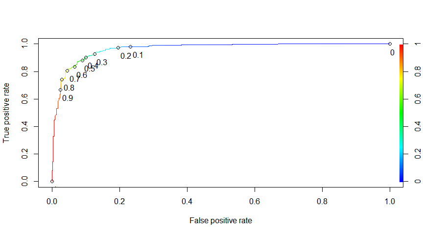
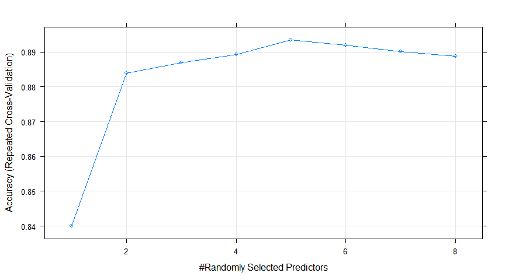

1.  Classification of Homeless Deaths: training machine learning models
================
Maya Bhat-Gregerson
February 21, 2019

-   [INTRODUCTION](#introduction)
-   [I. LOGISTIC REGRESSION MODEL](#i.-logistic-regression-model)
    -   [A. Read, subset, and prepare data](#a.-read-subset-and-prepare-data)
    -   [B. Split data into training and testing subsets and specify reference level for factor predictors](#b.-split-data-into-training-and-testing-subsets-and-specify-reference-level-for-factor-predictors)
    -   [C. Train and evaluate models](#c.-train-and-evaluate-models)
        -   [1a. Model 1: train logistic regression model using package e1071](#a.-model-1-train-logistic-regression-model-using-package-e1071)
        -   [1b. Model 1: evaluate model 1 performance on test data](#b.-model-1-evaluate-model-1-performance-on-test-data)
        -   [2a. Model 2: train logistic regression model with crossvalidation in Caret package](#a.-model-2-train-logistic-regression-model-with-crossvalidation-in-caret-package)
        -   [2b. Model 2: evaluate logistic regression model 2 using test data](#b.-model-2-evaluate-logistic-regression-model-2-using-test-data)
-   [II. NAIVE BAYES CLASSIFIER](#ii.-naive-bayes-classifier)
    -   [Prepare data for text analysis](#prepare-data-for-text-analysis)
    -   [Creating training and test datasets](#creating-training-and-test-datasets)
    -   [Transform sparse matrix into data structure to train model](#transform-sparse-matrix-into-data-structure-to-train-model)
        -   [(A) NAIVE BAYES MODEL using package e1071](#a-naive-bayes-model-using-package-e1071)
        -   [(B) NAIVE BAYES CLASSIFIER using packages caret and klaR](#b-naive-bayes-classifier-using-packages-caret-and-klar)
-   [III. RANDOM FORESTS](#iii.-random-forests)
    -   [A. using randomForests package - ntree = 500](#a.-using-randomforests-package---ntree-500)
    -   [B. using randomForests package - ntree = 1000](#b.-using-randomforests-package---ntree-1000)
    -   [C. using randomForests package - ntree = 1500](#c.-using-randomforests-package---ntree-1500)
    -   [D. Random Forests using caret package](#d.-random-forests-using-caret-package)

``` r
library(caTools)
library(magrittr)
library(tidyverse)
library(knitr)
library(epiDisplay)
library(ROCR)
library(tm)
library(SnowballC)
library(wordcloud)
library(e1071)
library(gmodels)
library(caret)
library(klaR)
library(plyr)

knitr::opts_chunk$set(fig.width = 9, fig.align = "center", message = FALSE, warning = FALSE, echo = TRUE, tidy = TRUE)
```

INTRODUCTION
------------

This is the third and final section of this project in which I train machine learning models that can classify deaths by homeless status.

In the exploratory data analysis phase I was able to identify a number of independent variables that are strongly associated with homelessness. These features include sex, race and ethnicity (5 groups including Hispanic as race), place of death (e.g. home, hospital, hospice, etc), manner of death (natural, homicide, suicide, accident, or undetermined), leading cause of death (groupings of ICD 10 codes), educational attainment, age group, type of injury involved in death (no injury, motor vehicle injury, fall, poisoning), and whether underlying cause of death was due to drug or alcohol use. All predictors are categorical variables.

I. LOGISTIC REGRESSION MODEL
----------------------------

### A. Read, subset, and prepare data

I trained a number of logistic regression models and made modifications with each iteration to improve performance as measured by the relative AIC of the models. Some of the changes I made from one attempt to the next include:

-   removing predictors that did not add information to the model (as indicated by the AIC value in the summary statistics),
-   removing predictors that were not strongly correlated with the outcome in the model (as indicated by the asterisks in the summary statistics),
-   aggregating levels within predictor variables to achieve a minimum cell size of 10 when the predictor was tabulated against the outcome,
-   addressing data imbalance by reducing the number of observations. I included all deaths to homeless individuals (n = 1,090) and undersampled deaths among persons with home reducing this number from roughly 174,000 observations to 1,500 randomly selected deaths.

``` r
# READ FINAL HOMELESS FILE (CREATED AT THE END OF DATA WRANGLING PHASE)

homeless <- read.csv("HomelessFinal.csv")
h1 <- subset(homeless, select = c("sex", "raceethnic5", "manner", "dplacecode", 
    "educ", "age5cat", "LCOD", "status", "injury", "substance"))

# CONVERT 'STATUS' VARIABLE (HOMELESS STATUS) TO NUMERIC VARIABLE AND CREATE
# A DUPLICATE VARIABLE CALLED 'HOMELESS' THAT IS THEN RECODED FROM VALUES 1
# = HOMELESS, 2 = WITH HOME TO 0 = WITH HOME AND 1 = HOMELESS FOR USE IN
# LOGISTIC REGRESSION MODEL

table(h1$status)
```

    ## 
    ##  Homeless With home 
    ##      1093    174298

``` r
table(as.numeric(h1$status))
```

    ## 
    ##      1      2 
    ##   1093 174298

``` r
head(h1$status)
```

    ## [1] Homeless Homeless Homeless Homeless Homeless Homeless
    ## Levels: Homeless With home

``` r
tail(h1$status)
```

    ## [1] With home With home With home With home With home With home
    ## Levels: Homeless With home

``` r
h1$homeless <- h1$status
h1$homeless <- as.numeric(h1$homeless)
table(h1$homeless)
```

    ## 
    ##      1      2 
    ##   1093 174298

``` r
h1$homeless[h1$homeless == 2] <- 0
str(h1$status)
```

    ##  Factor w/ 2 levels "Homeless","With home": 1 1 1 1 1 1 1 1 1 1 ...

``` r
str(h1$homeless)
```

    ##  num [1:175391] 1 1 1 1 1 1 1 1 1 1 ...

``` r
# TO CREATE A BALANCED DATASET LIMIT OBSERVATIONS TO ALL HOMELESS AND 1,500
# DECEDENTS WITH HOME.

withhome <- subset(h1, status == "With home")
homeless <- subset(h1, status == "Homeless")
whsample <- sample_n(withhome, 1500)
h1 <- rbind(whsample, homeless)
table(h1$status, h1$homeless)
```

    ##            
    ##                0    1
    ##   Homeless     0 1093
    ##   With home 1500    0

``` r
# CREATE A COPY OF THE FINAL DATA SET JUST IN CASE...
h2 <- h1

# SET SEED TO REPLICATE MODEL OUTCOMES
set.seed(1234)

# RANDOMIZE ROWS
h2 <- h2[sample(nrow(h2)), ]
head(h2$homeless, n = 20)
```

    ##  [1] 0 1 1 1 1 1 0 0 1 0 1 0 0 1 0 1 0 0 0 0

``` r
# RUN CROSSTABULATIONS WITH OUTCOME VARIABLE x EACH OF THE PREDICTOR
# VARIABLES CHECK CELL SIZE FOR n<10 - AGGREGATE LEVELS TO GET LARGER CELL
# SIZE WHEN n <10

# ALSO CHECK FOR MISSING VALUES AND CODETHESE AS NA

# SEX
table(h2$sex)
```

    ## 
    ##    F    M    U 
    ##  954 1639    0

``` r
# replacE 'unknown' values from predictors with NA
levels(h2$sex)[levels(h2$sex) == "U"] <- NA

# LEADING CAUSES OF DEATH
table(h2$homeless, h2$LCOD)
```

    ##    
    ##     Alzheimers Cancer Chronic Liver dis./cirrh. Chronic Lwr Resp Dis.
    ##   0         94    314                        22                    78
    ##   1          0     28                        58                     8
    ##    
    ##     Diabetes Flu Heart Dis. Injury-unintentional Other Stroke Suicide-all
    ##   0       42  22        325                   78   393     99          33
    ##   1       18  20        155                  487   228     10          81

``` r
# create new variable with aggregated levels reduce from 10 to 3 levels:
# chronic, external cause (injury), and other leading causes of death
h2$LCOD3cat <- fct_collapse(h2$LCOD, LCOD.Chronic = c("Alzheimers", "Cancer", 
    "Heart Dis.", "Chronic Lwr Resp Dis.", "Stroke", "Diabetes", "Chronic Liver dis./cirrh."), 
    LCOD.ExtCause = c("Injury-unintentional", "Suicide-all"), LCOD.Other = c("Flu", 
        "Other"))

table(h2$homeless, h2$LCOD3cat)
```

    ##    
    ##     LCOD.Chronic LCOD.Other LCOD.ExtCause
    ##   0          974        415           111
    ##   1          277        248           568

``` r
# DEATH PLACE CODE
table(h2$homeless, h2$dplacecode)
```

    ##    
    ##      ER Home Hospice Hospital Hospital inpatient In transport
    ##   0  27  425      55        0                507            2
    ##   1  49  100       8        0                272            1
    ##    
    ##     Nursing home/Longterm care Other Other person's home Unknown
    ##   0                        425    59                   0       0
    ##   1                         37   624                   2       0

``` r
# create new variable with 5 instead of 10 levels
h2$dplace5cat <- fct_collapse(h2$dplacecode, ER = c("ER", "In transport"), Hospital = c("Hospital", 
    "Hospital inpatient"), Home = "Home", Hospice.LngTrmCare = c("Hospice", 
    "Nursing home/Longterm care"), Other = c("Other", "Unknown", "Other person's home"))

table(h2$dplacecode, h2$dplace5cat)
```

    ##                             
    ##                               ER Home Hospice.LngTrmCare Hospital Other
    ##   ER                          76    0                  0        0     0
    ##   Home                         0  525                  0        0     0
    ##   Hospice                      0    0                 63        0     0
    ##   Hospital                     0    0                  0        0     0
    ##   Hospital inpatient           0    0                  0      779     0
    ##   In transport                 3    0                  0        0     0
    ##   Nursing home/Longterm care   0    0                462        0     0
    ##   Other                        0    0                  0        0   683
    ##   Other person's home          0    0                  0        0     2
    ##   Unknown                      0    0                  0        0     0

``` r
# EDUCATIONAL ATTAINMENT
table(h2$homeless, h2$educ)
```

    ##    
    ##     <=8th grade 9-12th gr., no diploma Associate's Bachelors
    ##   0         109                     82          89       231
    ##   1          36                    179          25        28
    ##    
    ##     Doctorate/Professional H.S. grad/GED Masters Some college Unknown
    ##   0                     38           492      61          261     137
    ##   1                      2           398      10          109     306

``` r
# create new variable with 4 instead of 10 levels
h2$educ4cat <- fct_collapse(h2$educ, NoHSDiploma = c("<=8th grade", "9-12th gr., no diploma"), 
    HSGrad.GED = "H.S. grad/GED", HSDipl.OrMore = c("Associate's", "Bachelors", 
        "Some college", "Masters", "Doctorate/Professional"), Unknown = "Unknown")

table(h2$educ, h2$educ4cat)
```

    ##                         
    ##                          NoHSDiploma HSDipl.OrMore HSGrad.GED Unknown
    ##   <=8th grade                    145             0          0       0
    ##   9-12th gr., no diploma         261             0          0       0
    ##   Associate's                      0           114          0       0
    ##   Bachelors                        0           259          0       0
    ##   Doctorate/Professional           0            40          0       0
    ##   H.S. grad/GED                    0             0        890       0
    ##   Masters                          0            71          0       0
    ##   Some college                     0           370          0       0
    ##   Unknown                          0             0          0     443

``` r
# RACE/ETHNICITY
table(h2$homeless, h2$raceethnic5)
```

    ##    
    ##     AIAN NH Asian/PI NH Black NH Hispanic Other Unknown White NH
    ##   0      13         121       82       37    13     110     1124
    ##   1      75          24      157       95    21       7      714

``` r
# collapse 'other' and 'unknown' levels into one

h2$race6cat <- fct_collapse(h2$raceethnic5, AIAN.NH = "AIAN NH", AsianPI.NH = "Asian/PI NH", 
    Black.NH = "Black NH", Hispanic = "Hispanic", White.NH = "White NH", Other.Unk = c("Other", 
        "Unknown"))

table(h2$raceethnic5, h2$race6cat)
```

    ##              
    ##               AIAN.NH AsianPI.NH Black.NH Hispanic Other.Unk White.NH
    ##   AIAN NH          88          0        0        0         0        0
    ##   Asian/PI NH       0        145        0        0         0        0
    ##   Black NH          0          0      239        0         0        0
    ##   Hispanic          0          0        0      132         0        0
    ##   Other             0          0        0        0        34        0
    ##   Unknown           0          0        0        0       117        0
    ##   White NH          0          0        0        0         0     1838

``` r
# MANNER OF DEATH
table(h2$homeless, h2$manner)
```

    ##    
    ##     Accident Homicide Natural Pending Suicide Undetermined
    ##   0       79        6    1375       0      33            7
    ##   1      496       61     394       0      81           60

``` r
# collapsing factors to get rid of pendings (n= 0)

h2$manner <- fct_collapse(h2$manner, Accident = "Accident", Homicide = "Homicide", 
    Natural = "Natural", Suicide = "Suicide", Undet.Pending = c("Undetermined", 
        "Pending"))

# AGE GROUP
table(h2$homeless, h2$age5cat)
```

    ##    
    ##     <18yrs 18-29yrs 30-44yrs 45-64yrs 65+ yrs
    ##   0     20       21       51      300    1108
    ##   1      0       84      264      643     101

``` r
# collapse factors to get rid of empty cells

h2$age4cat <- fct_collapse(h2$age5cat, `<29yrs` = c("<18yrs", "18-29yrs"), `30to44yrs` = "30-44yrs", 
    `45to64yrs` = "45-64yrs", `65+yrs` = "65+ yrs")

table(h2$age5cat, h2$age4cat)
```

    ##           
    ##            <29yrs 30to44yrs 45to64yrs 65+yrs
    ##   <18yrs       20         0         0      0
    ##   18-29yrs    105         0         0      0
    ##   30-44yrs      0       315         0      0
    ##   45-64yrs      0         0       943      0
    ##   65+ yrs       0         0         0   1209

``` r
# SUBSTANCE USE
table(h2$homeless, h2$substance)
```

    ##    
    ##     Alcohol-induced Drug-induced No Substance abuse
    ##   0              22           24               1454
    ##   1              91          357                645

``` r
# RENAME 'STATUS' TO 'HOMELESSFAC' (HOMELESS STATUS AS FACTOR)
names(h2)[names(h2) == "status"] <- "homelessFac"

# OMIT OBSERVATIONS WITH NA VALUES
h2 <- na.omit(h2)
str(h2)
```

    ## 'data.frame':    2591 obs. of  16 variables:
    ##  $ sex        : Factor w/ 2 levels "F","M": 1 2 2 2 2 2 1 1 2 1 ...
    ##  $ raceethnic5: Factor w/ 7 levels "AIAN NH","Asian/PI NH",..: 2 2 7 7 7 3 7 7 7 7 ...
    ##  $ manner     : Factor w/ 5 levels "Accident","Homicide",..: 3 4 1 3 1 3 3 3 2 3 ...
    ##  $ dplacecode : Factor w/ 10 levels "ER","Home","Hospice",..: 5 5 8 8 8 8 2 5 8 5 ...
    ##  $ educ       : Factor w/ 9 levels "<=8th grade",..: 8 6 8 6 9 6 4 8 6 8 ...
    ##  $ age5cat    : Factor w/ 5 levels "<18yrs","18-29yrs",..: 5 2 3 4 4 4 5 5 4 4 ...
    ##  $ LCOD       : Factor w/ 11 levels "Alzheimers","Cancer",..: 10 9 8 7 8 7 7 10 9 9 ...
    ##  $ homelessFac: Factor w/ 2 levels "Homeless","With home": 2 1 1 1 1 1 2 2 1 2 ...
    ##  $ injury     : Factor w/ 5 levels "MV - all","No injury",..: 2 2 5 2 5 2 2 2 2 2 ...
    ##  $ substance  : Factor w/ 3 levels "Alcohol-induced",..: 3 3 2 3 2 3 3 3 3 3 ...
    ##  $ homeless   : num  0 1 1 1 1 1 0 0 1 0 ...
    ##  $ LCOD3cat   : Factor w/ 3 levels "LCOD.Chronic",..: 1 2 3 1 3 1 1 1 2 2 ...
    ##  $ dplace5cat : Factor w/ 5 levels "ER","Home","Hospice.LngTrmCare",..: 4 4 5 5 5 5 2 4 5 4 ...
    ##  $ educ4cat   : Factor w/ 4 levels "NoHSDiploma",..: 2 3 2 3 4 3 2 2 3 2 ...
    ##  $ race6cat   : Factor w/ 6 levels "AIAN.NH","AsianPI.NH",..: 2 2 6 6 6 3 6 6 6 6 ...
    ##  $ age4cat    : Factor w/ 4 levels "<29yrs","30to44yrs",..: 4 1 2 3 3 3 4 4 3 3 ...
    ##  - attr(*, "na.action")= 'omit' Named int  1810 2446
    ##   ..- attr(*, "names")= chr  "1077" "963"

``` r
# SAVE ALL CHANGES TO DATAFRAME 'h3' AS BACKUP
h3 <- h2
h2 <- h3
# DROP VARIABLES THAT WERE RECODED TO NEW VARIABLES WITH DIFFERENT LEVELS
# (SEE ABOVE)
h2 <- h2[, c(-2, -4, -5, -6, -7)]

str(h2)
```

    ## 'data.frame':    2591 obs. of  11 variables:
    ##  $ sex        : Factor w/ 2 levels "F","M": 1 2 2 2 2 2 1 1 2 1 ...
    ##  $ manner     : Factor w/ 5 levels "Accident","Homicide",..: 3 4 1 3 1 3 3 3 2 3 ...
    ##  $ homelessFac: Factor w/ 2 levels "Homeless","With home": 2 1 1 1 1 1 2 2 1 2 ...
    ##  $ injury     : Factor w/ 5 levels "MV - all","No injury",..: 2 2 5 2 5 2 2 2 2 2 ...
    ##  $ substance  : Factor w/ 3 levels "Alcohol-induced",..: 3 3 2 3 2 3 3 3 3 3 ...
    ##  $ homeless   : num  0 1 1 1 1 1 0 0 1 0 ...
    ##  $ LCOD3cat   : Factor w/ 3 levels "LCOD.Chronic",..: 1 2 3 1 3 1 1 1 2 2 ...
    ##  $ dplace5cat : Factor w/ 5 levels "ER","Home","Hospice.LngTrmCare",..: 4 4 5 5 5 5 2 4 5 4 ...
    ##  $ educ4cat   : Factor w/ 4 levels "NoHSDiploma",..: 2 3 2 3 4 3 2 2 3 2 ...
    ##  $ race6cat   : Factor w/ 6 levels "AIAN.NH","AsianPI.NH",..: 2 2 6 6 6 3 6 6 6 6 ...
    ##  $ age4cat    : Factor w/ 4 levels "<29yrs","30to44yrs",..: 4 1 2 3 3 3 4 4 3 3 ...

### B. Split data into training and testing subsets and specify reference level for factor predictors

``` r
set.seed(1234)
split = sample.split(h2$homeless, SplitRatio = 0.65)
HTrain = subset(h2, split == TRUE)
HTest = subset(h2, split == FALSE)

# set reference levels for each dummy variable to be created
HTrain$sex <- relevel(HTrain$sex, ref = "F")
HTrain$race6cat <- relevel(HTrain$race6cat, ref = "White.NH")
HTrain$manner <- relevel(HTrain$manner, ref = "Natural")
HTrain$dplace5cat <- relevel(HTrain$dplace5cat, ref = "Home")
HTrain$educ4cat <- relevel(HTrain$educ4cat, ref = "HSDipl.OrMore")
HTrain$age4cat <- relevel(HTrain$age4cat, ref = "65+yrs")
HTrain$injury <- relevel(HTrain$injury, ref = "No injury")
HTrain$substance <- relevel(HTrain$substance, ref = "No Substance abuse")
HTrain$LCOD3cat <- relevel(HTrain$LCOD3cat, ref = "LCOD.Chronic")
HTrain$homelessFac <- relevel(HTrain$homelessFac, ref = "With home")
```

### C. Train and evaluate models

#### 1a. Model 1: train logistic regression model using package e1071

I trained the first logistic regression model using all predictors except 'injury' (whether the death was caused by homicide, suicide or unintentional injury) because of the high likelihood of multicollinearity with dummy variable manner:suicide and dummy variable injury: suicide.

``` r
model.LR1 <- glm(homeless ~ sex + race6cat + dplace5cat + educ4cat + age4cat + 
    manner + substance + LCOD3cat, data = HTrain, family = "binomial")
```

**Table 1 - Summary of logistic regression model 1**

``` r
summary(model.LR1)
```

    ## 
    ## Call:
    ## glm(formula = homeless ~ sex + race6cat + dplace5cat + educ4cat + 
    ##     age4cat + manner + substance + LCOD3cat, family = "binomial", 
    ##     data = HTrain)
    ## 
    ## Deviance Residuals: 
    ##     Min       1Q   Median       3Q      Max  
    ## -3.5690  -0.2416  -0.0993   0.2136   2.8872  
    ## 
    ## Coefficients:
    ##                              Estimate Std. Error z value Pr(>|z|)    
    ## (Intercept)                   -6.3203     0.4282 -14.759  < 2e-16 ***
    ## sexM                           1.1795     0.2281   5.171 2.33e-07 ***
    ## race6catAIAN.NH                1.8773     0.5864   3.201  0.00137 ** 
    ## race6catAsianPI.NH            -1.6072     0.5836  -2.754  0.00589 ** 
    ## race6catBlack.NH               0.4156     0.3162   1.315  0.18863    
    ## race6catHispanic               1.2110     0.4412   2.745  0.00606 ** 
    ## race6catOther.Unk             -3.6012     0.4915  -7.327 2.36e-13 ***
    ## dplace5catER                   2.0439     0.4970   4.113 3.91e-05 ***
    ## dplace5catHospice.LngTrmCare   1.0105     0.3529   2.863  0.00419 ** 
    ## dplace5catHospital             1.2962     0.2750   4.714 2.43e-06 ***
    ## dplace5catOther                3.8150     0.3211  11.882  < 2e-16 ***
    ## educ4catNoHSDiploma            1.5296     0.3079   4.969 6.74e-07 ***
    ## educ4catHSGrad.GED             1.1866     0.2516   4.716 2.41e-06 ***
    ## educ4catUnknown                3.9776     0.3505  11.348  < 2e-16 ***
    ## age4cat<29yrs                  0.6811     0.4287   1.589  0.11215    
    ## age4cat30to44yrs               3.1227     0.3682   8.481  < 2e-16 ***
    ## age4cat45to64yrs               2.1068     0.2461   8.562  < 2e-16 ***
    ## mannerAccident                 2.4979     1.0057   2.484  0.01300 *  
    ## mannerHomicide                 1.9262     0.7538   2.555  0.01061 *  
    ## mannerUndet.Pending            3.1682     0.7459   4.248 2.16e-05 ***
    ## mannerSuicide                  2.6838     1.0764   2.493  0.01266 *  
    ## substanceAlcohol-induced       1.0040     0.4162   2.412  0.01585 *  
    ## substanceDrug-induced          1.9349     0.3877   4.991 6.01e-07 ***
    ## LCOD3catLCOD.Other             0.3178     0.2544   1.249  0.21152    
    ## LCOD3catLCOD.ExtCause         -1.0753     1.0165  -1.058  0.29014    
    ## ---
    ## Signif. codes:  0 '***' 0.001 '**' 0.01 '*' 0.05 '.' 0.1 ' ' 1
    ## 
    ## (Dispersion parameter for binomial family taken to be 1)
    ## 
    ##     Null deviance: 2292.33  on 1683  degrees of freedom
    ## Residual deviance:  737.95  on 1659  degrees of freedom
    ## AIC: 787.95
    ## 
    ## Number of Fisher Scoring iterations: 7

Th summary of model 1 in Table 1 above shows:

1.  A number of the predictors are statistically significantly positively associated with being homelessness at death. Many of these make sense given the relationship between homeless status at death and these independent variables as seen in the exploratory data anlaysis phase. These include:
    -   being male,
    -   being American Indian/Native American non-Hispanic,
    -   being African American and non-Hispanic,
    -   dying in a location designated by the death certifier as "other", "hospital", or "ER",
    -   having a high school diploma/GED or less (compared with having some college or higher education),
    -   being between 30 and 64 years old at the time of death,
    -   manner of death being homicide or undetermined,
    -   dying of drug induced causes,
    -   dying of alcohol induced causes.
2.  Being non-Hispanic Asian or Pacific Islander is significantly negatively associated with being homeless at death.

**Table 2 - Logistic regression model 1 odds ratios and confidence intervals**

``` r
library(Publish)
publish(model.LR1)
```

    ##    Variable              Units OddsRatio          CI.95    p-value 
    ##         sex                  F       Ref                           
    ##                              M      3.25    [2.08;5.09]    < 1e-04 
    ##    race6cat           White.NH       Ref                           
    ##                        AIAN.NH      6.54   [2.07;20.63]   0.001369 
    ##                     AsianPI.NH      0.20    [0.06;0.63]   0.005891 
    ##                       Black.NH      1.52    [0.82;2.82]   0.188625 
    ##                       Hispanic      3.36    [1.41;7.97]   0.006056 
    ##                      Other.Unk      0.03    [0.01;0.07]    < 1e-04 
    ##  dplace5cat               Home       Ref                           
    ##                             ER      7.72   [2.92;20.45]    < 1e-04 
    ##             Hospice.LngTrmCare      2.75    [1.38;5.49]   0.004194 
    ##                       Hospital      3.66    [2.13;6.27]    < 1e-04 
    ##                          Other     45.38  [24.18;85.14]    < 1e-04 
    ##    educ4cat      HSDipl.OrMore       Ref                           
    ##                    NoHSDiploma      4.62    [2.52;8.44]    < 1e-04 
    ##                     HSGrad.GED      3.28    [2.00;5.36]    < 1e-04 
    ##                        Unknown     53.39 [26.86;106.12]    < 1e-04 
    ##     age4cat             65+yrs       Ref                           
    ##                         <29yrs      1.98    [0.85;4.58]   0.112150 
    ##                      30to44yrs     22.71  [11.04;46.73]    < 1e-04 
    ##                      45to64yrs      8.22   [5.08;13.32]    < 1e-04 
    ##      manner            Natural       Ref                           
    ##                       Accident     12.16   [1.69;87.27]   0.012998 
    ##                       Homicide      6.86   [1.57;30.07]   0.010605 
    ##                  Undet.Pending     23.77  [5.51;102.53]    < 1e-04 
    ##                        Suicide     14.64  [1.78;120.72]   0.012656 
    ##   substance No Substance abuse       Ref                           
    ##                Alcohol-induced      2.73    [1.21;6.17]   0.015855 
    ##                   Drug-induced      6.92   [3.24;14.80]    < 1e-04 
    ##    LCOD3cat       LCOD.Chronic       Ref                           
    ##                     LCOD.Other      1.37    [0.83;2.26]   0.211517 
    ##                  LCOD.ExtCause      0.34    [0.05;2.50]   0.290145

Table 2 above converts the coefficients in the model summary above into odds ratios with 95% confidence intervals. The odds ratio values indicate the odds of having the characteristic for a person who died homeless compared to someone who had a permanent home at the time of death. For most of the predictors odds ratios confirm the association with the outcome seen in Table 1.

**Table 3 - Relative importance of predictors to logistic regression model 1**

``` r
varImp(model.LR1)
```

    ##                                Overall
    ## sexM                          5.171142
    ## race6catAIAN.NH               3.201179
    ## race6catAsianPI.NH            2.753781
    ## race6catBlack.NH              1.314657
    ## race6catHispanic              2.744755
    ## race6catOther.Unk             7.326708
    ## dplace5catER                  4.112843
    ## dplace5catHospice.LngTrmCare  2.863152
    ## dplace5catHospital            4.713946
    ## dplace5catOther              11.881558
    ## educ4catNoHSDiploma           4.968594
    ## educ4catHSGrad.GED            4.715998
    ## educ4catUnknown              11.347676
    ## age4cat<29yrs                 1.588604
    ## age4cat30to44yrs              8.480955
    ## age4cat45to64yrs              8.561876
    ## mannerAccident                2.483838
    ## mannerHomicide                2.555437
    ## mannerUndet.Pending           4.247510
    ## mannerSuicide                 2.493314
    ## substanceAlcohol-induced      2.412243
    ## substanceDrug-induced         4.990811
    ## LCOD3catLCOD.Other            1.249406
    ## LCOD3catLCOD.ExtCause         1.057804

Table 3 indicates that place of death is reported as "other", race/ethnicity reported as "other", being 45 to 64 years old at death, being 30 to 44 years old at death, and having a cause of death related to substance use were some of the most important predictors contributing to the model. These results reaffirm the results shown in Table 1 as those same variables had higher coefficients and were flagged as being highly statistically signficantly associated with the outcome. On the other hand, there were some predictors in the model 1 summary table (Table 1) that also had higher coefficient values and were highly statistically signficant that did not appear to contribute as much to the model as the predictors mentioned above.

#### 1b. Model 1: evaluate model 1 performance on test data

I set the threshold probability level at 0.5 i.e. if the model predicts that there's a greater than 0.5 probability that the observation is homeless then it is classified as a homeless death. Tabulating the predicted values against the actual recorded ones gives the confusion matrix.

``` r
predict.LR1 <- predict(model.LR1, type = "response", newdata = HTest)

tbl.LR1 <- table(HTest$homeless, predict.LR1 > 0.4)
tbl.LR1
```

    ##    
    ##     FALSE TRUE
    ##   0   492   33
    ##   1    46  336

``` r
accuracy_LR1 <- round(((tbl.LR1["0", "FALSE"] + tbl.LR1["1", "TRUE"])/(tbl.LR1["0", 
    "FALSE"] + tbl.LR1["1", "TRUE"] + tbl.LR1["1", "FALSE"] + tbl.LR1["0", "TRUE"])) * 
    100, 1)

accuracy_LR1
```

    ## [1] 91.3

``` r
bltbl <- table(h2$homeless)
bltbl
```

    ## 
    ##    0    1 
    ## 1500 1091

The accuracy of logistic regression model 1 is 91.3.

The baseline accuracy is 1500/(1500+1091) = 58% i.e. if all outcomes were predicted as the most common value (in this case '0' or "With home") my baseline prediction would be accurate for 58% of the observations.

Compared to the baseline accuracy logistic regression model 1 is considerably more accurate.

**Figure 1. ROC curve for logistic regression model 1**

``` r
library(ROCR)

ROCRpred.LR1 <- prediction(predict.LR1, HTest$homeless)

ROCRperf.LR1 <- performance(ROCRpred.LR1, "tpr", "fpr")

plot(ROCRperf.LR1, colorize = TRUE, print.cutoffs.at = seq(0, 1, by = 0.1), 
    text.adj = c(-0.2, 1.7))
```



Based on the ROC curve in Figure 1 a 0.5 probability threshold for classifying deaths as homeless vs. with home achieved the highest sensitivity (true positive rate) but decreased the specificity (1-False positive rate). I will need to check with program staff to see if it is more important to them to achieve a higher specificity (reduce false positives as much as possible) in which case I will rase the threshold to 0.8.

#### 2a. Model 2: train logistic regression model with crossvalidation in Caret package

I created my second logistic regression model using the Caret package. The package allowed me to specify tuning parameter values such as using ten-fold crossvalidation to get an average of the model run 10 times.

``` r
ctrl.LR2 <- trainControl(method = "repeatedcv", number = 10, savePredictions = TRUE)

model.lr2 <- train(homelessFac ~ sex + race6cat + dplace5cat + educ4cat + age4cat + 
    manner + substance + LCOD3cat, data = HTrain, family = "binomial", trControl = ctrl.LR2, 
    tuneLength = 5)
```

#### 2b. Model 2: evaluate logistic regression model 2 using test data

``` r
predict.lr2 <- predict(model.lr2, newdata = HTest)

confusionMatrix(data = predict.lr2, HTest$homelessFac)
```

    ## Confusion Matrix and Statistics
    ## 
    ##            Reference
    ## Prediction  Homeless With home
    ##   Homeless       331        32
    ##   With home       51       493
    ##                                           
    ##                Accuracy : 0.9085          
    ##                  95% CI : (0.8878, 0.9265)
    ##     No Information Rate : 0.5788          
    ##     P-Value [Acc > NIR] : < 2e-16         
    ##                                           
    ##                   Kappa : 0.811           
    ##  Mcnemar's Test P-Value : 0.04818         
    ##                                           
    ##             Sensitivity : 0.8665          
    ##             Specificity : 0.9390          
    ##          Pos Pred Value : 0.9118          
    ##          Neg Pred Value : 0.9062          
    ##              Prevalence : 0.4212          
    ##          Detection Rate : 0.3649          
    ##    Detection Prevalence : 0.4002          
    ##       Balanced Accuracy : 0.9028          
    ##                                           
    ##        'Positive' Class : Homeless        
    ## 

II. NAIVE BAYES CLASSIFIER
--------------------------

``` r
# get data and restrict to only literal fields the literal field in this
# dataset is called 'CODliteral' and contains Cause of death lines a-d,
# other significant conditions line, and injury occurrance literal field.

literal <- read.csv("HomelessFinal.csv", stringsAsFactors = FALSE)
literal <- subset(literal, select = c(status, CODliteral))
str(literal)
```

    ## 'data.frame':    175391 obs. of  2 variables:
    ##  $ status    : chr  "Homeless" "Homeless" "Homeless" "Homeless" ...
    ##  $ CODliteral: chr  "COMBINED OPIATE (HEROIN), METHAMPHETAMINE, AND DIPHENHYDRAMINE INTOXICATION     TOXIC USE OF DRUGS" "UNDETERMINED     FOUND DEAD IN JAIL CELL." "ACUTE METHAMPHETAMINE INTOXICATION    HYPERTENSIVE AND ATHEROSCLEROTIC CARDIOVASCULAR DISEASE TOXIC USE OF A DRUG" "ACUTE COMBINED METHAMPHETAMINE AND DEXTROMETHORPHAN INTOXICATION    ATHEROSCLEROTIC AND HYPERTENSIVE CARDIOVASC"| __truncated__ ...

``` r
# set 'status' to factor

literal$status <- factor(literal$status)
str(literal$status)
```

    ##  Factor w/ 2 levels "Homeless","With home": 1 1 1 1 1 1 1 1 1 1 ...

``` r
table(literal$status)
```

    ## 
    ##  Homeless With home 
    ##      1093    174298

``` r
# to remove the problem of unbalanced data I will restrict the 'with home'
# class to about 7,500 randomly selected records

h <- subset(literal, status == "Homeless")
wh <- subset(literal, status == "With home")
summary(h)
```

    ##        status      CODliteral       
    ##  Homeless :1093   Length:1093       
    ##  With home:   0   Class :character  
    ##                   Mode  :character

``` r
summary(wh)
```

    ##        status        CODliteral       
    ##  Homeless :     0   Length:174298     
    ##  With home:174298   Class :character  
    ##                     Mode  :character

``` r
wh_sample <- sample_n(wh, 1500)

literal2 <- rbind(wh_sample, h)
literal2 <- literal2[sample(nrow(literal2)), ]  #randomize order of rows so rows aren't ordered by class
str(literal2)
```

    ## 'data.frame':    2593 obs. of  2 variables:
    ##  $ status    : Factor w/ 2 levels "Homeless","With home": 2 2 1 2 1 1 1 2 2 2 ...
    ##  $ CODliteral: chr  "CVA DUE TO HYPERTENSION DEMENTIA END STAGE ALZHEIMERS DEMENTIA   " "INANITION DEMENTIA, UNKNOWN ETIOLOGY ASCVD  AODM, HBP " "ACUTE OPIATE HEROIN INTOXICATION     TOXIC USE OF DRUG" "PROBABLE HYPERTENSIVE AND ATHEROSCLEROTIC CARDIOVASCULAR DISEASE     " ...

``` r
table(literal2$status)
```

    ## 
    ##  Homeless With home 
    ##      1093      1500

### Prepare data for text analysis

``` r
library(tm)
h_corpus <- VCorpus(VectorSource(literal2$CODliteral))
print(h_corpus)
```

    ## <<VCorpus>>
    ## Metadata:  corpus specific: 0, document level (indexed): 0
    ## Content:  documents: 2593

``` r
CODstop <- c("disease", "combination", "an", "the", "a", "of", "effects", "combined", 
    "due", "to", "by", "and", "failure", "intoxication", "type", "stage", "end", 
    "natural", "on", "unspecified", "arrest", "atrial", "fibrilation", "coronary", 
    "congestive", "history", "diastolic", "probable", "with", "multiple", "small", 
    "non", "event", "advanced", "asymptomatic", "autoimmune", "benign", "clinical", 
    "communicable", "congenital", "degenerative", "febrile", "first-degree", 
    "foca", "fungal", "generalized", "inactive", "infectious", "inflammatory", 
    "invasive", "local", "morbid", "multiple", "noninvasive", "nonspecific", 
    "parasitic", " pathological", "perforated", "primary", "psychiatric", "rheumatic", 
    "second-degree", "severe", "sporadic", "suspected", "systemic", "terminal", 
    "third-degree", " unresponsive ", "untreated", "viral", "virulent", "wasting", 
    "abuse", "unknown", "if", "cause", "death", "use", "in", "with")

# standardize all content

h_corpus_clean <- h_corpus %>% tm_map(content_transformer(tolower)) %>% tm_map(removeNumbers) %>% 
    tm_map(removePunctuation) %>% tm_map(removeWords, stopwords()) %>% tm_map(removeWords, 
    CODstop) %>% tm_map(wordStem, language = "eng") %>% tm_map(stripWhitespace)

h_corpus_clean <- tm_map(h_corpus_clean, PlainTextDocument)  # this line puts the corpus back into the correct data type
h_dtm <- DocumentTermMatrix(h_corpus_clean)
h_dtm
```

    ## <<DocumentTermMatrix (documents: 2593, terms: 1939)>>
    ## Non-/sparse entries: 17479/5010348
    ## Sparsity           : 100%
    ## Maximal term length: 32
    ## Weighting          : term frequency (tf)

### Creating training and test datasets

``` r
split <- sample.split(literal2$status, SplitRatio = 0.7)  # creating training:testing data sets 70:30

h.raw.train <- literal2[split, ]
h.raw.test <- literal2[-split, ]

prop.table(table(h.raw.train$status))
```

    ## 
    ##  Homeless With home 
    ## 0.4214876 0.5785124

``` r
prop.table(table(h.raw.test$status))
```

    ## 
    ##  Homeless With home 
    ## 0.4216821 0.5783179

``` r
h.cleancorpus.train <- h_corpus_clean[split]
h.cleancorpus.test <- h_corpus_clean[-split]

set.seed(1234)
h.dtm.train <- h_dtm[split, ]
h.dtm.test <- h_dtm[-split, ]
```

### Transform sparse matrix into data structure to train model

Eliminate words appearing in fewer than 5 records.

``` r
freqWords <- findFreqTerms(h.dtm.train, 5)  #keeps words that appear at least 5 times


# filter DTM to keep only terms appearing 5 times or more
htrain.filtered <- h.dtm.train[, freqWords]
htest.filtered <- h.dtm.test[, freqWords]


# Create function to convert counts to Yes/No variable indicating
# presence/absence of word

convertCounts <- function(x) {
    x <- ifelse(x > 0, "Present", "Absent")
    x <- factor(x)
}


h.train.final <- apply(htrain.filtered, MARGIN = 2, convertCounts)  #Margin = 2: apply filter to columns
h.test.final <- apply(htest.filtered, MARGIN = 2, convertCounts)
```

#### (A) NAIVE BAYES MODEL using package e1071

``` r
# train model

h.model.nb1 <- naiveBayes(h.train.final, h.raw.train$status, laplace = 1, trainControl(method = "cv", 
    number = 10))

# use model to predict with test data

h.predict.nb1 <- predict(h.model.nb1, h.test.final)

# Evaluate accuracy of model by crosstabulating with raw data

CrossTable(h.predict.nb1, h.raw.test$status, prop.chisq = FALSE, prop.t = FALSE, 
    prop.r = FALSE, dnn = c("predicted", "actual"))
```

    ## 
    ##  
    ##    Cell Contents
    ## |-------------------------|
    ## |                       N |
    ## |           N / Col Total |
    ## |-------------------------|
    ## 
    ##  
    ## Total Observations in Table:  2592 
    ## 
    ##  
    ##              | actual 
    ##    predicted |  Homeless | With home | Row Total | 
    ## -------------|-----------|-----------|-----------|
    ##     Homeless |       903 |       135 |      1038 | 
    ##              |     0.826 |     0.090 |           | 
    ## -------------|-----------|-----------|-----------|
    ##    With home |       190 |      1364 |      1554 | 
    ##              |     0.174 |     0.910 |           | 
    ## -------------|-----------|-----------|-----------|
    ## Column Total |      1093 |      1499 |      2592 | 
    ##              |     0.422 |     0.578 |           | 
    ## -------------|-----------|-----------|-----------|
    ## 
    ## 

``` r
confusionMatrix(h.predict.nb1, h.raw.test$status, positive = "Homeless")
```

    ## Confusion Matrix and Statistics
    ## 
    ##            Reference
    ## Prediction  Homeless With home
    ##   Homeless       903       135
    ##   With home      190      1364
    ##                                           
    ##                Accuracy : 0.8746          
    ##                  95% CI : (0.8612, 0.8871)
    ##     No Information Rate : 0.5783          
    ##     P-Value [Acc > NIR] : < 2.2e-16       
    ##                                           
    ##                   Kappa : 0.7412          
    ##  Mcnemar's Test P-Value : 0.002741        
    ##                                           
    ##             Sensitivity : 0.8262          
    ##             Specificity : 0.9099          
    ##          Pos Pred Value : 0.8699          
    ##          Neg Pred Value : 0.8777          
    ##              Prevalence : 0.4217          
    ##          Detection Rate : 0.3484          
    ##    Detection Prevalence : 0.4005          
    ##       Balanced Accuracy : 0.8681          
    ##                                           
    ##        'Positive' Class : Homeless        
    ## 

#### (B) NAIVE BAYES CLASSIFIER using packages caret and klaR

``` r
library(caret)
library(klaR)
ctrl <- trainControl(method = "cv", number = 10)
grid <- data.frame(fL = 1, usekernel = FALSE, adjust = 0)
h.model.nb2 = train(h.train.final, h.raw.train$status, method = "nb", tuneGrid = grid, 
    trControl = ctrl)

h.model.nb2
```

    ## Naive Bayes 
    ## 
    ## 1815 samples
    ##  409 predictor
    ##    2 classes: 'Homeless', 'With home' 
    ## 
    ## No pre-processing
    ## Resampling: Cross-Validated (10 fold) 
    ## Summary of sample sizes: 1634, 1634, 1634, 1633, 1634, 1633, ... 
    ## Resampling results:
    ## 
    ##   Accuracy   Kappa    
    ##   0.8578502  0.7067126
    ## 
    ## Tuning parameter 'fL' was held constant at a value of 1
    ## Tuning
    ##  parameter 'usekernel' was held constant at a value of FALSE
    ## 
    ## Tuning parameter 'adjust' was held constant at a value of 0

``` r
h.predict.nb2 = predict(h.model.nb2, h.test.final)

confusionMatrix(h.predict.nb2, h.raw.test$status, positive = "Homeless")
```

    ## Confusion Matrix and Statistics
    ## 
    ##            Reference
    ## Prediction  Homeless With home
    ##   Homeless       925       148
    ##   With home      168      1351
    ##                                           
    ##                Accuracy : 0.8781          
    ##                  95% CI : (0.8649, 0.8904)
    ##     No Information Rate : 0.5783          
    ##     P-Value [Acc > NIR] : <2e-16          
    ##                                           
    ##                   Kappa : 0.7494          
    ##  Mcnemar's Test P-Value : 0.2851          
    ##                                           
    ##             Sensitivity : 0.8463          
    ##             Specificity : 0.9013          
    ##          Pos Pred Value : 0.8621          
    ##          Neg Pred Value : 0.8894          
    ##              Prevalence : 0.4217          
    ##          Detection Rate : 0.3569          
    ##    Detection Prevalence : 0.4140          
    ##       Balanced Accuracy : 0.8738          
    ##                                           
    ##        'Positive' Class : Homeless        
    ## 

III. RANDOM FORESTS
-------------------

#### A. using randomForests package - ntree = 500

``` r
## 
library(randomForest)
library(caTools)
# use h2 data set created for logistic regression

# Split into training and testing sets 70:30 (random)

split2 = sample.split(h2$homelessFac, SplitRatio = 0.7)
train.rf = subset(h2, split2 == TRUE)
test.rf = subset(h2, split2 == FALSE)

prop.table(table(train.rf$homelessFac))
```

    ## 
    ##  Homeless With home 
    ## 0.4211687 0.5788313

``` r
prop.table(table(test.rf$homelessFac))
```

    ## 
    ##  Homeless With home 
    ## 0.4208494 0.5791506

``` r
# create a random forest model with default parameters

rfmodel1 <- randomForest(homelessFac ~ sex + race6cat + manner + educ4cat + 
    LCOD3cat + age4cat + substance + injury, data = train.rf, importance = TRUE, 
    mtry = sqrt(8), ntree = 500, na.action = na.roughfix)

rfmodel1
```

    ## 
    ## Call:
    ##  randomForest(formula = homelessFac ~ sex + race6cat + manner +      educ4cat + LCOD3cat + age4cat + substance + injury, data = train.rf,      importance = TRUE, mtry = sqrt(8), ntree = 500, na.action = na.roughfix) 
    ##                Type of random forest: classification
    ##                      Number of trees: 500
    ## No. of variables tried at each split: 3
    ## 
    ##         OOB estimate of  error rate: 10.92%
    ## Confusion matrix:
    ##           Homeless With home class.error
    ## Homeless       692        72  0.09424084
    ## With home      126       924  0.12000000

``` r
importance(rfmodel1)
```

    ##           Homeless With home MeanDecreaseAccuracy MeanDecreaseGini
    ## sex       34.84462 -1.621394             29.45177         33.29722
    ## race6cat  26.55504 43.762620             48.63074         61.90969
    ## manner    23.37366 37.536543             44.94989        133.27722
    ## educ4cat  62.43401 46.761065             60.34038         80.97689
    ## LCOD3cat  11.35287  9.357248             15.76619         43.15193
    ## age4cat   55.11779 46.752730             68.23427        231.99472
    ## substance 21.65824 20.050352             29.21554         53.39190
    ## injury    12.99422 10.367985             17.93922         40.84486

``` r
# predicting on test/validation data

predict.rf1 <- predict(rfmodel1, test.rf, type = "response")

# check classification accuracy - using test/validation data

tbl.RF1 <- table(predict.rf1, test.rf$homelessFac)

accuracy_RF1 <- round(((tbl.RF1["Homeless", "Homeless"] + tbl.RF1["With home", 
    "With home"])/(tbl.RF1["Homeless", "Homeless"] + tbl.RF1["With home", "With home"] + 
    tbl.RF1["With home", "Homeless"] + tbl.RF1["Homeless", "With home"])) * 
    100, 1)

accuracy_RF1
```

    ## [1] 88.9

\`

Accuracy of random forests model 1 (using randomForests package) on test data set is `accuracy_RF1`.

#### B. using randomForests package - ntree = 1000

``` r
## ntree = 1000
library(randomForest)
library(caTools)

# create a random forest model with default parameters

rfmodel2 <- randomForest(homelessFac ~ sex + race6cat + manner + educ4cat + 
    LCOD3cat + age4cat + substance + injury, data = train.rf, importance = TRUE, 
    mtry = sqrt(8), ntree = 1000, na.action = na.roughfix)

rfmodel2
```

    ## 
    ## Call:
    ##  randomForest(formula = homelessFac ~ sex + race6cat + manner +      educ4cat + LCOD3cat + age4cat + substance + injury, data = train.rf,      importance = TRUE, mtry = sqrt(8), ntree = 1000, na.action = na.roughfix) 
    ##                Type of random forest: classification
    ##                      Number of trees: 1000
    ## No. of variables tried at each split: 3
    ## 
    ##         OOB estimate of  error rate: 10.8%
    ## Confusion matrix:
    ##           Homeless With home class.error
    ## Homeless       692        72  0.09424084
    ## With home      124       926  0.11809524

``` r
importance(rfmodel2)
```

    ##           Homeless With home MeanDecreaseAccuracy MeanDecreaseGini
    ## sex       50.36591 -1.129546             41.97105         33.78538
    ## race6cat  34.93711 59.876296             64.76465         59.32945
    ## manner    32.70933 51.487324             63.70488        135.40595
    ## educ4cat  84.13029 64.133362             84.32163         80.27681
    ## LCOD3cat  16.42456 13.989049             22.94388         43.10283
    ## age4cat   80.87335 64.467103             98.27681        224.97023
    ## substance 31.53838 28.709187             42.55607         56.06091
    ## injury    18.76492 13.891992             24.73943         42.65958

``` r
## predictive accuracty of rf model2

# predicting on test/validation data

predict.rf2 <- predict(rfmodel2, test.rf, type = "response")

# check classification accuracy - using test/validation data

tbl.RF2 <- table(predict.rf2, test.rf$homelessFac)

accuracy_RF2 <- round(((tbl.RF2["Homeless", "Homeless"] + tbl.RF2["With home", 
    "With home"])/(tbl.RF2["Homeless", "Homeless"] + tbl.RF2["With home", "With home"] + 
    tbl.RF2["With home", "Homeless"] + tbl.RF2["Homeless", "With home"])) * 
    100, 1)

accuracy_RF2
```

    ## [1] 88.7

Accuracy of random forests model 1 (using randomForests package) on test data set is `accuracy_RF2`.

#### C. using randomForests package - ntree = 1500

``` r
## ntree = 1500
library(randomForest)
library(caTools)

# create a random forest model with default parameters

rfmodel3 <- randomForest(homelessFac ~ sex + race6cat + manner + educ4cat + 
    LCOD3cat + age4cat + substance + injury, data = train.rf, importance = TRUE, 
    mtry = sqrt(8), ntree = 1500, na.action = na.roughfix)

rfmodel3
```

    ## 
    ## Call:
    ##  randomForest(formula = homelessFac ~ sex + race6cat + manner +      educ4cat + LCOD3cat + age4cat + substance + injury, data = train.rf,      importance = TRUE, mtry = sqrt(8), ntree = 1500, na.action = na.roughfix) 
    ##                Type of random forest: classification
    ##                      Number of trees: 1500
    ## No. of variables tried at each split: 3
    ## 
    ##         OOB estimate of  error rate: 10.92%
    ## Confusion matrix:
    ##           Homeless With home class.error
    ## Homeless       691        73  0.09554974
    ## With home      125       925  0.11904762

``` r
importance(rfmodel3)
```

    ##            Homeless With home MeanDecreaseAccuracy MeanDecreaseGini
    ## sex        64.14287  1.858092             54.19679         34.55242
    ## race6cat   40.59888 71.578669             77.81040         59.20772
    ## manner     40.50030 62.523002             76.69026        131.15488
    ## educ4cat  100.77703 79.300662            102.51419         81.01437
    ## LCOD3cat   19.45825 19.259086             28.75207         43.07116
    ## age4cat    95.31662 79.815353            118.15074        231.33689
    ## substance  37.10795 36.721389             53.90594         53.59396
    ## injury     23.43320 17.418378             30.32551         41.99792

``` r
## predictive accuracty of rf model 3

# predicting on test/validation data

predict.rf3 <- predict(rfmodel3, test.rf, type = "response")

# check classification accuracy - using test/validation data

tbl.RF3 <- table(predict.rf3, test.rf$homelessFac)

accuracy_RF3 <- round(((tbl.RF3["Homeless", "Homeless"] + tbl.RF3["With home", 
    "With home"])/(tbl.RF3["Homeless", "Homeless"] + tbl.RF3["With home", "With home"] + 
    tbl.RF3["With home", "Homeless"] + tbl.RF3["Homeless", "With home"])) * 
    100, 1)

accuracy_RF3
```

    ## [1] 88.8

Accuracy of random forests model 1 (using randomForests package) on test data set is `accuracy_RF3`.

#### D. Random Forests using caret package

``` r
# Random forests using caret package - ntree=500, mtry range from 1 to 8
# features.
library(caret)
str(train.rf)
```

    ## 'data.frame':    1814 obs. of  11 variables:
    ##  $ sex        : Factor w/ 2 levels "F","M": 1 2 2 2 1 1 2 1 2 1 ...
    ##  $ manner     : Factor w/ 5 levels "Accident","Homicide",..: 3 1 1 3 3 3 2 3 1 3 ...
    ##  $ homelessFac: Factor w/ 2 levels "Homeless","With home": 2 1 1 1 2 2 1 2 1 2 ...
    ##  $ injury     : Factor w/ 5 levels "MV - all","No injury",..: 2 5 5 2 2 2 2 2 3 2 ...
    ##  $ substance  : Factor w/ 3 levels "Alcohol-induced",..: 3 2 2 3 3 3 3 3 3 3 ...
    ##  $ homeless   : num  0 1 1 1 0 0 1 0 1 0 ...
    ##  $ LCOD3cat   : Factor w/ 3 levels "LCOD.Chronic",..: 1 3 3 1 1 1 2 2 3 1 ...
    ##  $ dplace5cat : Factor w/ 5 levels "ER","Home","Hospice.LngTrmCare",..: 4 5 5 5 2 4 5 4 4 4 ...
    ##  $ educ4cat   : Factor w/ 4 levels "NoHSDiploma",..: 2 2 4 3 2 2 3 2 4 4 ...
    ##  $ race6cat   : Factor w/ 6 levels "AIAN.NH","AsianPI.NH",..: 2 6 6 3 6 6 6 6 6 5 ...
    ##  $ age4cat    : Factor w/ 4 levels "<29yrs","30to44yrs",..: 4 2 3 3 4 4 3 3 4 3 ...

``` r
control <- trainControl(method = "repeatedcv", number = 10, repeats = 10, search = "grid")
tunegrid <- expand.grid(.mtry = c(1:8))
model.rfgrid <- train(homelessFac ~ sex + race6cat + manner + educ4cat + LCOD3cat + 
    age4cat + substance + injury, data = h2, method = "rf", tuneGrid = tunegrid, 
    trControl = control, na.action = na.roughfix)
print(model.rfgrid)
```

    ## Random Forest 
    ## 
    ## 2591 samples
    ##    8 predictor
    ##    2 classes: 'Homeless', 'With home' 
    ## 
    ## No pre-processing
    ## Resampling: Cross-Validated (10 fold, repeated 10 times) 
    ## Summary of sample sizes: 2332, 2332, 2332, 2332, 2332, 2332, ... 
    ## Resampling results across tuning parameters:
    ## 
    ##   mtry  Accuracy   Kappa    
    ##   1     0.8400985  0.6623182
    ##   2     0.8839070  0.7628182
    ##   3     0.8869173  0.7694708
    ##   4     0.8892718  0.7747585
    ##   5     0.8933996  0.7837445
    ##   6     0.8920484  0.7809085
    ##   7     0.8901571  0.7768590
    ##   8     0.8887679  0.7739110
    ## 
    ## Accuracy was used to select the optimal model using the largest value.
    ## The final value used for the model was mtry = 5.

``` r
plot(model.rfgrid)
```


