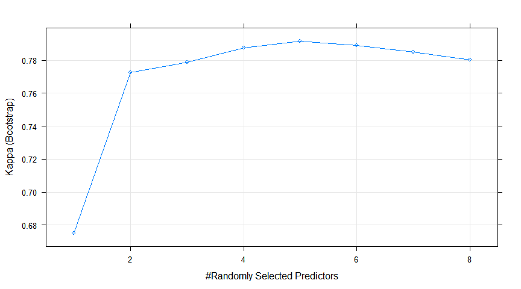

Classification of Homeless Deaths with Machine Learning
================
Maya Bhat-Gregerson
r format(Sys.time(), '%B %d, %Y')

-   [MACHINE LEARNING MODELS TO CLASSIFY DEATHS BY HOMELESS STATUS](#machine-learning-models-to-classify-deaths-by-homeless-status)
    -   [I. LOGISTIC REGRESSION](#i.-logistic-regression)
        -   [READ AND SUBSET DATA](#read-and-subset-data)
        -   [SPLIT DATA INTO TRAINING AND TESTING SUBSETS](#split-data-into-training-and-testing-subsets)
        -   [CREATE MODEL](#create-model)
        -   [APPLY MODEL 1 TO THE TEST DATA SET TO EVALUATE MODEL](#apply-model-1-to-the-test-data-set-to-evaluate-model)
    -   [ROC curve](#roc-curve)
        -   [Logistic regression model 2 - with crossvalidation in Caret package](#logistic-regression-model-2---with-crossvalidation-in-caret-package)
        -   [Prepare data for text analysis](#prepare-data-for-text-analysis)
        -   [Creating training and test datasets](#creating-training-and-test-datasets)
        -   [Transform sparse matrix into data structure to train model](#transform-sparse-matrix-into-data-structure-to-train-model)
        -   [(A) NAIVE BAYES MODEL using package e1071](#a-naive-bayes-model-using-package-e1071)
        -   [(B) NAIVE BAYES CLASSIFIER using packages caret and klaR](#b-naive-bayes-classifier-using-packages-caret-and-klar)
    -   [III. RANDOM FORESTS](#iii.-random-forests)
        -   [A. using randomForests package - ntree = 500](#a.-using-randomforests-package---ntree-500)
        -   [B. using randomForests package - ntree = 1000](#b.-using-randomforests-package---ntree-1000)
        -   [C. using randomForests package - ntree = 1500](#c.-using-randomforests-package---ntree-1500)
        -   [D. Random Forests using caret package](#d.-random-forests-using-caret-package)

MACHINE LEARNING MODELS TO CLASSIFY DEATHS BY HOMELESS STATUS
=============================================================

In the exploratory data analysis phase I was able to identify a number of independent variables that are strongly associated with homelessness. These features include sex, race and ethnicity (5 groups including Hispanic as race), place of death (e.g. home, hospital, hospice, etc), manner of death (natural, homicide, suicide, accident, or undetermined), leading cause of death (groupings of ICD 10 codes), educational attainment, age group, type of injury involved in death (no injury, motor vehicle injury, fall, poisoning), and whether underlying cause of death was due to drug or alcohol use. All predictors are categorical variables.

I. LOGISTIC REGRESSION
----------------------

### READ AND SUBSET DATA

I created two versions of the dataset containing my dependent and independent variables. The first one includes "unknown" values as valid levels in factor variables and the second one recodes them to NAs.

    ## 
    ##  Homeless With home 
    ##      1093    174298

    ## 
    ##      1      2 
    ##   1093 174298

    ## [1] Homeless Homeless Homeless Homeless Homeless Homeless
    ## Levels: Homeless With home

    ## [1] With home With home With home With home With home With home
    ## Levels: Homeless With home

    ## 
    ##      1      2 
    ##   1093 174298

    ##  Factor w/ 2 levels "Homeless","With home": 1 1 1 1 1 1 1 1 1 1 ...

    ##  num [1:175391] 1 1 1 1 1 1 1 1 1 1 ...

    ##            
    ##                0    1
    ##   Homeless     0 1093
    ##   With home 1500    0

    ##  [1] 0 1 1 1 1 1 0 0 1 0 1 0 0 1 0 1 0 0 0 0

    ## 
    ##    F    M    U 
    ##  952 1641    0

    ##    
    ##     Alzheimers Cancer Chronic Liver dis./cirrh. Chronic Lwr Resp Dis.
    ##   0         96    328                        20                    69
    ##   1          0     28                        58                     8
    ##    
    ##     Diabetes Flu Heart Dis. Injury-unintentional Other Stroke Suicide-all
    ##   0       43  29        316                   96   398     88          17
    ##   1       18  20        155                  487   228     10          81

    ##    
    ##     LCOD.Chronic LCOD.Other LCOD.ExtCause
    ##   0          960        427           113
    ##   1          277        248           568

    ##    
    ##      ER Home Hospice Hospital Hospital inpatient In transport
    ##   0  23  411      53        0                523            0
    ##   1  49  100       8        0                272            1
    ##    
    ##     Nursing home/Longterm care Other Other person's home Unknown
    ##   0                        427    63                   0       0
    ##   1                         37   624                   2       0

    ##                             
    ##                               ER Home Hospice.LngTrmCare Hospital Other
    ##   ER                          72    0                  0        0     0
    ##   Home                         0  511                  0        0     0
    ##   Hospice                      0    0                 61        0     0
    ##   Hospital                     0    0                  0        0     0
    ##   Hospital inpatient           0    0                  0      795     0
    ##   In transport                 1    0                  0        0     0
    ##   Nursing home/Longterm care   0    0                464        0     0
    ##   Other                        0    0                  0        0   687
    ##   Other person's home          0    0                  0        0     2
    ##   Unknown                      0    0                  0        0     0

    ##    
    ##     <=8th grade 9-12th gr., no diploma Associate's Bachelors
    ##   0         106                    108          86       209
    ##   1          36                    179          25        28
    ##    
    ##     Doctorate/Professional H.S. grad/GED Masters Some college Unknown
    ##   0                     38           499      73          267     114
    ##   1                      2           398      10          109     306

    ##                         
    ##                          NoHSDiploma HSDipl.OrMore HSGrad.GED Unknown
    ##   <=8th grade                    142             0          0       0
    ##   9-12th gr., no diploma         287             0          0       0
    ##   Associate's                      0           111          0       0
    ##   Bachelors                        0           237          0       0
    ##   Doctorate/Professional           0            40          0       0
    ##   H.S. grad/GED                    0             0        897       0
    ##   Masters                          0            83          0       0
    ##   Some college                     0           376          0       0
    ##   Unknown                          0             0          0     420

    ##    
    ##     AIAN NH Asian/PI NH Black NH Hispanic Other Unknown White NH
    ##   0      18         114       78       44    10      97     1139
    ##   1      75          24      157       95    21       7      714

    ##              
    ##               AIAN.NH AsianPI.NH Black.NH Hispanic Other.Unk White.NH
    ##   AIAN NH          93          0        0        0         0        0
    ##   Asian/PI NH       0        138        0        0         0        0
    ##   Black NH          0          0      235        0         0        0
    ##   Hispanic          0          0        0      139         0        0
    ##   Other             0          0        0        0        31        0
    ##   Unknown           0          0        0        0       104        0
    ##   White NH          0          0        0        0         0     1853

    ##    
    ##     Accident Homicide Natural Pending Suicide Undetermined
    ##   0       92        5    1377       0      17            9
    ##   1      496       61     394       0      81           60

    ##    
    ##     <18yrs 18-29yrs 30-44yrs 45-64yrs 65+ yrs
    ##   0     28       27       46      294    1105
    ##   1      0       84      264      643     101

    ##           
    ##            <29yrs 30to44yrs 45to64yrs 65+yrs
    ##   <18yrs       28         0         0      0
    ##   18-29yrs    111         0         0      0
    ##   30-44yrs      0       310         0      0
    ##   45-64yrs      0         0       937      0
    ##   65+ yrs       0         0         0   1206

    ##    
    ##     Alcohol-induced Drug-induced No Substance abuse
    ##   0              16           33               1451
    ##   1              91          357                645

    ## 'data.frame':    2593 obs. of  16 variables:
    ##  $ sex        : Factor w/ 2 levels "F","M": 2 2 2 2 2 2 2 2 2 1 ...
    ##  $ raceethnic5: Factor w/ 7 levels "AIAN NH","Asian/PI NH",..: 7 2 7 7 7 3 7 7 7 7 ...
    ##  $ manner     : Factor w/ 5 levels "Accident","Homicide",..: 3 4 1 3 1 3 3 3 2 3 ...
    ##  $ dplacecode : Factor w/ 10 levels "ER","Home","Hospice",..: 5 5 8 8 8 8 2 5 8 5 ...
    ##  $ educ       : Factor w/ 9 levels "<=8th grade",..: 8 6 8 6 9 6 4 6 6 4 ...
    ##  $ age5cat    : Factor w/ 5 levels "<18yrs","18-29yrs",..: 5 2 3 4 4 4 5 5 4 5 ...
    ##  $ LCOD       : Factor w/ 11 levels "Alzheimers","Cancer",..: 4 9 8 7 8 7 2 2 9 9 ...
    ##  $ homelessFac: Factor w/ 2 levels "Homeless","With home": 2 1 1 1 1 1 2 2 1 2 ...
    ##  $ injury     : Factor w/ 5 levels "MV - all","No injury",..: 2 2 5 2 5 2 2 2 2 2 ...
    ##  $ substance  : Factor w/ 3 levels "Alcohol-induced",..: 3 3 2 3 2 3 3 3 3 3 ...
    ##  $ homeless   : num  0 1 1 1 1 1 0 0 1 0 ...
    ##  $ LCOD3cat   : Factor w/ 3 levels "LCOD.Chronic",..: 1 2 3 1 3 1 1 1 2 2 ...
    ##  $ dplace5cat : Factor w/ 5 levels "ER","Home","Hospice.LngTrmCare",..: 4 4 5 5 5 5 2 4 5 4 ...
    ##  $ educ4cat   : Factor w/ 4 levels "NoHSDiploma",..: 2 3 2 3 4 3 2 3 3 2 ...
    ##  $ race6cat   : Factor w/ 6 levels "AIAN.NH","AsianPI.NH",..: 6 2 6 6 6 3 6 6 6 6 ...
    ##  $ age4cat    : Factor w/ 4 levels "<29yrs","30to44yrs",..: 4 1 2 3 3 3 4 4 3 4 ...

    ## 'data.frame':    2591 obs. of  16 variables:
    ##  $ sex        : Factor w/ 2 levels "F","M": 2 2 2 2 2 2 2 2 2 1 ...
    ##  $ raceethnic5: Factor w/ 7 levels "AIAN NH","Asian/PI NH",..: 7 2 7 7 7 3 7 7 7 7 ...
    ##  $ manner     : Factor w/ 5 levels "Accident","Homicide",..: 3 4 1 3 1 3 3 3 2 3 ...
    ##  $ dplacecode : Factor w/ 10 levels "ER","Home","Hospice",..: 5 5 8 8 8 8 2 5 8 5 ...
    ##  $ educ       : Factor w/ 9 levels "<=8th grade",..: 8 6 8 6 9 6 4 6 6 4 ...
    ##  $ age5cat    : Factor w/ 5 levels "<18yrs","18-29yrs",..: 5 2 3 4 4 4 5 5 4 5 ...
    ##  $ LCOD       : Factor w/ 11 levels "Alzheimers","Cancer",..: 4 9 8 7 8 7 2 2 9 9 ...
    ##  $ homelessFac: Factor w/ 2 levels "Homeless","With home": 2 1 1 1 1 1 2 2 1 2 ...
    ##  $ injury     : Factor w/ 5 levels "MV - all","No injury",..: 2 2 5 2 5 2 2 2 2 2 ...
    ##  $ substance  : Factor w/ 3 levels "Alcohol-induced",..: 3 3 2 3 2 3 3 3 3 3 ...
    ##  $ homeless   : num  0 1 1 1 1 1 0 0 1 0 ...
    ##  $ LCOD3cat   : Factor w/ 3 levels "LCOD.Chronic",..: 1 2 3 1 3 1 1 1 2 2 ...
    ##  $ dplace5cat : Factor w/ 5 levels "ER","Home","Hospice.LngTrmCare",..: 4 4 5 5 5 5 2 4 5 4 ...
    ##  $ educ4cat   : Factor w/ 4 levels "NoHSDiploma",..: 2 3 2 3 4 3 2 3 3 2 ...
    ##  $ race6cat   : Factor w/ 6 levels "AIAN.NH","AsianPI.NH",..: 6 2 6 6 6 3 6 6 6 6 ...
    ##  $ age4cat    : Factor w/ 4 levels "<29yrs","30to44yrs",..: 4 1 2 3 3 3 4 4 3 4 ...
    ##  - attr(*, "na.action")= 'omit' Named int  1810 2446
    ##   ..- attr(*, "names")= chr  "1077" "963"

    ## 'data.frame':    2591 obs. of  11 variables:
    ##  $ sex        : Factor w/ 2 levels "F","M": 2 2 2 2 2 2 2 2 2 1 ...
    ##  $ manner     : Factor w/ 5 levels "Accident","Homicide",..: 3 4 1 3 1 3 3 3 2 3 ...
    ##  $ homelessFac: Factor w/ 2 levels "Homeless","With home": 2 1 1 1 1 1 2 2 1 2 ...
    ##  $ injury     : Factor w/ 5 levels "MV - all","No injury",..: 2 2 5 2 5 2 2 2 2 2 ...
    ##  $ substance  : Factor w/ 3 levels "Alcohol-induced",..: 3 3 2 3 2 3 3 3 3 3 ...
    ##  $ homeless   : num  0 1 1 1 1 1 0 0 1 0 ...
    ##  $ LCOD3cat   : Factor w/ 3 levels "LCOD.Chronic",..: 1 2 3 1 3 1 1 1 2 2 ...
    ##  $ dplace5cat : Factor w/ 5 levels "ER","Home","Hospice.LngTrmCare",..: 4 4 5 5 5 5 2 4 5 4 ...
    ##  $ educ4cat   : Factor w/ 4 levels "NoHSDiploma",..: 2 3 2 3 4 3 2 3 3 2 ...
    ##  $ race6cat   : Factor w/ 6 levels "AIAN.NH","AsianPI.NH",..: 6 2 6 6 6 3 6 6 6 6 ...
    ##  $ age4cat    : Factor w/ 4 levels "<29yrs","30to44yrs",..: 4 1 2 3 3 3 4 4 3 4 ...

### SPLIT DATA INTO TRAINING AND TESTING SUBSETS

### CREATE MODEL

In this attempt I use the dataset that does not retain "unknown" values as valid levels in factor variables.

I specified the reference categories in each factor variable within the model.

    ## 
    ## Call:
    ## glm(formula = homeless ~ sex + race6cat + dplace5cat + educ4cat + 
    ##     age4cat + manner + substance + LCOD3cat, family = "binomial", 
    ##     data = HTrain)
    ## 
    ## Deviance Residuals: 
    ##     Min       1Q   Median       3Q      Max  
    ## -3.7570  -0.2351  -0.1090   0.1566   3.0371  
    ## 
    ## Coefficients:
    ##                              Estimate Std. Error z value Pr(>|z|)    
    ## (Intercept)                   -5.9135     0.4678 -12.640  < 2e-16 ***
    ## sexM                           1.2140     0.2419   5.019 5.19e-07 ***
    ## race6catAIAN.NH                1.2398     0.5009   2.475 0.013309 *  
    ## race6catAsianPI.NH            -2.5554     0.6477  -3.945 7.96e-05 ***
    ## race6catBlack.NH               0.1908     0.3359   0.568 0.570019    
    ## race6catHispanic               0.1576     0.4338   0.363 0.716365    
    ## race6catOther.Unk             -3.6913     0.5192  -7.110 1.16e-12 ***
    ## dplace5catER                   2.7264     0.5807   4.695 2.67e-06 ***
    ## dplace5catHospice.LngTrmCare   1.1250     0.3681   3.056 0.002244 ** 
    ## dplace5catHospital             1.1854     0.2954   4.012 6.01e-05 ***
    ## dplace5catOther                4.0726     0.3541  11.500  < 2e-16 ***
    ## educ4catNoHSDiploma            1.4911     0.3183   4.685 2.80e-06 ***
    ## educ4catHSGrad.GED             0.8320     0.2589   3.213 0.001313 ** 
    ## educ4catUnknown                4.2778     0.3838  11.147  < 2e-16 ***
    ## age4cat<29yrs                  0.6698     0.4449   1.506 0.132163    
    ## age4cat30to44yrs               3.5109     0.3973   8.836  < 2e-16 ***
    ## age4cat45to64yrs               2.1060     0.2510   8.390  < 2e-16 ***
    ## mannerAccident                 2.4603     0.8126   3.028 0.002463 ** 
    ## mannerHomicide                 2.5281     0.7930   3.188 0.001432 ** 
    ## mannerUndet.Pending            2.3373     0.6381   3.663 0.000249 ***
    ## mannerSuicide                  4.1098     0.9723   4.227 2.37e-05 ***
    ## substanceAlcohol-induced       1.9296     0.4721   4.087 4.37e-05 ***
    ## substanceDrug-induced          1.8577     0.3956   4.696 2.65e-06 ***
    ## LCOD3catLCOD.Chronic          -0.3346     0.2636  -1.269 0.204365    
    ## LCOD3catLCOD.ExtCause         -1.3181     0.8324  -1.584 0.113296    
    ## ---
    ## Signif. codes:  0 '***' 0.001 '**' 0.01 '*' 0.05 '.' 0.1 ' ' 1
    ## 
    ## (Dispersion parameter for binomial family taken to be 1)
    ## 
    ##     Null deviance: 2292.33  on 1683  degrees of freedom
    ## Residual deviance:  681.31  on 1659  degrees of freedom
    ## AIC: 731.31
    ## 
    ## Number of Fisher Scoring iterations: 7

    ##    Variable              Units OddsRatio          CI.95     p-value 
    ##         sex                  F       Ref                            
    ##                              M      3.37    [2.10;5.41]     < 1e-04 
    ##    race6cat           White.NH       Ref                            
    ##                        AIAN.NH      3.46    [1.29;9.22]   0.0133087 
    ##                     AsianPI.NH      0.08    [0.02;0.28]     < 1e-04 
    ##                       Black.NH      1.21    [0.63;2.34]   0.5700192 
    ##                       Hispanic      1.17    [0.50;2.74]   0.7163651 
    ##                      Other.Unk      0.02    [0.01;0.07]     < 1e-04 
    ##  dplace5cat               Home       Ref                            
    ##                             ER     15.28   [4.89;47.68]     < 1e-04 
    ##             Hospice.LngTrmCare      3.08    [1.50;6.34]   0.0022444 
    ##                       Hospital      3.27    [1.83;5.84]     < 1e-04 
    ##                          Other     58.71 [29.33;117.52]     < 1e-04 
    ##    educ4cat      HSDipl.OrMore       Ref                            
    ##                    NoHSDiploma      4.44    [2.38;8.29]     < 1e-04 
    ##                     HSGrad.GED      2.30    [1.38;3.82]   0.0013132 
    ##                        Unknown     72.08 [33.97;152.92]     < 1e-04 
    ##     age4cat             65+yrs       Ref                            
    ##                         <29yrs      1.95    [0.82;4.67]   0.1321626 
    ##                      30to44yrs     33.48  [15.37;72.94]     < 1e-04 
    ##                      45to64yrs      8.22   [5.02;13.44]     < 1e-04 
    ##      manner            Natural       Ref                            
    ##                       Accident     11.71   [2.38;57.57]   0.0024634 
    ##                       Homicide     12.53   [2.65;59.28]   0.0014321 
    ##                  Undet.Pending     10.35   [2.96;36.16]   0.0002493 
    ##                        Suicide     60.93  [9.06;409.68]     < 1e-04 
    ##   substance No Substance abuse       Ref                            
    ##                Alcohol-induced      6.89   [2.73;17.37]     < 1e-04 
    ##                   Drug-induced      6.41   [2.95;13.92]     < 1e-04 
    ##    LCOD3cat         LCOD.Other       Ref                            
    ##                   LCOD.Chronic      0.72    [0.43;1.20]   0.2043651 
    ##                  LCOD.ExtCause      0.27    [0.05;1.37]   0.1132956

    ##                                 Overall
    ## sexM                          5.0191764
    ## race6catAIAN.NH               2.4754002
    ## race6catAsianPI.NH            3.9454974
    ## race6catBlack.NH              0.5680232
    ## race6catHispanic              0.3633210
    ## race6catOther.Unk             7.1102295
    ## dplace5catER                  4.6947797
    ## dplace5catHospice.LngTrmCare  3.0558224
    ## dplace5catHospital            4.0122478
    ## dplace5catOther              11.5002326
    ## educ4catNoHSDiploma           4.6846701
    ## educ4catHSGrad.GED            3.2130803
    ## educ4catUnknown              11.1472284
    ## age4cat<29yrs                 1.5056285
    ## age4cat30to44yrs              8.8363294
    ## age4cat45to64yrs              8.3896028
    ## mannerAccident                3.0278070
    ## mannerHomicide                3.1880991
    ## mannerUndet.Pending           3.6629375
    ## mannerSuicide                 4.2270718
    ## substanceAlcohol-induced      4.0871617
    ## substanceDrug-induced         4.6962181
    ## LCOD3catLCOD.Chronic          1.2692129
    ## LCOD3catLCOD.ExtCause         1.5835525

#### Evaluating logistic regression model 1 performance

1.  Residuals - 50% of the errors in predictions (between 1st and 3rd quartiles) are within an odds ratio of 0.95 to 0.98 away from the true value.
2.  A number of independent variables are statistically significantly positively associated with the dependent variable (homelessness at death). Many of these make sense given the relationship between homeless status at death and these independent variables as seen in the exploratory data anlaysis phase. These include:
    -   being male,
    -   being American Indian/Native American non-Hispanic,
    -   being Hispanic,
    -   dying from an accidental cause, an undetermined cause, or homicide (manner of death),
    -   dying in a location designated by the death certifier as "other" or "other person's home",
    -   age at death from 18 to 64 years old,
    -   dying of alcohol or drug induced causes,
    -   dying of influenza or heart disease.
3.  The ROC curve indicates an AUC of almost 97% indicating that the model has high sensitivity and specificity.

### APPLY MODEL 1 TO THE TEST DATA SET TO EVALUATE MODEL

I set the threshold probability level at 0.5 i.e. if the model predicts that there's a greater than 0.5 probability that the observation is homeless then it is classified as a homeless death. Tabulating the predicted values against the actual recorded ones gives the confusion matrix.

    ##    
    ##     FALSE TRUE
    ##   0   480   45
    ##   1    55  327

    ## [1] 89

    ## 
    ##    0    1 
    ## 1500 1091

Model accuracy is 89.

The baseline accuracy is 1500/(1500+1091) = 58% i.e. if all outcomes were predicted as the most common value (in this case '0' or "With home") my baseline prediction would be accurate for 58% of the observations.

ROC curve
---------

### Logistic regression model 2 - with crossvalidation in Caret package

    ##  Factor w/ 2 levels "Homeless","With home": 2 1 1 1 1 1 2 2 1 2 ...

    ## Warning in confusionMatrix.default(data = predict.lr2, HTest$homelessFac):
    ## Levels are not in the same order for reference and data. Refactoring data
    ## to match.

    ## Confusion Matrix and Statistics
    ## 
    ##            Reference
    ## Prediction  Homeless With home
    ##   Homeless       338        57
    ##   With home       44       468
    ##                                           
    ##                Accuracy : 0.8886          
    ##                  95% CI : (0.8663, 0.9084)
    ##     No Information Rate : 0.5788          
    ##     P-Value [Acc > NIR] : <2e-16          
    ##                                           
    ##                   Kappa : 0.7727          
    ##  Mcnemar's Test P-Value : 0.2325          
    ##                                           
    ##             Sensitivity : 0.8848          
    ##             Specificity : 0.8914          
    ##          Pos Pred Value : 0.8557          
    ##          Neg Pred Value : 0.9141          
    ##              Prevalence : 0.4212          
    ##          Detection Rate : 0.3727          
    ##    Detection Prevalence : 0.4355          
    ##       Balanced Accuracy : 0.8881          
    ##                                           
    ##        'Positive' Class : Homeless        
    ## 

1.  NAIVE BAYES CLASSIFIER \#\#

<!-- -->

    ## 'data.frame':    175391 obs. of  2 variables:
    ##  $ status    : chr  "Homeless" "Homeless" "Homeless" "Homeless" ...
    ##  $ CODliteral: chr  "COMBINED OPIATE (HEROIN), METHAMPHETAMINE, AND DIPHENHYDRAMINE INTOXICATION     TOXIC USE OF DRUGS" "UNDETERMINED     FOUND DEAD IN JAIL CELL." "ACUTE METHAMPHETAMINE INTOXICATION    HYPERTENSIVE AND ATHEROSCLEROTIC CARDIOVASCULAR DISEASE TOXIC USE OF A DRUG" "ACUTE COMBINED METHAMPHETAMINE AND DEXTROMETHORPHAN INTOXICATION    ATHEROSCLEROTIC AND HYPERTENSIVE CARDIOVASC"| __truncated__ ...

    ##  Factor w/ 2 levels "Homeless","With home": 1 1 1 1 1 1 1 1 1 1 ...

    ## 
    ##  Homeless With home 
    ##      1093    174298

    ##        status      CODliteral       
    ##  Homeless :1093   Length:1093       
    ##  With home:   0   Class :character  
    ##                   Mode  :character

    ##        status        CODliteral       
    ##  Homeless :     0   Length:174298     
    ##  With home:174298   Class :character  
    ##                     Mode  :character

    ## 'data.frame':    2593 obs. of  2 variables:
    ##  $ status    : Factor w/ 2 levels "Homeless","With home": 1 1 2 1 1 1 2 1 1 2 ...
    ##  $ CODliteral: chr  "ACUTE OXYCODONE INTOXICATION    ARTERIOSCLEROTIC CARDIOVASCULAR DISEASE TOXIC USE OF A DRUG" "TOXIC ASPHYXIA INHALATION OF PRODUCTS OF COMBUSTION    LIT CHARCOAL GRILL IN ENCLOSED SPACE" "NON SMALL CELL LUNG CANCER COPD    " "BRADYCARDIA EVENT DIASTOLIC LEFT SIDED HEART FAILURE CAD DM TYPE 2 HISTORY OF COPD, CHRONIC RENAL DISEASE " ...

    ## 
    ##  Homeless With home 
    ##      1093      1500

### Prepare data for text analysis

    ## <<SimpleCorpus>>
    ## Metadata:  corpus specific: 1, document level (indexed): 0
    ## Content:  documents: 2593

    ## Warning in tm_map.SimpleCorpus(., content_transformer(tolower)):
    ## transformation drops documents

    ## Warning in tm_map.SimpleCorpus(., removeNumbers): transformation drops
    ## documents

    ## Warning in tm_map.SimpleCorpus(., removePunctuation): transformation drops
    ## documents

    ## Warning in tm_map.SimpleCorpus(., removeWords, stopwords()): transformation
    ## drops documents

    ## Warning in tm_map.SimpleCorpus(., removeWords, CODstop): transformation
    ## drops documents

    ## Warning in tm_map.SimpleCorpus(., wordStem, language = "eng"):
    ## transformation drops documents

    ## Warning in tm_map.SimpleCorpus(., stripWhitespace): transformation drops
    ## documents

    ## <<DocumentTermMatrix (documents: 2593, terms: 1965)>>
    ## Non-/sparse entries: 17652/5077593
    ## Sparsity           : 100%
    ## Maximal term length: 32
    ## Weighting          : term frequency (tf)

### Creating training and test datasets

    ## 
    ##  Homeless With home 
    ## 0.4214876 0.5785124

    ## 
    ##  Homeless With home 
    ## 0.4212963 0.5787037

### Transform sparse matrix into data structure to train model

Eliminate words appearing in fewer than 5 records.

### (A) NAIVE BAYES MODEL using package e1071

    ## 
    ##  
    ##    Cell Contents
    ## |-------------------------|
    ## |                       N |
    ## |           N / Col Total |
    ## |-------------------------|
    ## 
    ##  
    ## Total Observations in Table:  2592 
    ## 
    ##  
    ##              | actual 
    ##    predicted |  Homeless | With home | Row Total | 
    ## -------------|-----------|-----------|-----------|
    ##     Homeless |       877 |       140 |      1017 | 
    ##              |     0.803 |     0.093 |           | 
    ## -------------|-----------|-----------|-----------|
    ##    With home |       215 |      1360 |      1575 | 
    ##              |     0.197 |     0.907 |           | 
    ## -------------|-----------|-----------|-----------|
    ## Column Total |      1092 |      1500 |      2592 | 
    ##              |     0.421 |     0.579 |           | 
    ## -------------|-----------|-----------|-----------|
    ## 
    ## 

    ## Confusion Matrix and Statistics
    ## 
    ##            Reference
    ## Prediction  Homeless With home
    ##   Homeless       877       140
    ##   With home      215      1360
    ##                                           
    ##                Accuracy : 0.863           
    ##                  95% CI : (0.8492, 0.8761)
    ##     No Information Rate : 0.5787          
    ##     P-Value [Acc > NIR] : < 2.2e-16       
    ##                                           
    ##                   Kappa : 0.7165          
    ##  Mcnemar's Test P-Value : 8.583e-05       
    ##                                           
    ##             Sensitivity : 0.8031          
    ##             Specificity : 0.9067          
    ##          Pos Pred Value : 0.8623          
    ##          Neg Pred Value : 0.8635          
    ##              Prevalence : 0.4213          
    ##          Detection Rate : 0.3383          
    ##    Detection Prevalence : 0.3924          
    ##       Balanced Accuracy : 0.8549          
    ##                                           
    ##        'Positive' Class : Homeless        
    ## 

### (B) NAIVE BAYES CLASSIFIER using packages caret and klaR

    ## Warning in FUN(X[[i]], ...): Numerical 0 probability for all classes with
    ## observation 2

    ## Warning in FUN(X[[i]], ...): Numerical 0 probability for all classes with
    ## observation 3

    ## Warning in FUN(X[[i]], ...): Numerical 0 probability for all classes with
    ## observation 5

    ## Warning in FUN(X[[i]], ...): Numerical 0 probability for all classes with
    ## observation 6

    ## Warning in FUN(X[[i]], ...): Numerical 0 probability for all classes with
    ## observation 12

    ## Warning in FUN(X[[i]], ...): Numerical 0 probability for all classes with
    ## observation 13

    ## Warning in FUN(X[[i]], ...): Numerical 0 probability for all classes with
    ## observation 16

    ## Warning in FUN(X[[i]], ...): Numerical 0 probability for all classes with
    ## observation 17

    ## Warning in FUN(X[[i]], ...): Numerical 0 probability for all classes with
    ## observation 18

    ## Warning in FUN(X[[i]], ...): Numerical 0 probability for all classes with
    ## observation 19

    ## Warning in FUN(X[[i]], ...): Numerical 0 probability for all classes with
    ## observation 20

    ## Warning in FUN(X[[i]], ...): Numerical 0 probability for all classes with
    ## observation 21

    ## Warning in FUN(X[[i]], ...): Numerical 0 probability for all classes with
    ## observation 23

    ## Warning in FUN(X[[i]], ...): Numerical 0 probability for all classes with
    ## observation 27

    ## Warning in FUN(X[[i]], ...): Numerical 0 probability for all classes with
    ## observation 28

    ## Warning in FUN(X[[i]], ...): Numerical 0 probability for all classes with
    ## observation 30

    ## Warning in FUN(X[[i]], ...): Numerical 0 probability for all classes with
    ## observation 32

    ## Warning in FUN(X[[i]], ...): Numerical 0 probability for all classes with
    ## observation 33

    ## Warning in FUN(X[[i]], ...): Numerical 0 probability for all classes with
    ## observation 34

    ## Warning in FUN(X[[i]], ...): Numerical 0 probability for all classes with
    ## observation 39

    ## Warning in FUN(X[[i]], ...): Numerical 0 probability for all classes with
    ## observation 40

    ## Warning in FUN(X[[i]], ...): Numerical 0 probability for all classes with
    ## observation 43

    ## Warning in FUN(X[[i]], ...): Numerical 0 probability for all classes with
    ## observation 45

    ## Warning in FUN(X[[i]], ...): Numerical 0 probability for all classes with
    ## observation 46

    ## Warning in FUN(X[[i]], ...): Numerical 0 probability for all classes with
    ## observation 47

    ## Warning in FUN(X[[i]], ...): Numerical 0 probability for all classes with
    ## observation 51

    ## Warning in FUN(X[[i]], ...): Numerical 0 probability for all classes with
    ## observation 53

    ## Warning in FUN(X[[i]], ...): Numerical 0 probability for all classes with
    ## observation 54

    ## Warning in FUN(X[[i]], ...): Numerical 0 probability for all classes with
    ## observation 55

    ## Warning in FUN(X[[i]], ...): Numerical 0 probability for all classes with
    ## observation 56

    ## Warning in FUN(X[[i]], ...): Numerical 0 probability for all classes with
    ## observation 57

    ## Warning in FUN(X[[i]], ...): Numerical 0 probability for all classes with
    ## observation 62

    ## Warning in FUN(X[[i]], ...): Numerical 0 probability for all classes with
    ## observation 63

    ## Warning in FUN(X[[i]], ...): Numerical 0 probability for all classes with
    ## observation 64

    ## Warning in FUN(X[[i]], ...): Numerical 0 probability for all classes with
    ## observation 66

    ## Warning in FUN(X[[i]], ...): Numerical 0 probability for all classes with
    ## observation 68

    ## Warning in FUN(X[[i]], ...): Numerical 0 probability for all classes with
    ## observation 69

    ## Warning in FUN(X[[i]], ...): Numerical 0 probability for all classes with
    ## observation 70

    ## Warning in FUN(X[[i]], ...): Numerical 0 probability for all classes with
    ## observation 71

    ## Warning in FUN(X[[i]], ...): Numerical 0 probability for all classes with
    ## observation 72

    ## Warning in FUN(X[[i]], ...): Numerical 0 probability for all classes with
    ## observation 75

    ## Warning in FUN(X[[i]], ...): Numerical 0 probability for all classes with
    ## observation 76

    ## Warning in FUN(X[[i]], ...): Numerical 0 probability for all classes with
    ## observation 77

    ## Warning in FUN(X[[i]], ...): Numerical 0 probability for all classes with
    ## observation 80

    ## Warning in FUN(X[[i]], ...): Numerical 0 probability for all classes with
    ## observation 82

    ## Warning in FUN(X[[i]], ...): Numerical 0 probability for all classes with
    ## observation 85

    ## Warning in FUN(X[[i]], ...): Numerical 0 probability for all classes with
    ## observation 87

    ## Warning in FUN(X[[i]], ...): Numerical 0 probability for all classes with
    ## observation 91

    ## Warning in FUN(X[[i]], ...): Numerical 0 probability for all classes with
    ## observation 94

    ## Warning in FUN(X[[i]], ...): Numerical 0 probability for all classes with
    ## observation 95

    ## Warning in FUN(X[[i]], ...): Numerical 0 probability for all classes with
    ## observation 96

    ## Warning in FUN(X[[i]], ...): Numerical 0 probability for all classes with
    ## observation 100

    ## Warning in FUN(X[[i]], ...): Numerical 0 probability for all classes with
    ## observation 101

    ## Warning in FUN(X[[i]], ...): Numerical 0 probability for all classes with
    ## observation 102

    ## Warning in FUN(X[[i]], ...): Numerical 0 probability for all classes with
    ## observation 104

    ## Warning in FUN(X[[i]], ...): Numerical 0 probability for all classes with
    ## observation 105

    ## Warning in FUN(X[[i]], ...): Numerical 0 probability for all classes with
    ## observation 107

    ## Warning in FUN(X[[i]], ...): Numerical 0 probability for all classes with
    ## observation 109

    ## Warning in FUN(X[[i]], ...): Numerical 0 probability for all classes with
    ## observation 110

    ## Warning in FUN(X[[i]], ...): Numerical 0 probability for all classes with
    ## observation 111

    ## Warning in FUN(X[[i]], ...): Numerical 0 probability for all classes with
    ## observation 112

    ## Warning in FUN(X[[i]], ...): Numerical 0 probability for all classes with
    ## observation 113

    ## Warning in FUN(X[[i]], ...): Numerical 0 probability for all classes with
    ## observation 114

    ## Warning in FUN(X[[i]], ...): Numerical 0 probability for all classes with
    ## observation 117

    ## Warning in FUN(X[[i]], ...): Numerical 0 probability for all classes with
    ## observation 118

    ## Warning in FUN(X[[i]], ...): Numerical 0 probability for all classes with
    ## observation 119

    ## Warning in FUN(X[[i]], ...): Numerical 0 probability for all classes with
    ## observation 120

    ## Warning in FUN(X[[i]], ...): Numerical 0 probability for all classes with
    ## observation 121

    ## Warning in FUN(X[[i]], ...): Numerical 0 probability for all classes with
    ## observation 122

    ## Warning in FUN(X[[i]], ...): Numerical 0 probability for all classes with
    ## observation 123

    ## Warning in FUN(X[[i]], ...): Numerical 0 probability for all classes with
    ## observation 124

    ## Warning in FUN(X[[i]], ...): Numerical 0 probability for all classes with
    ## observation 126

    ## Warning in FUN(X[[i]], ...): Numerical 0 probability for all classes with
    ## observation 127

    ## Warning in FUN(X[[i]], ...): Numerical 0 probability for all classes with
    ## observation 135

    ## Warning in FUN(X[[i]], ...): Numerical 0 probability for all classes with
    ## observation 136

    ## Warning in FUN(X[[i]], ...): Numerical 0 probability for all classes with
    ## observation 137

    ## Warning in FUN(X[[i]], ...): Numerical 0 probability for all classes with
    ## observation 138

    ## Warning in FUN(X[[i]], ...): Numerical 0 probability for all classes with
    ## observation 140

    ## Warning in FUN(X[[i]], ...): Numerical 0 probability for all classes with
    ## observation 141

    ## Warning in FUN(X[[i]], ...): Numerical 0 probability for all classes with
    ## observation 142

    ## Warning in FUN(X[[i]], ...): Numerical 0 probability for all classes with
    ## observation 143

    ## Warning in FUN(X[[i]], ...): Numerical 0 probability for all classes with
    ## observation 144

    ## Warning in FUN(X[[i]], ...): Numerical 0 probability for all classes with
    ## observation 145

    ## Warning in FUN(X[[i]], ...): Numerical 0 probability for all classes with
    ## observation 146

    ## Warning in FUN(X[[i]], ...): Numerical 0 probability for all classes with
    ## observation 147

    ## Warning in FUN(X[[i]], ...): Numerical 0 probability for all classes with
    ## observation 148

    ## Warning in FUN(X[[i]], ...): Numerical 0 probability for all classes with
    ## observation 150

    ## Warning in FUN(X[[i]], ...): Numerical 0 probability for all classes with
    ## observation 151

    ## Warning in FUN(X[[i]], ...): Numerical 0 probability for all classes with
    ## observation 152

    ## Warning in FUN(X[[i]], ...): Numerical 0 probability for all classes with
    ## observation 154

    ## Warning in FUN(X[[i]], ...): Numerical 0 probability for all classes with
    ## observation 156

    ## Warning in FUN(X[[i]], ...): Numerical 0 probability for all classes with
    ## observation 159

    ## Warning in FUN(X[[i]], ...): Numerical 0 probability for all classes with
    ## observation 162

    ## Warning in FUN(X[[i]], ...): Numerical 0 probability for all classes with
    ## observation 163

    ## Warning in FUN(X[[i]], ...): Numerical 0 probability for all classes with
    ## observation 165

    ## Warning in FUN(X[[i]], ...): Numerical 0 probability for all classes with
    ## observation 166

    ## Warning in FUN(X[[i]], ...): Numerical 0 probability for all classes with
    ## observation 172

    ## Warning in FUN(X[[i]], ...): Numerical 0 probability for all classes with
    ## observation 1

    ## Warning in FUN(X[[i]], ...): Numerical 0 probability for all classes with
    ## observation 2

    ## Warning in FUN(X[[i]], ...): Numerical 0 probability for all classes with
    ## observation 3

    ## Warning in FUN(X[[i]], ...): Numerical 0 probability for all classes with
    ## observation 6

    ## Warning in FUN(X[[i]], ...): Numerical 0 probability for all classes with
    ## observation 7

    ## Warning in FUN(X[[i]], ...): Numerical 0 probability for all classes with
    ## observation 10

    ## Warning in FUN(X[[i]], ...): Numerical 0 probability for all classes with
    ## observation 11

    ## Warning in FUN(X[[i]], ...): Numerical 0 probability for all classes with
    ## observation 13

    ## Warning in FUN(X[[i]], ...): Numerical 0 probability for all classes with
    ## observation 15

    ## Warning in FUN(X[[i]], ...): Numerical 0 probability for all classes with
    ## observation 17

    ## Warning in FUN(X[[i]], ...): Numerical 0 probability for all classes with
    ## observation 22

    ## Warning in FUN(X[[i]], ...): Numerical 0 probability for all classes with
    ## observation 23

    ## Warning in FUN(X[[i]], ...): Numerical 0 probability for all classes with
    ## observation 24

    ## Warning in FUN(X[[i]], ...): Numerical 0 probability for all classes with
    ## observation 25

    ## Warning in FUN(X[[i]], ...): Numerical 0 probability for all classes with
    ## observation 28

    ## Warning in FUN(X[[i]], ...): Numerical 0 probability for all classes with
    ## observation 29

    ## Warning in FUN(X[[i]], ...): Numerical 0 probability for all classes with
    ## observation 30

    ## Warning in FUN(X[[i]], ...): Numerical 0 probability for all classes with
    ## observation 33

    ## Warning in FUN(X[[i]], ...): Numerical 0 probability for all classes with
    ## observation 34

    ## Warning in FUN(X[[i]], ...): Numerical 0 probability for all classes with
    ## observation 35

    ## Warning in FUN(X[[i]], ...): Numerical 0 probability for all classes with
    ## observation 36

    ## Warning in FUN(X[[i]], ...): Numerical 0 probability for all classes with
    ## observation 37

    ## Warning in FUN(X[[i]], ...): Numerical 0 probability for all classes with
    ## observation 38

    ## Warning in FUN(X[[i]], ...): Numerical 0 probability for all classes with
    ## observation 40

    ## Warning in FUN(X[[i]], ...): Numerical 0 probability for all classes with
    ## observation 41

    ## Warning in FUN(X[[i]], ...): Numerical 0 probability for all classes with
    ## observation 42

    ## Warning in FUN(X[[i]], ...): Numerical 0 probability for all classes with
    ## observation 43

    ## Warning in FUN(X[[i]], ...): Numerical 0 probability for all classes with
    ## observation 44

    ## Warning in FUN(X[[i]], ...): Numerical 0 probability for all classes with
    ## observation 48

    ## Warning in FUN(X[[i]], ...): Numerical 0 probability for all classes with
    ## observation 49

    ## Warning in FUN(X[[i]], ...): Numerical 0 probability for all classes with
    ## observation 53

    ## Warning in FUN(X[[i]], ...): Numerical 0 probability for all classes with
    ## observation 54

    ## Warning in FUN(X[[i]], ...): Numerical 0 probability for all classes with
    ## observation 55

    ## Warning in FUN(X[[i]], ...): Numerical 0 probability for all classes with
    ## observation 56

    ## Warning in FUN(X[[i]], ...): Numerical 0 probability for all classes with
    ## observation 57

    ## Warning in FUN(X[[i]], ...): Numerical 0 probability for all classes with
    ## observation 59

    ## Warning in FUN(X[[i]], ...): Numerical 0 probability for all classes with
    ## observation 60

    ## Warning in FUN(X[[i]], ...): Numerical 0 probability for all classes with
    ## observation 63

    ## Warning in FUN(X[[i]], ...): Numerical 0 probability for all classes with
    ## observation 64

    ## Warning in FUN(X[[i]], ...): Numerical 0 probability for all classes with
    ## observation 65

    ## Warning in FUN(X[[i]], ...): Numerical 0 probability for all classes with
    ## observation 67

    ## Warning in FUN(X[[i]], ...): Numerical 0 probability for all classes with
    ## observation 69

    ## Warning in FUN(X[[i]], ...): Numerical 0 probability for all classes with
    ## observation 72

    ## Warning in FUN(X[[i]], ...): Numerical 0 probability for all classes with
    ## observation 73

    ## Warning in FUN(X[[i]], ...): Numerical 0 probability for all classes with
    ## observation 77

    ## Warning in FUN(X[[i]], ...): Numerical 0 probability for all classes with
    ## observation 79

    ## Warning in FUN(X[[i]], ...): Numerical 0 probability for all classes with
    ## observation 81

    ## Warning in FUN(X[[i]], ...): Numerical 0 probability for all classes with
    ## observation 84

    ## Warning in FUN(X[[i]], ...): Numerical 0 probability for all classes with
    ## observation 85

    ## Warning in FUN(X[[i]], ...): Numerical 0 probability for all classes with
    ## observation 86

    ## Warning in FUN(X[[i]], ...): Numerical 0 probability for all classes with
    ## observation 87

    ## Warning in FUN(X[[i]], ...): Numerical 0 probability for all classes with
    ## observation 89

    ## Warning in FUN(X[[i]], ...): Numerical 0 probability for all classes with
    ## observation 91

    ## Warning in FUN(X[[i]], ...): Numerical 0 probability for all classes with
    ## observation 94

    ## Warning in FUN(X[[i]], ...): Numerical 0 probability for all classes with
    ## observation 95

    ## Warning in FUN(X[[i]], ...): Numerical 0 probability for all classes with
    ## observation 97

    ## Warning in FUN(X[[i]], ...): Numerical 0 probability for all classes with
    ## observation 99

    ## Warning in FUN(X[[i]], ...): Numerical 0 probability for all classes with
    ## observation 100

    ## Warning in FUN(X[[i]], ...): Numerical 0 probability for all classes with
    ## observation 104

    ## Warning in FUN(X[[i]], ...): Numerical 0 probability for all classes with
    ## observation 106

    ## Warning in FUN(X[[i]], ...): Numerical 0 probability for all classes with
    ## observation 107

    ## Warning in FUN(X[[i]], ...): Numerical 0 probability for all classes with
    ## observation 108

    ## Warning in FUN(X[[i]], ...): Numerical 0 probability for all classes with
    ## observation 109

    ## Warning in FUN(X[[i]], ...): Numerical 0 probability for all classes with
    ## observation 111

    ## Warning in FUN(X[[i]], ...): Numerical 0 probability for all classes with
    ## observation 113

    ## Warning in FUN(X[[i]], ...): Numerical 0 probability for all classes with
    ## observation 114

    ## Warning in FUN(X[[i]], ...): Numerical 0 probability for all classes with
    ## observation 115

    ## Warning in FUN(X[[i]], ...): Numerical 0 probability for all classes with
    ## observation 116

    ## Warning in FUN(X[[i]], ...): Numerical 0 probability for all classes with
    ## observation 117

    ## Warning in FUN(X[[i]], ...): Numerical 0 probability for all classes with
    ## observation 118

    ## Warning in FUN(X[[i]], ...): Numerical 0 probability for all classes with
    ## observation 119

    ## Warning in FUN(X[[i]], ...): Numerical 0 probability for all classes with
    ## observation 120

    ## Warning in FUN(X[[i]], ...): Numerical 0 probability for all classes with
    ## observation 122

    ## Warning in FUN(X[[i]], ...): Numerical 0 probability for all classes with
    ## observation 123

    ## Warning in FUN(X[[i]], ...): Numerical 0 probability for all classes with
    ## observation 124

    ## Warning in FUN(X[[i]], ...): Numerical 0 probability for all classes with
    ## observation 125

    ## Warning in FUN(X[[i]], ...): Numerical 0 probability for all classes with
    ## observation 129

    ## Warning in FUN(X[[i]], ...): Numerical 0 probability for all classes with
    ## observation 130

    ## Warning in FUN(X[[i]], ...): Numerical 0 probability for all classes with
    ## observation 131

    ## Warning in FUN(X[[i]], ...): Numerical 0 probability for all classes with
    ## observation 132

    ## Warning in FUN(X[[i]], ...): Numerical 0 probability for all classes with
    ## observation 133

    ## Warning in FUN(X[[i]], ...): Numerical 0 probability for all classes with
    ## observation 134

    ## Warning in FUN(X[[i]], ...): Numerical 0 probability for all classes with
    ## observation 135

    ## Warning in FUN(X[[i]], ...): Numerical 0 probability for all classes with
    ## observation 138

    ## Warning in FUN(X[[i]], ...): Numerical 0 probability for all classes with
    ## observation 139

    ## Warning in FUN(X[[i]], ...): Numerical 0 probability for all classes with
    ## observation 140

    ## Warning in FUN(X[[i]], ...): Numerical 0 probability for all classes with
    ## observation 141

    ## Warning in FUN(X[[i]], ...): Numerical 0 probability for all classes with
    ## observation 144

    ## Warning in FUN(X[[i]], ...): Numerical 0 probability for all classes with
    ## observation 145

    ## Warning in FUN(X[[i]], ...): Numerical 0 probability for all classes with
    ## observation 146

    ## Warning in FUN(X[[i]], ...): Numerical 0 probability for all classes with
    ## observation 147

    ## Warning in FUN(X[[i]], ...): Numerical 0 probability for all classes with
    ## observation 148

    ## Warning in FUN(X[[i]], ...): Numerical 0 probability for all classes with
    ## observation 149

    ## Warning in FUN(X[[i]], ...): Numerical 0 probability for all classes with
    ## observation 151

    ## Warning in FUN(X[[i]], ...): Numerical 0 probability for all classes with
    ## observation 152

    ## Warning in FUN(X[[i]], ...): Numerical 0 probability for all classes with
    ## observation 153

    ## Warning in FUN(X[[i]], ...): Numerical 0 probability for all classes with
    ## observation 154

    ## Warning in FUN(X[[i]], ...): Numerical 0 probability for all classes with
    ## observation 155

    ## Warning in FUN(X[[i]], ...): Numerical 0 probability for all classes with
    ## observation 156

    ## Warning in FUN(X[[i]], ...): Numerical 0 probability for all classes with
    ## observation 157

    ## Warning in FUN(X[[i]], ...): Numerical 0 probability for all classes with
    ## observation 159

    ## Warning in FUN(X[[i]], ...): Numerical 0 probability for all classes with
    ## observation 161

    ## Warning in FUN(X[[i]], ...): Numerical 0 probability for all classes with
    ## observation 162

    ## Warning in FUN(X[[i]], ...): Numerical 0 probability for all classes with
    ## observation 163

    ## Warning in FUN(X[[i]], ...): Numerical 0 probability for all classes with
    ## observation 164

    ## Warning in FUN(X[[i]], ...): Numerical 0 probability for all classes with
    ## observation 166

    ## Warning in FUN(X[[i]], ...): Numerical 0 probability for all classes with
    ## observation 167

    ## Warning in FUN(X[[i]], ...): Numerical 0 probability for all classes with
    ## observation 173

    ## Warning in FUN(X[[i]], ...): Numerical 0 probability for all classes with
    ## observation 175

    ## Warning in FUN(X[[i]], ...): Numerical 0 probability for all classes with
    ## observation 176

    ## Warning in FUN(X[[i]], ...): Numerical 0 probability for all classes with
    ## observation 179

    ## Warning in FUN(X[[i]], ...): Numerical 0 probability for all classes with
    ## observation 1

    ## Warning in FUN(X[[i]], ...): Numerical 0 probability for all classes with
    ## observation 2

    ## Warning in FUN(X[[i]], ...): Numerical 0 probability for all classes with
    ## observation 3

    ## Warning in FUN(X[[i]], ...): Numerical 0 probability for all classes with
    ## observation 4

    ## Warning in FUN(X[[i]], ...): Numerical 0 probability for all classes with
    ## observation 5

    ## Warning in FUN(X[[i]], ...): Numerical 0 probability for all classes with
    ## observation 6

    ## Warning in FUN(X[[i]], ...): Numerical 0 probability for all classes with
    ## observation 7

    ## Warning in FUN(X[[i]], ...): Numerical 0 probability for all classes with
    ## observation 8

    ## Warning in FUN(X[[i]], ...): Numerical 0 probability for all classes with
    ## observation 12

    ## Warning in FUN(X[[i]], ...): Numerical 0 probability for all classes with
    ## observation 16

    ## Warning in FUN(X[[i]], ...): Numerical 0 probability for all classes with
    ## observation 18

    ## Warning in FUN(X[[i]], ...): Numerical 0 probability for all classes with
    ## observation 20

    ## Warning in FUN(X[[i]], ...): Numerical 0 probability for all classes with
    ## observation 21

    ## Warning in FUN(X[[i]], ...): Numerical 0 probability for all classes with
    ## observation 22

    ## Warning in FUN(X[[i]], ...): Numerical 0 probability for all classes with
    ## observation 23

    ## Warning in FUN(X[[i]], ...): Numerical 0 probability for all classes with
    ## observation 25

    ## Warning in FUN(X[[i]], ...): Numerical 0 probability for all classes with
    ## observation 28

    ## Warning in FUN(X[[i]], ...): Numerical 0 probability for all classes with
    ## observation 30

    ## Warning in FUN(X[[i]], ...): Numerical 0 probability for all classes with
    ## observation 31

    ## Warning in FUN(X[[i]], ...): Numerical 0 probability for all classes with
    ## observation 32

    ## Warning in FUN(X[[i]], ...): Numerical 0 probability for all classes with
    ## observation 36

    ## Warning in FUN(X[[i]], ...): Numerical 0 probability for all classes with
    ## observation 38

    ## Warning in FUN(X[[i]], ...): Numerical 0 probability for all classes with
    ## observation 39

    ## Warning in FUN(X[[i]], ...): Numerical 0 probability for all classes with
    ## observation 43

    ## Warning in FUN(X[[i]], ...): Numerical 0 probability for all classes with
    ## observation 45

    ## Warning in FUN(X[[i]], ...): Numerical 0 probability for all classes with
    ## observation 46

    ## Warning in FUN(X[[i]], ...): Numerical 0 probability for all classes with
    ## observation 47

    ## Warning in FUN(X[[i]], ...): Numerical 0 probability for all classes with
    ## observation 48

    ## Warning in FUN(X[[i]], ...): Numerical 0 probability for all classes with
    ## observation 49

    ## Warning in FUN(X[[i]], ...): Numerical 0 probability for all classes with
    ## observation 50

    ## Warning in FUN(X[[i]], ...): Numerical 0 probability for all classes with
    ## observation 52

    ## Warning in FUN(X[[i]], ...): Numerical 0 probability for all classes with
    ## observation 53

    ## Warning in FUN(X[[i]], ...): Numerical 0 probability for all classes with
    ## observation 56

    ## Warning in FUN(X[[i]], ...): Numerical 0 probability for all classes with
    ## observation 57

    ## Warning in FUN(X[[i]], ...): Numerical 0 probability for all classes with
    ## observation 58

    ## Warning in FUN(X[[i]], ...): Numerical 0 probability for all classes with
    ## observation 59

    ## Warning in FUN(X[[i]], ...): Numerical 0 probability for all classes with
    ## observation 60

    ## Warning in FUN(X[[i]], ...): Numerical 0 probability for all classes with
    ## observation 62

    ## Warning in FUN(X[[i]], ...): Numerical 0 probability for all classes with
    ## observation 64

    ## Warning in FUN(X[[i]], ...): Numerical 0 probability for all classes with
    ## observation 65

    ## Warning in FUN(X[[i]], ...): Numerical 0 probability for all classes with
    ## observation 66

    ## Warning in FUN(X[[i]], ...): Numerical 0 probability for all classes with
    ## observation 67

    ## Warning in FUN(X[[i]], ...): Numerical 0 probability for all classes with
    ## observation 68

    ## Warning in FUN(X[[i]], ...): Numerical 0 probability for all classes with
    ## observation 69

    ## Warning in FUN(X[[i]], ...): Numerical 0 probability for all classes with
    ## observation 70

    ## Warning in FUN(X[[i]], ...): Numerical 0 probability for all classes with
    ## observation 73

    ## Warning in FUN(X[[i]], ...): Numerical 0 probability for all classes with
    ## observation 74

    ## Warning in FUN(X[[i]], ...): Numerical 0 probability for all classes with
    ## observation 75

    ## Warning in FUN(X[[i]], ...): Numerical 0 probability for all classes with
    ## observation 76

    ## Warning in FUN(X[[i]], ...): Numerical 0 probability for all classes with
    ## observation 77

    ## Warning in FUN(X[[i]], ...): Numerical 0 probability for all classes with
    ## observation 78

    ## Warning in FUN(X[[i]], ...): Numerical 0 probability for all classes with
    ## observation 80

    ## Warning in FUN(X[[i]], ...): Numerical 0 probability for all classes with
    ## observation 81

    ## Warning in FUN(X[[i]], ...): Numerical 0 probability for all classes with
    ## observation 82

    ## Warning in FUN(X[[i]], ...): Numerical 0 probability for all classes with
    ## observation 84

    ## Warning in FUN(X[[i]], ...): Numerical 0 probability for all classes with
    ## observation 85

    ## Warning in FUN(X[[i]], ...): Numerical 0 probability for all classes with
    ## observation 89

    ## Warning in FUN(X[[i]], ...): Numerical 0 probability for all classes with
    ## observation 91

    ## Warning in FUN(X[[i]], ...): Numerical 0 probability for all classes with
    ## observation 94

    ## Warning in FUN(X[[i]], ...): Numerical 0 probability for all classes with
    ## observation 95

    ## Warning in FUN(X[[i]], ...): Numerical 0 probability for all classes with
    ## observation 96

    ## Warning in FUN(X[[i]], ...): Numerical 0 probability for all classes with
    ## observation 97

    ## Warning in FUN(X[[i]], ...): Numerical 0 probability for all classes with
    ## observation 100

    ## Warning in FUN(X[[i]], ...): Numerical 0 probability for all classes with
    ## observation 101

    ## Warning in FUN(X[[i]], ...): Numerical 0 probability for all classes with
    ## observation 102

    ## Warning in FUN(X[[i]], ...): Numerical 0 probability for all classes with
    ## observation 103

    ## Warning in FUN(X[[i]], ...): Numerical 0 probability for all classes with
    ## observation 104

    ## Warning in FUN(X[[i]], ...): Numerical 0 probability for all classes with
    ## observation 108

    ## Warning in FUN(X[[i]], ...): Numerical 0 probability for all classes with
    ## observation 109

    ## Warning in FUN(X[[i]], ...): Numerical 0 probability for all classes with
    ## observation 110

    ## Warning in FUN(X[[i]], ...): Numerical 0 probability for all classes with
    ## observation 115

    ## Warning in FUN(X[[i]], ...): Numerical 0 probability for all classes with
    ## observation 122

    ## Warning in FUN(X[[i]], ...): Numerical 0 probability for all classes with
    ## observation 128

    ## Warning in FUN(X[[i]], ...): Numerical 0 probability for all classes with
    ## observation 130

    ## Warning in FUN(X[[i]], ...): Numerical 0 probability for all classes with
    ## observation 131

    ## Warning in FUN(X[[i]], ...): Numerical 0 probability for all classes with
    ## observation 132

    ## Warning in FUN(X[[i]], ...): Numerical 0 probability for all classes with
    ## observation 133

    ## Warning in FUN(X[[i]], ...): Numerical 0 probability for all classes with
    ## observation 136

    ## Warning in FUN(X[[i]], ...): Numerical 0 probability for all classes with
    ## observation 140

    ## Warning in FUN(X[[i]], ...): Numerical 0 probability for all classes with
    ## observation 141

    ## Warning in FUN(X[[i]], ...): Numerical 0 probability for all classes with
    ## observation 142

    ## Warning in FUN(X[[i]], ...): Numerical 0 probability for all classes with
    ## observation 143

    ## Warning in FUN(X[[i]], ...): Numerical 0 probability for all classes with
    ## observation 145

    ## Warning in FUN(X[[i]], ...): Numerical 0 probability for all classes with
    ## observation 146

    ## Warning in FUN(X[[i]], ...): Numerical 0 probability for all classes with
    ## observation 147

    ## Warning in FUN(X[[i]], ...): Numerical 0 probability for all classes with
    ## observation 149

    ## Warning in FUN(X[[i]], ...): Numerical 0 probability for all classes with
    ## observation 151

    ## Warning in FUN(X[[i]], ...): Numerical 0 probability for all classes with
    ## observation 154

    ## Warning in FUN(X[[i]], ...): Numerical 0 probability for all classes with
    ## observation 155

    ## Warning in FUN(X[[i]], ...): Numerical 0 probability for all classes with
    ## observation 156

    ## Warning in FUN(X[[i]], ...): Numerical 0 probability for all classes with
    ## observation 158

    ## Warning in FUN(X[[i]], ...): Numerical 0 probability for all classes with
    ## observation 159

    ## Warning in FUN(X[[i]], ...): Numerical 0 probability for all classes with
    ## observation 161

    ## Warning in FUN(X[[i]], ...): Numerical 0 probability for all classes with
    ## observation 162

    ## Warning in FUN(X[[i]], ...): Numerical 0 probability for all classes with
    ## observation 163

    ## Warning in FUN(X[[i]], ...): Numerical 0 probability for all classes with
    ## observation 164

    ## Warning in FUN(X[[i]], ...): Numerical 0 probability for all classes with
    ## observation 166

    ## Warning in FUN(X[[i]], ...): Numerical 0 probability for all classes with
    ## observation 167

    ## Warning in FUN(X[[i]], ...): Numerical 0 probability for all classes with
    ## observation 168

    ## Warning in FUN(X[[i]], ...): Numerical 0 probability for all classes with
    ## observation 171

    ## Warning in FUN(X[[i]], ...): Numerical 0 probability for all classes with
    ## observation 172

    ## Warning in FUN(X[[i]], ...): Numerical 0 probability for all classes with
    ## observation 173

    ## Warning in FUN(X[[i]], ...): Numerical 0 probability for all classes with
    ## observation 174

    ## Warning in FUN(X[[i]], ...): Numerical 0 probability for all classes with
    ## observation 175

    ## Warning in FUN(X[[i]], ...): Numerical 0 probability for all classes with
    ## observation 178

    ## Warning in FUN(X[[i]], ...): Numerical 0 probability for all classes with
    ## observation 179

    ## Warning in FUN(X[[i]], ...): Numerical 0 probability for all classes with
    ## observation 180

    ## Warning in FUN(X[[i]], ...): Numerical 0 probability for all classes with
    ## observation 182

    ## Warning in FUN(X[[i]], ...): Numerical 0 probability for all classes with
    ## observation 3

    ## Warning in FUN(X[[i]], ...): Numerical 0 probability for all classes with
    ## observation 6

    ## Warning in FUN(X[[i]], ...): Numerical 0 probability for all classes with
    ## observation 9

    ## Warning in FUN(X[[i]], ...): Numerical 0 probability for all classes with
    ## observation 10

    ## Warning in FUN(X[[i]], ...): Numerical 0 probability for all classes with
    ## observation 11

    ## Warning in FUN(X[[i]], ...): Numerical 0 probability for all classes with
    ## observation 12

    ## Warning in FUN(X[[i]], ...): Numerical 0 probability for all classes with
    ## observation 13

    ## Warning in FUN(X[[i]], ...): Numerical 0 probability for all classes with
    ## observation 16

    ## Warning in FUN(X[[i]], ...): Numerical 0 probability for all classes with
    ## observation 17

    ## Warning in FUN(X[[i]], ...): Numerical 0 probability for all classes with
    ## observation 19

    ## Warning in FUN(X[[i]], ...): Numerical 0 probability for all classes with
    ## observation 20

    ## Warning in FUN(X[[i]], ...): Numerical 0 probability for all classes with
    ## observation 21

    ## Warning in FUN(X[[i]], ...): Numerical 0 probability for all classes with
    ## observation 24

    ## Warning in FUN(X[[i]], ...): Numerical 0 probability for all classes with
    ## observation 26

    ## Warning in FUN(X[[i]], ...): Numerical 0 probability for all classes with
    ## observation 29

    ## Warning in FUN(X[[i]], ...): Numerical 0 probability for all classes with
    ## observation 31

    ## Warning in FUN(X[[i]], ...): Numerical 0 probability for all classes with
    ## observation 32

    ## Warning in FUN(X[[i]], ...): Numerical 0 probability for all classes with
    ## observation 33

    ## Warning in FUN(X[[i]], ...): Numerical 0 probability for all classes with
    ## observation 34

    ## Warning in FUN(X[[i]], ...): Numerical 0 probability for all classes with
    ## observation 36

    ## Warning in FUN(X[[i]], ...): Numerical 0 probability for all classes with
    ## observation 37

    ## Warning in FUN(X[[i]], ...): Numerical 0 probability for all classes with
    ## observation 38

    ## Warning in FUN(X[[i]], ...): Numerical 0 probability for all classes with
    ## observation 39

    ## Warning in FUN(X[[i]], ...): Numerical 0 probability for all classes with
    ## observation 40

    ## Warning in FUN(X[[i]], ...): Numerical 0 probability for all classes with
    ## observation 42

    ## Warning in FUN(X[[i]], ...): Numerical 0 probability for all classes with
    ## observation 44

    ## Warning in FUN(X[[i]], ...): Numerical 0 probability for all classes with
    ## observation 46

    ## Warning in FUN(X[[i]], ...): Numerical 0 probability for all classes with
    ## observation 47

    ## Warning in FUN(X[[i]], ...): Numerical 0 probability for all classes with
    ## observation 48

    ## Warning in FUN(X[[i]], ...): Numerical 0 probability for all classes with
    ## observation 49

    ## Warning in FUN(X[[i]], ...): Numerical 0 probability for all classes with
    ## observation 50

    ## Warning in FUN(X[[i]], ...): Numerical 0 probability for all classes with
    ## observation 52

    ## Warning in FUN(X[[i]], ...): Numerical 0 probability for all classes with
    ## observation 55

    ## Warning in FUN(X[[i]], ...): Numerical 0 probability for all classes with
    ## observation 56

    ## Warning in FUN(X[[i]], ...): Numerical 0 probability for all classes with
    ## observation 58

    ## Warning in FUN(X[[i]], ...): Numerical 0 probability for all classes with
    ## observation 59

    ## Warning in FUN(X[[i]], ...): Numerical 0 probability for all classes with
    ## observation 60

    ## Warning in FUN(X[[i]], ...): Numerical 0 probability for all classes with
    ## observation 61

    ## Warning in FUN(X[[i]], ...): Numerical 0 probability for all classes with
    ## observation 62

    ## Warning in FUN(X[[i]], ...): Numerical 0 probability for all classes with
    ## observation 63

    ## Warning in FUN(X[[i]], ...): Numerical 0 probability for all classes with
    ## observation 66

    ## Warning in FUN(X[[i]], ...): Numerical 0 probability for all classes with
    ## observation 70

    ## Warning in FUN(X[[i]], ...): Numerical 0 probability for all classes with
    ## observation 71

    ## Warning in FUN(X[[i]], ...): Numerical 0 probability for all classes with
    ## observation 73

    ## Warning in FUN(X[[i]], ...): Numerical 0 probability for all classes with
    ## observation 74

    ## Warning in FUN(X[[i]], ...): Numerical 0 probability for all classes with
    ## observation 75

    ## Warning in FUN(X[[i]], ...): Numerical 0 probability for all classes with
    ## observation 78

    ## Warning in FUN(X[[i]], ...): Numerical 0 probability for all classes with
    ## observation 80

    ## Warning in FUN(X[[i]], ...): Numerical 0 probability for all classes with
    ## observation 83

    ## Warning in FUN(X[[i]], ...): Numerical 0 probability for all classes with
    ## observation 84

    ## Warning in FUN(X[[i]], ...): Numerical 0 probability for all classes with
    ## observation 85

    ## Warning in FUN(X[[i]], ...): Numerical 0 probability for all classes with
    ## observation 87

    ## Warning in FUN(X[[i]], ...): Numerical 0 probability for all classes with
    ## observation 88

    ## Warning in FUN(X[[i]], ...): Numerical 0 probability for all classes with
    ## observation 90

    ## Warning in FUN(X[[i]], ...): Numerical 0 probability for all classes with
    ## observation 94

    ## Warning in FUN(X[[i]], ...): Numerical 0 probability for all classes with
    ## observation 95

    ## Warning in FUN(X[[i]], ...): Numerical 0 probability for all classes with
    ## observation 96

    ## Warning in FUN(X[[i]], ...): Numerical 0 probability for all classes with
    ## observation 97

    ## Warning in FUN(X[[i]], ...): Numerical 0 probability for all classes with
    ## observation 99

    ## Warning in FUN(X[[i]], ...): Numerical 0 probability for all classes with
    ## observation 100

    ## Warning in FUN(X[[i]], ...): Numerical 0 probability for all classes with
    ## observation 102

    ## Warning in FUN(X[[i]], ...): Numerical 0 probability for all classes with
    ## observation 103

    ## Warning in FUN(X[[i]], ...): Numerical 0 probability for all classes with
    ## observation 105

    ## Warning in FUN(X[[i]], ...): Numerical 0 probability for all classes with
    ## observation 106

    ## Warning in FUN(X[[i]], ...): Numerical 0 probability for all classes with
    ## observation 107

    ## Warning in FUN(X[[i]], ...): Numerical 0 probability for all classes with
    ## observation 108

    ## Warning in FUN(X[[i]], ...): Numerical 0 probability for all classes with
    ## observation 110

    ## Warning in FUN(X[[i]], ...): Numerical 0 probability for all classes with
    ## observation 111

    ## Warning in FUN(X[[i]], ...): Numerical 0 probability for all classes with
    ## observation 112

    ## Warning in FUN(X[[i]], ...): Numerical 0 probability for all classes with
    ## observation 114

    ## Warning in FUN(X[[i]], ...): Numerical 0 probability for all classes with
    ## observation 115

    ## Warning in FUN(X[[i]], ...): Numerical 0 probability for all classes with
    ## observation 116

    ## Warning in FUN(X[[i]], ...): Numerical 0 probability for all classes with
    ## observation 119

    ## Warning in FUN(X[[i]], ...): Numerical 0 probability for all classes with
    ## observation 120

    ## Warning in FUN(X[[i]], ...): Numerical 0 probability for all classes with
    ## observation 121

    ## Warning in FUN(X[[i]], ...): Numerical 0 probability for all classes with
    ## observation 122

    ## Warning in FUN(X[[i]], ...): Numerical 0 probability for all classes with
    ## observation 123

    ## Warning in FUN(X[[i]], ...): Numerical 0 probability for all classes with
    ## observation 124

    ## Warning in FUN(X[[i]], ...): Numerical 0 probability for all classes with
    ## observation 127

    ## Warning in FUN(X[[i]], ...): Numerical 0 probability for all classes with
    ## observation 128

    ## Warning in FUN(X[[i]], ...): Numerical 0 probability for all classes with
    ## observation 130

    ## Warning in FUN(X[[i]], ...): Numerical 0 probability for all classes with
    ## observation 131

    ## Warning in FUN(X[[i]], ...): Numerical 0 probability for all classes with
    ## observation 133

    ## Warning in FUN(X[[i]], ...): Numerical 0 probability for all classes with
    ## observation 135

    ## Warning in FUN(X[[i]], ...): Numerical 0 probability for all classes with
    ## observation 138

    ## Warning in FUN(X[[i]], ...): Numerical 0 probability for all classes with
    ## observation 139

    ## Warning in FUN(X[[i]], ...): Numerical 0 probability for all classes with
    ## observation 140

    ## Warning in FUN(X[[i]], ...): Numerical 0 probability for all classes with
    ## observation 141

    ## Warning in FUN(X[[i]], ...): Numerical 0 probability for all classes with
    ## observation 142

    ## Warning in FUN(X[[i]], ...): Numerical 0 probability for all classes with
    ## observation 143

    ## Warning in FUN(X[[i]], ...): Numerical 0 probability for all classes with
    ## observation 144

    ## Warning in FUN(X[[i]], ...): Numerical 0 probability for all classes with
    ## observation 145

    ## Warning in FUN(X[[i]], ...): Numerical 0 probability for all classes with
    ## observation 146

    ## Warning in FUN(X[[i]], ...): Numerical 0 probability for all classes with
    ## observation 148

    ## Warning in FUN(X[[i]], ...): Numerical 0 probability for all classes with
    ## observation 149

    ## Warning in FUN(X[[i]], ...): Numerical 0 probability for all classes with
    ## observation 150

    ## Warning in FUN(X[[i]], ...): Numerical 0 probability for all classes with
    ## observation 154

    ## Warning in FUN(X[[i]], ...): Numerical 0 probability for all classes with
    ## observation 155

    ## Warning in FUN(X[[i]], ...): Numerical 0 probability for all classes with
    ## observation 157

    ## Warning in FUN(X[[i]], ...): Numerical 0 probability for all classes with
    ## observation 158

    ## Warning in FUN(X[[i]], ...): Numerical 0 probability for all classes with
    ## observation 159

    ## Warning in FUN(X[[i]], ...): Numerical 0 probability for all classes with
    ## observation 161

    ## Warning in FUN(X[[i]], ...): Numerical 0 probability for all classes with
    ## observation 162

    ## Warning in FUN(X[[i]], ...): Numerical 0 probability for all classes with
    ## observation 165

    ## Warning in FUN(X[[i]], ...): Numerical 0 probability for all classes with
    ## observation 166

    ## Warning in FUN(X[[i]], ...): Numerical 0 probability for all classes with
    ## observation 167

    ## Warning in FUN(X[[i]], ...): Numerical 0 probability for all classes with
    ## observation 168

    ## Warning in FUN(X[[i]], ...): Numerical 0 probability for all classes with
    ## observation 169

    ## Warning in FUN(X[[i]], ...): Numerical 0 probability for all classes with
    ## observation 170

    ## Warning in FUN(X[[i]], ...): Numerical 0 probability for all classes with
    ## observation 172

    ## Warning in FUN(X[[i]], ...): Numerical 0 probability for all classes with
    ## observation 175

    ## Warning in FUN(X[[i]], ...): Numerical 0 probability for all classes with
    ## observation 176

    ## Warning in FUN(X[[i]], ...): Numerical 0 probability for all classes with
    ## observation 177

    ## Warning in FUN(X[[i]], ...): Numerical 0 probability for all classes with
    ## observation 179

    ## Warning in FUN(X[[i]], ...): Numerical 0 probability for all classes with
    ## observation 180

    ## Warning in FUN(X[[i]], ...): Numerical 0 probability for all classes with
    ## observation 182

    ## Warning in FUN(X[[i]], ...): Numerical 0 probability for all classes with
    ## observation 1

    ## Warning in FUN(X[[i]], ...): Numerical 0 probability for all classes with
    ## observation 4

    ## Warning in FUN(X[[i]], ...): Numerical 0 probability for all classes with
    ## observation 5

    ## Warning in FUN(X[[i]], ...): Numerical 0 probability for all classes with
    ## observation 6

    ## Warning in FUN(X[[i]], ...): Numerical 0 probability for all classes with
    ## observation 7

    ## Warning in FUN(X[[i]], ...): Numerical 0 probability for all classes with
    ## observation 8

    ## Warning in FUN(X[[i]], ...): Numerical 0 probability for all classes with
    ## observation 9

    ## Warning in FUN(X[[i]], ...): Numerical 0 probability for all classes with
    ## observation 10

    ## Warning in FUN(X[[i]], ...): Numerical 0 probability for all classes with
    ## observation 11

    ## Warning in FUN(X[[i]], ...): Numerical 0 probability for all classes with
    ## observation 14

    ## Warning in FUN(X[[i]], ...): Numerical 0 probability for all classes with
    ## observation 18

    ## Warning in FUN(X[[i]], ...): Numerical 0 probability for all classes with
    ## observation 19

    ## Warning in FUN(X[[i]], ...): Numerical 0 probability for all classes with
    ## observation 21

    ## Warning in FUN(X[[i]], ...): Numerical 0 probability for all classes with
    ## observation 22

    ## Warning in FUN(X[[i]], ...): Numerical 0 probability for all classes with
    ## observation 27

    ## Warning in FUN(X[[i]], ...): Numerical 0 probability for all classes with
    ## observation 28

    ## Warning in FUN(X[[i]], ...): Numerical 0 probability for all classes with
    ## observation 29

    ## Warning in FUN(X[[i]], ...): Numerical 0 probability for all classes with
    ## observation 30

    ## Warning in FUN(X[[i]], ...): Numerical 0 probability for all classes with
    ## observation 33

    ## Warning in FUN(X[[i]], ...): Numerical 0 probability for all classes with
    ## observation 34

    ## Warning in FUN(X[[i]], ...): Numerical 0 probability for all classes with
    ## observation 36

    ## Warning in FUN(X[[i]], ...): Numerical 0 probability for all classes with
    ## observation 38

    ## Warning in FUN(X[[i]], ...): Numerical 0 probability for all classes with
    ## observation 39

    ## Warning in FUN(X[[i]], ...): Numerical 0 probability for all classes with
    ## observation 40

    ## Warning in FUN(X[[i]], ...): Numerical 0 probability for all classes with
    ## observation 41

    ## Warning in FUN(X[[i]], ...): Numerical 0 probability for all classes with
    ## observation 42

    ## Warning in FUN(X[[i]], ...): Numerical 0 probability for all classes with
    ## observation 44

    ## Warning in FUN(X[[i]], ...): Numerical 0 probability for all classes with
    ## observation 45

    ## Warning in FUN(X[[i]], ...): Numerical 0 probability for all classes with
    ## observation 46

    ## Warning in FUN(X[[i]], ...): Numerical 0 probability for all classes with
    ## observation 48

    ## Warning in FUN(X[[i]], ...): Numerical 0 probability for all classes with
    ## observation 51

    ## Warning in FUN(X[[i]], ...): Numerical 0 probability for all classes with
    ## observation 52

    ## Warning in FUN(X[[i]], ...): Numerical 0 probability for all classes with
    ## observation 53

    ## Warning in FUN(X[[i]], ...): Numerical 0 probability for all classes with
    ## observation 54

    ## Warning in FUN(X[[i]], ...): Numerical 0 probability for all classes with
    ## observation 55

    ## Warning in FUN(X[[i]], ...): Numerical 0 probability for all classes with
    ## observation 56

    ## Warning in FUN(X[[i]], ...): Numerical 0 probability for all classes with
    ## observation 57

    ## Warning in FUN(X[[i]], ...): Numerical 0 probability for all classes with
    ## observation 58

    ## Warning in FUN(X[[i]], ...): Numerical 0 probability for all classes with
    ## observation 60

    ## Warning in FUN(X[[i]], ...): Numerical 0 probability for all classes with
    ## observation 61

    ## Warning in FUN(X[[i]], ...): Numerical 0 probability for all classes with
    ## observation 63

    ## Warning in FUN(X[[i]], ...): Numerical 0 probability for all classes with
    ## observation 64

    ## Warning in FUN(X[[i]], ...): Numerical 0 probability for all classes with
    ## observation 66

    ## Warning in FUN(X[[i]], ...): Numerical 0 probability for all classes with
    ## observation 67

    ## Warning in FUN(X[[i]], ...): Numerical 0 probability for all classes with
    ## observation 68

    ## Warning in FUN(X[[i]], ...): Numerical 0 probability for all classes with
    ## observation 69

    ## Warning in FUN(X[[i]], ...): Numerical 0 probability for all classes with
    ## observation 70

    ## Warning in FUN(X[[i]], ...): Numerical 0 probability for all classes with
    ## observation 71

    ## Warning in FUN(X[[i]], ...): Numerical 0 probability for all classes with
    ## observation 73

    ## Warning in FUN(X[[i]], ...): Numerical 0 probability for all classes with
    ## observation 74

    ## Warning in FUN(X[[i]], ...): Numerical 0 probability for all classes with
    ## observation 75

    ## Warning in FUN(X[[i]], ...): Numerical 0 probability for all classes with
    ## observation 85

    ## Warning in FUN(X[[i]], ...): Numerical 0 probability for all classes with
    ## observation 86

    ## Warning in FUN(X[[i]], ...): Numerical 0 probability for all classes with
    ## observation 87

    ## Warning in FUN(X[[i]], ...): Numerical 0 probability for all classes with
    ## observation 89

    ## Warning in FUN(X[[i]], ...): Numerical 0 probability for all classes with
    ## observation 90

    ## Warning in FUN(X[[i]], ...): Numerical 0 probability for all classes with
    ## observation 94

    ## Warning in FUN(X[[i]], ...): Numerical 0 probability for all classes with
    ## observation 96

    ## Warning in FUN(X[[i]], ...): Numerical 0 probability for all classes with
    ## observation 100

    ## Warning in FUN(X[[i]], ...): Numerical 0 probability for all classes with
    ## observation 102

    ## Warning in FUN(X[[i]], ...): Numerical 0 probability for all classes with
    ## observation 103

    ## Warning in FUN(X[[i]], ...): Numerical 0 probability for all classes with
    ## observation 105

    ## Warning in FUN(X[[i]], ...): Numerical 0 probability for all classes with
    ## observation 107

    ## Warning in FUN(X[[i]], ...): Numerical 0 probability for all classes with
    ## observation 108

    ## Warning in FUN(X[[i]], ...): Numerical 0 probability for all classes with
    ## observation 109

    ## Warning in FUN(X[[i]], ...): Numerical 0 probability for all classes with
    ## observation 110

    ## Warning in FUN(X[[i]], ...): Numerical 0 probability for all classes with
    ## observation 111

    ## Warning in FUN(X[[i]], ...): Numerical 0 probability for all classes with
    ## observation 113

    ## Warning in FUN(X[[i]], ...): Numerical 0 probability for all classes with
    ## observation 114

    ## Warning in FUN(X[[i]], ...): Numerical 0 probability for all classes with
    ## observation 115

    ## Warning in FUN(X[[i]], ...): Numerical 0 probability for all classes with
    ## observation 118

    ## Warning in FUN(X[[i]], ...): Numerical 0 probability for all classes with
    ## observation 119

    ## Warning in FUN(X[[i]], ...): Numerical 0 probability for all classes with
    ## observation 122

    ## Warning in FUN(X[[i]], ...): Numerical 0 probability for all classes with
    ## observation 123

    ## Warning in FUN(X[[i]], ...): Numerical 0 probability for all classes with
    ## observation 124

    ## Warning in FUN(X[[i]], ...): Numerical 0 probability for all classes with
    ## observation 125

    ## Warning in FUN(X[[i]], ...): Numerical 0 probability for all classes with
    ## observation 126

    ## Warning in FUN(X[[i]], ...): Numerical 0 probability for all classes with
    ## observation 129

    ## Warning in FUN(X[[i]], ...): Numerical 0 probability for all classes with
    ## observation 131

    ## Warning in FUN(X[[i]], ...): Numerical 0 probability for all classes with
    ## observation 132

    ## Warning in FUN(X[[i]], ...): Numerical 0 probability for all classes with
    ## observation 136

    ## Warning in FUN(X[[i]], ...): Numerical 0 probability for all classes with
    ## observation 138

    ## Warning in FUN(X[[i]], ...): Numerical 0 probability for all classes with
    ## observation 139

    ## Warning in FUN(X[[i]], ...): Numerical 0 probability for all classes with
    ## observation 142

    ## Warning in FUN(X[[i]], ...): Numerical 0 probability for all classes with
    ## observation 143

    ## Warning in FUN(X[[i]], ...): Numerical 0 probability for all classes with
    ## observation 145

    ## Warning in FUN(X[[i]], ...): Numerical 0 probability for all classes with
    ## observation 148

    ## Warning in FUN(X[[i]], ...): Numerical 0 probability for all classes with
    ## observation 153

    ## Warning in FUN(X[[i]], ...): Numerical 0 probability for all classes with
    ## observation 154

    ## Warning in FUN(X[[i]], ...): Numerical 0 probability for all classes with
    ## observation 155

    ## Warning in FUN(X[[i]], ...): Numerical 0 probability for all classes with
    ## observation 156

    ## Warning in FUN(X[[i]], ...): Numerical 0 probability for all classes with
    ## observation 157

    ## Warning in FUN(X[[i]], ...): Numerical 0 probability for all classes with
    ## observation 158

    ## Warning in FUN(X[[i]], ...): Numerical 0 probability for all classes with
    ## observation 159

    ## Warning in FUN(X[[i]], ...): Numerical 0 probability for all classes with
    ## observation 163

    ## Warning in FUN(X[[i]], ...): Numerical 0 probability for all classes with
    ## observation 165

    ## Warning in FUN(X[[i]], ...): Numerical 0 probability for all classes with
    ## observation 166

    ## Warning in FUN(X[[i]], ...): Numerical 0 probability for all classes with
    ## observation 168

    ## Warning in FUN(X[[i]], ...): Numerical 0 probability for all classes with
    ## observation 169

    ## Warning in FUN(X[[i]], ...): Numerical 0 probability for all classes with
    ## observation 170

    ## Warning in FUN(X[[i]], ...): Numerical 0 probability for all classes with
    ## observation 171

    ## Warning in FUN(X[[i]], ...): Numerical 0 probability for all classes with
    ## observation 173

    ## Warning in FUN(X[[i]], ...): Numerical 0 probability for all classes with
    ## observation 174

    ## Warning in FUN(X[[i]], ...): Numerical 0 probability for all classes with
    ## observation 178

    ## Warning in FUN(X[[i]], ...): Numerical 0 probability for all classes with
    ## observation 180

    ## Warning in FUN(X[[i]], ...): Numerical 0 probability for all classes with
    ## observation 181

    ## Warning in FUN(X[[i]], ...): Numerical 0 probability for all classes with
    ## observation 4

    ## Warning in FUN(X[[i]], ...): Numerical 0 probability for all classes with
    ## observation 5

    ## Warning in FUN(X[[i]], ...): Numerical 0 probability for all classes with
    ## observation 6

    ## Warning in FUN(X[[i]], ...): Numerical 0 probability for all classes with
    ## observation 7

    ## Warning in FUN(X[[i]], ...): Numerical 0 probability for all classes with
    ## observation 8

    ## Warning in FUN(X[[i]], ...): Numerical 0 probability for all classes with
    ## observation 9

    ## Warning in FUN(X[[i]], ...): Numerical 0 probability for all classes with
    ## observation 10

    ## Warning in FUN(X[[i]], ...): Numerical 0 probability for all classes with
    ## observation 13

    ## Warning in FUN(X[[i]], ...): Numerical 0 probability for all classes with
    ## observation 17

    ## Warning in FUN(X[[i]], ...): Numerical 0 probability for all classes with
    ## observation 20

    ## Warning in FUN(X[[i]], ...): Numerical 0 probability for all classes with
    ## observation 21

    ## Warning in FUN(X[[i]], ...): Numerical 0 probability for all classes with
    ## observation 22

    ## Warning in FUN(X[[i]], ...): Numerical 0 probability for all classes with
    ## observation 25

    ## Warning in FUN(X[[i]], ...): Numerical 0 probability for all classes with
    ## observation 27

    ## Warning in FUN(X[[i]], ...): Numerical 0 probability for all classes with
    ## observation 30

    ## Warning in FUN(X[[i]], ...): Numerical 0 probability for all classes with
    ## observation 31

    ## Warning in FUN(X[[i]], ...): Numerical 0 probability for all classes with
    ## observation 33

    ## Warning in FUN(X[[i]], ...): Numerical 0 probability for all classes with
    ## observation 34

    ## Warning in FUN(X[[i]], ...): Numerical 0 probability for all classes with
    ## observation 36

    ## Warning in FUN(X[[i]], ...): Numerical 0 probability for all classes with
    ## observation 37

    ## Warning in FUN(X[[i]], ...): Numerical 0 probability for all classes with
    ## observation 39

    ## Warning in FUN(X[[i]], ...): Numerical 0 probability for all classes with
    ## observation 40

    ## Warning in FUN(X[[i]], ...): Numerical 0 probability for all classes with
    ## observation 43

    ## Warning in FUN(X[[i]], ...): Numerical 0 probability for all classes with
    ## observation 46

    ## Warning in FUN(X[[i]], ...): Numerical 0 probability for all classes with
    ## observation 47

    ## Warning in FUN(X[[i]], ...): Numerical 0 probability for all classes with
    ## observation 48

    ## Warning in FUN(X[[i]], ...): Numerical 0 probability for all classes with
    ## observation 49

    ## Warning in FUN(X[[i]], ...): Numerical 0 probability for all classes with
    ## observation 53

    ## Warning in FUN(X[[i]], ...): Numerical 0 probability for all classes with
    ## observation 54

    ## Warning in FUN(X[[i]], ...): Numerical 0 probability for all classes with
    ## observation 55

    ## Warning in FUN(X[[i]], ...): Numerical 0 probability for all classes with
    ## observation 56

    ## Warning in FUN(X[[i]], ...): Numerical 0 probability for all classes with
    ## observation 57

    ## Warning in FUN(X[[i]], ...): Numerical 0 probability for all classes with
    ## observation 58

    ## Warning in FUN(X[[i]], ...): Numerical 0 probability for all classes with
    ## observation 59

    ## Warning in FUN(X[[i]], ...): Numerical 0 probability for all classes with
    ## observation 61

    ## Warning in FUN(X[[i]], ...): Numerical 0 probability for all classes with
    ## observation 63

    ## Warning in FUN(X[[i]], ...): Numerical 0 probability for all classes with
    ## observation 66

    ## Warning in FUN(X[[i]], ...): Numerical 0 probability for all classes with
    ## observation 68

    ## Warning in FUN(X[[i]], ...): Numerical 0 probability for all classes with
    ## observation 70

    ## Warning in FUN(X[[i]], ...): Numerical 0 probability for all classes with
    ## observation 72

    ## Warning in FUN(X[[i]], ...): Numerical 0 probability for all classes with
    ## observation 74

    ## Warning in FUN(X[[i]], ...): Numerical 0 probability for all classes with
    ## observation 75

    ## Warning in FUN(X[[i]], ...): Numerical 0 probability for all classes with
    ## observation 76

    ## Warning in FUN(X[[i]], ...): Numerical 0 probability for all classes with
    ## observation 77

    ## Warning in FUN(X[[i]], ...): Numerical 0 probability for all classes with
    ## observation 79

    ## Warning in FUN(X[[i]], ...): Numerical 0 probability for all classes with
    ## observation 80

    ## Warning in FUN(X[[i]], ...): Numerical 0 probability for all classes with
    ## observation 81

    ## Warning in FUN(X[[i]], ...): Numerical 0 probability for all classes with
    ## observation 82

    ## Warning in FUN(X[[i]], ...): Numerical 0 probability for all classes with
    ## observation 83

    ## Warning in FUN(X[[i]], ...): Numerical 0 probability for all classes with
    ## observation 85

    ## Warning in FUN(X[[i]], ...): Numerical 0 probability for all classes with
    ## observation 87

    ## Warning in FUN(X[[i]], ...): Numerical 0 probability for all classes with
    ## observation 89

    ## Warning in FUN(X[[i]], ...): Numerical 0 probability for all classes with
    ## observation 92

    ## Warning in FUN(X[[i]], ...): Numerical 0 probability for all classes with
    ## observation 93

    ## Warning in FUN(X[[i]], ...): Numerical 0 probability for all classes with
    ## observation 94

    ## Warning in FUN(X[[i]], ...): Numerical 0 probability for all classes with
    ## observation 97

    ## Warning in FUN(X[[i]], ...): Numerical 0 probability for all classes with
    ## observation 98

    ## Warning in FUN(X[[i]], ...): Numerical 0 probability for all classes with
    ## observation 99

    ## Warning in FUN(X[[i]], ...): Numerical 0 probability for all classes with
    ## observation 100

    ## Warning in FUN(X[[i]], ...): Numerical 0 probability for all classes with
    ## observation 101

    ## Warning in FUN(X[[i]], ...): Numerical 0 probability for all classes with
    ## observation 102

    ## Warning in FUN(X[[i]], ...): Numerical 0 probability for all classes with
    ## observation 104

    ## Warning in FUN(X[[i]], ...): Numerical 0 probability for all classes with
    ## observation 105

    ## Warning in FUN(X[[i]], ...): Numerical 0 probability for all classes with
    ## observation 107

    ## Warning in FUN(X[[i]], ...): Numerical 0 probability for all classes with
    ## observation 108

    ## Warning in FUN(X[[i]], ...): Numerical 0 probability for all classes with
    ## observation 109

    ## Warning in FUN(X[[i]], ...): Numerical 0 probability for all classes with
    ## observation 110

    ## Warning in FUN(X[[i]], ...): Numerical 0 probability for all classes with
    ## observation 113

    ## Warning in FUN(X[[i]], ...): Numerical 0 probability for all classes with
    ## observation 114

    ## Warning in FUN(X[[i]], ...): Numerical 0 probability for all classes with
    ## observation 115

    ## Warning in FUN(X[[i]], ...): Numerical 0 probability for all classes with
    ## observation 116

    ## Warning in FUN(X[[i]], ...): Numerical 0 probability for all classes with
    ## observation 118

    ## Warning in FUN(X[[i]], ...): Numerical 0 probability for all classes with
    ## observation 119

    ## Warning in FUN(X[[i]], ...): Numerical 0 probability for all classes with
    ## observation 120

    ## Warning in FUN(X[[i]], ...): Numerical 0 probability for all classes with
    ## observation 121

    ## Warning in FUN(X[[i]], ...): Numerical 0 probability for all classes with
    ## observation 122

    ## Warning in FUN(X[[i]], ...): Numerical 0 probability for all classes with
    ## observation 123

    ## Warning in FUN(X[[i]], ...): Numerical 0 probability for all classes with
    ## observation 124

    ## Warning in FUN(X[[i]], ...): Numerical 0 probability for all classes with
    ## observation 125

    ## Warning in FUN(X[[i]], ...): Numerical 0 probability for all classes with
    ## observation 126

    ## Warning in FUN(X[[i]], ...): Numerical 0 probability for all classes with
    ## observation 129

    ## Warning in FUN(X[[i]], ...): Numerical 0 probability for all classes with
    ## observation 131

    ## Warning in FUN(X[[i]], ...): Numerical 0 probability for all classes with
    ## observation 132

    ## Warning in FUN(X[[i]], ...): Numerical 0 probability for all classes with
    ## observation 133

    ## Warning in FUN(X[[i]], ...): Numerical 0 probability for all classes with
    ## observation 135

    ## Warning in FUN(X[[i]], ...): Numerical 0 probability for all classes with
    ## observation 138

    ## Warning in FUN(X[[i]], ...): Numerical 0 probability for all classes with
    ## observation 139

    ## Warning in FUN(X[[i]], ...): Numerical 0 probability for all classes with
    ## observation 140

    ## Warning in FUN(X[[i]], ...): Numerical 0 probability for all classes with
    ## observation 141

    ## Warning in FUN(X[[i]], ...): Numerical 0 probability for all classes with
    ## observation 143

    ## Warning in FUN(X[[i]], ...): Numerical 0 probability for all classes with
    ## observation 144

    ## Warning in FUN(X[[i]], ...): Numerical 0 probability for all classes with
    ## observation 146

    ## Warning in FUN(X[[i]], ...): Numerical 0 probability for all classes with
    ## observation 147

    ## Warning in FUN(X[[i]], ...): Numerical 0 probability for all classes with
    ## observation 149

    ## Warning in FUN(X[[i]], ...): Numerical 0 probability for all classes with
    ## observation 150

    ## Warning in FUN(X[[i]], ...): Numerical 0 probability for all classes with
    ## observation 151

    ## Warning in FUN(X[[i]], ...): Numerical 0 probability for all classes with
    ## observation 152

    ## Warning in FUN(X[[i]], ...): Numerical 0 probability for all classes with
    ## observation 153

    ## Warning in FUN(X[[i]], ...): Numerical 0 probability for all classes with
    ## observation 154

    ## Warning in FUN(X[[i]], ...): Numerical 0 probability for all classes with
    ## observation 155

    ## Warning in FUN(X[[i]], ...): Numerical 0 probability for all classes with
    ## observation 158

    ## Warning in FUN(X[[i]], ...): Numerical 0 probability for all classes with
    ## observation 162

    ## Warning in FUN(X[[i]], ...): Numerical 0 probability for all classes with
    ## observation 164

    ## Warning in FUN(X[[i]], ...): Numerical 0 probability for all classes with
    ## observation 165

    ## Warning in FUN(X[[i]], ...): Numerical 0 probability for all classes with
    ## observation 169

    ## Warning in FUN(X[[i]], ...): Numerical 0 probability for all classes with
    ## observation 170

    ## Warning in FUN(X[[i]], ...): Numerical 0 probability for all classes with
    ## observation 171

    ## Warning in FUN(X[[i]], ...): Numerical 0 probability for all classes with
    ## observation 172

    ## Warning in FUN(X[[i]], ...): Numerical 0 probability for all classes with
    ## observation 173

    ## Warning in FUN(X[[i]], ...): Numerical 0 probability for all classes with
    ## observation 174

    ## Warning in FUN(X[[i]], ...): Numerical 0 probability for all classes with
    ## observation 176

    ## Warning in FUN(X[[i]], ...): Numerical 0 probability for all classes with
    ## observation 179

    ## Warning in FUN(X[[i]], ...): Numerical 0 probability for all classes with
    ## observation 181

    ## Warning in FUN(X[[i]], ...): Numerical 0 probability for all classes with
    ## observation 1

    ## Warning in FUN(X[[i]], ...): Numerical 0 probability for all classes with
    ## observation 2

    ## Warning in FUN(X[[i]], ...): Numerical 0 probability for all classes with
    ## observation 3

    ## Warning in FUN(X[[i]], ...): Numerical 0 probability for all classes with
    ## observation 4

    ## Warning in FUN(X[[i]], ...): Numerical 0 probability for all classes with
    ## observation 10

    ## Warning in FUN(X[[i]], ...): Numerical 0 probability for all classes with
    ## observation 13

    ## Warning in FUN(X[[i]], ...): Numerical 0 probability for all classes with
    ## observation 15

    ## Warning in FUN(X[[i]], ...): Numerical 0 probability for all classes with
    ## observation 19

    ## Warning in FUN(X[[i]], ...): Numerical 0 probability for all classes with
    ## observation 26

    ## Warning in FUN(X[[i]], ...): Numerical 0 probability for all classes with
    ## observation 27

    ## Warning in FUN(X[[i]], ...): Numerical 0 probability for all classes with
    ## observation 31

    ## Warning in FUN(X[[i]], ...): Numerical 0 probability for all classes with
    ## observation 33

    ## Warning in FUN(X[[i]], ...): Numerical 0 probability for all classes with
    ## observation 34

    ## Warning in FUN(X[[i]], ...): Numerical 0 probability for all classes with
    ## observation 35

    ## Warning in FUN(X[[i]], ...): Numerical 0 probability for all classes with
    ## observation 36

    ## Warning in FUN(X[[i]], ...): Numerical 0 probability for all classes with
    ## observation 37

    ## Warning in FUN(X[[i]], ...): Numerical 0 probability for all classes with
    ## observation 38

    ## Warning in FUN(X[[i]], ...): Numerical 0 probability for all classes with
    ## observation 39

    ## Warning in FUN(X[[i]], ...): Numerical 0 probability for all classes with
    ## observation 41

    ## Warning in FUN(X[[i]], ...): Numerical 0 probability for all classes with
    ## observation 45

    ## Warning in FUN(X[[i]], ...): Numerical 0 probability for all classes with
    ## observation 46

    ## Warning in FUN(X[[i]], ...): Numerical 0 probability for all classes with
    ## observation 47

    ## Warning in FUN(X[[i]], ...): Numerical 0 probability for all classes with
    ## observation 48

    ## Warning in FUN(X[[i]], ...): Numerical 0 probability for all classes with
    ## observation 49

    ## Warning in FUN(X[[i]], ...): Numerical 0 probability for all classes with
    ## observation 55

    ## Warning in FUN(X[[i]], ...): Numerical 0 probability for all classes with
    ## observation 56

    ## Warning in FUN(X[[i]], ...): Numerical 0 probability for all classes with
    ## observation 57

    ## Warning in FUN(X[[i]], ...): Numerical 0 probability for all classes with
    ## observation 59

    ## Warning in FUN(X[[i]], ...): Numerical 0 probability for all classes with
    ## observation 62

    ## Warning in FUN(X[[i]], ...): Numerical 0 probability for all classes with
    ## observation 63

    ## Warning in FUN(X[[i]], ...): Numerical 0 probability for all classes with
    ## observation 66

    ## Warning in FUN(X[[i]], ...): Numerical 0 probability for all classes with
    ## observation 67

    ## Warning in FUN(X[[i]], ...): Numerical 0 probability for all classes with
    ## observation 68

    ## Warning in FUN(X[[i]], ...): Numerical 0 probability for all classes with
    ## observation 69

    ## Warning in FUN(X[[i]], ...): Numerical 0 probability for all classes with
    ## observation 70

    ## Warning in FUN(X[[i]], ...): Numerical 0 probability for all classes with
    ## observation 72

    ## Warning in FUN(X[[i]], ...): Numerical 0 probability for all classes with
    ## observation 73

    ## Warning in FUN(X[[i]], ...): Numerical 0 probability for all classes with
    ## observation 74

    ## Warning in FUN(X[[i]], ...): Numerical 0 probability for all classes with
    ## observation 75

    ## Warning in FUN(X[[i]], ...): Numerical 0 probability for all classes with
    ## observation 77

    ## Warning in FUN(X[[i]], ...): Numerical 0 probability for all classes with
    ## observation 78

    ## Warning in FUN(X[[i]], ...): Numerical 0 probability for all classes with
    ## observation 79

    ## Warning in FUN(X[[i]], ...): Numerical 0 probability for all classes with
    ## observation 80

    ## Warning in FUN(X[[i]], ...): Numerical 0 probability for all classes with
    ## observation 82

    ## Warning in FUN(X[[i]], ...): Numerical 0 probability for all classes with
    ## observation 85

    ## Warning in FUN(X[[i]], ...): Numerical 0 probability for all classes with
    ## observation 87

    ## Warning in FUN(X[[i]], ...): Numerical 0 probability for all classes with
    ## observation 88

    ## Warning in FUN(X[[i]], ...): Numerical 0 probability for all classes with
    ## observation 89

    ## Warning in FUN(X[[i]], ...): Numerical 0 probability for all classes with
    ## observation 90

    ## Warning in FUN(X[[i]], ...): Numerical 0 probability for all classes with
    ## observation 91

    ## Warning in FUN(X[[i]], ...): Numerical 0 probability for all classes with
    ## observation 92

    ## Warning in FUN(X[[i]], ...): Numerical 0 probability for all classes with
    ## observation 93

    ## Warning in FUN(X[[i]], ...): Numerical 0 probability for all classes with
    ## observation 94

    ## Warning in FUN(X[[i]], ...): Numerical 0 probability for all classes with
    ## observation 96

    ## Warning in FUN(X[[i]], ...): Numerical 0 probability for all classes with
    ## observation 97

    ## Warning in FUN(X[[i]], ...): Numerical 0 probability for all classes with
    ## observation 98

    ## Warning in FUN(X[[i]], ...): Numerical 0 probability for all classes with
    ## observation 101

    ## Warning in FUN(X[[i]], ...): Numerical 0 probability for all classes with
    ## observation 102

    ## Warning in FUN(X[[i]], ...): Numerical 0 probability for all classes with
    ## observation 104

    ## Warning in FUN(X[[i]], ...): Numerical 0 probability for all classes with
    ## observation 105

    ## Warning in FUN(X[[i]], ...): Numerical 0 probability for all classes with
    ## observation 106

    ## Warning in FUN(X[[i]], ...): Numerical 0 probability for all classes with
    ## observation 107

    ## Warning in FUN(X[[i]], ...): Numerical 0 probability for all classes with
    ## observation 108

    ## Warning in FUN(X[[i]], ...): Numerical 0 probability for all classes with
    ## observation 110

    ## Warning in FUN(X[[i]], ...): Numerical 0 probability for all classes with
    ## observation 111

    ## Warning in FUN(X[[i]], ...): Numerical 0 probability for all classes with
    ## observation 116

    ## Warning in FUN(X[[i]], ...): Numerical 0 probability for all classes with
    ## observation 117

    ## Warning in FUN(X[[i]], ...): Numerical 0 probability for all classes with
    ## observation 118

    ## Warning in FUN(X[[i]], ...): Numerical 0 probability for all classes with
    ## observation 119

    ## Warning in FUN(X[[i]], ...): Numerical 0 probability for all classes with
    ## observation 120

    ## Warning in FUN(X[[i]], ...): Numerical 0 probability for all classes with
    ## observation 122

    ## Warning in FUN(X[[i]], ...): Numerical 0 probability for all classes with
    ## observation 123

    ## Warning in FUN(X[[i]], ...): Numerical 0 probability for all classes with
    ## observation 124

    ## Warning in FUN(X[[i]], ...): Numerical 0 probability for all classes with
    ## observation 126

    ## Warning in FUN(X[[i]], ...): Numerical 0 probability for all classes with
    ## observation 127

    ## Warning in FUN(X[[i]], ...): Numerical 0 probability for all classes with
    ## observation 129

    ## Warning in FUN(X[[i]], ...): Numerical 0 probability for all classes with
    ## observation 130

    ## Warning in FUN(X[[i]], ...): Numerical 0 probability for all classes with
    ## observation 131

    ## Warning in FUN(X[[i]], ...): Numerical 0 probability for all classes with
    ## observation 132

    ## Warning in FUN(X[[i]], ...): Numerical 0 probability for all classes with
    ## observation 133

    ## Warning in FUN(X[[i]], ...): Numerical 0 probability for all classes with
    ## observation 134

    ## Warning in FUN(X[[i]], ...): Numerical 0 probability for all classes with
    ## observation 135

    ## Warning in FUN(X[[i]], ...): Numerical 0 probability for all classes with
    ## observation 136

    ## Warning in FUN(X[[i]], ...): Numerical 0 probability for all classes with
    ## observation 137

    ## Warning in FUN(X[[i]], ...): Numerical 0 probability for all classes with
    ## observation 138

    ## Warning in FUN(X[[i]], ...): Numerical 0 probability for all classes with
    ## observation 139

    ## Warning in FUN(X[[i]], ...): Numerical 0 probability for all classes with
    ## observation 140

    ## Warning in FUN(X[[i]], ...): Numerical 0 probability for all classes with
    ## observation 141

    ## Warning in FUN(X[[i]], ...): Numerical 0 probability for all classes with
    ## observation 143

    ## Warning in FUN(X[[i]], ...): Numerical 0 probability for all classes with
    ## observation 144

    ## Warning in FUN(X[[i]], ...): Numerical 0 probability for all classes with
    ## observation 145

    ## Warning in FUN(X[[i]], ...): Numerical 0 probability for all classes with
    ## observation 146

    ## Warning in FUN(X[[i]], ...): Numerical 0 probability for all classes with
    ## observation 147

    ## Warning in FUN(X[[i]], ...): Numerical 0 probability for all classes with
    ## observation 148

    ## Warning in FUN(X[[i]], ...): Numerical 0 probability for all classes with
    ## observation 149

    ## Warning in FUN(X[[i]], ...): Numerical 0 probability for all classes with
    ## observation 150

    ## Warning in FUN(X[[i]], ...): Numerical 0 probability for all classes with
    ## observation 151

    ## Warning in FUN(X[[i]], ...): Numerical 0 probability for all classes with
    ## observation 152

    ## Warning in FUN(X[[i]], ...): Numerical 0 probability for all classes with
    ## observation 154

    ## Warning in FUN(X[[i]], ...): Numerical 0 probability for all classes with
    ## observation 156

    ## Warning in FUN(X[[i]], ...): Numerical 0 probability for all classes with
    ## observation 160

    ## Warning in FUN(X[[i]], ...): Numerical 0 probability for all classes with
    ## observation 161

    ## Warning in FUN(X[[i]], ...): Numerical 0 probability for all classes with
    ## observation 162

    ## Warning in FUN(X[[i]], ...): Numerical 0 probability for all classes with
    ## observation 163

    ## Warning in FUN(X[[i]], ...): Numerical 0 probability for all classes with
    ## observation 165

    ## Warning in FUN(X[[i]], ...): Numerical 0 probability for all classes with
    ## observation 168

    ## Warning in FUN(X[[i]], ...): Numerical 0 probability for all classes with
    ## observation 169

    ## Warning in FUN(X[[i]], ...): Numerical 0 probability for all classes with
    ## observation 171

    ## Warning in FUN(X[[i]], ...): Numerical 0 probability for all classes with
    ## observation 172

    ## Warning in FUN(X[[i]], ...): Numerical 0 probability for all classes with
    ## observation 173

    ## Warning in FUN(X[[i]], ...): Numerical 0 probability for all classes with
    ## observation 174

    ## Warning in FUN(X[[i]], ...): Numerical 0 probability for all classes with
    ## observation 176

    ## Warning in FUN(X[[i]], ...): Numerical 0 probability for all classes with
    ## observation 178

    ## Warning in FUN(X[[i]], ...): Numerical 0 probability for all classes with
    ## observation 179

    ## Warning in FUN(X[[i]], ...): Numerical 0 probability for all classes with
    ## observation 182

    ## Warning in FUN(X[[i]], ...): Numerical 0 probability for all classes with
    ## observation 1

    ## Warning in FUN(X[[i]], ...): Numerical 0 probability for all classes with
    ## observation 3

    ## Warning in FUN(X[[i]], ...): Numerical 0 probability for all classes with
    ## observation 4

    ## Warning in FUN(X[[i]], ...): Numerical 0 probability for all classes with
    ## observation 7

    ## Warning in FUN(X[[i]], ...): Numerical 0 probability for all classes with
    ## observation 9

    ## Warning in FUN(X[[i]], ...): Numerical 0 probability for all classes with
    ## observation 11

    ## Warning in FUN(X[[i]], ...): Numerical 0 probability for all classes with
    ## observation 13

    ## Warning in FUN(X[[i]], ...): Numerical 0 probability for all classes with
    ## observation 14

    ## Warning in FUN(X[[i]], ...): Numerical 0 probability for all classes with
    ## observation 15

    ## Warning in FUN(X[[i]], ...): Numerical 0 probability for all classes with
    ## observation 18

    ## Warning in FUN(X[[i]], ...): Numerical 0 probability for all classes with
    ## observation 20

    ## Warning in FUN(X[[i]], ...): Numerical 0 probability for all classes with
    ## observation 21

    ## Warning in FUN(X[[i]], ...): Numerical 0 probability for all classes with
    ## observation 23

    ## Warning in FUN(X[[i]], ...): Numerical 0 probability for all classes with
    ## observation 28

    ## Warning in FUN(X[[i]], ...): Numerical 0 probability for all classes with
    ## observation 30

    ## Warning in FUN(X[[i]], ...): Numerical 0 probability for all classes with
    ## observation 31

    ## Warning in FUN(X[[i]], ...): Numerical 0 probability for all classes with
    ## observation 32

    ## Warning in FUN(X[[i]], ...): Numerical 0 probability for all classes with
    ## observation 33

    ## Warning in FUN(X[[i]], ...): Numerical 0 probability for all classes with
    ## observation 35

    ## Warning in FUN(X[[i]], ...): Numerical 0 probability for all classes with
    ## observation 36

    ## Warning in FUN(X[[i]], ...): Numerical 0 probability for all classes with
    ## observation 40

    ## Warning in FUN(X[[i]], ...): Numerical 0 probability for all classes with
    ## observation 42

    ## Warning in FUN(X[[i]], ...): Numerical 0 probability for all classes with
    ## observation 43

    ## Warning in FUN(X[[i]], ...): Numerical 0 probability for all classes with
    ## observation 45

    ## Warning in FUN(X[[i]], ...): Numerical 0 probability for all classes with
    ## observation 46

    ## Warning in FUN(X[[i]], ...): Numerical 0 probability for all classes with
    ## observation 47

    ## Warning in FUN(X[[i]], ...): Numerical 0 probability for all classes with
    ## observation 48

    ## Warning in FUN(X[[i]], ...): Numerical 0 probability for all classes with
    ## observation 50

    ## Warning in FUN(X[[i]], ...): Numerical 0 probability for all classes with
    ## observation 51

    ## Warning in FUN(X[[i]], ...): Numerical 0 probability for all classes with
    ## observation 52

    ## Warning in FUN(X[[i]], ...): Numerical 0 probability for all classes with
    ## observation 53

    ## Warning in FUN(X[[i]], ...): Numerical 0 probability for all classes with
    ## observation 54

    ## Warning in FUN(X[[i]], ...): Numerical 0 probability for all classes with
    ## observation 55

    ## Warning in FUN(X[[i]], ...): Numerical 0 probability for all classes with
    ## observation 57

    ## Warning in FUN(X[[i]], ...): Numerical 0 probability for all classes with
    ## observation 58

    ## Warning in FUN(X[[i]], ...): Numerical 0 probability for all classes with
    ## observation 59

    ## Warning in FUN(X[[i]], ...): Numerical 0 probability for all classes with
    ## observation 60

    ## Warning in FUN(X[[i]], ...): Numerical 0 probability for all classes with
    ## observation 62

    ## Warning in FUN(X[[i]], ...): Numerical 0 probability for all classes with
    ## observation 64

    ## Warning in FUN(X[[i]], ...): Numerical 0 probability for all classes with
    ## observation 65

    ## Warning in FUN(X[[i]], ...): Numerical 0 probability for all classes with
    ## observation 66

    ## Warning in FUN(X[[i]], ...): Numerical 0 probability for all classes with
    ## observation 67

    ## Warning in FUN(X[[i]], ...): Numerical 0 probability for all classes with
    ## observation 68

    ## Warning in FUN(X[[i]], ...): Numerical 0 probability for all classes with
    ## observation 70

    ## Warning in FUN(X[[i]], ...): Numerical 0 probability for all classes with
    ## observation 73

    ## Warning in FUN(X[[i]], ...): Numerical 0 probability for all classes with
    ## observation 75

    ## Warning in FUN(X[[i]], ...): Numerical 0 probability for all classes with
    ## observation 77

    ## Warning in FUN(X[[i]], ...): Numerical 0 probability for all classes with
    ## observation 78

    ## Warning in FUN(X[[i]], ...): Numerical 0 probability for all classes with
    ## observation 79

    ## Warning in FUN(X[[i]], ...): Numerical 0 probability for all classes with
    ## observation 81

    ## Warning in FUN(X[[i]], ...): Numerical 0 probability for all classes with
    ## observation 82

    ## Warning in FUN(X[[i]], ...): Numerical 0 probability for all classes with
    ## observation 83

    ## Warning in FUN(X[[i]], ...): Numerical 0 probability for all classes with
    ## observation 84

    ## Warning in FUN(X[[i]], ...): Numerical 0 probability for all classes with
    ## observation 86

    ## Warning in FUN(X[[i]], ...): Numerical 0 probability for all classes with
    ## observation 89

    ## Warning in FUN(X[[i]], ...): Numerical 0 probability for all classes with
    ## observation 90

    ## Warning in FUN(X[[i]], ...): Numerical 0 probability for all classes with
    ## observation 92

    ## Warning in FUN(X[[i]], ...): Numerical 0 probability for all classes with
    ## observation 93

    ## Warning in FUN(X[[i]], ...): Numerical 0 probability for all classes with
    ## observation 95

    ## Warning in FUN(X[[i]], ...): Numerical 0 probability for all classes with
    ## observation 96

    ## Warning in FUN(X[[i]], ...): Numerical 0 probability for all classes with
    ## observation 97

    ## Warning in FUN(X[[i]], ...): Numerical 0 probability for all classes with
    ## observation 100

    ## Warning in FUN(X[[i]], ...): Numerical 0 probability for all classes with
    ## observation 101

    ## Warning in FUN(X[[i]], ...): Numerical 0 probability for all classes with
    ## observation 103

    ## Warning in FUN(X[[i]], ...): Numerical 0 probability for all classes with
    ## observation 104

    ## Warning in FUN(X[[i]], ...): Numerical 0 probability for all classes with
    ## observation 105

    ## Warning in FUN(X[[i]], ...): Numerical 0 probability for all classes with
    ## observation 106

    ## Warning in FUN(X[[i]], ...): Numerical 0 probability for all classes with
    ## observation 109

    ## Warning in FUN(X[[i]], ...): Numerical 0 probability for all classes with
    ## observation 110

    ## Warning in FUN(X[[i]], ...): Numerical 0 probability for all classes with
    ## observation 111

    ## Warning in FUN(X[[i]], ...): Numerical 0 probability for all classes with
    ## observation 113

    ## Warning in FUN(X[[i]], ...): Numerical 0 probability for all classes with
    ## observation 114

    ## Warning in FUN(X[[i]], ...): Numerical 0 probability for all classes with
    ## observation 115

    ## Warning in FUN(X[[i]], ...): Numerical 0 probability for all classes with
    ## observation 117

    ## Warning in FUN(X[[i]], ...): Numerical 0 probability for all classes with
    ## observation 118

    ## Warning in FUN(X[[i]], ...): Numerical 0 probability for all classes with
    ## observation 120

    ## Warning in FUN(X[[i]], ...): Numerical 0 probability for all classes with
    ## observation 121

    ## Warning in FUN(X[[i]], ...): Numerical 0 probability for all classes with
    ## observation 122

    ## Warning in FUN(X[[i]], ...): Numerical 0 probability for all classes with
    ## observation 123

    ## Warning in FUN(X[[i]], ...): Numerical 0 probability for all classes with
    ## observation 126

    ## Warning in FUN(X[[i]], ...): Numerical 0 probability for all classes with
    ## observation 129

    ## Warning in FUN(X[[i]], ...): Numerical 0 probability for all classes with
    ## observation 130

    ## Warning in FUN(X[[i]], ...): Numerical 0 probability for all classes with
    ## observation 132

    ## Warning in FUN(X[[i]], ...): Numerical 0 probability for all classes with
    ## observation 133

    ## Warning in FUN(X[[i]], ...): Numerical 0 probability for all classes with
    ## observation 134

    ## Warning in FUN(X[[i]], ...): Numerical 0 probability for all classes with
    ## observation 138

    ## Warning in FUN(X[[i]], ...): Numerical 0 probability for all classes with
    ## observation 139

    ## Warning in FUN(X[[i]], ...): Numerical 0 probability for all classes with
    ## observation 141

    ## Warning in FUN(X[[i]], ...): Numerical 0 probability for all classes with
    ## observation 143

    ## Warning in FUN(X[[i]], ...): Numerical 0 probability for all classes with
    ## observation 149

    ## Warning in FUN(X[[i]], ...): Numerical 0 probability for all classes with
    ## observation 151

    ## Warning in FUN(X[[i]], ...): Numerical 0 probability for all classes with
    ## observation 152

    ## Warning in FUN(X[[i]], ...): Numerical 0 probability for all classes with
    ## observation 153

    ## Warning in FUN(X[[i]], ...): Numerical 0 probability for all classes with
    ## observation 156

    ## Warning in FUN(X[[i]], ...): Numerical 0 probability for all classes with
    ## observation 157

    ## Warning in FUN(X[[i]], ...): Numerical 0 probability for all classes with
    ## observation 160

    ## Warning in FUN(X[[i]], ...): Numerical 0 probability for all classes with
    ## observation 161

    ## Warning in FUN(X[[i]], ...): Numerical 0 probability for all classes with
    ## observation 162

    ## Warning in FUN(X[[i]], ...): Numerical 0 probability for all classes with
    ## observation 163

    ## Warning in FUN(X[[i]], ...): Numerical 0 probability for all classes with
    ## observation 164

    ## Warning in FUN(X[[i]], ...): Numerical 0 probability for all classes with
    ## observation 167

    ## Warning in FUN(X[[i]], ...): Numerical 0 probability for all classes with
    ## observation 168

    ## Warning in FUN(X[[i]], ...): Numerical 0 probability for all classes with
    ## observation 169

    ## Warning in FUN(X[[i]], ...): Numerical 0 probability for all classes with
    ## observation 170

    ## Warning in FUN(X[[i]], ...): Numerical 0 probability for all classes with
    ## observation 171

    ## Warning in FUN(X[[i]], ...): Numerical 0 probability for all classes with
    ## observation 172

    ## Warning in FUN(X[[i]], ...): Numerical 0 probability for all classes with
    ## observation 174

    ## Warning in FUN(X[[i]], ...): Numerical 0 probability for all classes with
    ## observation 175

    ## Warning in FUN(X[[i]], ...): Numerical 0 probability for all classes with
    ## observation 176

    ## Warning in FUN(X[[i]], ...): Numerical 0 probability for all classes with
    ## observation 177

    ## Warning in FUN(X[[i]], ...): Numerical 0 probability for all classes with
    ## observation 180

    ## Warning in FUN(X[[i]], ...): Numerical 0 probability for all classes with
    ## observation 181

    ## Warning in FUN(X[[i]], ...): Numerical 0 probability for all classes with
    ## observation 3

    ## Warning in FUN(X[[i]], ...): Numerical 0 probability for all classes with
    ## observation 4

    ## Warning in FUN(X[[i]], ...): Numerical 0 probability for all classes with
    ## observation 5

    ## Warning in FUN(X[[i]], ...): Numerical 0 probability for all classes with
    ## observation 6

    ## Warning in FUN(X[[i]], ...): Numerical 0 probability for all classes with
    ## observation 7

    ## Warning in FUN(X[[i]], ...): Numerical 0 probability for all classes with
    ## observation 9

    ## Warning in FUN(X[[i]], ...): Numerical 0 probability for all classes with
    ## observation 10

    ## Warning in FUN(X[[i]], ...): Numerical 0 probability for all classes with
    ## observation 11

    ## Warning in FUN(X[[i]], ...): Numerical 0 probability for all classes with
    ## observation 12

    ## Warning in FUN(X[[i]], ...): Numerical 0 probability for all classes with
    ## observation 13

    ## Warning in FUN(X[[i]], ...): Numerical 0 probability for all classes with
    ## observation 14

    ## Warning in FUN(X[[i]], ...): Numerical 0 probability for all classes with
    ## observation 15

    ## Warning in FUN(X[[i]], ...): Numerical 0 probability for all classes with
    ## observation 16

    ## Warning in FUN(X[[i]], ...): Numerical 0 probability for all classes with
    ## observation 17

    ## Warning in FUN(X[[i]], ...): Numerical 0 probability for all classes with
    ## observation 18

    ## Warning in FUN(X[[i]], ...): Numerical 0 probability for all classes with
    ## observation 19

    ## Warning in FUN(X[[i]], ...): Numerical 0 probability for all classes with
    ## observation 20

    ## Warning in FUN(X[[i]], ...): Numerical 0 probability for all classes with
    ## observation 21

    ## Warning in FUN(X[[i]], ...): Numerical 0 probability for all classes with
    ## observation 23

    ## Warning in FUN(X[[i]], ...): Numerical 0 probability for all classes with
    ## observation 25

    ## Warning in FUN(X[[i]], ...): Numerical 0 probability for all classes with
    ## observation 26

    ## Warning in FUN(X[[i]], ...): Numerical 0 probability for all classes with
    ## observation 31

    ## Warning in FUN(X[[i]], ...): Numerical 0 probability for all classes with
    ## observation 32

    ## Warning in FUN(X[[i]], ...): Numerical 0 probability for all classes with
    ## observation 35

    ## Warning in FUN(X[[i]], ...): Numerical 0 probability for all classes with
    ## observation 37

    ## Warning in FUN(X[[i]], ...): Numerical 0 probability for all classes with
    ## observation 39

    ## Warning in FUN(X[[i]], ...): Numerical 0 probability for all classes with
    ## observation 44

    ## Warning in FUN(X[[i]], ...): Numerical 0 probability for all classes with
    ## observation 45

    ## Warning in FUN(X[[i]], ...): Numerical 0 probability for all classes with
    ## observation 47

    ## Warning in FUN(X[[i]], ...): Numerical 0 probability for all classes with
    ## observation 49

    ## Warning in FUN(X[[i]], ...): Numerical 0 probability for all classes with
    ## observation 51

    ## Warning in FUN(X[[i]], ...): Numerical 0 probability for all classes with
    ## observation 54

    ## Warning in FUN(X[[i]], ...): Numerical 0 probability for all classes with
    ## observation 55

    ## Warning in FUN(X[[i]], ...): Numerical 0 probability for all classes with
    ## observation 56

    ## Warning in FUN(X[[i]], ...): Numerical 0 probability for all classes with
    ## observation 57

    ## Warning in FUN(X[[i]], ...): Numerical 0 probability for all classes with
    ## observation 58

    ## Warning in FUN(X[[i]], ...): Numerical 0 probability for all classes with
    ## observation 59

    ## Warning in FUN(X[[i]], ...): Numerical 0 probability for all classes with
    ## observation 61

    ## Warning in FUN(X[[i]], ...): Numerical 0 probability for all classes with
    ## observation 62

    ## Warning in FUN(X[[i]], ...): Numerical 0 probability for all classes with
    ## observation 63

    ## Warning in FUN(X[[i]], ...): Numerical 0 probability for all classes with
    ## observation 64

    ## Warning in FUN(X[[i]], ...): Numerical 0 probability for all classes with
    ## observation 65

    ## Warning in FUN(X[[i]], ...): Numerical 0 probability for all classes with
    ## observation 66

    ## Warning in FUN(X[[i]], ...): Numerical 0 probability for all classes with
    ## observation 67

    ## Warning in FUN(X[[i]], ...): Numerical 0 probability for all classes with
    ## observation 68

    ## Warning in FUN(X[[i]], ...): Numerical 0 probability for all classes with
    ## observation 69

    ## Warning in FUN(X[[i]], ...): Numerical 0 probability for all classes with
    ## observation 72

    ## Warning in FUN(X[[i]], ...): Numerical 0 probability for all classes with
    ## observation 73

    ## Warning in FUN(X[[i]], ...): Numerical 0 probability for all classes with
    ## observation 74

    ## Warning in FUN(X[[i]], ...): Numerical 0 probability for all classes with
    ## observation 75

    ## Warning in FUN(X[[i]], ...): Numerical 0 probability for all classes with
    ## observation 76

    ## Warning in FUN(X[[i]], ...): Numerical 0 probability for all classes with
    ## observation 78

    ## Warning in FUN(X[[i]], ...): Numerical 0 probability for all classes with
    ## observation 81

    ## Warning in FUN(X[[i]], ...): Numerical 0 probability for all classes with
    ## observation 84

    ## Warning in FUN(X[[i]], ...): Numerical 0 probability for all classes with
    ## observation 86

    ## Warning in FUN(X[[i]], ...): Numerical 0 probability for all classes with
    ## observation 88

    ## Warning in FUN(X[[i]], ...): Numerical 0 probability for all classes with
    ## observation 89

    ## Warning in FUN(X[[i]], ...): Numerical 0 probability for all classes with
    ## observation 90

    ## Warning in FUN(X[[i]], ...): Numerical 0 probability for all classes with
    ## observation 92

    ## Warning in FUN(X[[i]], ...): Numerical 0 probability for all classes with
    ## observation 93

    ## Warning in FUN(X[[i]], ...): Numerical 0 probability for all classes with
    ## observation 98

    ## Warning in FUN(X[[i]], ...): Numerical 0 probability for all classes with
    ## observation 99

    ## Warning in FUN(X[[i]], ...): Numerical 0 probability for all classes with
    ## observation 101

    ## Warning in FUN(X[[i]], ...): Numerical 0 probability for all classes with
    ## observation 102

    ## Warning in FUN(X[[i]], ...): Numerical 0 probability for all classes with
    ## observation 103

    ## Warning in FUN(X[[i]], ...): Numerical 0 probability for all classes with
    ## observation 105

    ## Warning in FUN(X[[i]], ...): Numerical 0 probability for all classes with
    ## observation 106

    ## Warning in FUN(X[[i]], ...): Numerical 0 probability for all classes with
    ## observation 108

    ## Warning in FUN(X[[i]], ...): Numerical 0 probability for all classes with
    ## observation 109

    ## Warning in FUN(X[[i]], ...): Numerical 0 probability for all classes with
    ## observation 110

    ## Warning in FUN(X[[i]], ...): Numerical 0 probability for all classes with
    ## observation 111

    ## Warning in FUN(X[[i]], ...): Numerical 0 probability for all classes with
    ## observation 112

    ## Warning in FUN(X[[i]], ...): Numerical 0 probability for all classes with
    ## observation 113

    ## Warning in FUN(X[[i]], ...): Numerical 0 probability for all classes with
    ## observation 115

    ## Warning in FUN(X[[i]], ...): Numerical 0 probability for all classes with
    ## observation 116

    ## Warning in FUN(X[[i]], ...): Numerical 0 probability for all classes with
    ## observation 118

    ## Warning in FUN(X[[i]], ...): Numerical 0 probability for all classes with
    ## observation 121

    ## Warning in FUN(X[[i]], ...): Numerical 0 probability for all classes with
    ## observation 123

    ## Warning in FUN(X[[i]], ...): Numerical 0 probability for all classes with
    ## observation 125

    ## Warning in FUN(X[[i]], ...): Numerical 0 probability for all classes with
    ## observation 126

    ## Warning in FUN(X[[i]], ...): Numerical 0 probability for all classes with
    ## observation 127

    ## Warning in FUN(X[[i]], ...): Numerical 0 probability for all classes with
    ## observation 132

    ## Warning in FUN(X[[i]], ...): Numerical 0 probability for all classes with
    ## observation 133

    ## Warning in FUN(X[[i]], ...): Numerical 0 probability for all classes with
    ## observation 134

    ## Warning in FUN(X[[i]], ...): Numerical 0 probability for all classes with
    ## observation 135

    ## Warning in FUN(X[[i]], ...): Numerical 0 probability for all classes with
    ## observation 136

    ## Warning in FUN(X[[i]], ...): Numerical 0 probability for all classes with
    ## observation 137

    ## Warning in FUN(X[[i]], ...): Numerical 0 probability for all classes with
    ## observation 139

    ## Warning in FUN(X[[i]], ...): Numerical 0 probability for all classes with
    ## observation 141

    ## Warning in FUN(X[[i]], ...): Numerical 0 probability for all classes with
    ## observation 142

    ## Warning in FUN(X[[i]], ...): Numerical 0 probability for all classes with
    ## observation 143

    ## Warning in FUN(X[[i]], ...): Numerical 0 probability for all classes with
    ## observation 146

    ## Warning in FUN(X[[i]], ...): Numerical 0 probability for all classes with
    ## observation 148

    ## Warning in FUN(X[[i]], ...): Numerical 0 probability for all classes with
    ## observation 149

    ## Warning in FUN(X[[i]], ...): Numerical 0 probability for all classes with
    ## observation 151

    ## Warning in FUN(X[[i]], ...): Numerical 0 probability for all classes with
    ## observation 154

    ## Warning in FUN(X[[i]], ...): Numerical 0 probability for all classes with
    ## observation 157

    ## Warning in FUN(X[[i]], ...): Numerical 0 probability for all classes with
    ## observation 159

    ## Warning in FUN(X[[i]], ...): Numerical 0 probability for all classes with
    ## observation 160

    ## Warning in FUN(X[[i]], ...): Numerical 0 probability for all classes with
    ## observation 161

    ## Warning in FUN(X[[i]], ...): Numerical 0 probability for all classes with
    ## observation 162

    ## Warning in FUN(X[[i]], ...): Numerical 0 probability for all classes with
    ## observation 163

    ## Warning in FUN(X[[i]], ...): Numerical 0 probability for all classes with
    ## observation 164

    ## Warning in FUN(X[[i]], ...): Numerical 0 probability for all classes with
    ## observation 167

    ## Warning in FUN(X[[i]], ...): Numerical 0 probability for all classes with
    ## observation 169

    ## Warning in FUN(X[[i]], ...): Numerical 0 probability for all classes with
    ## observation 170

    ## Warning in FUN(X[[i]], ...): Numerical 0 probability for all classes with
    ## observation 172

    ## Warning in FUN(X[[i]], ...): Numerical 0 probability for all classes with
    ## observation 175

    ## Warning in FUN(X[[i]], ...): Numerical 0 probability for all classes with
    ## observation 176

    ## Warning in FUN(X[[i]], ...): Numerical 0 probability for all classes with
    ## observation 179

    ## Warning in FUN(X[[i]], ...): Numerical 0 probability for all classes with
    ## observation 181

    ## Warning in FUN(X[[i]], ...): Numerical 0 probability for all classes with
    ## observation 3

    ## Warning in FUN(X[[i]], ...): Numerical 0 probability for all classes with
    ## observation 4

    ## Warning in FUN(X[[i]], ...): Numerical 0 probability for all classes with
    ## observation 5

    ## Warning in FUN(X[[i]], ...): Numerical 0 probability for all classes with
    ## observation 6

    ## Warning in FUN(X[[i]], ...): Numerical 0 probability for all classes with
    ## observation 7

    ## Warning in FUN(X[[i]], ...): Numerical 0 probability for all classes with
    ## observation 8

    ## Warning in FUN(X[[i]], ...): Numerical 0 probability for all classes with
    ## observation 10

    ## Warning in FUN(X[[i]], ...): Numerical 0 probability for all classes with
    ## observation 11

    ## Warning in FUN(X[[i]], ...): Numerical 0 probability for all classes with
    ## observation 12

    ## Warning in FUN(X[[i]], ...): Numerical 0 probability for all classes with
    ## observation 17

    ## Warning in FUN(X[[i]], ...): Numerical 0 probability for all classes with
    ## observation 18

    ## Warning in FUN(X[[i]], ...): Numerical 0 probability for all classes with
    ## observation 19

    ## Warning in FUN(X[[i]], ...): Numerical 0 probability for all classes with
    ## observation 20

    ## Warning in FUN(X[[i]], ...): Numerical 0 probability for all classes with
    ## observation 24

    ## Warning in FUN(X[[i]], ...): Numerical 0 probability for all classes with
    ## observation 25

    ## Warning in FUN(X[[i]], ...): Numerical 0 probability for all classes with
    ## observation 27

    ## Warning in FUN(X[[i]], ...): Numerical 0 probability for all classes with
    ## observation 31

    ## Warning in FUN(X[[i]], ...): Numerical 0 probability for all classes with
    ## observation 32

    ## Warning in FUN(X[[i]], ...): Numerical 0 probability for all classes with
    ## observation 34

    ## Warning in FUN(X[[i]], ...): Numerical 0 probability for all classes with
    ## observation 35

    ## Warning in FUN(X[[i]], ...): Numerical 0 probability for all classes with
    ## observation 37

    ## Warning in FUN(X[[i]], ...): Numerical 0 probability for all classes with
    ## observation 39

    ## Warning in FUN(X[[i]], ...): Numerical 0 probability for all classes with
    ## observation 41

    ## Warning in FUN(X[[i]], ...): Numerical 0 probability for all classes with
    ## observation 43

    ## Warning in FUN(X[[i]], ...): Numerical 0 probability for all classes with
    ## observation 44

    ## Warning in FUN(X[[i]], ...): Numerical 0 probability for all classes with
    ## observation 45

    ## Warning in FUN(X[[i]], ...): Numerical 0 probability for all classes with
    ## observation 46

    ## Warning in FUN(X[[i]], ...): Numerical 0 probability for all classes with
    ## observation 51

    ## Warning in FUN(X[[i]], ...): Numerical 0 probability for all classes with
    ## observation 52

    ## Warning in FUN(X[[i]], ...): Numerical 0 probability for all classes with
    ## observation 53

    ## Warning in FUN(X[[i]], ...): Numerical 0 probability for all classes with
    ## observation 54

    ## Warning in FUN(X[[i]], ...): Numerical 0 probability for all classes with
    ## observation 55

    ## Warning in FUN(X[[i]], ...): Numerical 0 probability for all classes with
    ## observation 57

    ## Warning in FUN(X[[i]], ...): Numerical 0 probability for all classes with
    ## observation 59

    ## Warning in FUN(X[[i]], ...): Numerical 0 probability for all classes with
    ## observation 60

    ## Warning in FUN(X[[i]], ...): Numerical 0 probability for all classes with
    ## observation 61

    ## Warning in FUN(X[[i]], ...): Numerical 0 probability for all classes with
    ## observation 62

    ## Warning in FUN(X[[i]], ...): Numerical 0 probability for all classes with
    ## observation 64

    ## Warning in FUN(X[[i]], ...): Numerical 0 probability for all classes with
    ## observation 65

    ## Warning in FUN(X[[i]], ...): Numerical 0 probability for all classes with
    ## observation 67

    ## Warning in FUN(X[[i]], ...): Numerical 0 probability for all classes with
    ## observation 68

    ## Warning in FUN(X[[i]], ...): Numerical 0 probability for all classes with
    ## observation 69

    ## Warning in FUN(X[[i]], ...): Numerical 0 probability for all classes with
    ## observation 74

    ## Warning in FUN(X[[i]], ...): Numerical 0 probability for all classes with
    ## observation 75

    ## Warning in FUN(X[[i]], ...): Numerical 0 probability for all classes with
    ## observation 76

    ## Warning in FUN(X[[i]], ...): Numerical 0 probability for all classes with
    ## observation 77

    ## Warning in FUN(X[[i]], ...): Numerical 0 probability for all classes with
    ## observation 79

    ## Warning in FUN(X[[i]], ...): Numerical 0 probability for all classes with
    ## observation 80

    ## Warning in FUN(X[[i]], ...): Numerical 0 probability for all classes with
    ## observation 82

    ## Warning in FUN(X[[i]], ...): Numerical 0 probability for all classes with
    ## observation 84

    ## Warning in FUN(X[[i]], ...): Numerical 0 probability for all classes with
    ## observation 85

    ## Warning in FUN(X[[i]], ...): Numerical 0 probability for all classes with
    ## observation 86

    ## Warning in FUN(X[[i]], ...): Numerical 0 probability for all classes with
    ## observation 89

    ## Warning in FUN(X[[i]], ...): Numerical 0 probability for all classes with
    ## observation 90

    ## Warning in FUN(X[[i]], ...): Numerical 0 probability for all classes with
    ## observation 94

    ## Warning in FUN(X[[i]], ...): Numerical 0 probability for all classes with
    ## observation 95

    ## Warning in FUN(X[[i]], ...): Numerical 0 probability for all classes with
    ## observation 96

    ## Warning in FUN(X[[i]], ...): Numerical 0 probability for all classes with
    ## observation 98

    ## Warning in FUN(X[[i]], ...): Numerical 0 probability for all classes with
    ## observation 103

    ## Warning in FUN(X[[i]], ...): Numerical 0 probability for all classes with
    ## observation 105

    ## Warning in FUN(X[[i]], ...): Numerical 0 probability for all classes with
    ## observation 106

    ## Warning in FUN(X[[i]], ...): Numerical 0 probability for all classes with
    ## observation 109

    ## Warning in FUN(X[[i]], ...): Numerical 0 probability for all classes with
    ## observation 111

    ## Warning in FUN(X[[i]], ...): Numerical 0 probability for all classes with
    ## observation 114

    ## Warning in FUN(X[[i]], ...): Numerical 0 probability for all classes with
    ## observation 116

    ## Warning in FUN(X[[i]], ...): Numerical 0 probability for all classes with
    ## observation 117

    ## Warning in FUN(X[[i]], ...): Numerical 0 probability for all classes with
    ## observation 123

    ## Warning in FUN(X[[i]], ...): Numerical 0 probability for all classes with
    ## observation 124

    ## Warning in FUN(X[[i]], ...): Numerical 0 probability for all classes with
    ## observation 125

    ## Warning in FUN(X[[i]], ...): Numerical 0 probability for all classes with
    ## observation 126

    ## Warning in FUN(X[[i]], ...): Numerical 0 probability for all classes with
    ## observation 127

    ## Warning in FUN(X[[i]], ...): Numerical 0 probability for all classes with
    ## observation 128

    ## Warning in FUN(X[[i]], ...): Numerical 0 probability for all classes with
    ## observation 130

    ## Warning in FUN(X[[i]], ...): Numerical 0 probability for all classes with
    ## observation 131

    ## Warning in FUN(X[[i]], ...): Numerical 0 probability for all classes with
    ## observation 133

    ## Warning in FUN(X[[i]], ...): Numerical 0 probability for all classes with
    ## observation 135

    ## Warning in FUN(X[[i]], ...): Numerical 0 probability for all classes with
    ## observation 136

    ## Warning in FUN(X[[i]], ...): Numerical 0 probability for all classes with
    ## observation 138

    ## Warning in FUN(X[[i]], ...): Numerical 0 probability for all classes with
    ## observation 139

    ## Warning in FUN(X[[i]], ...): Numerical 0 probability for all classes with
    ## observation 140

    ## Warning in FUN(X[[i]], ...): Numerical 0 probability for all classes with
    ## observation 142

    ## Warning in FUN(X[[i]], ...): Numerical 0 probability for all classes with
    ## observation 143

    ## Warning in FUN(X[[i]], ...): Numerical 0 probability for all classes with
    ## observation 144

    ## Warning in FUN(X[[i]], ...): Numerical 0 probability for all classes with
    ## observation 145

    ## Warning in FUN(X[[i]], ...): Numerical 0 probability for all classes with
    ## observation 146

    ## Warning in FUN(X[[i]], ...): Numerical 0 probability for all classes with
    ## observation 147

    ## Warning in FUN(X[[i]], ...): Numerical 0 probability for all classes with
    ## observation 148

    ## Warning in FUN(X[[i]], ...): Numerical 0 probability for all classes with
    ## observation 150

    ## Warning in FUN(X[[i]], ...): Numerical 0 probability for all classes with
    ## observation 156

    ## Warning in FUN(X[[i]], ...): Numerical 0 probability for all classes with
    ## observation 157

    ## Warning in FUN(X[[i]], ...): Numerical 0 probability for all classes with
    ## observation 158

    ## Warning in FUN(X[[i]], ...): Numerical 0 probability for all classes with
    ## observation 159

    ## Warning in FUN(X[[i]], ...): Numerical 0 probability for all classes with
    ## observation 160

    ## Warning in FUN(X[[i]], ...): Numerical 0 probability for all classes with
    ## observation 162

    ## Warning in FUN(X[[i]], ...): Numerical 0 probability for all classes with
    ## observation 164

    ## Warning in FUN(X[[i]], ...): Numerical 0 probability for all classes with
    ## observation 165

    ## Warning in FUN(X[[i]], ...): Numerical 0 probability for all classes with
    ## observation 166

    ## Warning in FUN(X[[i]], ...): Numerical 0 probability for all classes with
    ## observation 167

    ## Warning in FUN(X[[i]], ...): Numerical 0 probability for all classes with
    ## observation 168

    ## Warning in FUN(X[[i]], ...): Numerical 0 probability for all classes with
    ## observation 169

    ## Warning in FUN(X[[i]], ...): Numerical 0 probability for all classes with
    ## observation 170

    ## Warning in FUN(X[[i]], ...): Numerical 0 probability for all classes with
    ## observation 173

    ## Warning in FUN(X[[i]], ...): Numerical 0 probability for all classes with
    ## observation 174

    ## Warning in FUN(X[[i]], ...): Numerical 0 probability for all classes with
    ## observation 175

    ## Warning in FUN(X[[i]], ...): Numerical 0 probability for all classes with
    ## observation 176

    ## Warning in FUN(X[[i]], ...): Numerical 0 probability for all classes with
    ## observation 181

    ## Naive Bayes 
    ## 
    ## 1815 samples
    ##  414 predictor
    ##    2 classes: 'Homeless', 'With home' 
    ## 
    ## No pre-processing
    ## Resampling: Cross-Validated (10 fold) 
    ## Summary of sample sizes: 1634, 1634, 1633, 1633, 1634, 1633, ... 
    ## Resampling results:
    ## 
    ##   Accuracy   Kappa    
    ##   0.8655789  0.7221865
    ## 
    ## Tuning parameter 'fL' was held constant at a value of 1
    ## Tuning
    ##  parameter 'usekernel' was held constant at a value of FALSE
    ## 
    ## Tuning parameter 'adjust' was held constant at a value of 1

    ## Warning in FUN(X[[i]], ...): Numerical 0 probability for all classes with
    ## observation 1

    ## Warning in FUN(X[[i]], ...): Numerical 0 probability for all classes with
    ## observation 3

    ## Warning in FUN(X[[i]], ...): Numerical 0 probability for all classes with
    ## observation 4

    ## Warning in FUN(X[[i]], ...): Numerical 0 probability for all classes with
    ## observation 5

    ## Warning in FUN(X[[i]], ...): Numerical 0 probability for all classes with
    ## observation 8

    ## Warning in FUN(X[[i]], ...): Numerical 0 probability for all classes with
    ## observation 10

    ## Warning in FUN(X[[i]], ...): Numerical 0 probability for all classes with
    ## observation 12

    ## Warning in FUN(X[[i]], ...): Numerical 0 probability for all classes with
    ## observation 15

    ## Warning in FUN(X[[i]], ...): Numerical 0 probability for all classes with
    ## observation 18

    ## Warning in FUN(X[[i]], ...): Numerical 0 probability for all classes with
    ## observation 22

    ## Warning in FUN(X[[i]], ...): Numerical 0 probability for all classes with
    ## observation 26

    ## Warning in FUN(X[[i]], ...): Numerical 0 probability for all classes with
    ## observation 29

    ## Warning in FUN(X[[i]], ...): Numerical 0 probability for all classes with
    ## observation 30

    ## Warning in FUN(X[[i]], ...): Numerical 0 probability for all classes with
    ## observation 31

    ## Warning in FUN(X[[i]], ...): Numerical 0 probability for all classes with
    ## observation 32

    ## Warning in FUN(X[[i]], ...): Numerical 0 probability for all classes with
    ## observation 37

    ## Warning in FUN(X[[i]], ...): Numerical 0 probability for all classes with
    ## observation 39

    ## Warning in FUN(X[[i]], ...): Numerical 0 probability for all classes with
    ## observation 40

    ## Warning in FUN(X[[i]], ...): Numerical 0 probability for all classes with
    ## observation 41

    ## Warning in FUN(X[[i]], ...): Numerical 0 probability for all classes with
    ## observation 42

    ## Warning in FUN(X[[i]], ...): Numerical 0 probability for all classes with
    ## observation 43

    ## Warning in FUN(X[[i]], ...): Numerical 0 probability for all classes with
    ## observation 46

    ## Warning in FUN(X[[i]], ...): Numerical 0 probability for all classes with
    ## observation 47

    ## Warning in FUN(X[[i]], ...): Numerical 0 probability for all classes with
    ## observation 48

    ## Warning in FUN(X[[i]], ...): Numerical 0 probability for all classes with
    ## observation 49

    ## Warning in FUN(X[[i]], ...): Numerical 0 probability for all classes with
    ## observation 50

    ## Warning in FUN(X[[i]], ...): Numerical 0 probability for all classes with
    ## observation 51

    ## Warning in FUN(X[[i]], ...): Numerical 0 probability for all classes with
    ## observation 53

    ## Warning in FUN(X[[i]], ...): Numerical 0 probability for all classes with
    ## observation 54

    ## Warning in FUN(X[[i]], ...): Numerical 0 probability for all classes with
    ## observation 55

    ## Warning in FUN(X[[i]], ...): Numerical 0 probability for all classes with
    ## observation 56

    ## Warning in FUN(X[[i]], ...): Numerical 0 probability for all classes with
    ## observation 58

    ## Warning in FUN(X[[i]], ...): Numerical 0 probability for all classes with
    ## observation 59

    ## Warning in FUN(X[[i]], ...): Numerical 0 probability for all classes with
    ## observation 60

    ## Warning in FUN(X[[i]], ...): Numerical 0 probability for all classes with
    ## observation 61

    ## Warning in FUN(X[[i]], ...): Numerical 0 probability for all classes with
    ## observation 62

    ## Warning in FUN(X[[i]], ...): Numerical 0 probability for all classes with
    ## observation 63

    ## Warning in FUN(X[[i]], ...): Numerical 0 probability for all classes with
    ## observation 67

    ## Warning in FUN(X[[i]], ...): Numerical 0 probability for all classes with
    ## observation 69

    ## Warning in FUN(X[[i]], ...): Numerical 0 probability for all classes with
    ## observation 70

    ## Warning in FUN(X[[i]], ...): Numerical 0 probability for all classes with
    ## observation 71

    ## Warning in FUN(X[[i]], ...): Numerical 0 probability for all classes with
    ## observation 72

    ## Warning in FUN(X[[i]], ...): Numerical 0 probability for all classes with
    ## observation 73

    ## Warning in FUN(X[[i]], ...): Numerical 0 probability for all classes with
    ## observation 74

    ## Warning in FUN(X[[i]], ...): Numerical 0 probability for all classes with
    ## observation 75

    ## Warning in FUN(X[[i]], ...): Numerical 0 probability for all classes with
    ## observation 76

    ## Warning in FUN(X[[i]], ...): Numerical 0 probability for all classes with
    ## observation 77

    ## Warning in FUN(X[[i]], ...): Numerical 0 probability for all classes with
    ## observation 78

    ## Warning in FUN(X[[i]], ...): Numerical 0 probability for all classes with
    ## observation 79

    ## Warning in FUN(X[[i]], ...): Numerical 0 probability for all classes with
    ## observation 80

    ## Warning in FUN(X[[i]], ...): Numerical 0 probability for all classes with
    ## observation 81

    ## Warning in FUN(X[[i]], ...): Numerical 0 probability for all classes with
    ## observation 83

    ## Warning in FUN(X[[i]], ...): Numerical 0 probability for all classes with
    ## observation 84

    ## Warning in FUN(X[[i]], ...): Numerical 0 probability for all classes with
    ## observation 87

    ## Warning in FUN(X[[i]], ...): Numerical 0 probability for all classes with
    ## observation 88

    ## Warning in FUN(X[[i]], ...): Numerical 0 probability for all classes with
    ## observation 89

    ## Warning in FUN(X[[i]], ...): Numerical 0 probability for all classes with
    ## observation 90

    ## Warning in FUN(X[[i]], ...): Numerical 0 probability for all classes with
    ## observation 93

    ## Warning in FUN(X[[i]], ...): Numerical 0 probability for all classes with
    ## observation 96

    ## Warning in FUN(X[[i]], ...): Numerical 0 probability for all classes with
    ## observation 97

    ## Warning in FUN(X[[i]], ...): Numerical 0 probability for all classes with
    ## observation 98

    ## Warning in FUN(X[[i]], ...): Numerical 0 probability for all classes with
    ## observation 100

    ## Warning in FUN(X[[i]], ...): Numerical 0 probability for all classes with
    ## observation 103

    ## Warning in FUN(X[[i]], ...): Numerical 0 probability for all classes with
    ## observation 105

    ## Warning in FUN(X[[i]], ...): Numerical 0 probability for all classes with
    ## observation 106

    ## Warning in FUN(X[[i]], ...): Numerical 0 probability for all classes with
    ## observation 107

    ## Warning in FUN(X[[i]], ...): Numerical 0 probability for all classes with
    ## observation 108

    ## Warning in FUN(X[[i]], ...): Numerical 0 probability for all classes with
    ## observation 112

    ## Warning in FUN(X[[i]], ...): Numerical 0 probability for all classes with
    ## observation 115

    ## Warning in FUN(X[[i]], ...): Numerical 0 probability for all classes with
    ## observation 117

    ## Warning in FUN(X[[i]], ...): Numerical 0 probability for all classes with
    ## observation 118

    ## Warning in FUN(X[[i]], ...): Numerical 0 probability for all classes with
    ## observation 119

    ## Warning in FUN(X[[i]], ...): Numerical 0 probability for all classes with
    ## observation 123

    ## Warning in FUN(X[[i]], ...): Numerical 0 probability for all classes with
    ## observation 124

    ## Warning in FUN(X[[i]], ...): Numerical 0 probability for all classes with
    ## observation 126

    ## Warning in FUN(X[[i]], ...): Numerical 0 probability for all classes with
    ## observation 128

    ## Warning in FUN(X[[i]], ...): Numerical 0 probability for all classes with
    ## observation 130

    ## Warning in FUN(X[[i]], ...): Numerical 0 probability for all classes with
    ## observation 131

    ## Warning in FUN(X[[i]], ...): Numerical 0 probability for all classes with
    ## observation 133

    ## Warning in FUN(X[[i]], ...): Numerical 0 probability for all classes with
    ## observation 134

    ## Warning in FUN(X[[i]], ...): Numerical 0 probability for all classes with
    ## observation 135

    ## Warning in FUN(X[[i]], ...): Numerical 0 probability for all classes with
    ## observation 136

    ## Warning in FUN(X[[i]], ...): Numerical 0 probability for all classes with
    ## observation 138

    ## Warning in FUN(X[[i]], ...): Numerical 0 probability for all classes with
    ## observation 140

    ## Warning in FUN(X[[i]], ...): Numerical 0 probability for all classes with
    ## observation 143

    ## Warning in FUN(X[[i]], ...): Numerical 0 probability for all classes with
    ## observation 144

    ## Warning in FUN(X[[i]], ...): Numerical 0 probability for all classes with
    ## observation 145

    ## Warning in FUN(X[[i]], ...): Numerical 0 probability for all classes with
    ## observation 147

    ## Warning in FUN(X[[i]], ...): Numerical 0 probability for all classes with
    ## observation 148

    ## Warning in FUN(X[[i]], ...): Numerical 0 probability for all classes with
    ## observation 149

    ## Warning in FUN(X[[i]], ...): Numerical 0 probability for all classes with
    ## observation 150

    ## Warning in FUN(X[[i]], ...): Numerical 0 probability for all classes with
    ## observation 152

    ## Warning in FUN(X[[i]], ...): Numerical 0 probability for all classes with
    ## observation 153

    ## Warning in FUN(X[[i]], ...): Numerical 0 probability for all classes with
    ## observation 154

    ## Warning in FUN(X[[i]], ...): Numerical 0 probability for all classes with
    ## observation 155

    ## Warning in FUN(X[[i]], ...): Numerical 0 probability for all classes with
    ## observation 156

    ## Warning in FUN(X[[i]], ...): Numerical 0 probability for all classes with
    ## observation 157

    ## Warning in FUN(X[[i]], ...): Numerical 0 probability for all classes with
    ## observation 159

    ## Warning in FUN(X[[i]], ...): Numerical 0 probability for all classes with
    ## observation 161

    ## Warning in FUN(X[[i]], ...): Numerical 0 probability for all classes with
    ## observation 165

    ## Warning in FUN(X[[i]], ...): Numerical 0 probability for all classes with
    ## observation 166

    ## Warning in FUN(X[[i]], ...): Numerical 0 probability for all classes with
    ## observation 167

    ## Warning in FUN(X[[i]], ...): Numerical 0 probability for all classes with
    ## observation 169

    ## Warning in FUN(X[[i]], ...): Numerical 0 probability for all classes with
    ## observation 175

    ## Warning in FUN(X[[i]], ...): Numerical 0 probability for all classes with
    ## observation 176

    ## Warning in FUN(X[[i]], ...): Numerical 0 probability for all classes with
    ## observation 178

    ## Warning in FUN(X[[i]], ...): Numerical 0 probability for all classes with
    ## observation 179

    ## Warning in FUN(X[[i]], ...): Numerical 0 probability for all classes with
    ## observation 184

    ## Warning in FUN(X[[i]], ...): Numerical 0 probability for all classes with
    ## observation 188

    ## Warning in FUN(X[[i]], ...): Numerical 0 probability for all classes with
    ## observation 189

    ## Warning in FUN(X[[i]], ...): Numerical 0 probability for all classes with
    ## observation 190

    ## Warning in FUN(X[[i]], ...): Numerical 0 probability for all classes with
    ## observation 191

    ## Warning in FUN(X[[i]], ...): Numerical 0 probability for all classes with
    ## observation 193

    ## Warning in FUN(X[[i]], ...): Numerical 0 probability for all classes with
    ## observation 195

    ## Warning in FUN(X[[i]], ...): Numerical 0 probability for all classes with
    ## observation 196

    ## Warning in FUN(X[[i]], ...): Numerical 0 probability for all classes with
    ## observation 198

    ## Warning in FUN(X[[i]], ...): Numerical 0 probability for all classes with
    ## observation 199

    ## Warning in FUN(X[[i]], ...): Numerical 0 probability for all classes with
    ## observation 200

    ## Warning in FUN(X[[i]], ...): Numerical 0 probability for all classes with
    ## observation 201

    ## Warning in FUN(X[[i]], ...): Numerical 0 probability for all classes with
    ## observation 202

    ## Warning in FUN(X[[i]], ...): Numerical 0 probability for all classes with
    ## observation 205

    ## Warning in FUN(X[[i]], ...): Numerical 0 probability for all classes with
    ## observation 208

    ## Warning in FUN(X[[i]], ...): Numerical 0 probability for all classes with
    ## observation 210

    ## Warning in FUN(X[[i]], ...): Numerical 0 probability for all classes with
    ## observation 214

    ## Warning in FUN(X[[i]], ...): Numerical 0 probability for all classes with
    ## observation 215

    ## Warning in FUN(X[[i]], ...): Numerical 0 probability for all classes with
    ## observation 219

    ## Warning in FUN(X[[i]], ...): Numerical 0 probability for all classes with
    ## observation 223

    ## Warning in FUN(X[[i]], ...): Numerical 0 probability for all classes with
    ## observation 224

    ## Warning in FUN(X[[i]], ...): Numerical 0 probability for all classes with
    ## observation 225

    ## Warning in FUN(X[[i]], ...): Numerical 0 probability for all classes with
    ## observation 229

    ## Warning in FUN(X[[i]], ...): Numerical 0 probability for all classes with
    ## observation 230

    ## Warning in FUN(X[[i]], ...): Numerical 0 probability for all classes with
    ## observation 231

    ## Warning in FUN(X[[i]], ...): Numerical 0 probability for all classes with
    ## observation 233

    ## Warning in FUN(X[[i]], ...): Numerical 0 probability for all classes with
    ## observation 235

    ## Warning in FUN(X[[i]], ...): Numerical 0 probability for all classes with
    ## observation 236

    ## Warning in FUN(X[[i]], ...): Numerical 0 probability for all classes with
    ## observation 238

    ## Warning in FUN(X[[i]], ...): Numerical 0 probability for all classes with
    ## observation 239

    ## Warning in FUN(X[[i]], ...): Numerical 0 probability for all classes with
    ## observation 240

    ## Warning in FUN(X[[i]], ...): Numerical 0 probability for all classes with
    ## observation 244

    ## Warning in FUN(X[[i]], ...): Numerical 0 probability for all classes with
    ## observation 245

    ## Warning in FUN(X[[i]], ...): Numerical 0 probability for all classes with
    ## observation 250

    ## Warning in FUN(X[[i]], ...): Numerical 0 probability for all classes with
    ## observation 253

    ## Warning in FUN(X[[i]], ...): Numerical 0 probability for all classes with
    ## observation 258

    ## Warning in FUN(X[[i]], ...): Numerical 0 probability for all classes with
    ## observation 260

    ## Warning in FUN(X[[i]], ...): Numerical 0 probability for all classes with
    ## observation 262

    ## Warning in FUN(X[[i]], ...): Numerical 0 probability for all classes with
    ## observation 263

    ## Warning in FUN(X[[i]], ...): Numerical 0 probability for all classes with
    ## observation 267

    ## Warning in FUN(X[[i]], ...): Numerical 0 probability for all classes with
    ## observation 272

    ## Warning in FUN(X[[i]], ...): Numerical 0 probability for all classes with
    ## observation 273

    ## Warning in FUN(X[[i]], ...): Numerical 0 probability for all classes with
    ## observation 274

    ## Warning in FUN(X[[i]], ...): Numerical 0 probability for all classes with
    ## observation 276

    ## Warning in FUN(X[[i]], ...): Numerical 0 probability for all classes with
    ## observation 278

    ## Warning in FUN(X[[i]], ...): Numerical 0 probability for all classes with
    ## observation 284

    ## Warning in FUN(X[[i]], ...): Numerical 0 probability for all classes with
    ## observation 286

    ## Warning in FUN(X[[i]], ...): Numerical 0 probability for all classes with
    ## observation 287

    ## Warning in FUN(X[[i]], ...): Numerical 0 probability for all classes with
    ## observation 289

    ## Warning in FUN(X[[i]], ...): Numerical 0 probability for all classes with
    ## observation 290

    ## Warning in FUN(X[[i]], ...): Numerical 0 probability for all classes with
    ## observation 293

    ## Warning in FUN(X[[i]], ...): Numerical 0 probability for all classes with
    ## observation 294

    ## Warning in FUN(X[[i]], ...): Numerical 0 probability for all classes with
    ## observation 295

    ## Warning in FUN(X[[i]], ...): Numerical 0 probability for all classes with
    ## observation 298

    ## Warning in FUN(X[[i]], ...): Numerical 0 probability for all classes with
    ## observation 299

    ## Warning in FUN(X[[i]], ...): Numerical 0 probability for all classes with
    ## observation 300

    ## Warning in FUN(X[[i]], ...): Numerical 0 probability for all classes with
    ## observation 301

    ## Warning in FUN(X[[i]], ...): Numerical 0 probability for all classes with
    ## observation 302

    ## Warning in FUN(X[[i]], ...): Numerical 0 probability for all classes with
    ## observation 305

    ## Warning in FUN(X[[i]], ...): Numerical 0 probability for all classes with
    ## observation 306

    ## Warning in FUN(X[[i]], ...): Numerical 0 probability for all classes with
    ## observation 309

    ## Warning in FUN(X[[i]], ...): Numerical 0 probability for all classes with
    ## observation 310

    ## Warning in FUN(X[[i]], ...): Numerical 0 probability for all classes with
    ## observation 312

    ## Warning in FUN(X[[i]], ...): Numerical 0 probability for all classes with
    ## observation 313

    ## Warning in FUN(X[[i]], ...): Numerical 0 probability for all classes with
    ## observation 316

    ## Warning in FUN(X[[i]], ...): Numerical 0 probability for all classes with
    ## observation 318

    ## Warning in FUN(X[[i]], ...): Numerical 0 probability for all classes with
    ## observation 320

    ## Warning in FUN(X[[i]], ...): Numerical 0 probability for all classes with
    ## observation 321

    ## Warning in FUN(X[[i]], ...): Numerical 0 probability for all classes with
    ## observation 324

    ## Warning in FUN(X[[i]], ...): Numerical 0 probability for all classes with
    ## observation 325

    ## Warning in FUN(X[[i]], ...): Numerical 0 probability for all classes with
    ## observation 337

    ## Warning in FUN(X[[i]], ...): Numerical 0 probability for all classes with
    ## observation 342

    ## Warning in FUN(X[[i]], ...): Numerical 0 probability for all classes with
    ## observation 343

    ## Warning in FUN(X[[i]], ...): Numerical 0 probability for all classes with
    ## observation 344

    ## Warning in FUN(X[[i]], ...): Numerical 0 probability for all classes with
    ## observation 346

    ## Warning in FUN(X[[i]], ...): Numerical 0 probability for all classes with
    ## observation 347

    ## Warning in FUN(X[[i]], ...): Numerical 0 probability for all classes with
    ## observation 349

    ## Warning in FUN(X[[i]], ...): Numerical 0 probability for all classes with
    ## observation 350

    ## Warning in FUN(X[[i]], ...): Numerical 0 probability for all classes with
    ## observation 351

    ## Warning in FUN(X[[i]], ...): Numerical 0 probability for all classes with
    ## observation 352

    ## Warning in FUN(X[[i]], ...): Numerical 0 probability for all classes with
    ## observation 354

    ## Warning in FUN(X[[i]], ...): Numerical 0 probability for all classes with
    ## observation 356

    ## Warning in FUN(X[[i]], ...): Numerical 0 probability for all classes with
    ## observation 358

    ## Warning in FUN(X[[i]], ...): Numerical 0 probability for all classes with
    ## observation 359

    ## Warning in FUN(X[[i]], ...): Numerical 0 probability for all classes with
    ## observation 360

    ## Warning in FUN(X[[i]], ...): Numerical 0 probability for all classes with
    ## observation 362

    ## Warning in FUN(X[[i]], ...): Numerical 0 probability for all classes with
    ## observation 363

    ## Warning in FUN(X[[i]], ...): Numerical 0 probability for all classes with
    ## observation 364

    ## Warning in FUN(X[[i]], ...): Numerical 0 probability for all classes with
    ## observation 365

    ## Warning in FUN(X[[i]], ...): Numerical 0 probability for all classes with
    ## observation 366

    ## Warning in FUN(X[[i]], ...): Numerical 0 probability for all classes with
    ## observation 367

    ## Warning in FUN(X[[i]], ...): Numerical 0 probability for all classes with
    ## observation 369

    ## Warning in FUN(X[[i]], ...): Numerical 0 probability for all classes with
    ## observation 370

    ## Warning in FUN(X[[i]], ...): Numerical 0 probability for all classes with
    ## observation 371

    ## Warning in FUN(X[[i]], ...): Numerical 0 probability for all classes with
    ## observation 373

    ## Warning in FUN(X[[i]], ...): Numerical 0 probability for all classes with
    ## observation 374

    ## Warning in FUN(X[[i]], ...): Numerical 0 probability for all classes with
    ## observation 375

    ## Warning in FUN(X[[i]], ...): Numerical 0 probability for all classes with
    ## observation 377

    ## Warning in FUN(X[[i]], ...): Numerical 0 probability for all classes with
    ## observation 378

    ## Warning in FUN(X[[i]], ...): Numerical 0 probability for all classes with
    ## observation 379

    ## Warning in FUN(X[[i]], ...): Numerical 0 probability for all classes with
    ## observation 380

    ## Warning in FUN(X[[i]], ...): Numerical 0 probability for all classes with
    ## observation 381

    ## Warning in FUN(X[[i]], ...): Numerical 0 probability for all classes with
    ## observation 383

    ## Warning in FUN(X[[i]], ...): Numerical 0 probability for all classes with
    ## observation 386

    ## Warning in FUN(X[[i]], ...): Numerical 0 probability for all classes with
    ## observation 388

    ## Warning in FUN(X[[i]], ...): Numerical 0 probability for all classes with
    ## observation 390

    ## Warning in FUN(X[[i]], ...): Numerical 0 probability for all classes with
    ## observation 393

    ## Warning in FUN(X[[i]], ...): Numerical 0 probability for all classes with
    ## observation 394

    ## Warning in FUN(X[[i]], ...): Numerical 0 probability for all classes with
    ## observation 395

    ## Warning in FUN(X[[i]], ...): Numerical 0 probability for all classes with
    ## observation 397

    ## Warning in FUN(X[[i]], ...): Numerical 0 probability for all classes with
    ## observation 398

    ## Warning in FUN(X[[i]], ...): Numerical 0 probability for all classes with
    ## observation 399

    ## Warning in FUN(X[[i]], ...): Numerical 0 probability for all classes with
    ## observation 401

    ## Warning in FUN(X[[i]], ...): Numerical 0 probability for all classes with
    ## observation 402

    ## Warning in FUN(X[[i]], ...): Numerical 0 probability for all classes with
    ## observation 403

    ## Warning in FUN(X[[i]], ...): Numerical 0 probability for all classes with
    ## observation 404

    ## Warning in FUN(X[[i]], ...): Numerical 0 probability for all classes with
    ## observation 405

    ## Warning in FUN(X[[i]], ...): Numerical 0 probability for all classes with
    ## observation 406

    ## Warning in FUN(X[[i]], ...): Numerical 0 probability for all classes with
    ## observation 407

    ## Warning in FUN(X[[i]], ...): Numerical 0 probability for all classes with
    ## observation 408

    ## Warning in FUN(X[[i]], ...): Numerical 0 probability for all classes with
    ## observation 411

    ## Warning in FUN(X[[i]], ...): Numerical 0 probability for all classes with
    ## observation 414

    ## Warning in FUN(X[[i]], ...): Numerical 0 probability for all classes with
    ## observation 415

    ## Warning in FUN(X[[i]], ...): Numerical 0 probability for all classes with
    ## observation 416

    ## Warning in FUN(X[[i]], ...): Numerical 0 probability for all classes with
    ## observation 418

    ## Warning in FUN(X[[i]], ...): Numerical 0 probability for all classes with
    ## observation 421

    ## Warning in FUN(X[[i]], ...): Numerical 0 probability for all classes with
    ## observation 422

    ## Warning in FUN(X[[i]], ...): Numerical 0 probability for all classes with
    ## observation 425

    ## Warning in FUN(X[[i]], ...): Numerical 0 probability for all classes with
    ## observation 426

    ## Warning in FUN(X[[i]], ...): Numerical 0 probability for all classes with
    ## observation 428

    ## Warning in FUN(X[[i]], ...): Numerical 0 probability for all classes with
    ## observation 429

    ## Warning in FUN(X[[i]], ...): Numerical 0 probability for all classes with
    ## observation 431

    ## Warning in FUN(X[[i]], ...): Numerical 0 probability for all classes with
    ## observation 432

    ## Warning in FUN(X[[i]], ...): Numerical 0 probability for all classes with
    ## observation 433

    ## Warning in FUN(X[[i]], ...): Numerical 0 probability for all classes with
    ## observation 434

    ## Warning in FUN(X[[i]], ...): Numerical 0 probability for all classes with
    ## observation 436

    ## Warning in FUN(X[[i]], ...): Numerical 0 probability for all classes with
    ## observation 438

    ## Warning in FUN(X[[i]], ...): Numerical 0 probability for all classes with
    ## observation 439

    ## Warning in FUN(X[[i]], ...): Numerical 0 probability for all classes with
    ## observation 440

    ## Warning in FUN(X[[i]], ...): Numerical 0 probability for all classes with
    ## observation 441

    ## Warning in FUN(X[[i]], ...): Numerical 0 probability for all classes with
    ## observation 444

    ## Warning in FUN(X[[i]], ...): Numerical 0 probability for all classes with
    ## observation 445

    ## Warning in FUN(X[[i]], ...): Numerical 0 probability for all classes with
    ## observation 447

    ## Warning in FUN(X[[i]], ...): Numerical 0 probability for all classes with
    ## observation 450

    ## Warning in FUN(X[[i]], ...): Numerical 0 probability for all classes with
    ## observation 451

    ## Warning in FUN(X[[i]], ...): Numerical 0 probability for all classes with
    ## observation 452

    ## Warning in FUN(X[[i]], ...): Numerical 0 probability for all classes with
    ## observation 453

    ## Warning in FUN(X[[i]], ...): Numerical 0 probability for all classes with
    ## observation 454

    ## Warning in FUN(X[[i]], ...): Numerical 0 probability for all classes with
    ## observation 455

    ## Warning in FUN(X[[i]], ...): Numerical 0 probability for all classes with
    ## observation 458

    ## Warning in FUN(X[[i]], ...): Numerical 0 probability for all classes with
    ## observation 460

    ## Warning in FUN(X[[i]], ...): Numerical 0 probability for all classes with
    ## observation 462

    ## Warning in FUN(X[[i]], ...): Numerical 0 probability for all classes with
    ## observation 464

    ## Warning in FUN(X[[i]], ...): Numerical 0 probability for all classes with
    ## observation 465

    ## Warning in FUN(X[[i]], ...): Numerical 0 probability for all classes with
    ## observation 466

    ## Warning in FUN(X[[i]], ...): Numerical 0 probability for all classes with
    ## observation 467

    ## Warning in FUN(X[[i]], ...): Numerical 0 probability for all classes with
    ## observation 469

    ## Warning in FUN(X[[i]], ...): Numerical 0 probability for all classes with
    ## observation 473

    ## Warning in FUN(X[[i]], ...): Numerical 0 probability for all classes with
    ## observation 474

    ## Warning in FUN(X[[i]], ...): Numerical 0 probability for all classes with
    ## observation 477

    ## Warning in FUN(X[[i]], ...): Numerical 0 probability for all classes with
    ## observation 479

    ## Warning in FUN(X[[i]], ...): Numerical 0 probability for all classes with
    ## observation 480

    ## Warning in FUN(X[[i]], ...): Numerical 0 probability for all classes with
    ## observation 483

    ## Warning in FUN(X[[i]], ...): Numerical 0 probability for all classes with
    ## observation 486

    ## Warning in FUN(X[[i]], ...): Numerical 0 probability for all classes with
    ## observation 487

    ## Warning in FUN(X[[i]], ...): Numerical 0 probability for all classes with
    ## observation 488

    ## Warning in FUN(X[[i]], ...): Numerical 0 probability for all classes with
    ## observation 490

    ## Warning in FUN(X[[i]], ...): Numerical 0 probability for all classes with
    ## observation 493

    ## Warning in FUN(X[[i]], ...): Numerical 0 probability for all classes with
    ## observation 494

    ## Warning in FUN(X[[i]], ...): Numerical 0 probability for all classes with
    ## observation 495

    ## Warning in FUN(X[[i]], ...): Numerical 0 probability for all classes with
    ## observation 498

    ## Warning in FUN(X[[i]], ...): Numerical 0 probability for all classes with
    ## observation 499

    ## Warning in FUN(X[[i]], ...): Numerical 0 probability for all classes with
    ## observation 500

    ## Warning in FUN(X[[i]], ...): Numerical 0 probability for all classes with
    ## observation 503

    ## Warning in FUN(X[[i]], ...): Numerical 0 probability for all classes with
    ## observation 504

    ## Warning in FUN(X[[i]], ...): Numerical 0 probability for all classes with
    ## observation 505

    ## Warning in FUN(X[[i]], ...): Numerical 0 probability for all classes with
    ## observation 506

    ## Warning in FUN(X[[i]], ...): Numerical 0 probability for all classes with
    ## observation 508

    ## Warning in FUN(X[[i]], ...): Numerical 0 probability for all classes with
    ## observation 510

    ## Warning in FUN(X[[i]], ...): Numerical 0 probability for all classes with
    ## observation 512

    ## Warning in FUN(X[[i]], ...): Numerical 0 probability for all classes with
    ## observation 513

    ## Warning in FUN(X[[i]], ...): Numerical 0 probability for all classes with
    ## observation 516

    ## Warning in FUN(X[[i]], ...): Numerical 0 probability for all classes with
    ## observation 517

    ## Warning in FUN(X[[i]], ...): Numerical 0 probability for all classes with
    ## observation 518

    ## Warning in FUN(X[[i]], ...): Numerical 0 probability for all classes with
    ## observation 519

    ## Warning in FUN(X[[i]], ...): Numerical 0 probability for all classes with
    ## observation 520

    ## Warning in FUN(X[[i]], ...): Numerical 0 probability for all classes with
    ## observation 521

    ## Warning in FUN(X[[i]], ...): Numerical 0 probability for all classes with
    ## observation 524

    ## Warning in FUN(X[[i]], ...): Numerical 0 probability for all classes with
    ## observation 526

    ## Warning in FUN(X[[i]], ...): Numerical 0 probability for all classes with
    ## observation 527

    ## Warning in FUN(X[[i]], ...): Numerical 0 probability for all classes with
    ## observation 528

    ## Warning in FUN(X[[i]], ...): Numerical 0 probability for all classes with
    ## observation 530

    ## Warning in FUN(X[[i]], ...): Numerical 0 probability for all classes with
    ## observation 532

    ## Warning in FUN(X[[i]], ...): Numerical 0 probability for all classes with
    ## observation 535

    ## Warning in FUN(X[[i]], ...): Numerical 0 probability for all classes with
    ## observation 537

    ## Warning in FUN(X[[i]], ...): Numerical 0 probability for all classes with
    ## observation 538

    ## Warning in FUN(X[[i]], ...): Numerical 0 probability for all classes with
    ## observation 540

    ## Warning in FUN(X[[i]], ...): Numerical 0 probability for all classes with
    ## observation 542

    ## Warning in FUN(X[[i]], ...): Numerical 0 probability for all classes with
    ## observation 543

    ## Warning in FUN(X[[i]], ...): Numerical 0 probability for all classes with
    ## observation 545

    ## Warning in FUN(X[[i]], ...): Numerical 0 probability for all classes with
    ## observation 547

    ## Warning in FUN(X[[i]], ...): Numerical 0 probability for all classes with
    ## observation 548

    ## Warning in FUN(X[[i]], ...): Numerical 0 probability for all classes with
    ## observation 549

    ## Warning in FUN(X[[i]], ...): Numerical 0 probability for all classes with
    ## observation 551

    ## Warning in FUN(X[[i]], ...): Numerical 0 probability for all classes with
    ## observation 552

    ## Warning in FUN(X[[i]], ...): Numerical 0 probability for all classes with
    ## observation 554

    ## Warning in FUN(X[[i]], ...): Numerical 0 probability for all classes with
    ## observation 555

    ## Warning in FUN(X[[i]], ...): Numerical 0 probability for all classes with
    ## observation 556

    ## Warning in FUN(X[[i]], ...): Numerical 0 probability for all classes with
    ## observation 557

    ## Warning in FUN(X[[i]], ...): Numerical 0 probability for all classes with
    ## observation 558

    ## Warning in FUN(X[[i]], ...): Numerical 0 probability for all classes with
    ## observation 559

    ## Warning in FUN(X[[i]], ...): Numerical 0 probability for all classes with
    ## observation 560

    ## Warning in FUN(X[[i]], ...): Numerical 0 probability for all classes with
    ## observation 561

    ## Warning in FUN(X[[i]], ...): Numerical 0 probability for all classes with
    ## observation 565

    ## Warning in FUN(X[[i]], ...): Numerical 0 probability for all classes with
    ## observation 567

    ## Warning in FUN(X[[i]], ...): Numerical 0 probability for all classes with
    ## observation 569

    ## Warning in FUN(X[[i]], ...): Numerical 0 probability for all classes with
    ## observation 571

    ## Warning in FUN(X[[i]], ...): Numerical 0 probability for all classes with
    ## observation 578

    ## Warning in FUN(X[[i]], ...): Numerical 0 probability for all classes with
    ## observation 579

    ## Warning in FUN(X[[i]], ...): Numerical 0 probability for all classes with
    ## observation 580

    ## Warning in FUN(X[[i]], ...): Numerical 0 probability for all classes with
    ## observation 581

    ## Warning in FUN(X[[i]], ...): Numerical 0 probability for all classes with
    ## observation 582

    ## Warning in FUN(X[[i]], ...): Numerical 0 probability for all classes with
    ## observation 583

    ## Warning in FUN(X[[i]], ...): Numerical 0 probability for all classes with
    ## observation 584

    ## Warning in FUN(X[[i]], ...): Numerical 0 probability for all classes with
    ## observation 586

    ## Warning in FUN(X[[i]], ...): Numerical 0 probability for all classes with
    ## observation 587

    ## Warning in FUN(X[[i]], ...): Numerical 0 probability for all classes with
    ## observation 589

    ## Warning in FUN(X[[i]], ...): Numerical 0 probability for all classes with
    ## observation 590

    ## Warning in FUN(X[[i]], ...): Numerical 0 probability for all classes with
    ## observation 591

    ## Warning in FUN(X[[i]], ...): Numerical 0 probability for all classes with
    ## observation 592

    ## Warning in FUN(X[[i]], ...): Numerical 0 probability for all classes with
    ## observation 595

    ## Warning in FUN(X[[i]], ...): Numerical 0 probability for all classes with
    ## observation 597

    ## Warning in FUN(X[[i]], ...): Numerical 0 probability for all classes with
    ## observation 600

    ## Warning in FUN(X[[i]], ...): Numerical 0 probability for all classes with
    ## observation 602

    ## Warning in FUN(X[[i]], ...): Numerical 0 probability for all classes with
    ## observation 603

    ## Warning in FUN(X[[i]], ...): Numerical 0 probability for all classes with
    ## observation 604

    ## Warning in FUN(X[[i]], ...): Numerical 0 probability for all classes with
    ## observation 605

    ## Warning in FUN(X[[i]], ...): Numerical 0 probability for all classes with
    ## observation 606

    ## Warning in FUN(X[[i]], ...): Numerical 0 probability for all classes with
    ## observation 607

    ## Warning in FUN(X[[i]], ...): Numerical 0 probability for all classes with
    ## observation 608

    ## Warning in FUN(X[[i]], ...): Numerical 0 probability for all classes with
    ## observation 609

    ## Warning in FUN(X[[i]], ...): Numerical 0 probability for all classes with
    ## observation 610

    ## Warning in FUN(X[[i]], ...): Numerical 0 probability for all classes with
    ## observation 612

    ## Warning in FUN(X[[i]], ...): Numerical 0 probability for all classes with
    ## observation 616

    ## Warning in FUN(X[[i]], ...): Numerical 0 probability for all classes with
    ## observation 618

    ## Warning in FUN(X[[i]], ...): Numerical 0 probability for all classes with
    ## observation 620

    ## Warning in FUN(X[[i]], ...): Numerical 0 probability for all classes with
    ## observation 622

    ## Warning in FUN(X[[i]], ...): Numerical 0 probability for all classes with
    ## observation 625

    ## Warning in FUN(X[[i]], ...): Numerical 0 probability for all classes with
    ## observation 627

    ## Warning in FUN(X[[i]], ...): Numerical 0 probability for all classes with
    ## observation 629

    ## Warning in FUN(X[[i]], ...): Numerical 0 probability for all classes with
    ## observation 631

    ## Warning in FUN(X[[i]], ...): Numerical 0 probability for all classes with
    ## observation 632

    ## Warning in FUN(X[[i]], ...): Numerical 0 probability for all classes with
    ## observation 635

    ## Warning in FUN(X[[i]], ...): Numerical 0 probability for all classes with
    ## observation 636

    ## Warning in FUN(X[[i]], ...): Numerical 0 probability for all classes with
    ## observation 637

    ## Warning in FUN(X[[i]], ...): Numerical 0 probability for all classes with
    ## observation 639

    ## Warning in FUN(X[[i]], ...): Numerical 0 probability for all classes with
    ## observation 643

    ## Warning in FUN(X[[i]], ...): Numerical 0 probability for all classes with
    ## observation 644

    ## Warning in FUN(X[[i]], ...): Numerical 0 probability for all classes with
    ## observation 646

    ## Warning in FUN(X[[i]], ...): Numerical 0 probability for all classes with
    ## observation 647

    ## Warning in FUN(X[[i]], ...): Numerical 0 probability for all classes with
    ## observation 648

    ## Warning in FUN(X[[i]], ...): Numerical 0 probability for all classes with
    ## observation 650

    ## Warning in FUN(X[[i]], ...): Numerical 0 probability for all classes with
    ## observation 652

    ## Warning in FUN(X[[i]], ...): Numerical 0 probability for all classes with
    ## observation 655

    ## Warning in FUN(X[[i]], ...): Numerical 0 probability for all classes with
    ## observation 658

    ## Warning in FUN(X[[i]], ...): Numerical 0 probability for all classes with
    ## observation 660

    ## Warning in FUN(X[[i]], ...): Numerical 0 probability for all classes with
    ## observation 661

    ## Warning in FUN(X[[i]], ...): Numerical 0 probability for all classes with
    ## observation 662

    ## Warning in FUN(X[[i]], ...): Numerical 0 probability for all classes with
    ## observation 664

    ## Warning in FUN(X[[i]], ...): Numerical 0 probability for all classes with
    ## observation 665

    ## Warning in FUN(X[[i]], ...): Numerical 0 probability for all classes with
    ## observation 666

    ## Warning in FUN(X[[i]], ...): Numerical 0 probability for all classes with
    ## observation 667

    ## Warning in FUN(X[[i]], ...): Numerical 0 probability for all classes with
    ## observation 668

    ## Warning in FUN(X[[i]], ...): Numerical 0 probability for all classes with
    ## observation 670

    ## Warning in FUN(X[[i]], ...): Numerical 0 probability for all classes with
    ## observation 671

    ## Warning in FUN(X[[i]], ...): Numerical 0 probability for all classes with
    ## observation 672

    ## Warning in FUN(X[[i]], ...): Numerical 0 probability for all classes with
    ## observation 673

    ## Warning in FUN(X[[i]], ...): Numerical 0 probability for all classes with
    ## observation 674

    ## Warning in FUN(X[[i]], ...): Numerical 0 probability for all classes with
    ## observation 678

    ## Warning in FUN(X[[i]], ...): Numerical 0 probability for all classes with
    ## observation 680

    ## Warning in FUN(X[[i]], ...): Numerical 0 probability for all classes with
    ## observation 681

    ## Warning in FUN(X[[i]], ...): Numerical 0 probability for all classes with
    ## observation 684

    ## Warning in FUN(X[[i]], ...): Numerical 0 probability for all classes with
    ## observation 685

    ## Warning in FUN(X[[i]], ...): Numerical 0 probability for all classes with
    ## observation 687

    ## Warning in FUN(X[[i]], ...): Numerical 0 probability for all classes with
    ## observation 688

    ## Warning in FUN(X[[i]], ...): Numerical 0 probability for all classes with
    ## observation 690

    ## Warning in FUN(X[[i]], ...): Numerical 0 probability for all classes with
    ## observation 691

    ## Warning in FUN(X[[i]], ...): Numerical 0 probability for all classes with
    ## observation 693

    ## Warning in FUN(X[[i]], ...): Numerical 0 probability for all classes with
    ## observation 694

    ## Warning in FUN(X[[i]], ...): Numerical 0 probability for all classes with
    ## observation 695

    ## Warning in FUN(X[[i]], ...): Numerical 0 probability for all classes with
    ## observation 696

    ## Warning in FUN(X[[i]], ...): Numerical 0 probability for all classes with
    ## observation 697

    ## Warning in FUN(X[[i]], ...): Numerical 0 probability for all classes with
    ## observation 699

    ## Warning in FUN(X[[i]], ...): Numerical 0 probability for all classes with
    ## observation 700

    ## Warning in FUN(X[[i]], ...): Numerical 0 probability for all classes with
    ## observation 702

    ## Warning in FUN(X[[i]], ...): Numerical 0 probability for all classes with
    ## observation 703

    ## Warning in FUN(X[[i]], ...): Numerical 0 probability for all classes with
    ## observation 704

    ## Warning in FUN(X[[i]], ...): Numerical 0 probability for all classes with
    ## observation 705

    ## Warning in FUN(X[[i]], ...): Numerical 0 probability for all classes with
    ## observation 706

    ## Warning in FUN(X[[i]], ...): Numerical 0 probability for all classes with
    ## observation 707

    ## Warning in FUN(X[[i]], ...): Numerical 0 probability for all classes with
    ## observation 708

    ## Warning in FUN(X[[i]], ...): Numerical 0 probability for all classes with
    ## observation 709

    ## Warning in FUN(X[[i]], ...): Numerical 0 probability for all classes with
    ## observation 710

    ## Warning in FUN(X[[i]], ...): Numerical 0 probability for all classes with
    ## observation 711

    ## Warning in FUN(X[[i]], ...): Numerical 0 probability for all classes with
    ## observation 713

    ## Warning in FUN(X[[i]], ...): Numerical 0 probability for all classes with
    ## observation 714

    ## Warning in FUN(X[[i]], ...): Numerical 0 probability for all classes with
    ## observation 717

    ## Warning in FUN(X[[i]], ...): Numerical 0 probability for all classes with
    ## observation 718

    ## Warning in FUN(X[[i]], ...): Numerical 0 probability for all classes with
    ## observation 721

    ## Warning in FUN(X[[i]], ...): Numerical 0 probability for all classes with
    ## observation 724

    ## Warning in FUN(X[[i]], ...): Numerical 0 probability for all classes with
    ## observation 725

    ## Warning in FUN(X[[i]], ...): Numerical 0 probability for all classes with
    ## observation 726

    ## Warning in FUN(X[[i]], ...): Numerical 0 probability for all classes with
    ## observation 728

    ## Warning in FUN(X[[i]], ...): Numerical 0 probability for all classes with
    ## observation 731

    ## Warning in FUN(X[[i]], ...): Numerical 0 probability for all classes with
    ## observation 734

    ## Warning in FUN(X[[i]], ...): Numerical 0 probability for all classes with
    ## observation 737

    ## Warning in FUN(X[[i]], ...): Numerical 0 probability for all classes with
    ## observation 738

    ## Warning in FUN(X[[i]], ...): Numerical 0 probability for all classes with
    ## observation 739

    ## Warning in FUN(X[[i]], ...): Numerical 0 probability for all classes with
    ## observation 740

    ## Warning in FUN(X[[i]], ...): Numerical 0 probability for all classes with
    ## observation 741

    ## Warning in FUN(X[[i]], ...): Numerical 0 probability for all classes with
    ## observation 744

    ## Warning in FUN(X[[i]], ...): Numerical 0 probability for all classes with
    ## observation 745

    ## Warning in FUN(X[[i]], ...): Numerical 0 probability for all classes with
    ## observation 746

    ## Warning in FUN(X[[i]], ...): Numerical 0 probability for all classes with
    ## observation 747

    ## Warning in FUN(X[[i]], ...): Numerical 0 probability for all classes with
    ## observation 750

    ## Warning in FUN(X[[i]], ...): Numerical 0 probability for all classes with
    ## observation 752

    ## Warning in FUN(X[[i]], ...): Numerical 0 probability for all classes with
    ## observation 754

    ## Warning in FUN(X[[i]], ...): Numerical 0 probability for all classes with
    ## observation 756

    ## Warning in FUN(X[[i]], ...): Numerical 0 probability for all classes with
    ## observation 757

    ## Warning in FUN(X[[i]], ...): Numerical 0 probability for all classes with
    ## observation 758

    ## Warning in FUN(X[[i]], ...): Numerical 0 probability for all classes with
    ## observation 760

    ## Warning in FUN(X[[i]], ...): Numerical 0 probability for all classes with
    ## observation 761

    ## Warning in FUN(X[[i]], ...): Numerical 0 probability for all classes with
    ## observation 762

    ## Warning in FUN(X[[i]], ...): Numerical 0 probability for all classes with
    ## observation 763

    ## Warning in FUN(X[[i]], ...): Numerical 0 probability for all classes with
    ## observation 765

    ## Warning in FUN(X[[i]], ...): Numerical 0 probability for all classes with
    ## observation 767

    ## Warning in FUN(X[[i]], ...): Numerical 0 probability for all classes with
    ## observation 769

    ## Warning in FUN(X[[i]], ...): Numerical 0 probability for all classes with
    ## observation 770

    ## Warning in FUN(X[[i]], ...): Numerical 0 probability for all classes with
    ## observation 771

    ## Warning in FUN(X[[i]], ...): Numerical 0 probability for all classes with
    ## observation 773

    ## Warning in FUN(X[[i]], ...): Numerical 0 probability for all classes with
    ## observation 774

    ## Warning in FUN(X[[i]], ...): Numerical 0 probability for all classes with
    ## observation 776

    ## Warning in FUN(X[[i]], ...): Numerical 0 probability for all classes with
    ## observation 777

    ## Warning in FUN(X[[i]], ...): Numerical 0 probability for all classes with
    ## observation 778

    ## Warning in FUN(X[[i]], ...): Numerical 0 probability for all classes with
    ## observation 779

    ## Warning in FUN(X[[i]], ...): Numerical 0 probability for all classes with
    ## observation 782

    ## Warning in FUN(X[[i]], ...): Numerical 0 probability for all classes with
    ## observation 784

    ## Warning in FUN(X[[i]], ...): Numerical 0 probability for all classes with
    ## observation 787

    ## Warning in FUN(X[[i]], ...): Numerical 0 probability for all classes with
    ## observation 788

    ## Warning in FUN(X[[i]], ...): Numerical 0 probability for all classes with
    ## observation 790

    ## Warning in FUN(X[[i]], ...): Numerical 0 probability for all classes with
    ## observation 791

    ## Warning in FUN(X[[i]], ...): Numerical 0 probability for all classes with
    ## observation 792

    ## Warning in FUN(X[[i]], ...): Numerical 0 probability for all classes with
    ## observation 793

    ## Warning in FUN(X[[i]], ...): Numerical 0 probability for all classes with
    ## observation 794

    ## Warning in FUN(X[[i]], ...): Numerical 0 probability for all classes with
    ## observation 796

    ## Warning in FUN(X[[i]], ...): Numerical 0 probability for all classes with
    ## observation 798

    ## Warning in FUN(X[[i]], ...): Numerical 0 probability for all classes with
    ## observation 799

    ## Warning in FUN(X[[i]], ...): Numerical 0 probability for all classes with
    ## observation 800

    ## Warning in FUN(X[[i]], ...): Numerical 0 probability for all classes with
    ## observation 801

    ## Warning in FUN(X[[i]], ...): Numerical 0 probability for all classes with
    ## observation 803

    ## Warning in FUN(X[[i]], ...): Numerical 0 probability for all classes with
    ## observation 805

    ## Warning in FUN(X[[i]], ...): Numerical 0 probability for all classes with
    ## observation 807

    ## Warning in FUN(X[[i]], ...): Numerical 0 probability for all classes with
    ## observation 808

    ## Warning in FUN(X[[i]], ...): Numerical 0 probability for all classes with
    ## observation 809

    ## Warning in FUN(X[[i]], ...): Numerical 0 probability for all classes with
    ## observation 811

    ## Warning in FUN(X[[i]], ...): Numerical 0 probability for all classes with
    ## observation 814

    ## Warning in FUN(X[[i]], ...): Numerical 0 probability for all classes with
    ## observation 816

    ## Warning in FUN(X[[i]], ...): Numerical 0 probability for all classes with
    ## observation 817

    ## Warning in FUN(X[[i]], ...): Numerical 0 probability for all classes with
    ## observation 818

    ## Warning in FUN(X[[i]], ...): Numerical 0 probability for all classes with
    ## observation 820

    ## Warning in FUN(X[[i]], ...): Numerical 0 probability for all classes with
    ## observation 821

    ## Warning in FUN(X[[i]], ...): Numerical 0 probability for all classes with
    ## observation 824

    ## Warning in FUN(X[[i]], ...): Numerical 0 probability for all classes with
    ## observation 825

    ## Warning in FUN(X[[i]], ...): Numerical 0 probability for all classes with
    ## observation 826

    ## Warning in FUN(X[[i]], ...): Numerical 0 probability for all classes with
    ## observation 828

    ## Warning in FUN(X[[i]], ...): Numerical 0 probability for all classes with
    ## observation 829

    ## Warning in FUN(X[[i]], ...): Numerical 0 probability for all classes with
    ## observation 830

    ## Warning in FUN(X[[i]], ...): Numerical 0 probability for all classes with
    ## observation 834

    ## Warning in FUN(X[[i]], ...): Numerical 0 probability for all classes with
    ## observation 835

    ## Warning in FUN(X[[i]], ...): Numerical 0 probability for all classes with
    ## observation 836

    ## Warning in FUN(X[[i]], ...): Numerical 0 probability for all classes with
    ## observation 837

    ## Warning in FUN(X[[i]], ...): Numerical 0 probability for all classes with
    ## observation 839

    ## Warning in FUN(X[[i]], ...): Numerical 0 probability for all classes with
    ## observation 842

    ## Warning in FUN(X[[i]], ...): Numerical 0 probability for all classes with
    ## observation 843

    ## Warning in FUN(X[[i]], ...): Numerical 0 probability for all classes with
    ## observation 844

    ## Warning in FUN(X[[i]], ...): Numerical 0 probability for all classes with
    ## observation 845

    ## Warning in FUN(X[[i]], ...): Numerical 0 probability for all classes with
    ## observation 846

    ## Warning in FUN(X[[i]], ...): Numerical 0 probability for all classes with
    ## observation 847

    ## Warning in FUN(X[[i]], ...): Numerical 0 probability for all classes with
    ## observation 848

    ## Warning in FUN(X[[i]], ...): Numerical 0 probability for all classes with
    ## observation 849

    ## Warning in FUN(X[[i]], ...): Numerical 0 probability for all classes with
    ## observation 850

    ## Warning in FUN(X[[i]], ...): Numerical 0 probability for all classes with
    ## observation 851

    ## Warning in FUN(X[[i]], ...): Numerical 0 probability for all classes with
    ## observation 852

    ## Warning in FUN(X[[i]], ...): Numerical 0 probability for all classes with
    ## observation 854

    ## Warning in FUN(X[[i]], ...): Numerical 0 probability for all classes with
    ## observation 857

    ## Warning in FUN(X[[i]], ...): Numerical 0 probability for all classes with
    ## observation 858

    ## Warning in FUN(X[[i]], ...): Numerical 0 probability for all classes with
    ## observation 859

    ## Warning in FUN(X[[i]], ...): Numerical 0 probability for all classes with
    ## observation 860

    ## Warning in FUN(X[[i]], ...): Numerical 0 probability for all classes with
    ## observation 863

    ## Warning in FUN(X[[i]], ...): Numerical 0 probability for all classes with
    ## observation 864

    ## Warning in FUN(X[[i]], ...): Numerical 0 probability for all classes with
    ## observation 866

    ## Warning in FUN(X[[i]], ...): Numerical 0 probability for all classes with
    ## observation 867

    ## Warning in FUN(X[[i]], ...): Numerical 0 probability for all classes with
    ## observation 868

    ## Warning in FUN(X[[i]], ...): Numerical 0 probability for all classes with
    ## observation 871

    ## Warning in FUN(X[[i]], ...): Numerical 0 probability for all classes with
    ## observation 872

    ## Warning in FUN(X[[i]], ...): Numerical 0 probability for all classes with
    ## observation 873

    ## Warning in FUN(X[[i]], ...): Numerical 0 probability for all classes with
    ## observation 876

    ## Warning in FUN(X[[i]], ...): Numerical 0 probability for all classes with
    ## observation 877

    ## Warning in FUN(X[[i]], ...): Numerical 0 probability for all classes with
    ## observation 878

    ## Warning in FUN(X[[i]], ...): Numerical 0 probability for all classes with
    ## observation 879

    ## Warning in FUN(X[[i]], ...): Numerical 0 probability for all classes with
    ## observation 881

    ## Warning in FUN(X[[i]], ...): Numerical 0 probability for all classes with
    ## observation 885

    ## Warning in FUN(X[[i]], ...): Numerical 0 probability for all classes with
    ## observation 887

    ## Warning in FUN(X[[i]], ...): Numerical 0 probability for all classes with
    ## observation 888

    ## Warning in FUN(X[[i]], ...): Numerical 0 probability for all classes with
    ## observation 891

    ## Warning in FUN(X[[i]], ...): Numerical 0 probability for all classes with
    ## observation 892

    ## Warning in FUN(X[[i]], ...): Numerical 0 probability for all classes with
    ## observation 893

    ## Warning in FUN(X[[i]], ...): Numerical 0 probability for all classes with
    ## observation 897

    ## Warning in FUN(X[[i]], ...): Numerical 0 probability for all classes with
    ## observation 898

    ## Warning in FUN(X[[i]], ...): Numerical 0 probability for all classes with
    ## observation 900

    ## Warning in FUN(X[[i]], ...): Numerical 0 probability for all classes with
    ## observation 906

    ## Warning in FUN(X[[i]], ...): Numerical 0 probability for all classes with
    ## observation 907

    ## Warning in FUN(X[[i]], ...): Numerical 0 probability for all classes with
    ## observation 908

    ## Warning in FUN(X[[i]], ...): Numerical 0 probability for all classes with
    ## observation 909

    ## Warning in FUN(X[[i]], ...): Numerical 0 probability for all classes with
    ## observation 910

    ## Warning in FUN(X[[i]], ...): Numerical 0 probability for all classes with
    ## observation 911

    ## Warning in FUN(X[[i]], ...): Numerical 0 probability for all classes with
    ## observation 912

    ## Warning in FUN(X[[i]], ...): Numerical 0 probability for all classes with
    ## observation 913

    ## Warning in FUN(X[[i]], ...): Numerical 0 probability for all classes with
    ## observation 914

    ## Warning in FUN(X[[i]], ...): Numerical 0 probability for all classes with
    ## observation 915

    ## Warning in FUN(X[[i]], ...): Numerical 0 probability for all classes with
    ## observation 916

    ## Warning in FUN(X[[i]], ...): Numerical 0 probability for all classes with
    ## observation 918

    ## Warning in FUN(X[[i]], ...): Numerical 0 probability for all classes with
    ## observation 919

    ## Warning in FUN(X[[i]], ...): Numerical 0 probability for all classes with
    ## observation 920

    ## Warning in FUN(X[[i]], ...): Numerical 0 probability for all classes with
    ## observation 921

    ## Warning in FUN(X[[i]], ...): Numerical 0 probability for all classes with
    ## observation 922

    ## Warning in FUN(X[[i]], ...): Numerical 0 probability for all classes with
    ## observation 923

    ## Warning in FUN(X[[i]], ...): Numerical 0 probability for all classes with
    ## observation 924

    ## Warning in FUN(X[[i]], ...): Numerical 0 probability for all classes with
    ## observation 925

    ## Warning in FUN(X[[i]], ...): Numerical 0 probability for all classes with
    ## observation 926

    ## Warning in FUN(X[[i]], ...): Numerical 0 probability for all classes with
    ## observation 929

    ## Warning in FUN(X[[i]], ...): Numerical 0 probability for all classes with
    ## observation 930

    ## Warning in FUN(X[[i]], ...): Numerical 0 probability for all classes with
    ## observation 931

    ## Warning in FUN(X[[i]], ...): Numerical 0 probability for all classes with
    ## observation 932

    ## Warning in FUN(X[[i]], ...): Numerical 0 probability for all classes with
    ## observation 933

    ## Warning in FUN(X[[i]], ...): Numerical 0 probability for all classes with
    ## observation 934

    ## Warning in FUN(X[[i]], ...): Numerical 0 probability for all classes with
    ## observation 936

    ## Warning in FUN(X[[i]], ...): Numerical 0 probability for all classes with
    ## observation 939

    ## Warning in FUN(X[[i]], ...): Numerical 0 probability for all classes with
    ## observation 940

    ## Warning in FUN(X[[i]], ...): Numerical 0 probability for all classes with
    ## observation 942

    ## Warning in FUN(X[[i]], ...): Numerical 0 probability for all classes with
    ## observation 943

    ## Warning in FUN(X[[i]], ...): Numerical 0 probability for all classes with
    ## observation 947

    ## Warning in FUN(X[[i]], ...): Numerical 0 probability for all classes with
    ## observation 948

    ## Warning in FUN(X[[i]], ...): Numerical 0 probability for all classes with
    ## observation 949

    ## Warning in FUN(X[[i]], ...): Numerical 0 probability for all classes with
    ## observation 950

    ## Warning in FUN(X[[i]], ...): Numerical 0 probability for all classes with
    ## observation 952

    ## Warning in FUN(X[[i]], ...): Numerical 0 probability for all classes with
    ## observation 954

    ## Warning in FUN(X[[i]], ...): Numerical 0 probability for all classes with
    ## observation 956

    ## Warning in FUN(X[[i]], ...): Numerical 0 probability for all classes with
    ## observation 957

    ## Warning in FUN(X[[i]], ...): Numerical 0 probability for all classes with
    ## observation 959

    ## Warning in FUN(X[[i]], ...): Numerical 0 probability for all classes with
    ## observation 960

    ## Warning in FUN(X[[i]], ...): Numerical 0 probability for all classes with
    ## observation 962

    ## Warning in FUN(X[[i]], ...): Numerical 0 probability for all classes with
    ## observation 963

    ## Warning in FUN(X[[i]], ...): Numerical 0 probability for all classes with
    ## observation 967

    ## Warning in FUN(X[[i]], ...): Numerical 0 probability for all classes with
    ## observation 968

    ## Warning in FUN(X[[i]], ...): Numerical 0 probability for all classes with
    ## observation 969

    ## Warning in FUN(X[[i]], ...): Numerical 0 probability for all classes with
    ## observation 970

    ## Warning in FUN(X[[i]], ...): Numerical 0 probability for all classes with
    ## observation 972

    ## Warning in FUN(X[[i]], ...): Numerical 0 probability for all classes with
    ## observation 973

    ## Warning in FUN(X[[i]], ...): Numerical 0 probability for all classes with
    ## observation 974

    ## Warning in FUN(X[[i]], ...): Numerical 0 probability for all classes with
    ## observation 976

    ## Warning in FUN(X[[i]], ...): Numerical 0 probability for all classes with
    ## observation 977

    ## Warning in FUN(X[[i]], ...): Numerical 0 probability for all classes with
    ## observation 980

    ## Warning in FUN(X[[i]], ...): Numerical 0 probability for all classes with
    ## observation 982

    ## Warning in FUN(X[[i]], ...): Numerical 0 probability for all classes with
    ## observation 985

    ## Warning in FUN(X[[i]], ...): Numerical 0 probability for all classes with
    ## observation 986

    ## Warning in FUN(X[[i]], ...): Numerical 0 probability for all classes with
    ## observation 991

    ## Warning in FUN(X[[i]], ...): Numerical 0 probability for all classes with
    ## observation 993

    ## Warning in FUN(X[[i]], ...): Numerical 0 probability for all classes with
    ## observation 994

    ## Warning in FUN(X[[i]], ...): Numerical 0 probability for all classes with
    ## observation 996

    ## Warning in FUN(X[[i]], ...): Numerical 0 probability for all classes with
    ## observation 998

    ## Warning in FUN(X[[i]], ...): Numerical 0 probability for all classes with
    ## observation 1000

    ## Warning in FUN(X[[i]], ...): Numerical 0 probability for all classes with
    ## observation 1001

    ## Warning in FUN(X[[i]], ...): Numerical 0 probability for all classes with
    ## observation 1004

    ## Warning in FUN(X[[i]], ...): Numerical 0 probability for all classes with
    ## observation 1005

    ## Warning in FUN(X[[i]], ...): Numerical 0 probability for all classes with
    ## observation 1007

    ## Warning in FUN(X[[i]], ...): Numerical 0 probability for all classes with
    ## observation 1010

    ## Warning in FUN(X[[i]], ...): Numerical 0 probability for all classes with
    ## observation 1011

    ## Warning in FUN(X[[i]], ...): Numerical 0 probability for all classes with
    ## observation 1012

    ## Warning in FUN(X[[i]], ...): Numerical 0 probability for all classes with
    ## observation 1013

    ## Warning in FUN(X[[i]], ...): Numerical 0 probability for all classes with
    ## observation 1015

    ## Warning in FUN(X[[i]], ...): Numerical 0 probability for all classes with
    ## observation 1018

    ## Warning in FUN(X[[i]], ...): Numerical 0 probability for all classes with
    ## observation 1019

    ## Warning in FUN(X[[i]], ...): Numerical 0 probability for all classes with
    ## observation 1020

    ## Warning in FUN(X[[i]], ...): Numerical 0 probability for all classes with
    ## observation 1022

    ## Warning in FUN(X[[i]], ...): Numerical 0 probability for all classes with
    ## observation 1024

    ## Warning in FUN(X[[i]], ...): Numerical 0 probability for all classes with
    ## observation 1025

    ## Warning in FUN(X[[i]], ...): Numerical 0 probability for all classes with
    ## observation 1026

    ## Warning in FUN(X[[i]], ...): Numerical 0 probability for all classes with
    ## observation 1027

    ## Warning in FUN(X[[i]], ...): Numerical 0 probability for all classes with
    ## observation 1028

    ## Warning in FUN(X[[i]], ...): Numerical 0 probability for all classes with
    ## observation 1029

    ## Warning in FUN(X[[i]], ...): Numerical 0 probability for all classes with
    ## observation 1030

    ## Warning in FUN(X[[i]], ...): Numerical 0 probability for all classes with
    ## observation 1031

    ## Warning in FUN(X[[i]], ...): Numerical 0 probability for all classes with
    ## observation 1032

    ## Warning in FUN(X[[i]], ...): Numerical 0 probability for all classes with
    ## observation 1033

    ## Warning in FUN(X[[i]], ...): Numerical 0 probability for all classes with
    ## observation 1034

    ## Warning in FUN(X[[i]], ...): Numerical 0 probability for all classes with
    ## observation 1035

    ## Warning in FUN(X[[i]], ...): Numerical 0 probability for all classes with
    ## observation 1037

    ## Warning in FUN(X[[i]], ...): Numerical 0 probability for all classes with
    ## observation 1038

    ## Warning in FUN(X[[i]], ...): Numerical 0 probability for all classes with
    ## observation 1040

    ## Warning in FUN(X[[i]], ...): Numerical 0 probability for all classes with
    ## observation 1042

    ## Warning in FUN(X[[i]], ...): Numerical 0 probability for all classes with
    ## observation 1043

    ## Warning in FUN(X[[i]], ...): Numerical 0 probability for all classes with
    ## observation 1045

    ## Warning in FUN(X[[i]], ...): Numerical 0 probability for all classes with
    ## observation 1046

    ## Warning in FUN(X[[i]], ...): Numerical 0 probability for all classes with
    ## observation 1047

    ## Warning in FUN(X[[i]], ...): Numerical 0 probability for all classes with
    ## observation 1049

    ## Warning in FUN(X[[i]], ...): Numerical 0 probability for all classes with
    ## observation 1050

    ## Warning in FUN(X[[i]], ...): Numerical 0 probability for all classes with
    ## observation 1052

    ## Warning in FUN(X[[i]], ...): Numerical 0 probability for all classes with
    ## observation 1053

    ## Warning in FUN(X[[i]], ...): Numerical 0 probability for all classes with
    ## observation 1054

    ## Warning in FUN(X[[i]], ...): Numerical 0 probability for all classes with
    ## observation 1055

    ## Warning in FUN(X[[i]], ...): Numerical 0 probability for all classes with
    ## observation 1058

    ## Warning in FUN(X[[i]], ...): Numerical 0 probability for all classes with
    ## observation 1060

    ## Warning in FUN(X[[i]], ...): Numerical 0 probability for all classes with
    ## observation 1061

    ## Warning in FUN(X[[i]], ...): Numerical 0 probability for all classes with
    ## observation 1062

    ## Warning in FUN(X[[i]], ...): Numerical 0 probability for all classes with
    ## observation 1063

    ## Warning in FUN(X[[i]], ...): Numerical 0 probability for all classes with
    ## observation 1064

    ## Warning in FUN(X[[i]], ...): Numerical 0 probability for all classes with
    ## observation 1065

    ## Warning in FUN(X[[i]], ...): Numerical 0 probability for all classes with
    ## observation 1066

    ## Warning in FUN(X[[i]], ...): Numerical 0 probability for all classes with
    ## observation 1067

    ## Warning in FUN(X[[i]], ...): Numerical 0 probability for all classes with
    ## observation 1068

    ## Warning in FUN(X[[i]], ...): Numerical 0 probability for all classes with
    ## observation 1069

    ## Warning in FUN(X[[i]], ...): Numerical 0 probability for all classes with
    ## observation 1070

    ## Warning in FUN(X[[i]], ...): Numerical 0 probability for all classes with
    ## observation 1073

    ## Warning in FUN(X[[i]], ...): Numerical 0 probability for all classes with
    ## observation 1074

    ## Warning in FUN(X[[i]], ...): Numerical 0 probability for all classes with
    ## observation 1077

    ## Warning in FUN(X[[i]], ...): Numerical 0 probability for all classes with
    ## observation 1078

    ## Warning in FUN(X[[i]], ...): Numerical 0 probability for all classes with
    ## observation 1081

    ## Warning in FUN(X[[i]], ...): Numerical 0 probability for all classes with
    ## observation 1083

    ## Warning in FUN(X[[i]], ...): Numerical 0 probability for all classes with
    ## observation 1086

    ## Warning in FUN(X[[i]], ...): Numerical 0 probability for all classes with
    ## observation 1087

    ## Warning in FUN(X[[i]], ...): Numerical 0 probability for all classes with
    ## observation 1088

    ## Warning in FUN(X[[i]], ...): Numerical 0 probability for all classes with
    ## observation 1090

    ## Warning in FUN(X[[i]], ...): Numerical 0 probability for all classes with
    ## observation 1093

    ## Warning in FUN(X[[i]], ...): Numerical 0 probability for all classes with
    ## observation 1095

    ## Warning in FUN(X[[i]], ...): Numerical 0 probability for all classes with
    ## observation 1096

    ## Warning in FUN(X[[i]], ...): Numerical 0 probability for all classes with
    ## observation 1099

    ## Warning in FUN(X[[i]], ...): Numerical 0 probability for all classes with
    ## observation 1102

    ## Warning in FUN(X[[i]], ...): Numerical 0 probability for all classes with
    ## observation 1103

    ## Warning in FUN(X[[i]], ...): Numerical 0 probability for all classes with
    ## observation 1104

    ## Warning in FUN(X[[i]], ...): Numerical 0 probability for all classes with
    ## observation 1106

    ## Warning in FUN(X[[i]], ...): Numerical 0 probability for all classes with
    ## observation 1107

    ## Warning in FUN(X[[i]], ...): Numerical 0 probability for all classes with
    ## observation 1108

    ## Warning in FUN(X[[i]], ...): Numerical 0 probability for all classes with
    ## observation 1109

    ## Warning in FUN(X[[i]], ...): Numerical 0 probability for all classes with
    ## observation 1110

    ## Warning in FUN(X[[i]], ...): Numerical 0 probability for all classes with
    ## observation 1114

    ## Warning in FUN(X[[i]], ...): Numerical 0 probability for all classes with
    ## observation 1115

    ## Warning in FUN(X[[i]], ...): Numerical 0 probability for all classes with
    ## observation 1116

    ## Warning in FUN(X[[i]], ...): Numerical 0 probability for all classes with
    ## observation 1117

    ## Warning in FUN(X[[i]], ...): Numerical 0 probability for all classes with
    ## observation 1119

    ## Warning in FUN(X[[i]], ...): Numerical 0 probability for all classes with
    ## observation 1121

    ## Warning in FUN(X[[i]], ...): Numerical 0 probability for all classes with
    ## observation 1122

    ## Warning in FUN(X[[i]], ...): Numerical 0 probability for all classes with
    ## observation 1125

    ## Warning in FUN(X[[i]], ...): Numerical 0 probability for all classes with
    ## observation 1127

    ## Warning in FUN(X[[i]], ...): Numerical 0 probability for all classes with
    ## observation 1128

    ## Warning in FUN(X[[i]], ...): Numerical 0 probability for all classes with
    ## observation 1129

    ## Warning in FUN(X[[i]], ...): Numerical 0 probability for all classes with
    ## observation 1132

    ## Warning in FUN(X[[i]], ...): Numerical 0 probability for all classes with
    ## observation 1134

    ## Warning in FUN(X[[i]], ...): Numerical 0 probability for all classes with
    ## observation 1135

    ## Warning in FUN(X[[i]], ...): Numerical 0 probability for all classes with
    ## observation 1137

    ## Warning in FUN(X[[i]], ...): Numerical 0 probability for all classes with
    ## observation 1138

    ## Warning in FUN(X[[i]], ...): Numerical 0 probability for all classes with
    ## observation 1142

    ## Warning in FUN(X[[i]], ...): Numerical 0 probability for all classes with
    ## observation 1143

    ## Warning in FUN(X[[i]], ...): Numerical 0 probability for all classes with
    ## observation 1144

    ## Warning in FUN(X[[i]], ...): Numerical 0 probability for all classes with
    ## observation 1145

    ## Warning in FUN(X[[i]], ...): Numerical 0 probability for all classes with
    ## observation 1147

    ## Warning in FUN(X[[i]], ...): Numerical 0 probability for all classes with
    ## observation 1148

    ## Warning in FUN(X[[i]], ...): Numerical 0 probability for all classes with
    ## observation 1150

    ## Warning in FUN(X[[i]], ...): Numerical 0 probability for all classes with
    ## observation 1151

    ## Warning in FUN(X[[i]], ...): Numerical 0 probability for all classes with
    ## observation 1152

    ## Warning in FUN(X[[i]], ...): Numerical 0 probability for all classes with
    ## observation 1154

    ## Warning in FUN(X[[i]], ...): Numerical 0 probability for all classes with
    ## observation 1156

    ## Warning in FUN(X[[i]], ...): Numerical 0 probability for all classes with
    ## observation 1157

    ## Warning in FUN(X[[i]], ...): Numerical 0 probability for all classes with
    ## observation 1158

    ## Warning in FUN(X[[i]], ...): Numerical 0 probability for all classes with
    ## observation 1159

    ## Warning in FUN(X[[i]], ...): Numerical 0 probability for all classes with
    ## observation 1160

    ## Warning in FUN(X[[i]], ...): Numerical 0 probability for all classes with
    ## observation 1163

    ## Warning in FUN(X[[i]], ...): Numerical 0 probability for all classes with
    ## observation 1164

    ## Warning in FUN(X[[i]], ...): Numerical 0 probability for all classes with
    ## observation 1165

    ## Warning in FUN(X[[i]], ...): Numerical 0 probability for all classes with
    ## observation 1166

    ## Warning in FUN(X[[i]], ...): Numerical 0 probability for all classes with
    ## observation 1167

    ## Warning in FUN(X[[i]], ...): Numerical 0 probability for all classes with
    ## observation 1169

    ## Warning in FUN(X[[i]], ...): Numerical 0 probability for all classes with
    ## observation 1174

    ## Warning in FUN(X[[i]], ...): Numerical 0 probability for all classes with
    ## observation 1175

    ## Warning in FUN(X[[i]], ...): Numerical 0 probability for all classes with
    ## observation 1176

    ## Warning in FUN(X[[i]], ...): Numerical 0 probability for all classes with
    ## observation 1177

    ## Warning in FUN(X[[i]], ...): Numerical 0 probability for all classes with
    ## observation 1181

    ## Warning in FUN(X[[i]], ...): Numerical 0 probability for all classes with
    ## observation 1182

    ## Warning in FUN(X[[i]], ...): Numerical 0 probability for all classes with
    ## observation 1183

    ## Warning in FUN(X[[i]], ...): Numerical 0 probability for all classes with
    ## observation 1184

    ## Warning in FUN(X[[i]], ...): Numerical 0 probability for all classes with
    ## observation 1185

    ## Warning in FUN(X[[i]], ...): Numerical 0 probability for all classes with
    ## observation 1186

    ## Warning in FUN(X[[i]], ...): Numerical 0 probability for all classes with
    ## observation 1187

    ## Warning in FUN(X[[i]], ...): Numerical 0 probability for all classes with
    ## observation 1188

    ## Warning in FUN(X[[i]], ...): Numerical 0 probability for all classes with
    ## observation 1189

    ## Warning in FUN(X[[i]], ...): Numerical 0 probability for all classes with
    ## observation 1191

    ## Warning in FUN(X[[i]], ...): Numerical 0 probability for all classes with
    ## observation 1192

    ## Warning in FUN(X[[i]], ...): Numerical 0 probability for all classes with
    ## observation 1195

    ## Warning in FUN(X[[i]], ...): Numerical 0 probability for all classes with
    ## observation 1196

    ## Warning in FUN(X[[i]], ...): Numerical 0 probability for all classes with
    ## observation 1198

    ## Warning in FUN(X[[i]], ...): Numerical 0 probability for all classes with
    ## observation 1199

    ## Warning in FUN(X[[i]], ...): Numerical 0 probability for all classes with
    ## observation 1201

    ## Warning in FUN(X[[i]], ...): Numerical 0 probability for all classes with
    ## observation 1202

    ## Warning in FUN(X[[i]], ...): Numerical 0 probability for all classes with
    ## observation 1203

    ## Warning in FUN(X[[i]], ...): Numerical 0 probability for all classes with
    ## observation 1205

    ## Warning in FUN(X[[i]], ...): Numerical 0 probability for all classes with
    ## observation 1206

    ## Warning in FUN(X[[i]], ...): Numerical 0 probability for all classes with
    ## observation 1207

    ## Warning in FUN(X[[i]], ...): Numerical 0 probability for all classes with
    ## observation 1214

    ## Warning in FUN(X[[i]], ...): Numerical 0 probability for all classes with
    ## observation 1217

    ## Warning in FUN(X[[i]], ...): Numerical 0 probability for all classes with
    ## observation 1221

    ## Warning in FUN(X[[i]], ...): Numerical 0 probability for all classes with
    ## observation 1224

    ## Warning in FUN(X[[i]], ...): Numerical 0 probability for all classes with
    ## observation 1225

    ## Warning in FUN(X[[i]], ...): Numerical 0 probability for all classes with
    ## observation 1226

    ## Warning in FUN(X[[i]], ...): Numerical 0 probability for all classes with
    ## observation 1229

    ## Warning in FUN(X[[i]], ...): Numerical 0 probability for all classes with
    ## observation 1230

    ## Warning in FUN(X[[i]], ...): Numerical 0 probability for all classes with
    ## observation 1233

    ## Warning in FUN(X[[i]], ...): Numerical 0 probability for all classes with
    ## observation 1235

    ## Warning in FUN(X[[i]], ...): Numerical 0 probability for all classes with
    ## observation 1237

    ## Warning in FUN(X[[i]], ...): Numerical 0 probability for all classes with
    ## observation 1238

    ## Warning in FUN(X[[i]], ...): Numerical 0 probability for all classes with
    ## observation 1240

    ## Warning in FUN(X[[i]], ...): Numerical 0 probability for all classes with
    ## observation 1241

    ## Warning in FUN(X[[i]], ...): Numerical 0 probability for all classes with
    ## observation 1242

    ## Warning in FUN(X[[i]], ...): Numerical 0 probability for all classes with
    ## observation 1244

    ## Warning in FUN(X[[i]], ...): Numerical 0 probability for all classes with
    ## observation 1245

    ## Warning in FUN(X[[i]], ...): Numerical 0 probability for all classes with
    ## observation 1247

    ## Warning in FUN(X[[i]], ...): Numerical 0 probability for all classes with
    ## observation 1249

    ## Warning in FUN(X[[i]], ...): Numerical 0 probability for all classes with
    ## observation 1250

    ## Warning in FUN(X[[i]], ...): Numerical 0 probability for all classes with
    ## observation 1253

    ## Warning in FUN(X[[i]], ...): Numerical 0 probability for all classes with
    ## observation 1254

    ## Warning in FUN(X[[i]], ...): Numerical 0 probability for all classes with
    ## observation 1255

    ## Warning in FUN(X[[i]], ...): Numerical 0 probability for all classes with
    ## observation 1256

    ## Warning in FUN(X[[i]], ...): Numerical 0 probability for all classes with
    ## observation 1257

    ## Warning in FUN(X[[i]], ...): Numerical 0 probability for all classes with
    ## observation 1259

    ## Warning in FUN(X[[i]], ...): Numerical 0 probability for all classes with
    ## observation 1261

    ## Warning in FUN(X[[i]], ...): Numerical 0 probability for all classes with
    ## observation 1270

    ## Warning in FUN(X[[i]], ...): Numerical 0 probability for all classes with
    ## observation 1271

    ## Warning in FUN(X[[i]], ...): Numerical 0 probability for all classes with
    ## observation 1274

    ## Warning in FUN(X[[i]], ...): Numerical 0 probability for all classes with
    ## observation 1276

    ## Warning in FUN(X[[i]], ...): Numerical 0 probability for all classes with
    ## observation 1277

    ## Warning in FUN(X[[i]], ...): Numerical 0 probability for all classes with
    ## observation 1278

    ## Warning in FUN(X[[i]], ...): Numerical 0 probability for all classes with
    ## observation 1283

    ## Warning in FUN(X[[i]], ...): Numerical 0 probability for all classes with
    ## observation 1284

    ## Warning in FUN(X[[i]], ...): Numerical 0 probability for all classes with
    ## observation 1285

    ## Warning in FUN(X[[i]], ...): Numerical 0 probability for all classes with
    ## observation 1286

    ## Warning in FUN(X[[i]], ...): Numerical 0 probability for all classes with
    ## observation 1287

    ## Warning in FUN(X[[i]], ...): Numerical 0 probability for all classes with
    ## observation 1289

    ## Warning in FUN(X[[i]], ...): Numerical 0 probability for all classes with
    ## observation 1291

    ## Warning in FUN(X[[i]], ...): Numerical 0 probability for all classes with
    ## observation 1292

    ## Warning in FUN(X[[i]], ...): Numerical 0 probability for all classes with
    ## observation 1295

    ## Warning in FUN(X[[i]], ...): Numerical 0 probability for all classes with
    ## observation 1296

    ## Warning in FUN(X[[i]], ...): Numerical 0 probability for all classes with
    ## observation 1298

    ## Warning in FUN(X[[i]], ...): Numerical 0 probability for all classes with
    ## observation 1299

    ## Warning in FUN(X[[i]], ...): Numerical 0 probability for all classes with
    ## observation 1301

    ## Warning in FUN(X[[i]], ...): Numerical 0 probability for all classes with
    ## observation 1302

    ## Warning in FUN(X[[i]], ...): Numerical 0 probability for all classes with
    ## observation 1303

    ## Warning in FUN(X[[i]], ...): Numerical 0 probability for all classes with
    ## observation 1304

    ## Warning in FUN(X[[i]], ...): Numerical 0 probability for all classes with
    ## observation 1305

    ## Warning in FUN(X[[i]], ...): Numerical 0 probability for all classes with
    ## observation 1307

    ## Warning in FUN(X[[i]], ...): Numerical 0 probability for all classes with
    ## observation 1309

    ## Warning in FUN(X[[i]], ...): Numerical 0 probability for all classes with
    ## observation 1310

    ## Warning in FUN(X[[i]], ...): Numerical 0 probability for all classes with
    ## observation 1311

    ## Warning in FUN(X[[i]], ...): Numerical 0 probability for all classes with
    ## observation 1312

    ## Warning in FUN(X[[i]], ...): Numerical 0 probability for all classes with
    ## observation 1315

    ## Warning in FUN(X[[i]], ...): Numerical 0 probability for all classes with
    ## observation 1316

    ## Warning in FUN(X[[i]], ...): Numerical 0 probability for all classes with
    ## observation 1317

    ## Warning in FUN(X[[i]], ...): Numerical 0 probability for all classes with
    ## observation 1323

    ## Warning in FUN(X[[i]], ...): Numerical 0 probability for all classes with
    ## observation 1325

    ## Warning in FUN(X[[i]], ...): Numerical 0 probability for all classes with
    ## observation 1326

    ## Warning in FUN(X[[i]], ...): Numerical 0 probability for all classes with
    ## observation 1328

    ## Warning in FUN(X[[i]], ...): Numerical 0 probability for all classes with
    ## observation 1330

    ## Warning in FUN(X[[i]], ...): Numerical 0 probability for all classes with
    ## observation 1331

    ## Warning in FUN(X[[i]], ...): Numerical 0 probability for all classes with
    ## observation 1332

    ## Warning in FUN(X[[i]], ...): Numerical 0 probability for all classes with
    ## observation 1335

    ## Warning in FUN(X[[i]], ...): Numerical 0 probability for all classes with
    ## observation 1336

    ## Warning in FUN(X[[i]], ...): Numerical 0 probability for all classes with
    ## observation 1337

    ## Warning in FUN(X[[i]], ...): Numerical 0 probability for all classes with
    ## observation 1339

    ## Warning in FUN(X[[i]], ...): Numerical 0 probability for all classes with
    ## observation 1340

    ## Warning in FUN(X[[i]], ...): Numerical 0 probability for all classes with
    ## observation 1342

    ## Warning in FUN(X[[i]], ...): Numerical 0 probability for all classes with
    ## observation 1346

    ## Warning in FUN(X[[i]], ...): Numerical 0 probability for all classes with
    ## observation 1347

    ## Warning in FUN(X[[i]], ...): Numerical 0 probability for all classes with
    ## observation 1348

    ## Warning in FUN(X[[i]], ...): Numerical 0 probability for all classes with
    ## observation 1349

    ## Warning in FUN(X[[i]], ...): Numerical 0 probability for all classes with
    ## observation 1350

    ## Warning in FUN(X[[i]], ...): Numerical 0 probability for all classes with
    ## observation 1351

    ## Warning in FUN(X[[i]], ...): Numerical 0 probability for all classes with
    ## observation 1353

    ## Warning in FUN(X[[i]], ...): Numerical 0 probability for all classes with
    ## observation 1354

    ## Warning in FUN(X[[i]], ...): Numerical 0 probability for all classes with
    ## observation 1356

    ## Warning in FUN(X[[i]], ...): Numerical 0 probability for all classes with
    ## observation 1358

    ## Warning in FUN(X[[i]], ...): Numerical 0 probability for all classes with
    ## observation 1364

    ## Warning in FUN(X[[i]], ...): Numerical 0 probability for all classes with
    ## observation 1366

    ## Warning in FUN(X[[i]], ...): Numerical 0 probability for all classes with
    ## observation 1367

    ## Warning in FUN(X[[i]], ...): Numerical 0 probability for all classes with
    ## observation 1368

    ## Warning in FUN(X[[i]], ...): Numerical 0 probability for all classes with
    ## observation 1369

    ## Warning in FUN(X[[i]], ...): Numerical 0 probability for all classes with
    ## observation 1370

    ## Warning in FUN(X[[i]], ...): Numerical 0 probability for all classes with
    ## observation 1371

    ## Warning in FUN(X[[i]], ...): Numerical 0 probability for all classes with
    ## observation 1372

    ## Warning in FUN(X[[i]], ...): Numerical 0 probability for all classes with
    ## observation 1373

    ## Warning in FUN(X[[i]], ...): Numerical 0 probability for all classes with
    ## observation 1376

    ## Warning in FUN(X[[i]], ...): Numerical 0 probability for all classes with
    ## observation 1377

    ## Warning in FUN(X[[i]], ...): Numerical 0 probability for all classes with
    ## observation 1378

    ## Warning in FUN(X[[i]], ...): Numerical 0 probability for all classes with
    ## observation 1379

    ## Warning in FUN(X[[i]], ...): Numerical 0 probability for all classes with
    ## observation 1382

    ## Warning in FUN(X[[i]], ...): Numerical 0 probability for all classes with
    ## observation 1383

    ## Warning in FUN(X[[i]], ...): Numerical 0 probability for all classes with
    ## observation 1385

    ## Warning in FUN(X[[i]], ...): Numerical 0 probability for all classes with
    ## observation 1386

    ## Warning in FUN(X[[i]], ...): Numerical 0 probability for all classes with
    ## observation 1391

    ## Warning in FUN(X[[i]], ...): Numerical 0 probability for all classes with
    ## observation 1393

    ## Warning in FUN(X[[i]], ...): Numerical 0 probability for all classes with
    ## observation 1394

    ## Warning in FUN(X[[i]], ...): Numerical 0 probability for all classes with
    ## observation 1395

    ## Warning in FUN(X[[i]], ...): Numerical 0 probability for all classes with
    ## observation 1398

    ## Warning in FUN(X[[i]], ...): Numerical 0 probability for all classes with
    ## observation 1399

    ## Warning in FUN(X[[i]], ...): Numerical 0 probability for all classes with
    ## observation 1400

    ## Warning in FUN(X[[i]], ...): Numerical 0 probability for all classes with
    ## observation 1402

    ## Warning in FUN(X[[i]], ...): Numerical 0 probability for all classes with
    ## observation 1403

    ## Warning in FUN(X[[i]], ...): Numerical 0 probability for all classes with
    ## observation 1405

    ## Warning in FUN(X[[i]], ...): Numerical 0 probability for all classes with
    ## observation 1407

    ## Warning in FUN(X[[i]], ...): Numerical 0 probability for all classes with
    ## observation 1409

    ## Warning in FUN(X[[i]], ...): Numerical 0 probability for all classes with
    ## observation 1413

    ## Warning in FUN(X[[i]], ...): Numerical 0 probability for all classes with
    ## observation 1414

    ## Warning in FUN(X[[i]], ...): Numerical 0 probability for all classes with
    ## observation 1415

    ## Warning in FUN(X[[i]], ...): Numerical 0 probability for all classes with
    ## observation 1417

    ## Warning in FUN(X[[i]], ...): Numerical 0 probability for all classes with
    ## observation 1418

    ## Warning in FUN(X[[i]], ...): Numerical 0 probability for all classes with
    ## observation 1421

    ## Warning in FUN(X[[i]], ...): Numerical 0 probability for all classes with
    ## observation 1422

    ## Warning in FUN(X[[i]], ...): Numerical 0 probability for all classes with
    ## observation 1423

    ## Warning in FUN(X[[i]], ...): Numerical 0 probability for all classes with
    ## observation 1424

    ## Warning in FUN(X[[i]], ...): Numerical 0 probability for all classes with
    ## observation 1425

    ## Warning in FUN(X[[i]], ...): Numerical 0 probability for all classes with
    ## observation 1427

    ## Warning in FUN(X[[i]], ...): Numerical 0 probability for all classes with
    ## observation 1428

    ## Warning in FUN(X[[i]], ...): Numerical 0 probability for all classes with
    ## observation 1429

    ## Warning in FUN(X[[i]], ...): Numerical 0 probability for all classes with
    ## observation 1431

    ## Warning in FUN(X[[i]], ...): Numerical 0 probability for all classes with
    ## observation 1432

    ## Warning in FUN(X[[i]], ...): Numerical 0 probability for all classes with
    ## observation 1433

    ## Warning in FUN(X[[i]], ...): Numerical 0 probability for all classes with
    ## observation 1435

    ## Warning in FUN(X[[i]], ...): Numerical 0 probability for all classes with
    ## observation 1436

    ## Warning in FUN(X[[i]], ...): Numerical 0 probability for all classes with
    ## observation 1439

    ## Warning in FUN(X[[i]], ...): Numerical 0 probability for all classes with
    ## observation 1441

    ## Warning in FUN(X[[i]], ...): Numerical 0 probability for all classes with
    ## observation 1443

    ## Warning in FUN(X[[i]], ...): Numerical 0 probability for all classes with
    ## observation 1444

    ## Warning in FUN(X[[i]], ...): Numerical 0 probability for all classes with
    ## observation 1446

    ## Warning in FUN(X[[i]], ...): Numerical 0 probability for all classes with
    ## observation 1448

    ## Warning in FUN(X[[i]], ...): Numerical 0 probability for all classes with
    ## observation 1450

    ## Warning in FUN(X[[i]], ...): Numerical 0 probability for all classes with
    ## observation 1453

    ## Warning in FUN(X[[i]], ...): Numerical 0 probability for all classes with
    ## observation 1454

    ## Warning in FUN(X[[i]], ...): Numerical 0 probability for all classes with
    ## observation 1455

    ## Warning in FUN(X[[i]], ...): Numerical 0 probability for all classes with
    ## observation 1457

    ## Warning in FUN(X[[i]], ...): Numerical 0 probability for all classes with
    ## observation 1458

    ## Warning in FUN(X[[i]], ...): Numerical 0 probability for all classes with
    ## observation 1459

    ## Warning in FUN(X[[i]], ...): Numerical 0 probability for all classes with
    ## observation 1460

    ## Warning in FUN(X[[i]], ...): Numerical 0 probability for all classes with
    ## observation 1464

    ## Warning in FUN(X[[i]], ...): Numerical 0 probability for all classes with
    ## observation 1466

    ## Warning in FUN(X[[i]], ...): Numerical 0 probability for all classes with
    ## observation 1467

    ## Warning in FUN(X[[i]], ...): Numerical 0 probability for all classes with
    ## observation 1468

    ## Warning in FUN(X[[i]], ...): Numerical 0 probability for all classes with
    ## observation 1473

    ## Warning in FUN(X[[i]], ...): Numerical 0 probability for all classes with
    ## observation 1474

    ## Warning in FUN(X[[i]], ...): Numerical 0 probability for all classes with
    ## observation 1475

    ## Warning in FUN(X[[i]], ...): Numerical 0 probability for all classes with
    ## observation 1479

    ## Warning in FUN(X[[i]], ...): Numerical 0 probability for all classes with
    ## observation 1481

    ## Warning in FUN(X[[i]], ...): Numerical 0 probability for all classes with
    ## observation 1484

    ## Warning in FUN(X[[i]], ...): Numerical 0 probability for all classes with
    ## observation 1485

    ## Warning in FUN(X[[i]], ...): Numerical 0 probability for all classes with
    ## observation 1488

    ## Warning in FUN(X[[i]], ...): Numerical 0 probability for all classes with
    ## observation 1491

    ## Warning in FUN(X[[i]], ...): Numerical 0 probability for all classes with
    ## observation 1492

    ## Warning in FUN(X[[i]], ...): Numerical 0 probability for all classes with
    ## observation 1493

    ## Warning in FUN(X[[i]], ...): Numerical 0 probability for all classes with
    ## observation 1494

    ## Warning in FUN(X[[i]], ...): Numerical 0 probability for all classes with
    ## observation 1496

    ## Warning in FUN(X[[i]], ...): Numerical 0 probability for all classes with
    ## observation 1498

    ## Warning in FUN(X[[i]], ...): Numerical 0 probability for all classes with
    ## observation 1499

    ## Warning in FUN(X[[i]], ...): Numerical 0 probability for all classes with
    ## observation 1501

    ## Warning in FUN(X[[i]], ...): Numerical 0 probability for all classes with
    ## observation 1502

    ## Warning in FUN(X[[i]], ...): Numerical 0 probability for all classes with
    ## observation 1503

    ## Warning in FUN(X[[i]], ...): Numerical 0 probability for all classes with
    ## observation 1505

    ## Warning in FUN(X[[i]], ...): Numerical 0 probability for all classes with
    ## observation 1506

    ## Warning in FUN(X[[i]], ...): Numerical 0 probability for all classes with
    ## observation 1507

    ## Warning in FUN(X[[i]], ...): Numerical 0 probability for all classes with
    ## observation 1508

    ## Warning in FUN(X[[i]], ...): Numerical 0 probability for all classes with
    ## observation 1509

    ## Warning in FUN(X[[i]], ...): Numerical 0 probability for all classes with
    ## observation 1510

    ## Warning in FUN(X[[i]], ...): Numerical 0 probability for all classes with
    ## observation 1512

    ## Warning in FUN(X[[i]], ...): Numerical 0 probability for all classes with
    ## observation 1513

    ## Warning in FUN(X[[i]], ...): Numerical 0 probability for all classes with
    ## observation 1514

    ## Warning in FUN(X[[i]], ...): Numerical 0 probability for all classes with
    ## observation 1516

    ## Warning in FUN(X[[i]], ...): Numerical 0 probability for all classes with
    ## observation 1517

    ## Warning in FUN(X[[i]], ...): Numerical 0 probability for all classes with
    ## observation 1518

    ## Warning in FUN(X[[i]], ...): Numerical 0 probability for all classes with
    ## observation 1521

    ## Warning in FUN(X[[i]], ...): Numerical 0 probability for all classes with
    ## observation 1523

    ## Warning in FUN(X[[i]], ...): Numerical 0 probability for all classes with
    ## observation 1524

    ## Warning in FUN(X[[i]], ...): Numerical 0 probability for all classes with
    ## observation 1527

    ## Warning in FUN(X[[i]], ...): Numerical 0 probability for all classes with
    ## observation 1528

    ## Warning in FUN(X[[i]], ...): Numerical 0 probability for all classes with
    ## observation 1529

    ## Warning in FUN(X[[i]], ...): Numerical 0 probability for all classes with
    ## observation 1530

    ## Warning in FUN(X[[i]], ...): Numerical 0 probability for all classes with
    ## observation 1531

    ## Warning in FUN(X[[i]], ...): Numerical 0 probability for all classes with
    ## observation 1532

    ## Warning in FUN(X[[i]], ...): Numerical 0 probability for all classes with
    ## observation 1534

    ## Warning in FUN(X[[i]], ...): Numerical 0 probability for all classes with
    ## observation 1535

    ## Warning in FUN(X[[i]], ...): Numerical 0 probability for all classes with
    ## observation 1538

    ## Warning in FUN(X[[i]], ...): Numerical 0 probability for all classes with
    ## observation 1540

    ## Warning in FUN(X[[i]], ...): Numerical 0 probability for all classes with
    ## observation 1541

    ## Warning in FUN(X[[i]], ...): Numerical 0 probability for all classes with
    ## observation 1542

    ## Warning in FUN(X[[i]], ...): Numerical 0 probability for all classes with
    ## observation 1543

    ## Warning in FUN(X[[i]], ...): Numerical 0 probability for all classes with
    ## observation 1544

    ## Warning in FUN(X[[i]], ...): Numerical 0 probability for all classes with
    ## observation 1545

    ## Warning in FUN(X[[i]], ...): Numerical 0 probability for all classes with
    ## observation 1546

    ## Warning in FUN(X[[i]], ...): Numerical 0 probability for all classes with
    ## observation 1547

    ## Warning in FUN(X[[i]], ...): Numerical 0 probability for all classes with
    ## observation 1549

    ## Warning in FUN(X[[i]], ...): Numerical 0 probability for all classes with
    ## observation 1550

    ## Warning in FUN(X[[i]], ...): Numerical 0 probability for all classes with
    ## observation 1551

    ## Warning in FUN(X[[i]], ...): Numerical 0 probability for all classes with
    ## observation 1552

    ## Warning in FUN(X[[i]], ...): Numerical 0 probability for all classes with
    ## observation 1553

    ## Warning in FUN(X[[i]], ...): Numerical 0 probability for all classes with
    ## observation 1554

    ## Warning in FUN(X[[i]], ...): Numerical 0 probability for all classes with
    ## observation 1555

    ## Warning in FUN(X[[i]], ...): Numerical 0 probability for all classes with
    ## observation 1556

    ## Warning in FUN(X[[i]], ...): Numerical 0 probability for all classes with
    ## observation 1560

    ## Warning in FUN(X[[i]], ...): Numerical 0 probability for all classes with
    ## observation 1562

    ## Warning in FUN(X[[i]], ...): Numerical 0 probability for all classes with
    ## observation 1563

    ## Warning in FUN(X[[i]], ...): Numerical 0 probability for all classes with
    ## observation 1564

    ## Warning in FUN(X[[i]], ...): Numerical 0 probability for all classes with
    ## observation 1565

    ## Warning in FUN(X[[i]], ...): Numerical 0 probability for all classes with
    ## observation 1566

    ## Warning in FUN(X[[i]], ...): Numerical 0 probability for all classes with
    ## observation 1568

    ## Warning in FUN(X[[i]], ...): Numerical 0 probability for all classes with
    ## observation 1569

    ## Warning in FUN(X[[i]], ...): Numerical 0 probability for all classes with
    ## observation 1570

    ## Warning in FUN(X[[i]], ...): Numerical 0 probability for all classes with
    ## observation 1571

    ## Warning in FUN(X[[i]], ...): Numerical 0 probability for all classes with
    ## observation 1573

    ## Warning in FUN(X[[i]], ...): Numerical 0 probability for all classes with
    ## observation 1574

    ## Warning in FUN(X[[i]], ...): Numerical 0 probability for all classes with
    ## observation 1576

    ## Warning in FUN(X[[i]], ...): Numerical 0 probability for all classes with
    ## observation 1577

    ## Warning in FUN(X[[i]], ...): Numerical 0 probability for all classes with
    ## observation 1579

    ## Warning in FUN(X[[i]], ...): Numerical 0 probability for all classes with
    ## observation 1580

    ## Warning in FUN(X[[i]], ...): Numerical 0 probability for all classes with
    ## observation 1581

    ## Warning in FUN(X[[i]], ...): Numerical 0 probability for all classes with
    ## observation 1582

    ## Warning in FUN(X[[i]], ...): Numerical 0 probability for all classes with
    ## observation 1585

    ## Warning in FUN(X[[i]], ...): Numerical 0 probability for all classes with
    ## observation 1591

    ## Warning in FUN(X[[i]], ...): Numerical 0 probability for all classes with
    ## observation 1592

    ## Warning in FUN(X[[i]], ...): Numerical 0 probability for all classes with
    ## observation 1593

    ## Warning in FUN(X[[i]], ...): Numerical 0 probability for all classes with
    ## observation 1596

    ## Warning in FUN(X[[i]], ...): Numerical 0 probability for all classes with
    ## observation 1597

    ## Warning in FUN(X[[i]], ...): Numerical 0 probability for all classes with
    ## observation 1599

    ## Warning in FUN(X[[i]], ...): Numerical 0 probability for all classes with
    ## observation 1600

    ## Warning in FUN(X[[i]], ...): Numerical 0 probability for all classes with
    ## observation 1601

    ## Warning in FUN(X[[i]], ...): Numerical 0 probability for all classes with
    ## observation 1602

    ## Warning in FUN(X[[i]], ...): Numerical 0 probability for all classes with
    ## observation 1603

    ## Warning in FUN(X[[i]], ...): Numerical 0 probability for all classes with
    ## observation 1604

    ## Warning in FUN(X[[i]], ...): Numerical 0 probability for all classes with
    ## observation 1605

    ## Warning in FUN(X[[i]], ...): Numerical 0 probability for all classes with
    ## observation 1607

    ## Warning in FUN(X[[i]], ...): Numerical 0 probability for all classes with
    ## observation 1608

    ## Warning in FUN(X[[i]], ...): Numerical 0 probability for all classes with
    ## observation 1610

    ## Warning in FUN(X[[i]], ...): Numerical 0 probability for all classes with
    ## observation 1611

    ## Warning in FUN(X[[i]], ...): Numerical 0 probability for all classes with
    ## observation 1612

    ## Warning in FUN(X[[i]], ...): Numerical 0 probability for all classes with
    ## observation 1613

    ## Warning in FUN(X[[i]], ...): Numerical 0 probability for all classes with
    ## observation 1616

    ## Warning in FUN(X[[i]], ...): Numerical 0 probability for all classes with
    ## observation 1617

    ## Warning in FUN(X[[i]], ...): Numerical 0 probability for all classes with
    ## observation 1618

    ## Warning in FUN(X[[i]], ...): Numerical 0 probability for all classes with
    ## observation 1619

    ## Warning in FUN(X[[i]], ...): Numerical 0 probability for all classes with
    ## observation 1620

    ## Warning in FUN(X[[i]], ...): Numerical 0 probability for all classes with
    ## observation 1622

    ## Warning in FUN(X[[i]], ...): Numerical 0 probability for all classes with
    ## observation 1625

    ## Warning in FUN(X[[i]], ...): Numerical 0 probability for all classes with
    ## observation 1627

    ## Warning in FUN(X[[i]], ...): Numerical 0 probability for all classes with
    ## observation 1628

    ## Warning in FUN(X[[i]], ...): Numerical 0 probability for all classes with
    ## observation 1630

    ## Warning in FUN(X[[i]], ...): Numerical 0 probability for all classes with
    ## observation 1631

    ## Warning in FUN(X[[i]], ...): Numerical 0 probability for all classes with
    ## observation 1633

    ## Warning in FUN(X[[i]], ...): Numerical 0 probability for all classes with
    ## observation 1634

    ## Warning in FUN(X[[i]], ...): Numerical 0 probability for all classes with
    ## observation 1635

    ## Warning in FUN(X[[i]], ...): Numerical 0 probability for all classes with
    ## observation 1637

    ## Warning in FUN(X[[i]], ...): Numerical 0 probability for all classes with
    ## observation 1638

    ## Warning in FUN(X[[i]], ...): Numerical 0 probability for all classes with
    ## observation 1639

    ## Warning in FUN(X[[i]], ...): Numerical 0 probability for all classes with
    ## observation 1640

    ## Warning in FUN(X[[i]], ...): Numerical 0 probability for all classes with
    ## observation 1643

    ## Warning in FUN(X[[i]], ...): Numerical 0 probability for all classes with
    ## observation 1644

    ## Warning in FUN(X[[i]], ...): Numerical 0 probability for all classes with
    ## observation 1645

    ## Warning in FUN(X[[i]], ...): Numerical 0 probability for all classes with
    ## observation 1647

    ## Warning in FUN(X[[i]], ...): Numerical 0 probability for all classes with
    ## observation 1648

    ## Warning in FUN(X[[i]], ...): Numerical 0 probability for all classes with
    ## observation 1650

    ## Warning in FUN(X[[i]], ...): Numerical 0 probability for all classes with
    ## observation 1651

    ## Warning in FUN(X[[i]], ...): Numerical 0 probability for all classes with
    ## observation 1652

    ## Warning in FUN(X[[i]], ...): Numerical 0 probability for all classes with
    ## observation 1653

    ## Warning in FUN(X[[i]], ...): Numerical 0 probability for all classes with
    ## observation 1655

    ## Warning in FUN(X[[i]], ...): Numerical 0 probability for all classes with
    ## observation 1657

    ## Warning in FUN(X[[i]], ...): Numerical 0 probability for all classes with
    ## observation 1658

    ## Warning in FUN(X[[i]], ...): Numerical 0 probability for all classes with
    ## observation 1659

    ## Warning in FUN(X[[i]], ...): Numerical 0 probability for all classes with
    ## observation 1660

    ## Warning in FUN(X[[i]], ...): Numerical 0 probability for all classes with
    ## observation 1661

    ## Warning in FUN(X[[i]], ...): Numerical 0 probability for all classes with
    ## observation 1663

    ## Warning in FUN(X[[i]], ...): Numerical 0 probability for all classes with
    ## observation 1664

    ## Warning in FUN(X[[i]], ...): Numerical 0 probability for all classes with
    ## observation 1665

    ## Warning in FUN(X[[i]], ...): Numerical 0 probability for all classes with
    ## observation 1666

    ## Warning in FUN(X[[i]], ...): Numerical 0 probability for all classes with
    ## observation 1668

    ## Warning in FUN(X[[i]], ...): Numerical 0 probability for all classes with
    ## observation 1669

    ## Warning in FUN(X[[i]], ...): Numerical 0 probability for all classes with
    ## observation 1671

    ## Warning in FUN(X[[i]], ...): Numerical 0 probability for all classes with
    ## observation 1673

    ## Warning in FUN(X[[i]], ...): Numerical 0 probability for all classes with
    ## observation 1678

    ## Warning in FUN(X[[i]], ...): Numerical 0 probability for all classes with
    ## observation 1679

    ## Warning in FUN(X[[i]], ...): Numerical 0 probability for all classes with
    ## observation 1681

    ## Warning in FUN(X[[i]], ...): Numerical 0 probability for all classes with
    ## observation 1683

    ## Warning in FUN(X[[i]], ...): Numerical 0 probability for all classes with
    ## observation 1684

    ## Warning in FUN(X[[i]], ...): Numerical 0 probability for all classes with
    ## observation 1686

    ## Warning in FUN(X[[i]], ...): Numerical 0 probability for all classes with
    ## observation 1687

    ## Warning in FUN(X[[i]], ...): Numerical 0 probability for all classes with
    ## observation 1688

    ## Warning in FUN(X[[i]], ...): Numerical 0 probability for all classes with
    ## observation 1691

    ## Warning in FUN(X[[i]], ...): Numerical 0 probability for all classes with
    ## observation 1692

    ## Warning in FUN(X[[i]], ...): Numerical 0 probability for all classes with
    ## observation 1694

    ## Warning in FUN(X[[i]], ...): Numerical 0 probability for all classes with
    ## observation 1696

    ## Warning in FUN(X[[i]], ...): Numerical 0 probability for all classes with
    ## observation 1697

    ## Warning in FUN(X[[i]], ...): Numerical 0 probability for all classes with
    ## observation 1700

    ## Warning in FUN(X[[i]], ...): Numerical 0 probability for all classes with
    ## observation 1701

    ## Warning in FUN(X[[i]], ...): Numerical 0 probability for all classes with
    ## observation 1702

    ## Warning in FUN(X[[i]], ...): Numerical 0 probability for all classes with
    ## observation 1703

    ## Warning in FUN(X[[i]], ...): Numerical 0 probability for all classes with
    ## observation 1704

    ## Warning in FUN(X[[i]], ...): Numerical 0 probability for all classes with
    ## observation 1705

    ## Warning in FUN(X[[i]], ...): Numerical 0 probability for all classes with
    ## observation 1706

    ## Warning in FUN(X[[i]], ...): Numerical 0 probability for all classes with
    ## observation 1707

    ## Warning in FUN(X[[i]], ...): Numerical 0 probability for all classes with
    ## observation 1708

    ## Warning in FUN(X[[i]], ...): Numerical 0 probability for all classes with
    ## observation 1709

    ## Warning in FUN(X[[i]], ...): Numerical 0 probability for all classes with
    ## observation 1710

    ## Warning in FUN(X[[i]], ...): Numerical 0 probability for all classes with
    ## observation 1711

    ## Warning in FUN(X[[i]], ...): Numerical 0 probability for all classes with
    ## observation 1713

    ## Warning in FUN(X[[i]], ...): Numerical 0 probability for all classes with
    ## observation 1714

    ## Warning in FUN(X[[i]], ...): Numerical 0 probability for all classes with
    ## observation 1716

    ## Warning in FUN(X[[i]], ...): Numerical 0 probability for all classes with
    ## observation 1717

    ## Warning in FUN(X[[i]], ...): Numerical 0 probability for all classes with
    ## observation 1719

    ## Warning in FUN(X[[i]], ...): Numerical 0 probability for all classes with
    ## observation 1725

    ## Warning in FUN(X[[i]], ...): Numerical 0 probability for all classes with
    ## observation 1727

    ## Warning in FUN(X[[i]], ...): Numerical 0 probability for all classes with
    ## observation 1729

    ## Warning in FUN(X[[i]], ...): Numerical 0 probability for all classes with
    ## observation 1730

    ## Warning in FUN(X[[i]], ...): Numerical 0 probability for all classes with
    ## observation 1731

    ## Warning in FUN(X[[i]], ...): Numerical 0 probability for all classes with
    ## observation 1732

    ## Warning in FUN(X[[i]], ...): Numerical 0 probability for all classes with
    ## observation 1733

    ## Warning in FUN(X[[i]], ...): Numerical 0 probability for all classes with
    ## observation 1734

    ## Warning in FUN(X[[i]], ...): Numerical 0 probability for all classes with
    ## observation 1735

    ## Warning in FUN(X[[i]], ...): Numerical 0 probability for all classes with
    ## observation 1736

    ## Warning in FUN(X[[i]], ...): Numerical 0 probability for all classes with
    ## observation 1738

    ## Warning in FUN(X[[i]], ...): Numerical 0 probability for all classes with
    ## observation 1740

    ## Warning in FUN(X[[i]], ...): Numerical 0 probability for all classes with
    ## observation 1742

    ## Warning in FUN(X[[i]], ...): Numerical 0 probability for all classes with
    ## observation 1743

    ## Warning in FUN(X[[i]], ...): Numerical 0 probability for all classes with
    ## observation 1746

    ## Warning in FUN(X[[i]], ...): Numerical 0 probability for all classes with
    ## observation 1747

    ## Warning in FUN(X[[i]], ...): Numerical 0 probability for all classes with
    ## observation 1750

    ## Warning in FUN(X[[i]], ...): Numerical 0 probability for all classes with
    ## observation 1752

    ## Warning in FUN(X[[i]], ...): Numerical 0 probability for all classes with
    ## observation 1754

    ## Warning in FUN(X[[i]], ...): Numerical 0 probability for all classes with
    ## observation 1755

    ## Warning in FUN(X[[i]], ...): Numerical 0 probability for all classes with
    ## observation 1756

    ## Warning in FUN(X[[i]], ...): Numerical 0 probability for all classes with
    ## observation 1757

    ## Warning in FUN(X[[i]], ...): Numerical 0 probability for all classes with
    ## observation 1762

    ## Warning in FUN(X[[i]], ...): Numerical 0 probability for all classes with
    ## observation 1764

    ## Warning in FUN(X[[i]], ...): Numerical 0 probability for all classes with
    ## observation 1765

    ## Warning in FUN(X[[i]], ...): Numerical 0 probability for all classes with
    ## observation 1767

    ## Warning in FUN(X[[i]], ...): Numerical 0 probability for all classes with
    ## observation 1768

    ## Warning in FUN(X[[i]], ...): Numerical 0 probability for all classes with
    ## observation 1772

    ## Warning in FUN(X[[i]], ...): Numerical 0 probability for all classes with
    ## observation 1773

    ## Warning in FUN(X[[i]], ...): Numerical 0 probability for all classes with
    ## observation 1774

    ## Warning in FUN(X[[i]], ...): Numerical 0 probability for all classes with
    ## observation 1775

    ## Warning in FUN(X[[i]], ...): Numerical 0 probability for all classes with
    ## observation 1777

    ## Warning in FUN(X[[i]], ...): Numerical 0 probability for all classes with
    ## observation 1782

    ## Warning in FUN(X[[i]], ...): Numerical 0 probability for all classes with
    ## observation 1785

    ## Warning in FUN(X[[i]], ...): Numerical 0 probability for all classes with
    ## observation 1786

    ## Warning in FUN(X[[i]], ...): Numerical 0 probability for all classes with
    ## observation 1790

    ## Warning in FUN(X[[i]], ...): Numerical 0 probability for all classes with
    ## observation 1791

    ## Warning in FUN(X[[i]], ...): Numerical 0 probability for all classes with
    ## observation 1793

    ## Warning in FUN(X[[i]], ...): Numerical 0 probability for all classes with
    ## observation 1795

    ## Warning in FUN(X[[i]], ...): Numerical 0 probability for all classes with
    ## observation 1796

    ## Warning in FUN(X[[i]], ...): Numerical 0 probability for all classes with
    ## observation 1798

    ## Warning in FUN(X[[i]], ...): Numerical 0 probability for all classes with
    ## observation 1799

    ## Warning in FUN(X[[i]], ...): Numerical 0 probability for all classes with
    ## observation 1803

    ## Warning in FUN(X[[i]], ...): Numerical 0 probability for all classes with
    ## observation 1805

    ## Warning in FUN(X[[i]], ...): Numerical 0 probability for all classes with
    ## observation 1807

    ## Warning in FUN(X[[i]], ...): Numerical 0 probability for all classes with
    ## observation 1808

    ## Warning in FUN(X[[i]], ...): Numerical 0 probability for all classes with
    ## observation 1810

    ## Warning in FUN(X[[i]], ...): Numerical 0 probability for all classes with
    ## observation 1812

    ## Warning in FUN(X[[i]], ...): Numerical 0 probability for all classes with
    ## observation 1813

    ## Warning in FUN(X[[i]], ...): Numerical 0 probability for all classes with
    ## observation 1815

    ## Warning in FUN(X[[i]], ...): Numerical 0 probability for all classes with
    ## observation 1817

    ## Warning in FUN(X[[i]], ...): Numerical 0 probability for all classes with
    ## observation 1820

    ## Warning in FUN(X[[i]], ...): Numerical 0 probability for all classes with
    ## observation 1822

    ## Warning in FUN(X[[i]], ...): Numerical 0 probability for all classes with
    ## observation 1824

    ## Warning in FUN(X[[i]], ...): Numerical 0 probability for all classes with
    ## observation 1825

    ## Warning in FUN(X[[i]], ...): Numerical 0 probability for all classes with
    ## observation 1827

    ## Warning in FUN(X[[i]], ...): Numerical 0 probability for all classes with
    ## observation 1829

    ## Warning in FUN(X[[i]], ...): Numerical 0 probability for all classes with
    ## observation 1830

    ## Warning in FUN(X[[i]], ...): Numerical 0 probability for all classes with
    ## observation 1832

    ## Warning in FUN(X[[i]], ...): Numerical 0 probability for all classes with
    ## observation 1833

    ## Warning in FUN(X[[i]], ...): Numerical 0 probability for all classes with
    ## observation 1834

    ## Warning in FUN(X[[i]], ...): Numerical 0 probability for all classes with
    ## observation 1836

    ## Warning in FUN(X[[i]], ...): Numerical 0 probability for all classes with
    ## observation 1837

    ## Warning in FUN(X[[i]], ...): Numerical 0 probability for all classes with
    ## observation 1839

    ## Warning in FUN(X[[i]], ...): Numerical 0 probability for all classes with
    ## observation 1841

    ## Warning in FUN(X[[i]], ...): Numerical 0 probability for all classes with
    ## observation 1842

    ## Warning in FUN(X[[i]], ...): Numerical 0 probability for all classes with
    ## observation 1844

    ## Warning in FUN(X[[i]], ...): Numerical 0 probability for all classes with
    ## observation 1847

    ## Warning in FUN(X[[i]], ...): Numerical 0 probability for all classes with
    ## observation 1851

    ## Warning in FUN(X[[i]], ...): Numerical 0 probability for all classes with
    ## observation 1853

    ## Warning in FUN(X[[i]], ...): Numerical 0 probability for all classes with
    ## observation 1854

    ## Warning in FUN(X[[i]], ...): Numerical 0 probability for all classes with
    ## observation 1855

    ## Warning in FUN(X[[i]], ...): Numerical 0 probability for all classes with
    ## observation 1856

    ## Warning in FUN(X[[i]], ...): Numerical 0 probability for all classes with
    ## observation 1858

    ## Warning in FUN(X[[i]], ...): Numerical 0 probability for all classes with
    ## observation 1860

    ## Warning in FUN(X[[i]], ...): Numerical 0 probability for all classes with
    ## observation 1863

    ## Warning in FUN(X[[i]], ...): Numerical 0 probability for all classes with
    ## observation 1865

    ## Warning in FUN(X[[i]], ...): Numerical 0 probability for all classes with
    ## observation 1867

    ## Warning in FUN(X[[i]], ...): Numerical 0 probability for all classes with
    ## observation 1868

    ## Warning in FUN(X[[i]], ...): Numerical 0 probability for all classes with
    ## observation 1870

    ## Warning in FUN(X[[i]], ...): Numerical 0 probability for all classes with
    ## observation 1872

    ## Warning in FUN(X[[i]], ...): Numerical 0 probability for all classes with
    ## observation 1873

    ## Warning in FUN(X[[i]], ...): Numerical 0 probability for all classes with
    ## observation 1875

    ## Warning in FUN(X[[i]], ...): Numerical 0 probability for all classes with
    ## observation 1876

    ## Warning in FUN(X[[i]], ...): Numerical 0 probability for all classes with
    ## observation 1877

    ## Warning in FUN(X[[i]], ...): Numerical 0 probability for all classes with
    ## observation 1879

    ## Warning in FUN(X[[i]], ...): Numerical 0 probability for all classes with
    ## observation 1881

    ## Warning in FUN(X[[i]], ...): Numerical 0 probability for all classes with
    ## observation 1883

    ## Warning in FUN(X[[i]], ...): Numerical 0 probability for all classes with
    ## observation 1886

    ## Warning in FUN(X[[i]], ...): Numerical 0 probability for all classes with
    ## observation 1888

    ## Warning in FUN(X[[i]], ...): Numerical 0 probability for all classes with
    ## observation 1889

    ## Warning in FUN(X[[i]], ...): Numerical 0 probability for all classes with
    ## observation 1890

    ## Warning in FUN(X[[i]], ...): Numerical 0 probability for all classes with
    ## observation 1891

    ## Warning in FUN(X[[i]], ...): Numerical 0 probability for all classes with
    ## observation 1896

    ## Warning in FUN(X[[i]], ...): Numerical 0 probability for all classes with
    ## observation 1897

    ## Warning in FUN(X[[i]], ...): Numerical 0 probability for all classes with
    ## observation 1901

    ## Warning in FUN(X[[i]], ...): Numerical 0 probability for all classes with
    ## observation 1902

    ## Warning in FUN(X[[i]], ...): Numerical 0 probability for all classes with
    ## observation 1903

    ## Warning in FUN(X[[i]], ...): Numerical 0 probability for all classes with
    ## observation 1905

    ## Warning in FUN(X[[i]], ...): Numerical 0 probability for all classes with
    ## observation 1906

    ## Warning in FUN(X[[i]], ...): Numerical 0 probability for all classes with
    ## observation 1907

    ## Warning in FUN(X[[i]], ...): Numerical 0 probability for all classes with
    ## observation 1909

    ## Warning in FUN(X[[i]], ...): Numerical 0 probability for all classes with
    ## observation 1911

    ## Warning in FUN(X[[i]], ...): Numerical 0 probability for all classes with
    ## observation 1913

    ## Warning in FUN(X[[i]], ...): Numerical 0 probability for all classes with
    ## observation 1914

    ## Warning in FUN(X[[i]], ...): Numerical 0 probability for all classes with
    ## observation 1915

    ## Warning in FUN(X[[i]], ...): Numerical 0 probability for all classes with
    ## observation 1919

    ## Warning in FUN(X[[i]], ...): Numerical 0 probability for all classes with
    ## observation 1921

    ## Warning in FUN(X[[i]], ...): Numerical 0 probability for all classes with
    ## observation 1924

    ## Warning in FUN(X[[i]], ...): Numerical 0 probability for all classes with
    ## observation 1926

    ## Warning in FUN(X[[i]], ...): Numerical 0 probability for all classes with
    ## observation 1927

    ## Warning in FUN(X[[i]], ...): Numerical 0 probability for all classes with
    ## observation 1928

    ## Warning in FUN(X[[i]], ...): Numerical 0 probability for all classes with
    ## observation 1934

    ## Warning in FUN(X[[i]], ...): Numerical 0 probability for all classes with
    ## observation 1936

    ## Warning in FUN(X[[i]], ...): Numerical 0 probability for all classes with
    ## observation 1937

    ## Warning in FUN(X[[i]], ...): Numerical 0 probability for all classes with
    ## observation 1938

    ## Warning in FUN(X[[i]], ...): Numerical 0 probability for all classes with
    ## observation 1939

    ## Warning in FUN(X[[i]], ...): Numerical 0 probability for all classes with
    ## observation 1940

    ## Warning in FUN(X[[i]], ...): Numerical 0 probability for all classes with
    ## observation 1941

    ## Warning in FUN(X[[i]], ...): Numerical 0 probability for all classes with
    ## observation 1944

    ## Warning in FUN(X[[i]], ...): Numerical 0 probability for all classes with
    ## observation 1945

    ## Warning in FUN(X[[i]], ...): Numerical 0 probability for all classes with
    ## observation 1946

    ## Warning in FUN(X[[i]], ...): Numerical 0 probability for all classes with
    ## observation 1949

    ## Warning in FUN(X[[i]], ...): Numerical 0 probability for all classes with
    ## observation 1950

    ## Warning in FUN(X[[i]], ...): Numerical 0 probability for all classes with
    ## observation 1951

    ## Warning in FUN(X[[i]], ...): Numerical 0 probability for all classes with
    ## observation 1952

    ## Warning in FUN(X[[i]], ...): Numerical 0 probability for all classes with
    ## observation 1954

    ## Warning in FUN(X[[i]], ...): Numerical 0 probability for all classes with
    ## observation 1957

    ## Warning in FUN(X[[i]], ...): Numerical 0 probability for all classes with
    ## observation 1960

    ## Warning in FUN(X[[i]], ...): Numerical 0 probability for all classes with
    ## observation 1961

    ## Warning in FUN(X[[i]], ...): Numerical 0 probability for all classes with
    ## observation 1962

    ## Warning in FUN(X[[i]], ...): Numerical 0 probability for all classes with
    ## observation 1963

    ## Warning in FUN(X[[i]], ...): Numerical 0 probability for all classes with
    ## observation 1964

    ## Warning in FUN(X[[i]], ...): Numerical 0 probability for all classes with
    ## observation 1965

    ## Warning in FUN(X[[i]], ...): Numerical 0 probability for all classes with
    ## observation 1966

    ## Warning in FUN(X[[i]], ...): Numerical 0 probability for all classes with
    ## observation 1968

    ## Warning in FUN(X[[i]], ...): Numerical 0 probability for all classes with
    ## observation 1970

    ## Warning in FUN(X[[i]], ...): Numerical 0 probability for all classes with
    ## observation 1971

    ## Warning in FUN(X[[i]], ...): Numerical 0 probability for all classes with
    ## observation 1973

    ## Warning in FUN(X[[i]], ...): Numerical 0 probability for all classes with
    ## observation 1974

    ## Warning in FUN(X[[i]], ...): Numerical 0 probability for all classes with
    ## observation 1975

    ## Warning in FUN(X[[i]], ...): Numerical 0 probability for all classes with
    ## observation 1977

    ## Warning in FUN(X[[i]], ...): Numerical 0 probability for all classes with
    ## observation 1978

    ## Warning in FUN(X[[i]], ...): Numerical 0 probability for all classes with
    ## observation 1980

    ## Warning in FUN(X[[i]], ...): Numerical 0 probability for all classes with
    ## observation 1981

    ## Warning in FUN(X[[i]], ...): Numerical 0 probability for all classes with
    ## observation 1982

    ## Warning in FUN(X[[i]], ...): Numerical 0 probability for all classes with
    ## observation 1987

    ## Warning in FUN(X[[i]], ...): Numerical 0 probability for all classes with
    ## observation 1989

    ## Warning in FUN(X[[i]], ...): Numerical 0 probability for all classes with
    ## observation 1990

    ## Warning in FUN(X[[i]], ...): Numerical 0 probability for all classes with
    ## observation 1991

    ## Warning in FUN(X[[i]], ...): Numerical 0 probability for all classes with
    ## observation 1992

    ## Warning in FUN(X[[i]], ...): Numerical 0 probability for all classes with
    ## observation 1993

    ## Warning in FUN(X[[i]], ...): Numerical 0 probability for all classes with
    ## observation 1994

    ## Warning in FUN(X[[i]], ...): Numerical 0 probability for all classes with
    ## observation 1998

    ## Warning in FUN(X[[i]], ...): Numerical 0 probability for all classes with
    ## observation 1999

    ## Warning in FUN(X[[i]], ...): Numerical 0 probability for all classes with
    ## observation 2000

    ## Warning in FUN(X[[i]], ...): Numerical 0 probability for all classes with
    ## observation 2002

    ## Warning in FUN(X[[i]], ...): Numerical 0 probability for all classes with
    ## observation 2005

    ## Warning in FUN(X[[i]], ...): Numerical 0 probability for all classes with
    ## observation 2006

    ## Warning in FUN(X[[i]], ...): Numerical 0 probability for all classes with
    ## observation 2008

    ## Warning in FUN(X[[i]], ...): Numerical 0 probability for all classes with
    ## observation 2009

    ## Warning in FUN(X[[i]], ...): Numerical 0 probability for all classes with
    ## observation 2013

    ## Warning in FUN(X[[i]], ...): Numerical 0 probability for all classes with
    ## observation 2014

    ## Warning in FUN(X[[i]], ...): Numerical 0 probability for all classes with
    ## observation 2015

    ## Warning in FUN(X[[i]], ...): Numerical 0 probability for all classes with
    ## observation 2016

    ## Warning in FUN(X[[i]], ...): Numerical 0 probability for all classes with
    ## observation 2023

    ## Warning in FUN(X[[i]], ...): Numerical 0 probability for all classes with
    ## observation 2026

    ## Warning in FUN(X[[i]], ...): Numerical 0 probability for all classes with
    ## observation 2027

    ## Warning in FUN(X[[i]], ...): Numerical 0 probability for all classes with
    ## observation 2028

    ## Warning in FUN(X[[i]], ...): Numerical 0 probability for all classes with
    ## observation 2029

    ## Warning in FUN(X[[i]], ...): Numerical 0 probability for all classes with
    ## observation 2031

    ## Warning in FUN(X[[i]], ...): Numerical 0 probability for all classes with
    ## observation 2032

    ## Warning in FUN(X[[i]], ...): Numerical 0 probability for all classes with
    ## observation 2034

    ## Warning in FUN(X[[i]], ...): Numerical 0 probability for all classes with
    ## observation 2035

    ## Warning in FUN(X[[i]], ...): Numerical 0 probability for all classes with
    ## observation 2037

    ## Warning in FUN(X[[i]], ...): Numerical 0 probability for all classes with
    ## observation 2038

    ## Warning in FUN(X[[i]], ...): Numerical 0 probability for all classes with
    ## observation 2039

    ## Warning in FUN(X[[i]], ...): Numerical 0 probability for all classes with
    ## observation 2040

    ## Warning in FUN(X[[i]], ...): Numerical 0 probability for all classes with
    ## observation 2041

    ## Warning in FUN(X[[i]], ...): Numerical 0 probability for all classes with
    ## observation 2042

    ## Warning in FUN(X[[i]], ...): Numerical 0 probability for all classes with
    ## observation 2043

    ## Warning in FUN(X[[i]], ...): Numerical 0 probability for all classes with
    ## observation 2044

    ## Warning in FUN(X[[i]], ...): Numerical 0 probability for all classes with
    ## observation 2045

    ## Warning in FUN(X[[i]], ...): Numerical 0 probability for all classes with
    ## observation 2046

    ## Warning in FUN(X[[i]], ...): Numerical 0 probability for all classes with
    ## observation 2047

    ## Warning in FUN(X[[i]], ...): Numerical 0 probability for all classes with
    ## observation 2048

    ## Warning in FUN(X[[i]], ...): Numerical 0 probability for all classes with
    ## observation 2051

    ## Warning in FUN(X[[i]], ...): Numerical 0 probability for all classes with
    ## observation 2052

    ## Warning in FUN(X[[i]], ...): Numerical 0 probability for all classes with
    ## observation 2053

    ## Warning in FUN(X[[i]], ...): Numerical 0 probability for all classes with
    ## observation 2054

    ## Warning in FUN(X[[i]], ...): Numerical 0 probability for all classes with
    ## observation 2055

    ## Warning in FUN(X[[i]], ...): Numerical 0 probability for all classes with
    ## observation 2056

    ## Warning in FUN(X[[i]], ...): Numerical 0 probability for all classes with
    ## observation 2057

    ## Warning in FUN(X[[i]], ...): Numerical 0 probability for all classes with
    ## observation 2058

    ## Warning in FUN(X[[i]], ...): Numerical 0 probability for all classes with
    ## observation 2060

    ## Warning in FUN(X[[i]], ...): Numerical 0 probability for all classes with
    ## observation 2061

    ## Warning in FUN(X[[i]], ...): Numerical 0 probability for all classes with
    ## observation 2064

    ## Warning in FUN(X[[i]], ...): Numerical 0 probability for all classes with
    ## observation 2065

    ## Warning in FUN(X[[i]], ...): Numerical 0 probability for all classes with
    ## observation 2066

    ## Warning in FUN(X[[i]], ...): Numerical 0 probability for all classes with
    ## observation 2068

    ## Warning in FUN(X[[i]], ...): Numerical 0 probability for all classes with
    ## observation 2070

    ## Warning in FUN(X[[i]], ...): Numerical 0 probability for all classes with
    ## observation 2071

    ## Warning in FUN(X[[i]], ...): Numerical 0 probability for all classes with
    ## observation 2073

    ## Warning in FUN(X[[i]], ...): Numerical 0 probability for all classes with
    ## observation 2074

    ## Warning in FUN(X[[i]], ...): Numerical 0 probability for all classes with
    ## observation 2075

    ## Warning in FUN(X[[i]], ...): Numerical 0 probability for all classes with
    ## observation 2076

    ## Warning in FUN(X[[i]], ...): Numerical 0 probability for all classes with
    ## observation 2078

    ## Warning in FUN(X[[i]], ...): Numerical 0 probability for all classes with
    ## observation 2079

    ## Warning in FUN(X[[i]], ...): Numerical 0 probability for all classes with
    ## observation 2082

    ## Warning in FUN(X[[i]], ...): Numerical 0 probability for all classes with
    ## observation 2084

    ## Warning in FUN(X[[i]], ...): Numerical 0 probability for all classes with
    ## observation 2085

    ## Warning in FUN(X[[i]], ...): Numerical 0 probability for all classes with
    ## observation 2087

    ## Warning in FUN(X[[i]], ...): Numerical 0 probability for all classes with
    ## observation 2088

    ## Warning in FUN(X[[i]], ...): Numerical 0 probability for all classes with
    ## observation 2090

    ## Warning in FUN(X[[i]], ...): Numerical 0 probability for all classes with
    ## observation 2092

    ## Warning in FUN(X[[i]], ...): Numerical 0 probability for all classes with
    ## observation 2093

    ## Warning in FUN(X[[i]], ...): Numerical 0 probability for all classes with
    ## observation 2094

    ## Warning in FUN(X[[i]], ...): Numerical 0 probability for all classes with
    ## observation 2095

    ## Warning in FUN(X[[i]], ...): Numerical 0 probability for all classes with
    ## observation 2096

    ## Warning in FUN(X[[i]], ...): Numerical 0 probability for all classes with
    ## observation 2098

    ## Warning in FUN(X[[i]], ...): Numerical 0 probability for all classes with
    ## observation 2100

    ## Warning in FUN(X[[i]], ...): Numerical 0 probability for all classes with
    ## observation 2101

    ## Warning in FUN(X[[i]], ...): Numerical 0 probability for all classes with
    ## observation 2102

    ## Warning in FUN(X[[i]], ...): Numerical 0 probability for all classes with
    ## observation 2103

    ## Warning in FUN(X[[i]], ...): Numerical 0 probability for all classes with
    ## observation 2104

    ## Warning in FUN(X[[i]], ...): Numerical 0 probability for all classes with
    ## observation 2105

    ## Warning in FUN(X[[i]], ...): Numerical 0 probability for all classes with
    ## observation 2106

    ## Warning in FUN(X[[i]], ...): Numerical 0 probability for all classes with
    ## observation 2107

    ## Warning in FUN(X[[i]], ...): Numerical 0 probability for all classes with
    ## observation 2109

    ## Warning in FUN(X[[i]], ...): Numerical 0 probability for all classes with
    ## observation 2111

    ## Warning in FUN(X[[i]], ...): Numerical 0 probability for all classes with
    ## observation 2114

    ## Warning in FUN(X[[i]], ...): Numerical 0 probability for all classes with
    ## observation 2115

    ## Warning in FUN(X[[i]], ...): Numerical 0 probability for all classes with
    ## observation 2118

    ## Warning in FUN(X[[i]], ...): Numerical 0 probability for all classes with
    ## observation 2120

    ## Warning in FUN(X[[i]], ...): Numerical 0 probability for all classes with
    ## observation 2122

    ## Warning in FUN(X[[i]], ...): Numerical 0 probability for all classes with
    ## observation 2124

    ## Warning in FUN(X[[i]], ...): Numerical 0 probability for all classes with
    ## observation 2125

    ## Warning in FUN(X[[i]], ...): Numerical 0 probability for all classes with
    ## observation 2126

    ## Warning in FUN(X[[i]], ...): Numerical 0 probability for all classes with
    ## observation 2127

    ## Warning in FUN(X[[i]], ...): Numerical 0 probability for all classes with
    ## observation 2128

    ## Warning in FUN(X[[i]], ...): Numerical 0 probability for all classes with
    ## observation 2129

    ## Warning in FUN(X[[i]], ...): Numerical 0 probability for all classes with
    ## observation 2130

    ## Warning in FUN(X[[i]], ...): Numerical 0 probability for all classes with
    ## observation 2131

    ## Warning in FUN(X[[i]], ...): Numerical 0 probability for all classes with
    ## observation 2133

    ## Warning in FUN(X[[i]], ...): Numerical 0 probability for all classes with
    ## observation 2135

    ## Warning in FUN(X[[i]], ...): Numerical 0 probability for all classes with
    ## observation 2138

    ## Warning in FUN(X[[i]], ...): Numerical 0 probability for all classes with
    ## observation 2140

    ## Warning in FUN(X[[i]], ...): Numerical 0 probability for all classes with
    ## observation 2141

    ## Warning in FUN(X[[i]], ...): Numerical 0 probability for all classes with
    ## observation 2142

    ## Warning in FUN(X[[i]], ...): Numerical 0 probability for all classes with
    ## observation 2145

    ## Warning in FUN(X[[i]], ...): Numerical 0 probability for all classes with
    ## observation 2146

    ## Warning in FUN(X[[i]], ...): Numerical 0 probability for all classes with
    ## observation 2149

    ## Warning in FUN(X[[i]], ...): Numerical 0 probability for all classes with
    ## observation 2150

    ## Warning in FUN(X[[i]], ...): Numerical 0 probability for all classes with
    ## observation 2151

    ## Warning in FUN(X[[i]], ...): Numerical 0 probability for all classes with
    ## observation 2154

    ## Warning in FUN(X[[i]], ...): Numerical 0 probability for all classes with
    ## observation 2155

    ## Warning in FUN(X[[i]], ...): Numerical 0 probability for all classes with
    ## observation 2156

    ## Warning in FUN(X[[i]], ...): Numerical 0 probability for all classes with
    ## observation 2158

    ## Warning in FUN(X[[i]], ...): Numerical 0 probability for all classes with
    ## observation 2159

    ## Warning in FUN(X[[i]], ...): Numerical 0 probability for all classes with
    ## observation 2160

    ## Warning in FUN(X[[i]], ...): Numerical 0 probability for all classes with
    ## observation 2165

    ## Warning in FUN(X[[i]], ...): Numerical 0 probability for all classes with
    ## observation 2166

    ## Warning in FUN(X[[i]], ...): Numerical 0 probability for all classes with
    ## observation 2167

    ## Warning in FUN(X[[i]], ...): Numerical 0 probability for all classes with
    ## observation 2168

    ## Warning in FUN(X[[i]], ...): Numerical 0 probability for all classes with
    ## observation 2170

    ## Warning in FUN(X[[i]], ...): Numerical 0 probability for all classes with
    ## observation 2171

    ## Warning in FUN(X[[i]], ...): Numerical 0 probability for all classes with
    ## observation 2172

    ## Warning in FUN(X[[i]], ...): Numerical 0 probability for all classes with
    ## observation 2173

    ## Warning in FUN(X[[i]], ...): Numerical 0 probability for all classes with
    ## observation 2174

    ## Warning in FUN(X[[i]], ...): Numerical 0 probability for all classes with
    ## observation 2176

    ## Warning in FUN(X[[i]], ...): Numerical 0 probability for all classes with
    ## observation 2177

    ## Warning in FUN(X[[i]], ...): Numerical 0 probability for all classes with
    ## observation 2179

    ## Warning in FUN(X[[i]], ...): Numerical 0 probability for all classes with
    ## observation 2181

    ## Warning in FUN(X[[i]], ...): Numerical 0 probability for all classes with
    ## observation 2183

    ## Warning in FUN(X[[i]], ...): Numerical 0 probability for all classes with
    ## observation 2184

    ## Warning in FUN(X[[i]], ...): Numerical 0 probability for all classes with
    ## observation 2185

    ## Warning in FUN(X[[i]], ...): Numerical 0 probability for all classes with
    ## observation 2186

    ## Warning in FUN(X[[i]], ...): Numerical 0 probability for all classes with
    ## observation 2187

    ## Warning in FUN(X[[i]], ...): Numerical 0 probability for all classes with
    ## observation 2188

    ## Warning in FUN(X[[i]], ...): Numerical 0 probability for all classes with
    ## observation 2191

    ## Warning in FUN(X[[i]], ...): Numerical 0 probability for all classes with
    ## observation 2193

    ## Warning in FUN(X[[i]], ...): Numerical 0 probability for all classes with
    ## observation 2194

    ## Warning in FUN(X[[i]], ...): Numerical 0 probability for all classes with
    ## observation 2195

    ## Warning in FUN(X[[i]], ...): Numerical 0 probability for all classes with
    ## observation 2196

    ## Warning in FUN(X[[i]], ...): Numerical 0 probability for all classes with
    ## observation 2197

    ## Warning in FUN(X[[i]], ...): Numerical 0 probability for all classes with
    ## observation 2200

    ## Warning in FUN(X[[i]], ...): Numerical 0 probability for all classes with
    ## observation 2201

    ## Warning in FUN(X[[i]], ...): Numerical 0 probability for all classes with
    ## observation 2202

    ## Warning in FUN(X[[i]], ...): Numerical 0 probability for all classes with
    ## observation 2204

    ## Warning in FUN(X[[i]], ...): Numerical 0 probability for all classes with
    ## observation 2205

    ## Warning in FUN(X[[i]], ...): Numerical 0 probability for all classes with
    ## observation 2206

    ## Warning in FUN(X[[i]], ...): Numerical 0 probability for all classes with
    ## observation 2208

    ## Warning in FUN(X[[i]], ...): Numerical 0 probability for all classes with
    ## observation 2209

    ## Warning in FUN(X[[i]], ...): Numerical 0 probability for all classes with
    ## observation 2210

    ## Warning in FUN(X[[i]], ...): Numerical 0 probability for all classes with
    ## observation 2216

    ## Warning in FUN(X[[i]], ...): Numerical 0 probability for all classes with
    ## observation 2217

    ## Warning in FUN(X[[i]], ...): Numerical 0 probability for all classes with
    ## observation 2219

    ## Warning in FUN(X[[i]], ...): Numerical 0 probability for all classes with
    ## observation 2223

    ## Warning in FUN(X[[i]], ...): Numerical 0 probability for all classes with
    ## observation 2224

    ## Warning in FUN(X[[i]], ...): Numerical 0 probability for all classes with
    ## observation 2225

    ## Warning in FUN(X[[i]], ...): Numerical 0 probability for all classes with
    ## observation 2226

    ## Warning in FUN(X[[i]], ...): Numerical 0 probability for all classes with
    ## observation 2227

    ## Warning in FUN(X[[i]], ...): Numerical 0 probability for all classes with
    ## observation 2230

    ## Warning in FUN(X[[i]], ...): Numerical 0 probability for all classes with
    ## observation 2231

    ## Warning in FUN(X[[i]], ...): Numerical 0 probability for all classes with
    ## observation 2232

    ## Warning in FUN(X[[i]], ...): Numerical 0 probability for all classes with
    ## observation 2234

    ## Warning in FUN(X[[i]], ...): Numerical 0 probability for all classes with
    ## observation 2236

    ## Warning in FUN(X[[i]], ...): Numerical 0 probability for all classes with
    ## observation 2237

    ## Warning in FUN(X[[i]], ...): Numerical 0 probability for all classes with
    ## observation 2238

    ## Warning in FUN(X[[i]], ...): Numerical 0 probability for all classes with
    ## observation 2242

    ## Warning in FUN(X[[i]], ...): Numerical 0 probability for all classes with
    ## observation 2243

    ## Warning in FUN(X[[i]], ...): Numerical 0 probability for all classes with
    ## observation 2244

    ## Warning in FUN(X[[i]], ...): Numerical 0 probability for all classes with
    ## observation 2245

    ## Warning in FUN(X[[i]], ...): Numerical 0 probability for all classes with
    ## observation 2248

    ## Warning in FUN(X[[i]], ...): Numerical 0 probability for all classes with
    ## observation 2249

    ## Warning in FUN(X[[i]], ...): Numerical 0 probability for all classes with
    ## observation 2250

    ## Warning in FUN(X[[i]], ...): Numerical 0 probability for all classes with
    ## observation 2253

    ## Warning in FUN(X[[i]], ...): Numerical 0 probability for all classes with
    ## observation 2254

    ## Warning in FUN(X[[i]], ...): Numerical 0 probability for all classes with
    ## observation 2255

    ## Warning in FUN(X[[i]], ...): Numerical 0 probability for all classes with
    ## observation 2256

    ## Warning in FUN(X[[i]], ...): Numerical 0 probability for all classes with
    ## observation 2258

    ## Warning in FUN(X[[i]], ...): Numerical 0 probability for all classes with
    ## observation 2259

    ## Warning in FUN(X[[i]], ...): Numerical 0 probability for all classes with
    ## observation 2260

    ## Warning in FUN(X[[i]], ...): Numerical 0 probability for all classes with
    ## observation 2261

    ## Warning in FUN(X[[i]], ...): Numerical 0 probability for all classes with
    ## observation 2262

    ## Warning in FUN(X[[i]], ...): Numerical 0 probability for all classes with
    ## observation 2267

    ## Warning in FUN(X[[i]], ...): Numerical 0 probability for all classes with
    ## observation 2268

    ## Warning in FUN(X[[i]], ...): Numerical 0 probability for all classes with
    ## observation 2269

    ## Warning in FUN(X[[i]], ...): Numerical 0 probability for all classes with
    ## observation 2271

    ## Warning in FUN(X[[i]], ...): Numerical 0 probability for all classes with
    ## observation 2273

    ## Warning in FUN(X[[i]], ...): Numerical 0 probability for all classes with
    ## observation 2275

    ## Warning in FUN(X[[i]], ...): Numerical 0 probability for all classes with
    ## observation 2276

    ## Warning in FUN(X[[i]], ...): Numerical 0 probability for all classes with
    ## observation 2278

    ## Warning in FUN(X[[i]], ...): Numerical 0 probability for all classes with
    ## observation 2280

    ## Warning in FUN(X[[i]], ...): Numerical 0 probability for all classes with
    ## observation 2284

    ## Warning in FUN(X[[i]], ...): Numerical 0 probability for all classes with
    ## observation 2286

    ## Warning in FUN(X[[i]], ...): Numerical 0 probability for all classes with
    ## observation 2287

    ## Warning in FUN(X[[i]], ...): Numerical 0 probability for all classes with
    ## observation 2288

    ## Warning in FUN(X[[i]], ...): Numerical 0 probability for all classes with
    ## observation 2289

    ## Warning in FUN(X[[i]], ...): Numerical 0 probability for all classes with
    ## observation 2290

    ## Warning in FUN(X[[i]], ...): Numerical 0 probability for all classes with
    ## observation 2291

    ## Warning in FUN(X[[i]], ...): Numerical 0 probability for all classes with
    ## observation 2293

    ## Warning in FUN(X[[i]], ...): Numerical 0 probability for all classes with
    ## observation 2294

    ## Warning in FUN(X[[i]], ...): Numerical 0 probability for all classes with
    ## observation 2296

    ## Warning in FUN(X[[i]], ...): Numerical 0 probability for all classes with
    ## observation 2297

    ## Warning in FUN(X[[i]], ...): Numerical 0 probability for all classes with
    ## observation 2298

    ## Warning in FUN(X[[i]], ...): Numerical 0 probability for all classes with
    ## observation 2301

    ## Warning in FUN(X[[i]], ...): Numerical 0 probability for all classes with
    ## observation 2302

    ## Warning in FUN(X[[i]], ...): Numerical 0 probability for all classes with
    ## observation 2305

    ## Warning in FUN(X[[i]], ...): Numerical 0 probability for all classes with
    ## observation 2307

    ## Warning in FUN(X[[i]], ...): Numerical 0 probability for all classes with
    ## observation 2309

    ## Warning in FUN(X[[i]], ...): Numerical 0 probability for all classes with
    ## observation 2310

    ## Warning in FUN(X[[i]], ...): Numerical 0 probability for all classes with
    ## observation 2311

    ## Warning in FUN(X[[i]], ...): Numerical 0 probability for all classes with
    ## observation 2313

    ## Warning in FUN(X[[i]], ...): Numerical 0 probability for all classes with
    ## observation 2314

    ## Warning in FUN(X[[i]], ...): Numerical 0 probability for all classes with
    ## observation 2316

    ## Warning in FUN(X[[i]], ...): Numerical 0 probability for all classes with
    ## observation 2318

    ## Warning in FUN(X[[i]], ...): Numerical 0 probability for all classes with
    ## observation 2320

    ## Warning in FUN(X[[i]], ...): Numerical 0 probability for all classes with
    ## observation 2321

    ## Warning in FUN(X[[i]], ...): Numerical 0 probability for all classes with
    ## observation 2324

    ## Warning in FUN(X[[i]], ...): Numerical 0 probability for all classes with
    ## observation 2325

    ## Warning in FUN(X[[i]], ...): Numerical 0 probability for all classes with
    ## observation 2326

    ## Warning in FUN(X[[i]], ...): Numerical 0 probability for all classes with
    ## observation 2328

    ## Warning in FUN(X[[i]], ...): Numerical 0 probability for all classes with
    ## observation 2330

    ## Warning in FUN(X[[i]], ...): Numerical 0 probability for all classes with
    ## observation 2331

    ## Warning in FUN(X[[i]], ...): Numerical 0 probability for all classes with
    ## observation 2335

    ## Warning in FUN(X[[i]], ...): Numerical 0 probability for all classes with
    ## observation 2336

    ## Warning in FUN(X[[i]], ...): Numerical 0 probability for all classes with
    ## observation 2337

    ## Warning in FUN(X[[i]], ...): Numerical 0 probability for all classes with
    ## observation 2338

    ## Warning in FUN(X[[i]], ...): Numerical 0 probability for all classes with
    ## observation 2339

    ## Warning in FUN(X[[i]], ...): Numerical 0 probability for all classes with
    ## observation 2340

    ## Warning in FUN(X[[i]], ...): Numerical 0 probability for all classes with
    ## observation 2341

    ## Warning in FUN(X[[i]], ...): Numerical 0 probability for all classes with
    ## observation 2342

    ## Warning in FUN(X[[i]], ...): Numerical 0 probability for all classes with
    ## observation 2343

    ## Warning in FUN(X[[i]], ...): Numerical 0 probability for all classes with
    ## observation 2344

    ## Warning in FUN(X[[i]], ...): Numerical 0 probability for all classes with
    ## observation 2346

    ## Warning in FUN(X[[i]], ...): Numerical 0 probability for all classes with
    ## observation 2347

    ## Warning in FUN(X[[i]], ...): Numerical 0 probability for all classes with
    ## observation 2348

    ## Warning in FUN(X[[i]], ...): Numerical 0 probability for all classes with
    ## observation 2350

    ## Warning in FUN(X[[i]], ...): Numerical 0 probability for all classes with
    ## observation 2351

    ## Warning in FUN(X[[i]], ...): Numerical 0 probability for all classes with
    ## observation 2353

    ## Warning in FUN(X[[i]], ...): Numerical 0 probability for all classes with
    ## observation 2354

    ## Warning in FUN(X[[i]], ...): Numerical 0 probability for all classes with
    ## observation 2356

    ## Warning in FUN(X[[i]], ...): Numerical 0 probability for all classes with
    ## observation 2357

    ## Warning in FUN(X[[i]], ...): Numerical 0 probability for all classes with
    ## observation 2358

    ## Warning in FUN(X[[i]], ...): Numerical 0 probability for all classes with
    ## observation 2360

    ## Warning in FUN(X[[i]], ...): Numerical 0 probability for all classes with
    ## observation 2361

    ## Warning in FUN(X[[i]], ...): Numerical 0 probability for all classes with
    ## observation 2364

    ## Warning in FUN(X[[i]], ...): Numerical 0 probability for all classes with
    ## observation 2365

    ## Warning in FUN(X[[i]], ...): Numerical 0 probability for all classes with
    ## observation 2366

    ## Warning in FUN(X[[i]], ...): Numerical 0 probability for all classes with
    ## observation 2369

    ## Warning in FUN(X[[i]], ...): Numerical 0 probability for all classes with
    ## observation 2370

    ## Warning in FUN(X[[i]], ...): Numerical 0 probability for all classes with
    ## observation 2371

    ## Warning in FUN(X[[i]], ...): Numerical 0 probability for all classes with
    ## observation 2372

    ## Warning in FUN(X[[i]], ...): Numerical 0 probability for all classes with
    ## observation 2373

    ## Warning in FUN(X[[i]], ...): Numerical 0 probability for all classes with
    ## observation 2374

    ## Warning in FUN(X[[i]], ...): Numerical 0 probability for all classes with
    ## observation 2375

    ## Warning in FUN(X[[i]], ...): Numerical 0 probability for all classes with
    ## observation 2376

    ## Warning in FUN(X[[i]], ...): Numerical 0 probability for all classes with
    ## observation 2382

    ## Warning in FUN(X[[i]], ...): Numerical 0 probability for all classes with
    ## observation 2385

    ## Warning in FUN(X[[i]], ...): Numerical 0 probability for all classes with
    ## observation 2386

    ## Warning in FUN(X[[i]], ...): Numerical 0 probability for all classes with
    ## observation 2387

    ## Warning in FUN(X[[i]], ...): Numerical 0 probability for all classes with
    ## observation 2388

    ## Warning in FUN(X[[i]], ...): Numerical 0 probability for all classes with
    ## observation 2389

    ## Warning in FUN(X[[i]], ...): Numerical 0 probability for all classes with
    ## observation 2390

    ## Warning in FUN(X[[i]], ...): Numerical 0 probability for all classes with
    ## observation 2391

    ## Warning in FUN(X[[i]], ...): Numerical 0 probability for all classes with
    ## observation 2392

    ## Warning in FUN(X[[i]], ...): Numerical 0 probability for all classes with
    ## observation 2393

    ## Warning in FUN(X[[i]], ...): Numerical 0 probability for all classes with
    ## observation 2394

    ## Warning in FUN(X[[i]], ...): Numerical 0 probability for all classes with
    ## observation 2395

    ## Warning in FUN(X[[i]], ...): Numerical 0 probability for all classes with
    ## observation 2396

    ## Warning in FUN(X[[i]], ...): Numerical 0 probability for all classes with
    ## observation 2397

    ## Warning in FUN(X[[i]], ...): Numerical 0 probability for all classes with
    ## observation 2398

    ## Warning in FUN(X[[i]], ...): Numerical 0 probability for all classes with
    ## observation 2399

    ## Warning in FUN(X[[i]], ...): Numerical 0 probability for all classes with
    ## observation 2401

    ## Warning in FUN(X[[i]], ...): Numerical 0 probability for all classes with
    ## observation 2402

    ## Warning in FUN(X[[i]], ...): Numerical 0 probability for all classes with
    ## observation 2403

    ## Warning in FUN(X[[i]], ...): Numerical 0 probability for all classes with
    ## observation 2404

    ## Warning in FUN(X[[i]], ...): Numerical 0 probability for all classes with
    ## observation 2405

    ## Warning in FUN(X[[i]], ...): Numerical 0 probability for all classes with
    ## observation 2406

    ## Warning in FUN(X[[i]], ...): Numerical 0 probability for all classes with
    ## observation 2408

    ## Warning in FUN(X[[i]], ...): Numerical 0 probability for all classes with
    ## observation 2409

    ## Warning in FUN(X[[i]], ...): Numerical 0 probability for all classes with
    ## observation 2410

    ## Warning in FUN(X[[i]], ...): Numerical 0 probability for all classes with
    ## observation 2411

    ## Warning in FUN(X[[i]], ...): Numerical 0 probability for all classes with
    ## observation 2414

    ## Warning in FUN(X[[i]], ...): Numerical 0 probability for all classes with
    ## observation 2418

    ## Warning in FUN(X[[i]], ...): Numerical 0 probability for all classes with
    ## observation 2420

    ## Warning in FUN(X[[i]], ...): Numerical 0 probability for all classes with
    ## observation 2421

    ## Warning in FUN(X[[i]], ...): Numerical 0 probability for all classes with
    ## observation 2422

    ## Warning in FUN(X[[i]], ...): Numerical 0 probability for all classes with
    ## observation 2423

    ## Warning in FUN(X[[i]], ...): Numerical 0 probability for all classes with
    ## observation 2429

    ## Warning in FUN(X[[i]], ...): Numerical 0 probability for all classes with
    ## observation 2431

    ## Warning in FUN(X[[i]], ...): Numerical 0 probability for all classes with
    ## observation 2434

    ## Warning in FUN(X[[i]], ...): Numerical 0 probability for all classes with
    ## observation 2436

    ## Warning in FUN(X[[i]], ...): Numerical 0 probability for all classes with
    ## observation 2437

    ## Warning in FUN(X[[i]], ...): Numerical 0 probability for all classes with
    ## observation 2438

    ## Warning in FUN(X[[i]], ...): Numerical 0 probability for all classes with
    ## observation 2439

    ## Warning in FUN(X[[i]], ...): Numerical 0 probability for all classes with
    ## observation 2440

    ## Warning in FUN(X[[i]], ...): Numerical 0 probability for all classes with
    ## observation 2443

    ## Warning in FUN(X[[i]], ...): Numerical 0 probability for all classes with
    ## observation 2444

    ## Warning in FUN(X[[i]], ...): Numerical 0 probability for all classes with
    ## observation 2445

    ## Warning in FUN(X[[i]], ...): Numerical 0 probability for all classes with
    ## observation 2452

    ## Warning in FUN(X[[i]], ...): Numerical 0 probability for all classes with
    ## observation 2453

    ## Warning in FUN(X[[i]], ...): Numerical 0 probability for all classes with
    ## observation 2454

    ## Warning in FUN(X[[i]], ...): Numerical 0 probability for all classes with
    ## observation 2455

    ## Warning in FUN(X[[i]], ...): Numerical 0 probability for all classes with
    ## observation 2457

    ## Warning in FUN(X[[i]], ...): Numerical 0 probability for all classes with
    ## observation 2458

    ## Warning in FUN(X[[i]], ...): Numerical 0 probability for all classes with
    ## observation 2460

    ## Warning in FUN(X[[i]], ...): Numerical 0 probability for all classes with
    ## observation 2461

    ## Warning in FUN(X[[i]], ...): Numerical 0 probability for all classes with
    ## observation 2462

    ## Warning in FUN(X[[i]], ...): Numerical 0 probability for all classes with
    ## observation 2463

    ## Warning in FUN(X[[i]], ...): Numerical 0 probability for all classes with
    ## observation 2464

    ## Warning in FUN(X[[i]], ...): Numerical 0 probability for all classes with
    ## observation 2468

    ## Warning in FUN(X[[i]], ...): Numerical 0 probability for all classes with
    ## observation 2470

    ## Warning in FUN(X[[i]], ...): Numerical 0 probability for all classes with
    ## observation 2472

    ## Warning in FUN(X[[i]], ...): Numerical 0 probability for all classes with
    ## observation 2473

    ## Warning in FUN(X[[i]], ...): Numerical 0 probability for all classes with
    ## observation 2475

    ## Warning in FUN(X[[i]], ...): Numerical 0 probability for all classes with
    ## observation 2478

    ## Warning in FUN(X[[i]], ...): Numerical 0 probability for all classes with
    ## observation 2479

    ## Warning in FUN(X[[i]], ...): Numerical 0 probability for all classes with
    ## observation 2480

    ## Warning in FUN(X[[i]], ...): Numerical 0 probability for all classes with
    ## observation 2482

    ## Warning in FUN(X[[i]], ...): Numerical 0 probability for all classes with
    ## observation 2483

    ## Warning in FUN(X[[i]], ...): Numerical 0 probability for all classes with
    ## observation 2484

    ## Warning in FUN(X[[i]], ...): Numerical 0 probability for all classes with
    ## observation 2485

    ## Warning in FUN(X[[i]], ...): Numerical 0 probability for all classes with
    ## observation 2486

    ## Warning in FUN(X[[i]], ...): Numerical 0 probability for all classes with
    ## observation 2488

    ## Warning in FUN(X[[i]], ...): Numerical 0 probability for all classes with
    ## observation 2491

    ## Warning in FUN(X[[i]], ...): Numerical 0 probability for all classes with
    ## observation 2493

    ## Warning in FUN(X[[i]], ...): Numerical 0 probability for all classes with
    ## observation 2494

    ## Warning in FUN(X[[i]], ...): Numerical 0 probability for all classes with
    ## observation 2495

    ## Warning in FUN(X[[i]], ...): Numerical 0 probability for all classes with
    ## observation 2496

    ## Warning in FUN(X[[i]], ...): Numerical 0 probability for all classes with
    ## observation 2499

    ## Warning in FUN(X[[i]], ...): Numerical 0 probability for all classes with
    ## observation 2500

    ## Warning in FUN(X[[i]], ...): Numerical 0 probability for all classes with
    ## observation 2502

    ## Warning in FUN(X[[i]], ...): Numerical 0 probability for all classes with
    ## observation 2503

    ## Warning in FUN(X[[i]], ...): Numerical 0 probability for all classes with
    ## observation 2506

    ## Warning in FUN(X[[i]], ...): Numerical 0 probability for all classes with
    ## observation 2507

    ## Warning in FUN(X[[i]], ...): Numerical 0 probability for all classes with
    ## observation 2510

    ## Warning in FUN(X[[i]], ...): Numerical 0 probability for all classes with
    ## observation 2511

    ## Warning in FUN(X[[i]], ...): Numerical 0 probability for all classes with
    ## observation 2512

    ## Warning in FUN(X[[i]], ...): Numerical 0 probability for all classes with
    ## observation 2513

    ## Warning in FUN(X[[i]], ...): Numerical 0 probability for all classes with
    ## observation 2514

    ## Warning in FUN(X[[i]], ...): Numerical 0 probability for all classes with
    ## observation 2519

    ## Warning in FUN(X[[i]], ...): Numerical 0 probability for all classes with
    ## observation 2522

    ## Warning in FUN(X[[i]], ...): Numerical 0 probability for all classes with
    ## observation 2523

    ## Warning in FUN(X[[i]], ...): Numerical 0 probability for all classes with
    ## observation 2525

    ## Warning in FUN(X[[i]], ...): Numerical 0 probability for all classes with
    ## observation 2526

    ## Warning in FUN(X[[i]], ...): Numerical 0 probability for all classes with
    ## observation 2528

    ## Warning in FUN(X[[i]], ...): Numerical 0 probability for all classes with
    ## observation 2530

    ## Warning in FUN(X[[i]], ...): Numerical 0 probability for all classes with
    ## observation 2535

    ## Warning in FUN(X[[i]], ...): Numerical 0 probability for all classes with
    ## observation 2536

    ## Warning in FUN(X[[i]], ...): Numerical 0 probability for all classes with
    ## observation 2537

    ## Warning in FUN(X[[i]], ...): Numerical 0 probability for all classes with
    ## observation 2542

    ## Warning in FUN(X[[i]], ...): Numerical 0 probability for all classes with
    ## observation 2543

    ## Warning in FUN(X[[i]], ...): Numerical 0 probability for all classes with
    ## observation 2546

    ## Warning in FUN(X[[i]], ...): Numerical 0 probability for all classes with
    ## observation 2548

    ## Warning in FUN(X[[i]], ...): Numerical 0 probability for all classes with
    ## observation 2551

    ## Warning in FUN(X[[i]], ...): Numerical 0 probability for all classes with
    ## observation 2552

    ## Warning in FUN(X[[i]], ...): Numerical 0 probability for all classes with
    ## observation 2553

    ## Warning in FUN(X[[i]], ...): Numerical 0 probability for all classes with
    ## observation 2554

    ## Warning in FUN(X[[i]], ...): Numerical 0 probability for all classes with
    ## observation 2555

    ## Warning in FUN(X[[i]], ...): Numerical 0 probability for all classes with
    ## observation 2556

    ## Warning in FUN(X[[i]], ...): Numerical 0 probability for all classes with
    ## observation 2558

    ## Warning in FUN(X[[i]], ...): Numerical 0 probability for all classes with
    ## observation 2559

    ## Warning in FUN(X[[i]], ...): Numerical 0 probability for all classes with
    ## observation 2560

    ## Warning in FUN(X[[i]], ...): Numerical 0 probability for all classes with
    ## observation 2562

    ## Warning in FUN(X[[i]], ...): Numerical 0 probability for all classes with
    ## observation 2564

    ## Warning in FUN(X[[i]], ...): Numerical 0 probability for all classes with
    ## observation 2565

    ## Warning in FUN(X[[i]], ...): Numerical 0 probability for all classes with
    ## observation 2567

    ## Warning in FUN(X[[i]], ...): Numerical 0 probability for all classes with
    ## observation 2568

    ## Warning in FUN(X[[i]], ...): Numerical 0 probability for all classes with
    ## observation 2570

    ## Warning in FUN(X[[i]], ...): Numerical 0 probability for all classes with
    ## observation 2573

    ## Warning in FUN(X[[i]], ...): Numerical 0 probability for all classes with
    ## observation 2574

    ## Warning in FUN(X[[i]], ...): Numerical 0 probability for all classes with
    ## observation 2575

    ## Warning in FUN(X[[i]], ...): Numerical 0 probability for all classes with
    ## observation 2577

    ## Warning in FUN(X[[i]], ...): Numerical 0 probability for all classes with
    ## observation 2582

    ## Warning in FUN(X[[i]], ...): Numerical 0 probability for all classes with
    ## observation 2583

    ## Warning in FUN(X[[i]], ...): Numerical 0 probability for all classes with
    ## observation 2586

    ## Warning in FUN(X[[i]], ...): Numerical 0 probability for all classes with
    ## observation 2592

    ## Confusion Matrix and Statistics
    ## 
    ##            Reference
    ## Prediction  Homeless With home
    ##   Homeless       893       146
    ##   With home      199      1354
    ##                                           
    ##                Accuracy : 0.8669          
    ##                  95% CI : (0.8532, 0.8797)
    ##     No Information Rate : 0.5787          
    ##     P-Value [Acc > NIR] : < 2.2e-16       
    ##                                           
    ##                   Kappa : 0.7252          
    ##  Mcnemar's Test P-Value : 0.005117        
    ##                                           
    ##             Sensitivity : 0.8178          
    ##             Specificity : 0.9027          
    ##          Pos Pred Value : 0.8595          
    ##          Neg Pred Value : 0.8719          
    ##              Prevalence : 0.4213          
    ##          Detection Rate : 0.3445          
    ##    Detection Prevalence : 0.4008          
    ##       Balanced Accuracy : 0.8602          
    ##                                           
    ##        'Positive' Class : Homeless        
    ## 

III. RANDOM FORESTS
-------------------

### A. using randomForests package - ntree = 500

    ## 
    ##  Homeless With home 
    ## 0.4211687 0.5788313

    ## 
    ##  Homeless With home 
    ## 0.4208494 0.5791506

    ## 
    ## Call:
    ##  randomForest(formula = homelessFac ~ sex + race6cat + manner +      educ4cat + LCOD3cat + age4cat + substance + injury, data = train.rf,      importance = TRUE, mtry = sqrt(8), ntree = 500, na.action = na.roughfix) 
    ##                Type of random forest: classification
    ##                      Number of trees: 500
    ## No. of variables tried at each split: 3
    ## 
    ##         OOB estimate of  error rate: 11.8%
    ## Confusion matrix:
    ##           Homeless With home class.error
    ## Homeless       681        83   0.1086387
    ## With home      131       919   0.1247619

    ##            Homeless  With home MeanDecreaseAccuracy MeanDecreaseGini
    ## sex       34.155483 -0.7087884             25.96638         37.43440
    ## race6cat  11.205504 35.1518050             35.59412         51.68501
    ## manner    20.809011 41.4588422             47.31860        141.39684
    ## educ4cat  46.942773 41.6047157             52.93396         69.96015
    ## LCOD3cat   4.762396 10.5691773             12.27344         49.70585
    ## age4cat   50.227792 49.4235633             65.64408        243.21415
    ## substance 17.233382 25.8902688             31.74943         51.87266
    ## injury     4.849560 11.0067623             13.31044         33.02323

    ## [1] 88.7

\`

Accuracy of random forests model 1 (using randomForests package) on test data set is `accuracy.RF1`.

### B. using randomForests package - ntree = 1000

    ## 
    ## Call:
    ##  randomForest(formula = homelessFac ~ sex + race6cat + manner +      educ4cat + LCOD3cat + age4cat + substance + injury, data = train.rf,      importance = TRUE, mtry = sqrt(8), ntree = 1000, na.action = na.roughfix) 
    ##                Type of random forest: classification
    ##                      Number of trees: 1000
    ## No. of variables tried at each split: 3
    ## 
    ##         OOB estimate of  error rate: 11.69%
    ## Confusion matrix:
    ##           Homeless With home class.error
    ## Homeless       682        82   0.1073298
    ## With home      130       920   0.1238095

    ##            Homeless  With home MeanDecreaseAccuracy MeanDecreaseGini
    ## sex       45.940183  0.2317452             37.29863         35.56751
    ## race6cat  14.464780 50.6087761             49.40539         51.43539
    ## manner    30.031169 58.1525252             65.78082        141.97444
    ## educ4cat  65.816807 59.3211789             73.59624         68.24185
    ## LCOD3cat   7.871460 14.0934954             18.10530         52.34836
    ## age4cat   70.472671 65.2850438             87.47524        242.57328
    ## substance 24.385144 36.1641654             43.26968         54.75064
    ## injury     3.405877 16.9897139             17.61163         30.13543

    ## [1] 89.2

Accuracy of random forests model 1 (using randomForests package) on test data set is `accuracy.RF2`.

### C. using randomForests package - ntree = 1500

    ## 
    ## Call:
    ##  randomForest(formula = homelessFac ~ sex + race6cat + manner +      educ4cat + LCOD3cat + age4cat + substance + injury, data = train.rf,      importance = TRUE, mtry = sqrt(8), ntree = 1500, na.action = na.roughfix) 
    ##                Type of random forest: classification
    ##                      Number of trees: 1500
    ## No. of variables tried at each split: 3
    ## 
    ##         OOB estimate of  error rate: 11.74%
    ## Confusion matrix:
    ##           Homeless With home class.error
    ## Homeless       683        81   0.1060209
    ## With home      132       918   0.1257143

    ##            Homeless  With home MeanDecreaseAccuracy MeanDecreaseGini
    ## sex       55.912692  0.3230294             45.45239         36.41509
    ## race6cat  17.564593 59.1552980             58.88446         50.99720
    ## manner    37.532590 75.6089703             81.77057        149.04841
    ## educ4cat  81.723182 70.2450618             88.68146         69.01917
    ## LCOD3cat   8.384393 16.7934347             20.85158         49.38554
    ## age4cat   86.356035 79.6241369            107.51475        235.59057
    ## substance 30.823944 47.4820294             56.24342         54.87801
    ## injury     6.624258 20.7811283             23.08860         31.59602

    ## [1] 89.2

Accuracy of random forests model 1 (using randomForests package) on test data set is `accuracy.RF3`.

### D. Random Forests using caret package

    ## 'data.frame':    1814 obs. of  11 variables:
    ##  $ sex        : Factor w/ 2 levels "F","M": 2 2 2 2 1 2 2 1 2 2 ...
    ##  $ manner     : Factor w/ 5 levels "Accident","Homicide",..: 3 4 3 3 3 1 3 3 3 3 ...
    ##  $ homelessFac: Factor w/ 2 levels "Homeless","With home": 2 1 1 2 2 1 2 2 1 1 ...
    ##  $ injury     : Factor w/ 5 levels "MV - all","No injury",..: 2 2 2 2 2 3 2 2 2 2 ...
    ##  $ substance  : Factor w/ 3 levels "Alcohol-induced",..: 3 3 3 3 3 3 3 3 3 3 ...
    ##  $ homeless   : num  0 1 1 0 0 1 0 0 1 1 ...
    ##  $ LCOD3cat   : Factor w/ 3 levels "LCOD.Chronic",..: 1 2 1 1 2 3 1 1 1 2 ...
    ##  $ dplace5cat : Factor w/ 5 levels "ER","Home","Hospice.LngTrmCare",..: 4 4 5 2 4 4 2 3 1 5 ...
    ##  $ educ4cat   : Factor w/ 4 levels "NoHSDiploma",..: 2 3 3 2 2 4 3 2 3 2 ...
    ##  $ race6cat   : Factor w/ 6 levels "AIAN.NH","AsianPI.NH",..: 6 2 6 6 6 6 6 6 2 6 ...
    ##  $ age4cat    : Factor w/ 4 levels "<29yrs","30to44yrs",..: 4 1 3 4 4 4 3 4 3 3 ...

    ## Random Forest 
    ## 
    ## 2591 samples
    ##    8 predictor
    ##    2 classes: 'Homeless', 'With home' 
    ## 
    ## No pre-processing
    ## Resampling: Cross-Validated (10 fold, repeated 10 times) 
    ## Summary of sample sizes: 2332, 2332, 2332, 2332, 2332, 2332, ... 
    ## Resampling results across tuning parameters:
    ## 
    ##   mtry  Accuracy   Kappa    
    ##   1     0.8387446  0.6591007
    ##   2     0.8812805  0.7566320
    ##   3     0.8838675  0.7633138
    ##   4     0.8890783  0.7748922
    ##   5     0.8884990  0.7737609
    ##   6     0.8877266  0.7718901
    ##   7     0.8866458  0.7693481
    ##   8     0.8862986  0.7684983
    ## 
    ## Accuracy was used to select the optimal model using the largest value.
    ## The final value used for the model was mtry = 4.

